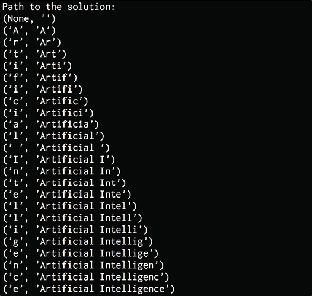
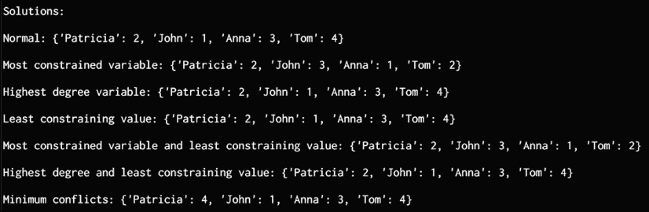
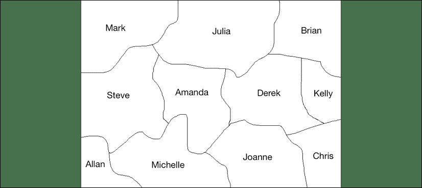
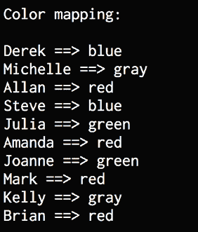
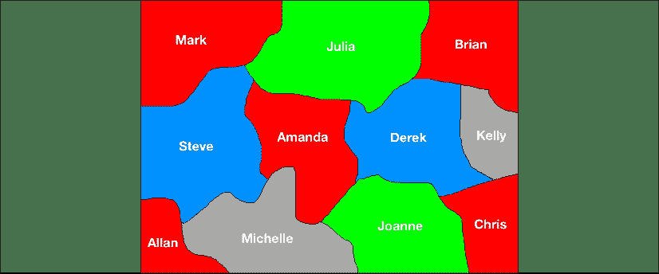
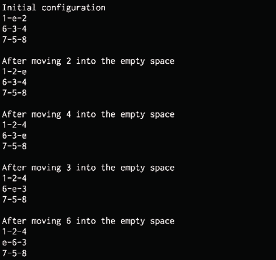
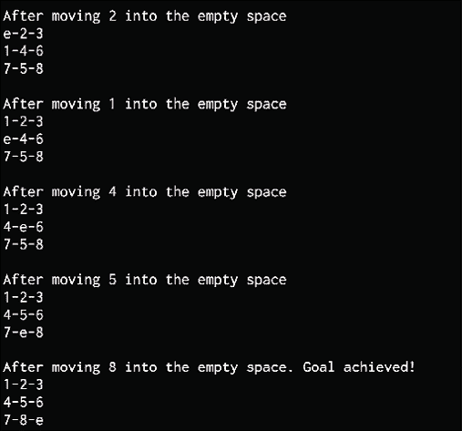

# 10 启发式搜索技术

在本章中，我们将学习启发式搜索技术。 启发式搜索技术用于搜索解决方案空间以得出答案。 使用指导搜索算法的试探法进行搜索。 这种启发式算法可使算法加快处理速度，否则将需要很长时间才能得出解决方案。

在本章结束时，您将了解以下内容：

*   什么是启发式搜索？
*   不知情还是知情搜索
*   约束满意度问题
*   本地搜索技术
*   模拟退火
*   使用贪婪搜索构造字符串
*   解决约束问题
*   解决区域着色问题
*   构建 8 难题求解器
*   构建一个迷宫求解器

# 启发式搜索是人工智能吗？

在第 2 章，“人工智能的基本用例”中，我们了解了 Pedro Domingos 定义的五个流派。 *符号主义者*流派是最“古老”的流派之一。 至少对我来说，这一事实不足为奇。 作为人类，我们尝试在所有事物中找到规则和模式。 不幸的是，世界有时是混乱的，并非所有事物都遵循简单的规则。

这就是为什么当我们没有秩序的世界时，其他流派出现来帮助我们的原因。 但是，当我们的搜索空间较小且域受到限制时，使用启发式，约束满足以及本章中介绍的其他技术对于这组问题很有用。 当组合的数量相对较少且组合爆炸受到限制时，这些技术很有用。 例如，当城市数量大约为 20 时，使用这些技术解决旅行商问题很简单。如果我们尝试对`n = 2000`求解相同的问题，则必须使用其他方法来解决。 不要探索整个空间，而只能给出结果的近似值。

# 什么是启发式搜索？

搜索和组织数据是人工智能中的重要主题。 有许多问题需要在解决方案领域内寻找答案。 对于给定的问题，有许多可能的解决方案，我们不知道哪个是正确的。 通过有效地组织数据，我们可以快速有效地寻找解决方案。

通常，解决给定问题的选项太多，以至于无法开发单个算法来找到确定的最佳解决方案。 同样，不可能通过所有解决方案，因为这过于昂贵。 在这种情况下，我们依靠经验法则，通过消除明显错误的选项来帮助我们缩小搜索范围。 这个经验法则称为，称为**启发式**。 使用启发式搜索指导搜索的方法称为**启发式搜索**。

启发式技术之所以强大，是因为它们可以加快过程。 即使启发式方法无法消除某些选项，也将有助于排序选项，以便可能首先提出更好的解决方案。 如前所述，启发式搜索在计算上可能会很昂贵。 现在，我们将学习如何使用*快捷方式*和*修剪*搜索树。

## 不知情或知情的搜索

如果您熟悉计算机科学，则可能听说过深度优先搜索（**DFS**），**广度优先搜索**（**BFS**），以及**统一成本搜索**（**UCS**）。 这些是搜索技术，其中通常用于图形上以获得解决方案。 这些是不知情的搜索示例。 他们不使用任何先验信息或规则来消除某些路径。 他们检查所有可能的路径并选择最佳路径。

另一方面，启发式搜索称为**通知搜索**，因为它使用先验信息或规则来消除不必要的路径。 不了解情况的搜索技术不会考虑目标。 不了解情况的搜索技术会盲目搜索，并且对最终解决方案没有先验知识。

在图问题中，启发式可以用来指导搜索。 例如，在每个节点处，我们可以定义一个启发式函数，该函数返回一个分数，该分数表示从当前节点到目标的路径成本估计。 通过定义此启发式函数，我们可以将正确的方向告知搜索技术以达到目标。 这将允许算法识别哪个邻居将导致目标。

我们需要注意，启发式搜索可能并不总是总是找到最佳解决方案。 这是因为我们不是在探索每种可能性，而是在依靠启发式方法。 搜索可以确保在合理的时间内找到一个好的解决方案，但这是我们对实际解决方案的期望。 在现实世界中，我们需要快速有效的解决方案。 启发式搜索通过快速找到合理的解决方案来提供有效的解决方案。 它们用于无法以其他任何方式解决问题或需要很长时间才能解决的问题。 *修剪*树的另一种方法是利用数据固有的约束。 在下一部分中，我们将学习更多利用这些约束的修剪技术。

# 约束满意度问题

有许多必须在约束条件下解决的问题。 这些约束基本上是解决问题的过程中不能违反的条件。

这些问题称为**约束满意度问题**（**CSP**）。

为了获得一些直观的理解，让我们快速看一下数独拼图的示例部分。 数独游戏是我们不能在水平线，垂直线或同一方块中两次拥有相同的数字。 这是数独板的示例：


图 1：数独板的示例

使用约束的满意度和数独的规则，我们可以快速确定尝试使用哪些数字以及不尝试解决该难题的数字。 例如，在这个方块中：


图 2：考虑数独问题

如果我们不使用 CSP，则一种暴力方法是尝试插槽中所有数字的组合，然后检查规则是否适用。 例如，我们的第一个尝试可能是用数字 1 填充所有正方形，然后检查结果。

使用 CSP，我们可以在尝试之前对它们进行修剪。

让我们来看看我们认为数字应该是红色突出显示的正方形的含义。 我们知道该数字不能为 1、6、8 或 9，因为这些数字已经存在于正方形中。 我们也知道它不能为 2 或 7，因为这些数字存在于水平线中。 我们也知道它不能是 3 或 4，因为这些数字已经在垂直线上。 这给我们留下了唯一的可能性，数字应该是 5。

CSP 是数学上的问题，定义为一组必须满足一些约束的变量。 当我们得出最终解决方案时，变量的状态必须服从所有约束。 该技术将涉及给定问题的实体表示为变量上固定数量的约束的集合。 这些变量需要通过约束满足方法来解决。

这些问题需要在合理的时间内解决启发式方法和其他搜索技术的问题。 在这种情况下，我们将使用约束满足技术来解决有限域上的问题。 有限域由有限数量的元素组成。 由于我们正在处理有限域，因此我们可以使用搜索技术来获得解决方案。 为了进一步了解 CSP，我们现在将学习如何使用本地搜索技术来解决 CSP 问题。

# 本地搜索技术

本地搜索是解决 CSP 的一种方法。 它会不断优化解决方案，直到满足所有约束条件为止。 迭代地不断更新变量，直到我们到达目的地。 这些算法会在过程的每个步骤中修改值，使我们更接近目标。 在解决方案空间中，更新的值比先前的值更接近目标。 因此，这被称为本地搜索。

局部搜索算法是一种启发式搜索算法。 这些算法使用一个函数来计算每次更新的质量。 例如，它可以计算当前更新违反的约束数量，也可以查看更新如何影响到目标的距离。 这称为分配成本。 本地搜索的总体目标是在每个步骤中找到最小的成本更新。

爬山是流行的本地搜索技术。 它使用一种启发式函数来衡量当前状态和目标之间的差异。 当我们开始时，它将检查状态是否是最终目标。 如果是，则停止。 如果不是，则选择更新并生成新状态。 如果它比当前状态更接近目标，那么它将成为当前状态。 如果不是，它将忽略它并继续该过程，直到检查所有可能的更新。 它基本上是爬山直到到达山顶。


图 3： 爬山

## 模拟退火

**模拟退火**是本地搜索的一种，也是一种随机搜索技术。 随机搜索技术广泛用于各种领域，例如机器人技术，化学，制造，医学和经济学。 随机算法用于解决许多现实问题：我们可以执行诸如优化机器人设计，确定工厂中自动控制的时序策略以及规划交通量之类的事情。

模拟退火是爬山技术的一种变化。 爬山的主要问题之一是，它最终会爬上错误的山麓小丘。 这意味着它被卡在局部最大值中。 因此，在做出任何攀登决定之前，最好先检查一下整个空间。 为了实现这一目标，首先对整个空间进行探索以了解其外观。 这有助于我们避免陷入高原或局部最大值。

在模拟退火中，我们重新构造了问题并针对最小化（而不是最大化）进行了求解。 因此，我们现在正下降到山谷中，而不是爬山。 我们几乎在做相同的事情，但是方式不同。

我们使用目标函数来指导搜索。 该目标函数用作试探法。

之所以将其称为*模拟退火*是因为它源自冶金过程。 在此过程中，我们首先加热金属，使原子扩散到金属中，然后冷却直到达到原子结构安排所需的最佳状态。 通常，这是为了改变金属的物理特性，使其变得更软，更容易加工。

我们冷却系统的速率称为，**退火时间表**。 冷却速度很重要，因为它会直接影响结果。 在金属的现实世界中，如果冷却速度过快，则最终会过快地陷入非理想状态（原子结构）。 例如，如果将加热的金属放入冷水中，它最终会很快沉降到不需要的结构中，从而使金属变脆。

如果冷却速度缓慢且可控，则金属就有机会达到最佳原子结构，从而获得所需的物理表现。 在这种情况下，迅速采取大步向任何山丘进发的机会较低。 由于冷却速度很慢，因此需要花费一些时间才能进入最佳状态。 可以用数据完成类似的操作。

我们首先评估当前的状态，看看它是否已达到目标。 如果有，那么我们停止。 如果不是，则将最佳状态变量设置为当前状态。 然后，我们定义一个退火计划，以控制其下降到谷底的速度。 计算当前状态和新状态之间的差异。 如果新状态不是更好，则以一定的预定义概率将其设置为当前状态。 这是使用随机数生成器并根据阈值确定的。 如果它高于阈值，那么我们将最佳状态设置为该状态。 基于此，根据节点数更新退火计划。 我们一直这样做，直到达到目标。 另一个本地搜索技术是贪婪搜索算法。 我们将在下一部分中详细了解。

# 使用贪婪搜索构造字符串

**贪婪搜索**是一种算法范式，它在每​​个阶段进行局部最优选择，以便找到全局最优值。 但是在许多问题中，贪婪算法无法产生全局最优解。 使用贪婪算法的一个优点是它们可以在合理的时间内产生一个近似解。 希望该近似解可以合理地接近全局最优解。

贪婪算法不会在搜索过程中基于新的信息来优化的解决方案。 例如，假设您正在计划一次公路旅行，并且想要采取最佳路线。 如果您使用贪婪算法来规划路线，则可能会要求您选择距离较短但可能会花费更多时间的路线。 在短期内，这也可能会导致您走上更快的路径，但稍后可能会导致交通拥堵。 发生这种情况是因为贪婪算法只看到下一步，而没有全局最优的最终解决方案。

让我们看看如何使用贪婪搜索解决问题。 在此问题中，我们将尝试根据字母重新创建输入字符串。 我们将要求算法搜索解决方案空间并构建解决方案的路径。

在本章中，我们将使用名为`simpleai`的包。 它包含各种例程，这些例程可用于使用启发式搜索技术构建解决方案。 可在[这个页面](https://github.com/simpleai-team/simpleai)上获得。 为了使它在 Python3 中工作，我们需要对源代码进行一些更改。随同本书的代码一起提供了一个名为`simpleai.zip`的文件。 将此文件解压缩到名为`simpleai`的文件夹中。 此文件夹包含对原始库的所有必要更改，以使其能够在 Python3 中工作。将`simpleai`文件夹与您的代码位于同一文件夹中，你将能够顺利运行你的代码。

创建一个新的 Python 文件并导入以下包：

```py
import argparse
import simpleai.search as ss 
```

定义一个函数来解析输入参数：

```py
def build_arg_parser():
    parser = argparse.ArgumentParser(description='Creates the input string \
            using the greedy algorithm')
    parser.add_argument("--input-string", dest="input_string", required=True,
            help="Input string")
    parser.add_argument("--initial-state", dest="initial_state", required=False,
            default='', help="Starting point for the search") 
    return parser 
```

创建一个包含解决问题所需方法的类。 此类继承了库中可用的`SearchProblem`类。 需要重写一些方法来解决当前的问题。 第一种方法`set_target`是定义目标字符串的自定义方法：

```py
class CustomProblem(ss.SearchProblem):
    def set_target(self, target_string):
        self.target_string = target_string 
```

这些动作是`SearchProblem`随附的一种方法，需要重写。 它负责朝着目标采取正确的步骤。 如果当前字符串的长度小于目标字符串的长度，它将返回可能的字母列表以供选择。 如果没有，它将返回一个空字符串：

```py
 # Check the current state and take the right action
    def actions(self, cur_state):
        if len(cur_state) < len(self.target_string):
            alphabets = 'abcdefghijklmnopqrstuvwxyz'
            return list(alphabets + ' ' + alphabets.upper())
        else:
            return [] 
```

现在创建一个方法，通过将当前字符串和需要采取的措施连接起来来计算结果。 此方法随附`SearchProblem`，我们将其覆盖：

```py
 # Concatenate state and action to get the result
    def result(self, cur_state, action):
        return cur_state + action 
```

方法`is_goal`是`SearchProblem`的一部分，用于检查是否已达到目标：

```py
 # Check if goal has been achieved 
    def is_goal(self, cur_state):
        return cur_state == self.target_string 
```

方法`heuristic`也是`SearchProblem`的一部分，我们需要重写它。 定义了一种启发式方法，即将用于解决该问题。 执行计算以查看目标有多远，并将其用作启发将其引导至目标：

```py
 # Define the heuristic that will be used 
    def heuristic(self, cur_state):
        # Compare current string with target string 
        dist = sum([1 if cur_state[i] != self.target_string[i] else 0 
                    for i in range(len(cur_state))]) 
```

```py
 # Difference between the lengths
        diff = len(self.target_string) - len(cur_state)
        return dist + diff 
```

初始化输入参数：

```py
if __name__=='__main__':
    args = build_arg_parser().parse_args() 
```

初始化`CustomProblem`对象：

```py
 # Initialize the object 
    problem = CustomProblem() 
```

设置起点和我们要实现的目标：

```py
 # Set target string and initial state 
    problem.set_target(args.input_string) 
    problem.initial_state = args.initial_state 
```

运行求解器：

```py
 # Solve the problem
    output = ss.greedy(problem) 
```

打印解决方案的路径：

```py
 print('\nTarget string:', args.input_string) 
    print('\nPath to the solution:')
    for item in output.path(): 
        print(item) 
```

完整代码在文件`greedy_search.py`中给出。 如果您以空的初始状态运行代码：

```py
$ python3 greedy_search.py --input-string 'Artificial Intelligence' --initial-state '' 
```

您将获得以下输出：



图 4：以空的初始状态运行时的代码输出

如果您以非空的起点运行代码：

```py
$ python3 greedy_search.py --input-string 'Artificial Intelligence with Python' --initial-state 'Artificial Inte' 
```

您将获得以下输出：


图 5：以非空初始状态运行时的代码输出

现在我们已经涵盖了一些流行的搜索技术，我们将继续使用这些搜索算法来解决一些实际问题。

# 解决带约束的问题

我们已经讨论了如何制定 CSP。 让我们将应用于实际问题。 在此问题中，我们有一个名称列表，每个名称可以采用一组固定的值。 这些人之间还存在一系列需要满足的约束。 让我们来看看如何做。

创建一个新的 Python 文件并导入以下包：

```py
from simpleai.search import CspProblem, backtrack, \
        min_conflicts, MOST_CONSTRAINED_VARIABLE, \
        HIGHEST_DEGREE_VARIABLE, LEAST_CONSTRAINING_VALUE 
```

定义约束，该约束指定输入列表中的所有变量应具有唯一值：

```py
# Constraint that expects all the different variables 
# to have different values
def constraint_unique(variables, values):
    # Check if all the values are unique
    return len(values) == len(set(values)) 
```

定义约束，该约束指定第一个变量应大于第二个变量：

```py
# Constraint that specifies that one variable
# should be bigger than other
def constraint_bigger(variables, values):
    return values[0] > values[1] 
```

定义指定的约束，如果第一个变量为奇数，则第二个变量应为偶数，反之亦然：

```py
# Constraint that specifies that there should be
# one odd and one even variables in the two variables
def constraint_odd_even(variables, values):
    # If first variable is even, then second should
    # be odd and vice versa
    if values[0] % 2 == 0:
        return values[1] % 2 == 1 
    else:
        return values[1] % 2 == 0 
```

定义`main`函数并定义变量：

```py
if __name__=='__main__':
    variables = ('John', 'Anna', 'Tom', 'Patricia') 
```

定义每个变量可以采用的值列表：

```py
 domains = {
        'John': [1, 2, 3],
        'Anna': [1, 3],
        'Tom': [2, 4],
        'Patricia': [2, 3, 4],
    } 
```

定义各种方案的约束。 在这种情况下，我们指定了以下三个约束：

*   约翰，安娜和汤姆应该有不同的值
*   汤姆的值应大于安娜的值
*   如果 John 的值是奇数，则 Patricia 的值应该是偶数，反之亦然

使用以下代码：

```py
 constraints = [
        (('John', 'Anna', 'Tom'), constraint_unique),
        (('Tom', 'Anna'), constraint_bigger),
        (('John', 'Patricia'), constraint_odd_even),
    ] 
```

使用前面的变量和约束来初始化`CspProblem`对象：

```py
 problem = CspProblem(variables, domains, constraints) 
```

计算解决方案并打印：

```py
 print('\nSolutions:\n\nNormal:', backtrack(problem)) 
```

使用和`MOST_CONSTRAINED_VARIABLE`启发式计算解决方案：

```py
 print('\nMost constrained variable:', backtrack(problem,
            variable_heuristic=MOST_CONSTRAINED_VARIABLE)) 
```

使用`HIGHEST_DEGREE_VARIABLE`启发式计算解决方案：

```py
 print('\nHighest degree variable:', backtrack(problem, 
            variable_heuristic=HIGHEST_DEGREE_VARIABLE)) 
```

使用`LEAST_CONSTRAINING_VALUE`启发式计算解决方案：

```py
 print('\nLeast constraining value:', backtrack(problem, 
            value_heuristic=LEAST_CONSTRAINING_VALUE)) 
```

使用`MOST_CONSTRAINED_VARIABLE`变量启发式和`LEAST_CONSTRAINING_VALUE`值启发式计算解决方案：

```py
 print('\nMost constrained variable and least constraining value:',
            backtrack(problem, variable_heuristic=MOST_CONSTRAINED_VARIABLE, 
            value_heuristic=LEAST_CONSTRAINING_VALUE)) 
```

使用`HIGHEST_DEGREE_VARIABLE`变量启发式和`LEAST_CONSTRAINING_VALUE`值启发式计算解决方案：

```py
 print('\nHighest degree and least constraining value:', 
            backtrack(problem, variable_heuristic=HIGHEST_DEGREE_VARIABLE, 
            value_heuristic=LEAST_CONSTRAINING_VALUE)) 
```

使用最小冲突启发式计算解决方案：

```py
print('\nMinimum conflicts:', min_conflicts(problem)) 
```

完整代码为文件`constrained_problem.py`中提供的。 如果运行，则将得到以下输出：



图 6：以最小冲突启发式计算解决方案

您可以检查约束条件以查看解决方案是否满足所有这些约束条件。

# 解决区域着色问题

让我们使用约束满足框架来解决区域着色问题。 考虑以下屏幕截图：



图 7：区域着色问题的框架

在上图中，我们有一些区域用名称标记。 目标是用四种颜色进行着色，以使相邻区域都不具有相同的颜色。

创建一个新的 Python 文件并导入以下包：

```py
from simpleai.search import CspProblem, backtrack 
```

定义指定值应该不同的约束：

```py
# Define the function that imposes the constraint 
# that neighbors should be different
def constraint_func(names, values):
    return values[0] != values[1] 
```

定义`main`函数并指定名称列表：

```py
if __name__=='__main__':
    # Specify the variables
    names = ('Mark', 'Julia', 'Steve', 'Amanda', 'Brian',
            'Joanne', 'Derek', 'Allan', 'Michelle', 'Kelly') 
```

定义可能的颜色列表：

```py
 # Define the possible colors
    colors = dict((name, ['red', 'green', 'blue', 'gray']) for name in names) 
```

我们需要将地图信息转换为该算法可以理解的信息。 让我们通过指定彼此相邻的人员列表来定义约束：

```py
 # Define the constraints
    constraints = [
        (('Mark', 'Julia'), constraint_func),
        (('Mark', 'Steve'), constraint_func),
        (('Julia', 'Steve'), constraint_func),
        (('Julia', 'Amanda'), constraint_func),
        (('Julia', 'Derek'), constraint_func),
        (('Julia', 'Brian'), constraint_func),
        (('Steve', 'Amanda'), constraint_func),
        (('Steve', 'Allan'), constraint_func),
        (('Steve', 'Michelle'), constraint_func),
        (('Amanda', 'Michelle'), constraint_func),
        (('Amanda', 'Joanne'), constraint_func),
        (('Amanda', 'Derek'), constraint_func),
        (('Brian', 'Derek'), constraint_func),
        (('Brian', 'Kelly'), constraint_func),
        (('Joanne', 'Michelle'), constraint_func),
        (('Joanne', 'Amanda'), constraint_func),
        (('Joanne', 'Derek'), constraint_func),
        (('Joanne', 'Kelly'), constraint_func),
        (('Derek', 'Kelly'), constraint_func),
    ] 
```

使用变量和约束来初始化对象：

```py
 # Solve the problem
    problem = CspProblem(names, colors, constraints) 
```

解决问题并打印解决方案：

```py
 # Print the solution
    output = backtrack(problem) 
    print('\nColor mapping:\n') 
    for k, v in output.items():
        print(k, '==>', v) 
```

完整代码为文件`coloring.py`中提供的。 如果运行代码，将得到以下输出：



图 8：颜色映射输出

如果根据此输出为区域着色，将获得以下机翼：



图 9：解决区域着色问题

您可以检查没有两个相邻的区域具有相同的颜色。

# 构建 8 拼图求解器

8 拼图是 15 拼图的变体。 您可以在[这个页面](https://en.wikipedia.org/wiki/15_puzzle)上进行检查。 您将看到一个随机的网格，目标是将其恢复为原始的有序配置。 您可以在[这个页面](http://mypuzzle.org/sliding)上玩游戏以熟悉。

我们将使用`A*`算法解决此问题。 它是一种算法，用于在图中找到解决方案的路径。 该算法是 **Dijkstra 算法**和贪婪最佳优先搜索的组合。 `A*`算法不会盲目猜测下一步该怎么做，而是选择看起来最有前途的算法。 在每个节点上，生成所有可能性的列表，然后选择达到目标所需的最低成本的可能性。

让我们看看如何定义成本函数。 在每个节点上，都需要计算成本。 该成本基本上是两个成本的总和-第一个成本是到达当前节点的成本，第二个成本是从当前节点达到目标的成本。

我们将此求和用作启发式方法。 如我们所见，第二笔费用基本上是不理想的估计。 如果是完美的，那么`A*`算法将很快到达解决方案。 但这不是通常的情况。 找到解决方案的最佳路径需要花费一些时间。 `A*`有效地找到最佳路径，并且是其中最流行的技术之一。

让我们使用`A*`算法来构建 8 难题求解器。 这是`simpleai`库中提供的解决方案的变体。 创建一个新的 Python 文件并导入以下包：

```py
from simpleai.search import astar, SearchProblem 
```

定义一个类，其中包含解决 8 难题的方法：

```py
# Class containing methods to solve the puzzle 
class PuzzleSolver(SearchProblem): 
```

覆盖`actions`方法以使与当前问题保持一致：

```py
 # Action method to get the list of the possible
    # numbers that can be moved into the empty space 
    def actions(self, cur_state):
        rows = string_to_list(cur_state)
        row_empty, col_empty = get_location(rows, 'e') 
```

检查空白区域的位置并创建新动作：

```py
 actions = []
        if row_empty > 0:
            actions.append(rows[row_empty - 1][col_empty])
        if row_empty < 2:
            actions.append(rows[row_empty + 1][col_empty])
        if col_empty > 0:
            actions.append(rows[row_empty][col_empty - 1])
        if col_empty < 2:
            actions.append(rows[row_empty][col_empty + 1])
        return actions 
```

覆盖`result`方法。 将字符串转换为列表，然后提取空白区域的位置。 通过更新位置生成结果：

```py
 # Return the resulting state after moving 
    # a piece to the empty space 
    def result(self, state, action):
        rows = string_to_list(state)
        row_empty, col_empty = get_location(rows, 'e') 
        row_new, col_new = get_location(rows, action)
        rows[row_empty][col_empty], rows[row_new][col_new] = \
                rows[row_new][col_new], rows[row_empty][col_empty]
        return list_to_string(rows) 
```

检查是否达到目标：

```py
 # Returns true if a state is the goal state 
    def is_goal(self, state):
        return state == GOAL 
```

定义`heuristic`方法。 我们将使用启发式算法，通过曼哈顿距离计算当前状态与目标状态之间的距离：

```py
 # Returns an estimate of the distance from a state to 
    # the goal using the manhattan distance
    def heuristic(self, state):
        rows = string_to_list(state) 
```

```py
 distance = 0 
```

计算距离：

```py
 for number in '12345678e':
            row_new, col_new = get_location(rows, number) 
            row_new_goal, col_new_goal = goal_positions[number]
            distance += abs(row_new - row_new_goal) + abs(col_new - col_new_goal) 
```

```py
 return distance 
```

定义一个函数以将列表转换为字符串：

```py
# Convert list to string
def list_to_string(input_list):
    return '\n'.join(['-'.join(x) for x in input_list]) 
```

定义一个将字符串转换为列表的函数：

```py
# Convert string to list
def string_to_list(input_string): 
    return [x.split('-') for x in input_string.split('\n')] 
```

定义一个函数以获取给定元素在网格中的位置：

```py
# Find the 2D location of the input element 
def get_location(rows, input_element):
    for i, row in enumerate(rows): 
        for j, item in enumerate(row):
            if item == input_element:
                return i, j 
```

定义我们想要实现的初始状态和最终目标：

```py
# Final result that we want to achieve
GOAL = '''1-2-3
4-5-6
7-8-e''' 
```

```py
# Starting point
INITIAL = '''1-e-2
6-3-4
7-5-8''' 
```

通过创建变量来跟踪每件作品的目标位置：

```py
# Create a cache for the goal position of each piece
goal_positions = {}
rows_goal = string_to_list(GOAL)
for number in '12345678e':
    goal_positions[number] = get_location(rows_goal, number) 
```

使用我们先前定义的初始状态创建`A*`求解器对象，并提取结果：

```py
# Create the solver object
result = astar(PuzzleSolver(INITIAL)) 
```

打印解决方案：

```py
# Print the results
for i, (action, state) in enumerate(result.path()):
    print()
    if action == None:
        print('Initial configuration')
    elif i == len(result.path()) - 1:
        print('After moving', action, 'into the empty space. Goal achieved!')
    else:
        print('After moving', action, 'into the empty space') 
```

```py
 print(state) 
```

完整代码在文件`puzzle.py`中给出。 如果运行代码，将得到很长的输出。

它将按以下方式启动：



图 10：PuzzleSolver 输出

如果向下滚动，您将看到为解决方案而采取的步骤。 最后，您将看到以下内容：



图 11：PuzzleSolver 输出的结尾-已实现目标！

如您所见，目标已实现，难题得以解决。

# 建立迷宫求解器

让我们使用`A*`算法来解决迷宫问题。 考虑下图：


图 12：迷宫问题的示例

`#`符号表示障碍物。`o`代表起点，`x`代表目标。 目的是找到从起点到终点的最短路径。 让我们看看如何在 Python 中做到这一点。 以下解决方案是`simpleai`库中提供的解决方案的变体。 创建一个新的 Python 文件并导入以下包：

```py
import math
from simpleai.search import SearchProblem, astar 
```

创建一个包含解决问题所需方法的类：

```py
# Class containing the methods to solve the maze 
class MazeSolver(SearchProblem): 
```

定义初始化方法：

```py
 # Initialize the class
    def __init__(self, board):
        self.board = board
        self.goal = (0, 0) 
```

提取初始位置和最终位置：

```py
 for y in range(len(self.board)):
            for x in range(len(self.board[y])):
                if self.board[y][x].lower() == "o":
                    self.initial = (x, y)
                elif self.board[y][x].lower() == "x":
                    self.goal = (x, y) 
```

```py
 super(MazeSolver, self).__init__(initial_state=self.initial) 
```

覆盖`actions`方法。 在每个位置，我们需要检查前往相邻单元的成本，然后附加所有可能的操作。 如果相邻单元被阻塞，则不考虑该操作：

```py
 # Define the method that takes actions 
    # to arrive at the solution
    def actions(self, state):
        actions = []
        for action in COSTS.keys():
            newx, newy = self.result(state, action) 
            if self.board[newy][newx] != "#":
            actions.append(action) 
```

```py
 return actions 
```

覆盖`result`方法。 根据当前状态和输入操作，更新`x`和`y`坐标：

```py
 # Update the state based on the action 
    def result(self, state, action):
        x, y = state 
```

```py
 if action.count("up"):
            y -= 1
        if action.count("down"):
            y += 1
        if action.count("left"):
            x -= 1
        if action.count("right"):
            x += 1 
```

```py
 new_state = (x, y) 
```

```py
 return new_state 
```

检查我们是否已经达到目标：

```py
 # Check if we have reached the goal
    def is_goal(self, state):
        return state == self.goal 
```

我们需要定义`cost`函数。 这是移动到相邻单元的成本，并且垂直/水平和对角线移动是不同的。 我们将在以后定义这些：

```py
 # Compute the cost of taking an action
    def cost(self, state, action, state2):
        return COSTS[action] 
```

定义将使用的试探法。 在这种情况下，我们将使用欧几里得距离：

```py
 # Heuristic that we use to arrive at the solution 
    def heuristic(self, state):
        x, y = state
        gx, gy = self.goal 
```

```py
 return math.sqrt((x - gx) ** 2 + (y - gy) ** 2) 
```

定义`main`函数并定义我们前面讨论的映射：

```py
if __name__ == "__main__":
    # Define the map
    MAP = """
    ##############################
    #         #              #   #
    # ####    ########       #   #
    #  o #    #              #   #
    #    ###     #####  ######   #
    #      #   ###   #           #
    #      #     #   #  #  #   ###
    #     #####    #    #  # x   #
    #              #       #     #
    ##############################
    """ 
```

将地图信息转换为列表：

```py
 # Convert map to a list 
    print(MAP)
    MAP = [list(x) for x in MAP.split("\n") if x] 
```

定义在地图上移动的成本。 对角线移动比水平或垂直移动更昂贵：

```py
 # Define cost of moving around the map
    cost_regular = 1.0
    cost_diagonal = 1.7 
```

将成本分配给相应的移动：

```py
 # Create the cost dictionary 
    COSTS = {
        "up": cost_regular,
        "down": cost_regular,
        "left": cost_regular,
        "right": cost_regular,
        "up left": cost_diagonal,
        "up right": cost_diagonal,
        "down left": cost_diagonal,
        "down right": cost_diagonal,
    } 
```

使用先前定义的自定义类创建一个求解器对象：

```py
 # Create maze solver object
    problem = MazeSolver(MAP) 
```

在地图上运行求解器并提取结果：

```py
 # Run the solver
    result = astar(problem, graph_search=True) 
```

从结果中提取路径：

```py
 # Extract the path
    path = [x[1] for x in result.path()] 
```

打印输出：

```py
 # Print the result
    print()
    for y in range(len(MAP)):
        for x in range(len(MAP[y])):
            if (x, y) == problem.initial:
                print('o', end='')
            elif (x, y) == problem.goal:
                print('x', end='')
            elif (x, y) in path:
                print('·', end='')
            else:
                print(MAP[y][x], end='') 
```

```py
 print() 
```

完整代码在文件`maze.py`中给出。 如果运行代码，将得到以下输出：


图 13：迷宫问题的解决方案

如您所见，算法留下了一点点的痕迹，并找到了从起点`o`到终点`x`的解。 至此，本章最后部分总结了`A*`算法的迷宫解决方案。

# 总结

在本章中，我们学习了启发式搜索技术的工作原理。 我们讨论了不知情和知情搜索之间的区别。 我们了解了约束满足问题，以及如何使用此范式解决问题。 我们讨论了本地搜索技术如何工作以及为什么在实践中使用了模拟退火。 我们对字符串问题实现了贪婪的搜索。 我们使用 CSP 公式解决了一个问题。

我们使用这种方法来解决区域着色问题。 然后，我们讨论了`A*`算法及其如何用于找到解决方案的最佳路径。 我们用它来构建 8 难题求解器和迷宫求解器。 在下一章中，我们将讨论遗传算法及其如何用于解决现实世界中的问题。