# 入门

计算机视觉是理解或操纵图像和视频的科学。 计算机视觉具有许多应用，包括自动驾驶，工业检查和增强现实。 深度学习在计算机视觉中的使用可以分为多个类别：图像和视频中的分类，检测，分割和生成。 在本书中，您将学习如何为计算机视觉应用程序训练深度学习模型并将其部署在多个平台上。 我们将在本书中使用 **TensorFlow** ，这是一个用于深入学习的流行 python 库，用于示例。 在本章中，我们将介绍以下主题：

*   深度学习的基础知识和词汇
*   深度学习如何满足计算机视觉？
*   设置将用于本书所涵盖示例的开发环境
*   体验 TensorFlow 及其强大的工具，例如 TensorBoard 和 TensorFlow Serving

# 了解深度学习

计算机视觉作为一个领域有着悠久的历史。 随着深度学习的出现，计算机视觉已被证明可用于各种应用。 深度学习是来自**人工神经网络**（ **ANN** ）的技术的集合，这是机器学习的一个分支。 人工神经网络以人脑为模型。 有彼此链接的节点，它们彼此传递信息。 在以下各节中，我们将通过了解常用的基本术语来详细讨论深度学习的工作原理。

# 感知器

人工神经元或感知器接受多个输入并执行加权求和以产生输出。 感知器的重量是在训练过程中确定的，并基于训练数据。 以下是感知器的 图：

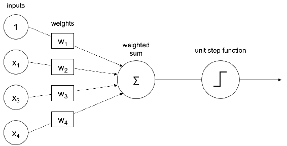

如上图所示，对输入进行加权和求和。 然后，对于二进制分类问题，该总和然后通过单位步长函数传递。 感知器只能通过从示例中学习权重来学习简单功能。 学习权重的过程称为训练。 可以通过基于梯度的方法对感知器进行训练，这将在后面的部分中进行介绍。 感知器的输出可以通过 `activation` 函数或 `transfer` 函数传递，这将在下一部分中进行说明。

# 激活功能

`activation`函数使**神经网络**成为非线性。 激活功能决定是否应触发感知器。 在训练激活期间，功能在调整梯度中起着重要作用。 下一节所示的`activation`功能（如 S 型）会衰减较大幅度的值。 `activation`函数的这种非线性行为为学习复杂函数提供了深层网络。 `activation`的大多数功能是连续和微分功能，但整流单元为 0 除外。输入的每一个小变化，连续功能的输出都会有很小的变化。 微分函数在域中的每个点都有一个导数。

为了训练神经网络，功能必须是可微的。 以下是一些`activation`功能。

如果您不了解诸如连续性和可区分性之类的术语，请不要担心。 在各章中将变得更加清楚。

# 乙状结肠

Sigmoid 可以看作是平滑的阶跃函数，因此可以微分。 Sigmoid 可用于将任何值转换为概率，并可用于二进制分类。 S 型映射将输入映射到 0 到 1 范围内的值，如下图所示：

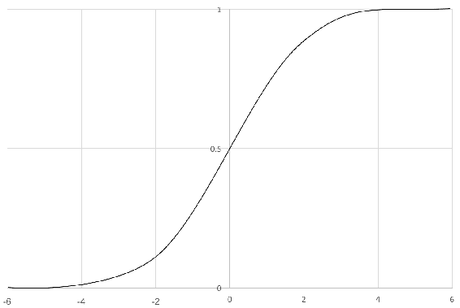

相对于 *X* 的 *Y* 值的变化将很小，因此，梯度将消失。 经过一番学习之后，变化可能很小。 在下一节中介绍的另一个称为`tanh`的激活函数是 S 型曲线的缩放比例版本，避免了梯度消失的问题。

# 双曲正切函数

双曲正切函数或 `tanh` 是 S 型曲线的缩放形式。 像乙状结肠一样，它是光滑且可区分的。 `tanh`将输入映射到-1 到 1 的值，如下图所示：

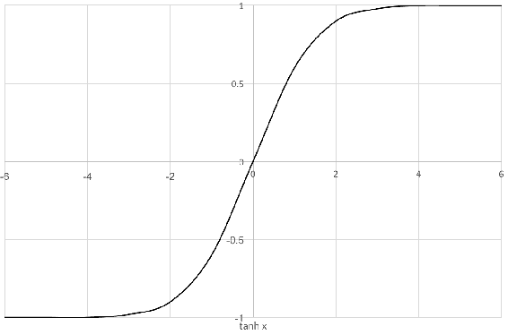

梯度比 S 形更稳定，因此减少了消失的梯度问题。 乙状结肠和`tanh`一直在发射，这使 ANN 变得很沉重。 下一节中介绍的**整流线性单元**（ **ReLU** ）激活功能通过不触发而避免了这种陷阱。

# 整流线性单位（ReLU）

ReLu 可以让大量数字通过。 这会使一些神经元陈旧，并且它们不会发射。 这增加了稀疏性，因此很好。 `ReLU`将输入 *x* 映射到最大值（ *0* ， *x* ），即，它们将负输入映射为 0，而正输入为 输出无任何变化，如下图所示：

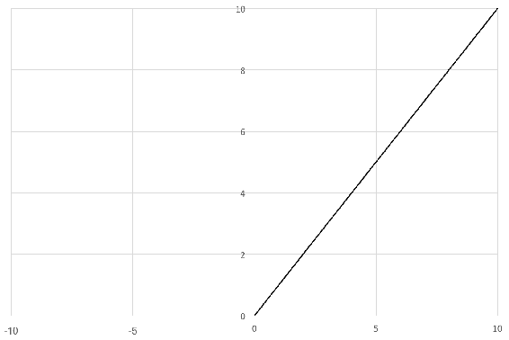

由于 ReLU 不会一直触发，因此可以更快地进行训练。 由于功能简单，因此在计算上最便宜。 选择`activation`功能在很大程度上取决于应用程序。 尽管如此，ReLU 在许多问题上都运行良好。 在下一节中，您将学习如何将几个感知器堆叠在一起，这些感知器可以学习比感知器更复杂的功能。

# 人工神经网络（ANN）

ANN 是感知器和[H​​TG0]功能的集合。 感知器连接形成隐藏的层或单元。 隐藏的单元形成了将低层空间中的输入层映射到输出层的非线性基础，这也称为人工神经网络。 ANN 是从输入到输出的映射。 该图是通过将输入与偏差进行加权相加来计算的。 权重和偏差值以及体系结构称为`model`。

训练过程确定这些权重和偏差的值。 在训练开始时，使用随机值初始化模型值。 通过使用损失函数将误差与基本事实进行对比来计算误差。 根据计算出的损耗，在每一步调整权重。 如果无法进一步减少错误，则停止训练。 训练过程会在训练过程中学习功能。 这些特征比原始图像更好地表示。 以下是人工神经网络或多层感知器的示意图：

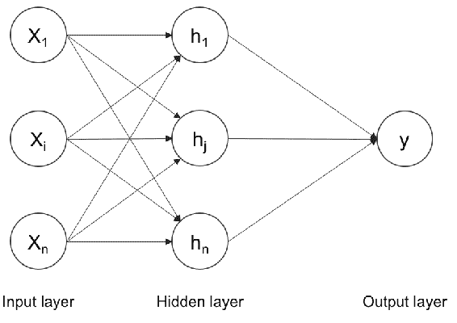

*x* 的多个输入通过感知器的隐藏层传递并求和。 通用逼近定理表明，这样的神经网络可以逼近任何函数。 隐藏层也可以称为密集层。 每个层都可以具有上一节中描述的`activation`功能之一。 可以根据问题选择隐藏层和感知器的数量。 还有更多的事情可以使此多层感知器适用于多类分类问题。 一个多类别的分类问题试图区分十多个类别。 我们将在以下各节中探讨这些术语。

# 一键编码

一次热编码是在出现分类问题时表示目标变量或类的一种方式。 目标变量可以从字符串标签转换为一键编码的向量。 一个热门向量在目标类别的索引处填充有 *1* ，但在其他所有地方填充有 *0* 。 例如，如果目标类别是猫和狗，则可以用[ *1* ， *0* ]和[ *0* ， *1* ]， 分别。 对于 1,000 个类别，一热向量的大小为 1,000 整数，全为零，但 *1* 。 它不假设目标变量的相似性。 通过在下一节中说明的一键编码和 softmax 的组合，可以在 ANN 中实现多类分类。

# 软最大

Softmax 是一种强制神经网络输出 1 之和的方法。因此，`softmax`函数的输出值可以视为概率分布的一部分。 这在多类分类问题中很有用。 Softmax 是一种`activation`函数，其特征是输出求和为 1。通过将输出除以所有其他值的总和，可以将输出转换为概率。 欧几里德距离可以在 softmax 概率和一键编码之间进行计算，以进行优化。 但是下一部分将说明的交叉熵是一个更好的成本函数，可以进行优化。

# 交叉熵

交叉熵比较 softmax 和一键编码输出之间的距离。 交叉熵是一种损失函数，必须将其误差降至最低。 神经网络估计每个类别给定数据的概率。 必须将概率最大化到正确的目标标签。 交叉熵是负对数概率的总和。 对数值用于数值稳定性。 最大化一个功能等同于最小化相同功能的负数。 在下一节中，我们将看到以下正则化方法，以避免 ANN 的过拟合：

*   退出
*   批量标准化
*   L1 和 L2 归一化

# 退出

辍学是规整神经网络以避免 ANN 过度拟合的有效方法。 在训练期间，辍学层通过随机删除隐藏的单元来破坏神经网络，如下图所示：

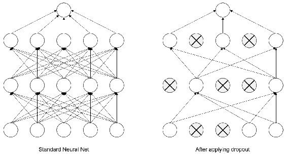

请注意如何随机训练神经元。 辍学也是组合多个神经网络的有效方法。 对于每个训练案例，我们随机选择一些隐藏的单元，以便最终为每个案例使用不同的体系结构。 这是装袋和模型平均的极端情况。 推断期间不应使用辍学层，因为没有必要。

# 批量标准化

批处理规范化或批处理规范可提高神经网络训练的稳定性和性能。 它将平均值为零且标准偏差为 1 的图层的输出归一化。这减少了过拟合，并使网络训练更快。 这对于训练复杂的神经网络非常有用。

# L1 和 L2 正则化

L1 惩罚权重的绝对值，并趋于使权重为零。 L2 惩罚权重的平方值，并且在训练过程中倾向于使权重更小。 两个正则化均假设权重较小的模型更好。

# 训练神经网络

训练 ANN 非常棘手，因为它包含多个要优化的参数。 权重的更新过程称为反向传播。 最小化错误的过程称为优化。 我们将在下一节中详细介绍这两个方面。

# 反向传播

反向传播算法通常用于训练人工神经网络。 权重根据计算的误差从后向更新，如下图所示：

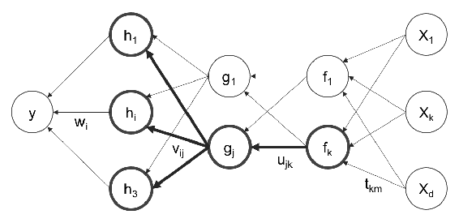

在计算了误差之后，可以使用梯度下降来计算权重更新，如下一节中所述。

# 梯度下降

梯度下降算法执行多维优化。 目标是达到全球最高水平。 梯度下降是许多机器学习模型中使用的一种流行的优化技术。 它用于改善或优化模型预测。 梯度下降的一种实现称为**随机梯度下降**（ **SGD** ），在神经网络中正变得越来越流行（在下一节中说明）。 优化涉及计算误差值并更改权重以实现最小误差。 找到最小值的方向是`loss`函数的梯度的负值。 下图定性显示了梯度下降过程：

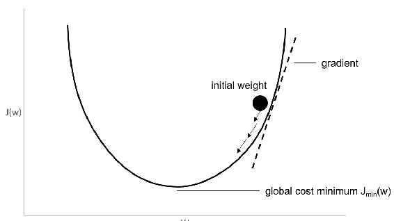

学习速度决定了每个步骤应该多大。 注意，具有非线性激活的 ANN 将具有局部最小值。 SGD 在实践中更好地用于优化非凸成本函数。

# 随机梯度下降

SGD 与梯度下降相同，区别在于 SGD 每次仅用于部分数据训练。 该参数称为小批量大小。 从理论上讲，甚至可以使用一个示例进行训练。 在实践中，最好尝试各种数字。 在下一部分中，我们将讨论比标准 ANN 在图像数据上更有效的卷积神经网络。

访问[这里](https://yihui.name/animation/example/grad-desc/)，可以很好地看到凸面和非凸面的梯度下降情况。

# 在 TensorFlow 游乐场玩

TensorFlow 游乐场是神经网络的交互式可视化。 访问[这里](http://playground.tensorflow.org/)，方法是通过更改参数来查看前面提到的术语如何协同工作。 这是操场的屏幕截图：

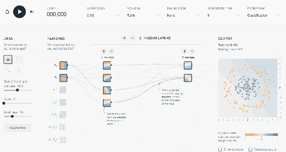

TensorFlow 游乐场中的仪表板

如前所示，读者可以更改学习率，激活，正则化，隐藏单元和层，以了解其如何影响训练过程。 您可以花费一些时间来调整参数，以直观了解神经网络如何处理各种数据。

# 卷积神经网络

**卷积神经网络**（ **CNN** ）与前面各节中描述的神经网络相似。 CNN 具有权重，偏差和通过非线性激活产生的输出。 规则的神经网络接受输入，并且神经元完全连接到下一层。 同一层中的神经元不共享任何连接。 如果我们对图像使用常规的神经网络，由于神经元数量众多，它们的大小将非常大，从而导致过拟合。 我们不能将其用于图像，因为图像尺寸较大。 增加模型大小，因为它需要大量的神经元。 可以将图像视为具有高度，宽度和深度尺寸的体积。 深度是图像的通道，它是红色，蓝色和绿色。 CNN 的神经元以体积方式排列，以利用体积。 每个图层都将输入体积转换为输出体积，如下图所示：

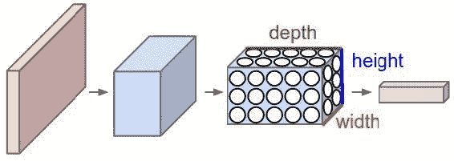

卷积神经网络滤波器通过变换进行编码。 学到的滤镜可以检测图像中的特征或图案。 层越深，图案越抽象。 一些分析表明，这些层具有检测边缘，角和图案的能力。 CNN 层中的可学习参数小于上一节中描述的密集层。

# 核心

内核是用于对图像进行卷积的参数卷积层。 卷积操作如下图所示：

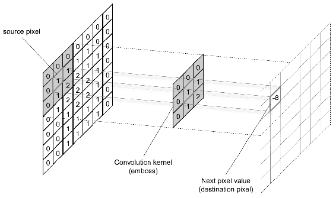

内核有两个参数，称为步幅和大小。 大小可以是矩形的任何尺寸。 步幅是每次移动的像素数。 长度为 1 的步幅产生几乎相同大小的图像，长度为 2 的步幅产生一半大小。 填充图像将有助于获得相同的输入大小。

# 最大池

池化层位于卷积层之间。 合并层通过采样减小了跨层图像的大小。 通过在窗口中选择最大值来完成采样。 窗口中的平均池平均值。 池化还可以作为一种正则化技术来避免过度拟合。 在功能的所有通道上进行池化。 合并也可以进行各种步骤。

窗口的大小是 CNN 接收场的量度。 下图显示了最大池化的示例：

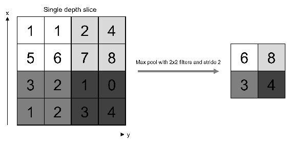

CNN 是任何计算机视觉深度学习模型中最重要的组成部分。 毫不夸张地说，没有 CNN，任何计算机都不可能拥有视觉。 在下一部分中，我们将讨论几个可用于一些应用程序的高级层。

访问[这里](https://www.youtube.com/watch?v=jajksuQW4mc)，以获取有关 CNN 和最大池操作的出色可视化。

# 递归神经网络（RNN）

**递归神经网络**（ **RNN** ）可以对顺序信息进行建模。 他们不假定数据点密集。 它们从一系列序列数据的先前数据的输出执行相同的任务。 这也可以被视为记忆。 RNN 无法记住更长的序列或更长的时间。 在培训过程中将其展开，如下图所示：

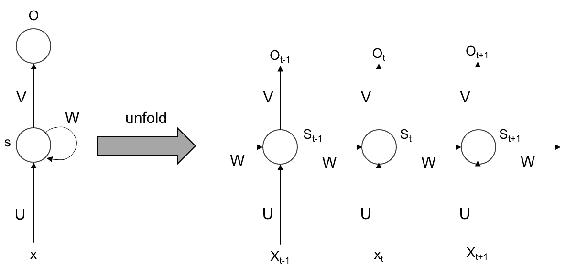

如上图所示，该步骤每次都展开和训练。 在反向传播期间，梯度会随着时间消失。 为了克服此问题，可以使用较长的短期记忆来记忆较长的时间。

# 长短期记忆（LSTM）

**长短期存储器**（ **LSTM** ）可以存储较长时间的信息，因此，它可以有效地捕获长期效率。 下图说明了如何设计 LSTM 单元：

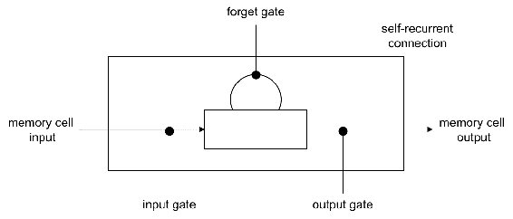

LSTM 有几个门：忘记，输入和输出。 忘记门保持信息先前的状态。 输入门使用输入更新当前状态。 输出门决定将信息传递到下一个状态。 忘记和保留重要内容的能力使 LSTM 可以在更长的时间内记住。 您已经学习了将在整本书中使用的深度学习词汇。 在下一节中，我们将了解如何在计算机视觉的背景下使用深度学习。

# 用于计算机视觉的深度学习

计算机视觉在计算机上实现了人类视觉的特性。 计算机可以是智能手机，无人机，闭路电视，MRI 扫描仪等形式，并带有各种感知传感器。 传感器产生数字形式的图像，必须由计算机解释。 下一部分将说明这种解释或智能的基本构成部分。 使用深度学习技术可以有效解决计算机视觉中出现的各种问题。

# 分类

图像分类是充满信心地用对象或概念标记整个图像的任务。 这些应用程序包括给定人脸图像的性别分类，识别宠物的类型，为照片添加标签等。 以下是此类分类任务的输出：

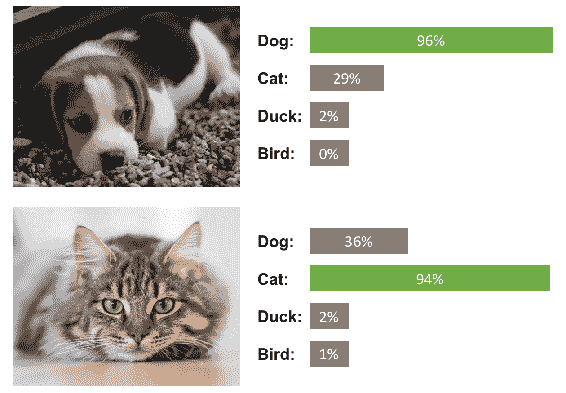

[第 2 章](../Text/02.html)， *图像分类*详细介绍了可用于分类任务的方法，在[第 3 章](../Text/03.html)和[HTG8 图像检索，我们使用分类模型对深度学习模型进行可视化并检索相似的图像。

# 检测或定位和细分

检测或定位是一项在图像中找到对象并使用边界框定位该对象的任务。 这项任务有许多应用，例如为自动驾驶汽车寻找行人和招牌。 下图是检测的示意图：

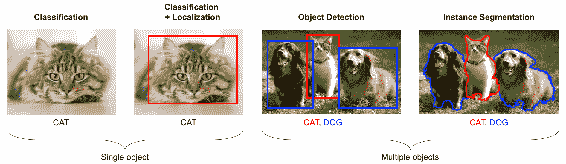

分割是进行像素分类的任务。 这样可以很好地分离对象。 这对于处理医学图像和卫星图像很有用。 更多示例和说明可以在[第 4 章](../Text/04.html)，对象检测和[第 5 章](../Text/05.html)，*图像分割*中找到。

# 相似学习

相似性学习是学习两个图像如何相似的过程。 可以基于语义含义在两个图像之间计算分数，如下图所示：

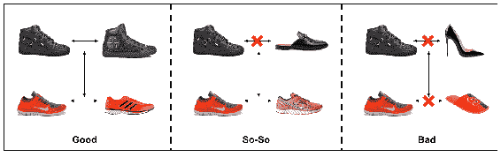

从发现相似产品到执行面部识别，此方法有多种应用。 [第 6 章](../Text/06.html)，*相似性学习*处理相似性学习技术。

# 图片字幕

图像标题是用文字描述图像的任务，如下所示：

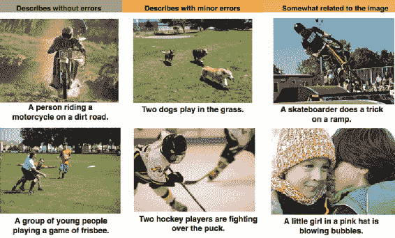

经 Vinyals 等人许可复制。

[第 8 章](../Text/07.html)，*图像字幕*详细介绍了图像字幕。 这是将**自然语言处理**（ **NLP** ）和计算机视觉技术相结合的独特情况。

# 生成模型

生成模型在生成图像时非常有趣。 以下是样式转换应用程序的示例，其中使用该图像的内容和其他图像的样式生成图像：

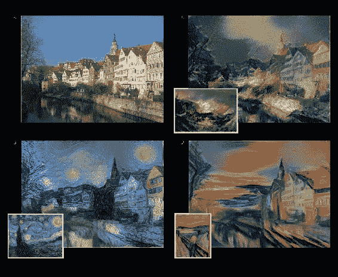

经 Gatys 等人许可复制。

可以出于其他目的生成图像，例如新的训练示例，超分辨率图像等。 [第 7 章](../Text/08.html)和*生成模型*详细介绍了生成模型。

# 视频分析

与以前的情况相比，视频分析处理的是整个视频，而不是图像。 它具有多种应用，例如运动跟踪，入侵检测和监视摄像机。 [第 9 章](../Text/09.html)和*视频分类*处理特定于视频的应用程序。 时间数据的新维度带来了许多有趣的应用。 在下一节中，我们将看到如何设置开发环境。

# 开发环境设置

在本节中，我们将设置编程环境，该环境对于遵循本书其余部分中的示例非常有用。 读者可以选择以下操作系统：

*   **开发操作系统**（ **OS** ），例如 Mac，Ubuntu 或 Windows
*   **部署操作系统**（例如 Mac，Windows，Android，iO 或 Ubuntu）安装在云平台（例如 **Amazon Web Services** （ **AWS** ）， **云平台**（ **GCP** ），Azure，Tegra，Raspberry Pi

无论使用哪种平台，本书中开发的所有代码均应运行无任何问题。 在本章中，我们将介绍开发环境的安装过程。 在[第 10 章](../Text/10.html)和*部署*中，我们将介绍在各种其他环境（例如 AWS，GCP，Azure，Tegra 和 Raspberry Pi）中的部署安装。

# 硬件和操作系统-OS

对于开发环境，您需要具有很多计算能力，因为培训在计算上非常昂贵。 Mac 用户相当受限于计算能力。 Windows 和 Ubuntu 用户可以使用更多处理器和**通用图形处理单元** （ **GP-GPU** ），来增强其开发环境。 下一节将对此进行说明。

# 通用-图形处理单元（GP-GPU）

GP-GPU 是一种特殊的硬件，可加快训练深度学习模型的训练过程。 NVIDIA 公司提供的 GP-GPU 由于具有完善的软件和社区支持，因此在深度学习培训和部署中非常受欢迎。 读者可以设置带有此类 GP-GPU 的机器以进行更快的培训。 有很多选择，读者可以根据预算选择一个。 选择与 GP-GPU 功率相对应的 RAM，CPU 和硬盘也很重要。 安装硬件后，必须安装以下驱动程序和库。 使用 Mac 或不使用 GP-GPU 的 Windows / Ubuntu 的阅读器可以跳过安装。

以下是设置环境所需的库：

*   **计算机统一设备体系结构**（ **CUDA** ）
*   **CUDA 深度神经网络**（ **CUDNN** ）

# 计算机统一设备架构-CUDA

CUDA 是 NVIDIA 使用 GPU 的并行特性提供的 API 层。 安装此驱动程序后，还将安装硬件驱动程序。 首先，[从 NVIDIA 门户网站下载`CUDA`库](https://developer.nvidia.com/cuda-downloads)。

按照页面上的说明进行操作，下载驱动程序，然后按照安装说明进行操作。 这是 Ubuntu CUDA 的屏幕截图和安装说明：

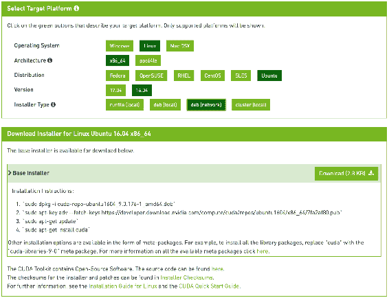

这些命令将安装所需的`cuda-drivers`和其他 CUDA API。

您可以通过在命令提示符下键入`nvidia-smi`来检查驱动程序是否正确安装。

# CUDA 深度神经网络-CUDNN

`CUDNN`库为深度学习算法提供了原语。 由于此软件包由 NVIDIA 提供，因此对其硬件进行了高度优化，并且运行速度更快。 该软件包提供了几种用于深度学习的标准例程。 著名的深度学习库（例如`tensorflow`，`caffe`等）使用这些软件包。 在下一节中，将提供安装`CUDNN`的说明。 您可以从 [NVIDIA 门户网站](https://developer.nvidia.com/rdp/cudnn-download)下载`CUDNN`。

用户帐户是必需的（免费注册）。

将相关文件复制到`CUDA`文件夹，使其更快地在 GPU 上运行。 我们不会直接使用`CUDA`和`CUDNN`库。 Tensorflow 使用这些来优化例程在 GP-GPU 上工作。

# 安装软件包

训练有素的深度学习模型需要几个库。 我们将安装以下库，并查看在竞争软件包中选择以下软件包的原因：

*   Python 和其他依赖项
*   OpenCV 的
*   TensorFlow
*   硬

# 蟒蛇

Python 是任何数据科学应用程序的实际选择。 它拥有最大的社区和图书馆支持生态系统。 用于 Python 的 TensorFlow API 是最完整的，因此，Python 是首选的自然语言。 Python 有两个版本-Python2.x 和 Python3.x。 在本书中，我们将讨论 Python3.x。 这种选择有几个原因：

*   到 2020 年，Python 2.x 的开发将停止，因此，Python3.x 是 Python 的未来
*   Python 3.x 避免了原始实现中的许多设计缺陷
*   与普遍的看法相反，Python3.x 具有与 Python 2.x 一样多的数据科学支持库。

在本书中，我们将使用 Python 版本 3。 转到[这里](https://www.python.org/downloads/)，然后根据操作系统下载版本 3。 按照下载链接中给出的步骤安装 Python。 安装 Python 后，必须安装 **pip3** ，以方便安装 Python 软件包。 然后通过输入以下命令安装几个 Python 软件包，以便以后可以安装`OpenCV`和`tensorflow`：

```py
 sudo pip3 install numpy scipy  scikit-learn  pillow  h5py 
```

先前安装的软件包的说明如下：

*   `numpy` 是高度优化的数值计算程序包。 它具有强大的 N 维封装数组对象，并且`numpy`库的矩阵运算针对速度进行了高度优化。 图像可以存储为 3 维`numpy`对象。
*   `scipy` 有一些用于科学和工程计算的例程。 在本书的后面，我们将使用一些优化程序包。
*   `scikit-learn` 是一个机器学习库，我们将使用其中的许多辅助函数。
*   `Ppillow`对于图像加载和基本操作很有用。
*   `H5py`程序包是 HDF5 二进制数据格式的 Pythonic 接口。 这是存储使用 Keras 训练的模型的格式。

# 开放式计算机视觉-OpenCV

`OpenCV`是著名的计算机视觉库。 该库中有许多可用的图像处理例程，这些例程很有用。 以下是在 Ubuntu 中安装 OpenCV 的步骤。

```py
sudo apt-get install python-opencv
```

对于其他操作系统，可以在[这里](https://opencv.org/)找到类似的步骤。 它是跨平台的，针对 CPU 密集型应用程序进行了优化。 它具有多种编程语言的接口，并且受 Windows，Ubuntu 和 Mac 支持。

# TensorFlow 库

`tensorflow`是一个用于开发和部署深度学习模型的开源库。 TensorFlow 使用计算图进行数据流和数值计算。 换句话说，数据或张量流经图形，因此名称为`tensorflow`。 该图具有可进行任何数值计算的节点，因此适用于深度学习操作。 它为各种平台和硬件提供了一个 API。 TensorFlow 在后端处理扩展和优化的所有复杂性。 它最初是为在 Google 上进行研究而开发的。 它是最著名的深度学习库，拥有大型社区，并提供用于生产中的可视化和部署的工具。

# 安装 TensorFlow

使用以下命令，使用 pip3 为 CPU 安装`tensorflow`：

```py
sudo pip3 install tensorflow 
```

如果您使用的是 GPU 硬件，并且已安装`CUDA`和`CUDNN`，请使用以下命令安装`tensorflow`的 GPU 版本：

```py
sudo pip3 install tensorflow-gpu
```

现在`tensorflow`已安装并可以使用。 我们将尝试一些示例以了解 TensorFlow 的工作原理。

# TensorFlow 示例打印 Hello，TensorFlow

我们将直接在 Python Shell 中使用 TensorFlow 进行示例。 在此示例中，我们将使用 TensorFlow 打印您好，TensorFlow 。

1.  通过在命令提示符下键入以下命令，从 shell 调用 Python：

```py
 python3
```

2.  通过输入以下命令导入`tensorflow`库：

```py
 >>> import tensorflow as tf
```

3.  接下来，使用字符串`Hello, TensorFlow`定义一个常量。 这与通常的 Python 赋值操作不同，因为该值尚未初始化：

```py
 >>> hello = tf.constant('Hello, TensorFlow!') 
```

4.  创建一个会话以初始化计算图，并为该会话命名：

```py
 >>> session = tf.Session() 
```

可以使用变量`hello`作为参数运行会话。

5.  现在，该图执行并返回打印的特定变量：

```py
 >>> print(session.run(hello))
```

它应该打印以下内容：

```py
Hello, TensorFlow!
```

让我们再看一个示例，以了解会话和图形的工作方式。

访问[这里](https://github.com/rajacheers/DeepLearningForComputerVision)获取本书中所有示例的代码。 该代码将根据章节进行组织。 您可以提出问题并在存储库中获得帮助。

# TensorFlow 示例，将两个数字相加

这是如何使用 TensorFlow 将两个数字相加的另一个简单示例。

1.  创建一个 Python 文件并使用以下代码导入`tensorflow`：

```py
 import tensorflow as tf
```

对于所有后面的示例，前面的导入都是必需的。 假定读者已经为所有示例导入了库。 可以通过以下方式定义`placeholder`。 占位符在分配时不会加载。 在此，将变量定义为类型为`float32`的`placeholder`。 `placeholder`是一个空声明，并且在运行会话时可以采用值。

2.  现在我们定义一个`placeholder`，如以下代码所示：

```py
 x = tf.placeholder(tf.float32)
 y = tf.placeholder(tf.float32)
```

3.  现在，可以将占位符的求和运算定义为通常的加法运算。 在这里，不执行操作，而只是使用以下代码定义：

```py
 z = x + y
```

4.  可以如前面的示例所示创建会话。 如下所示定义时，该图即可执行计算：

```py
 session = tf.Session()
```

5.  以字典格式定义`placeholder`的值：

```py
 values = {x: 5.0, y: 4.0}
```

6.  使用变量`c`和值运行会话。 该图将值提供给适当的占位符，并为变量`c`取回值：

```py
 result = session.run([z], values) print(result)
```

作为添加结果，该程序应打印[ 9.0 ]。

可以理解，这不是将两个数字相加的最佳方法。 该示例旨在了解 TensorFlow 中如何定义张量和操作。 想象一下使用一万亿个数字并将它们相加会多么困难。 TensorFlow 可以使用相同的 API 轻松实现这种扩展。 在下一节中，我们将看到如何安装和使用 TensorBoard 和 TensorFlow 服务。

# 张量板

TensorBoard 是一套可视化工具，用于使用 TensorFlow 训练基于深度学习的模型。 可以在 TensorBoard 中可视化以下数据：

*   **图**：计算图，设备位置和张量详细信息
*   **标量**：指标，例如损耗，迭代精度
*   **图像**：用于查看带有相应标签的图像
*   **音频**：用于收听训练或生成的音频
*   **分布**：用于查看某些标量的分布
*   **直方图**：包括权重和偏差的直方图
*   **投影仪**：帮助可视化 3 维空间中的数据
*   **文本**：打印训练文本数据
*   **配置文件**：查看用于培训的硬件资源

Tensorboard 与 TensorFlow 一起安装。 转到 python3 提示符并输入以下命令（类似于上一个示例）以开始使用 Tensorboard：

```py
x = tf.placeholder(tf.float32, name='x')
y = tf.placeholder(tf.float32, name='y')
z = tf.add(x, y, name='sum')
```

请注意，已将参数名称作为占位符和操作的附加参数提供。 这些是我们可视化图形时可以看到的名称。 现在我们可以在 TensorBoard 中使用以下命令将图形写入特定的文件夹：

```py
session = tf.Session()
summary_writer = tf.summary.FileWriter('/tmp/1', session.graph)
```

此命令将图形写入磁盘到参数中给定的特定文件夹中。 现在可以使用以下命令调用 Tensorboard：

```py
tensorboard --logdir=/tmp/1
```

可以将任何目录作为`logdir`选项的参数传递，该选项用于存储文件。 转到浏览器并粘贴以下 URL 以开始可视化以访问 TensorBoard：

```py
http://localhost:6006/
```

浏览器应显示如下内容：

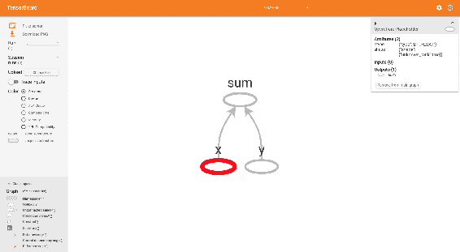

浏览器窗口中的 TensorBoard 可视化

显示加法图，并为占位符指定名称。 单击它们时，我们可以在右侧看到该操作的所有张量细节。 使自己熟悉选项卡和选项。 此窗口有几个部分。 我们将在不同的章节中了解它们。 TensorBoard 是 TensorFlow 中最好的区分工具之一，这使其比其他任何深度学习框架都更好。

# TensorFlow 服务工具

TensorFlow Serving 是 TensorFlow 中的工具，专为灵活的部署环境而开发，可提供高延迟和吞吐量的环境。 使用 TensorFlow 训练的任何深度学习模型都可以与服务一起部署。 通过运行以下命令来安装 Serving：

```py
sudo apt-get install tensorflow-model-server
```

有关如何使用服务的逐步说明，将在[第 3 章](../Text/03.html)，*图像检索*中进行介绍。 请注意，仅在 Ubuntu 中即可轻松安装 Serving； 对于其他操作系统，请参考[这里](https://www.tensorflow.org/serving/setup)。 下图说明了 TensorFlow Serving 和 TensorFlow 在生产环境中如何交互：

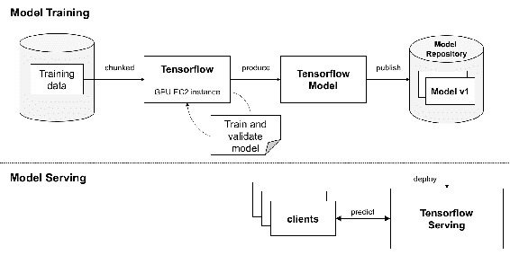

训练过程可以产生许多模型，Serving 会无缝切换它们，而不会造成任何停机。 除了[第 3 章](../Text/03.html)，*图像检索*和[第 10 章](../Text/10.html)，*部署*之外，以下各章均不需要 TensorFlow Serving。

# 凯拉斯图书馆

`Keras`是一个用 Python 编写的用于深度学习的开源库。 它提供了一个简单的界面来使用 TensorFlow 作为后端。 Keras 还可以与 Theano，深度学习 4j 或 CNTK 一起用作后端。 Keras 通过专注于友好性，模块化和可扩展性而设计用于轻松快速地进行实验。 它是一个独立的框架，可以在 CPU 和 GPU 之间无缝运行。 Keras 可以单独安装，也可以使用`tf.keras` API 在 TensorFlow 本身中使用。 在本书中，我们将使用`tf.keras` API。 我们已经看到了安装开发环境所需的库的步骤。 顺利安装 CUDA，CUDNN，OpenCV，TensorFlow 和 Keras 并对以下章节至关重要。

# 摘要

在本章中， e 涵盖了深度学习的基础知识。 本章介绍的词汇将在整本书中使用，因此，您可以经常参考本章。 示例还显示了计算机视觉的应用。 还介绍了用于开发环境的各种平台的所有软件包的安装。

在下一章中，我们将讨论如何在数据集上使用 Keras 和 TensorFlow 训练分类模型。 我们将研究如何使用更大的模型和其他技术（例如增强和微调）来提高准确性。 然后，我们将看到由世界各地的几个人提出的几种先进模型，它们在比赛中达到了最佳准确性。