# 影像分类

图像分类是将整个图像分类为单个标签的任务。 例如，给定图像是狗还是猫，图像分类任务可以将图像标记为狗或猫。 在本章中，我们将了解如何使用 TensorFlow 建立这样的图像分类模型，并学习提高准确性的技术。

我们将在本章介绍以下主题：

*   在 TensorFlow 中训练 MNIST 模型
*   在 Keras 中训练 MNIST 模型
*   其他流行的图像测试数据集
*   更大的深度学习模型
*   训练猫与狗的模型
*   开发实际应用

# 在 TensorFlow 中训练 MNIST 模型

在本节中，我们将了解**混合国家标准技术研究所数据库**（**MNIST**）的数据，并建立一个简单的分类模型。 本部分的目的是学习深度学习的通用框架，并将其用于 TensorFlow。 首先，我们将建立一个感知器或逻辑回归模型。 然后，我们将训练 CNN 以获得更高的准确性。 我们还将看到 TensorBoard 如何帮助可视化培训过程并了解参数。

# MNIST 数据集

`MNIST`数据具有从 0 到 9 的手写数字，其中 60,000 张用于训练的图像和 10,000 张用于测试的图像。 该数据库被广泛用于尝试使用最少预处理的算法。 这是一个学习机器学习算法的好而紧凑的数据库。 这是最著名的图像分类问题数据库。 这里显示了一些示例：

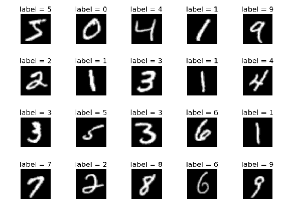

从上图中可以看出，这些手写字符有 10 个标签。 将图像标准化为 28 个图像像素乘以 28 个图像像素的尺寸，转换为灰度尺寸，并居中为固定尺寸。 这是一个很小的数据集，可以在上面快速测试算法。 在下一节中，我们将看到如何加载此数据集以在 TensorFlow 中使用。

# 加载 MNIST 数据

直接从 TensorFlow 加载`MNIST`数据。 请注意，在加载数据时，我们指定一种热编码作为参数。 标签存储为整数，但为了进行训练，应将其加载为一键编码。 从现在开始，假设读者正在使用导入了 TensorFlow `tf`的编辑器运行代码。 以下是要加载`MNIST_data`的代码段：

```py
from tensorflow.examples.tutorials.mnist import input_data
mnist_data = input_data.read_data_sets('MNIST_data', one_hot=True)
```

对于首次运行，将下载数据，并且可能需要一些时间。 从第二次运行开始，将使用缓存的数据。 在下一节中，我们将构建一个感知器来对数字进行分类。

# 建立一个感知器

感知器是单层神经网络。 本章介绍的概念（例如，完全连接的图层，`activation`函数，随机梯度下降，`logits`，一种热编码，softmax 和交叉熵）在这里将很有用。 您将学习如何在 TensorFlow 中定义神经网络的这些组件，并使用该网络训练`MNIST`数据。

# 为输入数据和目标定义占位符

占位符是传递数据的张量。 占位符不是特定值，但将在计算过程中接收输入。 首先声明感知器的输入大小，类数，批处理大小以及迭代或批处理的总数。 `x_input`是稍后将在其中输入图像的输入。 `y_input`是占位符，将在其中提供一键式标签或目标，如下所示：

```py
input_size = 784 no_classes = 10 batch_size = 100 total_batches = 200   x_input = tf.placeholder(tf.float32, shape=[None, input_size])
y_input = tf.placeholder(tf.float32, shape=[None, no_classes])
```

`shape`参数中的`None`表示它可以是任意大小，因为我们尚未定义批量大小。 第二个参数是`x_input`的张量大小和`y_input`的类数。 根据占位符的类型，我们以浮点数形式发送了数据。 接下来，我们可以定义感知器。

# 定义完全连接层的变量

让我们通过解释`weights`和`bias`等变量来定义一个简单的线性分类器或感知器。 这些变量的值将在计算过程中获悉。 这些也称为模型参数。 权重变量使用具有输入大小和类数形状的正态随机分布进行初始化。 由于图像被整形为单个矢量，因此输入大小为`784`。 类的数量是 10，它等于数据集中的位数。 偏差变量还使用大小等于类数的随机正态分布进行初始化。 `weights`和`bias`定义如下：

```py
weights = tf.Variable(tf.random_normal([input_size, no_classes]))
bias = tf.Variable(tf.random_normal([no_classes]))
```

变量的初始化可以为零，但随机正态分布可提供稳定的训练。 然后对输入进行加权，并加上偏置以产生`logits`，如下所示：

```py
logits = tf.matmul(x_input, weights) + bias
```

必须将感知器产生的`logits`与单热标签`y_input`进行比较。 正如在第 1 章“入门”中所了解的，最好使用 softmax 和交叉熵来比较`logits`和单热标签。

TensorFlow 的 `tf.nn.softmax_cross_entropy_with_logits` API 为我们做到了。 可以通过平均交叉熵来计算损耗。 然后，交叉熵通过`tf.train.GradientDescentOptimizer`完成的梯度下降优化得到馈送。 优化器接受损失，并以`0.5`的学习率将其最小化。 接下来显示 softmax，交叉熵，损耗，优化的计算：

```py
softmax_cross_entropy = tf.nn.softmax_cross_entropy_with_logits(
    labels=y_input, logits=logits)
loss_operation = tf.reduce_mean(softmax_cross_entropy)
optimiser = tf.train.GradientDescentOptimizer(
    learning_rate=0.5).minimize(loss_operation)
```

softmax 和交叉熵是从`tf.nn`程序包一起计算的，该程序包还有其他几种有用的方法。 `tf.train`有几个优化器，在这里，我们使用原始梯度下降。 您可以访问 TensorFlow API 文档以了解其他可选参数。 到目前为止，已定义了占位符，变量和操作，但尚未填充张量。

阅读 TensorFlow 中提供的[优化器列表](https://www.tensorflow.org/api_guides/python/train)。 Adam 优化器对于计算机视觉应用程序特别有用。 它通常会收敛得更快，因此我们不需要定义学习率。 有关优化器的理论总结，请访问[这里](http://ruder.io/optimizing-gradient-descent)。

# 用数据训练模型

现在，您已经定义了模型和训练操作。 下一步是开始使用数据训练模型。 在训练过程中，计算梯度并更新权重。 变量尚未初始化。 接下来，启动会话并使用全局变量初始化程序初始化变量：

```py
session = tf.Session()
session.run(tf.global_variables_initializer())
```

本书中的大多数示例都需要前两行。 假定读者将在需要的地方使用这两行。 现在，该图已准备好填充数据并开始训练。 通过循环，批量读取数据并训练模型。 通过使用所需的张量运行会话来进行模型训练。 为了使图形更新权重，必须调用优化器：

```py
for batch_no in range(total_batches):
    mnist_batch = mnist_data.train.next_batch(batch_size)
    _, loss_value = session.run([optimiser, loss_operation], feed_dict={
        x_input: mnist_batch[0],
  y_input: mnist_batch[1]
    })
    print(loss_value)
```

`run`方法的第一个参数可以具有一个数组，要求为其提供值的输出。 我们通过损失是因为打印损失会告诉我们模型是否正在训练中。 随着我们将损失降至最低，预计损失将减少。 `feed_dict`是一个 Python 字典，用于直接将输入和目标标签提供给占位符。 一旦该循环结束，损耗通常应低于 0.46。 接下来，我们可以通过计算精度来评估模型的工作效果，如下所示：

```py
predictions = tf.argmax(logits, 1)
correct_predictions = tf.equal(predictions, tf.argmax(y_input, 1))
accuracy_operation = tf.reduce_mean(tf.cast(correct_predictions, 
                                            tf.float32))
test_images, test_labels = mnist_data.test.images, mnist_data.test.labels
accuracy_value = session.run(accuracy_operation, feed_dict={
    x_input: test_images,
  y_input: test_labels
})
print('Accuracy : ', accuracy_value)
session.close()
```

该预测应该是最大激活的索引。 应该将其与 MNIST 标签上的基本事实进行比较，以进行正确的预测。 使用正确预测的平均值计算准确性。 可以通过将测试数据作为提要字典运行会话来评估数据的准确性。 当整个程序运行时，最终应产生 90% 左右的精度。 如果没有用于培训和测试的更简单的 API，该模型的定义似乎太明确了。 此基本定义水平为 TensorFlow 赋予了表达能力。 在下一部分中，我们将看到更高级别的 API。 感知器获得的精度不是很高，在下一节中，我们将使用具有卷积层的更深的网络来提高精度。

# 建立多层卷积网络

在本节中，我们将看到如何在 TensorFlow 中创建多层卷积网络，并观察更深的网络如何提高分类准确性。 我们将使用 TensorFlow 层的 API 定义层，而不是从头开始定义它们。 最佳实践方法已根植于这些方法中。 可以从上一节开始导入库，数据集和占位符。 这次，我们将使用 TensorBoard 可视化培训过程。 为了可视化变量的统计信息，必须将变量统计信息的值添加到`tf.summary`中。

摘要将被写入 TensorBoard 可以解释的文件夹中。 我们定义一个函数来编写摘要，以便可以使用 TensorBoard 可视化它们：

```py
def add_variable_summary(tf_variable, summary_name):
  with tf.name_scope(summary_name + '_summary'):
    mean = tf.reduce_mean(tf_variable)
    tf.summary.scalar('Mean', mean)
    with tf.name_scope('standard_deviation'):
        standard_deviation = tf.sqrt(tf.reduce_mean(
            tf.square(tf_variable - mean)))
    tf.summary.scalar('StandardDeviation', standard_deviation)
    tf.summary.scalar('Maximum', tf.reduce_max(tf_variable))
    tf.summary.scalar('Minimum', tf.reduce_min(tf_variable))
    tf.summary.histogram('Histogram', tf_variable)
```

变量`summary`函数写入变量的摘要。 摘要中添加了五个统计量：平均值，标准差，最大值，最小值和直方图。 汇总可以是`scalar`或`histogram`。 当记录多个变量时，我们将看到如何在 TensorBoard 中可视化这些值。 与以前的模型不同，我们将`MNIST`数据的大小调整为一个正方形，并像二维图像一样使用它。 以下是将图像整形为 28 个图像像素乘 28 个图像像素的命令：

```py
x_input_reshape = tf.reshape(x_input, [-1, 28, 28, 1], 
    name='input_reshape')
```

尺寸`-1`表示批量大小可以是任何数字。 请注意，有一个名为`name`的自变量会在 TensorBoard 图形中反映出来，以便于理解。 我们将定义一个 2D 卷积层，其中定义了输入，过滤器，内核和激活。 可以在任何地方调用此方法以获取更多示例，并且在激活功能必须具有**整流线性单元**（**ReLU**）的情况下很有用。 `convolution`功能层定义如下：

```py
def convolution_layer(input_layer, filters, kernel_size=[3, 3],
  activation=tf.nn.relu):
    layer = tf.layers.conv2d(
        inputs=input_layer,
  filters=filters,
  kernel_size=kernel_size,
  activation=activation,
  )
    add_variable_summary(layer, 'convolution')
    return layer
```

有`kernel_size`和`activation`的默认参数。 汇总将添加到函数中的层，然后返回该层。 每当调用该函数时，都必须将`input_layer`作为参数传递。 这个定义将使我们的其他代码变得简单而小巧。 以非常相似的方式，我们将为`pooling_layer`定义一个函数，如下所示：

```py
def pooling_layer(input_layer, pool_size=[2, 2], strides=2):
    layer = tf.layers.max_pooling2d(
        inputs=input_layer,
  pool_size=pool_size,
  strides=strides
    )
    add_variable_summary(layer, 'pooling')
    return layer
```

该层的`pool_size`和`strides`的默认参数分别为`[2, 2]`和`2`。 这些参数通常工作良好，但可以在必要时进行更改。 也为该层添加了摘要。 接下来，我们将定义一个密集层，如下所示：

```py
def dense_layer(input_layer, units, activation=tf.nn.relu):
    layer = tf.layers.dense(
        inputs=input_layer,
  units=units,
  activation=activation
    )
    add_variable_summary(layer, 'dense')
    return layer
```

定义的密集层具有用于激活的默认参数，并且还添加了变量摘要。 `pooling_layer`从卷积层获取特征图，并通过使用池大小和跨距进行跳过来将其缩小为一半。 所有这些层均以图形方式连接，并且已被定义。 没有一个值被初始化。 可以添加另一个卷积层，以将采样特征从第一卷积层转换为更好的特征。 合并后，我们可以将激活重塑为线性形式，以便通过密集的层进行馈送：

```py
convolution_layer_1 = convolution_layer(x_input_reshape, 64)
pooling_layer_1 = pooling_layer(convolution_layer_1)
convolution_layer_2 = convolution_layer(pooling_layer_1, 128)
pooling_layer_2 = pooling_layer(convolution_layer_2)
flattened_pool = tf.reshape(pooling_layer_2, [-1, 5 * 5 * 128],
  name='flattened_pool')
dense_layer_bottleneck = dense_layer(flattened_pool, 1024)
```

卷积层之间的唯一区别是过滤器的大小。 重要的是，各层之间的尺寸必须适当地变化。 选择内核和步幅的参数是任意的，这些数字是根据经验选择的。 定义了两个卷积层，然后可以是一个完全连接的层。 密集层 API 可以采用单个维的任何矢量并将其映射到任意数量的隐藏单元，如本例中的`1024`。 隐藏层之后是 ReLU 激活 ，以使其成为非线性计算。 也为此层添加了变量摘要。 接下来是具有退出率的退出层。 保持较高水平将阻止网络学习。 根据使用的时间，可以将训练模式设置为`True`和`False`。 在训练中，我们将其设置为`True`（默认为`False`）。 在计算准确性时，我们将不得不更改此设置。 因此，为此保留了一个布尔值，将在训练过程中喂入：

```py
dropout_bool = tf.placeholder(tf.bool)
dropout_layer = tf.layers.dropout(
        inputs=dense_layer_bottleneck,
        rate=0.4,
        training=dropout_bool
    )
```

辍学层再次被馈送到一个密实层，这称为对率。 对率是最后一层，激活会导致类数增加。 激活将针对特定类别（即目标类别）加标，并且最多可以获得这 10 个激活的最大值：

```py
logits = dense_layer(dropout_layer, no_classes)
```

对率的输出与上一节中创建的模型非常相似。 现在，对数可以通过 softmax 层传递，然后像以前一样进行交叉熵计算。 在这里，我们添加了一个作用域名称，以在 TensorBoard 中获得更好的可视化效果，如下所示：

```py
with tf.name_scope('loss'):
    softmax_cross_entropy = tf.nn.softmax_cross_entropy_with_logits(
        labels=y_input, logits=logits)
    loss_operation = tf.reduce_mean(softmax_cross_entropy, name='loss')
    tf.summary.scalar('loss', loss_operation)
```

可以使用`tf.train` API 的方法优化此`loss`函数。 在这里，我们将使用`Adamoptimiser`。 学习率无需定义，并且在大多数情况下效果良好：

```py
with tf.name_scope('optimiser'):
    optimiser = tf.train.AdamOptimizer().minimize(loss_operation)
```

像以前一样计算准确性，但是为正确的预测和准确性计算添加了名称范围：

```py
with tf.name_scope('accuracy'):
    with tf.name_scope('correct_prediction'):
        predictions = tf.argmax(logits, 1)
        correct_predictions = tf.equal(predictions, tf.argmax(y_input, 1))
    with tf.name_scope('accuracy'):
        accuracy_operation = tf.reduce_mean(
            tf.cast(correct_predictions, tf.float32))
tf.summary.scalar('accuracy', accuracy_operation)
```

还添加了精度的标量摘要。 下一步是启动会话并初始化变量，如上一节所述。 这些行在这里不再重复。 必须合并这些摘要，并且必须定义用于编写培训和测试摘要的文件：

```py
merged_summary_operation = tf.summary.merge_all()
train_summary_writer = tf.summary.FileWriter('/tmp/train', session.graph)
test_summary_writer = tf.summary.FileWriter('/tmp/test')
```

注意，该图形只用`summary_writer`写入一次。 训练与之前非常相似，除了训练时的精度计算和值被添加到摘要中。 接下来，可以批量加载数据并可以开始训练：

```py
test_images, test_labels = mnist_data.test.images, mnist_data.test.labels

for batch_no in range(total_batches):
    mnist_batch = mnist_data.train.next_batch(batch_size)
    train_images, train_labels = mnist_batch[0], mnist_batch[1]
    _, merged_summary = session.run([optimiser, merged_summary_operation],
                                    feed_dict={
        x_input: train_images,
        y_input: train_labels,
        dropout_bool: True
    })
    train_summary_writer.add_summary(merged_summary, batch_no)
    if batch_no % 10 == 0:
        merged_summary, _ = session.run([merged_summary_operation,
                                         accuracy_operation], feed_dict={
            x_input: test_images,
            y_input: test_labels,
            dropout_bool: False
        })
        test_summary_writer.add_summary(merged_summary, batch_no)
```

每次迭代都会返回摘要以获取训练数据，并将其添加到编写器中。 对于第十次迭代，将添加测试摘要。 请注意，仅在训练期间而不是在测试期间启用辍学。 我们已经完成了定义以及网络摘要，可以运行该网络。 要查看培训过程，我们可以按照第 1 章，“入门”中所述前往 TensorBoard。

# 在深度学习中使用 TensorBoard

在浏览器中打开 TensorBoard 后，转到图表选项卡。 应该显示我们定义并接受训练的图形。 右键单击节点，我们可以选择要从主图中删除的操作。 对齐后，图形应如下所示：

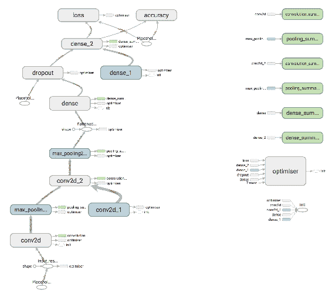

该图说明了在先前实例中经过训练和定义的图形

注意我们定义的所有图层的显示效果如何。 这对于检查体系结构的定义非常有用。 图形的方向与所有细节都很好地可视化了。 通过单击每个节点，您可以看到该节点的详细信息，例如输入和输出张量形状，如下所示：

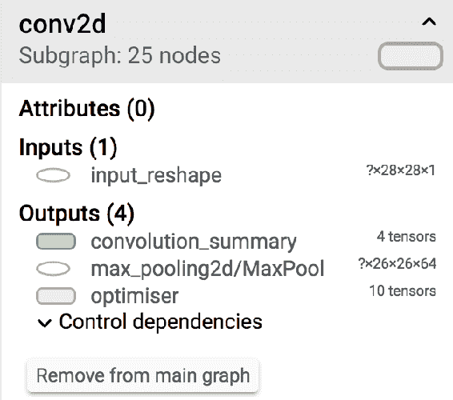

这些值可用于交叉检查图层参数的定义。 请注意左下方的图例，以使自己熟悉此页面，如下所示：

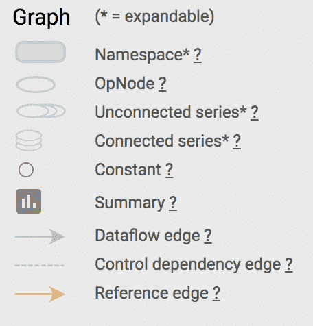

名称范围已分组，可以通过单击节点上的加号来查看各个组件。 节点按颜色排列。 现在我们可以移至标量页面。 通过在页面上四处移动，可以发现精度图，如下图所示：


橙色线用于训练数据，蓝色线用于测试数据。 他们大致遵循相同的模式。 表示原始值的亮线稍微少一些，而亮线是平滑的曲线。 可以在 UI 中选择平滑系数。 测试数据的准确性已达到 97% 以上。 以下是损失摘要中的图：

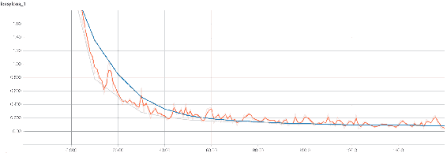

在培训过程中，培训和测试数据的损失都在稳步减少，这是一个好兆头。 在训练过程中将刷新所有摘要的数据，我们可以见证准确性的提高和损失的减少，从而获得 97.38% 的出色测试精度。

这可以帮助您查看模型是否正在学习并且正在朝着更好的方向发展。 其他汇总（例如最小值，最大值，平均值和标准偏差）也很有用。 以下是密集层的图形：

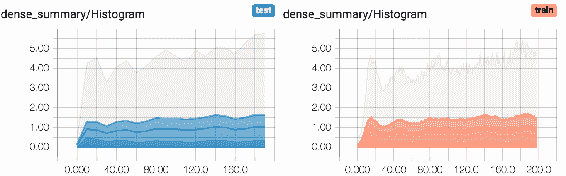

这些摘要对于注意权重的变化很有用。 这些分布也可以显示为直方图，如下所示：

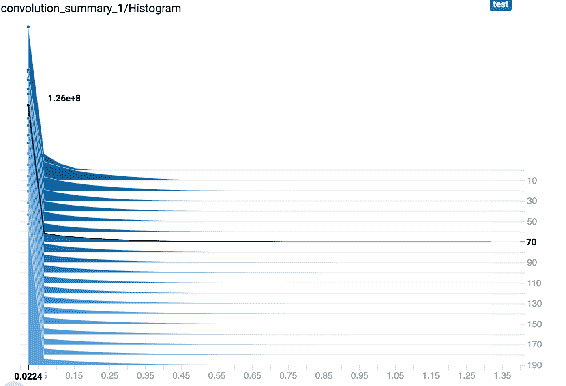

这些是对数的权重分布。 这些是 TensorBoard 可能提供的美丽可视化效果，并且在培训中非常有帮助。 通过使模型更深入，我们可以见证准确性的巨大提高。 在下一节中，我们将看到如何使用 Keras API 训练相同的模型。 现在您可以看到 TensorBoard 在检查深度学习模型和训练过程中的功能。

# 在 Keras 中训练 MNIST 模型

在本节中，我们将使用通过 `tf.keras` API 定义的与上一节相同的模型。 最好从 TensorFlow 学习 Keras 和`Layer`包，因为它们可以在几个开源代码中看到。 本书的目的是使您了解 TensorFlow 的各种产品，以便您可以在其之上构建产品。

“读取代码的次数多于写入代码的次数。”

牢记前面的引用，向您展示了如何使用各种 AP​​I 实现相同的模型。 任何最新算法实现的开放源代码都将是这些 API 的组合。 接下来，我们将从 Keras 实现开始。

# 准备数据集

Keras 提供`MNIST`数据。 首先，导入`tensorflow`。 然后定义一些常量，例如批处理大小，类和时期数。 可以根据计算机上可用的 RAM 选择批次大小。 批处理大小越大，所需的 RAM 越多。 批次大小对准确性的影响很小。 此处的类数等于 10，并且针对不同的问题而有所不同。 时期的数量决定了训练必须经过整个数据集的次数。 如果在所有时期结束时减少损失，则可以将其设置为较高的数字。 在某些情况下，训练时间较长可以提高准确性。 现在让我们看一下创建数据集的步骤：

1.  设置输入图像的尺寸，如下所示：

```py
        batch_size = 128
        no_classes = 10
        epochs = 2
        image_height, image_width = 28, 28
```

2.  使用 Keras 实用程序将数据从磁盘加载到内存：

```py
        (x_train, y_train), (x_test, y_test) = tf.keras.datasets.mnist.load_data()
```

3.  将向量重塑为图像格式，并使用给定的代码定义卷积的输入尺寸：

```py
        x_train = x_train.reshape(x_train.shape[0], image_height, image_width, 1)
        x_test = x_test.reshape(x_test.shape[0], image_height, image_width, 1)
        input_shape = (image_height, image_width, 1)
```

4.  如下将数据类型转换为`float`：

```py
        x_train = x_train.astype('float32')
        x_test = x_test.astype('float32')
```

5.  通过减去数据均值来归一化数据：

```py
        x_train /= 255
        x_test /= 255
```

6.  将分类标签转换为一次性编码：

```py
        y_train = tf.keras.utils.to_categorical(y_train, no_classes)
        y_test = tf.keras.utils.to_categorical(y_test, no_classes)
```

这与 TensorFlow 编写代码的方式非常不同。 数据已加载到内存中，此处`Placeholders`的概念均不存在。

# 建立模型

在本节中，我们将使用一些卷积层，然后是全连接层，以训练前面的数据集。 构造一个简单的顺序模型，该模型具有两个卷积层，然后是池化层，丢失层和密集层。 顺序模型具有`add`方法，可以将多个层堆叠在一起。 第一层具有 64 个过滤器，第二层具有 128 个过滤器。 所有过滤器的内核大小均为 3。 在卷积层之后应用最大池。 卷积层的输出被展平，并通过丢包连接连接到一对完全连接的层。

最后一层连接到 softmax，因为这是一个多类分类问题。 以下代码显示了如何定义模型：

```py
def simple_cnn(input_shape):
    model = tf.keras.models.Sequential()
    model.add(tf.keras.layers.Conv2D(
        filters=64,
        kernel_size=(3, 3),
        activation='relu',
        input_shape=input_shape
    ))
    model.add(tf.keras.layers.Conv2D(
        filters=128,
        kernel_size=(3, 3),
        activation='relu'
    ))
    model.add(tf.keras.layers.MaxPooling2D(pool_size=(2, 2)))
    model.add(tf.keras.layers.Dropout(rate=0.3))
    model.add(tf.keras.layers.Flatten())
    model.add(tf.keras.layers.Dense(units=1024, activation='relu'))
    model.add(tf.keras.layers.Dropout(rate=0.3))
    model.add(tf.keras.layers.Dense(units=no_classes, activation='softmax'))
    model.compile(loss=tf.keras.losses.categorical_crossentropy,
                  optimizer=tf.keras.optimizers.Adam(),
                  metrics=['accuracy'])
    return model
simple_cnn_model = simple_cnn(input_shape)
```

该模型刚刚定义，必须进行编译。 在编译丢失期间，必须定义优化器和指标。 损失将是交叉熵，并通过 Adam 算法进行了优化，我们将以准确性作为度量标准。 使用加载的数据，训练和评估数据。 使用训练参数加载训练数据并拟合模型：

```py
simple_cnn_model.fit(x_train, y_train, batch_size, epochs, (x_test, y_test))
train_loss, train_accuracy = simple_cnn_model.evaluate(
    x_train, y_train, verbose=0)
print('Train data loss:', train_loss)
print('Train data accuracy:', train_accuracy)
```

使用 Keras API 时，不会创建会话。 然后按以下方式评估测试数据：

```py
test_loss, test_accuracy = simple_cnn_model.evaluate(
    x_test, y_test, verbose=0)
print('Test data loss:', test_loss)
print('Test data accuracy:', test_accuracy)
```

评估也可以在不显式创建会话的情况下创建。 运行完成后，结果应类似于以下内容：

```py
Loss for train data: 0.0171295607952
Accuracy of train data: 0.995016666667
Loss for test data: 0.0282736890309
Accuracy of test data: 0.9902
```

这样可以使测试数据的准确度达到 99%。 请注意，训练精度高于测试数据，并且始终打印它们都是一个好习惯。 精度的差异是由于迭代次数造成的。 由于数据集的差异，准确性比 TensorFlow 中创建的先前模型要高一些。

# 其他流行的图像测试数据集

`MNIST`数据集是用于测试算法的最常用数据集。 但是还有其他数据集可用于测试图像分类算法。

# CIFAR 数据集

**加拿大高级研究机构**（**CIFAR-10**）数据集包含 60,000 张图像，其中 50,000 张图像用于训练，10,000 张图像用于测试。 类的数量是 10。图像尺寸是 32 像素 x 32 像素。 以下是从每个类别中随机选择的图像：

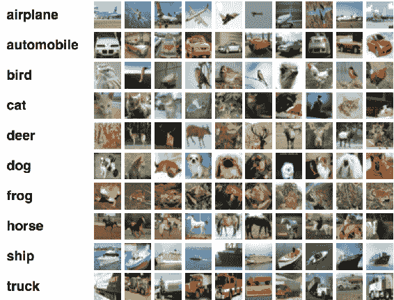

这些图像很小，仅包含一个对象。 `CIFAR-100`数据集包含相同数量的图像，但具有 100 个类别。 因此，每个类别只有 600 张图像。 每个图像都带有一个超级标签和一个精美标签。 如果您想进行实验，可以在`tf.keras.datasets`上找到此数据集。

# Fashion-MNIST 数据集

`Fashion-MNIST`是替代`MNIST`数据集而创建的数据集。 创建为`MNIST`的此数据集被认为太简单了，可以直接用`MNIST`代替。

以下是在执行**主成分分析**（**PCA**）之后从数据集中随机选择的示例：

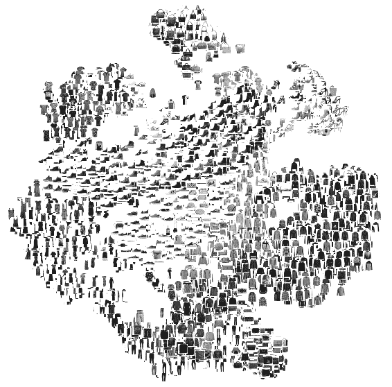

数据集大小，标签数量和图像大小类似于`MNIST`。 可以在[这个页面](https://github.com/zalandoresearch/fashion-mnist)上找到更多详细信息。 您可以运行先前学习的模型并检查准确性。

# ImageNet 数据集和竞争

ImageNet 是具有 14,197,122 图像，21,841 个同义词集索引的计算机视觉数据集。 同义词集是 WordNet 层次结构中的一个节点，而节点又是一组同义词。 每年都会举办一次比赛，其中有 1000 个此类数据集。 它已成为评估图像分类算法性能的标准基准。

在 2013 年，基于深度学习的计算机视觉模型获得了第一名。 从那时起，只有深度学习模型赢得了竞争。 以下是多年来在比赛中排名前五位的错误率：

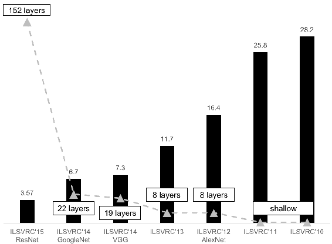

您会注意到，多年来精度以及层的深度一直在增加。 接下来，我们将了解该图中存在的模型。

# 更大的深度学习模型

我们将审视几种模型定义，这些模型定义在 ImageNet 竞赛中取得了最新的成果。 我们将在以下主题中单独研究它们。

# AlexNet 模型

[**Krizhevsky 等人**](https://papers.nips.cc/paper/4824-imagenet-classification-with-deep-convolutional-neural-networks.pdf)提出了 AlexNet（是第一个引起人们对计算机视觉深度学习的广泛兴趣的作品），它一直是这个领域里的先驱和影响力。 该模型赢得了 ImageNet 2013 挑战。 错误率是 15.4%，明显优于下一个。 该模型是具有五个卷积层的相对简单的体系结构。 面临的挑战是对 1,000 种对象进行分类。 图像和数据包含 1500 万条带注释的图像，其中包含 22,000 多个类别。 其中，只有 1,000 个类别用于比赛。 AlexNet 使用 ReLU 作为激活功能，发现它的训练速度比其他激活功能快几倍。 该模型的架构如下所示：

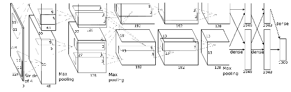

复制自 Krizhevsky 等人。

本文还使用了数据增强技术，例如图像翻译，水平翻转和随机裁剪。 漏失层防止过度拟合 。 该模型使用原始**随机梯度下降**（**SGD**）进行训练。 仔细选择 SGD 的参数进行训练。 学习率在一组固定的训练迭代中变化。 动量和重量衰减采用固定值进行训练。 本文介绍了一种称为**局部响应规范化**（**LRN**）的概念。 LRN 层对滤镜上的每个像素进行归一化，以避免在特定滤镜中发生巨大的激活。

不再使用该层，因为最近的研究表明，由于 LRN，没有太大的改进。 AlexNet 总共有 6000 万个参数。

# VGG-16 模型

**VGG** 模型代表牛津大学的， **视觉几何组** 。 该模型非常简单，并且比 AlexNet 具有更大的深度。 该纸有两个模型，深度分别为 16 和 19 层。 所有的 CNN 层都使用`3 x 3`步幅的滤镜和 1 尺寸的垫，以及 2 步幅的最大合并尺寸 2。这导致参数数量减少。 尽管由于最大池化而减小了大小，但过滤器的数量却随着层的增加而增加。 16 层深度模型的体系结构如下：

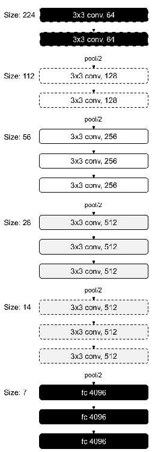

该模型具有 1.38 亿个参数，是此处描述的所有模型中最大的。 但是参数的一致性很好。 其特征是，随着网络的深入，图像的尺寸越小，过滤器的数量就越多。 所使用的数据增强技术之一是规模抖动。 比例抖动是一种增强技术，其中具有随机大小的一侧被认为会改变比例。

# Google Inception-V3 模型

[**Inception-V3** 是 Szegedy 等人提出的](https://arxiv.org/pdf/1409.4842.pdf)，并介绍了具有更好泛化方法的初始概念。 该架构在 2014 年赢得了 ImageNet 竞赛的冠军。它旨在提高速度和尺寸的效率。 它的参数比 AlexNet 小 12 倍。 初始阶段是构建宏体系结构的微体系结构。 每个隐藏层都有一个较高级别的图像表示。 在每一层，我们可以选择使用池化或其他层。 初始使用多个内核，而不是使用一种类型的内核。 平均池之后是各种大小的卷积，然后将它们合并在一起。

可以基于数据学习内核参数。 使用多个内核，该模型可以检测较小的特征以及较高的抽象度。 `1 x 1`卷积将减少特征，从而减少计算量。 这将在推理过程中占用较少的 RAM。 以下是最简单形式的启动模块，其中包含具有各种内核大小和池化的卷积选项：

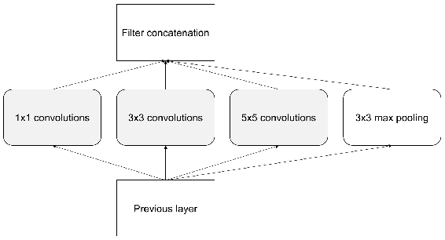

请注意，与 AlexNet 或 VGG 相反，操作是并行进行的。 输出量巨大，因此引入了`1 x 1`的过滤器以降低尺寸。 将缩小的尺寸添加到体系结构后，它将变为：

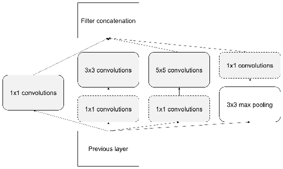

该模型的整个体系结构如下，包括所有的风吹草动：

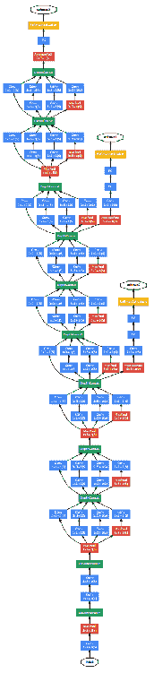

该图说明了 Google Inception V3 模型架构[经 Szegedy 等人的许可复制]

有 9 个初始模块，共 100 层，它们具有良好的性能。

# Microsoft ResNet-50 模型

[**ResNet** 是 He 等人提出的](https://arxiv.org/pdf/1512.03385.pdf)，并在 2015 年赢得了 ImageNet 竞赛。此方法表明可以训练更深的网络。 网络越深，精度变得越饱和。 这甚至不是由于过拟合或由于存在大量参数，而是由于减少了训练误差。 这是由于无法反向传播梯度。 可以通过以下方法将梯度直接发送到带有残差块的更深层来克服：

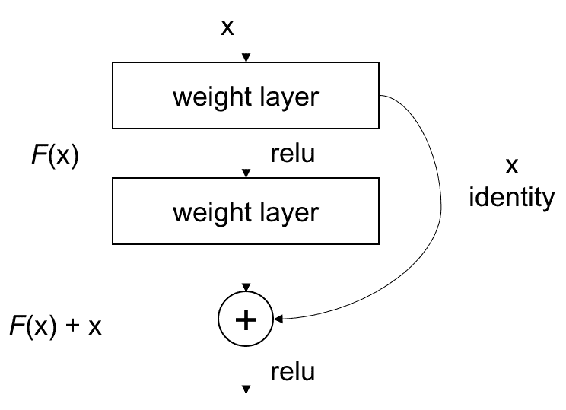

每两层相连，形成一个残留块。 您可以看到训练是在各层之间传递的。 通过这种技术，反向传播会将错误带到较早的层。

可以使用来自[这里](https://github.com/tensorflow/tensorflow/tree/r1.4/tensorflow/python/keras/_impl/keras/applications)的模型定义，它定义了模型中的每一层，并且提供`ImageNet`数据集上的预训练权重。

# SqueezeNet 模型

[Iandola 等人介绍了 **SqueezeNet** 模型](https://arxiv.org/pdf/1602.07360.pdf)，以减少模型尺寸和参数数量。

通过使用`1 x 1`过滤器替换`3 x 3`过滤器，使网络变得更小，如下所示：

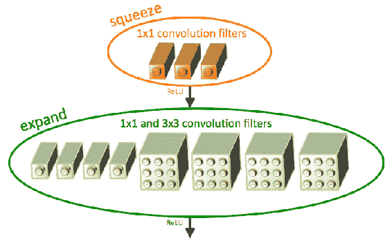

经 Iandola 等人许可复制。

`3 x 3`过滤器的输入数量也减少了在较高级别发生时各层的下采样，从而提供了较大的激活图：

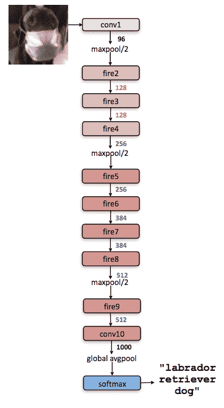

经 Iandola 等人许可复制

# 空间转换器网络

Jaderberg 等人提出的[**空间转换器网络**](https://arxiv.org/pdf/1506.02025.pdf)尝试在传递到 CNN 之前对图像进行转换。 这与其他网络不同，因为它尝试在卷积之前修改图像。 该网络学习参数以变换图像。 学习用于**仿射变换**的参数。 通过应用仿射变换，可以实现**空间不变性**。 在以前的网络中，空间不变性是通过最大池化层实现的。 空间转换器网络的位置如下所示：

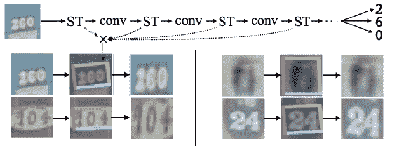

经 Jaderberg 等人许可复制

# DenseNet 模型

[DenseNet 是 Huang 等人提出的 ResNet 的扩展](https://arxiv.org/pdf/1608.06993.pdf)。 在 ResNet 块中，上一层通过求和合并到下一层。 在 DenseNet 中，上一层通过串联合并到下一层。 DenseNet 将所有层连接到上一层，将当前层连接到下一层。

在下图中，可以看出要素图是如何作为输入提供给其他层的：

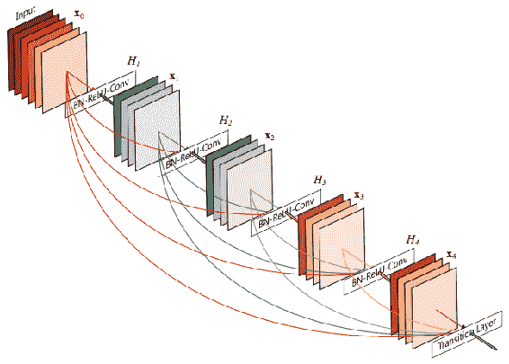

经 Huang 等人许可复制

这样，它提供了多个优点，例如更平滑的渐变，特征变换等。 这也减少了参数的数量：

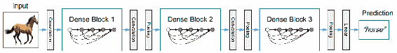

经 Huang 等人许可复制

我们已经介绍了图像分类任务的所有最新算法。 任何体系结构均可用于图像分类任务。 在下一节中，我们将看到如何使用这些先进的体系结构训练模型来预测宠物，并提高准确性。

# 训练猫与狗的模型

在本部分中，我们将准备和训练用于预测猫与狗的模型，并了解一些可提高准确性的技术。 大多数图像分类问题都属于这种范例。 本节介绍的技术，例如扩充和迁移学习，对于一些问题很有用。

# 准备数据

为了进行分类，我们将从 **kaggle** 下载数据并以适当的格式存储。 注册并登录 [Kaggle](http://www.kaggle.com) 并转到[猫狗大战](https://www.kaggle.com/c/dogs-vs-cats/data)。 从该页面下载`train.zip`和`test1.zip`文件。 `train.zip`文件包含 25,000 张宠物数据图像。 我们将仅使用部分数据来训练模型。 具有更多计算能力的读者，例如**图形处理单元**（**GPU**），可以使用比建议的更多的数据。 运行以下脚本以重新排列图像并创建必要的文件夹：

```py
import os
import shutil

work_dir = '' # give your correct directory
image_names = sorted(os.listdir(os.path.join(work_dir, 'train')))

def copy_files(prefix_str, range_start, range_end, target_dir):
    image_paths = [os.path.join(work_dir, 'train', prefix_str + '.' + str(i) + '.jpg')
                   for i in range(range_start, range_end)]
    dest_dir = os.path.join(work_dir, 'data', target_dir, prefix_str)
    os.makedirs(dest_dir)
    for image_path in image_paths:
        shutil.copy(image_path, dest_dir)

copy_files('dog', 0, 1000, 'train')
copy_files('cat', 0, 1000, 'train')
copy_files('dog', 1000, 1400, 'test')
copy_files('cat', 1000, 1400, 'test')
```

对于我们的实验，我们将仅使用 1000 张猫和狗的图像。 因此，将图像 0–999 从下载的文件夹复制到`cats`下新创建的`train` 文件夹。 同样，将 1,000–1,400 复制到`data/test/cat`，将`train/dogs`中的 0–999 和`data/test/dog`中的 1,000–1,400 复制，这样我们每个类别都有 1,000 个训练示例和 400 个验证示例。

# 使用简单的 CNN 进行基准测试

让我们在该数据集上运行先前的`simple_cnn`模型，并查看其性能。 该模型的性能将成为我们判断其他技术的基本基准。 我们将为数据加载和训练定义一些变量，如下所示：

```py
image_height, image_width = 150, 150
train_dir = os.path.join(work_dir, 'train')
test_dir = os.path.join(work_dir, 'test')
no_classes = 2
no_validation = 800
epochs = 2
batch_size = 200
no_train = 2000
no_test = 800
input_shape = (image_height, image_width, 3)
epoch_steps = no_train // batch_size
test_steps = no_test // batch_size
```

该常数用于本节中的训练猫和狗模型的讨论中讨论的技术。 在这里，我们正在使用 2,800 张图像进行训练和测试，这对于个人计算机的 RAM 是合理的。 但这对于更大的数据集是不可持续的。 最好一次只加载一批图像进行培训和测试。 为此，`tf.keras`具有称为`ImageDataGenerator`的类，可在必要时读取图像。 假定从上一节中导入了`simple_cnn`模型。 以下是使用生成器加载图像的示例：

```py
generator_train = tf.keras.preprocessing.image.ImageDataGenerator(rescale=1\. / 255)
generator_test = tf.keras.preprocessing.image.ImageDataGenerator(rescale=1\. / 255)
```

加载时，此定义还会重新缩放图像。 接下来，我们可以使用`flow_from_directory`方法从目录中读取图像，如下所示：

```py
train_images = generator_train.flow_from_directory(
    train_dir,
    batch_size=batch_size,
    target_size=(image_width, image_height))

test_images = generator_test.flow_from_directory(
    test_dir,
    batch_size=batch_size,
    target_size=(image_width, image_height))
```

加载图像的目录，批量大小和图像的目标大小作为参数传递。 此方法执行重新缩放，并分批传递数据以拟合模型。 该生成器可直接用于拟合模型。 该模型的方法 `fit_generator`可以按以下方式使用：

```py
simple_cnn_model.fit_generator(
    train_images,
    steps_per_epoch=epoch_steps,
    epochs=epochs,
    validation_data=test_images,
    validation_steps=test_steps)
```

该模型适合来自训练图像生成器的数据。 从训练中定义时期数，并传递验证数据以获取模型过度训练的性能。 该`fit_generator`支持并行处理数据和模型训练。 CPU 执行重新缩放，而 GPU 可以执行模型训练。 这使得计算资源的效率很高。 经过 50 个纪元后，该模型的准确度应为 60%。 接下来，我们将看到如何扩充数据集以获得改进的性能。

# 扩充数据集

数据扩充提供了增加数据集大小的方法。 数据扩充会在训练期间引入噪声，从而在模型中为各种输入生成鲁棒性。 该技术在数据集较小且可以组合并与其他技术一起使用的情况下很有用。 接下来，我们将看到不同类型的扩充。

# 技术提升

可以通过多种方式来增强图像，如下所述：

*   **翻转**：图像在水平或垂直方向上被镜像或翻转
*   **随机裁剪**：裁剪随机部分，因此该模型可以处理遮挡
*   **剪切**：图像变形以影响物体的形状
*   **缩放**：训练图像的缩放部分以处理不同比例的图像
*   **旋转**：旋转对象以处理对象中各种程度的变化
*   **增白**：增白是通过仅保留重要数据的主成分分析完成的
*   **归一化**：通过标准化均值和方差来归一化像素
*   **通道偏移**：更改颜色通道以使模型对各种伪像引起的颜色变化具有鲁棒性

所有这些技术都在`ImageDataGenerator`中实现，以增加数据集的大小。 以下是`generator_train`的修改版本，其中包含前面讨论的一些增强技术：

```py
generator_train = tf.keras.preprocessing.image.ImageDataGenerator(
    rescale=1\. / 255,
    horizontal_flip=True,
    zoom_range=0.3,
    shear_range=0.3,)
```

替换前面代码中的`generator_train`将使精度提高到 90%。 更改扩充的参数，并注意更改。 在下一节中，我们将讨论一种称为转移学习的技术，该技术有助于以更少的数据训练更大的模型。

# 转移模型的学习或微调

转移学习是从预先训练的模型中学习的过程，该模型在较大的数据集上进行了训练。 用随机初始化训练模型通常需要时间和精力才能获得结果。 使用预训练的模型初始化模型可以加快收敛速度​​，并节省时间和能源。 这些经过预训练的模型通常使用精心选择的超参数进行训练。

可以直接使用预训练模型的几层，而无需进行任何修改，也可以对其进行位训练以适应变化。 在本节中，我们将学习如何对在`ImageNet`数据集上具有数百万个类别的模型进行调整或转移学习。

# 瓶颈功能培训

上一节中介绍的模型很简单，因此准确性可能较低。 应该从它们构建复杂的模型。 它们不能从头开始构建。 因此，提取瓶颈特征并对它们进行分类器训练。 瓶颈功能是训练数百万张图像的复杂体系结构所产生的功能。 图像是通过前进完成的，并存储了最终图层的特征。 从这些中，训练了一个简单的逻辑分类器进行分类。 提取瓶颈层，如下所示：

```py
generator = tf.keras.preprocessing.image.ImageDataGenerator(rescale=1\. / 255)

model = tf.keras.applications.VGG16(include_top=False)

train_images = generator.flow_from_directory(
    train_dir,
    batch_size=batch_size,
    target_size=(image_width, image_height),
    class_mode=None,
    shuffle=False
)
train_bottleneck_features = model.predict_generator(train_images, epoch_steps)

test_images = generator.flow_from_directory(
    test_dir,
    batch_size=batch_size,
    target_size=(image_width, image_height),
    class_mode=None,
    shuffle=False
)

test_bottleneck_features = model.predict_generator(test_images, test_steps)
```

将采用 VGG 模型并将其用于预测图像。 标签分配如下：

```py
train_labels = np.array([0] * int(no_train / 2) + [1] * int(no_train / 2))
test_labels = np.array([0] * int(no_test / 2) + [1] * int(no_test / 2))
```

使用瓶颈功能构建，编译和训练具有两层的顺序模型，并且可以使用以下给出的代码来实现：

```py
model = tf.keras.models.Sequential()
model.add(tf.keras.layers.Flatten(input_shape=train_bottleneck_features.shape[1:]))
model.add(tf.keras.layers.Dense(1024, activation='relu'))
model.add(tf.keras.layers.Dropout(0.3))
model.add(tf.keras.layers.Dense(1, activation='softmax'))
model.compile(loss=tf.keras.losses.categorical_crossentropy,
              optimizer=tf.keras.optimizers.Adam(),
              metrics=['accuracy'])
```

使用以下所示的代码对这些瓶颈特征进行模型训练：

```py
model.fit(
    train_bottleneck_features,
    train_labels,
    batch_size=batch_size,
    epochs=epochs,
    validation_data=(test_bottleneck_features, test_labels))
```

这提供了一种不同的方法来训练模型，并且在训练数据较少时很有用。 这通常是训练模型的更快方法。 仅使用预训练模型的最终激活来适应新任务。 这个想法可以扩展为微调几层，如下所示：

# 在深度学习中微调几层

可以加载预训练的模型，并且仅可以训练几层。 当给定的问题与模型所训练的图像非常不同时，此方法会更好地工作。 **微调**是深度学习中的常见做法。 当数据集较小时，这具有优势。 优化也可以更快地获得。

在小型数据集上训练深度网络会导致过度拟合。 使用微调程序也可以避免这种过拟合。 在较大的数据集上训练的模型也应该相似，因为我们希望激活和特征与较小的数据集相似。 您可以从存储的权重路径开始，如下所示：

```py
top_model_weights_path = 'fc_model.h5'
```

加载**视觉几何组**（**VGG**）模型，并将初始层设置为不可训练。 下一部分将详细介绍 VGG 模型。 目前，将 VGG 视为适用于图像数据的大型深度学习模型。 使用以下给出的代码，用新的可训练层替换完全连接的层：

```py
model = tf.keras.applications.VGG16(include_top=False)
```

可以在 VGG 模型的顶部构建一个小型的两层前馈网络，通常具有隐藏的单元，激活和退出，如下所示：

```py
model_fine_tune = tf.keras.models.Sequential()
model_fine_tune.add(tf.keras.layers.Flatten(input_shape=model.output_shape))
model_fine_tune.add(tf.keras.layers.Dense(256, activation='relu'))
model_fine_tune.add(tf.keras.layers.Dropout(0.5))
model_fine_tune.add(tf.keras.layers.Dense(no_classes, activation='softmax'))
```

顶级型号还必须装有经过充分培训的砝码。 然后可以将顶级模型添加到卷积基础中：

```py
model_fine_tune.load_weights(top_model_weights_path)
model.add(model_fine_tune)
```

我们可以将前 25 个层设置为不可训练，直到最后一个卷积块，这样它们的权重才会被更新。 仅其余层将被更新：

```py
for vgg_layer in model.layers[:25]:
    vgg_layer.trainable = False
```

使用梯度下降优化器以缓慢的学习速率（4 量级）编译模型：

```py
model.compile(loss='binary_crossentropy',
  optimizer=tf.keras.optimizers.SGD(lr=1e-4, momentum=0.9),
  metrics=['accuracy'])
```

我们可以将之前介绍的增强技术与剪切，缩放和翻转结合使用。 可以从目录中将流与火车和验证数据集一起添加到生成器。 现在可以将模型与数据增强结合起来进行微调。 这种训练方式比以前的所有方法都具有更好的准确性。 以下是转学的指南：

| **数据大小** | **相似数据集** | **不同的数据集** |
| --- | --- | --- |
| 较小的数据 | 微调输出层 | 微调更深层 |
| 更大的数据 | 微调整个模型 | 从头开始训练 |

根据数据大小，可以确定要微调的层数。 数据越少，需要调整的层数就越少。 我们已经看到了如何使用转移学习技术来提高模型的准确性。

# 开发实际应用

识别猫和狗是一个很酷的问题，但不太可能是重要的问题。 产品中使用的图像分类的实际应用可能会有所不同。 您可能有不同的数据，目标等。 在本节中，您将学习解决这些不同设置的提示和技巧。 解决新问题时应考虑的因素如下：

*   目标数量。 是 10 类问题还是 10,000 类问题？
*   类内差异有多大？ 例如，是否必须在一个类别标签下标识不同类型的猫？
*   类间差异有多大？ 例如，是否需要识别不同的猫？
*   数据有多大？
*   数据的平衡程度如何？
*   是否已经有一个训练有很多图像的模型？
*   部署推断时间和模型大小需要什么？ 在 iPhone 上是 50 毫秒还是在 Google Cloud Platform 上是 10 毫秒？ 可以消耗多少 RAM 来存储模型？

处理图像分类问题时，请尝试回答这些问题。 根据答案，您可以设计训练体系结构并提高准确性，如下一节所述。

# 选择合适的模型

体系结构有很多选择。 根据部署的灵活性，可以选择模型。 请记住，卷积较小且较慢，但是密集层较大且较快。 在大小，运行时间和准确性之间需要权衡。 建议在最终决定之前测试所有架构。 根据应用程序，某些模型可能比其他模型更好。 您可以减小输入大小以加快推理速度。 可以根据以下部分所述的指标来选择体系结构。

# 解决欠拟合和过拟合的方案

对于该问题，模型有时可能太大或太小。 可以将其分别分类为欠拟合或过度拟合。 当模型太小时会发生拟合不足，而在训练精度较低时可以进行测量。 当模型太大并且训练和测试精度之间存在较大差距时，就会发生过度拟合。 拟合不足可以通过以下方法解决：

*   获取更多数据
*   尝试更大的模型
*   如果数据很小，请尝试使用转移学习技术或进行数据扩充

过度拟合可以通过以下方法解决：

*   使用辍学和批处理规范化等技术进行正则化
*   扩充数据集

时刻提防损失。 损耗应随着迭代次数的减少而减少。 如果损失没有减少，则表明训练已停止。 一种解决方案是尝试使用其他优化器。 类别失衡可以通过加权损失函数来解决。 始终使用 **TensorBoard** 观看摘要。 很难估计需要多少数据。 本部分是培训任何深度学习模型的最佳课程。 接下来，我们将介绍一些特定于应用程序的指南。

# 人脸性别和年龄检测

应用程序可能需要从人脸检测性别和年龄。 人脸图像可以是通过人脸检测器获取的  。 可以将经过裁剪的人脸图像作为训练数据提供，并且应该给出相似的经过裁剪的人脸以进行推断。 根据所需的推理时间，可以选择 OpenCV 或 CNN 人脸检测器。 对于培训，可以使用 Inception 或 ResNet。 如果由于是视频而所需的推理时间要少得多，则最好使用三个卷积，然后是两个完全连接的层。 请注意，年龄数据集通常存在巨大的类别失衡，因此使用不同的度量标准（如准确性和召回率）将有所帮助。

# 服装模型的微调

服装模型的微调是一个不错的选择。 在这里，具有多个对属性进行分类的 softmax 层将很有用。 这些属性可以是图案，颜色等。

# 品牌安全

使用**支持向量机**（**SVM**）来训练瓶颈层是一个不错的选择，因为各个类别的图像可能会完全不同。 通常将其用于内容审核，以帮助避免显示露骨的图像。 您已经了解了如何解决图像分类中的新问题。

# 摘要

我们已经介绍了用于训练分类任务的基本但有用的模型。 我们看到了使用 Keras 和 TensorFlow API 的 MNIST 数据集的简单模型。 我们还看到了如何利用 TensorBoard 观看培训过程。 然后，我们讨论了一些特定应用程序的最新体系结构。 还介绍了几种提高准确性的方法，例如数据增强，瓶颈层训练和微调预训练模型。 还介绍了为新模型训练模型的提示和技巧。

在下一章中，我们将看到如何可视化深度学习模型。 我们还将在本章中部署经过训练的模型以进行推断。 我们还将看到如何将训练有素的图层用于通过应用程序进行图像搜索。 然后，我们将了解自动编码器的概念并将其用于特征的维数。