# 三、图像检索

深度学习也可以称为**表示学习**，因为模型的特征或表示是在训练期间学习的。 在隐藏层的训练过程中生成的**视觉特征**可用于计算距离度量。 这些模型学习如何根据分类任务在各个层上检测边缘，图案等。 在本章中，我们将研究以下内容：

*   如何从经过分类训练的模型中提取特征
*   如何使用 TensorFlow Serving 在生产系统中进行更快的推断
*   如何使用这些特征计算查询图像和目标集之间的相似度
*   将分类模型用于排名
*   如何提高检索系统的速度
*   从整体上看系统的架构
*   当目标图像过多时，使用自编码器学习紧凑的描述
*   训练去噪自编码器

# 了解视觉特征

深度学习模型经常因无法解释而受到批评。 基于神经网络的模型通常被认为像黑匣子，因为人类很难推理出深度学习模型的工作原理。 由于激活函数，深度学习模型对图像进行的层转换是非线性的，因此不容易可视化。 已经开发出了通过可视化深层网络的层来解决对不可解释性的批评的方法。 在本节中，我们将研究可视化深层的尝试，以便了解模型的工作原理。

可视化可以使用模型的激活和梯度来完成。 可以使用以下技术可视化激活：

*   **最近邻**：可以对图像进行层激活，并且可以一起看到该激活的最近图像。
*   **降维**：激活的尺寸可以通过**主成分分析**（**PCA**）或 **T 分布随机邻居嵌入**（**t-SNE**），可在二维或三维中可视化。 PCA 通过将值投影到最大方差方向来减小尺寸。 t-SNE 通过将最接近的点映射到三个维度来减小维度。 降维的使用及其技术超出了本书的范围。 建议您参考基本的机器学习材料，以了解有关降维的更多信息。

维基百科是了解降维技术的良好来源。 您可以参考以下链接：

*   <https://en.wikipedia.org/wiki/Dimensionality_reduction>
*   <https://en.wikipedia.org/wiki/Principal_component_analysis>
*   <https://en.wikipedia.org/wiki/T-distributed_stochastic_neighbor_embedding>
*   <https://en.wikipedia.org/wiki/Locality-sensitive_hashing>

*   **最大补丁**：激活一个神经元，并捕获最大激活的相应补丁。
*   **遮挡**：在各个位置遮挡（遮挡）图像，并且激活以热图显示，以了解图像的哪些部分很重要。

在以下各节中，我们将看到如何实现这些特征的可视化。

# 可视化深度学习模型的激活

任何层的过滤器都可以可视化任何模型架构。 使用该技术只能理解初始层。 最后一层对于最近邻方法很有用。 当`ImageNet`数据集与最近邻排列在一起时，其外观如下：

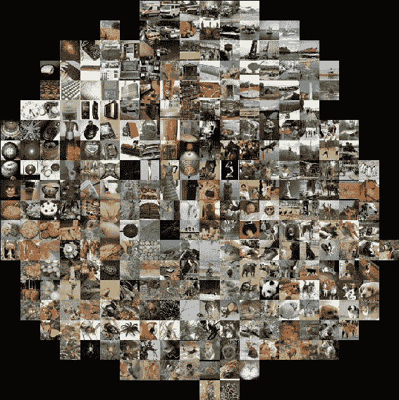

查看此图像，您可以看到相同的对象一起出现。 有趣的事情之一是，诸如狗，猴子和猎豹之类的动物虽然没有经过一个标签的训练却同时出现。 当对象相似时，图像的最近邻可视化非常有用，因此，我们可以了解模型的预测。 最后一层也可以通过降维技术（例如主成分分析和 t-SNE）进行可视化。 在下一节中，我们将看到使用降维的可视化实现。

# 嵌入可视化

可以使用 TensorBoard 以二维或三维可视化嵌入层（即预最终层）。 假定本节中的代码段位于图像分类一章中训练的卷积神经网络模型之后。 首先，我们需要一个元数据文件，它是一个制表符分隔的文件。 元数据文件的每一行都应具有将要可视化的图像标签。 需要一个新变量来存储在会话创建和初始化之间定义的嵌入，如以下代码所示：

```py
no_embedding_data = 1000 embedding_variable = tf.Variable(tf.stack(
    mnist.test.images[:no_embedding_data], axis=0), trainable=False)
```

我们将获取 MNIST 测试数据，并创建用于可视化的元数据文件，如下所示：

```py
metadata_path = '/tmp/train/metadata.tsv'   with open(metadata_path, 'w') as metadata_file:
 for i in range(no_embedding_data):
 metadata_file.write('{}\n'.format(
 np.nonzero(mnist.test.labels[::1])[1:][0][i]))
```

如上代码所示，应通过设置参数使嵌入变量不可训练。 接下来，必须定义投影仪配置。 它必须具有`tensor_name`，它是嵌入变量名称，元数据文件的路径和子画面图像。 子画面图像是一个带有小图像的图像，表示要通过嵌入可视化的标签。 以下是用于定义嵌入投影的代码：

```py
from tensorflow.contrib.tensorboard.plugins import projector
projector_config = projector.ProjectorConfig()
embedding_projection = projector_config.embeddings.add()
embedding_projection.tensor_name = embedding_variable.name
embedding_projection.metadata_path = metadata_path
embedding_projection.sprite.image_path = os.path.join(work_dir + '/mnist_10k_sprite.png')
embedding_projection.sprite.single_image_dim.extend([28, 28])
```

必须指定子画面图像尺寸。 然后，可以使用投影机通过摘要编写器和配置来可视化嵌入，如以下代码所示：

```py
projector.visualize_embeddings(train_summary_writer, projector_config)
tf.train.Saver().save(session, '/tmp/train/model.ckpt', global_step=1)
```

然后，将模型与会话一起保存。 然后转到 TensorBoard 查看以下可视化效果：

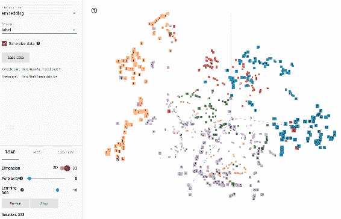

TensorBoard 说明了代码的输出

您必须通过按钮选择 T-SNE 和颜色，如屏幕截图所示，以获得类似的可视化效果。 您可以看到数字如何一起出现。 该可视化对于检查数据和经过训练的嵌入非常有用。 这是 TensorBoard 的另一个强大功能。 在下一部分中，我们将实现可视化的引导反向传播。

# 引导反向传播

直接将特征可视化可能会减少信息量。 因此，我们使用反向传播的训练过程来激活滤镜以实现更好的可视化。 由于我们选择了要激活的神经元以进行反向传播，因此称为引导反向传播。 在本节中，我们将实现引导式反向传播以可视化特征。

我们将定义大小并加载 VGG 模型，如下所示：

```py
image_width, image_height = 128, 128 vgg_model = tf.keras.applications.vgg16.VGG16(include_top=False)
```

层由以层名称作为键的字典组成，模型中的层以权重作为键值，以方便访问。 现在，我们将从第五个块 `block5_conv1` 中获取第一卷积层，以计算可视化效果。 输入和输出在此处定义：

```py
input_image = vgg_model.input
vgg_layer_dict = dict([(vgg_layer.name, vgg_layer) for vgg_layer in vgg_model.layers[1:]])
vgg_layer_output = vgg_layer_dict['block5_conv1'].output
```

我们必须定义损失函数。 损失函数将最大化特定层的激活。 这是一个梯度上升过程，而不是通常的梯度下降过程，因为我们正在尝试使损失函数最大化。 对于梯度上升，平滑梯度很重要。 因此，在这种情况下，我们通过归一化像素梯度来平滑梯度。 该损失函数快速收敛而不是。

应该对图像的输出进行归一化以可视化，在优化过程中使用 g 辐射上升来获得函数的最大值。 现在，我们可以通过定义评估器和梯度来开始梯度上升优化，如下所示。 现在，必须定义损失函数，并要计算的梯度。 迭代器通过迭代计算损耗和梯度值，如下所示：

```py
filters = []
for filter_idx in range(20):
    loss = tf.keras.backend.mean(vgg_layer_output[:, :, :, filter_idx])
    gradients = tf.keras.backend.gradients(loss, input_image)[0]
    gradient_mean_square = tf.keras.backend.mean(tf.keras.backend.square(gradients))
    gradients /= (tf.keras.backend.sqrt(gradient_mean_square) + 1e-5)
    evaluator = tf.keras.backend.function([input_image], [loss, gradients])
```

输入是随机的灰度图像，并添加了一些噪声。 如此处所示，将生成随机图像并完成缩放。

```py
 gradient_ascent_step = 1.
    input_image_data = np.random.random((1, image_width, image_height, 3))
    input_image_data = (input_image_data - 0.5) * 20 + 128  
```

现在开始对损失函数进行优化，对于某些过滤器，损失值可能为 0，应将其忽略，如下所示：

```py
 for i in range(20):
        loss_value, gradient_values = evaluator([input_image_data])
        input_image_data += gradient_values * gradient_ascent_step
        # print('Loss :', loss_value)
  if loss_value <= 0.:
            break
```

优化之后，通过均值减去并调整标准差来完成归一化。 然后，可以按比例缩小滤镜并将其裁剪到其梯度值，如下所示：

```py
 if loss_value > 0:
        filter = input_image_data[0]
        filter -= filter.mean()
        filter /= (filter.std() + 1e-5)
        filter *= 0.1
  filter += 0.5
  filter = np.clip(filter, 0, 1)
        filter *= 255
  filter = np.clip(filter, 0, 255).astype('uint8')
        filters.append((filter, loss_value))
```

这些过滤器是随机选择的，并在此处可视化：

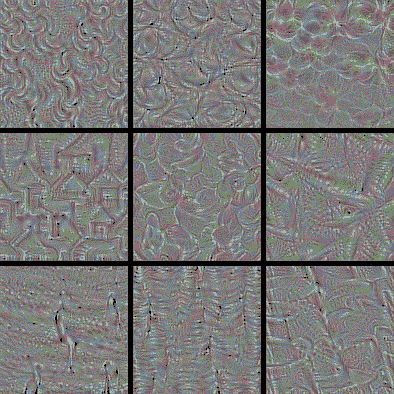

如图所示，用于缝合图像并产生输出的代码与代码束一起提供。 由于修道院的接受区域变大，因此可视化在以后的层变得复杂。 一些滤镜看起来很相似，但只是旋转而已。 在这种情况下，可视化的层次结构可以清楚地看到，[如 Zeiler 等人所示](https://arxiv.org/pdf/1412.6572.pdf)。 下图显示了不同层的直接可视化：

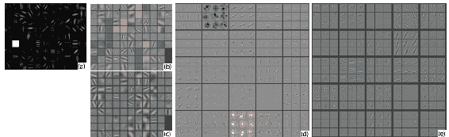

经 Zeiler 等人许可复制。

前两层看起来像边缘和角落检测器。 类似于 Gabor 的滤镜仅出现在第三层中。 Gabor 过滤器是线性的，传统上用于纹理分析。 我们已经直接通过引导反向传播看到了特征的可视化。 接下来，我们将看到如何实现 DeepDream 进行可视化。

# DeepDream

可以在网络中的某些层上放大神经元激活，而不是合成图像。 放大原始图像以查看特征效果的概念称为 **DeepDream**。 创建 DeepDream 的步骤是：

1.  拍摄图像并从 CNN 中选择一个层。
2.  在特定的层进行激活。
3.  修改梯度，以使梯度和激活相等。
4.  计算图像和反向传播的梯度。
5.  必须将正则化用于图像的抖动和归一化。
6.  像素值应修剪。
7.  为了实现分形效果，对图像进行了多尺度处理。

让我们从导入相关的包开始：

```py
import os
import numpy as np
import PIL.Image
import urllib.request
from tensorflow.python.platform import gfile
import zipfile
```

初始模型在`Imagenet`数据集和 Google 提供的模型文件上进行了预训练。 我们可以下载该模型并将其用于本示例。 模型文件的 ZIP 归档文件已下载并解压缩到一个文件夹中，如下所示：

```py
model_url = 'https://storage.googleapis.com/download.tensorflow.org/models/inception5h.zip'   file_name = model_url.split('/')[-1]

file_path = os.path.join(work_dir, file_name)

if not os.path.exists(file_path):
    file_path, _ = urllib.request.urlretrieve(model_url, file_path)

zip_handle = zipfile.ZipFile(file_path, 'r')
zip_handle.extractall(work_dir)
zip_handle.close()
```

这些命令应该在工作目录中创建了三个新文件。 可以将此预训练的模型加载到会话中，如下所示：

```py
graph = tf.Graph()
session = tf.InteractiveSession(graph=graph)
model_path = os.path.join(work_dir, 'tensorflow_inception_graph.pb')
with gfile.FastGFile(model_path, 'rb') as f:
    graph_defnition = tf.GraphDef()
    graph_defnition.ParseFromString(f.read())
```

会话从图初始化开始。 然后，将下载的模型的图定义加载到内存中。 作为预处理步骤，必须从输入中减去`ImageNet`平均值，如下所示。 预处理后的图像随后被馈送到该图，如下所示：

```py
input_placeholder = tf.placeholder(np.float32, name='input')
imagenet_mean_value = 117.0 preprocessed_input = tf.expand_dims(input_placeholder-imagenet_mean_value, 0)
tf.import_graph_def(graph_defnition, {'input': preprocessed_input})
```

现在，会话和图已准备好进行推断。 双线性插值需要`resize_image`函数。 可以添加`resize`函数方法，该函数通过 TensorFlow 会话来调整图像的大小，如下所示：

```py
def resize_image(image, size):
    resize_placeholder = tf.placeholder(tf.float32)
    resize_placeholder_expanded = tf.expand_dims(resize_placeholder, 0)
    resized_image = tf.image.resize_bilinear(resize_placeholder_expanded, size)[0, :, :, :]
    return session.run(resized_image, feed_dict={resize_placeholder: image})
```

可以将工作目录中的图像加载到内存中并转换为浮点值，如下所示：

```py
image_name = 'mountain.jpg' image = PIL.Image.open(image_name)
image = np.float32(image)
```

此处显示了已加载的图像，供您参考：

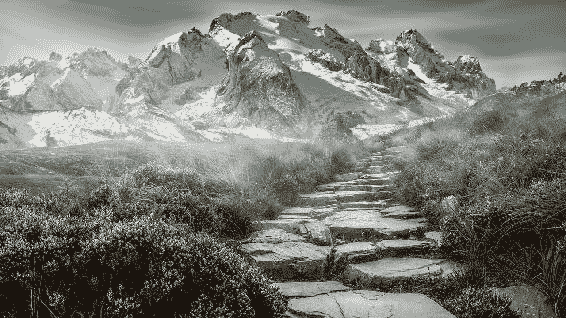

音阶空间的八度音阶数，大小和音阶在此处定义：

```py
no_octave = 4 scale = 1.4 window_size = 51
```

这些值在此处显示的示例中效果很好，因此需要根据其大小调整其他图像。 可以选择一个层来做梦，该层的平均平均值将是`objective`函数，如下所示：

```py
score = tf.reduce_mean(objective_fn)
gradients = tf.gradients(score, input_placeholder)[0]
```

计算图像的梯度以进行优化。 可以通过将图像调整为各种比例并找到差异来计算八度图像，如下所示：

```py
octave_images = []
for i in range(no_octave - 1):
    image_height_width = image.shape[:2]
    scaled_image = resize_image(image, np.int32(np.float32(image_height_width) / scale))
    image_difference = image - resize_image(scaled_image, image_height_width)
    image = scaled_image
    octave_images.append(image_difference)
```

现在可以使用所有八度图像运行优化。 窗口在图像上滑动，计算梯度激活以创建梦，如下所示：

```py
for octave_idx in range(no_octave):
    if octave_idx > 0:
        image_difference = octave_images[-octave_idx]
        image = resize_image(image, image_difference.shape[:2]) + image_difference

    for i in range(10):
        image_heigth, image_width = image.shape[:2]
        sx, sy = np.random.randint(window_size, size=2)
        shifted_image = np.roll(np.roll(image, sx, 1), sy, 0)
        gradient_values = np.zeros_like(image)

        for y in range(0, max(image_heigth - window_size // 2, window_size), window_size):
            for x in range(0, max(image_width - window_size // 2, window_size), window_size):
                sub = shifted_image[y:y + window_size, x:x + window_size]
                gradient_windows = session.run(gradients, {input_placeholder: sub})
                gradient_values[y:y + window_size, x:x + window_size] = gradient_windows

        gradient_windows = np.roll(np.roll(gradient_values, -sx, 1), -sy, 0)
        image += gradient_windows * (1.5 / (np.abs(gradient_windows).mean() + 1e-7))
```

现在，创建 DeepDream 的优化已完成，可以通过剪切值来保存，如下所示：

```py
image /= 255.0 image = np.uint8(np.clip(image, 0, 1) * 255)
PIL.Image.fromarray(image).save('dream_' + image_name, 'jpeg')
```

在本节中，我们已经看到了创建 DeepDream 的过程。 结果显示在这里：

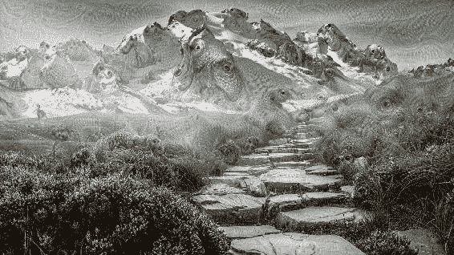

如我们所见，狗到处都被激活。 您可以尝试其他各种层并查看结果。 这些结果可用于艺术目的。 类似地，可以激活其他层以产生不同的伪像。 在下一节中，我们将看到一些对抗性示例，这些示例可能会欺骗深度学习模型。

# 对抗性示例

在几个数据集上，图像分类算法已达到人类水平的准确率。 但是它们可以被对抗性例子轻易地欺骗。 对抗示例是合成图像，它们使模型无法产生所需的结果。 拍摄任何图像，然后选择不正确的随机目标类别。 可以用噪声修改该图像，[直到网络被 Goodfellow 等人所欺骗](https://arxiv.org/pdf/1412.6572.pdf)。 该模型的对抗攻击示例如下所示：


经 Goodfellow 等人许可复制。

在此图中，左侧显示的图像具有特定标签的 58% 可信度。 左边的图像与中间显示的噪声结合在一起时，在右边形成图像。 对于人来说，带有噪点的图像看起来还是一样。 但是带有噪点的图像可以通过具有 97% 置信度的其他标签来预测。 尽管图像具有非常不同的对象，但仍将高置信度分配给特定示例。 这是深度学习模型的问题，因此，您应该了解这在哪里适用：

*   甚至可以在不访问模型的情况下生成对抗性示例。 您可以训练自己的模型，生成对抗性示例，但仍然可以欺骗其他模型。
*   在实践中这种情况很少发生，但是当有人试图欺骗系统来发送垃圾邮件或崩溃时，这将成为一个真正的问题。
*   所有机器学习模型都容易受到此问题的影响，而不仅仅是深度学习模型。

您应该考虑对抗性示例，了解在安全关键系统上部署深度学习模型的后果。 在下一节中，我们将看到如何利用 TensorFlow Serving 获得更快的推断。

# 模型推理

任何新数据都可以传递给模型以获取结果。 从图像获取分类结果或特征的过程称为**推理**。 训练和推理通常在不同的计算机上和不同的时间进行。 我们将学习如何存储模型，运行推理以及如何使用 TensorFlow Serving 作为具有良好延迟和吞吐量的服务器。

# 导出模型

训练后的模型必须导出并保存。 权重，偏差和图都存储用于推断。 我们将训练 MNIST 模型并将其存储。 首先使用以下代码定义所需的常量：

```py
work_dir = '/tmp' model_version = 9 training_iteration = 1000 input_size = 784 no_classes = 10 batch_size = 100 total_batches = 200
```

`model_version`可以是一个整数，用于指定我们要导出以供服务的模型。 `feature config`存储为具有占位符名称及其对应数据类型的字典。 应该映射预测类及其标签。 身份占位符可与 API 配合使用：

```py
tf_example = tf.parse_example(tf.placeholder(tf.string, name='tf_example'),
  {'x': tf.FixedLenFeature(shape=[784], dtype=tf.float32), })
x_input = tf.identity(tf_example['x'], name='x')
```

可以使用以下代码使用权重，偏差，对数和优化器定义一个简单的分类器：

```py
y_input = tf.placeholder(tf.float32, shape=[None, no_classes])
weights = tf.Variable(tf.random_normal([input_size, no_classes]))
bias = tf.Variable(tf.random_normal([no_classes]))
logits = tf.matmul(x_input, weights) + bias
softmax_cross_entropy = tf.nn.softmax_cross_entropy_with_logits(labels=y_input, logits=logits)
loss_operation = tf.reduce_mean(softmax_cross_entropy)
optimiser = tf.train.GradientDescentOptimizer(0.5).minimize(loss_operation)
```

训练模型，如以下代码所示：

```py
mnist = input_data.read_data_sets('MNIST_data', one_hot=True)
for batch_no in range(total_batches):
    mnist_batch = mnist.train.next_batch(batch_size)
    _, loss_value = session.run([optimiser, loss_operation], feed_dict={
        x_input: mnist_batch[0],
  y_input: mnist_batch[1]
    })
    print(loss_value)
```

定义预测签名，并导出模型。 将模型保存到持久性存储中，以便可以在以后的时间点进行推理。 这将通过反序列化导出数据，并将其存储为其他系统可以理解的格式。 具有不同变量和占位符的多个图可用于导出。 它还支持`signature_defs` 和素材。 `signature_defs`指定了输入和输出，因为将从外部客户端访问输入和输出。 素材是将用于推理的非图组件，例如词汇表等。

分类签名使用对 TensorFlow 分类 API 的访问权限。 输入是强制性的，并且有两个可选输出（预测类别和预测概率），其中至少一个是强制性的。 预测签名提供输入和输出数量的灵活性。 可以定义多个输出并从客户端显式查询。 `signature_def`显示在此处：

```py
signature_def = (
      tf.saved_model.signature_def_utils.build_signature_def(
          inputs={'x': tf.saved_model.utils.build_tensor_info(x_input)},
  outputs={'y': tf.saved_model.utils.build_tensor_info(y_input)},
  method_name="tensorflow/serving/predict"))
```

最后，使用预测签名将元图和变量添加到构建器中：

```py
model_path = os.path.join(work_dir, str(model_version))
saved_model_builder = tf.saved_model.builder.SavedModelBuilder(model_path)
saved_model_builder.add_meta_graph_and_variables(
      session, [tf.saved_model.tag_constants.SERVING],
  signature_def_map={
          'prediction': signature_def
      },
  legacy_init_op=tf.group(tf.tables_initializer(), name='legacy_init_op'))
saved_model_builder.save()
```

该构建器已保存，可以由服务器使用。 所示示例适用于任何模型，并可用于导出。 在下一部分中，我们将服务并查询导出的模型。

# 服务训练过的模型

可以使用以下命令通过 TensorFlow Serving 服务上一节中导出的模型：

```py
tensorflow_model_server --port=9000  --model_name=mnist --model_base_path=/tmp/mnist_model/
```

`model_base_path` 指向导出模型的目录。 现在可以与客户端一起测试服务器。 请注意，这不是 HTTP 服务器，因此需要此处显示的客户端而不是 HTTP 客户端。 导入所需的库：

```py
from grpc.beta import implementations
import numpy
import tensorflow as tf
from tensorflow.examples.tutorials.mnist import input_data
from tensorflow_serving.apis import predict_pb2
from tensorflow_serving.apis import prediction_service_pb2
```

添加并发常数，测试数量和工作目录。 定义了一个类，用于对返回的结果进行计数。 定义了**远程过程调用**（**RPC**）回调，并带有用于对预测计数的计数器，如下所示：

```py
concurrency = 1 num_tests = 100 host = '' port = 8000 work_dir = '/tmp'     def _create_rpc_callback():
  def _callback(result):
      response = numpy.array(
        result.result().outputs['y'].float_val)
      prediction = numpy.argmax(response)
      print(prediction)
  return _callback
```

根据您的要求修改  `host` 和  `port` 。 `_callback`方法定义了从服务器返回响应时所需的步骤。 在这种情况下，将计算最大概率。 通过调用服务器来运行推断：

```py
test_data_set = mnist.test
test_image = mnist.test.images[0]

predict_request = predict_pb2.PredictRequest()
predict_request.model_spec.name = 'mnist' predict_request.model_spec.signature_name = 'prediction'   predict_channel = implementations.insecure_channel(host, int(port))
predict_stub = prediction_service_pb2.beta_create_PredictionService_stub(predict_channel)

predict_request.inputs['x'].CopyFrom(
    tf.contrib.util.make_tensor_proto(test_image, shape=[1, test_image.size]))
result = predict_stub.Predict.future(predict_request, 3.0)
result.add_done_callback(
    _create_rpc_callback())
```

反复调用推理以评估准确率，延迟和吞吐量。 推断错误率应该在 90% 左右，并且并发性应该很高。 导出和客户端方法可用于任何模型，以从模型获得结果和特征。 在下一节中，我们将构建检索流水线。

# 基于内容的图像检索

**基于内容的图像检索**（**CBIR**）的技术将查询图像作为输入，并对目标图像数据库中的图像进行排名，从而产生输出。 CBIR 是具有特定目标的图像到图像搜索引擎。 要检索需要目标图像数据库。 返回距查询图像最小距离的目标图像。 我们可以直接将图像用于相似性，但是问题如下：

*   图像尺寸巨大
*   像素中有很多冗余
*   像素不携带语义信息

因此，我们训练了一个用于对象分类的模型，并使用该模型中的特征进行检索。 然后，我们通过相同的模型传递查询图像和目标数据库以获得特征。 这些模型也可以称为**编码器**，因为它们对特定任务的图像信息进行编码。 编码器应该能够捕获全局和局部特征。 我们可以使用我们在图像分类一章中研究过的模型，这些模型经过训练可以进行分类任务。 由于强力扫描或线性扫描速度较慢，因此图像搜索可能会花费大量时间。 因此，需要一些用于更快检索的方法。 以下是一些加快匹配速度的方法：

*   **局部敏感哈希**（**LSH**）：LSH 将特征投影到其子空间，并可以向候选对象提供列表，并在以后进行精细特征排名。 这也是我们本章前面介绍的降维技术，例如 PCA 和 t-SNE。 它具有较小尺寸的铲斗。
*   **多索引哈希**：此方法对特征进行哈希处理，就像信鸽拟合一样，可以使其更快。 它使用汉明距离来加快计算速度。 汉明距离不过是以二进制表示的数字的位置差异的数量。

这些方法更快，需要更少的内存，但要权衡准确率。 这些方法也没有捕获语义上的差异。 可以根据查询对匹配结果进行重新排名以获得更好的结果。 重新排序可以通过对返回的目标图像重新排序来改善结果。 重新排序可以使用以下技术之一：

*   **几何验证**：此方法将几何图形和目标图像与仅返回相似几何图形的目标图像进行匹配。
*   **查询扩展**：这将扩展目标图像列表并详尽搜索它们。
*   **相关性反馈**：此方法从使用中获取反馈并返回结果。 根据用户输入，将进行重新排名。

这些技术已针对文本进行了很好的开发，可用于图像。 在本章中，我们将重点介绍提取特征并将其用于 CBIR。 在下一节中，我们将学习如何进行模型推断。

# 建立检索流水线

从查询图像的目标图像中获得最佳匹配的步骤序列称为**检索流水线**。 检索流水线具有多个步骤或组件。 图像数据库的特征必须脱机提取并存储在数据库中。 对于每个查询图像，必须提取特征并且必须在所有目标图像之间计算相似度。 然后，可以对图像进行排名以最终输出。 检索流水线如下所示：

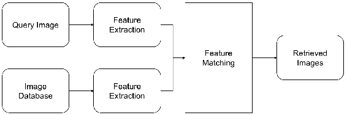

特征提取步骤必须快速，为此可以使用 TensorFlow Serving。 您可以根据应用选择使用哪些特征。 例如，当需要基于纹理的匹配时可以使用初始层，而当必须在对象级别进行匹配时可以使用更高的层。 在下一部分中，我们将看到如何从预训练的初始模型中提取特征。

# 提取图像的瓶颈特征

瓶颈特征是在预分类层中计算的值。 在本节中，我们将看到如何使用 TensorFlow 从预训练的模型中提取瓶颈特征。 首先，使用以下代码导入所需的库：

```py
import os
import urllib.request
from tensorflow.python.platform import gfile
import tarfile
```

然后，我们需要下载带有图定义及其权重的预训练模型。 TensorFlow 已使用初始架构在`ImageNet`数据集上训练了一个模型，并提供了该模型。 我们将使用以下代码下载该模型并将其解压缩到本地文件夹中：

```py
model_url = 'http://download.tensorflow.org/models/image/imagenet/inception-2015-12-05.tgz' file_name = model_url.split('/')[-1]
file_path = os.path.join(work_dir, file_name)

if not os.path.exists(file_path):
    file_path, _ = urllib.request.urlretrieve(model_url, file_path)
tarfile.open(file_path, 'r:gz').extractall(work_dir)
```

仅当模型不存在时，这会创建一个文件夹并下载模型。 如果重复执行代码，则不会每次都下载模型。 该图以**协议缓冲区**（**protobuf**）格式存储在文件中。 必须将其读取为字符串，然后传递给`tf.GraphDef()`对象以将其带入内存：

```py
model_path = os.path.join(work_dir, 'classify_image_graph_def.pb')
with gfile.FastGFile(model_path, 'rb') as f:
    graph_defnition = tf.GraphDef()
    graph_defnition.ParseFromString(f.read())
```

在初始模型中，瓶颈层名为`pool_3/_reshape:0`，并且该层的尺寸为 2,048。 输入的占位符名称为`DecodeJpeg/contents:0`，调整大小张量名称为`ResizeBilinear:0`。 我们可以使用`tf.import_graph_def`和所需的返回张量导入图定义，以进行进一步的操作：

```py
bottleneck, image, resized_input = (
    tf.import_graph_def(
        graph_defnition,
  name='',
  return_elements=['pool_3/_reshape:0',
  'DecodeJpeg/contents:0',
  'ResizeBilinear:0'])
)
```

进行查询和目标图像并将其加载到内存中。 `gfile`函数提供了一种更快的方式将图像加载到内存中。

```py
query_image_path = os.path.join(work_dir, 'cat.1000.jpg')
query_image = gfile.FastGFile(query_image_path, 'rb').read()
target_image_path = os.path.join(work_dir, 'cat.1001.jpg')
target_image = gfile.FastGFile(target_image_path, 'rb').read()
```

让我们定义一个使用`session`和图像从图像中提取瓶颈特征的函数：

```py
def get_bottleneck_data(session, image_data):
    bottleneck_data = session.run(bottleneck, {image: image_data})
    bottleneck_data = np.squeeze(bottleneck_data)
    return bottleneck_data
```

启动会话，并传递图像以运行前向推理，以从预先训练的模型中获取瓶颈值：

```py
query_feature = get_bottleneck_data(session, query_image)
print(query_feature)
target_feature = get_bottleneck_data(session, target_image)
print(target_feature)
```

运行上面的代码应显示如下：

```py
[ 0.55705792 0.36785451 1.06618118 ..., 0.6011821 0.36407694
 0.0996572 ]
[ 0.30421323 0.0926369 0.26213276 ..., 0.72273785 0.30847171
 0.08719242]
```

该计算特征的过程可以按比例缩放以获取更多目标图像。 使用这些值，可以在查询图像和目标数据库之间计算相似度，如以下部分所述。

# 计算查询图像与目标数据库之间的相似度

NumPy 的`linalg.norm`可用于计算**欧几里德距离**。 可以通过计算特征之间的欧几里得距离来计算查询图像与目标数据库之间的相似度，如下所示：

```py
dist = np.linalg.norm(np.asarray(query_feature) - np.asarray(target_feature))
print(dist)
```

运行此命令应打印以下内容：

```py
16.9965
```

这是可用于相似度计算的度量。 查询与目标图像之间的欧几里得距离越小，图像越相似。 因此，计算欧几里得距离是相似度的量度。 使用特征来计算欧几里得距离是基于这样的假设：在训练模型的过程中学习了这些特征。 将这种计算扩展成数百万个图像效率不高。 在生产系统中，期望以毫秒为单位返回结果。 在下一节中，我们将看到如何提高检索效率。

# 高效检索

检索可能很慢，因为它是蛮力方法。 使用近似最近邻可以使匹配更快。 维度的诅咒也开始出现，如下图所示：

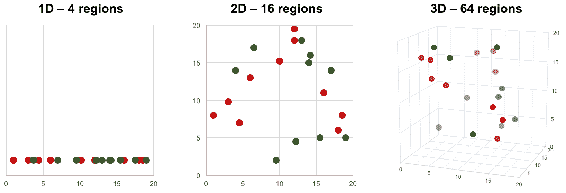

随着维数的增加，复杂度也从二维维增加到三个维。 距离的计算也变慢。 为了使距离搜索更快，我们将在下一部分中讨论一种近似方法。

# 使用近似最近邻更快地匹配

**近似最近邻**（**ANNOY**）是一种用于更快进行最近邻搜索的方法。 ANNOY 通过随机投影来构建树。 树结构使查找最接近的匹配更加容易。 您可以创建`ANNOYIndex`以便快速检索，如下所示：

```py
def create_annoy(target_features):
    t = AnnoyIndex(layer_dimension)
    for idx, target_feature in enumerate(target_features):
        t.add_item(idx, target_feature)
    t.build(10)
    t.save(os.path.join(work_dir, 'annoy.ann'))

create_annoy(target_features)
```

创建索引需要特征的尺寸。 然后将项目添加到索引并构建树。 树木的数量越多，在时间和空间复杂度之间进行权衡的结果将越准确。 可以创建索引并将其加载到内存中。 可以查询 ANNOY，如下所示：

```py
annoy_index = AnnoyIndex(10)
annoy_index.load(os.path.join(work_dir, 'annoy.ann'))
matches = annoy_index.get_nns_by_vector(query_feature, 20)
```

匹配项列表可用于检索图像详细信息。 项目的索引将被返回。

请访问[这里](https://github.com/spotify/annoy)以获取`ANNOY`的完整实现，以及其在准确率和速度方面与其他近似最近邻算法的基准比较。

# ANNOY 的优点

使用 ANNOY 的原因很多。 主要优点如下：

*   具有内存映射的数据结构，因此对 RAM 的占用较少。 因此，可以在多个进程之间共享同一文件。
*   可以使用曼哈顿，余弦或欧几里得等多种距离来计算查询图像和目标数据库之间的相似度。

# 原始图像的自编码器

自编码器是一种用于生成有效编码的无监督算法。 输入层和目标输出通常相同。 减少和增加之间的层以下列方式：

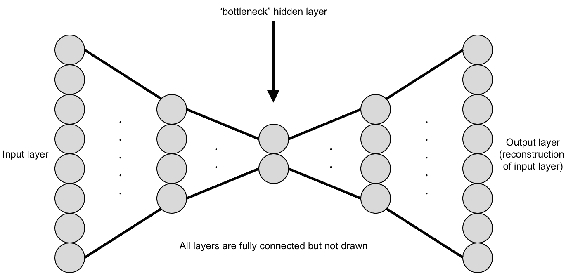

**瓶颈**层是尺寸减小的中间层。 瓶颈层的左侧称为**编码器**，右侧称为**解码器**。 编码器通常减小数据的尺寸，而解码器增大尺寸。 编码器和解码器的这种组合称为自编码器。 整个网络都经过重建误差训练。 从理论上讲，可以存储瓶颈层，并可以通过解码器网络重建原始数据。 如下所示，这可以减小尺寸并易于编程。 使用以下代码定义卷积，解卷积和全连接层：

```py
def fully_connected_layer(input_layer, units):
    return tf.layers.dense(
        input_layer,
  units=units,
  activation=tf.nn.relu
    )

def convolution_layer(input_layer, filter_size):
    return tf.layers.conv2d(
        input_layer,
  filters=filter_size,
  kernel_initializer=tf.contrib.layers.xavier_initializer_conv2d(),
  kernel_size=3,
  strides=2
  )

def deconvolution_layer(input_layer, filter_size, activation=tf.nn.relu):
    return tf.layers.conv2d_transpose(
        input_layer,
  filters=filter_size,
  kernel_initializer=tf.contrib.layers.xavier_initializer_conv2d(),
  kernel_size=3,
  activation=activation,
  strides=2
  )
```

定义具有五层卷积的会聚编码器，如以下代码所示：

```py
input_layer = tf.placeholder(tf.float32, [None, 128, 128, 3])
convolution_layer_1 = convolution_layer(input_layer, 1024)
convolution_layer_2 = convolution_layer(convolution_layer_1, 512)
convolution_layer_3 = convolution_layer(convolution_layer_2, 256)
convolution_layer_4 = convolution_layer(convolution_layer_3, 128)
convolution_layer_5 = convolution_layer(convolution_layer_4, 32)
```

通过展平第五个卷积层来计算瓶颈层。 再次将瓶颈层重新成形为卷积层，如下所示：

```py
convolution_layer_5_flattened = tf.layers.flatten(convolution_layer_5)
bottleneck_layer = fully_connected_layer(convolution_layer_5_flattened, 16)
c5_shape = convolution_layer_5.get_shape().as_list()
c5f_flat_shape = convolution_layer_5_flattened.get_shape().as_list()[1]
fully_connected = fully_connected_layer(bottleneck_layer, c5f_flat_shape)
fully_connected = tf.reshape(fully_connected,
  [-1, c5_shape[1], c5_shape[2], c5_shape[3]])
```

计算可以重建图像的发散或解码器部分，如以下代码所示：

```py
deconvolution_layer_1 = deconvolution_layer(fully_connected, 128)
deconvolution_layer_2 = deconvolution_layer(deconvolution_layer_1, 256)
deconvolution_layer_3 = deconvolution_layer(deconvolution_layer_2, 512)
deconvolution_layer_4 = deconvolution_layer(deconvolution_layer_3, 1024)
deconvolution_layer_5 = deconvolution_layer(deconvolution_layer_4, 3,
  activation=tf.nn.tanh)
```

该网络经过训练，可以快速收敛。 传递图像特征时可以存储瓶颈层。 这有助于减少可用于检索的数据库的大小。 仅需要编码器部分即可为特征建立索引。 自编码器是一种有损压缩算法。 它与其他压缩算法不同，因为它从数据中学习压缩模式。 因此，自编码器模型特定于数据。 自编码器可以与 t-SNE 结合使用以获得更好的可视化效果。 自编码器学习的瓶颈层可能对其他任务没有用。 瓶颈层的大小可以大于以前的层。 在这种分叉和收敛连接的情况下，稀疏的自编码器就会出现。 在下一节中，我们将学习自编码器的另一种应用。

# 使用自编码器进行降噪

自编码器也可以用于图像去噪。 去噪是从图像中去除噪点的过程。 去噪编码器可以无监督的方式进行训练。 可以在正常图像中引入噪声，并针对原始图像训练自编码器。 以后，可以使用完整的自编码器生成无噪声的图像。 在本节中，我们将逐步说明如何去噪 MNIST 图像。 导入所需的库并定义占位符，如下所示：

```py
x_input = tf.placeholder(tf.float32, shape=[None, input_size])
y_input = tf.placeholder(tf.float32, shape=[None, input_size])
```

`x_input`和`y_input`的形状与自编码器中的形状相同。 然后，定义一个密集层，如下所示，默认激活为`tanh`激活函数。 `add_variable_summary`方法是从图像分类章节示例中导入的。 密集层的定义如下所示：

```py
def dense_layer(input_layer, units, activation=tf.nn.tanh):
    layer = tf.layers.dense(
        inputs=input_layer,
  units=units,
  activation=activation
    )
    add_variable_summary(layer, 'dense')
    return layer
```

接下来，可以定义自编码器层。 该自编码器仅具有全连接层。 编码器部分具有减小尺寸的三层。 解码器部分具有增加尺寸的三层。 编码器和解码器都是对称的，如下所示：

```py
layer_1 = dense_layer(x_input, 500)
layer_2 = dense_layer(layer_1, 250)
layer_3 = dense_layer(layer_2, 50)
layer_4 = dense_layer(layer_3, 250)
layer_5 = dense_layer(layer_4, 500)
layer_6 = dense_layer(layer_5, 784)
```

隐藏层的尺寸是任意选择的。 接下来，定义`loss`和`optimiser`。 这里我们使用 Sigmoid 代替 softmax 作为分类，如下所示：

```py
with tf.name_scope('loss'):
    softmax_cross_entropy = tf.nn.sigmoid_cross_entropy_with_logits(
        labels=y_input, logits=layer_6)
    loss_operation = tf.reduce_mean(softmax_cross_entropy, name='loss')
    tf.summary.scalar('loss', loss_operation)

with tf.name_scope('optimiser'):
    optimiser = tf.train.AdamOptimizer().minimize(loss_operation)
```

TensorBoard 提供了另一种称为`image,`的摘要，可用于可视化图像。 我们将使用输入`layer_6`并将其重塑形状以将其添加到摘要中，如下所示：

```py
x_input_reshaped = tf.reshape(x_input, [-1, 28, 28, 1])
tf.summary.image("noisy_images", x_input_reshaped)

y_input_reshaped = tf.reshape(y_input, [-1, 28, 28, 1])
tf.summary.image("original_images", y_input_reshaped)

layer_6_reshaped = tf.reshape(layer_6, [-1, 28, 28, 1])
tf.summary.image("reconstructed_images", layer_6_reshaped)
```

图像数量默认限制为三张，并且可以更改。 这是为了限制其将所有图像都写入摘要文件夹。 接下来，合并所有摘要，并将图添加到摘要编写器，如下所示：

```py
merged_summary_operation = tf.summary.merge_all()
train_summary_writer = tf.summary.FileWriter('/tmp/train', session.graph)
```

可以将正常的随机噪声添加到图像中并作为输入张量馈入。 添加噪声后，多余的值将被裁剪。 目标将是原始图像本身。 此处显示了噪声和训练过程的附加信息：

```py
for batch_no in range(total_batches):
    mnist_batch = mnist_data.train.next_batch(batch_size)
    train_images, _ = mnist_batch[0], mnist_batch[1]
    train_images_noise = train_images + 0.2 * np.random.normal(size=train_images.shape)
    train_images_noise = np.clip(train_images_noise, 0., 1.)
    _, merged_summary = session.run([optimiser, merged_summary_operation],
  feed_dict={
        x_input: train_images_noise,
  y_input: train_images,
  })
    train_summary_writer.add_summary(merged_summary, batch_no)
```

开始此训练后，可以在 TensorBoard 中查看结果。 损失显示在此处：
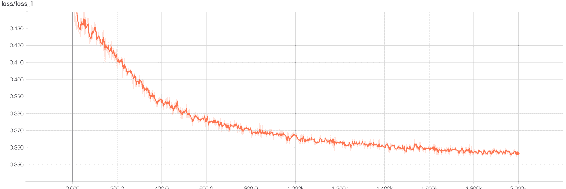

Tensorboard 说明了输出图

损耗稳步下降，并将在迭代过程中保持缓慢下降。 这显示了自编码器如何快速收敛。 接下来，原始图像显示三位数：


以下是添加了噪点的相同图像：

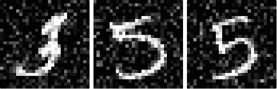

您会注意到有很大的噪音，这是作为输入给出的。 接下来，是使用去噪自编码器重建的相同编号的图像：

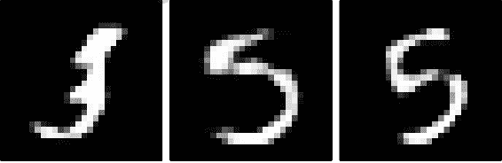

您会注意到，去噪自编码器在消除噪声方面做得非常出色。 您可以在测试图像上运行它，并可以看到质量得到保持。 对于更复杂的数据集，可以使用卷积神经网络以获得更好的结果。 该示例展示了计算机视觉深度学习的强大功能，因为它是在无监督的情况下进行训练的。

# 总结

在本章中，您学习了如何从图像中提取特征并将其用于 CBIR。 您还学习了如何使用 TensorFlow Serving 来推断图像特征。 我们看到了如何利用近似最近邻或更快的匹配而不是线性扫描。 您了解了散列如何仍可以改善结果。 引入了自编码器的概念，我们看到了如何训练较小的特征向量以进行搜索。 还显示了使用自编码器进行图像降噪的示例。 我们看到了使用基于位的比较的可能性，该比较可以将其扩展到数十亿张图像。

在下一章中，我们将看到如何训练对象检测问题的模型。 我们将利用开源模型来获得良好的准确率，并了解其背后的所有算法。 最后，我们将使用所有想法来训练行人检测模型。