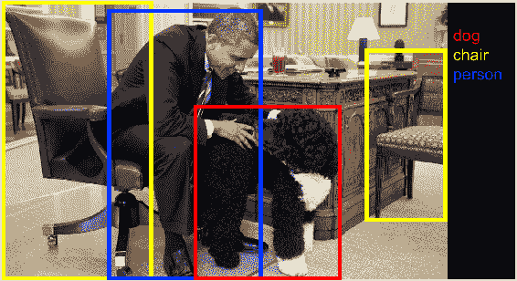
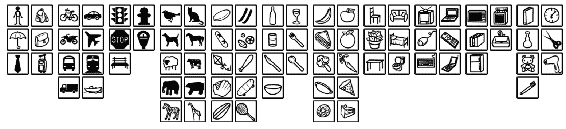
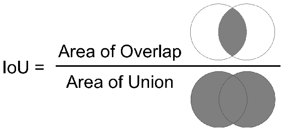
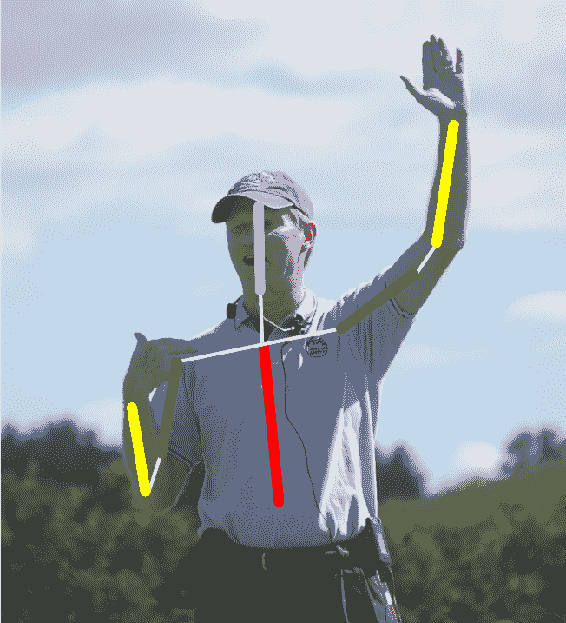
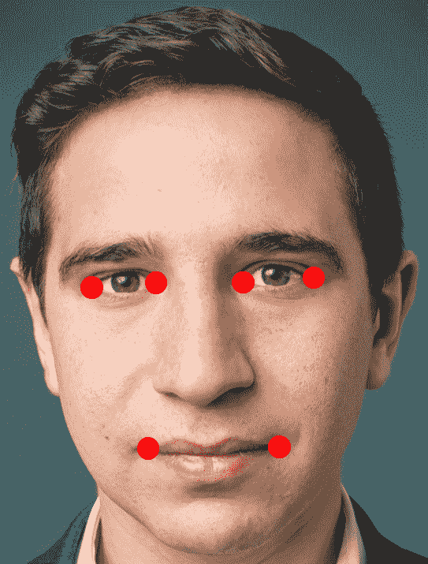
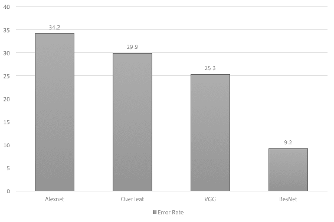
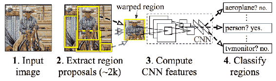
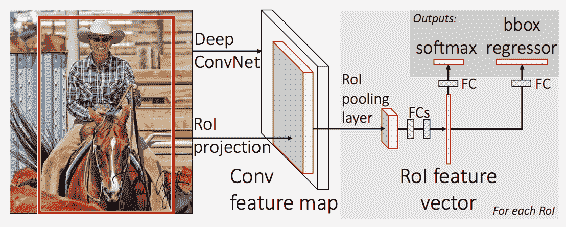
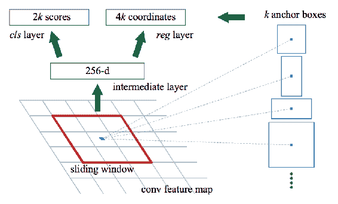
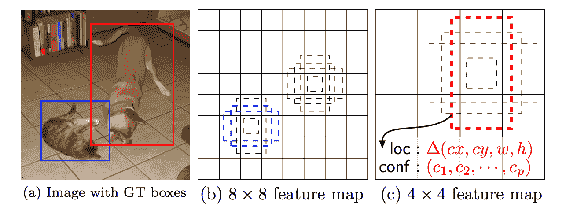

# 物体检测

对象检测是在图像中找到对象位置的动作。 在本章中，我们将通过了解以下主题来学习对象检测技术和实现行人检测：

*   基础知识以及定位和检测之间的区别
*   各种数据集及其描述
*   用于对象定位和检测的算法
*   TensorFlow API 用于对象检测
*   训练新的物体检测模型
*   基于 YOLO 算法的移动汽车行人检测

# 检测图像中的物体

近年来，对象检测在应用和研究方面都出现了爆炸式增长。 对象检测是计算机视觉中的重要问题。 与图像分类任务相似，更深的网络在检测方面表现出更好的性能。 目前，这些技术的准确性非常好。 因此，它被用于许多应用中。

图像分类将图像标记为一个整体。 除了标记对象外，找到对象的位置也称为**对象定位**。 通常，对象的位置由直角坐标定义。 在图像中使用直角坐标查找多个对象称为检测。 这是对象检测的示例：



该图显示了带有边界框的四个对象。 我们将学习可以执行查找框任务的算法。 这些应用在自动驾驶汽车和工业物体等机器人视觉领域具有巨大的应用前景。 我们可以将定位和检测任务概括为以下几点：

*   本地化检测标签内图像中的一个对象
*   检测可找到图像中的所有对象以及标签

区别在于对象的数量。 在检测中，存在可变数量的对象。 在设计与定位或检测有关的深度学习模型的体系结构时，此小差异会带来很大的不同。 接下来，我们将看到可用于任务的各种数据集。

# 探索数据集

可用于对象定位和检测的数据集很多。 在本节中，我们将探索研究社区用来评估算法的数据集。 有些数据集带有不同数量的对象，这些对象中标注的范围从 20 到 200 不等，这使得对象检测变得困难。 与其他数据集（每个图像仅包含一个对象）相比，某些数据集在一个图像中包含的对象太多。 接下来，我们将详细查看数据集。

# ImageNet 数据集

ImageNet 具有用于评估分类，本地化和检测任务的数据。 第 2 章，*图像分类*详细讨论了分类数据集。 与分类数据类似，本地化任务有 1,000 个类别。 准确度是根据前五次检测得出的。 所有图像中至少会有一个边界框。 有 470,000 张图像的检测问题有 200 个对象，每个图像平均有 1.1 个对象。

# PASCAL VOC 挑战

PASCAL VOC 挑战赛于 2005 年至 2012 年进行。该挑战赛被认为是物体检测技术的基准。 数据集中有 20 个类别。 该数据集包含用于训练和验证的 11,530 张图像，以及针对感兴趣区域的 27,450 条注释。 以下是数据集中存在的二十个类：

*   人： P 人
*   动物： B ird，猫，牛，狗，马，绵羊
*   车辆： A 飞机，自行车，轮船，公共汽车，汽车，摩托车，火车
*   室内： B 水壶，椅子，餐桌，盆栽，沙发，电视/显示器

您可以从[这里](http://host.robots.ox.ac.uk/pascal/VOC/voc2012/VOCtrainval_11-May-2012.tar)下载数据集。 每个图像平均有 2.4 个对象。

# 可可物体检测挑战

上下文（ **COCO** ）数据集中的**通用对象具有 200,000 张图像，其中 80 个类别的注释超过 500,000 个。 它是最广泛的公开可用的对象检测数据库。 下图显示了数据集中存在的对象的列表：**



每个图像的平均对象数为 7.2。 这些是物体检测挑战的著名数据集。 接下来，我们将学习如何针对这些数据集评估算法。

# 使用指标评估数据集

指标对于深度学习任务中的理解至关重要。 由于人工注释，对象检测和定位的度量是特殊的。 人类可能已经注释了一个名为 **Ground-truth** 的框。 真实性不一定是绝对真理。 此外，盒子的像素可能因人而异。 因此，算法很难检测到人类绘制的确切边界框。 **联合交叉口**（ **IoU** ）用于评估定位任务。 **平均精确度平均值**（ **mAP** ）用于评估检测任务。 我们将在下一部分中看到指标的描述。

# 联合路口

IoU 是**地面实况**与预测面积的重叠面积与总面积之比。 这是该指标的直观说明：



这两个正方形代表地面实况和预测的边界框。 IoU 计算为重叠面积与并集面积之比。 这是给定地面真理和预测边界框的 IoU 计算脚本：

```py
def calculate_iou(gt_bb, pred_bb):
    '''
  :param gt_bb: ground truth bounding box  :param pred_bb: predicted bounding box '''  gt_bb = tf.stack([
        gt_bb[:, :, :, :, 0] - gt_bb[:, :, :, :, 2] / 2.0,
  gt_bb[:, :, :, :, 1] - gt_bb[:, :, :, :, 3] / 2.0,
  gt_bb[:, :, :, :, 0] + gt_bb[:, :, :, :, 2] / 2.0,
  gt_bb[:, :, :, :, 1] + gt_bb[:, :, :, :, 3] / 2.0])
    gt_bb = tf.transpose(gt_bb, [1, 2, 3, 4, 0])
    pred_bb = tf.stack([
        pred_bb[:, :, :, :, 0] - pred_bb[:, :, :, :, 2] / 2.0,
  pred_bb[:, :, :, :, 1] - pred_bb[:, :, :, :, 3] / 2.0,
  pred_bb[:, :, :, :, 0] + pred_bb[:, :, :, :, 2] / 2.0,
  pred_bb[:, :, :, :, 1] + pred_bb[:, :, :, :, 3] / 2.0])
    pred_bb = tf.transpose(pred_bb, [1, 2, 3, 4, 0])
    area = tf.maximum(
        0.0,
  tf.minimum(gt_bb[:, :, :, :, 2:], pred_bb[:, :, :, :, 2:]) -
        tf.maximum(gt_bb[:, :, :, :, :2], pred_bb[:, :, :, :, :2]))
    intersection_area= area[:, :, :, :, 0] * area[:, :, :, :, 1]
    gt_bb_area = (gt_bb[:, :, :, :, 2] - gt_bb[:, :, :, :, 0]) * \
                 (gt_bb[:, :, :, :, 3] - gt_bb[:, :, :, :, 1])
    pred_bb_area = (pred_bb[:, :, :, :, 2] - pred_bb[:, :, :, :, 0]) * \
                   (pred_bb[:, :, :, :, 3] - pred_bb[:, :, :, :, 1])
    union_area = tf.maximum(gt_bb_area + pred_bb_area - intersection_area, 1e-10)
    iou = tf.clip_by_value(intersection_area / union_area, 0.0, 1.0)
    return iou
```

地面真相和预测的边界框堆叠在一起。 然后在处理负面积的情况下计算面积。 当边界框坐标不正确时，可能会出现负区域。 框的右侧坐标很多发生在从左到左的坐标上。 由于没有保留边界框的结构，因此必然会出现负区域。 计算联合和交叉区域，然后进行最终的 IoU 计算，该计算是与 **地面  真相** 的预测面积与 总面积。 IoU 计算可以与算法结合使用，以训练定位问题。

# 平均平均精度

mAP 用于评估检测算法。 mAP 度量是检测到的边界框的精度和召回率的乘积。 mAP 值的范围是 0 到 100。数字越大，则越好。 可以通过分别为每个类别计算**平均精度**（ **AP** ），然后计算该类别的平均值来计算 mAP。 仅当 mAP 高于 0.5 时，检测结果才被视为真正的阳性。 通过绘制每个类别的绘制精度/召回曲线，可以合并来自测试图像的所有检测。 曲线下的最终区域可用于算法比较。 mAP 是衡量网络灵敏度的一种很好的方法，同时不会引发很多错误警报。 我们已经了解了数据集的评估算法。 接下来，我们将研究本地化任务的算法。

# 本地化算法

定位算法是在第 2 章，*图像分类*和第 3 章，*图像检索*中学习的材料的扩展。 在图像分类中，图像经过 CNN（卷积神经网络）的多层。 CNN 的最后一层输出属于每个标签的概率值。 可以扩展它以定位对象。 我们将在以下各节中看到这些想法。

# 使用滑动窗口定位对象

定位的一种直观方法是使用对象预测图像的多个裁剪部分。 可以通过在图像上移动一个窗口并为每个窗口进行预测来完成图像的裁剪。 移动比图像小的窗口并根据窗口大小裁剪图像的方法称为**滑动窗口**。 可以对图像的每个裁剪窗口进行预测，这称为滑动窗口对象检测。

可以通过针对紧密裁剪的图像进行图像分类问题训练的深度学习模型来完成预测。 近距离修剪意味着在整个图像中只会找到一个对象。 窗口在整个图像上的移动必须一致。 图像的每个部分都会通过模型以找到分类。 这种方法有两个问题。

*   它只能找到与窗口大小相同的对象。 如果对象大小大于窗口大小，则滑动窗口将丢失对象。 为了克服这个问题，我们将使用**标度空间** 的概念。
*   另一个问题是，将窗口移到像素上方可能会导致丢失一些对象。 在每个像素上移动窗口会导致大量额外的计算，因此会降低系统速度。 为避免这种情况，我们将在卷积层中加入一个技巧。

在下一节中，我们将介绍这两种技术。

# 比例空间概念

比例空间是使用各种大小的图像的概念。 图像会缩小为较小的尺寸，因此可以在相同尺寸的窗口中检测到较大的物体。 可以使用减小的尺寸将图像调整为某些尺寸。 通过删除替代像素或插值来调整图像大小可能会留下一些伪像。 因此，图像被平滑并迭代调整大小。 通过平滑和调整大小获得的图像是比例空间。

窗口在每个刻度上滑动以定位对象。 运行多个比例相当于使用更大的窗口运行图像。 在多个规模上运行的计算复杂度很高。 可以通过以准确性为代价进行快速移动来加快本地化速度。 复杂性使解决方案无法在生产中使用。 滑动窗口的思想可以通过完全卷积的滑动窗口实现而变得高效。

# 将完全连接的层训练为卷积层

滑动窗口的问题是计算复杂度。 复杂性是因为对每个窗口都进行了预测。 已针对重叠区域的每个窗口计算了深度学习功能。 可以减少裁剪窗口中重叠区域的特征计算。 解决方案是使用仅计算一次特征的全卷积网络。 为了理解全卷积网络，让我们首先看看如何将全连接层转换为`convolution_layer`。 内核更改为相同的大小，并使用与神经元数量相同的过滤器数量。 也可以对其他层重复此操作。 更改内核大小是将完全连接的层转换为`convolution_layer`的简便方法：

```py
convolution_layer_1 = convolution_layer(x_input_reshape, 64)
pooling_layer_1 = pooling_layer(convolution_layer_1)
convolution_layer_2 = convolution_layer(pooling_layer_1, 128)
pooling_layer_2 = pooling_layer(convolution_layer_2)
dense_layer_bottleneck = convolution_layer(pooling_layer_2, 1024, [5, 5])
logits = convolution_layer(dense_layer_bottleneck, no_classes, [1, 1])
logits = tf.reshape(logits, [-1, 10])
```

密集层表示为卷积层。 这个想法在各种情况下都是强大而有用的。 我们将扩展此思想，以将滑动窗口表示为完整的卷积网络。

# 滑动窗口的卷积实现

在这种技术中，最终目标不是滑动，而是变成一些需要深度的目标，并需要多个框作为窗口。 [Sermanet 等人](https://arxiv.org/pdf/1312.6229.pdf)使用完全卷积实现来克服滑动窗口的这一问题。 这是滑动窗口的这种卷积实现的说明：


经 Sermanet 等人许可复制。

在示例的上部，常规分类表示为完全卷积层。 在该图的下部，相同的内核应用于更大的图像，最后生成 2x2 而不是 1。最后一层表示这些边界框的输出中的四个。 具有用于预测的体积可以提高效率，但是盒子仍然存在准确定位的问题。 因此不需要滑动窗口，因此解决了复杂性。 纵横比总是在变化，必须在多个比例尺上看到。 通过完全卷积方法生成的边界框不是很准确。 仅针对额外区域进行额外计算。 可以想像，这些盒子仅限于经过训练的盒子的数量。 接下来，我们将看到一种更准确地检测边界框位置的方法。

# 将本地化视为回归问题

思考本地化的一种基本方法是将问题建模为回归问题。 边界框是四个数字，因此可以通过回归设置以直接方式进行预测。 我们还需要预测标签，这是一个分类问题。

有不同的参数化可用于定义边界框。 边界框通常有四个数字。 表示形式之一是坐标的中心以及边界框的高度和宽度。 通过删除完全连接的层并用回归编码器替换它，可以使用预训练的模型。 必须使用 L2 损失对回归进行正则化，而 L2 损失在异常值方面表现不佳。 L1 的损失比 L1 好。 用平滑化的正则化交换回归更好。 对模型进行微调可提供良好的准确性，而对整个网络进行训练只会带来微不足道的性能改善。 在训练时间和准确性之间进行权衡。 接下来，我们将看到使用卷积网络进行回归的不同应用。

# 将回归应用于其他问题

回归图像坐标适用于其他几种应用程序，例如**姿态检测**和**基准点检测**。 姿势检测是在人体中发现关节位置的动作，如下所示：



在上一个图像中，检测到多个位置，例如头部，颈部，肩膀，脚踝和手。 这可以扩展到所有人类部分。 我们了解到的回归可以用于此应用程序。 这是基准点检测的示例：



基准点是脸部相对于眼睛，鼻子和嘴唇的位置的地标。 找到这些地标对于基于面部的增强现实应用至关重要。 人脸识别中还有更多地标可用，将在第 6 章，*相似性学习*中详细介绍。

# 结合回归与滑动窗口

为滑动窗口方法或完全卷积方法中的每个窗口计算分类分数，以了解该窗口中存在哪些对象。 代替预测用于检测对象的每个窗口的分类得分，可以利用分类得分来预测每个窗口本身。 结合滑动窗口，比例空间，完全卷积和回归之类的所有想法，比任何单独的方法都具有更好的结果。 以下是各种网络使用回归方法在`ImageNet`数据集上获得的前五个定位错误率：



上图显示网络越深，结果越好。 对于 AlexNet，本地化方法未在本文中描述。 OverFeat 使用带有框合并的多尺度卷积回归。 VGG 使用了本地化，但比例尺和位置较少。 这些收益归因于深层特征。 ResNet 使用不同的本地化方法和更深入的功能。

回归编码器和分类编码器独立运行。 因此，有可能预测边界框的标签不正确。 通过在不同的图层上附加回归编码器可以解决此问题。 该方法也可以用于多个物体，从而解决了物体检测问题。 给定一个图像，找到其中的所有实例。 很难将检测视为回归，因为输出的数量是可变的。 一个图像可能有两个对象，而另一个可能有三个或更多。 在下一节中，我们将看到更有效地处理检测问题的算法。

# 检测物体

对象检测算法有多种变体。 这里讨论了对象检测 API 附带的一些算法。

# 卷积神经网络（R-CNN）的区域

该系列的第一个工作是 Girshick 等人提出的 [CNN 区域](https://arxiv.org/pdf/1311.2524.pdf)。 它提出了一些框，并检查是否有任何框对应于基本事实。 **选择性搜索**用于这些地区提案。 选择性搜索通过对各种大小的窗口的颜色/纹理进行分组来建议区域。 选择性搜索寻找斑点样的结构。 它以一个像素开始，并在更大范围内产生斑点。 它产生了大约 2,000 个区域提案。 与所有可能的滑动窗口相比，该区域建议更少。

调整提案的大小并通过标准的 CNN 体​​系结构，例如 Alexnet / VGG / Inception / ResNet。 CNN 的最后一层是通过 SVM 进行训练的，该 SVM 使用无对象类来标识对象。 通过拉紧图像周围的框可以进一步改善框。 使用对象区域建议训练用于预测更近边界框的线性回归模型。 R-CNN 的架构如下所示：



经 Girshick 等人许可复制。

编码器可以是标准深度学习模型的预训练模型。 从训练数据为所有区域计算特征。 存储功能，然后训练 SVM。 接下来，用标准化坐标训练边界框。 在图像坐标之外可能会有一些建议，因此将其标准化以进行训练和推理。

这种方法的缺点是：

*   通过选择性搜索形成了多个建议，因此必须计算许多推论，通常约为 2,000
*   必须对三个分类器进行训练，这会增加参数的数量
*   没有端到端的培训

# 快速 R-CNN

Girshick 等人提出的 [Fast R-CNN](https://arxiv.org/pdf/1504.08083.pdf) 方法仅运行一次 CNN 推理，因此减少了计算量。 CNN 的输出用于建议网络并选择边界框。 它介绍了一种称为**感兴趣区域池**的技术。 感兴趣区域池采用 CNN 功能，并根据区域将它们合并在一起。 合并使用 CNN 进行推理后获得的特征，并选择区域，如下图所示：



经 Girshick 等人许可复制。

这样，执行端到端训练，避免了多个分类器。 请注意，SVM 被 softmax 层替换，并且框回归器由边界框回归器代替。 仍然存在的缺点是选择性搜索，这需要一些时间。

# 更快的 R-CNN

Ren 等人提出了 [Faster R-CNN](https://arxiv.org/pdf/1506.01497.pdf)。 Faster R-CNN 和 Fast R-CNN 方法之间的区别在于，Faster R-CNN 使用诸如 VGG 和 Inception 等体系结构的 CNN 功能来提案而不是选择性搜索。 CNN 功能进一步通过区域提议网络传递。 滑动窗口通过具有潜在边界框和分数的要素传递，并输出一些直观的长宽比，模型输出边界框和分数：



经 Ren 等人许可复制。

更快的 R-CNN 比快速 R-CNN 更快，因为它通过仅计算一次功能来节省计算量。

# 单发多盒探测器

SSD（单发多盒）是所有方法中最快的。 此方法同时预测对象并找到边界框。 在培训期间，可能会有很多负面因素，因此很难否定地挖掘班级失衡。 CNN 的输出具有各种大小的功能。 这些被传递到 3x3 卷积滤波器以预测边界框。

此步骤将预测对象和边界框：



经 Liu 等人许可复制。

这些是可用于对象检测的算法，我们将在下一节中学习如何实现它们。

# 对象检测 API

Google 发布了经过预先训练的模型，并在`COCO`数据集上对各种算法进行了训练，以供公众使用。 该 API 建立在 TensorFlow 之上，旨在用于构建，训练和部署对象检测模型。 这些 API 支持对象检测和本地化任务。 预训练模型的可用性可对新数据进行微调，从而加快训练速度。 这些不同的模型在速度和准确性之间进行权衡。

# 安装与设定

使用以下命令安装协议缓冲区 ***（*** **protobuf）**编译器。 为 protobuf 创建目录并直接下载该库：

```py
mkdir protoc_3.3
cd protoc_3.3
wget https://github.com/google/protobuf/releases/download/v3.3.0/protoc-3.3.0-linux-x86_64.zip
```

更改文件夹的权限并提取内容，如下所示：

```py
chmod 775 protoc-3.3.0-linux-x86_64.zip
unzip protoc-3.3.0-linux-x86_64.zip
```

协议缓冲区（protobuf）是 Google 的语言无关，平台无关的可扩展机制，用于序列化结构化数据。 它用于 XML 的使用，但是更加简单快捷。 模型通常在 TensorFlow 中导出为这种格式。 一个人可以定义一次数据结构，但可以用多种语言进行读写。 然后运行以下命令来编译 protobuf。 返回到工作文件夹，然后从[这里](https://github.com/tensorflow/models.git)克隆存储库，并将它们移至以下文件夹：

```py
git clone https://github.com/tensorflow/models.git
```

现在，使用以下代码将模型移至研究文件夹：

```py
cd models/research/
~/protoc_3.3/bin/protoc object_detection/protos/*.proto --python_out=.
```

TensorFlow 对象检测 API 使用 protobuf 导出模型权重和训练参数。 TensorFlow ，模型，研究和苗条目录应通过以下命令附加到`PYTHONPATH`：

```py
export PYTHONPATH=.:./slim/
```

使用前面的命令添加到 python 路径仅一次。 对于下一个，该命令必须再次运行。 可以通过运行以下代码来测试安装：

```py
python object_detection/builders/model_builder_test.py
```

此代码的输出在此处给出：

```py
Ran 7 tests in 0.022s

OK
```

可以从[这里](https://github.com/tensorflow/models/blob/master/research/object_detection/g3doc/installation.md)获得有关安装的更多信息。 现在安装已完成并经过测试。

# 预训练模型

有几种模型已经过预先训练并可以使用。 所有这些模型都在`COCO`数据集上进行了训练，可用于检测`COCO`数据集中可用的对象，例如人和汽车。 这些模型对于新任务（例如交通标志检测）的转移学习也很有用。 此处显示了经过预训练的模型的表格，其中包含`COCO`数据集上的相对速度和 mAP。 使用不同的 CNN 训练了各种算法，并在名称中进行了描述：

| **型号名称** | **速度** | **可可地图** |
| `ssd_mobilenet_v1_coco` | 快速 | 21 |
| `ssd_inception_v2_coco` | 快速 | 24 |
| `rfcn_resnet101_coco` | 中 | 30 |
| `faster_rcnn_resnet101_coco` | 中 | 32 |
| `faster_rcnn_inception_resnet_v2_atrous_coco` | 慢 | 37 |

根据需求，可以从模型中进行选择。 下载在 Mobilenet 上训练的 SSD 模型，并通过转到工作目录将其提取，如下所示：

```py
mkdir Chapter04 && cd Chapter04
wget http://download.tensorflow.org/models/object_detection/ssd_mobilenet_v1_coco_11_06_2017.tar.gz
tar -xzvf ssd_mobilenet_v1_coco_11_06_2017.tar.gz
```

`Chapter04`文件夹中将包含各种文件，这些文件在此处列出：

*   这是图形的原始定义-`graph.pbtxt`
*   图的权重已冻结，可以用于推断-`frozen_inference_graph.pb`
*   检查点文件
    *   `model.ckpt.data-00000-of-00001`
    *   `model.ckpt.meta`
    *   `model.ckpt.index`

下一部分将使用此模型执行检测任务。

# 重新训练物体检测模型

使用相同的 API，我们可以为自定义数据集重新训练模型。 定制数据的训练涉及数据集的准备，选择算法以及执行微调。 整个管道可以作为参数传递给训练脚本。 训练数据必须转换为 TensorFlow 记录。 TensorFlow 记录是 Google 提供的一种文件格式，可以使数据读取比常规文件更快。 现在，我们将逐步进行培训。

# Pet 数据集的数据准备

本示例使用 Oxford-IIIT `Pet`数据集。 使用这些命令从`Chapter04`目录下载图像和注释。

```py
wget http://www.robots.ox.ac.uk/~vgg/data/pets/daimg.tar.gz
wget http://www.robots.ox.ac.uk/~vgg/data/pets/data/annotations.tar.gz
```

提取图像和注释，如下所示：

```py
tar -xvf images.tar.gz
tar -xvf annotations.tar.gz
```

创建`pet_tf`记录文件以在`tf`记录中创建数据集，因为它们是对象检测训练器的必需输入。 可在`object_detection/data/pet_label_map.pbtxt`找到`Pet`数据集的`label_map`。 移至`research`文件夹并运行以下命令：

```py
python object_detection/create_pet_tf_record.py \
 --label_map_path=object_detection/data/pet_label_map.pbtxt \
 --data_dir=~/chapter4/. \
 --output_dir=~/chapter4/.
```

您可以在研究目录`pet_train.record`和`pet_val.record`中看到两个`.record`文件。

# 目标检测训练流水线

培训 protobuf 必须配置为进行培训。 在此过程中，以下五件事很重要：

*   具有型号类型的型号配置
*   `train_config`用于标准训练参数
*   必须报告的指标的`eval_config`
*   数据集的`train_input_`配置
*   评估数据集的`eval_input_`配置

我们将使用[这个页面](https://github.com/tensorflow/models/blob/master/research/object_detection/samples/configs/ssd_mobilenet_v1_pets.config)中的配置文件。 通过运行以下命令将其下载到`Chapter04`文件夹。 打开`config`文件并编辑以下行：

```py
fine_tune_checkpoint: "~/Chapter04/ssd_mobilenet_v1_coco_11_06_2017/model.ckpt"

train_input_reader: {
  tf_record_input_reader {
    input_path: "~/Chapter04/pet_train.record"
  }
  label_map_path: "~/model/research/object_detection/data/pet_label_map.pbtxt"
}

eval_input_reader: {
  tf_record_input_reader {
    input_path: "~/Chapter04/pet_val.record"
  }
  label_map_path: "~/model/research/object_detection/data/pet_label_map.pbtxt"
}
```

保存`config`文件。 文件中有各种参数会影响模型的准确性。

# 训练模型

现在，API，数据和配置文件已准备好进行重新培训。 可以通过以下命令触发训练：

```py
PYTHONPATH=.:./slim/. python object_detection/train.py \
 --logtostderr \
 --pipeline_config_path=~/chapter4/ssd_mobilenet_v1_pets.config \
 --train_dir=~/Chapter04
```

培训将从大约 140 的损失开始，并将持续减少。 培训将永远进行，必须使用 *Ctrl* + *C* 命令手动将其终止。 训练期间创建的检查点可在以后用于推理。

# 使用 TensorBoard 监控损失和准确性

训练损失和准确性可以使用 TensorBoard 进行监视。 使用以下命令运行 TensorBoard：

```py
tensorboard --logdir=/home/ubuntu/Chapter04
```

培训和评估都可以在 TensorBoard 中可视化。

# 训练自动驾驶汽车的行人检测

可以在[这个页面](http://pascal.inrialpes.fr/data/human/)中找到用于训练行人物体检测的数据集。 可以在[这个页面](https://github.com/diegocavalca/machine-learning/blob/master/supervisioned/object.detection_tensorflow/simple.detection.ipynb)中找到检测行人的步骤。 可以从[这个页面](http://www.vision.ee.ethz.ch/~timofter/traffic_signs/)和[这个页面](http://btsd.ethz.ch/shareddata/)下载用于训练符号检测器的数据集。 对于无人驾驶汽车，图像中将有四个类别用于标记：行人，汽车，摩托车和背景。 当不存在任何后台类时，必须检测到该后台类。 训练深度学习分类模型的一个假设是，至少一个对象将出现在图像中。 通过添加`background`类，我们克服了这个问题。 神经网络还可以根据标签生成对象的边界框。

# YOLO 对象检测算法

最近的对象检测算法是**。您只看过一次**（ **YOLO** ）。 图像分为多个网格。 图像的每个网格单元都运行相同的算法。 让我们通过定义带有初始化器的层来开始实现：

```py
def pooling_layer(input_layer, pool_size=[2, 2], strides=2, padding='valid'):
    layer = tf.layers.max_pooling2d(
        inputs=input_layer,
  pool_size=pool_size,
  strides=strides,
  padding=padding
    )
    add_variable_summary(layer, 'pooling')
    return layer

def convolution_layer(input_layer, filters, kernel_size=[3, 3], padding='valid',
  activation=tf.nn.leaky_relu):
    layer = tf.layers.conv2d(
        inputs=input_layer,
  filters=filters,
  kernel_size=kernel_size,
  activation=activation,
  padding=padding,
  weights_initializer=tf.truncated_normal_initializer(0.0, 0.01),
  weights_regularizer=tf.l2_regularizer(0.0005)
    )
    add_variable_summary(layer, 'convolution')
    return layer

def dense_layer(input_layer, units, activation=tf.nn.leaky_relu):
    layer = tf.layers.dense(
        inputs=input_layer,
  units=units,
  activation=activation,
  weights_initializer=tf.truncated_normal_initializer(0.0, 0.01),
  weights_regularizer=tf.l2_regularizer(0.0005)
    )
    add_variable_summary(layer, 'dense')
    return layer
```

可以注意到，激活层为`leaky_relu`，权重以截断的正态分布初始化。 这些修改的图层可用于构建模型。 该模型如下创建：

```py
yolo = tf.pad(images, np.array([[0, 0], [3, 3], [3, 3], [0, 0]]), name='pad_1')
yolo = convolution_layer(yolo, 64, 7, 2)
yolo = pooling_layer(yolo, [2, 2], 2, 'same')
yolo = convolution_layer(yolo, 192, 3)
yolo = pooling_layer(yolo, 2, 'same')
yolo = convolution_layer(yolo, 128, 1)
yolo = convolution_layer(yolo, 256, 3)
yolo = convolution_layer(yolo, 256, 1)
yolo = convolution_layer(yolo, 512, 3)
yolo = pooling_layer(yolo, 2, 'same')
yolo = convolution_layer(yolo, 256, 1)
yolo = convolution_layer(yolo, 512, 3)
yolo = convolution_layer(yolo, 256, 1)
yolo = convolution_layer(yolo, 512, 3)
yolo = convolution_layer(yolo, 256, 1)
yolo = convolution_layer(yolo, 512, 3)
yolo = convolution_layer(yolo, 256, 1)
yolo = convolution_layer(yolo, 512, 3)
yolo = convolution_layer(yolo, 512, 1)
yolo = convolution_layer(yolo, 1024, 3)
yolo = pooling_layer(yolo, 2)
yolo = convolution_layer(yolo, 512, 1)
yolo = convolution_layer(yolo, 1024, 3)
yolo = convolution_layer(yolo, 512, 1)
yolo = convolution_layer(yolo, 1024, 3)
yolo = convolution_layer(yolo, 1024, 3)
yolo = tf.pad(yolo, np.array([[0, 0], [1, 1], [1, 1], [0, 0]]))
yolo = convolution_layer(yolo, 1024, 3, 2)
yolo = convolution_layer(yolo, 1024, 3)
yolo = convolution_layer(yolo, 1024, 3)
yolo = tf.transpose(yolo, [0, 3, 1, 2])
yolo = tf.layers.flatten(yolo)
yolo = dense_layer(yolo, 512)
yolo = dense_layer(yolo, 4096)

dropout_bool = tf.placeholder(tf.bool)
yolo = tf.layers.dropout(
        inputs=yolo,
  rate=0.4,
  training=dropout_bool
    )
yolo = dense_layer(yolo, output_size, None)
```

堆叠了几个卷积层，生成了 YOLO 网络。 该网络用于创建用于实时检测的对象检测算法。

# 摘要

在本章中，我们了解了对象定位和检测任务之间的区别。 讨论了几个数据集和评估标准。 讨论了各种解决定位问题和算法的方法，例如用于检测的 R-CNN 和 SSD 模型的变体。 涵盖了在开源存储库中执行检测的过程。 我们使用该技术训练了行人检测模型。 我们还了解了在训练此类模型时需要进行的各种取舍。

在下一章中，我们将学习语义分割算法。 我们将使用该知识来实现​​医学成像和卫星成像问题的分割算法。