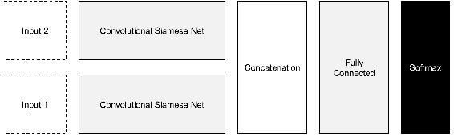
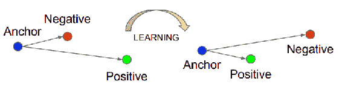
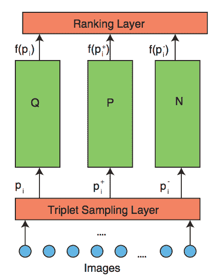
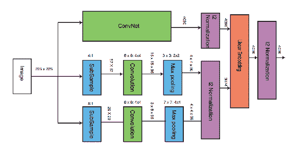
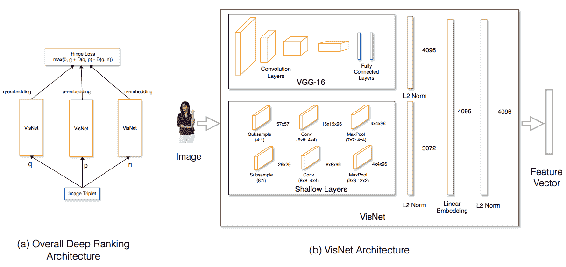
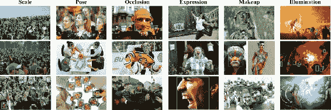
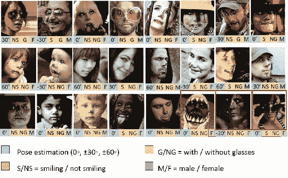
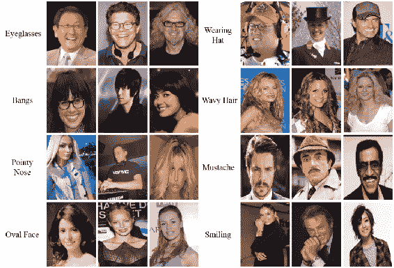
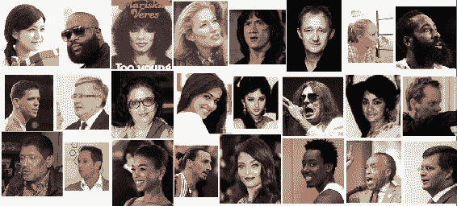

# 相似学习

在本章中，我们将学习相似性学习并学习相似性学习中使用的各种损失函数。 当每个班级的数据集都很小时，相似性学习对我们很有用。 我们将了解可用于人脸分析的不同数据集，并建立用于人脸识别，界标检测的模型。 我们将在本章介绍以下主题：

*   相似性学习的不同算法
*   用于相似度学习的各种损失函数
*   可以使用此类模型的各种方案
*   人脸识别的完整过程

# 相似性学习算法

**相似性学习**是训练度量以计算两个实体之间的相似性的过程。 由于学习了相似性，这也可以称为度量学习。 度量可以是欧几里得或余弦或其他自定义距离函数。 实体可以是任何数据，例如图像，视频，文本或表格。 为了计算度量，需要图像的矢量表示。 此表示可以是 CNN 计算的特征，如第 3 章，“图像检索”中所述。 为对象分类而学习的 CNN 可以用作计算度量的向量。 为图像分类而获得的特征向量将不是手头任务的最佳表示。 在相似性学习中，我们发现有关 CNN 的信息，这些 CNN 会为相似性学习任务生成经过训练的特征。 这里给出了相似学习的一些应用：

*   用于生物识别的人脸验证以比较两个人脸
*   视觉搜索现实世界中的物体以在线查找类似产品
*   视觉推荐某些属性相似的产品

在本章中，我们将详细了解人脸验证。 因此，让我们从可用于相似性学习的算法开始。

# 连体网络

顾名思义，连体网络是一种神经网络模型，其中训练该网络以区分两个输入。 连体网络可以训练 CNN，以通过两个编码器产生嵌入。 每个编码器被馈送正对或负对中的一个图像。 连体网络所需的数据少于其他深度学习算法。 最初引入连体网络来比较签名。 下图显示了一个连体网络。 权重在网络之间共享：



连体网络的另一种用途是一次性学习。 **单次学习**是仅举一个示例的学习技术。 在这种情况下，可以显示图像，并判断它们是否相似。 对于大多数相似性学习任务，需要一对正负对进行训练。 可以将此类数据集与可用于分类任务的任何数据集一起形成，前提是它们是欧几里得距离。 这些算法与前几章中的算法之间的主要区别在于，这些编码器试图将一个编码器与另一个编码器区分开。

# 对比损失

对比损失通过相似度区分图像。 使用相似性度量比较特征或潜在层，并与目标一起训练相似性得分。 在正对的情况下，目标将为 0，因为两个输入相同。 对于负数对，在余弦距离或正则欧几里得距离的情况下，潜对之间的距离最大为 0。 损耗可以由`contrastive_loss`定义，在以下代码中进行解释：

```py
def contrastive_loss(model_1, model_2, label, margin=0.1):
    distance = tf.reduce_sum(tf.square(model_1 - model_2), 1)
    loss = label * tf.square(
        tf.maximum(0., margin - tf.sqrt(distance))) + (1 - label) * distance
    loss = 0.5 * tf.reduce_mean(loss)
    return loss
```

比较两个模型的距离并计算损失。 现在，我们将定义和训练一个连体网络。 对于连体网络，我们将需要两个相同的模型。 接下来，借助以下代码，为具有给定输入的简单 CNN 定义一个函数：

```py
def get_model(input_):
    input_reshape = tf.reshape(input_, [-1, 28, 28, 1],
  name='input_reshape')
    convolution_layer_1 = convolution_layer(input_reshape, 64)
    pooling_layer_1 = pooling_layer(convolution_layer_1)
    convolution_layer_2 = convolution_layer(pooling_layer_1, 128)
    pooling_layer_2 = pooling_layer(convolution_layer_2)
    flattened_pool = tf.reshape(pooling_layer_2, [-1, 5 * 5 * 128],
  name='flattened_pool')
    dense_layer_bottleneck = dense_layer(flattened_pool, 1024)
    return dense_layer_bottleneck
```

定义的模型将使用两次来定义连体网络所需的编码器。 接下来，定义两个模型的占位符。 对于每一对，输入的相似性也作为输入提供。 定义的模型相同。 还可以定义模型，以便共享权重。 此处定义了左右两个模型：

```py
left_input = tf.placeholder(tf.float32, shape=[None, input_size])
right_input = tf.placeholder(tf.float32, shape=[None, input_size])
y_input = tf.placeholder(tf.float32, shape=[None, no_classes])
left_bottleneck = get_model(left_input)
right_bottleneck = get_model(right_input)
```

瓶颈层是从模型中获取的，并被串联在一起。 这对于相似性学习问题至关重要。 可以创建任意数量的模型，并且可以连接最后的图层，如下所示：

```py
dense_layer_bottleneck = tf.concat([left_bottleneck, right_bottleneck], 1)
```

接下来，添加一个辍学层，并从级联层中计算出对率。 然后，该过程类似于任何其他网络，如下所示：

```py
dropout_bool = tf.placeholder(tf.bool)
dropout_layer = tf.layers.dropout(
        inputs=dense_layer_bottleneck,
  rate=0.4,
  training=dropout_bool
    )
logits = dense_layer(dropout_layer, no_classes)

with tf.name_scope('loss'):
    softmax_cross_entropy = tf.nn.softmax_cross_entropy_with_logits(
        labels=y_input, logits=logits)
    loss_operation = tf.reduce_mean(softmax_cross_entropy, name='loss')
    tf.summary.scalar('loss', loss_operation)

with tf.name_scope('optimiser'):
    optimiser = tf.train.AdamOptimizer().minimize(loss_operation)

with tf.name_scope('accuracy'):
    with tf.name_scope('correct_prediction'):
        predictions = tf.argmax(logits, 1)
        correct_predictions = tf.equal(predictions, tf.argmax(y_input, 1))
    with tf.name_scope('accuracy'):
        accuracy_operation = tf.reduce_mean(
            tf.cast(correct_predictions, tf.float32))
tf.summary.scalar('accuracy', accuracy_operation)

session = tf.Session()
session.run(tf.global_variables_initializer())

merged_summary_operation = tf.summary.merge_all()
train_summary_writer = tf.summary.FileWriter('/tmp/train', session.graph)
test_summary_writer = tf.summary.FileWriter('/tmp/test')

test_images, test_labels = mnist_data.test.images, mnist_data.test.labels
```

数据必须分别输入左右模型，如下所示：

```py
for batch_no in range(total_batches):
    mnist_batch = mnist_data.train.next_batch(batch_size)
    train_images, train_labels = mnist_batch[0], mnist_batch[1]
    _, merged_summary = session.run([optimiser, merged_summary_operation],
  feed_dict={
        left_input: train_images,
  right_input: train_images,
  y_input: train_labels,
  dropout_bool: True
  })
    train_summary_writer.add_summary(merged_summary, batch_no)
    if batch_no % 10 == 0:
        merged_summary, _ = session.run([merged_summary_operation,
  accuracy_operation], feed_dict={
            left_input: test_images,
  right_input: test_images,
  y_input: test_labels,
  dropout_bool: False
  })
        test_summary_writer.add_summary(merged_summary, batch_no)
```

我们已经看到了如何定义一个连体网络。 定义了两个编码器，并连接了潜在空间以形成训练损失。 左右模型分别提供数据。 接下来，我们将看到如何在单个网络中执行相似性学习。

# 面对网

Schroff 等人提出的 [FaceNet 模型](https://arxiv.org/pdf/1503.03832.pdf)解决了人脸验证问题。 它学习一个深层的 CNN，然后将人脸图像转换为嵌入图像。 嵌入可用于比较人脸以查看其相似程度，并可通过以下三种方式使用：

*   **人脸验证**考虑两个人脸，并确定它们是否相似。 人脸验证可以通过计算距离度量来完成。
*   **人脸识别**是用于用名字标记人脸的分类问题。 嵌入向量可用于训练最终标签。
*   **人脸聚类**将相似的人脸分组，就像照片应用程序将同一个人的照片聚在一起的方式一样。 诸如 KMeans 之类的聚类算法用于对人脸进行分组。

下图显示了 FaceNet 架构：


经 Schroff 等人许可复制。

FaceNet 会获取一批人脸图像并进行训练。 在那一批中，将有几个正对。 在计算损耗时，考虑正对和最接近的几个负对。 挖掘选择性对可实现平稳训练。 如果所有负面因素一直都被推开，则训练不稳定。 比较三个数据点称为**三元组损失**。 在计算损耗时，图像被认为具有正负匹配。 底片仅被推动一定的幅度。 在此详细说明三元组损失。

# 三元组损失

三元组损失学习图像的得分向量。 人脸描述符的得分向量可用于验证欧几里得空间中的人脸。 在学习投影的意义上，三元组损失类似于度量学习，因此可以区分输入。 这些投影或描述符或分数矢量是紧凑的表示形式，因此可以视为降维技术。 一个三元组由一个锚点，正负面组成。 锚可以是任何人的人脸，正面是同一个人的图像。 负片图像可能来自另一个人。 显然，对于给定的锚点，将会有很多负面的人脸。 通过选择当前更靠近锚点的底片，编码器将很难区分人脸，从而使其学习效果更好。 此过程称为**难负例挖掘**。 可以在欧氏空间中使用阈值获得更接近的负值。 下图描述了三元组损失模型：



经 Schroff 等人许可复制。

TensorFlow 中的损失计算如下所示：

```py
def triplet_loss(anchor_face, positive_face, negative_face, margin):
    def get_distance(x, y):
        return tf.reduce_sum(tf.square(tf.subtract(x, y)), 1)

    positive_distance = get_distance(anchor_face, positive_face)
    negative_distance = get_distance(anchor_face, negative_face)
    total_distance = tf.add(tf.subtract(positive_distance, negative_distance), margin)
    return tf.reduce_mean(tf.maximum(total_distance, 0.0), 0)
```

三胞胎的开采是一项艰巨的任务。 每个点都必须与其他点进行比较，以获得适当的锚点和正对。 三元组的挖掘如下所示：

```py
def mine_triplets(anchor, targets, negative_samples):
    distances = cdist(anchor, targets, 'cosine')
    distances = cdist(anchor, targets, 'cosine').tolist()
    QnQ_duplicated = [
        [target_index for target_index, dist in enumerate(QnQ_dist) if dist == QnQ_dist[query_index]]
        for query_index, QnQ_dist in enumerate(distances)]
    for i, QnT_dist in enumerate(QnT_dists):
        for j in QnQ_duplicated[i]:
            QnT_dist.itemset(j, np.inf)

    QnT_dists_topk = QnT_dists.argsort(axis=1)[:, :negative_samples]
    top_k_index = np.array([np.insert(QnT_dist, 0, i) for i, QnT_dist in enumerate(QnT_dists_topk)])
    return top_k_index
```

由于距离计算发生在 CPU 中，因此这可能会使在 GPU 机器上的训练变慢。 FaceNet 模型是训练人脸相似模型的最新方法。

# DeepNet 模型

DeepNet 模型用于学习用于人脸验证任务（例如 FaceNet）的人脸嵌入。 这是对上一部分中讨论的 FaceNet 方法的改进。 它需要对同一张脸进行多次裁剪，并通过多个编码器才能获得更好的嵌入效果。 与 FaceNet 相比，此方法具有更高的准确性，但需要更多时间进行处理。 人脸裁切在相同区域进行，并通过其各自的编码器。 然后将所有层连接起来以进行三元组损失的训练。

# 深排

Wang 等人提出的 [DeepRank](https://users.eecs.northwestern.edu/~jwa368/pdfs/deep_ranking.pdf) 用于根据相似度对图像进行排名。 图像通过不同的模型传递，如下所示：



经王等人许可转载。

在此也计算了三元组损耗，并且反向传播更加顺利。 然后可以将图像转换为线性嵌入以进行排名，如下所示：



经 Wang 等人许可复制。

该算法对于排名目的非常有用。

# 视觉推荐系统

视觉推荐系统非常适合获取给定图像的推荐。 推荐模型提供具有相似属性的图像。 [根据 Shankar 等人提出的以下模型](https://arxiv.org/pdf/1703.02344.pdf)，您可以了解相似图像的嵌入，并提供以下建议：



图（a）显示了深度排名架构，图（b）显示了 VisNet 架构（经 Shankar 等人许可复制）。

这些是用于相似性学习的一些算法。 在下一节中，我们将看到如何将这些技术应用于人脸。

# 人脸分析

可以使用计算机视觉以多种方式分析人脸。 为此，需要考虑以下几个因素：

*   **人脸检测**：找到人脸位置的边界框
*   **人脸标志检测**：查找鼻子，嘴巴等人脸特征的空间点
*   **人脸对齐**：将人脸转换成正面人脸以进行进一步分析
*   **属性识别**：查找诸如性别，微笑等属性
*   **情感分析**：分析人的情感
*   **人脸验证**：查找两个图像是否属于同一个人
*   **人脸识别**：为人脸识别
*   **人脸聚类**：将同一个人的人脸分组在一起

在以下各节中，让我们详细了解这些任务的数据集和实现。

# 人脸检测

人脸检测类似于对象检测，我们在第 4 章，“对象检测”中讨论过。 必须从图像中检测出人脸的位置。 可以从[这里](http://vis-www.cs.umass.edu/fddb/)下载名为**人脸检测数据集和基准**（**FDDB**）的数据集。 。 它具有 2,845 张带有 5,171 张脸的图像。 可以从[这里](http://mmlab.ie.cuhk.edu.hk/projects/WIDERFace/)下载 Yang 等人提出的另一个称为**宽脸**的数据集。 它具有 32,203 张图像和 393,703 张人脸。 这是来自更广泛的人脸数据集的图像示例：



由杨等人提出。 并转载自[这里](http://mmlab.ie.cuhk.edu.hk/projects/WIDERFace/support/intro.jpg)

数据集的比例，姿势，遮挡，表情，妆容和照明度都有很好的变化。 另一个名**多属性标签的人脸**（**MALF**）的数据集包含 5,250 张图像，其中包含 11,931 张人脸。 可以从[这个](http://www.cbsr.ia.ac.cn/faceevaluation/)链接访问 MALF。 在对象检测中使用的相同技术也可以应用于人脸检测。

# 面对地标和属性

人脸标志是人脸的空间点。 空间点对应于各种人脸特征的位置，例如眼睛，眉毛，鼻子，嘴巴和下巴。 点数可能会从 5 到 78 不等，具体取决于注释。 人脸界标也称为**基准点**，**人脸关键点**或**人脸姿势**。 人脸标志具有许多应用，如下所示：

*   人脸对齐以更好地进行人脸验证或识别
*   跟踪视频中的人脸
*   人脸表情或情感可以测量
*   有助于诊断疾病

接下来，我们将看到一些带有基准点注释的数据库。

# 多任务人脸标志（MTFL）数据集

`MTFL`数据集由 Zhang 等人提出。 并带有五个人脸标志以及性别，微笑，眼镜和头部姿势注释。 数据库中存在 12,995 张人脸。 可以从[这里](http://mmlab.ie.cuhk.edu.hk/projects/TCDCN/data/MTFL.zip)下载`MTFL`。

这是`MTFL`中存在的图像的示例：



由张等人提出。 并转载自[这里](http://mmlab.ie.cuhk.edu.hk/projects/TCDCN/img/1.jpg)

人脸在年龄，照度，情感等方面有很多变化。 **头部姿势**是人脸方向的角度，以度为单位。 眼镜，微笑，性别属性等都用二进制标签注释。

# Kaggle 关键点数据集

Kaggle 关键点数据集带有 15 个人脸标志。 数据集中存在 8,832 张图像。 可以从[这个链接](https://www.kaggle.com/c/facial-keypoints-detection/data)下载。 图像尺寸为 96 像素 x 96 像素。

# 多属性人脸标志（MAFL）数据集

Zhang 等人提出的`MAFL`数据集。 带有 5 种具有 40 种不同人脸属性的人脸标志。 数据库中存在 20,000 张人脸。 可以从[这里](https://github.com/zhzhanp/TCDCN-face-alignment)下载`MAFL`。 这是`MAFL`中存在的图像的示例：



由 Liu 等人提出。 并转载自[这里](http://mmlab.ie.cuhk.edu.hk/projects/celeba/overview.png)

注释的属性包括尖头，带子，小胡子，卷发，戴帽子等。 这些图像也包含在`CelebA`数据集中，稍后将详细讨论。

# 学习人脸关键点

如先前主题中所述，在计算关键人脸点时，需要定义一些参数。 我们将使用以下代码来定义这些参数：

```py
image_size = 40 no_landmark = 10 no_gender_classes = 2 no_smile_classes = 2 no_glasses_classes = 2 no_headpose_classes = 5 batch_size = 100 total_batches = 300 
```

接下来，为各种输入保留一些占位符。

```py
image_input = tf.placeholder(tf.float32, shape=[None, image_size, image_size])
landmark_input = tf.placeholder(tf.float32, shape=[None, no_landmark])
gender_input = tf.placeholder(tf.float32, shape=[None, no_gender_classes])
smile_input = tf.placeholder(tf.float32, shape=[None, no_smile_classes])
glasses_input = tf.placeholder(tf.float32, shape=[None, no_glasses_classes])
headpose_input = tf.placeholder(tf.float32, shape=[None, no_headpose_classes])
```

接下来，使用四个卷积层构造主模型，如以下代码所示：

```py
image_input_reshape = tf.reshape(image_input, [-1, image_size, image_size, 1],
  name='input_reshape')

convolution_layer_1 = convolution_layer(image_input_reshape, 16)
pooling_layer_1 = pooling_layer(convolution_layer_1)
convolution_layer_2 = convolution_layer(pooling_layer_1, 48)
pooling_layer_2 = pooling_layer(convolution_layer_2)
convolution_layer_3 = convolution_layer(pooling_layer_2, 64)
pooling_layer_3 = pooling_layer(convolution_layer_3)
convolution_layer_4 = convolution_layer(pooling_layer_3, 64)
flattened_pool = tf.reshape(convolution_layer_4, [-1, 5 * 5 * 64],
  name='flattened_pool')
dense_layer_bottleneck = dense_layer(flattened_pool, 1024)
dropout_bool = tf.placeholder(tf.bool)
dropout_layer = tf.layers.dropout(
        inputs=dense_layer_bottleneck,
  rate=0.4,
  training=dropout_bool
    )
```

接下来，我们将使用以下代码为所有不同的任务创建一个对率分支：

```py
landmark_logits = dense_layer(dropout_layer, 10)
smile_logits = dense_layer(dropout_layer, 2)
glass_logits = dense_layer(dropout_layer, 2)
gender_logits = dense_layer(dropout_layer, 2)
headpose_logits = dense_layer(dropout_layer, 5)
```

损耗是针对所有人脸特征单独计算的，如以下代码所示：

```py
landmark_loss = 0.5 * tf.reduce_mean(
    tf.square(landmark_input, landmark_logits))

gender_loss = tf.reduce_mean(
    tf.nn.softmax_cross_entropy_with_logits(
        labels=gender_input, logits=gender_logits))

smile_loss = tf.reduce_mean(
    tf.nn.softmax_cross_entropy_with_logits(
        labels=smile_input, logits=smile_logits))

glass_loss = tf.reduce_mean(
    tf.nn.softmax_cross_entropy_with_logits(
        labels=glasses_input, logits=glass_logits))

headpose_loss = tf.reduce_mean(
    tf.nn.softmax_cross_entropy_with_logits(
        labels=headpose_input, logits=headpose_logits))

loss_operation = landmark_loss + gender_loss + \
                 smile_loss + glass_loss + headpose_loss
```

现在，我们将初始化优化器并开始训练，如以下代码所示：

```py
optimiser = tf.train.AdamOptimizer().minimize(loss_operation)
session = tf.Session()
session.run(tf.initialize_all_variables())
fiducial_test_data = fiducial_data.test

for batch_no in range(total_batches):
    fiducial_data_batch = fiducial_data.train.next_batch(batch_size)
    loss, _landmark_loss, _ = session.run(
        [loss_operation, landmark_loss, optimiser],
  feed_dict={
            image_input: fiducial_data_batch.images,
  landmark_input: fiducial_data_batch.landmarks,
  gender_input: fiducial_data_batch.gender,
  smile_input: fiducial_data_batch.smile,
  glasses_input: fiducial_data_batch.glasses,
  headpose_input: fiducial_data_batch.pose,
  dropout_bool: True
  })
    if batch_no % 10 == 0:
        loss, _landmark_loss, _ = session.run(
            [loss_operation, landmark_loss],
  feed_dict={
                image_input: fiducial_test_data.images,
  landmark_input: fiducial_test_data.landmarks,
  gender_input: fiducial_test_data.gender,
  smile_input: fiducial_test_data.smile,
  glasses_input: fiducial_test_data.glasses,
  headpose_input: fiducial_test_data.pose,
  dropout_bool: False
  })
```

此过程可用于检测人脸特征以及界标。

# 人脸识别

**人脸识别**或**人脸识别**是从数字图像或视频中识别人物的过程。 让我们在下一部分中了解可用于人脸识别的数据集。

# 野生（LFW）数据集中的带标签的人脸

`LFW`数据集包含 13,233 张人脸和 5,749 位独特的人，被视为评估人脸验证数据集的标准数据集。 精度度量可用于评估算法。 可以在[这个链接](http://vis-www.cs.umass.edu/lfw/)中访问数据集。

# YouTube 人脸数据集

YouTube `faces`数据集包含 3,425 个视频剪辑，其中包含 1,595 个独特的人。 这些视频是从 YouTube 收集的。 数据集每人至少有两个视频。 该数据集被视为视频中人脸验证的标准数据集。 可以在[这个链接](https://www.cs.tau.ac.il/~wolf/ytfaces/)中访问数据集。

# CelebFaces 属性数据集（CelebA）

`CelebA` 数据集带有人物身份以及 5 个人脸标志和 40 个属性的注释。 数据库中有 10,177 位独特的人，拥有 202,599 张人脸图像。 它是可用于人脸验证，检测，界标和属性识别问题的大型数据集之一。 图像具有带有各种注释的良好人脸变化。 可以在[这个链接](http://mmlab.ie.cuhk.edu.hk/projects/CelebA.html)中访问数据集。

# CASIA 网络人脸数据库

`CASIA`数据集带有 1 个 0,575 个独特的人注释，总共有 494,414 张图像。 该数据集可以从[这个链接](http://www.cbsr.ia.ac.cn/english/CASIA-WebFace-Database.html)获得。 这是可用于人脸验证和识别问题的第二大公共数据集。

# VGGFace2 数据集

Cao 等人提出的`VGGFace2`数据集。 被 9,131 位独特的人注解，具有 331 万张图片。 数据集可从[这个链接](http://www.robots.ox.ac.uk/~vgg/data/vgg_face2/)获得。 变化包括年龄，种族，姿势，职业和照度。 这是可用于人脸验证的最大数据集。

这是数据集中存在的图像的示例：



由曹等人提出。 并转载自[这里](http://www.robots.ox.ac.uk/~vgg/data/vgg_face2/web_page_img.png)

每个唯一的人的最小，平均和最大图像数分别是 87、362.6 和 843。

# 计算人脸之间的相似度

人脸相似度的计算是一个多步骤问题。 必须检测人脸，然后找到基准点。 面可以与基准点对齐。 对齐的面可以用于比较。 如前所述，人脸检测类似于物体检测。 因此，为了找到人脸之间的相似性，我们将首先通过以下代码导入所需的库，以及`facenet`库：

```py
from scipy import misc
import tensorflow as tf
import numpy as np
import os
import facenet
print facenet
from facenet import load_model, prewhiten
import align.detect_face
```

可以如下所示加载和对齐图像：

```py
def load_and_align_data(image_paths, image_size=160, margin=44, gpu_memory_fraction=1.0):
    minsize = 20
  threshold = [0.6, 0.7, 0.7]
    factor = 0.709    print('Creating networks and loading parameters')
    with tf.Graph().as_default():
        gpu_options = tf.GPUOptions(per_process_gpu_memory_fraction=gpu_memory_fraction)
        sess = tf.Session(config=tf.ConfigProto(gpu_options=gpu_options, log_device_placement=False))
        with sess.as_default():
            pnet, rnet, onet = align.detect_face.create_mtcnn(sess, None)

    nrof_samples = len(image_paths)
    img_list = [None] * nrof_samples
    for i in range(nrof_samples):
        img = misc.imread(os.path.expanduser(image_paths[i]), mode='RGB')
        img_size = np.asarray(img.shape)[0:2]
        bounding_boxes, _ = align.detect_face.detect_face(img, minsize, pnet, rnet, onet, threshold, factor)
        det = np.squeeze(bounding_boxes[0, 0:4])
        bb = np.zeros(4, dtype=np.int32)
        bb[0] = np.maximum(det[0] - margin / 2, 0)
        bb[1] = np.maximum(det[1] - margin / 2, 0)
        bb[2] = np.minimum(det[2] + margin / 2, img_size[1])
        bb[3] = np.minimum(det[3] + margin / 2, img_size[0])
        cropped = img[bb[1]:bb[3], bb[0]:bb[2], :]
        aligned = misc.imresize(cropped, (image_size, image_size), interp='bilinear')
        prewhitened = prewhiten(aligned)
        img_list[i] = prewhitened
    images = np.stack(img_list)
    return images
```

现在，我们将处理图像路径以获取嵌入。 相同的代码在这里给出：

```py
def get_face_embeddings(image_paths, model='/20170512-110547/'):
    images = load_and_align_data(image_paths)
    with tf.Graph().as_default():
            with tf.Session() as sess:
                load_model(model)
                images_placeholder = tf.get_default_graph().get_tensor_by_name("input:0")
                embeddings = tf.get_default_graph().get_tensor_by_name("embeddings:0")
                phase_train_placeholder = tf.get_default_graph().get_tensor_by_name("phase_train:0")
                feed_dict = {images_placeholder: images, phase_train_placeholder: False}
                emb = sess.run(embeddings, feed_dict=feed_dict)

    return emb
```

现在，我们将使用以下代码来计算嵌入之间的距离：

```py
def compute_distance(embedding_1, embedding_2):
    dist = np.sqrt(np.sum(np.square(np.subtract(embedding_1, embedding_2))))
    return dist
```

此函数将计算嵌入之间的**欧几里德**距离。

# 寻找最佳阈值

使用前面的功能，可以计算出该系统的精度。 以下代码可用于计算最佳阈值：

```py
import sys
import argparse
import os
import re
from sklearn.metrics import classification_report
from sklearn.metrics import accuracy_score
```

现在，使用以下代码从文件夹中获取图像路径：

```py
def get_image_paths(image_directory):
    image_names = sorted(os.listdir(image_directory))
    image_paths = [os.path.join(image_directory, image_name) for image_name in image_names]
    return image_paths
```

通过嵌入时，将获得图像的距离，如以下代码所示：

```py
def get_labels_distances(image_paths, embeddings):
    target_labels, distances = [], []
    for image_path_1, embedding_1 in zip(image_paths, embeddings):
        for image_path_2, embedding_2 in zip(image_paths, embeddings):
            if (re.sub(r'\d+', '', image_path_1)).lower() == (re.sub(r'\d+', '', image_path_2)).lower():
                target_labels.append(1)
            else:
                target_labels.append(0)
            distances.append(compute_distance(embedding_1, embedding_2)) # Replace distance metric here
  return target_labels, distances
```

阈值随以下代码所示而变化，并相应打印各种度量：

```py
def print_metrics(target_labels, distances):
    accuracies = []
    for threshold in range(50, 150, 1):
        threshold = threshold/100.
  predicted_labels = [1 if dist <= threshold else 0 for dist in distances]
        print("Threshold", threshold)
        print(classification_report(target_labels, predicted_labels, target_names=['Different', 'Same']))
        accuracy = accuracy_score(target_labels, predicted_labels)
        print('Accuracy: ', accuracy)
        accuracies.append(accuracy)
    print(max(accuracies))
```

现在，借助以下代码将图像路径传递给嵌入：

```py
def main(args):
    image_paths = get_image_paths(args.image_directory)
    embeddings = get_face_embeddings(image_paths)  # Replace your embedding calculation here
  target_labels, distances = get_labels_distances(image_paths, embeddings)
    print_metrics(target_labels, distances)
```

最后，图像目录作为这些方法的主要参数传递，如以下代码所示：

```py
if __name__ == '__main__':
    parser = argparse.ArgumentParser()
    parser.add_argument('image_directory', type=str, help='Directory containing the images to be compared')
    parsed_arguments = parser.parse_args(sys.argv[1:])
    main(parsed_arguments)
```

在此示例中，我们采用了预先训练的模型并将其用于构建人脸验证方法。 ;

# 人脸聚类

**人脸聚类**是将同一个人的图像分组在一起以形成相册的过程。 可以提取人脸的嵌入，并且可以使用诸如 K 均值的聚类算法将同一个人的人脸合并在一起。 TensorFlow 为 KMeans 算法提供了一个称为 `tf.contrib.learn.KmeansClustering` 的 API。 K 均值算法将数据点分组在一起。 借助这种 KMeans 算法，可以提取专辑的嵌入内容，并且可以一起找到个人的人脸，或者换句话说，可以将聚在一起。

# 摘要

在本章中，我们介绍了相似性学习的基础知识。 我们研究了度量学习，连体网络和 FaceNet 等算法。 我们还介绍了损失函数，例如对比损失和三重损失。 还涵盖了两个不同的领域，即排名和推荐。 最后，通过理解几个步骤（包括检测，基准点检测和相似性评分）涵盖了人脸识别的分步演练。

在下一章中，我们将了解循环神经网络及其在自然语言处理问题中的使用。 稍后，我们将使用语言模型和图像模型来对图像进行字幕。 我们将针对该问题访问几种算法，并查看两种不同类型数据的实现。