# 部署方式

在本章中，我们将学习如何在各种平台上部署经过训练的模型，以实现最大吞吐量和最小延迟。 我们将了解 GPU 和 CPU 等各种硬件的性能。 我们将遵循在 Amazon Web Services，Google Cloud Platform 等平台以及 Android，iOS 和 Tegra 等移动平台上部署 TensorFlow 的步骤。

我们将在本章介绍以下主题：

*   了解影响深度学习模型训练和推理性能的因素
*   通过各种方法提高性能
*   查看各种硬件的基准并学习调整它们以实现最佳性能的步骤
*   使用各种云平台进行部署
*   使用各种移动平台进行部署

# 模型表现

性能对于深度学习模型的培训和部署都很重要。 由于大数据或大模型架构，培训通常需要更多时间。 结果模型可能更大，因此在 RAM 受限的移动设备中使用时会出现问题。 更多的计算时间导致更多的基础架构成本。 推理时间在视频应用中至关重要。 由于前面提到了性能的重要性，因此在本节中，我们将研究提高性能的技术。 降低模型复杂度是一个简单的选择，但会导致精度降低。 在这里，我们将重点介绍一些方法，这些方法可以提高性能，而准确性却没有明显的下降。 在下一节中，我们将讨论量化选项。

# 量化模型

深度学习模型的权重具有 32 位浮点值。 当权重量化为 8 位时，精度下降很小，因此在部署中不会注意到。 结果权重的精度似乎对深度学习模型的精度性能影响较小。 这个想法对深度学习很有趣，并且在模型大小变得至关重要时很有用。 通过用 8 位值替换 32 位浮点值，可以显着减小模型大小并提高推理速度。 实施模型量化时有很多选择。 权重可以存储在 8 位中，但推理操作可以以 32 位浮点值执行。 架构的每个组件在量化大小上的行为可能有所不同，因此，取决于层，可以选择 32 或 16 或 8 位值。

量化工作有多种原因。 通常，深度学习模型经过训练可以解决图像中的噪声，因此可以被认为是健壮的。 推理计算可以具有冗余信息，并且可以由于量化而去除冗余信息。

最新的 CPU 和 RAM 硬件已针对浮点计算进行了调整，因此在此类硬件中量化效果可能不太明显。 随着为此目的引入越来越多的硬件，这种情况正在改变。 在 GPU 中，由于内存和速度现已适应较低的精确浮点运算，因此它们在内存和速度上存在明显差异。 还有其他特殊硬件可用于运行不太精确的浮动操作。

# 移动网

[霍华德（Howard）和其他人](https://arxiv.org/pdf/1704.04861.pdf)引入了一种称为 **MobileNets** 的新型模型，可用于移动和嵌入式应用程序。 MobileNets 可以用于不同的应用程序，例如对象检测，地标识别，人脸属性，细粒度分类，如下所示：

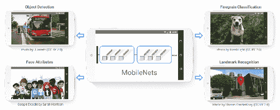

转载自霍华德等人

MobileNets 通过用深度（ **b** ）和点向卷积（ **c** ）替换标准卷积滤波器（ **a** ）和点卷积（ **c** ）来减少模型的大小和计算量，如下所示：

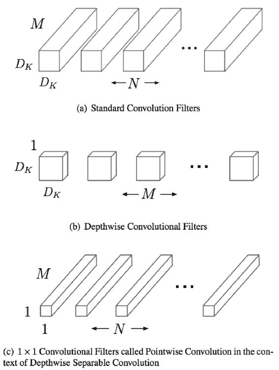

转载自霍华德等人

批量归一化和激活层被添加到深度和点积卷积中，如下所示：

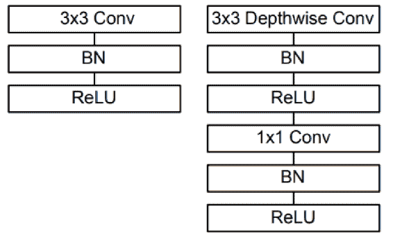

转载自霍华德等人

有两个参数会影响模型的选择：

*   **乘法和加法次数**：精度和多加法之间的权衡如下所示：

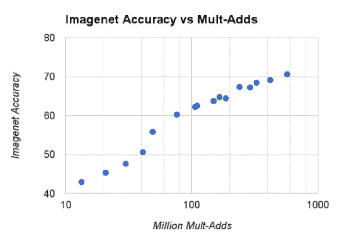

转载自霍华德等人

*   **模型**中的参数数量：此处显示权衡：


转载自霍华德等人

MobileNets 已显示，可以在移动和嵌入式设备上使用的精度有所降低的情况下，可以减少模型的计算和尺寸。 在霍华德等人的文章中可以看到模型与精度之间的确切权衡。

# 云端部署

必须将这些模型部署在云中以用于多个应用程序。 我们将为此目的寻找主要的云服务提供商。

# AWS

Amazon Web Services（AWS）将支持扩展到基于 TensorFlow 的模型的开发和部署。 在 [Amazon](https://aws.amazon.com/) 上注册 AWS，然后选择 **Amazon Machine Images** （ **AMI** ）之一。 AMI 是安装了所有必需软件的计算机的映像。 您不必担心安装软件包。 **AWS 提供了深度学习 AMI** （ **DLAMI** ），以简化培训和部署深度学习模型。 有几种选择。 在这里，我们将使用 Conda，因为它带有运行 TensorFlow 所需的几个软件包。 Python 有两个选项：版本 2 和版本 3。以下代码将在 CUDA 8 的 Python 3 上使用 Keras 2 激活 TensorFlow：

```py
source activate tensorflow_p36
```

以下代码将在 CUDA 8 的 Python 2 上使用 Keras 2 激活 TensorFlow：

```py
source activate tensorflow_p27
```

您可以访问[这里](https://aws.amazon.com/tensorflow/)了解更多详细信息和教程。

还可以通过执行以下给定的步骤来启动**虚拟机**（ **VM** ）：

1.  转到 [Amazon AWS](https://aws.amazon.com/)，然后使用您的 Amazon 帐户登录。
2.  从登录页面选择启动虚拟机：

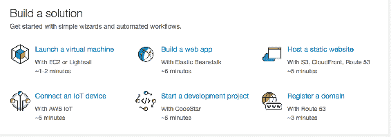

3.  在下一个窗口中，单击入门，选择 EC2 实例，如下所示：

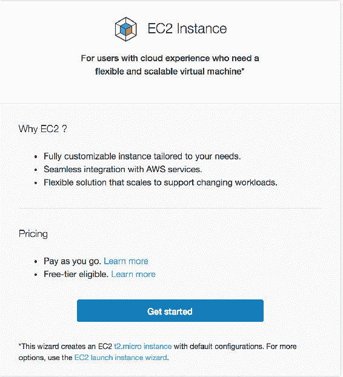

4.  为 EC2 实例命名：

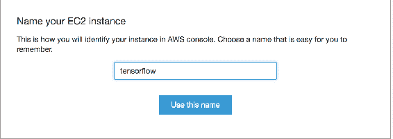

5.  选择操作系统的类型：

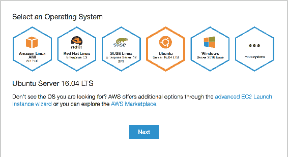

6.  选择实例类型。 实例类型指示 RAM 和 CPU 大小不同的配置类型。 也有两个选项可供选择。 选择实例类型，然后单击“下一步”按钮：


7.  创建一个隐私增强型邮件安全证书（PEM）文件，该文件将用于登录，如下所示：

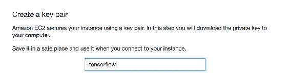

8.  创建实例将花费一些时间，最后，将显示完成状态：


9.  接下来，单击进入 EC2 控制台按钮：

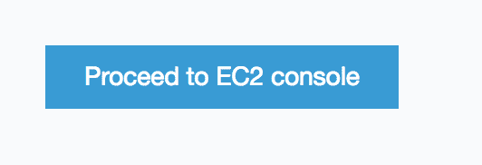

10.  现在将创建实例； 单击连接按钮，如下所示：

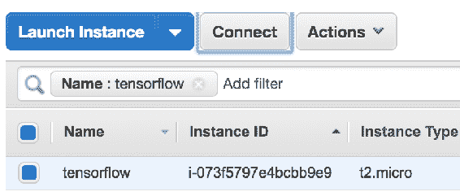

11.  接下来，必须将实例连接到虚拟机的命令提示符。 连接所需的说明在此步骤中给出。 您需要在之前的步骤中下载“ pem”文件。 按照显示的说明连接到系统：

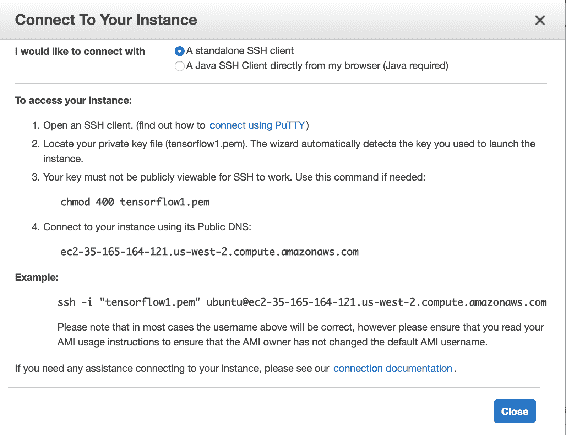

12.  完成后，通过单击操作|实例状态|终止来终止实例：


安装和执行步骤可以遵循第 1 章，*入门*。

# Google Cloud Platform

Google Cloud Platform（GCP）是 Google 提供的云平台，具有与 AWS 类似的功能。 通过执行以下步骤，可以使用一个简单的虚拟机来训练诸如 AWS 之类的模型：

1.  使用 [cloud.google.com](https://cloud.google.com/) 转到 Google Cloud Platform，然后使用您的 Gmail 帐户登录到该平台。
2.  现在，通过单击转到控制台按钮进入控制台：


3.  进入控制台后，通过单击 Compute Engine |进入 **VM 创建页面**。 右上角菜单中的 VM 实例，如以下屏幕截图所示：

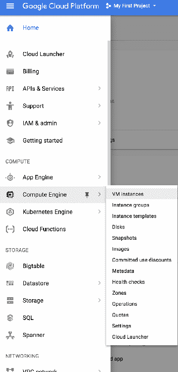

4.  然后单击 CREATE INSTANCE 按钮，以创建所需的实例：


5.  接下来，可以通过配置选择实例类型。 Zone 参数通知区域将部署实例。 通过选择靠近用户的区域，可以节省等待时间。 可以使用所需的 RAM 和 CPU 定制机器类型。 还可以选择 GPU，以进行更快的训练。 选择实例的大小，然后单击“创建”按钮，如以下屏幕截图所示：

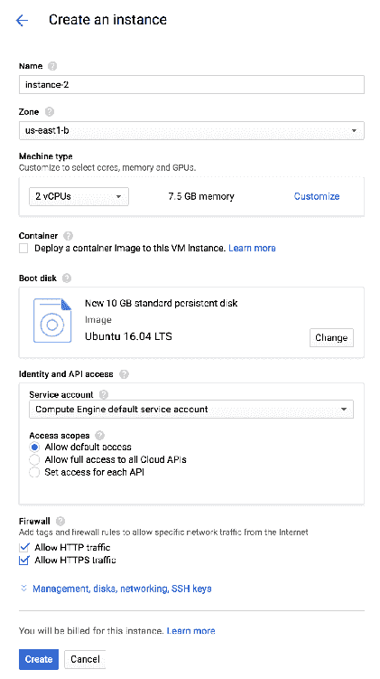

6.  创建实例将需要几分钟。 然后，单击实例的 SSH 下拉列表，然后选择“在浏览器窗口中打开”选项，如下所示，以在浏览器中打开控制台：

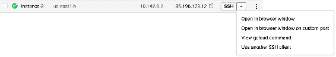

使用该外壳，您可以安装 TensorFlow 并可以训练或部署模型。 有许多选项可从虚拟机的配置中选择。 根据成本和时间的权衡，可以选择配置。

GCP 具有**云机器学习引擎**，可在使用 TensorFlow 时为我们提供帮助。 GCP 的三个组件可以一起用于构建培训和部署基础架构：

1.  用于  的 Cloud DataFlow 预处理图像
2.  用于  和  培训和部署模型的云机器学习引擎
3.  Google Cloud Storage 用于存储培训数据，代码和结果

可以在[这个页面](https://cloud.google.com/ml-engine/docs/flowers-tutorial)上找到使用云机器学习引擎建立自定义图像分类模型的出色教程。

# 在设备中部署模型

TensorFlow 模型也可以部署在移动设备中。 移动设备包括智能手机，无人机，家用机器人等。 数十亿智能手机可以具有可以使用深度学习的计算机视觉应用程序。 可以拍照并搜索，流化带有标记场景的视频等。 在移动设备中进行部署意味着深度学习模型存在于设备上，并且推断发生在设备上。 设备上部署的模型有助于解决隐私问题。 在以下主题中，我们将讨论如何在各种移动平台上部署它们。

# 杰特逊 TX2

Jetson TX2 是由 NVIDIA 提供的嵌入式设备，专门用于高效 AI 计算。 Jetson TX2 轻巧，紧凑，因此适合在无人机，公共场所等中部署。 它还附带预装的 TensorRT，这是 TensorFlow 的运行时。 您可以购买 Jetson 并在安装 TensorFlow 之前快速安装 Ubuntu，CUDA，CUDNN。 克隆[这个页面](https://github.com/jetsonhacks/installTensorFlowTX2)，然后在命令提示符下输入以下命令。

1.  首先，在以下代码的帮助下安装必备组件：

```py
 ./installPrerequisites.sh 
```

2.  现在，使用以下代码克隆 TensorFlow：

```py
 ./cloneTensorFlow.sh 
```

3.  接下来，使用 以下代码设置所需的环境变量：

```py
 ./setTensorFlowEV.sh 
```

4.  现在我们将使用 以下代码构建 TensorFlow ：

```py
 ./buildTensorFlow.sh 
```

5.  现在，我们将使用以下代码 使用 将打包文件处理为 Wheel 文件：

```py
 ./packageTensorFlow.sh
```

6.  现在，我们将使用以下代码安装 Tensorflow：

```py
 pip install $HOME/tensorflow-1.0.1-cp27-cp27mu-linux_aarch64.whl 
```

借助这些步骤，我们可以在 Jetson TX2 中安装 TensorFlow。

# 安卓系统

任何 Android 应用程序都可以使用 TensorFlow，其构建细节可以在[这个页面](https://www.tensorflow.org/mobile/android_build)中找到。 关于此的官方示例可以在[这个页面](https://github.com/tensorflow/tensorflow/tree/master/tensorflow/examples/android)中找到。 假设读者具有 Android 编程经验，则在 Android 设备中实现 Tensorflow 的步骤如下：

1.  使用第 3 章和*图像检索*中介绍的步骤，将 TensorFlow 模型导出到`.pb`文件。
2.  生成二进制文件`.so`和`.jar`。
3.  编辑`gradle`文件以启用库加载。
4.  加载并运行 Android 应用文件

# 苹果手机

苹果使用 CoreML 框架将机器学习集成到 iPhone 应用程序中。 Apple 提供了可以直接集成到应用程序中的标准模型列表。 您可以使用 TensorFlow 训练自定义深度学习模型并将其在 iPhone 中使用。 为了部署自定义模型，您必须在 CoreML 框架模型中隐藏 TensorFlow。 谷歌发布了 [tf-coreml](https://github.com/tf-coreml/tf-coreml)，用于将 TensorFlow 模型转换为 CoreML 模型。 可以使用以下代码安装 TFcoreML：

```py
pip install -U tfcoreml
```

可以使用以下代码导出模型：

```py
import tfcoreml as tf_converter
tf_converter.convert(tf_model_path='tf_model_path.pb',
  mlmodel_path='mlmodel_path.mlmodel',
  output_feature_names=['softmax:0'],
  input_name_shape_dict={'input:0': [1, 227, 227, 3]})
```

iPhone 可以使用导出的模型进行预测。

# 摘要

在本章中，我们了解了如何在各种平台和设备上部署经过训练的深度学习模型。 我们已经介绍了为这些平台获得最佳性能的步骤和准则。 我们已经看到了 MobileNets 的优势，它以很小的精度权衡来减少推理时间。