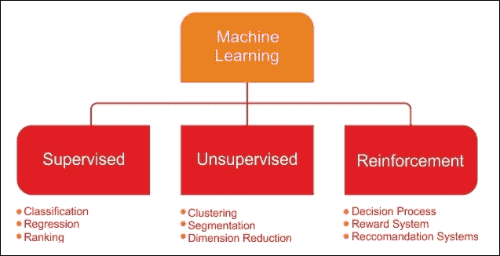
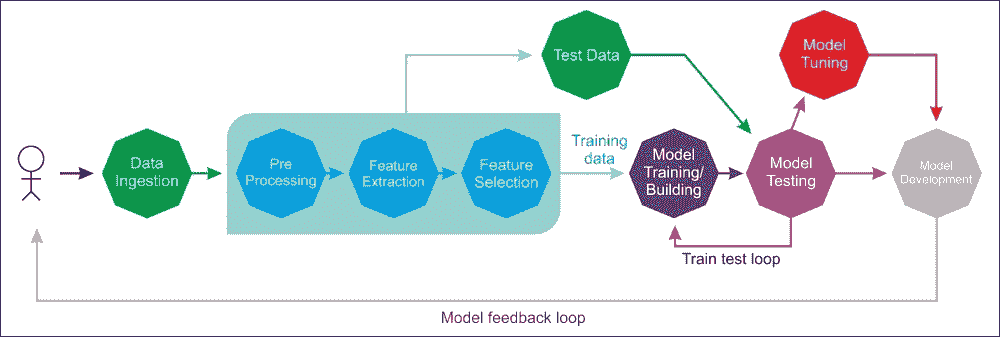
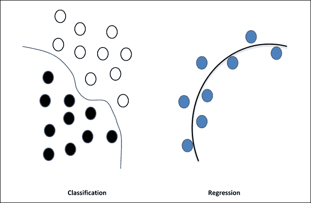
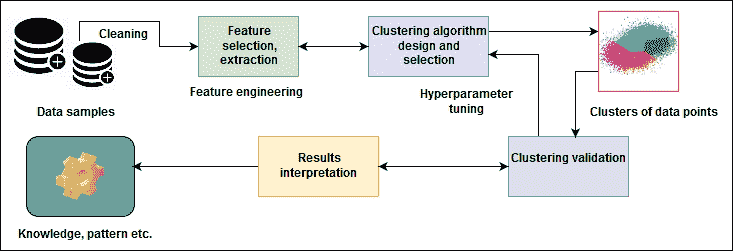
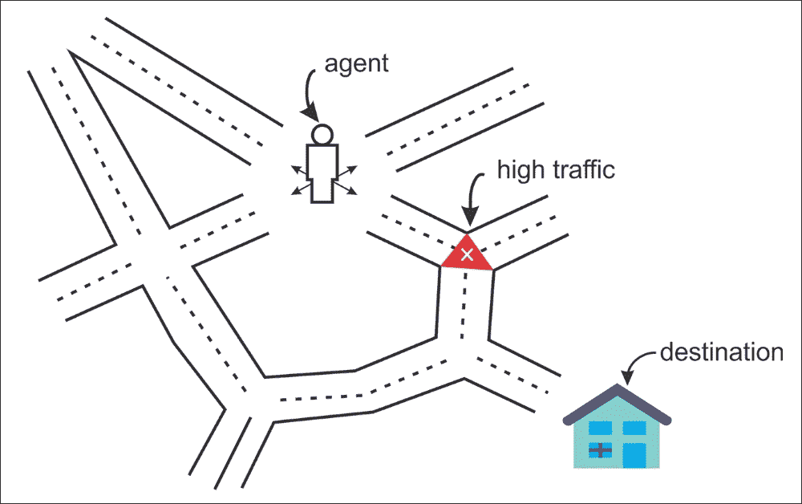
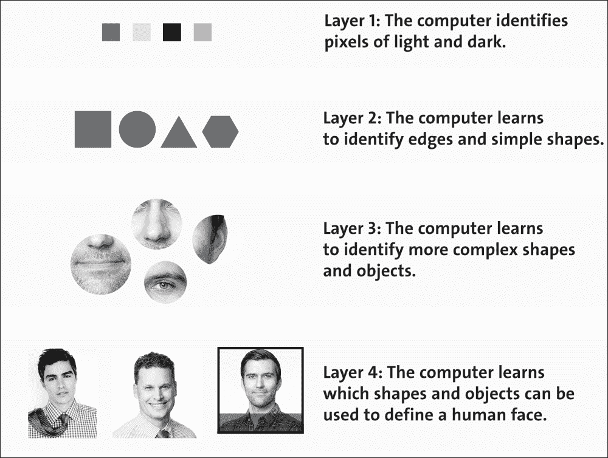

# 第 1 章深度学习入门

本章介绍了机器学习（ML）和深度学习（DL）的一些基本概念，这些概念将在随后的所有章节中使用。我们将首先简要介绍 ML。然后我们将转移到 DL，它是基于一组算法的 ML 的分支，这些算法试图模拟数据中的高级抽象。

我们将简要讨论一些最着名和最广泛使用的神经网络架构，然后再继续使用 TensorFlow 进行编码第 2 章，初步了解 TensorFlow。在本章中，我们将介绍 DL 框架和库的各种功能，例如框架的本机语言，多 GPU 支持以及可用性方面。

简而言之，将涵盖以下主题：

*   ML 的简介
*   人工神经网络
*   ML 与 DL
*   DL 神经网络架构
*   可用的 DL 框架

# 机器学习的温和介绍

ML 是关于使用一组统计和数学算法来执行诸如概念学习，预测建模，聚类和挖掘有用模式之类的任务。最终目标是以这样一种方式改进学习，使其变得自动化，从而不再需要人类交互，或者至少尽可能地降低人类交互水平。

我们现在参考 Tom M. Mitchell（机器学习，Tom Mitchell，McGraw Hill）对  ML 的着名定义，他从计算机科学的角度解释了学习的真正含义：

> “据说计算机程序可以从经验 E 中学习某些任务 T 和表现指标 P，如果它在 T 中的任务中的表现，由 P 测量，则随经验 E 而提高。”

根据这个定义，我们可以得出结论，计算机程序或机器可以执行以下操作：

*   学习称为训练数据的数据和历史
*   改善经验
*   交互式增强可用于预测问题结果的模型

我们使用的几乎所有机器学习算法都可以视为优化问题。这是关于找到最小化某些目标函数的参数，例如两个项的加权和，例如成本函数和正则化（统计中的对数似然和对数先验）。

通常，目标函数有两个组成部分：一个控制模型复杂性的正则化器，以及测量模型在训练数据上的误差的损失（我们将查看详细信息）。

另一方面，正则化参数定义了两个目标之间的权衡，即最小化训练误差的损失和最小化模型的复杂性以努力避免过拟合。现在，如果这两个成分都是凸的，那么它们的和也是凸的;否则它是非凸的。

### 注意

在机器学习中，过拟合是预测变量模型完全适合训练样例，但在测试示例上表现不佳。这通常发生在模型过于复杂且非常适合数据（参数太多），或者没有足够的数据来准确估计参数时。当模型复杂度与训练集大小的比率太高时，通常会发生过拟合。

更精细的是，在使用 ML 算法时，我们的目标是获得函数的超参数，该函数在进行预测时返回最小误差。当在二维平面上可视化时，误差损失函数具有典型的 U 形曲线，并且存在一个点，其给出最小误差。

因此，使用凸优化技术，我们可以最小化函数，直到它收敛到最小误差（即，它试图到达曲线的中间区域），这表示最小误差。现在问题是凸的，通常更容易分析算法的渐近行为，该行为表明当模型观察到越来越多的训练数据时它收敛的速度有多快。

ML 的挑战是让计算机学习如何自动识别复杂模式并尽可能智能地做出决策。整个学习过程需要一个数据集，如下所示：

*   训练集：这是用于拟合机器学习算法参数的知识库。在此阶段，我们将使用训练集来找到最佳权重，使用反向支柱规则，以及在学习过程开始之前设置的所有参数（超参数）。
*   验证集：这是一组用于调整 ML 模型参数的示例。例如，我们将使用验证集来查找隐藏单元的最佳数量，或确定反向传播算法的停止点。一些 ML 从业者将其称为开发集。
*   测试集：用于评估模型在没见过的数据上的表现，这称为模型推理。在评估测试集上的最终模型后，我们不必再进一步调整模型。

学习理论使用源自概率论和信息论的数学工具。将简要讨论三种学习范式：

*   监督学习
*   无监督学习
*   强化学习

下图总结了三种学习类型及其解决的问题：

图 1：学习类型和相关问题。

## 监督学习

监督学习是最简单的和最着名的自动学习任务。它基于许多预定义的示例，其中每个输入应该属于的类别是已知的。在这种情况下，关键问题是泛化问题。在分析典型的小样本示例后，系统应该生成一个适用于所有可能输入的模型。

下图显示了监督学习的典型工作流程。演员（例如，ML 从业者，数据科学家，数据工程师或 ML 工程师）执行 ETL（提取，转换和加载）和必要的特征工程（包括特征提取，选择）以获得适当的数据，特征和标签。

然后他做了以下事情：

*   将数据拆分为训练，开发和测试集
*   使用训练集来训练 ML 模型
*   使用验证集来验证针对过拟合问题和正则化的训练
*   评估模型在测试集上的表现（即看不见的数据）
*   如果表现不令人满意，他会根据超参数优化执行额外的调整以获得最佳模型
*   最后，他将最好的模型部署到生产就绪的环境中

在整个生命周期中，  可能涉及许多参与者（例如，数据工程师，数据科学家或 ML 工程师）独立或协作地执行每个步骤：

图 2：监督学习在行动中。

在受监督的 ML 中，该集合由标记数据组成，即对象及其相关的回归值。因此，这组标记的示例构成训练集。大多数监督学习算法共享一个特征：训练是通过最小化特定损耗或成本函数来执行的，表示系统提供的输出误差与所需输出的关系。

监督学习情况包括分类和回归任务：分类用于预测数据点为（离散值）的一部分，而回归用于预测连续值：

图 3：分类和回归

换句话说，分类任务预测类属性的标签，而回归任务则对类属性进行数值预测。

## 数据不平衡

在监督学习的背景下，不平衡数据指的是分类问题，其中我们对不同类别具有不相等的实例。例如，如果我们只有两个类的分类任务，那么平衡数据将意味着每个类的 50％预分类示例。

如果输入数据集有点不平衡（例如，一个类为 60％，另一个类为 40％），则需要学习过程将输入数据集随机分成三组，其中 50％为训练集，20 验证集的％，以及测试集的剩余 30％。

## 无监督学习

在无监督学习中，输入集是在训练阶段提供给系统的  。与监督学习相比，输入对象没有用他们的类标记。这种类型的学习很重要，因为在人类大脑中，它可能比监督学习更常见。

对于分类，我们假设我们获得了正确标记数据的训练数据集。不幸的是，当我们在现实世界中收集数据时，我们并不总是那么奢侈。在这种情况下，学习模型领域中唯一的对象是观察到的数据输入，其通常被假定为未知潜在概率分布的独立样本。

例如，假设您在硬盘驱动器上拥挤且庞大的文件夹中拥有大量非盗版且完全合法的 MP3。如何在不直接访问元数据的情况下将歌曲组合在一起？一种可能的方法可能是各种 ML 技术的混合，但聚类通常是解决方案的核心。

现在，如果您可以构建一个可以自动将类似歌曲组合在一起的聚类预测模型，并将它们组织成您最喜欢的类别，例如“country”，“rap”和“rock”，该怎么办？ MP3 将以无监督的方式添加到相应的播放列表中。简而言之，无监督学习算法通常用于聚类问题：

图 4：聚类技术：无监督学习的一个例子

请参阅上图以了解应用于解决此类问题的聚类技术。虽然数据点没有标记，但我们仍然可以进行必要的特征工程，并将一组对象分组，使得同一组（称为集群）中的对象彼此更相似（在某种意义上），而不是其他组（群集）。

这对于人来说并不容易，因为标准方法是在两个对象之间定义相似性度量，然后查找彼此更相似的任何对象集群，而不是其他集群中的对象。一旦我们进行了聚类，数据点（即 MP3 文件）的验证就完成了，我们就知道了数据的模式（也就是说，哪种类型的 MP3 文件属于哪个组）。

## 强化学习

强化学习是一种人工智能方法，侧重于通过与环境的相互作用来学习系统。通过强化学习，系统根据从环境收到的反馈调整其参数，然后提供有关所做决策的反馈。下图显示了一个人为了到达目的地而做出决定。假设在您从家到工作的驱动器上，您总是选择相同的路线。然而，有一天你的好奇心接管了，你决定尝试不同的路线，希望能找到更短的通勤时间。尝试新路线或坚持最着名路线的这种困境就是探索与利用的一个例子：

图 5：智能体总是尝试到达目的地。

另一个例子是对国际象棋选手进行建模的系统，该系统使用其先前动作的结果来改善其表现。这是一个通过强化学习的系统。

目前关于强化学习的研究是高度跨学科的，包括专门研究遗传算法，神经网络，心理学和控制工程的研究人员。

## 什么是深度学习？

在正常大小的数据分析中使用的简单 ML 方法不再有效，应该替代为更强大的 ML 方法。虽然经典 ML 技术允许研究人员识别相关变量的群或群，但这些方法的准确率和有效性随着大型和高维数据集的减少而减少。

因此，这是 DL，这是过去几年中人工智能最重要的发展之一。 DL 是基于一组算法的 ML 的分支，这些算法试图模拟数据中的高级抽象。

DL 的发展与人工智能的研究同时发生，尤其是神经网络的研究。这个领域主要是在 20 世纪 80 年代，这主要得益于 Geoff Hinton 和与他合作的 ML 专家。当时，计算机技术还不够先进，不能在这个方向上实现真正的改进，因此我们必须等待更大的数据可用性并大大提高计算能力才能看到​​重大的发展。

简而言之，DL 算法是人工神经网络（ANN）的集合，我们将在后面探讨，它可以更好地表示大规模数据集，以便构建广泛学习这些表示的模型。在这方面，Ian Goodfellow 和其他人将 DL 定义如下：

> “深度学习是一种特殊的机器学习，它通过学习将世界表示为概念的嵌套层次结构来实现强大的功能和灵活性，每个概念都是根据更简单的概念定义的，而更抽象的表示是根据较不抽象的概念来计算的。 ”。

我们举个例子吧。假设我们想要开发一个预测分析模型，例如动物识别器，我们的系统必须解决两个问题：

1.  如果图像代表猫或狗，则进行分类
2.  集群狗和猫的图像

如果我们使用典型的 ML 方法解决第一个问题，我们必须定义面部特征（耳朵，眼睛，胡须等），并编写一种方法来识别哪些特征（通常是非线性的）在分类时更重要特别的动物。

然而，与此同时，我们无法解决第二个问题，因为用于聚类图像的经典 ML 算法（例如 K-means）不能处理非线性特征。

DL 算法将进一步解决这两个问题，并且在确定哪些特征对于分类或聚类最重要之后，将自动提取最重要的特征。相比之下，使用经典的 ML 算法，我们必须手动提供这些特征。

总之，  DL 工作流程如下：

*   DL 算法首先识别在聚类猫或狗时最相关的边缘
*   然后它将在层次上构建，以找到形状和边缘的各种组合
*   在对复杂概念和特征进行连续分层识别之后，它决定哪些特征可用于对动物进行分类，然后在进行聚类之前取出标签列并使用自编码器执行无监督训练。

到目前为止，我们已经看到 DL 系统能够识别图像代表什么。计算机看不到我们看到的图像，因为它只知道每个像素的位置及其颜色。使用 DL 技术，图像被分成不同的分析层。在较低级别，软件分析例如几个像素的网格，其任务是检测颜色类型或各种细微差别。如果它找到了某个东西，它会通知下一个级别，此时此级别会验证该给定颜色是否属于更大的形式，例如一条线。

该过程继续到较高级别，直到您了解图像中显示的内容。例如，能够执行这些操作的软件现在很普遍，并且可以在用于识别面部或在 Google 上搜索图像的系统中找到。在许多情况下，这些是混合系统，与更传统的 IT 解决方案一起使用，与生成人工智能相结合。

下图显示了我们在图像分类系统中所讨论的内容。每个块逐渐提取输入图像的特征，并继续处理已经处理的先前块的数据，提取图像的越来越抽象的特征，从而构建基于 DL 的数据的分层表示系统。

更准确地说，它构建层如下：

*   第 1 层：系统开始识别暗和亮像素
*   第 2 层：系统识别边缘和形状
*   第 3 层：系统学习更复杂的形状和对象
*   第 4 层：系统了解哪些对象定义了人脸

如下图所示：

图 6：处理面部分类问题的 DL 系统。

在上一节中，我们看到使用线性 ML 算法，我们通常只处理几个超参数。

然而，当神经网络进入聚会时，事情变得过于复杂。在每一层中，都有很多超参数，而成本函数总是变成非凸的。

另一个原因是隐藏层中使用的激活函数是非线性的，因此成本是非凸的。我们将在后面的章节中更详细地讨论这种现象。