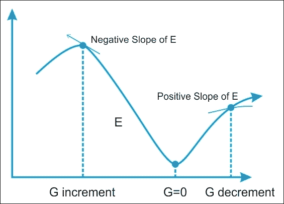
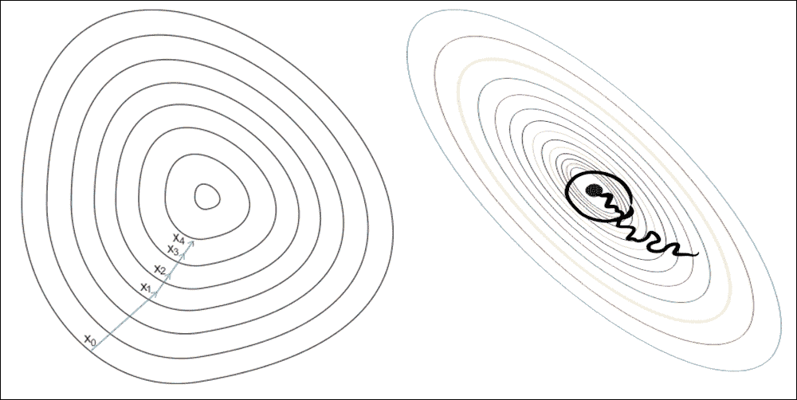

# ANN 如何学习？

神经网络的学习过程被配置为权重优化的迭代过程，因此是监督类型。由于网络在属于训练集的一组示例上的表现（即，您知道示例所属的类的集合），因此修改权重。

目的是最小化损失函数，其表示网络行为偏离期望行为的程度。然后在由除了训练集中的对象之外的对象（例如，图像分类问题中的图像）组成的测试集上验证网络的表现。

## 人工神经网络和反向传播算法

常用的监督学习算法是反向传播算法。训练程序的基本步骤如下：

1.  用随机权重初始化网络
2.  For all training cases, follow these steps:
    *   正向传播：计算网络的误差，即所需输出与实际输出之间的差值
    *   Backward pass: For all layers, starting with the output layer back to input layer:

        i：使用正确的输入显示网络层的输出（误差函数）。

        ii：调整当前层中的权重以最小化误差函数。这是反向传播的优化步骤。

当验证集上的错误开始增加时，训练过程结束，因为这可能标志着阶段过拟合的开始，即网络倾向于以牺牲训练数据为代价来内插训练数据的阶段。普遍性。

## 权重优化

因此，  优化权重的有效算法的可用性构成了构建神经网络的必要工具。该问题可以通过称为梯度下降（GD）的迭代数值技术来解决。该技术根据以下算法工作：

1.  随机选择模型参数的初始值
2.  根据模型的每个参数计算误差函数的梯度 G.
3.  更改模型的参数，使它们朝着减小误差的方向移动，即沿-G 方向移动
4.  重复步骤 2 和 3，直到 G 的值接近零

误差函数 E 的梯度（G）提供了误差函数与当前值具有更陡斜率的方向;所以为了减少 E，我们必须在相反的方向上做一些小步骤，-G。

通过以迭代方式多次重复此操作，我们向下移动到 E 的最小值，以达到 G = 0 的点，从而无法进一步进展：

图 10：搜索误差函数 E 的最小值。我们沿着函数 E 的梯度 G 最小的方向移动。

## 随机梯度下降

在 GD 优化中，我们基于完整的训练集计算成本梯度，因此我们有时也将其称为批量 GD。在非常大的数据集的情况下，使用 GD 可能非常昂贵，因为我们在训练集上只进行一次传递。训练集越大，我们的算法更新权重的速度就越慢，并且在收敛到全局成本最小值之前可能需要的时间越长。

最快的梯度下降方法是随机梯度下降（SGD），因此，它被广泛应用于深度神经网络。在 SGD 中，我们仅使用来自训练集的一个训练样本来对特定迭代中的参数进行更新。

这里，术语随机来自这样的事实：基于单个训练样本的梯度是真实成本梯度的随机近似。由于其随机性，通向全球成本最小化的路径并不像 GD 那样直接，但如果我们可视化 2D 空间中的成本表面，则可能会出现锯齿形：

图 11：GD 与 SGD：梯度下降（左图）确保权重中的每次更新都在正确的方向上完成：最小化成本函数的方向。随着数据集大小的增长以及每个步骤中更复杂的计算，SGD（右图）在这些情况下是首选。这里，在处理每个样本时完成权重的更新，因此，后续计算已经使用了改进的权重。尽管如此，这个原因导致了在最小化误差函数方面的一些误导。