# 二、TensorFlow v1.6 的新功能是什么？

2015 年，Google 开源了 TensorFlow，包括其所有参考实现。所有源代码都是在 Apache 2.0 许可下在 GitHub 上提供的。从那以后，TensorFlow 已经在学术界和工业研究中被广泛采用，最稳定的版本 1.6 最近已经发布了统一的 API。

值得注意的是，TensorFlow 1.6（及更高版本）中的 API 并非都与 v1.5 之前的代码完全向后兼容。这意味着一些在 v1.5 之前工作的程序不一定适用于 TensorFlow 1.6。

现在让我们看看 TensorFlow v1.6 具有的新功能和令人兴奋的功能。

## Nvidia GPU 支持优化

从 TensorFlow v1.5 开始，预构建的二进制文件现在针对 CUDA 9.0 和 cuDNN 7 构建。但是，从 v1.6 版本开始，TensorFlow 预构建的二进制文件使用 AVX 指令，这可能会破坏旧 CPU 上的 TensorFlow。尽管如此，自 v1.5 以来，已经可以在 NVIDIA Tegra 设备上增加对 CUDA 的支持。

## 介绍 TensorFlow Lite

TensorFlow Lite 是  TensorFlow 针对移动和嵌入式设备的轻量级解决方案。它支持具有小二进制大小和支持硬件加速的快速表现的设备上机器学习模型的低延迟推理。

TensorFlow Lite 使用许多技术来实现低延迟，例如优化特定移动应用的内核，预融合激活，允许更小和更快（定点数学）模型的量化内核，以及将来利用杠杆专用机器学习硬件在特定设备上获得特定模型的最佳表现。

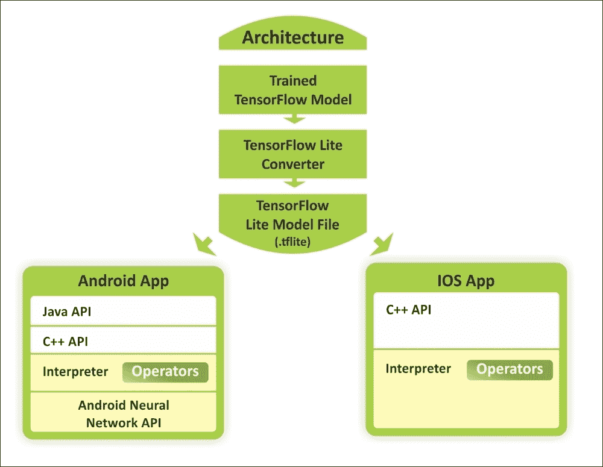

图 1：使用 TensorFlow Lite 在 Android 和 iOS 设备上使用训练模型的概念视图

机器学习正在改变计算范式，我们看到了移动和嵌入式设备上新用例的新趋势。在相机和语音交互模型的推动下，消费者的期望也趋向于与其设备进行自然的，类似人的交互。

因此，用户的期望不再局限于计算机，并且移动设备的计算能力也因硬件加速以及诸如 Android 神经​​网络 API 和 iOS 的 C++  API 之类的框架而呈指数级增长。如上图所示，预训练模型可以转换为较轻的版本，以便作为 Android 或 iOS 应用运行。

因此，广泛使用的智能设备为设备智能创造了新的可能性。这些允许我们使用我们的智能手机来执行实时计算机视觉和自然语言处理（NLP）。

## 急切执行

急切执行是 TensorFlow 的一个接口，它提供了一种命令式编程风格。启用预先执行时，TensorFlow 操作（在程序中定义）立即执行。

需要注意的是，从 TensorFlow v1.7 开始，急切执行将被移出`contrib`。这意味着建议使用`tf.enable_eager_execution()`。我们将在后面的部分中看到一个例子。

## 优化加速线性代数（XLA）

v1.5 之前的 XLA 不稳定并且具有非常有限的特性。但是，v1.6 对 XLA 的支持更多。这包括以下内容：

*   添加了对 XLA 编译器的 Complex64 支持
*   现在为 CPU 和 GPU 添加了快速傅里叶变换（FFT）支持
*   `bfloat`支持现已添加到 XLA 基础结构中
*   已启用 ClusterSpec 传播与 XLA 设备的工作
*   Android TF 现在可以在兼容的 Tegra 设备上使用 CUDA 加速构建
*   已启用对添加确定性执行程序以生成 XLA 图的支持

开源社区报告的大量错误已得到修复，并且此版本已集成了大量 API 级别的更改。

但是，由于我们尚未使用 TensorFlow 进行任何研究，我们将在后面看到如何利用这些功能开发真实的深度学习应用。在此之前，让我们看看如何准备您的编程环境。

# 安装和配置 TensorFlow

您可以在许多平台上安装和使用  TensorFlow，例如 Linux，  macOS 和 Windows。此外，您还可以从 TensorFlow 的最新 GitHub 源构建和安装 TensorFlow。此外，如果您有 Windows 机器，您可以通过原生点或 Anacondas 安装 TensorFlow。 TensorFlow 在 Windows 上支持 Python 3.5.x 和 3.6.x.

此外，Python 3 附带了 PIP3 包管理器，它是用于安装 TensorFlow 的程序。因此，如果您使用此 Python 版本，则无需安装 PIP。根据我们的经验，即使您的计算机上集成了 NVIDIA GPU 硬件，也值得安装并首先尝试仅使用 CPU 的版本，如果您没有获得良好的表现，那么您应该切换到 GPU 支持。

支持 GPU 的 TensorFlow 版本有几个要求，例如 64 位 Linux，Python 2.7（或 Python 3 的 3.3+），NVIDIACUDA®7.5 或更高版本（Pascal GPU 需要 CUDA 8.0）和  NVIDIA cuDNN（这是 GPU 加速深度学习）v5.1（建议使用更高版本）。有关详情，请参阅[此链接](https://developer.nvidia.com/cudnn)。

更具体地说，TensorFlow 的当前开发仅支持使用 NVIDIA 工具包和软件的 GPU 计算。因此，必须在您的计算机上安装以下软件才能获得预测分析应用的 GPU 支持：

*   NVIDIA 驱动程序
*   具有计算能力的`CUDA >= 3.0`
*   CudNN

NVIDIA CUDA 工具包包括（详见[此链接](https://developer.nvidia.com/cuda-zone)）：

*   GPU 加速库，例如用于 FFT 的 cuFFT
*   基本线性代数子程序（BLAS）的 cuBLAS
*   cuSPARSE 用于稀疏矩阵例程
*   cuSOLVER 用于密集和稀疏的直接求解器
*   随机数生成的 cuRAND，图像的 NPP 和视频处理原语
*   适用于 NVIDIA Graph Analytics 库的 nvGRAPH
*   对模板化并行算法和数据结构以及专用 CUDA 数学库的推动

但是，我们不会介绍 TensorFlow 的安装和配置，因为 TensorFlow 上提供的文档非常丰富，可以遵循并采取相应的措施。另一个原因是该版本将定期更改。因此，[使用 TensorFlow 网站](https://www.tensorflow.org/install/)保持自己更新将是一个更好的主意。

如果您已经安装并配置了编程环境，那么让我们深入了解 TensorFlow 计算图。

# TensorFlow 计算图

在考虑执行  TensorFlow 程序时，我们应该熟悉图创建和会话执行的概念。基本上，第一个用于构建模型，第二个用于提供数据并获得结果。

有趣的是，TensorFlow 在 C++ 引擎上执行所有操作，这意味着在 Python 中甚至不会执行一些乘法或添加操作。 Python 只是一个包装器。从根本上说，TensorFlow C++ 引擎包含以下两件事：

*   有效的操作实现，例如 CNN 的卷积，最大池化和 sigmoid
*   转发模式操作的衍生物

TensorFlow 库在编码方面是一个非凡的库，它不像传统的 Python 代码（例如，你可以编写语句并执行它们）。 TensorFlow 代码由不同的操作组成。甚至变量初始化在 TensorFlow 中也很特殊。当您使用 TensorFlow 执行复杂操作（例如训练线性回归）时，TensorFlow 会在内部使用数据流图表示其计算。该图称为计算图，它是由以下组成的有向图：

*   一组节点，每个节点代表一个操作
*   一组有向弧，每个弧代表执行操作的数据

TensorFlow 有两种类型的边：

*   正常：它们携带节点之间的数据结构。一个操作的输出，即来自一个节点的输出，成为另一个操作的输入。连接两个节点的边缘带有值。
*   特殊：此边不携带值，但仅表示两个节点之间的控制依赖关系，例如 X 和 Y。这意味着只有在 X 中的操作已经执行时才会执行节点 Y，但之前关于数据的操作之间的关系。

TensorFlow 实现定义控制依赖性，以强制规定执行其他独立操作的顺序，作为控制峰值内存使用的方式。

计算图基本上类似于数据流图。图 2 显示了简单计算的计算图，如`z = d × c = (a + b) × c`：

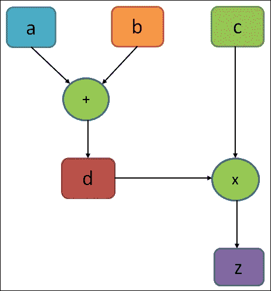

图 2：一个计算简单方程的非常简单的执行图

在上图中，图中的圆圈表示操作，而矩形表示计算图。如前所述，TensorFlow 图包含以下内容：

*   `tf.Operation`对象：这些是图中的节点。这些通常简称为操作。 操作仅为 TITO（张量 - 张量 - 张量）。一个或多个张量输入和一个或多个张量输出。
*   `tf.Tensor`对象：这些是图的边缘。这些通常简称为张量。

张量对象在图中的各种操作之间流动。在上图中，`d`也是操作。它可以是“常量”操作，其输出是张量，包含分配给`d`的实际值。

也可以使用 TensorFlow 执行延迟执行。简而言之，一旦您在计算图的构建阶段中编写了高度复合的表达式，您仍然可以在运行会话阶段对其进行评估。从技术上讲，TensorFlow 安排工作并以​​有效的方式按时执行。

例如，使用 GPU 并行执行代码的独立部分如下图所示：

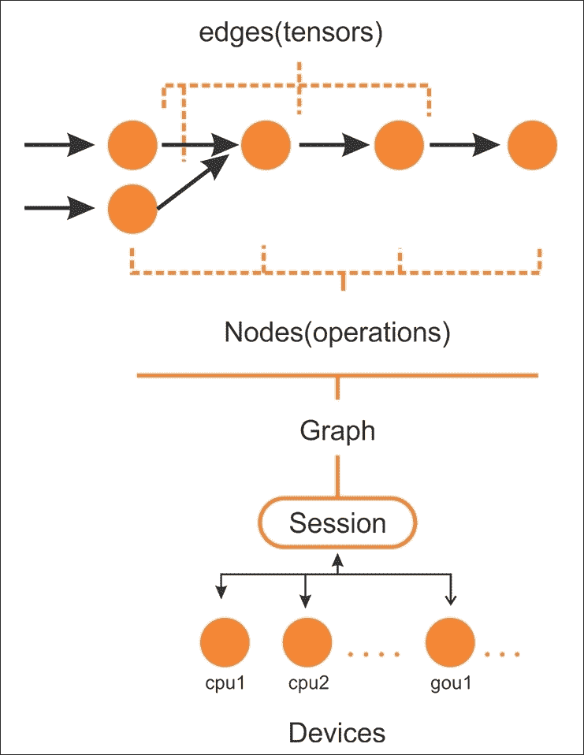

图 3：要在 CPU 或 GPU 等设备上的会话上执行的 TensorFlow 图中的边和节点

在创建计算图之后，TensorFlow 需要具有以分布式方式由多个 CPU（以及 GPU，如果可用）执行的活动会话。通常，您实际上不需要明确指定是使用 CPU 还是 GPU，因为 TensorFlow 可以选择使用哪一个。

默认情况下，将选择 GPU 以进行尽可能多的操作；否则，将使用 CPU。然而，通常，它会分配所有 GPU 内存，即使它不消耗它。

以下是 TensorFlow 图的主要组成部分：

*   变量：用于 TensorFlow 会话之间的值，包含权重和偏差。
*   张量：一组值，在节点之间传递以执行操作（也称为操作）。
*   占位符：用于在程序和 TensorFlow 图之间发送数据。
*   会话：当会话启动时，TensorFlow 会自动计算图中所有操作的梯度，并在链式规则中使用它们。实际上，在执行图时会调用会话。

不用担心，前面这些组件中的每一个都将在后面的章节中讨论。从技术上讲，您将要编写的程序可以被视为客户。然后，客户端用于以符号方式在 C/C++ 或 Python 中创建执行图，然后您的代码可以请求 TensorFlow 执行此图。整个概念从下图中变得更加清晰：


图 4：使用客户端主架构来执行 TensorFlow 图

计算图有助于使用 CPU 或 GPU 在多个计算节点上分配工作负载。这样，神经网络可以等同于复合函数，其中每个层（输入，隐藏或输出层）可以表示为函数。要了解在张量上执行的操作，需要了解 TensorFlow 编程模型的良好解决方法。

# TensorFlow 代码结构

TensorFlow 编程模型表示如何构建预测模型。导入 TensorFlow 库时，  TensorFlow 程序通常分为四个阶段：

*   构建涉及张量运算的计算图（我们将很快看到张量）
*   创建会话
*   运行会话；为图中定义的操作执行
*   计算数据收集和分析

这些主要阶段定义了 TensorFlow 中的编程模型。请考虑以下示例，其中我们要将两个数相乘：

```py
import tensorflow as tf # Import TensorFlow

x = tf.constant(8) # X op
y = tf.constant(9) # Y op
z = tf.multiply(x, y) # New op Z

sess = tf.Session() # Create TensorFlow session

out_z = sess.run(z) # execute Z op
sess.close() # Close TensorFlow session
print('The multiplication of x and y: %d' % out_z)# print result
```

前面的代码段可以用下图表示：

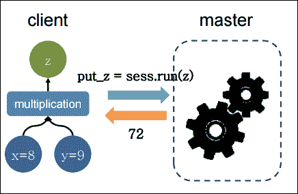

图 5：在客户端主架构上执行并返回的简单乘法

为了使前面的程序更有效，TensorFlow 还允许通过占位符交换图​​变量中的数据（稍后讨论）。现在想象一下代码段之后的可以做同样的事情，但效率更高：

```py
import tensorflow as tf

# Build a graph and create session passing the graph
with tf.Session() as sess:
    x = tf.placeholder(tf.float32, name="x")
    y = tf.placeholder(tf.float32, name="y")
    z = tf.multiply(x,y)

# Put the values 8,9 on the placeholders x,y and execute the graph
z_output = sess.run(z,feed_dict={x: 8, y:9})
print(z_output)
```

TensorFlow 不是乘以两个数字所必需的。此外，这个简单的操作有很多行代码。该示例的目的是阐明如何构造代码，从最简单的（如在本例中）到最复杂的。此外，该示例还包含一些基本指令，我们将在本书中给出的所有其他示例中找到这些指令。

第一行中的单个导入为您的命令导入 TensorFlow;如前所述，它可以用`tf`实例化。然后，TensorFlow 运算符将由`tf`和要使用的运算符的名称表示。在下一行中，我们通过`tf.Session()`指令构造`session`对象：

```py
with tf.Session() as sess:
```

### 提示

会话对象（即`sess`）封装了 TensorFlow 的环境，以便执行所有操作对象，并评估`Tensor`对象。我们将在接下来的部分中看到它们。

该对象包含计算图，如前所述，它包含要执行的计算。以下两行使用`placeholder`定义变量`x`和`y`。通过`placeholder`，您可以定义输入（例如我们示例的变量`x`）和输出变量（例如变量`y`）：

```py
x = tf.placeholder(tf.float32, name="x")
y = tf.placeholder(tf.float32, name="y")
```

### 提示

占位符提供图元素和问题计算数据之间的接口。它们允许我们创建我们的操作并构建我们的计算图而不需要数据，而不是使用它的引用。

要通过`placeholder`函数定义数据或张量（我们将很快向您介绍张量的概念），需要三个参数：

*   数据类型是要进给的张量中的元素类型。
*   占位符的形状是要进给的张量的形状（可选）。如果未指定形状，则可以提供任何形状的张量。
*   名称对于调试和代码分析非常有用，但它是可选的。

### 注意

有关张量的更多信息，请参阅[此链接](https://www.tensorflow.org/api_docs/python/tf/Tensor)。

因此，我们可以使用先前定义的两个参数（占位符和常量）来引入我们想要计算的模型。接下来，我们定义计算模型。

会话内的以下语句构建`x`和`y`的乘积的数据结构，并随后将操作结果分配给张量`z`。然后它如下：

```py
     z = tf.multiply(x, y)
```

由于结果已由占位符`z`保存，我们通过`sess.run`语句执行图。在这里，我们提供两个值来将张量修补为图节点。它暂时用张量值替换操作的输出：

```py
z_output = sess.run(z,feed_dict={x: 8, y:9})
```

在最后的指令中，我们打印结果：

```py
     print(z_output)
```

这打印输出`72.0`。

## 用 TensorFlow 急切执行

如前所述，在启用 TensorFlow 的急切执行时，我们可以立即执行 TensorFlow 操作，因为它们是以命令方式从 Python 调用的。

启用急切执行后，TensorFlow 函数会立即执行操作并返回具体值。这与[`tf.Session`](https://www.tensorflow.org/versions/master/api_docs/python/tf/Session)相反，函数添加到图并创建计算图中的节点的符号引用。

TensorFlow 通过`tf.enable_eager_execution`提供急切的执行功能，其中包含以下别名：

*   `tf.contrib.eager.enable_eager_execution`
*   `tf.enable_eager_execution`

`tf.enable_eager_execution`具有以下签名：

```py
tf.enable_eager_execution(
        config=None,
        device_policy=None
)
```

在上面的签名中，`config`是`tf.ConfigProto`，用于配置执行操作的环境，但这是一个可选参数。另一方面，`device_policy`也是一个可选参数，用于控制关于特定设备（例如 GPU0）上需要输入的操作如何处理不同设备（例如，GPU1 或 CPU）上的输入的策略。

现在调用前面的代码将启用程序生命周期的急切执行。例如，以下代码在 TensorFlow 中执行简单的乘法运算：

```py
import tensorflow as tf

x = tf.placeholder(tf.float32, shape=[1, 1]) # a placeholder for variable x
y = tf.placeholder(tf.float32, shape=[1, 1]) # a placeholder for variable y
m = tf.matmul(x, y)

with tf.Session() as sess:
    print(sess.run(m, feed_dict={x: [[2.]], y: [[4.]]}))
```

以下是上述代码的输出：

```py
>>>
8.

```

然而，使用急切执行，整体代码看起来更简单：

```py
import tensorflow as tf

# Eager execution (from TF v1.7 onwards):
tf.eager.enable_eager_execution()
x = [[2.]]
y = [[4.]]
m = tf.matmul(x, y)

print(m)
```

以下是上述代码的输出：

```py
>>>
tf.Tensor([[8.]], shape=(1, 1), dtype=float32)

```

你能理解在执行前面的代码块时会发生什么吗？好了，在启用了执行后，操作在定义时执行，`Tensor`对象保存具体值，可以通过`numpy()`方法作为`numpy.ndarray`访问。

请注意，在使用 TensorFlow API 创建或执行图后，无法启用急切执行。通常建议在程序启动时调用此函数，而不是在库中调用。虽然这听起来很吸引人，但我们不会在即将到来的章节中使用此功能，因为这是一个新功能，尚未得到很好的探索。

# TensorFlow 中的数据模型

TensorFlow 中的数据模型由张量表示。在不使用复杂的数学定义的情况下，我们可以说张量（在 TensorFlow 中）识别多维数值数组。我们将在下一小节中看到有关张量的更多细节。

## 张量

让我们看一下来自[维基百科：张量](https://en.wikipedia.org/wiki/Tensor)的形式定义：

> “张量是描述几何向量，标量和其他张量之间线性关系的几何对象。这种关系的基本例子包括点积，叉积和线性映射。几何向量，通常用于物理和工程应用，以及标量他们自己也是张量。“

该数据结构的特征在于三个参数：秩，形状和类型，如下图所示：

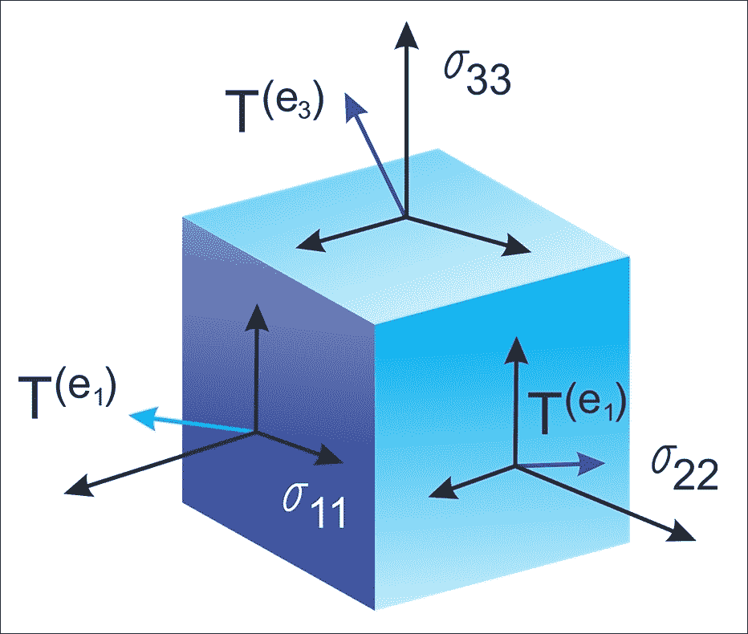

图 6：张量只是具有形状，阶数和类型的几何对象，用于保存多维数组

因此，张量可以被认为是指定具有任意数量的索引的元素的矩阵的推广。张量的语法与嵌套向量大致相同。

### 提示

张量只定义此值的类型以及在会话期间应计算此值的方法。因此，它们不代表或保留操作产生的任何价值。

有些人喜欢比较 NumPy 和 TensorFlow。然而，实际上，TensorFlow 和 NumPy 在两者都是 Nd 数组库的意义上非常相似！

嗯，NumPy 确实有 n 维数组支持，但它不提供方法来创建张量函数并自动计算导数（并且它没有 GPU 支持）。下图是 NumPy 和 TensorFlow 的简短一对一比较：

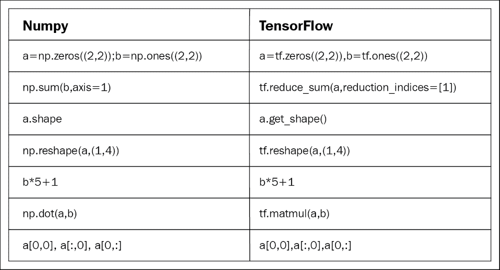

图 7：NumPy 与 TensorFlow：一对一比较

现在让我们看一下在 TensorFlow 图之前创建张量的替代方法（我们将在后面看到其他的进给机制）：

```py
>>> X = [[2.0, 4.0],
        [6.0, 8.0]] # X is a list of lists
>>> Y = np.array([[2.0, 4.0],
                 [6.0, 6.0]], dtype=np.float32)#Y is a Numpy array
>>> Z = tf.constant([[2.0, 4.0],
                    [6.0, 8.0]]) # Z is a tensor

```

这里，`X`是列表，`Y`是来自 NumPy 库的 n 维数组，`Z`是 TensorFlow 张量对象。现在让我们看看他们的类型：

```py
>>> print(type(X))
>>> print(type(Y))
>>> print(type(Z))

#Output
<class 'list'>
<class 'numpy.ndarray'>
<class 'tensorflow.python.framework.ops.Tensor'>
```

好吧，他们的类型打印正确。但是，与其他类型相比，我们正式处理张量的更方便的函数是`tf.convert_to_tensor()`函数如下：

```py
t1 = tf.convert_to_tensor(X, dtype=tf.float32)
t2 = tf.convert_to_tensor(Z, dtype=tf.float32)
```

现在让我们使用以下代码查看它们的类型：

```py
>>> print(type(t1))
>>> print(type(t2))

#Output:
<class 'tensorflow.python.framework.ops.Tensor'>
<class 'tensorflow.python.framework.ops.Tensor'>
```

太棒了！关于张量的讨论已经足够了。因此，我们可以考虑以术语秩为特征的结构。

## 秩和形状

称为秩的维度单位描述每个张量。它识别张量的维数。因此，秩被称为张量的阶数或维度。阶数零张量是标量，阶数 1 张量是向量，阶数 2 张量是矩阵。

以下代码定义了 TensorFlow `scalar`，`vector`，`matrix`和`cube_matrix`。在下一个示例中，我们将展示秩如何工作：

```py
import tensorflow as tf
scalar = tf.constant(100)
vector = tf.constant([1,2,3,4,5])
matrix = tf.constant([[1,2,3],[4,5,6]])

cube_matrix = tf.constant([[[1],[2],[3]],[[4],[5],[6]],[[7],[8],[9]]])

print(scalar.get_shape())
print(vector.get_shape())
print(matrix.get_shape())
print(cube_matrix.get_shape())
```

结果打印在这里：

```py
>>>
()
(5,)
(2, 3)
(3, 3, 1)
>>>

```

张量的形状是它具有的行数和列数。现在我们将看看如何将张量的形状与其阶数联系起来：

```py
>>scalar.get_shape()
TensorShape([])

>>vector.get_shape()
TensorShape([Dimension(5)])

>>matrix.get_shape()
TensorShape([Dimension(2), Dimension(3)])

>>cube.get_shape()
TensorShape([Dimension(3), Dimension(3), Dimension(1)])

```

## 数据类型

除了阶数和形状，张量具有数据类型。以下是数据类型列表：

| 数据类型 | Python 类型 | 描述 |
| --- | --- | --- |
| `DT_FLOAT` | `tf.float32` | 32 位浮点 |
| `DT_DOUBLE` | `tf.float64` | 64 位浮点 |
| `DT_INT8` | `tf.int8` | 8 位有符号整数 |
| `DT_INT16` | `tf.int16` | 16 位有符号整数 |
| `DT_INT32` | `tf.int32` | 32 位有符号整数 |
| `DT_INT64` | `tf.int64` | 64 位有符号整数 |
| `DT_UINT8` | `tf.uint8` | 8 位无符号整数 |
| `DT_STRING` | `tf.string` | 可变长度字节数组。张量的每个元素都是一个字节数组 |
| `DT_BOOL` | `tf.bool` | 布尔 |
| `DT_COMPLEX64` | `tf.complex64` | 由两个 32 位浮点组成的复数：实部和虚部 |
| `DT_COMPLEX128` | `tf.complex128` | 由两个 64 位浮点组成的复数：实部和虚部 |
| `DT_QINT8` | `tf.qint8` | 量化操作中使用的 8 位有符号整数 |
| `DT_QINT32` | `tf.qint32` | 量化操作中使用的 32 位有符号整数 |
| `DT_QUINT8` | `tf.quint8` | 量化操作中使用的 8 位无符号整数 |

上表是不言自明的，因此我们没有提供有关数据类型的详细讨论。 TensorFlow API 用于管理与 NumPy 数组之间的数据。

因此，要构建具有常量值的张量，将 NumPy 数组传递给`tf.constant()`运算符，结果将是具有该值的张量：

```py
import tensorflow as tf

import numpy as np
array_1d = np.array([1,2,3,4,5,6,7,8,9,10])
tensor_1d = tf.constant(array_1d)

with tf.Session() as sess:
    print(tensor_1d.get_shape())
    print(sess.run(tensor_1d))
```

运行该示例，我们获得以下内容：

```py
>>>
 (10,)
 [ 1  2  3  4  5  6  7  8  9 10]

```

要构建具有变量值的张量，请使用 NumPy 数组并将其传递给`tf.Variable`构造函数。结果将是具有该初始值的变量张量：

```py
import tensorflow as tf
import numpy as np

# Create a sample NumPy array
array_2d = np.array([(1,2,3),(4,5,6),(7,8,9)])

# Now pass the preceding array to tf.Variable()
tensor_2d = tf.Variable(array_2d)

# Execute the preceding op under an active session
with tf.Session() as sess:
    sess.run(tf.global_variables_initializer())
    print(tensor_2d.get_shape())
    print sess.run(tensor_2d)
# Finally, close the TensorFlow session when you're done
sess.close()
```

在前面的代码块中，`tf.global_variables_initializer()`用于初始化我们之前创建的所有操作。如果需要创建一个初始值取决于另一个变量的变量，请使用另一个变量的`initialized_value()`。这可确保以正确的顺序初始化变量。

结果如下：

```py
>>>
 (3, 3)
 [[1 2 3]
 [4 5 6]
 [7 8 9]]

```

为了便于在交互式 Python 环境中使用，我们可以使用`InteractiveSession`类，然后将该会话用于所有`Tensor.eval()`和`Operation.run()`调用：

```py
import tensorflow as tf # Import TensorFlow
import numpy as np # Import numpy

# Create an interactive TensorFlow session
interactive_session = tf.InteractiveSession()

# Create a 1d NumPy array 
array1 = np.array([1,2,3,4,5]) # An array

# Then convert the preceding array into a tensor
tensor = tf.constant(array1) # convert to tensor
print(tensor.eval()) # evaluate the tensor op

interactive_session.close() # close the session
```

### 提示

`tf.InteractiveSession()`只是方便的语法糖，用于在 IPython 中保持默认会话打开。

结果如下：

```py
>>>
   [1 2 3 4 5]

```

在交互式设置中，例如 shell 或 IPython 笔记本，这可能会更容易，因为在任何地方传递会话对象都很繁琐。

### 注意

IPython 笔记本现在称为 Jupyter 笔记本。它是一个交互式计算环境，您可以在其中组合代码执行，富文本，数学，绘图和富媒体。有关更多信息，感兴趣的读者请参阅[此链接](https://ipython.org/notebook.html)。

定义张量的另一种方法是使用`tf.convert_to_tensor`语句：

```py
import tensorflow as tf
import numpy as np
tensor_3d = np.array([[[0, 1, 2], [3, 4, 5], [6, 7, 8]],
                      [[9, 10, 11], [12, 13, 14], [15, 16, 17]],
                      [[18, 19, 20], [21, 22, 23], [24, 25, 26]]])
tensor_3d = tf.convert_to_tensor(tensor_3d, dtype=tf.float64)

with tf.Session() as sess:
    print(tensor_3d.get_shape())
    print(sess.run(tensor_3d))
# Finally, close the TensorFlow session when you're done
sess.close()
```

以下是上述代码的输出：

```py
>>>
(3, 3, 3)
[[[  0\.   1\.   2.]
  [  3\.   4\.   5.]
  [  6\.   7\.   8.]]
 [[  9\.  10\.  11.]
  [ 12\.  13\.  14.]
  [ 15\.  16\.  17.]]
 [[ 18\.  19\.  20.]
  [ 21\.  22\.  23.]
  [ 24\.  25\.  26.]]]

```

## 变量

变量是用于保存和更新参数的  TensorFlow 对象。必须初始化变量，以便您可以保存并恢复它以便稍后分析代码。使用`tf.Variable()`或`tf.get_variable()`语句创建变量。而`tf.get_varaiable()`被推荐但`tf.Variable()`是低标签抽象。

在下面的示例中，我们要计算从 1 到 10 的数字，但让我们先导入 TensorFlow：

```py
import tensorflow as tf
```

我们创建了一个将初始化为标量值 0 的变量：

```py
value = tf.get_variable("value", shape=[], dtype=tf.int32, initializer=None, regularizer=None, trainable=True, collections=None)
```

`assign()`和`add()`运算符只是计算图的节点，因此在会话运行之前它们不会执行赋值：

```py
one = tf.constant(1)
update_value = tf.assign_add(value, one)
initialize_var = tf.global_variables_initializer()
```

我们可以实例化计算图：

```py
with tf.Session() as sess:
    sess.run(initialize_var)
    print(sess.run(value))
    for _ in range(5):
        sess.run(update_value)
        print(sess.run(value))
# Close the session
```

让我们回想一下，张量对象是操作结果的符号句柄，但它实际上并不保存操作输出的值：

```py
>>>
0
1
2
3
4
5

```

## 获取

要获取操作的输出，可以通过调用会话对象上的`run()`并传入张量来执行图。除了获取单个张量节点，您还可以获取多个张量。

在下面的示例中，使用`run()`调用一起提取`sum`和`multiply`张量：

```py
import tensorflow as tf
constant_A = tf.constant([100.0])
constant_B = tf.constant([300.0])
constant_C = tf.constant([3.0])

sum_ = tf.add(constant_A,constant_B)
mul_ = tf.multiply(constant_A,constant_C)

with tf.Session() as sess:
    result = sess.run([sum_,mul_])# _ means throw away afterwards
    print(result)
```

输出如下：

```py
>>>
[array(400.],dtype=float32),array([ 300.],dtype=float32)]

```

应该注意的是，所有需要执行的操作（即，为了产生张量值）都运行一次（每个请求的张量不是一次）。

## 馈送和占位符

有四种方法将数据输入 TensorFlow 程序（更多信息，请参阅[此链接](https://www.tensorflow.org/api_guides/python/reading_data)）：

*   数据集 API：这使您能够从简单和可重用的分布式文件系统构建复杂的输入管道，并执行复杂的操作。如果您要处理不同数据格式的大量数据，建议使用数据集 API。数据集 API 为 TensorFlow 引入了两个新的抽象，用于创建可馈送数据集：`tf.contrib.data.Dataset`（通过创建源或应用转换操作）和`tf.contrib.data.Iterator`。
*   馈送：这允许我们将数据注入计算图中的任何张量。
*   从文件中读取：这允许我们使用 Python 的内置机制开发输入管道，用于从图开头的数据文件中读取数据。
*   预加载数据：对于小数据集，我们可以使用 TensorFlow 图中的常量或变量来保存所有数据。

在本节中，我们将看到馈送机制的例子。我们将在接下来的章节中看到其他方法。 TensorFlow 提供了一种馈送机制，允许我们将数据注入计算图中的任何张量。您可以通过`feed_dict`参数将源数据提供给启动计算的`run()`或`eval()`调用。

### 提示

使用`feed_dict`参数进行馈送是将数据提供到 TensorFlow 执行图中的最低效方法，并且仅应用于需要小数据集的小型实验。它也可以用于调试。

我们还可以用馈送数据（即变量和常量）替换任何张量。最佳做法是使用[`tf.placeholder()`](https://www.tensorflow.org/api_docs/python/tf/placeholder)使用 TensorFlow 占位符节点。占位符专门用作馈送的目标。空占位符未初始化，因此不包含任何数据。

因此，如果在没有馈送的情况下执行它，它将始终生成错误，因此您不会忘记提供它。以下示例显示如何提供数据以构建随机`2×3`矩阵：

```py
import tensorflow as tf
import numpy as np

a = 3
b = 2
x = tf.placeholder(tf.float32,shape=(a,b))
y = tf.add(x,x)

data = np.random.rand(a,b)
sess = tf.Session()
print(sess.run(y,feed_dict={x:data}))

sess.close()# close the session
```

输出如下：

```py
>>>
[[ 1.78602004  1.64606333]
 [ 1.03966308  0.99269408]
 [ 0.98822606  1.50157797]]
>>>

```

# 通过 TensorBoard 可视化计算

TensorFlow 包含函数  ，允许您在名为 TensorBoard 的可视化工具中调试和优化程序。使用 TensorBoard，您可以图形化地观察有关图任何部分的参数和详细信息的不同类型的统计数据。

此外，在使用复杂的 DNN 进行预测建模时，图可能很复杂且令人困惑。为了更容易理解，调试和优化 TensorFlow 程序，您可以使用 TensorBoard 可视化 TensorFlow 图，绘制有关图执行的量化指标，并显示其他数据，例如通过它的图像。

因此，TensorBoard 可以被认为是一个用于分析和调试预测模型的框架。 TensorBoard 使用所谓的摘要来查看模型的参数：一旦执行了 TensorFlow 代码，我们就可以调用 TensorBoard 来查看 GUI 中的摘要。

## TensorBoard 如何运作？

TensorFlow 使用计算图来执行应用。在计算图中，节点表示操作，弧是操作之间的数据。

TensorBoard 的主要思想是将摘要与图上的节点（操作）相关联。代码运行时，摘要操作将序列化节点的数据并将数据输出到文件中。稍后，TensorBoard 将可视化汇总操作。有关更详细的讨论，读者可以参考[此链接](https://github.com/tensorflow/tensorboard)。

简而言之，TensorBoard 是一套 Web 应用，用于检查和理解您的 TensorFlow 运行和图。使用 TensorBoard 时的工作流程如下：

1.  构建计算图/代码
2.  将摘要操作附加到您要检查的节点
3.  像往常一样开始运行图
4.  运行摘要操作
5.  执行完成后，运行 TensorBoard 以显示摘要输出

    ```py
    file_writer = tf.summary.FileWriter('/path/to/logs', sess.graph)
    ```

对于步骤 2（即，在运行 TensorBoard 之前），请确保通过创建摘要编写器在日志目录中生成摘要数据：

＃`sess.graph`包含图定义；启用图可视化工具

现在，如果你在终端中键入`$ which tensorboard`，如果你用 pip 安装它，它应该存在：

```py
root@ubuntu:~$ which tensorboard
/usr/local/bin/tensorboard

```

你需要给它一个日志目录。当您在运行图的目录中时，可以使用以下内容从终端启动它：

```py
tensorboard --logdir path/to/logs

```

当 TensorBoard 配置完全时，可以通过发出以下命令来访问它：

```py
# Make sure there's no space before or after '="
$ tensorboard –logdir=<trace_file_name>

```

现在您只需输入`http://localhost:6006/`即可从浏览器访问`localhost:6006`。然后它应该是这样的：

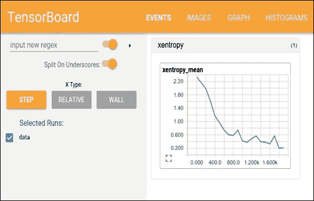

图 8：在浏览器上使用 TensorBoard

### 注意

TensorBoard 可用于谷歌浏览器或 Firefox。其他浏览器可能有效，但可能存在错误或表现问题。

这已经太过分了吗？不要担心，在上一节中，我们将结合前面解释的所有想法构建单个输入神经元模型并使用 TensorBoard 进行分析。

# 线性回归及更多

在本节中，我们将仔细研究 TensorFlow 和 TensorBoard 的主要概念，并尝试做一些基本操作来帮助您入门。我们想要实现的模型模拟线性回归。

在统计和 ML 中，线性回归是一种经常用于衡量变量之间关系的技术。这是一种非常简单但有效的算法，也可用于预测建模。

线性回归模拟因变量`y[i]`，自变量`x[i]`，和随机项`b`。这可以看作如下：

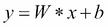

使用 TensorFlow 的典型线性回归问题具有以下工作流程，该工作流程更新参数以最小化给定成本函数（参见下图）：

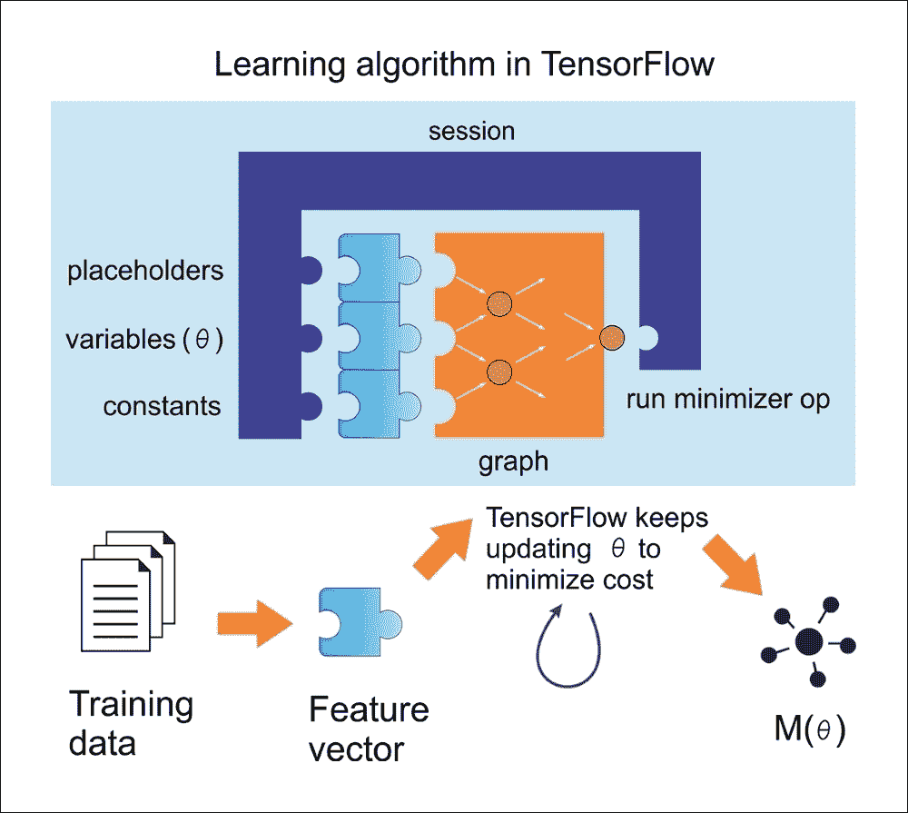

图 9：在 TensorFlow 中使用线性回归的学习算法

现在，让我们尝试按照前面的图，通过概念化前面的等式将其重现为线性回归。为此，我们将编写一个简单的 Python 程序，用于在 2D 空间中创建数据。然后我们将使用 TensorFlow 来寻找最适合数据点的线（如下图所示）：

```py
# Import libraries (Numpy, matplotlib)

import numpy as np
import matplotlib.pyplot as plot

# Create 1000 points following a function y=0.1 * x + 0.4z
(i.e. # y = W * x + b) with some normal random distribution:

num_points = 1000
vectors_set = []

# Create a few random data points 
for i in range(num_points):
    W = 0.1 # W
   b = 0.4 # b
    x1 = np.random.normal(0.0, 1.0)#in: mean, standard deviation
    nd = np.random.normal(0.0, 0.05)#in:mean,standard deviation
    y1 = W * x1 + b

 # Add some impurity with normal distribution -i.e. nd 
    y1 = y1 + nd

 # Append them and create a combined vector set:
    vectors_set.append([x1, y1])

# Separate the data point across axises:
x_data = [v[0] for v in vectors_set]
y_data = [v[1] for v in vectors_set]

# Plot and show the data points in a 2D space
plot.plot(x_data, y_data, 'ro', label='Original data')
plot.legend()
plot.show()
```

如果您的编译器没有报错，您应该得到以下图表：

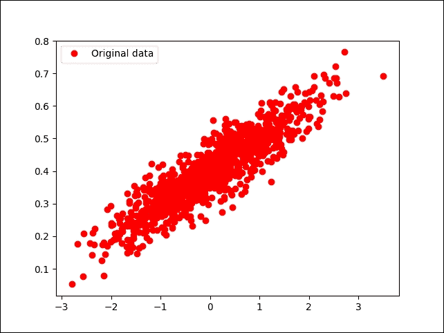

图 10：随机生成（但原始）数据

好吧，到目前为止，我们刚刚创建了一些数据点而没有可以通过  TensorFlow 执行的相关模型。因此，下一步是创建一个线性回归模型，该模型可以获得从输入数据点估计的输出值`y`，即`x_data`。在这种情况下，我们只有两个相关参数，`W`和`b`。

现在的目标是创建一个图，允许我们根据输入数据`x_data`，通过将它们调整为`y_data`来找到这两个参数的值。因此，我们的目标函数如下：

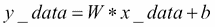

如果你还记得，我们在 2D 空间中创建数据点时定义了`W = 0.1`和`b = 0.4`。 TensorFlow 必须优化这两个值，使`W`趋于 0.1 和`b`为 0.4。

解决此类优化问题的标准方法是迭代数据点的每个值并调整`W`和`b`的值，以便为每次迭代获得更精确的答案。要查看值是否确实在改善，我们需要定义一个成本函数来衡量某条线的优质程度。

在我们的例子中，成本函数是均方误差，这有助于我们根据实际数据点与每次迭代的估计距离函数之间的距离函数找出误差的平均值。我们首先导入 TensorFlow 库：

```py
import tensorflow as tf
W = tf.Variable(tf.zeros([1]))
b = tf.Variable(tf.zeros([1]))
y = W * x_data + b
```

在前面的代码段中，我们使用不同的策略生成一个随机点并将其存储在变量`W`中。现在，让我们定义一个损失函数`loss = mean[(y - y_data)^2]`，这将返回一个标量值，其中包含我们之间所有距离的均值。数据和模型预测。就 TensorFlow 约定而言，损失函数可表示如下：

```py
loss = tf.reduce_mean(tf.square(y - y_data))
```

前一行实际上计算均方误差（MSE）。在不进一步详述的情况下，我们可以使用一些广泛使用的优化算法，例如 GD。在最低级别，GD 是一种算法，它对我们已经拥有的一组给定参数起作用。

它以一组初始参数值开始，并迭代地移向一组值，这些值通过采用另一个称为学习率的参数来最小化函数。通过在梯度函数的负方向上采取步骤来实现这种迭代最小化：

```py
optimizer = tf.train.GradientDescentOptimizer(0.6)
train = optimizer.minimize(loss)
```

在运行此优化函数之前，我们需要初始化到目前为止所有的变量。让我们使用传统的 TensorFlow 技术，如下所示：

```py
init = tf.global_variables_initializer()
sess = tf.Session()
sess.run(init)
```

由于我们已经创建了 TensorFlow 会话，我们已准备好进行迭代过程，帮助我们找到`W`和`b`的最佳值：

```py
for i in range(6):
  sess.run(train)
  print(i, sess.run(W), sess.run(b), sess.run(loss))
```

您应该观察以下输出：

```py
>>>
0 [ 0.18418592] [ 0.47198644] 0.0152888
1 [ 0.08373772] [ 0.38146532] 0.00311204
2 [ 0.10470386] [ 0.39876288] 0.00262051
3 [ 0.10031486] [ 0.39547175] 0.00260051
4 [ 0.10123629] [ 0.39609471] 0.00259969
5 [ 0.1010423] [ 0.39597753] 0.00259966
6 [ 0.10108326] [ 0.3959994] 0.00259966
7 [ 0.10107458] [ 0.39599535] 0.00259966

```

你可以看到算法从`W = 0.18418592`和`b = 0.47198644`的初始值开始，损失非常高。然后，算法通过最小化成本函数来迭代地调整值。在第八次迭代中，所有值都倾向于我们期望的值。

现在，如果我们可以绘制它们怎么办？让我们通过在`for`循环下添加绘图线来实现  ，如下所示：

```py
for i in range(6):
       sess.run(train)
       print(i, sess.run(W), sess.run(b), sess.run(loss))
       plot.plot(x_data, y_data, 'ro', label='Original data')
       plot.plot(x_data, sess.run(W)*x_data + sess.run(b))
       plot.xlabel('X')
       plot.xlim(-2, 2)
       plot.ylim(0.1, 0.6)
       plot.ylabel('Y')
       plot.legend()
       plot.show()
```

前面的代码块应该生成下图（虽然合并在一起）：

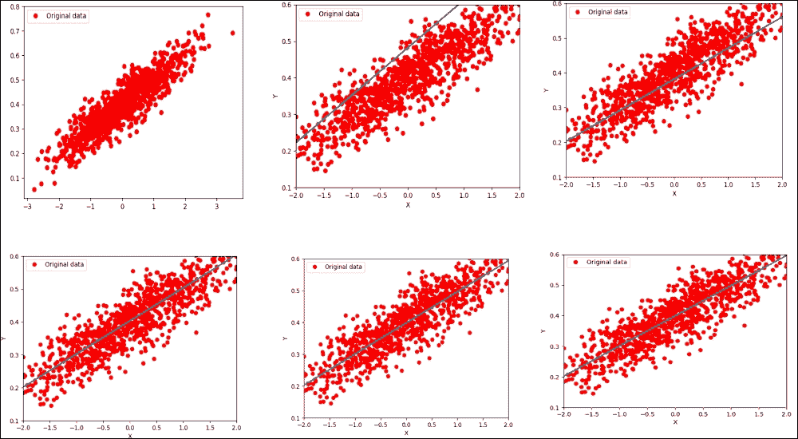

图 11：在第六次迭代后优化损失函数的线性回归

现在让我们进入第 16 次迭代：

```py
>>>
0 [ 0.23306453] [ 0.47967502] 0.0259004
1 [ 0.08183448] [ 0.38200468] 0.00311023
2 [ 0.10253634] [ 0.40177572] 0.00254209
3 [ 0.09969243] [ 0.39778906] 0.0025257
4 [ 0.10008509] [ 0.39859086] 0.00252516
5 [ 0.10003048] [ 0.39842987] 0.00252514
6 [ 0.10003816] [ 0.39846218] 0.00252514
7 [ 0.10003706] [ 0.39845571] 0.00252514
8 [ 0.10003722] [ 0.39845699] 0.00252514
9 [ 0.10003719] [ 0.39845672] 0.00252514
10 [ 0.1000372] [ 0.39845678] 0.00252514
11 [ 0.1000372] [ 0.39845678] 0.00252514
12 [ 0.1000372] [ 0.39845678] 0.00252514
13 [ 0.1000372] [ 0.39845678] 0.00252514
14 [ 0.1000372] [ 0.39845678] 0.00252514
15 [ 0.1000372] [ 0.39845678] 0.00252514

```

好多了，我们更接近优化的价值，对吧？现在，如果我们通过 TensorFlow 进一步改进我们的可视化分析，以帮助可视化这些图中发生的事情，该怎么办？ TensorBoard 提供了一个网页，用于调试图并检查变量，节点，边缘及其相应的连接。

此外，我们需要使用变量注释前面的图，例如损失函数，`W`，`b`，`y_data`，`x_data`等。然后，您需要通过调用`tf.summary.merge_all()`函数生成所有摘要。

现在，我们需要对前面的代码进行如下更改。但是，最好使用`tf.name_scope()`函数对图上的相关节点进行分组。因此，我们可以使用`tf.name_scope()`来组织 TensorBoard 图表视图中的内容，但让我们给它一个更好的名称：

```py
with tf.name_scope("LinearRegression") as scope:
   W = tf.Variable(tf.zeros([1]))
   b = tf.Variable(tf.zeros([1]))
   y = W * x_data + b
```

然后，让我们以类似的方式注释损失函数，但使用合适的名称，例如`LossFunction`：

```py
with tf.name_scope("LossFunction") as scope:
  loss = tf.reduce_mean(tf.square(y - y_data))
```

让我们注释 TensorBoard 所需的损失，权重和偏差：

```py
loss_summary = tf.summary.scalar("loss", loss)
w_ = tf.summary.histogram("W", W)
b_ = tf.summary.histogram("b", b)
```

一旦您注释了图，就可以通过合并来配置摘要了：

```py
merged_op = tf.summary.merge_all()
```

在运行训练之前（初始化之后），使用`tf.summary.FileWriter()` API 编写摘要，如下所示：

```py
writer_tensorboard = tf.summary.FileWriter('logs/', tf.get_default_graph())
```

然后按如下方式启动 TensorBoard：

```py
$ tensorboard –logdir=<trace_dir_name>
```

在我们的例子中，它可能类似于以下内容：

```py
$ tensorboard --logdir=/home/root/LR/
```

现在让我们转到`http://localhost:6006`并单击 GRAPH 选项卡。您应该看到以下图表：

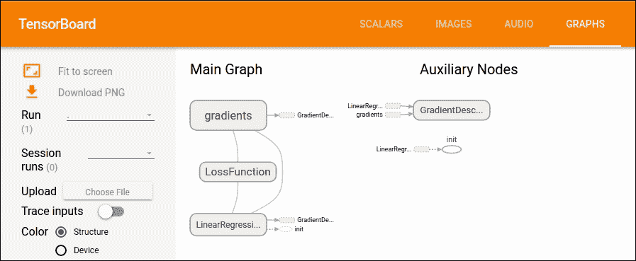

图 12：TensorBoard 上的主图和辅助节点

### 提示

请注意，Ubuntu 可能会要求您安装`python-tk`软件包。您可以通过在 Ubuntu 上执行以下命令来执行此操作：

```py
$ sudo apt-get install python-tk
# For Python 3.x, use the following
$ sudo apt-get install python3-tk

```

## 真实数据集的线性回归回顾

在上一节中，我们看到线性回归的一个例子。我们看到了如何将 TensorFlow 与随机生成的数据集一起使用，即假数据。我们已经看到回归是一种用于预测连续（而非离散）输出的监督机器学习。

然而，对假数据进行线性回归就像买一辆新车但从不开车。这个令人敬畏的机器需要在现实世界中使用！幸运的是，许多数据集可在线获取，以测试您新发现的回归知识。

其中一个是波士顿住房数据集，可以从 [UCI 机器学习库](https://archive.ics.uci.edu/ml/datasets/Housing)下载。它也可以作为 scikit-learn 的预处理数据集使用。

所以，让我们开始导入所有必需的库，包括 TensorFlow，NumPy，Matplotlib 和 scikit-learn：

```py
import matplotlib.pyplot as plt
import tensorflow as tf
import numpy as np
from numpy import genfromtxt
from sklearn.datasets import load_boston
from sklearn.model_selection import train_test_split
```

接下来，我们需要准备由波士顿住房数据集中的特征和标签组成的训练集。 `read_boston_data ()`方法从 scikit-learn 读取并分别返回特征和标签：

```py
def read_boston_data():
    boston = load_boston()
    features = np.array(boston.data)
    labels = np.array(boston.target)
    return features, labels
```

现在我们已经拥有特征和标签，我们还需要使用`normalizer()`方法对特征进行标准化。这是方法的签名：

```py
def normalizer(dataset):
    mu = np.mean(dataset,axis=0)
    sigma = np.std(dataset,axis=0)
    return(dataset - mu)/sigma
```

`bias_vector()`用于将偏差项（即全 1）附加到我们在前一步骤中准备的标准化特征。它对应于前一个例子中直线方程中的`b`项：

```py
def bias_vector(features,labels):
    n_training_samples = features.shape[0]
    n_dim = features.shape[1]
    f = np.reshape(np.c_[np.ones(n_training_samples),features],[n_training_samples,n_dim + 1])
    l = np.reshape(labels,[n_training_samples,1])
    return f, l
```

我们现在将调用这些方法并将数据集拆分为训练和测试，75% 用于训练和休息用于测试：

```py
features,labels = read_boston_data()
normalized_features = normalizer(features)
data, label = bias_vector(normalized_features,labels)
n_dim = data.shape[1]
# Train-test split
train_x, test_x, train_y, test_y = train_test_split(data,label,test_size = 0.25,random_state = 100)
```

现在让我们使用 TensorFlow 的数据结构（例如占位符，标签和权重）：

```py
learning_rate = 0.01
training_epochs = 100000
log_loss = np.empty(shape=[1],dtype=float)
X = tf.placeholder(tf.float32,[None,n_dim]) #takes any number of rows but n_dim columns
Y = tf.placeholder(tf.float32,[None,1]) # #takes any number of rows but only 1 continuous column
W = tf.Variable(tf.ones([n_dim,1])) # W weight vector
```

做得好！我们已经准备好构建 TensorFlow 图所需的数据结构。现在是构建线性回归的时候了，这非常简单：

```py
y_ = tf.matmul(X, W)
cost_op = tf.reduce_mean(tf.square(y_ - Y))
training_step = tf.train.GradientDescentOptimizer(learning_rate).minimize(cost_op)
```

在前面的代码段中，第一行将特征矩阵乘以可用于预测的权重矩阵。第二行计算损失，即回归线的平方误差。最后，第三行执行 GD 优化的一步以最小化平方误差。

### 提示

使用哪种优化器：使用优化器的主要目的是最小化评估成本；因此，我们必须定义一个优化器。使用最常见的优化器（如 SGD），学习率必须以`1 / T`进行缩放才能获得收敛，其中`T`是迭代次数。

Adam 或 RMSProp 尝试通过调整步长来自动克服此限制，以使步长与梯度具有相同的比例。此外，在前面的示例中，我们使用了 Adam 优化器，它在大多数情况下都表现良好。

然而，如果您正在训练神经网络计算梯度是必须的，使用实现 RMSProp 算法的`RMSPropOptimizer`函数是一个更好的主意，因为它是在小批量设置中学习的更快的方式。研究人员还建议在训练深度 CNN 或 DNN 时使用 Momentum 优化器。

从技术上讲，RMSPropOptimizer 是一种先进的梯度下降形式，它将学习率除以指数衰减的平方梯度平均值。衰减参数的建议设置值为 0.9，而学习率的良好默认值为 0.001。

例如在 TensorFlow 中，`tf.train.RMSPropOptimizer()`帮助我们轻松使用它：

```py
optimizer = tf.train.RMSPropOptimizer(0.001, 0.9).minimize(cost_op)
```

现在，在我们开始训练模型之前，我们需要使用`initialize_all_variables()`方法初始化所有变量，如下所示：

```py
init = tf.initialize_all_variables()
```

太棒了！现在我们已经设法准备好所有组件，我们已经准备好训练实际的训练了。我们首先创建 TensorFlow 会话，如下所示：

```py
sess = tf.Session()
sess.run(init_op)
for epoch in range(training_epochs):
    sess.run(training_step,feed_dict={X:train_x,Y:train_y})
    log_loss = np.append(log_loss,sess.run(cost_op,feed_dict={X: train_x,Y: train_y}))
```

训练完成后，我们就可以对看不见的数据进行预测。然而，看到完成训练的直观表示会更令人兴奋。因此，让我们使用 Matplotlib 将成本绘制为迭代次数的函数：

```py
plt.plot(range(len(log_loss)),log_loss)
plt.axis([0,training_epochs,0,np.max(log_loss)])
plt.show()
```

以下是上述代码的输出：

```py
>>>

```

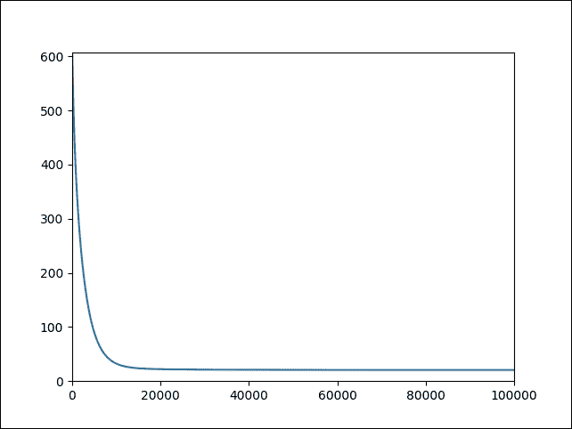

图 13：作为迭代次数函数的成本

对测试数据集做一些预测并计算均方误差：

```py
pred_y = sess.run(y_, feed_dict={X: test_x})
mse = tf.reduce_mean(tf.square(pred_y - test_y))
print("MSE: %.4f" % sess.run(mse))
```

以下是上述代码的输出：

```py
>>>
MSE: 27.3749

```

最后，让我们展示最佳拟合线：

```py
fig, ax = plt.subplots()
ax.scatter(test_y, pred_y)
ax.plot([test_y.min(), test_y.max()], [test_y.min(), test_y.max()], 'k--', lw=3)
ax.set_xlabel('Measured')
ax.set_ylabel('Predicted')
plt.show()
```

以下是上述代码的输出：

```py
>>>

```

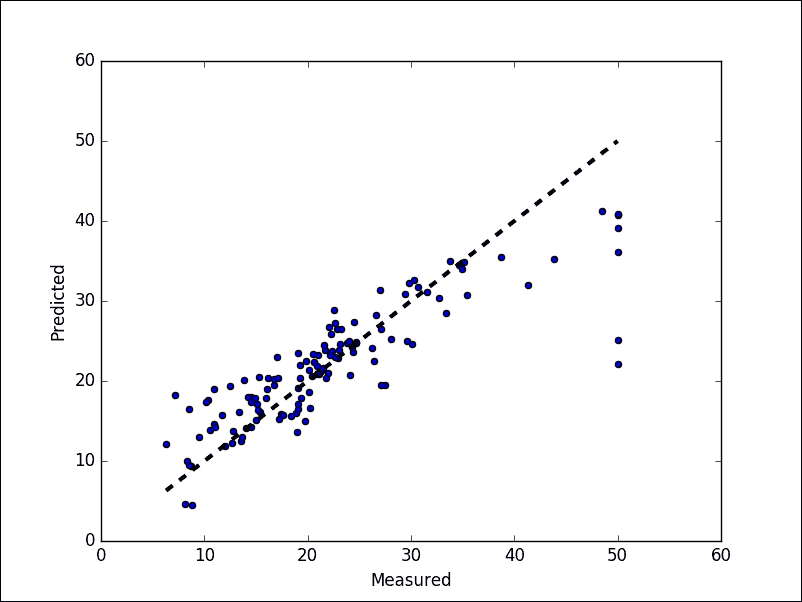

图 14：预测值与实际值

# 总结

TensorFlow 旨在通过 ML 和 DL 轻松地为每个人进行预测分析，但使用它确实需要对一些通用原则和算法有一个正确的理解。 TensorFlow 的最新版本带有许多令人兴奋的新功能，所以我们试图覆盖它们，以便您可以轻松使用它们。总之，这里简要回顾一下本章已经解释过的 TensorFlow 的关键概念：

*   图：每个 TensorFlow 计算可以表示为数据流图，其中每个图构建为一组操作对象。有三种核心图数据结构：[`tf.Graph`](https://www.tensorflow.org/api_docs/python/tf/Graph)，[`tf.Operation`](https://www.tensorflow.org/api_docs/python/tf/Operation)和[`tf.Tensor`](https://www.tensorflow.org/api_docs/python/tf/Tensor) ）。
*   操作：图节点将一个或多个张量作为输入，并产生一个或多个张量作为输出。节点可以由操作对象表示，用于执行诸如加法，乘法，除法，减法或更复杂操作的计算单元。
*   张量：它们就像高维数组对象。换句话说，它们可以表示为数据流图的边缘，并且是不同操作的输出。
*   会话：会话对象是一个实体，它封装了执行操作对象的环境，以便在数据流图上运行计算。结果，在`run()`或`eval()`调用内部评估张量对象。

在本章的后面部分，我们介绍了 TensorBoard，它是分析和调试神经网络模型的强大工具。最后，我们看到了如何在假数据集和真实数据集上实现最简单的基于 TensorFlow 的线性回归模型之一。

在下一章中，我们将讨论不同 FFNN 架构的理论背景，如深度信念网络（DBN）和多层感知器（MLP）。

然后，我们将展示如何训练和分析评估模型所需的表现指标，然后通过一些方法调整 FFNN 的超参数以优化表现。最后，我们将提供两个使用 MLP 和 DBN 的示例，说明如何为银行营销数据集建立非常强大和准确的预测分析模型。

