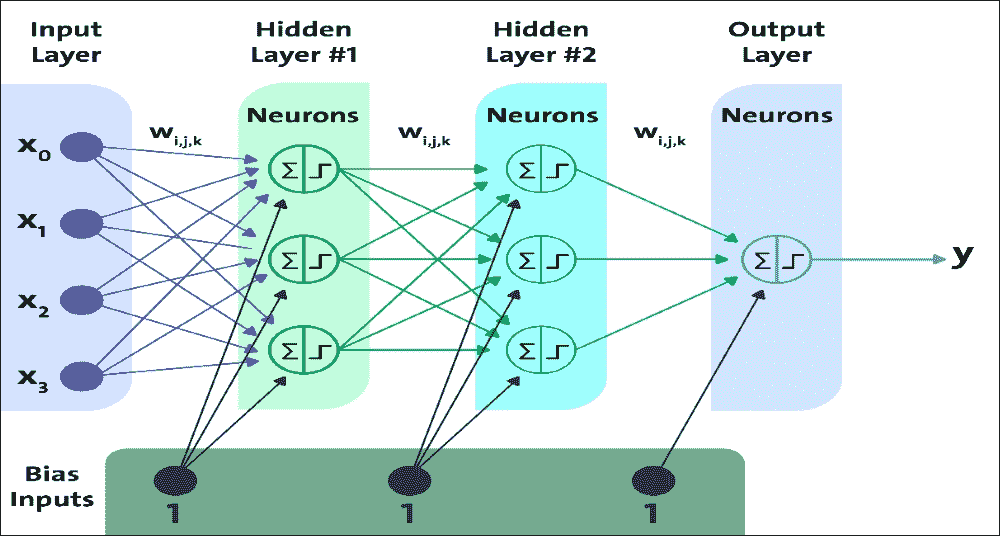
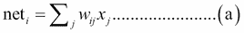
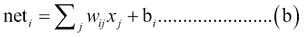
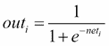
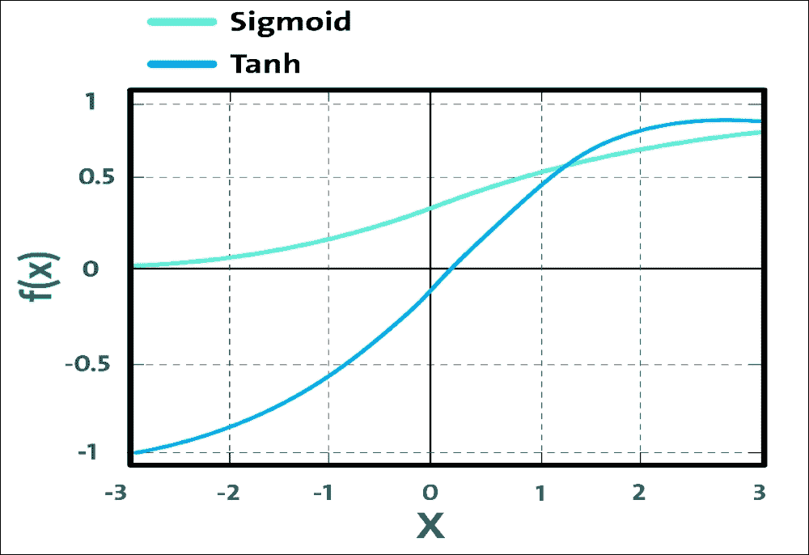
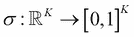
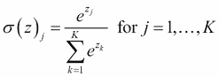

# 第 3 章使用 TensorFlow 的前馈神经网络

人工神经网络是 DL 的核心。它们功能多样，功能强大且可扩展，非常适合处理大型高度复杂的 ML 任务。我们可以对数十亿图像进行分类，提供语音识别服务，甚至建议数亿用户通过将多个人工神经网络堆叠在一起来观看最佳视频。这些多个堆叠的 ANN 称为深度神经网络（DNN）。使用 DNN，我们可以为预测分析构建非常强大和准确的模型。

DNN 的架构可能非常不同：它们通常组织在不同的层上。第一层接收输入信号，最后一层产生输出信号。通常，这些网络被识别为前馈神经网络（FFNN）。在本章中，我们将构建一个对 MNIST 数据集进行分类的 FFNN。稍后，我们将在银行营销数据集中看到另外两个 FFNN 实现（用于构建非常强大且准确的预测分析模型），称为 Deep Belief Networks（DBN）和 Multilayer Perceptron（MLP）。最后，我们将了解如何调整最重要的 FFNN 超参数以获得最佳表现。

简而言之，本章将涵盖以下主题：

*   前馈神经网络
*   实现五层 FFNN 进行数字分类
*   为客户端订阅预测实现深度 MLP
*   重新审视客户端订阅预测：实现 DBN
*   FFNN 中的超参数调整和 dropout 优化

# 前馈神经网络（FFNN）

FFNN 由大量神经元组成，按层组织：一个输入层，一个或多个隐藏层和一个输出层。层中的每个神经元都连接到前一层的所有神经元，尽管连接并不完全相同，因为它们具有不同的权重。这些连接的权重编码网络的知识。数据在输入处进入并逐层通过网络，直到它到达输出。在此操作期间，层之间没有反馈。因此，这些类型的网络称为前馈神经网络。

隐藏层中具有足够神经元的  FFNN 能够以任意精度进行近似，并且可以对数据中的线性关系以及非线性关系建模：

*   带有一个隐藏层，任何连续函数
*   带有两个隐藏层，任何函数，甚至是不连续的

然而，不可能以足够的精度确定所需的隐藏层数，或甚至必须包含在每个隐藏层内的神经元数量以计算非线性函数。对此没有直接的答案，但我们可以尝试增加隐藏层中的神经元数量，直到 FFNN 开始过拟合。我们稍后会讨论这个问题。尽管有一些经验法则，但设置隐藏层的数量依赖于经验和一些启发式方法来确定网络的结构。



图 1：具有两个隐藏层和输入偏置的前馈神经网络

例如，如果少量隐藏层或神经元构成神经网络架构，则网络无法以足够的精度近似未知函数。这可能是因为它过于复杂，或者因为反向传播算法属于局部最小值。如果网络由大量隐藏层组成，那么我们就会遇到过拟合问题;即网络泛化能力的恶化。这个问题的一个解决方案是通过 dropout 进行正则化（我们将在本章后面讨论）。

因此，复合网络可以由许多神经元，隐藏层和连接组成，但是通常，具有两个或更多隐藏层的 ANN 被称为 DNN。从实现的角度来看，可以通过将多个 ANN 堆叠在一起来构建 DNN。

基于 DNN 中使用的层的类型和相应的学习方法，DNN 可以被分类为 MLP，堆积自编码器（SAE）或 DBN。所有这些都是常规的 FFNN，但它们有许多隐藏的层，它们在架构上是不同的。在本章中，我们将主要讨论 MLP 和 DBN，使用动手实例，但第 5 章，优化 TensorFlow 自编码器将介绍 SAE。但是，首先，让我们关注前馈和反向传播机制。

## 前馈和反向传播

反向传播算法旨在最小化当前和期望输出之间的误差。由于网络是前馈的，因此激活流程总是从输入单元前进到输出单元。成本函数的梯度通过权重的修改来反向传播。

此方法是递归的，可以应用于任意数量的隐藏层。在这种方法中，两相之间的结合是重要的。前馈学习模型是：

*   向前传播
*   向后传播

在向前传播中，我们进行了一系列操作并获得了一些预测或分数。因此，对于正向传播中的每个操作，我们需要创建一个从上到下连接操作的图。

另一方面，向后传递主要涉及数学运算，例如为所有运算创建所有差异运算（即自动微分方法）从上到下（例如，权重更新的损失函数）的导数。在图中，然后在链规则中使用它们。请注意，有两种类型的自动差异化方法：

*   反向模式：针对所有输入推导单个输出
*   正向模式：相对于一个输入推导所有输出

我们将讨论 TensorFlow 如何让我们更轻松。反向传播算法以这样的方式处理信息：网络在学习迭代期间减少全局误差;但是，这并不能保证达到全局最小值。隐藏单元的存在和输出函数的非线性意味着错误的行为非常复杂并且具有许多局部最小值。

因此，反向传播算法可以在局部最小值处停止，从而提供次优解决方案。通常，误差总是在训练集上减少，这提高了表示所提供数据之间的输入 - 输出关系的能力。由于网络在测试集上进行学习（从一定值测量预测能力），因为过拟合问题，网络可能会增长：生成的网络（或模型）对训练样本具有较高的分类准确率，以及测试样本的低分类精度。

现在让我们看看 TensorFlow 如何执行前进和后退传递。在使用 TensorFlow 开发深度学习应用时，我们只考虑编写正向密码。让我们通过重新概述第 2 章中的一些概念，TensorFlow 的初步了解来澄清这个想法。

我们已经看到 TensorFlow 程序有以下两个组件：

*   [图创建](https://www.tensorflow.org/api_docs/python/tf)
*   [会话执行](https://www.tensorflow.org/api_docs/python/tf/Session)

第一个用于构建模型，第二个用于提供数据并获得结果。其中每个都在 C ++引擎上执行，该引擎由以下组件组成：

*   有效实现不同的操作，如激活函数（例如，sigmoid，ReLU，tanh，softmax，交叉熵等）。
*   正向模式操作的衍生物

当我说在 Python 中没有执行一点加法或乘法时，我不是在开玩笑，因为 Python 只是一个包装器。无论如何，让我们通过介绍一个例子回到我们原来的讨论。想象一下，我们想要执行 dropout `op`（我们将在本章后面看到更多关于此的细节）来随机关闭和打开一些神经元：

```py
yi =dropout(Sigmoid(Wx+b))
```

现在，为此，即使我们不关心向后传递，TensorFlow 也会自动为所有操作创建自上而下的衍生产品。当我们开始会话时，TensorFlow 会自动计算图中所有差异操作的梯度，并在链规则中使用它们。因此，前进传播包括以下内容：

*   变量和占位符（权重 W，输入 x，偏差 b）
*   操作（非线性操作，例如 ReLU，交叉熵损失等）。

现在正向传播是我们创建的  ，但 TensorFlow 自动创建一个向后传递，这使得训练过程通过在执行链规则时传输数据来运行。

## 权重和偏差

除了考虑神经元的状态以及与其他人的关联方式之外，我们还应该考虑突触权重，这是网络中该连接的影响。每个权重具有由`W[i]`指示的数值，其是连接神经元 i 与神经元 j 的突触权重。

### 提示

突触权重：这是从生物学发展而来的，是指两个节点之间连接的强度或幅度;在生物学中，这对应于一个神经元的发射对另一个神经元的影响的量。

根据神经元所在的点，它将始终具有一个或多个链接，这些链接对应于相对突触权重。权重和输出函数通常确定单个神经元和网络的行为。应在训练阶段正确更改它们，以确保模型的正确行为。

对于每个单元 i，输入向量可以由`x[i] = (x[1], ..., x[n])`定义，权重向量可以由`w[i] = (w[i1], ..., w[in])`定义。然后在前向传播期间，隐藏层中的每个单元获得以下信号：



前面的等式表示每个隐藏单元得到输入的总和乘以相应的权重。

在权重中，有一个特殊权重称为偏差。它不绑定到网络的任何其他单元，但被认为具有等于 1 的输入。这种权宜之计允许建立一种参考点或神经元的阈值，并且形式上，偏置执行平移，沿横坐标轴到输出函数。以前的公式将如下：



现在这是一个棘手的问题：我们如何初始化权重？好吧，如果我们将所有权重初始化为相同的值（例如，零或一），每个隐藏的神经元将获得完全相同的信号。让我们试着打破它：

*   如果所有权重都初始化为 1，则每个单元获得的信号等于输入的总和
*   如果所有权重都为零，则更糟糕的是，隐藏层中的每个神经元都将获得零信号

简而言之，无论输入是什么，如果所有权重都相同，则隐藏层中的所有单元也将是相同的。为了摆脱这个问题，训练 FNN 中最常见的初始化技术之一是随机初始化。使用随机初始化的想法只是从输入数据集的正态分布中采样每个权重，具有低偏差。

低偏差允许您将网络偏向“简单”零解决方案。但是，这意味着什么？问题是初始化可以在没有实际初始化权重为零的不良后果的情况下完成。

其次，Xavier 初始化现在用于训练神经网络。它类似于随机初始化，但往往效果更好。现在让我解释一下原因：假设您随机初始化网络权重，但事实证明您开始时太小了。信号在通过每一层时会收缩，直到它太小而无法使用。另一方面，如果网络中的权重开始太大，那么信号将在通过每个层时增长，直到它太大而无法使用。

使用 Xavier 初始化时的好处是它确保权重“恰到好处”，通过多个层将信号保持在合理的值范围内。总之，它可以根据输入和输出神经元的数量自动确定初始化的规模。

### 注意

有兴趣的读者可以参考本出版物获取详细信息：Xavier Glorot，Yoshua Bengio，了解深度前馈神经网络训练的难度，第 13 届国际人工智能与统计学会议论文集（AISTATS）2010，Chia Laguna Resort，Sardinia，Italy 。 JMLR 的第 9 卷：W & CP。

您可能想知道在训练常规 DNN（例如，MLP 或 DBN）时是否可以摆脱随机初始化。好吧，最近，一些研究人员一直在讨论随机正交矩阵初始化，其表现优于任何随机初始化训练 DNN。

当初始化偏差时，由于权重中的小随机数提供不对称破坏，因此将偏差初始化为零是可能的，也是常见的。对于所有偏差，将偏差设置为小的常量值（例如 0.01）可确保所有 ReLU 单元都可以传播一些梯度。但是，它既没有表现良好，也没有表现出持续改进因此，建议坚持使用零。

## 激活函数

为了允许神经网络学习复杂决策边界，我们将非线性激活函数应用于其某些层。常用函数包括 tanh，ReLU，softmax 及其变体。更技术上，每个神经元接收突触权重和连接的神经元的激活值的加权和作为输入信号。

为了允许神经元计算其激活值，即神经元重发的内容，必须将加权和作为激活函数的参数传递。激活函数允许接收神经元发送接收信号并对其进行修改。用于此目的的最广泛使用的函数之一是所谓的 S 形函数。这是逻辑函数的一个特例，它由以下公式定义：



S 形函数是有界可微函数，它是针对所有实际输入值定义的，并且在每个点处具有非负导数。通常，S 形函数是实值的，单调的和可微分的，具有钟形的非负一阶导数。

该函数的域是（0,1），包含域内的所有实数。这意味着作为神经元输出获得的任何值（根据其激活状态的计算）将始终在 0 和 1 之间.Sigmoid 函数，如下图所示，提供了对饱和率的解释。神经元：从未激活（= 0）到完全饱和，其发生在预定的最大值（= 1）。

当必须分析新数据时，它由输入层加载，通过（a）或（b）生成输出。该结果与来自同一层的神经元的输出一起将形成下一层神经元的新输入。该过程将迭代到最后一层。

另一方面，双曲正切或 tanh 是激活函数的另一种形式。 Tanh 将实数值压缩到范围[-1,1]。像 S 形神经元一样，它的激活饱和，但与 S 形神经元不同，它的输出是零中心的。因此，在实践中，tanh 非线性总是优于 S 形非线性。另外，请注意，tanh 神经元只是一个缩放的 S 形神经元。特别是，以下情况属实：`tanh(x)=2σ(2x)−1`，如下图所示：



图 2：Sigmoid 与 tanh 激活函数

通常，在 FFNN 的最后一级，softmax 函数被用作决策边界。这是一种常见情况，特别是在解决分类问题时。否则，我们根本不需要使用任何激活函数来解决回归问题。

在数学中，softmax 函数是逻辑函数的推广，它将任意实数值的 K 维向量“压缩”到实数值的 K 维向量`σ(z)`，在`[0, 1]`范围内，加起来为 1：



现在 softmax 函数可以表示如下：



在前面的等式中，K 表示来自网络的输出总数。在概率论中，softmax 函数的输出可用于表示分类分布 - 即 K 个不同可能结果的概率分布。实际上，它是分类概率分布的梯度对数归一化。

然而，softmax 函数用于各种多类分类方法，例如多项逻辑回归（也称为 softmax 回归），多类线性判别分析，朴素贝叶斯分类器和 ANN。

现在让我们看看如何在 TensorFlow 语法中使用一些常用的激活函数。为了在神经网络中提供不同类型的非线性，TensorFlow 提供不同的激活操作。这些包括平滑的非线性，如 sigmoid，tanh，elu，softplus 和 softsign。

另一方面，可以使用的一些连续但不广泛的可区分函数是`ReLU`，`relu6`，`crelu`和`relu_x`。所有激活操作均按组件方式应用，并产生与输入张量形状相同的张量。

### 使用 sigmoid

在 TensorFlow 中，  特征`tf.sigmoid(x, name=None)`使用`y = 1 / (1 + exp(-x))`计算`x`元素的  sigmoid，并返回类型相同`x`的张量。这是参数说明：

*   `x`：一个张量。必须是以下类型之一：`float32`，`float64`，`int32`，`complex64`，`int64`或`qint32`。
*   `name`：操作的名称（可选）。

### 使用 tanh

在 TensorFlow 中，  特征`tf.tanh(x, name=None)`计算`x`元素的双曲正切并返回类型相同`x`的张量。这是参数说明：

*   `x`：具有`float`，`double`，`int32`，`complex64`，`int64`或`qint32`类型的张量或稀疏张量。
*   `name`：操作的名称（可选）。

### 使用 ReLU

在 TensorFlow 中，  特征`tf.nn.relu(features, name=None)`使用`max(features, 0)`计算整流线性并返回类型特征相同的张量。这是参数说明：

*   `features`：一个张量。必须是以下类型之一：`float32`，`float64`，`int32`，`int64`，`uint8`，`int16`，`int8`，`uint16`或`half`
*   `name`：操作的名称（可选）

### 使用 softmax

在 TensorFlow 中，  特征`tf.nn.softmax(logits, axis=None, name=None)`计算`softmax`激活并返回与`logits`类型和形状相同的张量。这是参数说明：

*   `logits`：非空张量。必须是以下类型之一：`half`，`float32`或`float64`
*   `axis`：将执行维度`softmax`。默认值为-1，表示最后一个维度
*   `name`：操作名称（可选）

该`softmax`函数执行`softmax = tf.exp(logits)` / `tf.reduce_sum(tf.exp(logits), axis)`的等效函数。