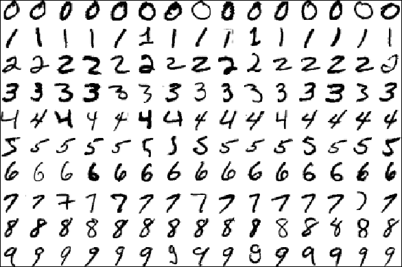
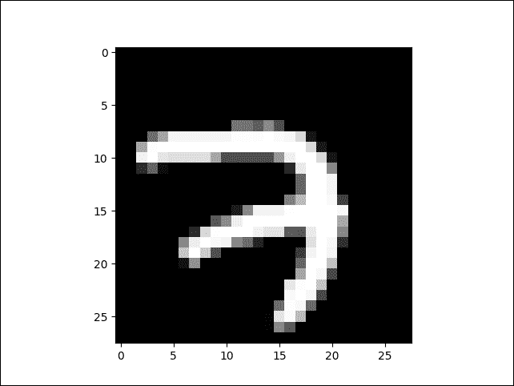
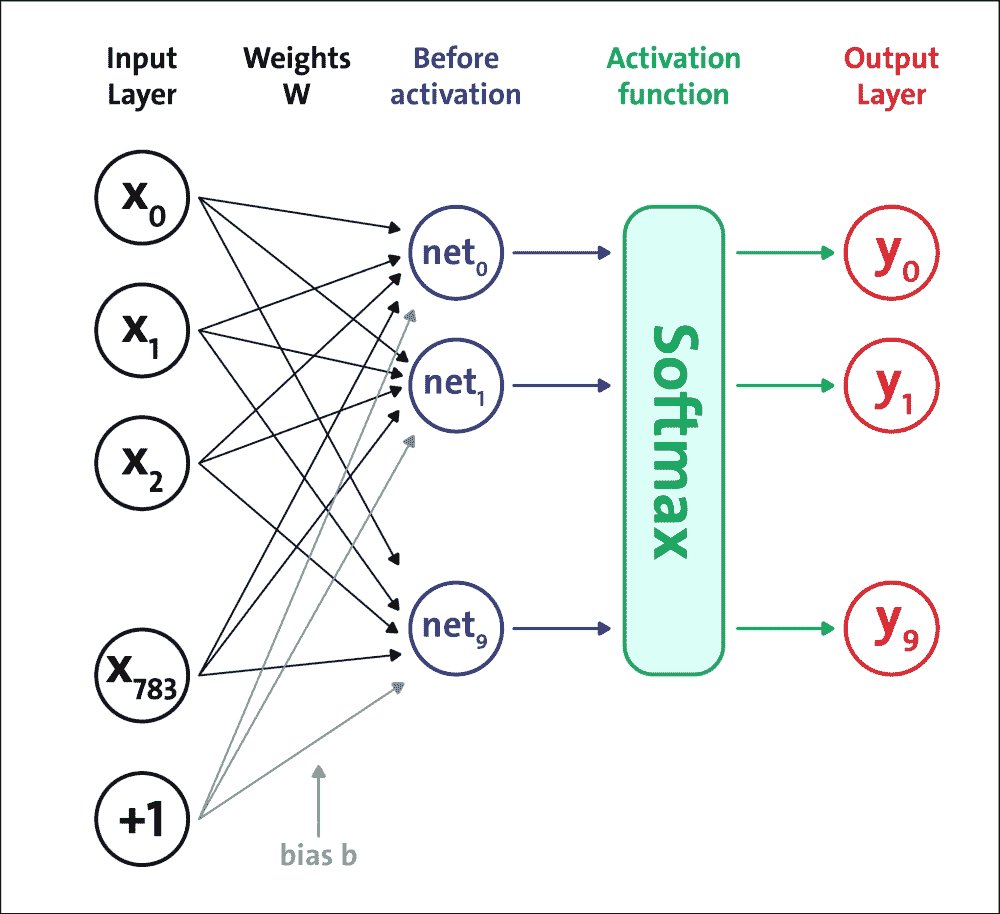
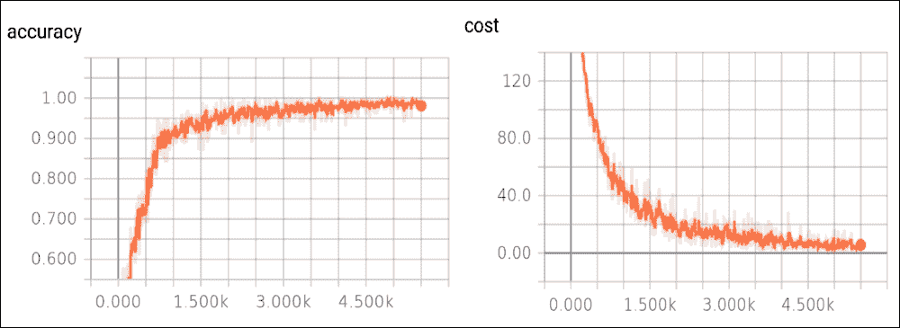

# 实现前馈神经网络

自动识别手写数字是一个重要的问题，可以在许多实际应用中找到。在本节中，我们将实现一个前馈网络来解决这个问题。



图 3：从 MNIST 数据库中提取的数据示例

为了训练和测试已实现的模型，我们将使用一个名为 MNIST 的手写数字最着名的数据集。 MNIST 数据集是一个包含 60,000 个示例的训练集和一个包含 10,000 个示例的测试集。存储在示例文件中的数据示例如上图所示。

源图像最初是黑白的。之后，为了将它们标准化为 20×20 像素的大小，由于抗混叠滤波器用于调整大小的效果，引入了中间亮度级别。随后，在 28×28 像素的区域中将图像聚焦在像素的质心中，以便改善学习过程。整个数据库存储在四个文件中：

*   `train-images-idx3-ubyte.gz`：训练集图像（9912422 字节）
*   `train-labels-idx1-ubyte.gz`：训练集标签（28881 字节）
*   `t10k-images-idx3-ubyte.gz`：测试集图像（1648877 字节）
*   `t10k-labels-idx1-ubyte.gz`：测试集标签（4542 字节）

每个数据库包含两个文件的  ;第一个包含图像，而第二个包含相应的标签。

## 探索 MNIST 数据集

让我们看一下如何访问 MNIST 数据的简短示例，以及如何显示所选图像。为此，只需执行`Explore_MNIST.py`脚本。首先，我们必须导入 numpy，因为我们必须进行一些图像处理：

```py
import numpy as np
```

Matplotlib 中的`pyplot`函数用于绘制图像：

```py
import matplotlib.pyplot as plt
```

我们将使用`tensorflow.examples.tutorials.mnist`中的`input_data`类，它允许我们下载 MNIST 数据库并构建数据集：

```py
import tensorflow as tf
from tensorflow.examples.tutorials.mnist import input_data
```

然后我们使用`read_data_sets`方法加载数据集：

```py
import os
dataPath = "temp/"
if not os.path.exists(dataPath):
    os.makedirs(dataPath)
input = input_data.read_data_sets(dataPath, one_hot=True)
```

图像将保存在`temp/`目录中。现在让我们看看图像和标签的形状：

```py
print(input.train.images.shape)
print(input.train.labels.shape)
print(input.test.images.shape)
print(input.test.labels.shape)
```

以下是上述代码的输出：

```py
>>>
(55000, 784)
(55000, 10)
(10000, 784)
(10000, 10)

```

使用 Python 库`matplotlib`，我们想要可视化一个数字：

```py
image_0 =  input.train.images[0]
image_0 = np.resize(image_0,(28,28))
label_0 =  input.train.labels[0]
print(label_0)
```

以下是上述代码的输出：

```py
>>>
[ 0\.  0\.  0\.  0\.  0\.  0\.  0\.  1\.  0\.  0.]

```

数字`1`是数组的第八个位置。这意味着我们图像的数字是数字 7.最后，我们必须验证数字是否真的是 7.我们可以使用导入的`plt`函数来绘制`image_0`张量：

```py
plt.imshow(image_0, cmap='Greys_r')
plt.show()
```



图 4：从 MNIST 数据集中提取的图像

### Softmax 分类器

在上一节中，我们展示了如何访问和操作 MNIST 数据集。在本节中，我们将看到如何使用前面的数据集来解决 TensorFlow 手写数字的分类问题。我们将应用所学的概念来构建更多神经网络模型，以便评估和比较所采用的不同方法的结果。

将要实现的第一个前馈网络架构如下图所示：



图 5：softmax 神经网络架构

我们将构建一个五层网络：第一层到第四层是 S 形结构，第五层是 softmax 激活函数。请记住，定义此网络是为了激活它是一组正值，总和等于 1.这意味着输出的第`j`个值是 j 是与网络输入对应的类的概率。让我们看看如何实现我们的神经网络模型。

为了确定网络的适当大小（即，层中的神经元或单元的数量），即隐藏层的数量和每层神经元的数量，通常我们依赖于一般的经验标准，个人经验或适当的测试。这些是需要调整的一些超参数。在本章的后面，我们将看到一些超参数优化的例子。

下表总结了已实现的网络架构。它显示了每层神经元的数量，以及相应的激活函数：

| 层 | 神经元数量 | 激活函数 |
| --- | --- | --- |
| 1 | `L = 200` | Sigmoid |
| 2 | `M = 100` | Sigmoid |
| 3 | `N = 60` | Sigmoid |
| 4 | `O = 30` | Sigmoid |
| 5 | `10` | Softmax |

前四层的激活函数是 S 形函数。激活函数的最后一层始终是 softmax，因为网络的输出必须表示输入数字的概率。通常，中间层的数量和大小会极大地影响的网络表现：

*   以积极的方式，因为在这些层上是基于网络推广的能力，并检测输入的特殊特征
*   以负面的方式，因为如果网络是冗余的，那么它会不必要地减轻学习阶段的负担

为此，只需执行`five_layers_sigmoid.py`脚本。首先，我们将通过导入以下库来开始实现网络：

```py
import tensorflow as tf
from tensorflow.examples.tutorials.mnist import input_data
import math
from tensorflow.python.framework import ops
import random
import os
```

接下来，我们将设置以下配置参数：

```py
logs_path = 'log_sigmoid/' # logging path
batch_size = 100 # batch size while performing training 
learning_rate = 0.003 # Learning rate 
training_epochs = 10 # training epoch
display_epoch = 1
```

然后，我们将下载图像和标签，并准备数据集：

```py
dataPath = "temp/"
if not os.path.exists(dataPath):
    os.makedirs(dataPath)
mnist = input_data.read_data_sets(dataPath, one_hot=True) # MNIST to be downloaded
```

从输入层开始，我们现在将看看如何构建网络架构。输入层现在是形状`[1×784]`的张量 - 即`[1,28 * 28]`，它代表要分类的图像：

```py
X = tf.placeholder(tf.float32, [None, 784], name='InputData') # image shape 28*28=784
XX = tf.reshape(X, [-1, 784]) # reshape input
Y_ = tf.placeholder(tf.float32, [None, 10], name='LabelData') # 0-9 digits => 10 classes
```

第一层接收要分类的输入图像的像素，与`W1`权重连接组合，并添加到`B1`偏差张量的相应值：

```py
W1 = tf.Variable(tf.truncated_normal([784, L], stddev=0.1)) # Initialize random weights for the hidden layer 1
B1 = tf.Variable(tf.zeros([L])) # Bias vector for layer 1
```

第一层通过 sigmoid 激活函数将其输出发送到第二层：

```py
Y1 = tf.nn.sigmoid(tf.matmul(XX, W1) + B1) # Output from layer 1
```

第二层从第一层接收`Y1`输出，将其与`W2`权重连接组合，并将其添加到`B2`偏差张量的相应值：

```py
W2 = tf.Variable(tf.truncated_normal([L, M], stddev=0.1)) # Initialize random weights for the hidden layer 2
B2 = tf.Variable(tf.ones([M])) # Bias vector for layer 2
```

第二层通过 sigmoid 激活函数将其输出发送到第三层：

```py
Y2 = tf.nn.sigmoid(tf.matmul(Y1, W2) + B2) # Output from layer 2
```

第三层接收来自第二层的`Y2`输出，将其与`W3`权重连接组合，并将其添加到`B3`偏差张量的相应值：

```py
W3 = tf.Variable(tf.truncated_normal([M, N], stddev=0.1)) # Initialize random weights for the hidden layer 3 
B3 = tf.Variable(tf.ones([N])) # Bias vector for layer 3
```

第三层通过 sigmoid 激活函数将其输出发送到第四层：

```py
Y3 = tf.nn.sigmoid(tf.matmul(Y2, W3) + B3) # Output from layer 3
```

第四层接收来自第三层的`Y3`输出，将其与`W4`权重连接组合，并将其添加到`B4`偏差张量的相应值：

```py
W4 = tf.Variable(tf.truncated_normal([N, O], stddev=0.1)) # Initialize random weights for the hidden layer 4
B4 = tf.Variable(tf.ones([O])) # Bias vector for layer 4
```

然后通过 S 形激活函数将第四层的输出传播到第五层：

```py
Y4 = tf.nn.sigmoid(tf.matmul(Y3, W4) + B4) # Output from layer 4
```

第五层将在输入中接收来自第四层的激活`O = 30`，该激活将通过`softmax`激活函数，转换为每个数字的相应概率类别：

```py
W5 = tf.Variable(tf.truncated_normal([O, 10], stddev=0.1)) # Initialize random weights for the hidden layer 5 
B5 = tf.Variable(tf.ones([10])) # Bias vector for layer 5
Ylogits = tf.matmul(Y4, W5) + B5 # computing the logits
Y = tf.nn.softmax(Ylogits)# output from layer 5
```

这里，我们的损失函数是目标和`softmax`激活函数之间的交叉熵，应用于模型的预测：

```py
cross_entropy = tf.nn.softmax_cross_entropy_with_logits_v2(logits=Ylogits, labels=Y) # final outcome using softmax cross entropy
cost_op = tf.reduce_mean(cross_entropy)*100
```

另外，我们定义`correct_prediction`和模型的准确率：

```py
correct_prediction = tf.equal(tf.argmax(Y, 1), tf.argmax(Y_, 1))
accuracy = tf.reduce_mean(tf.cast(correct_prediction, tf.float32))
```

现在我们需要使用优化器来减少训练错误。与简单的`GradientDescentOptimizer`相比，`AdamOptimizer`具有几个优点。实际上，它使用更大的有效步长，算法将收敛到此步长而不进行微调：

```py
# Optimization op (backprop)
train_op = tf.train.AdamOptimizer(learning_rate).minimize(cost_op)
```

`Optimizer`基类提供了计算损失梯度的方法，并将梯度应用于变量。子类集合实现了经典的优化算法，例如`GradientDescent`和`Adagrad`。在 TensorFlow 中训练 NN 模型时，我们从不实例化`Optimizer`类本身，而是实例化以下子类之一

*   [`tf.train.Optimizer`](https://www.tensorflow.org/api_docs/python/tf/train/Optimizer)
*   [`tf.train.GradientDescentOptimizer`](https://www.tensorflow.org/api_docs/python/tf/train/GradientDescentOptimizer)
*   [`tf.train.AdadeltaOptimizer`](https://www.tensorflow.org/api_docs/python/tf/train/AdadeltaOptimizer)
*   [`tf.train.AdagradOptimizer`](https://www.tensorflow.org/api_docs/python/tf/train/AdagradOptimizer) 
*   [`tf.train.AdagradDAOptimizer`](https://www.tensorflow.org/api_docs/python/tf/train/AdagradDAOptimizer)
*   [`tf.train.MomentumOptimizer`](https://www.tensorflow.org/api_docs/python/tf/train/MomentumOptimizer)
*   [`tf.train.AdamOptimizer`](https://www.tensorflow.org/api_docs/python/tf/train/AdamOptimizer)
*   [`tf.train.FtrlOptimizer`](https://www.tensorflow.org/api_docs/python/tf/train/FtrlOptimizer)
*   [`tf.train.ProximalGradientDescentOptimizer`](https://www.tensorflow.org/api_docs/python/tf/train/ProximalGradientDescentOptimizer)
*   [`tf.train.ProximalAdagradOptimizer`](https://www.tensorflow.org/api_docs/python/tf/train/ProximalAdagradOptimize)
*   [`tf.train.RMSPropOptimizer`](https://www.tensorflow.org/api_docs/python/tf/train/RMSPropOptimizer)

见[此链接](https://www.tensorflow.org/api_guides/python/train)和[`tf.contrib.opt`](https://www.tensorflow.org/api_docs/python/tf/contrib/opt)用于更多优化器。

然后让我们构建一个将所有操作封装到范围中的模型，使 TensorBoard 的图可视化更加方便：

```py
# Create a summary to monitor cost tensor
tf.summary.scalar("cost", cost_op)
# Create a summary to monitor accuracy tensor
tf.summary.scalar("accuracy", accuracy)
# Merge all summaries into a single op
summary_op = tf.summary.merge_all()
```

最后，我们将开始训练：

```py
with tf.Session() as sess:
        # Run the initializer
    sess.run(init_op)

    # op to write logs to TensorBoard
    writer = tf.summary.FileWriter(logs_path, graph=tf.get_default_graph())

    for epoch in range(training_epochs):
        batch_count = int(mnist.train.num_examples/batch_size)
        for i in range(batch_count):
            batch_x, batch_y = mnist.train.next_batch(batch_size)
            _,summary = sess.run([train_op, summary_op], feed_dict={X: batch_x, Y_: batch_y})
            writer.add_summary(summary, epoch * batch_count + i)

        print("Epoch: ", epoch)
    print("Optimization Finished!")

    print("Accuracy: ", accuracy.eval(feed_dict={X: mnist.test.images, Y_: mnist.test.labels}))
```

定义摘要和会话运行的源代码几乎与前一个相同。我们可以直接转向评估实现的模型。运行模型时，我们有以下输出：

运行此代码后的最终测试设置准确率应约为 97％：

```py
Extracting temp/train-images-idx3-ubyte.gz
Extracting temp/train-labels-idx1-ubyte.gz
Extracting temp/t10k-images-idx3-ubyte.gz
Extracting temp/t10k-labels-idx1-ubyte.gz
Epoch:  0
Epoch:  1
Epoch:  2
Epoch:  3
Epoch:  4
Epoch:  5
Epoch:  6
Epoch:  7
Epoch:  8
Epoch:  9
Optimization Finished!
Accuracy:  0.9
715

```

现在我们可以通过在运行文件夹中打开终端然后执行以下命令来移动到  TensorBoard：

```py
$> tensorboard --logdir='log_sigmoid/' # if required, provide absolute path

```

然后我们在 localhost 上打开浏览器。在下图中，我们显示了成本函数的趋势，作为示例数量的函数，在训练集上，以及测试集的准确率：



图 6：测试集上的准确率函数，以及训练集上的成本函数

成本函数随着迭代次数的增加而减少。如果没有发生这种情况，则意味着出现了问题。在最好的情况下，这可能只是因为某些参数未正确设置。在最坏的情况下，构建的数据集中可能存在问题，例如，信息太少或图像质量差。如果发生这种情况，我们必须直接修复数据集。

到目前为止，我们已经看到了 FFNN 的实现。但是，使用真实数据集探索更有用的 FFNN 实现会很棒。我们将从 MLP 开始。