# 实现多层感知器（MLP）

感知器单层 LTU 组成，每个神经元连接到所有输入。这些连接通常使用称为输入神经元的特殊传递神经元来表示：它们只输出它们被输入的任何输入。此外，通常添加额外的偏置特征（`x0 = 1`）。

这种偏置特征通常使用称为偏置神经元的特殊类型的神经元来表示，  一直输出 1。具有两个输入和三个输出的感知器在图 7 中表示。该感知器可以同时将实例分类为三个不同的二元类，这使其成为多输出分类器：

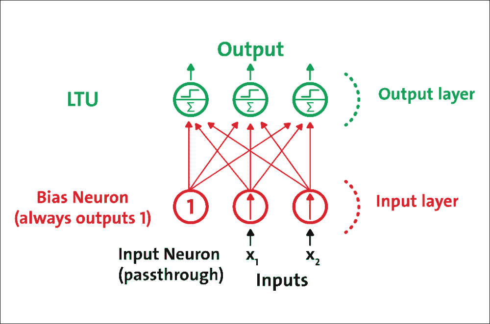

图 7：具有两个输入和三个输出的感知器

由于每个输出神经元的决策边界是线性的，因此感知器无法学习复杂模式。然而，如果训练实例是线性可分的，研究表明该算法将收敛于称为“感知器收敛定理”的解决方案。

MLP 是 FFNN，这意味着它是来自不同层的神经元之间的唯一连接。更具体地，MLP 由一个（通过）输入层，一个或多个 LTU 层（称为隐藏层）和一个称为输出层的 LTU 的最后一层组成。除输出层外，每一层都包含一个偏置神经元，并作为完全连接的二分图连接到下一层：

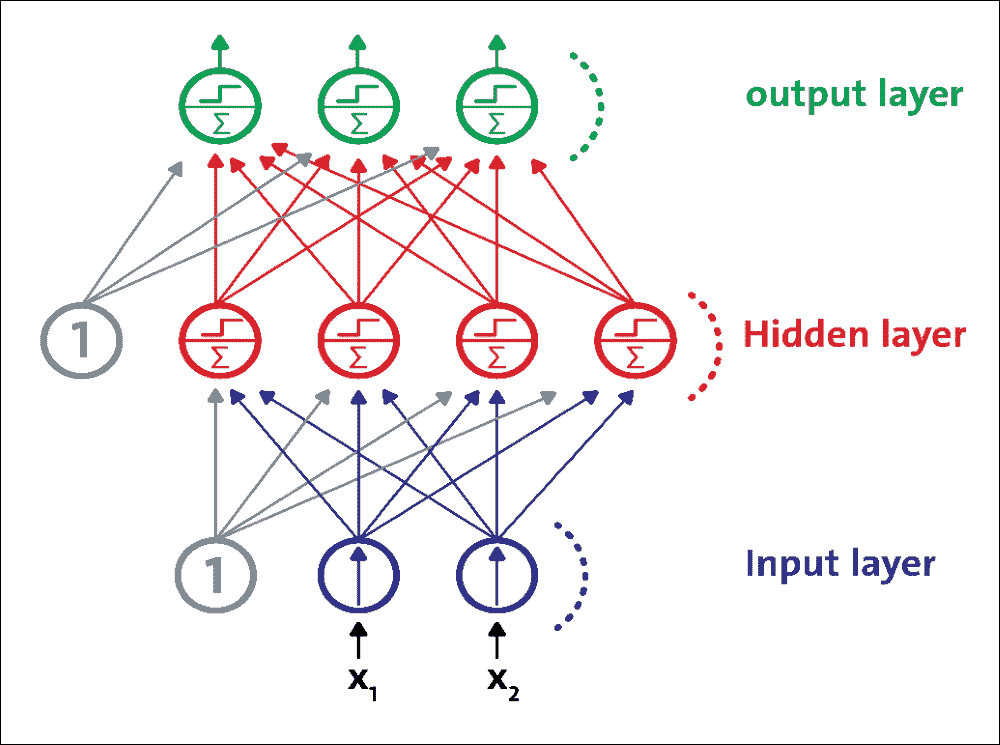

图 8：MLP 由一个输入层，一个隐藏层和一个输出层组成

## 训练 MLP

MLP 在 1986 年首次使用反向传播训练算法成功训练。然而，现在这种算法的优化版本被称为梯度下降。在训练阶段期间，对于每个训练实例，算法将其馈送到网络并计算每个连续层中的每个神经元的输出。

训练算法测量网络的输出误差（即，期望输出和网络的实际输出之间的差异），并计算最后隐藏层中每个神经元对每个输出神经元误差的贡献程度。然后，它继续测量这些误差贡献中有多少来自先前隐藏层中的每个神经元，依此类推，直到算法到达输入层。通过在网络中向后传播误差梯度，该反向传递有效地测量网络中所有连接权重的误差梯度。

在技​​术上，通过反向传播方法计算每层的成本函数的梯度。梯度下降的想法是有一个成本函数，显示某些神经网络的预测输出与实际输出之间的差异：

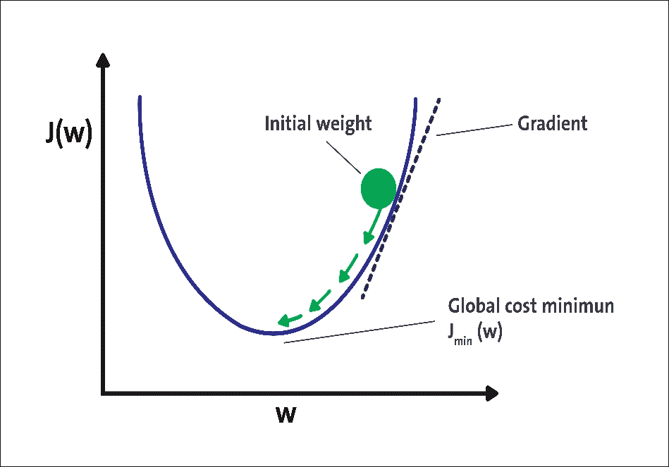

图 9：用于无监督学习的 ANN 的示例实现

有几种已知类型的代价函数，例如平方误差函数和对数似然函数。该成本函数的选择可以基于许多因素。梯度下降法通过最小化此成本函数来优化网络的权重。步骤如下：

1.  权重初始化
2.  计算神经网络的预测输出，通常称为转发传播步骤
3.  计算成本/损失函数。一些常见的成本/损失函数包括对数似然函数和平方误差函数
4.  计算成本/损失函数的梯度。对于大多数 DNN 架构，最常见的方法是反向传播
5.  基于当前权重的权重更新，以及成本/损失函数的梯度
6.  步骤 2 到 5 的迭代，直到成本函数，达到某个阈值或经过一定量的迭代

图 9 中可以看到梯度下降的图示。该图显示了基于网络权重的神经网络的成本函数。在梯度下降的第一次迭代中，我们将成本函数应用于一些随机初始权重。对于每次迭代，我们在梯度方向上更新权重，这对应于图 9 中的箭头。重复更新直到一定次数的迭代或直到成本函数达到某个阈值。

## 使用 MLP

多层感知器通常用于以监督方式解决分类和回归问题。尽管 CNN 逐渐取代了它们在图像和视频数据中的实现，但仍然可以有效地使用低维和数字特征 MLP：可以解决二元和多类分类问题。

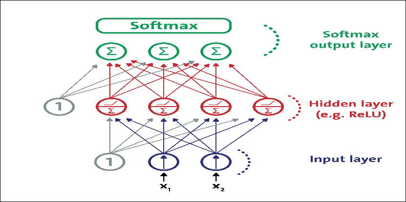

图 10：用于分类的现代 MLP（包括 ReLU 和 softmax）

然而，对于多类分类任务和训练，通常通过用共享 softmax 函数替换各个激活函数来修改输出层。每个神经元的输出对应于相应类的估计概率。请注意，信号仅在一个方向上从输入流向输出，因此该架构是 FFNN 的示例。

作为案例研究，我们将使用银行营销数据集。这些数据与葡萄牙银行机构的直接营销活动有关。营销活动基于电话。通常，不止一次联系同一个客户，以评估产品（银行定期存款）是（是）还是不（不）订阅。 目标是使用 MLP 来预测客户是否会订阅定期存款（变量 y），即二元分类问题。

### 数据集描述

我想在此承认有两个来源。这个数据集被用于 Moro 和其他人发表的一篇研究论文中：一种数据驱动的方法来预测银行电话营销的成功，决策支持系统，Elsevier，2014 年 6 月。后来，它被捐赠给了 UCI 机器学习库，可以从[此链接](https://archive.ics.uci.edu/ml/datasets/bank+marketing)下载。

根据数据集描述，有四个数据集：

*   `bank-additional-full.csv`：这包括所有示例（41,188）和 20 个输入，按日期排序（从 2008 年 5 月到 2010 年 11 月）。这些数据非常接近 Moro 和其他人分析的数据
*   `bank-additional.csv`：这包括 10％的例子（4119），从 1 和 20 个输入中随机选择
*   `bank-full.csv`：这包括按日期排序的所有示例和 17 个输入（此数据集的较旧版本，输入较少）
*   `bank.csv`：这包括 10％的示例和 17 个输入，从 3 中随机选择（此数据集的较旧版本，输入较少）

数据集中有 21 个属性。独立变量可以进一步分类为与客户相关的数据（属性 1 到 7），与当前活动的最后一次联系（属性 8 到 11）相关。其他属性（属性 12 至 15）以及社会和经济背景属性（属性 16 至 20）被分类。因变量由 y 指定，最后一个属性（21）：

| ID | 属性 | 说明 |
| --- | --- | --- |
| 1 | `age` | 年龄数字。 |
| 2 | `job` | 这是具有可能值的分类格式的职业类型：`admin`，`blue-collar`，`entrepreneur`，`housemaid`，`management`，`retired`，`self-employed`，`services`，`student`， `technician`，`unemployed`和`unknown`。 |
| 3 | `marital` | 这是具有可能值的分类格式的婚姻状态：`divorced`（或`widowed`），`married`，`single`和`unknown`。 |
| 4 | `education` | 这是具有如下可能值的分类格式的教育背景：`basic.4y`，`basic.6y`，`basic.9y`，`high.school`，`illiterate`，`professional.course`，`university.degree`和`unknown`。 |
| 五 | `default` | 这是一种分类格式，默认情况下可能包含信用值：`no`，`yes`和`unknown`。 |
| 6 | `housing` | 客户是否有住房贷款？ |
| 7 | `loan` | 具有可能值的分类格式的个人贷款：`no`，`yes`和`unknown`。 |
| 8 | `contact` | 这是具有可能值的分类格式的通信类型：`cellular`或`telephone`。 |
| 9 | `month` | 这是具有可能值的分类格式的一年中最后一个通话月份：`jan`，`feb`，`mar`，... `nov`和`dec`。 |
| 10 | `day_of_week` | 这是一周中的最后一个通话日，其分类格式为可能的值：`mon`，`tue`，`wed`，`thu`和`fri`。 |
| 11 | `duration` | 这是以秒为单位的最后一次通话持续时间（数值）。此属性高度影响输出目标（例如，如果`duration = 0`，则`y = no`）。然而，在执行呼叫之前不知道持续时间。另外，在通话结束后，`y`显然是已知的。因此，此输入仅应包括在基准目的中，如果打算采用现实的预测模型，则应将其丢弃。 |
| 12 | `campaign` | 这是活动期间此客户的通话数量。 |
| 13 | `pdays` | 这是上一个广告系列和客户的上次通话之后经过的天数（数字 -999 表示之前未联系过客户）。 |
| 14 | `previous` | 这是之前此广告系列和此客户的通话数量（数字）。 |
| 15 | `poutcome` | 上一次营销活动的结果（分类：`failure`，`nonexistent`和`success`）。 |
| 16 | `emp.var.rate` | 这是就业变化率和季度指标（数字）。 |
| 17 | `cons.price.idx` | 这是消费者价格指数和月度指标（数字）。 |
| 18 | `cons.conf.idx` | 这是消费者信心指数和月度指标（数字）。 |
| 19 | `euribor3m` | 这是 3 个月的 euribor 费率和每日指标（数字）。 |
| 20 | `nr.employed` | 这是员工数和季度指标（数字）。 |
| 21 | `y` | 表示客户是否拥有定期存款，可能值是二元：`yes`和`no`。 |

### 预处理

您可以看到数据集尚未准备好直接输入 MLP 或 DBN 分类器，因为该特征与数值和分类值混合在一起。此外，结果变量具有分类值。因此，我们需要将分类值转换为数值，以便特征和结果变量以数字形式。下一步显示了此过程。有关此预处理，请参阅`preprocessing_b.py`文件。

首先，我们必须加载预处理所需的所需包和库：

```py
import pandas as pd
import numpy as np
from sklearn import preprocessing
```

然后从上述 URL 下载数据文件并将其放在方便的位置 - 比如说`input`：

然后，我们加载并解析数据集：

```py
data = pd.read_csv('input/bank-additional-full.csv', sep = ";")
```

接下来，我们将提取变量名称：

```py
var_names = data.columns.tolist()
```

现在，基于表 1 中的数据集描述，我们将提取分类变量：

```py
categs = ['job','marital','education','default','housing','loan','contact','month','day_of_week','duration','poutcome','y']
```

然后，我们将提取定量变量：

```py
# Quantitative vars
quantit = [i for i in var_names if i not in categs]
```

然后让我们得到分类变量的虚拟变量：

```py
job = pd.get_dummies(data['job'])
marital = pd.get_dummies(data['marital'])
education = pd.get_dummies(data['education'])
default = pd.get_dummies(data['default'])
housing = pd.get_dummies(data['housing'])
loan = pd.get_dummies(data['loan'])
contact = pd.get_dummies(data['contact'])
month = pd.get_dummies(data['month'])
day = pd.get_dummies(data['day_of_week'])
duration = pd.get_dummies(data['duration'])
poutcome = pd.get_dummies(data['poutcome'])
```

现在，是时候映射变量来预测：

```py
dict_map = dict()
y_map = {'yes':1,'no':0}
dict_map['y'] = y_map
data = data.replace(dict_map)
label = data['y']
df_numerical = data[quantit]
df_names = df_numerical .keys().tolist()
```

一旦我们将分类变量转换为数值变量，下一个任务就是正则化数值变量。因此，使用归一化，我们将单个样本缩放为具有单元规范。如果您计划使用二次形式（如点积或任何其他内核）来量化任何样本对的相似性，则此过程非常有用。该假设是在文本分类和聚类上下文中经常使用的[向量空间模型](https://en.wikipedia.org/wiki/Vector_space_model)的基础。

那么，让我们来衡量量化变量：

```py
min_max_scaler = preprocessing.MinMaxScaler()
x_scaled = min_max_scaler.fit_transform(df_numerical)
df_temp = pd.DataFrame(x_scaled)
df_temp.columns = df_names
```

现在我们有（原始）数值变量的临时数据帧，下一个任务是将所有数据帧组合在一起并生成正则化数据帧。我们将使用熊猫：

```py
normalized_df = pd.concat([df_temp,
                      job,
                      marital,
                      education,
                      default,
                      housing,
                      loan,
                      contact,
                      month,
                      day,
                      poutcome,
                      duration,
                      label], axis=1)
```

最后，我们需要将结果数据帧保存在 CSV 文件中，如下所示：

```py
normalized_df.to_csv('bank_normalized.csv', index = False)
```

### 用于客户订阅评估的 MLP 的 TensorFlow 实现

对于这个例子，我们将使用我们在前面的例子中正则化的银行营销数据集。有几个步骤可以遵循。首先，我们需要导入 TensorFlow，以及其他必要的包和模块：

```py
import tensorflow as tf
import pandas as pd
import numpy as np
import os
from sklearn.cross_validation import train_test_split # for random split of train/test
```

现在，我们需要加载正则化的银行营销数据集，其中所有特征和标签都是数字。为此，我们使用 pandas 库中的`read_csv()`方法：

```py
FILE_PATH = 'bank_normalized.csv'         # Path to .csv dataset 
raw_data = pd.read_csv(FILE_PATH)        # Open raw .csv
print("Raw data loaded successfully...\n")
```

以下是上述代码的输出：

```py
>>>
Raw data loaded successfully...

```

如前一节所述，调整 DNN 的超参数并不简单。但是，它通常取决于您正在处理的数据集。对于某些数据集，可能的解决方法是根据与数据集相关的统计信息设置这些值，例如，训练实例的数量，输入大小和类的数量。

DNN 不适用于小型和低维数据集。在这些情况下，更好的选择是使用线性模型。首先，让我们放置一个指向标签列本身的指针，计算实例数和类数，并定义训练/测试分流比，如下所示：

```py
Y_LABEL = 'y'    # Name of the variable to be predicted
KEYS = [i for i in raw_data.keys().tolist() if i != Y_LABEL]# Name of predictors
N_INSTANCES = raw_data.shape[0]       # Number of instances
N_INPUT = raw_data.shape[1] - 1            # Input size
N_CLASSES = raw_data[Y_LABEL].unique().shape[0] # Number of classes
TEST_SIZE = 0.25         # Test set size (% of dataset)
TRAIN_SIZE = int(N_INSTANCES * (1 - TEST_SIZE))  # Train size
```

现在，让我们看一下我们将用于训练 MLP 模型的数据集的统计数据：

```py
print("Variables loaded successfully...\n")
print("Number of predictors \t%s" %(N_INPUT))
print("Number of classes \t%s" %(N_CLASSES))
print("Number of instances \t%s" %(N_INSTANCES))
print("\n")
```

以下是上述代码的输出：

```py
>>>
Variables loaded successfully...
Number of predictors     1606
Number of classes          2
Number of instances      41188

```

下一个任务是定义其他参数，例如学习率，训练周期，批量大小和权重的标准偏差。通常，较低的训练率会帮助您的 DNN 学习更慢，但需要集中精力。请注意，我们需要定义更多参数，例如隐藏层数和激活函数。

```py
LEARNING_RATE = 0.001     # learning rate
TRAINING_EPOCHS = 1000     # number of training epoch for the forward pass
BATCH_SIZE = 100     # batch size to be used during training
DISPLAY_STEP = 20   # print the error etc. at each 20 step
HIDDEN_SIZE = 256   # number of neurons in each hidden layer
# We use tanh as the activation function, but you can try using ReLU as well
ACTIVATION_FUNCTION_OUT = tf.nn.tanh
STDDEV = 0.1        # Standard Deviations
RANDOM_STATE = 100
```

前面的初始化是基于反复试验设置的  。因此，根据您的用例和数据类型，明智地设置它们，但我们将在本章后面提供一些指导。此外，对于前面的代码，`RANDOM_STATE`用于表示训练的随机状态和测试分割。首先，我们将原始特征和标签分开：

```py
data = raw_data[KEYS].get_values()       # X data
labels = raw_data[Y_LABEL].get_values()  # y data
```

现在我们有标签，他们必须编码：

```py
labels_ = np.zeros((N_INSTANCES, N_CLASSES))
labels_[np.arange(N_INSTANCES), labels] = 1
```

最后，我们必须拆分训练和测试集。如前所述，我们将保留 75％的训练输入，剩下的 25％用于测试集：

```py
data_train, data_test, labels_train, labels_test = train_test_split(data,labels_,test_size = TEST_SIZE,random_state = RANDOM_STATE)
print("Data loaded and splitted successfully...\n")
```

以下是上述代码的输出：

```py
>>>
Data loaded and splitted successfully

```

由于这是一个监督分类问题，我们应该有特征和标签的占位符：

如前所述，MLP 由一个输入层，几个隐藏层和一个称为输出层的最终 LTU 层组成。对于这个例子，我将把训练与四个隐藏层结合起来。因此，我们将分类器称为深度前馈 MLP。请注意，我们还需要在每个层中使用权重（输入层除外），以及每个层中的偏差（输出层除外）。通常，每个隐藏层包括偏置神经元，并且作为从一个隐藏层到另一个隐藏层的完全连接的二分图（前馈）完全连接到下一层。那么，让我们定义隐藏层的大小：

```py
n_input = N_INPUT                   # input n labels 
n_hidden_1 = HIDDEN_SIZE            # 1st layer 
n_hidden_2 = HIDDEN_SIZE            # 2nd layer
n_hidden_3 = HIDDEN_SIZE            # 3rd layer 
n_hidden_4 = HIDDEN_SIZE            # 4th layer 
n_classes = N_CLASSES               # output m classes 
```

由于这是一个监督分类问题，我们应该有特征和标签的占位符：

```py
# input shape is None * number of input
X = tf.placeholder(tf.float32, [None, n_input])
```

占位符的第一个维度是`None`，这意味着我们可以有任意数量的行。第二个维度固定在多个特征上，这意味着每行需要具有该列数量的特征。

```py
# label shape is None * number of classes
y = tf.placeholder(tf.float32, [None, n_classes])
```

另外，我们需要另一个占位符用于 dropout ，这是通过仅以某种可能性保持神经元活动（例如`p &lt; 1.0`，或者将其设置为零来实现）来实现的。请注意，这也是要调整的超参数和训练时间，而不是测试时间：

```py
dropout_keep_prob = tf.placeholder(tf.float32)
```

使用此处给出的缩放，可以将相同的网络用于训练（使用`dropout_keep_prob &lt; 1.0`）和评估（使用`dropout_keep_prob == 1.0`）。现在，我们可以定义一个实现 MLP 分类器的方法。为此，我们将提供四个参数，如输入，权重，偏差和 dropout 概率，如下所示：

```py
def DeepMLPClassifier(_X, _weights, _biases, dropout_keep_prob):
    layer1 = tf.nn.dropout(tf.nn.tanh(tf.add(tf.matmul(_X, _weights['h1']), _biases['b1'])), dropout_keep_prob)
    layer2 = tf.nn.dropout(tf.nn.tanh(tf.add(tf.matmul(layer1, _weights['h2']), _biases['b2'])), dropout_keep_prob)
    layer3 = tf.nn.dropout(tf.nn.tanh(tf.add(tf.matmul(layer2, _weights['h3']), _biases['b3'])), dropout_keep_prob)
    layer4 = tf.nn.dropout(tf.nn.tanh(tf.add(tf.matmul(layer3, _weights['h4']), _biases['b4'])), dropout_keep_prob)
    out = ACTIVATION_FUNCTION_OUT(tf.add(tf.matmul(layer4, _weights['out']), _biases['out']))
return out
```

上述方法的返回值是激活函数的输出。前面的方法是一个存根实现，它没有告诉任何关于权重和偏差的具体内容，所以在我们开始训练之前，我们应该定义它们：

```py
weights = {
    'w1': tf.Variable(tf.random_normal([n_input, n_hidden_1],stddev=STDDEV)),
    'w2': tf.Variable(tf.random_normal([n_hidden_1, n_hidden_2],stddev=STDDEV)),
    'w3': tf.Variable(tf.random_normal([n_hidden_2, n_hidden_3],stddev=STDDEV)),
    'w4': tf.Variable(tf.random_normal([n_hidden_3, n_hidden_4],stddev=STDDEV)),
    'out': tf.Variable(tf.random_normal([n_hidden_4, n_classes],stddev=STDDEV)),   
}
biases = { 
    'b1': tf.Variable(tf.random_normal([n_hidden_1])), 
    'b2': tf.Variable(tf.random_normal([n_hidden_2])), 
    'b3': tf.Variable(tf.random_normal([n_hidden_3])), 
    'b4': tf.Variable(tf.random_normal([n_hidden_4])), 
    'out': tf.Variable(tf.random_normal([n_classes])) 
}
```

现在我们可以使用真实参数（输入层，权重，偏差和退出）调用前面的 MLP 实现，保持概率如下：

```py
pred = DeepMLPClassifier(X, weights, biases, dropout_keep_prob)
```

我们建立了 MLP 模型，是时候训练网络了。首先，我们需要定义成本操作，然后我们将使用 Adam 优化器，它将慢慢学习并尝试尽可能减少训练损失：

```py
cost = tf.reduce_mean(tf.nn.softmax_cross_entropy_with_logits_v2(logits=pred, labels=y))

# Optimization op (backprop)
optimizer = tf.train.AdamOptimizer(learning_rate = LEARNING_RATE).minimize(cost_op)
```

接下来，我们需要定义用于计算分类准确率的其他参数：

```py
correct_prediction = tf.equal(tf.argmax(pred, 1), tf.argmax(y, 1))
accuracy = tf.reduce_mean(tf.cast(correct_prediction, tf.float32))
print("Deep MLP networks has been built successfully...")
print("Starting training...")
```

之后，我们需要在启动 TensorFlow 会话之前初始化所有变量和占位符：

```py
init_op = tf.global_variables_initializer() 
```

现在，我们非常接近开始训练，但在此之前，最后一步是创建 TensorFlow 会话并按如下方式启动它：

```py
sess = tf.Session()
sess.run(init_op)
```

最后，我们准备开始在训练集上训练我们的 MLP。我们遍历所有批次并使用批量数据拟合以计算平均训练成本。然而，显示每个周期的训练成本和准确率会很棒：

```py
for epoch in range(TRAINING_EPOCHS):
    avg_cost = 0.0
    total_batch = int(data_train.shape[0] / BATCH_SIZE)
    # Loop over all batches
    for i in range(total_batch):
        randidx = np.random.randint(int(TRAIN_SIZE), size = BATCH_SIZE)
        batch_xs = data_train[randidx, :]
        batch_ys = labels_train[randidx, :]
        # Fit using batched data
        sess.run(optimizer, feed_dict={X: batch_xs, y: batch_ys, dropout_keep_prob: 0.9})
        # Calculate average cost
        avg_cost += sess.run(cost, feed_dict={X: batch_xs, y: batch_ys, dropout_keep_prob:1.})/total_batch
    # Display progress
    if epoch % DISPLAY_STEP == 0:
        print("Epoch: %3d/%3d cost: %.9f" % (epoch, TRAINING_EPOCHS, avg_cost))
        train_acc = sess.run(accuracy, feed_dict={X: batch_xs, y: batch_ys, dropout_keep_prob:1.})
        print("Training accuracy: %.3f" % (train_acc))
print("Your MLP model has been trained successfully.")
```

以下是上述代码的输出：

```py
>>>
Starting training...
Epoch:   0/1000 cost: 0.356494816
Training accuracy: 0.920
…
Epoch: 180/1000 cost: 0.350044933
Training accuracy: 0.860
….
Epoch: 980/1000 cost: 0.358226758
Training accuracy: 0.910

```

干得好，我们的 MLP 模型已经成功训练！现在，如果我们以图形方式看到成本和准确率怎么办？我们来试试吧：

```py
# Plot loss over time
plt.subplot(221)
plt.plot(i_data, cost_list, 'k--', label='Training loss', linewidth=1.0)
plt.title('Cross entropy loss per iteration')
plt.xlabel('Iteration')
plt.ylabel('Cross entropy loss')
plt.legend(loc='upper right')
                   plt.grid(True)
```

以下是上述代码的输出  ：

```py
>>>

```

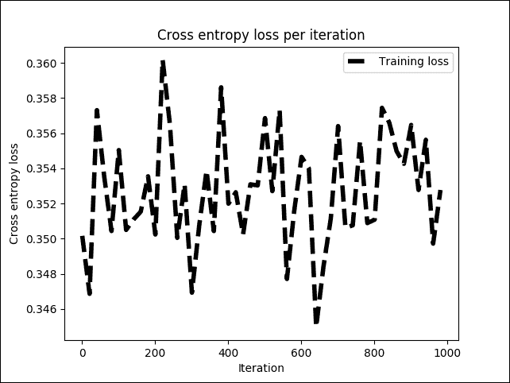

图 11：训练阶段每次迭代的交叉熵损失

上图显示交叉熵损失在 0.34 和 0.36 之间或多或少稳定，但波动很小。现在，让我们看看这对整体训练准确率有何影响：

```py
# Plot train and test accuracy
plt.subplot(222)
plt.plot(i_data, acc_list, 'r--', label='Accuracy on the training set', linewidth=1.0)
plt.title('Accuracy on the training set')
plt.xlabel('Iteration')
plt.ylabel('Accuracy')
plt.legend(loc='upper right')
plt.grid(True)
plt.show()
```

以下是前面代码的输出：

```py
>>>

```

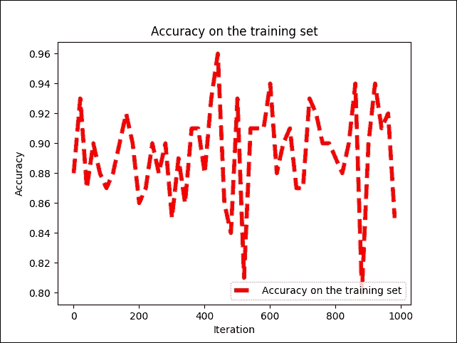

图 12：每次迭代时训练集的准确率

我们可以看到训练准确率在 79％和 96％之间波动，但不会均匀地增加或减少。解决此问题的一种可能方法是添加更多隐藏层并使用不同的优化器，例如本章前面讨论的梯度下降。我们将 dropout 概率提高到 100％，即 1.0。原因是也有相同的网络用于测试：

```py
print("Evaluating MLP on the test set...")
test_acc = sess.run(accuracy, feed_dict={X: data_test, y: labels_test, dropout_keep_prob:1.})
print ("Prediction/classification accuracy: %.3f" % (test_acc))
```

以下是上述代码的输出：

```py
>>>
Evaluating MLP on the test set...
Prediction/classification accuracy: 0.889
Session closed!

```

因此，分类准确率约为 89％。一点也不差！现在，如果需要更高的精度，我们可以使用称为深度信任网络（DBN）的另一种 DNN 架构，可以以有监督或无监督的方式进行训练。

这是在其应用中作为分类器观察 DBN 的最简单方法。如果我们有一个 DBN 分类器，那么预训练方法是以类似于自编码器的无监督方式完成的，这将在第 5 章中描述，优化 TensorFlow 自编码器，分类器以受监督的方式训练（微调），就像 MLP 中的那样。

## 深度信念网络（DBNs）

为了克服 MLP 中的过拟合问题，我们建立了一个 DBN，进行无监督的预训练，为输入获得一组不错的特征表示，然后对训练集进行微调以获得预测。网络。

虽然 MLP 的权重是随机初始化的，但 DBN 使用贪婪的逐层预训练算法通过概率生成模型初始化网络权重。这些模型由可见层和多层随机潜在变量组成，这些变量称为隐藏单元或特征检测器。

堆叠  DBN 中的 RBM，形成无向概率图模型，类似于马尔可夫随机场（MRF）：两层由可见神经元和隐藏神经元组成。

堆叠 RBM 中的顶部两层在它们之间具有无向的对称连接并形成关联存储器，而较低层从上面的层接收自上而下的定向连接：

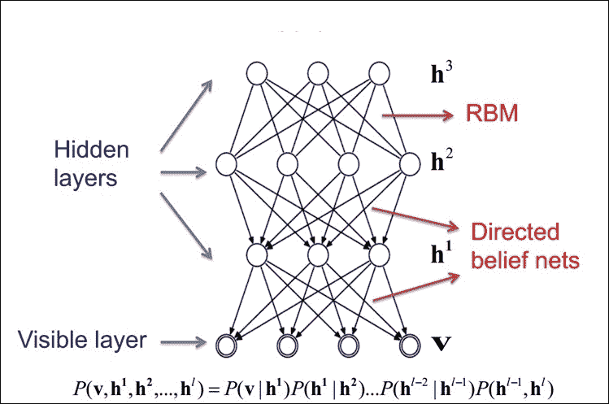

图 13：RBM 作为构建块的 DBN 的高级视图

顶部两层在它们之间具有无向的对称连接并形成关联存储器，而较低层从前面的层接收自上而下的定向连接。几个 RBM 一个接一个地堆叠以形成 DBN。

### 受限玻尔兹曼机器（RBMs）

RBM 是无向概率图模型，称为 Markov 随机场。它由两层组成。第一层由可见神经元组成，第二层由隐藏神经元组成。图 14 显示了简单 RBM 的结构。可见单元接受输入，隐藏单元是非线性特征检测器。每个可见神经元都连接到所有隐藏的神经元，但同一层中的神经元之间没有内部连接：

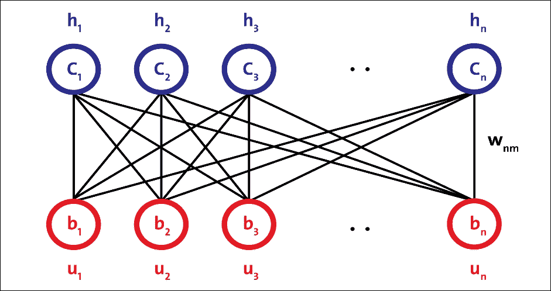

图 14：简单 RBM 的结构

图 14 中的 RBM 由 m 个可见单元组成，V =（v &lt;sub&gt;1&lt;/sub&gt; ，... v &lt;sub&gt;m&lt;/sub&gt; ）和 n 个隐藏单元，H =（h &lt;sub&gt;1&lt;/sub&gt; ... h &lt;sub&gt;n&lt;/sub&gt; ）。可见单元接受 0 到 1 之间的值，隐藏单元的生成值介于 0 和 1 之间。模型的联合概率是由以下等式给出的能量函数：

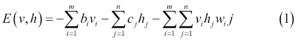

在前面的等式中，i = 1 ... m，j = 1 ... n，bi 和 cj 分别是可见和隐藏单元的偏差，并且 w &lt;sub&gt;ij&lt;/sub&gt; 是 v &lt;sub&gt;i&lt;/sub&gt; 之间的权重]和 &lt;sub&gt;h&lt;/sub&gt; j。模型分配给可见向量 v 的概率由下式给出：

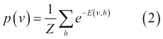

在第二个等式中，Z 是分区函数，定义如下：

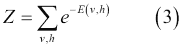

权重的学习可以通过以下等式获得  ：

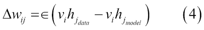

在等式 4 中，学习率由`∈`定义。通常，较小的`∈`值可确保训练更加密集。但是，如果您希望网络快速学习，可以将此值设置得更高。

由于同一层中的单元之间没有连接，因此很容易计算第一项。 p（h | v）和 p（v | h）的条件分布是阶乘的，并且由以下等式中的逻辑函数给出：

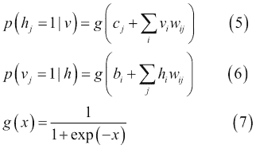

因此，样本`v[i] h[j]`是无偏的。然而，计算第二项的对数似然的计算成本是指数级的。虽然有可能得到第二项的无偏样本，但使用马尔可夫链蒙特卡罗（MCMC）的吉布斯采样，这个过程也不具有成本效益。相反，RBM 使用称为对比发散的有效近似方法。

通常，MCMC 需要许多采样步骤才能达到静止的收敛。运行吉布斯采样几步（通常是一步）足以训练一个模型，这称为对比分歧学习。对比分歧的第一步是用训练向量初始化可见单元。

下一步是使用等式 5 计算所有隐藏单元，同时使用可见单元，然后使用等式 4 从隐藏单元重建可见单元。最后，隐藏单元用重建的可见单元更新。因此，代替方程式 4，我们最终得到以下的权重学习模型：

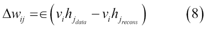

简而言之，该过程试图减少输入数据和重建数据之间的重建误差。算法收敛需要多次参数更新迭代。迭代称为周期。输入数据被分成小批量，并且在每个小批量之后更新参数，具有参数的平均值。

最后，如前所述，RBM 最大化可见单元 p（v）的概率，其由模式和整体训练数据定义。它相当于最小化模型分布和经验数据分布之间的[ KL-分歧](https://en.wikipedia.org/wiki/Kullback%E2%80%93Leibler_divergence)。

对比分歧只是这个目标函数的粗略近似，但它在实践中非常有效。虽然方便，但重建误差实际上是衡量学习进度的一个非常差的指标。考虑到这些方面，RBM 需要一些时间来收敛，但是如果你看到重建是不错的，那么你的算法效果很好。

### 构建一个简单的 DBN

单个隐藏层  RBM 无法从输入数据中提取所有特征，因为它无法对变量之间的关系进行建模。因此，一层接一个地使用多层 RBM 来提取非线性特征。在 DBN 中，首先使用输入数据训练 RBM，并且隐藏层以贪婪学习方法表示学习的特征。

第一 RBM 的这些学习特征用作第二 RBM 的输入，作为 DBN 中的另一层，如图 15 所示。类似地，第二层的学习特征用作另一层的输入。

这样，DBN 可以从输入数据中提取深度和非线性特征。最后一个 RBM 的隐藏层代表整个网络的学习特征。前面针对所有 RBM 层描述的学习特征的过程称为预训练。

### 无监督的预训练

假设您要处理复杂任务，您没有多少标记的训练数据。很难找到合适的 DNN 实现或架构来进行训练并用于预测分析。然而，如果您有大量未标记的训练数据，您可以尝试逐层训练层，从最低层开始，然后使用无监督的特征检测器算法向上移动。这就是 RBM（图 15）或自编码器（图 16）的工作原理。

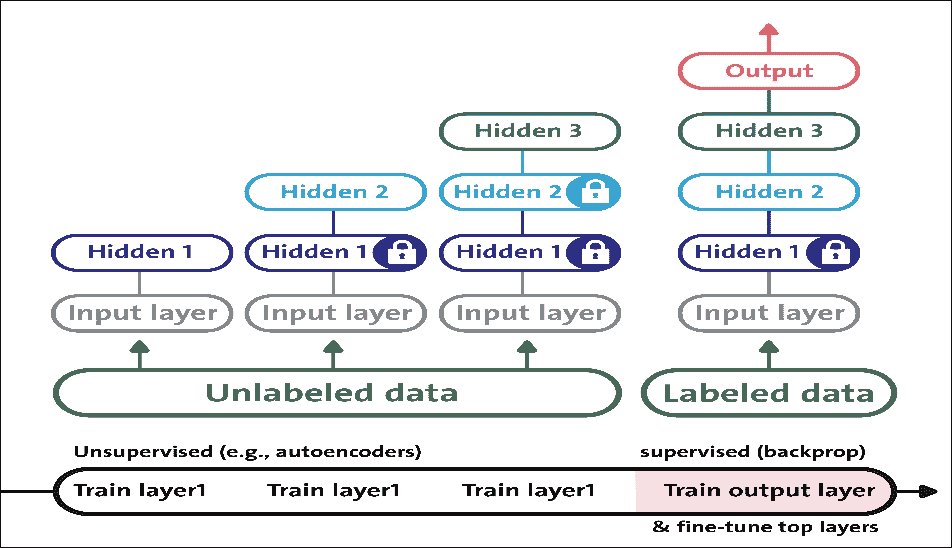

图 15：使用自编码器在 DBN 中进行无监督的预训练

当您有一个复杂的任务需要解决时，无监督的预训练仍然是一个不错的选择，没有类似的模型可以重复使用，并且标记很少的训练数据，但是大量未标记的训练数据。目前的趋势是使用自编码器而不是 RBM;但是，对于下一节中的示例，RBM 将用于简化。读者也可以尝试使用自编码器而不是 RBM。

预训练是一种无监督的学习过程。在预训练之后，通过在最后一个 RBM 层的顶部添加标记层来执行网络的微调。此步骤是受监督的学习过程。无监督的预训练步骤尝试查找网络权重：

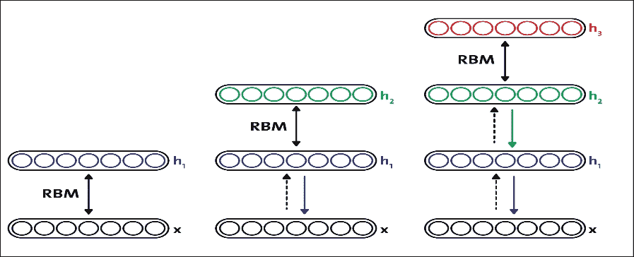

图 16：通过构建具有 RBM 堆栈的简单 DBN 在 DBN 中进行无监督预训练

### 监督微调

在监督学习阶段（也称为监督微调）中，不是随机初始化网络权重，而是使用在预训练步骤中计算的权重来初始化它们。这样，当使用监督梯度下降时，DBN 可以避免收敛到局部最小值。

如前所述，使用 RBM 堆栈，DBN 可以构造如下：

*   使用参数 W &lt;sup&gt;1&lt;/sup&gt; 训练底部 RBM（第一个 RBM）
*   将第二层权重初始化为 W &lt;sup&gt;2&lt;/sup&gt; = W &lt;sup&gt;1T&lt;/sup&gt; ，这可确保 DBN 至少与我们的基础 RBM 一样好

因此，将这些步骤放在一起，图 17 显示了由三个 RBM 组成的简单 DBN 的构造：

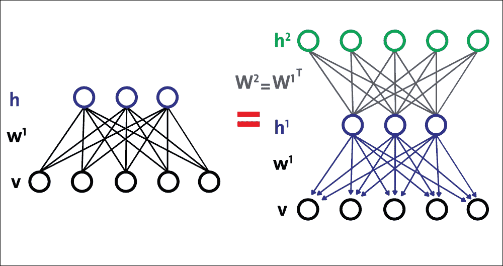

图 17：使用多个 RBM 构建简单的 DBN

现在，当调整 DBN 以获得更好的预测准确率时，我们应该调整几个超参数，以便 DBN 通过解开和改进 W &lt;sup&gt;2&lt;/sup&gt; 来拟合训练数据。综上所述，我们有了创建基于 DBN 的分类器或回归器的概念工作流程。

现在我们已经有足够的理论背景来介绍如何使用几个 RBM 构建 DBN，现在是时候将我们的理论应用于实践中了。在下一节中，我们将了解如何开发用于预测分析的监督 DBN 分类器。

## 使用 TensorFlow 实现 DBN 以进行客户订阅评估

在银行营销数据集的前一个示例中，我们使用 MLP 观察到大约 89％的分类准确率。我们还将原始数据集标准化，然后将其提供给 MLP。在本节中，我们将了解如何为基于 DBN 的预测模型使用相同的数据集。

我们将使用 Md.Rezaul Karim 最近出版的书籍 Predictive Analytics with TensorFlow 的 DBN 实现，可以从 [GitHub](https://github.com/PacktPublishing/Predictive-Analytics-with-TensorFlow/tree/master/Chapter07/DBN) 下载。

前面提到的实现是基于 RBM 的简单，干净，快速的 DBN 实现，并且基于 NumPy 和 TensorFlow 库，以便利用 GPU 计算。该库基于以下两篇研究论文实现：

*   Geoffrey E. Hinton，Simon Osindero 和 Yee-Whye Teh 的深度信念网快速学习算法。 Neural Computation 18.7（2006）：1527-1554。
*   训练受限制的玻尔兹曼机器：简介，Asja Fischer 和 Christian Igel。模式识别 47.1（2014）：25-39。

我们将看到如何以无监督的方式训练 RBM，然后我们将以有监督的方式训练网络。简而言之，有几个步骤需要遵循。主分类器是`classification_demo.py`。

### 提示

虽然在以监督和无监督的方式训练 DBN 时数据集不是那么大或高维度，但是在训练时间中会有如此多的计算，这需要巨大的资源。然而，RBM 需要大量时间来收敛。因此，我建议读者在 GPU 上进行训练，至少拥有 32 GB 的 RAM 和一个 corei7 处理器。

我们将从加载所需的模块和库开始：

```py
import numpy as np
import pandas as pd
from sklearn.datasets import load_digits
from sklearn.model_selection import train_test_split
from sklearn.metrics.classification import accuracy_score
from sklearn.metrics import precision_recall_fscore_support
from sklearn.metrics import confusion_matrix
import itertools
from tf_models import SupervisedDBNClassification
import matplotlib.pyplot as plt
```

然后，我们加载前一个 MLP 示例中使​​用的已经正则化的数据集：

```py
FILE_PATH = '../input/bank_normalized.csv'
raw_data = pd.read_csv(FILE_PATH)
```

在前面的代码中，我们使用了 pandas `read_csv()`方法并创建了一个`DataFrame`。现在，下一个任务是按如下方式扩展特征和标签：

```py
Y_LABEL = 'y'
KEYS = [i for i in raw_data.keys().tolist() if i != Y_LABEL]
X = raw_data[KEYS].get_values()
Y = raw_data[Y_LABEL].get_values()
class_names = list(raw_data.columns.values)
print(class_names)
```

在前面的行中，我们已经分离了特征和标签。这些特征存储在`X`中，标签位于`Y`中。接下来的任务是将它们分成训练（75％）和测试集（25％），如下所示：

```py
X_train, X_test, Y_train, Y_test = train_test_split(X, Y, test_size=0.25, random_state=100)
```

现在我们已经有了训练和测试集，我们可以直接进入 DBN 训练步骤。但是，首先我们需要实例化 DBN。我们将以受监督的方式进行分类，但我们需要为此 DNN 架构提供超参数：

```py
classifier = SupervisedDBNClassification(hidden_layers_structure=[64, 64],learning_rate_rbm=0.05,learning_rate=0.01,n_epochs_rbm=10,n_iter_backprop=100,batch_size=32,activation_function='relu',dropout_p=0.2)
```

在前面的代码段中，`n_epochs_rbm`是预训练（无监督）和`n_iter_backprop`用于监督微调的周期数。尽管如此，我们已经为这两个阶段定义了两个单独的学习率，分别使用`learning_rate_rbm`和`learning_rate`。

不过，我们将在本节后面描述`SupervisedDBNClassification`的这个类实现。

该库具有支持 sigmoid，ReLU 和 tanh 激活函数的实现。此外，它利用 l2 正则化来避免过拟合。我们将按如下方式进行实际拟合：

```py
classifier.fit(X_train, Y_train)
```

如果一切顺利，你应该在控制台上观察到以下进展：

```py
[START] Pre-training step:
>> Epoch 1 finished     RBM Reconstruction error 1.681226
….
>> Epoch 3 finished     RBM Reconstruction error 4.926415
>> Epoch 5 finished     RBM Reconstruction error 7.185334
…
>> Epoch 7 finished     RBM Reconstruction error 37.734962
>> Epoch 8 finished      RBM Reconstruction error 467.182892
….
>> Epoch 10 finished      RBM Reconstruction error 938.583801
[END] Pre-training step
[START] Fine tuning step:
>> Epoch 0 finished     ANN training loss 0.316619
>> Epoch 1 finished     ANN training loss 0.311203
>> Epoch 2 finished     ANN training loss 0.308707
….
>> Epoch 98 finished     ANN training loss 0.288299
>>        Epoch        99         finished                   ANN         training         loss        0.288900

```

由于 RBM 的权重是随机初始化的，因此重建和原始输入之间的差异通常很大。

从技术上讲，我们可以将重建误差视为重建值与输入值之间的差异。然后，在迭代学习过程中，将该错误反向传播 RBM 的权重几次，直到达到最小误差。

然而，在我们的情况下，重建达到 938，这不是那么大（即，不是无限），所以我们仍然可以期望良好的准确率。无论如何，经过 100 次迭代后，显示每个周期训练光泽的微调图如下：

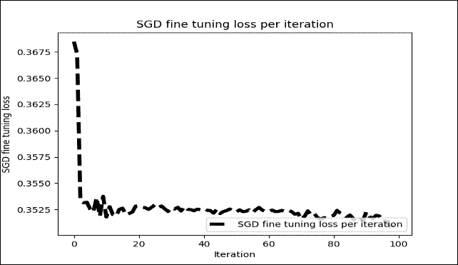

图 18：每次迭代的 SGD 微调损失（仅 100 次迭代）

然而，当我重复前面的训练并微调 1000 个周期时，我没有看到训练损失有任何显着改善：

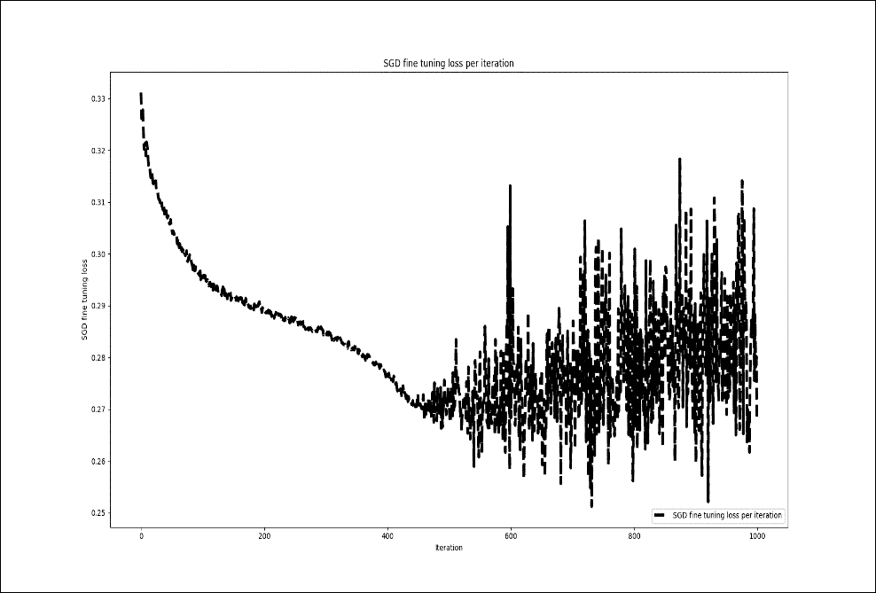

图 19：每次迭代的 SGD 微调损失（1000 次迭代）

这是监督的 DBN 分类器的实现。此类为分类问题实现 DBN。它将网络输出转换为原始标签。在对标签映射执行索引之后，它还需要网络参数并返回列表。

然后，该类预测给定数据中每个样本的类的概率分布，并返回字典列表（每个样本一个）。最后，它附加了 softmax 线性分类器作为输出层：

```py
class SupervisedDBNClassification(TensorFlowAbstractSupervisedDBN, ClassifierMixin):
    def _build_model(self, weights=None):
        super(SupervisedDBNClassification, self)._build_model(weights)
        self.output = tf.nn.softmax(self.y)
        self.cost_function = tf.reduce_mean(tf.nn.softmax_cross_entropy_with_logits_v2(logits=self.y, labels=self.y_))
        self.train_step = self.optimizer.minimize(self.cost_function)
    @classmethod

    def _get_param_names(cls):
        return super(SupervisedDBNClassification, cls)._get_param_names() + ['label_to_idx_map', 'idx_to_label_map']

    @classmethod
    def from_dict(cls, dct_to_load):
        label_to_idx_map = dct_to_load.pop('label_to_idx_map')
        idx_to_label_map = dct_to_load.pop('idx_to_label_map')
        instance = super(SupervisedDBNClassification, cls).from_dict(dct_to_load)
        setattr(instance, 'label_to_idx_map', label_to_idx_map)
        setattr(instance, 'idx_to_label_map', idx_to_label_map)
        return instance

    def _transform_labels_to_network_format(self, labels):
        """
        Converts network output to original labels.
        :param indexes: array-like, shape = (n_samples, )
        :return:
        """
        new_labels, label_to_idx_map, idx_to_label_map = to_categorical(labels, self.num_classes)
        self.label_to_idx_map = label_to_idx_map
        self.idx_to_label_map = idx_to_label_map
        return new_labels

    def _transform_network_format_to_labels(self, indexes):
        return list(map(lambda idx: self.idx_to_label_map[idx], indexes))

    def predict(self, X):
        probs = self.predict_proba(X)
        indexes = np.argmax(probs, axis=1)
        return self._transform_network_format_to_labels(indexes)

    def predict_proba(self, X):
        """
        Predicts probability distribution of classes for each sample in the given data.
        :param X: array-like, shape = (n_samples, n_features)
        :return:
        """
        return super(SupervisedDBNClassification, self)._compute_output_units_matrix(X)

    def predict_proba_dict(self, X):
        """
        Predicts probability distribution of classes for each sample in the given data.
        Returns a list of dictionaries, one per sample. Each dict contains {label_1: prob_1, ..., label_j: prob_j}
        :param X: array-like, shape = (n_samples, n_features)
        :return:
        """
        if len(X.shape) == 1:  # It is a single sample
            X = np.expand_dims(X, 0)
        predicted_probs = self.predict_proba(X)
        result = []
        num_of_data, num_of_labels = predicted_probs.shape
        for i in range(num_of_data):
            # key : label
            # value : predicted probability
            dict_prob = {}
            for j in range(num_of_labels):
                dict_prob[self.idx_to_label_map[j]] = predicted_probs[i][j]
            result.append(dict_prob)
        return result
    def _determine_num_output_neurons(self, labels):
        return len(np.unique(labels))
```

正如我们在前面的例子和运行部分中提到的那样，微调神经网络的参数是一个棘手的过程。有很多不同的方法，但我的知识并没有一刀切的方法。然而，通过前面的组合，我收到了更好的分类结果。另一个要选择的重要参数是学习率。根据您的模型调整学习率是一种可以采取的方法，以减少训练时间，同时避免局部最小化。在这里，我想讨论一些能够帮助我提高预测准确率的技巧，不仅适用于此应用，也适用于其他应用。

现在我们已经建立了模型，现在是评估其表现的时候了。为了评估分类准确率，我们将使用几个表现指标，如`precision`，`recall`和`f1 score`。此外，我们将绘制混淆矩阵，以观察与真实标签相对应的预测标签。首先，让我们计算预测精度如下：

```py
Y_pred = classifier.predict(X_test)
print('Accuracy: %f' % accuracy_score(Y_test, Y_pred))
```

接下来，我们需要计算分类的`precision`，`recall`和`f1 score`：

```py
p, r, f, s = precision_recall_fscore_support(Y_test, Y_pred, average='weighted')
print('Precision:', p)
print('Recall:', r)
print('F1-score:', f)
```

以下是上述代码的输出：

```py
>>>
Accuracy: 0.900554
Precision: 0.8824140209830381
Recall: 0.9005535592891133
F1-score: 0.8767190584424599

```

太棒了！使用我们的 DBN 实现，我们解决了与使用 MLP 相同的分类问题。尽管如此，与 MLP 相比，我们设法获得了稍微更好的准确率。

现在，如果要解决回归问题，要预测的标签是连续的，则必须使用`SupervisedDBNRegression()`函数进行此实现。 DBN 文件夹中的回归脚本（即`regression_demo.py`）也可用于执行回归操作。

但是，使用专门为回归 y 准备的另一个数据集将是更好的主意。您需要做的就是准备数据集，以便基于 TensorFlow 的 DBN 可以使用它。因此，为了最小化演示，我使用房价：高级回归技术数据集来预测房价。