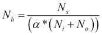
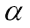
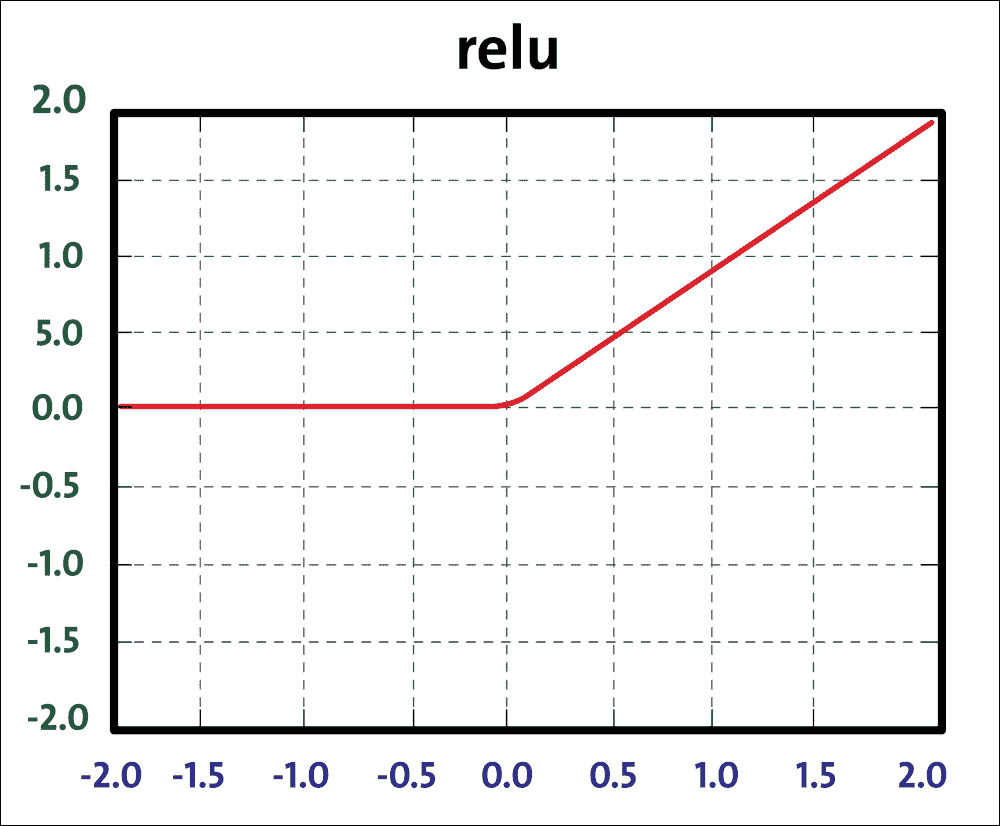
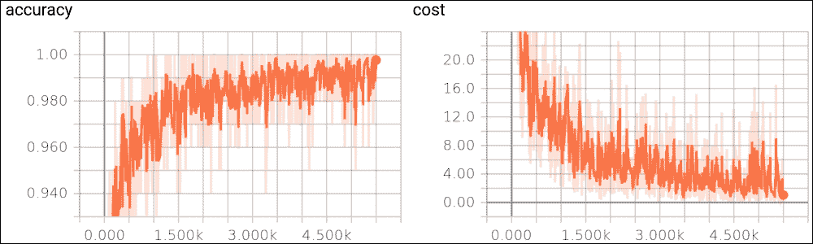
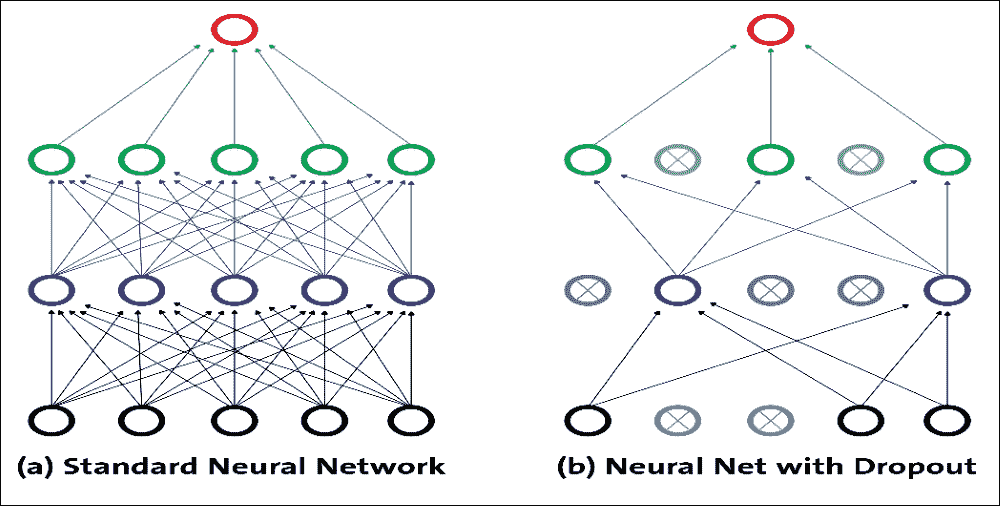

# 调整超参数和高级 FFNN

神经网络的灵活性也是它们的主要缺点之一：有很多超参数可以调整。即使在简单的 MLP 中，您也可以更改层数，每层神经元的数量以及每层中使用的激活函数的类型。您还可以更改权重初始化逻辑，退出保持概率等。

另外，FFNN 中的一些常见问题，例如梯度消失问题，以及选择最合适的激活函数，学习率和优化器，是最重要的。

## 调整 FFNN 超参数

超参数是不在估计器中直接学习的参数。有可能并建议您在超参数空间中搜索[最佳交叉验证](http://scikit-learn.org/stable/modules/cross_validation.html#cross-validation)得分。在构造估计器时提供的任何参数可以以这种方式优化。现在，问题是：您如何知道超参数的哪种组合最适合您的任务？当然，您可以使用网格搜索和交叉验证来为线性机器学习模型找到正确的超参数。

但是，对于 DNN，有许多超参数可供调整。由于在大型数据集上训练神经网络需要花费大量时间，因此您只能在合理的时间内探索超参数空间的一小部分。以下是一些可以遵循的见解。

此外，当然，正如我所说，您可以使用网格搜索或随机搜索，通过交叉验证，为线性机器学习模型找到正确的超参数。我们将在本节后面看到一些可能的详尽和随机网格搜索和交叉验证方法。

### 隐藏层数

对于许多问题，你可以从一个或两个隐藏层开始，这个设置可以很好地使用两个隐藏层，具有相同的神经元总数（见下文以了解一些神经元），训练时间大致相同。现在让我们看一些关于设置隐藏层数的朴素估计：

*   0：仅能表示线性可分离函数或决策
*   1：可以近似包含从一个有限空间到另一个有限空间的连续映射的任何函数
*   2：可以用任意精度表示任意决策边界，具有合理的激活函数，并且可以近似任何平滑映射到任何精度

但是，对于更复杂的问题，您可以逐渐增加隐藏层的数量，直到您开始过拟合训练集。非常复杂的任务，例如大图像分类或语音识别，通常需要具有数十层的网络，并且它们需要大量的训练数据。

不过，您可以尝试逐渐增加神经元的数量，直到网络开始过拟合。这意味着不会导致过拟合的隐藏神经元数量的上限是：



在上面的等式中：

N &lt;sub&gt;i&lt;/sub&gt; =输入神经元的数量

N &lt;sub&gt;o&lt;/sub&gt; = 输出神经元的数量

N &lt;sub&gt;s&lt;/sub&gt; =训练数据集中的样本数



=任意比例因子通常为 2-10。

请注意，上述等式不是来自任何研究，而是来自我的个人工作经验。但是，对于自动程序，您将以 2 的 alpha 值开始，即训练数据的自由度是模型的两倍，如果训练数据的误差明显小于 10，则可以达到 10。用于交叉验证数据集。

### 每个隐藏层的神经元数量

显然，输入和输出层中神经元的数量取决于您的任务所需的输入和输出类型。例如，如果您的数据集的形状为 28x28，则它应该具有大小为 784 的输入神经元，并且输出神经元应该等于要预测的类的数量。

我们将在下一个例子中看到它如何在实践中工作，使用 MLP，其中将有四个具有 256 个神经元的隐藏层（只有一个超参数可以调整，而不是每层一个）。就像层数一样，您可以尝试逐渐增加神经元的数量，直到网络开始过拟合。

有一些经验导出的经验法则，其中最常用的是：“隐藏层的最佳大小通常在输入的大小和输出层的大小之间。”

总之，对于大多数问题，通过仅使用两个规则设置隐藏层配置，您可能可以获得不错的表现（即使没有第二个优化步骤）：

*   隐藏层的数量等于一
*   该层中的神经元数量是输入和输出层中神经元的平均值

然而，就像层数一样，你可以尝试逐渐增加神经元的数量，直到网络开始过拟合。

### 权重和偏差初始化

正如我们将在下一个示例中看到的那样，初始化权重和偏差，隐藏层是一个重要的超参数，需要注意：

*   不要做所有零初始化：一个听起来合理的想法可能是将所有初始权重设置为零，但它在实践中不起作用。这是因为如果网络中的每个神经元计算相同的输出，如果它们的权重被初始化为相同，则神经元之间将不存在不对称的来源。
*   小随机数：也可以将神经元的权重初始化为小数，但不能相同为零。或者，可以使用从均匀分布中抽取的小数字。
*   初始化偏差：通常将偏差初始化为零，因为权重中的小随机数提供不对称性破坏。将偏差设置为一个小的常量值，例如所有偏差的 0.01，确保所有 ReLU 单元都可以传播一些梯度。但是，它既没有表现良好，也没有表现出持续改进因此，建议坚持使用零。

### 选择最合适的优化器

因为在 FFNN 中，  目标函数之一是最小化评估成本，我们必须定义一个优化器。我们已经看到了如何使用[`tf.train.AdamOptimizer`](https://www.tensorflow.org/api_docs/python/tf/train/AdamOptimizer)。[`Tensorflow tf.train`](https://www.tensorflow.org/api_docs/python/tf/train)提供了一组有助于训练模型的类和函数。就个人而言，我发现 Adam 优化器在实践中对我很有效，而不必考虑学习率等等。

对于大多数情况，我们可以利用 Adam，但有时我们可以采用实现的`RMSPropOptimizer`函数，这是梯度下降的高级形式。 `RMSPropOptimizer`函数实现`RMSProp`算法。

`RMSPropOptimizer`函数还将学习率除以指数衰减的平方梯度平均值。衰减参数的建议设置值为`0.9`，而学习率的良好默认值为`0.001`：

```py
optimizer = tf.train.RMSPropOptimizer(0.001, 0.9).minimize(cost_op)
```

使用最常见的优化器 SGD，学习率必须随`1/T`缩放才能获得收敛，其中`T`是迭代次数。 `RMSProp`尝试通过调整步长来自动克服此限制，以使步长与梯度的比例相同。

因此，如果您正在训练神经网络，但计算梯度是必需的，使用`tf.train.RMSPropOptimizer()`将是在小批量设置中学习的更快方式。研究人员还建议在训练 CNN 等深层网络时使用 Momentum 优化器。

最后，如果您想通过设置这些优化器来玩游戏，您只需要更改一行。由于时间限制，我没有尝试过所有这些。然而，根据 Sebastian Ruder 最近的一篇研究论文（见[此链接](https://arxiv.org/abs/1609.04747)），自适应学习率方法的优化者，`Adagrad`，`Adadelta` ，`RMSprop`和`Adam`是最合适的，并为这些情况提供最佳收敛。

### GridSearch 和随机搜索超参数调整

采样搜索的两种通用候选方法在其他基于 Python 的机器学习库（如 Scikit-learn）中提供。对于给定值，[`GridSearchCV`](http://scikit-learn.org/stable/modules/generated/sklearn.model_selection.GridSearchCV.html#sklearn.model_selection.GridSearchCV)详尽考虑所有参数组合，而[`RandomizedSearchCV`](http://scikit-learn.org/stable/modules/generated/sklearn.model_selection.RandomizedSearchCV.html#sklearn.model_selection.RandomizedSearchCV)可以从具有指定分布的参数空间中对给定数量的候选进行采样。

`GridSearchCV`是自动测试和优化超参数的好方法。我经常在 Scikit-learn 中使用它。然而，`TensorFlowEstimator`优化`learning_rate`，`batch_size`等等还不是那么简单。而且，正如我所说，我们经常调整这么多超参数以获得最佳结果。不过，[我发现这篇文章对于学习如何调整上述超参数非常有用](https://machinelearningmastery.com/grid-search-hyperparameters-deep-learning-models-python-keras/)。

随机搜索和网格搜索探索完全相同的参数空间。参数设置的结果非常相似，而随机搜索的运行时间则大大降低。

一些基准测试（例如[此链接](http://scikit-learn.org/stable/auto_examples/model_selection/)）已经报告了随机搜索的表现略差，尽管这很可能是一种噪音效应并且不会延续到坚持不懈的测试集。

## 正则化

有几种方法可以控制 DNN 的训练，以防止在训练阶段过拟合，例如，L2 / L1 正则化，最大范数约束和退出：

*   L2 正则化：这可能是最常见的正则化形式。使用梯度下降参数更新，L2 正则化表示每个权重将线性地向零衰减。
*   L1 正则化：对于每个权重 w，我们将项`λ|w|`添加到目标。然而，  也可以组合 L1 和 L2 正则化以实现弹性网络正则化。
*   最大范数约束：这强制了每个隐藏层神经元的权重向量的大小的绝对上限。可以进一步使用投影的梯度下降来强制约束。

消失梯度问题出现在非常深的神经网络（通常是 RNN，它将有一个专门的章节），它使用激活函数，其梯度往往很小（在 0 到 1 的范围内）。

由于这些小梯度在反向传播期间进一步增加，因此它们倾向于在整个层中“消失”，从而阻止网络学习远程依赖性。解决这个问题的常用方法是使用激活函数，如线性单元（又名 ReLU），它不会受到小梯度的影响。我们将看到一种改进的 RNN 变体，称为长短期记忆  （又名 LSTM），它可以解决这个问题。我们将在第 5 章，优化 TensorFlow 自编码器中看到关于该主题的更详细讨论。

尽管如此，我们已经看到最后的架构更改提高了模型的准确率，但我们可以通过使用 ReLU 更改 sigmoid 激活函数来做得更好，如下所示：



图 20：ReLU 函数

ReLU 单元计算函数`f(x) = max(0, x)`。 ReLU 计算速度快，因为它不需要任何指数计算，例如 sigmoid 或 tanh 激活所需的计算。此外，与 sigmoid / tanh 函数相比，发现它大大加速了随机梯度下降的收敛。要使用 ReLU 函数，我们只需在先前实现的模型中更改前四个层的以下定义：

第一层输出：

```py
Y1 = tf.nn.relu(tf.matmul(XX, W1) + B1) # Output from layer 1
```

第二层输出：

```py
Y2 = tf.nn.relu(tf.matmul(Y1, W2) + B2) # Output from layer 2
```

第三层输出：

```py
Y3 = tf.nn.relu(tf.matmul(Y2, W3) + B3) # Output from layer 3
```

第四层输出：

```py
Y4 = tf.nn.relu(tf.matmul(Y3, W4) + B4) # Output from layer 4
```

输出层：

```py
Ylogits = tf.matmul(Y4, W5) + B5 # computing the logits
Y = tf.nn.softmax(Ylogits) # output from layer 5
```

当然，`tf.nn.relu`是 TensorFlow 的 ReLU 实现。模型的准确率几乎达到 98％，您可以看到运行网络：

```py
>>>
Loading data/train-images-idx3-ubyte.mnist 
Loading data/train-labels-idx1-ubyte.mnist Loading data/t10k-images-idx3-ubyte.mnist 
Loading data/t10k-labels-idx1-ubyte.mnist 
Epoch:	0
Epoch:	1
Epoch:	2
Epoch:	
3
Epoch:	4
Epoch:	5
Epoch:	6
Epoch:	7
Epoch:	8
Epoch:	9
Accuracy:0.9789 
done
>>>

```

关注 TensorBoard 分析，从源文件执行的文件夹中，您应该数字：

```py
$> Tensorboard --logdir = 'log_relu' # Don't put space before or after '='
```

然后在 localhost 上打开浏览器以显示 TensorBoard 的起始页面。在下图中，我们显示了趋势对训练集示例数量的准确率：



图 21：训练集上的准确率函数

在大约 1000 个示例之后，您可以很容易地看到在不良的初始趋势之后，准确率如何开始快速渐进式改进。

## Dropout 优化

在使用 DNN 时，我们需要另一个占位符用于 dropout ，这是一个需要调整的超参数。它仅通过以某种概率保持神经元活动（比如 p &lt; 1.0）或者将其设置为零来实现。这个想法是在测试时使用单个神经网络而不会 dropout。该网络的权重是训练权重的缩小版本。如果在训练期间使用 dropout_keep_prob &lt; 1.0 保留单元，则在测试时将该单元的输出权重乘以 p。

在学习阶段，与下一层的连接可以限于神经元的子集，以减少要更新的权重。这种学习优化技术称为 dropout。因此，dropout 是一种用于减少具有许多层和/或神经元的网络中的过拟合的技术。通常，dropout 层位于具有大量可训练神经元的层之后。

该技术允许将前一层的一定百分比的神经元设置为 0，然后排除激活。神经元激活被设置为 0 的概率由层内的 dropout 率参数通过 0 和 1 之间的数字表示。实际上，神经元的激活保持等于 dropout 率的概率;否则，它被丢弃，即设置为 0。



图 22：Dropout 表示

通过这种方式，对于每个输入，网络拥有与前一个略有不同的架构。即使这些架构具有相同的权重，一些连接也是有效的，有些连接不是每次都以不同的方式。上图显示了 dropout 的工作原理：每个隐藏单元都是从网络中随机省略的，概率为 p。

但需要注意的是，每个训练实例的选定 dropout 单元不同;这就是为什么这更像是一个训练问题。dropout 可以被视为在大量不同的神经网络中执行模型平均的有效方式，其中可以以比建筑问题低得多的计算成本来避免过拟合。dropout 降低了神经元依赖于其他神经元存在的可能性。通过这种方式，它被迫更多地了解强大的功能，并且它们与其他不同神经元的联系非常有用。

允许构建 dropout 层的 TensorFlow 函数是`tf.nn.dropout`。此函数的输入是前一层的输出，并且 dropout 参数`tf.nn.dropout`返回与输入张量相同大小的输出张量。该模型的实现遵循与五层网络相同的规则。在这种情况下，我们必须在一层和另一层之间插入 dropout 函数：

```py
pkeep = tf.placeholder(tf.float32)

Y1 = tf.nn.relu(tf.matmul(XX, W1) + B1) # Output from layer 1
Y1d = tf.nn.dropout(Y1, pkeep)

Y2 = tf.nn.relu(tf.matmul(Y1, W2) + B2) # Output from layer 2
Y2d = tf.nn.dropout(Y2, pkeep)

Y3 = tf.nn.relu(tf.matmul(Y2, W3) + B3) # Output from layer 3
Y3d = tf.nn.dropout(Y3, pkeep)

Y4 = tf.nn.relu(tf.matmul(Y3, W4) + B4) # Output from layer 4
Y4d = tf.nn.dropout(Y4, pkeep)

Ylogits = tf.matmul(Y4d, W5) + B5 # computing the logits
Y = tf.nn.softmax(Ylogits) # output from layer 5
```

退出优化产生以下结果：

```py
>>>
Loading data/train-images-idx3-ubyte.mnist Loading data/train-labels-idx1-ubyte.mnist Loading data/t10k-images-idx3-ubyte.mnist Loading data/t10k-labels-idx1-ubyte.mnist Epoch:	0
Epoch:	1
Epoch:	2
Epoch:	3
Epoch:	4
Epoch:	5
Epoch:	6
Epoch:
	7
Epoch:	8
Epoch:	9
Accuracy:	0.9666 done
>>>

```

尽管有这种实现，  之前的 ReLU 网络仍然更好，但您可以尝试更改网络参数以提高模型的准确率。此外，由于这是一个很小的网络，我们处理的是小规模的数据集，当您处理具有更复杂网络的大规模高维数据集时，您会发现 dropout 可能非常重要。我们将在下一章中看到一些动手实例。

现在，要了解 dropout 优化的效果，让我们开始 TensorBoard 分析。只需键入以下内容：

```py
$> Tensorboard --logdir=' log_softmax_relu_dropout/'
```

下图显示了作为训练示例函数的精度成本函数：


图 23：a）dropout 优化的准确率，b）训练集的成本函数

在上图中，我们显示成本函数作为训练样例的函数。这两种趋势都是我们所期望的：随着训练样例的增加，准确率会提高，而成本函数会随着迭代次数的增加而减