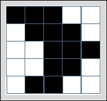
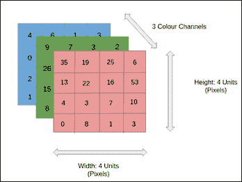
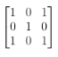
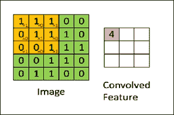

# 第 4 章卷积神经网络

在本章中，我们将讨论 CNN，它们是深度学习的一部分。 CNN 在许多实际应用中取得了优异的成果，特别是在图像中的物体识别领域。我们将解释和实现 LeNet 架构（LeNet5），是第一个在经典 MNIST 数字分类系统上取得巨大成功的 CNN。我们还将分析 AlexNet，这是由 Alex Krizhevsky 发明的深度 CNN。我们将使用这些网络来引入转移学习，这是一种利用预先训练的神经网络的机器学习方法。我们还将介绍 VGG 架构，它通常用作对象识别的深度 CNN。这是由牛津大学着名的视觉几何组（VGG）开发的，它在 ImageNet 数据集上的表现非常好。这种架构让我们有机会展示如何使用神经网络以某种艺术风格（艺术风格学习）绘制图画。

我们将转向 Inception-v3 模型，该模型使用 2012 年竞赛的数据为 ImageNet 大规模视觉识别挑战赛（ILSVRC）而创建。这是计算机视觉中的标准任务，其中模型尝试对 1000 个不同类别的 1.2M 图像进行分类。我们将演示如何在 TensorFlow 中使用 Inception 训练自己的图像分类器。最后一个例子取自  Kaggle 平台。这里的目的是在一系列面部图像上训练网络，以对他们的情感延伸进行分类。我们将评估模型的准确率，然后在不属于原始数据集的单个图像上对其进行测试。本章涉及的主题如下：

*   CNN 的主要概念
*   CNN 正在行动中
*   LeNet 和 MNIST 分类问题
*   AlexNet 和转学习
*   VGG 和艺术风格的学习
*   Inception-v3 模型
*   情感识别

# CNN 的主要概念

最近，深度神经网络（DNNs）有了新的推动研究，因此它们被广泛使用。 CNN 是一种特殊类型的 DNN，它们在图像分类问题上得到了很大的成功。在深入研究基于 CNN 的图像分类器的实现之前，我们将介绍图像识别中的一些基本概念，例如特征检测和卷积。

在计算机视觉中，众所周知，真实图像与网格相关联，它们由称为像素的大量小方块组成。下图表示与 5×5 像素网格相关的黑白图像：

图 1：黑白图像的像素视图。

网格中的每个元素对应于一个像素。在黑白图像的情况下，值 1 与黑色相关联，值 0 与白色相关联。或者，对于灰度图像，每个网格元素的允许值在[0,255]范围内，其中 0 与黑色相关联，255 与白色相关联。

最后，彩色图像由一组三个矩阵表示，每个矩阵对应于一个颜色通道（红色，绿色和蓝色）。每个矩阵的每个元素可以在 0 到 255 的间隔内变化，其指定基本颜色（或基色）的亮度。如下图所示，其中每个矩阵为 4×4，颜色通道数为 3：

图 2：彩色图像

现在让我们将专注于黑白图像 5×5 矩阵。假设我们在图像矩阵的宽度和高度上滑动第二个较低维度的矩阵，例如 3×3 矩阵（见下图）：

图 3：内核过滤器

该流动矩阵称为核心滤波器或特征检测器。当内核过滤器沿着输入矩阵（或输入图像）移动时，它执行内核值和应用它的矩阵部分的值的标量积。结果是一个称为卷积矩阵的新矩阵。

下图显示了卷积过程：卷积运算产生卷积特征（得到的 3×3 矩阵），在输入图像（5×5 矩阵）上流动内核滤波器（3×3 矩阵）：

图 4：输入图像（左边的矩阵 5×5），内核滤波器（输入图像上的矩阵 3×3）和卷积特征（右边的矩阵 3×3）