# 五、使用 TensorFlow 实现自编码器

训练自编码器是一个简单的过程。它是一个 NN，其输出与其输入相同。有一个输入层，后面是几个隐藏层，然后在一定深度之后，隐藏层遵循反向架构，直到我们到达最终层与输入层相同的点。我们将数据传递到我们希望学习嵌入的网络中。

在此示例中，我们使用来自 MNIST 数据集的图像作为输入。我们通过导入所有主库来开始实现：

```py
import tensorflow as tf
import numpy as np
import matplotlib.pyplot as plt
```

然后我们准备 MNIST 数据集。我们使用 TensorFlow 中的内置`input_data`类来加载和设置数据。此类确保下载和预处理数据以供自编码器使用。因此，基本上，我们根本不需要进行任何特征工程：

```py
from tensorflow.examples.tutorials.mnist import input_data
mnist = input_data.read_data_sets("MNIST_data/",one_hot=True)
```

在前面的代码块中，`one_hot=True`参数确保所有特征都是热编码的。单热编码是一种技术，通过该技术将分类变量转换为可以馈入 ML 算法的形式。

接下来，我们配置网络参数：

```py
learning_rate = 0.01
training_epochs = 20
batch_size = 256
display_step = 1
examples_to_show = 20
```

输入图像的大小如下：

```py
n_input = 784
```

隐藏层的大小如下：

```py
n_hidden_1 = 256
n_hidden_2 = 128
```

最终尺寸对应于`28×28 = 784`像素。

我们需要为输入图像定义占位符变量。该张量的数据类型设置为`float`，因为`mnist`值的比例为[0,1]，形状设置为`[None, n_input]`。定义`None`参数意味着张量可以包含任意数量的图像：

```py
X = tf.placeholder("float", [None, n_input])
```

然后我们可以定义网络的权重和偏置。`weights`数据结构包含编码器和解码器的权重定义。请注意，使用`tf.random_normal`选择权重，它返回具有正态分布的随机值：

```py
weights = {
    'encoder_h1': tf.Variable\
    (tf.random_normal([n_input, n_hidden_1])),
    'encoder_h2': tf.Variable\
    (tf.random_normal([n_hidden_1, n_hidden_2])),
    'decoder_h1': tf.Variable\
    (tf.random_normal([n_hidden_2, n_hidden_1])),
    'decoder_h2': tf.Variable\
    (tf.random_normal([n_hidden_1, n_input])),
}
```

同样，我们定义了网络的偏置：

```py
biases = {
    'encoder_b1': tf.Variable\
    (tf.random_normal([n_hidden_1])),
    'encoder_b2': tf.Variable\
    (tf.random_normal([n_hidden_2])),
    'decoder_b1': tf.Variable\
    (tf.random_normal([n_hidden_1])),
    'decoder_b2': tf.Variable\
    (tf.random_normal([n_input])),
}
```

我们将网络建模分为两个互补的完全连接的网络：编码器和解码器。编码器对数据进行编码；它从 MNIST 数据集中输入图像`X`，并执行数据编码：

```py
encoder_in = tf.nn.sigmoid(tf.add\
                           (tf.matmul(X, \
                                      weights['encoder_h1']),\
                            biases['encoder_b1']))
```

输入数据编码只是矩阵乘法运算。使用矩阵乘法将维度 784 的输入数据`X`减少到较低维度 256：

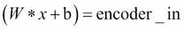

这里，`W`是权重张量，`encoder_h1`，`b`是偏置张量，`encoder_b1`。通过这个操作，我们将初始图像编码为自编码器的有用输入。编码过程的第二步包括数据压缩。输入`encoder_in`张量表示的数据通过第二个矩阵乘法运算减小到较小的大小：

```py
encoder_out = tf.nn.sigmoid(tf.add\
                            (tf.matmul(encoder_in,\
                                       weights['encoder_h2']),\
                            biases['encoder_b2']))
```

然后将尺寸 256 的输入数据`encoder_in`压缩到 128 的较小张量：

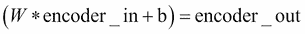

这里，`W`代表权重张量`encoder_h2`，而`b`代表偏差张量，`encoder_b2`。请注意，我们使用 sigmoid 作为编码器阶段的激活函数。

解码器执行编码器的逆操作。它解压缩输入以获得相同大小的网络输入的输出。该过程的第一步是将大小为 128 的`encoder_out`张量转换为 256 大小的中间表示的张量：

```py
decoder_in = tf.nn.sigmoid(tf.add\
                           (tf.matmul(encoder_out,\
                                      weights['decoder_h1']),\
                            biases['decoder_b1']))
```

在公式中，它意味着：

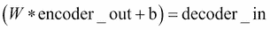

这里，`W`是权重张量，`decoder_h1`，大小`256×128`，`b`是偏置张量，`decoder_b1`，大小 256。最终解码操作是将数据从其中间表示（大小为 256）解压缩到最终表示（维度 784），这是原始数据的大小：

```py
decoder_out = tf.nn.sigmoid(tf.add\
                            (tf.matmul(decoder_in,\
                                       weights['decoder_h2']),\
                             biases['decoder_b2']))
```

`y_pred`参数设置为`decoder_out`：

```py
y_pred = decoder_out
```

网络将了解输入数据`X`是否等于解码数据，因此我们定义以下内容：

```py
y_true = X
```

自编码器的要点是创建一个擅长重建原始数据的缩减矩阵。因此，我们希望最小化`cost`函数。然后我们将`cost`函数定义为`y_true`和`y_pred`之间的均方误差：

```py
cost = tf.reduce_mean(tf.pow(y_true - y_pred, 2))
```

为了优化`cost`函数，我们使用以下`RMSPropOptimizer`类：

```py
optimizer = tf.train.RMSPropOptimizer(learning_rate).minimize(cost)
```

然后我们准备启动会话：

```py
init = tf.global_variables_initializer()
with tf.Session() as sess:
    sess.run(init)
```

我们需要设置批量图像的大小来训练网络：

```py
    total_batch = int(mnist.train.num_examples/batch_size)
```

从训练周期开始（`training_epochs`的数量设置为`10`）：

```py
    for epoch in range(training_epochs):
```

循环遍历所有批次：

```py
        for i in range(total_batch):
            batch_xs, batch_ys =\
                      mnist.train.next_batch(batch_size)
```

然后我们运行优化程序，用批量集`batch_xs`提供执行图：

```py
            _, c = sess.run([optimizer, cost],\
                            feed_dict={X: batch_xs})
```

接下来，我们显示每个`epoch`步骤的结果：

```py
        if epoch % display_step == 0:
            print(„Epoch:", ‚%04d' % (epoch+1),
                  „cost=", „{:.9f}".format(c))
    print("Optimization Finished!")
```

最后，我们使用编码或解码程序测试模型  。我们为模型提供图像子集，其中`example_to_show`的值设置为`4`：

```py
    encode_decode = sess.run(
        y_pred, feed_dict=\
        {X: mnist.test.images[:examples_to_show]})
```

我们使用 Matplotlib 比较原始图像和它们的重建：

```py
    f, a = plt.subplots(2, 10, figsize=(10, 2))
    for i in range(examples_to_show):
        a[0][i].imshow(np.reshape(mnist.test.images[i], (28, 28)))
        a[1][i].imshow(np.reshape(encode_decode[i], (28, 28)))
    f.show()
    plt.draw()
    plt.show()
```

当我们运行会话时，我们应该有这样的输出：

```py
Extracting MNIST_data/train-images-idx3-ubyte.gz
Extracting MNIST_data/train-labels-idx1-ubyte.gz
Extracting MNIST_data/t10k-images-idx3-ubyte.gz
Extracting MNIST_data/t10k-labels-idx1-ubyte.gz
Epoch: 0001 cost= 0.208461761
Epoch: 0002 cost= 0.172908291
Epoch: 0003 cost= 0.153524384
Epoch: 0004 cost= 0.144243762
Epoch: 0005 cost= 0.137013704
Epoch: 0006 cost= 0.127291277
Epoch: 0007 cost= 0.125370100
Epoch: 0008 cost= 0.121299766
Epoch: 0009 cost= 0.111687921
Epoch: 0010 cost= 0.108801551
Epoch: 0011 cost= 0.105516203
Epoch: 0012 cost= 0.104304880
Epoch: 0013 cost= 0.103362709
Epoch: 0014 cost= 0.101118311
Epoch: 0015 cost= 0.098779991
Epoch: 0016 cost= 0.095374011
Epoch: 0017 cost= 0.095469855
Epoch: 0018 cost= 0.094381645
Epoch: 0019 cost= 0.090281256
Epoch: 0020 cost= 0.092290156
Optimization Finished!
```

然后我们显示结果。第一行是原始图像，第二行是解码图像：

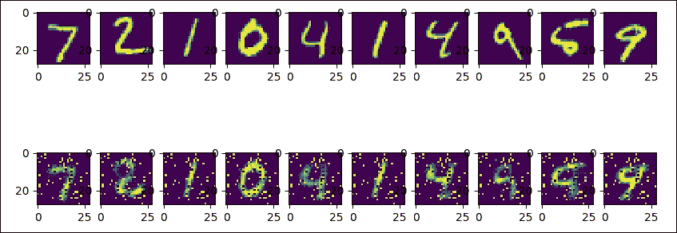

图 4：原始和解码的 MNIST 图像

如你所见，第二个与原来的不同（它似乎仍然是数字二，就像三个一样）。我们可以增加周期数或更改网络参数以改善结果。

# 提高自编码器的鲁棒性

我们可以用来改善模型稳健性的成功策略，是在编码阶段引入噪声。我们将去噪自编码器称为自编码器的随机版本；在去噪自编码器中，输入被随机破坏，但相同输入的未破坏版本被用作解码阶段的目标。

直觉上，  去噪自编码器做了两件事：首先，它试图对输入进行编码，保留相关信息；然后，它试图消除应用于同一输入的腐败过程的影响。在下一节中，我们将展示一个去噪自编码器的实现。

## 实现去噪自编码器

网络架构非常简单。 784 像素的输入图像被随机破坏，然后通过编码网络层进行尺寸缩减。图像尺寸从 784 减少到 256 像素。

在解码阶段，我们准备网络输出，将图像大小返回到 784 像素。像往常一样，我们开始将所有必要的库加载到我们的实现中：

```py
import numpy as np
import tensorflow as tf
import matplotlib.pyplot as plt
from tensorflow.examples.tutorials.mnist import input_data
```

然后我们设置基本的网络参数：

```py
n_input    = 784
n_hidden_1 = 1024
n_hidden_2 = 2048
n_output   = 784
```

我们设置会话的参数：

```py
epochs     = 100
batch_size = 100
disp_step  = 10
```

我们构建训练和测试集。我们再次使用从`tensorflow.examples.tutorials.mnist`导入的`input_data`函数：

```py
print ("PACKAGES LOADED")
mnist = input_data.read_data_sets('data/', one_hot=True)
trainimg   = mnist.train.images
trainlabel = mnist.train.labels
testimg    = mnist.test.images
testlabel  = mnist.test.labels
print ("MNIST LOADED")
```

让我们为输入图像定义一个占位符变量。数据类型设置为`float`，形状设置为`[None, n_input]`。`None`参数表示张量可以保持任意数量的图像，每个图像的大小为`n_input`：

```py
x = tf.placeholder("float", [None, n_input])
```

接下来，我们有一个占位符变量，用于与在占位符变量`x`中输入的图像相关联的真实标签。这个占位符变量的形状是`[None, n_output]`，这意味着它可以包含任意数量的标签，并且每个标签都是长度为`n_output`的向量，在这种情况下为`10`：

```py
y = tf.placeholder("float", [None, n_output])
```

为了减少过拟合，我们在编码和解码过程之前应用一个丢弃，因此我们必须定义一个占位符，以便在丢弃期间保持神经元输出的概率：

```py
dropout_keep_prob = tf.placeholder("float")
```

在这些定义中，我们修正了权重和网络偏差：

```py
weights = {
    'h1': tf.Variable(tf.random_normal([n_input, n_hidden_1])),
    'h2': tf.Variable(tf.random_normal([n_hidden_1, n_hidden_2])),
    'out': tf.Variable(tf.random_normal([n_hidden_2, n_output]))
}
biases = {
    'b1': tf.Variable(tf.random_normal([n_hidden_1])),
    'b2': tf.Variable(tf.random_normal([n_hidden_2])),
    'out': tf.Variable(tf.random_normal([n_output]))
}
```

使用`tf.random_normal`选择`weights`和`biases`值，它返回具有正态分布的随机值。编码阶段将来自 MNIST 数据集的图像作为输入，然后通过应用矩阵乘法运算来执行数据压缩：

```py
encode_in = tf.nn.sigmoid\
          (tf.add(tf.matmul\
                  (x, weights['h1']),\
                  biases['b1']))
encode_out = tf.nn.dropout\
             (encode_in, dropout_keep_prob)
```

在解码阶段，我们应用相同的过程：

```py
decode_in = tf.nn.sigmoid\
          (tf.add(tf.matmul\
                  (encode_out, weights['h2']),\
                  biases['b2']))
```

过拟合的减少是通过丢弃程序来完成的：

```py
decode_out = tf.nn.dropout(decode_in,\
                           dropout_keep_prob)
```

最后，我们准备构建预测张量，`y_pred`：

```py
y_pred = tf.nn.sigmoid\
         (tf.matmul(decode_out,\
                    weights['out']) +\
          biases['out'])
```

然后我们定义一个成本度量，  用于指导变量优化过程：

```py
cost = tf.reduce_mean(tf.pow(y_pred - y, 2))
```

我们将使用`RMSPropOptimizer`类最小化`cost`函数：

```py
optimizer = tf.train.RMSPropOptimizer(0.01).minimize(cost)
```

最后，我们可以按如下方式初始化已定义的变量：

```py
init = tf.global_variables_initializer()
```

然后我们设置 TensorFlow 的运行会话：

```py
with tf.Session() as sess:
    sess.run(init)
    print ("Start Training")
    for epoch in range(epochs):
        num_batch  = int(mnist.train.num_examples/batch_size)
        total_cost = 0.
        for i in range(num_batch):
```

对于每个训练周期，我们从训练数据集中选择一个较小的批次集：

```py
            batch_xs, batch_ys = \
                      mnist.train.next_batch(batch_size)
```

这是焦点。我们使用之前导入的 NumPy 包中的`randn`函数随机破坏`batch_xs`集：

```py
            batch_xs_noisy = batch_xs + \
                             0.3*np.random.randn(batch_size, 784)
```

我们使用这些集来提供执行图，然后运行会话（`sess.run`）：

```py
            feeds = {x: batch_xs_noisy,\
                     y: batch_xs, \
                     dropout_keep_prob: 0.8}
            sess.run(optimizer, feed_dict=feeds)
            total_cost += sess.run(cost, feed_dict=feeds)
```

每十个周期，将显示平均成本值：

```py
        if epoch % disp_step == 0:
            print("Epoch %02d/%02d average cost: %.6f"
                   % (epoch, epochs, total_cost/num_batch))
```

最后，我们开始测试训练有素的模型：

```py
            print("Start Test")
```

为此，我们从测试集中随机选择一个图像：

```py
            randidx   = np.random.randint\
                               (testimg.shape[0], size=1)
            orgvec    = testimg[randidx, :]
            testvec   = testimg[randidx, :]
            label     = np.argmax(testlabel[randidx, :], 1)
            print("Test label is %d" % (label))
            noisyvec = testvec + 0.3*np.random.randn(1, 784)
```

然后我们在选定的图像上运行训练模型：

```py
            outvec = sess.run(y_pred,\
                              feed_dict={x: noisyvec,\
                                         dropout_keep_prob: 1})
```

正如我们将看到的，以下`plotresult`函数将显示原始图像，噪声图像和预测图像：

```py
            plotresult(orgvec,noisyvec,outvec)
            print("restart Training")
```

当我们运行会话时，我们应该看到如下结果：

```py
PACKAGES LOADED
Extracting data/train-images-idx3-ubyte.gz
Extracting data/train-labels-idx1-ubyte.gz
Extracting data/t10k-images-idx3-ubyte.gz
Extracting data/t10k-labels-idx1-ubyte.gz
MNIST LOADED
Start Training
```

为简洁起见，我们仅报告了 100 个周期后的结果：

```py
Epoch 100/100 average cost: 0.212313
Start Test
Test label is 6
```

这些是原始图像和噪声图像（如您所见，数字 6）：

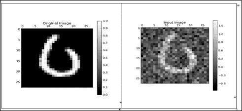

图 5：原始图像和噪声图像

这是一个严格重建的图像：

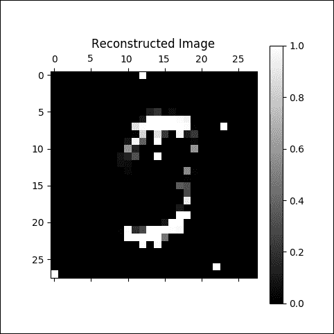

图 6：严重重建的图像

在 100 个周期之后，我们有了更好的结果：

```py
Epoch 100/100 average cost: 0.018221
Start Test
Test label is 5
```

这是原版和噪声图像：

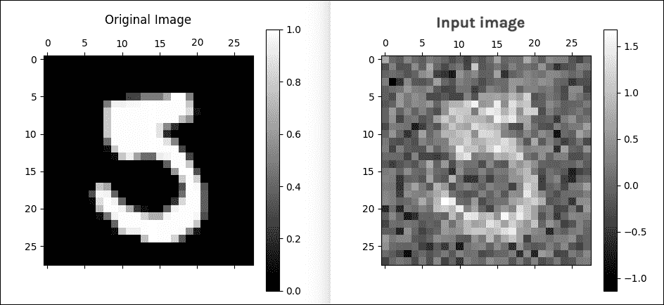

图 7：原始图像和噪声图像

这是一个很好的重建图像：

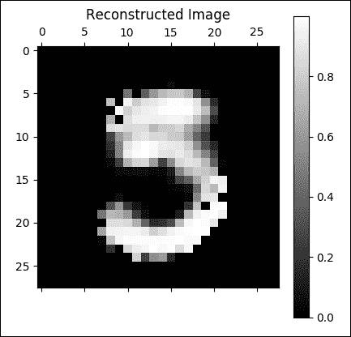

图 8：良好的重建图像

## 实现卷积自编码器

到目前为止，我们已经看到自编码器输入是图像。因此，有必要问一下卷积架构是否可以在我们之前展示的自编码器架构上更好地工作。我们将分析编码器和解码器在卷积自编码器中的工作原理。

### 编码器

编码器由三个卷积层组成。特征数量从输入数据 1 变为第一卷积层的 16；然后，第二层从 16 到 32；最后，从最后一个卷积层的 32 到 64。从卷积层移动到另一个层时，形状经历图像压缩：

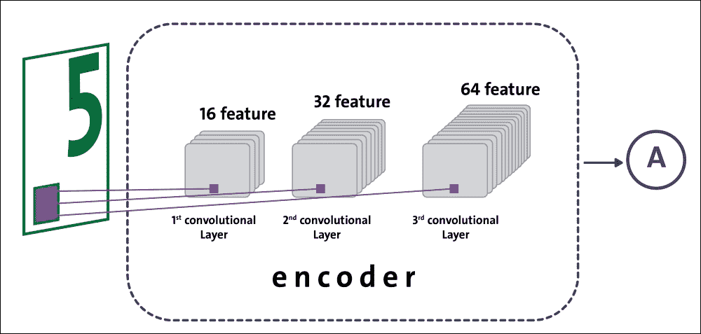

图 9：编码阶段的数据流

### 解码器

解码器由三个依次排列的反卷积层组成。对于每个反卷积操作，我们减少特征的数量以获得必须与原始图像大小相同的图像。除了减少特征数量外，反卷积还可以转换图像的形状：

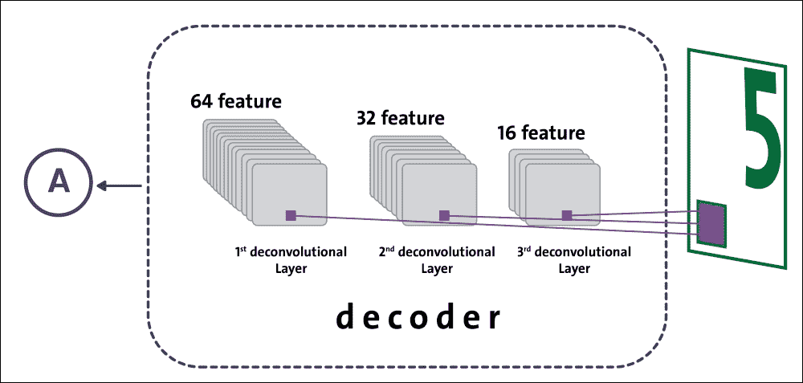

图 10：解码阶段的数据流

我们已经准备好了解如何实现卷积自编码器；第一个实现步骤是加载基本库：

```py
import matplotlib.pyplot as plt
import numpy as np
import math
import tensorflow as tf
import tensorflow.examples.tutorials.mnist.input_data as input_data
```

然后我们构建训练和测试集：

```py
mnist = input_data.read_data_sets("data/", one_hot=True)
trainings   = mnist.train.images
trainlabels = mnist.train.labels
testings    = mnist.test.images
testlabels  = mnist.test.labels
ntrain      = trainings.shape[0]
ntest       = testings.shape[0]
dim         = trainings.shape[1]
nout        = trainlabels.shape[1]
```

我们需要为输入图像定义占位符变量：

```py
x = tf.placeholder(tf.float32, [None, dim])
```

数据类型设置为`float32`，形状设置为`[None, dim]`，其中`None`表示张量可以保持任意数量的图像，每个图像是长度为`dim`的向量。接下来，我们为输出图像提供占位符变量。此变量的形状设置为`[None, dim]`与输入形状相同：

```py
y = tf.placeholder(tf.float32, [None, dim])
```

然后我们定义`keepprob`变量，[用于配置在网络训练期间使用的丢弃率](https://www.tensorflow.org/tutorials/layers#dropout)：

```py
keepprob = tf.placeholder(tf.float32)
```

此外，我们必须定义每个网络层中的节点数：

```py
n1 = 16
n2 = 32
n3 = 64
ksize = 5
```

网络总共包含六层。前三层是卷积的，属于编码阶段，而后三层是解卷积的，是解码阶段的一部分：

```py
weights = {
    'ce1': tf.Variable(tf.random_normal\
                       ([ksize, ksize, 1, n1],stddev=0.1)),
    'ce2': tf.Variable(tf.random_normal\
                       ([ksize, ksize, n1, n2],stddev=0.1)),
    'ce3': tf.Variable(tf.random_normal\
                       ([ksize, ksize, n2, n3],stddev=0.1)),
    'cd3': tf.Variable(tf.random_normal\
                       ([ksize, ksize, n2, n3],stddev=0.1)),
    'cd2': tf.Variable(tf.random_normal\
                       ([ksize, ksize, n1, n2],stddev=0.1)),
    'cd1': tf.Variable(tf.random_normal\
                       ([ksize, ksize, 1, n1],stddev=0.1))
}

biases = {
    'be1': tf.Variable\
    (tf.random_normal([n1], stddev=0.1)),
    'be2': tf.Variable\
    (tf.random_normal([n2], stddev=0.1)),
    'be3': tf.Variable\
    (tf.random_normal([n3], stddev=0.1)),
    'bd3': tf.Variable\
    (tf.random_normal([n2], stddev=0.1)),
    'bd2': tf.Variable\
    (tf.random_normal([n1], stddev=0.1)),
    'bd1': tf.Variable\
    (tf.random_normal([1],  stddev=0.1))
}
```

以下函数`cae`构建卷积自编码器：传递的输入是图像，`_X`;数据结构权重和偏置，`_W`和`_b`;和`_keepprob`参数：

```py
def cae(_X, _W, _b, _keepprob):
```

最初的 784 像素图像必须重新整形为`28×28`矩阵，随后由下一个卷积层处理：

```py
    _input_r = tf.reshape(_X, shape=[-1, 28, 28, 1])
```

第一个卷积层是`_ce1`。相对于输入图像，它有`_input_r`张量作为输入：

```py
    _ce1 = tf.nn.sigmoid\
           (tf.add(tf.nn.conv2d\
                   (_input_r, _W['ce1'],\
                    strides=[1, 2, 2, 1],\
                    padding='SAME'),\
                   _b['be1']))
```

在移动到第二个卷积层之前，我们应用了丢弃操作：

```py
    _ce1 = tf.nn.dropout(_ce1, _keepprob)
```

在下面的两个编码层中，我们应用相同的卷积和丢弃操作：

```py
    _ce2 = tf.nn.sigmoid\
           (tf.add(tf.nn.conv2d\
                   (_ce1, _W['ce2'],\
                    strides=[1, 2, 2, 1],\
                    padding='SAME'),\
                   _b['be2']))
    _ce2 = tf.nn.dropout(_ce2, _keepprob)
    _ce3 = tf.nn.sigmoid\
           (tf.add(tf.nn.conv2d\
                   (_ce2, _W['ce3'],\
                    strides=[1, 2, 2, 1],\
                    padding='SAME'),\
                   _b['be3']))
    _ce3 = tf.nn.dropout(_ce3, _keepprob)
```

特征数量从 1（输入图像）增加到 64，而原始形状图像已减少到`28×28`到`7×7`。在解码阶段，压缩（或编码）和重新成形的图像必须为尽可能与原始图像相似。为实现这一目标，我们在接下来的三个层中使用了`conv2d_transpose` TensorFlow 函数：

```py
tf.nn.conv2d_transpose(value, filter, output_shape, strides, padding='SAME')
```

这种操作有时是  ，称为反卷积；它只是`conv2d`的梯度。该函数的参数如下：

*   `value`：`float`型和形状`[batch, height, width, in_channels]`的 4D 张量。
*   `filter`：与`value`和形状`[height, width, output_channels, in_channels]`具有相同类型的 4D 张量。`in_channels`维度必须与值匹配。
*   `output_shape`：表示去卷积操作的输出形状的 1D 张量。
*   `strides`：整数列表。输入张量的每个维度的滑动窗口的步幅。
*   `padding`：一个有效的字符串或`SAME`。

`conv2d_transpose`函数将返回与`value`参数类型相同的张量。第一个去卷积层`_cd3`具有卷积层`_ce3`作为输入。它返回`_cd3`张量，其形状为`(1,7,7,32)`：

```py
    _cd3 = tf.nn.sigmoid\
           (tf.add(tf.nn.conv2d_transpose\
                   (_ce3, _W['cd3'],\
                    tf.stack([tf.shape(_X)[0], 7, 7, n2]),\
                    strides=[1, 2, 2, 1],\
                    padding='SAME'),\
                   _b['bd3']))
    _cd3 = tf.nn.dropout(_cd3, _keepprob)
```

对于第二个去卷积层`_cd2`，我们将反卷积层`_cd3`作为输入传递。它返回`_cd2`张量，其形状为`(1,14,14,16)`：

```py
    _cd2 = tf.nn.sigmoid\
           (tf.add(tf.nn.conv2d_transpose\
                   (_cd3, _W['cd2'],\
                    tf.stack([tf.shape(_X)[0], 14, 14, n1]),\
                    strides=[1, 2, 2, 1],\
                    padding='SAME'),\
                   _b['bd2']))
    _cd2 = tf.nn.dropout(_cd2, _keepprob)
```

第三个也是最后一个反卷积层`_cd1`将`_cd2`层作为输入传递。它返回结果`_out`张量，其形状为`(1,28,28,1)`，与输入图像相同：

```py
    _cd1 = tf.nn.sigmoid\
           (tf.add(tf.nn.conv2d_transpose\
                   (_cd2, _W['cd1'],\
                    tf.stack([tf.shape(_X)[0], 28, 28, 1]),\
                    strides=[1, 2, 2, 1],\
                    padding='SAME'),\
                   _b['bd1']))
    _cd1 = tf.nn.dropout(_cd1, _keepprob)
    _out = _cd1
    return _out
```

然后我们将成本函数定义为`y`和`pred`之间的均方误差：

```py
pred = cae(x, weights, biases, keepprob)
cost = tf.reduce_sum\
       (tf.square(cae(x, weights, biases, keepprob)\
                  - tf.reshape(y, shape=[-1, 28, 28, 1])))
learning_rate = 0.001
```

为了优化成本，我们将使用`AdamOptimizer`：

```py
optm = tf.train.AdamOptimizer(learning_rate).minimize(cost)
```

在下一步中，我们配置我们的网络来运行会话：

```py
init = tf.global_variables_initializer()
print ("Functions ready")
sess = tf.Session()
sess.run(init)
mean_img = np.zeros((784))
```

批次的大小设置为`128`：

```py
batch_size = 128
```

周期数是`50`：

```py
n_epochs   = 50
```

然后我们开始循环会话：

```py
for epoch_i in range(n_epochs):
```

对于每个周期，我们得到一个批量集`trainbatch`：

```py
    for batch_i in range(mnist.train.num_examples // batch_size):
        batch_xs, _ = mnist.train.next_batch(batch_size)
        trainbatch = np.array([img - mean_img for img in batch_xs])
```

我们应用随机噪声，就像去噪自编码器一样，来改善学习：

```py
        trainbatch_noisy = trainbatch + 0.3*np.random.randn(\
            trainbatch.shape[0], 784)
        sess.run(optm, feed_dict={x: trainbatch_noisy \
                                  , y: trainbatch, keepprob: 0.7})
        print ("[%02d/%02d] cost: %.4f" % (epoch_i, n_epochs \
        , sess.run(cost, feed_dict={x: trainbatch_noisy \
                                   , y: trainbatch, keepprob: 1.})))
```

对于每个训练周期，我们随机抽取五个训练样例：

```py
    if (epoch_i % 10) == 0:
        n_examples = 5
        test_xs, _ = mnist.test.next_batch(n_examples)
        test_xs_noisy = test_xs + 0.3*np.random.randn(
            test_xs.shape[0], 784)
```

然后我们在一个小子集上测试训练模型：

```py
        recon = sess.run(pred, feed_dict={x: test_xs_noisy,\
                                                   keepprob: 1.})
        fig, axs = plt.subplots(2, n_examples, figsize=(15, 4))
        for example_i in range(n_examples):
            axs[0][example_i].matshow(np.reshape(
                test_xs_noisy[example_i, :], (28, 28))
                , cmap=plt.get_cmap('gray'))
```

最后，我们可以使用 Matplotlib 显示输入和学习集：

```py
            axs[1][example_i].matshow(np.reshape(
                np.reshape(recon[example_i, ...], (784,))
                + mean_img, (28, 28)), cmap=plt.get_cmap('gray'))
            plt.show()
```

执行将产生以下输出：

```py
>>>
Extracting data/train-images-idx3-ubyte.gz
Extracting data/train-labels-idx1-ubyte.gz
Extracting data/t10k-images-idx3-ubyte.gz
Extracting data/t10k-labels-idx1-ubyte.gz
Packages loaded
Network ready
Functions ready
Start training..
[00/05] cost: 8049.0332
[01/05] cost: 3706.8667
[02/05] cost: 2839.9155
[03/05] cost: 2462.7021
[04/05] cost: 2391.9460
>>>
```

请注意，对于每个周期，我们将可视化输入集和先前显示的相应学习集。正如您在第一个周期所看到的，我们不知道哪些图像已被学习：

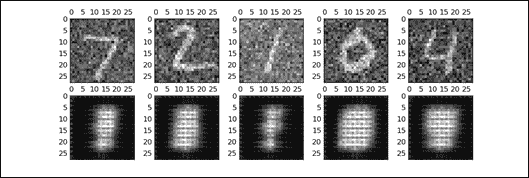

图 11：第一个周期图像

在第二个周期，  的想法变得更加清晰  ：

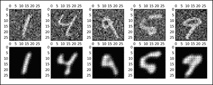

图 12：第二周期图像

这是第三个周期：

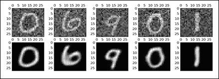

图 13：第三周期图像

在第四个周期再好一点：


图 14：第四周期图像

我们可能已经停止在上一个周期，但这是第五个也是最后一个周期：

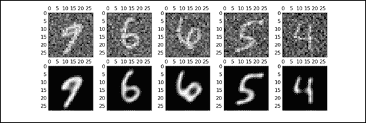

图 15：第五周期图像

到目前为止，我们已经看到了自编码器的不同实现以及改进版本。但是，将此技术应用于 MNIST 数据集并不能说明其真正的力量。因此，现在是时候看到一个更现实的问题，我们可以应用自编码器技术。

# 自编码器和欺诈分析

银行，保险公司和信用合作社等金融公司的欺诈检测和预防是一项重要任务。到目前为止，我们已经看到如何以及在何处使用深度神经网络（DNN）  和卷积神经网络（CNN）。

现在是时候使用其他无监督学习算法，如自编码器。在本节中，我们将探索信用卡交易的数据集，并尝试构建一个无监督的机器学习模型，该模型能够判断特定交易是欺诈性的还是真实的。

更具体地说，我们将使用自编码器预先训练分类模型并应用异常检测技术来预测可能的欺诈。在开始之前，我们需要知道数据集。

## 数据集的描述

对于这个例子，我们将使用来自 Kaggle 的信用卡欺诈检测数据集。数据集可以从[此链接](https://www.kaggle.com/hunk3749/credit-card/data)下载。由于我使用的是数据集，因此引用以下出版物时，最好是透明的：

Andrea Dal Pozzolo，Olivier Caelen，Reid A. Johnson 和 Gianluca Bontempi。用不平衡分类的欠采样校准概率。在计算智能和数据挖掘研讨会（CIDM），IEEE，2015 年。

该数据集包含 2013 年 9 月欧洲信用卡持有人在两天内进行的交易。共有 285,299 笔交易，只有 492 笔欺诈，这意味着数据集非常不平衡。正类（欺诈）占所有交易的 0.172%。

数据集包含数字输入变量，这些变量是 PCA 转换的结果。遗憾的是，由于机密性问题，我们无法提供有关数据的原始特征和更多背景信息。有 28 个特征，即`V1`，`V2`，... `V27`，它们是使用 PCA 获得的主要成分，除了`Time`和`Amount`特征。`Class`特征是响应变量，在欺诈情况下取值`1`，否则取`0`。

还有两个附加特征，`Time`和`Amount`。`Time`列表示每笔交易与第一笔交易之间的时间（以秒为单位），而`Amount`列表示此交易中转账的金额。那么，让我们看一下输入数据（仅显示`V1`，`V2`，`V26`和`V27`），如图 16 所示：

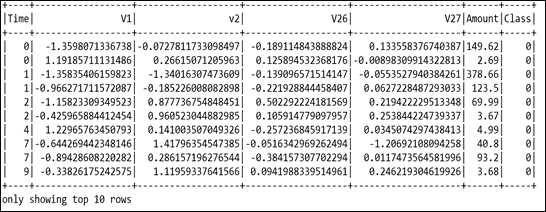

图 16：信用卡欺诈检测数据集的快照

## 问题描述

对于这个例子，我们将使用自编码器作为无监督的特征学习算法，该算法学习和概括训练数据共享的公共模式。在重建阶段，对于具有异常模式的数据点，RMSE 将更高。因此，这些数据点是异常值或异常值。我们的假设是，异常也等于我们所追求的欺诈性交易。

现在，在评估步骤中，我们可以根据验证数据选择 RMSE 的阈值，并将 RMSE 高于阈值的所有数据标记为欺诈。或者，如果我们认为 0.1% 的交易都是欺诈性的，我们也可以根据每个数据点（即 RMSE）的重建误差对数据进行排名，然后选择前 0.1% 为欺诈性交易。

给定类不平衡比，建议使用精确回忆曲线下面积（AUPRC）测量精度  ，因为混淆矩阵精度在不平衡分类中没有意义。在这种情况下，使用线性机器学习模型，例如随机森林，逻辑回归或支持向量机，通过应用上下采样技术，将是一个更好的主意。或者，我们可以尝试查找数据中的异常，因为我们假设数据集中只有少数欺诈案例，即异常。

在处理如此严重的响应标签不平衡时，我们在测量模型表现时也需要小心。只有少数欺诈性实例，因此将一切预测为非欺诈的模型将达到 99% 以上的准确率。然而，尽管它们具有高精度，但线性 ML 模型（甚至是树组合）并不一定能帮助我们找到欺诈性案例。

对于这个例子，我们将构建一个无监督的模型：该模型将接受正面和负面数据（欺诈和非欺诈）的训练，但不提供标签。由于我们有比欺诈更多的正常交易，我们应该期望该模型在训练后学习和记忆正常交易的模式，并且该模型应该能够为任何异常交易给出分数。

这种无监督的训练对于此目的非常有用，因为我们没有足够的标记数据。那么，让我们开始吧。

## 探索性数据分析

在我们实现模型之前，探索数据集将提供一些见解。我们首先导入所需的包和模块（包括此示例所需的其他包）和模块：

```py
import pandas as pd
import numpy as np
import tensorflow as tf
import os
from datetime import datetime
from sklearn.metrics import roc_auc_score as auc
import seaborn as sns # for statistical data visualization
import matplotlib.pyplot as plt
import matplotlib.gridspec as gridspec
```

### 提示

安装 seaborn

您可以通过多种方式安装`seaborn`，这是一个用于统计数据可视化的 Python 模块：

```py
$ sudo pip install seaborn # for Python 2.7
$ sudo pip3 install seaborn # for Python 3.x
$ sudo conda install seaborn # using conda
# Directly from GitHub (use pip for Python 2.7)
$ pip3 install git+https://github.com/mwaskom/seaborn.git

```

现在，[我假设您已经从上述 URL 下载了数据集](https://www.kaggle.com/hunk3749/credit-card/data)。下载附带一个名为`creditcard.csv`的 CSV 文件。

接下来，让我们阅读数据集并创建一个 pandas `DataFrame`：

```py
df = pd.read_csv('creditcard.csv')
print(df.shape)
>>>
(284807, 31)
```

因此，数据集具有关于  300,000 个事务，30 个特征和两个二元标签（即 0/1）。现在让我们看一下列名及其数据类型：

```py
print(df.columns)
>>>
Index(['Time', 'V1', 'V2', 'V3', 'V4', 'V5', 'V6', 'V7', 'V8', 'V9', 'V10', 'V11', 'V12', 'V13', 'V14', 'V15', 'V16', 'V17', 'V18', 'V19', 'V20', 'V21', 'V22', 'V23', 'V24', 'V25', 'V26', 'V27', 'V28', 'Amount', 'Class'],
  dtype='object')

print(df.dtypes)
>>>
Time      float64
V1        float64
V2        float64
V3        float64
…
V25       float64
V26       float64
V27       float64
V28       float64
Amount    float64
  Class     int64
```

现在让我们来看看数据集：

```py
print(df.head())
>>>
```

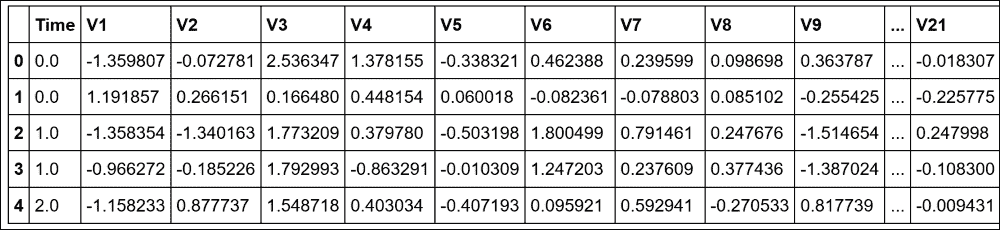

图 17：数据集的快照

现在让我们看看所有交易的时间跨度：

```py
print("Total time spanning: {:.1f} days".format(df['Time'].max() / (3600 * 24.0)))
>>>
Total time spanning: 2.0 days
```

现在让我们看看这些类的统计信息：

```py
print("{:.3f} % of all transactions are fraud. ".format(np.sum(df['Class']) / df.shape[0] * 100))
>>>
0.173 % of all transactions are fraud.
```

因此，我们只有少数欺诈交易。这在文献中也被称为罕见事件检测，并且意味着数据集高度不平衡。现在，让我们绘制前五个特征的直方图：

```py
plt.figure(figsize=(12,5*4))
gs = gridspec.GridSpec(5, 1)
for i, cn in enumerate(df.columns[:5]):
    ax = plt.subplot(gs[i])
    sns.distplot(df[cn][df.Class == 1], bins=50)
    sns.distplot(df[cn][df.Class == 0], bins=50)
    ax.set_xlabel('')
    ax.set_title('histogram of feature: ' + str(cn))
plt.show()
>>>
```

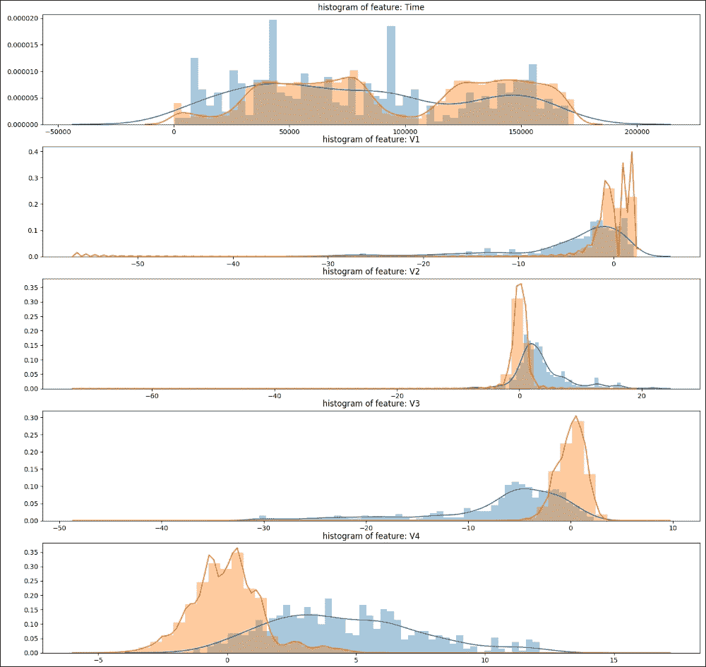

图 18：显示前五个特征的直方图

在前面的屏幕截图中，可以看出所有特征都是正偏差或负偏斜。此外，数据集没有很多特征，因此修剪尾部会丢失重要的信息。所以，暂时，让我们尽量不这样做，并使用所有特征。

## 训练，验证和测试集准备

让我们通过将数据分成训练，开发（也称为验证）和测试集来开始训练。我们首先使用 80% 的数据作为训练和验证集。剩余的 20% 将用作测试集：

```py
TEST_RATIO = 0.20
df.sort_values('Time', inplace = True)
TRA_INDEX = int((1-TEST_RATIO) * df.shape[0])
train_x = df.iloc[:TRA_INDEX, 1:-2].values
train_y = df.iloc[:TRA_INDEX, -1].values
test_x = df.iloc[TRA_INDEX:, 1:-2].values
test_y = df.iloc[TRA_INDEX:, -1].values
```

现在，让我们对前面的分裂进行统计：

```py
print("Total train examples: {}, total fraud cases: {}, equal to {:.5f} % of total cases. ".format(train_x.shape[0], np.sum(train_y), (np.sum(train_y)/train_x.shape[0])*100))

print("Total test examples: {}, total fraud cases: {}, equal to {:.5f} % of total cases. ".format(test_x.shape[0], np.sum(test_y), (np.sum(test_y)/test_y.shape[0])*100))

>>>
Total train examples: 227845, total fraud cases: 417, equal to 0.18302 % of total cases.
Total test examples: 56962, total fraud cases: 75, equal to 0.13167 % of total cases.
```

## 归一化

为了获得更好的预测准确率，我们可以考虑两种类型的标准化：z 得分和 min-max 缩放：

*   Z 得分：这将每列归一化为零均值并将其标准化。这特别适用于激活函数，例如 tanh，其输出零两侧的值。其次，这将留下极端值，因此在正常化之后会有一些极端。在这种情况下，这可能对检测异常值很有用。
*   最小 - 最大缩放：这确保所有值都在 0 和 1 之间，即正数。如果我们使用 sigmoid 作为输出激活，这是默认方法。

我们使用验证集来决定数据标准化方法和激活函数。根据实验，我们发现当与 z 得分标准化一起使用时，tanh 的表现略好于 sigmoid。因此，我们选择了 tanh，然后是 z 得分：

```py
cols_mean = []
cols_std = []

for c in range(train_x.shape[1]):
    cols_mean.append(train_x[:,c].mean())
    cols_std.append(train_x[:,c].std())
    train_x[:, c] = (train_x[:, c] - cols_mean[-1]) / cols_std[-1]
    test_x[:, c] =  (test_x[:, c] - cols_mean[-1]) / cols_std[-1]
```

## 作为无监督特征学习算法的自编码器

在本小节中，我们将看到如何使用自编码器作为无监督的特征学习算法。首先，让我们初始化网络超参数：

```py
learning_rate = 0.001
training_epochs = 1000
batch_size = 256
display_step = 10
n_hidden_1 = 15 # number of neurons is the num features
n_input = train_x.shape[1]
```

由于第一层和第二层分别包含 15 和 5 个神经元，我们正在构建这样的架构网络：28（输入）-> 15 -> 5 -> 15 -> 28（输出）。那么让我们构建我们的自编码器网络。

让我们创建一个 TensorFlow 占位符来保存输入：

```py
X = tf.placeholder("float", [None, n_input])
```

现在我们必须使用随机初始化创建偏差和权重向量：

```py
weights = {
    'encoder_h1': tf.Variable\
                  (tf.random_normal([n_input, n_hidden_1])),
    'decoder_h1': tf.Variable\
                  (tf.random_normal([n_hidden_1, n_input])),
}
biases = {
    'encoder_b1': tf.Variable(tf.random_normal([n_hidden_1])),
    'decoder_b1': tf.Variable(tf.random_normal([n_input])),
}
```

现在，我们构建一个简单的自编码器。这里我们有`encoder()`函数，它构造了编码器。我们使用`tanh`函数对隐藏层进行编码，如下所示：

```py
def encoder(x):
    layer_1 = tf.nn.tanh(tf.add\
              (tf.matmul(x, weights['encoder_h1']),\
              biases['encoder_b1']))
    return layer_1
```

这是`decoder()`函数，它构造了解码器。我们使用`tanh`函数解码隐藏层，如下所示：

```py
def decoder(x):
    layer_1 = tf.nn.tanh(tf.add\
              (tf.matmul(x, weights['decoder_h1']),\
              biases['decoder_b1']))
    return layer_1
```

之后，我们通过传递输入数据的 TensorFlow 占位符来构建模型。权重和偏置（NN 的`W`和`b`）包含我们将学习优化的网络的所有参数，如下所示：

```py
encoder_op = encoder(X)
decoder_op = decoder(encoder_op)
```

一旦我们构建了自编码器网络，就可以进行预测，其中目标是输入数据：

```py
y_pred = decoder_op
y_true = X
```

现在我们已经进行了预测，现在是时候定义`batch_mse`来评估表现：

```py
batch_mse = tf.reduce_mean(tf.pow(y_true - y_pred, 2), 1)
```

### 注意

未观测值的均方误差（MSE）是[平方误差](https://en.wikipedia.org/wiki/Errors_and_residuals)或[偏差](https://en.wikipedia.org/wiki/Deviation_(statistics))的[平均值](https://en.wikipedia.org/wiki/Expected_value)。从统计学的角度来看，  它是估计量质量的度量（它总是非负的，接近于零的值更好）。

如果`Y^`是 n 个预测的向量，并且`Y`是被预测变量的观测值的向量，则预测变量的样本内 MSE 计算如下：

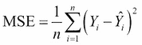

因此，MSE 是误差平方`(Y[i] - Y^[i])^2`的平均值`(1/n ∑[i])`。

我们在这里有另一个`batch_mse`将返回批量中所有输入数据的 RMSE，这是一个长度等于输入数据中行数的向量。如果您想要输入（无论是训练，验证还是测试数据），这些将是预测值或欺诈分数，我们可以在预测后提取出来。然后我们定义损失和优化器，并最小化平方误差：

```py
cost_op = tf.reduce_mean(tf.pow(y_true - y_pred, 2))
optimizer = tf.train.RMSPropOptimizer(learning_rate).minimize(cost_op)
```

每层所用的激活函数是`tanh`。这里的目标函数或成本测量一批中预测和输入数组的总 RMSE，这意味着它是一个标量。然后，每次我们想要进行批量更新时，我们都会运行优化器。

太棒了！我们准备开始训练了。但是，在此之前，让我们定义保存训练模型的路径：

```py
save_model = os.path.join(data_dir, 'autoencoder_model.ckpt')
saver = tf.train.Saver()
```

到目前为止，我们已经定义了许多变量以及超参数，因此我们必须初始化变量：

```py
init_op = tf.global_variables_initializer()
```

最后，我们开始训练。我们在训练周期中循环所有批次。然后我们运行优化操作和成本操作来获得损失值。然后我们显示每个周期步骤的日志。最后，我们保存训练有素的模型：

```py
epoch_list = []
loss_list = []
train_auc_list = []
data_dir = 'Training_logs/'
with tf.Session() as sess:
    now = datetime.now()
    sess.run(init_op)
    total_batch = int(train_x.shape[0]/batch_size)

    # Training cycle
    for epoch in range(training_epochs):
        # Loop over all batches
        for i in range(total_batch):
            batch_idx = np.random.choice(train_x.shape[0],\
                        batch_size)
            batch_xs = train_x[batch_idx]

            # Run optimization op (backprop) and
            # cost op (to get loss value)
            _, c = sess.run([optimizer, cost_op],\
                feed_dict={X: batch_xs})

        # Display logs per epoch step
        if epoch % display_step == 0:
            train_batch_mse = sess.run(batch_mse,\
                feed_dict={X: train_x})
            epoch_list.append(epoch+1)
            loss_list.append(c)
            train_auc_list.append(auc(train_y, train_batch_mse))
            print("Epoch:", '%04d,' % (epoch+1),
                  "cost=", "{:.9f},".format(c),
                  "Train auc=", "{:.6f},".format(auc(train_y, \
                  train_batch_mse)),
    print("Optimization Finished!")
    save_path = saver.save(sess, save_model)
    print("Model saved in: %s" % save_path)

save_model = os.path.join(data_dir, autoencoder_model_1L.ckpt')
saver = tf.train.Saver()
```

前面的代码段很简单。每次，我们从`train_x`中随机抽取 256 个小批量的小批量，作为`X`的输入将其输入模型，并运行优化器通过随机梯度下降更新参数  SGD）：

```py
>>>
Epoch: 0001, cost= 0.938937187, Train auc= 0.951383
Epoch: 0011, cost= 0.491790086, Train auc= 0.954131
…
Epoch: 0981, cost= 0.323749095, Train auc= 0.953185
Epoch: 0991, cost= 0.255667418, Train auc= 0.953107
Optimization Finished!
Model saved in: Training_logs/autoencoder_model.ckpt
Test auc score: 0.947296
```

我们在`train_x`上的估值得出的 AUC 得分约为 0.95。然而，从前面的日志中，很难理解训练的进展情况：

```py
# Plot Training AUC over time
plt.plot(epoch_list, train_auc_list, 'k--', label='Training AUC', linewidth=1.0)
plt.title('Training AUC per iteration')
plt.xlabel('Iteration')
plt.ylabel('Training AUC')
plt.legend(loc='upper right')
plt.grid(True)

# Plot train loss over time
plt.plot(epoch_list, loss_list, 'r--', label='Training loss', linewidth=1.0)
plt.title('Training loss')
plt.xlabel('Iteration')
plt.ylabel('Loss')
plt.legend(loc='upper right')
plt.grid(True)
plt.show()
>>>
```

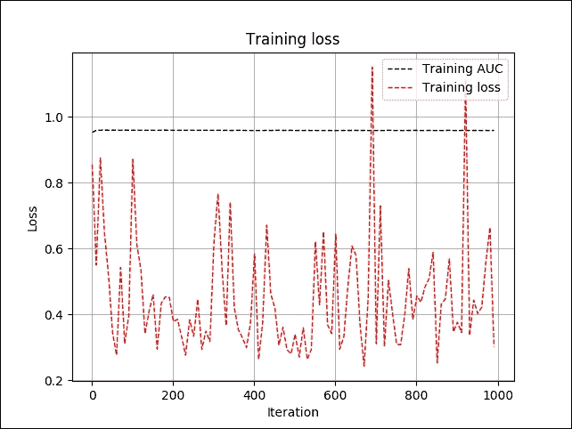

图 19：每次迭代的训练损失和 AUC

在上图中，我们可以看到训练误差有点颠簸，但训练 AUC 几乎保持稳定，约为 95%。这可能听起来很可疑。您还可以看到我们使用相同的数据进行训练和验证。这可能听起来很混乱，但等等！

由于我们正在进行无监督的训练，并且模型在训练期间从未看到标签，因此不会导致过拟合。此附加验证用于监视早期停止以及超参数调整。

## 评估模型

在训练完我们的自编码器模型和超参数后，我们可以在 20% 测试数据集上评估其表现，如下所示：

```py
save_model = os.path.join(data_dir, autoencoder_model.ckpt')
saver = tf.train.Saver()

# Initializing the variables
init = tf.global_variables_initializer()

with tf.Session() as sess:
    now = datetime.now()
    saver.restore(sess, save_model)
    test_batch_mse = sess.run(batch_mse, feed_dict={X: test_x})

    print("Test auc score: {:.6f}".format(auc(test_y, \
    test_batch_mse)))
```

在此代码中，我们重用了之前制作的训练模型。`test_batch_mse`是我们测试数据的欺诈分数：

```py
>>>
Test auc score: 0.948843
```

太棒了！我们训练有素的模型被证明是一个高度准确的模型，显示 AUC 约为 95%。现在我们已经看到了评估，一些可视化分析会很棒。你们觉得怎么样？让我们绘制非欺诈案件的欺诈分数（MSE）分布图。以下代码段执行此操作：

```py
plt.hist(test_batch_mse[test_y == 0.0], bins = 100)
plt.title("Fraud score (mse) distribution for non-fraud cases")
plt.xlabel("Fraud score (mse)") 
plt.show()
>>>
```

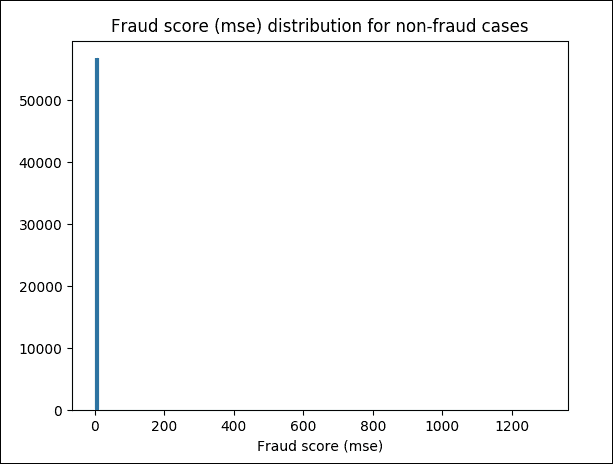

图 20：非欺诈案件的 MSE 欺诈评分

前面的屏幕截图是不可理解的，所以让我们将其缩放到`(0, 30)`范围并再次绘制图形：

```py
# Zoom into (0, 30) range
plt.hist(test_batch_mse[(test_y == 0.0) & (test_batch_mse < 30)], bins = 100)
plt.title("Fraud score (mse) distribution for non-fraud cases")
plt.xlabel("Fraud score (mse)")
plt.show()
>>>
```

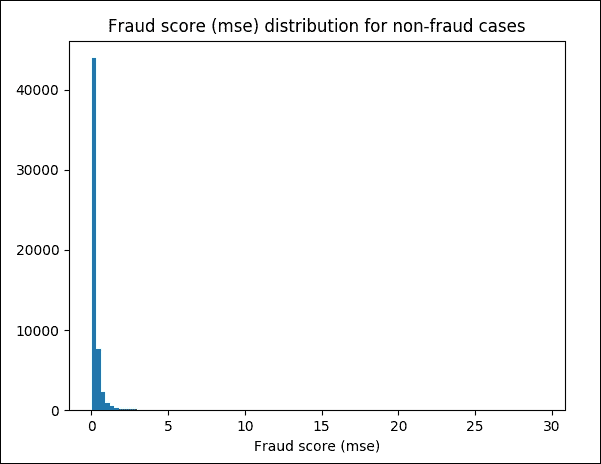

图 21：非欺诈案件的 MSE 欺诈评分，放大到`(0, 30)`范围

现在让我们只显示欺诈类：

```py
# Display only fraud classes
plt.hist(test_batch_mse[test_y == 1.0], bins = 100)plt.title("Fraud score (mse) distribution for fraud cases")
plt.xlabel("Fraud score (mse)")
plt.show()
>>>
```

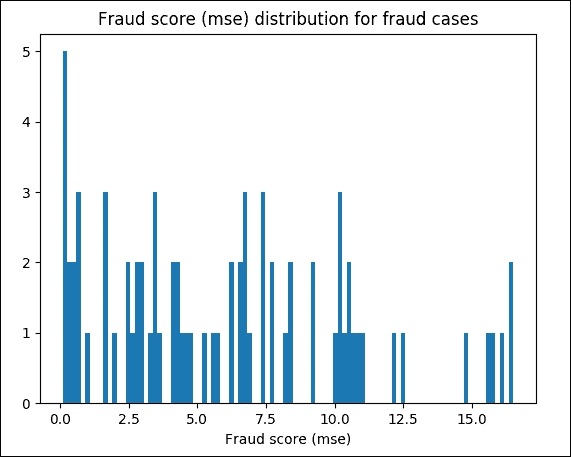

图 22：欺诈案件的 MSE 欺诈评分

最后，让我们看一下一些相关统计数据。例如，我们使用`10`作为检测阈值。现在我们可以计算高于阈值的检测到的病例数，高于阈值的阳性病例数，高于阈值的准确率百分比（即精确度），并将其与测试集中欺诈的平均百分比进行比较：

```py
threshold = 10
print("Number of detected cases above threshold: {}, \n\
Number of pos cases only above threshold: {}, \n\
The percentage of accuracy above threshold (Precision): {:0.2f}%. \n\
Compared to the average percentage of fraud in test set: 0.132%".format( \
np.sum(test_batch_mse > threshold), \
np.sum(test_y[test_batch_mse > threshold]), \
np.sum(test_y[test_batch_mse > threshold]) / np.sum(test_batch_mse > threshold) * 100))
>>>
Number of detected cases above threshold: 198,
Number of positive cases only above threshold: 18,
The percentage of accuracy above threshold (Precision): 9.09%.
Compared to the average percentage of fraud in test set: 0.132%
```

总而言之，对于我们的案例，只有一个隐藏层的自编码器足够（至少用于训练）。但是，您仍然可以尝试采用其他变体，例如解卷积自编码器和去噪自编码器来解决同样的问题。

# 总结

在本章中，我们实现了一些称为自编码器的优化网络。自编码器基本上是数据压缩网络模型。它用于将给定输入编码为较小维度的表示，然后可以使用解码器从编码版本重建输入。我们实现的所有自编码器都包含编码和解码部分。

我们还看到了如何通过在网络训练期间引入噪声和构建去噪自编码器来提高自编码器的表现。最后，我们应用第 4 章中介绍的 CNN 概念，卷积神经网络上的 TensorFlow 和卷积自编码器的实现。

即使隐藏单元的数量很大，我们仍然可以通过在网络上施加其他约束来使用自编码器发现数据集的有趣和隐藏结构。换句话说，如果我们对隐藏单元施加稀疏约束，那么即使隐藏单元的数量很大，自编码器仍将在数据中发现有趣的结构。为了证明这一观点，我们看到了一个真实的例子，即信用卡欺诈分析，我们成功应用了自编码器。

循环神经网络（RNN）是一类人工神经网络，其中单元之间的连接形成有向循环。 RNN 利用过去的信息，如时间序列预测。这样，他们就可以对具有高时间依赖性的数据进行预测。这创建了网络的内部状态，允许它展示动态时间行为。

在下一章中，我们将研究 RNN。我们将首先描述这些网络的基本原理，然后我们将实现这些架构的一些有趣示例。

