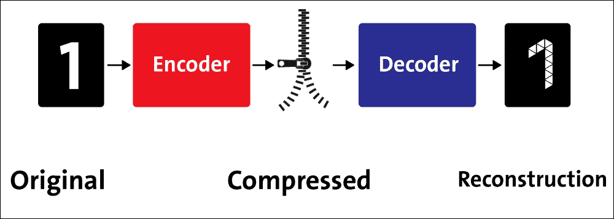
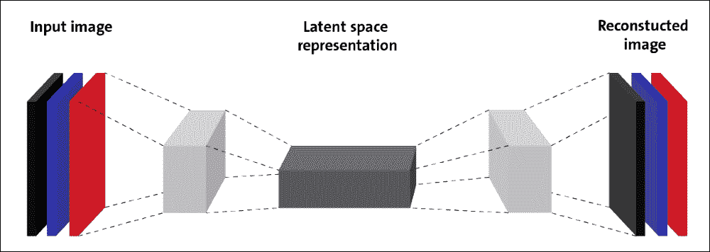
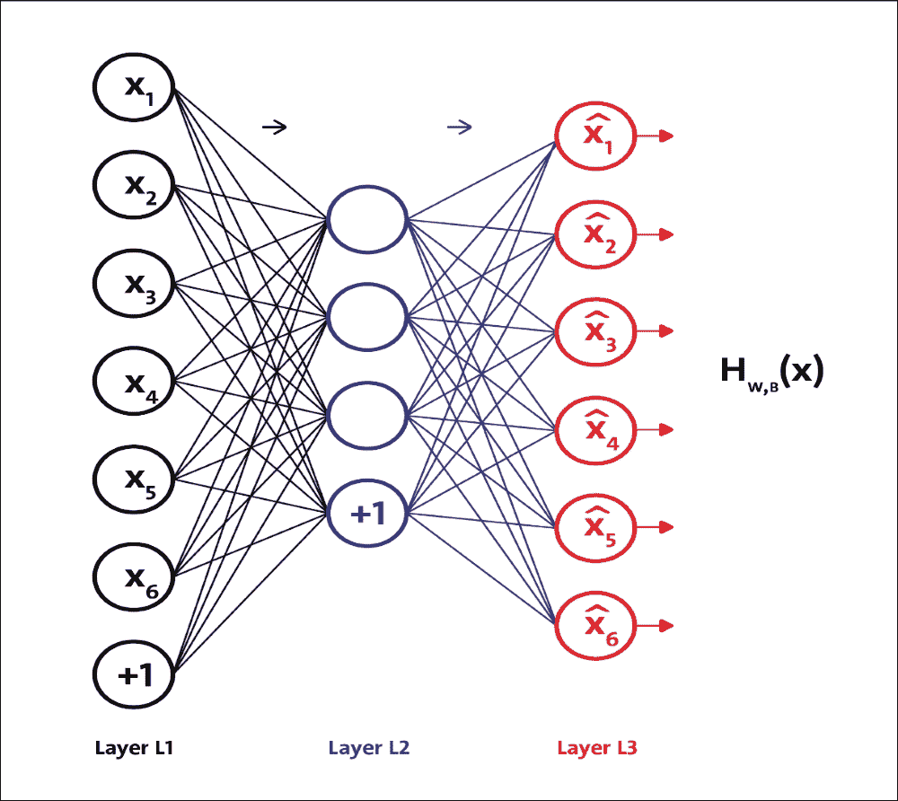

# 第 5 章优化 TensorFlow 自编码器

在机器学习（ML）中，所谓的维度诅咒是随着输入空间的增加而逐渐下降的表现，通常具有数百或数千个维度，这在低维度设置（例如三维）中不会发生空间。发生这种情况是因为获得输入空间的充分采样所需的样本数量随着维度的数量呈指数增长。为了克服这个问题，已经开发了一些优化网络。

第一个是自编码器网络。这些被设计和训练以转换输入模式本身，使得在存在降级或不完整版本的输入模式的情况下，可以获得原始模式。自编码器是神经网络（NN）。训练网络以创建输入数据，例如在入口处呈现的输出数据，并且隐藏层存储压缩数据。

第二个优化网络是玻尔兹曼机器（参见[第 3 章](../Text/ch03.html "Chapter 3. Feed-Forward Neural Networks with TensorFlow")，带有 TensorFlow 的前馈神经网络更多细节）。这种类型的网络由可见的输入/输出层和一个隐藏层组成。可见层和隐藏层之间的连接是非定向的 - 数据可以在两个方向上传播，可见 - 隐藏和隐藏 - 可见，并且不同的神经元单元可以完全连接或部分连接。

自编码器可以与主成分分析（PCA）进行比较（参考[此链接](https://en.wikipedia.org/wiki/Principal_component_analysis)），它用于使用比最初存在的维度更少的维度来表示给定输入。但是，在本章中，我们将只关注自编码器。

简而言之，本章将介绍以下主题：

*   自编码器如何工作？
*   如何实现自编码器
*   提高自编码器的鲁棒性
*   构建去噪自编码器
*   卷积自编码器
*   使用自编码器进行欺诈分析

# 自编码器如何工作？

自编码是一种数据压缩技术，其中压缩和解压缩函数是数据特定的，有损的，并且是从样本而不是人工制作的手动特征中自动学习的。另外，在几乎所有使用术语自编码器的上下文中，压缩和解压缩函数都是用 NN 实现的。

自编码器是具有三层或更多层的网络，其中输入层和输出层具有相同数量的神经元，并且那些中间（隐藏层）具有较少数量的神经元。对于每个输入数据，网络被训练为简单地再现输出，输入中的活动模式相同。

自编码器的一个显着方面是，由于隐藏层中神经元的数量较少，如果网络可以从示例中学习并推广到可接受的程度，它会执行数据压缩：隐藏神经元的状态为每个示例提供，输入和输出公共状态的压缩版本。

在这种网络的第一个例子中，在 20 世纪 80 年代中期，以这种方式获得了简单图像的压缩。一些作者已经开发出一种有效的策略来改善这种类型的网络中的学习过程（它们通常很慢并且并不总是有效），最近通过预学习程序恢复了对自编码器的兴趣，这提供了良好的初始条件。学习过程的权重。

自编码器的有用应用是数据去噪和降低数据可视化的维数。下图显示了自编码器通常如何工作 - 它通过两个阶段重建接收的输入：编码阶段，对应于原始输入的尺寸缩减;以及解码阶段，能够从编码中重建原始输入（压缩）代表：

图 1：自编码器中的编码器和解码器阶段

如前所述  ，自编码器是 NN，以及无监督学习（特征学习）算法。从技术上讲，它试图学习身份函数的近似值。但是，我们可以对网络施加约束，例如隐藏层中的单元数量较少。以这种方式，自编码器表示来自压缩，噪声或损坏数据的原始输入。下图显示了一个自编码器，它由编码器和解码器之间的窄隐藏层组成：

图 2：无监督自编码器作为潜在特征学习的网络

在上图中，隐藏层或中间层也称为输入数据的潜在空间表示。现在，假设我们有一组未标记的训练样例`{x(1), x(2), x(3), ...}`，其中`x(i) ∈ R^n`且 x 是向量，`x(1)`指向量中的第一项。

自编码器 NN 本质上是一种无监督学习算法，它应用反向传播，将目标值设置为等于输入;它使`y(i)=x(i)`。

自编码器试图学习一个函数，`h(x; w, b) = x`。换句话说，它试图学习身份函数的近似值，以便输出类似于 x 的`x^`。身份函数似乎是一个特别琐碎的函数，试图学习，但通过在网络上设置约束，例如通过限制隐藏单元的数量，我们可以发现数据的有趣特征：

图 3：学习身份函数 autoencoder 的近似值

作为一个具体的例子，假设输入 x 是 10×10 图像（100 像素）的像素强度值，所以 n = 100，并且`L2`层中存在!`S2 = 50`隐藏单元，`y ∈ R^100`。由于只有 50 个隐藏单元，因此网络被迫学习输入的压缩表示。它只给出了隐藏单元激活的向量`a(2) ∈ R^50`，因此它必须尝试从 50 个隐藏单元重建 100 像素输入，即`x[1], x[2], ..., x[100]`。上图仅显示了输入到第 1 层的 6 个输入和从第 3 层输出的 6 个输出。

如果神经元的输出值接近`1`，则有效（或触发），如果其输出值接近`0`，则无效。然而，为简单起见，我们假设神经元在大多数时间处于非活动状态。只要我们讨论 sigmoid 激活函数，这个论点就是正确的。但是，如果使用`tanh`函数作为激活函数，则当神经元输出接近`-1`的值时，它将处于非活动状态。