# 第 6 章循环神经网络

RNN 是一类 ANN，其中单元之间的连接形成有向循环。 RNN 利用过去的信息。这样，他们就可以对具有高时间依赖性的数据进行预测。这创建了网络的内部状态，允许它展示动态时间行为。在本章中，我们将使用 RNN 及其架构变体开发几种实际预测模型，以使预测分析更容易。

首先，我们将提供一些 RNN 的理论背景。然后，我们将看一些示例，这些示例将显示实现图像分类，电影情感分析和自然语言处理（NLP）的垃圾邮件预测的预测模型的系统方法。

然后我们将展示如何为时间序列数据开发预测模型。最后，我们将看到如何开发 LSTM 网络以解决更高级的问题，例如人类活动识别。

简而言之，本章将涵盖以下主题：

*   RNNS 的工作原理
*   RNNs 和梯度消失 - 爆炸问题
*   LSTM 网络
*   实现 RNN 以进行垃圾邮件预测
*   为时间序列数据开发 LSTM 预测模型
*   用于情感分析的 LSTM 预测模型
*   使用 LSTM 网络识别人类活动

# RNN 的工作原理

在本节中，我们将首先提供有关 RNN 的一些上下文信息。然后我们将看到经典 RNN 的一些潜在缺点。最后，我们将看到一种改进的 RNN 变体，称为 LSTM，以解决这些缺点。

人类不会从头开始思考。人类的思想具有所谓的记忆持久性，即将过去与最近的信息联系起来的能力。传统的神经网络忽略了过去的事件。以电影场景分类器为例;神经网络不可能使用过去的场景来对当前场景进行分类。开发 RNN 试图解决这个问题。

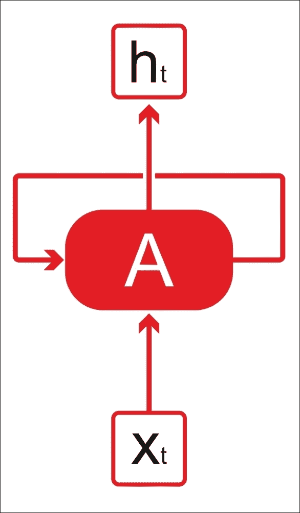

图 1：RNN 有循环

与传统神经网络相比，RNN 是具有允许信息在神经网络中持久的循环的网络。在上图中，对于网络 A，在某个时间 t，它接收输入`x[t]`并输出值`h[t]`。因此，在上图中，我们将 RNN 视为同一网络的多个副本，每个副本都将消息传递给后继者。

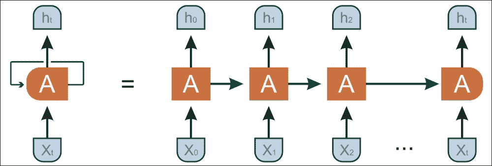

现在，如果我们展开这个网络，我们会收到什么？让我们看一个简单但真实的例子。假设`X[0]=`星期一，`X[1]=`星期二，

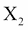

=星期三，依此类推。如果 h 存储你吃的东西，那么昨天的用餐决定会影响你明天吃的东西。这可以使用下图解释：


图 2：图 1 中表示的相同 RNN 的展开表示

但是，展开的网络不提供有关 RNN 的详细信息。 RNN 与传统神经网络的不同之处在于它引入了转换权重 W 以在时间之间传递信息。 RNN 一次处理一个顺序输入，更新一种包含有关序列的所有过去元素的信息的向量状态。下图显示了一个神经网络，它将 X（t）的值作为输入，然后输出值 Y（t）：

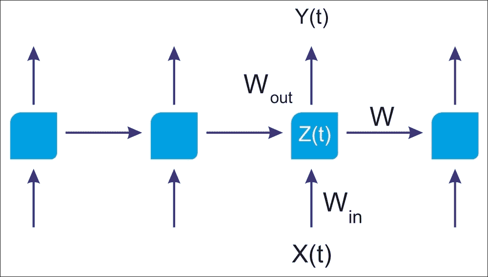

图 3：RNN 架构可以利用网络的先前状态来发挥其优势

如图 1 所示，神经网络的前半部分以`Z(t) = X(t) * W[in]`函数为特征，神经网络的后半部分采用以下形式

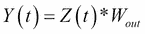

如果您愿意，可以使用完整的神经网络

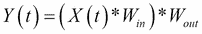

在每个时间 t，当调用学习模型时，该架构不考虑关于先前运行的任何知识。这就像仅通过查看当天的数据来预测股市趋势一样。更好的想法是利用一周的价值或一个月的数据的总体模式。

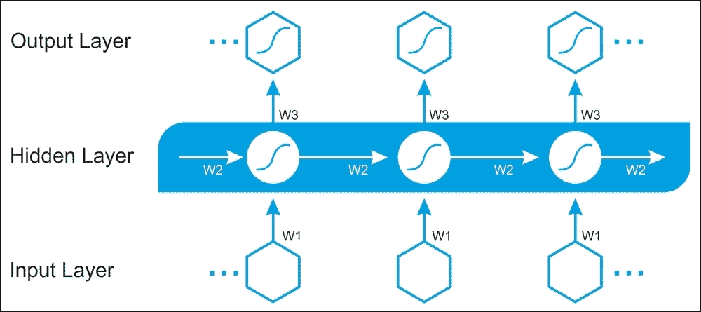

图 4：RNN 架构，其中所有层中的所有权重必须随时间学习

在图 4 中可以找到更多显式架构，其中除了 W1（用于输入层）和 W3（用于输出层）之外，还必须学习时间共享权重 W2（用于隐藏层）。 ）。

从计算的角度来看，RNN 采用许多输入向量来处理和生成输出向量。想象一下，下图中的每个矩形都有一个向量深度和其他特殊隐藏的怪癖。它可以有多种形式，例如一对一，一对多和多对多。

可以看出，一对一架构将是标准的前馈神经网络。多对一架构接受特征向量的时间序列（每个时间步长一个向量）并将它们转换为输出处的概率向量以进行分类：

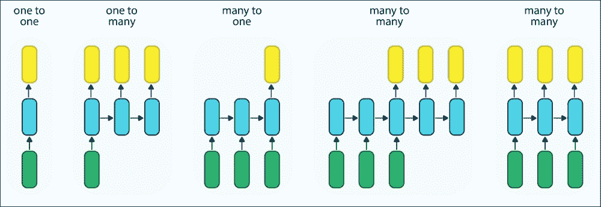

图 5：RNN 可以有多种形式

因此，  RNN 可以有多种形式。在上图中，每个矩形是向量，箭头表示函数（例如，矩阵乘法）。输入向量为绿色，输出向量为黄色，蓝色向量保持 RNN 的状态（很快就会更多）。

## 在 TensorFlow 中实现基本 RNN

TensorFlow 具有`tf.contrib.rnn.BasicRNNCell`和`tf.nn.rnn_cell.BasicRNNCell`，它们提供 RNN 的基本构建块。但是，首先让我们实现一个非常简单的 RNN 模型，而不使用其中任何一个。我们的想法是更好地了解幕后发生的事情。

我们将使用 ReLU 激活函数创建由五层循环神经元组成的 RNN。我们假设 RNN 仅运行两个步骤，在每个时间步长处获取大小为`3`的输入向量。以下代码构建此 RNN，通过两个步骤展开：

```py
n_inputs = 3
n_neurons = 5
X1 = tf.placeholder(tf.float32, [None, n_inputs])
X2 = tf.placeholder(tf.float32, [None, n_inputs])

Wx = tf.get_variable("Wx", shape=[n_inputs,n_neurons], dtype=tf.float32, initializer=None, regularizer=None, trainable=True, collections=None)

Wy = tf.get_variable("Wy", shape=[n_neurons,n_neurons], dtype=tf.float32, initializer=None, regularizer=None, trainable=True, collections=None)

b = tf.get_variable("b", shape=[1,n_neurons], dtype=tf.float32, initializer=None, regularizer=None, trainable=True, collections=None)

Y1 = tf.nn.relu(tf.matmul(X1, Wx) + b)
Y2 = tf.nn.relu(tf.matmul(Y1, Wy) + tf.matmul(X2, Wx) + b)
```

然后我们将全局变量初始化如下：

```py
init_op = tf.global_variables_initializer()
```

该网络看起来很像一个双层前馈神经网络，但两个层共享相同的权重和偏置向量。此外，我们在每一层输入输入并从每一层接收输出。

```py
X1_batch = np.array([[0, 2, 3], [2, 8, 9], [5, 3, 8], [3, 2, 9]]) # t = 0
X2_batch = np.array([[5, 6, 8], [1, 0, 0], [8, 2, 0], [2, 3, 6]]) # t = 1
```

这些小批量包含四个实例，每个实例都有一个输入序列，由两个输入组成。最后，`Y1_val`和`Y2_val`包含所有神经元和小批量中所有实例的两个时间步长的网络输出。然后我们创建一个 TensorFlow 会话并按如下方式执行计算图：

```py
with tf.Session() as sess:
        init_op.run()
        Y1_val, Y2_val = sess.run([Y1, Y2], feed_dict={X1: X1_batch, X2: X2_batch})
```

最后，我们打印结果：

```py
print(Y1_val) # output at t = 0
print(Y2_val) # output at t = 1
```

以下是输出：

```py
>>>
[[  0\.           0\.           0\.           2.56200171   1.20286   ]
 [  0\.           0\.           0\.          12.39334488   2.7824254 ]
 [  0\.           0\.           0\.          13.58520699   5.16213894]
 [  0\.           0\.           0\.           9.95982838   6.20652485]]

[[  0\.           0\.           0\.          14.86255169   6.98305273]
 [  0\.           0\.          26.35326385   0.66462421  18.31009483]
 [  5.12617588   4.76199865  20.55905533  11.71787453  18.92538261]
 [  0\.           0\.          19.75175095   3.38827515  15.98449326]]

```

我们创建的网络很简单，但是如果你运行它超过 100 个时间步，那么图就会非常大。现在，让我们看看如何使用 TensorFlow 的`contrib`包创建相同的 RNN。 `static_rnn()`函数通过链接单元格创建展开的 RNN，如下所示：

```py
basic_cell = tf.nn.rnn_cell.BasicRNNCell(num_units=n_neurons)
output_seqs, states = tf.contrib.rnn.static_rnn(basic_cell, [X1, X2], dtype=tf.float32)
Y1, Y2 = output_seqs
init_op = tf.global_variables_initializer()
X1_batch = np.array([[0, 2, 3], [2, 8, 9], [5, 3, 8], [3, 2, 9]]) # t = 0
X2_batch = np.array([[5, 6, 8], [1, 0, 0], [8, 2, 0], [2, 3, 6]]) # t = 1
with tf.Session() as sess:	init_op.run()
    Y1_val, Y2_val = sess.run([Y1, Y2], feed_dict={X1: X1_batch, X2: X2_batch})
print(Y1_val) # output at t = 0
print(Y2_val) # output at t = 1
```

输出如下：

```py
>>>
[[-0.95058489  0.85824621  0.68384844 -0.55920446 -0.87788445]
 [-0.99997741  0.99928695  0.99601227 -0.98470896 -0.99964565]
 [-0.99321234  0.99998873  0.99999011 -0.83302033 -0.98657602]
 [-0.99771607  0.99999255  0.99997681 -0.74148595 -0.99279612]]

[[-0.99982268  0.99888307  0.999865   -0.98920071 -0.99867421]
 [-0.64704001 -0.87286478  0.34580848 -0.66372067 -0.52697307]
 [ 0.3253428   0.62628752  0.99945754 -0.887465   -0.17882833]
 [-0.99901992  0.9688856   0.99529684 -0.9469955  -0.99445421]]

```

但是，如果我们使用`static_rnn()`函数，我们仍然可以构建一个每个时间步长包含一个单元的计算图。现在，想象有 100 个时间步骤;图看起来很大，很难理解。为了摆脱这个问题，`dynamic_rnn()`函数随着时间的推移提供动态展开功能：

```py
n_inputs = 3
n_neurons = 5
n_steps = 2

X = tf.placeholder(tf.float32, [None, n_steps, n_inputs])
seq_length = tf.placeholder(tf.int32, [None])

basic_cell = tf.nn.rnn_cell.BasicRNNCell(num_units=n_neurons)
output_seqs, states = tf.nn.dynamic_rnn(basic_cell, X, dtype=tf.float32)

X_batch = np.array([
                   [[0, 2, 3], [2, 8, 9]], # instance 0
                   [[5, 6, 8], [0, 0, 0]], # instance 1 (padded with a zero vector)
                   [[6, 7, 8], [6, 5, 4]], # instance 2
                   [[8, 2, 0], [2, 3, 6]], # instance 3
                  ])
seq_length_batch = np.array([3, 4, 3, 5])
init_op = tf.global_variables_initializer()

with tf.Session() as sess:
        init_op.run()
        outputs_val, states_val = sess.run([output_seqs, states], feed_dict={X: X_batch, seq_length: seq_length_batch})

print(outputs_val)
```

以下是上述代码的输出：

```py
>>>
[[[ 0.03708282  0.24521144 -0.65296066 -0.42676723  0.67448044]
  [ 0.50789726  0.98529315 -0.99976575 -0.84865189  0.96734977]]
 [[ 0.99343652  0.96998596 -0.99997932  0.59788793  0.00364922]
  [-0.51829755  0.56738734  0.78150493  0.16428296 -0.33302191]]
 [[ 0.99764818  0.99349713 -0.99999821  0.60863507 -0.02698862]
  [ 0.99159312  0.99838346 -0.99994278  0.83168954 -0.81424212]]
print(states_val)
>>>
[[ 0.99968255  0.99266654 -0.99999398  0.99020076 -0.99553883]
 [ 0.85630441  0.72372746 -0.90620565  0.60570842  0.1554002 ]]]
[[ 0.50789726  0.98529315 -0.99976575 -0.84865189  0.96734977]
 [-0.51829755  0.56738734  0.78150493  0.16428296 -0.33302191]
 [ 0.99159312  0.99838346 -0.99994278  0.83168954 -0.81424212]
 [ 0.85630441  0.72372746 -0.90620565  0.60570842  0.1554002 ]]

```

现在，引擎盖下会发生什么？那么，在反向传播期间，`dynamic_rnn()`函数使用`while_loop()`操作在单元上运行适当的次数。然后，存储前向通道中每次迭代的张量值，以便可以计算反向通过期间的梯度。

正如我们在前面章节中讨论的那样，过拟合是 RNN 的一个主要问题。dropout 层可以帮助我们避免过拟合。我们将在本章后面看到一个用户友好的示例。

## RNN 和长期依赖问题

RNN 非常强大，  也很受欢迎。但是，我们通常只需要查看最近的信息来执行当前任务，而不是存储很久以前发生的信息或信息。这在 NLP 中经常用于语言建模。让我们看一个常见的例子：

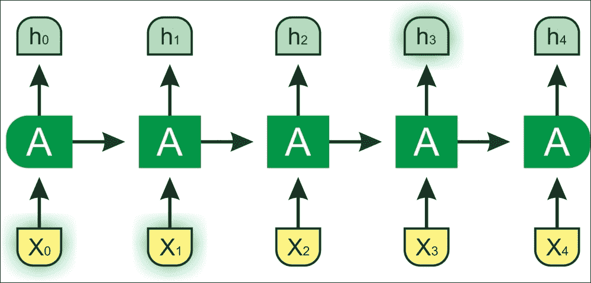

图 6：如果相关信息与所需位置之间的差距很小，RNN 可以学习使用过去的信息

假设语言模型试图根据前面的单词预测下一个单词。作为一个人，如果我们试图预测“天空是......”的最后一个词，没有进一步的背景，我们预测的下一个词很可能是“蓝色”。在这种情况下，相关信息和位置之间的差距很小。因此，RNN 可以学习容易地使用过去的信息。

然而，考虑一个较长的文本：“Reza 在孟加拉国长大。他在韩国学习。他说得流利......”，我们需要更多的背景。在这句话中，最新的信息建议下一个词可能是一种语言的名称：但是，如果我们想缩小它的语言范围，我们需要孟加拉国的语境，从前面的话。

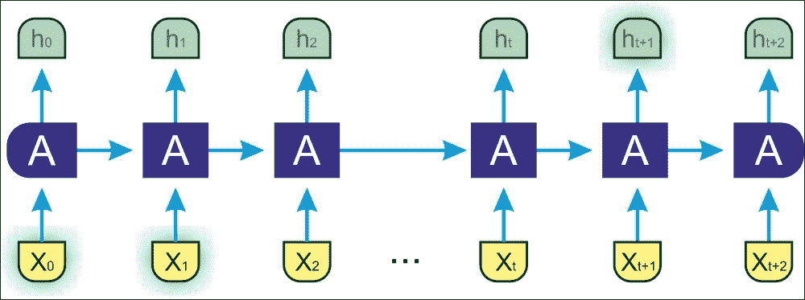

图 7：如果相关信息与所需位置之间的差距较大，则 RNN 无法学习使用过去的信息

这里，间隙比前一个例子大，因此 RNN 无法学习连接信息。这是 RNN 的严重缺点。这是 LSTM 作为救世主。我们将在下一小节中看到一些常用的 RNN 架构，如 LSTM，双向 RNN 和 GRU。

### 双向 RNN

双向RNN 基于一个观点，即时间 t 的输出可能取决于序列中的先前和未来元素。为了解决这个问题，必须混合两个 RNN 的输出：一个在一个方向上执行该过程，第二个在相反的方向上运行该过程。下图显示了常规 RNN 和双向 RNN（BRNN）之间的基本区别。

在下图中可以找到更明确的 BRNN 架构，其中除了输入层和输出层之外，还必须学习时间上共享的权重 w2，w3，w4 和 w5（对于前向和后向层） ：

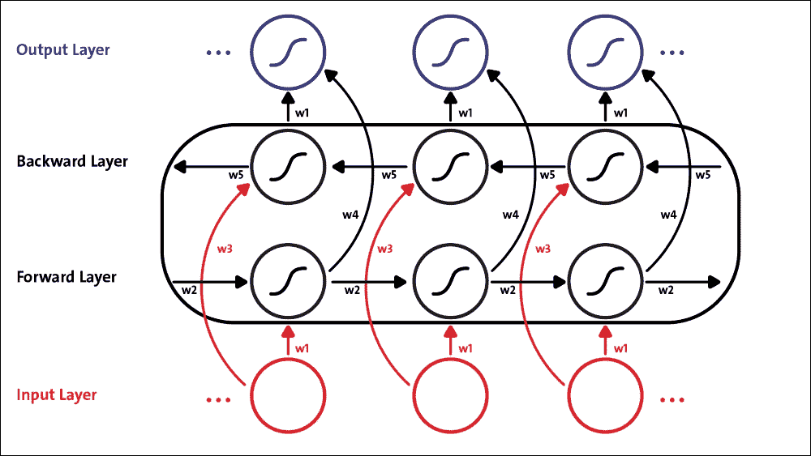

图 8：BRNN 架构，其中所有层中的所有权重都必须随时间学习

展开的架构也是非常常见的 BRNN 实现。 B-RNN 的展开架构如下图所示。网络将常规 RNN 的神经元分成两个方向，一个用于正时间方向（前向状态），另一个用于负时间方向（后向状态）。使用此结构，输出层可以从过去和未来状态获取信息，如图 9 所示：


图 9：展开的双向 RNN