# 六、RNN 和梯度消失或爆炸问题

较深层的梯度计算为多层网络中许多激活函数梯度的乘积。当这些梯度很小或为零时，它很容易消失。另一方面，当它们大于 1 时，它可能会爆炸。因此，计算和更新变得非常困难。

让我们更详细地解释一下：

*   如果权重较小，则可能导致称为消失梯度的情况，其中梯度信号变得非常小，以至于学习变得非常慢或完全停止工作。这通常被称为消失梯度。
*   如果该矩阵中的权重很大，则可能导致梯度信号太大而导致学习发散的情况。这通常被称为爆炸梯度。

因此，RNN 的一个主要问题是消失或爆炸梯度问题，它直接影响表现。事实上，反向传播时间推出了 RNN，创建了一个非常深的前馈神经网络。从 RNN 获得长期背景的不可能性正是由于这种现象：如果梯度在几层内消失或爆炸，网络将无法学习数据之间的高时间距离关系。

下图显示了发生的情况：计算和反向传播的梯度趋于在每个时刻减少（或增加），然后，在一定数量的时刻之后，成本函数趋于收敛到零（或爆炸到无穷大） ）。

我们可以通过两种方式获得爆炸梯度。由于激活函数的目的是通过压缩它们来控制网络中的重大变化，因此我们设置的权重必须是非负的和大的。当这些权重沿着层次相乘时，它们会导致成本的大幅变化。当我们的神经网络模型学习时，最终目标是最小化成本函数并改变权重以达到最优成本。

例如，成本函数是均方误差。它是一个纯凸函数，目的是找到凸起的根本原因。如果你的权重增加到一定量，那么下降的时刻就会增加，我们会反复超过最佳状态，模型永远不会学习！

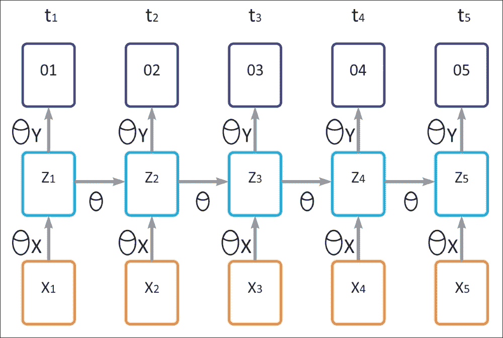

在上图中，我们有以下参数：

*   `θ`表示隐藏的循环层的参数
*   `θ[x]`表示隐藏层的输入参数
*   `θ[y]`表示输出层的参数
*   `σ`表示隐藏层的激活函数
*   输入表示为`X[t]`
*   隐藏层的输出为`h[t]`
*   最终输出为`o[t]`
*   `t`（时间步长）

注意，上图表示下面给出的循环神经网络模型的时间流逝。现在，如果你回忆一下图 1，输出可以表示如下：

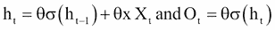

现在让`E`代表输出层的损失：`E = f(O[t])`。然后，上述三个方程告诉我们`E`取决于输出`O[t]`。输出`O[t]`相对于层的隐藏状态（`h[t]`）的变化而变化。当前时间步长（`h[t]`）的隐藏状态取决于先前时间步长（`h[t-1]`）的神经元状态。现在，下面的等式将清除这个概念。

相对于为隐藏层选择的参数的损失变化率`= ∂E/∂θ`，这是一个可以表述如下的链规则：

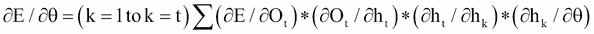

（I）

在前面的等式中，项`∂h[t]/∂h[k]`不仅有趣而且有用。


（II）

现在，让我们考虑`t = 5`和`k = 1`然后

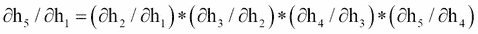

（III）

微分方程（II）相对于（`h[t-1]`）给出了：


（IV）

现在，如果我们将方程（III）和（IV）结合起来，我们可以得到以下结果：

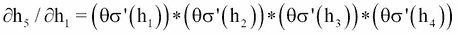

在这些情况下，`θ`也随着时间步长而变化。上面的等式显示了当前状态相对于先前状态的依赖性。现在让我们解释这两个方程的解剖。假设您处于时间步长 5（`t = 5`），那么`k`的范围从 1 到 5（`k = 1`到 5），这意味着您必须为以下内容计算`k`）：

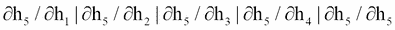

现在来看上面的每一个等式（II）


而且，它取决于循环层的参数`θ`。如果在训练期间你的权重变大，那么由于每个时间步长的等式（I）（II）的乘法，它们将会出现梯度爆炸的问题。

为了克服消失或爆炸问题，已经提出了基本 RNN 模型的各种扩展。将在下一节介绍的 LSTM 网络就是其中之一。

## LSTM 网络

一种 RNN 模型是  LSTM。 LSTM 的精确实现细节不在本书的范围内。 LSTM 是一种特殊的 RNN 架构，最初由 Hochreiter 和 Schmidhuber 于 1997 年构思。

最近在深度学习的背景下重新发现了这种类型的神经网络，因为它没有消失梯度的问题，并且提供了出色的结果和表现。基于 LSTM 的网络是时间序列的预测和分类的理想选择，并且正在取代许多传统的深度学习方法。

这个名称意味着短期模式不会被遗忘。 LSTM 网络由彼此链接的单元（LSTM 块）组成。每个 LSTM 块包含三种类型的门：输入门，输出门和遗忘门，它们分别实现对单元存储器的写入，读取和复位功能。这些门不是二元的，而是模拟的（通常由映射在`[0, 1]`范围内的 Sigmoid 激活函数管理，其中 0 表示总抑制，1 表示总激活）。

如果你认为 LSTM 单元是一个黑盒子，它可以像基本单元一样使用，除了它会表现得更好；训练将更快地收敛，它将检测数据中的长期依赖性。在 TensorFlow 中，您只需使用`BasicLSTMCell`代替`BasicRNNCell`：

```py
lstm_cell = tf.nn.rnn_cell.BasicLSTMCell(num_units=n_neurons)
```

LSTM 单元管理两个状态向量，并且出于表现原因，它们默认保持独立。您可以通过在创建`BasicLSTMCell`时设置`state_is_tuple=False`来更改此默认行为。那么，LSTM 单元如何工作？基本 LSTM 单元的架构如下图所示：

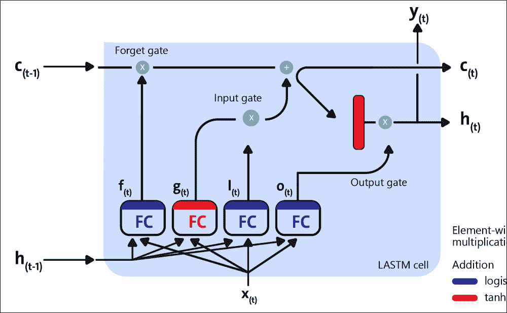

图 11：LSTM 单元的框图

现在，让我们看看这个架构背后的数学符号。如果我们不查看 LSTM 框内的内容，LSTM 单元本身看起来就像常规存储单元，除了它的状态被分成两个向量，`h(t)`和`c(t)`：

*   `h(t)`是短期状态
*   `c(t)`是长期状态

现在，让我们打开盒子吧！关键的想法是网络可以学习以下内容：

*   在长期的状态中存储什么
*   扔掉什么
*   怎么读它

由于长期`c(t)`从左到右穿过网络，你可以看到它首先通过一个遗忘门，丢弃一些内存，然后它添加一些新的存储器通过加法运算（增加了输入门选择的存储器）。结果`c(t)`直接发送，没有任何进一步的变换

因此，在每个时间步骤，都会丢弃一些内存并添加一些内存。此外，在加法运算之后，长期状态被复制并通过 tanh 函数，该函数产生`[-1, +1]`范围内的输出。

然后输出门过滤结果。这会产生短期`h(t)`（等于此时间步的单元输出`y(t)`）。现在，让我们来看看新记忆的来源以及大门如何运作。首先，当前输入`x(t)`和之前的短路`h(t-1)`被馈送到四个不同的完全连接。这些门的存在允许 LSTM 单元无限期地记住信息：事实上，如果输入门低于激活阈值，单元格将保持先前的状态，如果启用当前状态，它将与输入值组合。顾名思义，遗忘门重置单元的当前状态（当其值被清除为 0 时），输出门决定是否必须执行单元的值。

以下等式用于对单个实例的单元的长期状态，其短期状态及其在每个时间步的输出进行 LSTM 计算：

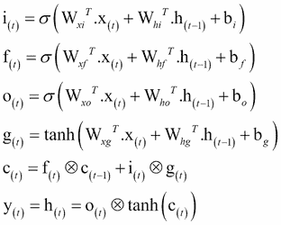

在前面的方程中，`W[xi]`，`W[xf]`，`W[xo]`和`W[xg]`是四个层中每个层的权重矩阵，用于与输入向量`x(t)`连接。另一方面，`W[hi]`，`W[hf]`，`W[ho]`，和`W[hg]`是四层中每一层的权重矩阵，它们与先前的短期状态有关。`b[i]`、`b[f]`、`b[o]`、`b[g]`是四层中每一层的偏差项。 TensorFlow 初始化它们为一个全 1 的向量而不是全 0 的向量。这可以防止它在训练开始时遗忘一切。

## GRU 单元

LSTM 单元还有许多其他变体。一种特别流行的变体是门控循环单元（GRU）。 Kyunghyun Cho 和其他人在 2014 年的论文中提出了 GRU 单元，该论文还介绍了我们前面提到的自编码器网络。

从技术上讲，GRU 单元是 LSTM 单元的简化版本，其中两个状态向量合并为一个称为`h(t)`的向量。单个门控制器控制遗忘门和输入门。如果门控制器的输出为 1，则输入门打开并且遗忘门关闭。

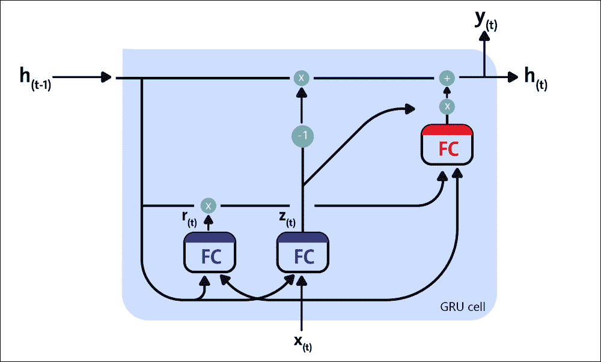

图 12：GRU 单元

另一方面，如果输出为 0，则相反。每当必须存储存储器时，首先擦除存储它的位置，这实际上是 LSTM 单元本身的常见变体。第二种简化是因为在每个时间步输出满状态向量，所以没有输出门。但是，新的门控制器控制先前状态的哪一部分将显示给主层。

以下等式用于为单个实例，在每个时间步计算 GRU 单元的长期状态，其短期状态及其输出的：


在 TensorFlow 中创建 GRU 单元非常简单。这是一个例子：

```py
gru_cell = tf.nn.rnn_cell.GRUCell(num_units=n_neurons)
```

这些简化并不是这种架构的弱点；它似乎成功地执行。 LSTM 或 GRU 单元是近年来 RNN 成功背后的主要原因之一，特别是在 NLP 中的应用。

我们将在本章中看到使用 LSTM 的示例，但下一节将介绍使用 RNN 进行垃圾邮件/火腿文本分类的示例。

# 实现 RNN 进行垃圾邮件预测

在本节中，我们将看到如何在 TensorFlow 中实现 RNN 来预测文本中的垃圾邮件。

## 数据描述和预处理

将使用来自 UCI ML 仓库的流行垃圾数据集，可从[此链接](http://archive.ics.uci.edu/ml/machine-learning-databases/00228/smssp)下载`amcollection.zip`。

该数据集包含来自多个电子邮件的文本，其中一些被标记为垃圾邮件。在这里，我们将训练一个模型，该模型将学习仅使用电子邮件文本区分垃圾邮件和非垃圾邮件。让我们开始导入所需的库和模型：

```py
import os
import re
import io
import requests
import numpy as np
import matplotlib.pyplot as plt
import tensorflow as tf
from zipfile import ZipFile
from tensorflow.python.framework import ops
import warnings
```

另外，如果您需要，我们可以停止打印由 TensorFlow 产生的警告：

```py
warnings.filterwarnings("ignore")
os.environ['TF_CPP_MIN_LOG_LEVEL'] = '3'
ops.reset_default_graph()
```

现在，让我们为图创建 TensorFlow 会话：

```py
sess = tf.Session()
```

下一个任务是设置 RNN 参数：

```py
epochs = 300
batch_size = 250
max_sequence_length = 25
rnn_size = 10
embedding_size = 50
min_word_frequency = 10
learning_rate = 0.0001
dropout_keep_prob = tf.placeholder(tf.float32)
```

让我们手动下载数据集并将其存储在`temp`目录的`text_data.txt`文件中。首先，我们设置路径：

```py
data_dir = 'temp'
data_file = 'text_data.txt'
if not os.path.exists(data_dir):
    os.makedirs(data_dir)
```

现在，我们直接以压缩格式下载数据集：

```py
if not os.path.isfile(os.path.join(data_dir, data_file)):
    zip_url = 'http://archive.ics.uci.edu/ml/machine-learning-databases/00228/smsspamcollection.zip'
    r = requests.get(zip_url)
    z = ZipFile(io.BytesIO(r.content))
    file = z.read('SMSSpamCollection')
```

我们仍然需要格式化数据：

```py
    text_data = file.decode()
    text_data = text_data.encode('ascii',errors='ignore')
    text_data = text_data.decode().split('\n')
```

现在，在文本文件中存储前面提到的目录：

```py
    with open(os.path.join(data_dir, data_file), 'w') as file_conn:
        for text in text_data:
            file_conn.write("{}\n".format(text))
else:
    text_data = []
    with open(os.path.join(data_dir, data_file), 'r') as file_conn:
        for row in file_conn:
            text_data.append(row)
    text_data = text_data[:-1]
```

让我们分开单词长度至少为 2 的单词：

```py
text_data = [x.split('\t') for x in text_data if len(x)>=1]
[text_data_target, text_data_train] = [list(x) for x in zip(*text_data)]
```

现在我们创建一个文本清理函数：

```py
def clean_text(text_string):
    text_string = re.sub(r'([^\s\w]|_|[0-9])+', '', text_string)
    text_string = " ".join(text_string.split())
    text_string = text_string.lower()
    return(text_string)
```

我们调用前面的方法来清理文本：

```py
text_data_train = [clean_text(x) for x in text_data_train]
```

现在我们需要做一个最重要的任务，即创建单词嵌入 - 将文本更改为数字向量：

```py
vocab_processor = tf.contrib.learn.preprocessing.VocabularyProcessor(max_sequence_length, min_frequency=min_word_frequency)
text_processed = np.array(list(vocab_processor.fit_transform(text_data_train)))
```

现在让我们随意改变数据集的平衡：

```py
text_processed = np.array(text_processed)
text_data_target = np.array([1 if x=='ham' else 0 for x in text_data_target])
shuffled_ix = np.random.permutation(np.arange(len(text_data_target)))
x_shuffled = text_processed[shuffled_ix]
y_shuffled = text_data_target[shuffled_ix]
```

现在我们已经改组了数据，我们可以将数据分成训练和测试集：

```py
ix_cutoff = int(len(y_shuffled)*0.75)
x_train, x_test = x_shuffled[:ix_cutoff], x_shuffled[ix_cutoff:]
y_train, y_test = y_shuffled[:ix_cutoff], y_shuffled[ix_cutoff:]
vocab_size = len(vocab_processor.vocabulary_)
print("Vocabulary size: {:d}".format(vocab_size))
print("Training set size: {:d}".format(len(y_train)))
print("Test set size: {:d}".format(len(y_test)))
```

以下是上述代码的输出：

```py
>>>
Vocabulary size: 933
Training set size: 4180
Test set size: 1394

```

在我们开始训练之前，让我们为 TensorFlow 图创建占位符：

```py
x_data = tf.placeholder(tf.int32, [None, max_sequence_length])
y_output = tf.placeholder(tf.int32, [None])
```

让我们创建嵌入：

```py
embedding_mat = tf.get_variable("embedding_mat", shape=[vocab_size, embedding_size], dtype=tf.float32, initializer=None, regularizer=None, trainable=True, collections=None)
embedding_output = tf.nn.embedding_lookup(embedding_mat, x_data)
```

现在是构建我们的  RNN 的时候了。以下代码定义了 RNN 单元：

```py
cell = tf.nn.rnn_cell.BasicRNNCell(num_units = rnn_size)
output, state = tf.nn.dynamic_rnn(cell, embedding_output, dtype=tf.float32)
output = tf.nn.dropout(output, dropout_keep_prob)
```

现在让我们定义从 RNN 序列获取输出的方法：

```py
output = tf.transpose(output, [1, 0, 2])
last = tf.gather(output, int(output.get_shape()[0]) - 1)
```

接下来，我们定义 RNN 的权重和偏置：

```py
weight = bias = tf.get_variable("weight", shape=[rnn_size, 2], dtype=tf.float32, initializer=None, regularizer=None, trainable=True, collections=None)
bias = tf.get_variable("bias", shape=[2], dtype=tf.float32, initializer=None, regularizer=None, trainable=True, collections=None)
```

然后定义`logits`输出。它使用前面代码中的权重和偏置：

```py
logits_out = tf.nn.softmax(tf.matmul(last, weight) + bias)
```

现在我们定义每个预测的损失，以便稍后，它们可以为损失函数做出贡献：

```py
losses = tf.nn.sparse_softmax_cross_entropy_with_logits_v2(logits=logits_out, labels=y_output)
```

然后我们定义损失函数：

```py
loss = tf.reduce_mean(losses)
```

我们现在定义每个预测的准确率：

```py
accuracy = tf.reduce_mean(tf.cast(tf.equal(tf.argmax(logits_out, 1), tf.cast(y_output, tf.int64)), tf.float32))
```

然后我们用`RMSPropOptimizer`创建`training_op`：

```py
optimizer = tf.train.RMSPropOptimizer(learning_rate)
train_step = optimizer.minimize(loss)
```

现在让我们使用`global_variables_initializer()`方法初始化所有变量  ：

```py
init_op = tf.global_variables_initializer()
sess.run(init_op)
```

此外，我们可以创建一些空列表来跟踪每个周期的训练损失，测试损失，训练准确率和测试准确率：

```py
train_loss = []
test_loss = []
train_accuracy = []
test_accuracy = []
```

现在我们已准备好进行训练，让我们开始吧。训练的工作流程如下：

*   打乱训练数据
*   选择训练集并计算周期
*   为每个批次运行训练步骤
*   运行损失和训练的准确率
*   运行评估步骤。

以下代码包括上述所有步骤：

```py
    shuffled_ix = np.random.permutation(np.arange(len(x_train)))
    x_train = x_train[shuffled_ix]
    y_train = y_train[shuffled_ix]
    num_batches = int(len(x_train)/batch_size) + 1

    for i in range(num_batches):
        min_ix = i * batch_size
        max_ix = np.min([len(x_train), ((i+1) * batch_size)])
        x_train_batch = x_train[min_ix:max_ix]
        y_train_batch = y_train[min_ix:max_ix]
        train_dict = {x_data: x_train_batch, y_output: \
y_train_batch, dropout_keep_prob:0.5}
        sess.run(train_step, feed_dict=train_dict)
        temp_train_loss, temp_train_acc = sess.run([loss,\ 
                         accuracy], feed_dict=train_dict)
    train_loss.append(temp_train_loss)
    train_accuracy.append(temp_train_acc)
    test_dict = {x_data: x_test, y_output: y_test, \ 
dropout_keep_prob:1.0}
    temp_test_loss, temp_test_acc = sess.run([loss, accuracy], \
                    feed_dict=test_dict)
    test_loss.append(temp_test_loss)
    test_accuracy.append(temp_test_acc)
    print('Epoch: {}, Test Loss: {:.2}, Test Acc: {:.2}'.format(epoch+1, temp_test_loss, temp_test_acc))
print('\nOverall accuracy on test set (%): {}'.format(np.mean(temp_test_acc)*100.0))
```

以下是前面代码的输出：

```py
>>>
Epoch: 1, Test Loss: 0.68, Test Acc: 0.82
Epoch: 2, Test Loss: 0.68, Test Acc: 0.82
Epoch: 3, Test Loss: 0.67, Test Acc: 0.82
…
Epoch: 997, Test Loss: 0.36, Test Acc: 0.96
Epoch: 998, Test Loss: 0.36, Test Acc: 0.96
Epoch: 999, Test Loss: 0.35, Test Acc: 0.96
Epoch: 1000, Test Loss: 0.35, Test Acc: 0.96
Overall accuracy on test set (%): 96.19799256324768 

```

做得好！ RNN 的准确率高于 96%，非常出色。现在让我们观察损失如何在每次迭代中传播并随着时间的推移：

```py
epoch_seq = np.arange(1, epochs+1)
plt.plot(epoch_seq, train_loss, 'k--', label='Train Set')
plt.plot(epoch_seq, test_loss, 'r-', label='Test Set')
plt.title('RNN training/test loss')
plt.xlabel('Epochs')
plt.ylabel('Loss')
plt.legend(loc='upper left')
plt.show()
```

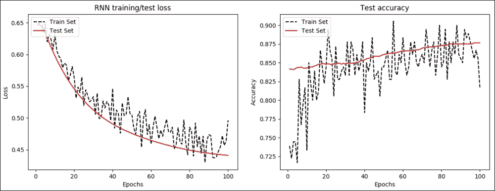

图 13：a）每个周期的 RNN 训练和测试损失 b）每个周期的测试精度

我们还随时间绘制准确率：

```py
plt.plot(epoch_seq, train_accuracy, 'k--', label='Train Set')
plt.plot(epoch_seq, test_accuracy, 'r-', label='Test Set')
plt.title('Test accuracy')
plt.xlabel('Epochs')
plt.ylabel('Accuracy')
plt.legend(loc='upper left')
plt.show()
```

下一个应用使用时间序列数据进行预测建模。我们还将看到如何开发更复杂的 RNN，称为 LSTM 网络。

# 开发时间序列数据的预测模型

RNN，特别是  LSTM 模型，通常是一个难以理解的主题。由于数据中的时间依赖性，时间序列预测是 RNN 的有用应用。时间序列数据可在线获取。在本节中，我们将看到使用 LSTM 处理时间序列数据的示例。我们的 LSTM 网络将能够预测未来的航空公司乘客数量。

## 数据集的描述

我将使用的数据集是 1949 年至 1960 年国际航空公司乘客的数据。该数据集可以从[此链接](https://datamarket.com/data/set/22u3/international-airlinepassengers- monthly-totals-in#!ds=22u3&display=line)。以下屏幕截图显示了国际航空公司乘客的元数据：


图 14：国际航空公司乘客的元数据（来源：<https://datamarket.com/>）

您可以通过选择“导出”选项卡，然后在“导出”组中选择 CSV 来下载数据。您必须手动编辑 CSV 文件以删除标题行以及其他页脚行。我已经下载并保存了名为`international-airline-passengers.csv`的数据文件。下图是时间序列数据的一个很好的图：


图 15：国际航空公司乘客：1 月 49 日至 12 月 60 日的月度总数为千人

## 预处理和探索性分析

现在让我们加载原始数据集并查看一些事实。首先，我们加载时间序列如下（见`time_series_preprocessor.py`）：

```py
import csv
import numpy as np
```

在这里，我们可以看到`load_series()`的签名，它是一个用户定义的方法，可以加载时间序列并对其进行正则化：

```py
def load_series(filename, series_idx=1):
    try:
        with open(filename) as csvfile:
            csvreader = csv.reader(csvfile)
            data = [float(row[series_idx]) for row in csvreader if len(row) > 0]
            normalized_data = (data - np.mean(data)) / np.std(data)
        return normalized_data
    except IOError:
       Print("Error occurred")

        return None
```

现在让我们调用前面的方法加载时间序列并打印（在终端上发出`$ python3 plot_time_series.py`）数据集中的序列号：

```py
import csv
import numpy as np
import matplotlib.pyplot as plt
import time_series_preprocessor as tsp
timeseries = tsp.load_series('international-airline-passengers.csv')
print(timeseries)
```

以下是前面代码的输出：

```py
>>>
[-1.40777884 -1.35759023 -1.24048348 -1.26557778 -1.33249593 -1.21538918
 -1.10664719 -1.10664719 -1.20702441 -1.34922546 -1.47469699 -1.35759023
…..
 2.85825285  2.72441656  1.9046693   1.5115252   0.91762667  1.26894693]
print(np.shape(timeseries))
```

```py
>>>
144

```

这意味着时间序列中有`144`条目。让我们绘制时间序列：

```py
plt.figure()
plt.plot(timeseries)
plt.title('Normalized time series')
plt.xlabel('ID')
plt.ylabel('Normalized value')
plt.legend(loc='upper left')
plt.show()
```

以下是上述代码的输出：

```py
>>>

```

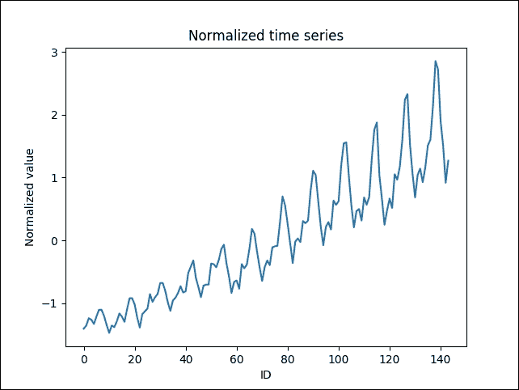

图 16：时间序列（y 轴，标准化值与 x 轴，ID）

加载时间序列数据集后，下一个任务是准备训练集。由于我们将多次评估模型以预测未来值，因此我们将数据分为训练和测试。更具体地说，`split_data()`函数将数据集划分为两个部分，用于训练和测试，75% 用于训练，25% 用于测试：

```py
def split_data(data, percent_train):
    num_rows = len(data)
    train_data, test_data = [], []
    for idx, row in enumerate(data):
        if idx < num_rows * percent_train:
            train_data.append(row)
        else:
            test_data.append(row)
    return train_data, test_data
```

## LSTM 预测模型

一旦我们准备好数据集，我们就可以通过以可接受的格式加载数据来训练预测器。在这一步中，我编写了一个名为`TimeSeriesPredictor.py`的 Python 脚本，它首先导入必要的库和模块（在此脚本的终端上发出`$ python3 TimeSeriesPredictor.py`命令）：

```py
import numpy as np
import tensorflow as tf
from tensorflow.python.ops import rnn, rnn_cell
import time_series_preprocessor as tsp
import matplotlib.pyplot as plt
```

接下来，我们为 LSTM 网络定义超参数（相应地调整它）：

```py
input_dim = 1
seq_size = 5
hidden_dim = 5
```

我们现在定义权重变量（无偏差）和输入占位符：

```py
W_out = tf.get_variable("W_out", shape=[hidden_dim, 1], dtype=tf.float32, initializer=None, regularizer=None, trainable=True, collections=None) 
b_out = tf.get_variable("b_out", shape=[1], dtype=tf.float32, initializer=None, regularizer=None, trainable=True, collections=None)
x = tf.placeholder(tf.float32, [None, seq_size, input_dim])
y = tf.placeholder(tf.float32, [None, seq_size])
```

下一个任务是构建 LSTM 网络。以下方法`LSTM_Model()`采用三个参数，如下所示：

*   `x`：大小为`[T, batch_size, input_size]`的输入
*   `W`：完全连接的输出层权重矩阵
*   `b`：完全连接的输出层偏置向量

现在让我们看一下方法的签名：

```py
def LSTM_Model():
        cell = rnn_cell.BasicLSTMCell(hidden_dim)
        outputs, states = rnn.dynamic_rnn(cell, x, dtype=tf.float32)
        num_examples = tf.shape(x)[0]
        W_repeated = tf.tile(tf.expand_dims(W_out, 0), [num_examples, 1, 1])
        out = tf.matmul(outputs, W_repeated) + b_out
        out = tf.squeeze(out)
        return out
```

此外，我们创建了三个空列表来存储训练损失，测试损失和步骤：

```py
train_loss = []
test_loss = []
step_list = []
```

下一个名为`train()`的方法用于训练 LSTM 网络：

```py
def trainNetwork(train_x, train_y, test_x, test_y):
        with tf.Session() as sess:
            tf.get_variable_scope().reuse_variables()
            sess.run(tf.global_variables_initializer())
            max_patience = 3
            patience = max_patience
            min_test_err = float('inf')
            step = 0
            while patience > 0:
                _, train_err = sess.run([train_op, cost], feed_dict={x: train_x, y: train_y})
                if step % 100 == 0:
                    test_err = sess.run(cost, feed_dict={x: test_x, y: test_y})
                    print('step: {}\t\ttrain err: {}\t\ttest err: {}'.format(step, train_err, test_err))
                    train_loss.append(train_err)
                    test_loss.append(test_err)
                    step_list.append(step)
                    if test_err < min_test_err:
                        min_test_err = test_err
                        patience = max_patience
                    else:
                        patience -= 1
                step += 1
            save_path = saver.save(sess, 'model.ckpt')
            print('Model saved to {}'.format(save_path))
```

接下来的任务是创建成本优化器并实例化`training_op`：

```py
cost = tf.reduce_mean(tf.square(LSTM_Model()- y))
train_op = tf.train.AdamOptimizer(learning_rate=0.003).minimize(cost)
```

另外，这里有一个叫做保存模型的辅助`op`：

```py
saver = tf.train.Saver()
```

现在我们已经创建了模型，下一个方法称为`testLSTM()`，用于测试模型在测试集上的预测能力：

```py
def testLSTM(sess, test_x):
        tf.get_variable_scope().reuse_variables()
        saver.restore(sess, 'model.ckpt')
        output = sess.run(LSTM_Model(), feed_dict={x: test_x})
        return output
```

为了绘制预测结果，我们有一个名为`plot_results()`的函数。签名如下：

```py
def plot_results(train_x, predictions, actual, filename):
    plt.figure()
    num_train = len(train_x)
    plt.plot(list(range(num_train)), train_x, color='b', label='training data')
    plt.plot(list(range(num_train, num_train + len(predictions))), predictions, color='r', label='predicted')
    plt.plot(list(range(num_train, num_train + len(actual))), actual, color='g', label='test data')
    plt.legend()
    if filename is not None:
        plt.savefig(filename)
    else:
        plt.show()
```

## 模型评估

为了评估模型，我们有一个名为`main()`的方法，它实际上调用前面的方法来创建和训练 LSTM 网络。代码的工作流程如下：

1.  加载数据
2.  在时间序列数据中滑动窗口以构建训练数据集
3.  执行相同的窗口滑动策略来构建测试数据集
4.  在训练数据集上训练模型
5.  可视化模型的表现

让我们看看方法的签名：

```py
def main():
    data = tsp.load_series('international-airline-passengers.csv')
    train_data, actual_vals = tsp.split_data(data=data, percent_train=0.75)
    train_x, train_y = [], []
    for i in range(len(train_data) - seq_size - 1):
        train_x.append(np.expand_dims(train_data[i:i+seq_size], axis=1).tolist())
        train_y.append(train_data[i+1:i+seq_size+1])
    test_x, test_y = [], []
    for i in range(len(actual_vals) - seq_size - 1):
        test_x.append(np.expand_dims(actual_vals[i:i+seq_size], axis=1).tolist())
        test_y.append(actual_vals[i+1:i+seq_size+1])
    trainNetwork(train_x, train_y, test_x, test_y)
    with tf.Session() as sess:
        predicted_vals = testLSTM(sess, test_x)[:,0]
        # Following prediction results of the model given ground truth values
        plot_results(train_data, predicted_vals, actual_vals, 'ground_truth_predition.png')
        prev_seq = train_x[-1]
        predicted_vals = []
        for i in range(1000):
            next_seq = testLSTM(sess, [prev_seq])
            predicted_vals.append(next_seq[-1])
            prev_seq = np.vstack((prev_seq[1:], next_seq[-1]))
        # Following predictions results where only the training data was given
        plot_results(train_data, predicted_vals, actual_vals, 'prediction_on_train_set.png')
>>>
```

最后，我们将调用`main()`方法来执行训练。训练完成后，它进一步绘制模型的预测结果，包括地面实况值与预测结果，其中只给出了训练数据：

```py
>>>

```

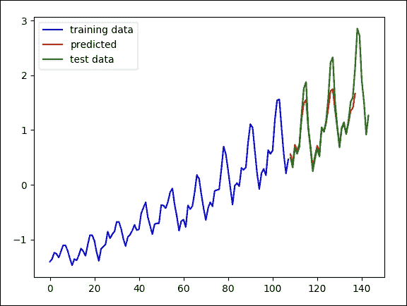

图 17：模型对地面实况值的结果

下图显示了训练数据的预测结果。此过程可用的信息较少，但它仍然可以很好地匹配数据中的趋势：

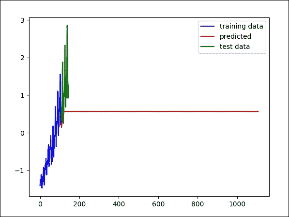

图 18：训练集上模型的结果

以下方法帮助我们绘制训练和测试错误：

```py
def plot_error():
    # Plot training loss over time
    plt.plot(step_list, train_loss, 'r--', label='LSTM training loss per iteration', linewidth=4)
    plt.title('LSTM training loss per iteration')
    plt.xlabel('Iteration')
    plt.ylabel('Training loss')
    plt.legend(loc='upper right')
    plt.show()

    # Plot test loss over time
    plt.plot(step_list, test_loss, 'r--', label='LSTM test loss per iteration', linewidth=4)
    plt.title('LSTM test loss per iteration')
    plt.xlabel('Iteration')
    plt.ylabel('Test loss')
    plt.legend(loc='upper left')
    plt.show()
```

现在我们调用上面的方法如下：

```py
plot_error()
>>>
```

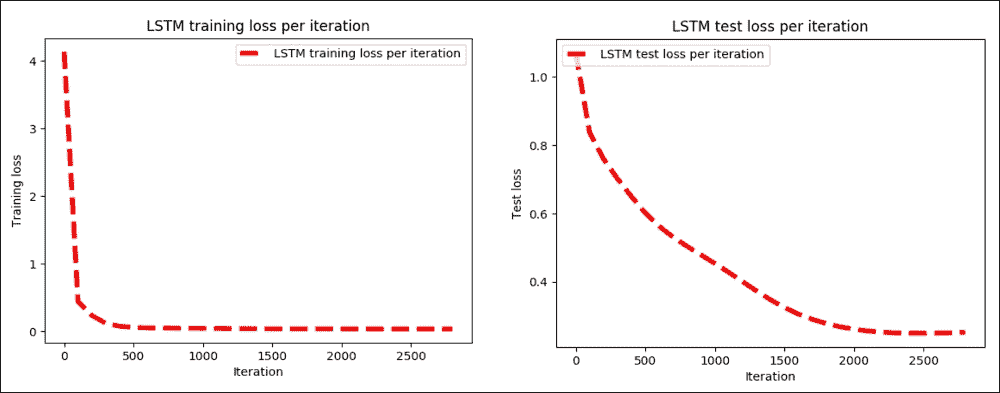

图 19：a）每次迭代的 LSTM 训练损失，b）每次迭代的 LSTM 测试损失

我们可以使用时间序列预测器来重现数据中的实际波动。现在，您可以准备自己的数据集并执行其他一些预测分析。下一个示例是关于产品和电影评论数据集的情感分析。我们还将了解如何使用 LSTM 网络开发更复杂的 RNN。

# 用于情感分析的 LSTM 预测模型

情感分析是 NLP 中使用最广泛的任务之一。 LSTM 网络可用于将短文本分类为期望的类别，即分类问题。例如，一组推文可以分为正面或负面。在本节中，我们将看到这样一个例子。

## 网络设计

实现的 LSTM 网络将具有三层：嵌入层，RNN 层和 softmax 层。从下图可以看到对此的高级视图。在这里，我总结了所有层的功能：

*   嵌入层：我们将在第 8 章中看到一个示例，显示文本数据集不能直接馈送到深度神经网络（DNN），因此一个名为嵌入层是必需的。对于该层，我们将每个输入（k 个单词的张量）变换为 k 个 N 维向量的张量。这称为字嵌入，其中 N 是嵌入大小。每个单词都与在训练过程中需要学习的权重向量相关联。您可以在单词的向量表示中更深入地了解单词嵌入。
*   RNN 层：一旦我们构建了嵌入层，就会有一个名为 RNN 层的新层，它由带有压降包装的 LSTM 单元组成。在训练过程中需要学习 LSTM 权重，如前几节所述。动态展开 RNN 层（如图 4 所示），将 k 个字嵌入作为输入并输出 k 个 M 维向量，其中 M 是 LSTM 单元的隐藏大小。
*   Softmax 或 Sigmoid 层：RNN 层的输出在`k`个时间步长上平均，获得大小为`M`的单个张量。最后，例如，softmax 层用于计算分类概率。

    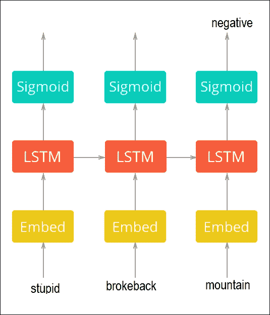

    图 20：用于情感分析的 LSTM 网络的高级视图

稍后我们将看到交叉熵如何用作损失函数，`RMSProp`是最小化它的优化器。

## LSTM 模型训练

UMICH SI650 - 情感分类数据集（删除了重复）包含有关密歇根大学捐赠的产品和电影评论的数据，可以从[此链接下载](https://inclass.kaggle.com/c/si650winter11/data/)。在获取令牌之前，已经清除了不需要的或特殊的字符（参见`data.csv`文件）。

以下脚本还会删除停用词（请参阅`data_preparation.py`）。给出一些标记为阴性或阳性的样本（1 为正面，0 为负面）：

| 情感 | 情感文本 |
| --- | --- |
| 1 | 达芬奇密码书真棒。 |
| 1 | 我很喜欢达芬奇密码。 |
| 0 | 天哪，我讨厌断背山。 |
| 0 | 我讨厌哈利波特。 |

> 表 1：情感数据集的样本

现在，让我们看一下为此任务训练 LSTM 网络的分步示例。首先，我们导入必要的模块和包（执行`train.py`文件）：

```py
from data_preparation import Preprocessing
from lstm_network import LSTM_RNN_Network
import tensorflow as tf
import pickle
import datetime
import time
import os
import matplotlib.pyplot as plt
```

在前面的导入声明中，`data_preparation`和`lstm_network`是两个辅助 Python 脚本，用于数据集准备和网络设计。我们稍后会看到更多细节。现在让我们为 LSTM 定义参数：

```py
data_dir = 'data/' # Data directory containing 'data.csv'
stopwords_file = 'data/stopwords.txt' # Path to stopwords file
n_samples= None # Set n_samples=None to use the whole dataset

# Directory where TensorFlow summaries will be stored'
summaries_dir= 'logs/'
batch_size = 100 #Batch size
train_steps = 1000 #Number of training steps
hidden_size= 75 # Hidden size of LSTM layer
embedding_size = 75 # Size of embeddings layer
learning_rate = 0.01
test_size = 0.2
dropout_keep_prob = 0.5 # Dropout keep-probability
sequence_len = None # Maximum sequence length
validate_every = 100 # Step frequency to validate
```

我相信前面的参数是不言自明的。下一个任务是准备 TensorBoard 使用的摘要：

```py
summaries_dir = '{0}/{1}'.format(summaries_dir, datetime.datetime.now().strftime('%d_%b_%Y-%H_%M_%S'))
train_writer = tf.summary.FileWriter(summaries_dir + '/train')
validation_writer = tf.summary.FileWriter(summaries_dir + '/validation')
```

现在让我们准备模型目录：

```py
model_name = str(int(time.time()))
model_dir = '{0}/{1}'.format(checkpoints_root, model_name)
if not os.path.exists(model_dir):
    os.makedirs(model_dir)
```

接下来，让我们准备数据并构建 TensorFlow 图（参见`data_preparation.py`文件）：

```py
data_lstm = Preprocessing(data_dir=data_dir,
                 stopwords_file=stopwords_file,
                 sequence_len=sequence_len,
                 test_size=test_size,
                 val_samples=batch_size,
                 n_samples=n_samples,
                 random_state=100)
```

在前面的代码段中，`Preprocessing`是一个继续的类（详见`data_preparation.py`）几个函数和构造函数，它们帮助我们预处理训练和测试集以训练 LSTM 网络。在这里，我提供了每个函数及其功能的代码。

该类的构造函数初始化数据预处理器。此类提供了一个接口，用于将数据加载，预处理和拆分为训练，验证和测试集。它需要以下参数：

*   `data_dir`：包含数据集文件`data.csv`的数据目录，其中包含名为`SentimentText`和`Sentiment`的列。
*   `stopwords_file`：可选。如果提供，它将丢弃原始数据中的每个停用词。
*   `sequence_len`：可选。如果`m`是数据集中的最大序列长度，则需要`sequence_len >= m`。如果`sequence_len`为`None`，则会自动分配给`m`。
*   `n_samples`：可选。它是从数据集加载的样本数（对大型数据集很有用）。如果`n_samples`是`None`，则将加载整个数据集（注意；如果数据集很大，则可能需要一段时间来预处理每个样本）。
*   `test_size`：可选。`0 < test_size < 1`。它表示要包含在测试集中的数据集的比例（默认值为`0.2`）。
*   `val_samples`：可选但可用于表示验证样本的绝对数量（默认为`100`）。
*   `random_state`：这是随机种子的可选参数，用于将数据分成训练，测试和验证集（默认为`0`）。
*   `ensure_preprocessed`：可选。如果`ensure_preprocessed=True`，它确保数据集已经过预处理（默认为`False`）。

构造函数的代码如下：

```py
def __init__(self, data_dir, stopwords_file=None, sequence_len=None, n_samples=None, test_size=0.2, val_samples=100, random_state=0, ensure_preprocessed=False):
        self._stopwords_file = stopwords_file
        self._n_samples = n_samples
        self.sequence_len = sequence_len
        self._input_file = os.path.join(data_dir, 'data.csv')
        self._preprocessed_file=os.path.join(data_dir,"preprocessed_"+str(n_samples)+ ".npz")
        self._vocab_file = os.path.join(data_dir,"vocab_" + str(n_samples) + ".pkl")
        self._tensors = None
        self._sentiments = None
        self._lengths = None
        self._vocab = None
        self.vocab_size = None

        # Prepare data
        if os.path.exists(self._preprocessed_file)and os.path.exists(self._vocab_file):
            print('Loading preprocessed files ...')
            self.__load_preprocessed()
        else:
            if ensure_preprocessed:
                raise ValueError('Unable to findpreprocessed files.')
            print('Reading data ...')
            self.__preprocess()
        # Split data in train, validation and test sets
        indices = np.arange(len(self._sentiments))
        x_tv, self._x_test, y_tv, self._y_test,tv_indices, test_indices = train_test_split(
            self._tensors,
            self._sentiments,
            indices,
            test_size=test_size,
            random_state=random_state,
            stratify=self._sentiments[:, 0])
            self._x_train,self._x_val,self._y_train,self._y_val,train_indices,val_indices= train_test_split(x_tv, y_tv, tv_indices, test_size=val_samples,random_state = random_state,
               stratify=y_tv[:, 0])
        self._val_indices = val_indices
        self._test_indices = test_indices
        self._train_lengths = self._lengths[train_indices]
        self._val_lengths = self._lengths[val_indices]
        self._test_lengths = self._lengths[test_indices]
        self._current_index = 0
        self._epoch_completed = 0 
```

现在让我们看看前面方法的签名。我们从`_preprocess()`方法开始，该方法从`data_dir` / `data.csv`加载数据，预处理每个加载的样本，并存储中间文件以避免以后进行预处理。工作流程如下：

1.  加载数据
2.  清理示例文本
3.  准备词汇词典
4.  删除最不常见的单词（它们可能是语法错误），将样本编码为张量，并根据`sequence_len`用零填充每个张量
5.  保存中间文件
6.  存储样本长度以备将来使用

现在让我们看看下面的代码块，它代表了前面的工作流程：

```py
def __preprocess(self):
    data = pd.read_csv(self._input_file, nrows=self._n_samples)
    self._sentiments = np.squeeze(data.as_matrix(columns=['Sentiment']))
    self._sentiments = np.eye(2)[self._sentiments]
    samples = data.as_matrix(columns=['SentimentText'])[:, 0]
    samples = self.__clean_samples(samples)
    vocab = dict()
    vocab[''] = (0, len(samples))  # add empty word
    for sample in samples:
        sample_words = sample.split()
        for word in list(set(sample_words)):  # distinct words
            value = vocab.get(word)
            if value is None:
                vocab[word] = (-1, 1)
            else:
                encoding, count = value
                vocab[word] = (-1, count + 1)
      sample_lengths = []
      tensors = []
      word_count = 1
      for sample in samples:
          sample_words = sample.split()
          encoded_sample = []
          for word in list(set(sample_words)):  # distinct words 
              value = vocab.get(word)
              if value is not None:
                  encoding, count = value
                  if count / len(samples) > 0.0001:
                      if encoding == -1:
                          encoding = word_count
                          vocab[word] = (encoding, count)
                          word_count += 1
                      encoded_sample += [encoding]
                  else:
                      del vocab[word]
          tensors += [encoded_sample]
          sample_lengths += [len(encoded_sample)]
      self.vocab_size = len(vocab)
      self._vocab = vocab
      self._lengths = np.array(sample_lengths)
      self.sequence_len, self._tensors = self.__apply_to_zeros(tensors, self.sequence_len)
      with open(self._vocab_file, 'wb') as f:
          pickle.dump(self._vocab, f)
      np.savez(self._preprocessed_file, tensors=self._tensors, lengths=self._lengths, sentiments=self._sentiments)
```

接下来，我们调用前面的方法并加载中间文件，避免数据预处理：

```py
def __load_preprocessed(self):
    with open(self._vocab_file, 'rb') as f:
        self._vocab = pickle.load(f)
    self.vocab_size = len(self._vocab)
    load_dict = np.load(self._preprocessed_file)
    self._lengths = load_dict['lengths']
    self._tensors = load_dict['tensors']
    self._sentiments = load_dict['sentiments']
    self.sequence_len = len(self._tensors[0])
```

一旦我们预处理数据集，下一个任务就是清理样本。工作流程如下：

1.  准备正则表达式模式。
2.  清理每个样本。
3.  恢复 HTML 字符。
4.  删除`@users`和 URL。
5.  转换为小写。
6.  删除标点符号。
7.  用`C`替换`C+`（连续出现两次以上的字符）
8.  删除停用词。

现在让我们以编程方式编写上述步骤。为此，我们有以下函数：

```py
def __clean_samples(self, samples):
    print('Cleaning samples ...')
    ret = []
    reg_punct = '[' + re.escape(''.join(string.punctuation)) + ']'
    if self._stopwords_file is not None:
        stopwords = self.__read_stopwords()
        sw_pattern = re.compile(r'\b(' + '|'.join(stopwords) + r')\b')
    for sample in samples:
        text = html.unescape(sample)
        words = text.split()
        words = [word for word in words if not word.startswith('@') and not word.startswith('http://')]
        text = ' '.join(words)
        text = text.lower()
        text = re.sub(reg_punct, ' ', text)
        text = re.sub(r'([a-z])\1{2,}', r'\1', text)
        if stopwords is not None:
            text = sw_pattern.sub('', text)
        ret += [text]
    return ret
```

`__apply_to_zeros()`方法返回使用的`padding_length`和填充张量的 NumPy 数组。首先，它找到最大长度`m`，并确保`m>=sequence_len`。然后根据`sequence_len`用零填充列表：

```py
def __apply_to_zeros(self, lst, sequence_len=None):
    inner_max_len = max(map(len, lst))
    if sequence_len is not None:
        if inner_max_len > sequence_len:
            raise Exception('Error: Provided sequence length is not sufficient')
        else:
            inner_max_len = sequence_len
result = np.zeros([len(lst), inner_max_len], np.int32)
for i, row in enumerate(lst):
    for j, val in enumerate(row):
        result[i][j] = val
return inner_max_len, result
```

下一个任务是删除所有停用词（在`data` / `StopWords.txt file`中提供）。此方法返回停用词列表：

```py
def __read_stopwords(self):
    if self._stopwords_file is None:
        return None
    with open(self._stopwords_file, mode='r') as f:
        stopwords = f.read().splitlines()
    return stopwords
```

`next_batch()`方法将`batch_size>0`作为包含的样本数，在完成周期后返回批量大小样本（`text_tensor`，`text_target`，`text_length`），并随机抽取训练样本：

```py
def next_batch(self, batch_size):
    start = self._current_index
    self._current_index += batch_size
    if self._current_index > len(self._y_train):
        self._epoch_completed += 1
        ind = np.arange(len(self._y_train))
        np.random.shuffle(ind)
        self._x_train = self._x_train[ind]
        self._y_train = self._y_train[ind]
        self._train_lengths = self._train_lengths[ind]
        start = 0
        self._current_index = batch_size
    end = self._current_index
    return self._x_train[start:end], self._y_train[start:end], self._train_lengths[start:end]
```

然后使用称为`get_val_data()`的下一个方法来获取在训练期间使用的验证集。它接受原始文本并返回验证数据。默认情况下，它返回`original_text`（`original_samples`，`text_tensor`，`text_target`，`text_length`），否则返回`text_tensor`，`text_target`，`text_length`：

```py
def get_val_data(self, original_text=False):
    if original_text:
        data = pd.read_csv(self._input_file, nrows=self._n_samples)
        samples = data.as_matrix(columns=['SentimentText'])[:, 0]
        return samples[self._val_indices], self._x_val, self._y_val, self._val_lengths
        return self._x_val, self._y_val, self._val_lengths
```

最后，  是一个名为`get_test_data()`的附加方法，用于准备将在模型评估期间使用的测试集：

```py
    def get_test_data(self, original_text=False):
        if original_text:
            data = pd.read_csv(self._input_file, nrows=self._n_samples)
            samples = data.as_matrix(columns=['SentimentText'])[:, 0]
            return samples[self._test_indices], self._x_test, self._y_test, self._test_lengths
        return self._x_test, self._y_test, self._test_lengths
```

现在我们准备数据，以便 LSTM 网络可以提供它：

```py
lstm_model = LSTM_RNN_Network(hidden_size=[hidden_size],
                              vocab_size=data_lstm.vocab_size,
                              embedding_size=embedding_size,
                              max_length=data_lstm.sequence_len,
                              learning_rate=learning_rate)
```

在前面的代码段中，`LSTM_RNN_Network`是一个包含多个函数和构造函数的类，可帮助我们创建 LSTM 网络。即将推出的构造函数构建了 TensorFlow LSTM 模型。它需要以下参数：

*   `hidden_size`：一个数组，保存 rnn 层的 LSTM 单元中的单元数
*   `vocab_size`：样本中的词汇量大小
*   `embedding_size`：将使用此大小的向量对单词进行编码
*   `max_length`：输入张量的最大长度
*   `n_classes`：类别的数量
*   `learning_rate`：RMSProp 算法的学习率
*   `random_state`：丢弃的随机状态

构造函数的代码如下：

```py
def __init__(self, hidden_size, vocab_size, embedding_size, max_length, n_classes=2, learning_rate=0.01, random_state=None):
    # Build TensorFlow graph
    self.input = self.__input(max_length)
    self.seq_len = self.__seq_len()
    self.target = self.__target(n_classes)
    self.dropout_keep_prob = self.__dropout_keep_prob()
    self.word_embeddings = self.__word_embeddings(self.input, vocab_size, embedding_size, random_state)
    self.scores = self.__scores(self.word_embeddings, self.seq_len, hidden_size, n_classes, self.dropout_keep_prob,
                                random_state)
        self.predict = self.__predict(self.scores)
        self.losses = self.__losses(self.scores, self.target)
        self.loss = self.__loss(self.losses)
        self.train_step = self.__train_step(learning_rate, self.loss)
        self.accuracy = self.__accuracy(self.predict, self.target)
        self.merged = tf.summary.merge_all()
```

下一个函数被称为`_input()`，它采用一个名为`max_length`的参数，它是输入张量的最大长度。然后它返回一个输入占位符，其形状为`[batch_size, max_length]`，用于 TensorFlow 计算：

```py
    def __input(self, max_length):
        return tf.placeholder(tf.int32, [None, max_length], name='input')
```

接下来，`_seq_len()`函数返回一个形状为`[batch_size]`的序列长度占位符。它保持给定批次中每个张量的实际长度，允许动态序列长度：

```py
def __seq_len(self):
    return tf.placeholder(tf.int32, [None], name='lengths')
```

下一个函数称为`_target()`。它需要一个名为`n_classes`的参数，它包含分类类的数量。最后，它返回形状为`[batch_size, n_classes]`的目标占位符：

```py
def __target(self, n_classes):
    return tf.placeholder(tf.float32, [None, n_classes], name='target')
```

`_dropout_keep_prob()`返回一个持有丢弃的占位符保持概率以减少过拟合：

```py
def __dropout_keep_prob(self):
    return tf.placeholder(tf.float32, name='dropout_keep_prob')
```

`_cell()`方法用于构建带有压差包装器的 LSTM 单元。它需要以下参数：

*   `hidden_size`：它是 LSTM 单元中的单元数
*   `dropout_keep_prob`：这表示持有丢弃保持概率的张量
*   `seed`：它是一个可选值，可确保丢弃包装器的随机状态计算的可重现性。

最后，它返回一个带有丢弃包装器的 LSTM 单元：

```py
def __cell(self, hidden_size, dropout_keep_prob, seed=None):
    lstm_cell = tf.nn.rnn_cell.LSTMCell(hidden_size, state_is_tuple=True)
    dropout_cell = tf.nn.rnn_cell.DropoutWrapper(lstm_cell, input_keep_prob=dropout_keep_prob, output_keep_prob = dropout_keep_prob, seed=seed)
        return dropout_cell
```

一旦我们创建了 LSTM 单元格，我们就可以创建输入标记的嵌入。为此，`__word_embeddings()`可以解决这个问题。它构建一个形状为`[vocab_size, embedding_size]`的嵌入层，输入参数如`x`，它是形状`[batch_size, max_length]`的输入。`vocab_size`是词汇量大小，即可能出现在样本中的可能单词的数量。`embedding_size`是将使用此大小的向量表示的单词，种子是可选的，但确保嵌入初始化的随机状态。

最后，它返回具有形状`[batch_size, max_length, embedding_size]`的嵌入查找张量：

```py
def __word_embeddings(self, x, vocab_size, embedding_size, seed=None):
    with tf.name_scope('word_embeddings'):
        embeddings = tf.get_variable("embeddings",shape=[vocab_size, embedding_size], dtype=tf.float32, initializer=None, regularizer=None, trainable=True, collections=None)
        embedded_words = tf.nn.embedding_lookup(embeddings, x)
    return embedded_words
```

`__rnn_layer ()`方法创建 LSTM 层。它需要几个输入参数，这里描述：

*   `hidden_size`：这是 LSTM 单元中的单元数
*   `x`：这是带形状的输入
*   `seq_len`：这是具有形状的序列长度张量
*   `dropout_keep_prob`：这是持有丢弃保持概率的张量
*   `variable_scope`：这是变量范围的名称（默认层是`rnn_layer`）
*   `random_state`：这是丢弃包装器的随机状态

最后，它返回形状为`[batch_size, max_seq_len, hidden_size]`的输出：

```py
def __rnn_layer(self, hidden_size, x, seq_len, dropout_keep_prob, variable_scope=None, random_state=None):
    with tf.variable_scope(variable_scope, default_name='rnn_layer'):
        lstm_cell = self.__cell(hidden_size, dropout_keep_prob, random_state)
        outputs, _ = tf.nn.dynamic_rnn(lstm_cell, x, dtype=tf.float32, sequence_length=seq_len)
    return outputs
```

`_score()`方法用于计算网络输出。它需要几个输入参数，如下所示：

*   `embedded_words`：这是具有形状`[batch_size, max_length, embedding_size]`的嵌入查找张量
*   `seq_len`：这是形状`[batch_size]`的序列长度张量
*   `hidden_size`：这是一个数组，其中包含每个 RNN 层中 LSTM 单元中的单元数
*   `n_classes`：这是类别的数量
*   `dropout_keep_prob`：这是持有丢弃保持概率的张量
*   `random_state`：这是一个可选参数，但它可用于确保丢弃包装器的随机状态

最后，`_score()`方法返回具有形状`[batch_size, n_classes]`的每个类的线性激活：

```py
def __scores(self, embedded_words, seq_len, hidden_size, n_classes, dropout_keep_prob, random_state=None):
    outputs = embedded_words
    for h in hidden_size:
        outputs = self.__rnn_layer(h, outputs, seq_len, dropout_keep_prob)
    outputs = tf.reduce_mean(outputs, axis=[1])
    with tf.name_scope('final_layer/weights'):
        w = tf.get_variable("w", shape=[hidden_size[-1], n_classes], dtype=tf.float32, initializer=None, regularizer=None, trainable=True, collections=None)
        self.variable_summaries(w, 'final_layer/weights')
    with tf.name_scope('final_layer/biases'):
        b = tf.get_variable("b", shape=[n_classes], dtype=tf.float32, initializer=None, regularizer=None,trainable=True, collections=None)
        self.variable_summaries(b, 'final_layer/biases')
        with tf.name_scope('final_layer/wx_plus_b'):
            scores = tf.nn.xw_plus_b(outputs, w, b, name='scores')
            tf.summary.histogram('final_layer/wx_plus_b', scores)
        return scores
```

`_predict()`方法将得分作为具有形状`[batch_size, n_classes]`的每个类的线性激活，并以形状`[batch_size, n_classes]`返回 softmax（以`[0, 1]`的比例标准化得分）激活：

```py
def __predict(self, scores):
    with tf.name_scope('final_layer/softmax'):
        softmax = tf.nn.softmax(scores, name='predictions')
        tf.summary.histogram('final_layer/softmax', softmax)
    return softmax
```

`_losses()`方法返回具有形状`[batch_size]`的交叉熵损失（因为 softmax 用作激活函数）。它还需要两个参数，例如得分，作为具有形状`[batch_size, n_classes]`的每个类的线性激活和具有形状`[batch_size, n_classes]`的目标张量：

```py
def __losses(self, scores, target):
        with tf.name_scope('cross_entropy'):
            cross_entropy = tf.nn.softmax_cross_entropy_with_logits_v2(logits=scores, labels=target, name='cross_entropy')
        return cross_entropy
```

`_loss()`函数计算并返回平均交叉熵损失。它只需要一个参数，称为损耗，它表示形状`[batch_size]`的交叉熵损失，并由前一个函数计算：

```py
def __loss(self, losses):
    with tf.name_scope('loss'):
        loss = tf.reduce_mean(losses, name='loss')
        tf.summary.scalar('loss', loss)
    return loss
```

现在，`_train_step()`计算并返回`RMSProp`训练步骤操作。它需要两个参数，`learning_rate`，这是`RMSProp`优化器的学习率；和前一个函数计算的平均交叉熵损失：

```py
def __train_step(self, learning_rate, loss):
    return tf.train.RMSPropOptimizer(learning_rate).minimize(loss)
```

评估表现时，`_accuracy()`函数计算分类的准确率。它需要三个参数，预测，softmax 激活具有哪种形状`[batch_size, n_classes]`;和具有形状`[batch_size, n_classes]`的目标张量和当前批次中获得的平均精度：

```py
def __accuracy(self, predict, target):
    with tf.name_scope('accuracy'):
        correct_pred = tf.equal(tf.argmax(predict, 1), tf.argmax(target, 1))
        accuracy = tf.reduce_mean(tf.cast(correct_pred, tf.float32), name='accuracy')
        tf.summary.scalar('accuracy', accuracy)
    return accuracy
```

下一个函数被称为`initialize_all_variable()`，正如您可能猜到的那样，它初始化所有变量：

```py
def initialize_all_variables(self):
    return tf.global_variables_initializer()
```

最后，我们有一个名为`variable_summaries()`的静态方法，它将大量摘要附加到 TensorBoard 可视化的张量上。它需要以下参数：

```py
var: is the variable to summarize
mean: mean of the summary name.
```

签名如下：

```py
    @staticmethod
    def variable_summaries(var, name):
        with tf.name_scope('summaries'):
            mean = tf.reduce_mean(var)
            tf.summary.scalar('mean/' + name, mean)
            with tf.name_scope('stddev'):
                stddev = tf.sqrt(tf.reduce_mean(tf.square(var - mean)))
            tf.summary.scalar('stddev/' + name, stddev)
            tf.summary.scalar('max/' + name, tf.reduce_max(var))
            tf.summary.scalar('min/' + name, tf.reduce_min(var))
            tf.summary.histogram(name, var)
```

现在我们需要在训练模型之前创建一个 TensorFlow 会话：

```py
sess = tf.Session()
```

让我们初始化所有变量：

```py
init_op = tf.global_variables_initializer()
sess.run(init_op)
```

然后我们保存  TensorFlow 模型以备将来使用：

```py
saver = tf.train.Saver()
```

现在让我们准备训练集：

```py
x_val, y_val, val_seq_len = data_lstm.get_val_data()
```

现在我们应该编写 TensorFlow 图计算的日志：

```py
train_writer.add_graph(lstm_model.input.graph)
```

此外，我们可以创建一些空列表来保存训练损失，验证损失和步骤，以便我们以图形方式查看它们：

```py
train_loss_list = []
val_loss_list = []
step_list = []
sub_step_list = []
step = 0
```

现在我们开始训练。在每个步骤中，我们记录训练错误。验证错误记录在每个子步骤中：

```py
for i in range(train_steps):
    x_train, y_train, train_seq_len = data_lstm.next_batch(batch_size)
    train_loss, _, summary = sess.run([lstm_model.loss, lstm_model.train_step, lstm_model.merged],
                                      feed_dict={lstm_model.input: x_train,
                                                 lstm_model.target: y_train,
                                                 lstm_model.seq_len: train_seq_len,
                                                 lstm_model.dropout_keep_prob:dropout_keep_prob})
    train_writer.add_summary(summary, i)  # Write train summary for step i (TensorBoard visualization)
    train_loss_list.append(train_loss)
    step_list.append(i)
        print('{0}/{1} train loss: {2:.4f}'.format(i + 1, FLAGS.train_steps, train_loss))
    if (i + 1) %validate_every == 0:
        val_loss, accuracy, summary = sess.run([lstm_model.loss, lstm_model.accuracy, lstm_model.merged],
                                               feed_dict={lstm_model.input: x_val,
                                                          lstm_model.target: y_val,
                                                          lstm_model.seq_len: val_seq_len,
                                                          lstm_model.dropout_keep_prob: 1})
        validation_writer.add_summary(summary, i)  
        print('   validation loss: {0:.4f} (accuracy {1:.4f})'.format(val_loss, accuracy))
        step = step + 1
        val_loss_list.append(val_loss)
        sub_step_list.append(step)
```

以下是上述代码的输出：

```py
>>>

1/1000 train loss: 0.6883
2/1000 train loss: 0.6879
3/1000 train loss: 0.6943

99/1000 train loss: 0.4870
100/1000 train loss: 0.5307
validation loss: 0.4018 (accuracy 0.9200)
…
199/1000 train loss: 0.1103
200/1000 train loss: 0.1032
validation loss: 0.0607 (accuracy 0.9800)
…
299/1000 train loss: 0.0292
300/1000 train loss: 0.0266
validation loss: 0.0417 (accuracy 0.9800)
…
998/1000 train loss: 0.0021
999/1000 train loss: 0.0007
1000/1000 train loss: 0.0004
validation loss: 0.0939 (accuracy 0.9700)

```

上述代码打印了训练和验证错误。训练结束后，模型将保存到具有唯一 ID 的检查点目录中：

```py
checkpoint_file = '{}/model.ckpt'.format(model_dir)
save_path = saver.save(sess, checkpoint_file)
print('Model saved in: {0}'.format(model_dir))
```

以下是上述代码的输出：

```py
>>>
Model saved in checkpoints/1517781236

```

检查点目录将至少生成三个文件：

*   `config.pkl`包含用于训练模型的参数。
*   `model.ckpt`包含模型的权重。
*   `model.ckpt.meta`包含 TensorFlow 图定义。

让我们看看训练是如何进行的，也就是说，训练和验证损失如下：

```py
# Plot loss over time
plt.plot(step_list, train_loss_list, 'r--', label='LSTM training loss per iteration', linewidth=4)
plt.title('LSTM training loss per iteration')
plt.xlabel('Iteration')
plt.ylabel('Training loss')
plt.legend(loc='upper right')
plt.show()

# Plot accuracy over time
plt.plot(sub_step_list, val_loss_list, 'r--', label='LSTM validation loss per validating interval', linewidth=4)
plt.title('LSTM validation loss per validation interval')
plt.xlabel('Validation interval')
plt.ylabel('Validation loss')
plt.legend(loc='upper left')
plt.show()
```

以下是上述代码的输出：

```py
>>>

```

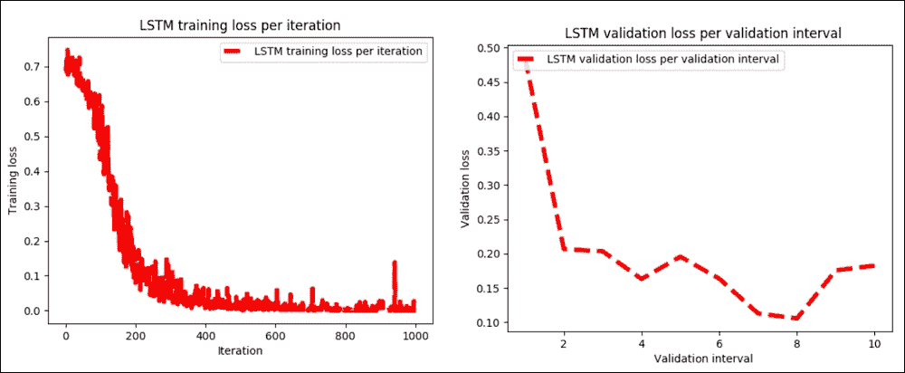

图 21：a）测试集上每次迭代的 LSTM 训练损失，b）每个验证间隔的 LSTM 验证损失

如果我们检查前面的绘图，很明显训练阶段和验证阶段的训练都很顺利，只有 1000 步。然而，读者应加大训练步骤，调整超参数，看看它是如何去。

## 通过 TensorBoard 的可视化

现在让我们观察 TensorBoard 上的 TensorFlow 计算图。只需执行以下命令并在`localhost:6006/`访问 TensorBoard：

```py
tensorboard --logdir /home/logs/
```

图选项卡显示执行图，包括使用的梯度，`loss_op`，精度，最终层，使用的优化器（在我们的例子中是`RMSPro`），LSTM 层（即 RNN 层），嵌入层和`save_op`：

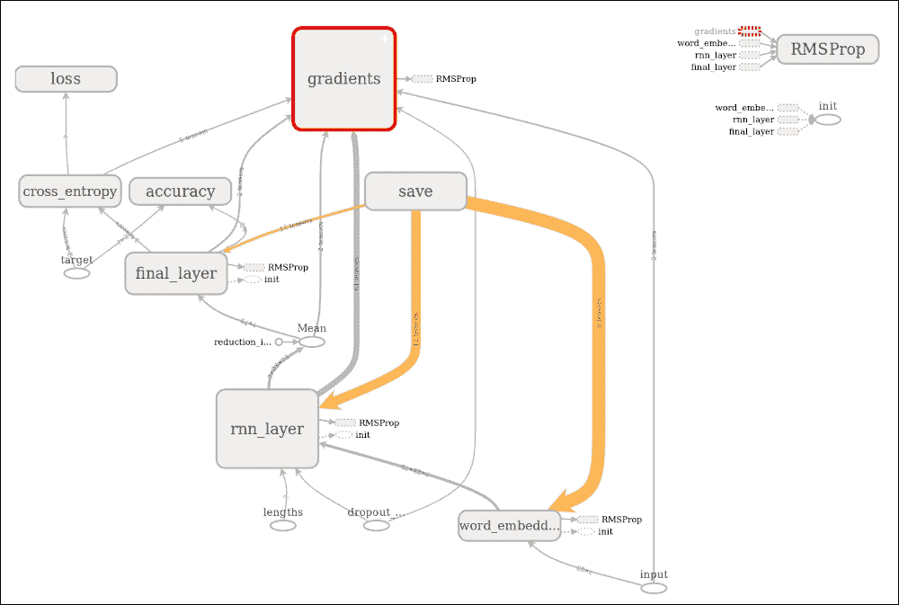

图 22：TensorBoard 上的执行图

执行图显示，我们为这种基于 LSTM 的分类器进行的情感分析计算是非常透明的。我们还可以观察层中的验证，训练损失，准确率和操作：

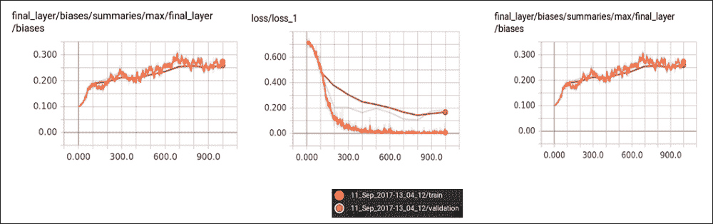

图 23：TensorBoard 层中的验证，训练损失，准确率和操作

## LSTM 模型评估

我们已经训练了并保存了我们的 LSTM 模型。我们可以轻松恢复训练模型并进行一些评估。我们需要准备测试集并使用先前训练的 TensorFlow 模型对其进行预测。我们马上做吧。首先，我们加载所需的模型：

```py
import tensorflow as tf
from data_preparation import Preprocessing
   import pickle
Then we load to show the checkpoint directory where the model was saved. For our case, it was checkpoints/1505148083.
```

### 注意

对于此步骤，使用以下命令执行`predict.py`脚本：

```py
$ python3 predict.py --checkpoints_dir checkpoints/1517781236

```

```py
# Change this path based on output by 'python3 train.py' 
checkpoints_dir = 'checkpoints/1517781236' 

ifcheckpoints_dir is None:
    raise ValueError('Please, a valid checkpoints directory is required (--checkpoints_dir <file name>)')
```

现在加载测试数据集并准备它以评估模型：

```py
data_lstm = Preprocessing(data_dir=data_dir,
                 stopwords_file=stopwords_file,
                 sequence_len=sequence_len,
                 n_samples=n_samples,
                 test_size=test_size,
                 val_samples=batch_size,
                 random_state=random_state,
                 ensure_preprocessed=True)
```

在上面的代码中，完全按照我们在训练步骤中的操作使用以下参数：

```py
data_dir = 'data/' # Data directory containing 'data.csv'
stopwords_file = 'data/stopwords.txt' # Path to stopwords file.
sequence_len = None # Maximum sequence length
n_samples= None # Set n_samples=None to use the whole dataset
test_size = 0.2
batch_size = 100 #Batch size
random_state = 0 # Random state used for data splitting. Default is 0
```

此评估方法的工作流程如下：

1.  首先，导入元图并使用测试数据评估模型
2.  为计算创建 TensorFlow 会话
3.  导入图并恢复其权重
4.  恢复输入/输出张量
5.  执行预测
6.  最后，我们在简单的测试集上打印精度和结果

步骤 1 之前已经完成  。此代码执行步骤 2 到 5：

```py
original_text, x_test, y_test, test_seq_len = data_lstm.get_test_data(original_text=True)
graph = tf.Graph()
with graph.as_default():
    sess = tf.Session()    
    print('Restoring graph ...')
    saver = tf.train.import_meta_graph("{}/model.ckpt.meta".format(FLAGS.checkpoints_dir))
    saver.restore(sess, ("{}/model.ckpt".format(checkpoints_dir)))
    input = graph.get_operation_by_name('input').outputs[0]
    target = graph.get_operation_by_name('target').outputs[0]
    seq_len = graph.get_operation_by_name('lengths').outputs[0]
    dropout_keep_prob = graph.get_operation_by_name('dropout_keep_prob').outputs[0]
    predict = graph.get_operation_by_name('final_layer/softmax/predictions').outputs[0]
    accuracy = graph.get_operation_by_name('accuracy/accuracy').outputs[0]
    pred, acc = sess.run([predict, accuracy],
                         feed_dict={input: x_test,
                                    target: y_test,
                                    seq_len: test_seq_len,
                                    dropout_keep_prob: 1})
    print("Evaluation done.")
```

以下是上述代码的输出：

```py
>>>
Restoring graph ...
The evaluation was done.

```

做得好！训练结束了，让我们打印结果：

```py
print('\nAccuracy: {0:.4f}\n'.format(acc))
for i in range(100):
    print('Sample: {0}'.format(original_text[i]))
    print('Predicted sentiment: [{0:.4f}, {1:.4f}]'.format(pred[i, 0], pred[i, 1]))
    print('Real sentiment: {0}\n'.format(y_test[i]))
```

以下是上述代码的输出：

```py
>>>
Accuracy: 0.9858

Sample: I loved the Da Vinci code, but it raises many theological questions most of which are very absurd...
Predicted sentiment: [0.0000, 1.0000]
Real sentiment: [0\. 1.]
…
Sample: I'm sorry I hate to read Harry Potter, but I love the movies!
Predicted sentiment: [1.0000, 0.0000]
Real sentiment: [1\. 0.]
…
Sample: I LOVE Brokeback Mountain...
Predicted sentiment: [0.0002, 0.9998]
Real sentiment: [0\. 1.]
…
Sample: We also went to see Brokeback Mountain which totally SUCKED!!!
Predicted sentiment: [1.0000, 0.0000]
Real sentiment: [1\. 0.]

```

精度高于 98%。这太棒了！但是，您可以尝试使用调整的超参数迭代训练以获得更高的迭代次数，您可能会获得更高的准确率。我把它留给读者。

在下一节中，我们将看到如何使用 LSTM 开发更高级的 ML 项目，这被称为使用智能手机数据集的人类活动识别。简而言之，我们的 ML 模型将能够将人类运动分为六类：走路，走楼上，走楼下，坐，站立和铺设。

# LSTM 模型和人类活动识别

人类活动识别（HAR）数据库是通过对携带带有嵌入式惯性传感器的腰部智能手机的 30 名参加日常生活活动（ADL）的参与者进行测量而建立的。目标是将他们的活动分类为前面提到的六个类别之一。

## 数据集描述

实验在一组 30 名志愿者中进行，年龄范围为 19-48 岁。每个人都在腰上戴着三星 Galaxy S II 智能手机，完成了六项活动（步行，走楼上，走楼下，坐着，站着，躺着）。使用加速度计和陀螺仪，作者以 50 Hz 的恒定速率捕获了 3 轴线性加速度和 3 轴角速度。

仅使用两个传感器，加速度计和陀螺仪。通过应用噪声滤波器对传感器信号进行预处理，然后在 2.56 秒的固定宽度滑动窗口中采样，重叠 50%。这样每个窗口提供 128 个读数。来自传感器加速度信号的重力和身体运动分量通过巴特沃斯低通滤波器分离成身体加速度和重力。

欲了解更多信息，请参阅本文：Davide Anguita，Alessandro Ghio，Luca Oneto，Xavier Parra 和 Jorge L. Reyes-Ortiz，使用智能手机进行人类活动识别的公共领域数据集和第 21 届关于人工神经网络的欧洲研讨会，计算智能和机器学习，ESANN 2013.比利时布鲁日 24-26，2013 年 4 月。

为简单起见，假设重力仅具有少量低频分量。因此，使用 0.3Hz 截止频率的滤波器。从每个窗口，通过计算来自时域和频域的变量找到特征向量。

已经对实验进行了视频记录以便于手动标记数据。数据集已被随机分为两组，其中 70% 的志愿者被选中用于训练数据，30% 用于测试数据。当我浏览数据集时，训练集和测试集都具有以下文件结构：

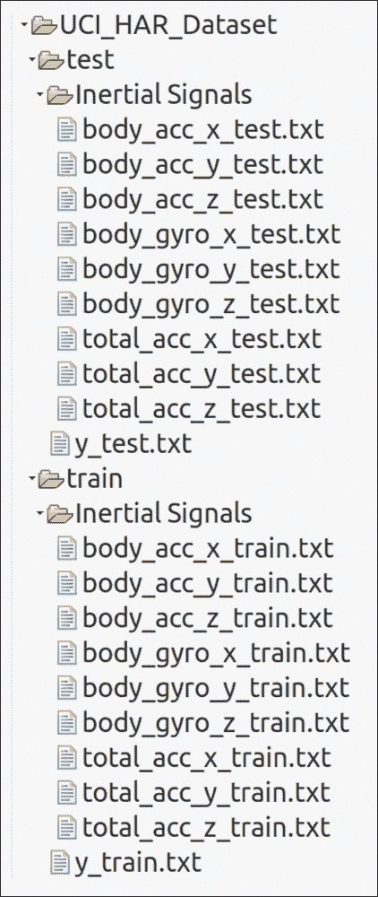

图 24：HAR 数据集文件结构

对于数据集中的每条记录，提供以下内容：

*   来自加速度计的三轴加速度和估计的车身加速度
*   来自陀螺仪传感器的三轴角速度
*   具有时域和频域变量的 561 特征向量
*   它的活动标签
*   进行实验的受试者的标识符

因此，我们知道需要解决的问题。现在是探索技术和相关挑战的时候了。

## 用于 HAR 的 LSTM 模型的工作流程

整个算法有以下工作流程：

1.  加载数据。
2.  定义超参数。
3.  使用命令式编程和超参数设置 LSTM 模型。
4.  应用批量训练。也就是说，选择一批数据，将其提供给模型，然后在一些迭代之后，评估模型并打印批次损失和准确率。
5.  输出图的训练和测试误差。

可以遵循上述步骤并构建一个管道：

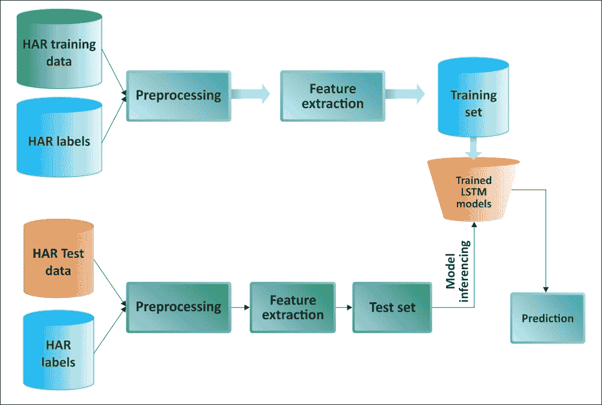

图 25：用于 HAR 的基于 LSTM 的管道

## 为 HAR 实现 LSTM 模型

首先，我们导入所需的包和模块：

```py
import numpy as np
import matplotlib
import matplotlib.pyplot as plt
import tensorflow as tf
from sklearn import metrics
from tensorflow.python.framework import ops
import warnings
import random
warnings.filterwarnings("ignore")
os.environ['TF_CPP_MIN_LOG_LEVEL'] = '3'
```

如前所述，`INPUT_SIGNAL_TYPES`包含一些有用的常量。它们是神经网络的单独标准化输入特征：

```py
INPUT_SIGNAL_TYPES = [
    "body_acc_x_",
    "body_acc_y_",
    "body_acc_z_",
    "body_gyro_x_",
    "body_gyro_y_",
    "body_gyro_z_",
    "total_acc_x_",
    "total_acc_y_",
    "total_acc_z_"
]
```

标签在另一个数组中定义 - 这是用于学习如何分类的输出类：

```py
LABELS = [
    "WALKING",
    "WALKING_UPSTAIRS",
    "WALKING_DOWNSTAIRS",
    "SITTING",
    "STANDING",
    "LAYING"
]
```

我们现在假设您已经从[此链接](https://archive.ics.uci.edu/ml/machine-learning-databases/00240/UCI HAR Dataset.zip)下载了 HAR 数据集并输入了名为`UCIHARDataset`的文件夹（或者您可以选择听起来更合适的合适名称）。此外，我们需要提供训练和测试集的路径：

```py
DATASET_PATH = "UCIHARDataset/"
print("\n" + "Dataset is now located at: " + DATASET_PATH)

TRAIN = "train/"
TEST = "test/"
```

然后我们加载并根据由`[Array [Array [Float]]]`格式的`INPUT_SIGNAL_TYPES`数组定义的输入信号类型，映射每个`.txt`文件的数据。`X`表示神经网络的训练和测试输入：

```py
def load_X(X_signals_paths):
    X_signals = []

    for signal_type_path in X_signals_paths:
        file = open(signal_type_path, 'r')
        # Read dataset from disk, dealing with text files' syntax
        X_signals.append(
            [np.array(serie, dtype=np.float32) for serie in [
                row.replace('  ', ' ').strip().split(' ') for row in file
            ]]
        )
        file.close()

    return np.transpose(np.array(X_signals), (1, 2, 0))

X_train_signals_paths = [DATASET_PATH + TRAIN + "Inertial Signals/" + signal + "train.txt" for signal in INPUT_SIGNAL_TYPES]
X_test_signals_paths = [DATASET_PATH + TEST + "Inertial Signals/" + signal + "test.txt" for signal in INPUT_SIGNAL_TYPES]

X_train = load_X(X_train_signals_paths)
X_test = load_X(X_test_signals_paths)
```

然后我们加载`y`，神经网络的训练和测试输出的标签：

```py
def load_y(y_path):
    file = open(y_path, 'r')
    # Read dataset from disk, dealing with text file's syntax
    y_ = np.array(
        [elem for elem in [
            row.replace('  ', ' ').strip().split(' ') for row in file
        ]],
        dtype=np.int32
    )
    file.close()

    # We subtract 1 to each output class for 0-based indexing 
    return y_ - 1

y_train_path = DATASET_PATH + TRAIN + "y_train.txt"
y_test_path = DATASET_PATH + TEST + "y_test.txt"

y_train = load_y(y_train_path)
y_test = load_y(y_test_path)
```

让我们看看一些数据集的统计数据，例如训练系列的数量（如前所述，每个系列之间有 50% 的重叠），测试系列的数量，每个系列的时间步数，以及每个时间步输入参数：

```py
training_data_count = len(X_train)
test_data_count = len(X_test)
n_steps = len(X_train[0])  
n_input = len(X_train[0][0])  
print("Number of training series: "+ trainingDataCount)
print("Number of test series: "+ testDataCount)
print("Number of timestep per series: "+ nSteps)
print("Number of input parameters per timestep: "+ nInput) 
```

以下是上述代码的输出：

```py
>>>
Number of training series: 7352
Number of test series: 2947
Number of timestep per series: 128
Number of input parameters per timestep: 9

```

现在让我们为训练定义一些核心参数定义。整个神经网络的结构可以通过枚举这些参数和使用 LSTM 这一事实来概括：

```py
n_hidden = 32 # Hidden layer num of features
n_classes = 6 # Total classes (should go up, or should go down)

learning_rate = 0.0025
lambda_loss_amount = 0.0015
training_iters = training_data_count * 300 #Iterate 300 times 
batch_size = 1500
display_iter = 30000 # to show test set accuracy during training
```

我们已经定义了所有核心参数和网络参数。这些是随机选择。我没有进行超参数调整，但仍然运行良好。因此，我建议使用网格搜索技术调整这些超参数。有许多在线资料可供使用。

然而，在构建 LSTM 网络并开始训练之前，让我们打印一些调试信息，以确保执行不会中途停止：

```py
print("Some useful info to get an insight on dataset's shape and normalization:")
print("(X shape, y shape, every X's mean, every X's standard deviation)")
print(X_test.shape, y_test.shape, np.mean(X_test), np.std(X_test))
print("The dataset is therefore properly normalized, as expected, but not yet one-hot encoded.")
```

以下是上述代码的输出：

```py
>>>
Some useful info to get an insight on dataset's shape and normalization:
(X shape, y shape, every X's mean, every X's standard deviation)
(2947, 128, 9) (2947, 1) 0.0991399 0.395671

```

数据集是  ，因此按预期正确标准化，但尚未进行单热编码。

现在训练数据集处于校正和标准化顺序，现在是构建 LSTM 网络的时候了。以下函数从给定参数返回 TensorFlow LSTM 网络。此外，两个 LSTM 单元堆叠在一起，这增加了神经网络的深度：

```py
def LSTM_RNN(_X, _weights, _biases):
    _X = tf.transpose(_X, [1,0,2])# permute n_steps & batch_size
    _X = tf.reshape(_X, [-1, n_input]) 
    _X = tf.nn.relu(tf.matmul(_X, _weights['hidden']) + _biases['hidden'])
    _X = tf.split(_X, n_steps, 0) 
    lstm_cell_1 = tf.nn.rnn_cell.BasicLSTMCell(n_hidden, forget_bias=1.0, state_is_tuple=True)
    lstm_cell_2 = tf.nn.rnn_cell.BasicLSTMCell(n_hidden, forget_bias=1.0, state_is_tuple=True)
    lstm_cells = tf.nn.rnn_cell.MultiRNNCell([lstm_cell_1, lstm_cell_2], state_is_tuple=True)
    outputs, states = tf.contrib.rnn.static_rnn(lstm_cells, _X, dtype=tf.float32)
    lstm_last_output = outputs[-1]
    return tf.matmul(lstm_last_output, _weights['out']) + _biases['out']
```

如果我们仔细查看前面的代码片段，我们可以看到我们得到了“多对一”样式分类器的最后一步输出特征。现在，问题是什么是多对一 RNN 分类器？好吧，类似于图 5，我们接受特征向量的时间序列（每个时间步长一个向量）并将它们转换为输出中的概率向量以进行分类。

现在我们已经能够构建我们的 LSTM 网络，我们需要将训练数据集准备成批量。以下函数从`(X|y)_train`数据中获取`batch_size`数据量：

```py
def extract_batch_size(_train, step, batch_size):
    shape = list(_train.shape)
    shape[0] = batch_size
    batch_s = np.empty(shape)
    for i in range(batch_size):
        index = ((step-1)*batch_size + i) % len(_train)
        batch_s[i] = _train[index]
    return batch_s
```

之后，我们需要将数字索引的输出标签编码为二元类别。然后我们用`batch_size`执行训练步骤。例如，`[[5], [0], [3]]`需要转换为类似于`[[0, 0, 0, 0, 0, 1], [1, 0, 0, 0, 0, 0], [0, 0, 0, 1, 0, 0]]`的形状。好吧，我们可以用单热编码来做到这一点。以下方法执行完全相同的转换：

```py
def one_hot(y_):
    y_ = y_.reshape(len(y_))
    n_values = int(np.max(y_)) + 1
    return np.eye(n_values)[np.array(y_, dtype=np.int32)]
```

优秀的！我们的数据集准备就绪，因此我们可以开始构建网络。首先，我们为输入和标签创建两个单独的占位符：

```py
x = tf.placeholder(tf.float32, [None, n_steps, n_input])
y = tf.placeholder(tf.float32, [None, n_classes])
```

然后我们创建所需的权重向量：

```py
weights = {
    'hidden': tf.Variable(tf.random_normal([n_input, n_hidden])), 
    'out': tf.Variable(tf.random_normal([n_hidden, n_classes], mean=1.0))
}
```

然后我们创建所需的偏向量：

```py
biases = {
    'hidden': tf.Variable(tf.random_normal([n_hidden])),
    'out': tf.Variable(tf.random_normal([n_classes]))
}
```

然后我们通过传递输入张量，权重向量和偏置向量来构建模型，如下所示：

```py
pred = LSTM_RNN(x, weights, biases)
```

此外，我们还需要计算`cost`操作，正则化，优化器和评估。我们使用 L2 损失进行正则化，这可以防止这种过度杀伤神经网络过度适应训练中的问题：

```py
l2 = lambda_loss_amount * sum(tf.nn.l2_loss(tf_var) for tf_var in tf.trainable_variables())

cost = tf.reduce_mean(tf.nn.softmax_cross_entropy_with_logits_v2(labels=y, logits=pred)) + l2

optimizer = tf.train.AdamOptimizer(learning_rate=learning_rate).minimize(cost)
correct_pred = tf.equal(tf.argmax(pred,1), tf.argmax(y,1))
accuracy = tf.reduce_mean(tf.cast(correct_pred, tf.float32))
Great! So far, everything has been fine. Now we are ready to train the neural network. First, we create some lists to hold some training's performance:
```

```py
test_losses = []
test_accuracies = []
train_losses = []
train_accuracies = []
```

然后我们创建一个  TensorFlow 会话，启动图并初始化全局变量：

```py
sess = tf.InteractiveSession(config=tf.ConfigProto(log_device_placement=False))
init = tf.global_variables_initializer()
sess.run(init)
```

然后我们在每个循环中以`batch_size`数量的示例数据执行训练步骤。我们首先使用批量数据进行训练，然后我们仅在几个步骤评估网络以加快训练速度。另外，我们评估测试集（这里没有学习，只是诊断评估）。最后，我们打印结果：

```py
step = 1
while step * batch_size <= training_iters:
    batch_xs =  extract_batch_size(X_train, step, batch_size)
    batch_ys = one_hot(extract_batch_size(y_train, step, batch_size))
    _, loss, acc = sess.run(
        [optimizer, cost, accuracy],
        feed_dict={
            x: batch_xs,
            y: batch_ys
        }
    )
    train_losses.append(loss)
    train_accuracies.append(acc)
    if (step*batch_size % display_iter == 0) or (step == 1) or (step * batch_size > training_iters):
        print("Training iter #" + str(step*batch_size) + \":   Batch Loss = " + "{:.6f}".format(loss) + \", Accuracy = {}".format(acc))
        loss, acc = sess.run(
            [cost, accuracy], 
            feed_dict={
                x: X_test,
                y: one_hot(y_test)
            }
        )
        test_losses.append(loss)
        test_accuracies.append(acc)
        print("PERFORMANCE ON TEST SET: " + \
              "Batch Loss = {}".format(loss) + \
              ", Accuracy = {}".format(acc))
    step += 1
print("Optimization Finished!")
one_hot_predictions, accuracy, final_loss = sess.run(
    [pred, accuracy, cost],
    feed_dict={
        x: X_test,
        y: one_hot(y_test)
    })
test_losses.append(final_loss)
test_accuracies.append(accuracy)

print("FINAL RESULT: " + \
      "Batch Loss = {}".format(final_loss) + \
      ", Accuracy = {}".format(accuracy))
```

以下是上述代码的输出：

```py
>>>
Training iter #1500:   Batch Loss = 3.266330, Accuracy = 0.15733332931995392
PERFORMANCE ON TEST SET: Batch Loss = 2.6498606204986572, Accuracy = 0.15473362803459167
Training iter #30000:   Batch Loss = 1.538126, Accuracy = 0.6380000114440918
…PERFORMANCE ON TEST SET: Batch Loss = 0.5507552623748779, Accuracy = 0.8924329876899719
Optimization Finished!
FINAL RESULT: Batch Loss = 0.6077192425727844, Accuracy = 0.8686800003051758

```

做得好！ 训练进展顺利。但是，视觉概述会更有用：

```py
indep_train_axis = np.array(range(batch_size, (len(train_losses)+1)*batch_size, batch_size))
plt.plot(indep_train_axis, np.array(train_losses),     "b--", label="Train losses")
plt.plot(indep_train_axis, np.array(train_accuracies), "g--", label="Train accuracies")
indep_test_axis = np.append(np.array(range(batch_size, len(test_losses)*display_iter, display_iter)[:-1]),
    [training_iters])
plt.plot(indep_test_axis, np.array(test_losses),     "b-", label="Test losses")
plt.plot(indep_test_axis, np.array(test_accuracies), "g-", label="Test accuracies")
plt.title("Training session's progress over iterations")
plt.legend(loc='upper right', shadow=True)
plt.ylabel('Training Progress (Loss or Accuracy values)')
plt.xlabel('Training iteration')
plt.show()
```

以下是上述代码的输出：

```py
>>>

```

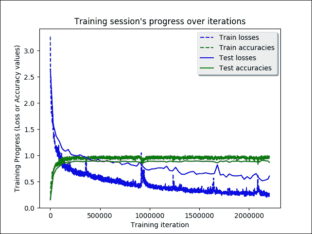

图 26：迭代时的 LSTM 训练课程

我们需要计算其他表现指标，例如`accuracy`，`precision`，`recall`和`f1`度量：

```py
predictions = one_hot_predictions.argmax(1)
print("Testing Accuracy: {}%".format(100*accuracy))
print("")
print("Precision: {}%".format(100*metrics.precision_score(y_test, predictions, average="weighted")))
print("Recall: {}%".format(100*metrics.recall_score(y_test, predictions, average="weighted")))
print("f1_score: {}%".format(100*metrics.f1_score(y_test, predictions, average="weighted")))
```

以下是上述代码的输出：

```py
>>>
Testing Accuracy: 89.51476216316223%
Precision: 89.65053428376297%
Recall: 89.51476077366813%
f1_score: 89.48593061935716%

```

由于我们正在接近的问题是多类分类，因此绘制混淆矩阵是有意义的：

```py
print("")
print ("Showing Confusion Matrix")

cm = metrics.confusion_matrix(y_test, predictions)
df_cm = pd.DataFrame(cm, LABELS, LABELS)
plt.figure(figsize = (16,8))
plt.ylabel('True label')
plt.xlabel('Predicted label')
sn.heatmap(df_cm, annot=True, annot_kws={"size": 14}, fmt='g', linewidths=.5)
plt.show()
```

以下是上述代码的输出：

```py
>>>

```


图 27：多类混淆矩阵（预测与实际）

在混淆矩阵中，训练和测试数据不是在类之间平均分配，因此正常情况下，超过六分之一的数据在最后一类中被正确分类。话虽如此，我们已经设法达到约 87% 的预测准确率。我们很快就会看到更多分析。它可能更高，但是训练是在 CPU 上进行的，因此它的精度很低，当然需要很长时间。因此，我建议你在 GPU 上训练，以获得更好的结果。此外，调整超参数可能是一个不错的选择。

# 总结

LSTM 网络配备了特殊的隐藏单元，称为存储单元，其目的是长时间记住先前的输入。这些单元在每个时刻采用先前状态和网络的当前输入作为输入。通过将它们与内存的当前内容相结合，并通过其他单元的门控机制决定保留什么以及从内存中删除什么，LSTM 已被证明是非常有用的并且是学习长期依赖性的有效方式。

在本章中，我们讨论了 RNN。我们看到了如何使用具有高时间依赖性的数据进行预测。我们看到了如何开发几种真实的预测模型，使用 RNN 和不同的架构变体使预测分析更容易。我们从 RNN 的理论背景开始。

然后我们看了几个例子，展示了一种实现图像分类预测模型，电影和产品情感分析以及 NLP 垃圾邮件预测的系统方法。然后我们看到了如何开发时间序列数据的预测模型。最后，我们看到了 RNN 用于人类活动识别的更高级应用，我们观察到分类准确率约为 87%。

DNN 以统一的方式构造，使得在网络的每一层，数千个相同的人工神经元执行相同的计算。因此，DNN 的架构非常适合 GPU 可以有效执行的计算类型。 GPU 具有优于 CPU 的额外优势；这些包括具有更多计算单元并具有更高的带宽用于存储器检索。

此外，在许多需要大量计算工作的深度学习应用中，可以利用 GPU 的图形特定功能来进一步加速计算。在下一章中，我们将看到如何使训练更快，更准确，甚至在节点之间分配。

