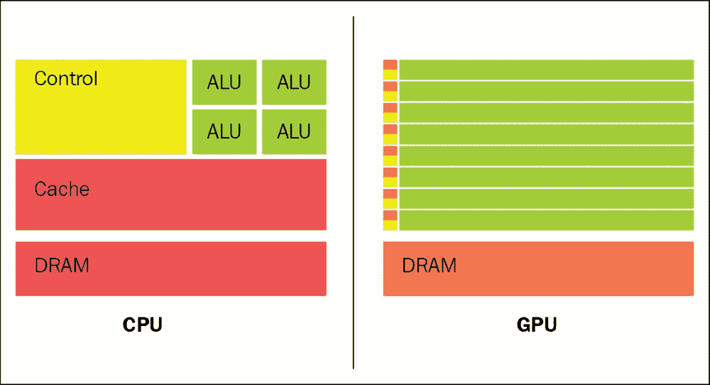
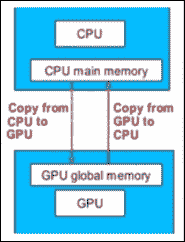

# 第 7 章异构和分布式计算

使用 TensorFlow 表示的计算可以在各种各样的异构系统上进行很少或没有变化，从手机和平板电脑等移动设备到数百台机器的大规模分布式系统和数千种计算设备（如 GPU）牌。

在本章中，我们将探讨 TensorFlow 上的这一基本主题。特别是，我们将考虑在 GPU 卡和分布式系统上执行 TensorFlow 模型的可能性。

GPU 具有优于 CPU 的额外优势，包括具有更多计算单元并具有更高的带宽用于存储器检索。此外，在许多需要大量计算工作的深度学习应用中，可以利用 GPU 图形特定功能来进一步加速计算。

同时，如果您必须处理非常大的数据集来训练模型，则分布式计算策略可能很有用。

本章介绍以下主题：

*   GPGPU 计算
*   GPU 编程模型
*   TensorFlow GPU 设置
*   分布式计算
*   分布式 TensorFlow 设置

# GPGPU 计算

有几个原因导致深度学习（DL）在最近几十年被开发并成为机器学习（ML）领域的关注焦点。

一个原因，也许是主要原因，肯定是硬件的进步，新的处理器（如图形处理单元（GPU））的可用性，它大大减少了训练网络所需的时间，将时间减少了 10 或者甚至 20 次。

实际上，由于各个神经元之间的连接具有数值估计的权重，并且由于网络通过适当地校准权重来学习，因此增加网络复杂性将导致高计算能力，并且 GPU 可以处理高计算能力。

## GPGPU 历史

GPGPU 代表图形处理单元上的通用计算。它认识到将 GPU 技术用于图形以外的应用的趋势。直到 2006 年，图形 API OpenGL 和 DirectX 标准才是用 GPU 编程的唯一方法。任何在 GPU 上执行任意计算的尝试都受这些 API 的编程限制。

GPU 被设计为，使用称为像素着色器的可编程算术单元，为屏幕上的每个像素生成颜色。程序员意识到，如果输入是与像素颜色具有不同含义的数值数据，那么他们可以对像素着色器进行编程以执行任意计算。

存在内存限制，因为程序只能接收少量输入颜色和纹理单元作为输入数据。几乎不可能预测 GPU 如何处理浮点数据（如果它能够处理它们），那么许多科学计算都无法使用 GPU。

任何想要解决数值问题的人都必须学习 OpenGL 或 DirectX，这是与 GPU 通信的唯一方法。

## CUDA 架构

2006 年，NVIDIA 提供了支持 DirectX 10 的第一款 GPU。GeForce 8800GTX 也是第一款使用 CUDA 架构的 GPU。该架构包括几个专为 GPU 计算而设计的新组件，旨在消除阻止以前的 GPU 用于非图形计算的限制。事实上，GPU 上的执行单元可以读写任意内存，也可以访问称为共享内存的软件中维护的缓存  。

添加的这些架构特性使 CUDA GPU 在通用计算以及传统图形任务方面表现出色。下图总结了 GPU 和 CPU 的各个组件之间的空间划分。如您所见，GPU 为数据处理投入了更多的晶体管;它是一个高度并行，多线程和多核处理器：

图 1：CPU 与 GPU 架构

请注意，GPU 芯片上几乎所有空间都专用于 ALU，而不是缓存和控制，因此适合重复计算大量数据。 GPU 访问本地存储器并通过总线（目前是 PCI Express）连接到系统 CPU。

图形芯片由一系列多处理器组成，即流多处理器（SM）。多处理器的数量取决于每个 GPU 的特定特性和表现等级。

每个多处理器又由流处理器（或核）组成。这些处理器中的每一个都可以对具有单精度和双精度的整数或浮点数执行基本算术运算。

## GPU 编程模型

在这一点，有必要介绍一些基本概念来阐明 CUDA 编程模型。

首先区分主机和设备。

在主机端执行的代码是在 CPU 上执行的代码的一部分，这还包括 RAM 和硬盘。在设备上执行的代码是自动加载到显卡上并在后者上运行的代码。

另一个重要的概念是内核;它代表在设备上执行并从主机启动的功能。内核中定义的代码将由一组线程并行执行。

以下架构总结了 GPU 编程模型的工作原理：

*   正在运行的程序将具有在 CPU 上运行的源代码和在 GPU 上运行的代码
*   CPU 和 GPU 分开了记忆
*   数据从 CPU 传输到 GPU 进行计算
*   GPU 计算的数据输出被复制回 CPU 内存

    

    图 2：GPU 编程模型