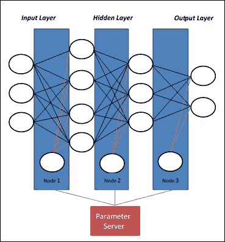
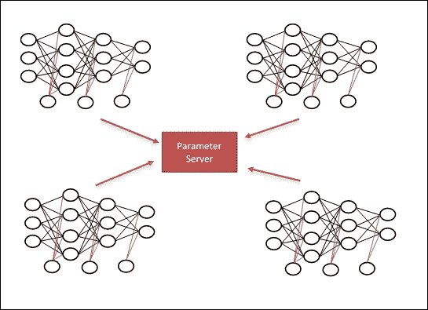

# 分布式计算

DL 模型必须接受大量数据的训练，以提高其表现。但是，训练具有数百万参数的深度网络可能需要数天甚至数周。在大规模分布式深度网络中，Dean 等人。提出了两种范例，即模型并行性和数据并行性，它们允许我们在多个物理机器上训练和服务网络模型。在下一节中，我们引入了这些范例，重点关注分布式 TensorFlow 功能。

## 模型并行

模型并行性为每个处理器提供相同的数据，但对其应用不同的模型。如果网络模型太大而无法放入一台机器的内存中，则可以将模型的不同部分分配给不同的机器。可能的模型并行方法是在机器（节点 1）上具有第一层，在第二机器（节点 2）上具有第二层，等等。有时这不是最佳方法，因为最后一层必须等待在前进步骤期间完成第一层的计算，并且第一层必须在反向传播步骤期间等待最深层。只有模型可并行化（例如 GoogleNet）才能在不同的机器上实现，而不会遇到这样的瓶颈：

图 3：在模型并行性中，每个节点计算网络的不同部分

大约 20 年前，  训练神经网络的人可能是术语模型并行性的创始人，因为他们有不同的神经网络模型来训练和测试，并且网络中的多个层可以用相同的数据。

## 数据并行

数据并行性表示将单个指令应用于多个数据项。它是 SIMD（单指令，多数据）计算机架构的理想工作负载，是电子数字计算机上最古老，最简单的并行处理形式。

在这种方法中，网络模型适合于一台机器，称为参数服务器，而大多数计算工作由多台机器完成，称为工作器：

*   参数服务器：这是一个 CPU，您可以在其中存储工作器所需的变量。就我而言，这是我定义网络所需的权重变量的地方。
*   工作器：这是我们完成大部分计算密集型工作的地方。

每个工作器负责读取，计算和更新模型参数，并将它们发送到参数服务器：

*   在正向传播中，工作者从参数服务器获取变量，在我们的工作者上对它们执行某些操作。
*   在向后传递中，工作器将当前状态发送回参数服务器，参数服务器执行更新操作，并为我们提供新的权重以进行尝试：

    

    图 4：在数据并行模型中，每个节点计算所有参数

数据并行可能有两个主要的选项：

*   同步训练：所有工作器同时读取参数，计算训练操作，并等待所有其他人完成。然后将梯度平均，并将单个更新发送到参数服务器。因此，在任何时间点，工作器都将意识到图参数的相同值。
*   异步训练：工作器将异步读取参数服务器，计算训练操作，并发送异步更新。在任何时间点，两个不同的工作器可能会意识到图参数的不同值。