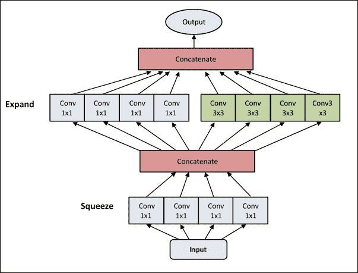
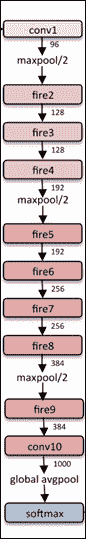

# 八、TFLearn

TFLearn 是一个库，它使用漂亮且熟悉的 scikit-learn API 包装了许多新的 TensorFlow API。

TensorFlow 是关于构建和执行图的全部内容。这是一个非常强大的概念，但从一开始就很麻烦。

在 TF.Learn 的引擎盖下，我们只使用了三个部分：

*   层：一组高级 TensorFlow 函数，允许我们轻松构建复杂的图，从完全连接的层，卷积和批量规范到损失和优化。
*   graph_actions：一组工具，用于对 TensorFlow 图进行训练，评估和运行推理。
*   Estimator：将所有内容打包成一个遵循 scikit-learn 接口的类，并提供了一种轻松构建和训练自定义 TensorFlow 模型的方法。

## 安装

要安装 TFLearn，  最简单的方法是运行以下命令：

```py
pip install git+https://github.com/tflearn/tflearn.git

```

对于最新的稳定版本，请使用以下命令：

```py
pip install tflearn

```

否则，您也可以通过运行以下命令（从源文件夹）从源安装它：

```py
python setup.py install

```

## 泰坦尼克号生存预测器

在本教程中，我们将学习使用  TFLearn 和 TensorFlow，使用他们的个人信息（如性别和年龄）模拟泰坦尼克号乘客的生存机会。为了解决这个经典的 ML 任务，我们将构建一个 DNN 分类器。

我们来看看数据集（TFLearn 将自动为您下载）。

对于每位乘客，提供以下信息：

```py
survived       Survived (0 = No; 1 = Yes)
pclass            Passenger Class (1 = st; 2 = nd; 3 = rd)
name             Name
sex                  Sex
age                 Age
sibsp              Number of Siblings/Spouses Aboard
parch             Number of Parents/Children Aboard
ticket             Ticket Number
fare               Passenger Fare
```

以下是数据集中的一些示例：

| `sibsp` | `parch` | `ticket` | `fare` |
| --- | --- | --- | --- |
| 1 | 1 | Aubart, Mme. Leontine Pauline | female | 24 | 0 | 0 | PC 17477 | 69.3000 |
| 0 | 2 | Bowenur, Mr. Solomon | male | 42 | 0 | 0 | 211535 | 13.0000 |
| 1 | 3 | Baclini, Miss. Marie Catherine | female | 5 | 2 | 1 | 2666 | 19.2583 |
| 0 | 3 | Youseff, Mr. Gerious | male | 45.5 | 0 | 0 | 2628 | 7.2250 |

我们的任务有两个类：没有幸存（`class = 0`）和幸存（`class = 1`）。乘客数据有 8 个特征。泰坦尼克号数据集存储在 CSV 文件中，因此我们可以使用`TFLearn load_csv()`函数将文件中的数据加载到 Python 列表中。我们指定`target_column`参数以指示我们的标签（幸存与否）位于第一列（id：0）。这些函数将返回一个元组:(数据，标签）。

让我们从导入 NumPy 和 TFLearn 库开始：

```py
import numpy as np
import tflearn as tfl
```

下载泰坦尼克号数据集：

```py
from tflearn.datasets import titanic
titanic.download_dataset('titanic_dataset.csv')
```

加载 CSV 文件，并指出第一列代表`labels`：

```py
from tflearn.data_utils import load_csv
data, labels = load_csv('titanic_dataset.csv', target_column=0,
                        categorical_labels=True, n_classes=2)
```

在准备好在我们的 DNN 分类器中使用之前，数据需要一些预处理。我们必须删除无法帮助我们进行分析的列字段。我们丢弃名称和票据字段，因为我们估计乘客的姓名和票证与他们的幸存机会无关：

```py
def preprocess(data, columns_to_ignore):
```

预处理阶段从降序 id 和删除列开始：

```py
    for id in sorted(columns_to_ignore, reverse=True):
        [r.pop(id) for r in data]
    for i in range(len(data)):
```

性别场转换为浮动（待操纵）：

```py
    data[i][1] = 1\. if data[i][1] == 'female' else 0.
    return np.array(data, dtype=np.float32)
```

如前所述，分析将忽略名称和故障单字段：

```py
to_ignore=[1, 6]
```

然后我们调用`preprocess`程序：

```py
data = preprocess(data, to_ignore)
```

接下来，我们指定输入数据的形状。输入样本总共有`6`特征，我们将分批量样本以节省内存，因此我们的数据输入形状为`[None, 6]`。 `None`参数表示未知维度，因此我们可以更改批量中处理的样本总数：

```py
net = tfl.input_data(shape=[None, 6])
```

最后，我们用这个简单的语句序列构建了一个 3 层神经网络：

```py
net = tfl.fully_connected(net, 32)
net = tfl.fully_connected(net, 32)
net = tfl.fully_connected(net, 2, activation='softmax')
net = tfl.regression(net)
```

TFLearn 提供了一个模型包装器`DNN`，它自动执行神经网络分类器任务：

```py
model = tfl.DNN(net)
```

我们将为批量大小为`16`的`10`周期运行它：

```py
model.fit(data, labels, n_epoch=10, batch_size=16, show_metric=True)
```

当我们运行模型时，我们应该得到以下输出：

```py
Training samples: 1309
Validation samples: 0
--
Training Step: 82  | total loss: 0.64003
| Adam | epoch: 001 | loss: 0.64003 - acc: 0.6620 -- iter: 1309/1309
--
Training Step: 164  | total loss: 0.61915
| Adam | epoch: 002 | loss: 0.61915 - acc: 0.6614 -- iter: 1309/1309
--
Training Step: 246  | total loss: 0.56067
| Adam | epoch: 003 | loss: 0.56067 - acc: 0.7171 -- iter: 1309/1309
--
Training Step: 328  | total loss: 0.51807
| Adam | epoch: 004 | loss: 0.51807 - acc: 0.7799 -- iter: 1309/1309
--
Training Step: 410  | total loss: 0.47475
| Adam | epoch: 005 | loss: 0.47475 - acc: 0.7962 -- iter: 1309/1309
--
Training Step: 574  | total loss: 0.48988
| Adam | epoch: 007 | loss: 0.48988 - acc: 0.7891 -- iter: 1309/1309
--
Training Step: 656  | total loss: 0.55073
| Adam | epoch: 008 | loss: 0.55073 - acc: 0.7427 -- iter: 1309/1309
--
Training Step: 738  | total loss: 0.50242
| Adam | epoch: 009 | loss: 0.50242 - acc: 0.7854 -- iter: 1309/1309
--
Training Step: 820  | total loss: 0.41557
| Adam | epoch: 010 | loss: 0.41557 - acc: 0.8110 -- iter: 1309/1309
--
```

模型准确率约为 81%，这意味着它可以预测 81% 乘客的正确结果（即乘客是否幸存）。

# PrettyTensor

PrettyTensor 允许开发人员包装 TensorFlow 操作，以快速链接任意数量的层来定义神经网络。即将推出的是 Pretty Tensor 功能的简单示例：我们将一个标准的 TensorFlow 对象包装成一个与库兼容的对象；然后我们通过三个完全连接的层提供它，我们最终输出 softmax 分布：

```py
pretty = tf.placeholder([None, 784], tf.float32)
softmax = (prettytensor.wrap(examples)
 .fully_connected(256, tf.nn.relu)
 .fully_connected(128, tf.sigmoid)
 .fully_connected(64, tf.tanh)
 .softmax(10))
```

PrettyTensor 安装非常简单。您只需使用`pip`安装程序：

```py
sudo pip install prettytensor

```

## 链接层

PrettyTensor 具有三种操作模式，共享链式方法的能力。

## 正常模式

在正常模式下，每调用一次，就会创建一个新的 PrettyTensor。这样可以轻松链接，您仍然可以多次使用任何特定对象。这样可以轻松分支网络。

## 顺序模式

在顺序模式下，  内部变量 - 头部 - 跟踪最近的输出张量，从而允许将调用链分解为多个语句。

这是一个简单的例子：

```py
seq = pretty_tensor.wrap(input_data).sequential()
seq.flatten()
seq.fully_connected(200, activation_fn=tf.nn.relu)
seq.fully_connected(10, activation_fn=None)
result = seq.softmax(labels, name=softmax_name))
```

## 分支和连接

可以使用一流`branch`和`join`方法构建复杂网络：

*   `branch`创建一个单独的 PrettyTensor 对象，该对象在调用时指向当前头部，这允许用户定义一个单独的塔，该塔以回归目标结束，以输出结束或重新连接网络。重新连接允许用户定义复合层，如初始。
*   `join`用于连接多个输入或重新连接复合层。

## 数字分类器

在这个例子中，我们将定义和训练一个两层模型和一个 LeNe​​t 5 风格的卷积模型：

```py
import tensorflow as tf
import prettytensor as pt
from prettytensor.tutorial import data_utils

tf.app.flags.DEFINE_string('save_path',\
                           None, \
                           'Where to save the model checkpoints.')

FLAGS = tf.app.flags.FLAGS

BATCH_SIZE = 50
EPOCH_SIZE = 60000
TEST_SIZE = 10000
```

由于我们将数据作为 NumPy 数组提供，因此我们需要在图中创建占位符。这些然后必须使用进料`dict`语句馈送：

```py
image_placeholder = tf.placeholder\
                    (tf.float32, [BATCH_SIZE, 28, 28, 1])

labels_placeholder = tf.placeholder\
                     (tf.float32, [BATCH_SIZE, 10])
```

接下来，我们创建`multilayer_fully_connected`函数。前两层是完全连接的（`100`神经元），最后一层是`softmax`结果层。如您所见，链接层是一个非常简单的操作：

```py
def multilayer_fully_connected(images, labels):
  images = pt.wrap(images)
  with pt.defaults_scope\
          (activation_fn=tf.nn.relu,l2loss=0.00001):

    return (images.flatten().\
            fully_connected(100).\
            fully_connected(100).\
            softmax_classifier(10, labels))
```

现在我们将构建一个多层卷积网络：该架构类似于 LeNet 5。请更改此设置，以便您可以尝试其他架构：

```py
def lenet5(images, labels):
  images = pt.wrap(images)
  with pt.defaults_scope\
            (activation_fn=tf.nn.relu, l2loss=0.00001):

    return (images.conv2d(5, 20).\
            max_pool(2, 2).\
            conv2d(5, 50).\
            max_pool(2, 2).\
            flatten().\
            fully_connected(500).\
            softmax_classifier(10, labels))
```

根据所选模型，我们可能有一个 2 层分类器（`multilayer_fully_connected`）或卷积分类器（`lenet5`）：

```py
def make_choice():
    var = int(input('(1) = multy layer model   (2) = lenet 5 '))
    print(var)
    if var == 1:
        result = multilayer_fully_connected\
                 (image_placeholder,labels_placeholder)
        run_model(result)
    elif var == 2:
        result = lenet5\
                 (image_placeholder,labels_placeholder)
        run_model(result) 
    else:
        print ('incorrect input value')
```

最后，我们将为所选模型定义`accuracy`：

```py
def run_model(result):
    accuracy = result.softmax.evaluate_classifier\
                   (labels_placeholder,phase=pt.Phase.test)
```

接下来，我们构建训练和测试集：

```py
  train_images, train_labels = data_utils.mnist(training=True)
  test_images, test_labels = data_utils.mnist(training=False)
```

我们将使用梯度下降优化程序并将其应用于图。 `pt.apply_optimizer`函数增加了正则化损失并设置了一个步进计数器：

```py
  optimizer = tf.train.GradientDescentOptimizer(0.01)
  train_op = pt.apply_optimizer\
                   (optimizer,losses=[result.loss])
```

我们可以在正在运行的会话中设置`save_path`，以便每隔一段时间自动保存进度。否则，模型将在会话结束时丢失：

```py
runner = pt.train.Runner(save_path=FLAGS.save_path)
with tf.Session():
    for epoch in range(0,10)
```

随机展示训练数据：

```py
        train_images, train_labels = \
                      data_utils.permute_data\
                      ((train_images, train_labels))

        runner.train_model(train_op,result.\
                           loss,EPOCH_SIZE,\
                           feed_vars=(image_placeholder,\
                                      labels_placeholder),\
                           feed_data=pt.train.\
                           feed_numpy(BATCH_SIZE,\
                                      train_images,\
                                      train_labels),\
                           print_every=100)

        classification_accuracy = runner.evaluate_model\
                                  (accuracy,\
                                   TEST_SIZE,\
                                   feed_vars=(image_placeholder,\
                                              labels_placeholder),\
                                   feed_data=pt.train.\
                                   feed_numpy(BATCH_SIZE,\
                                              test_images,\
                                              test_labels))      
    print("epoch" , epoch + 1)
    print("accuracy", classification_accuracy )

if __name__ == '__main__':
    make_choice()
```

运行示例，我们必须选择要训练的模型：

```py
(1) = multylayer model   (2) = lenet 5
```

通过选择`multylayer model`，我们应该具有 95.5% 的准确率：

```py
Extracting /tmp/data\train-images-idx3-ubyte.gz
Extracting /tmp/data\train-labels-idx1-ubyte.gz
Extracting /tmp/data\t10k-images-idx3-ubyte.gz
Extracting /tmp/data\t10k-labels-idx1-ubyte.gz
epoch 1
accuracy [0.8969]
epoch 2
accuracy [0.914]
epoch 3
accuracy [0.9188]
epoch 4
accuracy [0.9306]
epoch 5
accuracy [0.9353]
epoch 6
accuracy [0.9384]
epoch 7
accuracy [0.9445]
epoch 8
accuracy [0.9472]
epoch 9
accuracy [0.9531]
epoch 10
accuracy [0.9552]
```

而对于 Lenet5，我们应该具有 98.8% 的准确率：

```py
Extracting /tmp/data\train-images-idx3-ubyte.gz
Extracting /tmp/data\train-labels-idx1-ubyte.gz
Extracting /tmp/data\t10k-images-idx3-ubyte.gz
Extracting /tmp/data\t10k-labels-idx1-ubyte.gz

epoch 1
accuracy [0.9686]
epoch 2
accuracy [0.9755]
epoch 3
accuracy [0.983]
epoch 4
accuracy [0.9841]
epoch 5
accuracy [0.9844]
epoch 6
accuracy [0.9863]
epoch 7
accuracy [0.9862]
epoch 8
accuracy [0.9877]
epoch 9
accuracy [0.9855]
epoch 10
accuracy [0.9886]
```

# Keras

Keras 是一个用 Python 编写的开源神经网络库。它专注于最小化，模块化和可扩展性，旨在实现 DNN 的快速实验。

该库的主要作者和维护者是名为 FrançoisChollet 的 Google 工程师，该库是项目 ONEIROS（开放式神经电子智能机器人操作系统）研究工作的一部分。

Keras 是按照以下设计原则开发的：

*   模块化：模型被理解为独立，完全可配置的模块序列或图，可以通过尽可能少的限制插入到一起。神经层，成本函数，优化器，初始化方案和激活函数都是独立的模块，可以组合起来创建新模型。
*   极简主义：每个模块必须简短（几行代码）并且简单。在肮脏的读取之上，源代码应该是透明的。
*   可扩展性：新模块易于添加（如新类和函数），现有模块提供了基于新模块的示例。能够轻松创建新模块可以实现完全表现力，使 Keras 适合高级研究。

Keras 既可以作为 TensorFlow API 在嵌入式版本中使用，也可以作为库使用：

*   tf.keras 来自[此链接](https://www.tensorflow.org/api_docs/python/tf/keras)
*   Keras v 2.1.4（更新和安装指南请参见[此链接](https://keras.io)）

    在以下部分中，我们将了解如何使用第一个和第二个实现。

## Keras 编程模型

Keras 的核心数据结构是一个模型，它是一种组织层的方法。有两种类型的模型：

*   顺序：这只是用于实现简单模型的线性层叠
*   函数式 API：用于更复杂的架构，例如具有多个输出和有向无环图的模型

### 顺序模型

在本节中，我们将快速通过向您展示代码来解释顺序模型的工作原理。让我们首先使用 TensorFlow API 导入和构建 Keras `Sequential` 模型：

```py
import tensorflow as tf
from tensorflow.python.keras.models import Sequential
model = Sequential()
```

一旦我们定义了模型，我们就可以添加一个或多个层。堆叠操作由`add()`语句提供：

```py
from keras.layers import Dense, Activation
```

例如，让我们添加第一个完全连接的神经网络层和激活函数：

```py
model.add(Dense(output_dim=64, input_dim=100))
model.add(Activation("relu"))
```

然后我们添加第二个`softmax`层：

```py
model.add(Dense(output_dim=10))
model.add(Activation("softmax"))
```

如果模型看起来很好，我们必须`compile()`模型，指定损失函数和要使用的优化器：

```py
model.compile(loss='categorical_crossentropy',\
              optimizer='sgd',\
              metrics=['accuracy'])
```

我们现在可以配置我们的优化器。 Keras 尝试使编程变得相当简单，允许用户在需要时完全控制。

编译完成后，模型必须符合以下数据：

```py
model.fit(X_train, Y_train, nb_epoch=5, batch_size=32)
```

或者，我们可以手动将批次提供给我们的模型：

```py
model.train_on_batch(X_batch, Y_batch)
```

一旦训练完成，我们就可以使用我们的模型对新数据进行预测：

```py
classes = model.predict_classes(X_test, batch_size=32)
proba = model.predict_proba(X_test, batch_size=32)
```

#### 电影评论的情感分类

在这个例子中，我们将 Keras 序列模型应用于情感分析问题。情感分析是破译书面或口头文本中包含的观点的行为。这种技术的主要目的是识别词汇表达的情感（或极性），这可能具有中性，正面或负面的含义。我们想要解决的问题是 IMDB 电影评论情感分类问题：每个电影评论是一个可变的单词序列，每个电影评论的情感（正面或负面）必须分类。

问题非常复杂，因为序列的长度可能不同，并且包含大量的输入符号词汇。该解决方案要求模型学习输入序列中符号之间的长期依赖关系。

IMDB 数据集包含 25,000 个极地电影评论（好的或坏的）用于训练，并且相同的数量再次用于测试。这些数据由斯坦福大学的研究人员收集，并用于 2011 年的一篇论文中，其中 50-50 分的数据被用于训练和测试。在本文中，实现了 88.89% 的准确率。

一旦我们定义了问题，我们就可以开发一个顺序 LSTM 模型来对电影评论的情感进行分类。我们可以快速开发用于 IMDB 问题的 LSTM 并获得良好的准确率。让我们首先导入此模型所需的类和函数，并将随机数生成器初始化为常量值，以确保我们可以轻松地重现结果。

在此示例中，我们在 TensorFlow API 中使用嵌入式 Keras：

```py
import numpy
from tensorflow.python.keras.models import Sequential
from tensorflow.python.keras.datasets import imdb
from tensorflow.python.keras.layers import Dense
from tensorflow.python.keras.layers import LSTM
from tensorflow.python.keras.layers import Embedding
from tensorflow.python.keras.preprocessing import sequence
numpy.random.seed(7)
```

我们加载 IMDB 数据集。我们将数据集限制为前 5,000 个单词。我们还将数据集分为训练（50% ）和测试（50% ）集。

Keras 提供对 IMDB 数据集的内置访问。 `imdb.load_data()`函数允许您以准备好在神经网络和 DL 模型中使用的格式加载数据集。单词已被整数替换，这些整数表示数据集中每个单词的有序频率。因此，每个评论中的句子包括一系列整数。

这是代码：

```py
top_words = 5000
(X_train, y_train), (X_test, y_test) = \
                          imdb.load_data(num_words=top_words)
```

接下来，我们需要截断并填充输入序列，以便它们具有相同的建模长度。该模型将学习不携带信息的零值，因此序列在内容方面的长度不同，但是向量需要在 Keras 中计算相同的长度。每个评论中的序列长度各不相同，因此我们将每个评论限制为`500`单词，截断长评论并用零值填充较短评论：

让我们来看看：

```py
max_review_length = 500
X_train = sequence.pad_sequences\
                  (X_train, maxlen=max_review_length)
X_test = sequence.pad_sequences\
                  (X_test, maxlen=max_review_length)
```

我们现在可以定义，编译和调整我们的 LSTM 模型。

要解决情感分类问题，我们将使用单词嵌入技术。它包括在连续向量空间中表示单词，该向量空间是语义相似的单词被映射到相邻点的区域。单词嵌入基于分布式假设，该假设指出出现在给定上下文中的单词必须具有相同的语义含义。然后将每个电影评论映射到真实的向量域，其中在意义方面的单词之间的相似性转换为向量空间中的接近度。 Keras 提供了一种通过使用嵌入层将单词的正整数表示转换为单词嵌入的便捷方式。

在这里，我们定义嵌入向量和模型的长度：

```py
embedding_vector_length = 32
model = Sequential()
```

第一层是嵌入层。它使用 32 个长度向量来表示每个单词：

```py
model.add(Embedding(top_words, \
                    embedding_vector_length,\
                      input_length=max_review_length))
```

下一层是具有`100`存储单元的 LSTM 层。最后，因为这是一个分类问题，我们使用具有单个神经元的密集输出层和`sigmoid`激活函数来预测问题中的类（好的和坏的）：

```py
model.add(LSTM(100))
model.add(Dense(1, activation='sigmoid'))
```

因为它是二元分类问题，我们使用`binary_crossentropy`作为损失函数，而这里使用的优化器是`adam`优化算法（我们在之前的  TensorFlow 实现中遇到过它）：

```py
model.compile(loss='binary_crossentropy',\
              optimizer='adam',\
                metrics=['accuracy'])
print(model.summary())
```

我们只适合三个周期，因为模型很快就会适应。批量大小为 64 的评论用于分隔权重更新：

```py
model.fit(X_train, y_train, \
           validation_data=(X_test, y_test),\
              num_epochs=3, \
                batch_size=64)
```

然后，我们估计模型在看不见的评论中的表现：

```py
scores = model.evaluate(X_test, y_test, verbose=0)
print("Accuracy: %.2f%%" % (scores[1]*100))
```

运行此示例将生成以下输出：

```py
Epoch 1/3
16750/16750 [==============================] - 107s - loss: 0.5570 - acc: 0.7149
Epoch 2/3
16750/16750 [==============================] - 107s - loss: 0.3530 - acc: 0.8577
Epoch 3/3
16750/16750 [==============================] - 107s - loss: 0.2559 - acc: 0.9019
Accuracy: 86.79%
```

您可以看到，这个简单的 LSTM 几乎没有调整，可以在 IMDB 问题上获得最接近最先进的结果。重要的是，这是一个模板，您可以使用该模板将 LSTM 网络应用于您自己的序列分类问题。

### 函数式 API

为了构建复杂的网络，我们将在这里描述的函数式方法非常有用。如第 4 章，卷积神经网络上的 TensorFlow 所示，最流行的神经网络（AlexNET，VGG 等）由一个或多个重复多次的神经迷你网络组成。函数式 API 包括将神经网络视为我们可以多次调用的函数。这种方法在计算上是有利的，因为为了构建神经网络，即使是复杂的神经网络，也只需要几行代码。

在以下示例中，我们使用来自[此链接](https://keras.io)的 Keras v2.1.4 。

让我们看看它是如何工作的。首先，您需要导入`Model`模块：

```py
from keras.models import Model
```

首先要做的是指定模型的输入。让我们使用`Input()`函数声明一个 28×28×1 的张量：

```py
from keras.layers import Input
digit_input = Input(shape=(28, 28,1))
```

这是顺序模型和函数式 API 之间的显着差异之一。因此，使用`Conv2D`和`MaxPooling2D` API，我们构建卷积层：

```py
x = Conv2D(64, (3, 3))(digit_input)
x = Conv2D(64, (3, 3))(x)
x = MaxPooling2D((2, 2))(x)
out = Flatten()(x)
```

请注意，变量`x`指定应用层的变量。最后，我们通过指定输入和输出来定义模型：

```py
vision_model = Model(digit_input, out)
```

当然，我们还需要使用`fit`和`compile`方法指定损失，优化器等，就像我们对顺序模型一样。

#### SqueezeNet

在这个例子中，我们引入了一个名为 SqueezeNet 的小型 CNN 架构，它在 ImageNet 上实现了 AlexNet 级精度，参数减少了 50 倍。这个架构的灵感来自 GoogleNet 的初始模块，发表在论文中：SqueezeNet：AlexNet 级准确率，参数减少 50 倍，小于 1MB 模型，[可从此链接下载](http://arxiv.org/pdf/1602.07360v2.pdf)。

SqueezeNet 背后的想法是减少使用压缩方案处理的参数数量。此策略使用较少的过滤器减少参数数量。这是通过将挤压层送入它们所称的扩展层来完成的。这两层组成了所谓的 Fire Module，如下图所示：



图 2：SqueezeNet 消防模块

`fire_module`由 1×1 卷积滤波器组成，然后是 ReLU 操作：

```py
x = Convolution2D(squeeze,(1,1),padding='valid', name='fire2/squeeze1x1')(x)
x = Activation('relu', name='fire2/relu_squeeze1x1')(x)
```

`expand`部分有两部分：`left`和`right`。

`left`部分使用 1×1 卷积，称为扩展 1×1：

```py
left = Conv2D(expand, (1, 1), padding='valid', name=s_id + exp1x1)(x)
left = Activation('relu', name=s_id + relu + exp1x1)(left)
```

`right`部分使用 3×3 卷积，称为`expand3x3`。这两个部分后面都是 ReLU 层：

```py
right = Conv2D(expand, (3, 3), padding='same', name=s_id + exp3x3)(x)
right = Activation('relu', name=s_id + relu + exp3x3)(right)
```

消防模块的最终输出是左右连接：

```py
x = concatenate([left, right], axis=channel_axis, name=s_id + 'concat')
```

然后，重复使用`fire_module`构建完整的网络，如下所示：

```py
x = Convolution2D(64,(3,3),strides=(2,2), padding='valid',\ 
                                             name='conv1')(img_input)
x = Activation('relu', name='relu_conv1')(x)
x = MaxPooling2D(pool_size=(3, 3), strides=(2, 2), name='pool1')(x)

x = fire_module(x, fire_id=2, squeeze=16, expand=64)
x = fire_module(x, fire_id=3, squeeze=16, expand=64)
x = MaxPooling2D(pool_size=(3, 3), strides=(2, 2), name='pool3')(x)

x = fire_module(x, fire_id=4, squeeze=32, expand=128)
x = fire_module(x, fire_id=5, squeeze=32, expand=128)
x = MaxPooling2D(pool_size=(3, 3), strides=(2, 2), name='pool5')(x)

x = fire_module(x, fire_id=6, squeeze=48, expand=192)
x = fire_module(x, fire_id=7, squeeze=48, expand=192)
x = fire_module(x, fire_id=8, squeeze=64, expand=256)
x = fire_module(x, fire_id=9, squeeze=64, expand=256)
x = Dropout(0.5, name='drop9')(x)

x = Convolution2D(classes, (1, 1), padding='valid', name='conv10')(x)
x = Activation('relu', name='relu_conv10')(x)
x = GlobalAveragePooling2D()(x)
x = Activation('softmax', name='loss')(x)
model = Model(inputs, x, name='squeezenet')
```

下图显示了 SqueezeNet 架构：



图 3：SqueezeNet 架构

您可以从下面的链接 SqueezeNet 的 Keras 执行  （在`squeezenet.py`文件）：HTG3] https://github.com/rcmalli/keras-squeezenet [HTG4。

然后我们在以下`squeeze_test.jpg`（227×227）图像上测试模型：


图 4：SqueezeNet 测试图像

我们只需使用以下几行代码即可：

```py
import os
import numpy as np
import squeezenet as sq
from keras.applications.imagenet_utils import preprocess_input
from keras.applications.imagenet_utils import preprocess_input, decode_predictions
from keras.preprocessing import image

model = sq.SqueezeNet()
img = image.load_img('squeeze_test.jpg', target_size=(227, 227))
x = image.img_to_array(img)
x = np.expand_dims(x, axis=0)
x = preprocess_input(x)

preds = model.predict(x)
print('Predicted:', decode_predictions(preds))
```

如您所见，结果非常有趣：

```py
Predicted: [[('n02504013', 'Indian_elephant', 0.64139527), ('n02504458', 'African_elephant', 0.22846894), ('n01871265', 'tusker', 0.12922771), ('n02397096', 'warthog', 0.00037213496), ('n02408429', 'water_buffalo', 0.00032306617)]]
```

# 总结

在本章中，我们研究了一些基于 TensorFlow 的 DL 研究和开发库。我们引入了 tf.estimator，它是 DL / ML 的简化接口，现在是 TensorFlow 和高级 ML API 的一部分，可以轻松训练，配置和评估各种 ML 模型。我们使用估计器函数为 Iris 数据集实现分类器。

我们还看了一下 TFLearn 库，它包含了很多 TensorFlow API。在这个例子中，我们使用 TFLearn 来估计泰坦尼克号上乘客的生存机会。为了解决这个问题，我们构建了一个 DNN 分类器。

然后，我们介绍了 PrettyTensor，它允许 TensorFlow 操作被包装以链接任意数量的层。我们以 LeNet 的风格实现了卷积模型，以快速解决手写分类模型。

然后我们快速浏览了 Keras，它设计用于极简主义和模块化，允许用户快速定义 DL 模型。使用 Keras，我们学习了如何为 IMDB 电影评论情感分类问题开发一个简单的单层 LSTM 模型。在最后一个例子中，我们使用 Keras 的函数从预训练的初始模型开始构建 SqueezeNet 神经网络。

下一章将介绍强化学习。我们将探讨强化学习的基本原理和算法。我们还将看到一些使用 TensorFlow 和 OpenAI Gym 框架的示例，这是一个用于开发和比较强化学习算法的强大工具包。

