# 九、协同过滤和电影推荐

在这一部分，我们将看到如何利用协同过滤来开发推荐引擎。然而，在此之前让我们讨论偏好的效用矩阵。

## 效用矩阵

在基于协同过滤的推荐系统中，存在实体的维度：用户和项目（项目指的是诸如电影，游戏和歌曲的产品）。作为用户，您可能对某些项目有首选项。因此，必须从有关项目，用户或评级的数据中提取这些首选项。该数据通常表示为效用矩阵，例如用户 - 项目对。这种类型的值可以表示关于用户对特定项目的偏好程度的已知信息。

矩阵中的条目可以来自有序集。例如，整数 1-5 可用于表示用户在评价项目时给出的星数。我们已经提到用户可能不会经常评价项目，因此大多数条目都是未知的。因此，将 0 分配给未知项将失败，这也意味着矩阵可能是稀疏的。未知评级意味着我们没有关于用户对项目的偏好的明确信息。

表 1 显示示例效用矩阵。矩阵表示用户以 1-5 分为单位给予电影的评级，其中 5 为最高评级。空白条目表示特定用户未为该特定电影提供任何评级的事实。 HP1，HP2 和 HP3 是 Harry Potter I，II 和 III 的首字母缩略词，TW 代表 Twilight，SW1，SW2 和 SW3 代表星球大战的第 1,2 和 3 集。字母 A，B，C 和 D 代表用户：

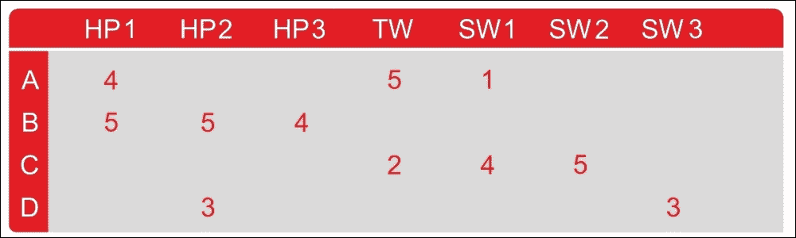

表 1：效用矩阵（用户与电影矩阵）

用户电影对有许多空白条目。这意味着用户尚未对这些电影进行评级。在现实生活中，矩阵可能更稀疏，典型的用户评级只是所有可用电影的一小部分。使用此矩阵，目标是预测效用矩阵中的空白。现在，让我们看一个例子。假设我们很想知道用户 A 是否想要 SW2。很难解决这个问题，因为表 1 中的矩阵内没有太多数据可供使用。

因此，在实践中，我们可能会开发一个电影推荐引擎来考虑电影的其他属性，例如制片人，导演，主要演员，甚至是他们名字的相似性。这样，我们可以计算电影 SW1 和 SW2 的相似度。这种相似性会让我们得出结论，因为 A 不喜欢 SW1，所以他们也不太可能喜欢 SW2。

但是，这可能不适用于更大的数据集。因此，有了更多的数据，我们可能会发现，对 SW1 和 SW2 进行评级的人都倾向于给予他们相似的评级。最后，我们可以得出结论，A 也会给 SW2 一个低评级，类似于 A 的 SW1 评级。

在下一节中，我们将看到如何使用协同过滤方法开发电影推荐引擎。我们将看到如何利用这种类型的矩阵。

### 注意

如何使用代码库：此代码库中有八个 Python 脚本（即使用`TensorFlow_09_Codes/CollaborativeFiltering`进行深度学习）。首先，执行执行数据集探索性分析的`eda.py`。然后，调用`train.py`脚本执行训练。最后，`Test.py`可用于模型推理和评估。

以下是每个脚本的简要功能：

*   `eda.py`：这用于 MovieLens1M 数据集的探索性分析。
*   `train.py`：它执行训练和验证。然后它打印验证误差。最后，它创建了用户项密集表。
*   `Test.py`：恢复训练中生成的用户与项目表。然后评估所有模型。
*   `run.py`：用于模型推理并进行预测。
*   `kmean.py`：它集中了类似的电影。
*   `main.py`：它计算前 K 个电影，创建用户评级，找到前 K 个相似项目，计算用户相似度，计算项目相关性并计算用户 Pearson 相关性。
*   `readers.py`：它读取评级和电影数据并执行一些预处理。最后，它为批量训练准备数据集。
*   `model.py`：它创建模型并计算训练/验证损失。

工作流程可以描述如下：

1.  首先，我们将使用可用的评级来训练模型。
2.  然后我们使用训练的模型来预测用户与电影矩阵中的缺失评级。
3.  然后，利用所有预测的评级，将构建新用户与电影矩阵并以`.pkl`文件的形式保存。
4.  然后，我们使用此矩阵来预测特定用户的评级。
5.  最后，我们将训练 K 均值模型来聚类相关电影。

## 数据集的描述

在我们开始实现电影 RE 之前，让我们看一下将要使用的数据集。 MovieLens1M 数据集从 [MovieLens 网站](http://files.grouplens.org/datasets/movielens/ml-1m.zip)下载。

我真诚地感谢 F. Maxwell Harper 和 Joseph A. Konstan 使数据集可供使用。数据集发布在 MovieLens 数据集：历史和上下文中。 ACM 交互式智能系统交易（TiiS）5，4，第 19 条（2015 年 12 月），共 19 页。

数据集中有三个文件，它们与电影，评级和用户有关。这些文件包含 1,000,209 个匿名评级，约有 3,900 部电影，由 2000 年加入 MovieLens 的 6,040 名 MovieLens 用户制作。

### 评级数据

所有评级都包含在`ratings.dat`文件中，格式如下 - `UserID :: MovieID :: Rating :: Timestamp`：

*   `UserID`的范围在 1 到 6,040 之间
*   `MovieID`的范围在 1 到 3,952 之间
*   `Rating`为五星级
*   `Timestamp`以秒表示

请注意，每位用户至少评了 20 部电影。

### 电影数据

电影信息是`movies.dat`文件中的  ，格式如下 - `MovieID :: Title :: Genres`：

*   标题与 IMDb 提供的标题相同（发布年份）
*   流派是分开的，每部电影分为动作，冒险，动画，儿童，喜剧，犯罪，戏剧，战争，纪录片，幻想，电影黑色，恐怖，音乐，神秘，浪漫，科幻菲律宾，惊悚片和西部片

### 用户数据

用户信息位于`users.dat`文件中，格式如下：`UserID :: Gender :: Age :: Occupation :: Zip-code`。

所有人口统计信息均由用户自愿提供，不会检查其准确率。此数据集中仅包含已提供某些人口统计信息的用户。男性 M 和女性 F 表示性别。

年龄选自以下范围：

*   1：18 岁以下
*   18：18-24
*   25：25-34
*   35：35-44
*   45：45-49
*   50：50-55
*   56：56+

职业选自以下选项：

0：其他，或未指定

1：学术/教育者

2：艺术家

3：文员/管理员

4：大学/研究生

5：客户服务

6：医生/保健

7：执行/管理

8：农民

9：主妇

10：K-12 学生

11：律师

12：程序员

13：退休了

14：销售/营销

15：科学家

16：自雇人士

17：技师/工程师

18：匠人/工匠

19：失业

20：作家

## 对 MovieLens 数据集的探索性分析

在这里，在我们开始开发 RE 之前，我们将看到数据集的探索性描述。我假设读者已经从[此链接](http://files.grouplens.org/datasets/movielens/ml-1m.zip)下载了 MovieLens1m 数据集并将其解压缩到此代码库中的输入目录。现在，为此，在终端上执行`$ python3 eda.py`命令：

1.  首先，让我们导入所需的库和包：

    ```py
    import matplotlib.pyplot as plt
    import seaborn as sns
    import pandas as pd
    import numpy as np
    ```

2.  现在让我们加载用户，评级和电影数据集并创建一个 pandas `DataFrame`：

    ```py
    ratings_list = [i.strip().split("::") for i in open('Input/ratings.dat', 'r').readlines()]
    users_list = [i.strip().split("::") for i in open('Input/users.dat', 'r').readlines()]
    movies_list = [i.strip().split("::") for i in open('Input/movies.dat', 'r',encoding='latin-1').readlines()]
    ratings_df = pd.DataFrame(ratings_list, columns = ['UserID', 'MovieID', 'Rating', 'Timestamp'], dtype = int)
    movies_df = pd.DataFrame(movies_list, columns = ['MovieID', 'Title', 'Genres'])
    user_df=pd.DataFrame(users_list, columns=['UserID','Gender','Age','Occupation','ZipCode'])
    ```

3.  接下来的任务是使用内置的`to_numeric()` pandas 函数将分类列（如`MovieID`，`UserID`和`Age`）转换为数值：

    ```py
    movies_df['MovieID'] = movies_df['MovieID'].apply(pd.to_numeric)
    user_df['UserID'] = user_df['UserID'].apply(pd.to_numeric)
    user_df['Age'] = user_df['Age'].apply(pd.to_numeric)
    ```

4.  让我们看一下用户表中的一些例子：

    ```py
    print("User table description:")
    print(user_df.head())
    print(user_df.describe())
    >>>
    User table description:
    UserID Gender  Age      Occupation ZipCode
       1            F         1         10                48067
       2            M        56       16                70072
       3           M         25       15                 55117
       4           M         45       7                  02460
       5           M        25       20                 55455
                UserID          Age
    count  6040.000000  6040.000000
    mean   3020.500000    30.639238
    std    1743.742145    12.895962
    min       1.000000     1.000000
    25%    1510.750000    25.000000
    50%    3020.500000    25.000000
    75%    4530.250000    35.000000
    max    6040.000000    56.000000
    ```

5.  让我们看一下来自评级数据集的一些信息：

    ```py
    print("Rating table description:")
    print(ratings_df.head())
    print(ratings_df.describe())
    >>>
    Rating table description:
    UserID  MovieID  Rating  Timestamp
         1     1193              5           978300760
         1      661               3           978302109
         1      914               3           978301968
         1     3408              4           978300275
         1     2355              5           978824291
                 UserID       MovieID        Rating     Timestamp
    count  1.000209e+06  1.000209e+06  1.000209e+06  1.000209e+06
    mean   3.024512e+03  1.865540e+03  3.581564e+00  9.722437e+08
    std    1.728413e+03  1.096041e+03  1.117102e+00  1.215256e+07
    min    1.000000e+00  1.000000e+00  1.000000e+00  9.567039e+08
    25%    1.506000e+03  1.030000e+03  3.000000e+00  9.653026e+08
    50%    3.070000e+03  1.835000e+03  4.000000e+00  9.730180e+08
    75%    4.476000e+03  2.770000e+03  4.000000e+00  9.752209e+08
    max    6.040000e+03  3.952000e+03  5.000000e+00  1.046455e+09
    ```

6.  让我们看看电影数据集中的一些信息：

    ```py
    >>>
    print("Movies table description:")
    print(movies_df.head())
    print(movies_df.describe())
    >>>
    Movies table description:
       MovieID                Title                                               Genres
    0        1             Toy Story (1995)                   Animation|Children's|Comedy
    1        2             Jumanji (1995)                      Adventure|Children's|Fantasy
    2        3             Grumpier Old Men (1995)                Comedy|Romance
    3        4            Waiting to Exhale (1995)                  Comedy|Drama
    4        5            Father of the Bride Part II (1995)            Comedy
                MovieID
    count  3883.000000
    mean   1986.049446
    std    1146.778349
    min       1.000000
    25%     982.500000
    50%    2010.000000
    75%    2980.500000
    max    3952.000000
    ```

7.  现在让我们看看评级最高的五部电影：

    ```py
    print("Top ten most rated movies:")
    print(ratings_df['MovieID'].value_counts().head())
    >>>
    Top 10 most rated movies with title and rating count:

    American Beauty (1999)                                                      3428
    Star Wars: Episode IV - A New Hope (1977)                      2991
    Star Wars: Episode V - The Empire Strikes Back (1980)    2990
    Star Wars: Episode VI - Return of the Jedi (1983)              2883
    Jurassic Park (1993)                                                             2672
    Saving Private Ryan (1998)                                                 2653
    Terminator 2: Judgment Day (1991)                                    2649
    Matrix, The (1999)                                                               2590
    Back to the Future (1985)                                                    2583
    Silence of the Lambs, The (1991)                                        2578
    ```

8.  现在，让我们看一下电影评级分布。 为此，让我们使用直方图，该图演示了一个重要的模式，票数呈正态分布：

    ```py
    plt.hist(ratings_df.groupby(['MovieID'])['Rating'].mean().sort_values(axis=0, ascending=False))
    plt.title("Movie rating Distribution")
    plt.ylabel('Count of movies')
    plt.xlabel('Rating');
    plt.show()
    >>>
    ```

    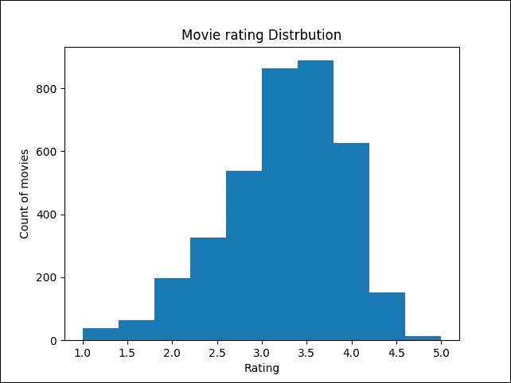

    图 3：电影评级分布

9.  让我们看看评级如何分布在不同年龄段：

    ```py
    user_df.Age.plot.hist()
    plt.title("Distribution of users (by ages)")
    plt.ylabel('Count of users')
    plt.xlabel('Age');
    plt.show()
    >>>
    ```

    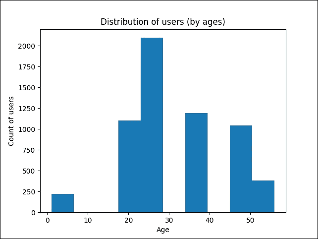

    图 4：按年龄分布的用户

10.  现在让我们看看收视率最高的电影，评级至少为 150：

    ```py
    movie_stats = df.groupby('Title').agg({'Rating': [np.size, np.mean]})
    print("Highest rated movie with minimum 150 ratings")
    print(movie_stats.Rating[movie_stats.Rating['size'] > 150].sort_values(['mean'],ascending=[0]).head())
    >>>
    Top 5 and a highest rated movie with a minimum of 150 ratings-----------------------------------------------------------
    Title                                                               size 	  mean                                      
    Seven Samurai (The Magnificent Seven)    628   4.560510
    Shawshank Redemption, The (1994)           2227  4.554558
    Godfather, The (1972)                                 2223  4.524966
    Close Shave, A (1995)                                 657    4.520548
    Usual Suspects, The (1995)                         1783   4.517106
    ```

11.  让我们看看在电影评级中的性别偏置，即电影评级如何按评论者的性别进行比较：

    ```py
    >>>
    pivoted = df.pivot_table(index=['MovieID', 'Title'], columns=['Gender'], values='Rating', fill_value=0)
    print("Gender biasing towards movie rating")
    print(pivoted.head())
    ```

12.  我们现在可以看看电影收视率的性别偏置及它们之间的差异，即男性和女性对电影的评价方式不同：

    ```py
    pivoted['diff'] = pivoted.M - pivoted.F
    print(pivoted.head())
    >>>
    Gender                                                   F                       M                      diff
    MovieID Title                                                           
    1  Toy Story (1995)                            4.87817        4.130552                -0.057265
    2  Jumanji (1995)                               3.278409      3.175238                -0.103171
    3  Grumpier Old Men (1995)             3.073529      2.994152               -0.079377
    4  Waiting to Exhale (1995)              2.976471        2.482353              -0.494118
    5  Father of the Bride Part II (1995)  3.212963       2.888298               -0.324665
    ```

13.  从前面的输出中可以清楚地看出，在大多数情况下，男性的收视率高于女性。现在我们已经看到了有关数据集的一些信息和统计数据，现在是构建我们的 TensorFlow 推荐模型的时候了。

## 实现电影 RE

在这个例子中，我们将看到如何推荐前 K 部电影（其中 K 是电影数量），预测用户评级并推荐前 K 个类似项目（其中 K 是项目数）。然后我们将看到如何计算用户相似度。

然后我们将使用 Pearson 的相关算法看到项目项相关性和用户 - 用户相关性。最后，我们将看到如何使用 K 均值算法对类似的电影进行聚类。

换句话说，我们将使用协同过滤方法制作电影推荐引擎，并使用 K 均值来聚类类似的电影。

距离计算：还有其他计算距离的方法。例如：

1.  通过仅考虑最显着的尺寸，可以使用切比雪夫距离来测量距离。
2.  汉明距离算法可以识别两个字符串之间的差异。
3.  马哈拉诺比斯距离可用于归一化协方差矩阵。
4.  曼哈顿距离用于通过仅考虑轴对齐方向来测量距离。
5.  Haversine 距离用于测量球体上两个点之间的大圆距离。

考虑到这些距离测量算法，很明显欧几里德距离算法最适合解决 K 均值算法中距离计算的目的。

总之，以下是用于开发此模型的工作流程：

1.  首先，使用可用的评级来训练模型。
2.  使用该训练模型来预测用户与电影矩阵中的缺失评级。
3.  利用所有预测的评级，用户与电影矩阵成为受训用户与电影矩阵，我们以`.pkl`文件的形式保存。
4.  然后，我们使用用户与电影矩阵，或训练用户与电影矩阵的训练参数，进行进一步处理。

在训练模型之前，第一项工作是利用所有可用的数据集来准备训练集。

### 使用可用的评级训练模型

对于这一部分，请使用`train.py`脚本，该脚本依赖于其他脚本。我们将看到依赖项：

1.  首先，让我们导入必要的包和模块：

    ```py
    from collections import deque
    from six import next
    import readers
    import os
    import tensorflow as tf
    import numpy as np
    import model as md
    import pandas as pd
    import time
    import matplotlib.pyplot as plt
    ```

2.  然后我们设置随机种子的复现性：

    ```py
    np.random.seed(12345)
    ```

3.  下一个任务是定义训练参数。让我们定义所需的数据参数，例如评级数据集的位置，批量大小，SVD 的维度，最大周期和检查点目录：

    ```py
    data_file ="Input/ratings.dat"# Input user-movie-rating information file
    batch_size = 100 #Batch Size (default: 100)
    dims =15 #Dimensions of SVD (default: 15)
    max_epochs = 50 # Maximum epoch (default: 25)
    checkpoint_dir ="save/" #Checkpoint directory from training run
     val = True #True if Folders with files and False if single file
    is_gpu = True # Want to train model with GPU
    ```

4.  我们还需要一些其他参数，例如允许软放置和日志设备放置：

    ```py
    allow_soft_placement = True #Allow device soft device placement
    log_device_placement=False #Log placement of ops on devices
    ```

5.  我们不想用旧的元数据或检查点和模型文件污染我们的新训练  ，所以如果有的话，让我们删除它们：

    ```py
    print("Start removing previous Files ...")
    if os.path.isfile("model/user_item_table.pkl"):
        os.remove("model/user_item_table.pkl")
    if os.path.isfile("model/user_item_table_train.pkl"):
        os.remove("model/user_item_table_train.pkl")
    if os.path.isfile("model/item_item_corr.pkl"):
        os.remove("model/item_item_corr.pkl")
    if os.path.isfile("model/item_item_corr_train.pkl"):
        os.remove("model/item_item_corr_train.pkl")
    if os.path.isfile("model/user_user_corr.pkl"):
        os.remove("model/user_user_corr.pkl")
    if os.path.isfile("model/user_user_corr_train.pkl"):
        os.remove("model/user_user_corr_train.pkl")
    if os.path.isfile("model/clusters.csv"):
        os.remove("model/clusters.csv")
    if os.path.isfile("model/val_error.pkl"):
        os.remove("model/val_error.pkl")
    print("Done ...")
    >>>
    Start removing previous Files...
    Done...
    ```

6.  然后让我们定义检查点目录。 TensorFlow 假设此目录已存在，因此我们需要创建它：

    ```py
    checkpoint_prefix = os.path.join(checkpoint_dir, "model")
    if not os.path.exists(checkpoint_dir):
        os.makedirs(checkpoint_dir)
    ```

7.  在进入数据之前，让我们设置每批的样本数量，数据的维度以及网络看到所有训练数据的次数  ：

    ```py
    batch_size =batch_size
    dims =dims
    max_epochs =max_epochs
    ```

8.  现在让我们指定用于所有 TensorFlow 计算，CPU 或 GPU 的设备：

    ```py
    if is_gpu:
        place_device = "/gpu:0"
    else:
        place_device="/cpu:0"
    ```

9.  现在我们通过`get_data()`函数读取带有分隔符`::`的评级文件。示例列包含用户 ID，项 ID，评级和时间戳，例如`3 :: 1196 :: 4 :: 978297539`。然后，上面的代码执行纯粹基于整数位置的索引，以便按位置进行选择。之后，它将数据分为训练和测试，75% 用于训练，25% 用于测试。最后，它使用索引来分离数据并返回用于训练的数据帧：

    ```py
    def get_data():
        print("Inside get data ...")
        df = readers.read_file(data_file, sep="::")
        rows = len(df)
        df = df.iloc[np.random.permutation(rows)].reset_index(drop=True)
        split_index = int(rows * 0.75)
        df_train = df[0:split_index]
        df_test = df[split_index:].reset_index(drop=True)
        print("Done !!!")
        print(df.shape)
        return df_train, df_test,df['user'].max(),df['item'].max()
    ```

10.  然后，我们在数组中剪切值的限制：给定一个间隔，将间隔外的值剪切到间隔的边缘。例如，如果指定`[0,1]`间隔，则小于 0 的值变为 0，大于 1 的值变为 1：

    ```py
    def clip(x):
        return np.clip(x, 1.0, 5.0)
    ```

然后，我们调用`read_data()`方法从评级文件中读取数据以构建 TensorFlow 模型：

```py
df_train, df_test,u_num,i_num = get_data()
>>>
Inside get data...
Done!!!
```

1.  然后，我们定义数据集中评级电影的用户数量，以及数据集中的电影数量：

    ```py
    u_num = 6040 # Number of users in the dataset
    i_num = 3952 # Number of movies in the dataset
    ```

2.  现在让我们生成每批样本数量：

    ```py
    samples_per_batch = len(df_train) // batch_size
    print("Number of train samples %d, test samples %d, samples per batch %d" % (len(df_train), len(df_test), samples_per_batch))
    >>>
    Number of train samples 750156, test samples 250053, samples per batch 7501
    ```

3.  现在，使用`ShuffleIterator`，我们生成随机批次。在训练中，这有助于防止偏差结果以及过拟合：

    ```py
    iter_train = readers.ShuffleIterator([df_train["user"], df_train["item"],df_train["rate"]], batch_size=batch_size)
    ```

4.  有关此类的更多信息，请参阅`readers.py`脚本。为方便起见，以下是此类的来源：

    ```py
    class ShuffleIterator(object):
        def __init__(self, inputs, batch_size=10):
            self.inputs = inputs
            self.batch_size = batch_size
            self.num_cols = len(self.inputs)
            self.len = len(self.inputs[0])
            self.inputs = np.transpose(np.vstack([np.array(self.inputs[i]) for i in range(self.num_cols)]))
        def __len__(self):
            return self.len
        def __iter__(self):
            return self
       def __next__(self):
            return self.next()
        def next(self):
            ids = np.random.randint(0, self.len, (self.batch_size,))
            out = self.inputs[ids, :]
            return [out[:, i] for i in range(self.num_cols)]
    ```

5.  然后我们依次生成一个周期的批次进行测试（参见`train.py`）：

    ```py
    iter_test = readers.OneEpochIterator([df_test["user"], df_test["item"], df_test["rate"]], batch_size=-1)
    ```

6.  有关此类的更多信息，请参阅`readers.py`脚本。为了方便，这里是这个类的源码：

    ```py
    class OneEpochIterator(ShuffleIterator):
        def __init__(self, inputs, batch_size=10):
            super(OneEpochIterator, self).__init__(inputs, batch_size=batch_size)
            if batch_size > 0:
                self.idx_group = np.array_split(np.arange(self.len), np.ceil(self.len / batch_size))
            else:
                self.idx_group = [np.arange(self.len)]
            self.group_id = 0
         def next(self):
            if self.group_id >= len(self.idx_group):
                self.group_id = 0
                raise StopIteration
            out = self.inputs[self.idx_group[self.group_id], :]
            self.group_id += 1
            return [out[:, i] for i in range(self.num_cols)]
    ```

7.  现在是创建 TensorFlow 占位符的时间：

    ```py
    user_batch = tf.placeholder(tf.int32, shape=[None], name="id_user")
    item_batch = tf.placeholder(tf.int32, shape=[None], name="id_item")
    rate_batch = tf.placeholder(tf.float32, shape=[None])
    ```

8.  现在我们的训练集和占位符已准备好容纳训练值的批次，现在该实例化模型了。 为此，我们使用`model()`方法并使用 l2 正则化来避免过拟合（请参见`model.py`脚本）：

    ```py
    infer, regularizer = md.model(user_batch, item_batch, user_num=u_num, item_num=i_num, dim=dims, device=place_device)
    ```

    `model()`方法如下：

    ```py
    def model(user_batch, item_batch, user_num, item_num, dim=5, device="/cpu:0"):
        with tf.device("/cpu:0"):
            # Using a global bias term
            bias_global = tf.get_variable("bias_global", shape=[])

            # User and item bias variables: get_variable: Prefixes the name with the current variable 
            # scope and performs reuse checks.
            w_bias_user = tf.get_variable("embd_bias_user", shape=[user_num])
            w_bias_item = tf.get_variable("embd_bias_item", shape=[item_num])

            # embedding_lookup: Looks up 'ids' in a list of embedding tensors
            # Bias embeddings for user and items, given a batch
            bias_user = tf.nn.embedding_lookup(w_bias_user, user_batch, name="bias_user")
            bias_item = tf.nn.embedding_lookup(w_bias_item, item_batch, name="bias_item")

            # User and item weight variables
            w_user = tf.get_variable("embd_user", shape=[user_num, dim],
                                     initializer=tf.truncated_normal_initializer(stddev=0.02))
            w_item = tf.get_variable("embd_item", shape=[item_num, dim],
                                     initializer=tf.truncated_normal_initializer(stddev=0.02))

            # Weight embeddings for user and items, given a batch
            embd_user = tf.nn.embedding_lookup(w_user, user_batch, name="embedding_user")
            embd_item = tf.nn.embedding_lookup(w_item, item_batch, name="embedding_item")

            # reduce_sum: Computes the sum of elements across dimensions of a tensor
            infer = tf.reduce_sum(tf.multiply(embd_user, embd_item), 1)
            infer = tf.add(infer, bias_global)
            infer = tf.add(infer, bias_user)
            infer = tf.add(infer, bias_item, name="svd_inference")

            # l2_loss: Computes half the L2 norm of a tensor without the sqrt
            regularizer = tf.add(tf.nn.l2_loss(embd_user), tf.nn.l2_loss(embd_item), name="svd_regularizer")
        return infer, regularizer
    ```

9.  现在让我们定义训练操作（参见`models.py`脚本中的更多内容）：

    ```py
    _, train_op = md.loss(infer, regularizer, rate_batch, learning_rate=0.001, reg=0.05, device=place_device)
    ```

`loss()`方法如下：

```py
def loss(infer, regularizer, rate_batch, learning_rate=0.1, reg=0.1, device="/cpu:0"):
    with tf.device(device):
        cost_l2 = tf.nn.l2_loss(tf.subtract(infer, rate_batch))
        penalty = tf.constant(reg, dtype=tf.float32, shape=[], name="l2")
        cost = tf.add(cost_l2, tf.multiply(regularizer, penalty))
        train_op = tf.train.FtrlOptimizer(learning_rate).minimize(cost)
    return cost, train_op
```

1.  一旦我们实例化了模型和训练操作，我们就可以保存模型以备将来使用：

    ```py
    saver = tf.train.Saver()
    init_op = tf.global_variables_initializer()
    session_conf = tf.ConfigProto(
      allow_soft_placement=allow_soft_placement, log_device_placement=log_device_placement)
    ```

2.  现在我们开始训练模型：

    ```py
    with tf.Session(config = session_conf) as sess:
        sess.run(init_op)
        print("%s\t%s\t%s\t%s" % ("Epoch", "Train err", "Validation err", "Elapsed Time"))
        errors = deque(maxlen=samples_per_batch)
        train_error=[]
        val_error=[]
        start = time.time()

        for i in range(max_epochs * samples_per_batch):
            users, items, rates = next(iter_train)
            _, pred_batch = sess.run([train_op, infer], feed_dict={user_batch: users, item_batch: items, rate_batch: rates})
            pred_batch = clip(pred_batch)
            errors.append(np.power(pred_batch - rates, 2))

            if i % samples_per_batch == 0:
                train_err = np.sqrt(np.mean(errors))
                test_err2 = np.array([])
                for users, items, rates in iter_test:
                    pred_batch = sess.run(infer, feed_dict={user_batch: users, item_batch: items})
                    pred_batch = clip(pred_batch)
                    test_err2 = np.append(test_err2, np.power(pred_batch - rates, 2))
                end = time.time()

                print("%02d\t%.3f\t\t%.3f\t\t%.3f secs" % (i // samples_per_batch, train_err, np.sqrt(np.mean(test_err2)), end - start))
                train_error.append(train_err)
                val_error.append(np.sqrt(np.mean(test_err2)))
                start = end

        saver.save(sess, checkpoint_prefix)
        pd.DataFrame({'training error':train_error,'validation error':val_error}).to_pickle("val_error.pkl")
        print("Training Done !!!")

    sess.close()
    ```

3.  前面的代码执行训练并将误差保存在 PKL 文件中。最后，它打印了训练和验证误差以及所花费的时间：

    ```py
    >>>
    Epoch    Train err    Validation err    Elapsed Time
    00          2.816          2.812                0.118 secs
    01          2.813          2.812                4.898 secs
    …          …               …                     …
    48          2.770          2.767                1.618 secs
    49          2.765          2.760                1.678 secs
    ```

完成训练!!!

结果是删节，只显示了几个步骤。现在让我们以图形方式看到这些误差：

```py
error = pd.read_pickle("val_error.pkl")
error.plot(title="Training vs validation error (per epoch)")
plt.ylabel('Error/loss')
plt.xlabel('Epoch');
plt.show()
>>>
```

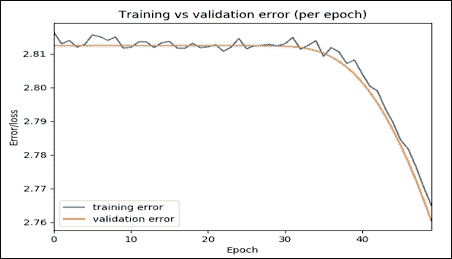

图 5：每个周期的训练与验证误差

该图表明，随着时间的推移，训练和验证误差都会减少，这意味着我们正朝着正确的方向行走。尽管如此，您仍然可以尝试增加步骤，看看这两个值是否可以进一步降低，这意味着更高的准确率。

### 使用已保存的模型执行推断

以下代码使用保存的模型执行模型推理，并打印整体验证误差：

```py
if val:
    print("Validation ...")
    init_op = tf.global_variables_initializer()
    session_conf = tf.ConfigProto(
      allow_soft_placement=allow_soft_placement,
      log_device_placement=log_device_placement)
    with tf.Session(config = session_conf) as sess:
        new_saver = tf.train.import_meta_graph("{}.meta".format(checkpoint_prefix))
        new_saver.restore(sess, tf.train.latest_checkpoint(checkpoint_dir))
        test_err2 = np.array([])
        for users, items, rates in iter_test:
            pred_batch = sess.run(infer, feed_dict={user_batch: users, item_batch: items})
            pred_batch = clip(pred_batch)
            test_err2 = np.append(test_err2, np.power(pred_batch - rates, 2))
            print("Validation Error: ",np.sqrt(np.mean(test_err2)))
    print("Done !!!")
sess.close()
>>>
Validation Error:  2.14626890224
Done!!!
```

### 生成用户项表

以下方法创建用户项数据帧。它用于创建训练有素的`DataFrame`。使用 SVD 训练模型在此处填写用户项表中的所有缺失值。它采用评级数据帧并存储所有电影的所有用户评级。最后，它会生成一个填充的评级数据帧，其中行是用户，列是项：

```py
def create_df(ratings_df=readers.read_file(data_file, sep="::")):
    if os.path.isfile("model/user_item_table.pkl"):
        df=pd.read_pickle("user_item_table.pkl")
    else:
        df = ratings_df.pivot(index = 'user', columns ='item', values = 'rate').fillna(0)
        df.to_pickle("user_item_table.pkl")

    df=df.T
    users=[]
    items=[]
    start = time.time()
    print("Start creating user-item dense table")
    total_movies=list(ratings_df.item.unique())

    for index in df.columns.tolist():
        #rated_movies=ratings_df[ratings_df['user']==index].drop(['st', 'user'], axis=1)
        rated_movie=[]
        rated_movie=list(ratings_df[ratings_df['user']==index].drop(['st', 'user'], axis=1)['item'].values)
        unseen_movies=[]
        unseen_movies=list(set(total_movies) - set(rated_movie))

        for movie in unseen_movies:
            users.append(index)
            items.append(movie)
    end = time.time()

    print(("Found in %.2f seconds" % (end-start)))
    del df
    rated_list = []

    init_op = tf.global_variables_initializer()
    session_conf = tf.ConfigProto(
      allow_soft_placement=allow_soft_placement,
      log_device_placement=log_device_placement)

    with tf.Session(config = session_conf) as sess:
        #sess.run(init_op)
        print("prediction started ...")
        new_saver = tf.train.import_meta_graph("{}.meta".format(checkpoint_prefix))
        new_saver.restore(sess, tf.train.latest_checkpoint(checkpoint_dir))
        test_err2 = np.array([])
        rated_list = sess.run(infer, feed_dict={user_batch: users, item_batch: items})
        rated_list = clip(rated_list)
        print("Done !!!")
    sess.close()

    df_dict={'user':users,'item':items,'rate':rated_list}
    df = ratings_df.drop(['st'],axis=1).append(pd.DataFrame(df_dict)).pivot(index = 'user', columns ='item', values = 'rate').fillna(0)
    df.to_pickle("user_item_table_train.pkl")
    return df
```

现在让我们调用前面的方法来生成用户项表作为 pandas 数据帧：

```py
create_df(ratings_df = readers.read_file(data_file, sep="::"))
```

此行将为训练集创建用户与项目表，并将数据帧保存为指定目录中的`user_item_table_train.pkl`文件。

### 聚类类似的电影

对于这一部分，请参阅`kmean.py`脚本。此脚本将评级数据文件作为输入，并返回电影及其各自的簇。

从技术上讲，本节的目的是找到类似的电影；例如，用户 1 喜欢电影 1，并且因为电影 1 和电影 2 相似，所以用户想要电影 2.让我们开始导入所需的包和模块：

```py
import tensorflow as tf 
import numpy as np
import pandas as pd
import time
import readers
import matplotlib.pyplot as plt
import seaborn as sns
from sklearn.decomposition import PCA
```

现在让我们定义要使用的数据参数：评级数据文件的路径，簇的数量，K 和最大迭代次数。此外，我们还定义了是否要使用经过训练的用户与项目矩阵：

```py
data_file = "Input/ratings.dat" #Data source for the positive data
 K = 5 # Number of clusters
 MAX_ITERS =1000 # Maximum number of iterations
 TRAINED = False # Use TRAINED user vs item matrix
```

然后定义`k_mean_clustering ()`方法。它返回电影及其各自的群集。它采用评级数据集`ratings_df`，这是一个评级数据帧。然后它存储各个电影的所有用户评级，`K`是簇的数量，`MAX_ITERS`是推荐的最大数量，`TRAINED`是一种布尔类型，表示是否使用受过训练的用户与电影表或未经训练的人。

### 提示

如何找到最佳 K 值

在这里，我们朴素地设定 K 的值。但是，为了微调聚类表现，我们可以使用一种称为 Elbow 方法的启发式方法。我们从`K = 2`开始，然后，我们通过增加 K 来运行 K 均值算法并使用 WCSS 观察成本函数（CF）的值。在某些时候，CF 会大幅下降。然而，随着 K 值的增加，这种改善变得微不足道。总之，我们可以在 WCSS 的最后一次大跌之后选择 K 作为最佳值。

最后，`k_mean_clustering()`函数返回一个电影/项目列表和一个簇列表：

```py
def k_mean_clustering(ratings_df,K,MAX_ITERS,TRAINED=False):
    if TRAINED:
        df=pd.read_pickle("user_item_table_train.pkl")
    else:
        df=pd.read_pickle("user_item_table.pkl")
    df = df.T
    start = time.time()
    N=df.shape[0]

    points = tf.Variable(df.as_matrix())
    cluster_assignments = tf.Variable(tf.zeros([N], dtype=tf.int64))
    centroids = tf.Variable(tf.slice(points.initialized_value(), [0,0], [K,df.shape[1]]))
    rep_centroids = tf.reshape(tf.tile(centroids, [N, 1]), [N, K, df.shape[1]])
    rep_points = tf.reshape(tf.tile(points, [1, K]), [N, K, df.shape[1]])
    sum_squares = tf.reduce_sum(tf.square(rep_points - rep_centroids),reduction_indices=2)

    best_centroids = tf.argmin(sum_squares, 1)    did_assignments_change = tf.reduce_any(tf.not_equal(best_centroids, cluster_assignments))

    means = bucket_mean(points, best_centroids, K)

    with tf.control_dependencies([did_assignments_change]):
        do_updates = tf.group(
            centroids.assign(means),
            cluster_assignments.assign(best_centroids))

    init = tf.global_variables_initializer()
    sess = tf.Session()
    sess.run(init)
    changed = True
    iters = 0

    while changed and iters < MAX_ITERS:
        iters += 1
        [changed, _] = sess.run([did_assignments_change, do_updates])
    [centers, assignments] = sess.run([centroids, cluster_assignments])
    end = time.time()

    print (("Found in %.2f seconds" % (end-start)), iters, "iterations")
    cluster_df=pd.DataFrame({'movies':df.index.values,'clusters':assignments})

    cluster_df.to_csv("clusters.csv",index=True)
    return assignments,df.index.values
```

在前面的代码中，我们有一个愚蠢的初始化，在某种意义上我们使用前 K 个点作为起始质心。在现实世界中，它可以进一步改进。

在前面的代码块中，我们复制每个质心的 N 个副本和每个数据点的 K 个副本。然后我们减去并计算平方距离的总和。然后我们使用`argmin`选择最低距离点。但是，在计算分配是否已更改之前，我们不会编写已分配的群集变量，因此具有依赖性。

如果仔细查看前面的代码，有一个名为`bucket_mean()`的函数。它获取数据点，最佳质心和暂定簇的数量 K，并计算在簇计算中使用的平均值：

```py
def bucket_mean(data, bucket_ids, num_buckets):
    total = tf.unsorted_segment_sum(data, bucket_ids, num_buckets)
    count = tf.unsorted_segment_sum(tf.ones_like(data), bucket_ids, num_buckets)
    return total / count
```

一旦我们训练了我们的 K 均值模型，下一个任务就是可视化代表类似电影的那些簇。为此，我们有一个名为`showClusters()`的函数，它接受用户项表，CSV 文件（`clusters.csv`）中写入的聚簇数据，主成分数（默认为 2）和 SVD 求解器（可能的值是随机的和完整的）。

问题是，在 2D 空间中，很难绘制代表电影簇的所有数据点。出于这个原因，我们应用主成分分析（PCA）来降低维数而不会牺牲质量：

```py
    user_item=pd.read_pickle(user_item_table)
    cluster=pd.read_csv(clustered_data, index_col=False)
    user_item=user_item.T
    pcs = PCA(number_of_PCA_components, svd_solver) 
    cluster['x']=pcs.fit_transform(user_item)[:,0]
    cluster['y']=pcs.fit_transform(user_item)[:,1]
    fig = plt.figure()
    ax = plt.subplot(111)
    ax.scatter(cluster[cluster['clusters']==0]['x'].values,cluster[cluster['clusters']==0]['y'].values,color="r", label='cluster 0')
    ax.scatter(cluster[cluster['clusters']==1]['x'].values,cluster[cluster['clusters']==1]['y'].values,color="g", label='cluster 1')
    ax.scatter(cluster[cluster['clusters']==2]['x'].values,cluster[cluster['clusters']==2]['y'].values,color="b", label='cluster 2')
    ax.scatter(cluster[cluster['clusters']==3]['x'].values,cluster[cluster['clusters']==3]['y'].values,color="k", label='cluster 3')
    ax.scatter(cluster[cluster['clusters']==4]['x'].values,cluster[cluster['clusters']==4]['y'].values,color="c", label='cluster 4')
    ax.legend()
    plt.title("Clusters of similar movies using K-means")
    plt.ylabel('PC2')
    plt.xlabel('PC1');
    plt.show()
```

做得好。我们将评估我们的模型并在评估步骤中绘制簇。

### 预测用户的电影评级

为此，我编写了一个名为`prediction()`的函数。它采用有关用户和项目（在本例中为电影）的示例输入，并按名称从图创建 TensorFlow 占位符。然后它求值这些张量。在以下代码中，需要注意的是 TensorFlow 假定检查点目录已存在，因此请确保它已存在。有关此步骤的详细信息，请参阅`run.py`文件。请注意，此脚本不显示任何结果，但在`main.py`脚本中进一步调用此脚本中名为`prediction`的函数进行预测：

```py
def prediction(users=predicted_user, items=predicted_item, allow_soft_placement=allow_soft_placement,\
log_device_placement=log_device_placement, checkpoint_dir=checkpoint_dir):
    rating_prediction=[]
    checkpoint_prefix = os.path.join(checkpoint_dir, "model")
    graph = tf.Graph()
    with graph.as_default():
        session_conf = tf.ConfigProto(allow_soft_placement=allow_soft_placement,log_device_placement=log_device_placement)
        with tf.Session(config = session_conf) as sess:
            new_saver = tf.train.import_meta_graph("{}.meta".format(checkpoint_prefix))
            new_saver.restore(sess, tf.train.latest_checkpoint(checkpoint_dir))
            user_batch = graph.get_operation_by_name("id_user").outputs[0]
            item_batch = graph.get_operation_by_name("id_item").outputs[0]
            predictions = graph.get_operation_by_name("svd_inference").outputs[0]
            pred = sess.run(predictions, feed_dict={user_batch: users, item_batch: items})
            pred = clip(pred)
        sess.close()
    return  pred
```

我们将看到如何使用此方法来预测电影的前 K 部电影和用户评级。在前面的代码段中，`clip()`是一个用户定义的函数，用于限制数组中的值。这是实现：

```py
def clip(x):
    return np.clip(x, 1.0, 5.0) # rating 1 to 5
```

现在让我们看看，我们如何使用`prediction()`方法来制作用户的一组电影评级预测：

```py
def user_rating(users,movies):
    if type(users) is not list: users=np.array([users])
    if type(movies) is not list:
        movies=np.array([movies])
    return prediction(users,movies)
```

上述函数返回各个用户的用户评级。它采用一个或多个数字的列表，一个或多个用户 ID 的列表，以及一个或多个数字的列表以及一个或多个电影 ID 的列表。最后，它返回预测电影列表。

### 寻找前 K 部电影

以下方法提取用户未见过的前 K 个电影，其中 K 是任意整数，例如 10.函数的名称是`top_k_movies()`。它返回特定用户的前 K 部电影。它需要一个用户 ID 列表和评级数据帧。然后它存储这些电影的所有用户评级。输出是包含用户 ID 作为键的字典，以及该用户的前 K 电影列表作为值：

```py
def top_k_movies(users,ratings_df,k):
    dicts={}
    if type(users) is not list:
        users = [users]
    for user in users:
        rated_movies = ratings_df[ratings_df['user']==user].drop(['st', 'user'], axis=1)
        rated_movie = list(rated_movies['item'].values)
        total_movies = list(ratings_df.item.unique())
        unseen_movies = list(set(total_movies) - set(rated_movie))
        rated_list = []
        rated_list = prediction(np.full(len(unseen_movies),user),np.array(unseen_movies))
        useen_movies_df = pd.DataFrame({'item': unseen_movies,'rate':rated_list})
        top_k = list(useen_movies_df.sort_values(['rate','item'], ascending=[0, 0])['item'].head(k).values)
        dicts.update({user:top_k})
    result = pd.DataFrame(dicts)
    result.to_csv("user_top_k.csv")
    return dicts
```

在前面的代码段中，`prediction()`是我们之前描述的用户定义函数。我们将看到一个如何预测前 K 部电影的例子（更多或见后面的部分见`Test.py`）。

### 预测前 K 类似的电影

我编写了一个名为`top_k_similar_items()`的函数，它计算并返回与特定电影类似的 K 个电影。它需要一个数字列表，数字，电影 ID 列表和评级数据帧。它存储这些电影的所有用户评级。它还将 K 作为自然数。

`TRAINED`的值可以是`TRUE`或`FALSE`，它指定是使用受过训练的用户还是使用电影表或未经训练的用户。最后，它返回一个 K 电影列表，类似于作为输入传递的电影：

```py
def top_k_similar_items(movies,ratings_df,k,TRAINED=False):
    if TRAINED:
        df=pd.read_pickle("user_item_table_train.pkl")
    else:
        df=pd.read_pickle("user_item_table.pkl")
    corr_matrix=item_item_correlation(df,TRAINED)
    if type(movies) is not list:
        return corr_matrix[movies].sort_values(ascending=False).drop(movies).index.values[0:k]
    else:
        dict={}
        for movie in movies:           dict.update({movie:corr_matrix[movie].sort_values(ascending=False).drop(movie).index.values[0:k]})
        pd.DataFrame(dict).to_csv("movie_top_k.csv")
        return dict
```

在前面的代码中，`item_item_correlation()`函数是一个用户定义的函数，它计算在预测前 K 个类似电影时使用的电影 - 电影相关性。方法如下：

```py
def item_item_correlation(df,TRAINED):
    if TRAINED:
        if os.path.isfile("model/item_item_corr_train.pkl"):
            df_corr=pd.read_pickle("item_item_corr_train.pkl")
        else:
            df_corr=df.corr()
            df_corr.to_pickle("item_item_corr_train.pkl")
    else:
        if os.path.isfile("model/item_item_corr.pkl"):
            df_corr=pd.read_pickle("item_item_corr.pkl")
        else:
            df_corr=df.corr()
            df_corr.to_pickle("item_item_corr.pkl")
    return df_corr
```

### 计算用户 - 用户相似度

为了计算用户 - 用户相似度，我编写了`user_similarity()`函数，它返回两个用户之间的相似度。它需要三个参数：用户 1，用户 2；评级数据帧；并且`TRAINED`的值可以是`TRUE`或`FALSE`，并且指的是是否应该使用受过训练的用户与电影表或未经训练的用户。最后，它计算用户之间的 Pearson 系数（介于 -1 和 1 之间的值）：

```py
def user_similarity(user_1,user_2,ratings_df,TRAINED=False):
    corr_matrix=user_user_pearson_corr(ratings_df,TRAINED)
    return corr_matrix[user_1][user_2]
```

在前面的函数中，`user_user_pearson_corr()`是一个计算用户 - 用户 Pearson 相关性的函数：

```py
def user_user_pearson_corr(ratings_df,TRAINED):
    if TRAINED:
        if os.path.isfile("model/user_user_corr_train.pkl"):
            df_corr=pd.read_pickle("user_user_corr_train.pkl")
        else:
            df =pd.read_pickle("user_item_table_train.pkl")
            df=df.T
            df_corr=df.corr()
            df_corr.to_pickle("user_user_corr_train.pkl")
    else:
        if os.path.isfile("model/user_user_corr.pkl"):
            df_corr=pd.read_pickle("user_user_corr.pkl")
        else:
            df = pd.read_pickle("user_item_table.pkl")
            df=df.T
            df_corr=df.corr()
            df_corr.to_pickle("user_user_corr.pkl")
    return df_corr
```

## 评估推荐系统

在这个小节中，我们将通过绘制它们以评估电影如何在不同的簇中传播来评估簇。

然后，我们将看到前 K 部电影，并查看我们之前讨论过的用户 - 用户相似度和其他指标。现在让我们开始导入所需的库：

```py
import tensorflow as tf
import pandas as pd
import readers
import main
import kmean as km
import numpy as np
```

接下来，让我们定义用于评估的数据参数：

```py
DATA_FILE = "Input/ratings.dat" # Data source for the positive data.
K = 5 #Number of clusters
MAX_ITERS = 1000 #Maximum number of iterations
TRAINED = False # Use TRAINED user vs item matrix
USER_ITEM_TABLE = "user_item_table.pkl" 
COMPUTED_CLUSTER_CSV = "clusters.csv" 
NO_OF_PCA_COMPONENTS = 2 #number of pca components
SVD_SOLVER = "randomized" #svd solver -e.g. randomized, full etc.
```

让我们看看加载将在`k_mean_clustering()`方法的调用调用中使用的评级数据集：

```py
ratings_df = readers.read_file("Input/ratings.dat", sep="::")
clusters,movies = km.k_mean_clustering(ratings_df, K, MAX_ITERS, TRAINED = False)
cluster_df=pd.DataFrame({'movies':movies,'clusters':clusters})
```

做得好！现在让我们看一些简单的输入簇（电影和各自的簇）：

```py
print(cluster_df.head(10))
>>>
clusters  movies
0         0       0
1         4       1
2         4       2
3         3       3
4         4       4
5         2       5
6         4       6
7         3       7
8         3       8
9         2       9
print(cluster_df[cluster_df['movies']==1721])
>>>
 clusters  movies
1575         2    1721
print(cluster_df[cluster_df['movies']==647])
>>>
clusters  movies
627         2     647
```

让我们看看电影是如何分散在群集中的：

```py
km.showClusters(USER_ITEM_TABLE, COMPUTED_CLUSTER_CSV, NO_OF_PCA_COMPONENTS, SVD_SOLVER)
>>>
```

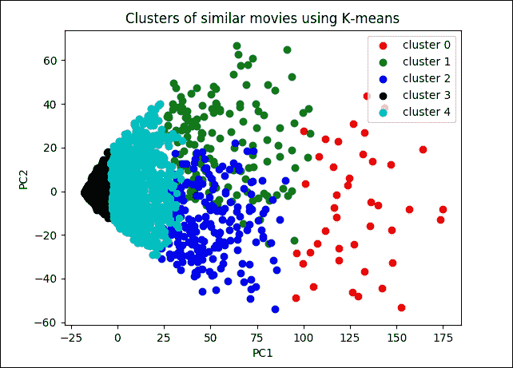

图 6：类似电影的簇

如果我们查看该图，很明显数据点更准确地聚集在簇 3 和 4 上。但是，簇 0，1 和 2 更分散并且不能很好地聚类。

在这里，我们没有计算任何准确率指标，因为训练数据没有标签。现在让我们为给定的相应电影名称计算前 K 个类似的电影并打印出来：

```py
ratings_df = readers.read_file("Input/ratings.dat", sep="::")
topK = main.top_k_similar_items(9,ratings_df = ratings_df,k = 10,TRAINED = False)
print(topK)
>>>
[1721, 1369, 164, 3081, 732, 348, 647, 2005, 379, 3255]
```

上述结果为电影`9 ::Sudden Death (1995)::Action`计算了 Top-K 类似的电影。现在，如果您观察`movies.dat`文件，您将看到以下电影与此类似：

```py
1721::Titanic (1997)::Drama|Romance
1369::I Can't Sleep (J'ai pas sommeil) (1994)::Drama|Thriller
164::Devil in a Blue Dress (1995)::Crime|Film-Noir|Mystery|Thriller
3081::Sleepy Hollow (1999)::Horror|Romance
732::Original Gangstas (1996)::Crime
348::Bullets Over Broadway (1994)::Comedy
647::Courage Under Fire (1996)::Drama|War
2005::Goonies, The (1985)::Adventure|Children's|Fantasy
379::Timecop (1994)::Action|Sci-Fi
3255::League of Their Own, A (1992)::Comedy|Drama
```

现在让我们计算用户 - 用户 Pearson 相关性。当运行此用户相似度函数时，在第一次运行时需要时间来提供输出但在此之后，其响应是实时的：

```py
print(main.user_similarity(1,345,ratings_df))
>>>
0.15045477803357316 
Now let's compute the aspect rating given by a user for a movie:
print(main.user_rating(0,1192))
>>>
4.25545645
print(main.user_rating(0,660))
>>>
3.20203304
```

让我们看一下用户的 K 电影推荐：

```py
print(main.top_k_movies([768],ratings_df,10))
>>>
{768: [2857, 2570, 607, 109, 1209, 2027, 592, 588, 2761, 479]}
print(main.top_k_movies(1198,ratings_df,10))
>>>
{1198: [2857, 1195, 259, 607, 109, 2027, 592, 857, 295, 479]}
```

到目前为止，我们已经看到如何使用电影和评级数据集开发简单的 RE。但是，大多数推荐问题都假设我们有一个由（用户，项目，评级）元组集合形成的消费/评级数据集。这是协同过滤算法的大多数变体的起点，并且已经证明它们可以产生良好的结果；但是，在许多应用中，我们有大量的项目元数据（标签，类别和流派）可用于做出更好的预测。

这是将 FM 用于特征丰富的数据集的好处之一，因为有一种自然的方式可以在模型中包含额外的特征，并且可以使用维度参数 d 对高阶交互进行建模（参见下面的图 7）更多细节）。

最近的一些类型的研究表明，特征丰富的数据集可以提供更好的预测：i）Xiangnan He 和 Tat-Seng Chua，用于稀疏预测分析的神经分解机。在 SIGIR '17 的论文集中，2017 年 8 月 7 日至 11 日，日本东京新宿。ii）Jun Xiao，Hao Ye，Xiantian He，Hanwang Zhang，Fei Wu 和 Tat-Seng Chua（2017）Attentional Factorization Machines：Learning the Learning 通过注意网络的特征交互的权重 IJCAI，墨尔本，澳大利亚，2017 年 8 月 19 - 25 日。

这些论文解释了如何将现有数据转换为特征丰富的数据集，以及如何在数据集上实现 FM。因此，研究人员正在尝试使用 FM 来开发更准确和更强大的 RE。在下一节中，我们将看到一些使用 FM 和一些变体的示例。

# 分解机和推荐系统

在本节中，我们将看到两个使用 FM 开发更强大的推荐系统的示例  。我们将首先简要介绍 FM 及其在冷启动推荐问题中的应用。

然后我们将看到使用 FM 开发真实推荐系统的简短示例。之后，我们将看到一个使用称为神经分解机（NFM）的 FM 算法的改进版本的示例。

## 分解机

基于 FM 的技术处于个性化的前沿。它们已经被证明是非常强大的，具有足够的表达能力来推广现有模型，例如矩阵/张量分解和多项式核回归。换句话说，这种类型的算法是监督学习方法，其通过结合矩阵分解算法中不存在的二阶特征交互来增强线性模型的表现。

现有的推荐算法需要（用户，项目和评级）元组中的消费（产品）或评级（电影）数据集。这些类型的数据集主要用于协同过滤（CF）算法的变体。 CF 算法已得到广泛采用，并已证明可以产生良好的结果。但是，在许多情况下，我们有大量的项目元数据（标签，类别和流派），可以用来做出更好的预测。不幸的是，CF 算法不使用这些类型的元数据。

FM 可以使用这些特征丰富的（元）数据集。 FM 可以使用这些额外的特征来模拟指定维度参数 d 的高阶交互。最重要的是，FM 还针对处理大规模稀疏数据集进行了优化。因此，二阶 FM 模型就足够了，因为没有足够的信息来估计更复杂的交互：


图 7：表示具有特征向量 x 和目标 y 的个性化问题的示例训练数据集。这里的行指的是导演，演员和流派信息的电影和专栏

假设预测问题的数据集由设计矩阵`X ∈ R^nxp`描述，如图 7 所示。在图 1 中，`X`的第`i`行`X ∈ R^p`描述了一种情况，其中`p`是实数估值变量。另一方面，`y[i]`是第`i`个情况的预测目标。或者，我们可以将此集合描述为元组`(x, y)`的集合`S`，其中（同样）`x ∈ R^p`是特征向量，`y`是其对应的目标或标签。

换句话说，在图 7 中，每行表示特征向量`x[i]`与其相应的目标`y[i]`。为了便于解释，这些特征分为活跃用户（蓝色），活动项目（红色），同一用户评级的其他电影（橙色），月份时间（绿色）和最后一部电影评级指标（棕色）。然后，FM 算法使用以下分解的交互参数来模拟`x`中`p`输入变量之间的所有嵌套交互（直到`d`阶）：

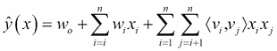

在等式中，`v`表示与每个变量（用户和项目）相关联的 K 维潜在向量，并且括号运算符表示内积。具有数据矩阵和特征向量的这种表示在许多机器学习方法中是常见的，例如，在线性回归或支持向量机（SVM）中。

但是，如果您熟悉矩阵分解（MF）模型，则前面的等式应该看起来很熟悉：它包含全局偏差以及用户/项目特定的偏差，并包括用户项目交互。现在，如果我们假设每个`x(j)`向量在位置`u`和`i`处仅为非零，我们得到经典的 MF 模型：

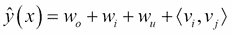

然而，用于推荐系统的 MF 模型经常遭受冷启动问题。我们将在下一节讨论这个问题。

### 冷启动问题和协同过滤方法

冷启动这个问题听起来很有趣，但顾名思义，它源于汽车。假设你住在阿拉斯加状态。由于寒冷，您的汽车发动机可能无法顺利启动，但一旦达到最佳工作温度，它将启动，运行并正常运行。

在推荐引擎的领域中，术语冷启动仅仅意味着对于引擎来说还不是最佳的环境以提供最佳结果。在电子商务中，冷启动有两个不同的类别：产品冷启动和用户冷启动。

冷启动是基于计算机的信息系统中的潜在问题，涉及一定程度的自动数据建模。具体而言，它涉及的问题是系统无法对尚未收集到足够信息的用户或项目进行任何推断。

冷启动问题在推荐系统中最为普遍。在协同过滤方法中，推荐系统将识别与活动用户共享偏好的用户，并提出志同道合的用户喜欢的项目（并且活跃用户尚未看到）。由于冷启动问题，这种方法将无法考虑社区中没有人评定的项目。

通过在基于内容的匹配和协同过滤之间采用混合方法，通常可以减少冷启动问题。尚未收到用户评级的新项目将根据社区分配给其他类似项目的评级自动分配评级。项目相似性将根据项目的基于内容的特征来确定。

使用基于 CF 的方法的推荐引擎根据用户操作推荐每个项目。项目具有的用户操作越多，就越容易分辨哪个用户对其感兴趣以及其他项目与之类似。随着时间的推移，系统将能够提供越来越准确的建议。在某个阶段，当新项目或用户添加到用户项目矩阵时，会出现此问题：

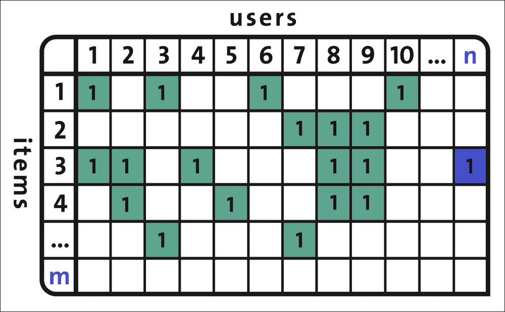

图 8：用户与项目矩阵有时会导致冷启动问题

在这种情况下，RE 还没有足够的知识来了解这个新用户或这个新项目。类似于 FM 的基于内容的过滤方法是可以结合以减轻冷启动问题的方法。

前两个方程之间的主要区别在于，FM 在潜在向量方面引入了高阶相互作用，潜在向量也受分类或标签数据的影响。这意味着模型超越了共现，以便在每个特征的潜在表示之间找到更强的关系。

## 问题的定义和制定

给定用户在电子商务网站上的典型会话期间执行的点击事件的序列  ，目标是预测用户是否购买或不购买，如果他们正在购买，他们会买什么物品。因此，这项任务可分为两个子目标：

*   用户是否会在此会话中购买物品？
*   如果是，那么将要购买的物品是什么？

为了预测在会话中购买的项目的数量，强大的分类器可以帮助预测用户是否将购买该项目的  。在最初实现 FM 后，训练数据的结构应如下：

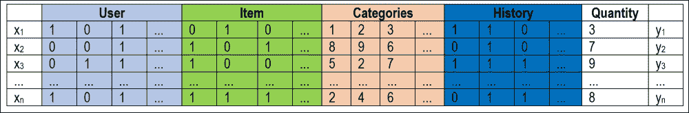

图 9：用户与项目/类别/历史表可用于训练推荐模型

为了准备这样的训练集，我们可以使用 pandas 中的`get_dummies()`方法将所有列转换为分类数据，因为 FM 模型使用表示为整数的分类数据。

我们使用两个函数`TFFMClassifier`和`TFFMRegressor`来进行预测（参见`items.py`）并分别计算 MSE（参见来自`tffm`库的`quantity.py`脚本（在 MIT 许可下））。`tffm`是基于 TensorFlow 的 FM 和 pandas 实现，用于预处理和结构化数据。这个基于 TensorFlow 的实现提供了一个任意顺序（`>= 2`）分解机，它支持：

*   密集和稀疏的输入
*   不同的（基于梯度的）优化方法
*   通过不同的损失函数进行分类/回归（logistic 和 mse 实现）
*   通过 TensorBoard 记录

另一个好处是推理时间相对于特征数量是线性的。

我们要感谢作者并引用他们的工作如下：Mikhail Trofimov，Alexander Novikov，TFFM：TensorFlow 实现任意顺序分解机，[GitHub 仓库](https://github.com/geffy/tffm)，2016。

要使用此库，只需在终端上发出以下命令：

```py
$ sudo pip3 install tffm # For Python3.x
$ sudo pip install tffm # For Python 2.7.x

```

在开始实现之前，让我们看一下我们将在本例中使用的数据集。

## 数据集描述

例如，我将使用 RecSys 2015 挑战数据集来说明如何拟合 FM 模型以获得个性化推荐。该数据包含电子商务网站的点击和购买事件，以及其他项目类别数据。数据集的大小约为 275MB，可以从[此链接](https://s3-eu-west-1.amazonaws.com/yc-rdata/yoochoose-data.7z)下载。

有三个文件和一个自述文件；但是，我们将使用`youchoose-buys.dat`（购买活动）和`youchoose-clicks.dat`（点击活动）：

*   `youchoose-clicks.dat`：文件中的每条记录/行都包含以下字段：
    *   会话 ID：一个会话中的一次或多次点击
    *   时间戳：发生点击的时间
    *   项目 ID：项目的唯一标识符
    *   类别：项目的类别
*   `youchoose-buys.dat`：文件中的每条记录/行都包含以下字段：
    *   会话 ID：会话 ID：会话中的一个或多个购买事件
    *   时间戳：购买发生的时间
    *   物料 ID：物品的唯一标识符
    *   价格：商品的价格
    *   数量：购买了多少件商品

`youchoose-buys.dat`中的会话 ID 也存在于`youchoose-clicks.dat`文件中。这意味着具有相同会话 ID 的记录一起形成会话期间某个用户的点击事件序列。

会话可能很短（几分钟）或很长（几个小时），可能只需点击一下或点击几百次。这一切都取决于用户的活动。

### 实现工作流程

让我们开发一个预测并生成`solution.data`文件的推荐模型。这是一个简短的工作流程：

1.  下载并加载 RecSys 2015 挑战数据集，并复制到本章代码库的`data`文件夹中
2.  购买数据包含会话 ID，时间戳，项目 ID，类别和数量。此外，`youchoose-clicks.dat`包含会话 ID，时间戳，项目 ID 和类别。我们不会在这里使用时间戳。我们删除时间戳，对所有列进行单热编码，  合并买入和点击数据集以使数据集特征丰富。在预处理之后，数据看起来类似于图 11 中所示的数据。
3.  为简化起见，我们仅考虑前 10,000 个会话，并将数据集拆分为训练（75%）和测试（25%）集。
4.  然后，我们将测试分为正常（保留历史数据）和冷启动（通过删除历史数据），以区分具有历史记录或没有历史记录的用户/项目的模型。
5.  然后我们使用`tffm`训练我们的 FM 模型，这是 TensorFlow 中 FM 的实现，并使用训练数据训练模型。
6.  最后，我们在正常和冷启动数据集上评估模型。

    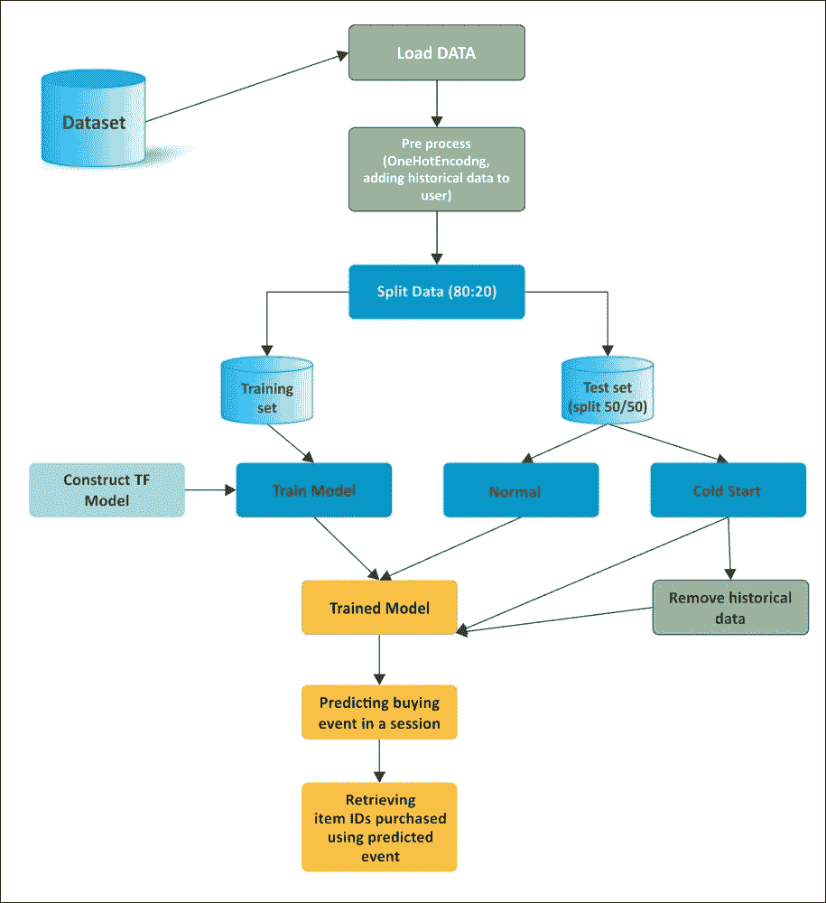

    图 10：使用 FM 预测会话中已购买项目列表的工作流程

## 预处理

如果我们想充分利用类别和扩展的历史数据，我们需要加载数据并将其转换为正确的格式。因此，在准备训练集之前，必须进行一些预处理。让我们从加载包和模块开始：

```py
import tensorflow as tf
import pandas as pd
from collections import Counter
from tffm import TFFMClassifier
from sklearn.metrics import mean_squared_error
from sklearn.model_selection import train_test_split
import numpy as np
from sklearn.metrics import accuracy_score
import os
```

我是  ，假设您已经从前面提到的链接下载了数据集。现在让我们加载数据集：

```py
buys = open('data/yoochoose-buys.dat', 'r')
clicks = open('data/yoochoose-clicks.dat', 'r')
```

现在为点击创建 pandas 数据帧并购买数据集：

```py
initial_buys_df = pd.read_csv(buys, names=['Session ID', 'Timestamp', 'Item ID', 'Category', 'Quantity'], dtype={'Session ID': 'float32', 'Timestamp': 'str', 'Item ID': 'float32','Category': 'str'})
initial_buys_df.set_index('Session ID', inplace=True)
initial_clicks_df = pd.read_csv(clicks, names=['Session ID', 'Timestamp', 'Item ID', 'Category'],dtype={'Category': 'str'})
initial_clicks_df.set_index('Session ID', inplace=True)
```

我们不需要在这个例子中使用时间戳，所以让我们从数据帧中删除它们：

```py
initial_buys_df = initial_buys_df.drop('Timestamp', 1)
    print(initial_buys_df.head())  # first five records
	print(initial_buys_df.shape)   # shape of the dataframe
>>>
```

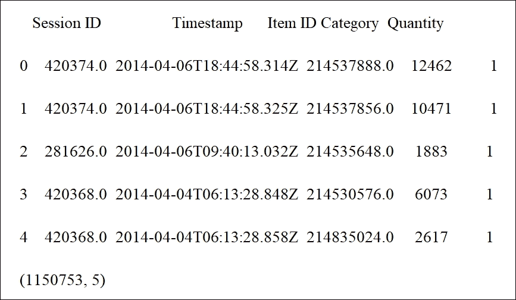

```py
initial_clicks_df = initial_clicks_df.drop('Timestamp', 1)
print(initial_clicks_df.head())
print(initial_clicks_df.shape)
>>>
```

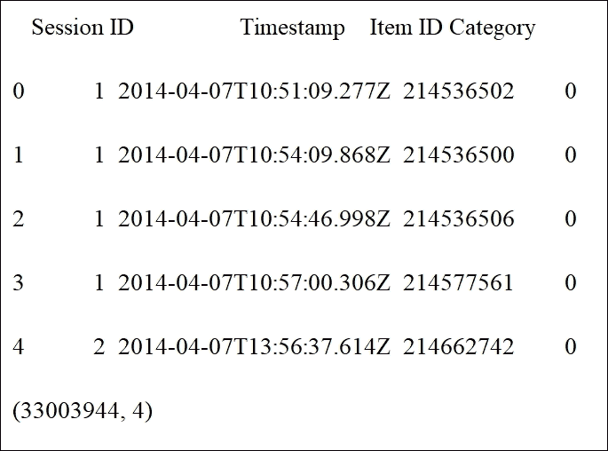

由于在此示例中我们不使用时间戳，因此从数据帧（`df`）中删除`Timestamp`列：

```py
initial_buys_df = initial_buys_df.drop('Timestamp', 1)
print(initial_buys_df.head(n=5))
print(initial_buys_df.shape)
>>>
```

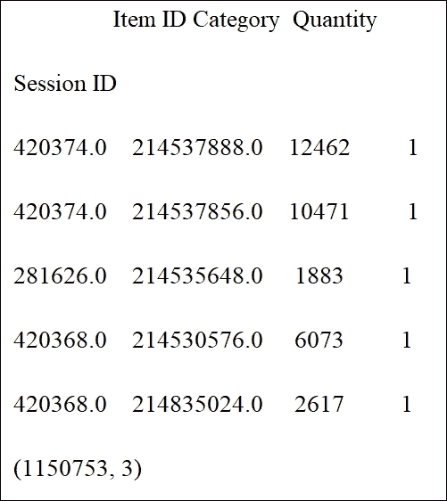

```py
initial_clicks_df = initial_clicks_df.drop('Timestamp', 1)
print(initial_clicks_df.head(n=5))
print(initial_clicks_df.shape)
>>>
```

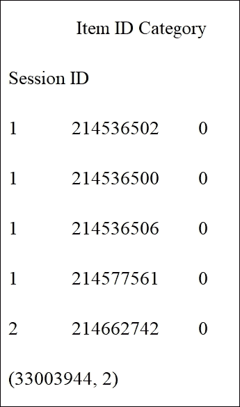

让我们选取前 10,000 名购买用户：

```py
x = Counter(initial_buys_df.index).most_common(10000)
top_k = dict(x).keys()
initial_buys_df = initial_buys_df[initial_buys_df.index.isin(top_k)]
    print(initial_buys_df.head())
    print(initial_buys_df.shape)
>>>
```

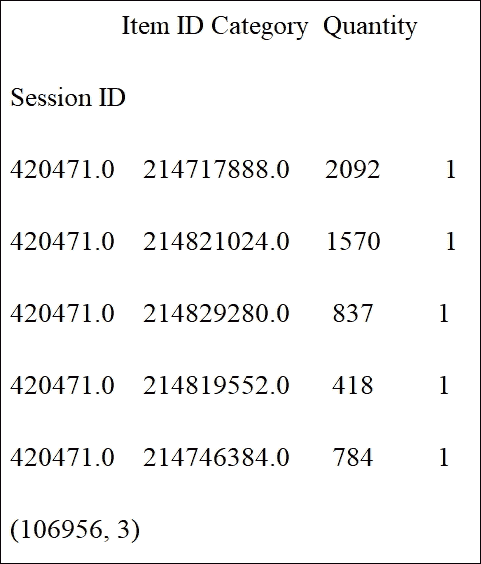

```py
initial_clicks_df = initial_clicks_df[initial_clicks_df.index.isin(top_k)]
    print(initial_clicks_df.head())
    print(initial_clicks_df.shape)
>>>
```

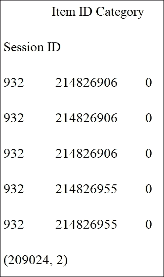

现在让我们创建索引的副本，因为我们还将对其应用单热编码：

```py
initial_buys_df['_Session ID'] = initial_buys_df.index
print(initial_buys_df.head())
print(initial_buys_df.shape)
>>>
```

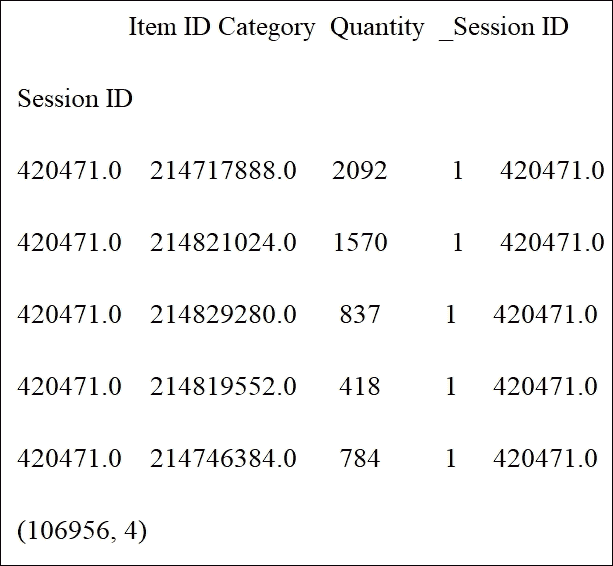

正如我们之前提到的  ，我们可以将历史参与数据引入我们的 FM 模型。我们将使用一些`group_by`魔法生成整个用户参与的历史记录。首先，我们对所有列进行单热编码以获得点击和购买：

```py
transformed_buys = pd.get_dummies(initial_buys_df)
   print(transformed_buys.shape)
>>>
(106956, 356)
transformed_clicks = pd.get_dummies(initial_clicks_df)print(transformed_clicks.shape)
>>>
(209024, 56)
```

现在是时候汇总项目和类别的历史数据了：

```py
filtered_buys = transformed_buys.filter(regex="Item.*|Category.*")
   print(filtered_buys.shape)
>>>
(106956, 354)
filtered_clicks = transformed_clicks.filter(regex="Item.*|Category.*")
    print(filtered_clicks.shape)
>>>
(209024, 56)
historical_buy_data = filtered_buys.groupby(filtered_buys.index).sum()
   print(historical_buy_data.shape)
>>>
(10000, 354)
historical_buy_data = historical_buy_data.rename(columns=lambda column_name: 'buy history:' + column_name)
    print(historical_buy_data.shape)
       >>>
      (10000, 354)
historical_click_data = filtered_clicks.groupby(filtered_clicks.index).sum()
    print(historical_click_data.shape)
    >>>
(10000, 56)
historical_click_data = historical_click_data.rename(columns=lambda column_name: 'click history:' + column_name)
```

然后我们合并每个`user_id`的历史数据：

```py
merged1 = pd.merge(transformed_buys, historical_buy_data, left_index=True, right_index=True)
print(merged1.shape)
merged2 = pd.merge(merged1, historical_click_data, left_index=True, right_index=True)
print(merged2.shape)
>>>
(106956, 710)
(106956, 766)
```

然后我们将数量作为目标并将其转换为二元：

```py
y = np.array(merged2['Quantity'].as_matrix())
```

现在让我们将`y`转换为二元：如果购买发生，为`1`；否则为`0`：

```py
for i in range(y.shape[0]):
    if y[i]!=0:
        y[i]=1
    else:
        y[i]=0
print(y.shape)
print(y[0:100])
print(y, y.shape[0])
print(y[0])
print(y[0:100])
print(y, y.shape)
>>>
```

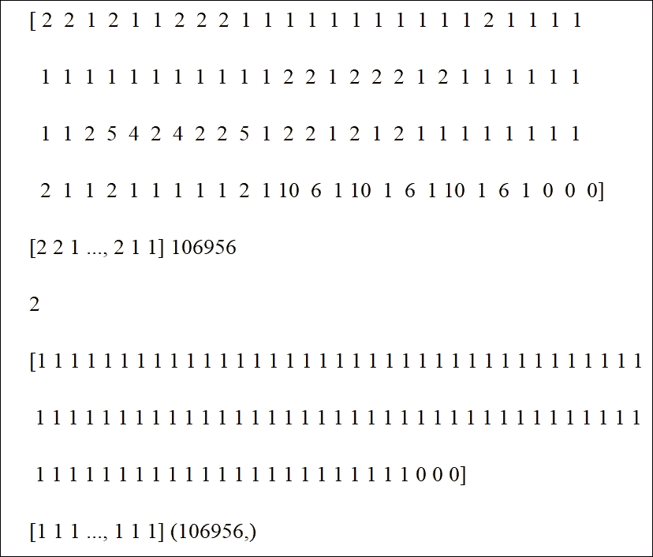

### 训练 FM 模型

由于我们准备了数据集，下一个任务是创建 MF 模型。首先，让我们将数据分成训练和测试集：

```py
X_tr, X_te, y_tr, y_te = train_test_split(merged2, y, test_size=0.25)
```

然后我们将测试数据分成一半，一个用于正常测试，一个用于冷启动测试：

```py
X_te, X_te_cs, y_te, y_te_cs = train_test_split(X_te, y_te, test_size=0.5)
```

现在让我们在数据帧中包含会话 ID 和项目 ID：

```py
test_x = pd.DataFrame(X_te, columns = ['Item ID'])
print(test_x.head())
>>>
```

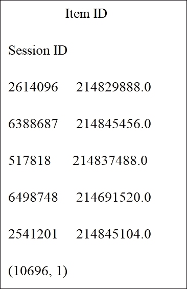

```py
test_x_cs = pd.DataFrame(X_te_cs, columns = ['Item ID'])
print(test_x_cs.head())
>>>
```

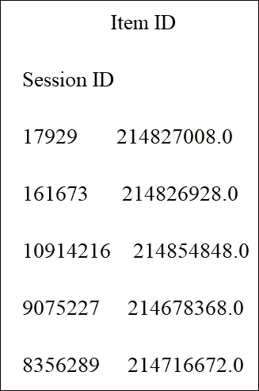

然后我们从数据集中删除不需要的特征：

```py
X_tr.drop(['Item ID', '_Session ID', 'click history:Item ID', 'buy history:Item ID', 'Quantity'], 1, inplace=True)
X_te.drop(['Item ID', '_Session ID', 'click history:Item ID', 'buy history:Item ID', 'Quantity'], 1, inplace=True)
X_te_cs.drop(['Item ID', '_Session ID', 'click history:Item ID', 'buy history:Item ID', 'Quantity'], 1, inplace=True)
```

然后我们需要将`DataFrame`转换为数组：

```py
ax_tr = np.array(X_tr)
ax_te = np.array(X_te)
ax_te_cs = np.array(X_te_cs)
```

既然 pandas `DataFrame`已经转换为 NumPy 数组，我们需要做一些`null`处理。我们简单地用零替换 NaN：

```py
ax_tr = np.nan_to_num(ax_tr)
ax_te = np.nan_to_num(ax_te)
ax_te_cs = np.nan_to_num(ax_te_cs)
```

然后我们用优化的超参数实例化 TF 模型进行分类：

```py
model = TFFMClassifier(
        order=2, 
        rank=7, 
        optimizer=tf.train.AdamOptimizer(learning_rate=0.001), 
        n_epochs=100, 
        batch_size=1024,
        init_std=0.001,
        reg=0.01,
        input_type='dense',
        log_dir = ' logs/',
        verbose=1,
        seed=12345
    )
```

在我们开始训练模型之前，我们必须为冷启动准备数据：

```py
cold_start = pd.DataFrame(ax_te_cs, columns=X_tr.columns)
```

和前面提到的一样，如果我们只能访问类别而没有历史点击/购买数据，我们也有兴趣了解会发生什么。让我们删除`cold_start`测试集的历史点击和购买数据：

```py
for column in cold_start.columns:
    if ('buy' in column or 'click' in column) and ('Category' not in column):
        cold_start[column] = 0
```

现在让我们训练模型：

```py
model.fit(ax_tr, y_tr, show_progress=True)
```

其中一项最重要的任务是预测会议中的购买事件：

```py
predictions = model.predict(ax_te)
print('accuracy: {}'.format(accuracy_score(y_te, predictions)))
print("predictions:",predictions[:10])
print("actual value:",y_te[:10])
>>>
accuracy: 1.0
predictions: [0 0 1 0 0 1 0 1 1 0]
actual value: [0 0 1 0 0 1 0 1 1 0]

cold_start_predictions = model.predict(ax_te_cs)
print('Cold-start accuracy: {}'.format(accuracy_score(y_te_cs, cold_start_predictions)))
print("cold start predictions:",cold_start_predictions[:10])
print("actual value:",y_te_cs[:10])
>>>
Cold-start accuracy: 1.0
cold start predictions: [1 1 1 1 1 0 1 0 0 1]
actual value: [1 1 1 1 1 0 1 0 0 1]
```

然后让我们将预测值添加到测试数据中：

```py
test_x["Predicted"] = predictions
test_x_cs["Predicted"] = cold_start_predictions
```

现在是时候找到测试数据中每个`session_id`的所有买入事件并检索相应的项目 ID：

```py
sess = list(set(test_x.index))
fout = open("solution.dat", "w")
print("writing the results into .dat file....")
for i in sess:
    if test_x.loc[i]["Predicted"].any()!= 0:
        fout.write(str(i)+";"+','.join(s for s in str(test_x.loc[i]["Item ID"].tolist()).strip('[]').split(','))+'\n')
fout.close()
>>>
writing the results into .dat file....
```

然后我们对冷启动测试数据做同样的事情：

```py
sess_cs = list(set(test_x_cs.index))
fout = open("solution_cs.dat", "w")
print("writing the cold start results into .dat file....")
for i in sess_cs:
    if test_x_cs.loc[i]["Predicted"].any()!= 0:
        fout.write(str(i)+";"+','.join(s for s in str(test_x_cs.loc[i]["Item ID"].tolist()).strip('[]').split(','))+'\n')
fout.close()
>>>
writing the cold start results into .dat file....
print("completed..!!")
>>>
completed!!
```

最后，我们销毁模型以释放内存：

```py
model.destroy()
```

另外，我们可以看到文件的示例内容：

```py
11009963;214853767
10846132;214854343, 214851590
8486841;214848315
10256314;214854125
8912828;214853085
11304897;214567215
9928686;214854300, 214819577
10125303;214567215, 214853852
10223609;214854358
```

考虑到我们使用相对较小的数据集来拟合我们的模型，  实验结果很好。正如预期的那样，如果我们可以通过项目购买和点击访问所有信息集，则更容易生成预测，但我们仍然只使用汇总类别数据获得冷启动建议的预测。

既然我们已经看到客户将在每个会话中购买，那么计算两个测试集的均方误差将会很棒。`TFFMRegressor`方法可以帮助我们解决这个问题。为此，请使用`quantity.py`脚本。

首先，问题是如果我们只能访问类别而没有历史点击/购买数据会发生什么。让我们删除`cold_start`测试集的历史点击和购买数据：

```py
for column in cold_start.columns:
    if ('buy' in column or 'click' in column) and ('Category' not in column):
        cold_start[column] = 0
```

让我们创建 MF 模型。您可以使用超参数：

```py
reg_model = TFFMRegressor(
    order=2,
    rank=7,
    optimizer=tf.train.AdamOptimizer(learning_rate=0.1),
    n_epochs=100,
    batch_size=-1,
    init_std=0.001,
    input_type='dense',
    log_dir = ' logs/',
    verbose=1
       )
```

在前面的代码块中，随意放入您自己的日志记录路径。现在是时候使用正常和冷启动训练集训练回归模型：

```py
reg_model.fit(X_tr, y_tr, show_progress=True)
```

然后我们计算两个测试集的均方误差：

```py
predictions = reg_model.predict(X_te)
print('MSE: {}'.format(mean_squared_error(y_te, predictions)))
print("predictions:",predictions[:10])
print("actual value:",y_te[:10])
cold_start_predictions = reg_model.predict(X_te_cs)
print('Cold-start MSE: {}'.format(mean_squared_error(y_te_cs, cold_start_predictions)))
print("cold start predictions:",cold_start_predictions[:10])
print("actual value:",y_te_cs[:10])
print("Regression completed..!!")
>>>MSE: 0.4897467853668941
predictions: [ 1.35086     0.03489107  1.0565269  -0.17359206 -0.01603088  0.03424695
  2.29936886  1.65422797  0.01069662  0.02166392]
actual value: [1 0 1 0 0 0 1 1 0 0]
Cold-start MSE: 0.5663486183636738
cold start predictions: [-0.0112379   1.21811676  1.29267406  0.02357371 -0.39662406  1.06616664
 -0.10646269  0.00861482  1.22619736  0.09728943]
actual value: [0 1 1 0 1 1 0 0 1 0]
Regression completed..!!
```

最后，我们销毁模型以释放内存：

```py
reg_model.destroy()
```

因此，从训练数据集中删除类别列会使 MSE 更小，但这样做意味着我们无法解决冷启动建议问题。考虑到我们使用相对较小的数据集的条件，实验结果很好。

正如预期的那样，如果我们可以通过项目购买和点击访问完整的信息设置，则更容易生成预测，但我们仍然只使用汇总的类别数据获得冷启动建议的预测。

# 改进的分解机

Web 应用的许多预测任务需要对分类变量（例如用户 ID）和人口统计信息（例如性别和职业）进行建模。为了应用标准 ML 技术，需要通过单热编码（或任何其他技术）将这些分类预测变换器转换为一组二元特征。这使得得到的特征向量高度稀疏。要从这种稀疏数据中有效地学习，考虑特征之间的相互作用是很重要的。

在上一节中，我们看到 FM 可以有效地应用于模型二阶特征交互。但是，FM 模型以线性方式进行交互，如果您想捕获真实世界数据的非线性和固有复杂结构，则这种方式是不够的。

Xiangnan He 和 Jun Xiao 等。为了克服这一局限，我们提出了一些研究计划，如神经因子分解机（NFM）和注意因子分解机（AFM）。

有关更多信息，请参阅以下文章：

*   Xiangnan He 和 Tat-Seng Chua，用于稀疏预测分析的神经分解机。在 SIGIR '17，新宿，东京，日本，2017 年 8 月 7 日至 11 日的会议录。
*   Jun Xiao，Hao Ye，Xiantian He，Hanwang Zhang，Fei Wu 和 Tat-Seng Chua（2017），注意分解机：通过注意网络学习特征交互的权重 IJCAI，墨尔本，澳大利亚，2017 年 8 月 19 - 25 日。

通过在建模二阶特征相互作用中无缝地组合 FM 的线性度和在建模高阶特征相互作用中神经网络的非线性，NFM 可用于在稀疏设置下进行预测。

另一方面，即使所有特征交互具有相同的权重，AFM 也可用于对数据建模，因为并非所有特征交互都同样有用且具有预测性。

在下一节中，我们将看到使用 NFM 进行电影推荐的示例。

## 神经分解机

使用原始 FM 算法，其表现可能受到建模方式阻碍，它使用相同权重建模所有特征交互，因为并非所有特征交互都同样有用且具有预测性。例如，与无用特征的交互甚至可能引入噪声并对表现产生不利影响。

最近，Xiangnan H.等。提出了一种称为神经分解机（NFM）的 FM 算法的改进版本。 NFM 在建模二阶特征相互作用中无缝地结合了 FM 的线性度，在建模高阶特征相互作用时无缝地结合了神经网络的非线性。从概念上讲，NFM 比 FM 更具表现力，因为 FM 可以被看作是没有隐藏层的 NFM 的特例。

### 数据集描述

我们使用  MovieLens 数据进行个性化标签推荐。它包含电影上 668,953 个用户的标签应用。使用单热编码将每个标签应用（用户 ID，电影 ID 和标签）转换为特征向量。这留下了 90,445 个二元特征，称为`ml-tag`数据集。

我使用 Perl 脚本将其从`.dat`转换为`.libfm`格式。转换程序在[此链接](http://www.libfm.org/libfm-1.42.manual.pdf)（第 2.2.1 节）中描述。转换后的数据集包含用于训练，验证和测试的文件，如下所示：

*   `ml-tag.train.libfm`
*   `ml-tag.validation.libfm`
*   `ml-tag.test.libfm`

有关此文件格式的更多信息，请参阅[此链接](http://www.libfm.org/)。

### NFM 和电影推荐

我们使用 TensorFlow 并复用来自这个 [GitHub](https://github.com/hexiangnan/neural_factorization_machine) 的扩展 NFM 实现。这是 FM 的深度版本，与常规 FM 相比更具表现力。仓库有三个文件，即`NeuralFM.py`，`FM.py`和`LoadData.py`：

*   `FM.py`用于训练数据集。这是 FM 的原始实现。
*   `NeuralFM.py`用于训练数据集。这是 NFM 的原始实现，但有一些改进和扩展。
*   `LoadData.py`用于以 libfm 格式预处理和加载数据集。

#### 模型训练

首先，我们使用以下命令训练 FM 模型。该命令还包括执行训练所需的参数：

```py
$ python3 FM.py --dataset ml-tag --epoch 20 --pretrain -1 --batch_size 4096 --lr 0.01 --keep 0.7
>>>
FM: dataset=ml-tag, factors=16, #epoch=20, batch=4096, lr=0.0100, lambda=0.0e+00, keep=0.70, optimizer=AdagradOptimizer, batch_norm=1 
#params: 1537566
Init: 	 train=1.0000, validation=1.0000 [5.7 s]
Epoch 1 [13.9 s]    train=0.5413, validation=0.6005 [7.8 s]
Epoch 2 [14.2 s]    train=0.4927, validation=0.5779 [8.3 s]
…
Epoch 19 [15.4 s]    train=0.3272, validation=0.5429 [8.1 s]
Epoch 20 [16.6 s]    train=0.3242, validation=0.5425 [7.8 s]
```

训练结束后，训练好的模型将保存在主目录的`pretrain`文件夹中：

将模型保存为预训练文件。

此外，我已尝试使用以下代码进行验证和训练损失的训练和验证误差：

```py
    # Plot loss over time
    plt.plot(epoch_list, train_err_list, 'r--', label='FM training loss per epoch', linewidth=4)
    plt.title('FM training loss per epoch')
    plt.xlabel('Epoch')
    plt.ylabel('Training loss')
    plt.legend(loc='upper right')
    plt.show()

    # Plot accuracy over time
    plt.plot(epoch_list, valid_err_list, 'r--', label='FM validation loss per epoch', linewidth=4)
    plt.title('FM validation loss per epoch')
    plt.xlabel('Epoch')
    plt.ylabel('Validation loss')
    plt.legend(loc='upper left')
    plt.show()
```

前面的代码生成绘图，显示 FM 模型中每次迭代的训练与验证损失：

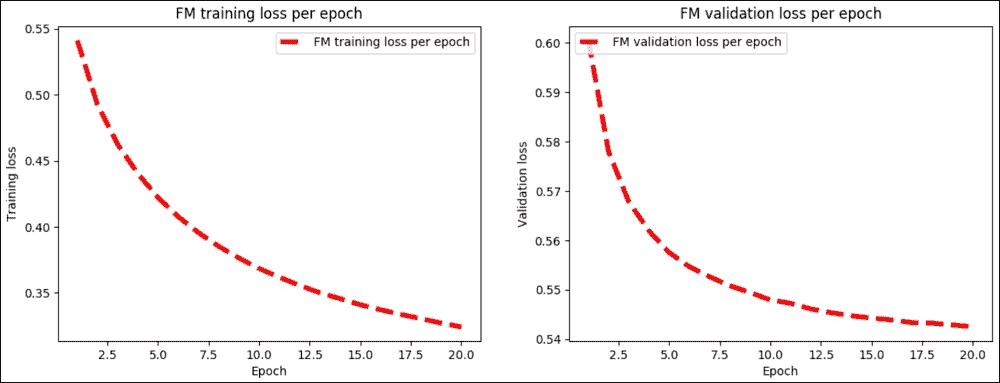

图 11：FM 模型中每次迭代的训练与验证损失

如果查看前面的输出日志，最佳训练（即验证和训练）将在第 20 次和最后一次迭代时进行。但是，您可以进行更多迭代以改进训练，这意味着评估步骤中的 RMSE 值较低：

```py
Best Iter(validation)= 20    train = 0.3242, valid = 0.5425 [490.9 s]
```

现在让我们使用以下命令训练  NFM 模型（但也使用参数）：

```py
$ python3 NeuralFM.py --dataset ml-tag --hidden_factor 64 --layers [64] --keep_prob [0.8,0.5] --loss_type square_loss --activation relu --pretrain 0 --optimizer AdagradOptimizer --lr 0.01 --batch_norm 1 --verbose 1 --early_stop 1 --epoch 20
>>>
Neural FM: dataset=ml-tag, hidden_factor=64, dropout_keep=[0.8,0.5], layers=[64], loss_type=square_loss, pretrain=0, #epoch=20, batch=128, lr=0.0100, lambda=0.0000, optimizer=AdagradOptimizer, batch_norm=1, activation=relu, early_stop=1
#params: 5883150
Init:    train=0.9911, validation=0.9916, test=0.9920 [25.8 s]
Epoch 1 [60.0 s]    train=0.6297, validation=0.6739, test=0.6721 [28.7 s]
Epoch 2 [60.4 s]    train=0.5646, validation=0.6390, test=0.6373 [28.5 s]
…
Epoch 19 [53.4 s]    train=0.3504, validation=0.5607, test=0.5587 [25.7 s]
Epoch 20 [55.1 s]    train=0.3432, validation=0.5577, test=0.5556 [27.5 s]
```

此外，我尝试使用以下代码使验证和训练损失的训练和验证误差可见：

```py
    # Plot test accuracy over time
    plt.plot(epoch_list, test_err_list, 'r--', label='NFM test loss per epoch', linewidth=4)
    plt.title('NFM test loss per epoch')
    plt.xlabel('Epoch')
    plt.ylabel('Test loss')
    plt.legend(loc='upper left')
    plt.show()
```

前面的代码在 NFM 模型中产生每次迭代的训练与验证损失：

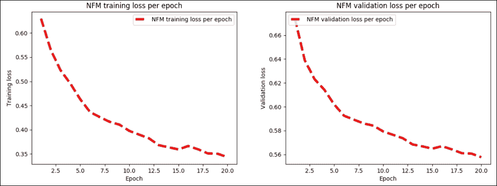

图 12：NFM 模型中每次迭代的训练与验证损失

对于  NFM 模型，最佳训练（用于验证和训练）发生在第 20 次和最后一次迭代。但是，您可以进行更多迭代以改进训练，这意味着评估步骤中的 RMSE 值较低：

```py
Best Iter (validation) = 20   train = 0.3432, valid = 0.5577, test = 0.5556 [1702.5 s]
```

#### 模型评估

现在，要评估原始 FM 模型，请执行以下命令：

```py
$ python3 FM.py --dataset ml-tag --epoch 20 --batch_size 4096 --lr 0.01 --keep 0.7 --process evaluate
Test RMSE: 0.5427
```

### 注意

对于 TensorFlow 上的 Attentional Factorization Machines 实现，感兴趣的读者可以参考[此链接](https://github.com/hexiangnan/attentional_factorization_machine)中的 GitHub 仓库。但请注意，某些代码可能无效。我将它们更新为兼容 TensorFlow v1.6。因此，我强烈建议您使用本书提供的代码。

要评估 NFM 模型，只需将以下行添加到`NeuralFM.py`脚本中的`main()`方法，如下所示：

```py
# Model evaluation
print("RMSE: ")
print(model.evaluate(data.Test_data)) #evaluate on test set
>>>
RMSE: 0.5578330373003925
```

因此，RMSE 几乎与 FM 模型相同。现在让我们看看每次迭代的测试误差：

```py
# Plot test accuracy over time
plt.plot(epoch_list, test_err_list, 'r--', label='NFM test loss per epoch', linewidth=4)
plt.title('NFM test loss per epoch')
plt.xlabel('Epoch')
plt.ylabel('Test loss')
plt.legend(loc='upper left')
plt.show()
```

前面的代码绘制了 NFM 模型中每次迭代的测试损失：

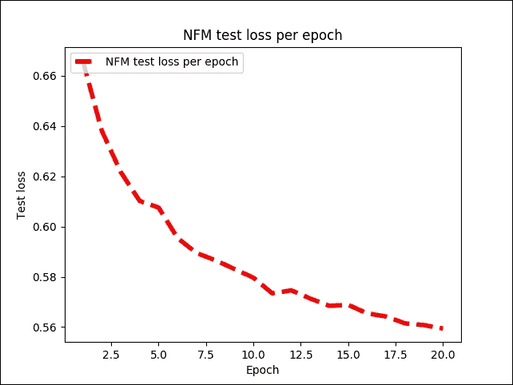

图 13：NFM 模型中每次迭代的测试损失

# 总结

在本章中，我们讨论了如何使用 TensorFlow 开发可扩展的推荐系统。我们已经看到推荐系统的一些理论背景，并在开发推荐系统时使用协同过滤方法。在本章后面，我们看到了如何使用 SVD 和 K 均值来开发电影推荐系统。

最后，我们了解了如何使用 FM 和一种称为 NFM 的变体来开发更准确的推荐系统，以便处理大规模稀疏矩阵。我们已经看到处理冷启动问题的最佳方法是使用 FM 协同过滤方法。

下一章是关于设计由批评和奖励驱动的 ML 系统。我们将看到如何应用 RL 算法为现实数据集制作预测模型。

