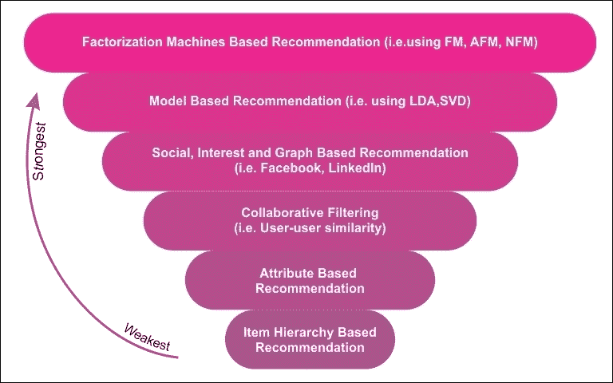

# 第 9 章使用分解机的推荐系统

因子分解模型在推荐系统中非常流行，因为它们可用于发现两种不同实体之间相互作用的潜在特征。在本章中，我们将提供几个如何开发预测分析推荐系统的示例。

我们将看到推荐系统的理论背景，例如矩阵分解。在本章后面，我们将看到如何使用协同方法开发电影推荐系统。最后，将了解如何使用分解机（FM）及其改进版本来开发更强大的推荐系统。

总之，本章将介绍以下主题：

*   推荐系统
*   使用协同过滤方法的电影推荐系统
*   K-means 用于聚类类似的电影
*   基于 FM 的推荐系统
*   使用改进的 FM 进行电影推荐

# 推荐系统

推荐技术只是信息智能体，它们试图预测用户可能感兴趣的项目，并向目标用户推荐最好的项目。可以基于它们使用的信息源对这些技术进行分类。例如，用户特征（年龄，性别，收入和位置），项目特征（关键字和流派），用户项目评级（显式评级和交易数据）以及有关用户和项目的其他信息推荐。

因此，推荐系统（也称为推荐引擎或 RE）是信息过滤系统的子类  ，其有助于基于用户为项目提供的评级来预测评级或偏好。近年来，推荐系统变得越来越流行。

例如，在亚马逊，可以通过估计所有销售的 35％由推荐引擎生成的事实来衡量向正确用户建议正确项目的重要性。因此，亚马逊正在投入大量人才和资源来改善人工智能 - 特别是“深度学习”技术 - 以制作能够更有效地学习和扩展的推荐引擎。

因此，它们被用于许多领域，例如电影，音乐，新闻，书籍，研究文章，搜索查询，社交标签，产品，笑话，餐馆，服装，金融服务，人寿保险和在线交友网站。

有几种方法可以开发 RE 来生成推荐列表。例如，协同和基于内容的过滤，基于知识或基于个性的方法。

## 协同过滤方法

使用协同过滤方法，可以基于用户的过去行为来构建 RE。对消耗的物品给出数值等级  。有时，它可以基于其他用户购买相同项目的决策，使用一些广泛使用的数据挖掘算法，如 Apriori 或 FP-growth。在下图中，您可以了解不同的推荐系统：

图 1：不同推荐系统的比较视图

基于协同过滤的方法常常受到三个问题的影响：

*   冷启动：当需要大量关于用户的数据来制作更准确的推荐系统时，有时它们会被卡住。
*   可扩展性：通常需要大量的计算能力，来使用具有数百万用户和产品的数据集来计算推荐。
*   稀疏性：当大型电子商务网站上销售大量商品时，通常会出现众包数据集。 从某种意义上说，所有推荐数据集都是众包的。对于几乎所有推荐系统来说，这是一个普遍的问题，这些推荐系统具有足够多的项目以提供给足够多的用户，并且不需要仅限于电子商务站点。

    在这种情况下，活跃用户可能只评价所售商品的一小部分，因此即使是最受欢迎的商品也只有很少的评级。因此，用户与项目矩阵变得非常稀疏。换句话说，处理大规模稀疏矩阵在计算上非常具有挑战性。

为了克服这些问题，特定类型的协同过滤算法使用矩阵分解，其是低秩矩阵近似技术。我们将在本章后面看到一个例子。

## 基于内容的过滤方法

使用基于内容的过滤，项目的一系列离散特征被用于推荐具有类似属性的附加项目。有时它基于项目的描述和用户偏好的概况。这些方法尝试推荐与用户过去喜欢或当前正在使用的项目类似的项目。

基于内容的过滤的一个关键问题是系统是否能够从他们关于一个内容源的操作中学习用户偏好并将其与其他内容类型一起使用。当部署这种类型的 RE 时，它可以用于预测用户可能感兴趣的项目或项目的评级。

## 混合推荐系统

如您所见，协同过滤和基于内容的过滤方法有几个优点和缺点。因此，为了克服这两种方法的局限性，最近的趋势已经表明，混合方法可以更有效并且准确。有时，使用因子分解矩阵（FM）和奇异值分解（SVD）等因子分类方法使它们具有鲁棒性。混合方法可以通过多种方式实现：

*   基于内容和协同的预测分别计算，然后组合成一个模型。在这种方法中，FM 和 SVD 经常被广泛使用。
*   基于内容的特征被添加到协同方法中，反之亦然。同样，FM 和 SVD 用于更好的预测。

Netflix 是使用这种混合方法向其订阅者提供建议的完美示例。该网站以两种方式提出建议：

*   协同过滤：通过比较类似用户的观看和搜索习惯
*   基于内容的过滤：通过推荐与用户评价较高的电影共享特征的电影

## 基于模型的协同过滤

协同过滤方法被分类为基于存储器的，即基于用户的算法和基于模型的协同过滤（推荐的内核映射）。在基于模型的协同过滤技术中，用户和产品由一小组因素描述，也称为潜在因子（LF）。

然后，LF 用于预测缺失的条目。交替最小二乘（ALS）算法用于学习这些潜在因素。有几个优点：

*   与基于记忆的方法相比，基于模型的方法可以更好地处理原始矩阵的稀疏性
*   使用这种方法，得到的模型变得比实际数据集小得多，这为整个系统提供了可扩展性。
*   基于模型的系统比基于内存的系统更快，因为生成的模型比查询整个数据集所需的模型要小得多。
*   使用这种方法，可以相对容易地避免过拟合。

作为缺点，基于模型的方法不灵活且适应性强，因为难以向模型添加数据。预测的质量取决于模型的构建方式，但由于这种方法不灵活，我们无法利用所有数据。这意味着我们可能无法获得较高的预测准确率。