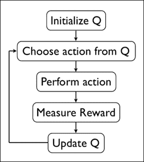
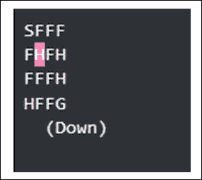
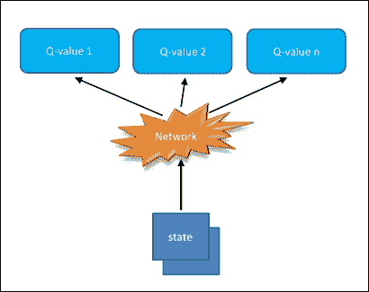
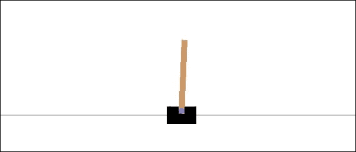
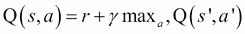
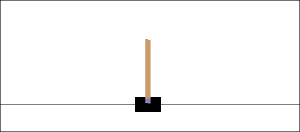
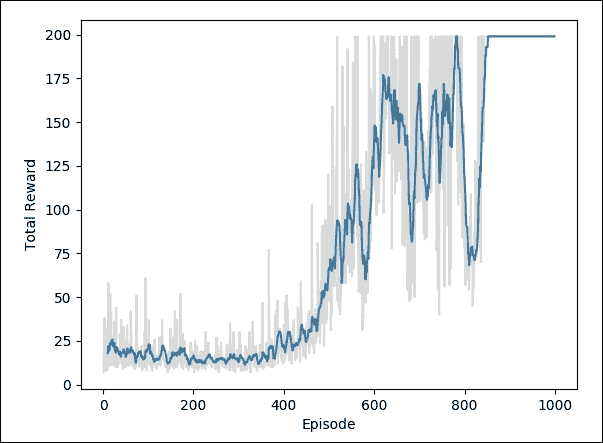

# 十、OpenAI Gym

OpenAI Gym 是一个开源 Python 框架，由非营利性 AI 研究公司 OpenAI 开发，作为开发和评估 RL 算法的工具包。它给我们提供了一组测试问题，称为环境，我们可以编写 RL 算法来解决。这使我们能够将更多的时间用于实现和改进学习算法，而不是花费大量时间来模拟环境。此外，它为人们提供了一种比较和审查其他算法的媒介。

## OpenAI 环境

OpenAI Gym 拥有一系列环境。在编写本书时，可以使用以下环境：

*   经典控制和玩具文本：来自 RL 文献的小规模任务。
*   算法：执行计算，例如添加多位数和反转序列。这些任务中的大多数都需要记忆，并且可以通过改变序列长度来改变它们的难度。
*   Atari：经典  Atari 游戏，使用街机学习环境，屏幕图像或 RAM 作为输入。
*   棋盘游戏：目前，我们已经将 Go 游戏包括在 9x9 和 19x19 板上，而 Pachi 引擎[13]则作为对手。
*   2D 和 3D 机器人：允许在模拟中控制机器人。这些任务使用 MuJoCo 物理引擎，该引擎专为快速准确的机器人仿真而设计。一些任务改编自 RLLab。

## env 类

OpenAI Gym 允许使用`env`类，它封装了环境和任何内部动态。此类具有不同的方法和属性，使您可以实现创建新环境。最重要的方法名为`reset`，`step`和`render`：

*   `reset`方法的任务是通过将环境初始化为初始状态来重置环境。在重置方法中，必须包含构成环境的元素的定义（在这种情况下，机械臂的定义，要抓取的对象及其支持）。
*   `step`方法是用于在时间上推进环境的  。它需要输入操作并将新观察结果返回给智能体。在该方法中，必须定义运动动态管理，状态和奖励计算以及剧集完成控制。
*   最后一种方法是`render`，  用于显示当前状态。

使用框架提出的`env`类作为新环境的基础，它采用工具包提供的通用接口。

这样，构建的环境可以集成到工具包的库中，并且可以从 OpenAI Gym 社区的用户所做的算法中学习它们的动态。

## 安装并运行 OpenAI Gym

有关如何使用和运行 OpenAI Gym 的更多详细说明，请参阅（[此链接](https://gym.openai.com/docs/)）的官方文档页面。使用以下命令可以实现 OpenApp Gym 的最小安装：

```py
git clone https://github.com/openai/gym
cd gym
pip install -e

```

安装 OpenAI Gym 之后，您可以在 Python 代码中实例化并运行环境：

```py
import gym
env = gym.make('CartPole-v0')

obs = env.reset()

for step_idx in range(500):
  env.render()
  obs, reward, done, _ = env.step(env.action_space.sample())
```

此代码段将首先导入`gym`库。然后它创建了 [Cart-Pole](https://gym.openai.com/envs/CartPole-v0/) 环境的实例  ，这是 RL 中的经典问题。 Cart-Pole 环境模拟安装在推车上的倒立摆。钟摆最初是垂直的，你的目标是保持其垂直平衡。控制摆锤的唯一方法是选择水平方向让推车移动（向左或向右）。

上面的代码运行`500`时间步的环境，并选择随机操作在每一步执行。因此，您在下面的视频中看到，杆不能长时间保持稳定。奖励是通过在杆距垂直方向超过 15 度之前经过的时间步数来衡量的。您保持在此范围内的时间越长，您的总奖励就越高。

# Q-Learning 算法

解决 RL 问题需要在学习过程中估计评估函数。该函数必须能够通过奖励的总和来评估策略的成功。

Q-Learning 的基本思想是算法学习整个状态和动作空间的最优评估函数（`S×A`）。这种所谓的`Q`函数以`Q: S×A -> R`的形式提供匹配，其中`R`是在状态`s ∈ S`中执行的动作`a ∈ A`的未来奖励的期望值。一旦智能体学会了最佳函数`Q`，它就能够识别哪种行为将导致某种状态下最高的未来奖励。

实现 Q-Learning 算法的最常用示例之一涉及使用表。该表的每个单元格是值`Q(s; a) = R`并且它被初始化为 0.由智能体执行的动作`a ∈ A`是使用相对于 Qε-greedy 的策略来选择的。

Q-Learning 算法的基本思想是训练规则，它更新表格元素`Q(s; a) = R`。

该算法遵循以下基本步骤：

1.  任意初始化`Q(s; a) = R`。
2.  对每个剧集重复以下：
    1.  初始化`s`。
    2.  重复（对于剧集的每一步）：
    3.  使用从`Q`派生的策略从`s ∈ S`中选择一个动作`a ∈ A`。
    4.  选取动作`a`，观察`r`，`s'`： 
    
        ```
        Q(s; a) <= Q(s; a) + a · (r + γ · max Q(s'; a) - Q(s; a))
        s': s <- s'
        ```

    5.  继续直到`s`终点。

我们在下图中描述了算法：



图 2：Q-Learning 算法

让我们总结一下 Q 值更新过程中使用的参数：

*   `α`是学习率，设置在 0 和 1 之间。将其设置为 0 意味着 Q 值永远不会更新，因此不会学习任何内容。设置较高的值（如 0.9）意味着可以快速进行学习。
*   `γ`是折扣因子，设置在 0 和 1 之间。这模拟了未来奖励的价值低于直接奖励的事实。在数学上，需要将折扣因子设置为小于 1 以使算法收敛。
*   `max Q(s'; a)`是在当前状态之后的状态下可获得的最大奖励，即之后采取最佳行动的奖励。

## FrozenLake 环境

智能体控制角色在 4×4 网格世界中的移动。网格的一些瓷砖是可行走的，而其他瓷砖则导致落入水中。另外，智能体的移动方向是不确定的，并且仅部分地取决于所选择的方向。智能体因找到目标图块的可行走路径而获得奖励：



图 3：Frozen-Lake v0 网格字的表示

使用如下网格描述上面所示的表面：

```py
SFFF   (S: starting point, safe)
FHFH   (F: frozensurface, safe)
FFFH   (H: hole, fall to yourdoom)
HFFG   (G: goal, where the frisbee islocated)
```

当我们到达目标或陷入一个洞时，这一集结束。如果达到目标，我们会收到`1`的奖励，否则会收到`0`。

针对 FrozenLake 问题的 Q-Learning

在为高度结构化数据提供良好功能方面，神经网络非常强大。

为了解决 FrozenLake 问题，我们将构建一个单层网络，该网络采用[1×16]向量中编码的状态并学习最佳移动（动作），在向量中映射可能的动作长度为四。

以下实现基于 TensorFlow：

首先，我们需要导入所有库：

```py
import gym
import numpy as np
import random
import tensorflow as tf
import matplotlib.pyplot as plt
```

然后我们加载并设置环境以进行测试：

```py
env = gym.make('FrozenLake-v0')
```

输入网络是一种状态，以张量形状[1,16]编码。因此，我们定义了 input1 占位符：

```py
inputs1 = tf.placeholder(shape=[1,16],dtype=tf.float32)
```

网络权重最初由`tf.random_uniform`函数随机选择：

```py
W = tf.Variable(tf.random_uniform([16,4],0,0.01))
```

网络输出由`inputs1`占位符和权重的乘积给出：

```py
Qout = tf.matmul(inputs1,W)
```

在`Qout`上评估的`argmax`将给出预测值：

```py
predict = tf.argmax(Qout,1)
```

最佳动作（`nextQ`）以张量形状编码[1,4]：

```py
nextQ = tf.placeholder(shape=[1,4],dtype=tf.float32)
```

接下来，我们定义一个损失函数来实现反向传播过程。

损失函数是`loss = ∑(Q - target - Q)`，其中计算当前预测的 Q 值和目标值之间的差异，并且梯度通过网络传递：

```py
loss = tf.reduce_sum(tf.square(nextQ - Qout))
```

优化函数是众所周知的`GradientDescentOptimizer`：

```py
trainer = tf.train.GradientDescentOptimizer(learning_rate=0.1)
updateModel = trainer.minimize(loss)
```

重置并初始化计算图：

```py
tf.reset_default_graph()
init = tf.global_variables_initializer()
```

然后我们设置 Q-Learning 训练过程的参数：

```py
y = .99
e = 0.1
num_episodes = 6000

jList = []
rList = []
```

我们定义会话`sess`，其中网络必须学习最佳的移动顺序：

```py
with tf.Session() as sess:
    sess.run(init)
    for i in range(num_episodes):
        s = env.reset()
        rAll = 0
        d = False
        j = 0

        while j < 99:
            j+=1
```

输入状态用于为网络提供信息：

```py
            a,allQ = sess.run([predict,Qout],\
                              feed_dict=\
                              {inputs1:np.identity(16)[s:s+1]})
```

从输出张量`a`中选择一个随机状态：

```py
            if np.random.rand(1) < e:
                a[0] = env.action_space.sample()
```

使用`env.step()`函数评估`a[0]`动作，获得奖励，`r`和状态，`s1`：

```py
                     s1,r,d,_ = env.step(a[0])
```

新状态`s1`用于更新 Q 张量：

```py
            Q1 = sess.run(Qout,feed_dict=\
                          {inputs1:np.identity(16)[s1:s1+1]})
            maxQ1 = np.max(Q1)
            targetQ = allQ
            targetQ[0,a[0]] = r + y*maxQ1
```

当然，必须为反向传播过程更新权重：

```py
           _,W1 = sess.run([updateModel,W],\
                             feed_dict=\
                           {inputs1:np.identity(16)[s:s+1],nextQ:targetQ})
```

`rAll`这里定义了会话期间获得的总奖励。让我们回想一下，RL 智能体的目标是最大化它从长远来看所获得的总奖励：

```py
rAll += r
```

更新下一步的环境状态：

```py
          s = s1
           if d == True:
                e = 1./((i/50) + 10)
                break
   jList.append(j)
   rList.append(rAll)
```

计算结束时，将显示成功剧集的百分比：

```py
print ("Percent of successfulepisodes: " +\
str(sum(rList)/num_episodes) + "%")
```

如果我们运行模型，我们应该得到这样的结果，可以通过调整网络参数来改进：

```py
>>>[2017-01-15 16:56:01,048] Making new env: FrozenLake-v0
Percentage of successful episodes: 0.558%
```

# 深度 Q 学习

多亏了 DeepMind 在 2013 年和 2016 年取得的近期成就，它成功地在 Atari 游戏中达到了所谓的超人级别，并击败了世界冠军 Go，RL 在机器学习社区中变得非常有趣。这种新的兴趣也是由于深度神经网络（DNN）表现为近似函数，使这种算法的潜在价值达到了更高的水平。最近获得最多兴趣的算法肯定是深度 Q-Learning。以下部分介绍深度 Q-Learning 算法，并讨论一些优化技术以最大化其表现。

## 深度 Q 神经网络

当状态数和可能的动作增加并且从矩阵的角度来看变得难以管理时，Q 学习基础算法会引起巨大的问题。想想谷歌使用的结构输入配置，以达到 Atari 游戏的表现水平。州空间是离散的，但国家的数量是巨大的。这就是深度学习的步骤。神经网络非常擅长为高度结构化的数据提供良好的功能。事实上，我们可以用神经网络识别 Q 函数，它将状态和动作作为输入并输出相应的 Q 值：

Q（状态；行动）=价值

深度神经网络最常见的实现如下图所示：


图 4：Deep Q 神经网络的通用实现

或者，  可以将状态作为输入，并为每个可能的动作生成相应的值：

Q（状态）=每个可能操作的值

这个优化的实现可以在下图中看到：



图 5：Deep Q 神经网络的优化实现

最后的方法在计算上是有利的，因为要更新 Q 值（或选择最高的 Q 值），我们只需要通过网络向前迈出一步，我们将立即获得所有可用操作的所有 Q 值。

## Cart-Pole 问题

我们将建立一个深度神经网络，可以学习通过 RL 玩游戏。更具体地说，我们将使用深度 Q 学习训练智能体玩 Cart-Pole 游戏。

在这个游戏中，  自由摆动杆连接到推车。推车可以向左和向右移动，目标是尽可能长时间保持杆直立：



图 6：Cart-Pole

我们使用 OpenAI Gym 模拟这个游戏。我们需要导入所需的库：

```py
import gym
import tensorflow as tf
import numpy as np
import time
```

让我们创建 Cart-Pole 游戏环境：

```py
env = gym.make('CartPole-v0')
```

初始化环境，奖励列表和开始时间：

```py
env.reset()
rewards = []
tic = time.time()
```

这里使用`env.render()`语句来显示运行模拟的窗口：

```py
for _ in range(1000):
    env.render()
```

`env.action_space.sample()`被传递给`env.step()`语句以构建模拟的下一步：

```py
    state, reward, done, info = \
           env.step\
           (env.action_space.sample())
```

在  Cart-Pole 游戏中，有两种可能的动作：向左或向右移动  。因此，我们可以采取两种操作，编码为 0 和 1。

在这里，我们采取随机行动：

```py
    rewards.append(reward)
    if done:
        rewards = []
        env.reset()
toc = time.time()
```

10 秒后，模拟结束：

```py
if toc-tic > 10:
    env.close()
```

要关闭显示模拟的窗口，请使用`env.close()`。

当我们运行模拟时，我们有一个奖励列表，如下所示：

```py
[1.0, 1.0, 1.0, 1.0, 1.0, 1.0, 1.0, 1.0, 1.0, 1.0, 1.0, 1.0, 1.0, 1.0, 1.0, 1.0, 1.0, 1.0, 1.0]
```

在极点超过一定角度后，游戏重置。对于正在运行的每个帧，模拟返回 1.0 的奖励。游戏运行的时间越长，获得的奖励就越多。因此，我们的网络的目标是通过保持杆垂直来最大化奖励。它将通过向左和向右移动推车来完成此操作。

### 针对 Cart-Pole 问题的深度 Q 网络

我们使用 Bellman 方程再次训练我们的  Q 学习智能体：



这里，s 是状态，a 是动作，s'是状态 s 和动作 a 的下一个状态。

之前，我们使用这个等式来学习 Q 表的值  。但是，这个游戏有很多州可供使用。状态有四个值：推车的位置和速度，以及杆的位置和速度。这些都是实数值，所以如果我们忽略浮点精度，我们实际上有无限状态。然后，我们将用一个近似于 Q 表查找功能的神经网络替换它，而不是使用表格。

通过将状态传递到网络来计算 Q 值，而输出将是每个可用动作的 Q 值，具有完全连接的隐藏层：


图 7：深度 Q-Learning

在这个 Cart-Pole 游戏中，我们有四个输入，一个用于状态中的每个值；和两个输出，每个动作一个。网络权重更新将通过选择动作并使用所选动作模拟游戏来进行。这将把我们带到下一个州然后再到奖励。

以下是用于解决 Cart-Pole 问题的神经网络的简短代码片段：

```py
import tensorflow as tf
class DQNetwork:
    def __init__(self,\
                 learning_rate=0.01, \
                 state_size=4,\
                 action_size=2, \
                 hidden_size=10,\
                 name='DQNetwork'):
```

隐藏层由两个完全连接的层组成，具有 ReLU 激活：

```py
            self.fc1 =tf.contrib.layers.fully_connected\
                       (self.inputs_,\
                        hidden_size)
            self.fc2 = tf.contrib.layers.fully_connected\
                       (self.fc1,\
                        hidden_size)
```

输出层是线性输出层：

```py
            self.output = tf.contrib.layers.fully_connected\
                          (self.fc2,\
                           action_size,activation_fn=None)
```

### 经验重放方法

近似函数可能会受到非独立且相同分布和非平稳数据（状态之间的相关性）的影响。

使用 Experience Replay 方法可以克服这种问题。

在智能体和环境之间的交互过程中，所有体验（`state`，`action`，`reward`和`next_state`）都保存在重放内存中，这是固定大小的内存并以先进先出（以先进先出的方式运行） FIFO）。

这是重放内存类的实现：

```py
from collections import deque
import numpy as np

class replayMemory():
    def __init__(self, max_size = 1000):
        self.buffer = \
                    deque(maxlen=max_size)

    def build(self, experience):
        self.buffer.append(experience)

    def sample(self, batch_size):
        idx = np.random.choice\
              (np.arange(len(self.buffer)), 
                               size=batch_size, 
                               replace=False)
        return [self.buffer[ii] for ii in idx]
```

这将允许在网络训练期间使用在重放存储器中随机获取的小批量经验，而不是一个接一个地使用最近的经验。

使用体验重放方法有助于缓解顺序训练数据的问题，这可能导致算法保持在局部最小值，从而使其无法获得最佳解决方案。

### 利用和探索

每当智能体必须选择要采取的行动时，它基本上有两种方式可以执行其策略。第一种模式称为利用，包括根据目前获得的信息，即过去和存储的经验，做出最佳决策。此信息始终作为值函数提供，该函数表示哪个操作为每个状态 - 操作对提供最大的最终累积回报。

第二种模式称为探索，它是一种决策策略，不同于目前认为最优的策略。

探索阶段非常重要，因为它用于收集未探测状态的信息。实际上，只有执行最佳操作的智能体才有可能始终遵循相同的操作顺序，而没有机会探索并发现可能存在从长远来看可能导致的策略更好的结果，即使这意味着立即获得的收益更低。

最常用于在利用和探索之间达成正确妥协的策略是贪婪的策略。它代表了一种选择动作的方法，基于使用均匀概率分布来选择随机动作的可能性。

### Deep Q-Learning 训练算法

让我们看看如何构建一个深度 Q-Learning 算法来解决 Cart-Pole 问题。

该项目相当复杂。为此原因。它已被细分为几个文件模块：

*   `DQNetwork.py`：实现深度神经网络
*   `memory.py`：实现体验重放方法
*   `start_simulation.py`：创建我们想要解决的 Cart-Pole 环境
*   `solve_cart_pole.py`：用经过训练的神经网络解决 Cart-Pole 环境
*   `plot_result_DQN.py`：绘制最后的奖励与剧集
*   `deepQlearning.py`：主程序

以下命令提供了`deepQlearning.py`文件实现的简要说明：

```py
import tensorflow as tf
import gym
import numpy as np
import time
import os
from create_cart_pole_env import *
from DQNetwork import *
from memory import *
from solve_cart_pole import *
from plot_result_DQN import *
```

接下来要做的是定义用于此实现的超参数，因此我们需要定义要学习的最大剧集数，一集中的最大步数以及未来的奖励折扣：

```py
train_episodes = 1000
max_steps = 200
gamma = 0.99
```

探索参数是探索开始时的探索概率，最小探索概率和探索概率的指数衰减率：

```py
explore_start = 1.0
explore_stop = 0.01
decay_rate = 0.0001 
```

网络参数是每个隐藏 Q 网络层中的单元数和 Q 网络学习率：

```py
hidden_size = 64
learning_rate = 0.0001
```

定义以下内存参数：

```py
memory_size = 10000             
batch_size = 20 
```

然后我们有大量的经验来预先记录内存：

```py
pretrain_length = batch_size
```

现在我们可以创建环境并启动 Cart-Pole 模拟：

```py
env = gym.make('CartPole-v0')
start_simulation(env)
```

接下来，我们使用`hidden_size`和`learning_rate`超参数实例化 DNN：

```py
tf.reset_default_graph()
deepQN = DQNetwork(name='main', hidden_size=64, \
                  learning_rate=0.0001)
```

最后，我们重新初始化模拟：

```py
env.reset()
```

让我们采取随机步骤，从中我们可以获得状态和奖励：

```py
state, rew, done, _ = env.step(env.action_space.sample())
```

实例化`replayMemory`对象以实现体验重放方法：

```py
memory = replayMemory(max_size=10000)
```

使用`memory.build`方法获取随机动作的块，来存储相对经验，状态和动作：

```py
pretrain_length= 20

for j in range(pretrain_length):
    action = env.action_space.sample()
    next_state, rew, done, _ = \
                env.step(env.action_space.sample())
    if done:
        env.reset()
        memory.build((state,\
                      action,\
                      rew,\
                      np.zeros(state.shape)))
        state, rew, done, _ = \
               env.step(env.action_space.sample())
    else:
        memory.build((state, action, rew, next_state))
        state = next_state
```

通过获得的新经验，我们可以进行神​​经网络的训练：

```py
rew_list = []
train_episodes = 100
max_steps=200

with tf.Session() as sess:
    sess.run(tf.global_variables_initializer())
    step = 0
    for ep in range(1, train_episodes):
        tot_rew = 0
        t = 0
        while t < max_steps:
            step += 1
            explore_p = stop_exp + (start_exp - stop_exp)*\
                        np.exp(-decay_rate*step)

            if explore_p > np.random.rand():
                action = env.action_space.sample()

            else:
```

然后我们计算 Q 状态：

```py
                Qs = sess.run(deepQN.output, \
                              feed_dict={deepQN.inputs_: \
                                         state.reshape\
                                         ((1, *state.shape))})
```

我们现在可以获得动作：

```py
                action = np.argmax(Qs)

            next_state, rew, done, _ = env.step(action)
            tot_rew += rew

            if done:
                next_state = np.zeros(state.shape)
                t = max_steps

                print('Episode: {}'.format(ep),
                      'Total rew: {}'.format(tot_rew),
                      'Training loss: {:.4f}'.format(loss),
                      'Explore P: {:.4f}'.format(explore_p))

                rew_list.append((ep, tot_rew))
                memory.build((state, action, rew, next_state))
                env.reset()
                state, rew, done, _ = env.step\
                                         (env.action_space.sample())

            else:
                memory.build((state, action, rew, next_state))
                state = next_state
                t += 1

            batch_size = pretrain_length               
            states = np.array([item[0] for item \
                               in memory.sample(batch_size)])
            actions = np.array([item[1] for item \
                                in memory.sample(batch_size)])
            rews = np.array([item[2] for item in \
                             memory.sample(batch_size)])
            next_states = np.array([item[3] for item\
                                    in memory.sample(batch_size)])
```

最后，我们开始训练智能体。训练很慢，因为它渲染的帧比网络可以训练的慢：

```py
 target_Qs = sess.run(deepQN.output, \
                                 feed_dict=\
                                 {deepQN.inputs_: next_states})

            target_Qs[(next_states == \
                       np.zeros(states[0].shape))\
                      .all(axis=1)] = (0, 0)

            targets = rews + 0.99 * np.max(target_Qs, axis=1)

            loss, _ = sess.run([deepQN.loss, deepQN.opt],
                                feed_dict={deepQN.inputs_: states,
                                           deepQN.targetQs_: targets,
                                           deepQN.actions_: actions})

 env = gym.make('CartPole-v0')
```

要测试模型，我们调用以下函数：

```py
 solve_cart_pole(env,deepQN,state,sess)

 plot_result(rew_list)
```

这里是用于测试购物车杆问题的神经网络实现：

```py
import numpy as np

def solve_cart_pole(env,dQN,state,sess):
    test_episodes = 10
    test_max_steps = 400
    env.reset()
    for ep in range(1, test_episodes):
        t = 0
        while t < test_max_steps:
            env.render() 
            Qs = sess.run(dQN.output, \
                          feed_dict={dQN.inputs_: state.reshape\
                                     ((1, *state.shape))})
            action = np.argmax(Qs)
            next_state, reward, done, _ = env.step(action)

            if done:
                t = test_max_steps
                env.reset()
                state, reward, done, _ =    

                               env.step(env.action_space.sample())

            else:
                state = next_state
                t += 1     
```

最后，如果我们运行`deepQlearning.py`脚本，我们应该得到这样的结果：

```py
[2017-12-03 10:20:43,915] Making new env: CartPole-v0
[]
Episode: 1 Total reward: 7.0 Training loss: 1.1949 Explore P: 0.9993
Episode: 2 Total reward: 21.0 Training loss: 1.1786 Explore P: 0.9972
Episode: 3 Total reward: 38.0 Training loss: 1.1868 Explore P: 0.9935
Episode: 4 Total reward: 8.0 Training loss: 1.3752 Explore P: 0.9927
Episode: 5 Total reward: 9.0 Training loss: 1.6286 Explore P: 0.9918
Episode: 6 Total reward: 32.0 Training loss: 1.4313 Explore P: 0.9887
Episode: 7 Total reward: 19.0 Training loss: 1.2806 Explore P: 0.9868
……
Episode: 581 Total reward: 47.0 Training loss: 0.9959 Explore P: 0.1844
Episode: 582 Total reward: 133.0 Training loss: 21.3187 Explore P: 0.1821
Episode: 583 Total reward: 54.0 Training loss: 42.5041 Explore P: 0.1812
Episode: 584 Total reward: 95.0 Training loss: 1.5211 Explore P: 0.1795
Episode: 585 Total reward: 52.0 Training loss: 1.3615 Explore P: 0.1787
Episode: 586 Total reward: 78.0 Training loss: 1.1606 Explore P: 0.1774
…….
Episode: 984 Total reward: 199.0 Training loss: 0.2630 Explore P: 0.0103
Episode: 985 Total reward: 199.0 Training loss: 0.3037 Explore P: 0.0103
Episode: 986 Total reward: 199.0 Training loss: 256.8498 Explore P: 0.0103
Episode: 987 Total reward: 199.0 Training loss: 0.2177 Explore P: 0.0103
Episode: 988 Total reward: 199.0 Training loss: 0.3051 Explore P: 0.0103
Episode: 989 Total reward: 199.0 Training loss: 218.1568 Explore P: 0.0103
Episode: 990 Total reward: 199.0 Training loss: 0.1679 Explore P: 0.0103
Episode: 991 Total reward: 199.0 Training loss: 0.2048 Explore P: 0.0103
Episode: 992 Total reward: 199.0 Training loss: 0.4215 Explore P: 0.0102
Episode: 993 Total reward: 199.0 Training loss: 0.2133 Explore P: 0.0102
Episode: 994 Total reward: 199.0 Training loss: 0.1836 Explore P: 0.0102
Episode: 995 Total reward: 199.0 Training loss: 0.1656 Explore P: 0.0102
Episode: 996 Total reward: 199.0 Training loss: 0.2620 Explore P: 0.0102
Episode: 997 Total reward: 199.0 Training loss: 0.2358 Explore P: 0.0102
Episode: 998 Total reward: 199.0 Training loss: 0.4601 Explore P: 0.0102
Episode: 999 Total reward: 199.0 Training loss: 0.2845 Explore P: 0.0102
[2017-12-03 10:23:43,770] Making new env: CartPole-v0
>>>
```

随着训练损失减少，总奖励增加。

在测试期间，推车杆完美平衡：



图 8：解决了 Cart-Pole 问题

为了可视化训练，我们使用了`plot_result()`函数（它在`plot_result_DQN.py`函数中定义）。

`plot_result()`函数绘制每集的总奖励：

```py
def plot_result(rew_list):
    eps, rews = np.array(rew_list).T
    smoothed_rews = running_mean(rews, 10)
    smoothed_rews = running_mean(rews, 10)  
    plt.plot(eps[-len(smoothed_rews):], smoothed_rews)
    plt.plot(eps, rews, color='grey', alpha=0.3)
    plt.xlabel('Episode')
    plt.ylabel('Total Reward')
    plt.show()
```

以下绘图显示,每个事件的总奖励随着智能体改进其对价值函数的估计而增加：



# 总结

许多研究人员认为，RL 是我们创造人工智能的最好方法。这是一个令人兴奋的领域，有许多未解决的挑战和巨大的潜力。虽然一开始看起来很有挑战性，但开始使用 RL 并不是那么困难。在本章中，我们描述了 RL 的一些基本原理。

我们讨论的主要内容是 Q-Learning 算法。它的显着特点是能够在即时奖励和延迟奖励之间做出选择。最简单的 Q-learning 使用表来存储数据。当监视/控制的系统的状态/动作空间的大小增加时，这很快就失去了可行性。

我们可以使用神经网络作为函数逼近器来克服这个问题，该函数逼近器将状态和动作作为输入并输出相应的 Q 值。

按照这个想法，我们使用 TensorFlow 框架和 OpenAI Gym 工具包实现了一个 Q 学习神经网络，以赢得 FrozenLake 游戏。

在本章的最后一部分，我们介绍了深度强化学习。在传统的 RL 中，问题空间非常有限，并且环境中只有少数可能的状态。这是传统方法的主要局限之一。多年来，已经有一些相对成功的方法能够通过近似状态来处理更大的状态空间。

深度学习算法的进步已经在 RL 中引入了新的成功应用浪潮，因为它提供了有效处理高维输入数据（例如图像）的机会。在这种情况下，训练有素的 DNN 可以被视为一种端到端的 RL 方法，其中智能体可以直接从其输入数据中学习状态抽象和策略近似。按照这种方法，我们实现了 DNN 来解决 Cart-Pole 问题。

我们的 TensorFlow 深度学习之旅将在此结束。深度学习是一个非常有成效的研究领域；有许多书籍，课程和在线资源可以帮助读者深入理论和编程。此外，TensorFlow 还提供了丰富的工具来处理深度学习模型。我希望本书的读者成为 TensorFlow 社区的一部分，该社区非常活跃，并希望热心人士尽快加入。

