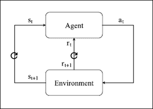

# 第 10 章强化学习

强化学习（RL）是机器学习领域，研究决策科学过程，特别是试图了解在给定环境中做出决策的最佳方式。 RL 算法的学习范例不同于大多数常用方法，例如监督或无监督学习。

在 RL 中，智能体被编程为好像他是一个必须通过反复试验机制学习的人，以找到在长期奖励方面取得最佳结果的最佳策略。

RL 在游戏（数字和桌面）和自动机器人控制方面取得了令人难以置信的成果，因此它仍在广泛研究中。在过去十年中，已经决定在 RL：神经网络中添加一个关键组件。

RL 和深度神经网络（DNN）的这种集成，称为深度强化学习，使得 Google DeepMind 研究人员在以前未开发的领域取得了惊人的成果。特别是在 2013 年，Deep Q-Learning 算法通过将代表游戏屏幕的像素作为输入，使智能体处于与玩游戏的人相同的情况下，在 Atari 游戏领域中实现了经验丰富的人类玩家的表现。 。

另一个非常重要的成就发生在 2015 年 10 月，当时同一个研究实验室使用相同的算法系列，击败了欧洲围棋冠军（Go 是一个非常复杂的中国游戏），并最终在 2016 年 3 月击败了世界冠军。

本章包括以下主题：

*   RL 问题
*   打开 AI 健身房
*   Q-Learning 算法
*   深度 Q 学习

# RL 问题

RL 与监督学习有很大不同  。在监督学习中，每个示例是由输入对象（通常是向量）和期望输出值（也称为监督信号）组成的对。监督学习算法分析训练数据并产生推断函数，其可用于映射新示例。

RL 不提供输入数据和期望输出值之间的关联，因此学习结构完全不同。 RL 的主要概念是存在两个彼此交互的组件：智能体和环境。

RL 智能体通过执行一系列动作并获得与其相关联的数字奖励来学习在不熟悉的环境中做出决策。通过试错过程积累经验，智能体可以根据环境和先前执行的操作集所定义的状态，了解哪些操作最佳。智能体能够通过简单地评估其获得的奖励并调整其策略来确定最成功的动作是什么，以便随着时间的推移获得最大的累积奖励。

RL 模型由以下部分组成：

*   一组状态`(S0, S1, S2, ..., Sn) ∈ S`，由环境和智能体之间的交互定义
*   一组可能的动作`(a0, a1, a2, ..., am) ∈ A`，由智能体根据输入状态适当选择
*   奖励`r`与环境与智能体之间的每次互动相关联
*   将每个状态映射到输出操作的策略
*   一组称为状态值函数和操作值函数的函数，用于确定给定时间智能体的状态值以及智能体在给定时刻执行特定操作的值。

RL 智能体在特定时间`t`与环境交互。在每个`t`处，智能体接收状态`S[t] ∈ S`和奖励`r[t]`作为输入。因此，智能体确定要执行的动作`a[t] ∈ A(s[t])`，其中`A(s[t])`表示给定状态中的一组可能动作。

后者由环境接收，处理新的`S[t+1]`状态和新的奖励信号`r[t+1]`，对应于在时间`t + 1`的下一个智能体输入。这个递归过程是学习 RL 智能体的算法。智能体的目标是尽可能多地获得最终累积奖励。可以通过使用不同的方法来实现目的。

在训练期间，智能体能够学习适当的策略，使其能够获得更直接的奖励，或以牺牲即时奖励为代价获得更大的长期奖励。

图 1：RL 模型