## 三、图嵌入的问题设定

在本节中，我们从问题设定的角度比较现有的图嵌入工作，其中包括嵌入输入和嵌入输出。 对于每个设定，我们首先介绍不同类型的图嵌入输入或输出，然后总结每个设定最后面临的挑战。

我们从图嵌入输入开始。 由于图嵌入设定由输入和输出组成，我们在介绍不同类型的输入期间，使用节点嵌入作为嵌入输出设定的示例。 原因在于尽管存在各种类型的嵌入输出，但是大多数图嵌入研究集中于节点嵌入，即，将节点嵌入到低维空间中，其中保持输入图中的节点相似性。 有关节点嵌入和其他类型嵌入输出的更多详细信息，请参见 3.2 节。

### 图嵌入输入

图嵌入的输入是图。 在本综述中，我们将图嵌入输入分为四类：同构图，异构图，辅助信息图和构造图。 每种类型的图对图嵌入提出了不同的挑战。 接下来，我们介绍这四种类型的输入图，并总结每种输入设定所面临的挑战。

#### 同构图

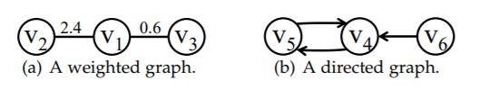

**图4：**加权和有向图的示例。

第一类输入图是同构图（定义 2），其中节点和边分别属于单一类型。 同构图可以进一步分类为加权（或定向）和无权（或无向）图，如图 4 所示的示例。

无向和无权的同构图是最基本的图嵌入输入设定。 许多研究都在这种情况下进行，例如 [1,16,17,18,19]。 它们平等地处理所有节点和边，因为只有输入图的基本结构信息可用。

直观上，边的权重和方向提供了图的更多信息，并且有助于在嵌入空间中更准确地表示图。 例如，在图 4（a）中，  应该比  更接近 ，因为边的权重 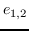 更高。 同样在图 4（b）中， 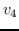 应该比 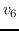 更接近 ，因为  和  在两个方向相连。 上述信息在无权和无向图中丢失。 注意到利用图边的权重和方向属性的优点，图嵌入社区开始探索加权和/或有向图。 其中一些只关注一个图属性，即边权重或边方向。 一方面，[20,21,22,23,24,25] 考虑了加权图 。 通过较高加权边连接的节点彼此靠得更近。 但是，他们的工作仍局限于无向图。 另一方面，一些工作在嵌入过程中区分边的方向并且保持嵌入空间中的方向信息。 有向图的一个例子是社交网络图，例如[26]。 每个用户都有其他用户的粉丝和关注关系。 但是，权重信息不适用于社交用户链接。 最近，提出了一种更通用的图嵌入算法，其中考虑了权重和方向属性。 换句话说，这些算法（例如，[27,3,28]）可以处理有向和无向，以及加权和无权图 。

挑战： 如何捕获图中观察到的连接模式的多样性？ 由于在同构图中只有结构信息可用，因此同构图嵌入的挑战在于，如何在嵌入期间保留输入图中观察到的这些连通模式。

#### 异构图

第二类输入是异构图（定义 3），主要存在于以下三种情形中。

基于社区的问答（cQA）网站。 cQA 是一种基于互联网的众包服务，使用户能够在网站上发布问题，然后由其他用户回答[29]。 直观上，cQA 图中存在不同类型的节点，例如问题，答案，用户。 现有的 cQA 图嵌入方法在它们利用的链接方面彼此区分，如表 2 所示 ，其中 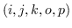 表示 由用户`j`提供的问题`i`的答案`k`，比用户`p`的答案`o`获得更多的投票（即点赞）。

**表2：** cQA站点的图嵌入算法

| GE算法 | 利用的链接 |
| --- | --- |
| [30] | 用户 - 用户，用户 - 问题 |
| [31] | 用户 - 用户，用户 - 问题，问题 - 回答 |
| [29] | 用户 - 用户，问题 - 回答，用户 - 回答 |
| [32] | 用户的不对称关注链接，有序的元组  |

多媒体网络。 多媒体网络是包含多媒体数据的网络，例如图像，文本等。例如，[33]和[34]都嵌入了包含两种节点（图像和文本）和三种链接（图像 - 图像，文本 - 文本，文本 - 图像）的图。 [35]使用用户节点和图像节点处理社交管理。 它利用用户图像链接将用户和图像嵌入到同一空间中，以便可以直接比较它们来进行图像推荐。 在[36]中，考虑了包含图像和文本查询的点击图。 图像 - 查询边表示给定查询的图像的点击，其中点击计数用作边权重。

知识图。 在知识图（定义 4）中，实体（节点）和关系（边）通常是不同类型的。 例如，在从Freebase [37]构建的电影相关知识图中，实体的类型可以是“导演”，“演员”，“电影”等。关系的类型可以是“制作”，“导演”， “参演”。 已经投入了大量精力来嵌入知识图（例如，[38,39,40]）。 我们将在 4.3.3 节中详细介绍它们。。

其他异构图也存在。 例如，[41]和[42]从事于移动数据图，其中车站（s），角色（r）和公司（c）节点由三种类型的链接（ss，sr，sc）连接。 [43]嵌入了维基百科图，具有三种类型的节点（实体（e），类别（c）和单词（w））和三种类型的边（ee，ec，ww）。 除了上面的图之外，还有一些通用的异构图，其中节点和边的类型没有明确定义 [44,45,46]。

挑战： 如何探索不同类型对象之间的全局一致性，以及如何处理属于不同类型的对象的不平衡（如果有的话）？ 在异构图嵌入中将不同类型的对象（例如，节点，边）嵌入到相同空间中。 如何探索它们之间的全局一致性是一个问题。 而且，不同类型的对象之间可能存在不平衡。 嵌入时应考虑此数据偏差。

#### 带有辅助信息的图

第三类输入图除了包含节点的结构关系外，还包含节点/边/整图的辅助信息（即   ）。 通常，表 3 中列出了五种不同类型的辅助信息。

**表3：图**中不同类型的辅助信息的比较

| 辅助信息 | 描述 |
| --- | --- |
| 标签 | 节点/边的类别值，例如，类别信息 |
| 属性 | 节点/边的类别或连续值，例如，属性信息 |
| 节点特性 | 节点的文本或图像特性 |
| 信息传播 | 信息在图中的传播路径 |
| 知识库 | 与知识概念相关的文本或事实 |

标签 ：具有不同标签的节点应嵌入到彼此远离的位置。 为了实现这一点，[47]和[48]联合优化嵌入目标函数和分类器函数。 [49]对具有不同标签的节点之间的相似性进行了惩罚。 [50]在计算不同的图核时考虑节点标签和边标签。 [51]和[52]嵌入了知识图，其中实体（节点）具有语义类别。 [53]嵌入了更复杂的知识图，它的实体类别在层次结构中，例如，类别“书”具有两个子类别“作者”和“编写工作”。

属性：与标签相反，属性值可以是离散的或连续的。 例如，[54]嵌入具有离散节点属性值的图（例如，分子中的原子序数）。 相反，[4]将节点属性表示为连续的高维向量（例如，社交网络中的用户属性特征）。 [55]处理节点和边的离散和连续属性。

节点特征：大多数节点特征是文本，它们作为每个节点的特征向量 [56,57] 或作为文档 [58,59,60,61] 提供。 对于后者，文档被进一步处理，来使用诸如词袋 [58]，主题建模 [59,60] 或将“单词”视为一种节点 [61] 的技术来提取特征向量。 其他类型的节点特征，例如图像特征[33]也是可能的。 节点特征通过提供丰富的非结构化信息来增强图嵌入表现，这在许多实际图中都可用。 此外，它使归纳的图嵌入成为可能[62]。

信息传播 ： 信息传播的一个例子是Twitter中的“转推”。 在[63]中，给出了数据图 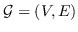  ，一个级联图   为每个级联构建   ，其中 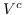 是拥有  的节点，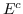 是  两端的边。 然后他们嵌入了  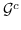 来预测级联大小的增量。 与之不同，[64]旨在嵌入用户和内容信息，使得它们的嵌入之间的相似性表示扩散概率。  Topo-LSTM [65]认为级联不仅仅是一个节点序列，而是一个用于嵌入的动态有向非循环图。

知识库：流行的知识库包括维基百科[66]，Freebase [37]，YAGO [67]，DBpedia [68]等。以维基百科为例，概念是用户提出的实体，文本是与之相关的文章。 [66]使用知识库通过将每个社交网络用户，链接到一组给定的知识概念，来从社交网络学习社交知识图。 [69]表示实体空间中的查询和文档（由知识库提供），以便学术搜索引擎可以理解查询中研究概念的含义。

其他类型的辅助信息包括用户登记数据（用户 - 位置）[70]，用户项目偏好排序列表[71]等。注意，辅助信息不仅限于一种类型。 例如，[62]和[72]同时考虑标签和节点特征信息。 [73]利用节点内容和标签来辅助图嵌入过程。

挑战： 如何整合丰富的非结构化信息，以便学习的嵌入既代表拓扑结构又代表辅助信息中的不同？ 除了图结构信息之外，辅助信息还有助于定义节点相似性。 使用辅助信息嵌入图的挑战，是如何组合这两个信息源以定义要保留的节点相似性。

#### 从非关系数据构造的图

输入图的最后一类从未提供，而是通过不同策略从非关系输入数据构造。 当假设输入数据位于低维流形中时，通常会发生这种情况。

在大多数情况下，输入是特征矩阵 ，其中每一行  是一个  维的特征向量，表示第  个训练实例。相似度矩阵 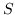 是（   ， 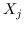  ）使用之间的相似性，通过计算 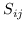 构建的。 通常有两种方法来从  构建图 。 一种直接的方式是直接将  看做无形图的邻接矩阵  [74]。 然而，[74]基于欧几里德距离，并且在计算  时不考虑相邻节点。 如果 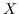 位于弯曲的流形上或附近，  和  之间的距离，在流形上方比欧几里德距离大得多[12]。 为了解决这些问题，其他方法（例如，[75,76,77]）首先从  构造了一个 K 最近邻（KNN）图  ，并基于 KNN 图估计邻接矩阵  。 例如，Isomap [78] 在  中包含了测地距离。 它首先构造一个 KNN 图   ，然后找到两个节点之间的最短路径作为它们之间的测地距离。[79] 降低 KNN 图构建的成本（ 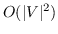  ），构造一个了锚图，在时间和空间消耗方面，其成本是 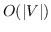。 他们首先获得一组簇中心作为虚拟锚点，并找到每个节点的 K 个最近的锚点，用于构建锚图。

图构造的另一种方式是基于节点的共现，在节点之间建立边。 例如，为了促进与图像相关的应用（例如，图像分割，图像分类），研究人员（例如，[80,81,82]）通过将像素视为节点并将像素之间的空间关系视为边来从每个图像构建图。 [83]从GTMS记录中提取三种类型的节点（位置，时间和消息），因此在这些节点之间形成六种类型的边。 [84]使用实体提示，目标类型和文本特征作为节点来生成图，并建立三种边：提示-类型，提示-特征和类型-类型。

除了基于上述成对相似性和基于节点共现的方法之外，还针对不同目的设计了其他图构建策略。 例如，[85]构造一个内在图来捕获类内紧致性，以及一个惩罚图来表示类间可分性。 前者是通过将每个数据点与同一类的邻居连接而构建的，而后者则连接不同类别的边点。 [86]构造一个有符号的图来利用标签信息。 如果两个节点属于同一个类，则它们通过正边连接，如果它们来自两个类，则为负边。 [87]将包含相同标签的所有实例包含在一个超边中，来捕获它们的联合相似性。 在[88]中，构建了两个反馈图，将相关的对聚集在一起，并在嵌入之后远离不相关的对。 在正图中，如果两个节点是相关的，则连接它们。 在负图中，仅当一个节点相关而另一个节点不相关时，才连接两个节点。

挑战： 如何构建一个图来编码实例之间的成对关系，以及如何在嵌入空间中保留生成的节点邻近度矩阵？ 嵌入由非关系数据构建的图所面临的第一个挑战是，如何计算非关系数据之间的关系并构建这样的图。 在构建图之后，挑战变得与其他输入图中的相同，即，如何在嵌入空间中保持所构造的图的节点接近度。

### 图嵌入输出

图嵌入的输出是表示图（的一部分）的（一组）低维向量。 基于输出粒度，我们将图嵌入输出分为四类，包括节点嵌入，边嵌入，混合嵌入和整图嵌入。 不同类型的嵌入有助于不同的应用。

与固定和给定的嵌入输入不同，嵌入输出是任务驱动的。 例如，节点嵌入可以使各种节点相关的图分析任务受益。 通过将每个节点表示为向量，可以在时间和空间方面有效地执行诸如节点聚类，节点分类之类的节点相关任务。 但是，图分析任务并不总是节点级别的。 在某些情况下，任务可能与图的更高粒度有关，例如节点对，子图，甚至整图。 因此，嵌入输出方面的第一个挑战，是如何找到满足特定应用任务需求的合适类型的嵌入输出。

#### 节点嵌入

作为最常见的嵌入输出设定，节点嵌入将每个节点表示为低维空间中的向量。 嵌入图中“接近”的节点具有类似的向量表示。 各种图嵌入方法之间的区别，在于它们如何定义两个节点之间的“接近度”。 一阶接近度（定义 5）和二阶接近度（定义 6）是成对节点相似度计算的两个通常采用的度量。 在某些工作中，也在一定程度上探索了高阶接近度。 例如，[21] 在潜入中捕获了 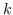 步（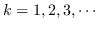）邻居关系。  [1]和[89]都认为属于同一社区的两个节点的嵌入更近。

挑战： 如何在各种类型的输入图中定义成对节点接近度，以及如何在习得的嵌入中编码接近度？ 节点嵌入的挑战主要来自于在输入图中定义节点接近度。 在第 3.1 节中，我们详细阐述了带有不同类型的输入图的节点嵌入的挑战。

接下来，我们将介绍其他类型的嵌入输出以及这些输出带来的新挑战。

#### 边嵌入

与节点嵌入相反，边嵌入旨在将边表示为低维向量。 边嵌入在以下两种方案中很有用。

首先，知识图嵌入（例如，[90,91,92]）学习节点和边的嵌入。 每个边都是三元组  （定义 4）。嵌入的学习是为了在嵌入空间中保存  和  之间的  ，以便在给定  的其他两个成分的情况下，可以正确预测缺失的实体/关系   。 其次，一些工作（例如，[28,64]）将节点对嵌入为向量特征，使节点对与其他节点可比，或预测两个节点之间的链接。 例如，[64]提出了一种内容社交影响特征来预测给定内容的用户 - 用户交互概率。 它将用户对和内容嵌入到同一空间中。  [28]在节点嵌入上，使用自举方法嵌入一对节点，以便于预测图中两个节点之间是否存在链接。

总之，边嵌入有利于边（/节点对）相关的图分析，例如链接预测，知识图实体/关系预测等。

挑战： 如何定义边级别的相似性，以及如何模拟边的不对称属性（如果有的话）？ 边的接近度与节点接近度不同，因为边包含一对节点并且通常表示成对节点关系。 而且，与节点不同，边可以是有向的。 这种不对称属性应该编码在习得的表示中。

#### 混合嵌入

混合嵌入是不同类型的图成分的组合的嵌入，例如，节点+边（即子结构），节点+社区。

在大量工作中子结构嵌入已经得到了研究。 例如，[44] 嵌入了两个可能很远的节点之间的图结构，来支持语义邻近搜索。 [93]学习子图（例如，graphlet）的嵌入，以便定义用于图分类的图核。 [94]利用知识库来丰富有关答案的信息。 它将问题实体中的路径和子图嵌入到答案实体中。

与子图嵌入相比，社区嵌入仅受到有限的关注。 [1]建议考虑用于节点嵌入的社区感知邻近度，使得节点的嵌入类似于其社区的嵌入。 ComE [89]还联合解决了节点嵌入，社区检测和社区嵌入。 它不是将社区表示为向量，而是将每个社区嵌入定义为多元高斯分布，以便表示其成员节点的分布方式。

子结构或社区的嵌入也可以通过聚合单个节点和其中的边嵌入来导出。 然而，这种“间接”方法没有为表示结构而优化。 此外，节点嵌入和社区嵌入可以相互促进。 通过结合社区感知的高阶邻近度来学习更好的节点嵌入，而当生成更准确的节点嵌入时，可以检测到更好的社区。

挑战： 如何生成目标子结构以及如何在一个公共空间中嵌入不同类型的图成分？ 与其他类型的嵌入输出相比，没有给出混合嵌入（例如，子图，社区）的嵌入目标。 因此，第一个挑战是如何生成这种嵌入目标结构。 此外，不同类型的目标（例如，社区，节点）可以同时嵌入一个公共空间中。 如何解决嵌入目标类型的异构性是一个问题。

#### 整图嵌入

最后一种类型的输出是通常针对小图的整图嵌入，例如蛋白质，分子等。在这种情况下，图被表示为一个向量，并且两个相似的图的嵌入更接近。

整图嵌入有助于图分类任务，为计算图相似性提供了一种简单有效的解决方案 [55,49,95]。 为了在嵌入时间（效率）和保存信息的能力（表现力）之间建立折衷，[95]设计了一个分层的图嵌入框架。 它认为准确理解整图信息需要处理不同尺度的子结构。 形成图金字塔，其中每个级别是不同比例的图的汇总。 该图在所有级别上嵌入，然后连接成一个向量。 [63]学习整个级联图的嵌入，然后训练一个多层感知器来预测未来级联图的大小增量。

挑战： 如何捕捉整图的属性，以及如何在表现力和效率之间进行权衡？ 整图嵌入需要捕获整图的属性，因此与其他类型的嵌入相比更耗时。 整图嵌入的关键挑战是，如何在习得的嵌入的表现力和嵌入算法的效率之间做出选择。
