# 四、图嵌入技术

在本节中，我们基于所使用的技术对图嵌入方法进行分类。 通常，图嵌入旨在在低维空间中表示图，保留尽可能多的图属性信息。 不同图嵌入算法之间的区别在于，它们如何定义要保留的图属性。 不同的算法对节点（边、子结构、整图）的相似性，以及如何在嵌入空间中保留它们，有不同的见解。 接下来，我们将介绍每种图嵌入技术的见解，以及它们如何量化图属性并解决图嵌入问题。

## 矩阵分解

基于矩阵分解的图嵌入，以矩阵的形式表示图特性（例如，节点成对相似性）并对该矩阵进行分解来获得节点嵌入[11]。 图嵌入的开创性研究通常以这种方式解决图嵌入问题。 在大多数情况下，输入是由非关系高维数据特征构成的图，如第 3.1.4 节中所介绍的。输出是一组节点嵌入（Sec.3.2.1）。 因此，图嵌入的问题可以被视为保持结构的降维问题，其假定输入数据位于低维流形中。 有两种类型的基于矩阵分解的图嵌入。 一种是分解图的拉普拉斯特征映射 ，另一种是直接分解节点邻近矩阵 。

### 图的拉普拉斯算子

见解： 要保留的图属性可以解释为成对节点的相似性。 因此，如果两个具有较大相似性的节点相距很远，则会施加较大的惩罚。

**表4：**基于图的拉普拉斯特征映射的图嵌入。

| GE算法 | 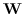 | 目标函数 |
| --- | --- | --- |
| MDS [74] | 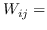  欧氏距离 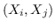 | 公式 2 |
| Isomap [78] | KNN，   是沿着   到  最短路径的边权重之和  | 公式 2 |
| LE [96] | KNN， 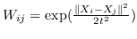 | 公式 2 |
| LPP [97] | KNN， 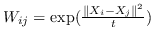 | 公式 4 |
| AgLPP [79] | 锚图， 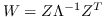  ，  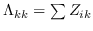  ，  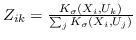 | 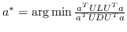 |
| LGRM [98] | KNN，  | 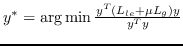 |
| ARE [88] | KNN， 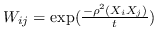  ，  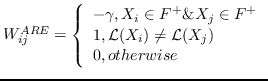 | `<6244>` |
| SR [99] | KNN， 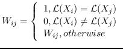  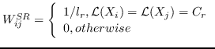 | `<6248>` |
| HSL [87] | 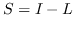  ，其中 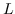  是归一化的超图的拉普拉斯算子 | 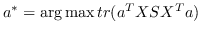  ，圣  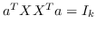 |
| MVU [100] | KNN， 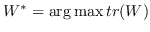  ，圣 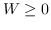  ，  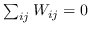  和    ， | `<6255>` |
| SLE [86] | KNN， 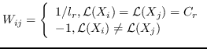 | `<6259>` |
| MSHLRR [76] | 一般图：KNN， 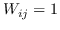 | 公式 2 |
|  | 超图： 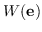  是一个夸张的重量  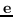 |
|  | 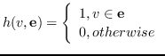  ，  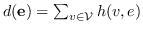 |
| [77] | 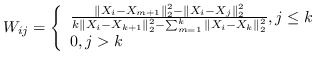 | 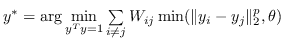 |
| PUFS [75] | KNN， 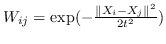 | 公式 4 +（must 和 cannot 链接约束） |
| RF-Semi-NMF-PCA [101] | KNN，  | 公式 2 +   （PCA）+    （k均值） |

基于以上见解，最优的嵌入 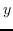 可以由以下目标函数[99]导出。

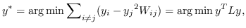 (1)

其中  是节点  和  之间的“定义的”相似性；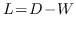 是图的拉普拉斯。 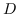 是对角矩阵，其中  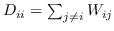。 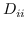 的值越大， 就更重要[97]。 约束 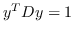 通常加于 Eq.1，来删除嵌入中的任意缩放因子。  Eq.1 然后化简为：

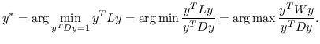 (2)

最优的  是特征问题 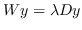 的最大特征值对应的特征向量。

上面的图嵌入是渐进式的，因为它只能嵌入训练集中存在的节点。 在实践中，它可能还需要嵌入未在训练中看到的新节点。 一种解决方案是设计线性函数 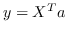 这样只要提供了节点特征，就可以导出嵌入。 因此，对于归纳性的图嵌入，Eq.1 变为在以下目标函数中找到最的 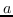：

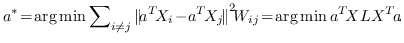 (3)

与 Eq.2 相似，通过添加约束 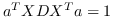  ，公式 3 中的问题变成：

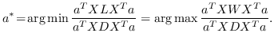 (4)

最优的  是 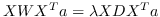 的解的最大特征值的特征向量。

现有研究的差异主要在于它们如何计算成对节点的相似性   ，以及它们是否使用线性函数  或不。 已经进行了一些尝试[85,81]以使用一般框架总结现有的基于拉普拉斯特征图的图嵌入方法。 但他们的综述只涵盖了有限的工作量。 在表 4 中 ，我们总结了现有的基于拉普拉斯特征图的图嵌入研究，并比较了它们的 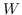 的计算方法，以及他们采用了什么样的目标函数。

最初的研究 MDS [74]直接采用了两个特征向量  和  之间的欧几里德距离，作为 。公式 2 用于找到  的最佳嵌入。  MDS不考虑节点的邻域，即，任何一对训练实例都被认为是连接的。 后续研究（例如，[78,102,96,97]）通过首先从数据特征构建 k 最近邻（KNN）图来克服该问题。 每个节点仅与其前 k 个相似的邻居连接。 之后，利用不同的方法来计算相似度矩阵 ，以便尽可能多地保留所需的图属性。 最近设计了一些更高级的模型。 例如，AgLPP [79]引入了锚图，显着提高早期矩阵分解模型 LPP 的效率。  LGRM [98]学习局部回归模型来掌握图结构，和样本外数据外插值的全局回归项。 最后，与以前的工作保留局部几何不同，LSE [103]使用局部样条回归来保持全局几何。

当辅助信息（例如，标签，属性）可用时，调整目标函数以保留更丰富的信息。 例如，[99]构造邻接图  和标记图 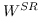。 目标函数由两部分组成，一部分侧重于保留数据集的局部几何结构，如LPP [97]，另一部分试图在标记的训练数据上获得具有最佳类的可分性的嵌入。 类似地，[88]也构造了两个图，即邻接图  编码局部几何结构，反馈关系图 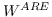 编码用户相关反馈中的成对关系。  RF-Semi-NMF-PCA [101]通过构建由三个部分组成的目标函数：PCA，k-means和图的拉普拉斯正则化，同时考虑聚类，降维和图嵌入。

其他一些工作认为  不能通过容易枚举成对节点关系来构造。 相反，他们采用半定规划（SDP）来学习   。 具体而言，SDP [104]的目的是找到一个内积矩阵，它最大化在图中没有连接的任何两个输入之间的成对距离，同时保留最近的邻居距离。  MVU [100]构造这样的矩阵，然后在习得的内积矩阵上应用MDS [74]。  [2]证明正则化LPP [97]相当于正则化SR [99]，如果  是对称的，双随机的，PSD并且秩为 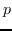  。 它构造了这种相似矩阵，从而有效地解决了类似LPP的问题。

**表5：**基于节点邻近矩阵分解的图嵌入。`O(*)`表示目标函数；例如，`O(SVM分类器)`表示SVM分类器的目标函数。

| GE算法 |  | 目标函数 |
| --- | --- | --- |
| [50] | 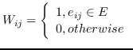 | 公式 5 |
| SPE [105] | KNN，   ，约束为   | 公式 5 |
| HOPE [106] | Katz 指数   ;  个性化的 Pagerank   | 公式 5 |
| GraRep [21] |   ，其中    ，   | 公式 5 |
| CMF [43] | PPMI | 公式 5 |
| TADW [56] | PMI | 公式 5 和文本特征矩阵 |
| [24] | `A` |  |
| MMDW [48] | PMI | 公式 5 + `O(SVM分类器)` |
| HSCA [57] | PMI | `O(MMDW)`+（ 一阶邻近度约束） |
| MVE [107] | KNN，  | 公式 5 |
| M-NMF [1] |  | 公式 5 + `O(社区检测)` |
| ULGE [2] |   ，其中   |  |
| LLE [102] | KNN，  |  |
| RESCAL [108] |  |  |
| FONPE [109] | KNN，  |   ，约束为  |

### 节点邻近矩阵分解

除了解决上述广义特征值问题外，另一系列研究试图直接分解节点邻近矩阵。

见解： 使用矩阵分解可以在低维空间中近似节点邻近度。 保持节点邻近度的目标是最小化近似的损失。

给定节点邻近矩阵   ，目标是：

 (5)

其中  是节点嵌入，和   是上下文节点的嵌入[21]。

公式 5 旨在找到一个最优的秩为`d`的邻近度矩阵`W`的近似（  是嵌入的维度）。 一种流行的解决方案是对  应用 SVD（奇异值分解）[110]。从形式上看，

 (6)

其中  是按降序排序的奇异值，  和  是   的奇异向量 。 最佳嵌入使用最大的`d`个奇异值获得 ，相应的奇异向量如下：

 (7)

根据是否保留非对称属性，节点  的嵌入是  [21,50]，或  和  连接，即   [106]。 公式 5 存在其他解决方案，如正则化高斯矩阵分解[24]，低秩矩阵分解[56]，并加入其他正则化器来施加更多约束[48]。 我们总结了表 5 中所有基于节点邻近度矩阵分解的图嵌入。

总结：矩阵分解（MF）主要用于嵌入由非关系数据构建的图（第 3.1.4 节），用于节点嵌入（第 3.2.1 节），这是图的拉普拉斯特征映射问题的典型设定。 MF也用于嵌入同构图[50,24]（第 3.1.1 节）。

## 深度学习

深度学习（DL）在各种研究领域表现出色，如计算机视觉，语言建模等。基于DL的图嵌入在图上应用DL模型。 这些模型要么直接来自其他领域，要么是专门为嵌入图数据设计的新神经网络模型。 输入是从图中采样的路径或整个图本身。 因此，我们基于是否采用随机游走来从图中采样路径，将基于DL的图嵌入分为两类。

### 带有随机游走的基于 DL 的图嵌入

见解： 通过最大化以自身嵌入为条件的，节点邻域的观测概率，可以在嵌入空间中保留图中的二阶邻近度。

在第一类基于深度学习的图嵌入中，图被表示为从其采样的一组随机游走路径。 然后将深度学习方法应用于用于图嵌入的采样路径，保留路径所承载的图属性。

鉴于上述见解，DeepWalk [17]采用神经语言模型（SkipGram）进行图嵌入。 SkipGram [111]旨在最大化窗口内出现的单词之间的共现概率   。  DeepWalk首先使用截断的随机游走，从输入图中采样一组路径（即，均匀地采样最后访问节点的邻居，直到达到最大长度）。 从图中采样的每个路径相当于来自语料库的句子，其中节点相当于单词。 然后将SkipGram应用于路径，最大化节点邻域的观测概率，以自身嵌入为条件。 以这种方式，邻域相似（二阶邻近度较大）的节点的嵌入相似。DeepWalk的目标函数如下：

 (8)

其中  是窗口大小，它限制随机游走上下文的大小。  SkipGram删除了排序约束，并且 公式 8转换为：

 (9)

其中  使用softmax函数定义：

 (10)

请注意，计算公式 10 是昂贵的，因为标准化因子（即，图中每个节点的所有内积的总和），所以图 10 的方法是不可行的。 通常有两种解近似完全softmax的解决方案：分层softmax [112]和负采样[112]。

分层softmax ：有为了效地解决中公式 10，构造二叉树，其中节点被分配给叶子。 不像公式 10 那样枚举所有节点，仅需要求解从根到相应叶子的路径。 优化问题变得最大化树中特定路径的概率。 假设到叶子  的路径是一系列节点    ，其中`b0`为根，    。 公式 10 然后变成：

  (11)

其中  是二分类器：。 表示 S 形函数。  是树节点   的父节点的嵌入 。 分层softmax减少了SkipGram的时间复杂度，从  至  。

负采样 ： 负采样的关键思想是，使用逻辑回归将目标节点与噪声区分开来。 即，对于一个节点   ，我们想区分它的邻居  来自其他节点。 噪音分布   用于绘制节点的负样本   。公式 9 中的每个  然后计算为：

 (12)

其中  是采样的负节点数。  是一种噪声分布，例如均匀分布（）。 具有负采样的SkipGram的时间复杂度是 。

**表6：**带有随机游走路径的基于深度学习的图嵌入。

| GE算法 | 随机游走方法 | 保留的邻近度 | DL模型 |
| --- | --- | --- | --- |
| DeepWalk [17] | 截断随机游走 |  | SkipGram 和 分层 softmax（公式 11） |
| [34] | 截断随机游走 |   （词语-图像） | 同上 |
| GenVector [66] | 截断随机游走 |   （用户 - 用户和概念 - 概念） | 同上 |
| 受限制的DeepWalk [25] | 边权重采样 |  | 同上 |
| DDRW [47] | 截断随机游走 |   +分类一致性 | 同上 |
| TriDNR [73] | 截断随机游走 |   （节点，单词和标签之间） | 同上 |
| node2vec [28] | BFS + DFS |  | SkipGram 和负采样（公式 12） |
| UPP-SNE [113] | 截断随机游走 |   （用户 - 用户和个人资料 - 个人资料） | 同上 |
| Planetoid [62] | 按标签和结构对节点对进行采样 |   +标签标识 | 同上 |
| NBNE [19] | 对节点的直接邻居进行采样 |  | 同上 |
| DGK [93] | graphlet 核：随机采样[114] |   （通过graphlet） | SkipGram（公式11 - 12 ） |
| metapath2vec [46] | 基于元路径的随机游走 |  | 异构 SkipGram |
| ProxEmbed [44] | 截断随机游走 | 节点排名元组 | LSTM |
| HSNL [29] | 截断随机游走 |   + QA排名元组 | LSTM |
| RMNL [30] | 截断随机游走 |   +用户问题质量排名 | LSTM |
| DeepCas [63] | 基于马尔可夫链的随机游走 | 信息级联序列 | GRU |
| MRW-MN [36] | 截断随机游走 |   +跨模态特征差异 | DCNN + SkipGram |

DeepWalk [17]的成功激发了许多后续研究，这些研究将深度学习模型（例如，SkipGram或长短期记忆（LSTM）[115]）应用于图嵌入的采样路径。 我们在表 6中对它们进行了总结。 如表中所示，大多数研究遵循DeepWalk的想法，但改变随机游戏的采样方法（[25,28,62,62]）或要保留的邻近度（定义 5和定义 6）的设定（[34,66,47,73,62]）。 [46]设计基于元路径的随机游走来处理异构图和异构 SkipGram，它最大化了给定节点具有异构上下文的概率。 除了SkipGram之外，LSTM是图嵌入中采用的另一种流行的深度学习模型。 请注意，SkipGram只能嵌入一个节点。 然而，有时我们可能需要将一系列节点嵌入为固定长度向量，例如，将句子（即，一系列单词）表示为一个向量，就要在这种情况下采用LSTM来嵌入节点序列。 例如，[29]和[30]嵌入cQA站点中的问题/答案中的句子，[44]在两个节点之间嵌入一系列节点，用于邻近度嵌入。 在这些工作中优化排名损失函数，来保持训练数据中的排名分数。 在[63]中，GRU [116]（即，类似于LSTM的递归神经网络模型）用于嵌入信息级联路径。

#### 不带随机游走的基于 DL 的图嵌入

见解： 多层学习架构是一种强大而有效的解决方案，可将图编码为低维空间。

第二类基于深度学习的图嵌入方法直接在整个图（或整个图的邻近矩阵）上应用深度模型。 以下是图嵌入中使用的一些流行的深度学习模型。

自编码器 ：自编码器旨在最小化其编码器输入和解码器输出的重建误差。 编码器和解码器都包含多个非线性函数。 编码器将输入数据映射到表示空间，并且解码器将表示空间映射到重建空间。 采用自编码器进行图嵌入的思想，与邻域保持方面的节点邻近矩阵分解（Sec.4.1.2）相似。 具体而言，邻接矩阵捕获节点的邻域。 如果我们将邻接矩阵输入到自编码器，则重建过程将使具有相似邻域的节点具有类似的嵌入。

深度神经网络 ：作为一种流行的深度学习模型，卷积神经网络（CNN）及其变体已广泛应用于图嵌入。 一方面，他们中的一些人直接使用为欧几里德域设计的原始CNN模型，并重新格式化输入图以适应它。 例如，[55]使用图标记，从图中选择固定长度的节点序列，然后使用 CNN 模型，组装节点的邻域来学习邻域表示。 另一方面，一些其他工作试图将深度神经模型推广到非欧几里德域（例如，图）。 [117]在他们的综述中总结了代表性研究。 通常，这些方法之间的差异在于，它们在图上形成类似卷积的操作的方公式 一种方法是模拟卷积定理以定义谱域中的卷积 [118,119]。 另一种方法是将卷积视为空域中的邻域匹配 [82,72,120]。

其他 ：还有一些其他类型的基于深度学习的图嵌入方法。 例如，[35]提出了DUIF，它使用分层softmax作为前向传播来最大化模块性。 HNE [33]利用深度学习技术来捕获异构成分之间的交互，例如，用于图像的CNN和用于文本的FC层。 ProjE [40]设计了一个具有组合层和投影层的神经网络。 它定义了知识图嵌入的逐点损失（类似于多分类）和列表损失（即softmax回归损失）。

我们在表 7 中总结了所有基于深度学习的图嵌入方法（没有随机游走），并比较了它们使用的模型以及每个模型的输入。

**表7：**基于深度学习的图嵌入， 没有随机游走路径。

| GE 算法 | 深度学习模型 | 模型输入 |
| --- | --- | --- |
| SDNE [20] | 自编码器 |  |
| DNGR [23] | 堆叠去噪自编码器 | PPMI |
| SAE [22] | 稀疏自编码器 |  |
| [55] | CNN | 节点序列 |
| SCNN [118] | 谱 CNN | 图 |
| [119] | 带有光滑谱乘法器的谱 CNN | 图 |
| MoNet [80] | 混合模型网络 | 图 |
| ChebNet [82] | 图CNN又名ChebNet | 图 |
| GCN [72] | 图卷积网络 | 图 |
| GNN [120] | 图神经网络 | 图 |
| [121] | 自适应图神经网络 | 分子图 |
| GGS-NNs [122] | 自适应图神经网络 | 图 |
| HNE [33] | CNN + FC | 带图像和文本的图 |
| DUIF [35] | 分层深度模型 | 社会管理网络 |
| ProjE [40] | 神经网络模型 | 知识图 |
| TIGraNet [123] | 图卷积网络 | 从图像构造的图 |

总结：由于它的威力和效率，深度学习已广泛应用于图嵌入。 在基于深度学习的图嵌入方法中，已经观察到三种类型的输入图（除了从非关系数据构建的图（第 3.1.4 节））和所有四种类型的嵌入输出。
