# TensorFlow 的设置和介绍

TensorFlow 是 Google 创建的开源软件库，可让您构建和执行数据流图以进行数值计算。 在这些图中，每个节点表示要执行的某些计算或功能，连接节点的图边缘表示它们之间流动的数据。 在 TensorFlow 中，数据是称为 **Tensors** 的多维数组。 张量围绕图流动，因此命名为 TensorFlow。

**机器学习**（ **ML** ）模型，例如卷积神经网络，可以用这些图表示，而这正是 TensorFlow 最初设计的目的。

在本章中，我们将介绍以下主题：

*   了解 TensorFlow 的思维方式
*   设置和安装 TensorFlow
*   TensorFlow API 级别简介
*   在 TensorFlow 中构建和训练线性分类器
*   评估训练好的模型

# TensorFlow 的思维方式

使用 TensorFlow 所需的编程方法与您可能习惯使用的方法略有不同，因此让我们探究有什么不同之处。

所有 TensorFlow 程序的核心都有两个主要部分：

*   构造称为`tf.Graph`的计算图
*   使用`tf.Session`运行计算图

在 TensorFlow 中，计算图是安排成图结构的一系列 TensorFlow 操作。 TensorFlow 图包含两种主要类型的组件：

*   **操作**：更通常称为 **ops** ，这些是图中的节点。 Ops 执行需要在图形中进行的任何计算。 通常，它们消耗并产生张量。 一些操作很特殊，运行时可能会有某些副作用。
*   **张量**：这是图形的边缘； 它们将节点连接起来并表示流经节点的数据。 大多数 TensorFlow op 将产生并消耗这些`tf.Tensors`。

在 TensorFlow 中，您使用的主要对象称为 Tensor。 张量是向量和矩阵的一般化。 即使向量是一维的，矩阵是二维的，张量也可以是 *n* -维。 TensorFlow 将 Tensor 表示为用户指定数据类型的 *n* 维数组，例如`float32`。

TensorFlow 程序通过首先构建计算图来工作。 该图将产生一些`tf.Tensor`输出。 要评估此输出，您必须通过在输出 Tensor 上调用`tf.Session.run`来在`tf.Session`中运行*它。 当您执行此操作时，TensorFlow 将执行图形中需要执行的所有部分，以评估您要求其运行的`tf.Tensor`。*

# 设置和安装 TensorFlow

TensorFlow 在最新版本的 Ubuntu 和 Windows 上受支持。 Windows 上的 TensorFlow 仅支持使用 Python 3，而在 Ubuntu 上使用则允许同时使用 Python 2 和 3。我们建议使用 Python 3，这就是本书中用于代码示例的内容。

您可以通过多种方式在系统上安装 TensorFlow，这里我们将介绍两种主要方式。 最简单的方法就是使用 pip 软件包管理器。 从终端发出以下命令会将 TensorFlow 的仅 CPU 版本安装到您​​的系统 Python 中：

```py
    $ pip3 install --upgrade tensorflow
```

要安装支持使用您的 Nvidia GPU 的 Tensorflow 版本，只需键入以下内容：

```py
    $ pip3 install --upgrade tensorflow-gpu
```

TensorFlow 的优势之一是它允许您编写可以直接在 GPU 上运行的代码。 除了少数例外，TensorFlow 中的几乎所有主要操作都可以在 GPU 上运行以加快其执行速度。 我们将看到，这对于训练本书稍后描述的大型卷积神经网络将至关重要。

# 康达环境

使用 pip 可能是上手最快的方法，但是我发现最方便的方法是使用 conda 环境。

Conda 环境允许您创建隔离的 Python 环境，该环境与系统 Python 或任何其他 Python 程序完全独立。 这样一来，您的 TensorFlow 安装就不会与已经安装的任何内容发生混乱，反之亦然。

要使用 conda，[您必须从此处下载 Anaconda](https://www.anaconda.com/download/)。 这将包括 conda。 一旦安装了 Anaconda，即可通过在命令提示符中输入某些命令来完成 TensorFlow 的安装。 首先，输入以下内容：

```py
    $ conda create -n tf_env pip python=3.5
```

这将创建名称为`tf_env`的 conda 环境，该环境将使用 Python 3.5，并且还将安装`pip`供我们使用。

创建此环境后，您可以通过在 Windows 上输入以下内容来开始使用它：

```py
    $ activate tf_env
```

如果您使用的是 Ubuntu，请输入以下命令：

```py
    $ source activate tf_env
```

现在，它应该在命令提示符旁边显示`(tf_env)`。 要安装 TensorFlow，我们只需像以前一样进行点安装，具体取决于您是否仅需要 CPU 还是需要 GPU 支持：

```py
    (tf_env)$ pip install --upgrade tensorflow
    (tf_env)$ pip install --upgrade tensorflow-gpu
```

# 检查您的安装是否正常

现在您已经安装了 TensorFlow，让我们检查一下它是否正常运行。 在命令提示符中，如果尚未激活环境，请再次激活它，然后输入以下命令来运行 Python：

```py
    (tf_env)$ python
```

现在，在 Python 解释器中输入以下行以测试 TensorFlow 是否已正确安装：

```py
 >>>> import tensorflow as tf
 >>>> x = tf.constant('Tensorflow works!')
 >>>> sess = tf.Session()
 >>>> sess.run(x)
```

如果一切都正确安装，您应该看到以下输出：

`**b'Tensorflow works!'**`

您刚刚输入的是 TensorFlow 的`Hello World`。 您创建了一个包含单个`tf.constant`的图，该图只是一个常数 Tensor。 将字符串传递给 Tensor 时，推断其为 string 类型。 然后，您创建了一个 TensorFlow 会话，这是运行图形所必需的，并将您创建的 Tensor 上的会话告知`run`。 然后打印出 Session 运行的结果。 那里有一个额外的`b`，因为它是一个字节流。

如果没有看到上述内容并且出现一些错误，则最好的选择是检查以下页面，以获取安装时遇到的常见问题的解决方案：

+   [Ubuntu](https://www.tensorflow.org/install/install_linux#common_installation_problems) 
+   [Windows](https://www.tensorflow.org/install/install_windows#common_installation_problems)

# TensorFlow API 级别

在我们开始编写 TensorFlow 代码之前，了解 TensorFlow 在 Python 中提供的 API 抽象层次的不同很重要。 这样，我们可以了解编写代码时可以使用的功能，还可以为工作选择正确的功能或操作。 很多时候，几乎不需要从头开始重写已经可以在 TensorFlow 中使用的东西。

TensorFlow 提供了三层 API 抽象来帮助编写您的代码，这些可以在下图中可视化：

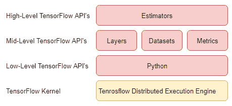

在最低级别上，您具有基本的 TensorFlow 操作，例如`tf.nn.conv2d`和`tf.nn.relu`。 使用 TensorFlow 时，这些低级原语为用户提供了最大的控制权。 但是，使用它们的代价是在构造图形和编写更多样板代码时必须自己动手做很多事情。

现在不用担心理解以下任何代码示例，我保证很快就会出现。 现在只是在这里展示 TensorFlow 中的不同 API 级别。

因此，例如，如果我们想创建一个卷积层以在我们的 ML 模型中使用，那么它可能类似于以下内容：

```py
def my_conv_2d(input, weight_shape, num_filters, strides): 
    my_weights = tf.get_variable(name="weights", shape=weight_shape)
    my_bias = tf.get_variable(name="bias", shape=num_filters) 
    my_conv = tf.nn.conv2d(input, my_weights, strides=strides, padding='same', name='conv_layer1')
    my_conv = tf.nn.bias_add(my_conv, my_bias)
    conv_layer_out = tf.nn.relu(my_conv)
    return conv_layer_out
```

这个示例比您实际实现的简单得多，但是您已经可以看到开始建立代码的行数，以及必须注意的事情，例如构造权重和添加偏见项。 一个模型也将具有许多不同种类的层，而不仅仅是卷积层，所有这些层都必须以与此非常相似的方式来构造。

因此，不仅要为模型中所需的每种新层将这些内容写出来都非常费力，而且还引入了更多的区域，在这些区域中，错误可能会潜入您的代码中，这从来都不是一件好事。

对我们来说幸运的是，TensorFlow 具有第二层抽象，可以帮助您简化构建 TensorFlow 图时的工作。 这种抽象级别的一个示例是 Layers API。 图层 API 使您可以轻松处理许多机器学习任务中常见的许多构建基块。

层 API 的工作方式是包装我们在上一个示例中编写的所有内容并将其抽象出来，因此我们不必再为它担心。 例如，我们可以压缩前面的代码以将卷积层构造为一个函数调用。 与以前建立相同的卷积层现在看起来像这样：

```py
def my_conv_2d(input, kernel_size, num_filters, strides): 
    conv_layer_out = tf.layers.conv2d(input, filters=num_filters, kernel_size=kernel_size, strides=strides, padding='same', activation=tf.nn.relu, name='conv_layer1')
    return conv_layer_out
```

还有两个与各层一起工作的 API。 第一个是数据集 API，可轻松将数据加载和馈送到 TensorFlow 图。 第二个是指标 API，它提供工具来测试您训练有素的机器学习模型的运行状况。 我们将在本书的后面部分中学习所有这些内容。

API 堆栈的最后一层是 TensorFlow 提供的最高抽象层，这称为估计器 API。 就像使用`tf.layers`来构造权重并为单个层添加偏差一样，estimators API 封装了许多层的结构，以便我们可以将一个由多个不同层组成的整体模型定义为一个 函数调用。

本书不会介绍 estimators API 的用法，但是如果读者希望了解有关 estimator 的更多信息，可以在 TensorFlow 网站上找到一些有用的教程。

本书将重点介绍如何使用低级 API 以及图层，数据集和指标 API 来构建，训练和评估自己的 ML 模型。 我们相信，通过使用这些较低级别的 API，读者将对 TensorFlow 的幕后工作方式有更深入的了解，并有能力更好地应对可能需要使用这些较低级别 API 的各种未来问题 级功能。

# 急于执行

在撰写本文时，Google 刚刚将急切的执行 API 引入了 TensorFlow。 急切执行是 TensorFlow 对另一个名为 PyTorch 的深度学习库的回答。 它允许您绕过通常的 TensorFlow 工作方式，在这种方式下，您必须首先定义计算图，然后执行该图以获得结果。 这称为静态图计算。 相反，现在您可以使用 Eager Execution 创建在运行程序时动态定义的所谓动态图。 使用 TensorFlow 时，这允许使用更传统的命令式编程方式。 不幸的是，急切的执行仍在开发中，缺少某些功能，因此在本书中不作介绍。 可以在 TensorFlow 网站上找到有关急切执行的更多信息。

# 建立您的第一个 TensorFlow 模型

事不宜迟，让我们开始在 TensorFlow 中构建您的第一个 ML 模型。

我们将在本章中解决的问题是从四个给定的特征值正确识别虹膜花的种类。 这是一个非常容易解决的经典 ML 问题，但它将为我们提供一种很好的方式来介绍在 TensorFlow 中构建图形，馈送数据和训练 ML 模型的基础知识。

Iris 数据集由 150 个数据点组成，每个数据点具有四个相应的特征：长度，花瓣宽度，萼片长度和萼片宽度以及目标标签。 我们的任务是建立一个模型，仅给出这四个特征就可以推断出任何虹膜的目标标签。

让我们开始加载数据并进行处理。 TensorFlow 具有内置功能，可以为我们导入此特定数据集，因此让我们继续使用它。 由于我们的数据集很小，因此将整个数据集加载到内存中是可行的。 但是，不建议将其用于较大的数据集，并且在接下来的章节中，您将学到更好的处理此问题的方法。 以下代码块将为我们加载数据，然后对其进行解释。

```py
import tensorflow as tf
import numpy as np 

# Set random seed for reproducibility. 
np.random.seed(0) 
data, labels = tf.contrib.learn.datasets.load_dataset("iris")
num_elements = len(labels) 

# Use shuffled indexing to shuffle dataset. 
shuffled_indices = np.arange(len(labels)) 
np.random.shuffle(shuffled_indices) 
shuffled_data = data[shuffled_indices] 
shuffled_labels = labels[shuffled_indices] 

# Transform labels into one hot vectors. 
one_hot_labels = np.zeros([num_elements,3], dtype=int) 
one_hot_labels[np.arange(num_elements), shuffled_labels] = 1 

# Split data into training and testing sets. 
train_data = shuffled_data[0:105] 
train_labels = shuffled_labels[0:105] 
test_data = shuffled_data[105:] 
test_labels = shuffled_labels[105:] 
```

让我们再次看一下这段代码，看看到目前为止我们做了什么。 导入 TensorFlow 和 Numpy 之后，我们将整个数据集加载到内存中。 我们的数据由表示为矢量的四个数值特征组成。 我们总共有 150 个数据点，因此我们的数据将是形状为 150 x 4 的矩阵，其中每一行代表不同的数据点，每一列代表不同的要素。 每个数据点还具有与之关联的目标标签，该目标标签存储在单独的标签向量中。

接下来，我们重新整理数据集； 这一点很重要，因此，当我们将其分为训练集和测试集时，我们在这两个集之间平均分配，并且最终不会在一组集中获得所有一种类型的数据。

# 一热载体

改组后，我们对数据标签进行一些预处理。 随数据集加载的标签只是一个 150 长度的整数向量，表示每个数据点所属的目标类，在这种情况下为 1、2 或 3。 在创建机器学习模型时，我们希望将标签转换为一种新的形式，通过执行一种称为“一键编码”的方式可以更轻松地使用它。

不是使用单个数字作为每个数据点的标签，而是使用向量。 每个向量将与您拥有的不同目标类别的数目一样长。 因此，例如，如果您有 5 个目标类，则每个向量将有 5 个元素；例如， 如果您有 1,000 个目标类别，则每个向量将具有 1,000 个元素。 向量中的每一列代表我们的目标类别之一，我们可以使用二进制值来确定向量是其标签的类别。 可以通过将所有值设置为 0 并将 1 放入我们希望向量标签表示的类的列中来完成。

用一个例子很容易理解。 对于这个特定问题的标签，转换后的向量将如下所示：

```py
1 = [1,0,0] 
2 = [0,1,0] 
3 = [0,0,1] 
```

# 分为训练和测试集

最后，我们将数据集的一部分放到一边。 这就是我们的测试集，在我们训练模型之后我们才接触它。 该集合用于评估我们训练有素的模型对从未见过的新数据的性能。 有许多方法可以将数据分为训练集和测试集，我们将在本书的后面详细介绍它们。

但就目前而言，我们将进行一个简单的 70:30 拆分，因此我们仅使用总数据的 70％来训练我们的模型，然后对剩余的 30％进行测试。

# 创建 TensorFlow 图

现在我们的数据都已经设置好了，我们可以构建模型来学习如何对鸢尾花进行分类。 我们将构建最简单的机器学习模型之一-线性分类器，如下所示：

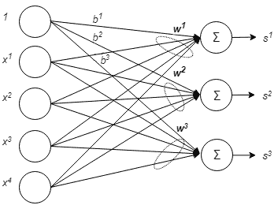

线性分类器通过计算输入特征向量 *x* 和权重向量 *w* 之间的点积来工作。 在计算出点积之后，我们向结果添加一个值，称为偏差项 *b* 。 在我们的例子中，我们有三种可能的类别，任何输入特征向量都可能属于该类别，因此我们需要使用 *w <sup>1</sup>* ， *w <sup>2 计算三种不同的点积</sup> ，*和 *w <sup>3</sup>* 以查看其属于哪个类别。 但是，我们不必写出三个单独的点积，而只需在形状[3,4]的权重矩阵与输入向量之间做一个矩阵乘法。 在下图中，我们可以更清楚地看到它的外观：

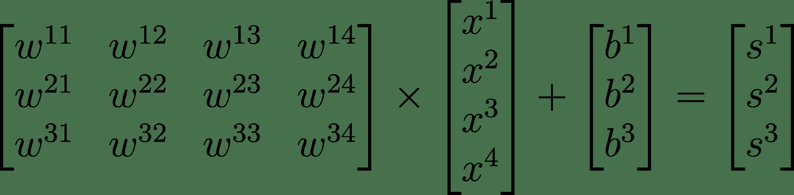

我们还可以将该方程简化为更紧凑的形式，如下所示，其中我们的权重矩阵为 *W* ，偏差为 *b* ， *x* 是我们的输入特征 向量，结果输出为 *s* ：

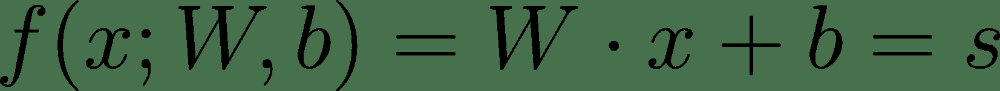

# 变数

我们如何在 TensorFlow 代码中全部写出来？ 让我们开始创建权重和偏见。 在 TensorFlow 中，如果我们想创建一些可以被我们的代码操纵的 Tensor，那么我们需要使用 TensorFlow 变量。 TensorFlow 变量是`tf.Variable`类的实例。 `tf.Variable`类表示`tf.Tensor`对象，可以通过在其上运行 TensorFlow 操作来更改其值。 变量是类似于 Tensor 的对象，因此它们可以以与 Tensor 相同的方式传递，并且可以与 Tensor 一起使用的任何操作都可以与变量一起使用。

要创建变量，我们可以使用`tf.get_variable()`。 调用此函数时，必须提供变量的名称。 此函数将首先检查图形上是否没有其他具有相同名称的变量，如果没有，则它将创建新变量并将其添加到 TensorFlow 图形。

您还必须指定变量要具有的形状，或者，可以使用`tf.constant`张量来初始化变量。 变量将采用您的常数 Tensor 的值，并且形状将自动推断。 例如，以下代码将产生一个包含值 21 和 25 的 1x2 张量：

```py
my_variable = tf.get_variable(name= "my_variable", initializer=tf.constant([21, 25]))
```

# 运作方式

在图中有变量很好，但我们也想对它们做点什么。 我们可以使用 TensorFlow 操作来操作我们的变量。

如前所述，我们的线性分类器只是一个矩阵乘法运算，因此您将要使用的第一个运算很有趣地成为矩阵乘法运算。 只需在您要相乘的两个张量上调用`tf.matmul()`，结果将是您传入的两个张量的矩阵相乘。简单！

在整本书中，您将了解需要使用的许多不同的 TensorFlow 操作。

现在，您希望对变量和操作有所了解，让我们构建线性模型。 我们将在函数中定义模型。 该函数将以 N 个特征向量为输入，或更准确地说，以 N 个大小为一批。由于我们的特征向量的长度为 4，所以我们的批次将是[N，4]形状张量。 然后该函数将返回线性模型的输出。 在下面的代码中，我们编写了线性模型函数，该函数应该可以自我解释，但是如果您还没有完全理解它，请继续阅读。

```py
def linear_model(input):
# Create variables for our weights and biases 
my_weights = tf.get_variable(name="weights", shape=[4,3]) 
my_bias = tf.get_variable(name="bias", shape=[3]) 

# Create a linear classifier. 
linear_layer = tf.matmul(input, my_weights)  
linear_layer_out = tf.nn.bias_add(value=linear_layer, bias=my_bias) 
return linear_layer_out 
```

在此处的代码中，我们创建了将存储权重和偏差的变量。 我们给他们起名字并提供所需的形状。 请记住，我们使用变量是因为我们想通过操作来操纵它们的值。

接下来，我们创建一个`tf.matmul`节点，将我们的输入特征矩阵和权重矩阵作为参数。 可以通过我们的`linear_layer` Python 变量访问此操作的结果。 然后将该结果传递给另一个运算符`tf.nn.bias_add`。 该运算来自 **NN** （**神经网络**）模块，在我们希望向计算结果中添加偏差矢量时使用。 偏差必须是一维张量。

# 使用占位符馈送数据

占位符是类似 Tensor 的对象。 它们是您与 TensorFlow 之间的合同，该合同规定，当您在会话中运行计算图时，您将提供*数据或将*数据馈入该占位符，以便您的图可以成功运行。

它们就像张量一样，就像张量一样，意味着您可以将它们传递到放置张量的地方。

通过使用占位符，我们可以向图形中提供外部输入，这些输入可能会在每次运行图形时更改。 它们的自然用法是将数据和标签提供到模型中的一种方式，因为每次我们要运行图形时，我们提供的数据和标签通常都会有所不同。

创建占位符时，我们必须提供将要填充的数据类型。

我们将使用两个占位符将数据和标签提供到图形中。 我们还提供了馈入这些占位符的任何数据都必须采用的形状。 我们使用`None`表示该特定尺寸的大小可以为任何值。 这样，我们就可以批量输入大小不同的数据。 接下来，我们将看到如何在 TensorFlow 中为我们的问题定义占位符。

```py
x = tf.placeholder(tf.float32, shape=[None, 4], name="data_in") 
y = tf.placeholder(tf.int32, shape=[None, 3], name="target_labels") 
```

现在，我们在图形中创建了占位符，因此我们也可以在图形上构造线性模型。 我们调用之前定义的函数，并提供数据占位符`x`作为输入。 请记住，占位符的行为类似于张量，因此它们也可以像它们一样被传递。 在以下代码中，我们使用占位符作为输入参数来调用 linear_model 函数。

```py
model_out = linear_model(x)
```

当我们调用函数时，函数中的所有内容都会执行，所有操作和变量都将添加到 TensorFlow 图中。 我们只需要这样做一次。 如果我们再次尝试调用函数，则会收到一条错误消息，说明我们已尝试向图添加变量，但变量已经存在。

占位符是向我们的图中提供外部数据的最简单，最快的方法，因此很高兴了解它们。 稍后，我们将看到使用数据集 API 提供数据的更好方法，但是就目前而言，占位符是一个不错的起点。

# 初始化变量

在我们能够在图形中使用变量之前，我们必须对其进行初始化。 我们需要创建一个图形节点来为我们做到这一点。 使用`tf.global_variables_initializer`将向我们的图形添加一个初始化器节点。 如果我们在会话中运行该节点，那么图形中的所有变量都将被初始化，以便我们可以使用它们。 因此，现在，让我们创建一个初始化器节点，如下所示：

```py
initializer = tf.global_variables_initializer()
```

正如我们没有明确说明要对变量使用哪种初始化一样，TensorFlow 将使用默认的一种称为 Glorot Normal Initializer 的方法，也称为 Xavier Initialization。

# 训练我们的模型

我们已经构建了线性模型的图，并且可以向其中提供数据。 如果我们创建一个会话并在提供一些输入数据的同时运行`model_out` Tensor，那么我们将得到一个结果。 但是，我们得到的输出将完全是垃圾。 我们的模型尚未训练！ 当我们使用初始化节点初始化变量时，权重和偏差的值仅具有默认值。

# 损失函数

要训​​练我们的模型，我们必须定义一些称为损失函数的函数。 损失函数将告诉我们我们的模型目前做得如何好坏。

损失可在`tf.losses`模块中找到。 对于此模型，我们将使用铰链损耗。 铰链损耗是创建**支持向量机**（ **SVM** ）时使用的损耗函数。 铰链损失严重惩罚了错误的预测。 对于一个给定的示例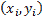，其中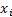是数据点的特征向量，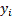是其标记，其铰链损耗如下：

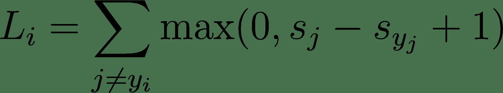

为此，以下内容将适用：

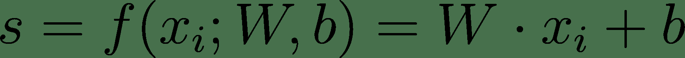

简而言之，该方程式采用分类器的原始输出。 在我们的模型中，这是三个输出分数，并确保目标类别的分数至少比其他类别的分数大至少 1。 对于每个分数（目标类别除外），如果满足此限制，则将损失加 0，否则，将增加罚款：

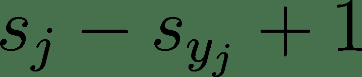

这个概念实际上是非常直观的，因为如果我们的权重和偏见得到了正确的训练，那么所产生的三个得分中的最高得分就可以自信地表明输入示例所属的正确类别。

由于在训练期间，我们会一次输入许多训练示例，因此，我们将获得多个需要平均的损失。 因此，需要最小化的总损耗方程如下：

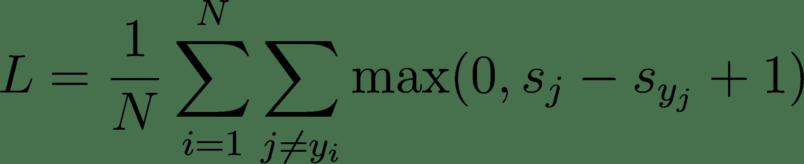

在我们的代码中，损失函数将带有两个参数：logits 和 label。 在 TensorFlow 中，logits 是我们的模型产生的原始值的名称。 在我们的例子中，这是`model_out`，因为这是我们模型的输出。 对于标签，我们使用标签占位符`y`。 请记住，占位符将在运行时为我们填充：

```py
loss = tf.reduce_mean(tf.losses.hinge_loss(logits=model_out, labels=y))
```

由于我们也想对整个输入数据的损失进行平均，因此我们使用`tf.reduce_mean`将所有损失平均为一个损失值，将其最小化。

有许多不同类型的损失函数可供我们使用，这些函数对于不同的机器学习任务都是有益的。 在阅读本书时，我们将学习更多这些内容以及何时使用不同的损失函数。

# 优化

现在我们定义了要使用的损失函数； 我们可以使用这个损失函数来训练我们的模型。 如前面的方程式所示，损耗函数是权重和偏差的函数。 因此，我们要做的就是详尽地搜索权重和偏差的空间，并查看哪种组合最大程度地减少了损失。 当我们具有一维或二维权向量时，此过程可能还可以，但是当权向量空间太大时，我们需要一个更有效的解决方案。 为此，我们将使用一种名为**梯度下降**的优化技术。

通过使用损失函数和演算，梯度下降法可以看到如何调整模型权重和偏差的值，以使损失值减小。 这是一个迭代过程，需要多次迭代才能针对我们的训练数据对权重和偏差的值进行适当调整。 这个想法是，通过相对于目标函数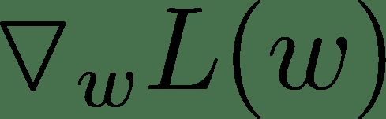 w 的梯度的相反方向更新参数，可以最小化由权重 *w* 参数化的损失函数 *L* 。 参数。 权重和偏差的更新功能如下所示：

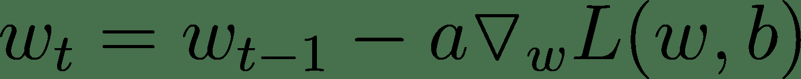

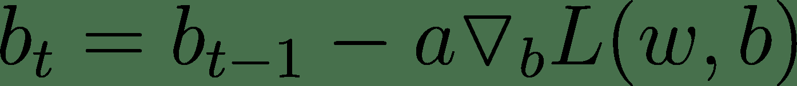

在这里，是迭代次数，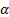是称为学习率的超参数。

由两个变量 *w1* 和 *w2* 参数化的损失函数将如下图所示：

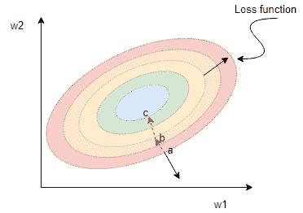

上图显示了椭圆抛物面的水平曲线。 这是一个碗形的表面，碗的底部位于中心。 从图中可以看出，在点 *a* （黑色直箭头）处的梯度矢量垂直于通过 *a* 的水平曲线。 实际上，梯度矢量指向损失函数最大增加率的方向。

因此，如果我们从*点*开始并朝与相反的*方向将权重更新为梯度矢量，那么我们将下降至 *b* 点，然后在下一个 迭代到 *c* ，依此类推，直到达到最小值。 选择使损失函数最小的参数来表示最终的训练线性模型。*

TensorFlow 的好处在于，它使用其内置的优化器（称为**自动微分**）为我们计算了所有所需的梯度。 我们要做的就是选择一个梯度下降优化器，并告诉它最小化我们的损失函数。 TensorFlow 将自动计算所有梯度，然后使用这些梯度为我们更新权重。

我们可以在`tf.train`模块中找到优化程序类。 现在，我们将使用`GradientDescentOptimizer`类，它只是基本的梯度下降优化算法。 创建优化器时，我们必须提供学习率。 学习速率的值是`hyperparameter`，用户必须通过反复试验和实验来对其进行调整。 0.5 的值应该可以很好地解决此问题。

优化器节点具有一种称为`minimize`的方法。 在您提供的损失函数上调用此方法会做两件事。 首先，针对您的整个图形计算与该损耗有关的梯度。 其次，这些梯度用于更新所有相关变量。

创建我们的优化器节点将如下所示：

```py
optimizer = tf.train.GradientDescentOptimizer(learning_rate=0.5).minimize(loss) 
```

与损失函数一样，有很多不同的梯度下降优化器需要学习。 这里介绍的是最基本的一种，但是再次，我们将在以后的章节中学习和使用不同的类型。

# 评估训练好的模型

我们汇总了训练模型所需的所有零件。 开始训练之前的最后一件事是，我们想在图形中创建一些节点，这些节点将使我们能够在完成训练后测试模型的执行情况。

我们将创建一个节点来计算模型的准确性。

`Tf.equal`将返回一个布尔列表，指示两个提供的列表在哪里相等。 在找到最大值的索引之后，在这种情况下，我们的两个列表将是模型的标签和输出：

```py
correct_prediction = tf.equal(tf.argmax(model_out,1), tf.argmax(y,1)) 
```

然后，我们可以再次使用`reduce_mean`来获得正确预测的平均数量。 不要忘记将我们的`boolean correct_prediction`列表投射回`float32`：

```py
accuracy = tf.reduce_mean(tf.cast(correct_prediction, tf.float32)) 
```

# 会议

现在，我们已经构造了计算图的所有部分。 我们需要做的最后一件事是创建一个`tf.Session`并运行我们的图形。 TensorFlow 会话是一种将用 Python 编写的 TensorFlow 程序与为 TensorFlow 供电的 C ++运行时连接的一种方式。 该会话还使 TensorFlow 可以访问本地或远程计算机上存在的设备，例如 CPU 和 GPU。 另外，该会话将缓存有关构造图的信息，因此可以有效地多次运行计算。

创建会话的标准方法是使用 Python 上下文管理器：`with`语句块：

```py
with tf.Session() as sess:.  
```

原因是创建会话时，它可以控制计算机上的 CPU，内存和 GPU 资源。 使用完会话后，您希望再次释放所有这些资源，最简单的方法是使用`with`语句来确保这一点。

创建会话后，我们要做的第一件事是运行初始化程序 op。 通过在要评估的图形对象上调用`tf.Session.run`，可以使用会话来评估图形中的节点和张量。 当您将图形的一部分提供给`session.run`时，TensorFlow 将在整个图形中进行工作，评估所提供的图形部分所依赖的所有内容以产生结果。

因此，在我们的示例中，调用`sess.run(initializer)`将在图形中进行搜索，查找执行初始化程序所需的所有内容，然后按顺序执行这些节点。 在这种情况下，初始化程序节点没有任何连接，因此它将简单地执行一个初始化所有变量的节点。

现在我们的变量已初始化，我们开始训练循环。 我们将训练 1000 个步骤或迭代，因此我们将在其中创建训练步骤的 for 循环。 训练的步骤数是`hyperparameter`。 这是我们在训练模型时需要决定的事情。 您可以选择与您选择的值进行权衡，这将在以后的章节中进行讨论。 对于此问题，1000 个步骤将足以获得所需的结果。

我们获取了一批训练数据和标签，并将它们输入到图形中。 接下来，我们再次调用`session.run`。 这次，我们将其称为损失和优化器两件事。 通过将它们放在我们提供给`session.run`的列表中，我们可以提供想要评估的事物。 TensorFlow 将足够聪明，如果不需要，它不会多次评估图形，并且它将重用已经计算出的结果。 我们提供的这个列表称为我们的提取； 它是我们要评估和获取的图中的节点。

在提取列表之后，我们提供了`feed_dict`或 Feed 字典。 这是一个字典，其中的每个键都是图表中的张量，我们将向该张量输入值（在本例中为占位符），而对应的值就是将被输入到它的值。

`session.run`的返回值对应于我们的提取列表中的每个值。 我们的第一个获取是图中的损失 Tensor，因此第一个 return 参数来自此。 第二个获取是优化器节点。 我们不在乎从该节点返回什么，因为我们只在乎优化器节点的计算结果，因此我们将其对应的返回值留空：

```py
with tf.Session() as sess: 
    sess.run(initializer) 

    for i in range(1000): 
        batch_x, batch_y = train_data[:,:], train_labels[:,:] 

        loss_val, _ = sess.run([loss, optimizer], feed_dict={x : batch_x, y: batch_y}) 
    print("Train Accuracy:", sess.run(accuracy, feed_dict={x: train_data, y: train_labels})) 
    print("Test Accuracy:", sess.run(accuracy, feed_dict={x: test_data, y: test_labels})) 
```

运行 1000 次迭代后，我们使用另一个`session.run`调用来获取精度节点的输出。 我们执行两次，一次输入我们的训练数据以获取训练集的准确性，一次输入我们保留的测试数据以获取测试集的准确性。 您应该从`0.977778`中打印出测试精度，这意味着我们的模型可以正确分类 45 个测试集中的 44 个，一点也不差！

# 摘要

在本章中，我们已经说明了使用 TensorFlow 进行编程的方式以及如何为使用 TensorFlow 设置工作环境。 我们还研究了如何使用 TensorFlow 对虹膜花朵进行分类来构建，训练和评估自己的线性模型。 在此过程中，我们简要介绍了损失函数和梯度下降优化器。

在下一章中，我们将更多地了解一些关键的深度学习概念，包括卷积神经网络。 我们还将研究如何使用 TensorFlow 来构建和训练深度神经网络。