# TensorFlow 中的图像分类

图像分类是指根据图像内容将图像分类的问题。 让我们从分类的示例任务开始，其中图片可能是狗的图像，也可能不是。 某人可能要完成此任务的一种简单方法是，像在第 1 章中所做的那样，获取输入图像，将其重塑为矢量，然后训练线性分类器（或其他某种分类器）。 ]，设置和 TensorFlow 简介。 但是，您很快就会发现此主意不好，原因有几个。 除了不能很好地缩放到输入图像的大小之外，线性分类器将很难将一个图像与另一个图像分开。

与可以在图像中看到有意义的图案和内容的人类相反，计算机只能看到从 0 到 255 的数字数组。对于同一类的不同图像，这些数字在相同位置的广泛波动导致无法直接使用它们 作为分类器的输入。 从**加拿大高级研究学院**（**CIFAR**）数据集中获取的这 10 张示例狗图像完美地说明了此问题。 狗的外观不仅有所不同，而且它们在镜头前的姿势和位置也有所不同。 对于机器来说，每个图像一目了然，完全没有共同点，而我们人类却可以清楚地看到它们都是狗：


一个更好的解决方案是告诉计算机从输入图像中提取一些有意义的特征，例如常见的形状，纹理或颜色。 然后，我们可以使用这些功能而不是原始输入图像作为分类器的输入。 现在，我们正在寻找图像中这些功能的存在，以告诉我们图像是否包含我们要识别的对象。

这些提取的特征在我们看来将仅仅是一个高维向量（但通常比原始图像空间要小得多），可以用作分类器的输入。 多年来开发的一些著名的特征提取方法是**尺度不变特征**（**SIFT**），**最大稳定的末端区域**（**MSER**），**本地二进制模式**（**LBP**）和**直方图定向梯度**（**HOG**）。

当使用卷积神经网络进行图像分类时，2012 年是计算机视觉（以及随后的其他机器学习领域）最大的转折点之一，这标志着如何解决这一任务（以及许多其他问题）的方式发生了转变。 我们不是专注于手工制作更好的特征以从图像中提取，而是使用数据驱动的方法来找到代表问题数据集的最佳特征集。 CNN 将使用大量训练图像，并自己学习代表数据的最佳特征，以解决分类任务。

在本章中，我们将介绍以下主题：

*   看一下用于分类的损失函数
*   Imagenet 和 CIFAR 数据集
*   训练 CNN 对 CIFAR 数据集进行分类
*   数据 API 简介
*   如何初始化体重
*   如何规范化模型以获得更好的结果

# CNN 模型架构

图像分类模型的关键部分是其 CNN 层。 这些层将负责从图像数据中提取特征。 这些 CNN 图层的输出将是一个特征向量，就像以前一样，我们可以将其用作所选分类器的输入。 对于许多 CNN 模型，分类器将只是连接到我们 CNN 输出的完全连接层。 如第 1 章，“TensorFlow 简介和设置”中所示，我们的线性分类器只是一个全连接层； 除了层的大小和输入会有所不同之外，这里就是这种情况。

重要的是要注意，分类或回归问题（例如本地化）（或其他使用图像的其他问题）所使用的 CNN 架构在本质上是相同的。 唯一真正的不同是，在 CNN 层完成特征提取之后会发生什么。 例如，一个差异可能是用于不同任务的损失函数，如下图所示：

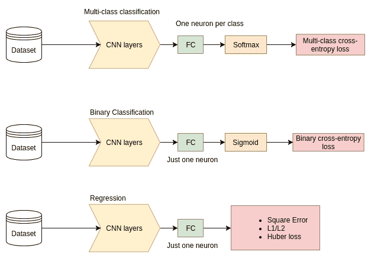

当我们着眼于 CNN 可以解决的各种问题时，您会在本书中看到重复出现的模式。 显然，可以使用 CNN 从输入数据中提取一些有意义的特征向量来解决许多涉及图像的任务，然后根据任务以某种方式对其进行处理并将其馈入不同的损失函数。 现在，让我们通过查看常用的损失函数来开始并专注于图像分类任务。

# 交叉熵损失（对数损失）

图像分类的最简单形式是二进制分类。 在这里，我们有一个分类器，该分类器只有一个要分类的对象，例如 dog / no dog。 在这种情况下，我们可能使用的损失函数是二进制交叉熵损失。

真实标签`p`与模型预测`q`之间的交叉熵函数定义为：

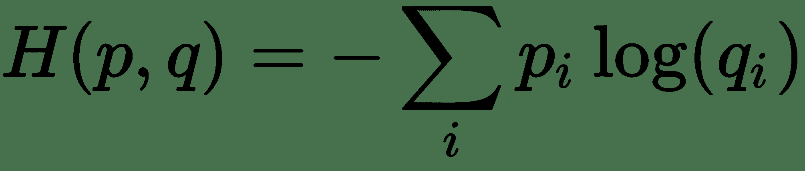

`i`是我们标签和预测的每个可能元素的索引。

但是，当我们处理只有两个可能结果 y = 1 和 y = 0 的二元情况时，可以简化 p  {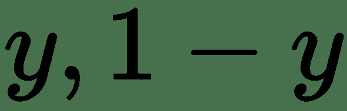}和 q  {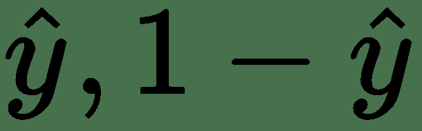} 我们得到：

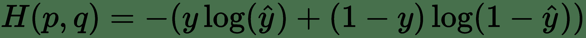

这是等效的

迭代训练示例，将要最小化的成本函数`L`变为：

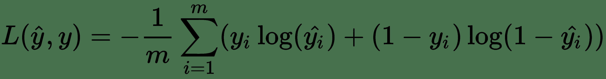

这在直觉上是正确的，因为当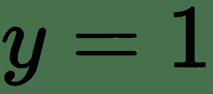时，我们要最小化需要大的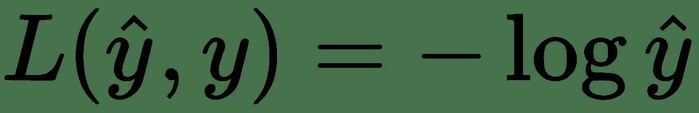；当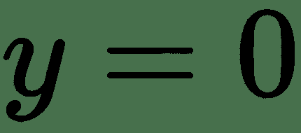时，我们要最小化的我们要最小化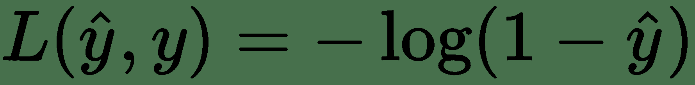。

在 TensorFlow 中，可以在`tf.losses`模块中找到二进制交叉熵损失。 知道我们模型的原始输出的名称是 logits 很有用。 在将其传递给交叉熵损失之前，我们需要对其应用 **Sigmoid** 函数，以便我们的输出在 0 到 1 之间缩放。TensorFlow 实际上将所有这些步骤组合为一个操作，如 下面的代码。 TensorFlow 还将为我们平均分批处理损失。

```py
loss = tf.losses.sigmoid_cross_entropy(multi_class_labels=labels_in, logits=model_prediction)
```

# 多类交叉熵损失

多类交叉熵损失用于多类分类中，例如第 2 章，“深度学习和卷积神经网络”中的 MNIST 数字分类问题。 像上面一样，我们使用交叉熵函数，经过几次计算，我们为每个训练示例获得了多类交叉熵损失 *L* ：

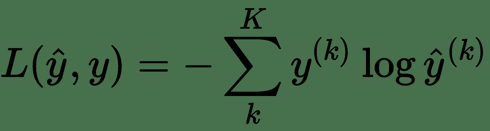

在此，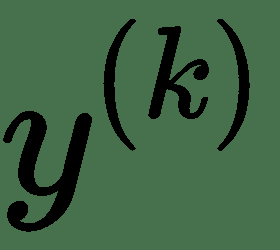为 0 或 1，表示类别标签是否是用于预测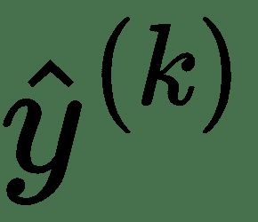的正确分类。 要使用此损耗，我们首先需要向模型中最终 FC 层的输出添加 softmax 激活。 交叉熵与 softmax 的组合如下所示：

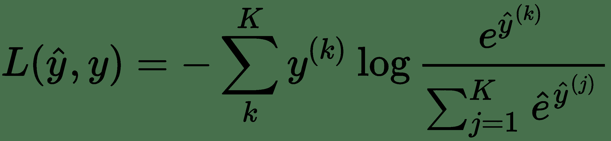

知道我们模型的原始输出的名称是 logits 很有用。 Logits 是传递给 softmax 函数的内容。 softmax 函数是 S 型函数的多类版本。 一旦通过 softmax 函数，我们就可以使用我们的多类交叉熵损失。 TensorFlow 实际上将所有这些步骤组合为一个操作，如下所示：

```py
loss = tf.reduce_mean(tf.nn.softmax_cross_entropy_with_logits(logits=model_logits, labels=labels_in)) 
```

我们必须使用`tf.reduce_mean`，因为我们将获得批次中每个图像的损失值。 我们使用`tf.reduce_mean`来获取批次的平均损失。

我们可以像上面一样再次使用`tf.losses`模块，特别是`tf.losses.softmax_cross_entropy`模块，然后我们不需要`tf.reduce_mean`，但我们决定向您展示一种不同的方式，以便您可以看到有很多方法可以使用 在 TensorFlow 中也是如此。 随着 TensorFlow 的发展，实现相同结果的不同方法也越来越多，而且通常没有比其他方法差很多的方法。

# 训练/测试数据集拆分

暂时请注意，我们需要将数据集分为两组：训练和测试。 正如第 1 章，“TensorFlow 简介和设置”中所述，这是因为我们需要以某种方式检查模型是否能够从其自身的训练样本中进行概括（是否 能够正确识别训练中从未见过的图像）。 如果我们的模型不能做到这一点，对我们来说就没有太大用处。

还有一些其他要记住的重要点：

*   训练和测试数据必须来自相同的分布（因此在拆分之前合并并混洗所有数据）
*   训练集通常大于测试集（例如，训练：占总数的 70%，测试：占总数的 30% ）。

对于我们在前几章中要处理的示例，这些基础知识就足够了，但是在随后的章节中，我们将更详细地介绍如何为大型项目正确设置数据集。

# 数据集

在本节中，我们将讨论图像分类中使用的最重要和最著名的最新数据集。 这是必要的，因为对计算机视觉的任何细读都可能与它们重叠（包括本书！）。 在卷积神经网络到来之前，研究界在图像分类比赛中使用的两个主要数据集是 Caltech 和 PASCAL 数据集。

加州理工学院的数据集由加州理工学院建立，并发布了两个版本。 Caltech-101 于 2003 年发布，包含 101 个类别，每个类别约 40 至 800 张图像； Caltech-256 于 2007 年发布，具有 256 个对象类别，总共包含 30607 张图像。 这些图片是从 Google 图片和 PicSearch 收集的，其大小约为 300x400 像素。

Pascal **视觉对象类**（**VOC**）挑战成立于 2005 年。每年组织到 2012 年，它为*图像分类，对象检测，分割和操作分类*提供了广泛的自然图像的著名基准数据集。 它是一个多样化的数据集，包含来自各种大小，姿势，方向，照明和遮挡的 flickr 的图像。 从 2005 年（仅四个类别：自行车，汽车，摩托车和人，火车/验证/测试：包含 5 个图像的 2578 个注释对象的 1578 张图像）到 2012 年（二十个类别，火车/验证数据具有 11,530 张图片，包含 27,450 个 ROI 注释对象和 6,929 个细分）。

重大变化来自 PASCAL（VOC）2007 挑战赛，当时班级的数量从 4 个增加到 20 个，并且此后一直固定。 分类任务的评估指标已更改为平均精度。 仅在 VOC 2007 挑战赛之前提供测试数据的注释。

随着更复杂的分类方法的出现，前面的数据集是不够的，以下几节中介绍的 ImageNet 数据集和 CIFAR 数据集成为分类测试的新标准。

# 影像网

ImageNet 数据集由 Alex Berg（哥伦比亚大学），Jia Deng（普林斯顿大学）和 Lii-Fei Li（斯坦福大学）在 2010 年共同创建，旨在进行大规模视觉识别的测试比赛， *PASCAL 可视对象类挑战*，2010 年。数据集是代表 WordNet 内容的图像的集合。 WordNet 是英语的词汇数据库。 它以分层结构将英语单词分成称为**同义词集**的同义词集。 以下屏幕截图显示了名词的 WordNet 结构。 括号中的数字是子树中的同义词集的数量。

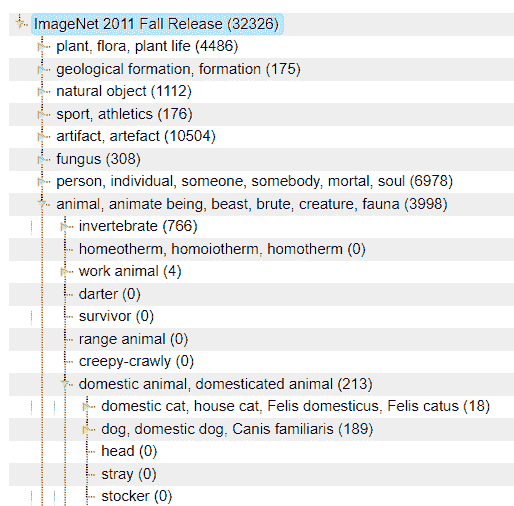

图像分类算法的发展几乎解决了现有数据集上的分类难题，因此需要一个新的数据集，以实现大规模图像分类。 这更接近现实情况，在这种情况下，我们希望机器描述模拟人的能力的任意图像的内容。 与上一代产品的分类数量在 100 年代相比，ImageNet 提供了超过 1000 万个高质量图像，覆盖了 10,000 多个类。 这些类别中的许多类别是相互关联的，这使分类任务更具挑战性，例如，区分许多品种的狗。 由于数据集非常庞大，因此很难使用其中存在的所有类别对每个图像进行注释，因此按照惯例，每个图像仅被标记为一个类别。

自 2010 年以来，一年一度的 ImageNet 大规模视觉识别挑战赛（ILSVRC）挑战集中于图像分类，单对象定位和检测。 对象分类挑战的数据包括 120 万张图像（来自 1000 个类别/同义词），训练数据，50,000 张验证数据图像和 100,000 张测试数据图像。

在分类挑战中，用于评估算法的主要指标是前 5 位错误率。 该算法允许给出五个预测类别，并且如果至少一个预测类别与地面真相标签匹配，则不会受到惩罚。

正式地，如果我们让为图像，让为地面真相标签。 然后，我们有了预测的标签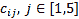，其中至少一个等于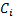才能将其视为成功的预测。 考虑预测误差如下：

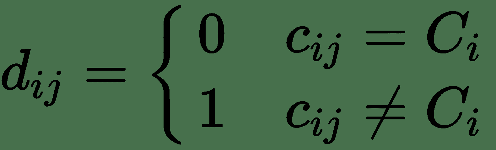

那么，算法的最终错误就是测试图像上出错的比例，如下所示：

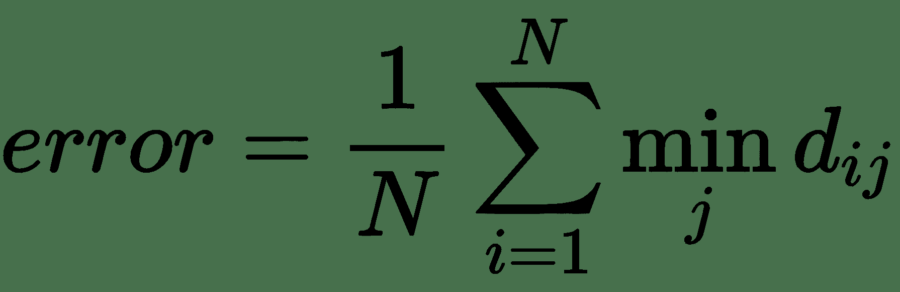

Imagenet 是近年来深度学习蓬勃发展的主要原因之一。 在深度学习开始流行之前，ILSVRC 的前五位错误率大约为 28%，并且丝毫没有下降太多。 但是，在 2012 年，挑战赛的冠军 SuperVision 将前 5 名的分类错误降低到了 16.4%。 团队模型（现在称为 AlexNet）是一个深度卷积神经网络。 这项巨大的胜利唤醒了人们使用 CNN 的力量，它成为许多现代 CNN 体系结构的垫脚石。

在接下来的几年中，CNN 模型继续占主导地位，前 5 个错误率持续下降。 2014 年冠军 GoogLeNet 将错误率降低到 6.7%，而 ResNet 在 2015 年将错误率再次降低了一半，降至 3.57%。 此后，2017 年的赢家“WMW 挤压和激励网络”产生了 2.25% 的误差，出现了较小的改进。

# CIFAR

CIFAR-10 和 CIFAR-100 数据集是 Alex Krizhevsky，Vinod Nair 和 Geoffrey Hinton 收集的小型（与现代标准相比）图像数据集。 这些数据集被研究界广泛用于图像分类任务。 它们被认为具有挑战性，因为图像质量非常低并且图像中的对象有时是部分可见的。 同时，由于图像较小，因此数据集很方便，因此研究人员可以快速在它们上产生结果。 CIFAR-100 增加了挑战，因为每个类别的图像数量很少，并且类别的数量也很大。 CIFAR10 和 CIFAR100 数据集每个包含 60,000 张图像。 两个数据集中的图像均为 32x32x3 RGB 彩色图像。

在 CIFAR-10 中，有 10 个类别，每个类别有 6,000 张图像。 数据集分为 50,000 个训练图像和 10,000 个测试图像。 以下是 CIFAR-10 数据集的类列表和每个类的一些随机图像，因此您可以看到其外观：

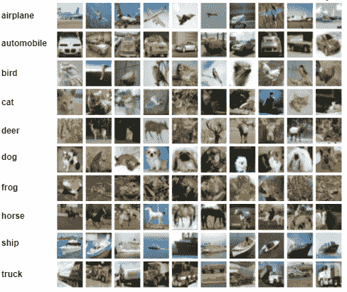

CIFAR-100 具有 100 个类别，每个类别 600 张图像。 这 100 个类别分为 20 个超类。 每个图像都有一个**精细**标签（它属于的类）和一个**粗糙**标签（它属于的超类）。 CIFAR-100 中的类和超类的列表可在[这个页面](https://www.cs.toronto.edu/~kriz/cifar.html)中找到。 将类别的数量从粗糙（20）增加到精细（100）有助于最大程度地提高类别间的可变性。 这意味着我们希望模型考虑图像中两个看起来相似的对象属于不同的类。 例如，一张床和一张沙发看起来相似但不完全相同，将它们放在单独的类中将确保它们与受训模型看起来不同。

CIFAR 的算法评估过程与 ImageNet 中的相同。 据 Saining Xie 等人报道，CIFAR-10 的报告最好的 top-1 误差为 3.58%，而 CIFAR-100 的误差为 17.31%。 深入神经网络的聚合残差转换中，他们介绍了新颖的 ResNeXt 体系结构。 可以在[这里](http://rodrigob.github.io/are_we_there_yet/build/classification_datasets_results.html)和[这里](https://github.com/RedditSota/state-of-the-art-result-for-machine-learning-problems)找到在 CIFAR-10 和 CIFAR-100 上将深度学习结果用于图像分类的最新技术。

# 加载 CIFAR

可以从前面提到的 Python，Matlab 和二进制版本的官方网站下载数据集。 有多种加载和读取这些数据集的方法。 实际上，在我们的 TensorFlow 实现中，我们使用 [Keras 库](https://keras.io/datasets/)加载它，该库现在是`tf.keras`模块中 TensorFlow 的一部分。 在这里，我们提供了一些示例代码来加载 CIFAR-10 数据集，但是 CIFAR-100 数据集的加载方式几乎相同：

```py
import tensorflow as tf 

from tf.keras.datasets import cifar10

(x_train, y_train), (x_test, y_test) = cifar10.load_data()  

print('x_train shape:',x_train.shape) 

print('y_train shape:',y_train.shape) 

print('x_test shape:',x_test.shape) 

print('y_test shape:',y_test.shape) 

print('x_train.shape[0]:',training samples) 

print('x_test.shape[0]:',test samples) 

# Convert class vectors to binary class matrices 

y_train = tf.keras.utils.to_categorical(y_train,10) 

y_test = tf.keras.utils.to_categorical(y_test,10) 
```

此代码返回两个元组：

```py
x_train, x_test: uint8 array of RGB image data with shape (num_samples, 3, 32, 32)
y_train, y_test: uint8 array of category labels (integers in range 0-9) with shape (num_samples,)
```

前面代码的打印语句的输出如下：

```py
x_train shape:(50000,32,32,3 

y_train shape:(50000,1) 

x_test shape:(10000,32,32,3) 

y_test shape:(10000,1) 
```

同样，使用以下命令加载 CIFAR-100 数据集：

```py
from tf.keras.datasets import cifar100

 (x_train, y_train), (x_test, y_test) = cifar100.load_data(label_mode='fine')  
```

# 使用 TensorFlow 进行图像分类

在本节中，我们将向您展示如何实现相对简单的 CNN 架构。 我们还将研究如何训练它对 CIFAR-10 数据集进行分类。

首先导入所有必需的库：

```py
import fire 
import numpy as np 
import os 
import tensorflow as tf 
from tf.keras.datasets import cifar10 
```

我们将定义一个将实现训练过程的 Python 类。 类名是`Train`，它实现两种方法：`build_graph`和`train`。 当执行主程序时，将触发`train`功能：

```py
class Train:  

   __x_ = []
     __y_ = []
     __logits = []
     __loss = []
     __train_step = []
     __merged_summary_op = []
     __saver = []
     __session = []
     __writer = []
     __is_training = []
     __loss_val = []
     __train_summary = []
     __val_summary = []

   def __init__(self):
         pass 

   def build_graph(self): 

   [...] 

   def train(self, save_dir='./save', batch_size=500): 

[...] 

if __name__ == '__main__': 

   cnn= Train() 

   cnn.train 
```

# 建立 CNN 图

让我们通过`build_graph`函数进行详细介绍，该函数包含网络定义，损失函数和所使用的优化器。 首先，我们通过为输入定义占位符来启动函数。 我们将使用两个占位符在图表中提供数据和标签：`__x_`和`__y_`。 占位符`__x_`将保存我们输入的 RGB 图像，而占位符`__y_` 存储一个对应类别的热门标签。 在定义占位符形状的`N`部分时，我们使用`None`，因为这告诉 TensorFlow 该值可以是任何值，并且在执行图形时将提供该值：

```py
def build_graph(self): 
       self.__x_ = tf.placeholder("float", shape=[None, 32, 32, 3], name='X') 

       self.__y_ = tf.placeholder("int32", shape=[None, 10], name='Y') 

       self.__is_training = tf.placeholder(tf.bool) 
```

然后，我们将在`name_scope`模型中定义我们的网络。 `Name_scope`返回定义 TensorFlow 操作时使用的上下文管理器。 该上下文管理器验证变量是否来自同一图，将该图设为默认图，并在该图中推送名称范围。

对于此模型，我们将构建一个具有三个卷积层，三个池化层和两个完全连接层的简单 CNN。 我们使用`tf.layers` API 来构建 CNN 层。 `tf.reshape`函数将张量从最后一个池化层重塑为一维张量，以匹配密集层期望接收的量。 最后一层的输出分配给`self.__logits`，它是将作为输入传递到我们的损失函数的张量：

```py
       with tf.name_scope("model") as scope: 

           conv1 = tf.layers.conv2d(inputs=self.__x_, filters=64, kernel_size=[5, 5], 

                                    padding="same", activation=tf.nn.relu)  

           pool1 = tf.layers.max_pooling2d(inputs=conv1, pool_size=[2, 2], strides=2) 

           conv2 = tf.layers.conv2d(inputs=pool1, filters=64, kernel_size=[5, 5], 

                                    padding="same", activation=tf.nn.relu) 

           pool2 = tf.layers.max_pooling2d(inputs=conv2, pool_size=[2, 2], strides=2) 

           conv3 = tf.layers.conv2d(inputs=pool2, filters=32, kernel_size=[5, 5], 

                                    padding="same", activation=tf.nn.relu) 

           pool3 = tf.layers.max_pooling2d(inputs=conv3, pool_size=[2, 2], strides=2) 

           pool3_flat = tf.reshape(pool3,  [-1, 4 * 4 * 32]) 

           # FC layers  

           FC1 = tf.layers.dense(inputs=pool3_flat, units=128, activation=tf.nn.relu) 

           FC2 = tf.layers.dense(inputs=FC1, units=64, activation=tf.nn.relu)            

           self.__logits = tf.layers.dense(inputs=FC2, units=10)            
```

下一步是在名称范围`loss_func`中定义损失函数。 此处使用的损失函数是 softmax 交叉熵，如前所述，我们使用`tf.reduce_mean`对整个批次的损失进行平均。 我们创建变量来保存训练`loss __loss`和验证损失`__loss_val`，并将这些标量添加到 TensorFlow 摘要数据中，以便稍后在 TensorBoard 中显示：

```py
           with tf.name_scope("loss_func") as scope: 

               self.__loss = tf.reduce_mean(tf.nn.softmax_cross_entropy_with_logits(logits=self.__logits, 

                                                                                    labels=self.__y_)) 

               self.__loss_val = tf.reduce_mean(tf.nn.softmax_cross_entropy_with_logits(logits=self.__logits, 

                                                                                    labels=self.__y_)) 

               # Add loss to tensorboard                

               self.__train_summary = tf.summary.scalar("loss_train", self.__loss) 

               self.__val_summary = tf.summary.scalar("loss_val", self.__loss_val) 
```

定义模型和损失函数后，我们需要指定将用于最小化损失的优化函数。 我们在这里选择的优化函数是 Adam 优化器，它在名称范围*优化器*中定义。

# 学习率安排

在上一章中，我们简要提到了在训练过程中保持恒定的学习率可能会出现的问题。 随着我们模型的开始学习，我们的初始学习率很可能会变得太大而无法继续学习。 梯度下降更新将开始超出或绕过我们的最小值； 结果，损失函数的值不会降低。 为了解决这个问题，我们可以不时降低学习率的值。 这个过程称为学习率调度，有几种流行的方法。

第一种方法是在训练过程中的固定时间步长（例如，当训练完成 33% 和 66% 时）降低学习率。 通常，当达到这些设置时间时，您会将学习率降低 10 倍。

第二种方法涉及根据时间步长的指数或二次函数降低学习率。 可以执行此操作的函数的示例如下：

```py
decayed_learning_rate = learning_rate * decay_rate ^ (global_step / decay_steps)
```

通过使用这种方法，学习率会随着训练时间的推移而平稳降低。

最后一种方法是使用我们的验证集，并查看验证集上的当前准确性。 在验证准确性不断提高的同时，我们对学习率无能为力。 一旦验证准确性停止增加，我们就将学习率降低某种程度。 重复此过程，直到训练结束。

所有方法都可以产生良好的结果，当您进行训练以查看哪种方法更适合您时，可能值得尝试所有这些不同的方法。 对于此特定模型，我们将使用第二种方法，即学习速率呈指数衰减。 我们使用 TensorFlow 操作`tf.train.exponential_decay`来执行此操作，该操作遵循前面显示的公式。 作为输入，它采用当前的学习率，全局步长，衰减之前的步数和衰减率。

在每次迭代中，当前的学习速率都会提供给我们的 Adam Optimizer，后者使用`minimize`函数，该函数使用梯度下降来使损失最小化并将`global_step`变量增加 1。 最后，在训练期间，将`learning_rate`和`global_step`添加到摘要数据以在 TensorBoard 上显示：

```py
           with tf.name_scope("optimizer") as scope: 
               global_step = tf.Variable(0, trainable=False) 

               starter_learning_rate = 1e-3 

               # decay every 10000 steps with a base of 0.96 function 
               learning_rate = tf.train.exponential_decay(starter_learning_rate, global_step, 
                                                          1000, 0.9, staircase=True) 

               self.__train_step = tf.train.AdamOptimizer(learning_rate).minimize(self.__loss, 
                                                                        global_step=global_step) 

               tf.summary.scalar("learning_rate", learning_rate) 
               tf.summary.scalar("global_step", global_step) 
```

尽管 Adam 优化器会自动为我们调整和降低学习率，但我们仍然发现，采用某种形式的学习率调度也可以改善结果。

一旦定义了图的所有组件，就将图中收集的所有摘要合并到`__merged_summary_op`中，并通过`tf.global_variables_initializer()`初始化图的所有变量。

自然，在训练模型时，我们希望将网络权重存储为二进制文件，以便我们可以将其加载回去以执行正向传播。 TensorFlow 中的那些二进制文件称为检查点，它们将变量名称映射到张量值。 要在检查点之间保存和还原变量，我们使用`Saver`类。 为避免填满磁盘，保护程序会自动管理检查点文件。 例如，他们每训练一次`N`小时，就只能保留`N`个最新文件或一个检查点。 在我们的例子中，我们将`max_to_keep`设置为`None`，这意味着将保留所有检查点文件：

```py
           # Merge op for tensorboard 
           self.__merged_summary_op = tf.summary.merge_all() 

           # Build graph 
           init = tf.global_variables_initializer() 

           # Saver for checkpoints 
           self.__saver = tf.train.Saver(max_to_keep=None) 
```

另外，我们可以指定`tf.GPUOptions`要使用的 GPU 内存比例。 对象会话封装了执行 op 和评估张量的环境。 创建`FileWriter`对象以将摘要和事件存储到文件后，`__session.run(init)`方法运行 TensorFlow 计算的一个步骤，方法是运行必要的图形片段以执行每个操作并评估在 init 中初始化的每个张量作为部分 图的：

```py
           # Avoid allocating the whole memory 

           gpu_options = tf.GPUOptions(per_process_gpu_memory_fraction=0.6) 

           self.__session = tf.Session(config=tf.ConfigProto(gpu_options=gpu_options)) 

           # Configure summary to output at given directory 

           self.__writer = tf.summary.FileWriter("./logs/cifar10", self.__session.graph) 

           self.__session.run(init)
```

# tf.data API 简介

在继续之前，我们将看一下 TensorFlow 处理数据输入到我们可能训练的任何模型的方式。 TensorFlow `tf.data` API 为我们提供了轻松构建复杂的输入管道可能需要的所有工具。 您可能通常会构建的一个管道将涉及加载原始训练数据，对其进行一些预处理，改组，然后将其分批准备进行训练。 `tf.data` API 使我们能够使用简单且可重复使用的代码段轻松地完成所有这些步骤。

您需要了解`tf.data` API 的两个主要组件。 首先是`tf.data.Dataset`； 这就是您的原始数据。 更具体地说，它包含一系列元素，其中每个元素包含一个或多个张量对象。 对于图像分类任务，一个元素将是一个训练示例，并且它将由两个张量组成-一个张量用于图像，一个张量用于其相应的标签。

第二个成分是`tf.data.Iterator`。 这些允许您从数据集中提取元素，并充当数据集和模型代码之间的连接。 TensorFlow 中有几种不同类型的迭代器，它们都有不同的用途，涉及不同的使用难度。

创建数据集可以通过两种方式完成。 第一种方法是通过创建数据源。 一个简单的例子是使用`tf.data.Dataset.from_tensor_slices()`，它将根据一个或多个 Tensor 对象的切片创建一个数据集。 产生数据集的另一种方法是在现有数据集上使用数据集转换。 这样做将返回合并了所应用转换的新数据集。 重要的是要了解所有输入管道必须以数据源开头。 一旦有了`Dataset`对象，通常对它应用所有链接在一起的多个转换。

目前，一些简单的转换示例包括`Dataset.batch()`和`Dataset.repeat()`，它们从`Dataset`对象返回一批具有指定大小的批次，当`Dataset`内容到达末尾时，它将继续重复该内容。 一种可以多次遍历数据集的简单方法（count 参数）。

现在我们已经建立了数据集，我们可以使用`tf.data.Iterators`进行迭代并从中提取元素。 同样，有几种不同的迭代器可供使用，但是我们将使用的最简单的迭代器是一发迭代器。 该迭代器仅支持一次浏览数据集，但是设置非常简单。 我们通过在数据集上调用`make_one_shot_iterator()`方法并将结果分配给变量来创建它。 然后，我们可以在创建的迭代器上调用`get_next()`，并将其分配给另一个变量。

现在，无论何时在会话中运行此操作，我们都将遍历数据集一次，并将提​​取一个新批次以使用：

```py
   def train(self, save_dir='./save', batch_size=500): 

       # Use keras to load the complete cifar dataset on memory (Not scalable) 

       (x_train, y_train), (x_test, y_test) = cifar10.load_data() 

       # Convert class vectors to binary class matrices. 

       y_train = tf.keras.utils.to_categorical(y_train, 10) 

       y_test = tf.keras.utils.to_categorical(y_test, 10) 

       # Using Tensorflow data Api to handle batches 

       dataset_train = tf.data.Dataset.from_tensor_slices((x_train, y_train)) 

       dataset_train = dataset_train.shuffle(buffer_size=10000) 

       dataset_train = dataset_train.repeat() 

       dataset_train = dataset_train.batch(batch_size) 

       dataset_test = tf.data.Dataset.from_tensor_slices((x_test, y_test)) 

       dataset_test = dataset_test.repeat() 

       dataset_test = dataset_test.batch(batch_size) 

       # Create an iterator 

       iter_train = dataset_train.make_one_shot_iterator() 

       iter_train_op = iter_train.get_next() 

       iter_test = dataset_test.make_one_shot_iterator()
```

```py
       iter_test_op = iter_test.get_next() 

       # Build model graph 

       self.build_graph() 
```

# 主要训练循环

一旦检索到数据并构建了图形，就可以开始我们的主要训练循环，该循环将继续进行 20,000 多次迭代。 在每次迭代中，都使用 CPU 设备获取一批训练数据，并调用`AdamOptimizer`对象的`__train_step.run`方法向前运行一次，向后运行一次。 每进行 100 次迭代，我们就会对当前的训练和测试批次进行一次前向传递，以收集训练和验证损失以及其他汇总数据。 然后，`FileWriter`对象的`add_summary`方法将提供的 TensorFlow 摘要：`summary_1`和`summary_2`包装在事件协议缓冲区中，并将其添加到事件文件中：

```py
       # Train Loop 
       for i in range(20000): 

           batch_train = self.__session.run([iter_train_op]) 
           batch_x_train, batch_y_train = batch_train[0] 

           # Print loss from time to time 
           if i % 100 == 0: 

               batch_test = self.__session.run([iter_test_op]) 
               batch_x_test, batch_y_test = batch_test[0] 

               loss_train, summary_1 = self.__session.run([self.__loss, self.__merged_summary_op], 

                                                      feed_dict={self.__x_: batch_x_train, 

                                                                 self.__y_: batch_y_train,                                                                                            self.__is_training: True}) 

               loss_val, summary_2 = self.__session.run([self.__loss_val, self.__val_summary], 

                                                        feed_dict={self.__x_: batch_x_test, 

                                                                   self.__y_: batch_y_test,                                                                         self.__is_training: False}) 

               print("Loss Train: {0} Loss Val: {1}".format(loss_train, loss_val)) 

               # Write to tensorboard summary 
               self.__writer.add_summary(summary_1, i) 
               self.__writer.add_summary(summary_2, i) 

           # Execute train op 
           self.__train_step.run(session=self.__session, feed_dict={ 
               self.__x_: batch_x_train, self.__y_: batch_y_train, self.__is_training: True}) 

```

训练循环结束后，我们将最终模型存储在带有`op __saver.save`的检查点文件中：

```py
       # Save model 
       if not os.path.exists(save_dir): 
           os.makedirs(save_dir) 

       checkpoint_path = os.path.join(save_dir, "model") 
       filename = self.__saver.save(self.__session, checkpoint_path) 
       print("Model saved in file: %s" % filename) 
```

# 模型初始化

随着我们向模型中添加越来越多的图层，使用反向传播训练它们的难度越来越大。 通过模型传递回去以更新权重的误差值随着我们的深入而变得越来越小。 这被称为消失梯度问题。

因此，在开始训练模型之前，需要注意的重要一件事是将权重初始化为什么值。 错误的初始化会使模型收敛非常慢，或者甚至根本不会收敛。

尽管我们不确切知道训练后我们的权重最终会变成什么样的值，但我们可以合理地预期，其中的一半将为正值，而另一半将为负值。

# 不要用零初始化所有权重

现在，我们可能倾向于认为将所有权重设置为零将实现最大的对称性。 但是，这实际上是一个非常糟糕的主意，并且我们的模型永远不会学到任何东西。 这是因为当您进行前向通过时，每个神经元都会产生相同的结果。 因此，在反向传播步骤中，所有权重将以相同的方式更新。 这意味着模型永远无法学习丰富的功能，因此请不要像这样初始化。

# 用平均零分布初始化

一个更好的主意是使用所有以零为中心的较小随机值初始化权重。 为此，我们可以使用均值为零和单位方差为零的正态分布的随机值，然后将其按某个较小的值进行缩放，例如 0.01。

这样做会破坏权重的对称性，因为它们都是随机且唯一的，这是一件好事。 计算向前和向后通过时，我们的模型神经元现在将以不同的方式进行更新。 这将使他们有机会学习许多不同的功能，这些功能将作为大型神经网络的一部分协同工作。

然后唯一需要担心的是我们设定的体重值有多小。 如果设置得太小，反向传播更新也将非常小，这可能会在更深层的网络中消失梯度问题。

下图显示了权重的要求之一（零均值）：

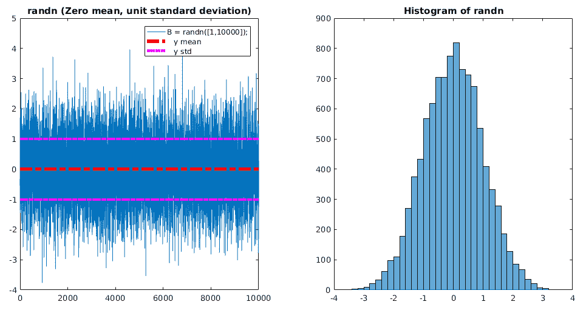

# Xavier-Bengio 和初始化器

在了解*训练深度前馈神经网络*的难度时，Xavier Glorot 和 Yoshua Bengio 表明，如果从均匀分布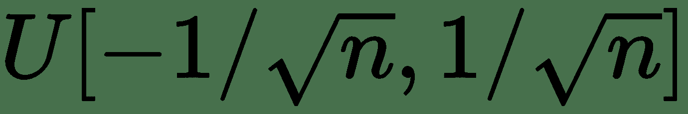初始化每一层的权重，其中是大小 在上一层中，对于乙状结肠激活函数，顶层（更靠近输出）的神经元迅速饱和为 0。我们知道，由于乙状结肠函数的形式，激活值 0 表示权重非常大，并且 反向传播的梯度接近零。 较小的梯度值会减慢学习过程，因为早期图层中的权重停止更新或停止学习。

因此，我们想要的是使权重在最初确定的时间间隔内均匀分布，也就是说，权重的方差应该在我们从底层移动到顶层时保持不变。 这将使错误平稳地流到顶层，从而使网络在训练期间收敛更快。

为了实现这一点，Glorot 和 Bengio 证明了对于单位导数为 0 的对称激活函数 f，每一层的权重方差必须如下：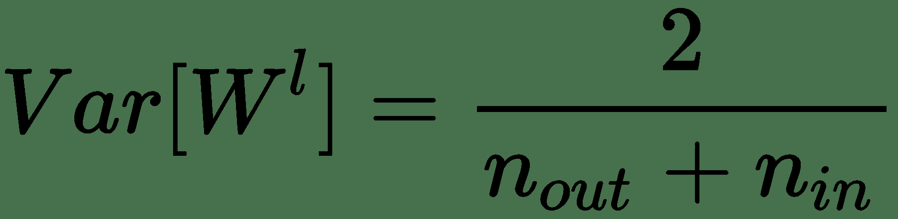

在此，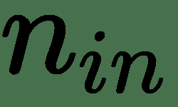是到所讨论的层的单元数，是在下一层的单元数。 这意味着权重必须从以下均匀分布中采样：

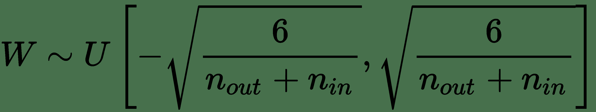

我们还可以从零均值和前面的方差的正态分布中采样权重。 对于 ReLu 激活功能，He 等人证明了这一点。 方差应该改为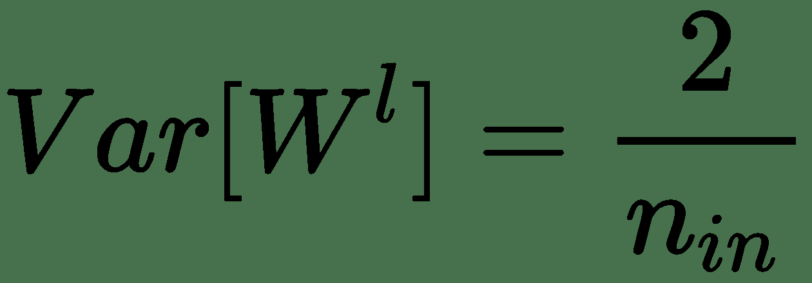。

因此，作者使用零均值高斯分布初始化其权重，其标准差（std）为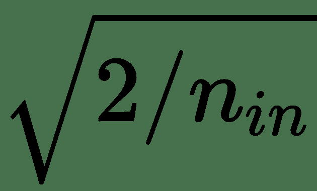。 然后将该初始化称为 He 初始化。

默认情况下，TensorFlow 的大部分`tf.layers`都使用 Glorot（xavier）初始化程序，但是我们可以覆盖它并指定我们自己的初始化。 在这里，我们展示了一个如何覆盖`conv2d`层的默认初始化器的示例：

```py
conv1 = tf.layers.conv2d(inputs=self.__x_, filters=64, kernel_size=[5, 5], 

                   padding="same", activation=None,  

kernel_initializer=tf.truncated_normal_initializer(stddev=0.01), 

bias_initializer=tf.zeros_initializer()) 
```

# 通过规范化来提高概括性

到目前为止，在本章中，我们已经看到了如何使用 TensorFlow 训练卷积神经网络来完成图像分类任务。 训练完模型后，我们将其遍历测试集，并从一开始就将其存储起来，以查看其在从未见过的数据上的性能如何。 在测试集上评估模型的过程向我们表明了在部署模型时模型将泛化的程度。 能够很好地概括的模型显然是理想的属性，因为它可以在许多情况下使用。

我们使用的 CNN 架构是可以提高模型泛化能力的方法之一。 要记住的一种简单技术是从设计模型开始就尽可能简单地使用很少的图层或滤镜。 由于非常小的模型很可能无法适应您的数据，因此您可以慢慢增加复杂性，直到不再发生适应不足的情况为止。 如果您以这种方式设计模型，则将限制过拟合的可能性，因为您不允许自己拥有的模型对于数据集而言过大。

但是，在本节中，我们将探索我们可以做的其他一些事情，以建立更好的机器学习模型，以及如何将它们纳入我们的训练过程中。 以下方法旨在防止过拟合，并通过这样做，有助于创建更强大的模型，并能更好地进行泛化。 防止模型过拟合的过程称为**正则化**。

另一个可能也会发生并且看起来与过拟合非常相似的问题是，如果您的训练数据集没有捕获您想要分类的所有事物。 例如，如果您正在训练狗分类器，但是您的训练图像仅包含贵宾犬的图像。 如果要在 Labradors 上测试此训练有素的分类器，则可能无法分类。 这种数据不平衡是一个单独的问题，将在后面的章节中解决。

# L2 和 L1 正则化

创建更强大模型的第一种方法是使用 L1 或 L2 正则化。 到目前为止，这些是最常见的正则化方法。 基本思想是在训练模型时，我们积极尝试使用这些权重的 L1 或 L2 范数对模型权重的值施加一些约束。

为此，我们在使用的任何损失函数中增加了一个额外的项。 对于 L1 正则化，我们添加的术语是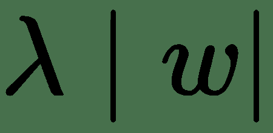，对于 L2 正则化，我们添加的术语是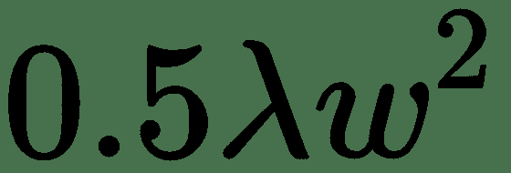。 在前面的术语中，是我们网络中的所有权重，是称为**正则化强度**的超参数。 通过添加该术语，我们可以防止权重值变得太大。

因此，用于[L1 正则化]的第 1 章，“TensorFlow 简介和设置”的 SVM 损失函数，即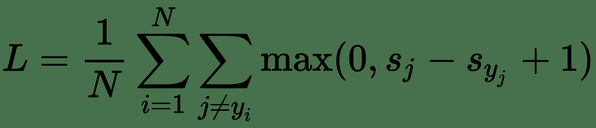变为：

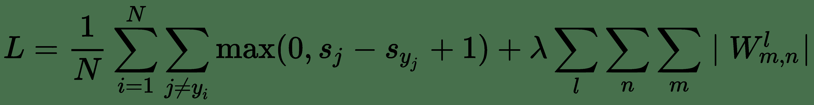

在这里，我们添加了对网络所有权重求和的正则化项。 此处，是层索引，是每一层的权重矩阵的索引。 L2 正则化的表达式看起来类似。

对于 L1 正则化，此额外项鼓励权重向量变得稀疏，这意味着许多权重值变为零。 结果，该模型变得不受噪声输入的影响，因为权重向量将仅使用重要输入的子集，这有助于避免过拟合。

对于 L2 正则化，除了保持权重之和较低之外，这个额外的项还强制权重值均匀分布在权重向量上，以便模型稍微使用所有权重，而不是大量使用权重。 由于输入和权重之间的乘法交互作用，从直觉上讲，这是一个理想的属性，可帮助模型避免过拟合。 L2 正则化有时也称为权重衰减； 这是因为在训练期间，您的所有权重都会因该项（L2 正则化项的导数）而线性减少或“衰减”。

请注意，在正则化期间我们不包括偏差项，而仅包括权重。 这是因为偏差项并不会真正影响模型的过拟合，因为它们以累加的方式影响输出，只是向上或向下移动而不是改变函数的形状。 包含它们没有害处，但是也没有好处，因此包含它们没有意义。

在下图中，您可能会注意到增加正则强度 lambda 会减少过拟合。 高正则化项意味着网络变得接近线性，并且无法塑造复杂的决策边界。

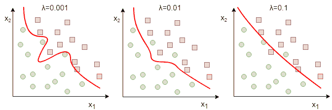

我们可以通过获取所有权重并对每个权重应用 l2 范数，然后将它们全部加在一起来手动实现 L2 / L1 正则化，但是这对于大型模型来说很快就变得很乏味。 幸运的是，如果我们使用`tf.layers`，那么 TensorFlow 中有一种更简单的方法。 首先，我们设置了正则化器，如下所示：

```py
l2_reg = tf.contrib.layers.l2_regularizer(scale=0.001) 
```

scale 参数是我们通常需要通过交叉验证找到并设置自己的 lambda。 如果将其设置为 0，则不会进行任何正则化。 现在，当我们创建任何图层时，我们会将正则化函数作为参数传递。 TensorFlow 将进行计算以获取我们需要添加到损失函数中的所有正则化项：

```py
# Example of adding passing regularizer to a conv layer.
 reg_conv_layer = tf.layers.conv2d( inputs, filters, kernel_size, kernel_regularizer=l2_reg) 
```

要添加我们的正则化术语，我们首先需要将它们全部收集起来。 幸运的是，TensorFlow 会自动为我们将所有正则化术语放到一个集合中，以便我们可以轻松访问它们。 TensorFlow 在`tf.GraphKeys`内存储一些与您创建的图相关的重要集合，例如可训练变量，汇总和正则化损失。 我们可以使用`tf.get_collection()`访问这些集合，并提供要获取的集合的名称。 例如，为了得到正则化损失，我们将编写以下内容：

```py
reg_losses = tf.get_collection(tf.GraphKeys.REGULARIZATION_LOSSES)
```

这将返回一个列表，其中包含此集合中存储的所有张量。

您也可以使用`tf.get_collection(key='my_collection')`创建自己的集合，然后使用`tf.add_to_collection(name='my_collection', value=some_variable_to_add)`向其中添加变量。 如果使用提供的键已存在一个集合，则`tf.get_collection`将返回该集合而不是创建它。

现在我们有了正则化损失项，我们可以像这样将它们添加到我们通常的训练损失中，然后优化组合损失：

```py
train_loss=[...]  # Training loss 

combined_loss = tf.n_add(train_loss, reg_losses)
```

# 退出

我们将要讨论的另一种用于正则化的技术是一种称为 Dropout 的东西。 辍学是由 G.E. Hinton 于 2012 年提出的，它是一种简单的正则化方法，可带来很好的效果。 辍学背后的想法是，在每次训练迭代中，一层中的所有神经元都可以以随机概率（通常为 50% ）打开和关闭。

这种打开和关闭迫使网络学习与往常相同的概念，但是要通过多个不同的路径。 训练后，所有神经元都保持打开状态，这些路径的行为就像是多个网络的集合，用于平均最终结果，从而提高了泛化能力。 它迫使权重分布在整个网络中，并且像正则化一样将权重保持在较低水平。

理解这个概念的另一种方法是建立一个由多个人共享相似知识的团队。 他们每个人都会对如何解决特定问题有自己的想法，这些经验的结合提供了解决问题的更好方法：

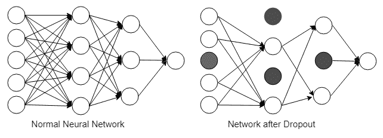

在下图中，我们显示了模型测试错误。 显然，通过辍学，测试集上的错误会减少。 请记住，与所有正则化一样，与不使用正则化相比，使用辍学会使您的训练损失增加，但是到最后，我们只对模型测试错误率降低（泛化）感兴趣：

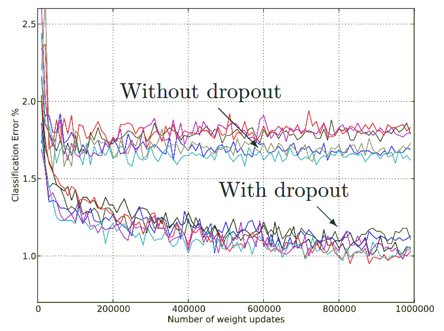

通常，辍学仅适用于全连接层，但也可以适用于卷积/池化层。 如果这样做，则将使用较低的`p`（掉线的可能性），接近 0.2。 同样，您将辍学层放置在激活层之后。

要在 TensorFlow 模型中使用 dropout，我们在希望将 dropout 应用到的输入层上调用`tf.layers.dropout()`。 我们还必须指定我们要使用的辍学率，更重要的是，使用布尔值让 TensorFlow 知道我们的模型是否在训练中。 请记住，当我们在测试时使用模型时，我们会关闭辍学，而这个布尔值将为我们做到这一点。 因此，带有辍学的代码将如下所示：

```py
# Fully connected layer (in tf contrib folder for now) 

fc1 = tf.layers.dense(fc1, 1024) 

# Apply Dropout (if is_training is False, dropout is not applied) 

fc1 = tf.layers.dropout(fc1, rate=dropout, training=is_training)
```

# 批处理规范层

之前，我们已经完成了权重的初始化工作，以使梯度下降优化器的工作更加轻松。 但是，好处仅在训练的早期阶段才能看到，并不能保证在后期阶段有所改善。 那就是我们转向另一个称为批处理规范层的伟大发明的地方。 在 CNN 模型中使用批处理规范层产生的效果与第 2 章，“深度学习和卷积神经网络”中看到的输入标准化大致相同。 现在唯一的区别是，这将在模型中所有卷积层和完全连接层的输出处发生。

批处理规范层通常将附加到每个完全连接或卷积层的末端，但是在激活功能之前，它将对层输出进行规范化，如下图所示。 它通过获取图层输出（一批激活）并减去批次平均值并除以批次标准差来执行此操作，因此图层输出具有零均值和单位标准差。 请注意，在激活函数之前或之后放置 batchnorm 是一个引起激烈争论的话题，但是两者都应该起作用。

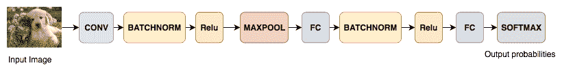

进行此标准化之后，批处理规范层还具有两个可学习的参数，这些参数将按比例缩放标准化的激活并将其转移到模型认为最有助于其学习的内容。 整个过程通过消除消失的梯度问题来帮助训练。 反过来，这又允许模型在训练时使用更高的学习率，因此可以减少迭代次数。

在训练过程中，记录平均值和标准差值的移动平均值。 然后在测试时使用这些值，而不是计算批次统计信息。

批处理规范层的一些优点如下：

*   改善梯度流动，允许训练更深层的网络（解决消失的梯度问题）
*   允许更高的学习率，使训练更快
*   减少对良好权重初始化的依赖（更简单的随机初始化）
*   给您的模型某种正则化效果
*   使得可以使用饱和非线性，例如 S 型

对于更多的数学读者，可以在批处理规范论文《批处理规范化：通过减少内部协变量偏移来加速深层网络训练》中找到更为正式的定义，这是一篇写得很好的论文，易于理解和解释。 更详细的概念。 如果假设我们有一个仅具有全连接层的简单神经网络，则正如我们在第 1 章，“TensorFlow 简介和设置”中所看到的，每一层的激活将是 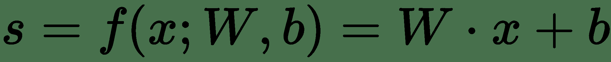表格。

假设是非线性的，例如 S 型或 ReLU，然后将批量归一化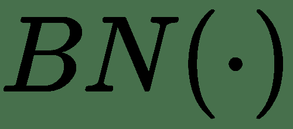直接应用于每个单元，例如：

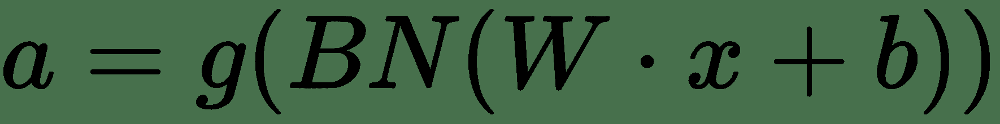

在这里，可以忽略偏差，因为它将通过均值减法消除。 如果我们的批次大小为，则标准化激活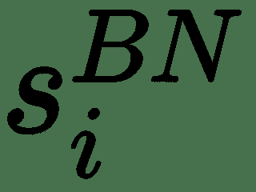的计算如下：

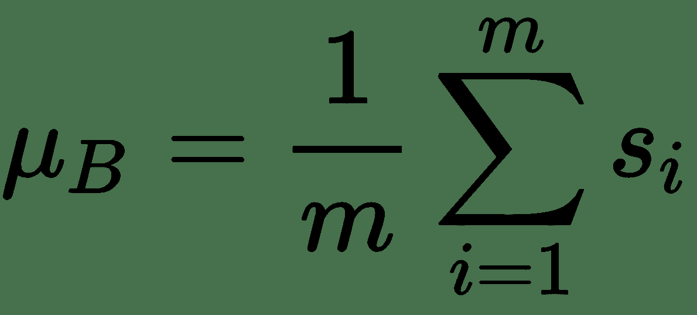

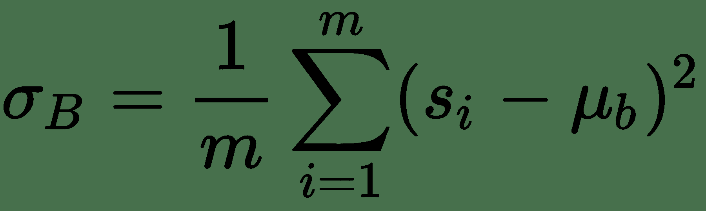

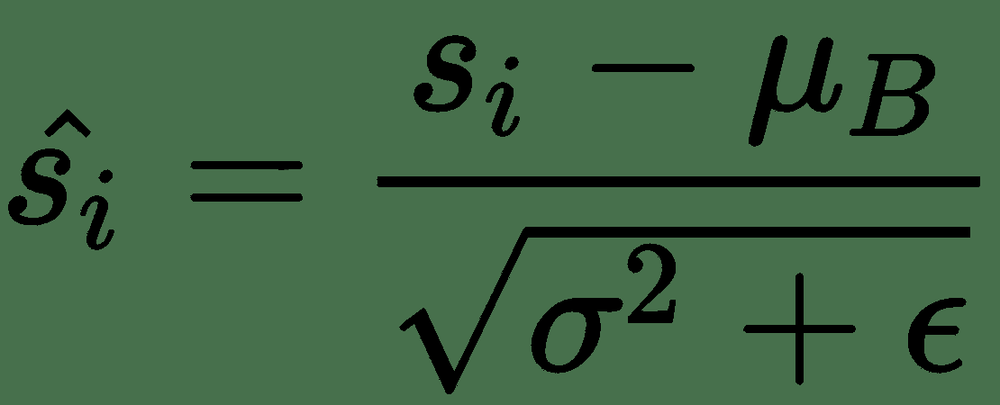

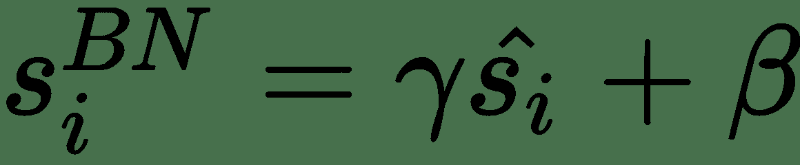

其中和是可学习的参数，它们将缩放并移动您的标准化激活。 网络可以使用这些参数来决定是否需要标准化以及需要多少标准化。 这是正确的，因为如果我们设置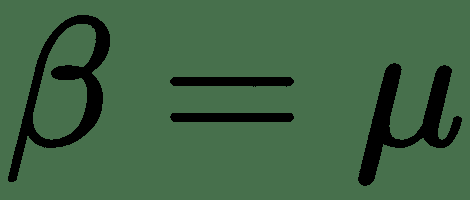和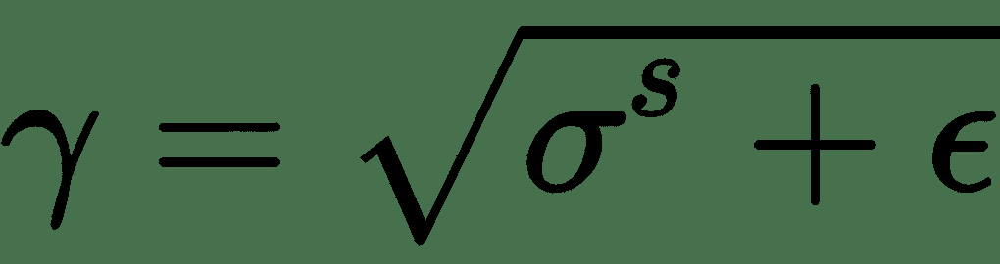，则设置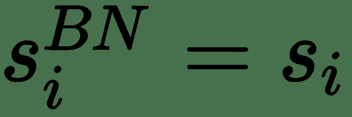。

最后，这是一个如何在本章开始的分类示例代码中使用批处理规范层的示例。 在这种情况下，我们将 batchnorm 层放在卷积层之后和激活函数之前：

```py
conv3 = tf.layers.conv2d(inputs=pool2, filters=32, kernel_size=[5, 5],padding="same", activation=None)
conv3_bn = tf.layers.batch_normalization(inputs=conv3, axis=-1, momentum=0.9, epsilon=0.001, center=True,scale=True, training=self.__is_training, name='conv3_bn')
conv3_bn_relu = tf.nn.relu(conv3_bn)
pool3 = tf.layers.max_pooling2d(inputs=conv3_bn_relu, pool_size=[2, 2], strides=2)
```

# 摘要

在本章中，我们了解了 CNN 模型的构建方式，包括使用哪些损失函数。 我们研究了 CIFAR 和 Imagenet 数据集，并了解了如何训练 CNN 来对 CIFAR10 数据集进行分类。 为此，我们被引入了 TensorFlow 数据 API，这使加载和转换数据的任务变得更加容易。 最后，我们讨论了通过谈论初始化和正则化的不同方法来提高训练模型的质量的方法。

在下一章中，我们将解决更困难的对象检测，语义和实例分割任务。