# 四、目标检测与分割

从上一章我们知道，当我们在输入图像中只有一个类的实例时，图像分类才真正处理这种情况。 即使那样，它也只能为我们提供粗略的输出，让我们知道图像中存在什么对象，但不知道它在哪里。 一个更有趣的情况是，当我们想查找一个类的所有实例，甚至多个不同的类在输入图像中的位置时。

为了解决这个更具挑战性的问题，需要进行对象检测和分割。 这些是计算机视觉领域，直到最近仍然非常具有挑战性。 然而，将卷积神经网络应用于这些问题近年来引起了很多关注，因此，在大多数情况下，现在可以考虑解决这些问题。 在本章中，我们将看到 CNN 如何很好地解决这些困难的任务。

下图显示了不同解决方案分段，定位，检测和实例分段之间的区别：

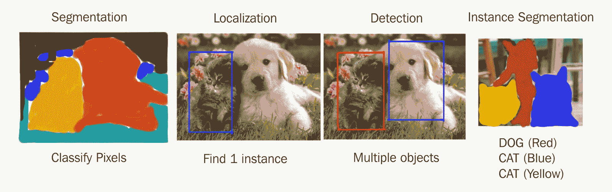

在开始讨论对象检测之前，我们需要了解另一个重要概念-定位。 它是改善分类和启用检测的关键构建块。 我们将看到这三个概念彼此密切相关，这是因为我们从图像分类到具有定位的分类，最后是对象检测。

在本章中，我们将学习以下有趣的主题：

*   图像分类与定位
*   物体检测
*   语义分割
*   实例细分
*   如何构建卷积神经网络来执行所有这些任务

# 图像分类与定位

在上一章学习了图像分类之后，我们现在知道对图像进行分类时，我们只是试图在该图像内输出对象的类标签。 通常，为了简化任务，图像中将只有一个对象。

展望未来，在许多情况下，我们也有兴趣在图像中找到对象的位置。 定位对象这一任务的名称称为**定位**。 在这种情况下，我们要产生的输出是围绕对象的盒子的坐标。 此框的名称是边界框或边界矩形。 关于定位的重要细节是，每个图像只能定位一个对象。

当我们建立一个负责预测类别标签以及感兴趣对象周围的边界框的模型时，称为带有局部化的**图像分类**。

# 作为回归的定位

可以使用与我们在第 3 章， “TensorFlow 中的图像分类”中了解的网络架构相似的网络架构来实现定位。

除了预测类标签外，我们还将输出一个标志，指示对象的存在以及对象边界框的坐标。 边界框坐标通常是四个数字，分别代表左上角的`x`和`y`坐标，以及框的高度和宽度。

例如，在这种情况下，我们有两个类别（C1（汽车）和 C2（人））进行预测。 我们网络的输出如下所示：

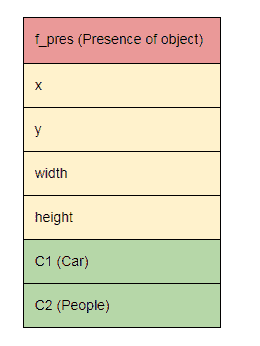

该模型的工作原理如下：

1.  我们将输入图像输入到 CNN。
2.  CNN 产生一个特征向量，该特征向量被馈送到三个不同的 FC 层。 这些不同的 FC 层（或负责人）中的每一个都将负责预测不同的事物：对象存在，对象位置或对象类。
3.  训练中使用了三种不同的损失：每个头部一个。
4.  计算当前训练批次的比率，以权衡给定物体的存在对分类和位置损失的影响。 例如，如果批次中只有 10% 的物体图像，那么这些损失将乘以 0.1。

提醒一下：输出数字（即 4 个边界框坐标）称为**回归**。

请注意，分类和回归之间的重要区别是分类时，我们获得离散/分类输出，而回归提供连续值作为输出。 我们在图中显示模型如下：

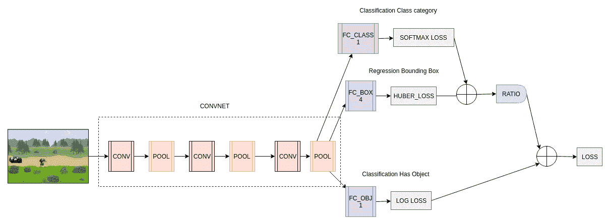

从图中可以清楚地看到三个全连接层，每个层都输出不同的损失（状态，类和框）。 使用的损失是逻辑回归/对数损失，交叉熵/ softmax 损失和 Huber 损失。 胡贝尔损失是我们从未见过的损失。 这是用于回归的损失，是 L1 和 L2 损失的一种组合。

局部化的回归损失给出了图像中对象的真实情况边界框坐标与模型预测的边界框坐标之间的某种相似度度量。 我们在这里使用 Huber 损失，但是可以使用各种不同的损失函数，例如 L2，L1 或平滑 L1 损失。

分类损失和局部损失被合并并通过标量比加权。 此处的想法是，如果首先存在一个对象，则我们只对反向传播分类和边界框损失感兴趣。

此模型的完整损失公式如下：

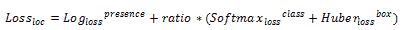

# TensorFlow 实现

现在，我们将介绍如何在 TensorFlow 中实现这种模型。 它与分类模型极为相似，不同之处在于，我们在末尾有多个输出层而不是只有一个，并且每个层都有自己的损失函数：

```py
def build_graph(self): 
   self.__x_ = tf.placeholder("float", shape=[None, 240, 320, 3], name='X') 
   self.__y_box = tf.placeholder("float", shape=[None, 4], name='Y_box') 
   self.__y_obj = tf.placeholder("float", shape=[None, 1], name='Y_obj') 
   # Training flag for dropout in the fully connected layers 
   self.__is_training = tf.placeholder(tf.bool) 

   with tf.name_scope("model") as scope: 
       conv1 = tf.layers.conv2d(inputs=self.__x_, filters=32, kernel_size=[5, 5], padding="same", activation=tf.nn.relu) 
       pool1 = tf.layers.max_pooling2d(inputs=conv1, pool_size=[2, 2], strides=2) 
       conv2 = tf.layers.conv2d(inputs=pool1, filters=64, kernel_size=[5, 5], padding="same", activation=tf.nn.relu) 
       pool2 = tf.layers.max_pooling2d(inputs=conv2, pool_size=[2, 2], strides=2) 
       conv3 = tf.layers.conv2d(inputs=pool2, filters=32, kernel_size=[5, 5], padding="same", activation=tf.nn.relu) 
       pool3 = tf.layers.max_pooling2d(inputs=conv3, pool_size=[2, 2], strides=2) 
       pool3_flat = tf.reshape(pool3, [-1, 40 * 30 * 32]) 

       # 2 Head version (has object head, and bounding box) 
       self.__model_box = tf.layers.dense(inputs=pool3_flat, units=4) 
       self.__model_has_obj = tf.layers.dense(inputs=pool3_flat, units=1, activation=tf.nn.sigmoid) 

   with tf.name_scope("loss_func") as scope: 
       loss_obj = tf.losses.log_loss(labels=self.__y_obj, predictions=self.__model_has_obj) 
       loss_bbox = tf.losses.huber_loss(labels=self.__y_box, predictions=self.__model_box) 
       # Get ratio of samples with objects 
       batch_size = tf.cast(tf.shape(self.__y_obj)[0], tf.float32) 
       num_objects_label = tf.cast(tf.count_nonzero(tf.cast(self.__y_obj > 0.0, tf.float32)), tf.float32) 
       ratio_has_objects = (num_objects_label * tf.constant(100.0)) / batch_size 
       # Loss function that has an "ignore" factor on the bbox loss when objects is not detected 
       self.__loss = loss_obj + (loss_bbox*ratio_has_objects) 
       # Add loss to tensorboard 
       tf.summary.scalar("loss", self.__loss) 
       tf.summary.scalar("loss_bbox", loss_bbox) 
       tf.summary.scalar("loss_obj", loss_obj) 

   with tf.name_scope("optimizer") as scope: 
       self.__train_step = tf.train.AdamOptimizer(1e-4).minimize(self.__loss) 

   # Merge op for tensorboard 
   self.__merged_summary_op = tf.summary.merge_all() 

   # Build graph 
   init = tf.global_variables_initializer() 

   # Saver for checkpoints 
   self.__saver = tf.train.Saver(max_to_keep=None) 

   # Avoid allocating the whole memory 
   gpu_options = tf.GPUOptions(per_process_gpu_memory_fraction=0.6) 
   self.__session = tf.Session(config=tf.ConfigProto(gpu_options=gpu_options)) 
   # Configure summary to output at given directory 
   self.__writer = tf.summary.FileWriter("./logs/loc_logs", self.__session.graph) 
   self.__session.run(init) 
```

# 定位的其他应用

使用 CNN 在图像中输出兴趣点坐标的想法可以扩展到许多其他应用程序。 其中一些包括人体姿势估计（《DeepPose：通过深度神经网络进行人体姿势估计》），如下所示：

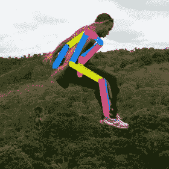

为训练图像中的对象定义了关键点/地标。 对于所有训练图像中的特定对象，这些关键点位置必须一致。

例如，在面部关键点检测中，比如说我们有兴趣定位眼睛，鼻子和嘴巴，我们必须在所有训练面部图像的眼睛，鼻子和嘴巴周围定义多个关键点。 然后，就像前面的图像一样，我们训练 CNN 以输出预测的关键点位置，然后对这些输出关键点坐标应用回归损失以训练 CNN。 在测试时，将输入图像馈入 CNN 以预测所有关键点位置。 下图显示了面部关键点检测：

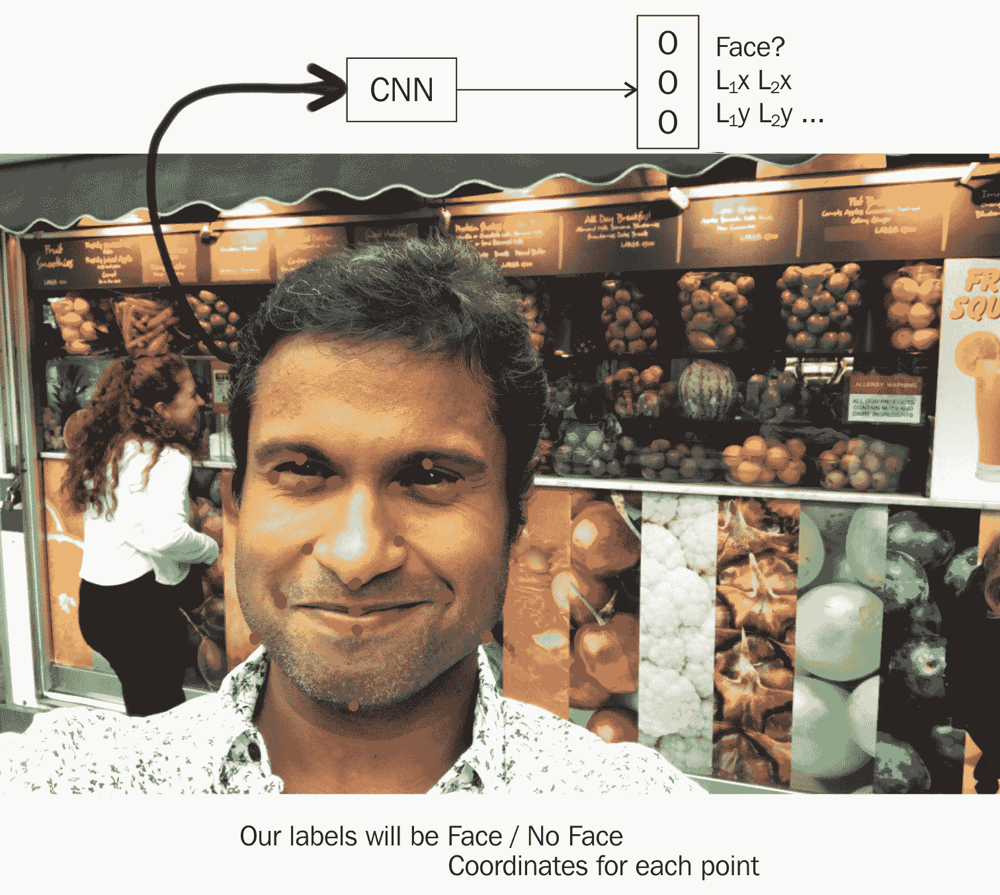

# 作为分类的对象检测 – 滑动窗口

对象检测与定位是一个不同的问题，因为我们可以在图像中包含数量可变的对象。 因此，如果我们将检测视为像定位一样简单的回归问题，处理可变数量的输出将变得非常棘手。 因此，我们将检测视为分类问题。

长期使用的一种非常常见的方法是使用滑动窗口进行对象检测。 想法是在输入图像上滑动固定大小的窗口。 然后，将窗口中每个位置的内容发送到分类器，该分类器将告诉我们该窗口是否包含感兴趣的对象。

为此，人们可以首先训练一个 CNN 分类器，其中包含我们想要检测的物体的小幅裁剪图像-调整大小与窗口大小相同。 汽车。 在测试时，固定大小的窗口会在要检测对象的整个图像中以滑动的方式移动。然后，我们的 CNN 会为每个窗口预测是否是一个对象（在这种情况下是汽车）。

仅使用一种尺寸的滑动窗口，我们只能检测一种尺寸的对象。 因此，要查找更大或更小的对象，我们还可以在测试时使用更大或更小的窗口，并在将其发送到分类器之前调整内容的大小。 或者，您可以调整整个输入图像的大小，并仅使用一个尺寸的滑动窗口，该窗口也将在这些调整大小的图像上运行。 两种方法都可以使用，但其想法是产生所谓的“比例尺金字塔”，以便我们可以检测图像中不同尺寸的物体。

这种方法的最大缺点是，各种比例的大量窗口可能会通过 CNN 进行预测。 这使得将 CNN 用作分类器在计算上非常昂贵。 同样对于大多数这些窗口，它们将始终不包含任何对象。

为了克服这个问题，已经进行了许多改进。 在以下各节中，我们将介绍为解决该问题而创建的各种技术和算法，以及较之以前的技术和算法如何进行了改进。

# 使用启发式技术指导我们（R-CNN）

为了避免在输入图像上每个可能的位置（大多数都不会包含对象）运行分类器，我们可以使用一些外部方法向我们建议可能的区域。 一种可以做到这一点的方法称为**选择搜索**。

区域提议方法将在图像中提供类似斑点的矩形​​区域，这些区域可能包含感兴趣的对象。 这些区域是存在感兴趣对象的候选区域。 然后，仅将 CNN 分类器应用于这些建议的区域。 与滑动窗口方法相比，这大大减少了发送到 CNN 进行分类的农作物的数量。

该特定方法在 2013 年提出，并被称为 *R-CNN：区域 CNN*。 下图描述了 R-CNN 的过程：

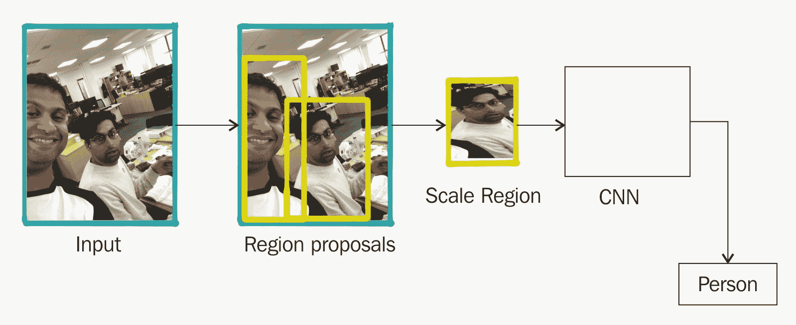

# 问题

R-CNN 在计算上仍然很昂贵，因为您必须对大约 2,000 个单独的区域候选运行 CNN。 结果，训练和测试都非常慢。 CNN 分类器依赖于通过选择性搜索进行检测而生成的固定数量的矩形候选窗口。 这种方法并不是最快的方法，而且由于无法从训练数据中了解候选区域，因此它们可能不是针对任务的最佳选择。

# Fast R-CNN

2015 年，提出了快速 R-CNN 来解决 R-CNN 的速度问题。 在此方法中，主要的变化是我们在管道中获取投标区域的位置。 首先，我们通过 CNN 运行整个输入图像，而不是从输入图像中直接获取它们，并提取靠近网络末端的生成的特征图。 接下来，再次使用区域提议方法，以与 R-CNN 类似的方式从该特征图中提取候选区域。

以这种方式获取建议有助于重用和共享昂贵的卷积计算。 网络中位于网络下方的全连接层将分类并另外定位，仅接受固定大小的输入。 因此，使用称为 **RoI 池**的新层将特征图中建议的区域扭曲为固定大小（在下一节中进一步讨论）。 RoI 池会将区域大小调整为最后一个 FC 层所需的大小。 下图显示了整个过程：

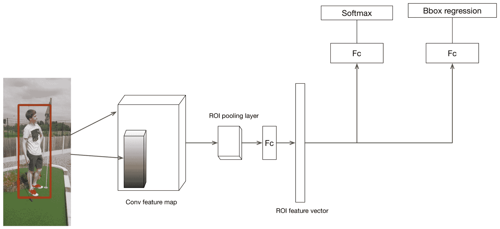

R-CNN 与 FastRCNN 的比较表明，后者在训练时快约 10 倍，而在测试时快约 150 倍（使用 VGG 架构作为主要 CNN 时）。

# Faster R-CNN

这项技术在 2015 年 Fast R-CNN 之后不久提出，解决了使用外部区域建议方法的需求，并消除了与之相关的计算成本。

该算法的主要区别在于，不是使用外部算法（例如选择性搜索）来创建候选，而是使用称为**区域候选网络**（**RPN**）的子网为我们学习并提出建议。 在此屏幕快照中显示：

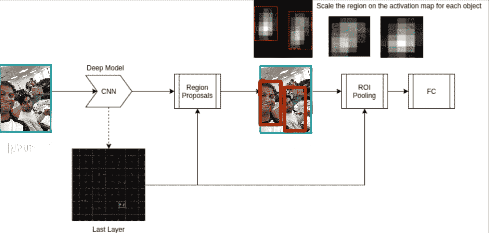

# 区域候选网

RPN 的工作是预测我们称为锚点的对象（本质上只是一个边界框）是否包含对象或仅是背景，然后完善此边界框的位置。

基本上，RPN 通过在最后一个 CNN 特征图上滑动一个小窗口（`3 x 3`）来做到这一点（同一特征图 Fast R-CNN 从中获得建议）。 对于每个滑动窗口中心，我们创建`k`固定锚框，并将这些框分类为是否包含对象：

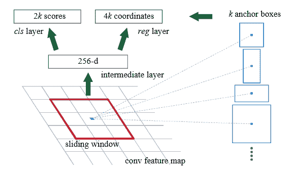

在内部，在训练过程中，我们选择 IoU 最大的锚定边界框和真实情况边界框进行反向传播。

# RoI 池化层

RoI 池层只是最大池的一种，池的大小取决于输入的大小。 这样做可以确保输出始终具有相同的大小。 使用该层是因为全连接层始终期望输入大小相同，但是 FC 层的输入区域可能具有不同的大小。

RoI 层的输入将是建议和最后的卷积层激活。 例如，考虑以下输入图像及其建议：


这里，我们有一个表格，总结了方法之间的差异：

|  | **R-CNN** | **Fast R-CNN** | **Faster R-CNN** |
| --- | --- | --- | --- |
| 每个图像的测试时间 | 50 秒 | 2 秒 | 0.2 秒 |
| 加速 | 1 倍 | 25 倍 | 250 倍 |
| 准确性 | 66% | 66.9% | 66.9% |

# 将传统的 CNN 转换为全卷积网络

对于有效的对象检测器而言，非常重要的一点是提高卷积，从而提高计算的重用性​​。 为此，我们将所有 FC 层转换为卷积层，如下图所示。

以这种方式实现我们的网络的目的是，他们可以使用比其最初设计的图像更大的图像作为输入，同时共享计算以使其效率更高。 将所有 FC 层都转换为卷积层的这种类型的网络的名称称为完全卷积网络（FCN）。

将 FC 层转换为卷积层的基本技术是使用与输入空间尺寸一样大的内核大小，并使用过滤器数来匹配 FC 层上的输出数。 在此示例中，我们期望输入图像为`14x14x3`。

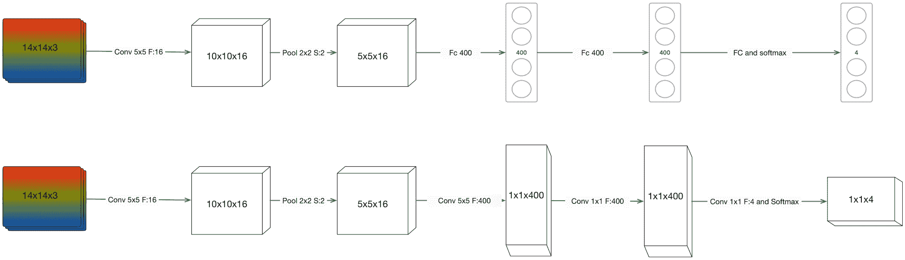

以我们为例，用`100 x 100`的输入补丁训练一个全卷积网络，并用`2,000 x 2,000`的输入图像进行测试，结果将是在`2000 x 2000`图像上运行`100 x 100`的滑动窗口 。 当使用较大的输入体积（如本例中所示）时，FCN 的输出将是一个体积，其中每个单元格对应于原始输入图像上`100x100`窗口补丁的一张幻灯片。

现在，每次我们使用比原始训练输入大的输入图像时，效果都将像我们实际上在整个图像上滑动分类器，但计算量却减少了。 通过这种方式，我们通过 CNN 的前向传递一步一步地使滑动窗口卷积：

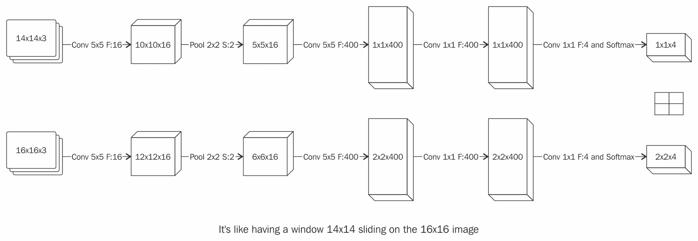

# 单发检测器 – 您只看一次

在本节中，我们将继续介绍一种稍有不同的对象检测器，称为单发检测器。 单发检测器尝试将对象检测伪装为回归问题。 此类别下的主要架构之一是 YOLO 架构（您只看一次），我们现在将对其进行详细介绍。

YOLO 网络的主要思想是在不使用任何滑动窗口的情况下优化输入图像中各个位置的预测计算。为实现此目的，网络以大小为`N x N`单元格的网格形式输出特征图。

每个单元格都有`B * 5 + C`条目。 其中`B`是每个单元格的边界框的数量，`C`是类概率的数量，而 5 是每个边界框的元素（`x, y`：边界框相对于其所在单元格的中心点坐标， `w`是相对于原始图像的边界框的宽度， `h`是相对于原始图像的边界框的高度，置信度：边界框中对象存在的可能性）。

我们将置信度得分定义为：

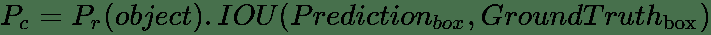

如果单元格中没有对象，则将为零。 否则将等于真实情况框与预测框之间的 IOU。

请注意，网格的每个单元格都负责预测固定数量的边界框。

下图描述了作为 YOLO 网络输出的单元格条目的样子，它预测了形状的张量`(N, N, B * 5 + C)`。 网络的最后一个卷积层将输出与栅格尺寸相同大小的要素图。

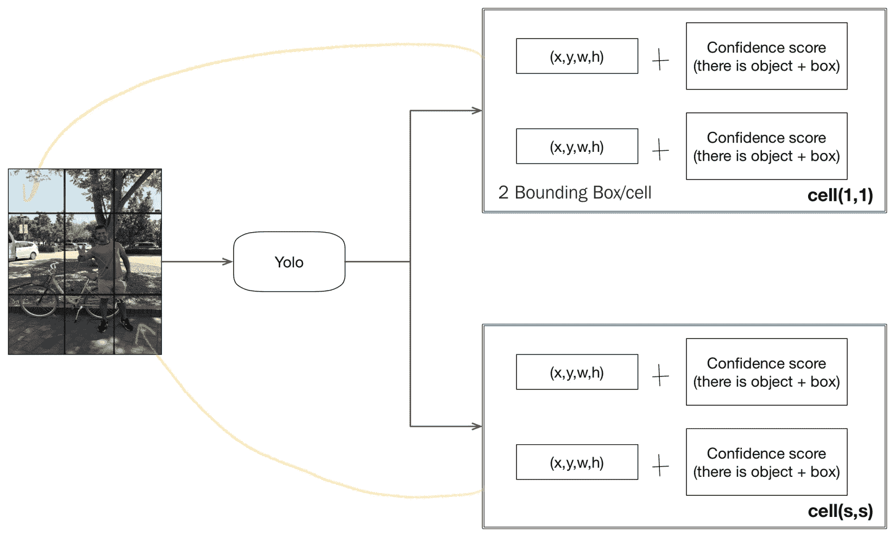

中心坐标以及边界框的高度和宽度在`[0, 1]`之间进行归一化。 下图显示了如何计算这些坐标的示例：

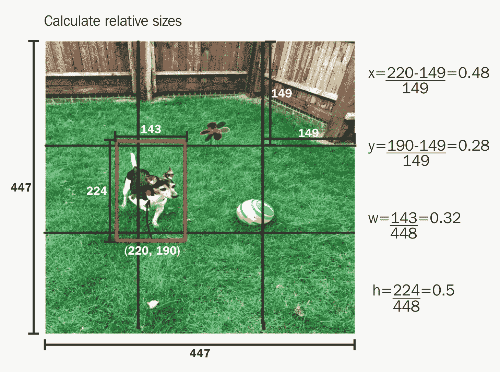

网络为每个单元格预测类别概率，边界框和这些框的置信度。

实际的 YOLO 网络具有 24 个卷积层，其后是 2 个全连接层。 但是，Fast YOLO 网络是 9 层，如下所示：

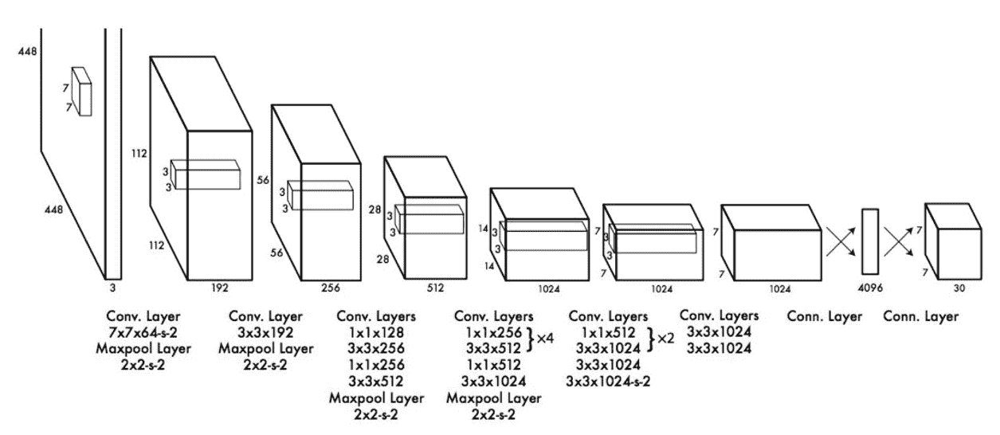

另一个重要的一点是，即使每个对象似乎位于多个像元上，也将单独将其分配给一个栅格像元（基于此中心和像元距离）。

目前，我们可以想象在图像上可以检测到的对象数量将是网格大小。 稍后，我们将看到如何处理每个网格单元的多个对象。 （锚盒）

# 创建用于 Yolo 对象检测的训练集

为了创建 YOLO 的训练集，将与 YOLO 网络的输出特征图预测相同大小的网格放置在每个训练输入图像上。 对于网格中的每个像元，我们创建一个目标向量`Y`，其长度为`B * 5 + C`（即与上一节中的输出特征图网格像元大小相同）。

让我们以训练图像为例，看看如何为图像上的网格中的单元创建目标向量：

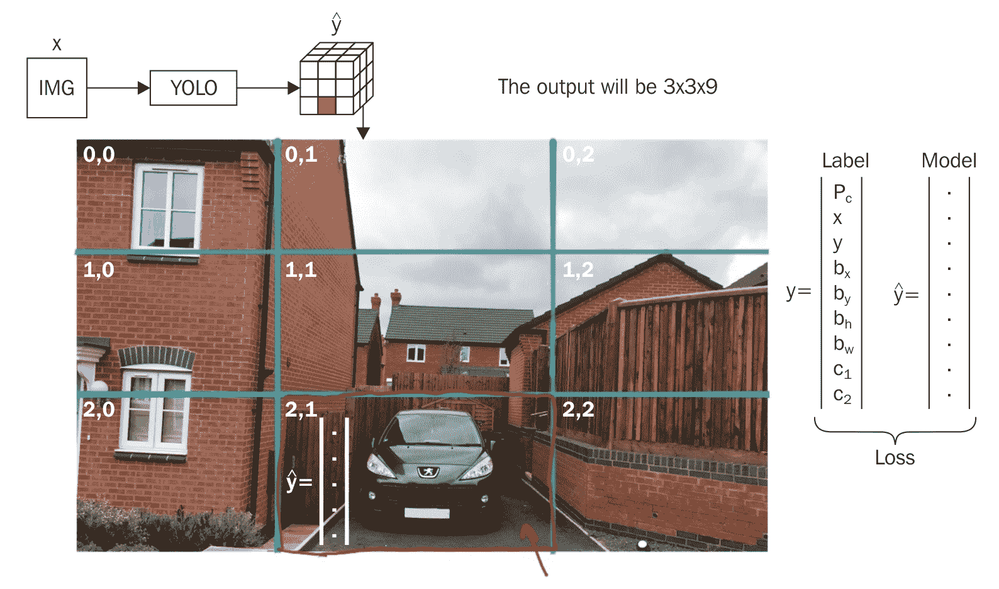

在上图中，考虑我们根据对象中心的最短距离来选择单元（在图像中，后车的中心最靠近绿色单元）。 如果我们看一下上面的训练图像，我们会注意到感兴趣的对象仅存在于一个单元格编号为 8 的单元格中。其余的单元格 1-7 和 9 没有任何感兴趣的对象。 每个单元的目标向量将具有 16 个条目，如下所示：

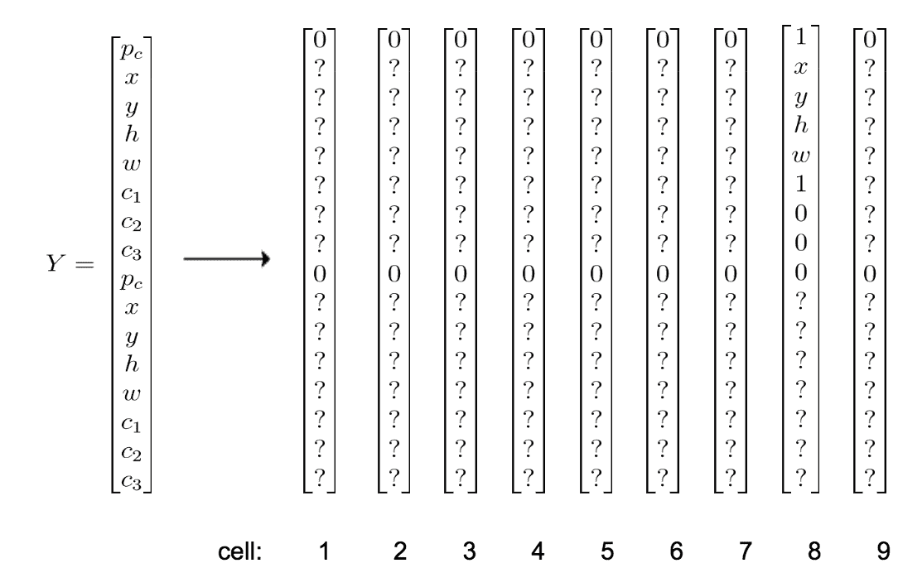

第一个条目是类别`P[c]`存在的置信度得分，对于没有对象的单元格中的两个锚定框，该得分均为 0。 其余值将*无关*。 单元格编号 8 有一个对象，并且对象的边界框具有较高的 IOU。

对于大小为`NxM`的输入训练图像，训练后从卷积网络输出的目标向量的最终体积将为`3x3x16`（在此玩具示例中）

数据集中每个图像的标签信息将仅包括对象的中心坐标及其边界框。 实现代码以使其与网络的输出向量相匹配是您的责任； 这些任务包括以下所列的任务：

1.  将每个中心点的图像空间转换为网格空间
2.  将图像空间上的边界框尺寸转换为网格空间尺寸
3.  查找图像空间上最接近对象的单元格

如果我们将每个单元格类别的概率乘以每个边界框的置信度，我们将获得一些可以用另一种算法（非最大值抑制）过滤的检测结果。

让我们将置信度定义为反映单元格上任何类对象是否存在的事物。 （请注意，如果单元格上没有对象，则置信度应为零，如果有对象，则置信度应为 IoU）：

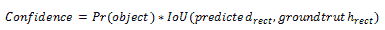

我们还需要定义一个条件类别概率； 给定对象`P(class | Pr)`的存在，我们想要这样做是因为我们不希望损失函数在单元格上没有对象的情况下惩罚错误的类预测。 该网络仅预测每个单元格的一组类别概率，而不考虑框数`B`。

# 评估检测（交并比）

在继续进行之前，我们需要知道如何衡量我们的模型是否正确检测到物体。 为此，我们计算会返回一个数字的交并比（IoU），根据某个参考（真实情况）告诉我们检测的效果如何。 IoU 的计算方法是：将检测和地面真理框彼此重叠的区域除以检测和地面真理框所覆盖的总面积：

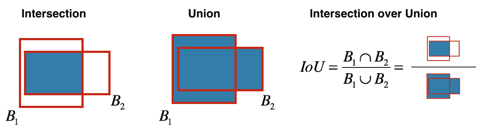

这是一个糟糕，良好和出色的 IoU 的示例：


按照惯例，如果 IoU 大于 0.5，我们认为这两个方框都匹配，并且在这种情况下，检测为真阳性。

IoU 为零表示框不相交，IoU 为 1 表示完美匹配。

在我们的检测器上，如果一个单元有多个锚定框，则 IoU 会帮助选择哪个对目标负责。我们选择具有最高实测值的 IoU 最高的锚定。

这是 IoU 的 Python 代码：

```py
def iou_non_vectorized(box1, box2): 
   # If one of the rects are empty return 0 (No intersect) 
   if box1 == [] or box2 == []: 
       return 0 

   # size of intersect divided by size of union of 2 rects 
   # Get rectangle areas format (left,top,right,bottom) 
   box_1_area = (box1[2] - box1[0] + 1) * (box1[3] - box1[1] + 1) 
   box_2_area = (box2[2] - box2[0] + 1) * (box2[3] - box2[1] + 1) 

   # Get the intersection coordinates (x1,y1,x2,y2) 
   intersect_x1 = max(box1[0], box2[0]) 
   intersect_y1 = max(box1[1], box2[1]) 
   intersect_x2 = min(box1[2], box2[2]) 
   intersect_y2 = min(box1[3], box2[3]) 

   # Calculate intersection area 
   intersect_area = (intersect_x2 - intersect_x1 + 1) * (intersect_y2 - intersect_y1   
    + 1) 

   return intersect_area / float(box_1_area + box_2_area - intersect_area) 

We can also change this to a vectorized form on Tensorflow 
def tf_iou_vectorized(self, box_vec_1, box_vec_2): 
   def run(tb1, tb2): 
       # Break the boxes rects vector in sub-vectors 
       b1_x1, b1_y1, b1_x2, b1_y2 = tf.split(box_vec_1, 4, axis=1) 
       b2_x1, b2_y1, b2_x2, b2_y2 = tf.split(box_vec_2, 4, axis=1) 

       # Get rectangle areas format (left,top,right,bottom) 
       box_vec_1_area = (b1_x2 - b1_x1 + 1) * (b1_y2 - b1_y1 + 1) 
       box_vec_2_area = (b2_x2 - b2_x1 + 1) * (b2_y2 - b2_y1 + 1) 

       xA = tf.maximum(b1_x1, tf.transpose(b2_x1)) 
       yA = tf.maximum(b1_y1, tf.transpose(b2_y1)) 
       xB = tf.minimum(b1_x2, tf.transpose(b2_x2)) 
       yB = tf.minimum(b1_y2, tf.transpose(b2_y2)) 

       interArea = tf.maximum((xB - xA + 1), 0) * tf.maximum((yB - yA + 1), 0) 

       iou = interArea / (box_vec_1_area + tf.transpose(box_vec_2_area) - interArea) 

       return iou 

   op = run(self.tf_bboxes1, self. tf_bboxes2) 
   self.sess.run(op, feed_dict={self.tf_bboxes1: box_vec_1, self.tf_bboxes2: box_vec_2}) 
   tic = time() 
   self.sess.run(op, feed_dict={self.tf_bboxes1: box_vec_1, self.tf_bboxes2: box_vec_2}) 
   toc = time() 
   return toc - tic 

```

我们也可以在 TensorFlow 上将其更改为矢量化形式，如下所示：

```py
def tf_iou_vectorized(self, box_vec_1, box_vec_2):
  def run(tb1, tb2):
      # Break the boxes rects vector in sub-vectors
      b1_x1, b1_y1, b1_x2, b1_y2 = tf.split(box_vec_1, 4, axis=1)
      b2_x1, b2_y1, b2_x2, b2_y2 = tf.split(box_vec_2, 4, axis=1)
 # Get rectangle areas format (left,top,right,bottom)
      box_vec_1_area = (b1_x2 - b1_x1 + 1) * (b1_y2 - b1_y1 + 1)
      box_vec_2_area = (b2_x2 - b2_x1 + 1) * (b2_y2 - b2_y1 + 1)
      xA = tf.maximum(b1_x1, tf.transpose(b2_x1))
      yA = tf.maximum(b1_y1, tf.transpose(b2_y1))
      xB = tf.minimum(b1_x2, tf.transpose(b2_x2))
      yB = tf.minimum(b1_y2, tf.transpose(b2_y2))
      interArea = tf.maximum((xB - xA + 1), 0) * tf.maximum((yB - yA + 1), 0)
      iou = interArea / (box_vec_1_area + tf.transpose(box_vec_2_area) - interArea)
      return iou
  op = run(self.tf_bboxes1, self. tf_bboxes2)
  self.sess.run(op, feed_dict={self.tf_bboxes1: box_vec_1, self.tf_bboxes2: box_vec_2})
  tic = time()
  self.sess.run(op, feed_dict={self.tf_bboxes1: box_vec_1, self.tf_bboxes2: box_vec_2})
  toc = time()
  return toc - tic
```

# 过滤输出

实际上，您的模型通常会返回同一对象的多个检测窗口。 为了解决这个问题，我们使用一种称为非最大抑制的算法。 该算法使用“IoU 和对象的存在”作为启发式过滤这些多个框。 运作方式如下：

1.  丢弃所有包含物体的可能性低的框（`pc < 0.6`）
2.  选择最有可能出现物体的盒子（标签上的`pc`）
3.  丢弃与所选框高度重叠的所有框（`IoU > 0.5`）
4.  重复步骤 2 和 3，直到所有检测都被放弃或选择为止

我们将在检测器的预测时间上使用非最大抑制：

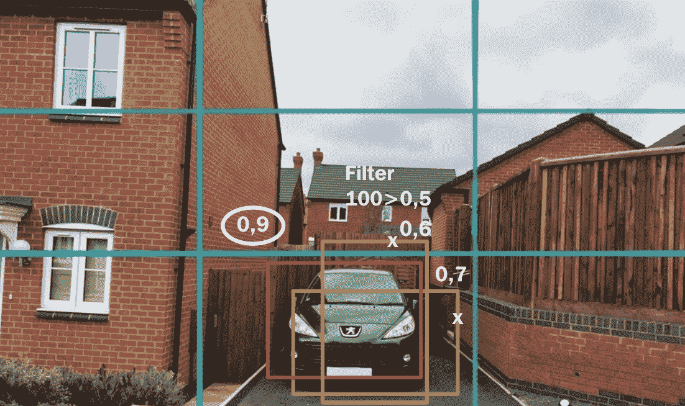

Tensorflow 已经具有实现非最大值抑制算法的功能，称为`tf.image.non_max_suppression`。

# 锚框

锚框预定义的模板框，具有一定的高宽比。 这些在 YOLO 中用于帮助检测单个网格单元中的多个对象。 我们根据可以检测到的物体类型的大致几何形状定义盒子的形状。

目前，正如所解释的，我们的模型将只能在每个网格单元中检测到一个对象，但是在大多数情况下，每个网格中可能有多个对象。 请记住，我们认为最靠近对象的像元是中心：

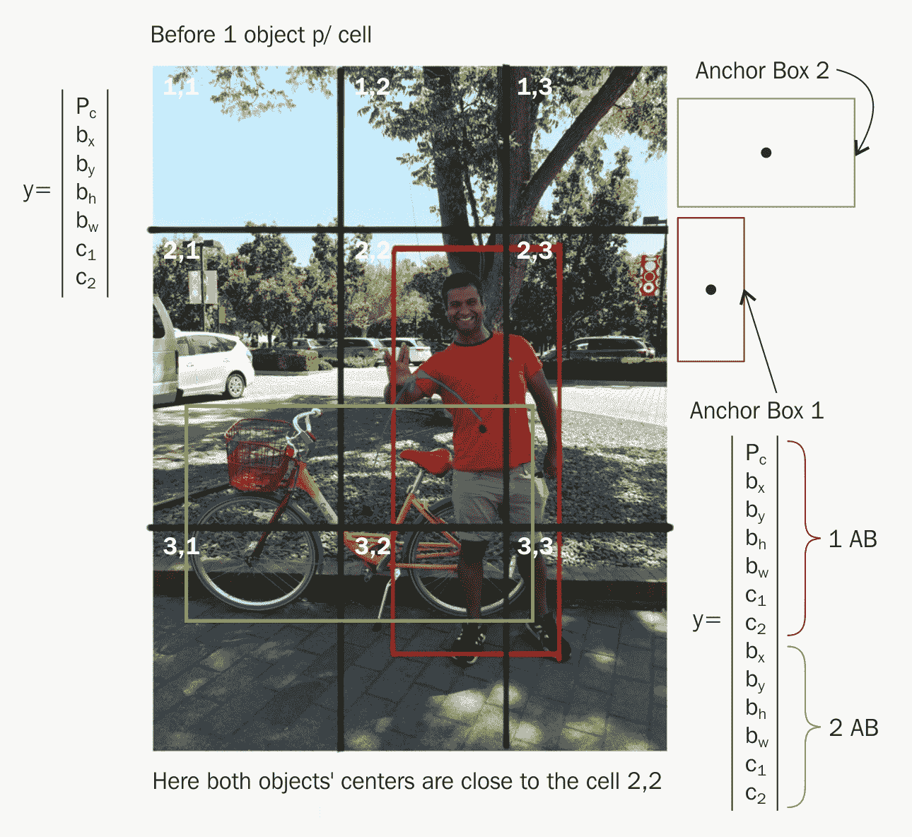

为了解决这个问题，我们需要锚点。 基本上，我们将在输出深度体积中添加预定义的边界框； 然后，在训练过程中，我们选择中心最接近特定单元格的对象，并选择与锚框具有最大 IoU 的边界框。 实际上，由于多个子网将负责在同一单元中查找其他对象，因此，锚定框的想法使网络更好地概括了检测范围。

# 在 Yolo 中进行测试/预测

现在将先前汽车图像中的图像视为我们的测试图像。 每个像元的预测向量的输出为：

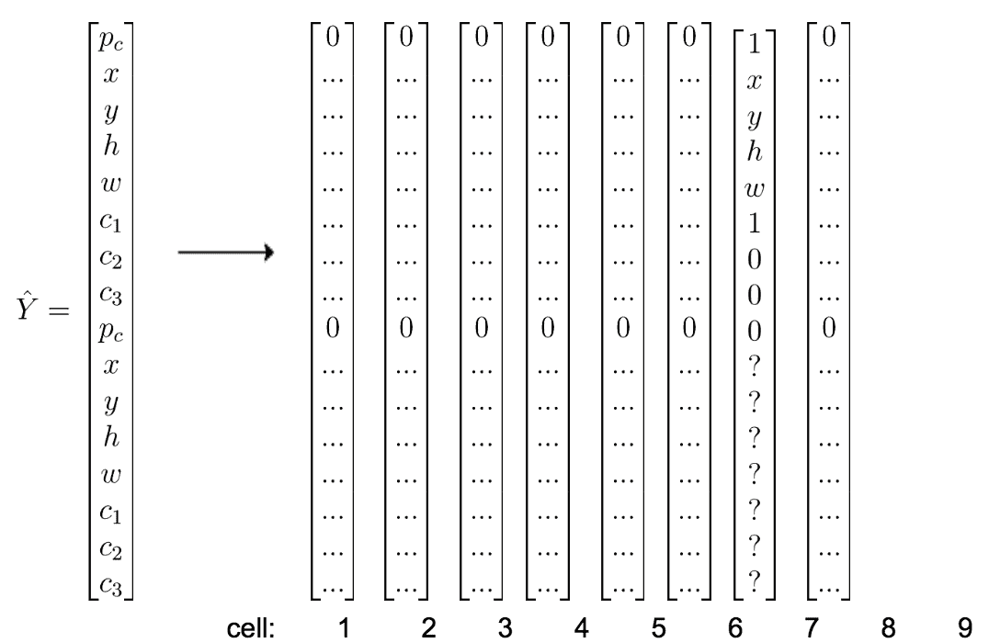

请注意，`...`条目表示即使对于没有对象的单元格，预测向量中也会有一些随机值。 但是，在单元格 8 中，`x, y, h, w`的预测值有望接近准确。

在最后阶段，我们可以使用非最大值抑制算法过滤每个像元中的多个预测边界框。

# 检测器损失函数（YOLO 损失）

作为定位器，YOLO 损失函数分为三个部分：负责查找边界框坐标，边界框分数预测和类分数预测的部分。 它们都是均方误差损失，并由预测和真实情况情况之间的一些标量元参数或 IoU 得分进行调制：

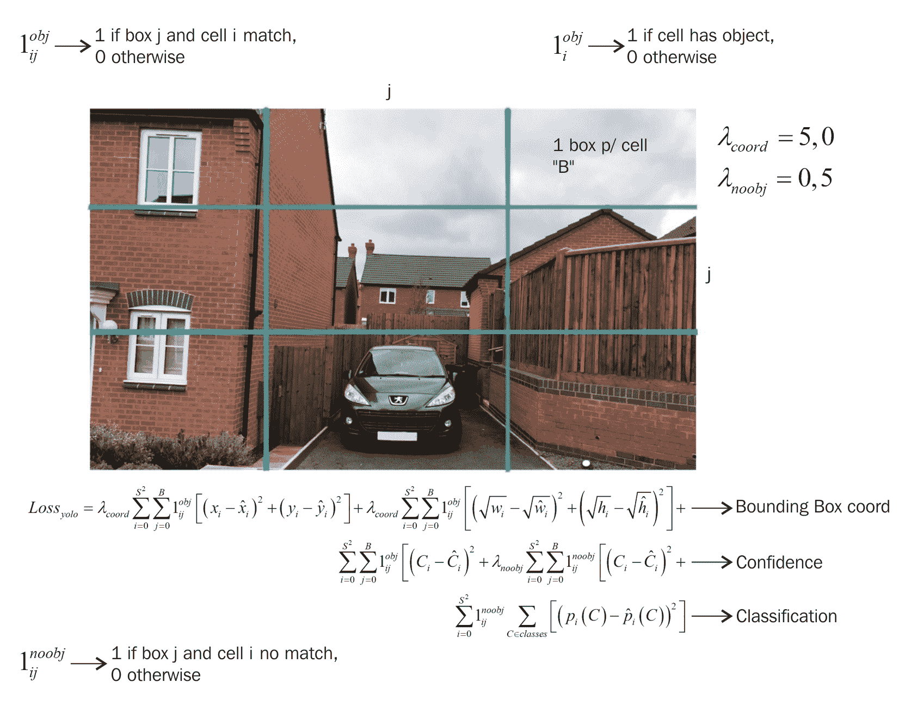

成员`1[ij]^obj`成员用于基于特定单元`i, j`上对象的存在来调制损失：

*   如果在网格单元格`i`和第`i`个边界框中具有最高 IoU 的对象存在：1
*   否则：0

同样，`1[ij]^noobj`正好相反。

# 损失第 1 部分

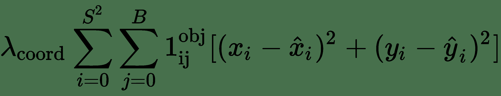

第一部分计算与预测的边界框位置坐标`(x, y)`相关的损失。 `(x_hat, y_hat)`是训练集中真实情况数据的边界框坐标。

`λ[coord] = 5.0`表示一个常数，当有错误时，该常数将给予更多的补偿。 `B`是边界框的数量。 `S^2`是网格中的单元数。

使用类似的公式来处理边界框的宽度/高度

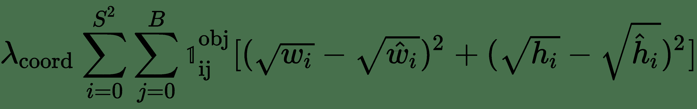

损失函数方程中宽度和高度的平方根用来反映小盒子中的小偏差比大盒子中的重要。 一般而言，这部分损失会对边界框的高度和宽度不正确进行惩罚。

# 损失第 2 部分

损失函数的这一部分计算与每个边界框预测变量的置信度得分相关的损失。

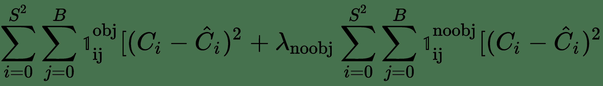

`C`是置信度分数（受物体的存在调制的项）。`C_hat`是带有真实情况的预测边界框的 IOU。 参数`λ[noobj] = 0.5`用于使无对象时的丢失关注度降低。

# 损失第 3 部分

分类损失是损失函数的最后一部分。

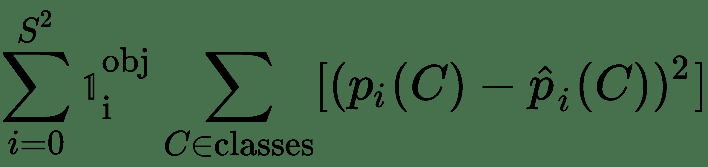

该损失是分类误差损失平方的总和。 同样，当单元上有一个对象时，术语`1[i]^(obj)`为 1，否则为 0。 我们的想法是，当存在对象时，我们不考虑分类错误。

`1[i]^(obj), 1[ij]^(obj), 1[ij]^(noobj)`这些术语可以掩盖我们在真实情况上有一个对象而在特定单元的模型输出中有一个对象的情况下的损失。 当真实情况与模型输出不匹配时，也是如此。

因此，例如，当特定单元格不匹配时，我们的损失将是：

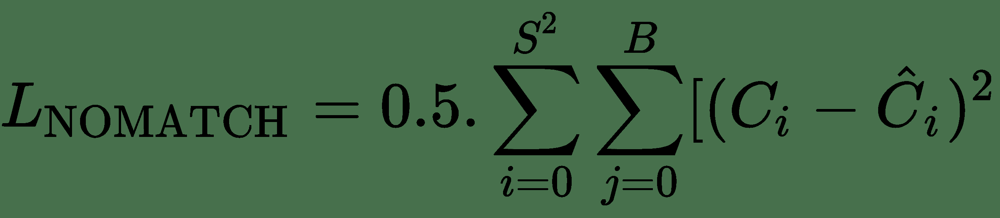

当我们有比赛时：

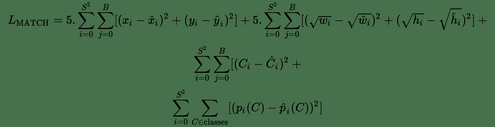

在实践中的实践中，您将尝试矢量化这种损失并避免`for`循环并提高性能，这对于 Tensorflow 之类的库尤其如此。

这是 YOLO 损失的 TensorFlow 实现：

```py
def loss_layer(self, predicts, labels, scope='loss_layer'): 
   with tf.variable_scope(scope): 
       predict_classes = tf.reshape(predicts[:, :self.boundary1], [self.batch_size, self.cell_size, self.cell_size, self.num_class]) 
       predict_scales = tf.reshape(predicts[:, self.boundary1:self.boundary2], [self.batch_size, self.cell_size, self.cell_size, self.boxes_per_cell]) 
       predict_boxes = tf.reshape(predicts[:, self.boundary2:], [self.batch_size, self.cell_size, self.cell_size, self.boxes_per_cell, 4]) 

       response = tf.reshape(labels[:, :, :, 0], [self.batch_size, self.cell_size, self.cell_size, 1]) 
       boxes = tf.reshape(labels[:, :, :, 1:5], [self.batch_size, self.cell_size, self.cell_size, 1, 4]) 
       boxes = tf.tile(boxes, [1, 1, 1, self.boxes_per_cell, 1]) / self.image_size 
       classes = labels[:, :, :, 5:] 

       offset = tf.constant(self.offset, dtype=tf.float32) 
       offset = tf.reshape(offset, [1, self.cell_size, self.cell_size, self.boxes_per_cell]) 
       offset = tf.tile(offset, [self.batch_size, 1, 1, 1]) 
       predict_boxes_tran = tf.stack([(predict_boxes[:, :, :, :, 0] + offset) / self.cell_size, 
                                      (predict_boxes[:, :, :, :, 1] + tf.transpose(offset, 
                                                                                   (0, 2, 1, 3))) / self.cell_size, 
                                      tf.square(predict_boxes[:, :, :, :, 2]), 
                                      tf.square(predict_boxes[:, :, :, :, 3])]) 
       predict_boxes_tran = tf.transpose(predict_boxes_tran, [1, 2, 3, 4, 0]) 

       iou_predict_truth = self.tf_iou_vectorized(predict_boxes_tran, boxes) 

       # calculate I tensor [BATCH_SIZE, CELL_SIZE, CELL_SIZE, BOXES_PER_CELL] 
       object_mask = tf.reduce_max(iou_predict_truth, 3, keep_dims=True) 
       object_mask = tf.cast((iou_predict_truth >= object_mask), tf.float32) * response 

       # calculate no_I tensor [CELL_SIZE, CELL_SIZE, BOXES_PER_CELL] 
       noobject_mask = tf.ones_like(object_mask, dtype=tf.float32) - object_mask 

       boxes_tran = tf.stack([boxes[:, :, :, :, 0] * self.cell_size - offset, 
                              boxes[:, :, :, :, 1] * self.cell_size - tf.transpose(offset, (0, 2, 1, 3)), 
                              tf.sqrt(boxes[:, :, :, :, 2]), 
                              tf.sqrt(boxes[:, :, :, :, 3])]) 
       boxes_tran = tf.transpose(boxes_tran, [1, 2, 3, 4, 0]) 

       # class_loss 
       class_delta = response * (predict_classes - classes) 
       class_loss = tf.reduce_mean(tf.reduce_sum(tf.square(class_delta), axis=[1, 2, 3]), name='class_loss') * self.class_scale 

       # object_loss 
       object_delta = object_mask * (predict_scales - iou_predict_truth) 
       object_loss = tf.reduce_mean(tf.reduce_sum(tf.square(object_delta), axis=[1, 2, 3]), name='object_loss') * self.object_scale 

       # noobject_loss 
       noobject_delta = noobject_mask * predict_scales 
       noobject_loss = tf.reduce_mean(tf.reduce_sum(tf.square(noobject_delta), axis=[1, 2, 3]), name='noobject_loss') * self.noobject_scale 

       # coord_loss 
       coord_mask = tf.expand_dims(object_mask, 4) 
       boxes_delta = coord_mask * (predict_boxes - boxes_tran) 
       coord_loss = tf.reduce_mean(tf.reduce_sum(tf.square(boxes_delta), axis=[1, 2, 3, 4]), name='coord_loss') * self.coord_scale 
```

# 语义分割

在语义分割中，目标是根据像素所属的对象类别标记图像的每个像素。 最终结果是一个位图，其中每个像素将属于某个类：

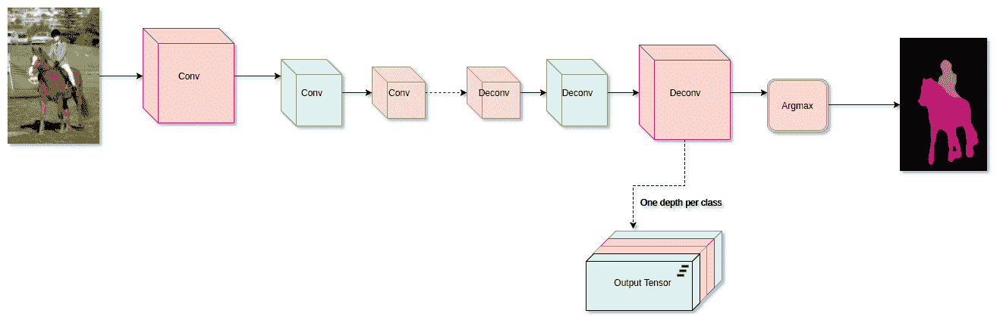

有几种流行的 CNN 架构已被证明在分割任务中表现出色。 它们中的大多数是称为自编码器的一类模型的变体，我们将在第 6 章，“自编码器，变分自编码器和生成模型”中详细介绍。 现在，他们的基本思想是首先在空间上将输入量减小为某种压缩形式，然后恢复原始的空间大小：

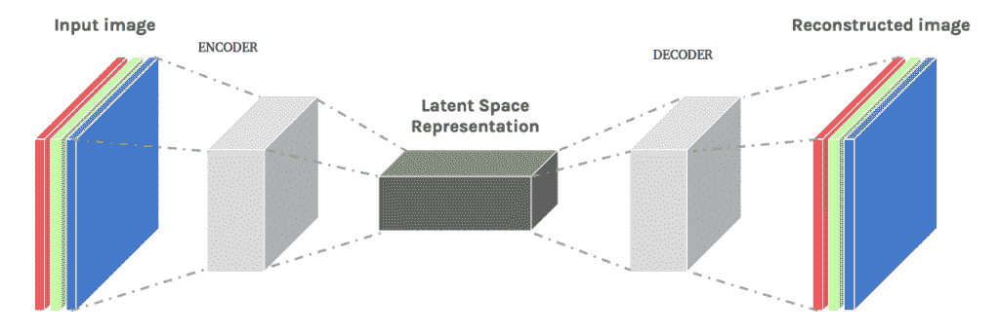

为了增加空间大小，使用了一些常用的操作，其中包括：

*   最大分拆
*   去卷积/转置卷积
*   扩张/房曲卷积

我们还将学习语义分割任务中使用的 softmax 的新变体，称为**空间 softmax** 。

在本节中，我们将学习两个流行的模型，它们在语义分割上表现良好，并且具有非常简单的架构可供理解。 它们如下所示：

*   FCN（全卷积网络）
*   保佑

需要解决的其他一些实现细节是：

*   最终的上采样层（Deconv）需要具有与分类一样多的过滤器，并且您的标签“颜色”需要与最后一层中的索引匹配，否则在训练过程中可能会遇到 NaN 问题
*   我们需要一个 Argmax 层来选择输出张量上概率最大的像素（仅在预测时间内）
*   我们的损失需要考虑输出张量上的所有像素

# 最大分割

取消池操作用于恢复最大池操作的效果。 这个想法只是充当上采样器。 此操作已在一些较早的论文上使用，并且不再使用，因为您还需要卷积层来修补（低通滤波器）上采样的结果：

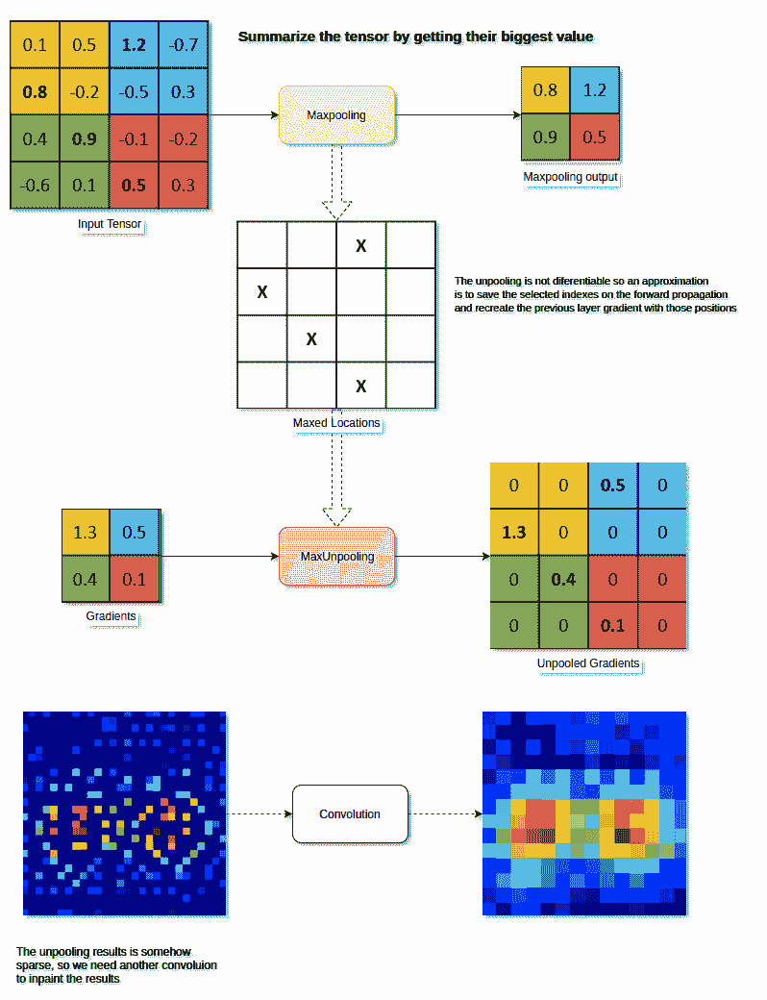

# 反卷积层（转置卷积）

这个运算相当不好地称为反卷积，这意味着它是卷积的逆运算，但实际上并非如此。 更恰当的名称是转置卷积或分数步卷积。

此图层类型为您提供了一种对输入体积进行升采样的学习方法，并且可以在每次需要将输入要素地图智能地投影到更高的空间时使用。 一些用例包括以下内容：

*   上采样（条纹转置卷积）== UNPOOL + CONV
*   可视化显着图
*   作为自编码器的一部分

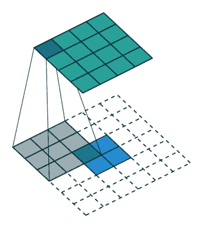

在 Tensorflow 中，我们可以访问`tf.layers`中的转置卷积。 下面的示例将采用一个空间大小为`14 x 14`的输入，并使其通过`conv2d_transpose`层，其中输出空间大小为`28 x 28`：

```py
# input_im has spatial dimensions 14x14 in this example  
output = tf.layers.conv2d_transpose(inputs=input_im, filters=1, kernel_size=4, strides=2, padding='same') 
```

选择`kernel_size`，步幅和填充方案时必须小心，因为它们都会影响输出空间大小。

# 损失函数

如前所述，分割模型的损失函数基本上是分类损失的扩展，但在整个输出向量中在空间上起作用：

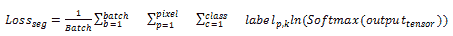

```py
# Segmentation problems often uses this "spatial" softmax (Basically we want to classify each pixel) 
with tf.name_scope("SPATIAL_SOFTMAX"): 
   loss = tf.reduce_mean((tf.nn.sparse_softmax_cross_entropy_with_logits( 
       logits=model_out,labels=tf.squeeze(labels_in, squeeze_dims=[3]),name="spatial_softmax"))) 
```

下图描述了用于语义分割的完全卷积网络的实现：

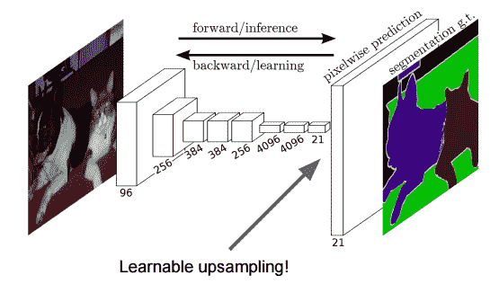

下图显示了 SegNet 架构：

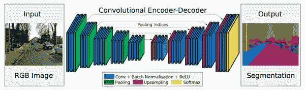

# 标签

如前所述，分割问题中的标签是一维图像，每个像素处的值与输出体积深度的索引匹配：

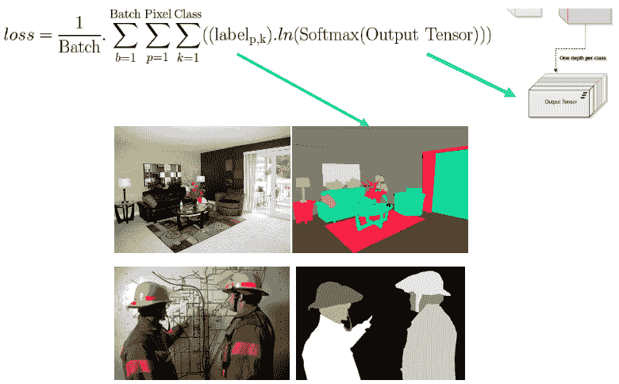

# 改善结果

通常，一种用于改善分割输出结果的技术是在后期处理阶段使用条件随机场（CRF），其中要考虑图像的纯 RGB 特征和我们的网络所产生的概率：

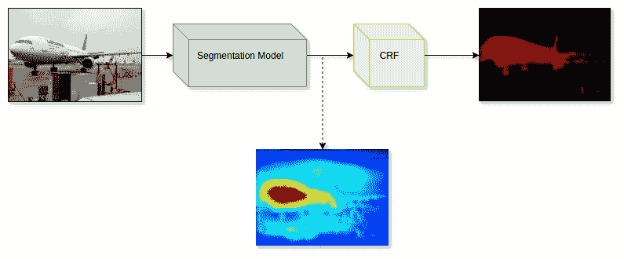

# 实例分割

实例分割是我们在本章中要讨论的最后一件事。 在许多方面，可以将其视为对象检测和语义分段的融合。 但是，与这两个问题相比，这绝对是难度增加。

通过实例分割，其思想是找到图像中一个或多个所需对象的每次出现，即所谓的实例。 找到这些实例后，即使它们属于同一类对象，我们也希望将它们彼此分开。 换句话说，标签既是类别感知的（例如汽车，标志或人），又是实例感知的（例如汽车 1，汽车 2 或汽车 3）。

实例分割的结果将如下所示：

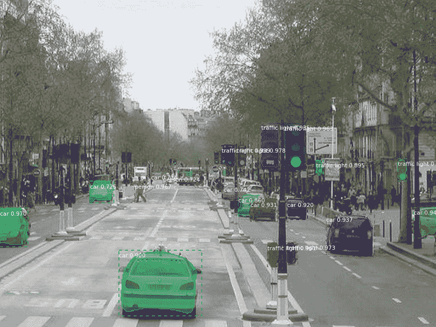

这与语义分割之间的相似性很明显； 我们仍然根据像素所属的对象来标记像素。 但是，尽管语义分割不知道某个对象在图像实例中出现了多少次，但是分割却知道。

这种知道图像中有多少个对象实例的能力也使该问题类似于对象检测。 但是，对象检测产生的对象边界要粗糙得多，这意味着被遮挡的对象更容易被遗漏，实例分割不会发生这种情况。

# Mask R-CNN

Mask R-CNN 是一种最近的网络体系结构，通过提供简单，灵活的模型体系结构可以使此问题更易于解决。 该架构于 2017 年发布，旨在扩展更快的 R-CNN 的功能：

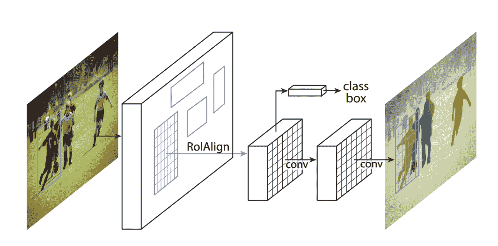

它采用现有的更快的 R-CNN 模型，并尝试通过向模型中添加一个分支来解决实例分割问题，该分支负责预测与分类和边界框回归头平行的对象蒙版。 在发布时，该架构被证明是有效的，并且在所有 COCO 挑战中均获得了最高荣誉。

# 总结

在本章中，我们学习了对象定位，检测和分段的基础知识。 我们还讨论了与这些主题相关的最著名的算法。

在下一章中，我们将讨论一些常见的网络体系结构。