# 六、自编码器，变分自编码器和生成对抗网络

本章将介绍一种与到目前为止所看到的模型稍有不同的模型。 到目前为止提供的所有模型都属于一种称为判别模型的模型。 判别模型旨在找到不同类别之间的界限。 他们对找到`P(Y|X)`-给定某些输入`X`的输出`Y`的概率感兴趣。 这是用于分类的自然概率分布，因为您通常要在给定一些输入`X`的情况下找到标签`Y`。

但是，还有另一种类型的模型称为生成模型。 建立了生成模型以对不同类的分布进行建模。 他们对找到`P(Y,X)`-输出`Y`和输入`X`一起出现的概率分布感兴趣。 从理论上讲，如果您可以捕获数据中类别的概率分布，则将了解更多信息，并且可以使用贝叶斯规则来计算`P(Y|X)`。

生成模型属于无监督学习算法的类别。 无监督意味着我们不需要标签数据。

本章列出了一些我们将要学习的关键主题：

*   自编码器
*   变分自编码器
*   生成对抗网络
*   实现各种生成模型以生成手写数字

# 为什么是生成模型

在下图中，我们可以看到生成模型和判别模型之间的主要区别。 使用判别模型，我们通常尝试找到在数据中不同类别之间进行区分或“区分”的方法。 但是，使用生成模型，我们尝试找出数据的概率分布。 在图示中，分布由包含较小圆圈的蓝色和黄色大斑点表示。 如果我们从数据中学到这种分布，我们将能够采样或“生成”应该属于它的新数据点，例如红色三角形。

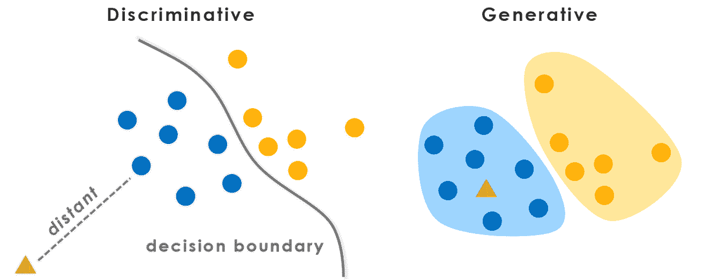

尝试捕获数据集的概率分布具有以下用例：

*   使用未标记的数据预训练模型
*   扩展数据集（理论上，如果您捕获数据的概率分布，则可以生成更多数据）
*   压缩数据（有损）
*   创建某种模拟器（例如，可以通过四个输入来控制四轴飞行器；如果捕获此数据并在其上训练生成模型，则可以学习无人机的动态）

使用生成模型时的期望是，如果我们能够创建类似于原始输入数据的新数据，则我们的模型必须了解一些有关数据分布的知识。

训练了生成神经网络模型，以产生类似于训练集的数据样本。 由于模型参数的数量小于训练数据的维数，因此迫使模型发现有效的数据表示形式。

# 自编码器

我们将要看到的第一个生成模型是自编码器模型。 自编码器是一个简单的神经网络，由两部分组成：**编码器**和**解码器**。 这个想法是编码器部分会将您的输入压缩到较小的尺寸。 然后，从这个较小的维度尝试使用模型的解码器部分重建输入。 通常用许多名称来称呼这种较小的尺寸，例如潜在空间，隐藏空间，嵌入或编码。

如果自编码器能够再现其输入，则从理论上讲，该潜在空间应该对表示原始数据所需的所有重要信息进行编码，但其优点是尺寸小于输入。 编码器可以被认为是一种压缩输入数据的方式，而解码器是一种将其解压缩的方式。 在下图中，我们可以看到一个简单的自编码器的外观。 我们的潜在空间或编码是中间标记为`z`的部分。

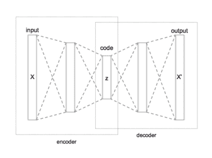

传统上，在自编码器中，构成网络的层只是全连接层，但是通过使用卷积层，自编码器也可以扩展到图像。 与之前一样，编码器会将输入图像压缩为较小的表示形式，而解码器将尽最大努力恢复信息。 区别在于，编码器现在是将数据压缩为特征向量的 CNN，而不是具有全连接层的 ANN，并且解码器将使用转置的卷积层从编码中重新生成图像。

此处提供了一个自编码器处理图像的示例。 对于解码器部分

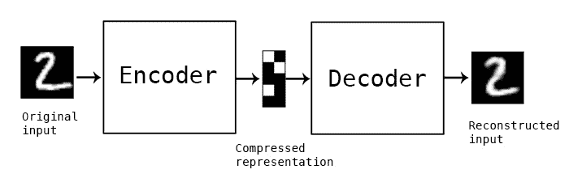

对于任何自编码器，损失函数都会引导编码器和解码器重建输入。 使用的常见损失是自编码器的输出与网络输入之间的 L2 损失。 我们现在应该问自己一个问题：“使用 L2 损失比较图像是一个好主意吗？”。 如果您拍摄以下图像，即使它们看起来截然不同，它们实际上彼此之间的距离`L2`也相同：

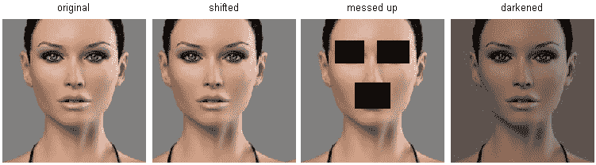

这表明当您使用 L2 损失比较图像时，并非总是可以依靠它，因此在使用它时应牢记这一点。

# 卷积自编码器示例

以下 TensorFlow 代码将为 MNIST 数据集构建卷积自编码器模型。 代码的第一部分将构建模型，编码器和解码器的图形。 在代码中，我们突出显示模型的一部分，其输出将是我们的潜在向量：

```py
class CAE_CNN(object): 
   def __init__(self, img_size = 28, latent_size=20): 
       self.__x = tf.placeholder(tf.float32, shape=[None, img_size * img_size], name='IMAGE_IN') 
       self.__x_image = tf.reshape(self.__x, [-1, img_size, img_size, 1]) 

       with tf.name_scope('ENCODER'): 
           ##### ENCODER 
           # CONV1: Input 28x28x1 after CONV 5x5 P:2 S:2 H_out: 1 + (28+4-5)/2 = 14, W_out= 1 + (28+4-5)/2 = 14 
           self.__conv1_act = tf.layers.conv2d(inputs=self.__x_image, strides=(2, 2), 
                                               filters=16, kernel_size=[5, 5], padding="same", activation=tf.nn.relu) 

           # CONV2: Input 14x14x16 after CONV 5x5 P:0 S:2 H_out: 1 + (14+4-5)/2 = 7, W_out= 1 + (14+4-5)/2 = 7 
           self.__conv2_act = tf.layers.conv2d(inputs=self.__conv1_act, strides=(2, 2), 
                                               filters=32, kernel_size=[5, 5], padding="same", activation=tf.nn.relu) 

           with tf.name_scope('LATENT'): 
           # Reshape: Input 7x7x32 after [7x7x32] 
           self.__enc_out = tf.reshape(self.__conv2_act, [tf.shape(self.__x)[0], 7 * 7 * 32]) 
           self.__guessed_z = tf.layers.dense(inputs=self.__enc_out, 
                                              units=latent_size, activation=None, name="latent_var") 
           tf.summary.histogram("latent", self.__guessed_z) 

       with tf.name_scope('DECODER'): 
           ##### DECODER (At this point we have 1x18x64 
           self.__z_develop = tf.layers.dense(inputs=self.__guessed_z, 
                                              units=7 * 7 * 32, activation=None, name="z_matrix") 
           self.__z_develop_act = tf.nn.relu(tf.reshape(self.__z_develop, [tf.shape(self.__x)[0], 7, 7, 32])) 

           # DECONV1 
           self.__conv_t2_out_act = tf.layers.conv2d_transpose(inputs=self.__z_develop_act, 
                                                               strides=(2, 2), kernel_size=[5, 5], filters=16, 
                                                               padding="same", activation=tf.nn.relu) 

           # DECONV2 
           # Model output 
           self.__y = tf.layers.conv2d_transpose(inputs=self.__conv_t2_out_act, 
                                                               strides=(2, 2), kernel_size=[5, 5], filters=1, 
                                                               padding="same", activation=tf.nn.sigmoid) 

           # We want the output flat for using on the loss 
           self.__y_flat = tf.reshape(self.__y, [tf.shape(self.__x)[0], 28 * 28]) 
```

与卷积自编码器丢失有关的代码段如下：

```py
with tf.name_scope("CAE_LOSS"): 
   # L2 loss
   loss = tf.losses.mean_squared_error(labels=model_in, predictions=model_out_flat)

# Solver configuration 
with tf.name_scope("Solver"): 
   train_step = tf.train.AdamOptimizer(0.0001).minimize(loss) 
```

# 自编码器的用途和局限性

自编码器的简单性很酷，但是在功能上有所限制。 他们的一个潜在用途是预训练模型（假设您将模型作为编码器部分，并且能够创建反模型作为解码器）。 使用自编码器可以很好地进行预训练，因为您可以获取数据集并训练自编码器以对其进行重构。 训练后，您可以使用编码器的权重，然后将其微调到您要执行的任务。

如果不太复杂，则另一种用途是作为数据压缩形式。 您可以使用自编码器将维数减小到两维或三维，然后尝试在潜在空间中可视化您的输入以查看它是否对您有用。

但是，自编码器的局限性在于它们不能用于为我们生成更多数据。 这是因为我们不知道如何创建新的潜在向量来馈送到解码器。 唯一的方法是在输入数据上使用编码器。 现在，我们将研究对自编码器的修改，以帮助解决此问题。

# 变分自编码器

我们第一个可以生成更多类似于训练数据的真实生成模型，将是**变分自编码器**（**VAE**）。 VAE 看起来像正常的自编码器，但有一个新的约束，它将迫使我们的压缩表示（潜伏空间）遵循零均值和单位方差高斯分布。

在潜在空间上施加此约束的想法是，当我们想使用 VAE 生成新数据时，我们可以创建来自单位高斯分布的样本矢量，并将其提供给经过训练的解码器。 VAE 和常规自编码器之间的差异就是对潜在空间矢量的约束。 这个约束条件使我们可以创建一种新的潜在矢量，然后再将其馈送到解码器以生成数据。

下图显示，VAE 在结构上与自编码器完全相同，除了对隐藏空间的约束之外：

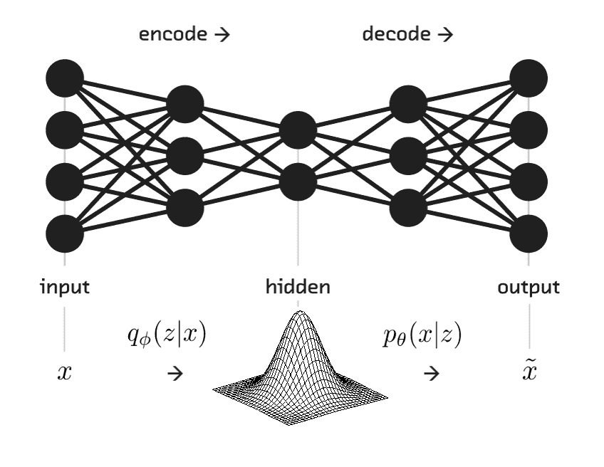

# 定义正态分布的参数

我们需要两个参数来跟踪并强制我们的 VAE 模型在潜在空间中产生正态分布：

*   **平均值**（应为零）
*   **标准差**（应为 1）

在下图中，我们给出了具有不同均值和标准差值的正态分布示例。 仅使用这两个值，我们就可以产生一个正态分布，可以从中采样：

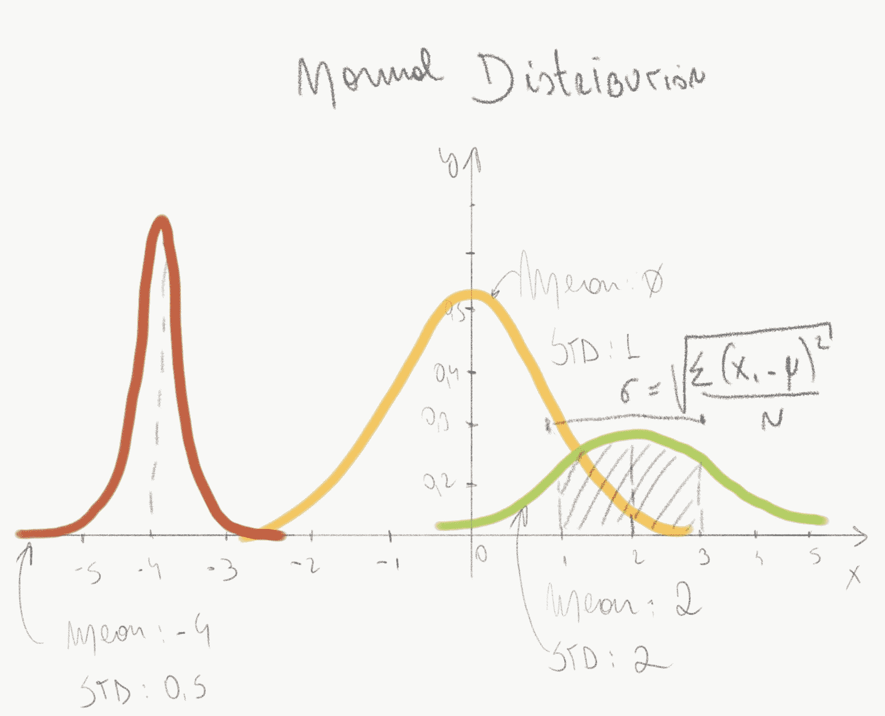

# VAE 损失函数

在 VAE 中，损失函数由两部分组成：

*   **生成损失**：此损失将模型输出与模型输入进行比较。 这可能是我们在自编码器中使用的损失，例如 L2 损失。
*   **潜在损失**：此损失将潜在向量与零均值，单位方差高斯分布进行比较。 我们在这里使用的损失将是 KL 散度损失。 如果 VAE 开始产生不是来自所需分布的潜在向量，则该损失项将对 VAE 造成不利影响。

以下屏幕截图显示了 VAE 的损失，它是生成损失和潜在空间损失的组合：

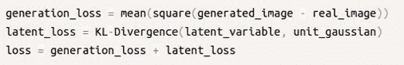

# Kullback-Leibler 散度

KL 散度损失将产生一个数字，该数字指示两个分布彼此之间的接近程度。

两个分布之间的距离越近，损失就越低。 在下图中，蓝色分布正在尝试对绿色分布进行建模。 随着蓝色分布越来越接近绿色分布，KL 散度损失将接近于零。

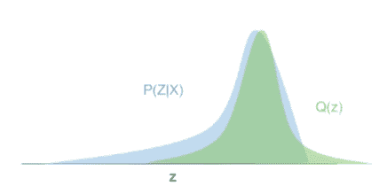

# 训练 VAE

为了训练 VAE 并使用 KL 散度损失，我们首先需要研究如何生成潜矢量。 我们将使编码器产生两个向量，而不是让编码器直接精确地产生一个潜在向量。 第一个是平均值的向量`μ`，第二个是标准差值的向量`σ`。 根据这些，我们可以创建第三个向量，其中使用`μ`和`σ`从高斯分布中采样元素向量的第`i`个值作为该高斯分布的均值和标准差。 然后，该第三采样矢量被发送到解码器。

现在，我们的模型如下所示：

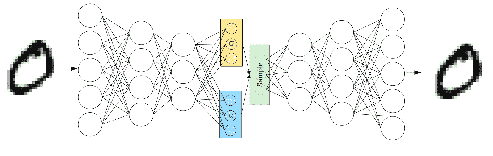

上图中的均值和标准差块将只是正常的全连接层，它们将通过 KL 损失函数来学习如何返回所需的值。 更改我们如何获得潜矢量的原因是因为它使我们能够轻松计算 KL 散度损失。 KL 损失现在如下：`latent_mean`为`μ`，`latent_stddev`为`σ`：

```py
0.5 * tf.reduce_sum(tf.square(latent_mean) + tf.square(latent_stddev) - tf.log(tf.square(latent_stddev)) - 1, 1) 
```

不幸的是，有一个**样本**块，您可以将其视为随机生成器节点，无法区分。 这意味着我们不能使用反向传播来训练我们的 VAE。 我们需要一种称为“重新参数化”技巧的东西，该技巧将从反向传播流中取出采样。

# 重新参数化技巧

重新参数化技巧的想法是从反向传播循环中取出随机样本节点。 它是通过从高斯分布中获取样本ε，然后将其乘以我们的标准差矢量`σ`的结果，然后加上`μ`来实现的。 现在，我们的潜在向量的公式是：

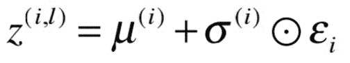

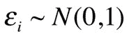

产生的潜矢量将与以前相同，但是现在进行此更改可以使梯度流回到 VAE 的编码器部分。 下图显示了在进行重新参数化之前的 VAE 模型，在左侧进行了重新参数化之后。 蓝色框是损失函数的两个部分。 查看该图，您可以看到我们的渐变现在可以向后流动，因为我们不再具有红色框（示例节点）来挡路了：

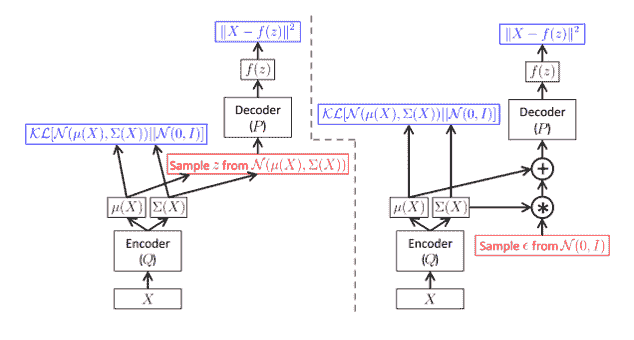

这是 TensorFlow 中的重新参数化形式：

```py
# Add linear ops to produce mean and standard devation vectors
fc_mean = tf.layers.dense(self.__enc_out, units=latent_size, activation=None, name="w_mean") 
fc_stddev = tf.layers.dense(self.__enc_out, units=latent_size, activation=None, name="w_stddev") 

# Generate normal distribution with dimensions [Batch, latent_size] 
sample_block = tf.random_normal([tf.shape(X)[0], latent_size], 0, 1, dtype=tf.float32) 
latent_z = fc_mean + (fc_stddev * sample_block) 
```

# 卷积变分自编码器代码

现在我们可以将所有内容组合在一起，并提供 TensorFlow 代码，这些代码将为 MNIST 数据集构建卷积 VAE。 我们为 VAE 模型创建一个类，然后将该模型放入`__init__`方法中。 第一部分是我们的模型的编码器，由两个转换层组成：

```py
class VAE_CNN(object): 
   def __init__(self, img_size=28, latent_size=20): 
       self.__x = tf.placeholder(tf.float32, shape=[None, img_size * img_size], name='IMAGE_IN') 
       self.__x_image = tf.reshape(self.__x, [-1, img_size, img_size, 1]) 

       with tf.name_scope('ENCODER'): 
           ##### ENCODER 
           # CONV1: Input 28x28x1 after CONV 5x5 P:2 S:2 H_out: 1 + (28+4-5)/2 = 14, W_out= 1 + (28+4-5)/2 = 14 
           self.__conv1_act = tf.layers.conv2d(inputs=self.__x_image, strides=(2, 2), 
                                               filters=16, kernel_size=[5, 5], padding="same", activation=tf.nn.relu) 

           # CONV2: Input 14x14x16 after CONV 5x5 P:0 S:2 H_out: 1 + (14+4-5)/2 = 7, W_out= 1 + (14+4-5)/2 = 7 
           self.__conv2_act = tf.layers.conv2d(inputs=self.__conv1_act, strides=(2, 2), 
                                               filters=32, kernel_size=[5, 5], padding="same", activation=tf.nn.relu) 
```

接下来是 VAE 的一部分，该部分负责使用我们之前的新重新参数化技巧来创建潜在矢量。 我们添加了对最终潜在向量的记录，以检查它是否按照我们期望的那样遵循单位高斯分布产生向量：

```py
       with tf.name_scope('LATENT'): 
           # Reshape: Input 7x7x32 after [7x7x32] 
           self.__enc_out = tf.reshape(self.__conv2_act, [tf.shape(self.__x)[0], 7 * 7 * 32]) 

           # Add linear ops for mean and variance 
           self.__w_mean = tf.layers.dense(inputs=self.__enc_out, 
                                           units=latent_size, activation=None, name="w_mean") 
           self.__w_stddev = tf.layers.dense(inputs=self.__enc_out, 
                                             units=latent_size, activation=None, name="w_stddev") 

           # Generate normal distribution with dimensions [B, latent_size] 
           self.__samples = tf.random_normal([tf.shape(self.__x)[0], latent_size], 0, 1, dtype=tf.float32) 

           self.__guessed_z = self.__w_mean + (self.__w_stddev * self.__samples) 
      tf.summary.histogram("latent_sample", self.__guessed_z)
```

之后，我们添加网络的解码器部分，该部分包括一个全连接层，然后是两个转置的卷积层：

```py
       with tf.name_scope('DECODER'): 
           ##### DECODER 
           # Linear layer 
           self.__z_develop = tf.layers.dense(inputs=self.__guessed_z, 
                                           units=7 * 7 * 32, activation=None, name="z_matrix") 
           self.__z_develop_act = tf.nn.relu(tf.reshape(self.__z_develop, [tf.shape(self.__x)[0], 7, 7, 32])) 

           # DECONV1 
           self.__conv_t2_out_act = tf.layers.conv2d_transpose(inputs=self.__z_develop_act, 
                                                               strides=(2, 2), kernel_size=[5, 5], filters=16, 
                                                               padding="same", activation=tf.nn.relu) 

           # DECONV2 
           # Model output 
           self.__y = tf.layers.conv2d_transpose(inputs=self.__conv_t2_out_act, 
                                                 strides=(2, 2), kernel_size=[5, 5], filters=1, 
                                                 padding="same", activation=tf.nn.sigmoid) 

           # Model output 
           self.__y_flat = tf.reshape(self.__y, [tf.shape(self.__x)[0], 28 * 28]) 
```

与我们的模型分开，我们需要写出最终损失函数，该函数将用于训练 VAE。 然后，我们可以将这种损失传递给我们选择的优化器，以创建我们的训练步骤：

```py
# Loss function

with tf.name_scope("VAE_LOSS"): 
   # L2 loss (generative loss) 
   generation_loss = tf.losses.mean_squared_error(labels=model_in, predictions= model_out_flat) 
   # KL Loss (latent loss)
   latent_loss = 0.5 * tf.reduce_sum(tf.square(z_mean) + tf.square(z_stddev) - tf.log(tf.square(z_stddev)) - 1, 1) 
   # Merge the losses
```

```py
   loss = tf.reduce_mean(generation_loss + latent_loss) 

# Solver
with tf.name_scope("Solver"):  
    train_step = tf.train.AdamOptimizer(0.0001).minimize(loss)   
```

# 产生新数据

训练完 VAE 模型后，我们可以将其解码器部分截断，并用作生成器为我们生成新数据。 它将通过向它提供来自单位高斯分布的新潜在矢量来工作。

我们在 TensorFlow 中提供负责构建此生成的 VAE 图的代码，如下所示：

```py
class VAE_CNN_GEN(object): 
   def __init__(self, img_size=28, latent_size=20): 
       self.__x = tf.placeholder(tf.float32, shape=[None, latent_size], name='LATENT_IN') 
       with tf.name_scope('DECODER'): 
           # Linear layer 
           self.__z_develop = tf.layers.dense(inputs=self.__x, 
                                              units=7 * 7 * 32, activation=None, name="z_matrix") 
           self.__z_develop_act = tf.nn.relu(tf.reshape(self.__z_develop, [tf.shape(self.__x)[0], 7, 7, 32])) 

           # DECONV1 
           self.__conv_t2_out_act = tf.layers.conv2d_transpose(inputs=self.__z_develop_act, 
                                                               strides=(2, 2), kernel_size=[5, 5], filters=16, 
                                                               padding="same", activation=tf.nn.relu) 

           # DECONV2 
           # Model output 
           self.__y = tf.layers.conv2d_transpose(inputs=self.__conv_t2_out_act, 
                                                 strides=(2, 2), kernel_size=[5, 5], filters=1, 
                                                 padding="same", activation=tf.nn.sigmoid) 

   @property 
   def output(self): 
       return self.__y 

   @property 
   def input(self): 
       return self.__x 
```

# 生成对抗网络

**生成对抗网络**（**GAN**）是另一种非常新的生成模型，由于其令人印象深刻的结果而受到关注。 GAN 由两个网络组成：生成器网络和判别器网络。 在训练过程中，他们俩都玩零和游戏，其中判别器网络试图发现输入到其中的图像是真实的还是伪造的。 同时，生成器网络尝试创建足以欺骗判别器的伪造图像。

想法是经过一段时间的训练，判别器和生成器都非常擅长于他们的任务。 结果，生成器被迫尝试创建看起来越来越接近原始数据集的图像。 为此，它必须捕获数据集的概率分布。

下图概述了此 GAN 模型的外观：

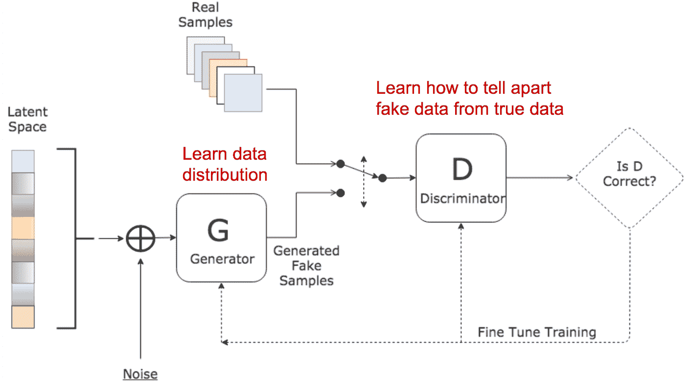

判别器和发生器都将具有自己的损失函数，但是它们的损失都相互依赖。

让我们总结一下 GAN 模型的两个主要模块或网络：

*   **生成器**：使用大小为 N 的一维矢量作为输入，创建类似于*真实图像*数据集的图像（选择 N 取决于我们）
*   **判别器**：验证提供给它的图像是真实的还是伪造的

GAN 的一些实际用法如下：

*   使用判别器网络权重作为不同任务的初始化，类似于我们对自编码器可以执行的操作
*   使用生成器网络创建新图像，可能会扩大您的数据集，就像我们可以使用经过训练的 VAE 解码器一样
*   将判别器用作损失函数（对于图像，可能优于 L1/L2），并且也可以在 VAE 中使用
*   通过将生成的数据与标记的数据混合来进行半监督学习

现在我们将向您展示如何在 TensorFlow 中实现非常简单的 GAN。 一旦经过训练，我们的 GAN 的生成器部分就可以用于根据 100 个长随机噪声矢量创建 MNIST 手写数字。 让我们开始吧！

# 判别器

我们需要做的第一件事就是创建我们的区分网络。 为此，我们将几个全连接层堆叠在一起。 判别器将 784 个长度向量作为输入，这是我们的`28x28` MNIST 图像变平。 每个图像的输出将只是一个数字，这是鉴别者对该图像为真实图像的信心程度的分数。 我们使用 Leaky ReLu 作为激活函数，以防止 ReLu 单元死亡。

我们返回原始对率，因为损失函数将为我们应用 Sigmoid 激活函数，以确保判别器输出在 0 到 1 之间：

```py
def discriminator(x):
     with tf.variable_scope("discriminator"):
         fc1 = tf.layers.dense(inputs=x, units=256, activation=tf.nn.leaky_relu)
         fc2 = tf.layers.dense(inputs=fc1, units=256, activation=tf.nn.leaky_relu)
         logits = tf.layers.dense(inputs=fc2, units=1)    
         return logits
```

# 生成器

现在我们创建生成器网络。 生成器的工作是将随机噪声的矢量作为输入，并从中生成输出图像。 在此示例中，我们再次使用全连接层，这些层最后将产生 784 个长向量的输出，我们可以对其进行整形以获得`28x28`的图像：

```py
def generator(z):
     with tf.variable_scope("generator"):
         fc1 = tf.layers.dense(inputs=z, units=1024, activation=tf.nn.relu)
         fc2 = tf.layers.dense(inputs=fc1, units=1024, activation=tf.nn.relu)
         img = tf.layers.dense(inputs=fc2, units=784, activation=tf.nn.tanh)     
         return img
```

我们在输出上使用 tanh 激活来将生成的图像限制在 -1 到 1 的范围内。

现在已经定义了模型，我们可以看看 GAN 训练所需的损失函数。

# GAN 损失函数

如前所述，判别器和生成器都有自己的损失函数，这些函数取决于彼此网络的输出。 我们可以将 GAN 视为在判别器和生成器之间玩 minimax 游戏，如下所示：

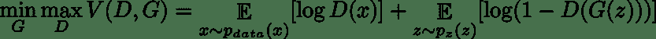

在这里，`D`是我们的判别器，`G`是我们的生成器，`z`是输入到生成器的随机矢量，`x`是真实图像。 尽管我们在此处给出了 GAN 损失的总和，但实际上更容易分别考虑这两种优化。

为了训练 GAN，我们将在判别器和生成器之间交替进行梯度步骤更新。 在更新判别器时，我们要尝试使**最大化**判别器做出**正确选择**的概率。 在更新生成器时，我们想尝试使**最小化**判别器做出**正确选择**的可能性。

但是，为了实际实现，我们将与之前给出的内容相比，稍微改变 GAN 损失函数； 这样做是为了帮助训练收敛。 变化是，当更新生成器时，而不是**最小化**判别器做出**正确选择**的可能性； 我们改为**最大化**判别器做出**错误选择**的概率：

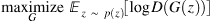

更新判别器时，我们尝试使**最大化**，它对真实数据和伪数据均做出正确选择的可能性：

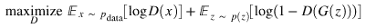

# 生成器损失

生成器想要欺骗判别器，换句话说，使判别器输出`q`用于生成的图像`G(z)`。 发生器损失只是施加到发生器结果的判别器输出的二项式交叉熵损失的负值。 请注意，由于生成器始终尝试生成“真实”图像，因此交叉熵损失可简化为：

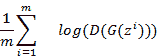

在这里，每个术语的含义如下：

*   `m`：批量
*   `D`：判别器
*   `G`：生成器
*   `z`：随机噪声向量

我们想在训练 GAN 时最大化损失函数。 当损失最大化时，这意味着生成器能够生成可能使判别器蒙蔽的图像，并且判别器针对生成的图像输出 1。

# 判别器损失

鉴别者希望能够区分真实图像和生成图像。 它想为真实图像输出 1，为生成图像输出 0。 判别器损失函数具有以下公式，由于 GAN 训练和标记的工作方式而再次简化：

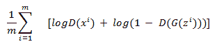

此损失函数有两个术语：

*   应用于判别器模型的二项式交叉熵产生了一些真实数据`x`
*   将二项式交叉熵应用于所生成数据`G(z)`的判别器模型结果

如前所述，我们采取这些不利条件，并希望在训练 GAN 时最大化此损失函数。 当这种损失最大化时，这意味着判别器能够区分实际输出和生成的输出。 注意，当判别器对于真实图像输出 1 而对于所生成图像输出 0 时，该损失最大。

# 综合损失

在 TensorFlow 中，我们可以实现整个 GAN 损失，如以下代码所示。 作为输入，我们从判别器的输出中获取来自生成器的一批伪图像和来自我们的数据集的一批真实图像：

```py
def gan_loss(logits_real, logits_fake):    
     # Target label vectors for generator and discriminator losses.
     true_labels = tf.ones_like(logits_real)
     fake_labels = tf.zeros_like(logits_fake)
     # DISCRIMINATOR loss has 2 parts: how well it classifies real images and how well it
     # classifies fake images.
     real_image_loss = tf.nn.sigmoid_cross_entropy_with_logits(logits=logits_real, labels=true_labels)
     fake_image_loss = tf.nn.sigmoid_cross_entropy_with_logits(logits=logits_fake, labels=fake_labels)

     # Combine and average losses over the batch
     discriminator_loss = tf.reduce_mean(real_image_loss + fake_image_loss) 

     # GENERATOR is trying to make the discriminator output 1 for all its images.
     # So we use our target label vector of ones for computing generator loss.
     generator_loss = tf.nn.sigmoid_cross_entropy_with_logits(logits=logits_fake, labels=true_labels)

     # Average generator loss over the batch.
     generator_loss = tf.reduce_mean(G_loss)

     return discriminator_loss , generator_loss 
```

您可能已经注意到，不可能同时最大化判别器损失和发生器损失。 这就是 GAN 的优点，因为在训练时，该模型有望达到某种平衡，在这种情况下，生成器必须生成真正高质量的图像，以欺骗判别器。

TensorFlow 仅允许其优化器最小化而不是最大化。 结果，我们实际上采用了前面所述的损失函数的负值，这意味着我们从最大化损失变为最小化损失。 不过，我们无需执行任何其他操作，因为`tf.nn.sigmoid_cross_entropy_with_logits()`会为我们解决此问题。

# 训练 GAN

因此，现在有了生成器，判别器和损失函数，剩下的就是训练！ 我们将在 TensorFlow 中给出如何执行此操作的草图，因为这部分没有花哨的内容。 就像我们之前所做的那样，它只是将上一节中的内容以及加载和馈送 MNIST 图像拼凑在一起。

首先，设置两个求解器：一个用于判别器，一个用于生成器。 已显示`AdamOptimizer`的较小值`beta1`，因为它已显示出可帮助 GAN 训练收敛：

```py
discriminator_solver = tf.train.AdamOptimizer(learning_rate=0.001, beta1=0.5)
generator_solver = tf.train.AdamOptimizer(learning_rate=0.001, beta1=0.5)
```

接下来，创建一个随机噪声矢量； 这可以通过`tf.random_uniform`完成。 这被馈送到生成器网络以创建一批生成的图像：

```py
z = tf.random_uniform(maxval=1,minval=-1,shape=[batch_size, dim]) 
generator_sample = generator(z)

```

然后，我们将一批真实图像和一批生成的样本提供给判别器。 我们在这里使用变量范围来重用我们的模型变量，并确保不创建第二个图：

```py
 with tf.variable_scope("") as scope:   
     logits_real = discriminator(x)
     # We want to re-use the discriminator weights.    
     scope.reuse_variables()
     logits_fake = discriminator(generator_sample )

```

由于需要分别更新它们，因此我们将区分符和生成器的权重分开：

```py
discriminator_vars = tf.get_collection(tf.GraphKeys.TRAINABLE_VARIABLES, 'discriminator')
generator_vars = tf.get_collection(tf.GraphKeys.TRAINABLE_VARIABLES, 'generator')
```

最后，我们计算损失并将其与相关权重一起发送给优化器以进行更新：

```py
 discriminator_loss, generator_loss = gan_loss(logits_real, logits_fake)

 # Training steps.
 discriminator_train_step = discriminator_solver.minimize(discriminator_loss, var_list=discriminator_vars )
 generator_train_step = generator_solver.minimize(generator_loss , var_list=generator_vars )
```

这些是训练 GAN 的主要步骤。 剩下的就是创建一个训练循环，遍历大量数据。 如果这样做，您应该能够像训练中那样输入任何随机噪声矢量，并生成图像。

如下图所示，创建的图像开始类似于 MNIST 数字：

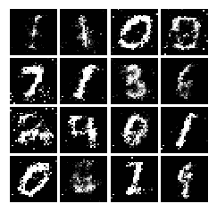

# 深度卷积 GAN

**深度卷积 GAN**（**DCGAN**）是我们之前看到的普通 GAN 的扩展。 我们不是使用全连接层，而是使用卷积层。 想法是使用卷积层可以帮助生成器形成更好的图像。 以下是这种模型的示例：

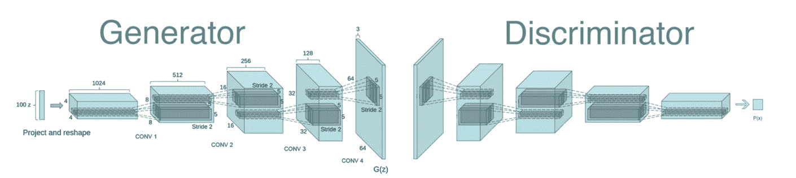

DCGAN 的示例实现与之前训练普通 GAN 相同，只是简单地将判别器和生成器网络换成一些卷积架构，如以下代码所示。 请注意，生成器将使用转置卷积来上采样：

```py
def discriminator(x):
         with tf.variable_scope("discriminator"):    
         unflatten = tf.reshape(x, shape=[-1, 28, 28, 1])
         conv1 = tf.layers.conv2d(inputs=unflatten, kernel_size=5, strides=1, filters=32 ,activation=leaky_relu)
         maxpool1 = tf.layers.max_pooling2d(inputs=conv1, pool_size=2, strides=2)
         conv2 = tf.layers.conv2d(inputs=maxpool1, kernel_size=5, strides=1, filters=64,activation=leaky_relu)
         maxpool2 = tf.layers.max_pooling2d(inputs=conv2, pool_size=2, strides=2)
         flatten = tf.reshape(maxpool2, shape=[-1, 1024])
         fc1 = tf.layers.dense(inputs=flatten, units=1024, activation=leaky_relu)
         logits = tf.layers.dense(inputs=fc1, units=1)
         return logits
```

```py
def generator(z):
     with tf.variable_scope("generator"):   
         fc1 = tf.layers.dense(inputs=z, units=1024, activation=tf.nn.relu)
         bn1 = tf.layers.batch_normalization(inputs=fc1, training=True)
         fc2 = tf.layers.dense(inputs=bn1, units=7*7*128, activation=tf.nn.relu)
         bn2 = tf.layers.batch_normalization(inputs=fc2, training=True)
         reshaped = tf.reshape(bn2, shape=[-1, 7, 7, 128])
         conv_transpose1 = tf.layers.conv2d_transpose(inputs=reshaped, filters=64, kernel_size=4, strides=2, activation=tf.nn.relu,
                                                     padding='same')
         bn3 = tf.layers.batch_normalization(inputs=conv_transpose1, training=True)
         conv_transpose2 = tf.layers.conv2d_transpose(inputs=bn3, filters=1, kernel_size=4, strides=2, activation=tf.nn.tanh,
                                         padding='same')

         img = tf.reshape(conv_transpose2, shape=[-1, 784])
         return img
```

只需换出生成器和判别器网络以使用卷积运算，我们就能生成如下图像：

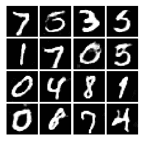

现在产生的质量非常好，几乎与真实数据没有区别。 另外，请注意，图像确实非常清晰，并且没有像我们之前那样模糊且几乎没有伪影。

需要注意的几点是：

*   对于判别器：再次使用泄漏的 relu，不要使用最大池。 仅使用跨步卷积或平均池。
*   对于生成器：在最后一层使用 relu 和 tanh。
*   通常，最佳实践是在生成器和判别器上都使用批量规范化层。 它们将始终设置为训练模式。
*   有时，人们运行生成器优化器的次数是运行判别器优化器的两倍。

这是一个简单的 DCGAN 在生成人脸图像时可以达到的质量的示例：

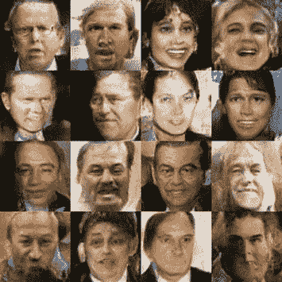

# WGAN

Wasserstein GAN 是 GAN 的另一种变体，它解决了训练 GAN 时可能发生的问题，即模式崩溃。 此外，其目的在于给出一种度量，该度量指示 GAN 何时收敛，换句话说，损失函数具有该值的含义。

重要的更改是从损失中删除对数并修剪判别器权重。

此外，请按照下列步骤操作：

*   火车判别器比生成器更多
*   减少判别器的重量
*   使用 RMSProp 代替 Adam
*   使用低学习率（0.0005）

WGAN 的缺点是训练起来较慢：

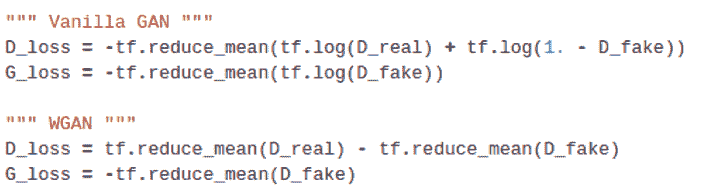

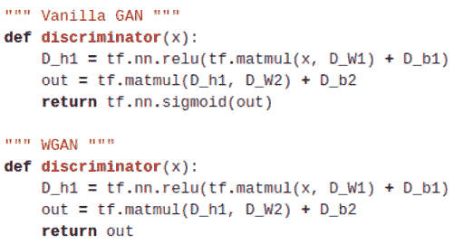

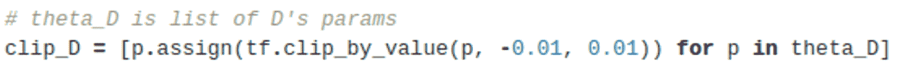

WGAN 产生的图像结果仍然不是很好，但是该模型确实有助于解决模式崩溃问题。

# BEGAN

BEGAN 的主要思想是在判别器上使用自编码器，这将有其自身的损失，该损失会衡量自编码器对某些图像（生成器或真实数据）的重构程度：

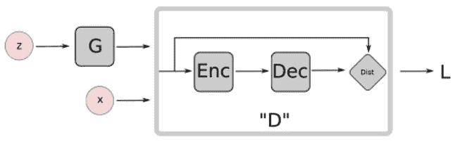

BEGAN 的一些优点如下：

*   高分辨率（`128x128`）人脸生成（2017 最新技术）。
*   提供一种衡量收敛的方法。
*   即使没有批量规范和辍学也有良好的结果。
*   超参数可控制世代多样性与质量。 更高的质量也意味着更多的模式崩溃。
*   不需要两个单独的优化器。

这是 BEGAN 在生成人脸任务时可以生成的图像质量的示例：

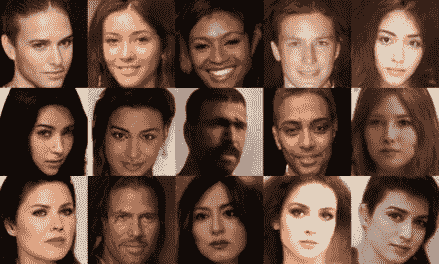

# 条件 GAN

条件 GAN 是普通 GAN 的扩展，其中判别器和生成器都被设置为某些特定类别`y`。这具有有趣的应用程序，因为您可以将生成器固定到特定的类，然后使其生成我们选择的特定同一类的多个不同版本。 例如，如果将`y`设置为与 MNIST 中的数字 7 对应的标签，则生成器将仅生成 7 的图像。

使用条件 GAN，minimax 游戏变为：

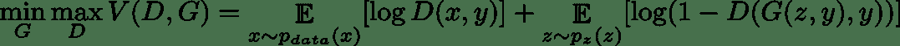

在这里，我们依赖于额外输入`y`，它是输入图像的类标签。

合并`x`和`y`，或`z`和`y`的最简单方法是将它们串联在一起，这样我们的输入向量就更长。 这将创建一个更加受控制的数据集扩充系统。 这是 TensorFlow 代码中的一个示例：

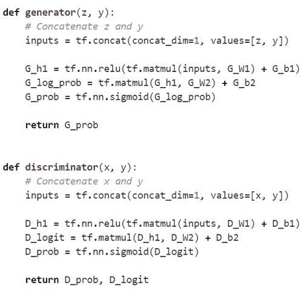

# GAN 的问题

GAN 当前最大的问题是，它们很难训练。 幸运的是，有一些技术可以使事情变得容易，这是目前非常活跃的研究领域。

在这里，我们将介绍训练 GAN 的一些问题以及如何解决它们。

# 损失可解释性

训练 GAN 时的问题之一是，生成器损失和判别器损失的值都没有明显的影响。 这不像训练分类器，只是等待损失下降以查看模型是否在训练。

对于 GAN，损失值的下降并不一定意味着该模型正在训练中：

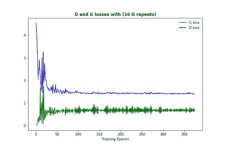

通过许多人的实验和研究，以下是有关如何使用 GAN 损失值的一些提示：

*   您不希望判别器的损失下降得很快，因为它将无法向生成器提供反馈以改善它。
*   如果生成器损失迅速下降，则意味着它发现了一个判别器弱点，并一次又一次地利用了这一弱点。 如果发生这种情况，则称为**模式折叠**。

损失实际上仅对查看训练中是否出现问题有好处。 因此，没有很好的方法知道训练已经收敛。 通常，最好的办法是继续查看生成器的输出。 确保输出看起来与您的期望接近，并且输出种类丰富。

# 模式崩溃

这可能是您在训练 GAN 时遇到的第一个问题。 当生成器找到一组特定的输入来欺骗判别器时，就会发生模式崩溃，并且它会继续利用这种故障情况并将潜伏`Z`空间中的许多值折叠为相同的值。

解决此问题的一种方法是使用“小批量功能”或“展开 GANs”，或者完全停止训练，然后在生成器开始创建非常狭窄的输出分布时重新开始：

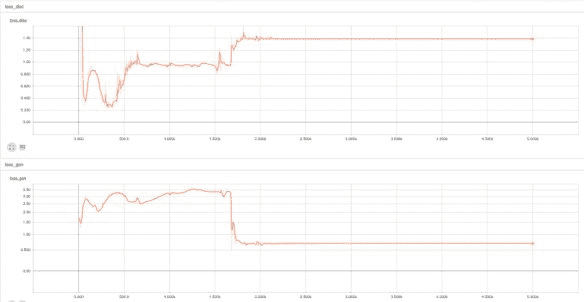

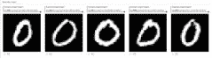

# 改善 GAN 的可训练性的技术

在这里，我们将介绍一些在训练 GAN 时使生活更轻松的技术：

*   归一化输入到 -1/1 之间
*   使用 BatchNorm
*   使用 Leaky Relu（判别器）
*   在生成器输出上使用 Relu（生成器），tanh
*   对于下采样，请使用平均池化或跨步卷积
*   使用 Adam 优化器
*   如果判别器损失迅速下降，则说明存在问题
*   在生成器上使用压降（在训练阶段和测试阶段）

# 小批量判别器

用于改善模式崩溃的一些技术如下：

*   取得判别器某层的输出
*   将判别器的输入重塑为矩阵
*   计算 L1 距离
*   计算 L1 距离的指数和
*   将结果连接到输入（判别器的某些层）

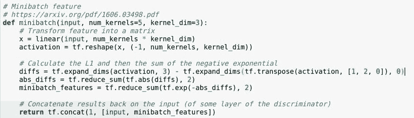

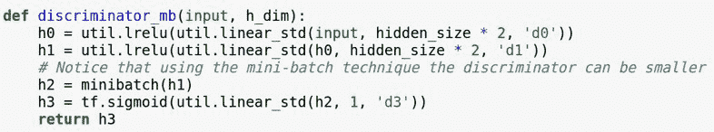

# 总结

在本章中，我们了解了生成模型及其与判别模型的不同之处。 我们还讨论了各种自编码器，包括深度，变体和卷积。 此外，我们了解了一种新型的生成模型，称为生成对抗网络（GAN）。 在了解了所有这些生成模型之后，我们看到了如何在 TensorFlow 中自己训练它们以生成手写数字，并看到了它们可以产生的不同质量的图像。

在第 7 章，“迁移学习”中，我们将学习迁移学习及其如何帮助我们加快训练速度。