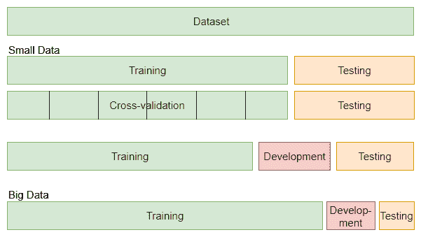
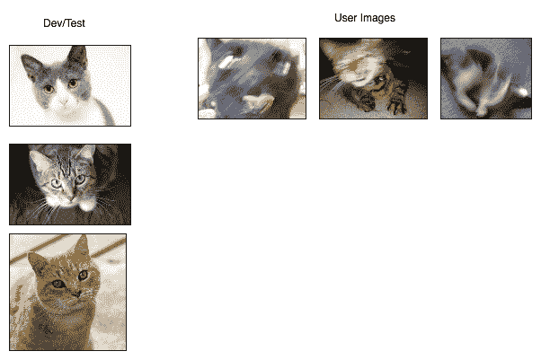
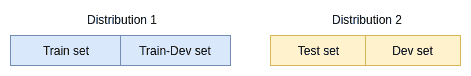
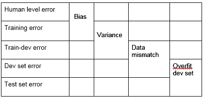
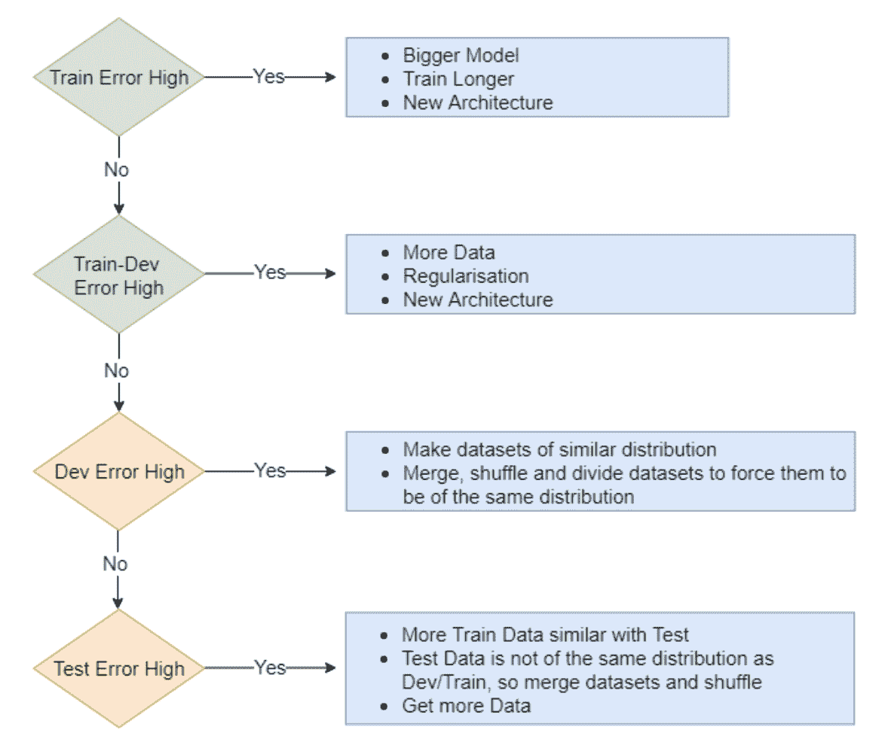
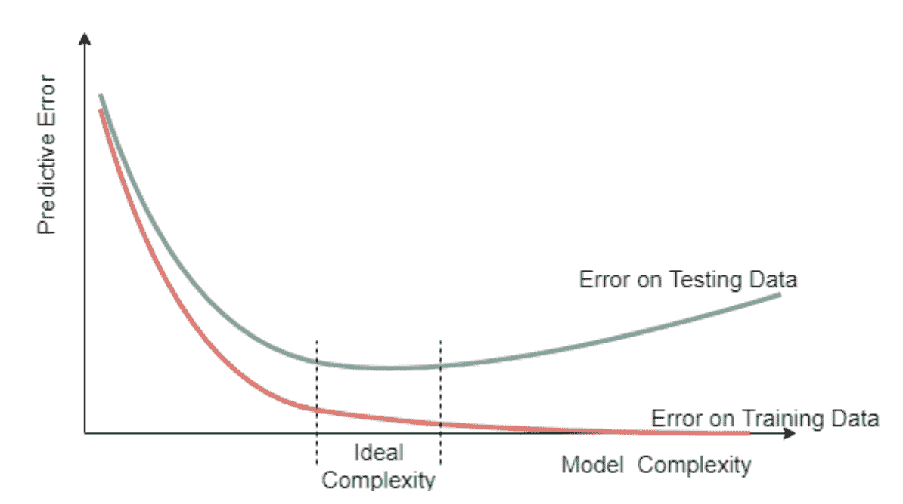
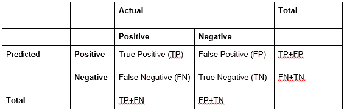
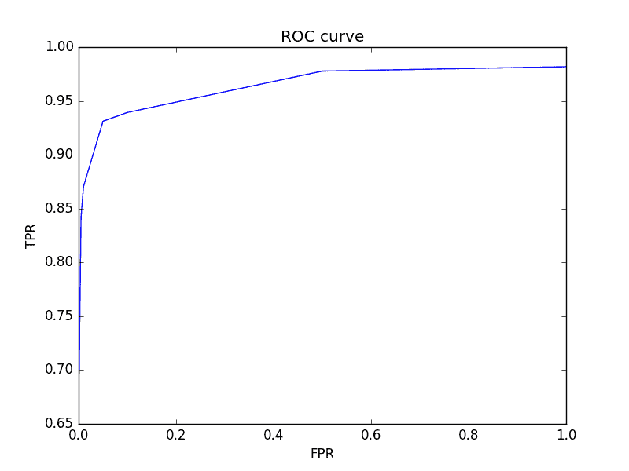
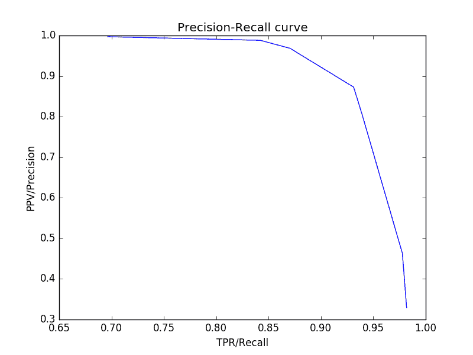

# 机器学习最佳实践和故障排除

在机器学习工程中，至关重要的是要知道如何在系统开发过程中进行操作，以避免陷阱并解决常见问题。 创建机器学习系统（最节省时间和金钱）的最简单方法是重用已应用于您自己的类似问题的代码和预先训练的模型。 如果这不能满足您的需求，那么您可能需要训练自己的 CNN 体​​系结构，因为有时这可能是解决问题的最佳方法。 但是，面临的最大挑战之一是找到针对您的问题量身定制的大规模，公开可用的数据集。 因此，通常情况下，您可能需要创建自己的数据集。 创建自己的数据集时，至关重要的是适当组织它，以确保成功进行模型训练。

在本章中，我们将介绍并讨论日常工作流程，这些工作流程将帮助您回答以下问题：

*   我应该如何分割数据集？
*   我的数据集足以代表我的问题吗？
*   我的模型要有效且准确应该有多复杂？
*   评估模型的最佳方法是什么？
*   我应该如何构造我的代码？

# 建立机器学习系统

为了构建机器学习系统，建议从一个新的小项目开始并逐步改进它：

1.  查找与您类似的问题并下载代码（并测试模型以检查结果）
2.  根据需要找到扩展计算的方法（即 AWS / Google Cloud）
3.  从较小的数据集开始，以避免浪费时间等待一个纪元
4.  从简单的架构开始
5.  使用可视化/调试（例如，TensorBoard）
6.  微调模型，微调超参数，深度，架构，层和损失函数
7.  扩展数据集并确保其尽可能干净
8.  将您的数据集分为训练，开发和测试集
9.  评估模型

# 资料准备

所有机器学习算法的骨干都是数据。 机器学习算法学习的一切都来自数据。 因此，至关重要的是向算法提供代表问题陈述的正确数据。 就像已经看到的那样，深度学习特别需要大量数据用于训练模型。 有时我们可以说一定数量的数据足以解决问题，但是却永远不够！ 多多益善。 能够正确训练的模型的复杂度与训练模型上的数据量成正比。 有限的数据将为该问题的模型体系结构选择设定上限。 在考虑可用数据量时，还值得注意的是，其中一部分也需要用于验证和测试目的。

下一节将讨论数据分区及其对任何机器学习任务进度的重要性。

# 训练/开发/测试集的划分

在讨论将数据划分到其中之前，让我们定义“训练集”，“开发集”和“测试集”。

*   **训练集**：用于训练机器学习算法的数据/示例集。 在机器学习中，此数据用于查找模型/分类器的“最佳”权重。 通常，使用的大多数数据都进入训练集。
*   **开发（开发）** / **验证集**：用于在训练的中间阶段评估模型/分类器的数据部分。 该集合用于微调超参数和评估具有各种配置的模型体系结构。 它在模型开发期间使用，而不是在最终模型评估中使用。
*   **测试集**：模型经过微调和充分训练（我们对训练/开发集的损失感到满意），我们认为它已完全训练。 然后评估该模型。 对其进行评估的数据称为测试集。 测试集由数据的看不见部分组成，因此提供了最终模型性能的无偏估计。

为了获得高性能的神经网络，将数据集正确划分为训练集，开发集和测试集非常重要。 它有助于更​​快地迭代。 另外，它允许更有效地测量算法的偏差和方差，以便我们可以选择有效方式进行改进的方法。

在以前的时代，我们拥有较小的数据集（例如最多 10,000 个示例）和简单的分类器，我们会将数据集拆分为训练和测试集。 通常将训练集分成较小的集，以使用称为交叉验证的技术来训练分类器。 优良作法是按 60/20/20 的比例拆分数据集（即 60％的训练数据，20％的开发数据，20％的测试数据）。 但是，大数据的现代时代已经改变了这一经验法则。 如果我们有 1,000,000 个示例，则拆分比例已更改为 98/1/1（即 98％的训练数据，1％的 dev 数据，1％的测试数据）。

随着我们拥有更多的数据，开发和测试集的比例将变小。



# 开发和测试集不匹配

除了拆分数据之外，数据的分布还对神经网络的性能产生巨大影响。 应用深度学习中的大多数问题来自开发人员和测试集数据分布的不匹配。 我们需要记住，开发和测试数据应该来自类似的分发。 例如，如果我们以如下方式收集和分割人员检测数据，即从网页上收集人员的训练图像，而使用移动电话收集测试集图像，则会出现分布不匹配的情况。 这里的问题是，在训练模型时，我们会根据其在 dev 数据上的性能来微调网络的参数和体系结构，如果 dev 数据与训练数据相似且与测试数据不同，则 dev 数据中存在很高的偏差 对训练集。 在开发集上获得良好的评估结果并不一定意味着该模型可以很好地推广。 在这种情况下，对分布完全不同的集合进行测试可能会导致不良结果。 这是浪费时间和精力。 解决方案是首先合并开发集和测试集，随机将它们洗牌，最后将洗过的数据再次拆分为开发集和测试集。 这有助于在将机器学习算法成功训练到最终应用程序方面取得更快的进展。

# 何时更改开发/测试集

根据评估指标对开发/测试集执行良好但不满足客户要求（即在部署时执行不佳）的算法，表明我们在数据集中缺少正确的目标数据。 在这种情况下，我们需要对数据集进行更改，因为它对于目标应用程序而言不够代​​表性。 考虑对猫图像进行分类。 如果训练/开发/测试集使用的是高分辨率，高质量的图像（姿势完美的猫），而目标应用正在查看具有不同视角的猫或运动中的图像（模糊），则可以期望 算法在部署时表现不佳。



# 偏差和方差

如第 2 章，“深度学习和卷积神经网络”中所讨论的，方差和偏差分别表示过拟合和欠拟合。 我们可以使用训练集，开发集和测试集错误来诊断“拟合不足”和“过度拟合”的问题。

考虑以下场景，其中我们的数据来自两个不同的分布，分别称为分布 1 和分布 2。分布 2 表示我们关心的目标应用程序。 问题是，我们如何在这种分布上定义训练，开发和测试集。



最好的方法是根据上图将其拆分。 分配 1 被拆分为训练集，其一部分用作开发集。 在这里，我们称其为“ Train-Dev 集”（因为开发集与火车集具有相同的分布）。 分布 1 主要用于训练，因为它是一个大型数据集。 发行版 2 分为测试集和开发集，它们与发行版 1 中的任一集无关。这里要强调的一点是，测试和开发集应来自同一发行版，并且属于我们实际上关心的应用程序，即 目标应用程序。 开发集和测试集通常是小的数据集，因为它们的目的是给出模型/算法的无偏性能估计。

模型在不同数据集分区上的误差差异，以及查看人为误差可为我们提供诊断偏见和方差问题的见解

下表显示了当左列中的集合之间存在误差时，应如何诊断。 N.B. 人为水平误差是此分析的基准，它为比较模型提供了基准。



下表可以更好地说明这一点。 在这些示例中，我们假设在所有情况下的最佳/人为错误均最小，即 1％。 通常，深度学习模型的准确性与人类相似，因此将其作为比较可帮助您找到良好的架构。

*   高偏差/拟合不足

| 人为/最佳错误 | 1% |
| 训练错误 | 15% |

与人员水平的表现相比，训练误差较大，这意味着该模型甚至无法拟合数据。 训练有素，因此欠拟合/高偏见。 但是，当我们在这种情况下查看 dev 错误时，它可以很好地概括，因此不会丢失所有内容。

*   高差异/过度拟合

| 训练错误 | 1.5% |
| 火车开发错误 | 30% |

在这种情况下，该模型在看不见的数据上表现不佳，该数据与训练集属于同一分布，但不是训练的一部分。 这意味着该模型无法概括，因此会过度拟合训练数据。

*   高方差和高偏见

| 训练错误 | 20% |
| 火车开发错误 | 40% |

这种情况是最坏的情况，因为我们观察到该模型无法正确拟合训练数据，并且不能很好地概括。 这可以通过更改模型架构来解决。

*   数据不匹配

| 火车开发错误 | 2% |
| 开发错误 | 15% |

当模型很好地适合来自与训练集相同分布的开发集，并且对来自不同分布的开发集表现不佳时，这会导致数据不匹配问题，如本章前面所述。

*   过度开发集

| 开发错误 | 2% |
| 测试错误 | 15% |

下图以流程图的形式介绍了解决上述问题的解决方案/指南：



ML 基本配方

有用的图表说明了测试和训练误差如何随模型复杂性而变化，如下所示。 一方面，当模型过于复杂时，往往会过度拟合训练数据，因此，训练误差减小而测试误差增大。 另一方面，较简单的模型往往不适合并且无法推广。 模型复杂度的理想范围是在“测试误差”开始增加之前以及“训练误差”接近零时的某个位置。



# 资料不平衡

我们已经看到了数据表示和分布在解决偏差和方差问题中的重要性。 我们遇到的另一个相关问题是分类任务中各个类之间的数据分配不均。 这称为数据不平衡。 例如，如果我们有一个二进制分类问题，并且其中一个类别有 50000 张图像，而另一个类别只有 1000 张图像，这可能会导致训练算法的性能出现巨大问题。 我们必须通过以下方法解决数据不平衡的问题：

# 收集更多数据

是的，最好使类数据分布相等。 收集尽可能多的数据，并用较少的样本填充类。 为此，您可以在互联网上搜索与您的问题相似的数据库并将其包括在内。 简单的网络搜索还可以带来许多由各种来源上传的图像。 有时您会发现，使用更多数据不会提高模型性能。 这表明您的模型可能已达到极限。

# 查看您的效果指标

分类准确性不是一个很好的衡量标准，尤其是当我们的数据不平衡时。 这种准确性将更倾向于具有更多数据的类。 有许多良好的性能评估指标可以真实地描述算法的执行方式，例如混淆矩阵，接收器**工作特性曲线**（ROC），**精确调用**（PR）曲线 和 F1 分数。 这些将在本章稍后详细说明。

# 数据综合/扩充

在无法从其他资源收集数据，数据集太小或收集的数据不能很好地表示的情况下，我们需要以某种方式自行生成数据。 这称为数据增强。 智能生成的数据可以解决许多问题，包括数据集不平衡，训练数据不足和过度拟合。

数据扩充通常是作为输入数据管道的一部分来完成的，该管道在训练时为模型提供数据。 随机地，而不是提供原始训练图像，您将应用一些增强来更改它。 有很多方法可以进行数据扩充，但是一些示例是：

*   增加噪音
*   应用几何变换
*   交换颜色通道
*   随机颜色扰动
*   调整亮度/对比度/色相

*   只需添加类似于网络存在问题的增强，例如，您的模型不适用于黑白图像； 只需将其添加为新的扩充

# 重采样数据

这是关于改变我们建立训练批次的方式。 我们通过更改选择特定类别的可能性来做到这一点。 例如，如果您有两个类 A 和 B，其中我们的 A 实例比 B 多得多，则可以更改采样系统以选择比 A 多的 B。

# 损失函数加权

我们还可以处理不平衡类，并通过将损失权重包括在内来处理不平衡数据的分类问题。 这种惩罚或权重迫使模型更多地关注少数群体（样本较少的类别）。 在前面的章节中讨论过的惩罚型 SVM 和焦点损失检测器算法就是这样的例子。

Tensorflow 已经具有其损失功能，并内置了加权选项：

*   `tf.losses.sparse_softmax_cross_entropy(labels=label, logits=logits, weights=weights)`
*   `Tf.nn.weighted_cross_entropy_with_logits`

例如，如果您尝试对 A，B，C 三个类别进行分类，其中 A 为 10％，B 为 45％，C 为 45％，则可以将`tf.losses.sparse_softmax_cross_entropy`用于以下权重：[1.0、0.3， 0.3]。

# 评估指标

在为模型选择评估指标时，我们还需要小心。 假设对于狗/非狗分类问题，我们有两种算法的准确度分别为 98％和 96％。 乍一看，这些算法看起来都具有相似的性能。 让我们记住，分类准确度定义为做出的正确预测数除以做出的预测总数。 换句话说，True Positive（TP）和 True Negative（TN）预测数除以预测总数。 但是，可能出现的情况是，随着狗图像的出现，我们还会得到大量被错误分类为狗的背景或类似外观的物体，通常称为误报（FP）。 另一个不良行为可能是许多狗图像被错误分类为负片或假阴性（FN）。 显然，根据定义，分类准确性不能捕获误报或误报的概念。 因此，需要更好的评估指标。

第一步，我们将构建一个混淆矩阵，该矩阵总结最后显示的段落：



根据此表，我们可以定义四个其他指标，这些指标可以使我们更好地了解已实现的结果。 这些是：

*   **真实阳性率（TPR）或灵敏度或召回率**：当物体存在时测试结果为阳性的概率（真实阳性率，以百分比表示）= TP /（TP + FN）
*   **假阳性率（FPR）**：是特定测试= FP /（FP + TN）错误拒绝实际阴性的概率
*   **阳性预测值（PPV）或精度**：当检测结果为阳性（以百分比表示）时该对象存在的概率= TP /（TP + FP）
*   **负预测值（NPV）**：测试阴性（表示为百分比）时不存在对象的概率= TN /（TN + FN）

为了更好地了解这些指标的实用性，我们以两种不同算法的以下两个混淆矩阵为例，并计算前面的指标。

范例 1：

|  | 正 | 负 |  |
| 预测积极 | 10（TP） | 13（FP） | 23 |
| 预测为负 | 75（FN） | 188（田纳西州） | 263 |
|  | 85 | 201 | 286 |

精度：（TP + TN）/（TP + TN + FP + FN）= 198/286 = 0.69 TPR：TP /（TP + FN）= 10/85 = 0.11 FPR：FP /（FP + TN）= 13 / 201 = 0.06 PPV：TP /（TP + FP）= 10/23 = 0.43 NPV：TN /（TN + FN）= 188/263 = 0.71

范例 2：

|  | 正 | 负 |  |
| 预测积极 | 0（TP） | 0（FP） | 0 |
| 预测为负 | 85（FN） | 201（田纳西州） | 286 |
|  | 85 | 201 | 286 |

精度：（TP + TN）/（TP + TN + FP + FN）= 201/286 = 0.70 TPR：TP /（TP + FN）= 0/85 = 0 FPR：FP /（FP + TN）= 0 / 201 = 0 PPV：TP /（TP + FP）= 0/0 = 0 NPV：TN /（TN + FN）= 201/286 = 0.70

在第一个示例中，我们可以得到 69％的正确精度，但是在第二个示例中，通过仅对每个示例进行预测，我们实际上将我们的精度提高到 70％！ 显然，仅预测所有事物为负类的模型并不是一个很好的模型，这就是我们所说的准确性悖论。 简单来说，“准确性悖论”说，即使模型可能具有更高的准确性，但实际上可能并不是更好的模型。

如前面的示例中所示，当类别不平衡变大时，更可能发生这种现象。 鼓励读者对包含 85 个正样本和 85 个负样本的平衡数据集重复上述测试。 如果假阳性与假阴性的比例与前面的示例相同，则这将导致第一个示例的分类准确度为 52％，第二个示例的分类准确度为 50％，这表明准确性悖论不适用于平衡数据集。

为了能够正确评估算法，我们需要查看其他评估指标，例如 TPR 和 FPR。 我们可以看到在第二个示例中它们都为零，这表明算法根本无法检测到所需的正向对象。

使用精度度量的不平衡数据集的另一种情况是癌症测试，其中生病的人数大大少于健康的人数。 以下是为此解决的示例。

|  | 生病 | 健康 | 总 |
| 测试结果肯定 | 99（TP） | 999（FP） | 1,098 |
| 测试结果阴性 | 1（FN） | 98,901（田纳西州） | 98,902 |
| 总 | 100 | 99,900 | 100,000 |

精度：（TP + TN）/（TP + TN + FP + FN）= 0.99 TPR：TP /（TP + FN）= 0.99 FPR：FP /（FP + TN）= 0.01 PPV：TP /（TP + FP） = 0.09 净现值：TN /（TN + FN）= 0.99

此处的测试似乎表现不错，因为准确性为 99％。 但是，如果您被诊断出患有癌症，这并不意味着您患该病的可能性为 99％。 应该注意的是，在 1098 个测试阳性的患者中，只有 99 个患有该疾病。 这意味着，如果您获得了阳性测试，那么对于准确度高达 99％的测试，您实际患病的可能性仅为 9％。

这些示例很好地警告了我们的目标是在测试数据中进行均衡分配，尤其是当您使用准确性指标比较不同模型的有效性时。

比较不同算法的其他有用方法是精确调用和接收器操作特性曲线。 如果我们针对不同的阈值计算上述指标，则可以绘制这些图。 如果我们算法的输出不是二进制的（0 表示负数，1 表示正数），但分数在测试为正时接近 1，而在测试为负时接近零，那么 TP，TN，FP，FN 的数量将取决于 在我们选择的阈值上。

让我们以图像中猫检测为例。 对于每个区域，分类器输出一个分数，该分数显示出它对检测的信心。 如果将阈值设置为 0.5，则 0.6 的分数表示检测为阳性，而 0.45 的分数表示阴性。 如果阈值降低到 0.4，则两次检测都将变为阳性。 下表说明了前面的指标随阈值而变化的情况。

| 阈 | FPR | TPR | PPV | TP | TN | FN | FP |
| 0.72 | 1 | 0.98 | 0.33 | 487 | 0 | 7 | 990 |
| 0.88 | 0.5 | 0.97 | 0.46 | 485 | 430 | 9 | 560 |
| 0.97 | 0.1 | 0.94 | 0.8 | 464 | 878 | 30 | 112 |
| 0.99 | 0.05 | 0.93 | 0.87 | 460 | 923 | 34 | 67 |
| 1.06 | 0.01 | 0.87 | 0.96 | 430 | 976 | 64 | 14 |
| 1.08 | 0.005 | 0.84 | 0.98 | 416 | 985 | 78 | 5 |
| 1.16 | 0.001 | 0.69 | 0.99 | 344 | 989 | 150 | 1 |

如果将 FPR 与 TPR 作图，我们将得到所谓的 ROC（接收机操作员特性）曲线，如下所示：



要获得精确召回（PR）曲线，我们需要针对精确度/ PPV 绘制召回率/ TPR。 下图显示了该曲线的示例。 建议读者进一步研究如何解释 ROC 和 PR 曲线。



# 代码结构最佳实践

在前面的章节中，我们将张量流图封装到一个类中，而无需进一步讨论。 这个想法本身已经是很好的编码实践。 有一个班级负责构建图形并仅公开对使用模型有用的东西（即输入/输出）是一种很好的编程习惯，可以节省大量时间。

# 单例模式

使用设计模式来解决一些软件设计问题也是一种常见的做法。 python 中最简单，最有用的设计模式之一就是单例模式。 当您只想将一个类的实例强制仅用于一个对象时，可以使用它，因此，即使您在项目中的多个不同位置多次实例化该类，也将引用同一个对象。 在我们的情况下，如果我们要求 TensorFlow 创建具有相同名称的多个节点或图形，则会引发错误。 因此，我们在创建图形时使用单例模式，以避免生成两次。

在下面的示例中，我们总结了一个简单的分类模型，同时还确保不会多次构建图形（也称为 Singleton 模式）。

注意`__new__`类方法的定义。 在 Python 中，当我们创建一个类的新实例时，将调用`__new__`。

```py
class CAE_CNN_Encoder(object): 
   __instance = None 

   # Singleton pattern 
   def __new__(cls): 
       if CAE_CNN_Encoder.__instance is None: 
           # First time new is called 
           CAE_CNN_Encoder.__instance = object.__new__(cls) 
           CAE_CNN_Encoder.__instance.build_graph() 
       return CAE_CNN_Encoder.__instance 

   def build_graph(self, img_size=28): 
       self.__x = tf.placeholder(tf.float32, shape=[None, img_size * img_size], name='IMAGE_IN') 
       self.__x_image = tf.reshape(self.__x, [-1, img_size, img_size, 1]) 
       self.__y_ = tf.placeholder("float", shape=[None, 10], name='Y') 

       with tf.name_scope('ENCODER'): 
           ##### ENCODER 
           # CONV1: Input 28x28x1 after CONV 5x5 P:2 S:2 H_out: 1 + (28+4-5)/2 = 14, W_out= 1 + (28+4-5)/2 = 14 
           self.__conv1_act = tf.layers.conv2d(inputs=self.__x_image, strides=(2, 2), name='conv1', 
                                               filters=16, kernel_size=[5, 5], padding="same", activation=tf.nn.relu) 

           # CONV2: Input 14x14x16 after CONV 5x5 P:0 S:2 H_out: 1 + (14+4-5)/2 = 7, W_out= 1 + (14+4-5)/2 = 7 
           self.__conv2_act = tf.layers.conv2d(inputs=self.__conv1_act, strides=(2, 2), name='conv2', 
                                               filters=32, kernel_size=[5, 5], padding="same", activation=tf.nn.relu) 

       with tf.name_scope('LATENT'): 
           # Reshape: Input 7x7x32 after [7x7x32] 
           self.__enc_out = tf.layers.flatten(self.__conv2_act, name='flatten_conv2') 
           self.__dense = tf.layers.dense(inputs=self.__enc_out, units=200, activation=tf.nn.relu, name='fc1') 
           self.__logits = tf.layers.dense(inputs=self.__dense, units=10, name='logits') 

   def __init__(self, img_size=28): 
       if CAE_CNN_Encoder.__instance is None: 
           self.build_graph(img_size) 

   @property 
   def output(self): 
       return self.__logits 

   @property 
   def labels(self): 
       return self.__y_ 

   @property 
   def input(self): 
       return self.__x 

   @property 
   def image_in(self): 
       return self.__x_image
```

# CNN 创建食谱

以下几点基于我们在训练神经网络方面的经验以及该领域研究人员认为的当前最佳实践。 希望如果您需要从头开始设计自己的 CNN 架构，他们将为您提供帮助。 但是，在尝试设计自己的 CNN 之前，您应该查看其他现成的体系结构以从中学习，并检查它们是否已经为您完成了工作。

1.  使用内核大小为 3x3 的卷积层。 就参数和计算而言，较大的内核更昂贵。 最重要的是，如我们在前面的章节中所看到的，您可以堆叠卷积层以产生更大的接收场，并受益于更多的非线性激活。
2.  第一层卷积通常应至少具有 32 个过滤器。 这样，更深的层不受第一层提取的特征数量的限制。
3.  尽可能避免使用池化层。 相反，请使用步长为 2 的卷积层。这将像池化那样对输入进行下采样，但它不会像池化那样丢弃宝贵的信息。 同样，使用跨步卷积就像将 conv 和合并在一层中一样。
4.  减小要素地图的空间大小时，应增加使用的过滤器数量，以免丢失过多信息。 在深度网络中，请避免在第一层中过快减小空间大小。
5.  请遵循本章中有关从小规模开始网络设计，然后逐渐增加复杂性的建议，以避免出现过大的问题。
6.  使用 batchnorm。 确实有助于训练您的网络！
7.  随着您对网络的深入了解，逐渐减小要素地图的空间大小。
8.  最小化 FC 层的数量（在最后一层之前使用 dropout）。 仅在最终需要连接某些标量特征时才使用 FC。 （您甚至可以通过在输入通道上进行编码来避免这种情况）
9.  如果您需要较大的接收场（物体大小接近总图像大小的检测或分类），请尝试对每层使用具有指数膨胀因子的膨胀卷积。 这样，您将在保持少量参数的同时非常迅速地扩大接收范围。

10.  如果网络变深并且训练损失没有减少，请考虑使用剩余连接。
11.  在使网络精度在期望值之内并且如果计算成本成为问题之后，您可能会根据使用情况，研究深度卷积，瓶颈模块之类的技术，或现场出现的任何技术。

请记住，CNN 的训练和设计是一门经验丰富的科学，因此请始终注意，被视为最佳实践的内容会迅速发生变化。

# 摘要

在本章中，我们了解到遵循最佳实践将对作为机器学习工程师的日常活动有所帮助。 我们已经看到了如何准备数据集并将其拆分为子集，以促进对网络的正确训练和微调。 此外，我们还研究了执行有意义的测试，其中获得的结果代表了将模型部署到目标应用程序时所看到的结果。 涉及的另一个主题是对数据的过度拟合和不足，以及为了解决这些问题而应遵循的最佳实践。 此外，解决了数据集不平衡的问题，我们已经看到了一个简单的示例，该示例可能在哪里找到（疾病诊断）。 为了解决这个问题，建议收集更多的数据，扩充数据集并选择不平衡数据集不变的评估指标。 最后，展示了如何构造代码以使其更具可读性和重用性。

在下一章中，我们将看到如何管理大型数据集以及如何将训练过程扩展到多个 GPU 和系统。