# 机器学习基础

有一天，人工智能将像看非洲平原上的化石骨架一样回望我们。 一只生活在尘土中的直立猿，用粗俗的语言和工具灭绝。

–内森·贝特曼（Nathan Bateman），前 Machina（电影节 2014）

这句话似乎夸大了核心内容，难以理解，但是随着技术和科学的进步，谁知道呢？ 作为一个物种，我们一直梦想创造出智能的，具有自我意识的机器。 随着研究，技术和计算能力民主化的最新发展，**人工智能**（**AI**），**机器学习**（**ML**） 深度学习已在技术人员和一般人群中引起了极大的关注和炒作。 尽管好莱坞承诺的未来值得商,，但我们已经开始在日常生活中看到和使用智能系统。 从诸如 Google Now，Siri，Alexa 和 Cortana 之类的智能对话引擎，到无人驾驶汽车，我们正在日常工作中逐渐接受这种智能技术。

随着我们步入学习机器的新时代，重要的是要了解基本概念和概念已经存在了一段时间，并且已经被地球上的聪明人不断改进。 众所周知，全球数据的 90％是在最近几年中创建的，并且我们将以越来越高的速度继续创建更多的数据。 机器学习，深度学习和人工智能领域帮助我们利用这些海量数据来解决各种现实问题。

本书分为三个部分。 在第一部分中，我们将开始与 AI，ML 和深度学习相关的基本概念和术语，然后是深度学习架构的深入细节。

本章为读者提供了有关 ML 基本概念的快速入门，然后在后续各章中开始进行深度学习。 本章涵盖以下方面：

*   ML 简介
*   机器学习方法
*   CRISP-DM-机器学习项目的工作流程
*   ML 管道
*   探索性数据分析
*   特征提取与工程
*   功能选择

本书的每一章都基于前几章的概念和技术。 精通 ML 和深度学习基础知识的读者可以选择他们认为必要的主题，但建议顺序阅读这些章节。 您可以在 [GitHub 存储库](https://github.com/dipanjanS/hands-on-transfer-learning-with-python)中的`Chapter 1`文件夹中快速阅读本章的代码。 可以根据需要参考本章。

# 为什么要 ML？

我们生活的世界中，我们的日常工作涉及与数字世界的多个接触点。 我们有计算机协助我们进行通讯，旅行，娱乐等。 我们一直无缝使用的数字在线产品（应用程序，网站，软件等）帮助我们避免了平凡而又重复的任务。 这些软件已由程序员明确使用每条指令进行编程以使这些软件能够执行定义的任务，并使用计算机编程语言（如 C，C ++，Python，Java 等）开发。 下图描述了计算设备（计算机，电话等）与带有输入和定义的输出的显式编程的软件应用程序之间的典型交互：

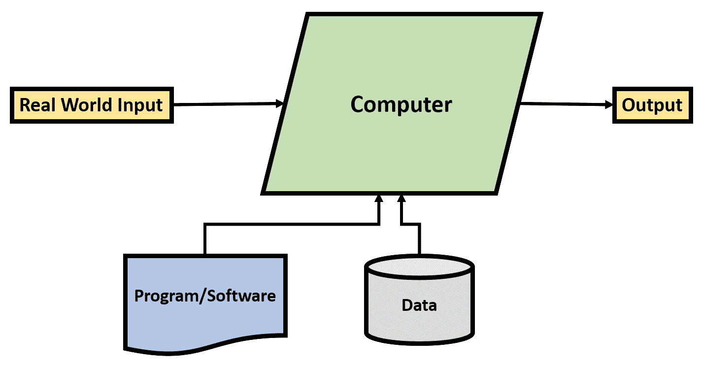

传统编程范例

尽管当前的范例已经在帮助我们开发出惊人的复杂软件/系统，以一种非常有效的方式来解决来自不同领域和方面的任务，但它们仍需要有人为此类程序定义并编写明确的规则才能工作。 这些任务对于计算机来说很容易解决，但对人类来说却是困难或费时的。 例如，执行复杂的计算，存储大量数据，通过庞大的数据库进行搜索等等都是可以在定义规则后由计算机有效执行的任务。

然而，还有另一类问题可以由人类直观地解决，但是很难编程。 对象识别，玩游戏等问题对我们来说很自然，但很难用一组规则来定义。 艾伦·图灵（Alan Turing）在他的地标性论文[《计算机械和智能》](https://www.csee.umbc.edu/courses/471/papers/turing.pdf)中介绍了**图灵测试**，讨论了通用计算机以及它们是否能够执行此类任务。

这种体现了通用计算思想的新范式在更广泛的意义上促成了 AI 的产生。 这种新的范式，更好地称为 ML 范式，是计算机或机器从经验（类似于人类学习）中学习来解决任务的方法，而不是经过明确编程才能做到的。

因此，人工智能是研究的一个涵盖领域，而机器学习和深度学习是其中的特定研究子领域。 AI 是一个通用字段，还包括其他子字段，可能涉及也可能不涉及学习（例如，参见符号 AI）。 在本书中，我们将把时间和精力仅用于 ML 和深度学习。 人工智能，机器学习和深度学习的范围可以可视化如下：

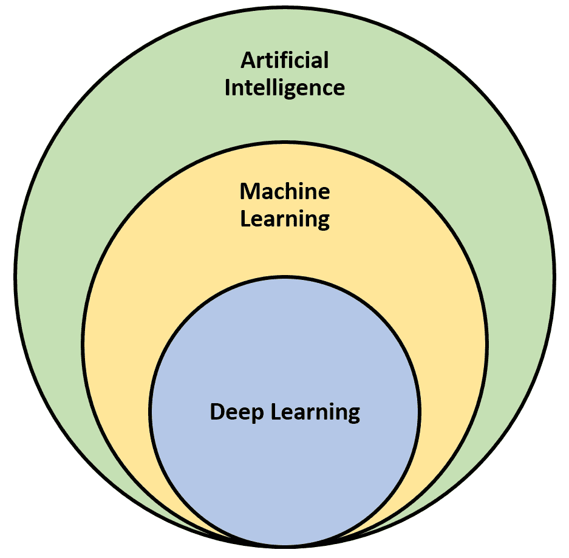

人工学习的范围，以机器学习和深度学习为子领域

# 正式定义

由汤姆·米切尔（Tom Mitchell）提出的 ML 的正式定义解释如下。

如果计算机程序在 *T* 上的性能，则据说该计算机程序可以从 *E* 的经验中学习某些任务 *T* 和某些性能指标 *P* 。 *P* 所衡量的，会随着经验 *E* 而提高。

该定义以非常简洁的方式很好地捕捉了 ML 的本质。 让我们以现实世界为例，以更好地理解它。 让我们考虑一个任务（*T*）是识别垃圾邮件。 现在，我们可能会向有关垃圾邮件和非垃圾邮件的系统提供许多示例（或经验），从中可以学习而不是对其进行明确编程。 然后可以在学习到的识别垃圾邮件的任务上对程序或系统的性能进行测量（*P*）。 有趣，不是吗？

# 浅层和深度学习

因此，ML 的任务是从训练示例中识别模式，并将这些学习到的模式（或表示形式）应用于新的看不见的数据。 ML 有时也称为**浅层学习**，因为它学习*单层表示形式*的性质（在大多数情况下）。 这使我们想到“表示层是什么”和“什么是深度学习”，我们将在后续章节中回答这些问题。 让我们快速了解一下深度学习。

深度学习是机器学习的一个子领域，它涉及从训练示例中学习连续的有意义的表示，以解决给定的任务。 深度学习与人工神经网络紧密相关，人工神经网络由一个接一个的堆叠的多层组成，这些层捕获连续的表示。

如前所述，不要担心是否难以理解和理解，我们将在后续章节中更深入地介绍。

由于我们正在生成和收集的数据量以及更快的计算能力，ML 已成为流行语。 在以下各节中，让我们更深入地研究 ML。

# 机器学习技术

ML 是 AI 的一个流行子领域，涵盖了非常广泛的领域。 如此受欢迎的原因之一是在其能力范围内的复杂算法，技术和方法的综合工具箱。 多年来，该工具箱已经得到开发和改进，并且正在不断研究新的工具箱。 为了明智地理解和使用 ML 工具箱，请考虑以下几种分类方法。

基于人工监督量的分类：

*   **监督学习**：此类学习涉及人为监督。 在监督学习下的算法利用训练数据和相关的输出来学习两者之间的映射，并将其应用于看不见的数据。 分类和回归是监督学习算法的两种主要类型。
*   **无监督学习**：此类算法尝试从输入数据中学习固有的潜在结构，模式和关系，而没有任何关联的输出/标签（人工监督）。 聚类，降维，关联规则挖掘等是无监督学习算法的几种主要类型。
*   **半监督学习**：此类算法是监督学习和无监督学习的混合体。 在这种情况下，该算法可处理少量带标签的训练数据和更多未标记的数据。 因此创造性地利用了监督和非监督方法来解决给定的任务。
*   **强化学习**：这类算法与有监督和无监督学习方法有些不同。 这里的中心实体是一个代理，它会在一段时间内进行训练，同时与环境互动以最大化奖励/奖励。 代理基于与环境的交互所获得的奖励/惩罚，反复学习和更改策略/策略。

根据数据可用性进行分类：

*   **批量学习**：这也称为**离线学习**。 当所需的培训数据可用时，将使用这种类型的学习，并且可以在部署到生产/现实世界中之前对模型进行培训和微调。
*   **在线学习**：顾名思义，在这种情况下，一旦数据可用，学习就不会停止。 而是在这种情况下，将数据以小批量的形式输入到系统中，并且训练过程将使用新的一批数据继续进行。

前面讨论的分类为我们提供了如何组织，理解和利用 ML 算法的抽象视图。 将它们分类的最常见方法是有监督和无监督学习算法。 让我们更详细地介绍这两个类别，因为这将有助于我们开始进一步的高级主题，稍后再进行介绍。

# 监督学习

监督学习算法是一类利用数据样本（也称为**训练样本**）和相应的输出（或**标签**）推断两者之间映射功能的算法。 推断的映射函数或学习的函数是此训练过程的输出。 然后，将学习的功能用于正确映射新的和看不见的数据点（输入元素）以测试学习的功能的性能。

监督学习算法的一些关键概念如下：

*   **训练数据集**：在训练过程中使用的训练样本和相应的输出称为**训练数据**。 形式上，训练数据集是一个由两个元素组成的元组，由输入元素（通常是向量）和相应的输出元素或信号组成。
*   **测试数据集**：用于测试学习功能性能的未知数据集。 该数据集也是一个包含输入数据点和相应输出信号的二元组。 该集合中的数据点不用于训练阶段（此数据集也进一步分为验证集合；我们将在后续章节中对此进行详细讨论）。
*   **习得函数**：这是训练阶段的输出。 也称为*推断函数*或*模型*。 根据训练数据集中的训练示例（输入数据点及其对应的输出）推断此功能。 理想的模型/学习的函数将以这样的方式学习映射，即可以将结果也推广到看不见的数据。

有多种可用的监督学习算法。 根据用例需求，可以将它们主要分类为分类和回归模型。

# 分类

简而言之，这些算法可帮助我们回答*客观*问题或*是/否*预测。 例如，“这些算法在这样的场景下有用吗”或“该肿瘤会癌变吗”等。

形式上，分类算法的主要目标是根据输入数据点预测本质上属于分类的输出标签。 输出标签本质上是分类的； 也就是说，它们每个都属于离散的类或类别。

**Logistic 回归**，**支持向量机**（**SVM**），**神经网络**，**随机森林**， **k 最近邻**（**KNN**），**决策树**等是一些流行的分类算法。

假设我们有一个真实的用例来评估不同的汽车模型。 为简单起见，让我们假设该模型可以根据多个输入训练样本预测每种汽车模型的输出是可接受的还是不可接受的。 输入的训练样本具有诸如购买价格，门数，容量（以人数计）和安全性的属性。

除类标签之外的级别将每个数据点表示为可接受或不可接受。 下图描述了即将出现的二分类问题。 分类算法将训练样本作为输入以准备监督模型。 然后，利用该模型来预测新数据点的评估标签：

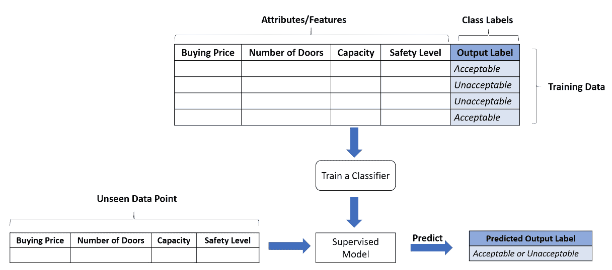

监督学习：用于汽车模型评估的二分类

由于在分类问题中输出标签是离散类，因此如果只有两个可能的输出类，则该任务称为**二分类问题**，否则称为多类分类。 预测明天是否下雨将是一个二分类问题（输出是“是”或“否”），而从扫描的手写图像中预测数字将是具有 10 个标签（零到九个可能的输出标签）的多类分类。 。

# 回归

此类监督学习算法有助于我们回答*数量*或*定量*类型的问题。 正式而言，回归模型的关键目标是价值估算。 在这种情况下，输出标签本质上是连续的（相对于分类而言是离散的）。

在回归问题的情况下，输入数据点称为*自变量*或*解释变量*，而输出称为*因变量*。 还使用训练数据样本来训练回归模型，该训练数据样本包括输入（或独立）数据点以及输出（或相关）信号。 线性回归，多元回归，回归树等是一些监督式回归算法。

可以基于建模模型如何对因变量和自变量之间的关系建模来进一步分类。

**简单线性回归**模型适用于单个自变量和单个因变量。 **普通最小二乘**（**OLS**）回归是一种流行的线性回归模型。 多元回归或多元回归是只有一个因变量的地方，而每个观察值都是由多个解释变量组成的向量。

多项式回归模型是多元回归的一种特殊情况。 在此，因变量被建模为自变量的第 n 次幂。 由于多项式回归模型拟合或映射因变量和自变量之间的非线性关系，因此这些也称为**非线性回归**模型。

以下是线性回归的示例：

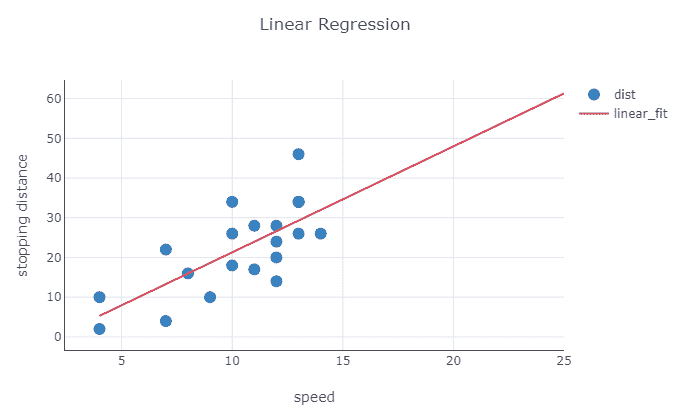

监督学习：线性回归

为了理解不同的回归类型，让我们考虑一个真实的用例，它基于汽车的速度来估计汽车的停止距离。 在这里，根据我们拥有的训练数据，我们可以将停车距离建模为速度的线性函数或汽车速度的多项式函数。 请记住，主要目的是在不过拟合训练数据本身的情况下最大程度地减少错误。

上图描述了线性拟合，而下图描述了同一数据集的多项式拟合：

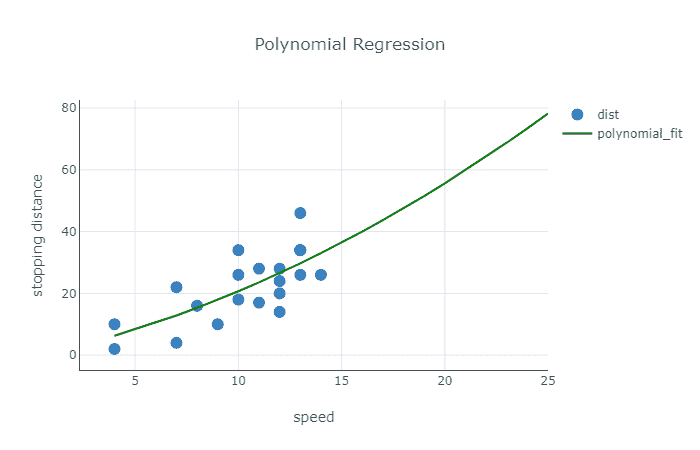

监督学习：多项式回归

# 无监督学习

顾名思义，此类算法无需监督即可学习/推断概念。 与监督学习算法基于包含输入数据点和输出信号的训练数据集推断映射功能不同，无监督算法的任务是在训练数据中查找模式和关系，而训练数据集中没有可用的输出信号。 这类算法利用输入数据集来检测模式，并挖掘规则或组/集群数据点，以便从原始输入数据集中提取有意义的见解。

当我们没有包含相应输出信号或标签的训练集的自由时，无监督算法会派上用场。 在许多实际场景中，可以使用没有输出信号的数据集，很难手动标记它们。 因此，无监督算法有助于弥补这种差距。

与监督学习算法类似，也可以对非监督算法进行分类，以易于理解和学习。 以下是无监督学习算法的不同类别。

# 聚类

分类的无监督等效项称为**聚类**。 这些算法可以帮助我们将数据点聚类或分组为不同的组或类别，而无需在输入/训练数据集中使用任何输出标签。 这些算法尝试使用固有特征基于某种相似性度量将输入数据集中的模式和关系查找到不同的组中，如下图所示：

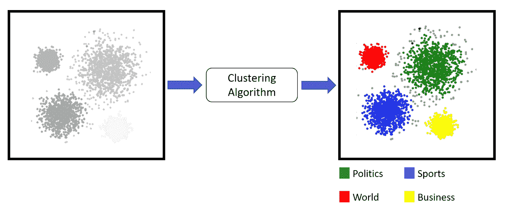

无监督学习：将新闻文章聚类

有助于理解群集的真实示例可以是新闻文章。 每天有数百篇新闻文章，每一篇都涉及从政治，体育到娱乐等不同主题。 如上图所示，可以使用聚类来实现将这些物品组合在一起的无监督方法。

有多种执行聚类过程的方法。 最受欢迎的是：

*   基于质心的方法。 流行的是 K-均值和 K-medoids。
*   聚集和分裂的层次聚类方法。 流行的是沃德氏和亲和力传播。
*   基于数据分布的方法，例如高斯混合模型。
*   基于密度的方法，例如 DBSCAN 等。

# 降维

数据和 ML 是最好的朋友，但是越来越多的数据带来了很多问题。 大量的属性或膨胀的特征空间是一个常见问题。 较大的特征空间在分析和可视化数据时会带来问题，以及与训练，内存和空间限制有关的问题。 这也被称为**维度诅咒**。 由于无监督方法可以帮助我们从未标记的训练数据集中提取见解和模式，因此它们也有助于我们减少维度。

换句话说，无监督方法通过帮助我们从完整的可用列表中选择一组代表性的特征来帮助我们减少特征空间：

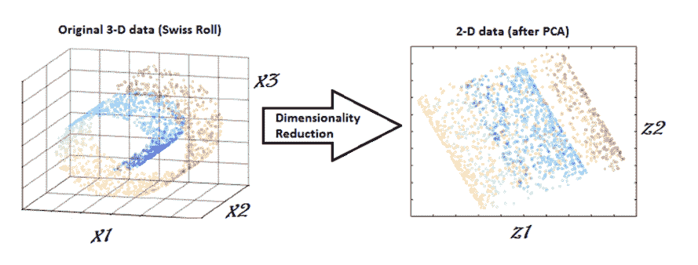

无监督学习：使用 PCA 减少维度

**主成分分析**（**PCA**），最近邻和判别分析是一些流行的降维技术。

上图是对基于 PCA 的降维技术工作的著名描述。 它显示了瑞士卷形状，其中数据以三维空间表示。 PCA 的应用导致将数据转换为二维空间，如图的右侧所示。

# 关联规则挖掘

这类无监督的 ML 算法有助于我们理解事务数据集并从中提取模式。 这些算法也称为**市场篮子分析**（**MBA**），可帮助我们识别跨交易的项目之间有趣的关系和关联。

使用关联规则挖掘，我们可以回答诸如“人们在给定商店中一起购买了哪些物品*或*购买葡萄酒的人也倾向于购买奶酪吗”之类的问题等等。 FP-growth，ECLAT 和 Apriori 是用于关联规则挖掘任务的最广泛使用的算法。

# 异常检测

异常检测是根据历史数据识别罕见事件/观测的任务。 异常检测也称为**离群值检测**。 异常或离群值通常具有以下特征：不经常发生或随时间推移而突然突然爆发。

对于此类任务，我们为算法提供了历史数据集，因此它可以以无监督的方式识别和了解数据的正常行为。 学习后，该算法将帮助我们识别与该学习行为不同的模式。

# CRISP-DM

**跨行业数据挖掘标准流程**（**CRISP-DM**）是数据挖掘和分析项目中最流行且使用最广泛的流程之一。 CRISP-DM 提供了所需的框架，该框架清楚地概述了执行数据挖掘和分析项目所需的步骤和工作流程，从业务需求到最终部署阶段以及介于两者之间的所有内容。

CRISP-DM 以首字母缩略词本身更广为人知，是一种经过尝试，测试且可靠的行业标准过程模型，适用于数据挖掘和分析项目。 CRISP-DM 清楚地描述了执行任何项目所必需的步骤，过程和工作流，从正式的业务需求到测试和部署解决方案以将数据转化为见解。 数据科学，数据挖掘和 ML 都是要尝试运行多个迭代过程以从数据中提取见解和信息。 因此，我们可以说，分析数据的确是一门艺术，也是一门科学，因为它并非总是无缘无故地运行算法。 许多主要工作涉及了解业务，所投入工作的实际价值以及表达最终结果和见解的正确方法。

数据科学和数据挖掘项目本质上是迭代的，以从数据中提取有意义的见解和信息。 数据科学与科学一样具有艺术性，因此在应用实际算法（再次经过多次迭代）并最终进行评估和部署之前，需要花费大量时间来了解业务价值和手头的数据。

与具有不同生命周期模型的软件工程项目相似，CRISP-DM 可帮助我们从头到尾跟踪数据挖掘和分析项目。 该模型分为六个主要步骤，涵盖从业务和数据理解到评估和最终部署的各个方面，所有这些本质上都是迭代的。 请参见下图：

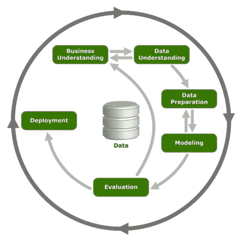

描述 ML 项目工作流程的 CRISP-DM 模型

现在让我们更深入地研究六个阶段中的每个阶段，以更好地了解 CRISP-DM 模型。

# 业务了解

第一步也是最重要的一步是了解业务。 这一关键步骤始于设置业务环境和问题要求。 正式定义业务需求对于将其转换为数据科学和分析问题陈述至关重要。 此步骤还用于为业务和数据科学团队设置期望和成功标准，使其位于同一页面上并跟踪项目进度。

此步骤的主要交付成果是详细计划，包括主要里程碑，时间表，假设，约束，警告，预期问题和成功标准。

# 数据理解

数据收集和理解是 CRISP-DM 框架的第二步。 在这一步中，我们将进行更深入的了解，以了解和分析上一步中形式化的问题陈述的数据。 此步骤开始于调查先前详细项目计划中概述的各种数据源。 然后将这些数据源用于收集数据，分析不同的属性并记录数据质量。 此步骤还涉及通常称为探索性数据分析的内容。

**探索性数据分析**（**EDA**）是非常重要的子步骤。 在 EDA 期间，我们分析了数据的不同属性，属性和特征。 我们还将 EDA 期间的数据可视化，以更好地理解和发现以前可能看不见或忽略的模式。 此步骤为后续步骤奠定了基础，因此，这一步骤根本不能忽略。

# 资料准备

这是任何数据科学项目中的第三步，也是最耗时的步骤。 一旦我们了解了业务问题并探索了可用数据，便会进行数据准备。 此步骤涉及数据集成，清理，整理，特征选择和特征工程。 首先，最重要的是数据集成。 有时候，可以从各种来源获得数据，因此需要根据某些键或属性进行组合以更好地使用。

数据清理和整理是非常重要的步骤。 这涉及处理缺失值，数据不一致，修复不正确的值以及将数据转换为可摄取格式，以便 ML 算法可以使用它们。

数据准备是最耗时的步骤，占任何数据科学项目总时间的 60-70％以上。 除了数据集成和处理之外，此步骤还包括根据相关性，质量，假设和约束条件选择关键功能。 这也称为**特征选择**。 有时候，我们不得不从现有特征中衍生或生成特征。 例如，根据用例要求，从出生日期算起年龄等等。 此步骤称为**特征工程**，并且根据用例再次需要此步骤。

# 造型

第四步或建模步骤是进行实际分析和机器学习的地方。 此步骤将在上一步中准备的干净和格式化的数据用于建模目的。 这是一个迭代过程，与数据准备步骤同步工作，因为模型/算法需要具有不同属性集的不同设置/格式的数据。

此步骤涉及选择相关工具和框架，以及选择建模技术或算法。 此步骤包括基于业务理解阶段中确定的期望和标准进行模型构建，评估和模型微调。

# 评价

一旦建模步骤生成满足成功标准，性能基准和模型评估指标的模型，就需要进行彻底的评估。 在此步骤中，我们将在进行部署阶段之前考虑以下活动：

*   基于质量并与业务目标保持一致来对结果评估进行建模
*   确定做出的任何其他假设或放松约束
*   数据质量，信息丢失以及数据科学团队和/或**主题专家**（**中小企业**）的其他反馈
*   端到端 ML 解决方案的部署成本

# 部署方式

CRISP-DM 模型的最后一步是部署到生产。 在多次迭代过程中开发，微调，验证和测试的模型将保存起来并准备用于生产环境。 构建了适当的部署计划，其中包括有关硬件和软件要求的详细信息。 部署阶段还包括进行检查和监视方面，以评估生产中的模型的结果，性能和其他指标。

# 标准 ML 工作流程

CRISP-DM 模型提供了用于 ML 和相关项目管理的高级工作流。 在本节中，我们将讨论用于处理 ML 项目的技术方面和标准工作流的实现。 简而言之，ML 管道是一个端到端的工作流程，由数据密集型项目的各个方面组成。 一旦涵盖了业务理解，风险评估以及 ML 或数据挖掘技术选择等初始阶段，我们便会着手推动项目的解决方案空间。 下图显示了具有不同子组件的典型 ML 管道或工作流：

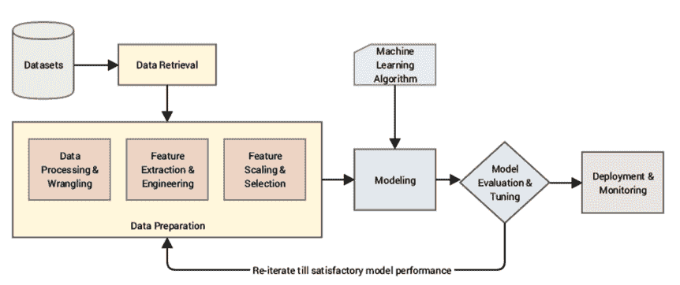

典型的 ML 管道

标准 ML 管道大致包括以下阶段。

# 资料检索

数据收集和提取通常是故事的起点。 数据集有各种形式，包括结构化和非结构化数据，这些数据通常包括丢失或嘈杂的数据。 每种数据类型和格式都需要特殊的机制来进行数据处理和管理。 例如，如果一个项目涉及对推文的分析，我们需要使用 Twitter API 并开发机制以提取所需的推文，这些推文通常为 JSON 格式。

其他场景可能涉及已经存在的结构化或非结构化公共数据集或私有数据集，除了仅开发提取机制外，这两种情况都可能需要其他权限。 Sarkar 和他们的合著者在《Python 机器学习》的第 3 章中讨论了与使用各种数据格式有关的相当详细的内容，如果您有兴趣进一步研究，请参阅它。

# 资料准备

值得重申的是，这是在整个管道中花费最大时间的地方。 这是一个相当详细的步骤，涉及基本和重要的子步骤，其中包括：

*   探索性数据分析
*   数据处理与整理
*   特征工程和提取
*   特征缩放和选择

# 探索性数据分析

到目前为止，项目的所有初始步骤都围绕业务环境，需求，风险等。 这是我们实际深入研究收集/可用数据的第一个接触点。 EDA 帮助我们了解数据的各个方面。 在此步骤中，我们将分析数据的不同属性，发现有趣的见解，甚至可视化不同维度上的数据以获得更好的理解。

此步骤可帮助我们收集手头的数据集的重要特征，这不仅在项目的后期阶段很有用，而且还有助于我们在管道早期识别和/或缓解潜在问题。 我们将在本章后面介绍一个有趣的示例，以使读者了解 EDA 的过程和重要性。

# 数据处理与整理

此步骤与将数据转换为可用形式有关。 在大多数情况下，ML 算法无法使用第一步中检索到的原始数据。 形式上，数据整理是将数据从一种形式清除，转换和映射为另一种形式，以便在项目生命周期的后期阶段使用的过程。 此步骤包括缺少数据插补，类型转换，处理重复项和异常值，等等。 为了更好的理解，我们将在用例驱动的章节中介绍这些步骤。

# 特征工程和提取

经过预处理和处理后的数据达到了可以被特征工程和提取步骤利用的状态。 在此步骤中，我们利用现有属性来导出和提取上下文/用例特定的属性或特征，这些属性或特征可以在接下来的阶段中被 ML 算法利用。 我们根据数据类型采用不同的技术。

特征工程和提取是一个相当复杂的步骤，因此在本章的后面部分将进行更详细的讨论。

# 特征缩放和选择

在某些情况下，可用功能的数量过大，会对整个解决方案产生不利影响。 具有大量属性的数据集的处理和处理不仅成为问题，而且还导致解释，可视化等方面的困难。 这些问题被正式称为维度**的诅咒**。

因此，特征选择可以帮助我们确定可以在建模步骤中使用的代表性特征集，而不会造成太多信息损失。 有多种技术可以执行特征选择。 本章后面的部分将讨论其中的一些。

# 造型

在建模过程中，我们通常将数据特征提供给 ML 方法或算法并训练模型，通常是为了优化特定的成本函数，在大多数情况下，目的是减少错误并归纳从数据中学到的表示形式。

根据数据集和项目要求，我们应用一种或多种不同的机器学习技术的组合。 这些可以包括有监督的技术（例如分类或回归），无监督的技术（例如聚类），甚至是结合了不同技术的混合方法（如先前在 *ML 技术*部分中所讨论的）。

建模通常是一个迭代过程，我们经常利用多种算法或方法，并根据模型评估性能指标来选择最佳模型。 由于这是一本有关迁移学习的书，因此我们将在后续章节中主要基于深度学习构建模型，但是建模的基本原理与 ML 模型非常相似。

# 模型评估和调整

开发模型只是从数据中学习的一部分。 建模，评估和调整是迭代步骤，可帮助我们微调和选择性能最佳的模型。

# 模型评估

模型基本上是数据的通用表示形式，并且是用于学习该表示形式的基础算法。 因此，模型评估是针对某些标准评估构建模型以评估其性能的过程。 模型性能通常是定义为提供数值以帮助我们确定任何模型的有效性的函数。 通常，会根据这些评估指标对成本或损失函数进行优化以构建准确的模型。

根据所使用的建模技术，我们利用相关的评估指标。 对于有监督的方法，我们通常利用以下技术：

*   根据模型预测与实际值创建混淆矩阵。 这涵盖了诸如**真阳性**（**TP**），**假阳性**（**FP**），**真阴性**（**TN**）和**假阴性**（**FN**）将其中一个类别视为正类别（通常是感兴趣的类别）。
*   从混淆矩阵得出的度量标准，包括准确性（总体性能），精度（模型的预测能力），召回率（命中率）和 F1 分数（精确度和召回率的谐和平均值）。
*   **受试者特征曲线**（**ROC**）和**曲线下面积**（**AUC**）。
*   R 平方（确定系数），**均方根误差**（**RMSE**），F 统计量，**赤池信息准则**（**AIC**），以及专门用于回归模型的 p 值。

评估无监督方法（例如聚类）的流行指标包括：

*   轮廓系数
*   误差平方和
*   同质性，完整性和 V 度量
*   卡林斯基-哈拉巴兹指数

请注意，此列表描述了广泛使用的最受欢迎的度量标准，但绝不是模型评估度量标准的详尽列表。

交叉验证也是模型评估过程的重要方面，在该过程中，我们利用基于交叉验证策略的验证集通过调整模型的各种超参数来评估模型性能。 您可以将超参数视为可以用来调整模型以构建有效且性能更好的模型的旋钮。 当我们在随后的章节中使用大量的实际操作示例来评估模型时，这些评估技术的用法和细节将更加清晰。

# 偏差方差折衷

监督学习算法可帮助我们推断或学习从输入数据点到输出信号的映射。 该学习导致目标或学习的功能。 现在，在理想情况下，目标函数将学习输入变量和输出变量之间的精确映射。 不幸的是，没有理想。

正如在介绍监督学习算法时所讨论的那样，我们利用称为**训练数据集**的数据子集来学习目标函数，然后在称为**测试数据集**的另一个子集上测试性能。 由于该算法仅看到所有可能数据组合的子集，因此在预测输出和观察到的输出之间会出现错误。 这称为**总误差**或**预测误差**：

*总误差 = 偏差误差 + 方差误差 + 不可约误差*

不可减少的误差是由于噪声，我们对问题的框架，收集数据的方式等导致的固有误差。 顾名思义，这种错误是无法避免的，从算法的角度来看，我们几乎无能为力。

# 偏压

术语**偏差**是指由学习算法推断目标函数的基础假设。 高偏差表明该算法对目标函数有更多假设，而低偏差表明该假设较少。

由偏差引起的误差只是预期（或平均）预测值与实际观察值之间的差。 为了获得预测的平均值，我们多次重复学习步骤，然后取平均结果。 偏差误差有助于我们了解模型的概括性。 低偏差算法通常是非参数算法，例如决策树，SVM 等，而参数函数（例如线性和逻辑回归）的偏差很高。

# 方差

方差标志着模型对训练数据集的敏感性。 众所周知，学习阶段依赖于称为训练集的所有可能数据组合的一小部分。 因此，随着训练数据集的变化，方差误差捕获了模型估计值的变化。

低方差表明预测值的变化要少得多，因为基础训练数据集会发生变化，而高方差则指向另一个方向。 非参数算法（例如决策树）具有较高的方差，而参数算法（例如线性回归）的灵活性较差，因此方差较低。

# 交易

偏差方差折衷是同时减少监督学习算法的偏差和方差误差的问题，这阻止了目标函数泛化到训练数据点之外。 让我们看一下以下插图：

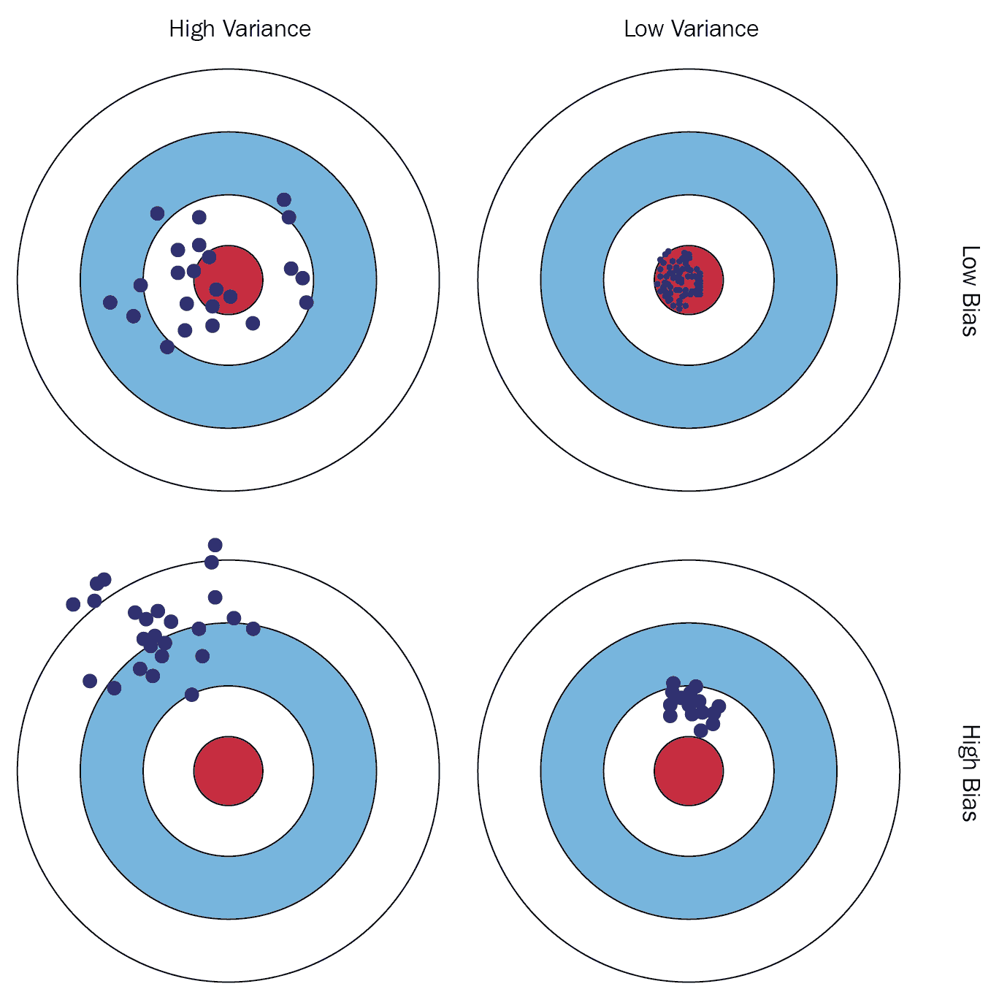

偏差方差折衷

鼓励读者访问[以下链接](https://elitedatascience.com/bias-variance-tradeoff)，以更好，更深入地了解偏差方差的折衷方法。

考虑给我们给出一个问题陈述：“给定一个人的身高，确定他/她的体重”。 我们还为训练数据集提供了相应的身高和体重值。 数据如下图所示：

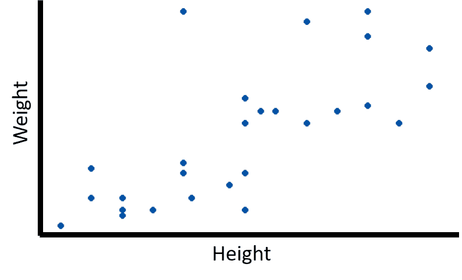

描绘身高体重数据集的图

请注意，这是一个说明重要概念的示例，在解决实际问题的后续章节中，我们将使用实际案例。

这是监督学习问题的一个实例，更多是回归问题的实例（请参阅为什么？）。 利用该训练数据集，我们的算法将必须学习目标函数，以找到不同个体的身高和体重之间的映射。

# 不合身

根据我们的算法，训练阶段可能会有不同的输出。 假设学习的目标函数如下图所示：

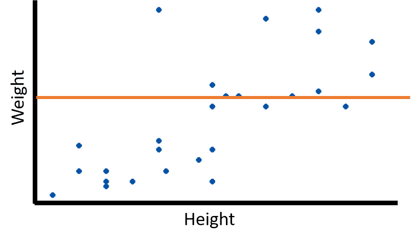

欠拟合模型

该惰性函数始终预测恒定的输出值。 由于目标函数无法学习数据的基础结构，因此导致**欠拟合**的情况。 欠拟合模型的预测性能较差。

# 过拟合

训练阶段的另一个极端称为过拟合。 过拟合图可以表示如下：

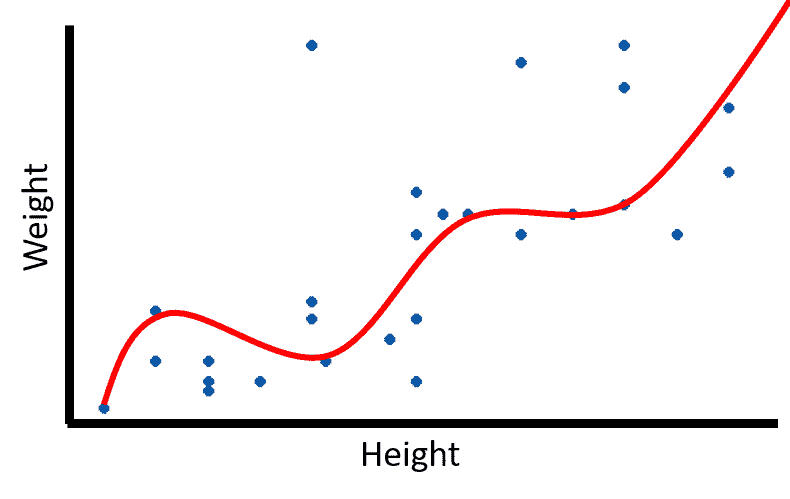

过拟合模型

这显示了一个目标函数，可以完美地映射训练数据集中的每个数据点。 这就是众所周知的**模型过拟合**。 在这种情况下，该算法试图了解包括噪声在内的确切数据特征，因此无法可靠地预测看不见的新数据点。

# 概括

欠拟合和过拟合之间的最佳结合点是我们所说的**良好拟合**。 可以很好地概括给定问题的模型图如下：

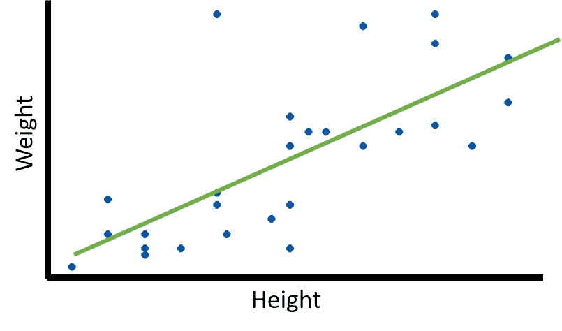

很好的概括

可以在看不见的数据点以及训练数据上表现良好的学习能力被称为**泛化能力**。 因此，泛化指的是基于在训练阶段学到的概念，目标函数在看不见的数据上执行得如何。 上图描绘了很好的概括拟合。

# 模型调整

准备和评估模型与调整模型一样重要。 与为我们提供标准算法集的不同 ML 框架/库一起工作，我们几乎从来没有立即使用它们。

ML 算法具有不同的参数或旋钮，可以根据项目要求和不同的评估结果进行调整。 通过遍历超参数或元参数的不同设置来获得更好的结果，模型调整可以起作用。 超参数是高级抽象上的旋钮，它是在学习过程开始之前设置的。

这与模型级别参数不同，模型级别参数在训练阶段期间学习。 因此，模型调整也称为**超参数优化**。

网格搜索，随机超参数搜索，贝叶斯优化等是执行模型调整的流行方法。 尽管模型调整非常重要，但过度调整可能会对学习过程产生不利影响。 在“偏差方差权衡”部分中讨论了与过度调整过程有关的一些问题。

# 部署和监控

一旦完成了模型开发，评估和调整，并进行了多次迭代以改善结果，那么模型部署的最后阶段就到了。 模型部署负责各个方面，例如模型持久性，通过不同的机制（例如 API 端点）将模型公开给其他应用程序，以及制定监视策略。

我们生活在一个瞬息万变的世界，每时每刻都在变化，关于数据和与用例相关的其他因素也是如此。 我们必须制定监控策略，例如定期报告，日志和测试，以检查解决方案的性能并在需要时进行更改。

机器学习管道与软件工程以及数据科学和机器学习一样重要。 我们简要概述并讨论了典型管道的不同组成部分。 根据特定的用例，我们修改了标准管道以适应需要，同时确保我们不会忽略已知的陷阱。 在接下来的部分中，我们将通过实际示例和代码片段更详细地了解典型 ML 管道的几个组件。

# 探索性数据分析

当我们开始任何 ML 项目时，EDA 就是我们执行的前几个任务之一。 正如在 *CRISP-DM* 一节中所讨论的那样，数据理解是发现有关数据的各种见解并更好地理解业务需求和上下文的重要步骤。

在本节中，我们将使用一个实际的数据集，并使用`pandas`作为我们的数据处理库以及`seaborn`进行可视化来执行 EDA。 Python 笔记本`game_of_thrones_eda.ipynb`中提供了完整的代码段和此分析的详细信息。

首先，我们导入所需的库并按照以下代码片段所示设置配置：

```py
In [1]: import numpy as np 
   ...: import pandas as pd 
   ...: from collections import Counter 
   ...:  
   ...: # plotting 
   ...: import seaborn as sns 
   ...: import matplotlib.pyplot as plt 
   ...:  
   ...: # setting params 
   ...: params = {'legend.fontsize': 'x-large', 
   ...:           'figure.figsize': (30, 10), 
   ...:           'axes.labelsize': 'x-large', 
   ...:           'axes.titlesize':'x-large', 
   ...:           'xtick.labelsize':'x-large', 
   ...:           'ytick.labelsize':'x-large'} 
   ...:  
   ...: sns.set_style('whitegrid') 
   ...: sns.set_context('talk') 
   ...:  
   ...: plt.rcParams.update(params) 
```

设置和要求到位后，我们可以开始关注数据。 正在考虑进行探索性分析的数据集是`battles.csv`文件，其中包含《权力的游戏》（截至第 5 季）的所有主要战役。

《权力的游戏》是有史以来最受欢迎的电视连续剧之一，是一部幻想小说，背景是在 *Westeros* 和 *Essos* 的虚构大陆上制作的，充满了许多情节 还有大量的角色都在为铁王座而战！ 它是 George R. R. Martin 的《冰与火之歌》小说系列的改编。 作为一个受欢迎的系列，它吸引了许多人的注意，并且数据科学家也不排除在外。 [该笔记本在 Myles O'Neill 增强的 Kaggle 数据集上显示了 EDA（更多详细信息](https://www.kaggle.com/mylesoneill/game-of-thrones)。 该数据集基于多个人收集并贡献的多个数据集的组合。 在此分析中，我们使用了`battles.csv`。 原始战斗数据由克里斯·阿尔邦（Chris Albon）提供； 更多详细信息，请参见[这里](https://github.com/chrisalbon/war_of_the_five_kings_dataset)。

以下代码段使用`pandas`加载`battles.csv`文件：

```py
In [2]: battles_df = pd.read_csv('battles.csv') 
```

数据集如以下屏幕快照所示：

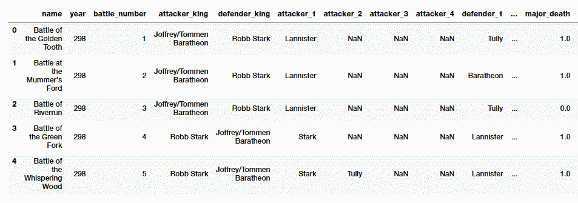

权力的游戏的 Battles.csv 中的示例行

我们可以分别使用`pandas`实用程序`shape`，`dtypes`和`describe()`查看行的总数，每个属性的数据类型以及数字属性的常规统计信息。 我们有 38 场战斗的数据，其中 25 项属性描述了每一场。

让我们了解幻想世界多年来战斗的分布情况。 以下代码段绘制了此分布的条形图：

```py
In [3]: sns.countplot(y='year',data=battles_df) 
   ...: plt.title('Battle Distribution over Years') 
   ...: plt.show() 

```

下图显示，在 **299** 年中，战斗次数最多，其次分别是 **300** 和 **298**：

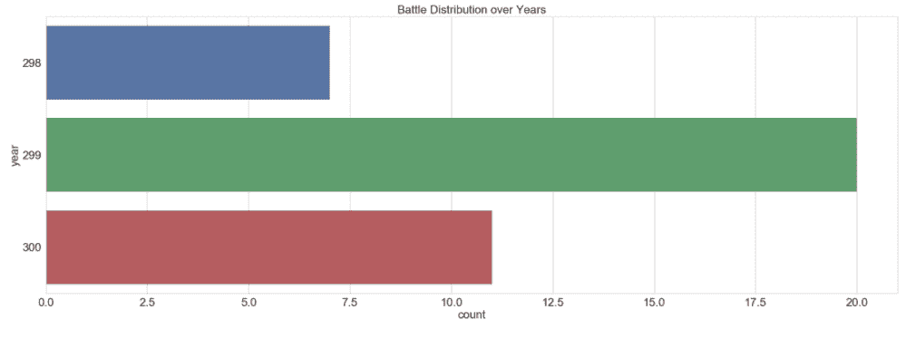

多年来的战斗分配

在这个幻想的土地上有不同的地区，在可以想象的每个地方都发生着战斗。 但是，有趣的是看看是否有任何首选区域。 以下代码段有助于我们准确地回答此问题：

```py
In [4]: sns.countplot(x='region',data=battles_df)
...: plt.title('Battles by Regions')
...: plt.show()
```

以下图表可帮助我们确定**里弗兰兹**战斗最多，其次是**北部**和**西部**：

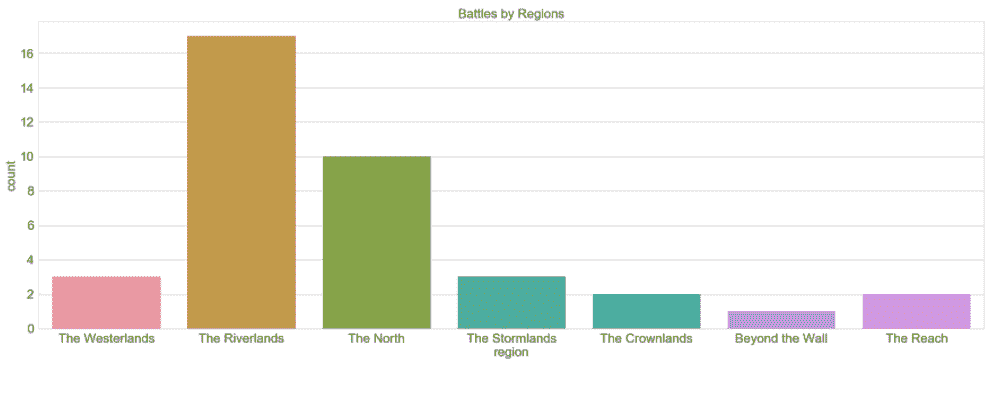

地区战

还要注意的另一件有趣的事是，只有一场战役**超越了墙面**（扰流板警报：请稍后关注）。

我们可以使用不同的分组依据进行类似的分析，以了解例如主要死亡人数或每个地区的捕获数，等等。

我们继续前进，看看哪个国王攻击最多。 我们使用饼图将其可视化，以了解每个参与的国王所进行的战斗所占的百分比。 请注意，我们基于攻击国王进行此分析。 防御王也可以执行类似的分析。 以下代码段准备了一个饼图，以显示每个进攻国王的战斗份额：

```py
 In [5]: attacker_king = battles_df.attacker_king.value_counts() 
    ...: attacker_king.name='' # turn off annoying y-axis-label 
    ...: attacker_king.plot.pie(figsize=(6, 6),autopct='%.2f') 
```

以下饼形图显示了每个进攻国王的战斗份额：

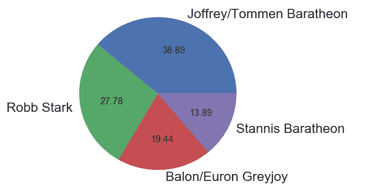

每个进攻国王的战斗份额

韦斯特罗斯和埃索斯的土地充满危险，遍布敌人和威胁。 让我们稍微分析一下数据，以了解每位国王在多少次获胜者。 由于国王既可以保卫自己的土地，也可以争取权力，因此看到保卫和进攻的胜利也很有趣。 以下代码段有助于我们准备堆积的条形图，以分析每位国王的进攻和防守胜利：

```py
In [6] : attack_winners = battles_df[battles_df. 
    ...:                             attacker_outcome=='win'] 
    ...:                                 ['attacker_king']. 
    ...:                                   value_counts(). 
    ...:                                   reset_index() 
    ...:  
    ...: attack_winners.rename( 
    ...:         columns={'index':'king', 
    ...:                  'attacker_king':'wins'}, 
    ...:                   inplace=True) 
    ...:  
    ...: attack_winners.loc[:,'win_type'] = 'attack' 
    ...:  
    ...: defend_winners = battles_df[battles_df. 
    ...:                             attacker_outcome=='loss'] 
    ...:                             ['defender_king']. 
    ...:                             value_counts(). 
    ...:                             reset_index() 
    ...: defend_winners.rename( 
    ...:         columns={'index':'king', 
    ...:                  'defender_king':'wins'}, 
    ...:                   inplace=True) 
    ...:  
    ...: defend_winners.loc[:,'win_type'] = 'defend'                                                                      
    ...:  
    ...:  
    ...: sns.barplot(x="king",  
    ...:             y="wins",  
    ...:             hue="win_type",  
    ...:             data=pd.concat([attack_winners, 
    ...:                             defend_winners])) 
    ...: plt.title('Kings and Their Wins') 
    ...: plt.ylabel('wins') 
    ...: plt.xlabel('king') 
    ...: plt.show() 
```

前面的代码段计算出攻击时每位国王的获胜次数，然后计算出防守时每位国王的获胜次数。 然后，我们将两个结果合并，并使用堆叠的 barplot 绘制相同的结果。 结果显示在下图中：

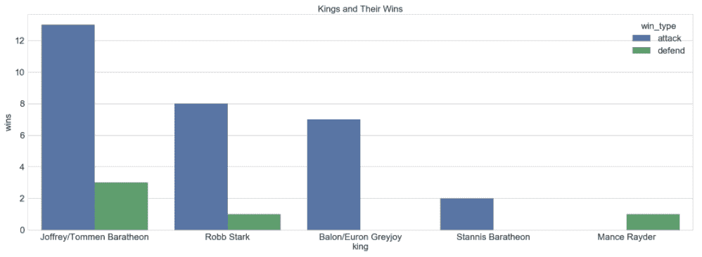

每位国王获胜的次数

上图清楚地表明，**马拉松**男孩在进攻和防守中获胜的次数最多。 到目前为止，他们似乎很幸运。 **Robb Stark** 是第二成功的国王，当然红色婚礼发生了。

数据集还包含描述所涉及房屋的数量，战斗指挥官和军队规模的属性。 我们可以进行类似且更深入的分析，以更好地理解战斗。 我们鼓励读者尝试其中一些作为练习，并检查 Python Notebook 中的更多指针。

在结束本节之前，让我们尝试确定铁王座之战中的敌人。 尽管粉丝已经对此有所了解，但让我们看看数据对此有何评论。 以下代码段可帮助我们回答此问题：

```py
In [7]: temp_df = battles_df.dropna( 
    ...:                     subset = ["attacker_king", 
    ...:                               "defender_king"])[ 
    ...:                                 ["attacker_king", 
    ...:                                  "defender_king"] 
    ...:                                 ] 
    ...:  
    ...: archenemy_df = pd.DataFrame( 
    ...:                 list(Counter( 
    ...:                         [tuple(set(king_pair))  
    ...:                          for king_pair in temp_df.values 
    ...:                          if len(set(king_pair))>1]). 
    ...:                             items()), 
    ...:                 columns=['king_pair', 
    ...:                          'battle_count']) 
    ...:  
    ...: archenemy_df['versus_text'] = archenemy_df. 
    ...:                                 apply( 
    ...:                                     lambda row: 
    ...:                                 '{} Vs {}'.format( 
    ...:                                         row[ 
    ...:                                             'king_pair' 
    ...:                                             ][0], 
    ...:                                         row[ 
    ...:                                             'king_pair' 
    ...:                                             ][1]), 
    ...:                                         axis=1) 
    ...: archenemy_df.sort_values('battle_count', 
    ...:                          inplace=True, 
    ...:                          ascending=False) 
    ...:  
    ...:  
    ...: archenemy_df[['versus_text', 
    ...:               'battle_count']].set_index('versus_text', 
    ...:                                           inplace=True) 
    ...: sns.barplot(data=archenemy_df, 
    ...:             x='versus_text', 
    ...:             y='battle_count') 
    ...: plt.xticks(rotation=45) 
    ...: plt.xlabel('Archenemies') 
    ...: plt.ylabel('Number of Battles') 
    ...: plt.title('Archenemies') 
    ...: plt.show() 
```

我们首先准备一个临时数据帧，并删除所有未列出攻击者或捍卫者国王姓名的战斗。 有了干净的数据框后，我们将遍历每一行并计算每对战斗的战斗次数。 我们忽略了战斗是国王自己的军队（`if len(set(king_pair))>1`）发生的情况。 然后，我们将结果简单地绘制成条形图，如下所示：

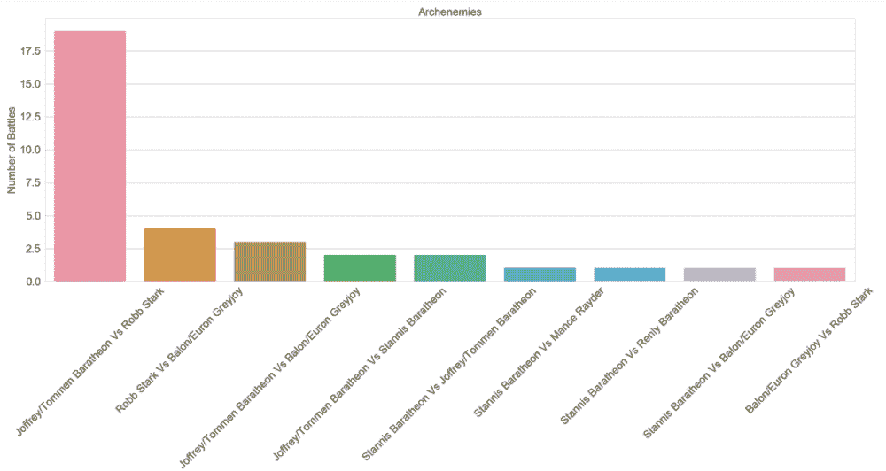

权力的游戏中的大敌

我们看到数据集证实了直觉。 **Robb Stark** 和 **Joffrey Baratheon** 已经进行了 19 场战斗，其他两对则进行了五场或更少的战斗。

本节中共享的分析和可视化效果是对数据集可以完成的工作的一瞥。 仅从该数据集中可以提取出更多的模式和见解。

EDA 是一种非常强大的机制，可用于在进入 ML 的其他阶段之前详细了解数据集。 在接下来的章节中，在进入建模，调整，评估和部署阶段之前，我们将定期执行 EDA，以帮助我们理解业务问题以及数据集。

# 特征提取与工程

数据准备是任何 ML 项目中最长，最复杂的阶段。 在讨论 CRISP-DM 模型时，强调了同样的道理，在该模型中，我们提到了数据准备阶段如何占用 ML 项目中总时间的 60-70％。

对原始数据集进行预处理和处理后，下一步就是使其可用于 ML 算法。 特征提取是从原始属性派生特征的过程。 例如，在处理图像数据时进行特征提取是指从原始像素级数据中提取红色，蓝色和绿色通道信息作为特征。

同样，特征工程指的是使用数学变换从现有特征中推导其他特征的过程。 例如，功能工程将帮助我们从一个人的月收入中得出一个功能，例如年收入（基于用例要求）。 由于特征提取和工程设计都可以帮助我们将原始数据集转换为可用形式，因此 ML 实践者可以互换使用这些术语。

# 特色工程策略

将原始数据集（后期清理和整理）转换为可以由 ML 算法使用的功能的过程是领域知识，用例需求和特定技术的组合。 因此，要素描述了基础数据的各种表示形式，并且是要素工程过程的结果。

由于特征工程将原始数据转换为自身的有用表示形式，因此根据手头的数据类型，可以使用各种标准技术和策略。 在本节中，我们将讨论其中一些策略，简要介绍结构化和非结构化数据。

# 处理数值数据

数值数据通常以整数或浮点数的形式在数据集中可用，并且通常称为**连续数值数据**，通常是 ML 友好数据类型。 友好地说，我们指的是可以直接在大多数 ML 算法中摄取数字数据的事实。 但是，这并不意味着数字数据不需要其他处理和特征工程步骤。

有多种技术可以从数值数据中提取和工程化特征。 让我们看一下本节中的一些技术：

*   **原始度量**：这些数据属性或特征可以直接以其原始或本机格式使用，因为它们出现在数据集中而无需任何其他处理。 示例可以是年龄，身高或体重（只要数据分布不太偏斜！）。
*   **计数**：在某些情况下，诸如计数和频率之类的数字功能也很有用，以描绘重要的细节。 例如，信用卡欺诈事件的发生次数，歌曲收听次数，设备事件发生的次数等等。
*   **二值化**：我们经常可能想对出现或特征进行二值化，特别是仅指示是否存在特定项或属性（通常以 1 表示）或不存在（以 0 表示）。 这在构建推荐系统等场景中很有用。
*   **合并**：此技术通常将来自分析中的任何要素或属性的连续数值分组或分组为离散的分组，以使每个分组都覆盖特定的数值范围。 一旦获得了这些离散的 bin，我们就可以选择在其上进一步应用基于分类数据的特征工程。 存在各种装箱策略，例如固定宽度装箱和自适应装箱。

笔记本`feature_engineering_numerical_and_categorical_data.ipynb`中提供了代码片段，以更好地理解数字数据的功能工程。

# 处理分类数据

常见的另一类重要数据是分类数据。 分类要素具有离散值，这些离散值属于一组有限的类。 这些类可以表示为文本或数字。 根据分类的顺序，分类特征分别称为**标称**和**序数**。

标称特征是具有有限值集合但没有任何自然顺序的那些分类特征。 例如，天气季节，电影类型等都是标称特征。 具有有限类集并具有自然顺序的分类特征称为**序数特征**。 例如，星期几，着装大小等都是常规的。

通常，要素工程中的任何标准工作流程都涉及将这些分类值转换为数字标签的某种形式，然后在这些值上应用某种编码方案。 流行的编码方案简要介绍如下：

*   **单热编码**：此策略为分类属性创建 *n* 个二进制值列，假设存在 *n* 个不同类别
*   **虚拟编码**：此策略为分类属性创建 *n-1* 个二进制值列，假定存在 *n* 个不同类别
*   **特征散列**：如果我们使用散列函数将多个特征添加到单个容器或存储桶（新特征）中，则可以利用此策略，当我们具有大量特征时通常会使用

笔记本`feature_engineering_numerical_and_categorical_data.ipynb`中提供了代码片段，以更好地理解分类数据的特征工程。

# 处理图像数据

图像或视觉数据是丰富的数据源，可以使用 ML 算法和深度学习解决几个用例。 图像数据提出了很多挑战，需要经过仔细的预处理和转换，然后才能被任何算法使用。 对图像数据执行特征工程的一些最常见方法如下：

*   **利用元数据信息或 EXIF 数据**：诸如图像创建日期，修改日期，尺寸，压缩格式，用于捕获图像的设备，分辨率，焦距等属性。
*   **像素和通道信息**：每个图像都可以视为像素值矩阵或（`m, n, c`）矩阵 其中`m`代表行数，`n`代表列数，`c`指向颜色通道（例如 R，G 和 B）。 然后可以根据算法和用例的要求将这种矩阵转换为不同的形状。
*   **像素强度**：有时很难处理具有多种颜色通道的彩色图像。 基于像素强度的特征提取依赖于基于强度的像素合并，而不是利用原始像素级别的值。
*   **边缘检测**：可以利用相邻像素之间对比度和亮度的急剧变化来识别物体边缘。 有不同的算法可用于边缘检测。
*   **对象检测**：我们采用边缘检测的概念并将其扩展到对象检测，然后将识别出的对象边界用作有用的功能。 同样，可以基于可用图像数据的类型来利用不同的算法。

# 基于深度学习的自动特征提取

到目前为止讨论的图像数据和其他类型的特征提取方法需要大量时间，精力和领域知识。 这种特征提取有其优点和局限性。

最近，人们已经研究了深度学习，特别是**卷积神经网络**（**CNN**），并将其用作自动特征提取器。 CNN 是针对图像数据进行优化的深度神经网络的特例。 卷积层是任何 CNN 的核心，它们基本上会在图像的高度和宽度上应用滑动滤镜。 像素值与这些滤镜的点积会生成跨多个时期学习的激活图。 在每个层次上，这些卷积层都有助于提取特定特征，例如边缘，纹理，角等。

深度学习和 CNN 还有很多，但是为了简单起见，让我们假设 CNN 在每一层都可以帮助我们自动提取不同的低级和高级功能。 反过来，这使我们免于手动执行特征提取。 我们将在接下来的章节中更详细地研究 CNN，并了解它们如何帮助我们自动提取特征。

# 处理文本数据

数值和分类特征就是我们所谓的结构化数据类型。 它们在 ML 工作流中更易于处理和利用。 文本数据是非结构化信息的重要来源之一，同样重要。 文本数据提出了与句法理解，语义，格式和内容有关的多个挑战。 文本数据还提出了转换为数字形式的问题，然后才能被 ML 算法使用。 因此，在进行文本数据的特征工程之前，需要进行严格的预处理和清理步骤。

# 文字预处理

在进行任何特征提取/工程设计之前，文本数据需要仔细而勤奋的预处理。 预处理文本数据涉及多个步骤。 以下是一些最广泛使用的文本数据预处理步骤的列表：

*   代币化
*   下套管
*   删除特殊字符
*   收缩扩张
*   停用词删除
*   拼写更正
*   词干和词条去除

在与用例有关的章节中，我们将详细介绍大多数技术。 为了更好地理解，读者可以参考《Python 实用机器学习》的第 4 章和第 7 章（Sarkar 及其合著者，Springer，2017 年）。

# 特征工程

通过上一节中提到的方法对文本数据进行正确处理后，我们就可以利用以下一些技术来进行特征提取和转换为数值形式。 Jupyter Notebook `feature_engineering_text_data.ipynb`中提供了可更好地理解文本数据功能的代码片段：

*   **词袋模型**：这是迄今为止最简单的文本数据向量化技术。 在此技术中，每个文档都表示为`N`维度上的向量，其中`N`表示预处理语料库中所有可能的单词，向量的每个组成部分要么表示存在 单词或其频率。
*   **TF-IDF model**:The bag-of-words model works under very simplistic assumptions and at certain times leads to various issues. One of the most common issues is related to some words overshadowing the rest of the words due to very high frequency, as the bag-of-words model utilizes absolute frequencies to vectorize. The **Term Frequency-Inverse Document Frequency** (**TF-IDF**) model mitigates this issue by scaling/normalizing the absolute frequencies. Mathematically, the model is defined as follows:

    `tfidf(w, D) = tf(W, D) * idf(w, D)`

    在这里，`tfidf(w, D)`表示每个单词`w`在文档`D`中的 TF-IDF 分数， `tf(w, D)`是中每个单词`w`在文档`D`中的词频，`idf(w, D)`表示逆文档频率，计算为语料库`C`中总文档数除以`w`所在的文档数的对数转换。

除了单词袋和 TF-IDF 外，还有其他转换，例如 N-gram 袋，以及单词嵌入，例如 Word2vec，GloVe 等。 我们将在后续章节中详细介绍其中的几个。

# 功能选择

特征提取和工程设计的过程可帮助我们从基础数据集中提取特征并生成特征。 在某些情况下，这会导致大量输入要处理的算法。 在这种情况下，怀疑输入中的许多功能可能是多余的，并可能导致复杂的模型甚至过拟合。 特征选择是从可用/生成的完整特征集中识别代表性特征的过程。 预期所选特征集将包含所需信息，以使算法能够解决给定任务而不会遇到处理，复杂性和过拟合的问题。 功能选择还有助于更好地理解建模过程中使用的数据，并加快处理速度。

特征选择方法大致可分为以下三类：

*   **过滤方法**：顾名思义，这些方法可帮助我们根据统计得分对要素进行排名。 然后，我们选择这些功能的子集。 这些方法通常与模型输出无关，而是独立地评估特征。 基于阈值的技术和统计检验（例如相关系数和卡方检验）是一些受欢迎的选择。
*   **包装器方法**：这些方法对特征子集的不同组合的性能进行比较搜索，然后帮助我们选择性能最佳的子集。 向后选择和正向消除是用于特征选择的两种流行的包装方法。
*   **嵌入式方法**：这些方法通过了解哪个功能子集将是最好的，从而提供了前面两种方法中的最好方法。 正则化和基于树的方法是流行的选择。

特征选择是构建 ML 系统过程中的重要方面。 如果不谨慎处理，它也是造成系统偏差的主要来源之一。 读者应注意，应该使用与训练数据集分开的数据集来进行特征选择。 将训练数据集用于特征选择将始终导致过拟合，而将测试集用于特征选择则会高估模型的性能。

最受欢迎的库提供了多种功能选择技术。 诸如`scikit-learn`之类的库提供了开箱即用的这些方法。 在后面的章节中，我们将看到并利用其中的许多内容。

# 摘要

在任何旅程中，了解概念和技术的牢固基础和共同基础都非常重要。 通过本章有关机器学习基础知识的章节，我们试图实现这一目标。 在开始学习深度学习，迁移学习和更高级的概念之前，必须为 ML 概念奠定坚实的基础。 在本章中，我们涵盖了相当多的基础，并提供了更详细地研究概念的重要指示。

我们通过理解机器学习为何如此重要以及它是一个完全不同的范例来开始本章。 我们简要讨论了 AI，机器学习和深度学习之间的关系。 然后，本章继续介绍了不同的机器学习技术，例如有监督，无监督和强化学习。 我们详细讨论了通常使用哪些不同的监督和非监督方法。

本章还简要介绍了用于 ML 项目工作流程的 CRISP-DM 模型以及 ML 管道。 我们还讨论了《权力的游戏》幻想世界中战斗数据集的 EDA，以应用不同的概念并了解 EDA 的重要性。 在本章的最后，介绍了特征提取和工程以及特征选择。

在接下来的章节中，我们将以这些概念为基础，并最终在涉及不同实际使用案例的章节中应用所学知识。 欢迎登机！