# 深度学习基础

本章从深度学习真正含义的最基本基础开始，然后深入到围绕神经网络的其他基本概念和术语，深入探讨了深度学习的基本知识。 将向读者概述神经网络的基本构建模块，以及如何训练深度神经网络。 涵盖模型训练的概念，包括激活函数，损失函数，反向传播和超参数调整策略。 这些基础概念对于正在尝试深度神经网络模型的初学者和经验丰富的数据科学家都将有很大的帮助。 我们特别关注如何建立具有 GPU 支持的强大的基于云的深度学习环境，以及设置内部深度学习环境的技巧。 对于希望自己构建大规模深度学习模型的读者来说，这将非常有用。 本章将涵盖以下主题：

*   什么是深度学习？
*   深度学习基础
*   建立具有 GPU 支持的强大的基于云的深度学习环境
*   建立具有 GPU 支持的强大的本地深度学习环境
*   神经网络基础

# 什么是深度学习？

在**机器学习**（**ML**）中，我们尝试自动发现用于将输入数据映射到所需输出的规则。 在此过程中，创建适当的数据表示形式非常重要。 例如，如果我们要创建一种将电子邮件分类为垃圾邮件/火腿的算法，则需要用数字表示电子邮件数据。 一个简单的表示形式可以是二进制向量，其中每个组件从预定义的单词表中描述单词的存在与否。 同样，这些表示是与任务相关的，也就是说，表示可能会根据我们希望 ML 算法执行的最终任务而有所不同。

在前面的电子邮件示例中，如果我们要检测电子邮件中的情感，则不必标识垃圾邮件/火腿，而更有用的数据表示形式可以是二进制向量，其中预定义词汇表由具有正极性或负极性的单词组成。 大多数 ML 算法（例如随机森林和逻辑回归）的成功应用取决于数据表示的质量。 我们如何获得这些表示？ 通常，这些表示是人为制作的功能，通过做出一些明智的猜测来进行迭代设计。 此步骤称为**特征工程**，是大多数 ML 算法中的关键步骤之一。 **支持向量机**（**SVM**）或一般的内核方法，试图通过将数据的手工表示转换为更高维度的空间来创建更相关的数据表示，使得使用分类或回归来解决 ML 任务变得容易。 但是，SVM 很难扩展到非常大的数据集，并且在诸如图像分类和语音识别等问题上并不成功。 诸如随机森林和**梯度提升机**（**GBMs**）之类的集合模型创建了一组弱模型，这些模型专门用于很好地完成小任务，然后将这些弱模型以一些方式组合来产生最终输出。 当我们有非常大的输入尺寸时，它们工作得很好，而创建手工制作的功能是非常耗时的步骤。 总而言之，所有前面提到的 ML 方法都以浅浅的数据表示形式工作，其中涉及通过一组手工制作的特征进行数据表示，然后进行一些非线性转换。

深度学习是 ML 的一个子字段，在其中创建数据的分层表示。 层次结构的较高级别由较低级别的表示形式组成。 更重要的是，通过完全自动化 ML 中最关键的步骤（称为**特征工程**），可以从数据中自动学习这种表示层次。 在多个抽象级别上自动学习功能允许系统直接从数据中学习输入到输出的复杂表示形式，而无需完全依赖于人工制作的功能。

深度学习模型实际上是具有多个隐藏层的神经网络，它可以帮助创建输入数据的分层层次表示。 之所以称为*深度*，是因为我们最终使用了多个隐藏层来获取表示。 用最简单的术语来说，深度学习也可以称为**分层特征工程**（当然，我们可以做更多的事情，但这是核心原理）。 深度神经网络的一个简单示例可以是具有多个隐藏层的**多层感知器**（**MLP**）。 下图中考虑基于 MLP 的人脸识别系统。 它学习到的最低级别的功能是对比度的一些边缘和图案。 然后，下一层能够使用那些局部对比的图案来模仿眼睛，鼻子和嘴唇。 最后，顶层使用这些面部特征创建面部模板。 深度网络正在组成简单的功能，以创建越来越复杂的功能，如下图所示：

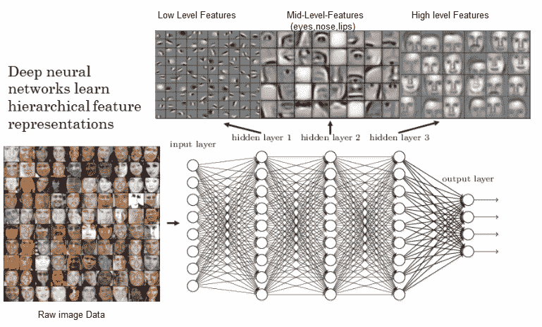

[具有深度神经网络的分层特征表示](https://www.rsipvision.com/exploring-deep-learning/)

为了理解深度学习，我们需要对神经网络的构建模块，如何训练这些网络以及如何将这样的训练算法扩展到非常大的深度网络有一个清晰的了解。 在深入探讨有关神经网络的更多细节之前，让我们尝试回答一个问题：为什么现在要进行深度学习？ 神经网络的理论，甚至是**卷积神经网络**（**CNN**）都可以追溯到 1990 年代。 他们之所以变得越来越受欢迎的原因归结于以下三个原因：

*   **高效硬件的可用性**：摩尔定律使 CPU 具有更好，更快的处理能力和计算能力。 除此之外，GPU 在大规模计算数百万个矩阵运算中也非常有用，这是任何深度学习模型中最常见的运算。 诸如 CUDA 之类的 SDK 的可用性已帮助研究社区重写了一些可高度并行化的作业，以在少数 GPU 上运行，从而取代了庞大的 CPU 集群。 模型训练涉及许多小的线性代数运算，例如矩阵乘法和点积，这些运算在 CUDA 中非常有效地实现以在 GPU 中运行。
*   **大型数据源的可用性和更便宜的存储**：现在，我们可以免费访问大量带标签的文本，图像和语音训练集。

*   **用于训练神经网络的优化算法的进展**：传统上，只有一种算法可用于学习神经网络中的权重，梯度下降或**随机梯度下降**（**SGD**）。 SGD 具有一些局限性，例如卡在局部最小值和收敛速度较慢，这些都可以通过较新的算法来克服。 我们将在后面的“神经网络基础知识”的后续部分中详细讨论这些算法。

# 深度学习框架

深度学习广泛普及和采用的主要原因之一是 Python 深度学习生态系统，它由易于使用的开源深度学习框架组成。 但是，考虑到新框架如何不断发布以及旧框架将要寿终正寝，深度学习的格局正在迅速变化。 深度学习爱好者可能知道 Theano 是由 Yoshua Bengio 领导的 [MILA](https://mila.quebec/) 创建的第一个也是最受欢迎的深度学习框架。 不幸的是，最近宣布，在 Theano 的最新版本（1.0）于 2017 年发布之后，对 Theano 的进一步开发和支持将结束。因此，了解那里可以利用哪些框架来实施和解决问题至关重要。 深度学习。 这里要记住的另一点是，几个组织本身正在建立，获取和启动这些框架（通常试图在更好的功能，更快的执行等方面相互竞争），以使每个人都受益。 下图展示了截至 2018 年最受欢迎的一些深度学习框架：


您还可以在[**迈向数据科学**](https://towardsdatascience.com/battle-of-the-deep-learning-frameworks-part-i-cff0e3841750)了解更多。 让我们简要看看一些最受欢迎的深度学习框架：

*   **Theano**：默认情况下，Theano 是一个低级框架，可对多维数组（现在通常称为**张量**）进行高效的数值计算。 Theano 非常稳定，语法与 TensorFlow 非常相似。 它确实具有 GPU 支持，但功能有限，特别是如果我们要使用多个 GPU。 由于其在 1.0 之后的开发和停止支持，如果您打算将 theano 用于深度学习实现，则应格外小心。
*   **TensorFlow**：这可能是最流行（或至少最流行）的深度学习框架。 它由 Google Brain 创建并于 2015 年开源，迅速吸引了 ML，深度学习研究人员，工程师和数据科学家的关注。 尽管初始发行版的性能存在问题，但它仍处于积极开发中，并且每个发行版都在不断完善。 TensorFlow 支持基于多 CPU 和 GPU 的执行，并支持多种语言，包括 C++，Java，R 和 Python。 它仅用于支持符号编程样式来构建深度学习模型，该模型稍微复杂一些，但是自 v1.5 起广泛采用，它开始支持更流行且易于使用的命令式编程样式（也称为**立即执行**）。 TensorFlow 通常是类似于 Theano 的低级库，但也具有利用高级 API 进行快速原型设计和开发的功能。 TensorFlow 的重要部分还包括`tf.contrib`模块，该模块包含各种实验功能，包括 Keras API 本身！
*   **Keras**：如果发现自己对利用底层深度学习框架来解决问题感到困惑，则可以始终依靠 Keras！ 具有不同技能的人们广泛使用此框架，包括可能不是核心开发人员的科学家。 这是因为 Keras 提供了一个简单，干净且易于使用的高级 API，用于以最少的代码构建有效的深度学习模型。 这样做的好处是可以将其配置为在包括 theano 和 TensorFlow 在内的多个低级深度学习框架（称为**后端**）之上运行。 可通过 [keras.io](https://keras.io/) 访问 Keras 文档，并且非常详细。
*   **Caffe**：这也是伯克利视觉与学习中心以 C++ （包括 Python 绑定）开发的第一个且相对较旧的深度学习框架之一。 关于 Caffe 的最好之处在于，它作为 Caffe Model Zoo 的一部分提供了许多预训练的深度学习模型。 Facebook 最近开放了 Caffe2 的源代码，它基于 Caffe 进行了改进和功能，并且比其前身更易于使用。

*   **PyTorch**：Torch 框架是用 Lua 编写的，非常灵活和快速，通常可以带来巨大的性能提升。 PyTorch 是用于构建深度学习模型的基于 Python 的框架，它从 Torch 汲取了灵感。 它不仅是 Torch 的扩展或 Python 包装器，而且本身就是一个完整的框架，从而改进了 Torch 框架体系结构的各个方面。 这包括摆脱容器，利用模块以及性能改进（例如内存优化）。
*   **CNTK**：Cognitive Toolkit 框架已由 Microsoft 开源，并且支持 Python 和 C++ 。 语法与 Keras 非常相似，并且支持多种模型架构。 尽管不是很流行，但这是 Microsoft 内部用于其几种认知智能功能的框架。
*   **MXNet**：这是由**分布式机器学习社区**（**DMLC**）开发的，该软件包是非常受欢迎的 XGBoost 软件包的创建者。 现在这是一个官方的 Apache Incubator 项目。 MXNet 是最早支持各种语言（包括 C++，Python，R 和 Julia）以及多种操作系统（包括 Windows）的深度学习框架之一，而其他 Windows 常常会忽略该框架。 该框架非常高效且可扩展，并支持多 GPU。 因此，它已成为 Amazon 选择的深度学习框架，并为此开发了一个高级界面，称为 **Gluon**。
*   **Gluon**：这是一个高级深度学习框架，或者说是接口，可以在 MXNet 和 CNTK 的基础上加以利用。 Gluon 由 Amazon AWS 和 Microsoft 联合开发，与 Keras 非常相似，可以被视为直接竞争对手。 然而，它声称它将随着时间的推移支持更多的低层深度学习框架，并具有使**人工智能**（**AI**）民主化的愿景。 Gluon 提供了一个非常简单，干净和简洁的 API，任何人都可以使用它以最少的代码轻松构建深度学习架构。
*   **BigDL**：将 BigDL 视为大规模的大数据深度学习！ 该框架由 Intel 开发，可以在 Apache Spark 之上利用，以在 Hadoop 集群上以分布式方式构建和运行深度学习模型，作为 Spark 程序。 它还利用非常流行的英特尔**数学内核库**（**MKL**）来提高性能并提高性能。

上面的框架列表绝对不是深度学习框架的详尽列表，但是应该使您对深度学习领域中的内容有个很好的了解。 随意探索这些框架，并根据最适合您的情况选择任何一个。

永远记住，有些框架的学习曲线很陡峭，所以如果花时间学习和利用它们，不要灰心。 尽管每个框架都有各自的优点和缺点，但您应始终将更多的精力放在要解决的问题上，然后利用最适合解决问题的框架。

# 建立具有 GPU 支持的基于云的深度学习环境

深度学习在带有 CPU 的标准单 PC 设置中效果很好。 但是，一旦您的数据集开始增加大小，并且模型体系结构开始变得更加复杂，您就需要开始考虑在强大的深度学习环境中进行投资。 主要期望是该系统可以有效地构建和训练模型，花费较少的时间来训练模型，并且具有容错能力。 大多数深度学习计算本质上是数百万个矩阵运算（数据表示为矩阵），并且可以并行进行快速计算。 事实证明，GPU 在这方面可以很好地工作。 您可以考虑建立一个强大的基于云的深度学习环境，甚至是一个内部环境。 让我们看看如何在本节中建立一个强大的基于云的深度学习环境。

涉及的主要组件如下：

*   选择云提供商
*   设置您的虚拟服务器
*   配置您的虚拟服务器
*   安装和更新深度学习依赖项
*   访问您的深度学习云环境
*   在您的深度学习环境中验证 GPU 的启用

让我们更详细地研究这些组件中的每个组件，并逐步执行过程，以帮助您建立自己的深度学习环境。

# 选择云提供商

如今，有多家云提供商的价格可承受且具有竞争力。 我们希望利用**平台即服务**（**PaaS**）功能来管理数据，应用程序和基本配置。

下图显示了一些流行的云提供商：


受欢迎的提供商包括亚马逊的 AWS，微软的 Azure 和 Google 的 **Google 云平台**（**GCP**）。 就本教程和本书而言，我们将利用 AWS。

# 设置您的虚拟服务器

您需要获取一个 AWS 账户才能执行本节中的其余步骤。 如果您还没有帐户，请转到[这里](https://aws.amazon.com/)创建一个帐户。 准备就绪后，您可以登录[这里](https://console.aws.amazon.com/ec2/v2/)来登录您的帐户并导航到 AWS EC2 控制面板，该工具利用了**弹性计算云**（**EC2**）服务，这是 Amazon 云计算服务的基础。 到达那里后，请记住选择一个您选择的区域（我通常与美国东部一起去），然后单击“启动实例”以启动在云上创建新虚拟服务器的过程：

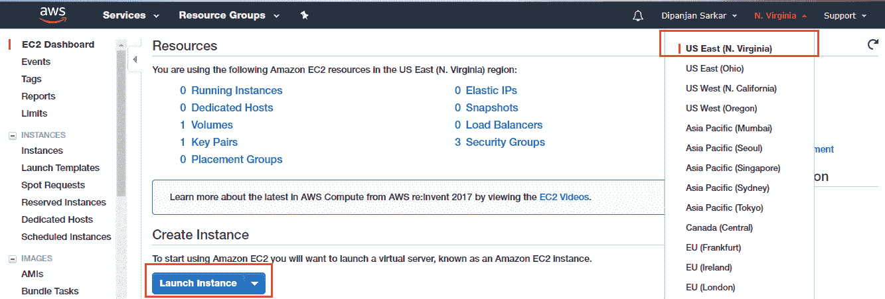

单击启动实例按钮应带您到该页面，以选择您自己的 **Amazon Machine Image**（**AMI**）。 通常，AMI 由构建虚拟服务器所需的各种软件配置组成。 它包括以下内容：

*   实例的根卷的模板，其中包括服务器的操作系统，应用程序和其他配置设置。
*   启动许可设置，用于控制哪些 AWS 账户可以使用 AMI 启动实例。
*   块设备映射，用于指定启动实例时要附加到实例的存储卷。 您所有的数据都在这里！

我们将利用专门用于深度学习的预构建 AMI，因此我们不必花时间进行额外的配置和管理。 前往 AWS Marketplace 并选择深度学习 AMI（Ubuntu）：

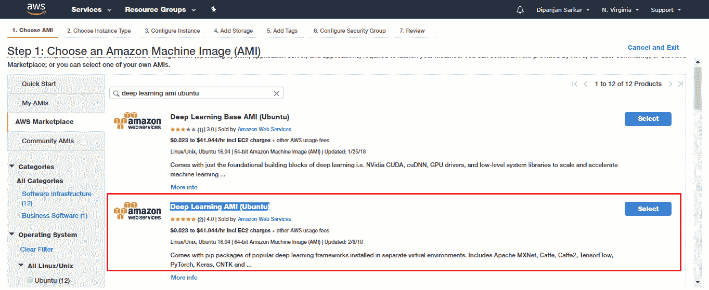

选择 AMI 之后，您需要选择实例类型。 对于支持 GPU 的深度学习，我们建议使用 p2.xlarge 实例，该实例功能强大且经济实惠，每小时使用成本约为 0.90 美元（截至 2018 年）。

P2 实例最多可提供 16 个 NVIDIA K80 GPU，64 个 vCPU 和 732 GiB 主机内存，以及总共 192 GB 的 GPU 内存，如以下屏幕快照所示：

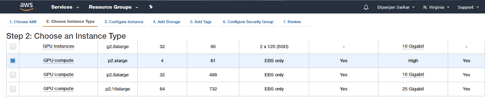

接下来是配置实例详细信息。 除非希望启动多个实例，指定子网首选项以及指定关闭行为，否则可以保留默认设置。

下一步涉及添加存储详细信息。 通常，您具有根卷，可以在根卷中根据需要增加其大小，并添加额外的**弹性块存储**（**EBS**）卷以增加磁盘空间。

然后，我们看一下是否需要添加标签（区分大小写和键值对）。 目前我们不需要这个，所以我们跳过它。

我们将重点放在配置安全组的下一步上，特别是如果您想通过利用功能强大的 Jupyter 笔记本从外部访问深度学习设置。 为此，我们创建一个新的安全组并创建一个 Custom TCP 规则以打开并启用对端口`8888`的访问，如下所示：

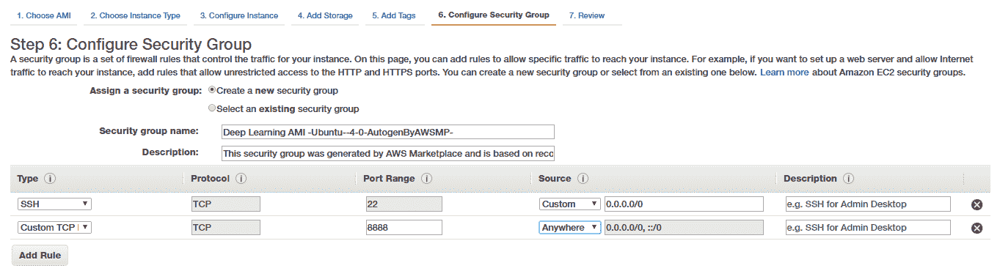

请注意，此规则通常允许任何 IP 监听您实例（我们将在其中运行 Jupyter 笔记本的实例）上的端口（`8888`）。 如果需要，可以更改此设置，仅添加特定 PC 或笔记本电脑的 IP 地址，以提高安全性。 除此之外，我们稍后还将为 Jupyter 笔记本添加一个额外的密码保护功能，以提高安全性。

最后，您将需要通过创建密钥对（公钥和私钥）来启动实例，以安全地连接到实例。 如果您没有现有的密钥对，则可以创建一个新的密钥对，将私钥文件安全地存储到磁盘上，然后启动实例，如以下屏幕快照所示：

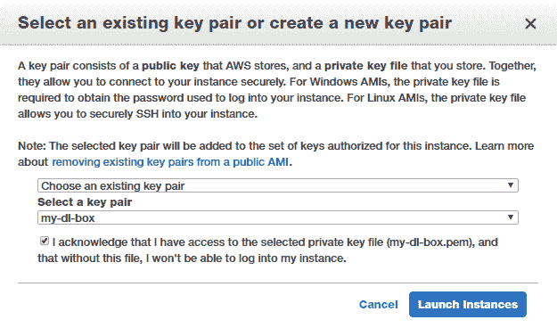

请注意，虚拟服务器启动和启动可能需要几分钟，因此您可能需要稍等片刻。 通常，您可能会发现由于帐户的限制或容量不足而导致实例启动失败。

如果遇到此问题，您可以请求增加使用的特定实例类型的限制（在我们的例子中为`p2.xlarge`）：

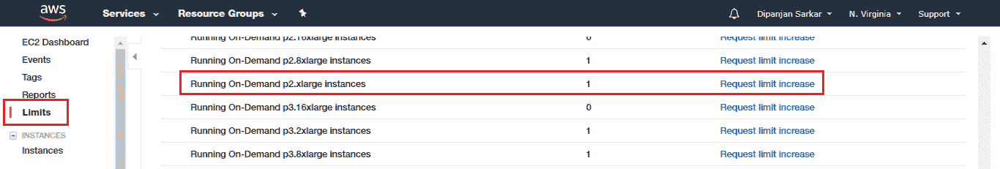

通常，AWS 会在不到 24 小时内响应并批准您的请求，因此您可能需要稍等片刻才能获得批准，然后才可以启动实例。 启动实例后，您可以签出“实例”部分并尝试连接到该实例：

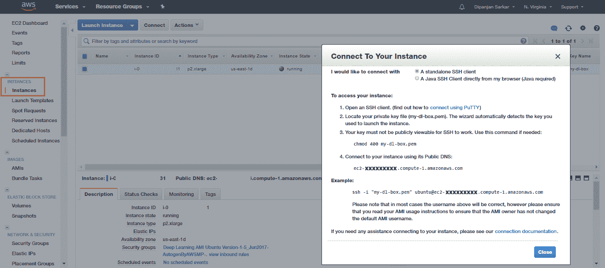

您可以使用本地系统中的命令提示符或终端（之前已存储了先前的私有 AWS 密钥）来立即连接到实例：

```py
[DIP.DipsLaptop]> ssh -i "my-dl-box.pem" ubuntu@ec2-xxxxx.compute-1.amazonaws.com
Warning: Permanently added 'ec2-xxxxx.compute-1.amazonaws.com' (RSA) to the list of known hosts.

=======================================================================
Deep Learning AMI for Ubuntu
=======================================================================
The README file for the AMI : /home/ubuntu/src/AMI.README.md
Welcome to Ubuntu 14.04.5 LTS (GNU/Linux 3.13.0-121-generic x86_64)

Last login: Sun Nov 26 09:46:05 2017 from 10x.xx.xx.xxx
ubuntu@ip-xxx-xx-xx-xxx:~$
```

因此，这使您能够成功登录到自己的基于云的深度学习服务器！

# 配置您的虚拟服务器

让我们设置一些基本配置，以利用 Jupyter 笔记本的功能在虚拟服务器上进行分析和深度学习建模，而无需始终在终端上进行编码。 首先，我们需要设置 SSL 证书。 让我们创建一个新目录：

```py
ubuntu@ip:~$ mkdir ssl
ubuntu@ip:~$ cd ssl
ubuntu@ip:~/ssl$
```

进入目录后，我们将利用 OpenSSL 创建新的 SSL 证书：

```py
ubuntu@ip:~/ssl$ sudo openssl req -x509 -nodes -days 365 -newkey rsa:1024 -keyout "cert.key" -out "cert.pem" -batch 
Generating a 1024 bit RSA private key
......++++++
...++++++
writing new private key to 'cert.key'
-----
ubuntu@ip:~/ssl2$ ls
cert.key cert.pem
```

现在，我们需要在前面提到的 Jupyter 笔记本中添加基于密码的安全性的附加层。 为此，我们需要修改 Jupyter 的默认配置设置。 如果您没有 Jupyter 的`config`文件，则可以使用以下命令生成它：

```py
$ jupyter notebook --generate-config
```

要为笔记本计算机启用基于密码的安全性，我们需要首先生成一个密码及其哈希。 我们可以如下利用`Ipython.lib`中的`passwd()`函数：

```py
ubuntu@ip:~$ ipython
Python 3.4.3 (default, Nov 17 2016, 01:08:31)
Type 'copyright', 'credits' or 'license' for more information
IPython 6.1.0 -- An enhanced Interactive Python. Type '?' for help.

In [1]: from IPython.lib import passwd
In [2]: passwd()
Enter password:
Verify password:
Out[2]: 'sha1:e9ed12b73a30:142dff0cdcaf375e4380999a6ca17b47ce187eb6'
In [3]: exit
ubuntu@:~$
```

输入密码并进行验证后，该函数将向您返回一个哈希值，即您的密码哈希值（在这种情况下，我键入的密码密钥实际上是单词`password`，因此您绝对不应使用！）。 复制并保存该哈希值，因为我们很快将需要它。

接下来，启动您喜欢的文本编辑器以编辑 Jupyter `config`文件，如下所示：

```py
ubuntu@ip:~$ vim ~/.jupyter/jupyter_notebook_config.py

# Configuration file for jupyter-notebook.

c = get_config()  # this is the config object
c.NotebookApp.certfile = u'/home/ubuntu/ssl/cert.pem'
c.NotebookApp.keyfile = u'/home/ubuntu/ssl/cert.key'
c.IPKernelApp.pylab = 'inline'
c.NotebookApp.ip = '*'
c.NotebookApp.open_browser = False
c.NotebookApp.password = 'sha1:e9ed12b73a30:142dff0cdcaf375e4380999a6ca17b47ce187eb6' # replace this

# press i to insert new text and then press 'esc' and :wq to save and exit

ubuntu@ip:~$
```

现在，在开始构建模型之前，我们将研究实现深度学习的一些基本依赖性。

# 安装和更新深度学习依赖项

深度学习有几个主要方面，并且针对 Python 利用 GPU 支持的深度学习。 我们将尽力介绍基本知识，但可以根据需要随时参考其他在线文档和资源。 您也可以跳过这些步骤，转到下一部分，以测试服务器上是否已启用启用 GPU 的深度学习。 较新的 AWS 深度学习 AMI 设置了支持 GPU 的深度学习。

但是，通常设置不是最好的，或者某些配置可能是错误的，因此（如果您看到深度学习没有利用您的 GPU，（从下一部分的测试中），您可能需要遍历这些知识。 您可以转到“访问深度学习云环境”和“验证深度学习环境上的 GPU 启用”部分，以检查 Amazon 提供的默认设置是否有效。 然后，您无需麻烦执行其余步骤！

首先，您需要检查是否已启用 Nvidia GPU，以及 GPU 的驱动程序是否已正确安装。 您可以利用以下命令进行检查。 请记住，p2.x 通常配备有 Tesla GPU：

```py
ubuntu@ip:~$ sudo lshw -businfo | grep -i display
pci@0000:00:02.0 display GD 5446
pci@0000:00:1e.0 display GK210GL [Tesla K80]

ubuntu@ip-172-31-90-228:~$ nvidia-smi
```

如果正确安装了驱动程序，则应该看到类似于以下快照的输出：

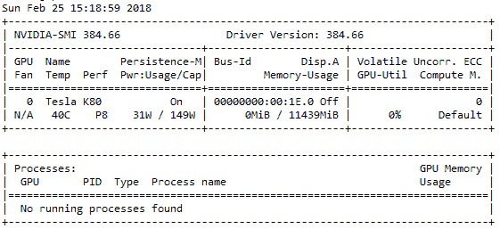

如果出现错误，请按照以下步骤安装 Nvidia GPU 驱动程序。 切记根据您使用的 OS 使用其他驱动程序链接。 我有一个较旧的 Ubuntu 14.04 AMI，为此，我使用了以下命令：

```py
# check your OS release using the following command
ubuntu@ip:~$ lsb_release -a
No LSB modules are available.
Distributor ID: Ubuntu
Description: Ubuntu 14.04.5 LTS
Release: 14.04
Codename: trusty

# download and install drivers based on your OS
ubuntu@ip:~$ http://developer.download.nvidia.com/compute/cuda/repos/ubuntu1404/ x86_64/cuda-repo-ubuntu1404_8.0.61-1_amd64.deb
ubuntu@ip:~$ sudo dpkg -i ./cuda-repo-ubuntu1404_8.0.61-1_amd64.deb
ubuntu@ip:~$ sudo apt-get update
ubuntu@ip:~$ sudo apt-get install cuda -y
# Might need to restart your server once
# Then check if GPU drivers are working using the following command
ubuntu@ip:~$ nvidia-smi
```

如果您能够根据之前的命令查看驱动程序和 GPU 硬件详细信息，则说明驱动程序已成功安装！ 现在，您可以集中精力安装 Nvidia CUDA 工具包。 通常，CUDA 工具包为我们提供了一个用于创建高性能 GPU 加速应用程序的开发环境。 这就是用来优化和利用我们 GPU 硬件的全部功能的工具。 您可以在[这个页面](https://developer.nvidia.com/cuda-toolkit)上找到有关 CUDA 的更多信息并下载工具包。

请记住，CUDA 非常特定于版本，并且我们的 Python 深度学习框架的不同版本仅与特定 CUDA 版本兼容。 我将在本章中使用 CUDA 8。 如果已经为您安装了 CUDA，并且与服务器上的深度学习生态系统一起正常工作，请跳过此步骤。

要安装 CUDA，请运行以下命令：

```py
ubuntu@ip:~$ wget https://s3.amazonaws.com/personal-waf/cuda_8.0.61_375.26_linux.run

ubuntu@ip:~$ sudo rm -rf /usr/local/cuda*

ubuntu@ip:~$ sudo sh cuda_8.0.61_375.26_linux.run
# press and hold s to skip agreement and also make sure to select N when asked if you want to install Nvidia drivers

# Do you accept the previously read EULA?
# accept

# Install NVIDIA Accelerated Graphics Driver for Linux-x86_64 361.62?
# ************************* VERY KEY ****************************
# ******************** DON"T SAY Y ******************************
# n

# Install the CUDA 8.0 Toolkit?
# y

# Enter Toolkit Location
# press enter

# Do you want to install a symbolic link at /usr/local/cuda?
# y

# Install the CUDA 8.0 Samples?
# y

# Enter CUDA Samples Location
# press enter    

# Installing the CUDA Toolkit in /usr/local/cuda-8.0 …
# Installing the CUDA Samples in /home/liping …
# Copying samples to /home/liping/NVIDIA_CUDA-8.0_Samples now…
# Finished copying samples. 
```

一旦安装了 CUDA，我们还需要安装 cuDNN。 该框架也由 Nvidia 开发，代表 **CUDA 深度神经网络**（**cuDNN**）库。 本质上，该库是 GPU 加速的库，由用于深度学习和构建深度神经网络的多个优化原语组成。 cuDNN 框架为标准深度学习操作和层（包括常规激活层，卷积和池化层，归一化和反向传播）提供了高度优化和优化的实现！ 该框架的目的是加快深度学习模型的培训和性能，特别是针对 Nvidia GPU 的深度学习模型。 您可以在[这个页面](https://developer.nvidia.com/cudnn)上找到有关 cuDNN 的更多信息。 让我们使用以下命令安装 cuDNN：

```py
ubuntu@ip:~$ wget https://s3.amazonaws.com/personal-waf/cudnn-8.0-
             linux-x64-v5.1.tgz

ubuntu@ip:~$ sudo tar -xzvf cudnn-8.0-linux-x64-v5.1.tgz
ubuntu@ip:~$ sudo cp cuda/include/cudnn.h /usr/local/cuda/include
ubuntu@ip:~$ sudo cp cuda/lib64/libcudnn* /usr/local/cuda/lib64
ubuntu@ip:~$ sudo chmod a+r /usr/local/cuda/include/cudnn.h 
             /usr/local/cuda/lib64/libcudnn*
```

完成后，请记住使用您喜欢的编辑器（我们使用`vim`）将以下几行添加到`~/.bashrc`的末尾：

```py
ubuntu@ip:~$ vim ~/.bashrc

# add these lines right at the end and press esc and :wq to save and 
# quit

export LD_LIBRARY_PATH="$LD_LIBRARY_PATH:/usr/local/cuda/lib64:/usr/local/cuda
                 /extras/CUPTI/lib64"
export CUDA_HOME=/usr/local/cuda
export DYLD_LIBRARY_PATH="$DYLD_LIBRARY_PATH:$CUDA_HOME/lib"
export PATH="$CUDA_HOME/bin:$PATH"

ubuntu@ip:~$ source ~/.bashrc
```

通常，这会处理我们 GPU 的大多数必需依赖项。 现在，我们需要安装并设置 Python 深度学习依赖项。 通常，AWS AMI 随 Anaconda 发行版一起安装。 但是，如果它不存在，您可以始终参考[这里](https://www.anaconda.com/download)以根据 Python 和 OS 版本下载您选择的发行版。 通常，我们使用 Linux / Windows 和 Python3 并利用本书中的 TensorFlow 和 Keras 深度学习框架。 在 AWS AMI 中，可能会安装不兼容的框架版本，这些框架版本不适用于 CUDA，或者可能是纯 CPU 版本。 以下命令安装 TensorFlow 的 GPU 版本，该版本在 CUDA 8 上最有效：

```py
# uninstall previously installed versions if any
ubuntu@ip:~$ sudo pip3 uninstall tensorflow
ubuntu@ip:~$ sudo pip3 uninstall tensorflow-gpu

# install tensorflow GPU version
ubuntu@ip:~$ sudo pip3 install --ignore-installed --upgrade https://storage.googleapis.com/tensorflow/linux/gpu/tensorflow_gpu-1.2.0-cp34-cp34m-linux_x86_64.whl
```

接下来，我们需要将 Keras 升级到最新版本，并删除所有剩余的`config`文件：

```py
ubuntu@ip:~$ sudo pip install keras --upgrade
ubuntu@ip:~$ sudo pip3 install keras --upgrade
ubuntu@ip:~$ rm ~/.keras/keras.json
```

现在，我们几乎准备开始利用云上的深度学习设置。 紧紧抓住！

# 访问您的深度学习云环境

我们真的不想一直坐在服务器上的终端并在其中进行编码。 由于我们要利用 Jupyter 笔记本进行交互式开发，因此我们将从本地系统访问云服务器上的笔记本。 为此，我们首先需要在远程实例上启动 Jupyter 笔记本服务器。

登录到您的虚拟服务器并启动 Jupyter 笔记本服务器：

```py
[DIP.DipsLaptop]> ssh -i my-dl-box.pem ubuntu@ec2-xxxxx.compute-1.amazonaws.com
===================================
Deep Learning AMI for Ubuntu
===================================
Welcome to Ubuntu 14.04.5 LTS (GNU/Linux 3.13.0-121-generic x86_64)
Last login: Sun Feb 25 18:23:47 2018 from 10x.xx.xx.xxx

# navigate to a directory where you want to store your jupyter notebooks
ubuntu@ip:~$ cd notebooks/
ubuntu@ip:~/notebooks$ jupyter notebook
[I 19:50:13.372 NotebookApp] Writing notebook server cookie secret to /run/user/1000/jupyter/notebook_cookie_secret
[I 19:50:13.757 NotebookApp] Serving notebooks from local directory: /home/ubuntu/notebooks
[I 19:50:13.757 NotebookApp] 0 active kernels
[I 19:50:13.757 NotebookApp] The Jupyter Notebook is running at: https://[all ip addresses on your system]:8888/
[I 19:50:13.757 NotebookApp] Use Control-C to stop this server and shut down all kernels (twice to skip confirmation).
```

现在，我们需要在本地实例上启用端口转发，以便从本地计算机的浏览器访问服务器笔记本。 利用以下语法：

```py
sudo ssh -i my-dl-box.pem -N -f -L local_machine:local_port:remote_machine:remote_port ubuntu@ec2-xxxxx.compute-1.amazonaws.com
```

这将开始将本地计算机的端口（在我的情况下为`8890`）转发到远程虚拟服务器的端口`8888`。 以下是我用于设置的内容：

```py
[DIP.DipsLaptop]> ssh -i "my-dl-box.pem" -N -f -L localhost:8890:localhost:8888 ubuntu@ec2-52-90-91-166.compute-1.amazonaws.com
```

这也称为 **SSH 隧道**。 因此，一旦开始转发，请转到本地浏览器并导航到`localhost`地址`https://localhost:8890`，我们将其转发到虚拟服务器中的远程笔记本服务器。 确保您在地址中使用`https`，否则会收到 SSL 错误。

如果到目前为止您已正确完成所有操作，则应在浏览器中看到一个警告屏幕，并且按照以下屏幕截图中的步骤进行操作，则在任何笔记本上工作时，都应该会看到熟悉的 Jupyter 用户界面：

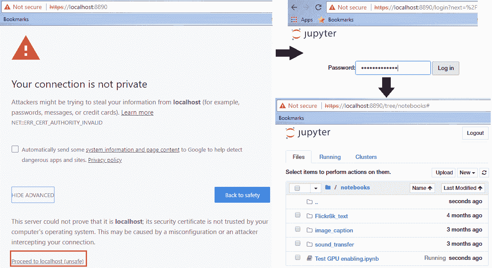

您可以放心地忽略“您的连接不是私人警告”； 之所以显示它，是因为我们自己生成了 SSL 证书，并且尚未得到任何可信机构的验证。

# 在您的深度学习环境中验证 GPU 的启用

最后一步是确保一切正常，并且我们的深度学习框架正在利用我们的 GPU（我们需要按小时支付！）。 您可以参考`Test GPU enabling.ipynb` Jupyter 笔记本来测试所有代码。 我们将在这里详细介绍。 我们首先要验证的是`keras`和`tensorflow`是否已正确加载到我们的服务器中。 可以通过如下导入它们来验证：

```py
import keras
import tensorflow

Using TensorFlow backend.
```

如果您看到前面的代码加载没有错误，那就太好了！ 否则，您可能需要追溯以前执行的步骤，并在线搜索要获取的特定错误； 查看每个框架的 GitHub 存储库。

最后一步是检查`tensorflow`是否已启用以使用我们服务器的 Nvidia GPU。 您可以使用以下测试对此进行验证：

```py
In [1]: from tensorflow.python.client import device_lib
   ...: device_lib.list_local_devices()

Out [1]: 
[name: "/cpu:0"
 device_type: "CPU"
 memory_limit: 268435456
 locality {
 }
 incarnation: 9997170954542835749, 

 name: "/gpu:0"
 device_type: "GPU"
 memory_limit: 11324823962
 locality {
   bus_id: 1
 }
 incarnation: 10223482989865452371
 physical_device_desc: "device: 0, name: Tesla K80, pci bus id: 0000:00:1e.0"]
```

如果您观察到上述输出，则可以看到我们的 GPU 列在设备列表中，因此在训练我们的深度学习模型时它将利用相同的 GPU。 您已经在云上成功建立了强大的深度学习环境，您现在可以使用它使用 GPU 来更快地训练深度学习模型！

永远记住，AWS 按小时收费实例，并且您不希望在完成分析和构建模型后保持实例运行。 您始终可以根据需要从 EC2 控制台重新启动实例。

# 建立具有 GPU 支持的强大的本地深度学习环境

通常，用户或组织可能不希望利用云服务，尤其是在其数据敏感的情况下，因此要专注于构建本地深度学习环境。 这里的主要重点应该是投资于正确的硬件类型，以实现最佳性能并利用正确的 GPU 来构建深度学习模型。 关于硬件，特别强调以下方面：

*   **处理器**：如果您想宠爱自己，则可以投资 i5 或 i7 Intel CPU，或者 Intel Xeon。
*   **RAM**：为您的内存至少投资 32 GB DDR4 或更好的 RAM。
*   **磁盘**：1 TB 硬盘非常好，您还可以投资最少 128 GB 或 256 GB 的 SSD 来快速访问数据！
*   **GPU**：也许是深度学习中最重要的组件。 投资 NVIDIA GPU，以及拥有 8 GB 以上 GTX 1070 的所有产品。

您不应该忽略的其他事项包括主板，电源，坚固的外壳和散热器。

设置完钻机之后，对于软件配置，您可以重复上一部分中的所有步骤，但不包括云设置，您应该一切顺利！

# 神经网络基础

让我们尝试熟悉一下神经网络背后的一些基本概念，这些基本概念使所有深度学习模型都获得成功！

# 一个简单的线性神经元

线性神经元是深度神经网络的最基本组成部分。 可以如下图所示。 在这里，`X = {x1, ... ,xn}`代表输入向量， `w[i]`是神经元的权重。 给定一个包含一组输入目标值对的训练集，线性神经元尝试学习一种线性变换，该变换可以将输入向量映射到相应的目标值。 基本上，线性神经元通过线性函数`W^T x = y`近似输入输出关系：

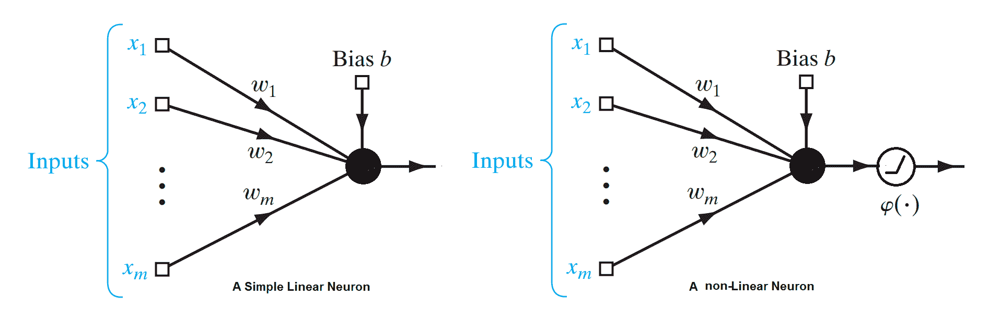

简单线性神经元和简单非线性神经元的示意图

让我们尝试用这个简单的神经元为玩具问题建模。 员工 *A* 从自助餐厅购买午餐。 他们的饮食包括鱼，薯条和番茄酱。 他们每个人得到几个部分。 收银员只告诉他们一顿饭的总价。 几天后，他们能算出每份的价格吗？

好吧，这听起来像一个简单的线性编程问题，可以很容易地通过解析来解决。 让我们使用前面的线性神经单元来表示这个问题。 在这里，`X = {x[fish], x[ketchup], x[chips]}`和我们有相应的权重`(w[fish], w[ketchup], w[chips])`。

每个进餐价格对各部分的价格给出线性约束：


假设`t[n]`为真实价格，`y[n]`由我们的模型估算的价格，由前面的线性方程式给出。 目标与我们的估计之间的剩余价格差为`t[n] - y[n]`。 现在，不同餐点的这些残差可以为正或负，并且可以抵消，从而使总体误差为零。 处理此问题的一种方法是使用平方和残差：

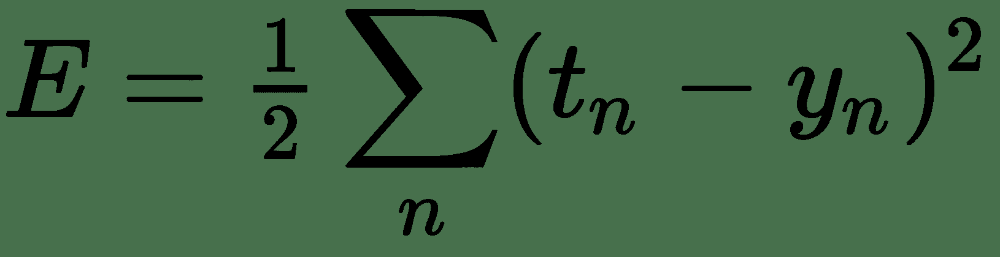

如果我们能够最大程度地减少此错误，则可以对每件商品的一组权重/价格进行很好的估算。 因此，我们得出了一个优化问题。 让我们首先讨论一些解决优化问题的方法。

# 基于梯度的优化

优化基本上涉及最小化或最大化某些函数`f(x)`，其中`x`是数值向量或标量。 在此，`f(x)`被称为**目标函数**或**准则**。 在神经网络中，我们称其为成本函数，损失函数或误差函数。 在前面的示例中，我们要最小化的损失函数为`E`。

假设我们有一个函数`y = f(x)`，其中`x`和`y`是实数。 此函数的导数告诉我们此函数如何随`x`的微小变化而变化。 因此，可以通过无穷大地更改`x`来使用导数来减小函数的值。 假设对于`x`，`f'(x) > 0`。 这意味着，如果我们沿着`x`的正数增加`x`，则`f(x)`将会增加，因此对于足够小的`ε`，`f(x-ε) < f(x)`。 注意`f(x)`可以通过在导数的相反方向以小步长移动`x`来减少：

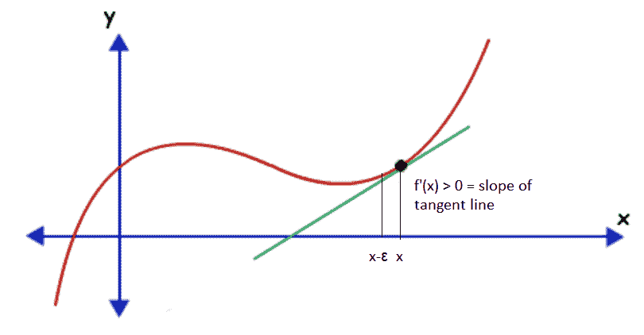

函数值沿导数的相反方向或相反方向的变化方式

如果导数`f'(x) < 0`，则导数不提供信息，我们需要朝哪个方向移动以达到函数最小值。 在局部最优（最小/最大）时，导数可以为零。 如果`x`处的函数`f(x)`的值小于所有相邻点，则将点称为**局部最小值**。 同样，我们可以定义一个局部最大值。 某些点既不能是最大值，也不能是最小值，但是导数`f'(x)`在这些点上为零。 这些称为**鞍**点。 下图说明了`f'(x) = 0`的三种情况：

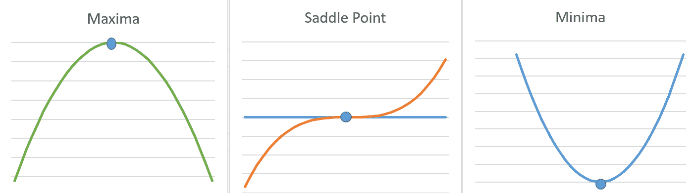

单个变量函数的最小，最大和鞍点。 在所有三个突出显示的点上导数`f'(x) = 0`

在`x`的所有可能值中达到`f`的最小值的点称为**全局最小值**。 一个函数可以具有一个或多个全局最小值。 可能存在局部最小值，而不是全局最小值。 但是，如果函数是凸函数，则可以保证它只有一个全局最小值，而没有局部最小值。

通常，在 ML 中，我们希望最小化几个变量`f`的实值函数：`R^n -> R`。 几个变量的实值函数的一个简单示例是热板温度函数`f(x1, x2) = 50 - x1^2 - 2x2^2`，其在板上的坐标为`x = (x1, x2)`。 在深度学习中，我们通常最小化损失函数，该函数是多个变量（例如神经网络中的权重）的函数。 这些函数具有许多局部最小值，许多鞍点被非常平坦的区域包围，并且它们可能具有也可能没有任何全局最小值。 所有这些使得优化此类功能非常困难。

几个变量的函数的导数表示为偏导数，当我们更改其中一个输入变量`x[i]`，并保持其他不变时，它将衡量函数的变化率。 关于所有变量的偏导数向量称为`f`的**梯度向量**，用`∇f`表示。 我们还可以找出函数相对于任意方向`v`（单位向量）的变化速度。 这是通过在单位向量`v`，即点积`∇f · v`的方向上投影梯度向量`∇f`来计算的。 这在`v`方向上被称为`f`的**定向导数**，通常用`∇[v]`表示。 为了使`f`最小化，我们需要找到一个方向`u`，在其中要更改`x`，以使`f`的值最大程度地减小。

令`x[a]`为非常接近`x`的点，即`||x - x[a]||`非常小。 首先，泰勒级数围绕`x`的阶展开式为：

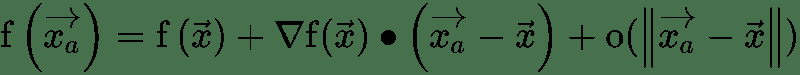

上式中的最后一项对于`x[a]`足够接近`x`可以忽略。 第二项表示`f`沿`x[a] - x`的方向导数。 这里有：

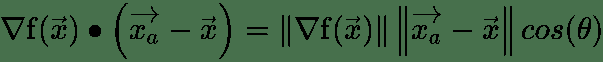

因此，如果`cos(θ)`最小，则`f(x)`最大减小，即 -1，如果`θ = π`，即`x[a] - x`应该指向与梯度向量，`f`相反的方向，则`f(x)`会最大程度地减小。 这是最陡下降方向：`-∇f`或**最陡梯度下降**的方向。 我们在下图中对此进行说明：

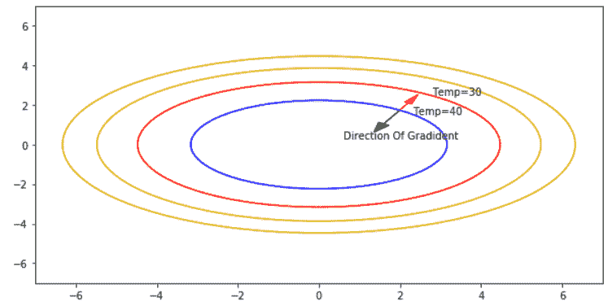

热板

*热板*示例：给定坐标（`x`和`y`）上的温度由函数`f(x, y) = 50 - y^2 - 2x^2`表示。 板在中心`(0, 0)`处最热，温度为 50。点`(x, y)`处的梯度向量由给出`f = (-4x, -2y)`。 板上的点`(2.3, 2)`的温度为 **40**。 该点位于恒温轮廓上。 显然，如红色箭头所示，在与梯度相反的方向上移动，步长为`ε`，温度降低至 **30**。

让我们使用`tensorflow`实现热板温度函数的梯度下降优化。 我们需要初始化梯度下降，所以让我们从`x = y = 2`开始：

```py
import tensorflow as tf
#Initialize Gradient Descent at x,y =(2, 2)
x = tf.Variable(2, name='x', dtype=tf.float32)
y = tf.Variable(2, name='y', dtype=tf.float32)

temperature = 50 - tf.square(y) - 2*tf.square(x)

#Initialize Gradient Descent Optimizer
optimizer = tf.train.GradientDescentOptimizer(0.1) #0.1 is the learning rate
train = optimizer.minimize(temperature)
grad = tf.gradients(temperature, [x,y]) #Lets calculate the gradient vector

init = tf.global_variables_initializer()
with tf.Session() as session:
    session.run(init)    
    print("Starting at coordinate x={}, y={} and temperature there is 
            {}".format(
                   session.run(x),session.run(y),session.run(temperature)))
    grad_norms = []
    for step in range(10): 
        session.run(train)
        g = session.run(grad)
        print("step ({}) x={},y={}, T={}, Gradient={}".format(step,  
                     session.run(x), session.run(y), session.run(temperature), g))
        grad_norms.append(np.linalg.norm(g))

plt.plot(grad_norms)
```

以下是前面代码的输出。 在每个步骤中，如梯度向量所建议的，计算`x`，`y`的新值，以使总温度最大程度地降低。 请注意，计算出的梯度与前面所述的公式完全匹配。 我们还在每个步骤之后计算梯度范数。 以下是梯度在 10 次迭代中的变化方式：

```py
Starting at coordinate x=2.0, y=2.0 and temperature there is 38.0
step (0)  x=2.79,y=2.40000, T=28.55, Gradient=[-11.2, -4.8000002]
step (1)  x=3.92,y=2.88000, T=10.97, Gradient=[-15.68, -5.7600002]
..........
step (9)  x=57.85,y=12.38347, T=-6796.81, Gradient=[-231.40375, -24.766947]
```

# Jacobian 矩阵和 Hessian 矩阵

有时，我们需要优化其输入和输出为向量的函数。 因此，对于输出向量的每个分量，我们需要计算梯度向量。 对于`f: R^n -> R^m`，我们将有`m`个梯度向量。 通过将它们排列成矩阵形式，我们得到`n x m`个偏导数`J[ij] = ∂f(x)[i]/∂x[j]`的矩阵，称为 **Jacobian 矩阵**。

对于单个变量的实值函数，如果要在某个点测量函数曲线的曲率，则需要计算在更改输入时导数将如何变化。 这称为**二阶导数**。 二阶导数为零的函数没有曲率，并且是一条平线。 现在，对于几个变量的函数，有许多二阶导数。 这些导数可以布置在称为 **Hessian 矩阵**的矩阵中。 由于二阶偏导数是对称的，即：

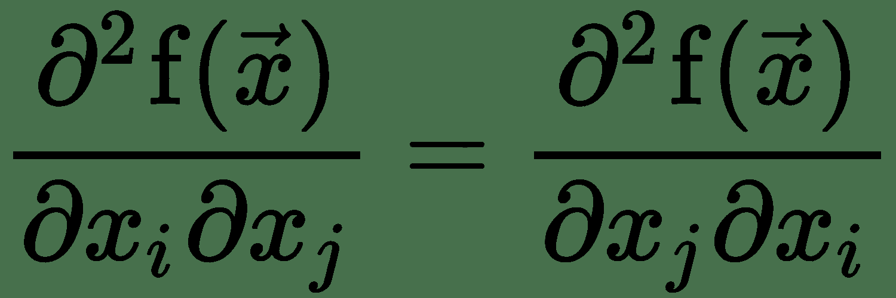

Hessian 矩阵是实对称的，因此具有实特征值。 相应的特征向量代表不同的曲率方向。 最大和最小特征值的大小之比称为黑森州的**条件数**。 它测量沿每个本征维的曲率彼此相差多少。 当 Hessian 条件数较差时，梯度下降的效果较差。 这是因为，在一个方向上，导数迅速增加，而在另一个方向上，它缓慢地增加。 梯度下降并没有意识到这一变化，因此，可能需要很长时间才能收敛。

对于我们的温度示例，Hessian 为：

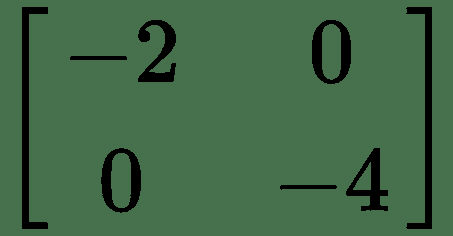

最大曲率的方向是最小曲率的方向的两倍。 因此，沿着`y`遍历，我们将更快地到达最小点。 从前面的*热板*图中所示的温度轮廓中也可以看出这一点。

我们可以使用二阶导数曲率信息来检查最佳点是最小还是最大。 对于单个变量，`f'(x) = 0`，`f''(x) > 0`表示`x`是`f`的局部最小值， 并且`f'(x) = 0`，`f''(x) < 0`表示`x`是局部最大值。 这称为**二阶导数测试**（请参见下图*解释曲率*）。 类似地，对于几个变量的函数，如果 Hessian 在`x`为正定（即所有本征值均为正），则`f`会在`x`达到局部最小值。 如果 Hessian 在`x`处为负定值，则`f`在`x`处达到局部最大值。 如果 Hessian 同时具有正和负特征值，则`x`是`f`的鞍点。 否则，测试没有定论：

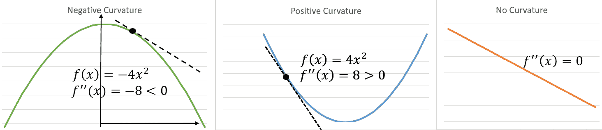

解释曲率

存在基于使用曲率信息的二阶导数的优化算法。 牛顿法就是这样一种方法，对于凸函数，它只需一步就可以达到最佳点。

# 导数链式规则

令`f`和`g`均为单个变量的实值函数。 假设`y = g(x)`和`z = f(g(x)) = f(y)`。

然后，导数的链式规则指出：

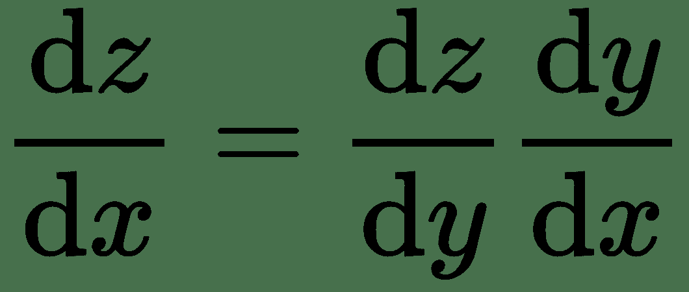

同样，对于几个变量的功能，令`x ∈ R^m`，`y ∈ R^n`，`g: R^m -> R^n`，`f: R^n -> R`，`y = g(x)`，`z = f(y)`，然后：

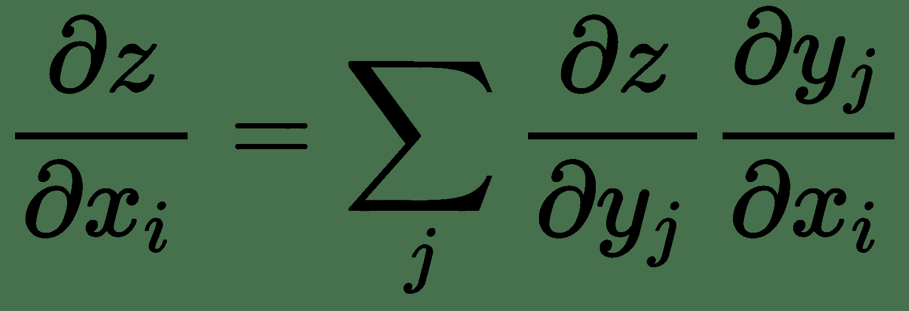

因此，`z`相对于`x`的梯度`∂z/∂x`表示为 Jacobian `∂y/∂x`与`∂z/∂y`梯度向量的乘积。 因此，对于多个变量的函数，我们具有导数的链式规则，如下所示：

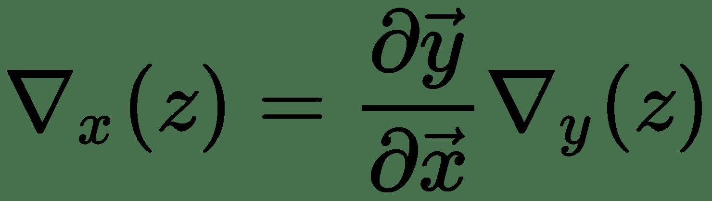

神经网络学习算法由几个这样的雅可比梯度乘法组成。

# 随机梯度下降

几乎所有的神经网络学习都由一种非常重要的算法提供支持：SGD。 这是常规梯度下降算法的扩展。 在 ML 中，损失函数通常写为样本损失函数之和，作为*自助餐厅示例*中的平方误差`E`。 因此，如果我们有`m`个训练示例，则梯度函数也将具有`m`个可加项。

梯度的计算成本随着`m`线性增加。 对于十亿大小的训练集，前面的梯度计算将花费很长时间，并且梯度下降算法将朝着收敛的方向非常缓慢地进行，从而在实践中无法进行学习。

SGD 取决于对梯度实际上是期望值的简单理解。 我们可以通过在小样本集上计算期望值来近似。 可以从训练集中随机抽取`m'`（比`m`小得多的**小批量**）样本大小，并且梯度可以近似为计算单个梯度下降步骤。 让我们再次考虑*自助餐厅示例*。 应用链式规则，误差函数（三个变量的函数）的梯度由下式给出：

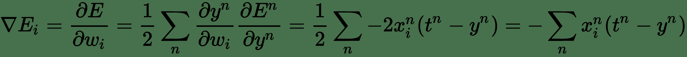

现在，代替使用所有 *n* 训练示例来计算导数，如果我们从训练示例中抽取少量随机样本，我们仍然可以合理地近似导数。

`E`的梯度给出了权重更新的估计值。 我们可以通过将其乘以一个常数`ε`（称为**学习率**）来进一步控制它。 取得非常高的学习率可能会增加而不是使优化目标函数值最小化。

在 SGD 中，在将每个小批量展示给算法后，将更新权重。 将整个训练数据一次呈现给训练算法需要很多数据点/批量大小的步骤。 一个时期描述了算法看到*整个*数据集的次数。

以下是自助餐厅问题的`keras`代码。 假设鱼类的实际价格为 150 美分，薯条为 50 美分，番茄酱为 100 美分。 我们已随机生成餐中物品的样品部分。 假设初始的重量/价格为每份 50 美分。 30 个纪元后，我们得到的估算值与商品的真实价格非常接近：

```py
#The true prices used by the cashier
p_fish = 150; p_chips = 50; p_ketchup = 100
#sample meal prices: generate data meal prices for 10 days.
np.random.seed(100)
portions = np.random.randint(low=1, high=10, size=3 )
X = []; y = []; days = 10
for i in range(days):
    portions = np.random.randint(low=1, high=10, size=3 )
    price = p_fish * portions[0] + p_chips * portions[1] + p_ketchup *   
    portions[2]
    X.append(portions)
    y.append(price)
X = np.array(X)
y = np.array(y)

#Create a linear model
from keras.layers import Input, Dense
from keras.models import Model
from keras.optimizers import SGD

price_guess = [np.array([[ 50 ], [ 50],[ 50 ]]) ] #initial guess of the price
model_input = Input(shape=(3,), dtype='float32')
model_output = Dense(1, activation='linear', use_bias=False, 
     name='LinearNeuron',
     weights=price_guess)(model_input)
     sgd = SGD(lr=0.01)
model = Model(model_input, model_output)

#define the squared error loss E stochastic gradient descent (SGD) 

optimizer
model.compile(loss="mean_squared_error", optimizer=sgd)
model.summary()
_________________________________________________________________
Layer (type) Output Shape Param # 
=================================================================
input_4 (InputLayer) (None, 3) 0 
_________________________________________________________________
LinearNeuron (Dense) (None, 1) 3 
=================================================================
Total params: 3
Trainable params: 3
Non-trainable params: 0
_________________________________________________________________

#train model by iterative optimization: SGD with mini-batch of size 5.

history = model.fit(X, y, batch_size=5, epochs=30,verbose=2)

```

在下图中，我们显示了学习率对迭代 SGD 算法收敛的影响：

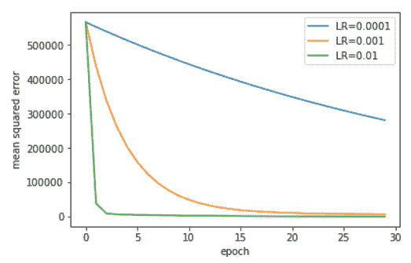

学习率对自助餐厅问题 SGD 收敛速度的影响

下表显示了 SGD 在`LR = 0.01`的连续时期如何更新价格猜测：

| **周期** | **`w_fish`** | **`w_chips`** | **`w_ketchup`** |
| --- | --- | --- | --- |
| 0（初始） | 50 | 50 | 50 |
| 1 | 124.5 | 96.3 | 127.4 |
| 5 | 120.6 | 81.7 | 107.48 |
| 10 | 128.4 | 74.7 | 104.6 |
| 15 | 133.8 | 68.9 | 103.18 |
| 30 | 143.07 | 58.2 | 101.3 |
| 50 | 148.1 | 52.6 | 100.4 |

# 非线性神经元

线性神经元很简单，但是在计算上受到限制。 即使我们使用多层线性单元的深层堆栈，我们仍然具有仅学习线性变换的线性网络。 为了设计可以学习更丰富的转换集（非线性）的网络，我们需要一种在神经网络的设计中引入非线性的方法。 通过使输入的线性加权总和通过非线性函数，我们可以在神经单元中引起非线性。

尽管非线性函数是固定的，但是它可以通过线性单位的权重来适应数据，权重是该函数的参数。 此非线性函数称为非线性神经元的**激活函数**。 一个简单的激活函数示例是二进制阈值激活，相应的非线性单位称为 **McCulloch-Pitts 单位**。 这是一个阶跃函数，不可微分为零。 同样，在非零点，其导数为零。 其他常用的激活函数是 Sigmoid，tanh 和 ReLu。 下图提供了这些函数的定义和图解：

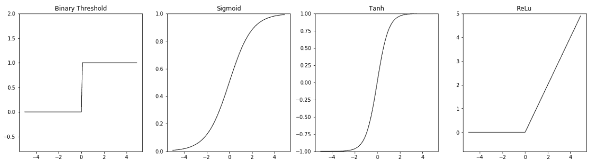

激活函数图

这是激活函数定义：

| **函数名称** | **定义** |
| --- | --- |
| 二元阈值 | 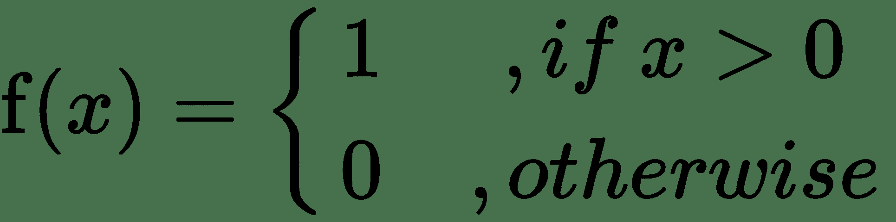 |
| Sigmoid | 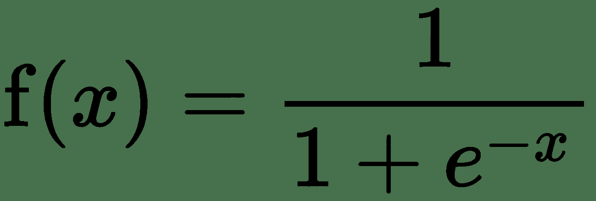 |
| tanh | 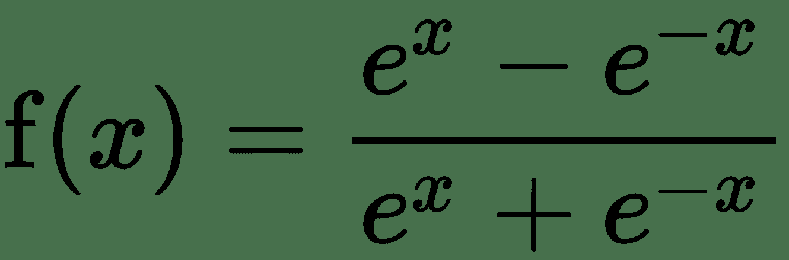 |
| ReLU | 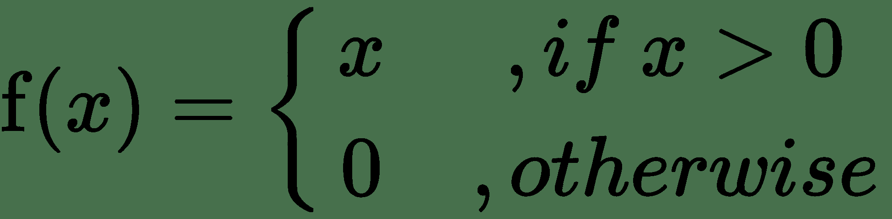 |
| | 或  |

如果我们有一个 K 类（`K > 2`）分类问题，那么我们基本上想学习条件概率分布`P(y | x)`。 因此，输出层应具有 K 个神经元，其值应为 1。为了使网络了解所有 K 单位的输出应为 1， 使用 **softmax 激活**功能。 这是乙状结肠激活的概括。 像 Sigmoid 函数一样，softmax 函数将每个单元的输出压缩为 0 到 1 之间。

而且，它会将每个输出相除，以使输出的总和等于 1：

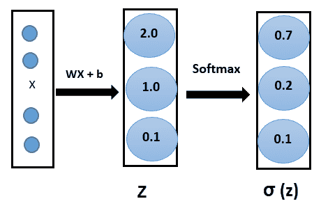

数学上，softmax 函数如下所示，其中`z`是输出层输入的向量（如果有 10 个输出单元，则`z`中有 10 个元素）。 同样，`j`索引输出单位，因此`j = 1, 2, ..., K`：

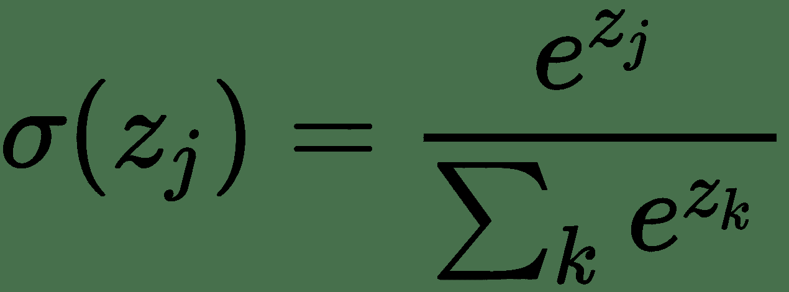

# 学习一个简单的非线性单元 – Logistic 单元

假设我们有两个类分类问题； 也就是说，我们需要预测二进制结果变量`y`的值。 就概率而言，结果`y`取决于特征`x`的伯努利分布。 神经网络需要预测概率`P(y = 1 | x)`。 为了使神经网络的输出成为有效概率，它应该位于`[0, 1]`中。 为此，我们使用 Sigmoid 激活函数并获得非线性逻辑单元。

要学习逻辑单元的权重，首先我们需要一个成本函数并找到成本函数的导数。 从概率的角度来看，如果我们想最大化输入数据的可能性，则交叉熵损失会作为自然成本函数出现。 假设我们有一个训练数据集`X = {x[n], t[n]}`，`n = 1, …, N`，似然函数可以写成：

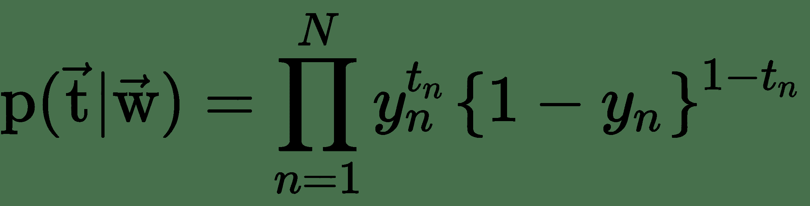

其中`y[n]`是在将`x[n]`作为输入数据传递到逻辑单元之后，Sigmoid 单元的输出。 注意`t`和`w`分别表示 Sigmoid 单元的目标向量（训练集中的所有`N`个目标值）和权重向量（所有权重的集合）。 可以通过采用似然性的负算法来定义误差函数，这给出了交叉熵代价函数：

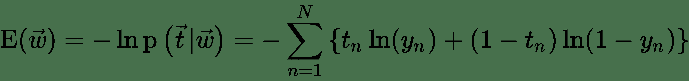

要学习逻辑神经单元的权重，我们需要关于每个权重的输出导数。 我们将使用导数的*链式规则*来导出逻辑单元的误差导数：

让：

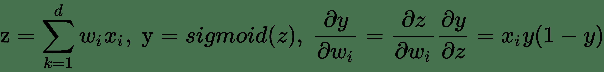

因此：

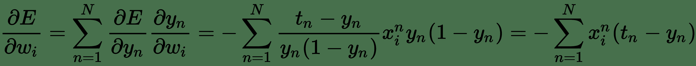

就线性单元的平方误差损失而言，我们发现的导数看起来与导数非常相似，但它们并不相同。 让我们仔细看一下交叉熵损失，看看它与平方误差有何不同。 我们可以如下重写交叉熵损失：

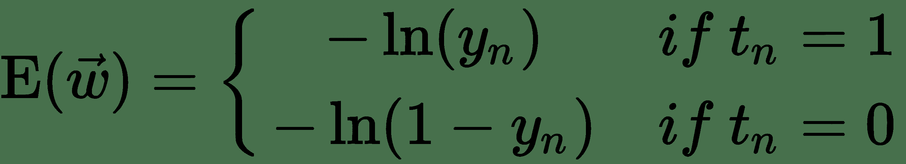

*   因此，对于`t[n] = 1`，`y[n] = 1 => E(w) = 0`，但`y[n] = 0 => E(w) = +∞`
*   对于`t[n] = 0`，`y[n] = 1 => E(w) = +∞`，但`y[n] = 0 => E(w) = 0`
*   也就是说，如果类别标签的预测和真实值不同，则该算法将受到很大的惩罚。

现在，让我们尝试将*平方误差损失*与逻辑输出一起使用。 因此，我们的成本函数为：

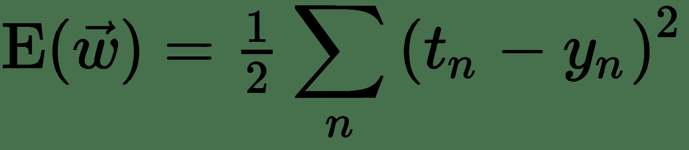

因此：

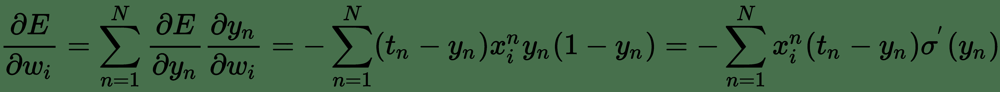

该误差导数直接取决于 Sigmoid 函数`σ'(y[n])`的导数。 现在，当`y[n]`高度负值时，Sigmoid 函数趋于 0；当`y[n]`高度正值时，Sigmoid 函数趋于 1。 从 Sigmoid 曲线的平坦水平区域可以明显看出，对于`y[n]`的这种值，梯度可以缩小得太小。 因此，即使`t[n]`和`y[n]`不一致，对于这些数据点，平方误差导数也将具有很小的更新。 也就是说，它们被网络严重错误分类。 这称为**消失梯度问题**。 因此，基于最大似然的交叉熵损失几乎始终是训练逻辑单元的首选损失函数。

# 损失函数

损失函数将神经网络的输出与训练中的目标值进行比较，产生一个损失值/分数，以测量网络的预测与期望值的匹配程度。 在上一节中，我们看到了针对不同任务（例如回归和二分类）的不同类型损失函数的需求。 以下是一些其他流行的损失函数：

*   **二元交叉熵**：关于逻辑单元的上一节讨论的两类分类问题的对数损失或交叉熵损失。
*   **分类交叉熵**：如果我们有 *K* 类分类问题，那么我们将广义交叉熵用于 *K* 类。
*   **均方误差**：这是我们讨论过几次的均方和误差。 这广泛用于各种回归任务。
*   **平均绝对误差**：测量一组预测中误差的平均大小，而不考虑其方向。 这是测试样本中预测值与实际观测值之间的绝对差异的平均值。 **平均绝对误差**（**MAE**）对大误差赋予相对较高的权重，因为它会平方误差。
*   **平均绝对百分比误差**：以百分比形式度量误差的大小。 计算为无符号百分比误差的平均值。 使用**平均绝对百分比误差**（**MAPE**）是因为容易理解百分比。
*   **铰链损失/平方铰链损失**：铰链损耗用于 SVM。 他们对边际错误分类点的惩罚不同。 它们是克服交叉熵损失的好选择，并且还可以更快地训练神经网络。 对于某些分类任务，更高阶的铰链损耗（例如平方铰损耗）甚至更好。
*   **Kullback-Leibler（KL）散度**：KL 散度是一种概率分布与第二个预期概率分布之间如何偏离的度量。

# 数据表示

神经网络训练的训练集中的所有输入和目标都必须表示为张量（或多维数组）。 张量实际上是将二维矩阵推广到任意数量的维。 通常，这些是浮点张量或整数张量。 无论原始输入数据类型是什么（图像，声音，文本），都应首先将其转换为合适的张量表示形式。 此步骤称为**数据向量化**。 以下是本书中经常使用的不同维度的张量：

*   **零维张量或标量**：仅包含一个数字的张量称为零维张量，零维张量或标量。
*   **一维张量或向量**：包含数字数组的张量称为向量或一维张量。 张量的维数也称为张量的**轴**。 一维张量恰好具有一个轴。
*   **矩阵（二维张量）**：包含向量数组的张量是矩阵或二维张量。 矩阵具有两个轴（由*行*和*列*表示）。
*   **三维张量**：通过将一组（相同维度的）矩阵堆叠在一个数组中，我们得到一个三维张量。

通过将三维张量放置在一个数组中，可以创建三维张量。 等等。 在深度学习中，通常我们使用零维到四维张量。

张量具有三个关键属性：

*   轴的尺寸或数量
*   张量的形状，即张量在每个轴上具有多少个元素
*   数据类型-是整数张量还是浮点型张量

# 张量示例

以下是在讨论迁移学习用例时将经常使用的一些示例张量。

*   **时间序列数据**：典型的时间序列数据将具有时间维度，并且该维度将对应于每个时间步的要素。 例如，一天中每小时的温度和湿度测量是一个时间序列数据，可以用形状为`(24, 2)`的 2D 张量表示。 因此，数据批处理将由 3D 张量表示。
*   **图像数据**：图像通常具有三个维度：宽度，高度和颜色通道。 因此，可以用 3D 张量表示。 图像批处理由 4D 张量表示，如下图所示。
*   **视频数据**：视频由图像帧组成。 因此，要表示单个视频，我们还需要一个尺寸。 一帧是彩色图像，需要三个维度来表示一帧。 该视频由形状（帧，宽度，高度，颜色通道）的 4D 张量表示：

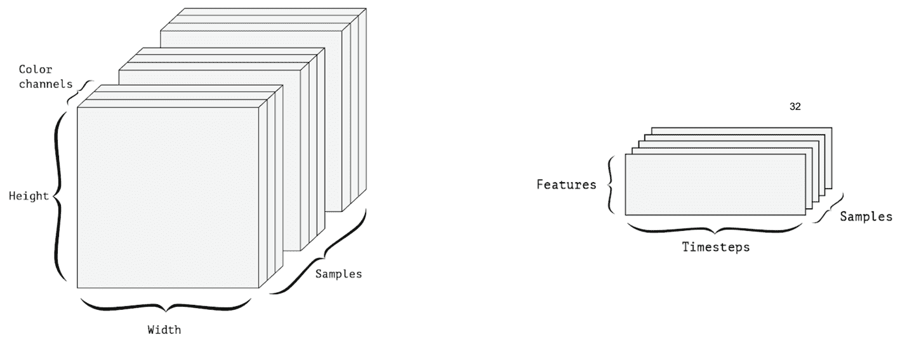

*   **作为张量的数据批次**：假设我们有一批 10 张图像。 诸如 MNIST 数据中的二进制图像可以由 2D 张量表示。 对于一批 10 张图像，可以用 3D 张量表示。 此 3D 张量的第一个轴（轴 0）称为**批次尺寸**。

# 张量运算

可以通过一组张量运算来表述用于训练/测试深度神经网络的所有计算。 例如，张量的相加，相乘和相减。 以下是本书中一些常用的张量运算：

*   **逐元素运算**：在深度学习中非常普遍地将函数独立地应用于张量的所有元素。 例如，将激活功能应用于图层中的所有单元。 其他按元素进行的运算包括将基本数学运算符（例如`+`，`-`和`*`）按元素进行对相同形状的两个张量进行运算。
*   **张量点积**：两个张量的点积与两个张量的元素乘积不同。 两个向量的点积是一个标量，等于两个向量的元素乘积之和。 矩阵和兼容形状的向量的点积是向量，而兼容形状的两个矩阵的点积是另一个矩阵。 对于具有兼容形状的两个矩阵 x，y，我们的意思是要定义点`(x, y)`，我们应具有`x.shape[1] = y.shape[0]`。
*   **广播**：假设我们要添加两个形状不同的张量。 这通常出现在神经网络的每一层。 让我们以 ReLU 层为例。 ReLU 层可以通过张量操作表示如下：`output = relu(dot(W, input) + b)`。 在这里，我们正在计算权重矩阵与输入向量`x`的点积。 这将产生一个向量，然后添加一个标量偏差项。 实际上，我们希望将偏置项添加到点积输出向量的每个元素中。 但是，偏置张量是零维张量，向量是一维。 因此，这里我们需要广播较小的张量以匹配较大张量的形状。 广播涉及两个步骤：将轴添加到较小的张量以匹配较大张量的尺寸。 然后，重复较小的张量以匹配较大张量的形状。 我们将通过一个具体示例对此进行说明：令`x`为形状`(32, 10)`，`y`为形状`(10)`。 我们要计算`x + y`。 在广播的第一步之后，我们将轴添加到`y`（较小的张量），并得到形状为`(1, 10)`的张量`y1`。 为了匹配`x`的尺寸，我们将`y1`重复 32 次，并得到形状为`(32, 10)`的`y2`张量。 然后，我们计算元素加法`x + y2`。
*   **重塑**：张量重塑是沿轴向重新排列张量元素的操作。 重塑的一个简单示例是转置 2D 张量。 在矩阵的转置操作中，*行*和*列*互换。 重塑的另一个例子是拉紧张量。 通过将张量的所有元素沿一个轴放置，可以将多维张量重塑为向量或一维张量。 以下是 TensorFlow 中的一些张量操作实现示例：

```py
#EXAMPLE of Tensor Operations using tensorflow.
import tensorflow as tf

# Initialize 3 constants: 2 vectors, a scalar and a 2D tensor
x1 = tf.constant([1,2,3,4])
x2 = tf.constant([5,6,7,8])
b = tf.constant(10)
W = tf.constant(-1, shape=[4, 2])
# Elementwise Multiply/subtract
res_elem_wise_mult = tf.multiply(x1, x2)
res_elem_wise_sub = tf.subtract(x1, x2)

#dot product of two tensors of compatable shapes
res_dot_product = tf.tensordot(x1, x2, axes=1)

#broadcasting : add scalar 10 to all elements of the vector
res_broadcast = tf.add(x1, b)

#Calculating Wtx
res_matrix_vector_dot = tf.multiply(tf.transpose(W), x1)

#scalar multiplication
scal_mult_matrix = tf.scalar_mul(scalar=10, x=W)

# Initialize Session and execute
with tf.Session() as sess:
    output = sess.run([res_elem_wise_mult,res_elem_wise_sub, 
                       res_dot_product,
                       res_broadcast,res_matrix_vector_dot,
                       scal_mult_matrix])
    print(output)
```

# 多层神经网络

单层非线性单元对于它可以学习的输入输出转换的能力仍然有限。 可以通过查看 XOR 问题来解释。 在 XOR 问题中，我们需要一个神经网络模型来学习 XOR 函数。 XOR 函数采用两个布尔输入，如果它们不同则输出 1，如果输入相同则输出 0。

我们可以将其视为输入模式为`X = {(0, 0), (0, 1), (1, 0), (1, 1)}`的模式分类问题。 第一个和第四个在类 0 中，其他在第 1 类中。让我们将此问题视为回归问题，损失为**均方误差**（**MSE**），并尝试使用线性单元。 通过分析求解，得出所需权重：`w = (0, 0)`和偏差：`b = 1/2`。 该模型为所有输入值输出 0.5。 因此，简单的线性神经元无法学习 XOR 函数。

解决 XOR 问题的一种方法是使用输入的不同表示形式，以便线性模型能够找到解决方案。 这可以通过向网络添加非线性隐藏层来实现。 我们将使用带有两个隐藏单元的 ReLU 层。 输出是布尔值，因此最适合的输出神经元是逻辑单元。 我们可以使用二进制交叉熵损失来学习权重：

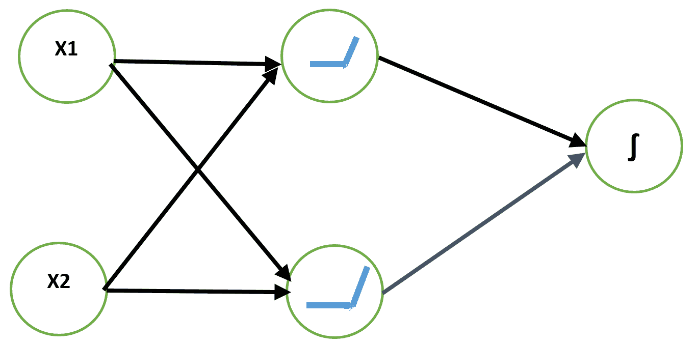

让我们使用 SGD 学习此网络的权重。 以下是 XOR 函数学习问题的`keras`代码：

```py
model_input = Input(shape=(2,), dtype='float32')
z = Dense(2,name='HiddenLayer', kernel_initializer='ones')(model_input)
z = Activation('relu')(z) #hidden activation ReLu
z = Dense(1, name='OutputLayer')(z)
model_output = Activation('sigmoid')(z) #Output activation
model = Model(model_input, model_output)
model.summary()

#Compile model with SGD optimization, with learning rate = 0.5
sgd = SGD(lr=0.5)
model.compile(loss="binary_crossentropy", optimizer=sgd)
#The data set is very small - will use full batch - setting batch size = 4
model.fit(X, y, batch_size=4, epochs=300,verbose=0)
#Output of model
preds = np.round(model.predict(X),decimals=3)
pd.DataFrame({'Y_actual':list(y), 'Predictions':list(preds)})
```

前面代码的输出如下：

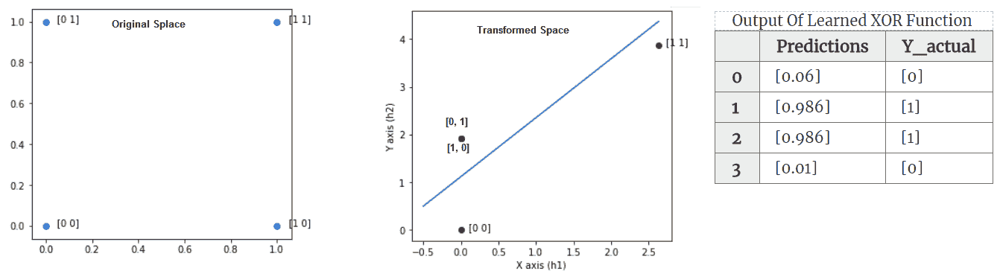

（左）显示 4 点的原始空间-显然没有行可以将 0 类`{(0, 0), (1, 1)}`与其他类分开。 （中心）显示隐藏的 ReLU 层学习到的变换空间。 （右）该表显示了通过该功能获得的预测值

具有一层隐藏层的神经网络能够学习 XOR 函数。 这个例子说明了神经网络需要非线性隐藏层来做有意义的事情。 让我们仔细看一下隐藏层学习了哪些输入转换，从而使输出逻辑神经元学习该功能。 在 Keras 中，我们可以从学习的模型中提取中间隐藏层，并使用它来提取传递给输出层之前输入的转换。 上图显示了如何转换四个点的输入空间。 转换后，可以用一条线轻松地分隔 1 类和 0 类点。 这是为原始空间和变换后的空间生成图的代码：

```py
import matplotlib.pyplot as plt

#Extract intermediate Layer function from Model
hidden_layer_output = Model(inputs=model.input, outputs=model.get_layer('HiddenLayer').output)
projection = hidden_layer_output.predict(X) #use predict function to 
                                    extract the transformations
```

```py
#Plotting the transformed input

fig = plt.figure(figsize=(5,10))
ax = fig.add_subplot(211)
plt.scatter(x=projection[:, 0], y=projection[:, 1], c=('g'))
```

通过堆叠多个非线性隐藏层，我们可以构建能够学习非常复杂的非线性输入输出转换的网络。

# 反向传播 – 训练深度神经网络

为了训练深层的神经网络，我们仍然可以使用梯度下降 SGD。 但是，SGD 将需要针对网络的所有权重计算损失函数的导数。 我们已经看到了如何应用导数链式规则来计算逻辑单元的导数。

现在，对于更深的网络，我们可以逐层递归地应用相同的链式规则，以获得与网络中不同深度处的层对应的权重有关的损失函数的导数。 这称为反向传播算法。

反向传播技术是在 1970 年代发明的，它是一种用于对复杂的嵌套函数或函数功能进行自动区分的一般优化方法。 但是，直到 1986 年，Rumelhart，Hinton 和 Williams 发表了一篇论文，标题为[《通过反向传播的误差学习算法》](https://www.iro.umontreal.ca/~vincentp/ift3395/lectures/backprop_old.pdf)，该算法的重要性已为大型 ML 社区所认可。 反向传播是最早能够证明人工神经网络可以学习良好内部表示的方法之一。 也就是说，它们的隐藏层学习了非平凡的功能。

反向传播算法是在单个训练示例上针对每个权重计算误差导数`dE/dθ`的有效方法。 为了理解反向传播算法，让我们首先代表一个带有计算图符号的神经网络。 神经网络的计算图将具有节点和有向边，其中节点代表变量（张量），边代表连接到下一个变量的变量的运算。 如果`y = f(x)`，则变量`x`通过有向边连接到`y`，对于某些功能`f`。

例如，逻辑单元的图形可以表示如下：

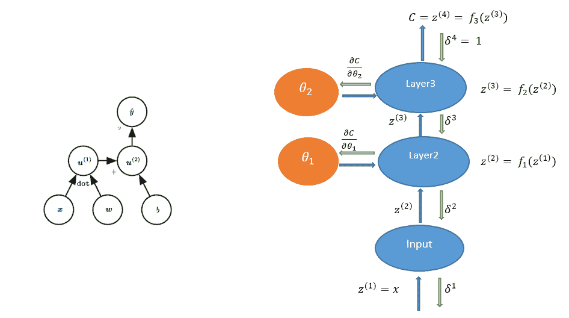

（左）逻辑回归作为计算图。 （右）三层网络计算图的 BP 算法信息流

我们用`u[1], u[2], ..., u[n]`表示计算节点。 另外，我们按顺序排列节点，以便可以一个接一个地计算它们。 `u[n]`是一个标量-损失函数。 让我们用节点`θ[k]`表示网络的参数或权重。 要应用梯度下降，我们需要计算所有导数`∂u^n/∂θ[k]`。 可以通过遵循从输入节点到最终节点`∂u^n`的计算图中的有向路径来计算该图的正向计算。 这称为**前向传播**。

由于图中的节点为张量，因此要计算偏导数`∂u^n/∂θ[k]`，将使用多个变量函数的导数链式规则，该规则由雅可比矩阵与梯度的乘积表示。 反向传播算法涉及一系列这样的雅可比梯度积。

反向传播算法表示如下：

1.  给定输入向量`X = {x[n]}`，目标向量`Y = {t[n]}`，用于测量网络错误的成本函数`C`以及网络的初始权重集，以计算网络的前向通过并计算损耗`C`

2.  向后传递-对于每个训练示例`(x[n], t[n])`，针对每个层参数/权重计算损耗的导数`C`-此步骤讨论如下：
    1.  通过对输入目标对或它们的小批量的所有梯度求平均值来组合各个梯度
    2.  更新每个参数`Δθ[l] = -α · ∂C/∂θ[l]`，`α`为学习率

我们将使用完全连接的三层神经网络解释*反向传播*。 上图显示了为此的计算图。 令`z(i)`表示图中的计算节点。 为了执行反向传播，导数`∂C/∂z(i)`的计算将与正向传递的反向顺序完全相同。 这些由向下箭头指示。 让我们表示关于层`l`的输入`z(l)`的成本函数的导数`δ(l)`。 对于最顶层，让`δ(4) = 1`。 为了递归计算，让我们考虑一个单层。 一层具有输入`z(l)`和输出`z(l+1)`。 同样，该层将接受输入`δ(l + 1)`并产生`δ(l)`和`∂C/∂θ[l]`。

对于层`l`：

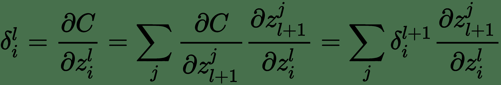

`i`代表梯度`δ(l)[i]`的第`i`个分量。

因此，我们得出了用于计算反向消息的递归公式。 使用这些，我们还可以计算关于模型参数的成本导数，如下所示：

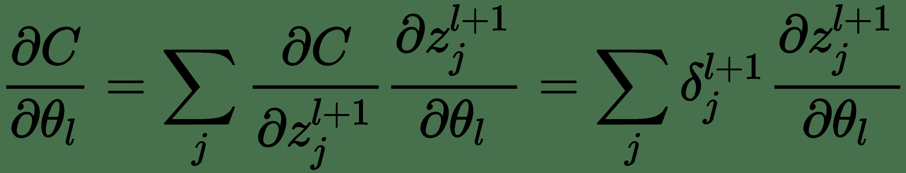

反向传播算法在计算图中相对于其祖先`x`，计算标量成本函数`z`的梯度。 该算法开始于计算关于其本身的成本`z`的导数`∂z/∂z = 1`。 可以通过将当前梯度乘以产生`z`的运算的雅可比行列式来计算关于`z`父级的梯度。 我们一直向后遍历计算图并乘以雅可比行列式，直到达到输入`x`为止。

# 神经网络学习中的挑战

通常，优化是一项非常困难的任务。 在本节中，我们讨论了用于训练深度模型的优化方法所涉及的一些常见挑战。 了解这些挑战对于评估神经网络模型的训练性能并采取纠正措施以缓解问题至关重要。

# 病态条件

矩阵的条件数是最大奇异值与最小奇异值之比。 如果条件数非常高，则矩阵是病态的，通常表示最低的奇异值比最高的奇异值小几个数量级，并且矩阵的行彼此高度相关。 这是优化中非常普遍的问题。 实际上，这甚至使凸优化问题也难以解决。 通常，神经网络会出现此问题，这会导致 SGD 卡住，即，尽管存在很强的梯度，学习也会变得非常缓慢。 对于具有良好条件数（接近 1）的数据集，误差轮廓几乎是圆形的，并且负梯度始终笔直指向误差表面的最小值。 对于条件差的数据集，错误表面在一个或多个方向上相对平坦，而在其他方向上则强烈弯曲。 对于复杂的神经网络，可能无法通过解析找到 Hessian 和病态效应。 但是，可以通过在训练时期内绘制平方梯度范数和`g^T H[g]`来绘制图表，以监控疾病的影响。

让我们考虑我们要优化的`f(x)`函数的二阶泰勒级数逼近。`z[0]`点的泰勒级数由下式给出：


其中`g`是梯度向量， `H`是`f(x)`在`x[0]`时的 Hessian。 如果ε是我们使用的学习率，则根据梯度下降的新点为`x[0] - ε[g]`。 将其替换为 Taylor 系列展开式，我们得到：

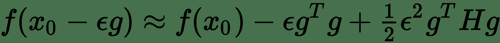

注意，如果`-ε g^t g + ½ε^2 g^T H[g] > 0`，则与`x[0]`相比，新点的函数值会增加。 同样，在存在强梯度的情况下，我们将具有较高的平方梯度范数`||g||^2 = g^T g`，但同时，如果其他数量为`g^T H[g]`增长一个数量级，那么我们将看到`f(x)`的下降速度非常缓慢。 但是，如果此时可以缩小学习率ε，则可能会在某种程度上使这种影响无效，因为`g^T H[g]`数量乘以`ε^2`。 可以通过在训练时期绘制平方梯度范数和`g^T H[g]`来监测疾病的影响。 我们在*热板*中看到了如何计算梯度范数的示例。

# 局部最小值和鞍点

DNN 模型实质上可以保证具有极大数量的局部最小值。 如果局部最小值与全局最小值相比成本较高，则可能会出现问题。 长期以来，人们一直认为，由于存在这样的局部极小值，神经网络训练受到了困扰。 这仍然是一个活跃的研究领域，但是现在怀疑对于 DNN，大多数局部最小值具有较低的成本值，没有必要找到全局最小值，而是在权重空间中具有足够低的成本函数值。 可以通过监视梯度范数来检测强局部极小值的存在。 如果梯度范数减小到很小的数量级，则表明存在局部极小值。

鞍点是既不是最大值也不是最小值的点，而是被平坦区域围绕，该平坦区域的一侧目标函数值增大，而另一侧目标函数减小。 由于该平坦区域，梯度变得非常小。 然而，已经观察到，凭经验梯度下降迅速逃离了这些区域。

# 悬崖和梯度爆炸

高度非线性 DNN 的目标函数具有非常陡峭的区域，类似于悬崖，如下图所示。 在极陡峭的悬崖结构的负梯度方向上移动会使权重移得太远，以致我们完全跳下悬崖结构。 因此，在我们非常接近的时候错过了极小值。

因此，取消了为达到当前解决方案所做的许多工作：

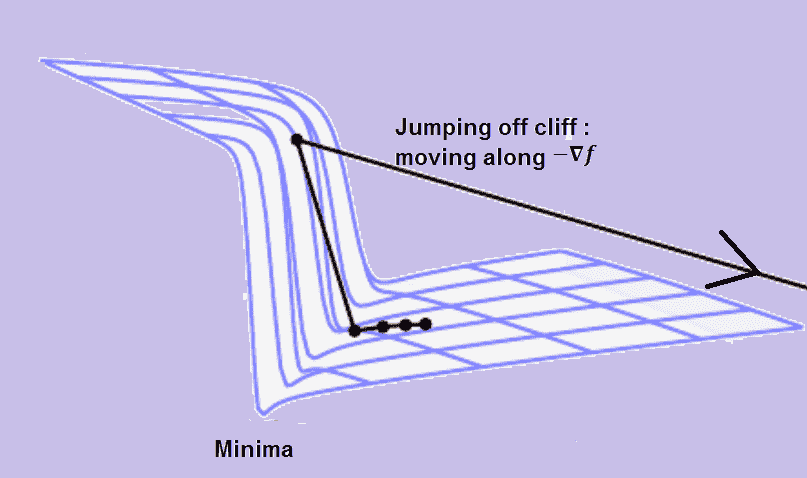

解释何时需要裁剪梯度范数

我们可以通过裁剪梯度来避免梯度下降中的此类不良动作，也就是说，设置梯度幅度的上限。 我们记得梯度下降是基于函数的一阶泰勒近似。 这种近似在计算梯度的点附近的无穷小区域中保持良好。 如果我们跳出该区域，成本函数可能开始增加或向上弯曲。 因此，我们需要限制移动的时间。 梯度仍然可以给出大致正确的方向。 必须将更新选择为足够小，以避免越过向上的弯曲。 一种实现此目的的方法是通过设置标准的上限阈值来限制**梯度边界**：

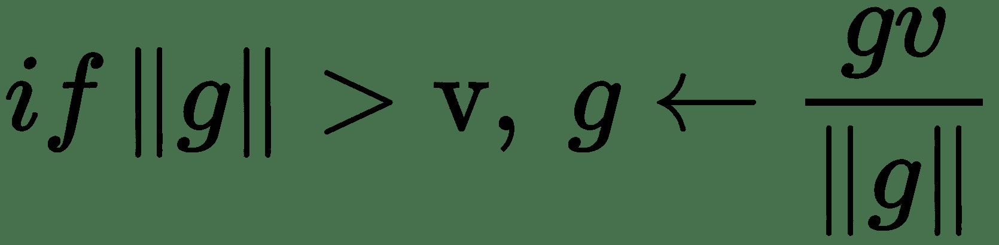

在 Keras 中，可以如下实现：

```py
#The parameters clipnorm and clipvalue can be used with all optimizers #to control gradient clipping:

from keras import optimizers

# All parameter gradients will be clipped to max norm of 1.0
sgd = optimizers.SGD(lr=0.01, clipnorm=1.)
#Similarly for ADAM optmizer
adam = optimizers.Adam(clipnorm=1.)
```

# 初始化 – 目标的本地和全局结构之间的不良对应关系

要启动数值优化算法（例如 SGD），我们需要初始化权重。 如果我们具有目标功能，如下图所示，通过进行 SGD 建议的局部移动，我们将浪费大量时间，如果我们从真正的极小值所在的山侧开始。 在这种情况下，目标函数的局部结构不会给出任何关于最小值位于何处的提示。 可以通过适当的初始化来避免这种情况。 如果我们可以在山的另一侧的某个位置启动 SGD，则优化会快得多：

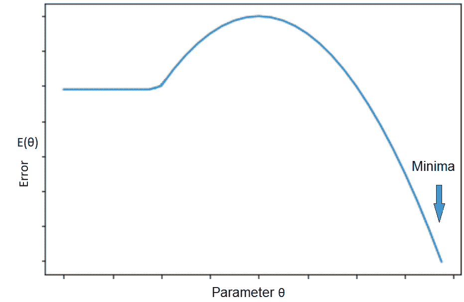

解释初始化错误的情况以及对基于梯度的优化的影响

# 不精确的梯度

大多数优化算法都是基于这样的假设，即我们在给定点具有已知的精确梯度。 但是，实际上我们只对梯度有一个估计。 这个估计有多好？ 在 SGD 中，批次大小会极大地影响随机优化算法的行为，因为它确定了梯度估计的方差。

总之，可以通过以下四个技巧来解决神经网络训练中面临的不同问题：

*   选择合适的学习率，可能是每个参数的自适应学习率
*   选择合适的批次大小-梯度估计取决于此
*   选择权重的良好初始化
*   为隐藏层选择正确的激活功能

现在，让我们简要讨论一下各种启发式方法/策略，这些方法使学习 DNN 切实可行并继续使深度学习取得巨大成功。

# 模型参数的初始化

以下是初始点的选择如何影响深度神经网络的迭代学习算法的性能：

*   初始点可以确定学习是否会收敛
*   即使学习收敛，收敛的速度也取决于起始点
*   可比成本的初始点可能具有不同的泛化误差

初始化算法主要是启发式的。 良好初始化的全部要点是可以以某种方式使学习更快。 初始化的重要方面之一是*破坏初始权重集对隐藏层单位的对称性*。 如果以相同的权重对其进行初始化，则在网络相同级别上具有相同激活功能的两个单元将被同等更新。 多个单元保留在隐藏层中的原因是它们应该学习不同的功能。 因此，获得同等更新不会影响其他功能的学习。

打破对称性的一种简单方法是使用随机初始化-从高斯或均匀分布中采样。 模型中的偏差参数可以通过启发式选择常量。 选择权重的大小取决于优化和正则化之间的权衡。 正则化要求权重不应太大-这可能导致不良的泛化性能。 优化需要权重足够大，才能成功地通过网络传播信息。

# 启发式初始化

让我们考虑具有`m`输入和`n`输出单位的密集层：

1.  从均匀分布`[-1/√m, 1/√m]`中采样每个重量。

2.  Glorot 和 Bengio 建议使用统一分布初始化的规范化版本：

    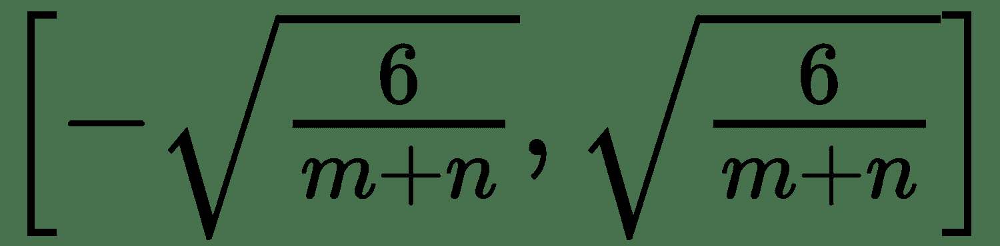
    
    它被设计为在每一层中具有相同的梯度变化，称为 **Glorot Uniform** 。
3.  从平均值为 0 且方差为`√(2/(m+n))`的正态分布中采样每个权重。 这类似于 Glorot Uniform，称为 **Glorot Normal**。
4.  对于非常大的图层，单个权重将变得非常小。 要解决此问题，另一种方法是仅初始化 *k* 非零权重。 这称为**稀疏初始化**。
5.  将权重初始化为随机正交矩阵。 可以在初始权重矩阵上使用 Gram-Schmidt 正交化。

初始化方案也可以视为神经网络训练中的超参数。 如果我们有足够的计算资源，则可以评估不同的初始化方案，我们可以选择具有最佳泛化性能和更快的收敛速度的方案。

# SGD 的改进

近年来，已提出了不同的优化算法，这些算法使用不同的方程式更新模型的参数。

# 动量法

成本函数可能具有高曲率和较小但一致的梯度的区域。 这是由于 Hessian 矩阵的条件不佳以及随机梯度的方差。 SGD 在这些地区可能会放慢很多速度。 动量算法会累积先前梯度的**指数加权移动平均值**（**EWMA**），并朝该方向移动，而不是 SGD 建议的局部梯度方向。 指数加权由超参数`α ∈ [0, 1)`控制，该超参数确定先前梯度的影响衰减的速度。 动量法通过组合相反符号的梯度来阻尼高曲率方向上的振荡。

# Nesterov 动量

Nesterov 动量是动量算法的一种变体，仅在计算梯度时与动量方法不同。 标准动量法首先在当前位置计算梯度，然后在累积梯度的方向上发生较大的跳跃。 涅斯特罗夫动量首先沿先前累积的梯度的方向跃升，然后计算新点的梯度。 通过再次采用所​​有先前梯度的 EWMA 来校正新梯度：

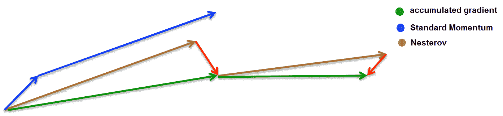

# 自适应学习率 – 每个连接均独立

在前面的方法中，将相同的学习率应用于所有参数更新。 由于数据稀疏，我们可能想在不同程度上更新参数。 诸如 AdaGrad，AdaDelta，RMSprop 和 Adam 之类的自适应梯度下降算法通过保持每个参数的学习率，提供了经典 SGD 的替代方法。

# AdaGrad

AdaGrad 算法通过按与先前所有梯度的平方和值的平方根成比例的方式将它们成反比例缩放来调整每个连接的学习速率。 因此，在误差表面的平缓倾斜方向上进行了较大的移动。 但是，从一开始就采用这种技巧可能会导致某些学习率急剧下降。 但是，AdaGrad 在一些深度学习任务上仍然表现出色。

# RMSprop

RMSprop 通过采用先前平方梯度的 EWMA 来修改 AdaGrad 算法。 它具有移动平均参数ρ，它控制移动平均的长度和比例。 这是深度神经网络训练最成功的算法之一。

# Adam

**自适应力矩**（**Adam**）。 它充分利用了基于动量的算法和自适应学习率算法，并将它们组合在一起。 在此，动量算法应用于由 RMSprop 计算的重新缩放的梯度。

# 神经网络中的过拟合和欠拟合

与其他任何 ML 训练一样，用于训练深度学习模型的数据集也分为训练，测试和验证。 在模型的迭代训练期间，通常，验证误差比训练误差略大。 如果测试误差和验证误差之间的差距随着迭代的增加而增加，则是**过拟合**的情况。 如果训练误差不再减小到足够低的值，我们可以得出结论，该模型是**欠拟合**的。

# 模型容量

模型的能力描述了模型可以建模的输入输出关系的复杂性。 也就是说，在模型的假设空间中允许有多大的函数集。 例如，可以将线性回归模型推广为包括多项式，而不只是线性函数。 这可以通过在构建模型时将 *x* 的 *n* 积分乘以 *x* 作为积分来完成。 还可以通过向网络添加多个隐藏的非线性层来控制模型的容量。 因此，我们可以使神经网络模型更宽或更深，或两者同时进行，以增加模型的容量。

但是，在模型容量和模型的泛化误差之间需要权衡：

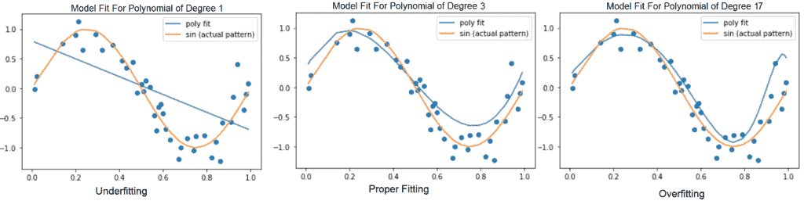

（左）：线性函数根据数据拟合而拟合。 （中）：适合数据的二次函数可以很好地推广到看不见的点
（右）适合数据的次数为 9 的多项式存在过拟合的问题

具有极高容量的模型可能通过训练集中的学习模式而过拟合训练集，而训练模式可能无法很好地推广到看不见的测试集。 而且，它非常适合少量的训练数据。 另一方面，低容量的模型可能难以适应训练集：

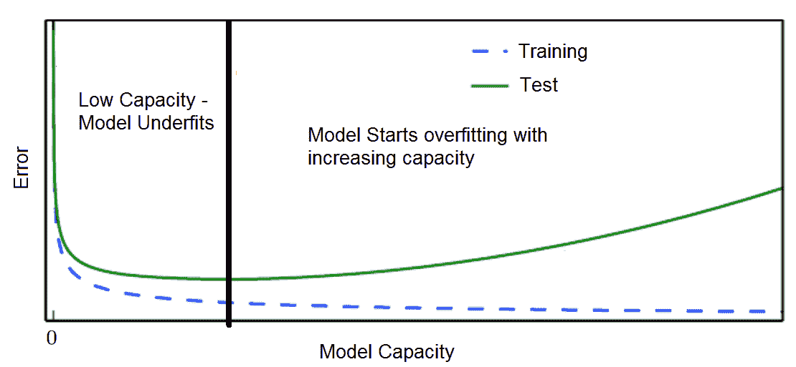

在培训和验证损失方面过拟合/欠拟合

# 如何避免过拟合 - 正则化

过拟合是 ML 中的核心问题。 对于神经网络，开发了许多策略来避免过拟合并减少泛化误差。 这些策略统称为**正则化**。

# 权重共享

权重共享意味着同一组权重在网络的不同层中使用，因此我们需要优化的参数更少。 在一些流行的深度学习架构中可以看到这一点，例如暹罗网络和 RNN。 在几层中使用共享权重可以通过控制模型容量来更好地推广模型。 反向传播可以轻松合并线性权重约束，例如权重共享。 CNN 中使用了另一种重量分配方式，其中与完全连接的隐藏层不同，卷积层在局部区域之间具有连接。 在 CNN 中，假设可以将要由网络处理的输入（例如图像或文本）分解为具有相同性质的一组局部区域，因此可以使用相同的一组转换来处理它们。 是，共享权重。 RNN 可以被视为前馈网络，其中每个连续的层共享相同的权重集。

# 权重衰减

可以看到，像前面示例中的多项式一样，过拟合模型的权重非常大。 为了避免这种情况，可以将罚分项Ω添加到目标函数中，这将使权重更接近原点。 因此，惩罚项应该是权重范数的函数。 同样，可以通过乘以超参数α来控制惩罚项的效果。 因此我们的目标函数变为：`E(w) + αΩ(w)`。 常用的惩罚条款是：

*   **L2 正则化**：惩罚项由`Ω = 1/2 · ||w||^2`给出。 在回归文献中，这称为**岭回归**。
*   **L1 正则化**：惩罚项由`Ω = ||w||[1] = Σ[i](w[i])`给出。 这称为 **LASSO 回归**。

L1 正则化导致稀疏解； 也就是说，它会将许多权重设置为零，因此可以作为回归问题的良好特征选择方法。

# 早期停止

随着对大型神经网络的训练的进行，训练误差会随着时间的推移而稳步减少，但如下图所示，验证集误差开始增加，超出了某些迭代：

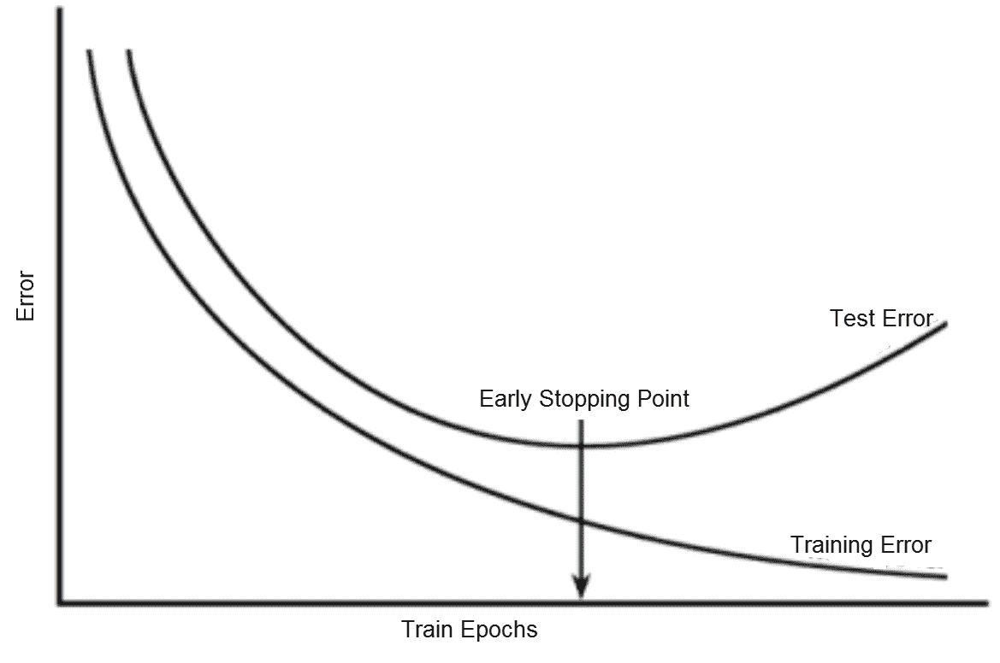

提前停止：训练与验证错误

如果在验证错误开始增加的时候停止训练，我们可以建立一个具有更好泛化性能的模型。 这称为**提前停止**。 它由耐心超参数控制，该参数设置了中止训练之前观察增加的验证集错误的次数。 提前停止可以单独使用，也可以与其他正则化策略结合使用。

# 丢弃法

丢弃法是一种在深度神经网络中进行正则化的计算廉价但功能强大的方法。 它可以分别应用于输入层和隐藏层。 通过在正向传递过程中将节点的输出设置为零，丢弃法随机掩盖了一部分节点的输出。 这等效于从层中删除一部分节点，并创建一个具有更少节点的新神经网络。 通常，在输入层上会删除 0.2 个节点，而在隐藏层中最多会删除 0.5 个节点。

**模型平均**（集成方法）在 ML 中被大量使用，通过组合各种模型的输出来减少泛化误差。 套袋是一种整体方法，其中通过从训练集中替换并随机抽样来构建 *k* 不同的数据集，并在每个模型上训练单独的 *k* 模型。 特别地，对于回归问题，模型的最终输出是 *k* 模型的输出的平均值。 还有其他组合策略。

还可以将丢弃视为一种模型平均方法，其中通过更改应用了丢弃的基本模型的各个层上的活动节点数来创建许多模型。

# 批量标准化

在 ML 中，通常的做法是先缩放并标准化输入的训练数据，然后再将其输入模型进行训练。 对于神经网络而言，缩放也是预处理步骤之一，并且已显示出模型性能的一些改进。 在将数据馈送到隐藏层之前，我们可以应用相同的技巧吗？ 批处理规范化基于此思想。 它通过减去激活的最小批量平均值μ并除以最小批量标准偏差σ来归一化前一层的激活。 在进行预测时，我们一次可能只有一个示例。 因此，不可能计算批次均值μ和批次σ。 将这些值替换为训练时收集的所有值的平均值。

# 我们需要更多数据吗？

使神经模型具有更好的概括性或测试性能的最佳方法是通过训练它获得更多数据。 实际上，我们的培训数据非常有限。 以下是一些用于获取更多训练数据的流行策略：

*   **模拟合成一些训练样本**：生成假训练数据并不总是那么容易。 但是，对于某些类型的数据，例如图像/视频/语音，可以将转换应用于原始数据以生成新数据。 例如，可以平移，旋转或缩放图像以生成新的图像样本。
*   **带噪声的训练**：将受控随机噪声添加到训练数据是另一种流行的数据增强策略。 噪声也可以添加到神经网络的隐藏层中。

# 神经网络的超参数

神经网络的体系结构级参数，例如隐藏层数，每个隐藏层的单位数，以及与训练相关的参数，例如学习率，优化器算法，优化器参数-动量，L1/L2 正则化器和丢弃法统称为神经网络的**超参数**。 神经网络的权重称为神经网络的**参数**。 一些超参数影响训练算法的时间和成本，而一些影响模型的泛化性能。

# 自动超参数调整

开发了多种用于超参数调整的方法。 但是，对于大多数参数，需要为每个超参数指定一个特定范围的值。 可以通过了解它们对模型容量的影响来设置大多数超参数。

# 网格搜索

网格搜索是对超参数空间的手动指定子集的详尽搜索。 网格搜索算法需要性能指标，例如交叉验证错误或验证集错误，以评估最佳可能参数。 通常，网格搜索涉及选择对数标度的参数。 例如，可以从集合`{50, 100, 200, 500, 1000，...}`中选择在集合`{0.1, 0.01, 0.001, 0.0001}`内获得的学习率或多个隐藏单元。 网格搜索的计算成本随着超参数的数量呈指数增长。 因此，另一种流行的技术是随机网格搜索。 随机搜索从所有指定的参数范围中对参数采样固定次数。 当我们具有高维超参数空间时，发现这比穷举搜索更有效。 更好，因为可能存在一些不会显着影响损耗的超参数。

# 总结

在本章中，我们涉及了深度学习的基础知识。 我们真的赞扬您为实现这一目标所做的努力！ 本章的目的是向您介绍与深度学习领域有关的核心概念和术语。 我们首先简要介绍了深度学习，然后介绍了当今深度学习领域中流行的框架。 还包括详细的分步指南，用于设置您自己的深度学习环境，以在 GPU 上开发和训练大规模深度学习模型。

最后，我们涵盖了围绕神经网络的基本概念，包括线性和非线性神经元，数据表示，链式规则，损失函数，多层网络和 SGD。 还讨论了神经网络中的学习挑战，包括围绕局部极小值和梯度爆炸的常见警告。 我们研究了神经网络中过拟合和欠拟合的问题，以及处理这些问题的策略。 然后，我们介绍了神经网络单元的流行初始化启发法。 除此之外，我们还探索了一些更新的优化技术，它们是对香草 SGD 的改进，其中包括 RMSprop 和 Adam 之类的流行方法。

在下一章中，我们将探讨深度学习模型周围的各种体系结构，这些体系结构可用于解决不同类型的问题。