# 了解深度学习架构

本章将着重于理解当今深度学习中存在的各种架构。 神经网络的许多成功都在于对神经网络架构的精心设计。 自 1960 年代的传统**人工神经网络**（**ANNs**）以来，我们已经走了很长一段路。 在本书中，我们介绍了基本模型架构，例如完全连接的深度神经网络，**卷积神经网络**（**CNN**），**循环神经网络**（**RNN**），**长短期记忆**（**LSTM**）网络，以及最新的胶囊网络。

在本章中，我们将介绍以下主题：

*   为什么神经网络架构设计很重要
*   各种流行的架构设计和应用

# 神经网络架构

**架构**一词是指神经网络的整体结构，包括其可以具有多少层以及各层中的单元应如何相互连接（例如，连续层中的单元可以完全连接） ，部分连接，或者甚至可以完全跳过下一层，然后再连接到网络中更高级别的一层。 随着模块化深度学习框架（例如 Caffe，Torch 和 TensorFlow）的出现，复杂的神经网络设计发生了革命性的变化。 现在，我们可以将神经网络设计与 Lego 块进行比较，在这里您可以构建几乎可以想象的任何结构。 但是，这些设计不仅仅是随机的猜测。 这些设计背后的直觉通常是由设计人员对问题的领域知识以及一些反复试验来精调最终设计的结果所驱动。

# 为什么需要不同的架构

前馈多层神经网络具有学习巨大的假设空间并提取每个非线性隐藏层中复杂特征的能力。 那么，为什么我们需要不同的架构？ 让我们尝试理解这一点。

特征工程是**机器学习**（**ML**）中最重要的方面之一。 如果功能太少或不相关，则可能会导致拟合不足。 而且功能太多，可能会使数据过拟合。 创建一组好的手工制作的功能是一项繁琐，耗时且重复的任务。

深度学习带有一个希望，即给定足够的数据，深度学习模型能够自动确定正确的功能集，即复杂性不断增加的功能层次。 好吧，深度学习的希望是真实的，并且会产生误导。 深度学习确实在许多情况下简化了功能工程，但是它并没有完全消除对它的需求。 随着手动特征工程的减少，神经网络模型本身的体系结构变得越来越复杂。 特定体系结构旨在解决特定问题。 与手工特征工程相比，建筑工程是一种更为通用的方法。 在架构工程中，与要素工程不同，领域知识不会硬编码为特定要素，而只会在抽象级别使用。 例如，如果我们要处理图像数据，则有关该数据的一个非常高级的信息是对象像素的二维局部性，而另一个是平移不变性。 换句话说，将猫的图像平移几个像素仍然可以保持猫的状态。

在特征工程方法中，我们必须使用非常具体的特征（例如边缘检测器，拐角检测器和各种平滑滤波器）来为任何图像处理/计算机视觉任务构建分类器。 现在，对于神经网络，我们如何编码二维局部性和翻译不变性信息？ 如果将密集的完全连接层放置在输入数据层之前，则图像中的每个像素都将连接到密集层中的每个单元。 但是，来自两个空间遥远对象的像素不必连接到同一隐藏单元。 经过长时间的大量数据训练后，具有很强的 L1 正则化能力的神经网络可能能够稀疏权重。 我们可以设计体系结构以仅将本地连接限制到下一层。 少量的相邻像素（例如，像素的`10 x 10`子图像）可能具有与隐藏层的一个单元的连接。 由于转换不变，因此可以重用这些连接中使用的权重。 CNN 就是这样做的。 这种权重重用策略还有其他好处，例如大大减少了模型参数的数量。 这有助于模型进行概括。

让我们再举一个例子，说明如何将抽象领域知识硬编码到神经网络中。 假设我们有时间数据或顺序数据。 正常的前馈网络会将每个输入示例视为独立于先前的输入。 因此，学习到的任何隐藏特征表示也应取决于数据的最近历史，而不仅仅是当前数据。 因此，神经网络应该具有一些反馈回路或记忆。 这个关键思想产生了循环神经网络体系结构及其现代的强大变体，例如 LSTM 网络。

其他高级 ML 问题（例如语音翻译，问题解答系统和关系建模）要求开发各种深度学习体系结构。

# 各种架构

现在让我们看一些流行的神经网络体系结构及其应用。 我们将从**多层感知器**（**MLP**）网络开始。 我们已经介绍了单层感知器网络，这是最基本的神经网络体系结构。

# MLP 和深度神经网络

**MLP** 或简单的**深层神经网络**（**DNNs**）是神经网络架构的最基本形式。 神经单元一层又一层地排列，相邻的网络层彼此完全连接。 我们已经在上一章中对此进行了详细讨论：

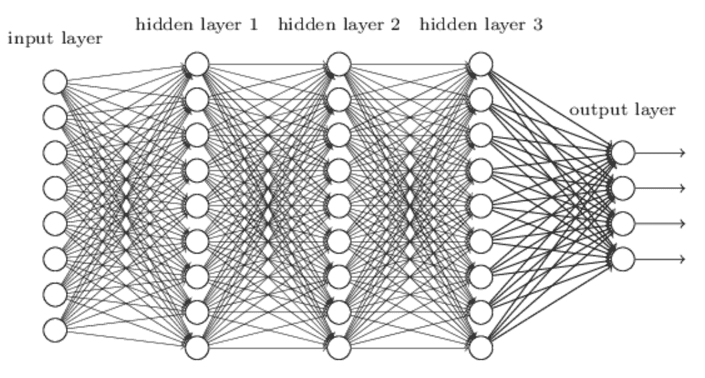

# 自动编码器神经网络

自动编码器通常用于减少神经网络中数据的维数。 自动编码器也已成功用于异常检测和新颖性检测问题。 **自编码器神经网络**属于无监督学习类别。 在此，目标值设置为等于输入值。 换句话说，我们想学习身份功能。 通过这样做，我们可以获得数据的紧凑表示。

通过最小化输入和输出之间的差异来训练网络。 典型的自动编码器体系结构是 DNN 体系结构的略微变体，其中，每个隐藏层的单位数量逐渐减少，直到某个点，然后逐渐增加，最终层尺寸等于输入尺寸。 其背后的关键思想是在网络中引入瓶颈，并迫使其学习有意义的紧凑表示形式。 隐藏单元的中间层（瓶颈）基本上是输入的降维编码。 隐藏层的前半部分称为**编码器**，后半部分称为**解码器**。 下面描述了一个简单的自动编码器体系结构。 名为`z`的层是此处的表示层：

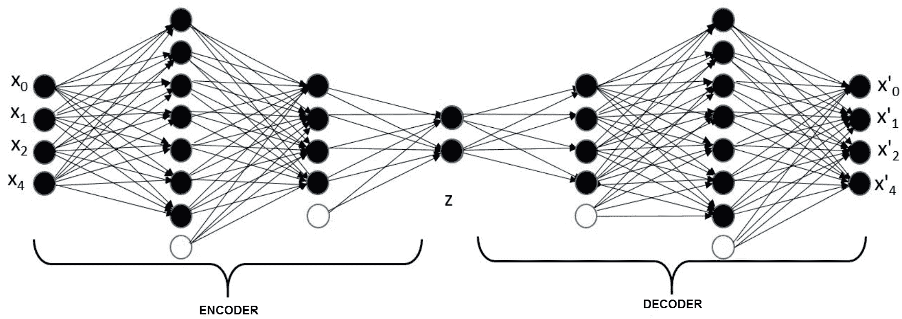

[资料来源](https://cloud4scieng.org/manifold-learning-and-deep-autoencoders-in-science/)

# 变体自动编码器

深度很深的自动编码器很难训练，并且容易过度安装。 有许多改进了自动编码器训练方式的开发，例如使用**受限玻尔兹曼机**（**RBM**）进行生成式预训练。 **变分自编码器**（**VAE**）也是生成模型，与其他深层生成模型相比，VAE 在计算上易于处理且稳定，可以通过有效的反向传播算法进行估算。 它们受到贝叶斯分析中变分推理的启发。

变分推理的概念如下：给定输入分布`x`时，输出`y`上的后验概率分布太复杂而无法使用。 因此，让我们用一个更简单的分布`q(y)`来近似复杂的后验`p(y|x)`。 在这里， `q`是从最接近后验的分布族`Q`中选择的。 例如，此技术用于训练**潜在 Dirichlet 分配**（**LDA**）（它们对文本进行主题建模，并且是贝叶斯生成模型）。 但是，经典变分推论的一个关键局限性是需要对似然性和先验共轭才能进行优化。 VAE 引入了使用神经网络来输出条件后验的方法（Kingma 和 Welling，2013 年），从而允许使用**随机梯度下降**（**SGD**）和反向传播来优化变分推断目标。 。 该方法称为**重新参数化技巧**。

给定数据集`X`，VAE 可以生成与样本`X`类似但不一定相等的新样本。数据集`X`具有连续或离散随机变量`x`的`N`个**独立且完全相同的**样本。 假设数据是通过某种随机过程生成的，涉及一个未观察到的连续随机变量`z`。 在简单自动编码器的此示例中，变量`z`是确定性的，并且是随机变量。 数据生成是一个两步过程：

1.  `z`的值是根据先验分布生成的，`ρ[θ](z)`
2.  根据条件分布生成`x`的值，`ρ[θ](x|z)`

因此， `p(x)`基本上是边缘概率，计算公式为：

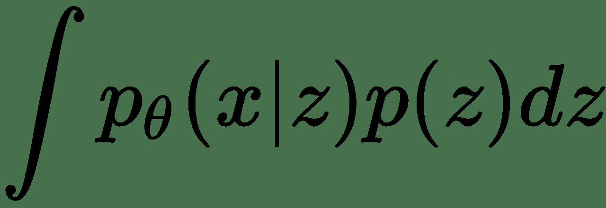

分布的参数`θ`和潜变量`z`都是未知的。 在此，`x`可以通过从边际`p(x)`取样来生成。 反向传播无法处理网络中的随机变量`z`或随机层`z`。 假设先验分布`p(z)`为高斯分布，我们可以利用高斯分布的*位置尺度*属性，并将随机层重写为`z =μ + σε`，其中`μ`是位置参数，`σ`是刻度，`ε`是白噪声。 现在，我们可以获得噪声`ε`的多个样本，并将它们作为确定性输入提供给神经网络。

然后，该模型成为端到端确定性深度神经网络，如下所示：

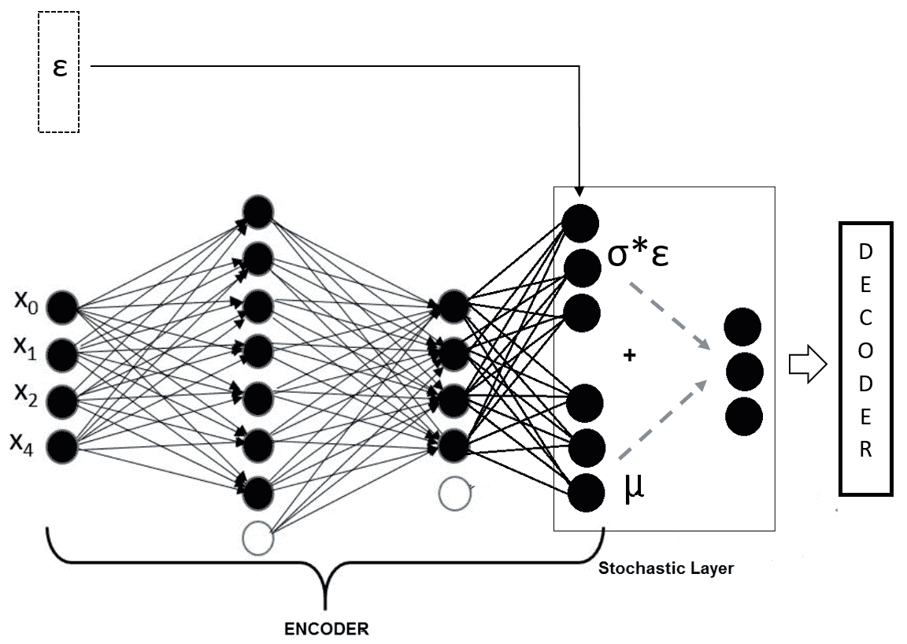

在这里，解码器部分与我们之前介绍的简单自动编码器的情况相同。 训练此网络的损失函数如何？ 因为这是一个概率模型，所以最直接的方法是通过边际`p(x)`的最大似然来推导损失函数。 但是，该函数在计算上变得难以处理。 这样，我们将变分推理技术应用于下限`L`。 导出边际似然，然后通过最大化下限`L`导出损失函数。 可以在 Kingma 及其合作者的论文[《自动编码变分贝叶斯》](https://arxiv.org/abs/1312.6114)（ICLR，2014 年）。 VAE 已成功应用于各个领域。 例如，文本的深层语义哈希是由 VAE 完成的，其中将文本文档转换为二进制代码。 同样，相似的文档具有相似的二进制地址。 这样，这些代码可用于更快，更有效的检索，以及文档的聚类和分类。

# 生成对抗网络

自从 Ian Goodfellow 及其合著者在 2014 年 NIPS 论文中首次引入以来，**生成对抗网络**（**GAN**）就[广受青睐](https://arxiv.org/pdf/1406.2661.pdf)。 现在我们看到了 GAN 在各个领域的应用。 Insilico Medicine 的研究人员提出了一种使用 GAN 进行人工药物发现的方法。 他们还发现了在图像处理和视频处理问题中的应用，例如图像样式转换和**深度卷积生成对抗网络**（**DCGAN**）。

顾名思义，这是使用神经网络的另一种生成模型。 GAN 具有两个主要组成部分：生成器神经网络和鉴别器神经网络。 生成器网络采用随机噪声输入，并尝试生成数据样本。 鉴别器网络将生成的数据与真实数据进行比较，并使用 S 型输出激活来解决生成的数据是否为伪造的二分类问题。 生成器和鉴别器都在不断竞争，并试图互相愚弄-这就是 GAN 也被称为**对抗网络**的原因。 这种竞争驱使两个网络都提高其权重，直到鉴别器开始输出 0.5 的概率为止。 也就是说，直到生成器开始生成真实图像为止。 通过反向传播同时训练两个网络。 这是 GAN 的高级结构图：

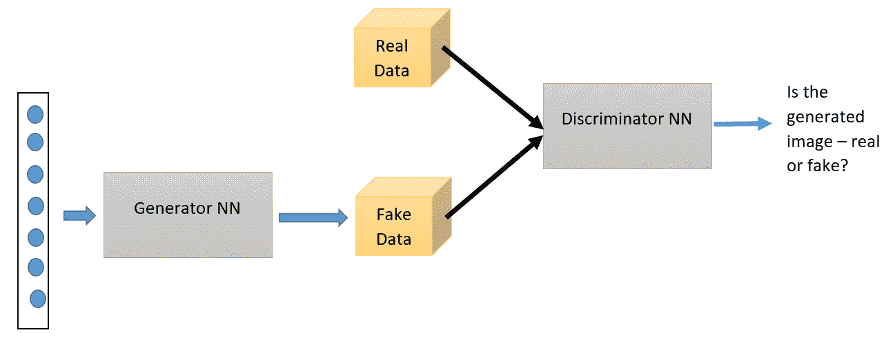

训练这些网络的损失函数可以定义如下。 令`p(data)`为数据的概率分布，`p(g)`为生成器分布。 `D(x)`表示`x`来自`p(data)`而非来自`p(g)`的概率。 对`D`进行了培训，以使将正确标签分配给`G`的训练示例和样本的概率最大化。 同时，训练`G`以最小化`log(1 - D(G(z)))*`。 因此，`D`和`G`玩一个具有值函数`V(D, G)`的两人 minimax 游戏：

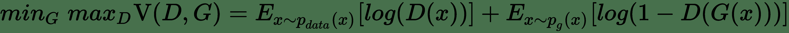

可以证明，对于`p(g) = p(data)`来说，这种极小极大游戏具有全局最优性。

以下是通过反向传播训练 GAN 以获得所需结果的算法：

```py
for N epochs do:

    #update discriminator net first

    for k steps do:

          Sample minibatch of m noise samples {z(1), , . . . , z  
          (m)} from noise prior pg(z).

           Sample minibatch of m examples {x(1), . . . , x(m)} from  
           data generating distribution pdata(x).

           Update the discriminator by: 

    end for

         Sample minibatch of m noise samples {z(1) , . . . , z (m)}  
         from noise prior pg(z).
         Update the generator by descending its stochastic gradient:

end for
```

# 使用 GAN 架构的文本到图像合成

让我们看看使用 GAN 从文字描述生成图像。 下图显示了这种 GAN 的完整体系结构：

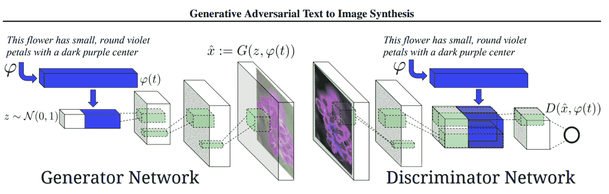

这是条件 GAN 的一种。 生成器网络获取带有噪声向量的输入文本以生成图像。 生成的图像以输入文本为条件。 使用嵌入层`φ(t)`将图像描述转换为密集向量。 使用完全连接的层对其进行压缩，然后将其与噪声向量连接。 检测器网络是 CNN，并且生成器网络的体系结构使用具有与 CNN 网络中使用的过滤器相同的过滤器的反卷积层。 反卷积基本上是转置的卷积，我们将在后面讨论。

# CNN

CNN 是专门设计用于识别形状图案的多层神经网络，这些形状图案对于二维图像数据的平移，缩放和旋转具有高度不变性。 这些网络需要以监督的方式进行培训。 通常，提供一组标记的对象类（例如 MNIST 或 ImageNet）作为训练集。 任何 CNN 模型的关键都在于卷积层和子采样/合并层。 因此，让我们详细了解在这些层中执行的操作。

# 卷积运算符

CNN 背后的中心思想是**卷积**的数学运算，这是一种特殊的线性运算。 它广泛用于物理，统计，计算机视觉以及图像和信号处理等各个领域。 为了理解这一点，让我们从一个例子开始。 *嘈杂的*激光传感器正在跟踪飞船的位置。 为了更好地估计飞船的位置，我们可以取几个读数的平均值，对最近的观测结果给予更多的权重。 令`x(t)`代表时间位置，`t`，令`w(t)`为加权函数。

该职位的估算可以写成：

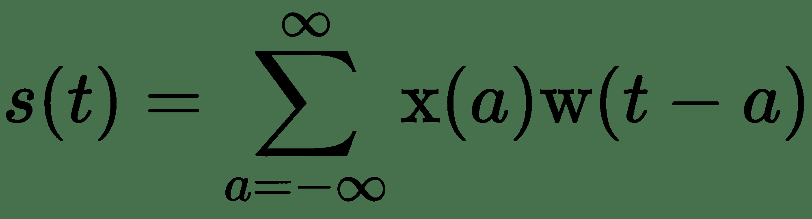

这里，权重函数`w(t)`被称为卷积的**内核**。 我们可以使用卷积计算位置传感器数据的**简单移动平均值**（**SMA**）。 令`m`为 SMA 的窗口大小。

内核定义为：

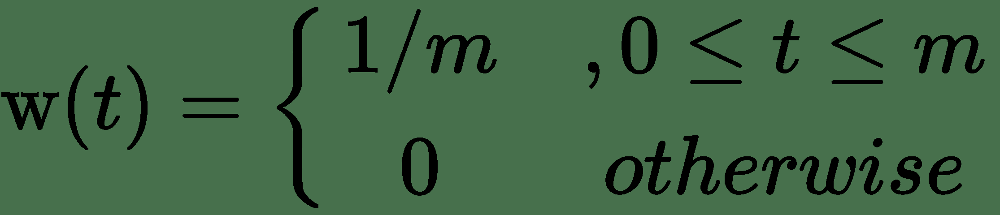

这是使用卷积的 SMA 的 NumPy 实现：

```py
x = [1, 2, 3, 4, 5, 6, 7]
m = 3 #moving average window size
sma = np.convolve(x, np.ones((m,))/m, mode='valid')
#Outputs
#array([ 2., 3., 4., 5., 6.])
```

在深度学习中，输入通常是多维数据数组，而内核通常是由训练算法学习的参数多维数组。 尽管我们在卷积公式中具有无限求和，但对于实际实现而言，权重函数的值仅在值的有限子集时才为非零（如 SMA 的情况）。 因此，公式中的求和变为有限求和。 卷积可应用于多个轴。 如果我们有一个二维图像`I`和一个二维平滑核`K`，则卷积图像的计算方式如下：

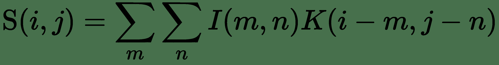

或者，也可以如下计算：

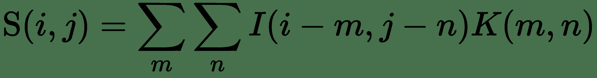

下图说明了如何使用大小为 2 且步幅为 1 的内核来计算卷积层输出：

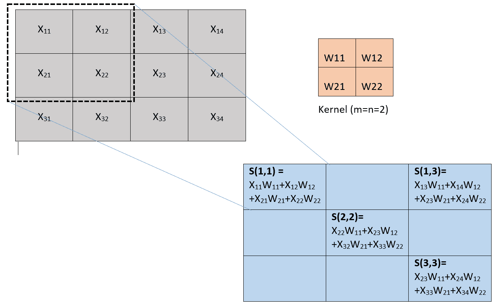

# 卷积中的跨步和填充模式

卷积内核通过一次移动一列/行来围绕输入体积进行卷积。 滤波器移位的量称为**跨度**。 在前面的场景中，将跨度隐式设置为 1。如果将内核跨度移动 2（两列或两行），则输出单位的数量将减少：

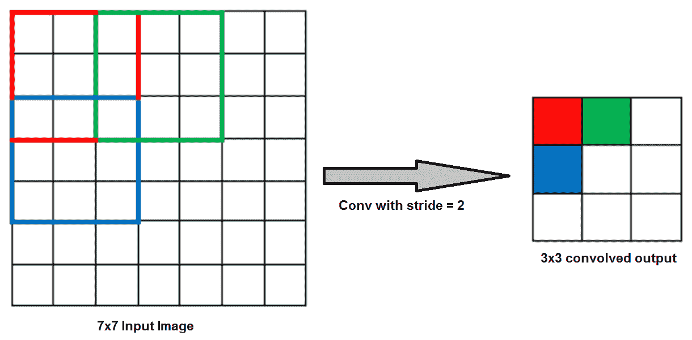

卷积运算符减小了输入的大小。 如果要保留输入的大小，则需要在输入周围均匀填充零。 对于二维图像，这意味着在图像的四个侧面周围添加零像素的边框。 边框的粗细（即添加的像素行数）取决于所应用的内核大小。 任何卷积运算符实现通常都采用指定填充类型的模式参数。 有两个这样的参数：

*   `SAME`：指定输出大小与输入大小相同。 这要求过滤器窗口滑到输入图的外部，因此需要填充。
*   `VALID`：指定过滤器窗口停留在输入图内的有效位置，因此输出大小缩小`filter_size`减一。 没有填充发生。

在前面的一维卷积码中，我们将模式设置为`VALID`，因此没有填充发生。 您可以尝试使用*相同的*填充。

# 卷积层

卷积层包括三个主要阶段，每个阶段在多层网络上都构成一些结构约束：

*   **特征提取**：每个单元都从上一层的本地接受域建立连接，从而迫使网络提取本地特征。 如果我们有一个`32 x 32`的图像，并且接收区域的大小为`4 x 4`，则一个隐藏层将连接到先前层中的 16 个单元，而我们总共将拥有`28 x 28`个隐藏单元。 因此，输入层与隐藏层建立了`28 x 28 x 16`的连接，这是这两层之间的参数数（每个连接的权重）。 如果它是一个完全连接的密集隐藏层，则将有`32 x 32 x 28 x 28`个参数。 因此，在这种体系结构约束下，我们大大减少了参数数量。 现在，此局部线性激活的输出通过非线性激活函数（例如 ReLU）运行。 该阶段有时称为**检测器阶段**。 一旦学习了特征检测器，只要保留其相对于其他特征的位置，该特征在看不见的图像中的确切位置就不重要了。 与隐藏神经元的感受野相关的突触权重是卷积的核心。
*   **特征映射**：特征检测器创建平面（绿色平面如下所示）形式的特征图。 为了提取不同类型的局部特征并具有更丰富的数据表示，并行执行多个卷积以产生多个特征图，如下所示：

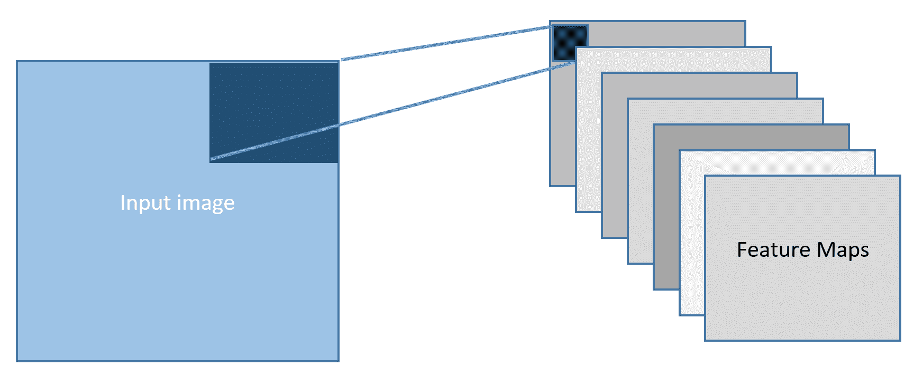

*   **通过合并**进行二次采样：这是由计算层完成的，该计算层通过用附近单元的摘要统计替换某些位置的特征检测器单元来对特征检测器的输出进行二次采样。 摘要统计信息可以是最大值或平均值。 此操作降低了将特征图输出到简单失真（例如线性移位和旋转）的敏感性。 池引入不变性：

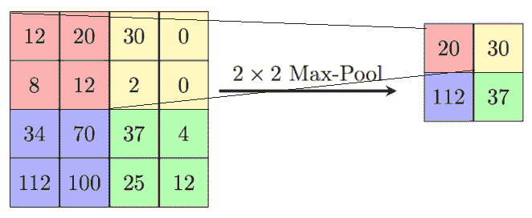

将这三个阶段结合在一起，就可以为我们提供 CNN 中的一个复杂层，这三个阶段中的每个本身就是简单层：

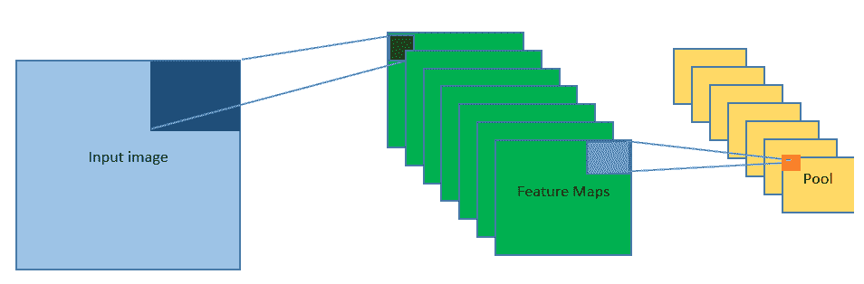

可以通过将并排堆叠在一起的方式，将合并后的要素图按一个体积进行排列，如下所示。 然后，我们可以再次对此应用下一个卷积级别。 现在，单个特征图中隐藏单元的接受场将是神经单元的体积，如下图所示。 但是，将在整个深度上使用同一组二维权重。 深度尺寸通常由通道组成。 如果我们有 RGB 输入图像，那么我们的输入本身将具有三个通道。 但是，卷积是二维应用的，并且所有通道之间的权重相同：

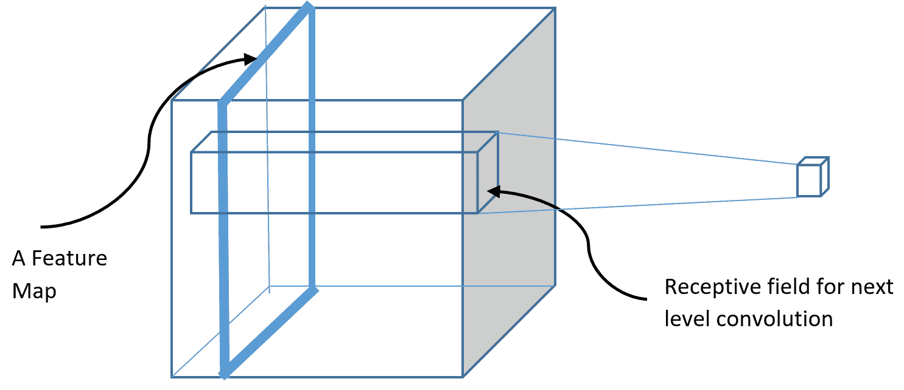

# LeNet 架构

这是 LeCun 及其合作者于 1998 年设计的具有开创性的七级卷积网络，用于数字分类。 后来，它被几家银行用来识别支票上的手写数字。 网络的较低层由交替的卷积和最大池化层组成。

上层是完全连接的密集 MLP（由隐藏层和逻辑回归组成）。 第一个完全连接的图层的输入是上一层的所有要素图的集合：

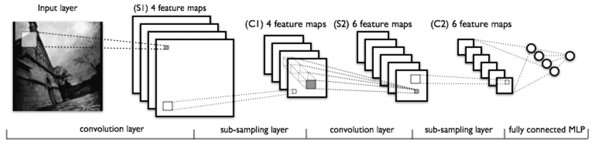

在将 CNN 成功应用于数字分类之后，研究人员将重点放在构建可以对 ImageNet 图像进行分类的更复杂的体系结构上。 ImageNet 是根据 WordNet 层次结构（目前仅是名词的层次结构）组织的图像数据库，其中层次结构的每个节点都由数百或数千个图像表示。 ImageNet 项目每年举办一次软件竞赛 **ImageNet 大规模视觉识别挑战赛**（**ILSVRC**），该竞赛将大规模评估目标检测和图像分类的算法。 评估标准是前五名/最高分。 通过从最终的致密 softmax 层获取 CNN 的预测来计算这些值。 如果目标标签是前五个预测之一（概率最高的五个预测），则认为它是成功的。 前五名得分是通过将预测标签（位于前 5 名）与目标标签匹配的时间除以所评估图像的数量得出的。

最高得分的计算方法与此类似。

# 亚历克斯网

在 2012 年，AlexNet 的表现明显优于所有先前的竞争对手，并通过将前 5 名的错误降低到 15.3% 赢得了 ILSVRC，而亚军则只有 26%。 这项工作推广了 CNN 在计算机视觉中的应用。 AlexNet 与 LeNet 的体系结构非常相似，但是每层具有更多的过滤器，并且更深入。 而且，AlexNet 引入了使用堆栈式卷积的方法，而不是始终使用替代性卷积池。 小卷积的堆栈优于大卷积层的接收场，因为这会引入更多的非线性和更少的参数。

假设我们彼此之间具有三个`3 x 3`卷积层（在它们之间具有非线性或池化层）。 在此，第一卷积层上的每个神经元都具有输入体积的`3 x 3`视图。 第二卷积层上的神经元具有第一卷积层的`3 x 3`视图，因此具有输入体积的`5 x 5`视图。 类似地，第三卷积层上的神经元具有第二卷积层的`3 x 3`视图，因此具有输入体积的`7 x 7`视图。 显然，与 3 个`3 x 3`卷积的`3 x (3 x 3) = 27`个参数相比，`7 x 7`接收场的参数数量是 49 倍。

# ZFNet

2013 年 ILSVRC 冠军是 Matthew Zeiler 和 Rob Fergus 的 CNN。 它被称为 **ZFNet** 。 通过调整体系结构的超参数，特别是通过扩展中间卷积层的大小并减小第一层的步幅和过滤器大小，它在 AlexNet 上得到了改进，从 AlexNet 的`11 x 11`步幅 4 变为`7 x 7`步幅。 ZFNet。 这背后的直觉是，在第一卷积层中使用较小的滤镜尺寸有助于保留大量原始像素信息。 此外，AlexNet 接受了 1500 万张图像的培训，而 ZFNet 接受了 130 万张图像的培训：

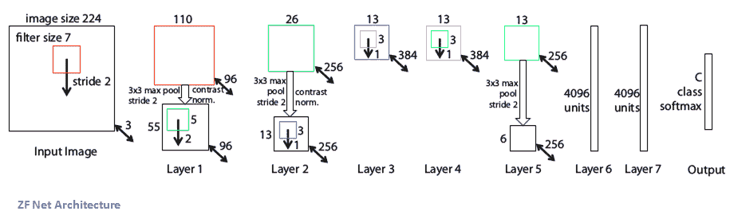

# GoogLeNet（起始网络）

2014 年 ILSVRC 获奖者是来自 Google 的名为 **GoogLeNet** 的卷积网络。 它的前 5 个错误率达到 6.67%！ 这非常接近人类水平的表现。 排在第二位的是来自 Karen Simonyan 和 Andrew Zisserman 的网络，称为 **VGGNet** 。 GoogLeNet 使用 CNN 引入了一个称为**初始层**的新架构组件。 初始层背后的直觉是使用较大的卷积，但对于图像上的较小信息也要保持较高的分辨率。

因此，我们可以并行处理不同大小的内核，从`1 x 1`到更大的内核，例如`5 x 5`，然后将输出级联以产生下一层：

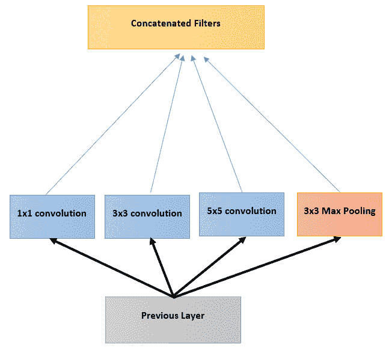

显然，增加更多的图层会爆炸参数空间。 为了控制这一点，使用了降维技巧。 请注意，`1 x 1`卷积基本上不会减小图像的空间尺寸。 但是，我们可以使用`1 x 1`滤镜减少特征图的数量，并减少卷积层的深度，如下图所示：

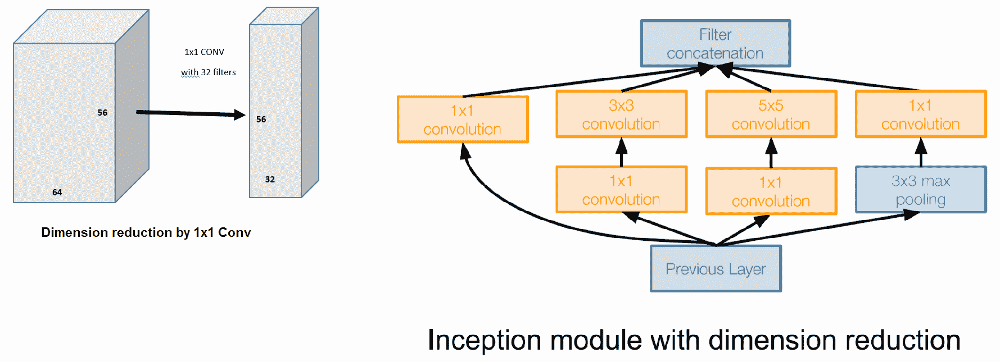

下图描述了完整的 GoogLeNet 架构：

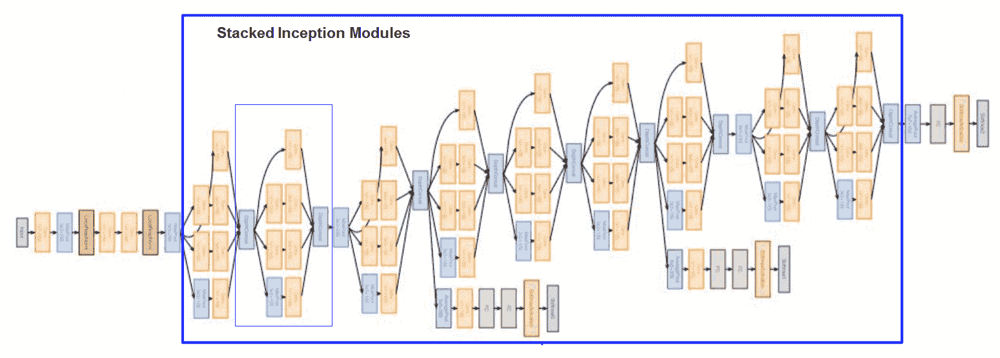

# VGG

牛津视觉几何学组或简称为 **VGG** 的研究人员开发了 VGG 网络，该网络的特点是简单，仅使用`3 x 3`卷积层并排叠加，且深度不断增加。 减小卷大小由最大池化处理。 最后，两个完全连接的层（每个层有 4,096 个节点）之后是 softmax 层。 对输入进行的唯一预处理是从每个像素减去在训练集上计算出的 RGB 平均值。

通过最大池化层执行池化，最大池化层跟随一些卷积层。 并非所有卷积层都跟随最大池化。 最大合并在`2 x 2`像素的窗口上执行，步幅为 2。每个隐藏层都使用 ReLU 激活。 在大多数 VGG 变体中，过滤器的数量随深度的增加而增加。 下图显示了 16 层体系结构 VGG-16。 下一节显示了具有均匀`3 x 3`x卷积（VGG-19）的 19 层体系结构。 VGG 模型的成功证实了深度在图像表示中的重要性：

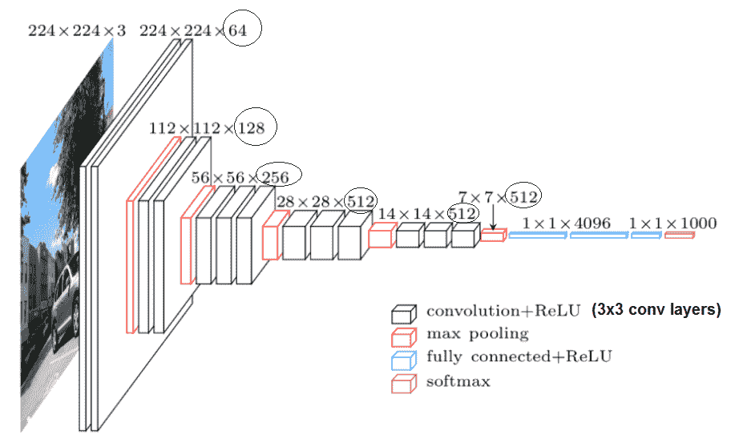

VGG-16：输入大小为`224 x 224 x 3`的 RGB 图像，每层中的滤镜数量都被圈起来

# 残留神经网络

在 ILSVRC 2015 中，由 Kaiming He 及其来自 Microsoft Research Asia 的合著者介绍了一种具有*跳跃连接*和*批量归一化*的新颖 CNN 架构，称为**残差神经网络**（**ResNet**）。 这样，他们就可以训练一个具有 152 层（比 VGG 网络深八倍）的神经网络，同时仍比 VGG 网络具有更低的复杂度。 它的前 5 个错误率达到 3.57%，在此数据集上超过了人类水平的性能。

该体系结构的主要思想如下。 他们没有希望一组堆叠的层将直接适合所需的基础映射`H(x)`，而是尝试适应残差映射。 更正式地讲，他们让堆叠的层集学习残差`R(x) = H(x) - x`，随后通过跳过连接获得真实映射。 然后将输入添加到学习的残差`R(x) + x`。

同样，在每次卷积之后和激活之前立即应用批处理归一化：

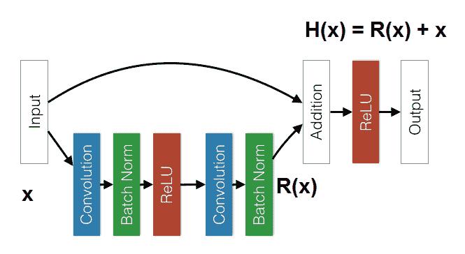

剩余网络的一个组成部分

与 VGG-19 相比，这是完整的 ResNet 体系结构。 点缀的跳过连接显示尺寸增加； 因此，为了使添加有效，不执行填充。 同样，尺寸的增加由颜色的变化表示：

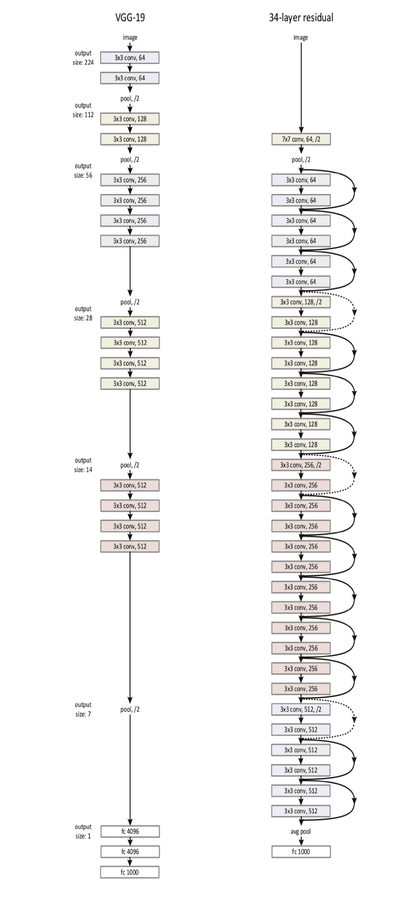

到目前为止，我们已经讨论过的 CNN 模型的所有变体都可以在 Keras 和 TensorFlow 中作为预训练模型使用。 我们将在我们的迁移学习应用程序中大量使用它们。 这是用于加载各种 VGG 模型的 Keras 代码段。 可以在[这里](https://keras.io/applications/)中找到更多内容：

```py
from keras.applications.vgg16 import VGG16
model = VGG16()
print(model.summary())
```

# 胶囊网络

我们已经讨论了各种 CNN 架构是如何演变的，并且已经研究了它们的连续改进。 现在我们可以将 CNN 用于更高级的应用程序，例如**高级驾驶员辅助系统**（**ADAS**）和自动驾驶汽车吗？ 我们能否在现实世界中实时地检测道路上的障碍物，行人和其他重叠物体？ 也许不会！ 我们还不在那里。 尽管 CNN 在 ImageNet 竞赛中取得了巨大成功，但 CNN 仍然存在一些严重的局限性，将它们的适用性限制在更高级的现实问题中。 CNN 的翻译不变性差，并且缺乏有关方向的信息（或*姿势*）。

姿势信息是指相对于观看者的三维方向，还指照明和颜色。 旋转物体或改变照明条件时，CNN 确实会带来麻烦。 根据 Hinton 的说法，CNN 根本无法进行*顺手性*检测； 例如，即使他们都接受过这两种训练，他们也无法从右鞋中分辨出左鞋。 CNN 受到这些限制的原因之一是使用最大池化，这是引入不变性的粗略方法。 通过粗略不变性，我们的意思是，如果图像*稍有*移位/旋转，则最大合并的输出不会发生太大变化。 实际上，我们不仅需要不变性，还需要**等价性**； 即，在图像的**对称** **变换**下的不变性。

边缘检测器是 CNN 中的第一层，其功能与人脑中的视觉皮层系统相同。 大脑和 CNN 之间的差异出现在较高水平。 有效地将低层视觉信息路由到高层信息，例如各种姿势和颜色或各种比例和速度的对象，这是由皮质微柱完成的，Hinton 将其命名为*胶囊*。 这种*路由*机制使人的视觉系统比 CNN 更强大。

**胶囊网络**（**CapsNets**）对 CNN 架构进行了两个基本更改：首先，它们用向量输出胶囊代替 CNN 的标量输出特征检测器； 其次，他们将最大池与按协议路由一起使用。 这是一个简单的 CapsNet 架构：

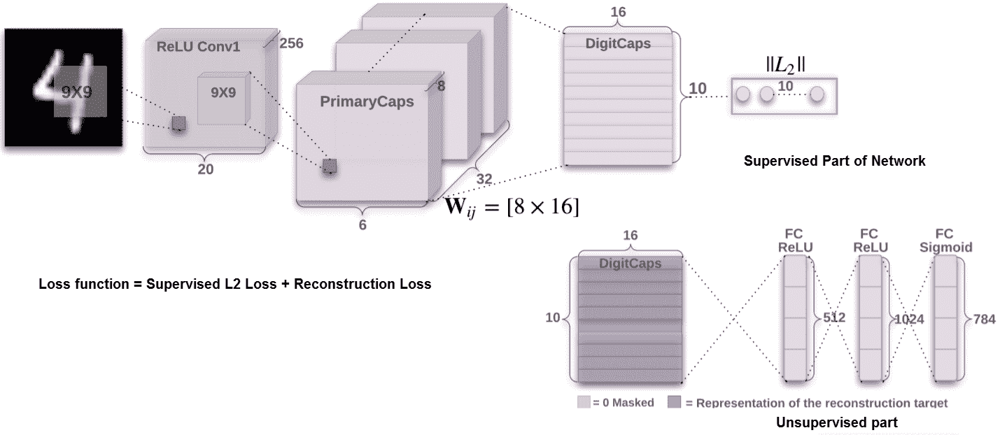

这是一种浅薄的体系结构，需要根据 MNIST 数据（`28 x 28`个手写数字图像）进行训练。 这具有两个卷积层。 第一卷积层具有 256 个特征图，具有`9 x 9`内核（步幅为 1）和 ReLu 激活。 因此，每个特征图是`(28 - 9 + 1) x (28 - 9 + 1)`或`20 x 20`。第二个卷积层又具有 256 个特征图，具有`9 x 9`个内核（步幅为 2）和 ReLu 激活。 这里每个特征图是`6 x 6`，`6 = ((20 - 9) / 2 + 1)`。 对该图层进行了重塑，或者将特征图重新分组为 32 组，每组具有 8 个特征图（`256 = 8 x 32`）。 分组过程旨在创建每个大小为 8 的特征向量。为了表示姿势，向量表示是一种更自然的表示。 来自第二层的分组特征图称为**主胶囊**层。 我们有（`32 x 6 x 6`）八维胶囊向量，其中每个胶囊包含 8 个卷积单元，内核为`9 x 9`，步幅为 2。最后一个胶囊层（**DigitCaps**）对于每十个类别有一个十六维的胶囊，这些胶囊中的每一个都从主胶囊层中的所有胶囊接收输入。

胶囊的输出向量的长度表示由胶囊表示的实体存在于当前输入中的概率。 胶囊向量的长度被归一化，并保持在 0 到 1 之间。此外，在向量的范数上使用了压缩函数，以使短向量缩小到几乎零长度，而长向量缩小到略小于 1 的长度。

压扁功能为：

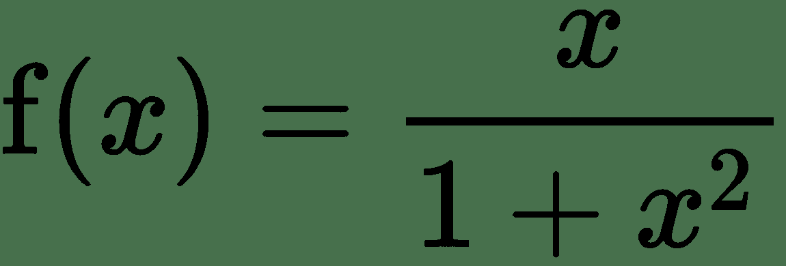

其中`x`是向量的范数，因此`x > 0`（请参见下图）：

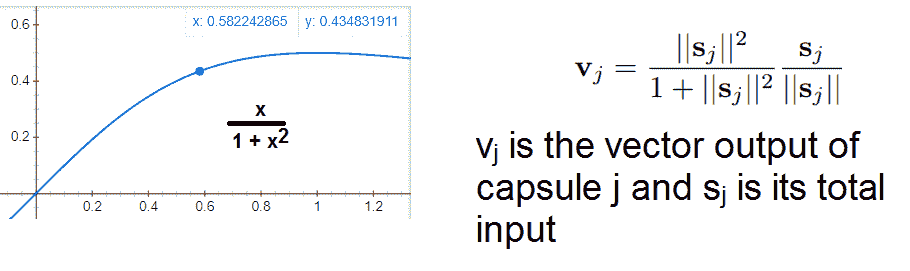

`W[ij]`是每个初级胶囊中`u[i]`，`i ∈ (1, 32 x 6 x 6)`和`v[j]`，在 DigitCaps 中`j ∈ (1, 10)`。 在此，`u_hat[j|i] = w[ij]u[i]`被称为预测向量，并且像一个已转换（旋转/翻译）的输入胶囊向量`u[i]`。 胶囊的总输入`s[j]`是来自下一层胶囊的所有预测向量的加权总和。 这些权重`c[ij]`的总和为 1，在 Hinton 中称为**耦合系数**。 一开始，它假设胶囊`i`应该与母体胶囊`j`结合的对数先验概率对于所有`i`和`j`都是相同的，用`b[ij]`表示。 因此，可以通过此众所周知的 softmax 转换来计算耦合系数：

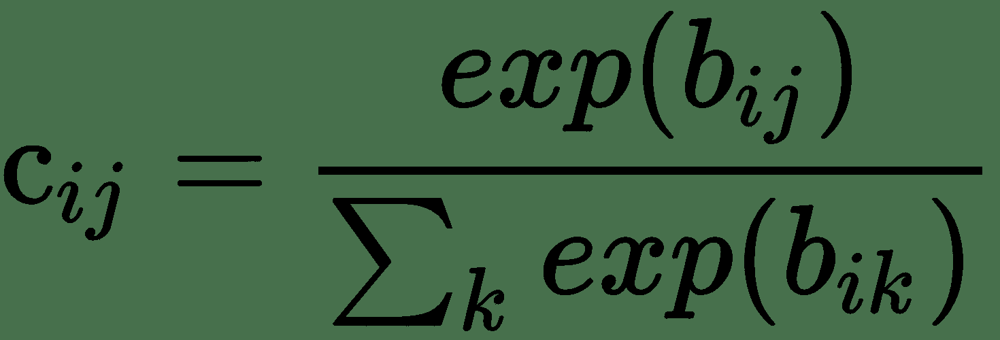

通过称为**协议路由**的算法，这些耦合系数与网络的权重一起迭代更新。 简而言之，它执行以下操作：如果主胶囊`i`的预测向量与可能的父级`j`的输出具有大的标量积，则耦合系数`b[ij]`对于该父对象增加而对于其他父对象减少。

完整的路由算法在这里给出：

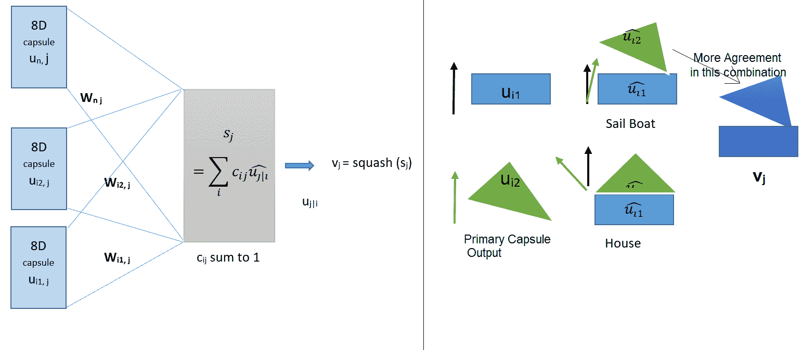

左侧显示了如何通过权重矩阵`W[ij]`将所有主胶囊连接到数字胶囊。 此外，它还描述了如何通过非线性压缩函数计算耦合系数以及如何计算 DigitCaps 的十六维输出。 在右侧，假设主胶囊捕获了两个基本形状：输入图像中的三角形和矩形。 旋转后将它们对齐会根据旋转量给出**房屋**或**帆船**。 很明显，这两个物体在极少或几乎没有旋转的情况下结合在一起，形成了帆船。 即，两个主胶囊比房屋更对准以形成船。 因此，路由算法应更新`b[i, 船]`的耦合系数：

```py
procedure routing (, r, l):
  for all capsule i in layer l and capsule j in layer (l + 1): bij <- 0
for r iterations do:
  for all capsule i in layer l: ci <- softmax (bi)
  for all capsule j in layer (l + 1): 
  for all capsule j in layer (l + 1): vj <- squash (sj)
  for all capsule i in layer l and capsule j in layer (l + 1):  
return vj
```

最后，我们需要适当的损失函数来训练该网络。 在此，将*数字存在的余量损失*用作损失函数。 它还考虑了数字重叠的情况。 对于每个胶囊`k`，单独的裕量损失`L[k]`用于允许检测多个重叠的数字。 `L[k]`观察胶囊向量的长度，对于`k`类的数字，第`k`个胶囊向量的长度应最大：

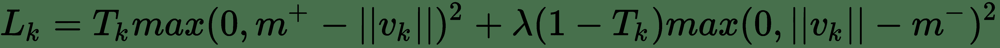

如果存在第`k`位，则`T[k] = 1`。 `m+ = 0.9`，`m- = 0.1`。 `λ`用于降低缺少数字类别的损失的权重。 与`L[k]`一起，图像重建误差损失被用作网络的正则化。 如 CapsNet 架构所示，数字胶囊的输出被馈送到由三个完全连接的层组成的解码器中。 逻辑单元的输出与原始图像像素强度之间的平方差之和最小。 重建损失缩小了 0.0005 倍，因此在训练过程中它不控制边际损失。

[CapsNet 的 TensorFlow 实现在此处可用](https://github.com/naturomics/CapsNet-Tensorflow)。

# 循环神经网络

**循环神经网络**（**RNN**）专用于处理一系列值，如`x(1) ... x(t)`。 例如，如果要在给定序列的最新历史的情况下预测序列中的下一个术语，或者将一种语言的单词序列翻译为另一种语言，则需要进行序列建模。 RNN 与前馈网络的区别在于其体系结构中存在反馈环路。 人们常说 RNN 有记忆。 顺序信息保留在 RNN 的隐藏状态中。 因此，RNN 中的隐藏层是网络的内存。 从理论上讲，RNN 可以任意长的顺序使用信息，但实际上，它们仅限于回顾一些步骤。

我们将在后面解释：

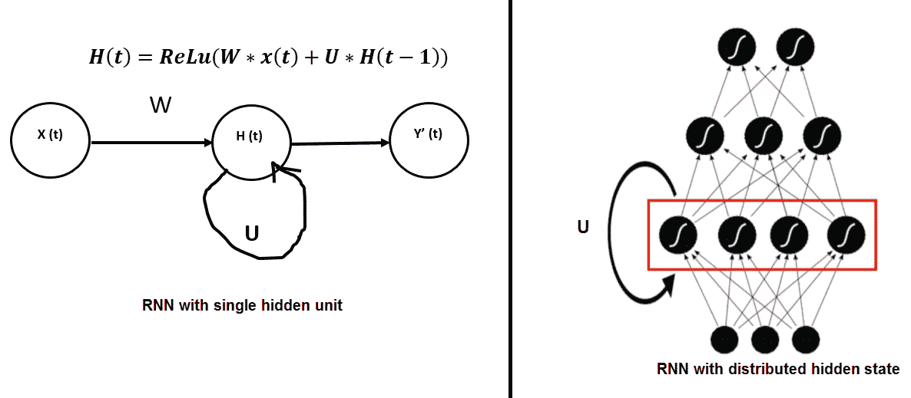

通过展开网络中的反馈回路，我们可以获得前馈网络。 例如，如果我们的输入序列的长度为 4，则可以按以下方式展开网络。 展开相同的权重集后，在所有步骤中共享`U`，`V`和`W`，与传统 DNN 不同。 因此，实际上我们在每个步骤都执行相同的任务，只是输入的内容不同。 这大大减少了我们需要学习的参数总数。 现在，要学习这些共享的权重，我们需要一个损失函数。 在每个时间步长处，我们都可以将网络输出`y(t)`与目标序列`s(t)`进行比较，并得出误差`E(t)`。 因此，总错误为：

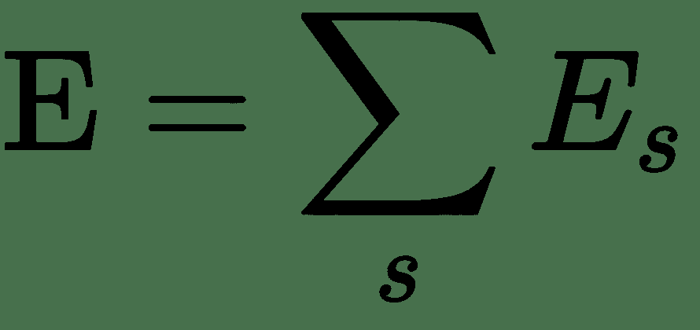：

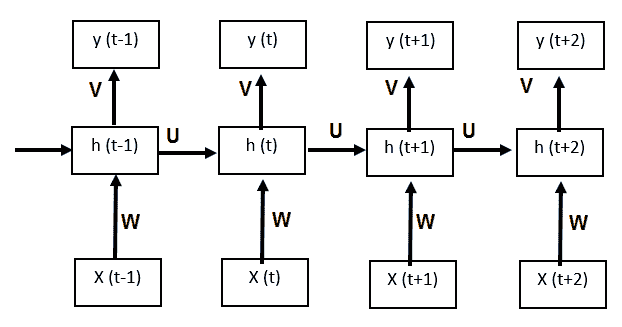

让我们看一下使用基于梯度的优化算法学习权重所需的总误差导数。 我们有`h[t] = Uφh[t-1] + Wx[t]`，Φ是非线性激活，而`y[t] = Vφh[t]`。

现在是：

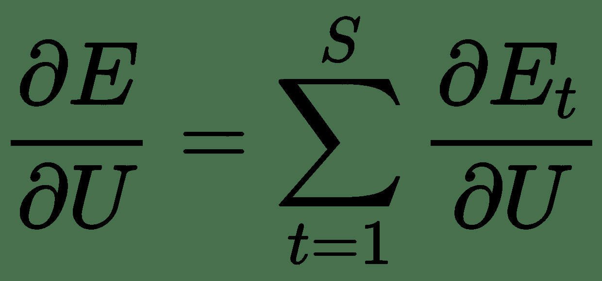

根据链式规则，我们有：

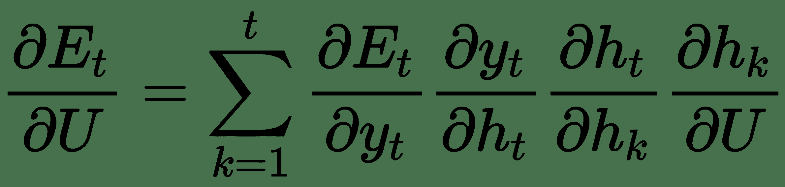

在此，雅可比行列式`∂h[t]/∂h[k]`，即层`t`相对于前一层`k`本身是雅可比行列式

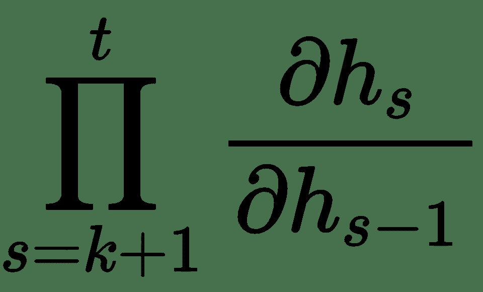

的乘积。

使用前面的`h[t]`方程，我们有：

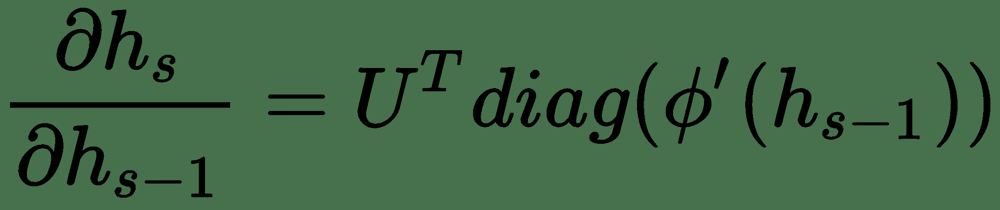

因此，雅可比式`∂h[t]/∂h[k]`的范数由乘积

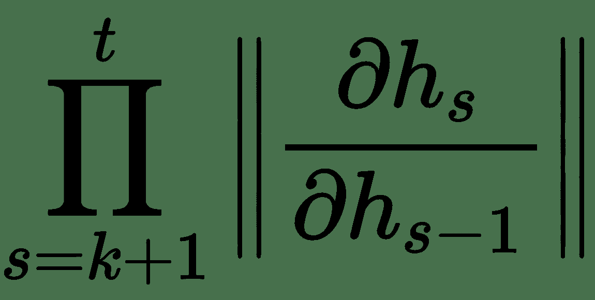

给出。 如果数量`||∂h[s]/∂h[s-1]||`小于 1，则在较长的序列（例如 100 步）中，这些规范的乘积将趋于零。 同样，如果范数大于 1，则长序列的乘积将成倍增长。 这些问题在 RNN 中称为**消失梯度**和**爆炸梯度**。 因此，在实践中，RNN 不能具有很长的记忆。

# LSTM

随着时间的流逝，RNN 开始逐渐失去历史背景，因此很难进行实际训练。 这就是 LSTM 出现的地方！ LSTM 由 Hochreiter 和 Schmidhuber 于 1997 年引入，可以记住来自非常长的基于序列的数据中的信息，并可以防止梯度消失等问题。 LSTM 通常由三个或四个门组成，包括输入，输出和忘记门。

下图显示了单个 LSTM 单元的高级表示：

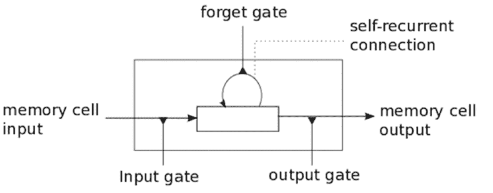

输入门通常可以允许或拒绝进入的信号或输入以更改存储单元状态。 输出门通常会根据需要将该值传播到其他神经元。 遗忘门控制存储单元的自循环连接以根据需要记住或忘记以前的状态。 通常，将多个 LSTM 单元堆叠在任何深度学习网络中，以解决现实世界中的问题，例如序列预测。 在下图中，我们比较了 RNN 和 LSTM 的基本结构：

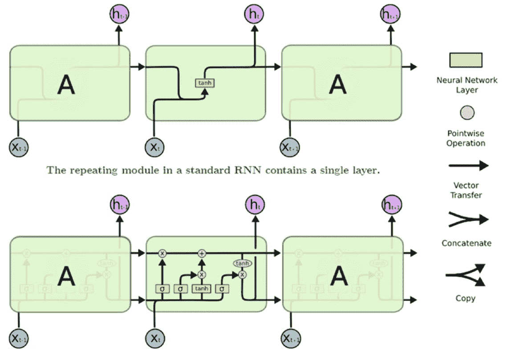

下图显示了 LSTM 单元和信息流的详细架构。 令`t`表示一个时间步长； `C`为细胞状态；`h`为隐藏状态。 通过称为*门*的结构，LSTM 单元具有删除信息或向单元状态添加信息的能力。 门`i`，`f`和`o`分别代表输入门，忘记门和输出门，它们中的每一个都由 Sigmoid 层调制， 输出从零到一的数字，控制这些门的输出应通过多少。 因此，这有助于保护和控制单元状态：

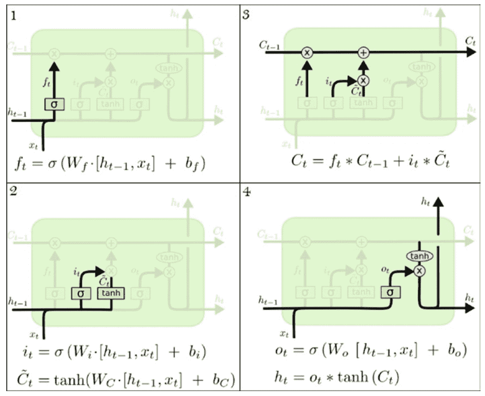

通过 LSTM 的信息流包括四个步骤：

1.  **决定要从单元状态中丢弃哪些信息**：该决定由称为**遗忘门层**的 Sigmoid 决定。 将仿射变换应用于`h[t]`，`x[t-1]`，并将其输出通过 Sigmoid 挤压函数传递，以得到一个介于 0 和 1 之间的数字。 细胞状态`C[t-1]`。 1 表示应保留内存，零表示应完全擦除内存。

2.  **决定将哪些新信息写入内存**：这是一个两步过程。 首先，使用一个称为**输入门层**的 Sigmoid 层，即`i[t]`来确定将信息写入哪个位置。接下来，tanh 层将创建新的候选信息。 书面。
3.  **更新内存状态**：将旧的内存状态乘以`f[t]`，擦除确定为可忘记的内容。 然后，在通过`i[t]`缩放它们之后，添加在*步骤 2* 中计算的新状态信息。
4.  **输出存储器状态**：单元状态的最终输出取决于当前输入和更新的单元开始。 首先，使用 Sigmoid 层来确定我们要输出的单元状态的哪些部分。 然后，单元状态通过 tanh 并乘以 Sigmoid 门的输出。

我建议您在查看 [Christophers 的博客](http://colah.github.io/posts/2015-08-Understanding-LSTMs/)，以获取有关 LSTM 步骤的更详细说明。 我们在这里查看的大多数图表均来自此。

LSTM 可以用于序列预测以及序列分类。 例如，我们可以预测未来的股价。 另外，我们可以使用 LSTM 构建分类器，以预测来自某些健康监控系统的输入信号是致命还是非致命信号（二分类器）。 我们甚至可以使用 LSTM 构建文本文档分类器。 单词序列将作为 LSTM 层的输入，LSTM 的隐藏状态将连接到密集的 softmax 层作为分类器。

# 堆叠式 LSTM

如果我们想了解顺序数据的分层表示，可以使用 LSTM 层的堆栈。 每个 LSTM 层输出一个向量序列，而不是序列中每个项的单个向量，这些向量将用作后续 LSTM 层的输入。 隐藏层的这种层次结构使我们的顺序数据可以更复杂地表示。 堆叠的 LSTM 模型可用于对复杂的多元时间序列数据进行建模。

# 编码器-解码器–神经机器翻译

机器翻译是计算语言学的一个子领域，涉及将文本或语音从一种语言翻译成另一种语言。 传统的机器翻译系统通常依赖于基于文本统计属性的复杂功能工程。 最近，深度学习已被用于解决此问题，其方法称为**神经机器翻译**（**NMT**）。 NMT 系统通常由两个模块组成：编码器和解码器。

它首先使用*编码器*读取源句子，以构建思想向量：代表该句子含义的数字序列。 *解码器*处理句子向量以发出对其他目标语言的翻译。 这称为编码器-解码器体系结构。 编码器和解码器通常是 RNN 的形式。 下图显示了使用堆叠 LSTM 的编码器-解码器体系结构。 在这里，第一层是一个嵌入层，用于通过密集的实向量来表示源语言中的单词。 为源语言和目标语言都预定义了词汇表。 不在词汇表中的单词由固定单词`<未知>`表示，并由固定嵌入向量表示。 该网络的输入首先是源句子，然后是句子标记`<s>`的结尾，指示从编码模式到解码模式的转换，然后馈入目标句子：

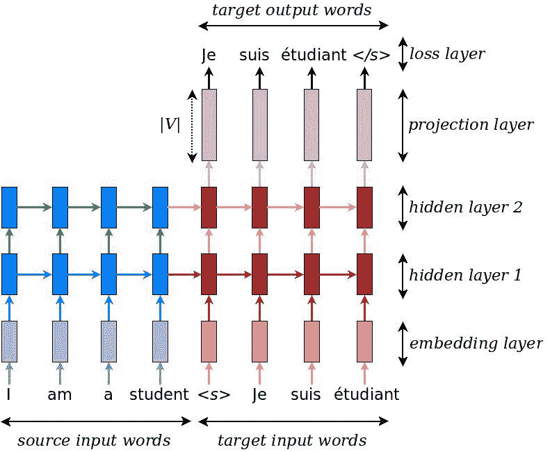

资料来源：https://www.tensorflow.org/tutorials/seq2seq

输入嵌入层后面是两个堆叠的 LSTM 层。 然后，投影层将最上面的隐藏状态转换为尺寸为`V`（目标语言的词汇量）的对率向量。 这里，交叉熵损失用于通过反向传播训练网络。 我们看到在训练模式下，源句子和目标句子都被输入到网络中。 在推理模式下，我们只有源句。 在那种情况下，可以通过几种方法来完成解码，例如贪婪解码，与贪婪解码结合的注意力机制以及集束搜索解码。 我们将在这里介绍前两种方法：

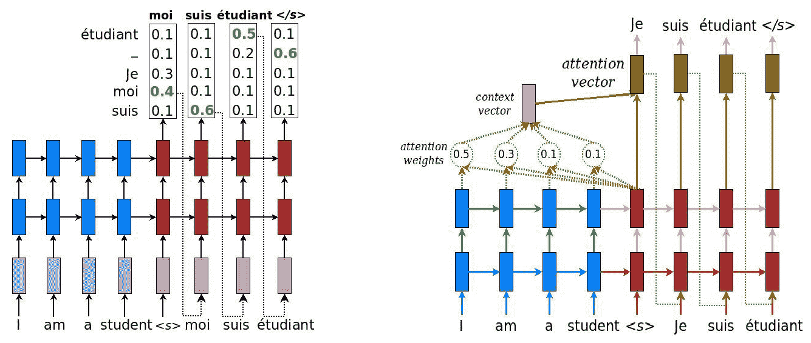

在贪婪的解码方案中（请参见前面两个图的左手图），我们选择最有可能的单词（以最大对率值描述为发射的单词），然后将其反馈给解码器作为输入。 继续该解码过程，直到产生句子结束标记`</s>`作为输出符号。

由源句子的句子结尾标记生成的上下文向量必须对我们需要了解的有关源句子的所有内容进行编码。 它必须充分体现其含义。 对于长句子，这意味着我们需要存储非常长的记忆。 研究人员发现，反转源序列或两次馈入源序列有助于网络更好地记忆事物。 对于与英语非常相似的法语和德语这样的语言，反转输入是有意义的。 对于日语，句子的最后一个单词可能会高度预测英语翻译中的第一个单词。 因此，这里的反转会降低翻译质量。 因此，一种替代解决方案是使用**注意机制**（如前两个图的右图所示）。

现在，无需尝试将完整的源句子编码为固定长度的向量，而是允许解码器在输出生成的每个步骤中使*参与*到源句子的不同部分。 因此，我们将第`t`个目标语言单词的基于注意力的上下文向量`c[t]`表示为所有先前源隐藏状态的加权和：


注意权重为：

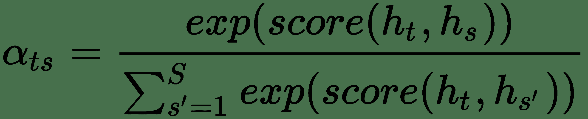

*得分*的计算如下：`sc(h[t], h[s]) = h[t] W h[s]`。

`W`是权重矩阵，将与 RNN 权重一起学习。 该得分函数称为 **Luong 的**乘法样式得分。 此分数还有其他一些变体。 最后，通过将上下文向量与当前目标隐藏状态组合如下来计算**注意向量**，`a[t]`：

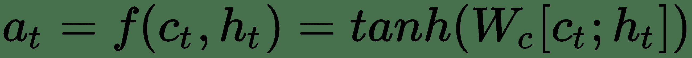

注意机制就像只读存储器，其中存储了源的所有先前隐藏状态，然后在解码时读取它们。 TensorFlow 中 NMT 的源代码[可在此处获得](https://github.com/tensorflow/nmt/)。

# 门控循环单元

**门控循环单元**（**GRU**）与 LSTM 相关，因为两者均利用不同的门控信息方式来防止梯度消失和存储长期记忆。 GRU 具有两个门：重置门`r`和更新门`z`，如下图所示。 复位门确定如何将新输入与先前的隐藏状态`h[t-1]`组合在一起，而更新门则确定要保留多少先前状态信息。 如果我们将重置设置为全 1 并将更新门更新为全零，我们将得到一个简单的 RNN 模型：

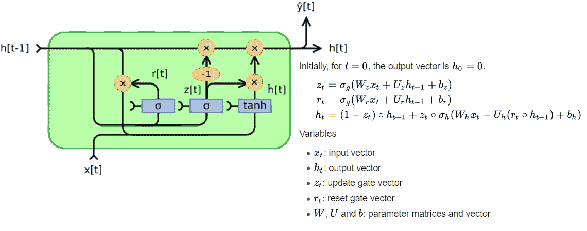

GRU 相对较新，其性能与 LSTM 相当，但由于结构更简单，参数更少，因此它们在计算上更加高效。 这是 LSTM 和 GRU 之间的一些结构差异：

*   一个 GRU 有两个门，而 LSTM 有三个门。 GRU 没有 LSTM 中存在的输出门。
*   除隐藏状态外，GRU 没有其他内部内存`C[t]`。
*   在 GRU 中，当计算输出时，是非线性（tanh）的。

如果有足够的数据，建议使用 LSTM，因为 LSTM 的更高表达能力可能会导致更好的结果。

# 记忆神经网络

大多数机器学习模型无法读取和写入长期内存组件，也无法将旧内存与推理无缝结合。 RNN 及其变体（例如 LSTM）确实具有存储组件。 但是，它们的内存（由隐藏状态和权重编码）通常太小，不像我们在现代计算机中发现的大块数组（以 RAM 的形式）。 他们试图将所有过去的知识压缩为一个密集的向量-记忆状态。 对于诸如虚拟协助或**问题解答**（**QA**）系统之类的复杂应用程序，该应用程序可能会受到很大限制，在这种系统中，长期记忆有效地充当了（动态）知识库， 输出是文本响应。 为了解决这个问题，Facebook AI 研究小组开发了**记忆神经网络**（**MemNNs**）。 MemNN 的中心思想是将深度学习文献中为推理而开发的成功学习策略与可以像 RAM 一样读写的内存组件相结合。 同样，模型被训练以学习如何与存储组件一起有效地操作。 存储网络由存储器`m`，对象的索引数组（例如，向量或字符串数​​组）和要学习的四个组件`I, G, O, R`组成：

*   `I`：输入要素映射`I`，它将输入输入转换为内部要素表示。
*   `G`：*通用化*组件，`G`，在输入新输入的情况下更新旧内存。 这被称为**泛化**，因为网络有机会在此阶段压缩和泛化其内存，以备将来使用。
*   `O`：输出特征图`O`，在给定新输入和*当前存储状态*的情况下，该特征图空间中将生成新输出。
*   `R`：*响应*组件`R`，可将输出转换为所需的响应格式，例如文本响应或动作：

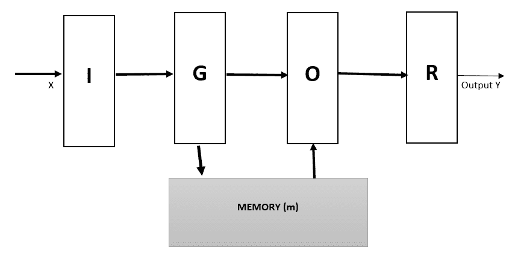

当分量`I`，`G`，`O`和`R`是*神经网络*时，则所得系统称为 **MemNN**。 让我们尝试通过示例质量检查系统来理解这一点。 系统将获得一系列事实和问题。 它将输出该问题的答案。 我们有以下六个文本事实和一个问题，问：“牛奶现在在哪里？”：

*   乔去了厨房
*   弗雷德去了厨房
*   乔拿起牛奶
*   乔去了办公室
*   乔离开了牛奶
*   乔去洗手间

请注意，语句的某些子集包含答案所需的信息，而其他子集本质上是无关紧要的。 我们将用 MemNN 模块`I`，`G`，`O`和`R`来表示这一点。模块`I`是一个简单的嵌入模块，它将文本转换为二进制词袋向量。 文本以其原始形式存储在下一个可用的存储插槽中，因此`G`模块非常简单。 一旦去除了停用词，给定事实中使用的单词词汇为`V = {乔, 弗雷德, 旅行, 捡起, 离开, 离开, 去办公室, 洗手间, 厨房, 牛奶}`。 现在，这是所有文本存储后的内存状态：

| **内存位置序号** | 乔 | 弗雷德 | ... | 办公室 | 浴室 | 厨房 | 牛奶 |
| --- | --- | --- | --- | --- | --- | --- | --- |
| 1 | 1 | 0 |  | 0 | 0 | 1 | 0 |
| 2 | 0 | 1 |  | 0 | 0 | 1 | 0 |
| 3 | 1 | 0 |  | 0 | 0 | 0 | 1 |
| 4 | 1 | 0 |  | 1 | 0 | 0 | 0 |
| 5 | 1 | 0 |  | 0 | 0 | 0 | 1 |
| 6 | 1 | 0 |  | 0 | 1 | 0 | 0 |
| 7 |  |  |  |  |  |  |  |

`O`模块通过在给定问题`q`的情况下找到`k`个支持存储器来产生输出特征。 对于`k = 2`，使用以下方法检索最高得分的支持内存：

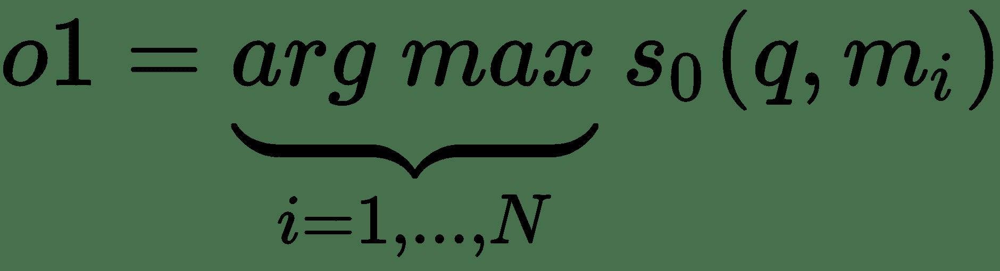

其中`s[0]`是输入`q`和`m[i]`之间的评分函数，`o1`是具有最佳匹配的内存`m`的索引。 现在，使用查询和第一个检索到的内存，我们可以检索下一个内存`m[o2]`，这两个内存都很接近：

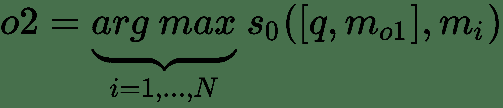

合并的查询和内存结果为`o = [q, m[o1], m[o2]] = [现在牛奶在哪里, 乔离开了牛奶, 乔去了办公室]`。 最后，模块`R`需要产生文本响应`r`。 `R`模块可以输出一个单词的答案，或者可以输出一个完整句子的 RNN 模块。 对于单字响应，令`r`是对`[q, m[o1], m[o2]]`和单词`w`的回应。 因此，最后的回应`r`是办公室一词：

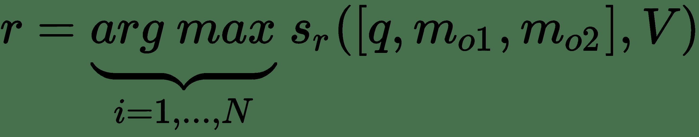

这种模型很难使用反向传播来进行端到端训练，并且需要在网络的每个模块上进行监督。 对此有一点修改，实际上是称为**端到端存储网络**（**MemN2N**）的连续版本的存储网络。 该网络可以通过反向传播进行训练。

# MemN2Ns

我们从一个查询开始：牛奶现在在哪里？ 使用大小为`V`的向量，用成袋的单词进行编码。 在最简单的情况下，我们使用嵌入`B(d x V)`将向量转换为大小为`d`的词嵌入。 我们有`u = embeddingB(q)`：

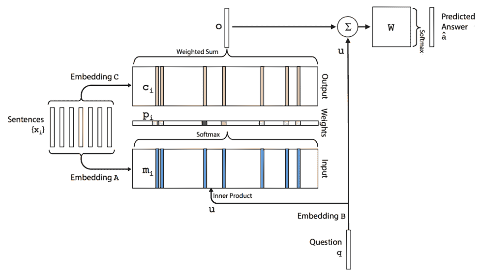

输入句子`x1, x2, ...,  xi`通过使用另一个嵌入矩阵`A(d x V)`存储在内存中，其大小与`B[mi] = embeddingA(x[i])`。 每个嵌入式查询`u`与每个内存`m[i]`之间的相似度是通过取内积和 softmax 来计算的：`p[i] = softmax(u^T m[i])`。

输出存储器表示如下：每个`x[i]`具有对应的输出向量`c[i]`，可以用另一个嵌入矩阵`C`表示。 然后，来自存储器的响应向量`o`是`c[i]`上的总和，并由来自以下输入的概率向量加权：

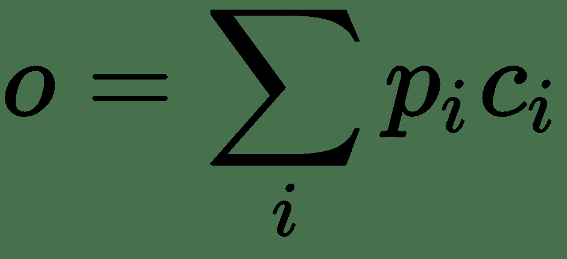

最后，将`o`和`u`之和与权重矩阵`W(V x d)`相乘。 结果传递到 softmax 函数以预测最终答案：

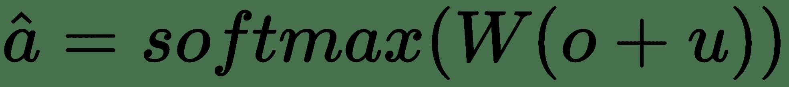

[MemN2N 的 TensorFlow 实现可在此处获得](https://github.com/carpedm20/MemN2N-tensorflow)。

# 神经图灵机

**神经图灵机**（**NTM**）受到**图灵机**（**TM**）的启发：定义了一个抽象机。 TM 可以根据规则表来操作一条胶带上的符号。 对于任何计算机算法，TM 都可以模拟该算法的逻辑。 机器将其头放在单元格上方并在其中读取或写入符号。 此后，根据定义的规则，它可以向左或向右移动甚至停止程序。

NTM 体系结构包含两个基本组件：神经网络控制器和内存。 下图显示了 NTM 体系结构的高层表示：

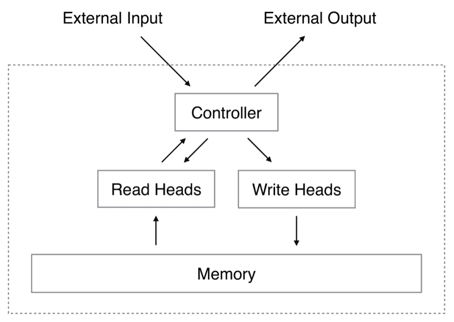

控制器使用输入和输出向量与外部世界进行交互。 与标准神经网络不同，此处的控制器还使用选择性读取和写入操作与存储矩阵进行交互。 内存是一个实值矩阵。 内存交互是端到端可区分的，因此可以使用梯度下降对其进行优化。 NTM 可以从输入和输出示例中学习简单的算法，例如复制，排序和关联召回。 而且，与 TM 不同，NTM 是可通过梯度下降训练的可微分计算机，为学习程序提供了一种实用的机制。

控制器可以由 LSTM 建模，LSTM 具有自己的内部存储器，可以补充矩阵中更大的存储器。 可以将控制器与计算机中的 CPU 相比较，并且可以将存储矩阵与计算机的 RAM 相比较。

读写头选择要读取或写入的内存部分。 可以通过神经网络中的隐藏层（可能是 softmax 层）对它们进行建模，以便可以将它们视为外部存储单元上的权重之和，这些权重之和为 1。此外，请注意，模型参数的数量是受控的，不会随存储容量的增长而增加。

# 选择性注意

控制器输出用于确定要读取或写入的存储器位置。 这由一组分布在所有内存位置上的权重定义，这些权重之和为 1。权重由以下两种机制定义。 想法是为控制器提供几种不同的读取或写入内存的模式，分别对应于不同的数据结构：

*   **基于内容的**：使用相似度度量（例如余弦相似度）将控制器的键`k`输出与所有存储位置进行比较，然后所有距离均由 softmax 归一化，得到和为一的权重：

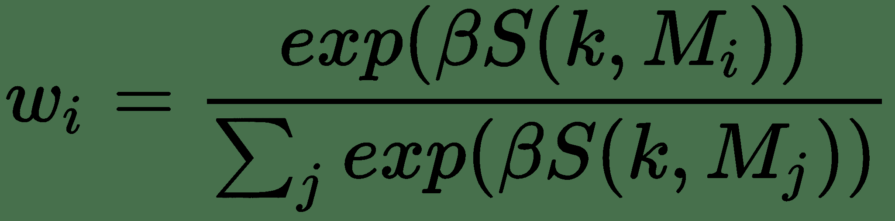

在这种情况下，`β ≥ 1`称为清晰度参数，并控制对特定位置的聚焦。 它还为网络提供了一种方法来决定其希望内存位置访问的精确度。 就像模糊均值聚类中的模糊系数。

*   **基于位置的**：基于位置的寻址机制旨在跨存储器位置的简单迭代。 例如，如果当前权重完全集中在单个位置上，则旋转 1 会将焦点移到下一个位置。 负移将使权重朝相反方向移动。 控制器输出一个移位内核`s`（即`[-n, n]`上的 softmax），将其与先前计算的存储器权重进行卷积以产生移位的存储器位置，如下图所示。 这种转变是循环的； 也就是说，它环绕边界。 下图是内存的热图表示—较深的阴影表示更多的权重：


在应用旋转移位之前，将内容寻址所给定的权重向量与先前的权重向量`w[t-1]`相结合，如下所示：

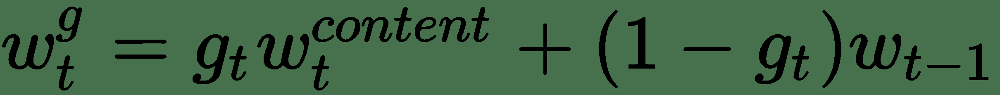

在此，`g[t]`是由控制器头发出的标量*内插门*，范围为`(0, 1)`。 如果`g[t] = 1`，则忽略先前迭代的加权。

# 读取操作

令`M[t]`为时间`t`的`N x M`存储矩阵的内容，其中`N`是存储位置的数量，`M`是每个位置的向量大小。 时间`t`的读取头由向量`w[t]`给出。

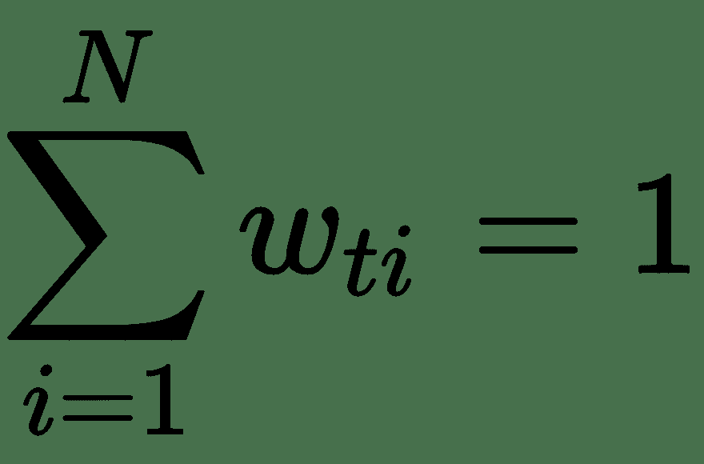

`M`读取向量`r[t]`的长度定义为行向量`M[t](i)`的凸组合，在内存中：

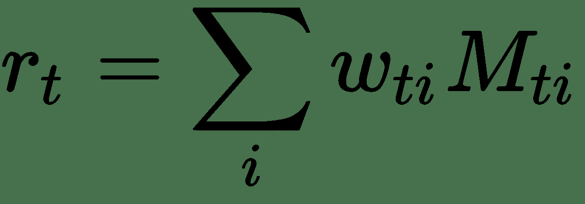

# 写操作

每个写头接收一个*擦除向量*， `e[t]`和一个*加性*向量，`a[t]`，以像 LSTM 单元一样重置和写入存储器，如下所示：`M[t](i) ← M[t](i) [1 - e[t](i) w[t](i)] + w[t](i) a[t](i)`。

这是上述操作的伪代码：

```py
mem_size = 128 #The size of memory 
mem_dim = 16 #The dimensionality for memory 
shift_range = 1 # defining shift[-1, 0, 1]

## last output layer from LSTM controller: last_output
## Previous memory state: M_prev
def Linear(input_, output_size, stddev=0.5):
  '''Applies a linear transformation to the input data: input_
  implements dense layer with tf.random_normal_initializer(stddev=stddev)
  as weight initializer
  ''''
def get_controller_head(M_prev, last_output, is_read=True):

  k = tf.tanh(Linear(last_output, mem_dim))
  # Interpolation gate
  g = tf.sigmoid(Linear(last_output, 1)

  # shift weighting
  w = Linear(last_output, 2 * shift_range + 1)
    s_w = softmax(w)

  # Cosine similarity
  similarity = smooth_cosine_similarity(M_prev, k) # [mem_size x 1]
  # Focusing by content
  content_focused_w = softmax(scalar_mul(similarity, beta))

  # Convolutional shifts
  conv_w = circular_convolution(gated_w, s_w)

  if is_read:
    read = matmul(tf.transpose(M_prev), w)
    return w, read
  else:
    erase = tf.sigmoid(Linear(last_output, mem_dim)
    add = tf.tanh(Linear(last_output, mem_dim))
    return w, add, erase
```

[NTM 的完整 TensorFlow 实现可在此处获得](https://github.com/carpedm20/NTM-tensorflow)。 NTM 算法可以学习复制-他们可以学习复制随机数序列的算法。 下面显示了 NTM 如何使用内存读写头并将其移位以实现复制算法：

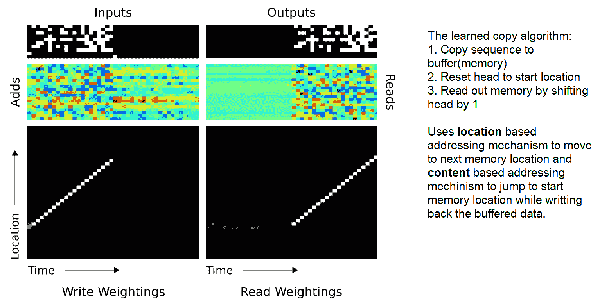

类似地，给定一组随机序列和相应的排序序列，NTM 可以从数据中高效地学习排序算法。

# 基于注意力的神经网络模型

我们已经讨论了基于注意力的机器翻译模型。 基于注意力的模型的优点在于，它们提供了一种解释模型并理解其工作方式的方式。 注意机制是记忆以前的内部状态的一种形式。 这就像内部存储器。 与典型的存储器不同，这里的存储器访问机制是软的，这意味着网络将检索所有存储器位置的加权组合，而不是单个离散位置的值。 软存储器访问使通过反向传播训练网络变得可行。 基于注意的体系结构不仅用于机器翻译，还可以用于自动生成图像标题。

这项工作于 2016 年发表在论文[《Show，Attend and Tell：带有视觉注意的神经图像字幕生成》](https://arxiv.org/abs/1502.03044)上，作者是 Kelvin Xu 及其合著者。 在这里，从注意力权重来看，我们看到随着模型生成每个单词，其注意力发生变化以反映图像的相关部分。 [此关注模型的 TensorFlow 实现可在此处获得](https://github.com/yunjey/show-attend-and-tell)：

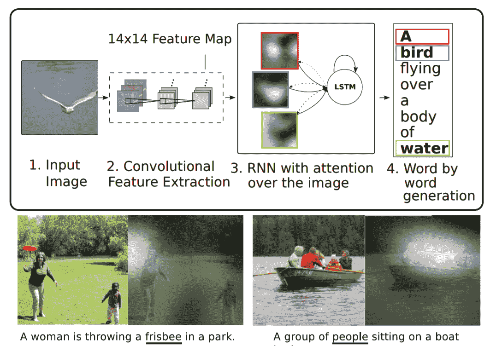

# 摘要

本章介绍了神经网络体系结构的各种进展及其在各种实际问题中的应用。 我们讨论了对这些体系结构的需求，以及为什么简单的深度多层神经网络不能充分解决各种问题，因为它具有强大的表达能力和丰富的假设空间。 讨论迁移学习用例时，将在后面的章节中使用其中讨论的许多体系结构。 提供了几乎所有体系结构的 Python 代码参考。 我们还试图清楚地解释一些最近的体系结构，例如 CapsNet，MemNN 和 NTM。 当您逐步学习迁移学习用例时，我们将经常参考本章。

下一章将介绍转学的概念。