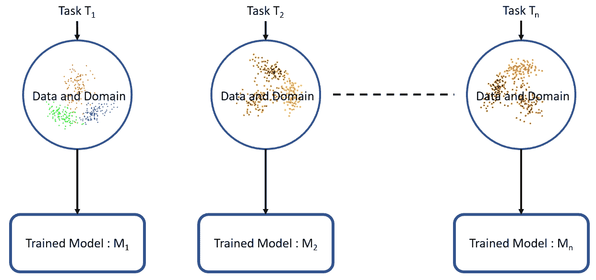
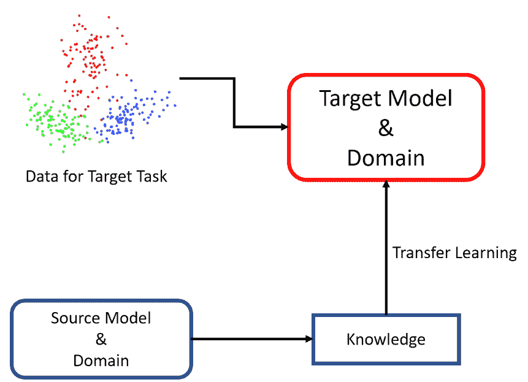
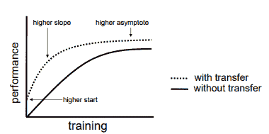
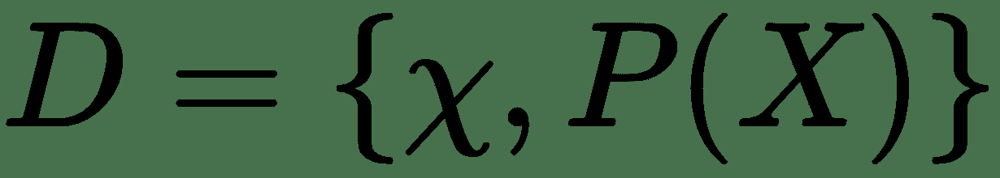
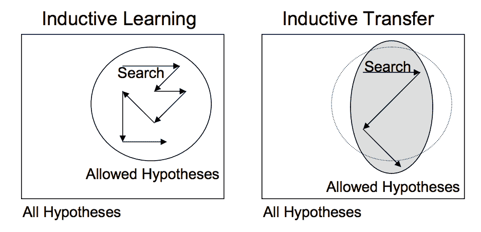
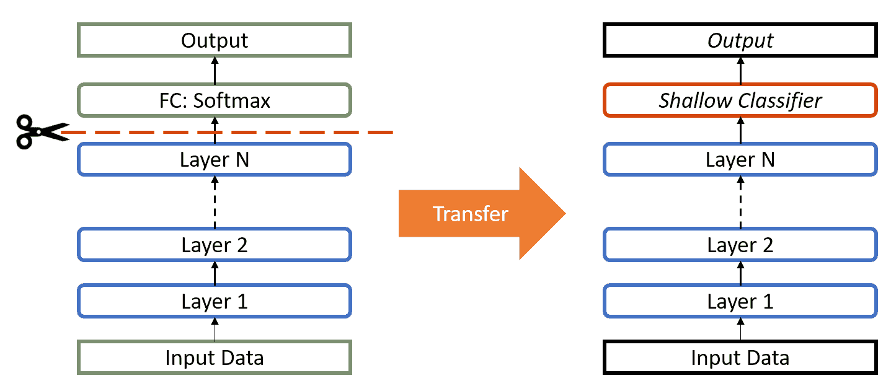
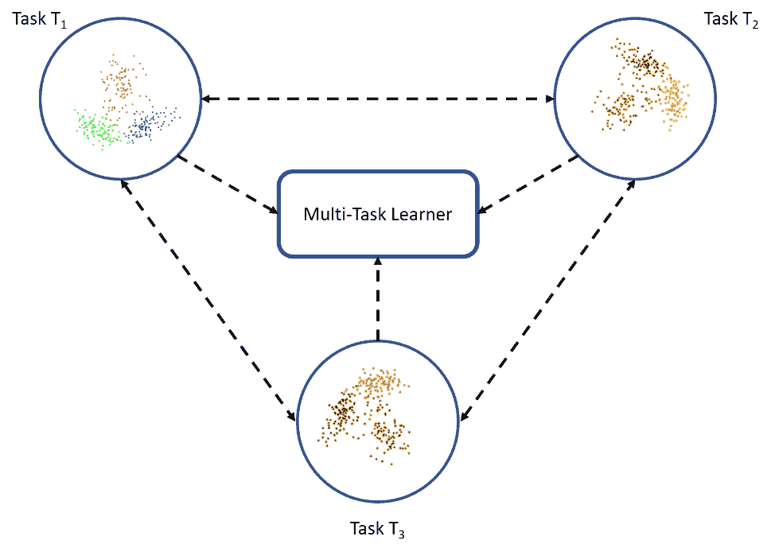

# 迁移学习基础

我还在学习

–米开朗基罗

人类具有在任务之间传递知识的固有能力。 我们在学习一项任务时获得的知识就是我们以相同的方式来解决相关任务。 任务越相关，我们就越容易转移或交叉利用知识。 到目前为止，到目前为止，机器学习和深度学习算法都是设计为独立工作的。 这些算法经过训练可以解决特定任务。 一旦特征空间分布发生变化，就必须从头开始重建模型。 迁移学习是克服孤立的学习范式，并利用一项任务获得的知识来解决相关任务的想法。 在本章中，我们将介绍迁移学习的概念，并专注于深度学习上下文的各个方面。 本章将涵盖以下主题：

*   迁移学习导论
*   迁移学习策略
*   通过深度学习传递知识
*   深度迁移学习的类型
*   迁移学习的挑战

# 迁移学习导论

传统上，学习算法设计为单独解决任务或问题。 根据用例和手头数据的要求，应用算法来训练给定特定任务的模型。 传统的**机器学习**（**ML**）根据特定的域，数据和任务单独地训练每个模型，如下图所示：

传统机器学习

迁移学习使学习的过程更进一步，并且更加符合人类如何跨任务利用知识。 因此，迁移学习是一种将模型或知识重用于另一个相关任务的方法。 迁移学习有时也被视为现有 ML 算法的扩展。 在迁移学习的背景下，以及在了解如何在任务之间转移知识的过程中，正在进行大量的研究和工作。 但是，**神经信息处理系统**（**NIPS**）1995 研讨会*学习：归纳系统中的知识整合和转移*被认为为 在这个领域的研究。

[NIPS 1995 的所有研讨会都在此处列出](http://www.cs.cmu.edu/afs/cs/project/cnbc/nips/NIPS95/Workshops.html)。

从那时起，诸如*学习学习*，*知识整合*和*归纳转移*等术语已与迁移学习互换使用。 总是有不同的研究人员和学术著作提供不同背景下的定义。 在他们的书*深度学习*中，Goodfellow 等人。 在泛化的背景下指迁移学习。 它们的定义如下：

*利用一种情况下所学的知识来改善另一种情况下的泛化的情况。*

让我们借助示例来了解前面的定义。 假设我们的任务是在餐厅的受限区域内识别图像中的对象。 让我们在定义的范围内将此任务标记为 T 1 。 给定该任务的数据集，我们训练模型并对其进行调整，以使它在来自同一域（餐厅）的看不见的数据点上表现良好（概括）。 当我们在给定领域中没有足够的训练示例来完成所需的任务时，传统的监督 ML 算法就会崩溃。 假设我们现在必须从公园或咖啡馆中的图像中检测物体（例如，任务 T 2 ）。 理想情况下，我们应该能够应用针对 T 1 训练的模型，但实际上，我们面临着性能下降和模型不能很好推广的问题。 发生这种情况的原因多种多样，我们可以广泛地和集体地将其称为模型对训练数据和领域的偏见。 因此，迁移学习使我们能够利用先前学习的任务中的知识，并将其应用于更新的相关任务。 如果我们拥有任务 T 1 的大量数据，则可以利用其学习并将其概括用于任务 T 2 （其数据要少得多）。 在图像分类的情况下，某些低级特征（例如边缘，形状和照明）可以在任务之间共享，因此可以在任务之间传递知识。

下图显示了迁移学习如何使现有知识重用于新的相关任务：

如上图所示，在学习目标任务时，来自现有任务的知识将作为附加输入。

# 迁移学习的优势

我们利用源模型中的知识来改进目标任务中的学习。 除了提供重用已经构建的模型的功能之外，迁移学习还可以通过以下方式帮助学习目标任务：

*   **改进了基准性能**：当我们使用源模型中的知识来增强孤立的学习者（也称为**无知学习者**）的知识时，由于这种知识转移，基准性能可能会提高 。
*   **模型开发时间**：与从头开始学习的目标模型相比，利用源模型的知识也可能有助于充分学习目标任务。 反过来，这会导致开发/学习模型所需的总时间减少。
*   **改进的最终性能**：可以利用迁移学习获得更高的最终性能。

读者应注意，有可能获得这些收益中的一项或多项，我们将在接下来的章节中详细讨论。 如下图所示，它显示出更好的基线性能（**更高的起始**），效率增益（**更高的斜率**）和更好的最终性能（**渐近线**更高） ：

使用迁移学习的可能好处（来源：迁移学习，Lisa Torrey 和 Jude Shavlik）

迁移学习已在归纳学习者（例如神经网络和贝叶斯网络）的上下文中得到应用和研究。 强化学习是另一个探索迁移学习可能性的领域。 因此，迁移学习的概念不限于深度学习。

在本章及后续章节中，我们将限制使用迁移学习的范围仅限于深度学习的上下文。

# 迁移学习策略

首先让我们看一下迁移学习的正式定义，然后利用它来理解不同的策略。 在他们的论文[《迁移学习综述》](https://www.cse.ust.hk/~qyang/Docs/2009/tkde_transfer_learning.pdf)中，潘和杨使用 域，任务和边际概率，以提供用于理解迁移学习的框架。 该框架定义如下：

域 *D* 定义为由特征空间和边际概率 *P（Χ）*组成的二元元组，其中*Χ*是样本数据点。

在此， *x = {x 1 ，x 2 .... x n }* ，其中 *x i 作为特定载体的* 和 X  。 从而：

另一方面，可以将任务 *T* 定义为标签空间γ和目标函数 *f* 的二元组。 从概率的观点来看，目标函数也可以表示为 *P（γ|Χ）*。 从而：

使用此框架，我们可以将迁移学习定义为旨在改善目标目标功能 *f T* （或目标任务， *T T ）的过程。*），使用来自 *T* *S* 源的知识，在目标域中将 *D T* *D S* 域中的任务。 这导致以下四种情况：

*   **特征空间**：源域和目标域的特征空间互不相同，例如χ s ≠χ t 。 例如，如果我们的任务与文档分类有关，则此方案以不同的语言引用源任务和目标任务。
*   **边际概率**：边际概率或源域和目标域不同，例如 P（X s ）≠P（X t ）。 这种情况也称为**域适配** *。*
*   **标签空间**：在这种情况下，源域和目标域的标签空间不同，例如γ s ≠γ t 。 这通常也意味着方案 4 的存在-不同的条件概率。
*   **条件概率**：在这种情况下， *P（Υ s |Χ s ）≠P（Υ t |Χ t ）*，因此源域和目标域中的条件概率不同。

到目前为止，我们已经看到迁移学习具有在目标任务中利用来自源学习者的现有知识的能力。 在迁移学习过程中，必须回答以下三个重要问题：

*   **传输什么**：这是整个过程中的第一步，也是最重要的一步。 我们尝试寻求有关知识的哪一部分可以从源转移到目标的答案，以提高目标任务的性能。 当试图回答这个问题时，我们试图确定知识的哪一部分是特定于来源的，以及哪些是来源与目标之间的共同点。
*   **何时转让**：在某些情况下，为了知识而转让知识可能比改善任何事情都变得更糟（也称为*负向转让*）。 我们应该以利用迁移学习为目标，以提高目标任务的绩效/结果，而不是使其退化。 我们需要注意何时转移以及何时不转移。
*   **如何转移**：一旦回答了什么和什么时候，我们便可以着手确定跨领域/任务实际转移知识的方式。 这涉及对现有算法和不同技术的更改，我们将在本章的后续部分中介绍。 此外，下一节将列出特定的用例，以更好地了解如何进行传输。

Pan 和 Yang 撰写的论文《迁移学习综述》[可以在此处找到](https://www.cse.ust.hk/~qyang/Docs/2009/tkde_transfer_learning.pdf)。

分组技术可帮助我们了解整体特征并提供更好的框架来利用它们。 可以根据所涉及的传统 ML 算法的类型对迁移学习方法进行分类，例如：

*   **归纳传输**：在这种情况下，源域和目标域相同，但是源任务和目标任务彼此不同。 该算法尝试利用源域的归纳偏置来帮助改进目标任务。 根据源域是否包含标记数据，可以将其进一步分为两个子类别，分别类似于*多任务学习*和*自学学习*。
*   **无监督传输**：此设置类似于归纳传输本身，重点是目标域中的无监督任务。 源域和目标域相似，但是任务不同。 在这种情况下，带标签的数据在两个域中都不可用。
*   **传递式传输**：在这种情况下，源任务和目标任务之间存在相似之处，但相应的域不同。 在此设置中，源域具有很多标记数据，而目标域则没有。 可以参考特征空间不同或边际概率不同的设置将其进一步细分为子类别。

上一节中讨论的三种转移类别概述了可以应用和详细研究迁移学习的不同设置。 为了回答在这些类别中转移什么的问题，可以采用以下一些方法：

*   **实例传输**：从源域到目标任务的知识重用通常是理想的方案。 在大多数情况下，无法直接重用源域数据。 而是，源域中的某些实例可以与目标数据一起重用以改善结果。 在感应传输的情况下，Dai 及其合作者的 *AdaBoost* 之类的修改有助于利用源域中的训练实例来改进目标任务。
*   **特征表示转移**：此方法旨在通过识别可从源域到目标域使用的良好特征表示，以最小化域差异并降低错误率。 根据标记数据的可用性，可以将有监督或无监督的方法应用于基于特征表示的传输。
*   **参数传递**：此方法在以下假设下工作：相关任务的模型共享一些参数或超参数的先前分布。 与多任务学习不同，在多任务学习中同时学习源任务和目标任务，对于迁移学习，我们可以对目标域的丢失施加额外的权重以提高整体性能。
*   **关系知识转移**：与前面三种方法不同，关系知识转移尝试处理非 IID 数据，例如非独立且分布相同的数据。 换句话说，每个数据点与其他数据点都有关系的数据； 例如，社交网络数据利用关系知识转移技术。

在本节中，我们以非常通用的方式研究了在不同背景和环境下进行迁移学习的不同策略。 现在让我们利用这种理解，学习如何在深度学习的上下文中应用迁移学习。

# 迁移学习和深度学习

深度学习模型代表了**归纳学习**。 归纳学习算法的目的是从一组训练示例中得出映射。 例如，在分类的情况下，模型学习输入要素和类标签之间的映射。 为了使这样的学习者能够很好地对看不见的数据进行概括，其算法采用了与训练数据的分布有关的一组假设。 这些假设集合称为**感应偏置**。

归纳偏差或假设可以由多个因素来表征，例如它所限制的假设空间以及通过假设空间进行的搜索过程。 因此，这些偏差会影响模型在给定任务和领域上的学习方式和知识。

**归纳传输**技术利用源任务的归纳偏差来辅助目标任务。 这可以通过不同的方式来完成，例如通过限制模型空间，缩小假设空间来调整目标任务的归纳偏差，或者借助源任务的知识来对搜索过程本身进行调整。 下图直观地描述了此过程：

归纳式传递（来源：传递学习，Lisa Torrey 和 Jude Shavlik）

除了归纳转移，归纳学习算法还利用*贝叶斯*和*层次转移*技术来帮助改进目标任务的学习和性能。

# 迁移学习方法

近年来，深度学习取得了长足的进步，其结果令人赞叹。 但是，这种深度学习系统所需的训练时间和数据量比传统的 ML 系统高出几个数量级。

跨计算机视觉和**自然语言处理**（[[ **NLP**）。 在大多数情况下，团队/人员共享这些网络的详细信息以供其他人使用（第 3 章和*了解深度学习架构*中共享了一些受欢迎的网络）。 这些预训练的网络/模型在深度学习的背景下构成了迁移学习的基础。

# 特征提取

如第 3 章和*中所述，了解深度学习体系结构*深度学习系统是分层的体系结构，可在不同的层学习不同的功能。 然后将这些层最终连接到最后一层（在分类的情况下，通常是完全连接的层）以获得最终输出。 这种分层的体系结构使我们可以利用预先训练的网络（例如 Inception V3 或 VGG），而无需将其最终层用作其他任务的固定特征提取器。 下图表示基于特征提取的深度传输：

例如，如果我们使用没有最终分类层的 AlexNet，它将帮助我们将新领域任务的图像基于其隐藏状态转换为 4,096 维向量，从而使我们能够利用新领域任务从新领域任务中提取特征 来自源域任务的知识。 这是使用深度神经网络执行迁移学习的最广泛使用的方法之一。

# 微调

这是一项涉及更多的技术，我们不仅要替换最后一层（用于分类/回归），而且还要选择性地重新训练一些先前的层。 深度神经网络是具有各种超参数的高度可配置的体系结构。 如前所述，最初的层已捕获通用特征，而后面的层则更多地关注手头的特定任务。 利用这种洞察力，我们可以在重新训练时冻结（固定权重）某些图层，或者微调其余图层以满足我们的需求。 在这种情况下，我们利用网络整体架构方面的知识，并将其状态用作我们再培训步骤的起点。 反过来，这有助于我们以更少的培训时间获得更好的表现。

# 预训练模型

迁移学习的基本要求之一是在源任务上表现良好的模型的存在。 幸运的是，深度学习世界相信共享。 他们各自的团队已经公开共享了许多最先进的深度学习架构。 这些跨不同领域，例如计算机视觉和 NLP。 我们在第 3 章和*了解深度学习架构*中介绍了一些最著名和文档最丰富的架构。 这些网络背后的团队不仅分享了结果，而且分享了他们的预训练模型。 预训练模型通常以数百万个参数/权重的形式共享，该模型在被训练到稳定状态时所达到的模型。 预训练的模型可供每个人通过不同的方式使用。 著名的深度学习 Python 库`keras`提供了下载各种可用的预训练网络的接口，例如 **XCeption** ， **VGG16** 和 **InceptionV3** 。 同样，也可以通过 TensorFlow 和其他深度学习库获得预训练的模型。 [伯克利的模型动物园](http://caffe.berkeleyvision.org/model_zoo.html)提供了多年来开发的更广泛的预训练模型集合。

# 应用领域

深度学习是一类算法，已被用来非常成功地获得迁移学习的好处。 以下是一些示例：

*   **使用文本数据进行迁移学习**：当涉及到机器学习和深度学习时，文本数据提出了各种挑战。 这些通常使用不同的技术进行转换或向量化。 嵌入（例如 Word2vec 和 fastText）已使用不同的训练数据集进行了准备。 通过从源任务中转移知识，这些变量可用于不同任务中，例如情感分析和文档分类。
*   **通过计算机视觉进行迁移学习**：深度学习已成功使用各种 CNN 架构成功用于各种计算机视觉任务，例如对象识别。 在他们的论文[《深层神经网络的特征如何可传递》](https://arxiv.org/abs/1411.1792x)中，Yosinski 及其合作者提出了他们关于 较低的层用作常规的计算机视觉特征提取器，例如边缘检测器，而最后一层则用于特定任务的功能。 因此，这些发现有助于将现有的最新模型，例如 **VGG** ， **AlexNet** 和 **Inceptions** 用于目标任务，例如 作为样式转换和面部检测，与这些模型的训练方法不同。
*   **语音/音频迁移学习**：类似于文本和计算机视觉领域，深度学习已成功用于基于音频数据的任务。 例如，为英语开发的**自动语音识别**（**ASR**）模型已成功用于提高其他语言（例如德语）的语音识别性能。 同样，自动说话人识别是迁移学习大大帮助的另一个例子。

# 深度迁移学习类型

关于迁移学习的文献经历了许多迭代，并且如本章开头所提到的，与迁移学习相关的术语被松散使用并且经常可以互换使用。 因此，有时难以区分迁移学习，领域适应和多任务学习。 放心，这些都是相关的，并尝试解决类似的问题。 为了使本书保持一致，我们将采用迁移学习的概念作为一般概念，在此我们将尝试使用源任务域知识来解决目标任务。

# 领域适应

域适配通常是指源域和目标域之间的边际概率不同的情况，例如 *P（X s ）≠P（X t ）[* 。 源域和目标域的数据分布存在固有的偏移或漂移，需要进行调整才能迁移学习。 例如，标记为肯定或否定的电影评论语料库将不同于产品评论情绪的语料库。 如果用于对产品评论进行分类，则经过电影评论情绪训练的分类器将看到不同的分布。 因此，在这些情况下，领域自适应技术可用于迁移学习中。

# 域混乱

我们学习了不同的迁移学习策略，甚至讨论了*，*，*，*和*如何*如何将知识从源转移到目标的三个问题。 特别是，我们讨论了特征表示传递如何有用。 值得重申的是，深度学习网络中的不同层捕获了不同的功能集。 我们可以利用这一事实来学习领域不变的特征，并提高其跨领域的可移植性。 代替让模型学习任何表示，我们将两个域的表示微调为尽可能相似。

这可以通过将某些预处理步骤直接应用于表示本身来实现。 孙宝琛，冯家石和 Kate Saenko 在他们的论文 [《令人沮丧的轻松域自适应》](https://arxiv.org/abs/1511.05547)中讨论了其中一些问题。 Ganin 等人也提出了对表示相似性的轻推，在他们的论文[《神经网络领域专家训练》](https://arxiv.org/abs/1505.07818)中。 该技术背后的基本思想是在源模型中添加另一个目标，以通过混淆域本身来鼓励相似性，从而使*域混淆*。

# 多任务学习

多任务学习与迁移学习世界略有不同。 在多任务学习的情况下，可以同时学习多个任务，而无需区分源和目标。 在这种情况下，与迁移学习相比，学习者一次就接收到有关多个任务的信息，在迁移学习中，学习者最初对目标任务一无所知。

如下图所示：

多任务学习：学习者同时从所有任务接收信息

# 一键式学习

深度学习系统天生就渴望数据，因此它们需要许多训练示例来学习权重。 这是深度神经网络的局限性之一，尽管人类学习并非如此。 例如，一旦向孩子展示了苹果的外观，他们就可以轻松识别出不同种类的苹果（带有一个或几个培训示例）； 机器学习和深度学习算法并非如此。 一次学习是迁移学习的一种变体，在这种学习中，我们尝试仅根据一个或几个训练示例来推断所需的输出。 这在无法为每个可能的类提供标签数据的现实世界场景中（如果是分类任务）和在经常可以添加新类的场景中非常有用。

据说 Fei-Fei 及其合作者具有里程碑意义的论文[《对象类别的单发学习》](https://ieeexplore.ieee.org/document/1597116/)。 在此子领域创造了“一次性学习和研究”一词。 本文提出了一种用于对象分类的表示学习的贝叶斯框架的变体。 此后，此方法已得到改进，并已使用深度学习系统进行了应用。

# 零镜头学习

零镜头学习是迁移学习的另一个极端变体，它不依赖任何标记的示例来学习任务。 这听起来令人难以置信，尤其是当使用示例学习是大多数监督学习算法所要解决的问题时。 零数据学习或零短学习方法在训练阶段本身进行了巧妙的调整，以利用附加信息来理解看不见的数据。 在他们的 *[Lear Lear* *ning*）一书中，Goodfellow 及其合作者提出了 z *eroshot 学习*作为学习三个变量的场景，例如 传统输入变量 *x* ，传统输出变量 *y* 以及描述任务的其他随机变量 *T* 。 因此，训练模型以学习 *P（y | x，T）*的条件概率分布。 零镜头学习在机器翻译等场景中非常有用，在这种情况下，我们甚至可能没有目标语言的标签。

# 迁移学习的挑战

迁移学习具有巨大的潜力，并且是现有学习算法通常需要的增强。 但是，与迁移学习相关的某些相关问题需要更多的研究和探索。 除了难以回答关于什么，什么时候以及如何转移的问题之外，负面转移和转移界限也带来了重大挑战。

# 负转移

到目前为止，我们讨论的案例都是基于源任务的知识转移来实现目标任务的改进。 在某些情况下，迁移学习会导致性能下降。 负向转移是指从源到目标的知识转移不会导致任何改善，而是导致目标任务的整体性能下降的情况。 否定转移的原因可能有多种，例如源任务与目标任务的关系不充分或转移方法不能很好地利用源任务和目标任务之间的关系的情况。 避免负向转移非常重要，需要仔细调查。 在他们的工作中，Rosenstien 及其合作者从经验上介绍了当源与目标过于不同时，暴力传递如何降低目标任务的性能。 正在研究 Bakker 及其合作者的贝叶斯方法，以及探索基于聚类的解决方案以识别相关性的其他技术，以避免产生负转移。

# 转移界限

在迁移学习中量化转移也非常重要，这对转移的质量及其可行性具有影响。 为了衡量转移的数量，哈桑·马哈茂德（Hassan Mahmud）及其合作者使用 Kolmogorov 复杂度证明了一定的理论界限，以分析迁移学习并衡量任务之间的相关性。 Eaton 及其合作者提出了一种新颖的基于图的方法来衡量知识转移。 这些技术的详细讨论超出了本书的范围。 鼓励读者使用本节概述的出版物来探讨这些主题。

# 摘要

在本书的第 1 章至第 3 章中设置了 ML 和深度学习的上下文和基础之后，本章开始了第二阶段的学习，即建立迁移学习的基础。 在深入研究实际用例之前，必须正式化对迁移学习的理解，并了解不同的技术和研究以及与之相关的挑战。 在本章中，我们介绍了迁移学习概念背后的基础知识，多年来的发展情况以及为什么首先需要迁移学习。

我们首先在学习算法及其相关优势的更广泛背景下理解迁移学习。 然后，我们讨论了用于理解，应用和分类迁移学习方法的各种策略。 在深度学习的背景下，迁移学习是下一个讨论的主题，为本章的其余部分定下了基调。 我们讨论了与深度迁移学习相关的不同迁移学习方法，例如*特征提取*和*微调，*。 我们还介绍了著名的预训练模型和使用深度学习系统的迁移学习的流行应用。 近年来，深度学习已被证明是非常成功的，因此，在此领域中使用迁移学习已进行了大量研究。

我们简要讨论了深度迁移学习的不同变体，例如*域自适应*，*域混淆*，*多任务学习*，*单次学习*， 和*零击学习*。 我们通过介绍与迁移学习相关的挑战（例如负迁移和迁移边界）来结束本章。 在本章中，我们概述了与迁移学习相关的各种研究出版物和链接，并鼓励读者探索它们以获取更多信息。 本章将作为当前过渡学习领域的指导和概述。 敬请关注下一章的更多细节，我们将提供一些与转学相关的动手练习。