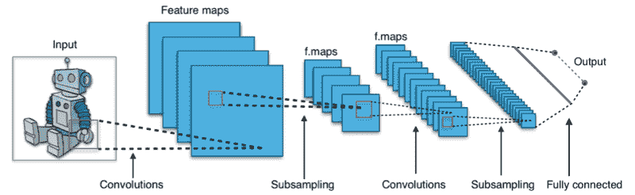
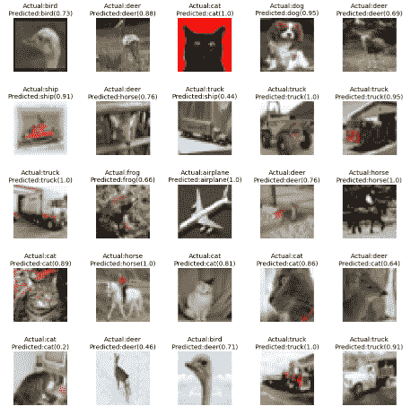
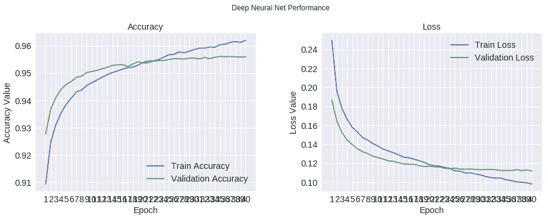
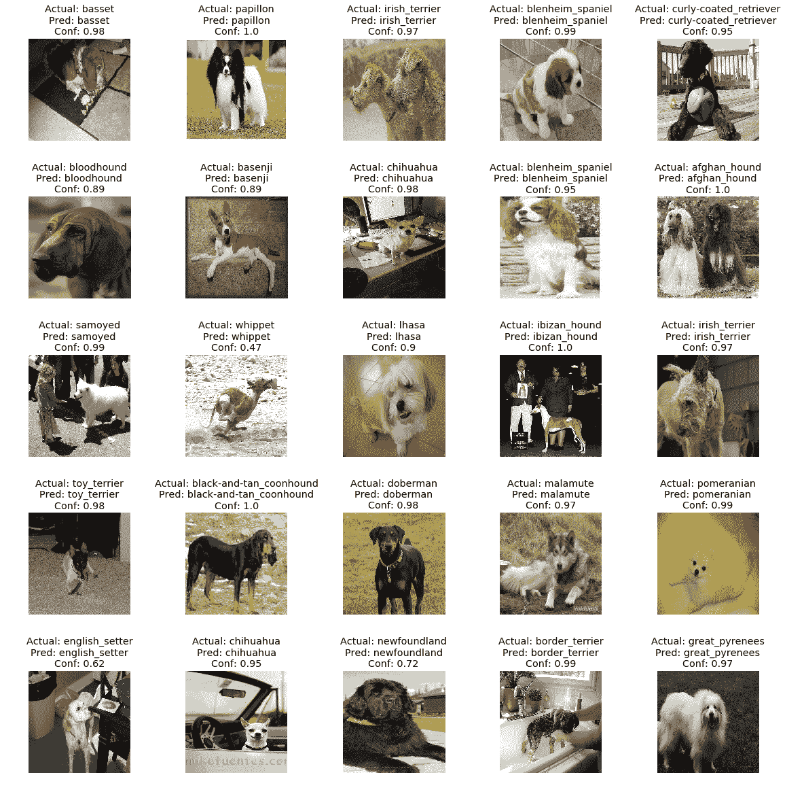
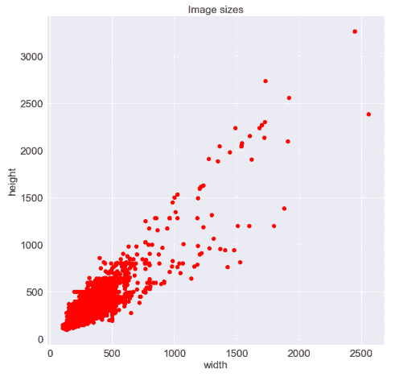
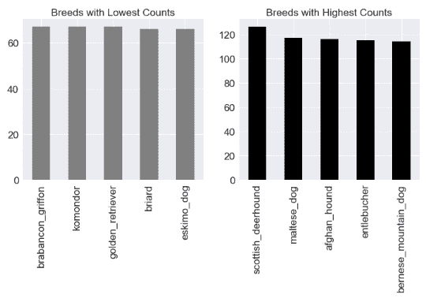
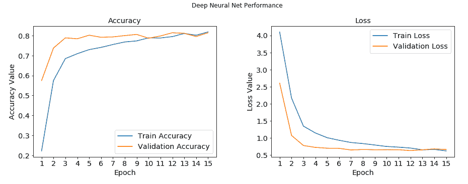
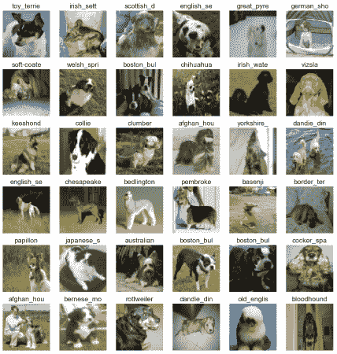

# 图像识别与分类

知识投资永远是最大的利益。

- 本杰明·富兰克林

在计算机视觉的保护下，图像识别是一个活跃的跨学科研究领域。 顾名思义，图像或对象识别是识别图像或视频序列中的对象的任务。 传统上，该领域利用数学和计算机辅助建模以及对象设计方面的进步。 这些年来，已经开发了一些手工注释的数据集，以测试和评估图像识别系统。 我们现在称它们为传统技术，一直统治着整个场景，并且不断地改进这项任务，直到最近。 2012 年，深度学习参加了 ImageNet 竞赛，为快速改善和进步计算机视觉和深度学习技术打开了闸门。

在本章中，我们将从深度学习（尤其是迁移学习）的角度介绍图像识别和分类的概念。 本章将涵盖以下方面：

*   深度学习图像分类简介
*   基准数据集
*   最新的深度图像分类模型
*   图像分类和迁移学习用例

本章从本书的第三部分开始。 在本书的这一部分中，我们将涵盖涉及前两部分中讨论的概念和技术的案例研究。 这些用例将呈现现实世界的主题/研究领域，并帮助您了解如何在不同的环境中利用迁移学习。 您可以在 [GitHub 存储库](https://github.com/dipanjanS/hands-on-transfer-learning-with-python)中的`Chapter 6`文件夹中快速阅读本章的代码。 可以根据需要参考本章。

# 基于深度学习的图像分类

**卷积神经网络**（**CNN**）是这项深度学习革命的核心，旨在改善图像分类任务。 CNN 是处理图像数据的专用神经网络。 作为快速补充，CNN 可以通过它们共享的权重架构帮助我们推断出位移和空间不变特征，并且基本上是前馈网络的变体。 在第 3 章，*了解深度学习架构*和第 5 章，*中，我们已经详细介绍了 CNN 的基础知识。* 。 在继续进行之前，我们鼓励读者快速复习以更好地理解。 下图展示了运行中的典型 CNN：



典型的 CNN，[来自这个页面](https://en.wikipedia.org/wiki/File:Typical_cnn.png)

神经网络最早出现在 2011 年的图像分类竞赛中。受 GPU 训练的网络开始赢得竞赛。 在 2012 年，深层的 CNN 在 ImageNet 图像分类任务上的表现从以前的最好水平提高到 83％，这是世界上第一次注意到。 结果令人惊讶，足以引起全球关注，并有助于通过深度学习解决用例的泛滥。

# 基准数据集

图像分类，或就此而言，任何分类任务，本质上都是监督学习任务。 受监督的任务通过可用的基础培训集了解不同的类别。

即使 CNN 是共享权重的优化前馈网络，但要在深层 ConvNet 中训练的参数数量可能仍然很大。 这就是为什么需要大量的培训才能获得性能更好的网络的原因之一。 幸运的是，全球研究小组一直在努力收集，手工注释和众包不同的数据集。 这些数据集可用于对不同算法的性能进行基准测试，以及识别不同比赛中的获胜者。

以下是图像分类领域中广泛接受的基准数据集的简要列表：

*   **ImageNet**：这是一个具有黄金标准的可视数据集，具有超过 1400 万个带有手工注释的高分辨率彩色图像，涵盖了 20,000 个类别。 它是 2009 年由普林斯顿大学计算机科学系设计用于视觉对象识别任务的。此后，此数据集（在其 1000 个非重叠类的修整版本中）已用作 [*ImageNet 大规模视觉识别挑战*](https://arxiv.org/abs/1409.0575)的基础。
*   **8000 万个微小图像数据集**：顾名思义，该 MIT 数据集包含从互联网收集的 8000 万个图像，并标记了 75,000 多个不同的非抽象英语名词。 该数据集还为其他广泛使用的数据集（包括 CIFAR 数据集）奠定了基础。
*   **CIFAR-10**：由加拿大高级研究所开发，CIFAR-10 是**机器学习**（**ML**）研究中使用最广泛的数据集之一。 该数据集包含 60,000 张横跨 10 个非重叠类的低分辨率图像。
*   **CIFAR-100**：来自同一研究组，该数据集包含 60,000 张图像，均匀分布在 100 个不同的类别中。
*   **上下文中的公共对象**：**上下文中的公共对象**（**COCO**）是用于对象标识，分段和字幕的大型可视数据库。 该数据集包含超过 200,000 张跨越不同类别的标记图像。
*   **打开的图像**：这可能是最大的可用注释数据集之一。 该数据集的版本 4 包含超过 900 万个带批注的图像。
*   **Caltech 101 和 Caltech 256**：这些数据集包含分别跨越 101 和 256 个类别的带注释的图像。 加州理工学院 101 包含约 9,000 张图像，而加州理工学院 256 包含近 30,000 张图像。
*   **斯坦福犬数据集**：这是一个有趣的数据集，特定于不同的犬种。 它包含 20,000 个彩色图像，涵盖 120 个不同的犬种。
*   **MNIST**：MNIST 是有史以来最著名的视觉数据集之一，已成为 ML 爱好者的事实上的 *Hello，World* 数据集。 它包含超过 60,000 个手工标记的数字（零到九个数字）。

上面的列表仅是冰山一角。 还有许多其他数据集可以捕获世界的不同方面。 准备这些数据集是一个痛苦且耗时的过程，但是这些数据集使深度学习在当前形式下如此成功。 鼓励读者详细研究这些和其他此类数据集，以了解它们背​​后的细微差别以及这些数据集为我们解决的挑战。 在本章和后续章节中，我们将利用其中的一些数据集来理解迁移学习的概念。

# 最新的深度图像分类模型

多年来，深度学习已引起了广泛的关注和炒作。 不足为奇的是，在全球范围内以深度学习为中心的知名竞赛，会议和期刊上共享了大量研究工作。 尤其是图像分类体系结构已经引起人们的关注，这几年来，定期进行迭代改进一直是人们关注的重点。 让我们快速了解一些性能最佳，最流行的最新深度图像分类体系结构：

*   **AlexNet**：这是可以归功于*打开闸门*的网络。 由深度学习的先驱之一 Geoffrey Hinton 和团队设计，该网络将前五名的错误率降低到了 15.3％。 它也是最早利用 GPU 加快学习过程的架构之一。
*   **VGG-16**：牛津大学视觉几何小组的网络是性能最好的体系结构之一，广泛用于对其他设计进行基准测试。 VGG-16 采用了一个简单的体系结构，该体系结构是基于 3 x 3 个卷积层（一个 16 层）相互堆叠，然后是一个最大池化层，以实现强大的性能。 该模型由稍微更复杂的模型 **VGG19** 继承。
*   **初始**：也称为 **GoogleNet** ，该网络是在 **ImageNet 大规模视觉识别挑战赛**（**ILSVRC**）在 2014 年实现了前五名的错误率为 6.67％。 它是最早实现接近人类性能的体系结构之一。 该网络背后的新颖之处在于使用了起始层，该起始层包括了在同一级别将不同大小的内核连接在一起的过程。
*   **ResNet**：由 Microsoft Research Asia 引入，**残留网络**（**ResNet**）是一种新颖的体系结构，利用批处理规范化和跳过连接来实现前五位的错误率 只有 3.57％。 它比诸如 VGG 之类的简单体系结构要深很多（152 层）并且要复杂得多。
*   **MobileNet**：尽管大多数架构都在竞争中胜过其他架构，但每个新的复杂网络都需要更多的计算能力和数据资源。 MobileNet 偏离了此类架构，并被设计为适用于移动和嵌入式系统。 该网络利用了一种新颖的思想，即使用深度可分离卷积来减少训练网络所需的参数总数。

我们提供了基于深度学习的图像分类空间中一些最新架构的快速概述和概述。 有关详细讨论，读者可以查看第 3 章，*了解深度学习架构*中的*卷积神经网络*部分。

# 图像分类与迁移学习

到目前为止，我们已经讨论了什么是图像分类。 在本节中，我们将通过构建自己的分类器来弄清手。 在本章的较早部分中，我们简要提到了著名的基准测试数据集，包括 CIFAR-10 和 Stanford Dogs 数据集，我们将在接下来的部分中重点介绍这些数据集。 我们还将利用预先训练的模型来了解我们如何利用迁移学习来改进我们的模型。

# CIFAR-10

**CIFAR-10** 是深度学习领域中使用最广泛的图像数据集之一。 由加拿大高级研究所准备，这是一个相当不错的数据集。 该数据集的主要优点是它包含 10 个非重叠类别的平衡分布。 图像的分辨率和尺寸较低，因此可以将数据集用于在较小的内存占用量系统上进行训练。

# 建立图像分类器

CIFAR-10 是少数可用的平衡数据集之一。 它的整体大小为 60,000 张图像。 以下代码段加载 CIFAR-10 数据集，并设置训练变量和测试变量：

```py
# load CIFAR dataset 
(X_train, y_train), (X_test, y_test) = cifar10.load_data() 
```

数据集中的图像分辨率很低，有时甚至很难贴上标签。 IPython Notebook `CIFAR-10_CNN_Classifier.ipynb`中提供了本节中共享的代码。

我们已经讨论了 CNN 以及如何针对视觉数据集对其进行优化。 CNN 遵循权重分配原则以减少参数数量； 从头开始开发它们不仅需要强大的深度学习技能，还需要巨大的基础架构需求。 牢记这一点，从头开始开发 CNN 并测试我们的技能将很有趣。

以下代码片段展示了使用 Keras 构建的非常简单的 CNN，它只有五层（两层卷积，一层最大池化，一层密集和一层最终 softmax 层）：

```py
model = Sequential() 
model.add(Conv2D(16, kernel_size=(3, 3), 
                activation='relu', 
input_shape=INPUT_SHAPE)) 

model.add(Conv2D(32, (3,3), padding='same',  
kernel_regularizer=regularizers.l2(WEIGHT_DECAY), 
                                   activation='relu')) 
model.add(BatchNormalization()) 
model.add(MaxPooling2D(pool_size=(2,2))) 
model.add(Dropout(0.2)) 

model.add(Flatten()) 
model.add(Dense(128, activation='relu')) 
model.add(Dropout(0.5)) 
model.add(Dense(NUM_CLASSES, activation='softmax')) 
```

为了提高总体泛化性能，该模型还包含`BatchNormalization`层和`DropOut`层。 这些层有助于我们控制过拟合，还可以防止网络存储数据集本身。

我们仅用 25 个纪元来运行模型，以在验证集上达到约 65％的准确性。 以下屏幕快照显示了训练后的模型的输出预测：



来自基于 CNN 的 CIFAR-10 分类器的预测

尽管绝不是最先进的结果，但结果足够不错。 读者应该记住，这个 CNN 只是为了展示手头的巨大潜力，我们鼓励您尝试在同一行上进行实验。

# 传播知识

由于本章和书着重于迁移学习，因此让我们快速进行利用和转移所学信息的实际任务。 在上一节中，我们讨论了不同的最新 CNN 架构。 现在，让我们利用在 ImageNet 上训练的 VGG-16 模型对 CIFAR-10 数据集中的图像进行分类。 该部分的代码在 IPython Notebook `CIFAR10_VGG16_Transfer_Learning_Classifier.ipynb`中可用。

ImageNet 是一个庞大的视觉数据集，具有 20,000 多个不同类别。 另一方面，CIFAR-10 仅限于 10 个非重叠类别。 像 VGG-16 这样的强大网络需要巨大的计算能力和时间来训练，以达到比人类更好的表现。 这将迁移学习带入了画面。 由于我们大多数人都无法访问无限的计算，因此我们可以在两种不同的设置下利用这些网络：

*   使用经过预训练的最新网络作为特征提取器。 这是通过删除顶部分类层并使用倒数第二层的输出来完成的。
*   在新数据集上微调最新的网络。

我们将利用 VGG-16 作为特征提取器，并在其之上构建自定义分类器。 以下代码段加载并准备了 CIFAR-10 数据集以供使用：

```py
# extract data 
(X_train, y_train), (X_test, y_test) = cifar10.load_data() 

#split train into train and validation sets 
X_train, X_val, y_train, y_val = train_test_split(X_train,  
                                                  y_train,  
                                                  test_size=0.15,  
                                                  stratify=np.array    
                                                            (y_train),  
                                                  random_state=42) 

# perform one hot encoding 
Y_train = np_utils.to_categorical(y_train, NUM_CLASSES) 
Y_val = np_utils.to_categorical(y_val, NUM_CLASSES) 
Y_test = np_utils.to_categorical(y_test, NUM_CLASSES) 

# Scale up images to 48x48 
X_train = np.array([sp.misc.imresize(x,  
                                     (48, 48)) for x in X_train]) 
X_val = np.array([sp.misc.imresize(x,  
                                   (48, 48)) for x in X_val]) 
X_test = np.array([sp.misc.imresize(x,  
                                    (48, 48)) for x in X_test]) 
```

前面的代码片段不仅将训练数据集拆分为训练集和验证集，还将目标变量转换为单热编码形式。 我们还将图像尺寸从 32 x 32 调整为 48 x 48，以符合 VGG-16 输入要求。 训练，验证和测试数据集准备就绪后，我们可以朝着准备分类器的方向努力。

以下代码段显示了我们如何轻松地在现有模型之上附加新层。 因为我们的目标是仅训练分类层，所以通过将可训练参数设置为`False`冻结其余层。 这使我们即使在功能较弱的基础架构上也可以利用现有架构，并将学到的权重从一个域转移到另一个域：

```py
base_model = vgg.VGG16(weights='imagenet',  
include_top=False,  
input_shape=(48, 48, 3)) 

# Extract the last layer from third block of vgg16 model 
last = base_model.get_layer('block3_pool').output 

# Add classification layers on top of it 
x = GlobalAveragePooling2D()(last) 
x= BatchNormalization()(x) 
x = Dense(64, activation='relu')(x) 
x = Dense(64, activation='relu')(x) 
x = Dropout(0.6)(x) 
pred = Dense(NUM_CLASSES, activation='softmax')(x) 
model = Model(base_model.input, pred) 

for layer in base_model.layers: 
layer.trainable = False 
```

我们有基本的成分。 整个流水线中剩下的最后一块是数据扩充。 整个数据集仅包含 60,000 张图像； 数据扩充非常方便，可以为手头的样本集添加某些变化。 这些变体使网络能够学习比其他方法更通用的功能。 以下代码段利用`ImageDataGenerator()`实用工具准备训练和验证增强对象：

```py
# prepare data augmentation configuration 
train_datagen = ImageDataGenerator(rescale=1\. / 255, 
                                   horizontal_flip=False) 

train_datagen.fit(X_train) 
train_generator = train_datagen.flow(X_train, 
                                     Y_train,  
                                     batch_size=BATCH_SIZE) 

val_datagen = ImageDataGenerator(rescale=1\. / 255,  
                                 horizontal_flip=False) 

val_datagen.fit(X_val) 
val_generator = val_datagen.flow(X_val, 
                                 Y_val, 
                                 batch_size=BATCH_SIZE) 
```

现在让我们训练模型几个时期并衡量其性能。 以下代码段调用`fit_generator()`函数将新添加的层训练到模型中：

```py
train_steps_per_epoch = X_train.shape[0] // BATCH_SIZE 
val_steps_per_epoch = X_val.shape[0] // BATCH_SIZE 

history = model.fit_generator(train_generator, 
                              steps_per_epoch=train_steps_per_epoch, 
                              validation_data=val_generator, 
                              validation_steps=val_steps_per_epoch, 
                              epochs=EPOCHS, 
                              verbose=1) 

```

`fit_generator()`返回的历史对象包含有关每个时期的详细信息。 我们利用这些来绘制模型在精度和损失方面的整体性能。 结果如下所示：



火车验证性能

如我们所见，与从头开始开发的模型相比，迁移学习帮助我们在整体性能上实现了惊人的提升。 这项改进利用了训练有素的 VGG-16 权重将学习到的功能转移到该域。 读者可以使用相同的实用程序`plot_predictions()`可视化随机样本上的分类结果，如以下屏幕截图所示：


使用基于 VGG-16 的迁移学习构建的分类器的预测结果

神经网络是相当复杂的学习机器，很难调试和优化。 尽管有许多可用的技术，但需要经验来微调网络。 在当前情况下，使用像 VGG-16 这样的深层 CNN 可能对如此小尺寸的图像来说是过大的杀伤力，但它显示了巨大的潜力。 明智地使用它！

这是迁移学习的快速简单的应用，其中我们利用了像 VGG-16 这样令人惊讶的复杂深度 CNN 来准备 CIFAR-10 分类器。 鼓励读者不仅尝试定制分类器的不同配置，而且尝试甚至使用不同的预训练网络来理解所涉及的复杂性。

# 狗品种鉴定数据集

在上一节中，我们利用低分辨率图像数据集将图像分类为 10 个非重叠类别。 这绝非易事，但我们以最小的努力获得了不错的性能。

现在让我们升级游戏，并使图像分类的任务更加令人兴奋。 在本节中，我们将专注于细粒度图像分类的任务。 与常规图像分类任务不同，细粒度图像分类是指识别更高级别类别中不同子类别的任务。

为了更好地理解此任务，我们将围绕[**斯坦福犬**数据集](http://vision.stanford.edu/aditya86/ImageNetDogs/)进行讨论。 顾名思义，该数据集包含不同犬种的图像。 在这种情况下，任务是识别每种犬种。 因此，高级概念是狗本身，而任务是正确分类不同的子概念或子类（在这种情况下为品种）。 该数据集包含来自 ImageNet 数据集的 20,000 个带有标签的图像，该图像集由 120 个不同的犬种组成。 为了便于讨论，我们将利用 **Kaggle** 提供的数据集。 [该数据集位于以下链接中](https://www.kaggle.com/c/dog-breed-identification/data)。

让我们开始构建狗分类器的任务。 但是，在实际模型之前，让我们对数据集本身进行快速探索性分析，以更好地理解。

# 探索性分析

我们不能足够强调理解底层数据集的重要性。 在当前情况下，我们正在处理一个视觉数据集，该数据集由 10,000 个样本组成，分布在 120 个类别（狗的品种）中。 读者可以在名为`dog_breed_eda.ipynb`的 IPython Notebook 中参考与探索性分析有关的所有步骤。

由于这是一个可视数据集，因此我们首先将数据集中的一些样本可视化。 有多种方法可以在 Python 中提取和可视化图像数据。 我们将依靠 SciPy 和与 matplotlib 相关的实用程序来做到这一点。 以下代码片段导入所需的库：

```py
In [1]: import os 
   ...: import scipy as sp 
   ...: import numpy as np 
   ...: import pandas as pd 
   ...: 
   ...: import PIL 
   ...: import scipy.ndimage as spi 
   ...: 
   ...: import matplotlib.pyplot as plt 
   ...: import seaborn as sns 
   ...: 
   ...:np.random.seed(42)   
```

由于数据集很大，因此我们准备了几个实用程序来加载随机的图像批处理并显示选定的批处理。 实用程序的标题为`load_batch()`和`plot_batch()`； 这些细节在 IPython Notebook 中可用。 以下代码段绘制了随机批次以供参考：

```py
In [7]:batch_df = load_batch(dataset_df,  
   ...:                       batch_size=36) 

In [8]:plot_batch(batch_df, grid_width=6, grid_height=6 
   ...:           ,im_scale_x=64, im_scale_y=64) 
```

生成的输出如下网格所示：



狗品种识别数据集的样本图像

从前面的网格中，我们可以看到在分辨率，照明，缩放级别等方面存在很多变化，并且图像不仅包含一只狗，而且还包含其他狗和周围环境。 项目。 我们还需要了解图像尺寸的差异。 使用以下代码段，我们生成了一个散点图来理解它们：

```py
 In [12]: plt.plot(file_dimension_list[:, 0], 
                   file_dimension_list[:, 1], "ro") 
    ...: plt.title("Image sizes") 
    ...: plt.xlabel("width") 
    ...: plt.ylabel("height") 
```

生成的散点图如下所示。 我们可以清楚地看到最大图像数量在 500 x 500 尺寸之内，但是形状确实有所不同：



图像大小的散点图

还需要检查狗的品种分布，以了解我们正在处理什么。 由于我们具有标记的数据集，因此我们可以轻松地进行检查。 以下代码段使用`pandas`绘制品种分布：

```py
 In [13]: fig = plt.figure(figsize = (12,5)) 
    ...: 
    ...: ax1 = fig.add_subplot(1,2, 1) 
    ...:dataset_df.breed.value_counts().tail().plot('bar', 
    ...:                   ax=ax1,color='gray', 
    ...:                      title="Breeds with Lowest Counts") 
    ...: 
    ...: ax2 = fig.add_subplot(1,2, 2) 
    ...:dataset_df.breed.value_counts().head().plot('bar', 
    ...:                ax=ax2,color='black', 
    ...:                   title="Breeds with Highest Counts") 
```

数据集没有被平均分割； 与其他品种相比，某些品种的样本更多。 从下图中的图可以明显看出：



最高和最低犬种样本数

这样的数据集需要彻底的探索。 我们已经在本节中介绍了一些探索性步骤。 进一步的步骤在引用的 IPython Notebook 中列出/执行。 鼓励读者逐步了解图像大小调整的影响，不同图层如何检测不同特征，灰度等。

# 资料准备

探索性分析有助于我们更好地了解手头的数据集。 下一个任务是为数据集构建一个实际的分类器。 众所周知，对于任何分类问题，第一步都是将数据集分为训练集和验证集。 由于我们正在使用 Keras，因此我们将从其实用程序中获取帮助以帮助准备我们的数据集。 以下代码段展示了将原始数据集组织为训练集和验证集的过程：

```py
# Prepare column to store image path 
data_labels['image_path'] = data_labels.apply(  
                                            lambda row: (train_folder +  
                                            row["id"] +  ".jpg" ),  
                                            axis=1) 
# load image data as arrays of defined size 
train_data = np.array([img_to_array(load_img(img, target_size=(299,       
                                                               299))) 
                           for img in data_labels['image_path'].values.tolist() 
                      ]).astype('float32') 

# split data into train and test 
x_train, x_test, y_train, y_test = train_test_split(train_data,  
                                                    target_labels,  
                                                    test_size=0.3,  
                                               stratify=np.array(target_labels),  
                                                    random_state=42) 

# split train dataset into train and validation sets 
x_train, x_val, y_train, y_val = train_test_split(x_train,  
                                                  y_train,  
                                                  test_size=0.15,  
                                                  stratify=
                                                    np.array(y_train),  
                                                  random_state=42) 

```

前面显示的第一步是准备标签`dataframe`中的派生列以保存实际图像路径。 然后，我们继续简单地将数据集分为训练，验证和测试数据集。 下一步是在将标签输入模型之前，将标签快速转换为一次性编码形式。 以下代码段准备了目标变量的一键编码形式：

```py
y_train_ohe = pd.get_dummies(y_train.reset_index(
                                           drop=True)
                                              ).as_matrix() 
y_val_ohe = pd.get_dummies(y_val.reset_index(
                                           drop=True)
                                           ).as_matrix() 
y_test_ohe = pd.get_dummies(y_test.reset_index(
                                           drop=True)
                                           ).as_matrix() 
```

众所周知，深度学习算法需要大量数据。 在这种情况下，即使我们总共有 10,000 张图像，每个类别的计数也不是很大。 为了对此进行改进，我们执行增强。 简单来说，**数据增强**是利用策展的数据集通过生成现有数据点的变体来扩大自身的过程。 在这种情况下，我们利用`keras`中的`ImageDataGenerator`来扩充训练和验证数据集，如以下代码片段所示：

```py
# Create train generator. 
train_datagen = ImageDataGenerator(rescale=1./255, 
                                   rotation_range=30,  
                                   width_shift_range=0.2, 
                                   height_shift_range=0.2,  
                                   horizontal_flip = 'true') 

train_generator = train_datagen.flow(x_train,  
                                     y_train_ohe,  
                                     shuffle=False,  
                                     batch_size=BATCH_SIZE,  
                                     seed=1) 

# Prepare Validation data augmentation 
val_datagen = ImageDataGenerator(rescale = 1./255) 
val_generator = train_datagen.flow(x_val,  
                                   y_val_ohe,  
                                   shuffle=False,  
                                   batch_size=BATCH_SIZE,  
                                   seed=1) 
```

现在我们已经准备好数据，下一步是准备实际的分类器。

# 使用迁移学习的狗分类器

现在我们的数据集已经准备好，让我们开始建模过程。 我们已经知道如何从头开始构建深度的卷积网络。 我们也了解达到良好性能所需的微调数量。 对于此任务，我们将利用迁移学习的概念。

预训练模型是开始进行迁移学习任务所需的基本要素。 如前几章所述，可以通过在当前任务上微调预训练网络的权重，或将预训练模型用作特征提取器，来利用迁移学习。

在这种用例中，我们将集中精力利用预训练的模型作为特征提取器。 众所周知，深度学习模型基本上是神经元相互连接的层的堆叠，最后一层充当分类器。 这种架构使深度神经网络能够捕获网络中不同级别的不同特征。 因此，我们可以利用此属性将它们用作特征提取器。 通过删除最后一层或使用倒数第二层的输出，可以做到这一点。 然后，将倒数第二层的输出馈送到其他一组层，然后是分类层。 以下代码段展示了基于 **InceptionV3** 预训练模型的特征提取，并堆叠了其他层以准备分类器：

```py
# Get the InceptionV3 model so we can do transfer learning 
base_inception = InceptionV3(weights='imagenet',  
                             include_top = False,  
                             input_shape=(299, 299, 3)) 

# Add a global spatial average pooling layer 
out = base_inception.output 
out = GlobalAveragePooling2D()(out) 
out = Dense(512, activation='relu')(out) 
out = Dense(512, activation='relu')(out) 
total_classes = y_train_ohe.shape[1] 

predictions = Dense(total_classes,  
                    activation='softmax')(out) 
```

如前面的代码片段所示， **Keras** 提供了用于处理许多预训练模型的简单实用程序，将它们用作特征提取器就像将标志`include_top`设置为`False`一样简单。 在下面的代码片段中，我们通过将两组图层堆叠在一起，然后冻结 InceptionV3 中的图层来准备最终模型：

```py
model = Model(inputs=base_inception.input,  
              outputs=predictions) 

# only if we want to freeze layers 
for layer in base_inception.layers: 
    layer.trainable = False 
```

现在，我们有了模型，所有模型都将在“狗品种识别”数据集中进行训练。 我们使用`fit_generator()`方法训练模型，以利用上一步中准备的数据增强。 我们将批次大小设置为 32，并训练模型 13 个纪元。 以下代码片段设定了滚动的方向：

```py
batch_size = BATCH_SIZE 
train_steps_per_epoch = x_train.shape[0] // batch_size 
val_steps_per_epoch = x_val.shape[0] // batch_size 

history = model.fit_generator(train_generator, 
                              steps_per_epoch=train_steps_per_epoch, 
                              validation_data=val_generator, 
                              validation_steps=val_steps_per_epoch, 
                              epochs=15, 
                              verbose=1) 
```

由于我们在每个时期（`history`对象）之后都保存了模型参数和性能的输出，因此我们现在将利用它来了解模型性能。 下图绘制了模型的训练和测试精度以及其损失性能：



狗品种分类器性能

该模型在训练集和验证集上仅在 15 个时期内就获得了 **80%**  精度以上的可嘉性能。 右侧的图显示了损耗下降并收敛到 **0.5** 的速度。 这是一个很好的例子，说明了迁移学习的强大而简单。

训练和验证的性能相当不错，但是对看不见的数据的性能如何？ 由于我们已经将原始数据集分为三个单独的部分。 这里要记住的重要一点是，测试数据集必须经过与训练数据集相似的预处理。 为了解决这个问题，在将测试数据集输入到函数之前，我们还对它进行了缩放。

该模型在测试数据集上实现了惊人的 **85％准确度**以及 **0.85 F1 得分**。 鉴于我们仅用最少的投入就训练了 15 个纪元，迁移学习帮助我们实现了一个不错的分类器：



狗的品种分类器预测

上图显示了模型性能的视觉证明。 正如我们所看到的，在大多数情况下，该模型不仅可以预测正确的犬种，而且还可以非常有把握地进行预测。

# 摘要

在本书的前两个部分中，我们讨论了很多理论。 建立了强大的概念和技术基础后，我们在本章中开始了用例驱动的旅程。 本章是一系列后续章节中的第一章，这些章节将展示不同场景和领域中迁移学习的实际用例。 在本章中，我们将迁移学习应用于视觉对象识别或俗称**图像分类**的领域。

我们从围绕 CNN 的快速更新开始，并随着 2012 年深度学习模型的出现，计算机辅助对象识别的整个过程将一劳永逸。我们简要介绍了各种最新的图像分类模型 ，它已经超越了人类的表现。 我们还快速浏览了学术界和行业专家用于培训和调整模型的不同基准数据集。 设置上下文后，我们从 CIFAR-10 数据集开始。 我们使用 Keras 和 TensorFlow 作为后端从头开始构建了一个分类器。 我们利用 VGG-16 作为特征提取的预训练模型，利用迁移学习来改善此性能。

在本章的最后部分，我们利用迁移学习来解决稍微复杂的问题。 我们准备了一个犬种分类器，而不是基于类别不重叠的数据集（CIFAR-10），以基于 Stanford Dogs 数据集识别 120 种不同的犬种。 只需几行代码，我们就可以实现近乎最新的性能。 第二种用例也称为*细粒度图像分类*任务，并且比通常的图像分类任务复杂。 在本章中，我们展示了通过迁移学习获得惊人结果的强大功能和简便性。 在接下来的章节中，请继续关注来自计算机视觉，音频分析等领域的惊人用例。