# 音频事件识别与分类

在前面的章节中，我们已经研究了一些非常有趣的案例研究，这些案例将迁移学习应用于实际问题。 图像和文本数据是我们先前已解决的两种非结构化数据形式。 我们已经展示了各种方法来应用迁移学习来获得更强大和更出色的模型，以及解决诸如缺少训练数据之类的约束。 在本章中，我们将解决识别和分类音频事件的新现实问题。

为音频数据创建预训练的深度学习模型是一个巨大的挑战，因为我们没有高效的预训练的视觉模型（例如 VGG 或 Inception（适用于图像数据）或基于词嵌入的模型（如 Word2vec 或 GloVe）的优势） 文字数据）。 然后可能会出现一个问题，那就是我们对音频数据的策略是什么。 我们将在本章中探索一些创新方法，敬请期待！ 本章将涵盖以下主要方面：

*   了解音频事件分类
*   制定我们的现实问题
*   探索性音频事件分析
*   功能工程和音频事件的表示
*   带有迁移学习的音频事件分类
*   构建深度学习音频事件标识符

在本章中，我们将研究识别和分类音频事件的实际案例研究。 诸如音频特征工程，转换学习，深度学习和面向对象编程等概念将用于构建健壮的，自动化的音频事件标识符以进行分类。 您可以在 [GitHub 存储库](https://github.com/dipanjanS/hands-on-transfer-learning-with-python)中的`Chapter 8`文件夹中快速阅读本章的代码。 可以根据需要参考本章。

# 了解音频事件分类

到现在为止，您应该了解分类或分类的基本任务，在这里我们已经有了结构化或非结构化的数据，这些数据通常用特定的组或类别进行标记或注释。 自动分类的主要任务是建立一个模型，以便使用未来的数据点，我们可以根据各种数据属性或特征将每个数据点分类或记录为一种特定的类别。

在前面的章节中，我们已经研究了文本和图像的分类。 在本章中，我们将研究对音频事件进行分类。 音频事件基本上是通常由音频信号捕获的事件或活动的发生。 通常，短的音频片段用于表示音频事件，因为即使它们反复出现，声音通常也很相似。 但是，有时，可能会使用更长的音频剪辑来表示更复杂的音频事件。 音频事件的示例可能是儿童在操场上玩耍，警笛警报，狗吠等。 实际上，谷歌已经建立了一个名为 [**AudioSet**](https://research.google.com/audioset/index.html) 的海量数据集，它是带注释的音频事件的一个手动的大规模数据集，他们还发表了几篇有关音频事件识别和分类的论文。 我们将使用较小的数据集来解决问题，但有兴趣的读者一定应该查看这个庞大的数据集，其中包含 632 个音频事件类，其中包括从 YouTube 视频中提取的 208420 个人工标记的 10 秒声音剪辑的集合。

# 制定我们的现实问题

我们这里的实际案例研究的主要目标是音频事件的识别和分类。 这是一个监督学习问题，我们将在音频事件数据集上使用属于特定类别（它们是声音的来源）的音频数据样本进行处理。

我们将利用迁移学习和深度学习中的概念来构建可靠的分类器，从而在任何给定音频样本属于我们预定类别之一的情况下，我们都应该能够正确预测该声音的来源。 我们将使用的数据集通常被称为 [UrbanSound8K 数据集](https://urbansounddataset.weebly.com/)，并且具有 8,732 个带标签的音频声音文件（其持续时间通常等于或大于 4 秒），其中包含城市常见声音的摘录。 该数据集中的声音的十个类别如下：

*   `air_conditioner`
*   `car_horn`
*   `children_playing`

*   `dog_bark`
*   `drilling`
*   `engine_idling`
*   `gun_shot`
*   `jackhammer`
*   `siren`
*   `streen_music`

有关此数据集以及其他可能的数据集和计划的详细说明，我们建议读者访问 UrbanSound 网站，并查看创建者 J. Salamon，C。Jacoby 和 JP Bello 的这篇令人惊异的论文，[《数据集和城市声音研究分类法》](http://www.justinsalamon.com/uploads/4/3/9/4/4394963/salamon_urbansound_acmmm14.pdf)（22 届 ACM 国际多媒体国际会议，2014 年 11 月，美国奥兰多）。我们感谢他们，以及纽约大学**城市科学与进步中心**（**CUSP**）， 现实。

要获取数据，您需要在其网站上填写表格，然后您将通过电子邮件获得下载链接。 解压缩文件后，您应该能够看到十个文件夹（十折）中的所有音频文件，以及一个包含有关数据集更多详细信息的`readme`文件。

# 探索性音频事件分析

我们将遵循标准的工作流程，对音频数据进行模型的分析，可视化，建模和评估。 下载完所有数据后，您会注意到总共有十个文件夹包含`WAV`格式的音频数据样本。 我们还有一个元数据文件夹，其中包含`UrbanSound8K.csv`文件中每个音频文件的元数据信息。 您可以使用此文件为每个文件分配类标签，也可以了解文件命名术语以进行相同的操作。

每个音频文件都以特定格式命名。 该名称采用`[fsID]-[classID]-[occurrenceID]-[sliceID].wav`格式，其格式如下：

*   `[fsID]`：从中摘录该片段（片段）的录音的自由声音 ID
*   `[classID]`：声音类别的数字标识符
*   `[occurrenceID]`：数字标识符，用于区分原始录音中声音的不同出现
*   `[sliceID]`：数字标识符，用于区分同一事件中获取的不同片段

每个类标识符都是一个数字，可以映射到特定的类标签。 我们将在不久的将来对此进行更多的扩展。 让我们从对音频数据的一些基本探索性分析开始。 如果您想自己运行示例，可以从我们的 GitHub 存储库中引用`Exploratory Analysis Sound Data.ipynb` Jupyter 笔记本。

首先，我们加载以下依赖项，包括`librosa`模块，如果没有该模块，则可能需要安装：

```py
import glob 
import os 
import librosa 
import numpy as np 
import matplotlib.pyplot as plt 
from matplotlib.pyplot import specgram 
import pandas as pd 
import librosa.display 
import IPython.display 
import soundfile as sf 

%matplotlib inline 
```

`librosa`模块是用于音频和音乐分析的出色的开源 Python 框架。 我们建议读者更详细地检查该框架。 在接下来的部分中，我们将使用它来分析音频数据并从中提取特征。 现在让我们加载一个数据文件夹进行分析：

```py
files = glob.glob('UrbanSound8K/audio/fold1/*') 
len(files) 

873 
```

我们可以看到每个文件夹大致包含 870 多个音频样本。 现在，基于`metadata`和`readme`文件的信息，我们可以创建一个类 ID，以名称映射音频样本类别：

```py
class_map = {'0' : 'air_conditioner', '1' : 'car_horn',  
             '2' : 'children_playing', '3' : 'dog_bark',  
             '4' : 'drilling', '5' : 'engine_idling',  
             '6' : 'gun_shot', '7' : 'jackhammer',  
             '8' : 'siren', '9' : 'street_music'} 
pd.DataFrame(sorted(list(class_map.items()))) 
```

现在让我们从属于这些类别的每个类别中抽取十个不同的音频样本，以进行进一步分析：

```py
samples = [(class_map[label], 
           [f for f in files if f.split('-')[1] == label][0]) 
                                       for label in class_map.keys()] 
samples 

[('street_music', 'UrbanSound8K/audio/fold1\108041-9-0-11.wav'), 
 ('engine_idling', 'UrbanSound8K/audio/fold1\103258-5-0-0.wav'), 
 ('jackhammer', 'UrbanSound8K/audio/fold1\103074-7-0-0.wav'), 
 ('air_conditioner', 'UrbanSound8K/audio/fold1\127873-0-0-0.wav'), 
 ('drilling', 'UrbanSound8K/audio/fold1\14113-4-0-0.wav'), 
 ('children_playing', 'UrbanSound8K/audio/fold1\105415-2-0-1.wav'), 
 ('gun_shot', 'UrbanSound8K/audio/fold1\102305-6-0-0.wav'), 
 ('siren', 'UrbanSound8K/audio/fold1\106905-8-0-0.wav'), 
 ('car_horn', 'UrbanSound8K/audio/fold1\156194-1-0-0.wav'), 
 ('dog_bark', 'UrbanSound8K/audio/fold1\101415-3-0-2.wav')] 
```

现在我们有了示例数据文件，在执行任何分析之前，我们仍然需要将音频数据读入内存。 我们注意到`librosa`对某些音频文件抛出了错误（因为它们的长度或采样率很短）。 因此，我们利用`soundfile` Python 框架读取音频文件，以获取其原始数据和原始采样率。 您可以在此处获取[有关`soundfile`框架的更多信息](https://pypi.org/project/SoundFile/)。

音频采样率定义为每秒传输的音频采样数，通常以 Hz 或 kHz（1 kHz 为 1,000 Hz）为单位。 `librosa`的默认采样率为 22,050 Hz，这是我们将重新采样所有音频数据以保持一致性的方式。 以下代码可帮助我们读取数据，并显示原始音频数据的总长度：

```py
def get_sound_data(path, sr=22050): 
data, fsr = sf.read(path) 
data_22k = librosa.resample(data.T, fsr, sr) 
if len(data_22k.shape) > 1: 
    data_22k = np.average(data_22k, axis=0) 
    return data_22k, sr 

sample_data = [(sample[0], get_sound_data(sample[1])) for sample in 
                samples] 
[(sample[0], sample[1][0].shape) for sample in sample_data] 

```

```py
[('street_music', (88200,)), ('engine_idling', (88200,)), 
 ('jackhammer', (88200,)), ('air_conditioner', (44982,)), 
 ('drilling', (88200,)), ('children_playing', (88200,)), 
 ('gun_shot', (57551,)), ('siren', (88200,)), 
 ('car_horn', (5513,)), ('dog_bark', (88200,))] 
```

很明显，大多数音频采样的持续时间约为四秒钟，但有些采样的持续时间却很短。 Jupyter 笔记本的魅力在于，您甚至可以将音频嵌入笔记本本身，并使用以下片段播放它。

对于`sample_data`中的数据：

```py
print(data[0], ':') 
IPython.display.display(IPython.display.Audio(data=data[1[0],rate=data[                                              1][1]))
```

这将创建以下内容：

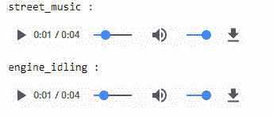

现在让我们通过绘制它们的波形来形象化这些不同的音频源的外观。 通常，这将是每个音频样本的波形幅度图：

```py
i = 1 
fig = plt.figure(figsize=(15, 6)) 
for item in sample_data: 
    plt.subplot(2, 5, i) 
    librosa.display.waveplot(item[1][0], sr=item[1][1], color='r',  
                             alpha=0.7) 
    plt.title(item[0]) 
    i += 1 
plt.tight_layout() 
```

创建的图将如下所示：

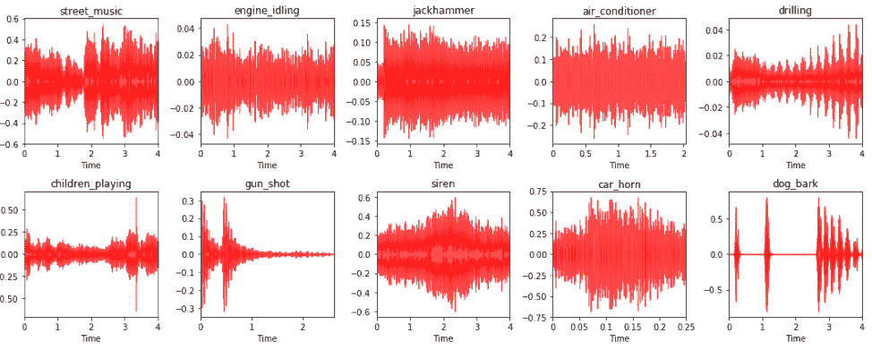

您可以在上图中清楚地看到不同的音频数据样本及其源标签和相应的音频波形图。 这描绘了一些有趣的见解。 `engine_idling`，`jackhammer`和`air_conditioner`等音源通常具有恒定的声音，不会随时间变化。 因此，您可以注意到波形中的振幅恒定。 `siren`和`car_horn`通常也具有恒定的音频波形，并具有间歇性的幅度增加。`gun_shot`通常在开始时会发出很大的声音，然后保持沉默。 `dog_bark`间歇地进入。 因此，除了静音以外，声音还具有短的高振幅间隔。 您还能找到更多有趣的模式吗？

音频数据的另一种有趣的可视化技术是声谱图。 通常，声谱图是一种视觉表示技术，用于表示音频数据中的频谱。 它们也被普遍称为**超声检查仪**和**语音图**。 让我们将音频样本可视化为频谱图：

```py
i = 1 
fig = plt.figure(figsize=(15, 6)) 

for item in sample_data: 
    plt.subplot(2, 5, i) 
    specgram(item[1][0], Fs=item[1][1]) 
    plt.title(item[0]) 
    i += 1 
plt.tight_layout() 
```

频谱图显示如下：

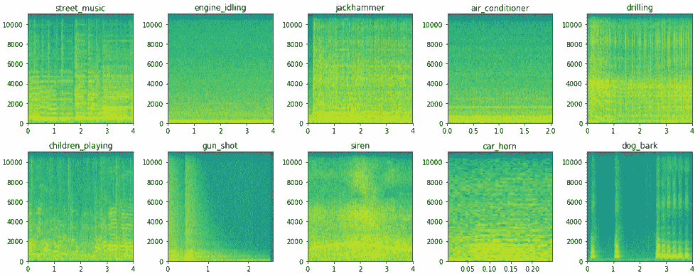

我们可以看到如何用频谱图将音频数据表示为很好的图像表示形式，这对于像**卷积神经网络**（**CNN**）这样的模型很有用，因为可以肯定地看到不同音频源在声谱图中存在明显差异。 但是，我们将使用梅尔谱图，它通常比基本谱图更好，因为它代表了梅尔标度的谱图。 名称 **mel** 来自单词 *melody*。 这表明比例尺基于音高比较。 因此，梅尔音阶是对音高的感知尺度，听众已将其判断为彼此之间的距离相等。 如果我们使用 CNN 从这些频谱图中提取特征，这将非常有用。 以下代码段描绘了梅尔频谱图：

```py
i = 1 
fig = plt.figure(figsize=(15, 6)) 
for item in sample_data: 
    plt.subplot(2, 5, i) 
    S = librosa.feature.melspectrogram(item[1][0], sr=item[1]   
    [1],n_mels=128) 
    log_S = librosa.logamplitude(S) 
    librosa.display.specshow(log_S, sr=item[1][1],   
    x_axis='time',y_axis='mel') 
    plt.title(item[0]) 
    plt.colorbar(format='%+02.0f dB') 
    i += 1 
plt.tight_layout()
```

梅尔频谱图显示如下：

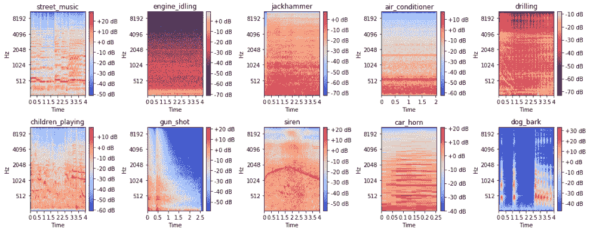

我们可以看到，借助梅尔音阶，可以更容易地根据音频源来区分频谱图。 现在，让我们集中讨论下一节中将用作特征工程基础资源的一些特定视觉技术。 首先，让我们看一下`gun_shot`音频样本作为梅尔频谱图的样子：

```py
y = sample_data[6][1][0] 
S = librosa.feature.melspectrogram(y, sr=22050, n_mels=128) 
log_S = librosa.logamplitude(S) 
plt.figure(figsize=(12,4)) 
librosa.display.specshow(log_S, sr=22050, x_axis='time', y_axis='mel') 
plt.colorbar(format='%+02.0f dB') 
```

频谱图显示如下：

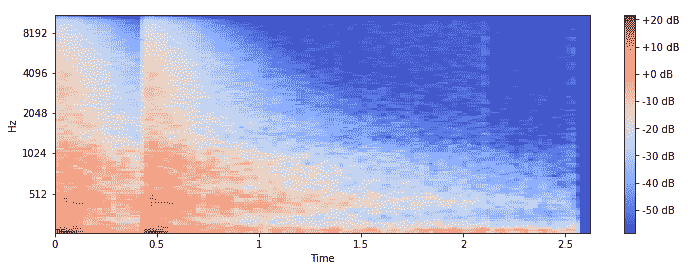

频谱图与该音频源的音频波形图一致。 音频的另一个有趣方面是，通常任何音频时间序列数据都可以分解为谐波和打击乐成分。 这些可以呈现任何音频样本的全新有趣的表示形式。 让我们获取这些组件并将它们绘制成频谱图：

```py
y_harmonic, y_percussive = librosa.effects.hpss(y) 
S_harmonic   = librosa.feature.melspectrogram(y_harmonic,sr=22050, 
                                              n_mels=128) 
S_percussive = librosa.feature.melspectrogram(y_percussive,sr=22050) 
log_Sh = librosa.power_to_db(S_harmonic) 
log_Sp = librosa.power_to_db(S_percussive) 

# Make a new figure 
plt.figure(figsize=(12,6)) 
plt.subplot(2,1,1) 
librosa.display.specshow(log_Sh, sr=sr, y_axis='mel') 
plt.title('mel power spectrogram (Harmonic)') 
plt.colorbar(format='%+02.0f dB') 
plt.subplot(2,1,2) 
librosa.display.specshow(log_Sp, sr=sr, x_axis='time', y_axis='mel') 
plt.title('mel power spectrogram (Percussive)') 
plt.colorbar(format='%+02.0f dB') 
plt.tight_layout() 
```

频谱图将显示如下：

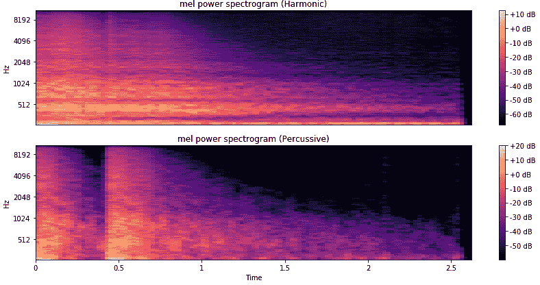

您可以看到音频样本的两个不同成分显示为两个独特的声谱图，分别描述了谐波成分和打击乐成分。

音频数据的另一个非常有趣的描述是使用一个色谱图，该图显示了基于十二种不同音高类别（即`{C, C#, D, D#, E, F, F#, G, G#, A, A#, B}`。 这是用于描述音频信号随时间变化的各种音调强度的出色视觉工具。 通常，在构建色谱图之前，会对原始音频信号执行傅立叶变换或 Q 变换：

```py
C = librosa.feature.chroma_cqt(y=y_harmonic, sr=sr) 
# Make a new figure 
plt.figure(figsize=(12, 4)) 
# Display the chromagram: the energy in each chromatic pitch class 
# as a function of time 
librosa.display.specshow(C, sr=sr, x_axis='time', y_axis='chroma', 
                         vmin=0, vmax=1) 
plt.title('Chromagram') 
plt.colorbar() 
plt.tight_layout() 
```

色谱图将显示如下：

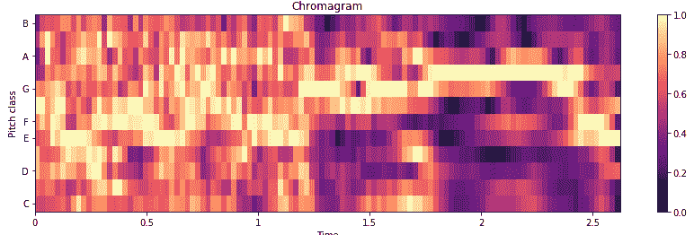

随着时间的推移，我们可以清楚地看到`gun_shot`音频样本的各种音调强度，这对于作为特征提取的基础图像肯定是有效的。 在下一节中，我们将使用其中一些技术进行特征提取。

# 功能工程和音频事件的表示

要构建可靠的分类模型，我们需要从原始音频数据中获得可靠且良好的特征表示。 我们将利用上一节中学到的一些技术进行要素工程。 如果您想自己运行示例，可以在`Feature Engineering.ipynb` Jupyter 笔记本中使用本节中使用的代码段。 我们将重用先前导入的所有库，并在此处利用`joblib`将功能保存到磁盘：

```py
from sklearn.externals import joblib 
```

接下来，我们将加载所有文件名，并定义一些实用程序函数以读取音频数据，还使我们能够获取音频子样本的窗口索引，我们将在短期内利用它们：

```py
# get all file names 
ROOT_DIR = 'UrbanSound8K/audio/' 
files = glob.glob(ROOT_DIR+'/**/*') 

# load raw audio data 
def get_sound_data(path, sr=22050): 
    data, fsr = sf.read(path) 
    data_resample = librosa.resample(data.T, fsr, sr) 
    if len(data_resample.shape) > 1: 
        data_resample = np.average(data_resample, axis=0) 
    return data_resample, sr 

# function to get start and end indices for audio sub-sample 
def windows(data, window_size): 
    start = 0 
    while start < len(data): 
        yield int(start), int(start + window_size) 
        start += (window_size / 2) 
```

我们将遵循的特征工程策略有些复杂，但是我们将在此处尝试以简洁的方式对其进行说明。 我们已经看到我们的音频数据样本的长度不同。 但是，如果我们要构建一个强大的分类器，则每个样本的功能必须保持一致。 因此，我们将从每个音频文件中提取（固定长度的）音频子样本，并从每个这些子样本中提取特征。

我们将总共使用三种特征工程技术来构建三个特征表示图，这最终将为我们的每个音频子样本提供一个三维图像特征图。 下图描述了我们将采用的工作流程：

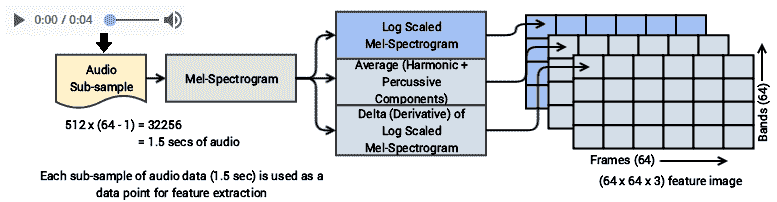

这个想法来自 Karol J. Piczak 的出色论文，[《具有卷积神经网络的环境声音分类》](https://ieeexplore.ieee.org/document/7324337/)（IEEE2015）。他将梅尔频谱图用于一般必要的特征，CNN 可以使用这些特征来进行特征提取。 但是，我们已经考虑了对最终特征图的一些其他转换。

第一步是将帧（列）的总数定义为 **64** ，将波段（行）的总数定义为 **64**，这形成了每个特征图的尺寸（`64 x 64`）。 然后，基于此，我们提取音频数据的窗口，从每个音频数据样本中形成子样本。

考虑每个音频子样本，我们首先创建一个梅尔声谱图。 由此，我们创建了一个对数缩放的梅尔频谱图，作为特征图之一，音频子样本的谐波分量和敲击分量的平均特征图（再次对数缩放），以及对数缩放的 mel 频谱图的增量或导数作为第三特征图。 这些特征图的每一个都可以表示为`64 x 64`图像，并且通过组合它们，我们可以为每个音频子样本获得尺寸为`(64, 64, 3)`的 3-D 特征图。 现在，为该工作流程定义函数：

```py
def extract_features(file_names, bands=64, frames=64): 
    window_size = 512 * (frames - 1)   
    log_specgrams_full = [] 
    log_specgrams_hp = [] 
    class_labels = [] 

    # for each audio sample 
    for fn in file_names: 
        file_name = fn.split('\')[-1] 
        class_label = file_name.split('-')[1] 
        sound_data, sr = get_sound_data(fn, sr=22050) 

        # for each audio signal sub-sample window of data 
        for (start,end) in windows(sound_data, window_size): 
            if(len(sound_data[start:end]) == window_size): 
                signal = sound_data[start:end] 

                # get the log-scaled mel-spectrogram 
                melspec_full = librosa.feature.melspectrogram(signal, 
                                                              n_mels = 
                                                                 bands) 
                logspec_full = librosa.logamplitude(melspec_full) 
                logspec_full = logspec_full.T.flatten()[:,np.newaxis].T 

                # get the log-scaled, averaged values for the  
                # harmonic and percussive components 
                y_harmonic, y_percussive =librosa.effects.hpss(signal) 
                melspec_harmonic =  
                         librosa.feature.melspectrogram(y_harmonic,   
                                                        n_mels=bands) 
                melspec_percussive =   
                        librosa.feature.melspectrogram(y_percussive,   
                                                       n_mels=bands) 
                logspec_harmonic = 
                       librosa.logamplitude(melspec_harmonic) 
                logspec_percussive = 
                       librosa.logamplitude(melspec_percussive) 
                logspec_harmonic = logspec_harmonic.T.flatten()[:, 
                                                          np.newaxis].T 
                logspec_percussive = logspec_percussive.T.flatten()[:,  
                                                          np.newaxis].T 
                logspec_hp = np.average([logspec_harmonic,  
                                        logspec_percussive],  
                                        axis=0) 
                log_specgrams_full.append(logspec_full) 
                log_specgrams_hp.append(logspec_hp) 
                class_labels.append(class_label) 

    # create the first two feature maps             
    log_specgrams_full = np.asarray(log_specgrams_full).reshape( 
                                        len(log_specgrams_full), bands,  
                                        frames, 1) 
    log_specgrams_hp = np.asarray(log_specgrams_hp).reshape( 
                                        len(log_specgrams_hp), bands,   
                                        frames, 1) 
    features = np.concatenate((log_specgrams_full,  
                               log_specgrams_hp,                                  
                               np.zeros(np.shape( 
                                      log_specgrams_full))),  
                               axis=3) 

    # create the third feature map which is the delta (derivative)    
    # of the log-scaled mel-spectrogram 
    for i in range(len(features)): 
        features[i, :, :, 2] = librosa.feature.delta(features[i,   
                                                              :, :, 0]) 
    return np.array(features), np.array(class_labels, dtype = np.int) 
```

现在我们准备使用此功能。 我们将在前面的工作流程中讨论的策略基础上，将其用于所有 8,732 音频样本，以从该数据的许多子样本中创建特征图。

```py
features, labels = extract_features(files) 
features.shape, labels.shape 
((30500, 64, 64, 3), (30500,)) 
```

我们从 8,732 个音频数据文件中总共获得了 30,500 个特征图。 这非常好，并且正如我们前面所讨论的，每个特征图都是尺寸`(64, 64, 3)`。 现在，基于以下 30,500 个数据点，查看音频源的整体类表示形式：

```py
from collections import Counter 
Counter(labels) 
Counter({0: 3993, 1: 913, 2: 3947, 3: 2912, 4: 3405, 
         5: 3910, 6: 336, 7: 3473, 8: 3611, 9: 4000}) 
```

我们可以看到，不同类别中数据点的总体分布是相当均匀和适当的。 对于诸如 1（`car_horn`）和 6（`gun_shot`）的某些类别，表示与其他类别相比非常低； 这是可以预期的，因为这些类别的音频数据持续时间通常比其他类别要短得多。 现在让我们继续可视化这些功能图：

```py
class_map = {'0' : 'air_conditioner', '1' : 'car_horn', '2' :  
            'children_playing','3' : 'dog_bark', '4' : 'drilling','5' : 
            'engine_idling','6' : 'gun_shot', '7' : 'jackhammer', '8' :  
            'siren', '9' : 'street_music'} 
categories = list(set(labels)) 
sample_idxs = [np.where(labels == label_id)[0][0] for label_id in 
               categories] 
feature_samples = features[sample_idxs] 

plt.figure(figsize=(16, 4)) 
for index, (feature_map, category) in enumerate(zip(feature_samples,  
                                                    categories)): 
    plt.subplot(2, 5, index+1) 
    plt.imshow(np.concatenate((feature_map[:,:,0],  
                               feature_map[:,:,1],    
                               feature_map[:,:,2]),  
                               axis=1),
                               cmap='viridis') 
    plt.title(class_map[str(category)]) 
plt.tight_layout() 
t = plt.suptitle('Visualizing Feature Maps for Audio Clips') 
```

功能图将显示如下：

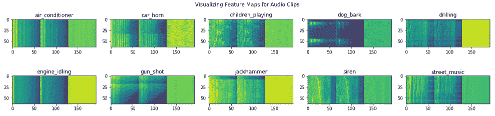

上图向我们展示了每个音频类别的一些示例特征图看起来是什么样的，并且显而易见的是，每个特征图都是三维图像。 现在，我们将这些基本功能保存到磁盘：

```py
joblib.dump(features, 'base_features.pkl') 
joblib.dump(labels, 'dataset_labels.pkl') 
```

这些基本功能将作为下一部分进一步功能设计的起点，在此我们将释放迁移学习的真正力量。

# 带有迁移学习的音频事件分类

现在，我们准备开始构建音频事件分类器。 我们有基本的特征图，但仍然需要做更多的特征工程。 您始终可以从头开始构建 CNN 以摄取这些图像，然后将其连接到完全连接的深**多层感知器**（**MLP**）来构建分类器。 但是，在这里，我们将通过使用一种预训练的模型进行特征提取来利用迁移学习的力量。 更具体地说，我们将使用 VGG-16 模型作为特征提取器，然后在这些特征上训练完全连接的深度网络。

# 从基本要素构建数据集

第一步是加载基本功能，并创建训练，验证和测试数据集。 为此，我们需要从磁盘加载基本功能和标签：

```py
features = joblib.load('base_features.pkl') 
labels = joblib.load('dataset_labels.pkl') 
data = np.array(list(zip(features, labels))) 
features.shape, labels.shape 

((30500, 64, 64, 3), (30500,)) 
```

现在，我们将随机整理数据并创建训练，验证和测试数据集：

```py
np.random.shuffle(data) 
train, validate, test = np.split(data, [int(.6*len(data)),int(.8*len(data))]) 
train.shape, validate.shape, test.shape 

((18300, 2), (6100, 2), (6100, 2)) 
```

最后，我们还可以使用以下代码段检查每个数据集中的每类分布：

```py
print('Train:', Counter(item[1] for item in train),'nValidate:', Counter(item[1] for item in validate),'nTest:',Counter(item[1] for item 
        in test)) 

Train: Counter({9: 2448, 2: 2423, 0: 2378, 5: 2366, 8: 2140,  
                7: 2033, 4: 2020, 3: 1753, 1: 542, 6: 197})  
Validate: Counter({0: 802, 5: 799, 2: 774, 9: 744, 8: 721,  
                   7: 705, 4: 688, 3: 616, 1: 183, 6: 68})  
Test: Counter({0: 813, 9: 808, 2: 750, 8: 750, 5: 745, 7: 735,  
               4: 697, 3: 543, 1: 188, 6: 71}) 
```

因此，我们可以看到整个数据集中每个类的数据点一致且均匀地分布。

# 迁移学习以进行特征提取

现在来了有趣的部分。 我们准备利用迁移学习从基本要素地图图像中为每个数据点提取有用的要素。 为此，我们将使用出色的预训练深度学习模型，该模型已被证明是图像上非常有效的特征提取器。 我们将在这里使用 VGG-16 模型。 但是，我们将在这里使用它作为简单的特征提取器，而无需进行任何微调（这是我们在前几章中探讨的内容）。

随意利用微调，这甚至可以带来更好的分类器。 我们首先定义一些基本的实用程序和函数来处理基本图像：

```py
from keras.preprocessing import image 
from keras.applications.imagenet_utils import preprocess_input 
from PIL import Image 
def process_sound_data(data): 
    data = np.expand_dims(data, axis=0) 
    data = preprocess_input(data) 
    return data 
```

现在，我们将加载 VGG-16 模型，但仅作为特征提取器。 因此，我们最终将不会使用其密集层：

```py
from keras.applications import vgg16 
from keras.models import Model 
import keras 
vgg = vgg16.VGG16(include_top=False, weights='imagenet',input_shape=
                  (64, 64, 3)) 
output = vgg.layers[-1].output 
output = keras.layers.Flatten()(output) 
model = Model(vgg.input, output) 
model.trainable = False 
model.summary() 

_________________________________________________________________ 
Layer (type)                 Output Shape              Param #    
================================================================= 
input_2 (InputLayer)         (None, 64, 64, 3)         0          
_________________________________________________________________ 
block1_conv1 (Conv2D)        (None, 64, 64, 64)        1792       
_________________________________________________________________ 
block1_conv2 (Conv2D)        (None, 64, 64, 64)        36928      
_________________________________________________________________ 
... 
... 
_________________________________________________________________ 
block5_conv3 (Conv2D)        (None, 4, 4, 512)         2359808    
_________________________________________________________________ 
block5_pool (MaxPooling2D)   (None, 2, 2, 512)         0          
_________________________________________________________________ 
flatten_2 (Flatten)          (None, 2048)              0          
================================================================= 
Total params: 14,714,688 
Trainable params: 0 
Non-trainable params: 14,714,688 
_________________________________________________________________ 
```

从前面的模型摘要中可以明显看出，我们输入的基本特征图图像的尺寸为`(64, 64, 3)`，从中我们最终将得到大小为 2,048 的一维特征向量。 让我们构建一个通用函数，以帮助我们利用迁移学习并获得这些功能，这些功能通常被称为**瓶颈功能**：

```py
def extract_tl_features(model, base_feature_data): 
    dataset_tl_features = [] 
    for index, feature_data in enumerate(base_feature_data): 
        if (index+1) % 1000 == 0: 
            print('Finished processing', index+1, 'sound feature maps') 
        pr_data = process_sound_data(feature_data) 
        tl_features = model.predict(pr_data) 
        tl_features = np.reshape(tl_features,  
                                 tl_features.shape[1]) 
        dataset_tl_features.append(tl_features) 
    return np.array(dataset_tl_features) 
```

现在可以将此功能与我们的 VGG-16 模型一起使用，以从我们的每个音频子样本基本特征图图像中提取有用的特征。 我们将对所有数据集执行此操作：

```py
# extract train dataset features 
train_base_features = [item[0] for item in train] 
train_labels = np.array([item[1] for item in train]) 
train_tl_features = extract_tl_features(model=model,  
                            base_feature_data=train_base_features) 

# extract validation dataset features 
validate_base_features = [item[0] for item in validate] 
validate_labels = np.array([item[1] for item in validate]) 
validate_tl_features = extract_tl_features(model=model,  
                         base_feature_data=validate_base_features) 

# extract test dataset features 
test_base_features = [item[0] for item in test] 
test_labels = np.array([item[1] for item in test]) 
test_tl_features = extract_tl_features(model=model,  
                        base_feature_data=test_base_features) 

train_tl_features.shape, validate_tl_features.shape, test_tl_features.shape 

((18300, 2048), (6100, 2048), (6100, 2048)) 
```

现在，我们可以将这些功能和标签保存到磁盘上，以便以后可以随时用于构建分类器，而不必依赖于始终保持笔记本计算机处于打开状态：

```py
joblib.dump(train_tl_features, 'train_tl_features.pkl') 
joblib.dump(train_labels, 'train_labels.pkl') 
joblib.dump(validate_tl_features, 'validate_tl_features.pkl') 
joblib.dump(validate_labels, 'validate_labels.pkl') 
joblib.dump(test_tl_features, 'test_tl_features.pkl') 
joblib.dump(test_labels, 'test_labels.pkl') 
```

# 建立分类模型

现在，我们准备在上一节中提取的功能上构建分类模型。 如果您想自己运行示例，可以在`Modeling.ipynb` Jupyter 笔记本中使用此部分的代码。 首先，让我们加载一些基本的依赖项：

```py
from sklearn.externals import joblib 
import keras 
from keras import models 
from keras import layers 
import model_evaluation_utils as meu 
import matplotlib.pyplot as plt 

%matplotlib inline 
```

我们将使用名为`model_evaluation_utils`的漂亮模型评估实用程序模块来评估我们的分类器并稍后测试其性能。 现在让我们加载功能集和数据点类标签：

```py
train_features = joblib.load('train_tl_features.pkl') 
train_labels = joblib.load('train_labels.pkl') 
validation_features = joblib.load('validate_tl_features.pkl') 
validation_labels = joblib.load('validate_labels.pkl') 
test_features = joblib.load('test_tl_features.pkl') 
test_labels = joblib.load('test_labels.pkl') 
train_features.shape, validation_features.shape, test_features.shape 

((18300, 2048), (6100, 2048), (6100, 2048)) 

train_labels.shape, validation_labels.shape, test_labels.shape 

((18300,), (6100,), (6100,)) 
```

因此，我们可以看到我们所有的功能集和相应的标签均已加载。 输入要素集是从上一节中使用的 VGG-16 模型获得的大小为 2,048 的一维向量。 现在，我们需要对分类类标签进行一次热编码，然后才能将其输入到深度学习模型中。 以下代码段可帮助我们实现这一目标：

```py
from keras.utils import to_categorical 
train_labels_ohe = to_categorical(train_labels) 
validation_labels_ohe = to_categorical(validation_labels) 
test_labels_ohe = to_categorical(test_labels) 
train_labels_ohe.shape, validation_labels_ohe.shape, test_labels_ohe.shape 

((18300, 10), (6100, 10), (6100, 10)) 
```

现在，我们将使用具有四个隐藏层的完全连接的网络来构建深度学习分类器。 我们将使用常见的组件（如丢弃法）来防止过拟合，并使用模型的 Adam 优化器。 以下代码描述了模型体系结构的详细信息：

```py
model = models.Sequential() 
model.add(layers.Dense(1024, activation='relu', 
          input_shape=(train_features.shape[1],))) 
model.add(layers.Dropout(0.4)) 
model.add(layers.Dense(1024, activation='relu')) 
model.add(layers.Dropout(0.4)) 
model.add(layers.Dense(512, activation='relu')) 
model.add(layers.Dropout(0.5)) 
model.add(layers.Dense(512, activation='relu')) 
model.add(layers.Dropout(0.5)) 
model.add(layers.Dense(train_labels_ohe.shape[1],activation='softmax')) 
model.compile(loss='categorical_crossentropy', 
              optimizer='adam',metrics=['accuracy']) 
model.summary() 

_________________________________________________________________ 
Layer (type)                 Output Shape              Param #    
================================================================= 
dense_1 (Dense)              (None, 1024)              2098176    
_________________________________________________________________ 
dropout_1 (Dropout)          (None, 1024)              0          
_________________________________________________________________ 
dense_2 (Dense)              (None, 1024)              1049600    
_________________________________________________________________ 
dropout_2 (Dropout)          (None, 1024)              0          
_________________________________________________________________ 
dense_3 (Dense)              (None, 512)               524800     
_________________________________________________________________ 
dropout_3 (Dropout)          (None, 512)               0          
_________________________________________________________________ 
dense_4 (Dense)              (None, 512)               262656     
_________________________________________________________________ 
dropout_4 (Dropout)          (None, 512)               0          
_________________________________________________________________ 
dense_5 (Dense)              (None, 10)                5130       
================================================================= 

Total params: 3,940,362 
Trainable params: 3,940,362 
Non-trainable params: 0 
```

然后，在 AWS **p2.x** 实例上对该模型进行了约 50 个纪元的训练，批处理大小为 128。 您可以尝试使用时间和批处理大小来获得可靠的模型，如下所示：

```py
history = model.fit(train_features, train_labels_ohe,epochs=50, 
                    batch_size=128, 
                    validation_data=(validation_features,  
                    validation_labels_ohe),shuffle=True, verbose=1) 
Train on 18300 samples, validate on 6100 samples 
Epoch 1/50 
18300/18300 - 2s - loss: 2.7953 - acc: 0.3959 - val_loss: 1.0665 - val_acc: 0.6675 
Epoch 2/50 
18300/18300 - 1s - loss: 1.1606 - acc: 0.6211 - val_loss: 0.8179 - val_acc: 0.7444 
... 
... 
Epoch 48/50 
18300/18300 - 1s - loss: 0.2753 - acc: 0.9157 - val_loss: 0.4218 - val_acc: 0.8797 
Epoch 49/50 
18300/18300 - 1s - loss: 0.2813 - acc: 0.9142 - val_loss: 0.4220 - val_acc: 0.8810 
Epoch 50/50 
18300/18300 - 1s - loss: 0.2631 - acc: 0.9197 - val_loss: 0.3887 - val_acc: 0.8890 
```

我们获得的验证准确度接近 **89%**，这非常好，看起来很有希望。 我们还可以绘制模型的整体精度图和损耗图，以更好地了解事物的外观，如下所示：

```py
f, (ax1, ax2) = plt.subplots(1, 2, figsize=(12, 4)) 
t = f.suptitle('Deep Neural Net Performance', fontsize=12) 
f.subplots_adjust(top=0.85, wspace=0.2) 
epochs = list(range(1,51)) 
ax1.plot(epochs, history.history['acc'], label='Train Accuracy') 
ax1.plot(epochs, history.history['val_acc'], label='Validation Accuracy') 
ax1.set_ylabel('Accuracy Value') 
ax1.set_xlabel('Epoch') 
ax1.set_title('Accuracy') 
l1 = ax1.legend(loc="best") 
ax2.plot(epochs, history.history['loss'], label='Train Loss') 
ax2.plot(epochs, history.history['val_loss'], label='Validation Loss') 
ax2.set_ylabel('Loss Value') 
ax2.set_xlabel('Epoch') 
ax2.set_title('Loss') 
l2 = ax2.legend(loc="best") 
```

这将创建以下图：

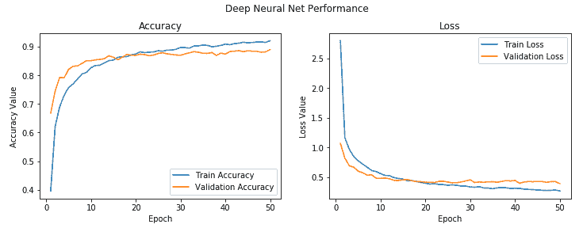

我们可以看到模型在训练和验证之间的损失和准确性是相当一致的。 也许略有过拟合，但考虑到它们之间的差异很小，可以忽略不计。

# 评估分类器性能

从字面上看，现在该对我们的模型进行测试了。 我们将使用测试数据集对模型进行预测，然后根据基本事实标签对它们进行评估。 为此，我们首先需要使用以下代码片段获取测试数据对模型的预测，并从数字标签到实际文本标签进行反向映射：

```py
predictions = model.predict_classes(test_features) 
class_map = {'0' : 'air_conditioner', '1' : 'car_horn',  
             '2' : 'children_playing', '3' : 'dog_bark',  
             '4' : 'drilling', '5' : 'engine_idling',  
             '6' : 'gun_shot', '7' : 'jackhammer',  
             '8' : 'siren', '9' : 'street_music'} 
test_labels_categories = [class_map[str(label)]for label in 
                          test_labels] 
prediction_labels_categories = [class_map[str(label)]for label in 
                 predictions] category_names = list(class_map.values()) 
```

现在让我们使用`model_evaluation_utils`模块来根据测试数据评估模型的性能。 我们首先获得总体性能指标：

```py
meu.get_metrics(true_labels=test_labels_categories,  
                predicted_labels=prediction_labels_categories) 

Accuracy: 0.8869 
Precision: 0.8864 
Recall: 0.8869 
F1 Score: 0.8861 
```

我们获得了总体模型准确性，并且`f1-score`接近 89%，这非常好，并且与我们从验证数据集中获得的一致。 接下来让我们看一下每类模型的性能：

```py
meu.display_classification_report(true_labels=test_labels_categories,     
                       predicted_labels=prediction_labels_categories,
                       classes=category_names) 

                  precision    recall  f1-score   support 

        car_horn       0.87      0.73      0.79       188 
           siren       0.95      0.94      0.94       750 
        drilling       0.88      0.93      0.90       697 
        gun_shot       0.94      0.94      0.94        71 
children_playing       0.83      0.79      0.81       750 
 air_conditioner       0.89      0.94      0.92       813 
      jackhammer       0.92      0.93      0.92       735 
   engine_idling       0.94      0.95      0.95       745 
        dog_bark       0.87      0.83      0.85       543 
    street_music       0.81      0.81      0.81       808 

     avg / total       0.89      0.89      0.89      6100 
```

这使我们可以更清楚地了解模型确实运行良好以及可能遇到问题的确切类。 大多数类似乎运行良好，尤其是设备声音，例如`gun_shot`，`jackhammer`和`engine_idling`等。 似乎`street_music`和`children_playing`最麻烦。

混淆矩阵可以帮助我们了解最可能发生错误分类的地方，并帮助我们更好地理解这一点：

```py
meu.display_confusion_matrix_pretty(true_labels=test_labels_categories,  
                         predicted_labels=prediction_labels_categories,
                         classes=category_names) 
```

矩阵将显示如下：

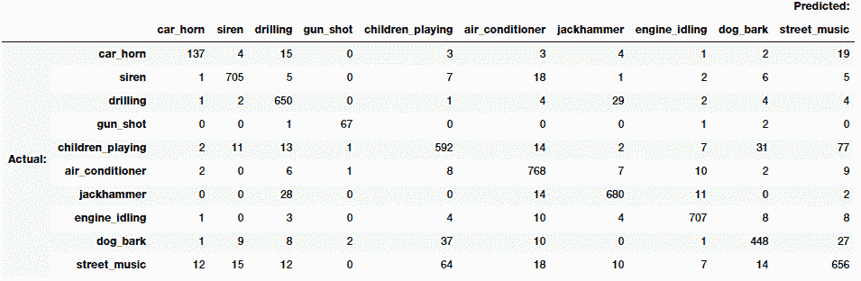

从矩阵的对角线看，我们可以看到大多数模型预测都是正确的，这非常好。 关于错误分类，我们可以看到，属于`street_music`，`dog_bark`和`children_playing`的许多样本彼此之间都被错误分类了，考虑到所有这些事件都是在公开场合和外部发生的，一种预期的他们有可能一起发生。 对于`drilling`和`jackhammer`也是一样。 幸运的是，`gun_shot`和`children_playing`之间的错误分类几乎没有重叠。

因此，在这个复杂的案例研究中，我们可以看到有效的迁移学习是如何工作的，在该案例中，我们利用图像分类器帮助我们构建了强大而有效的音频事件分类器。 现在，我们可以使用以下代码保存此模型以供将来使用：

```py
model.save('sound_classification_model.h5') 
```

您现在可能会认为这很好。 但是，我们在静态数据集上进行了所有操作。 我们将如何在现实世界中使用此模型进行音频事件识别和分类？ 我们将在下一节中讨论策略。

# 构建深度学习音频事件标识符

现在，我们将研究一种策略，利用该策略，我们可以利用上一节中构建的分类模型来构建实际的音频事件标识符。 这将使我们能够利用本章中定义的整个工作流程来获取任何新的音频文件，并预测该文件可能属于的类别，从构建基本特征图开始，使用 VGG-16 模型提取特征，然后利用我们的分类模型做出预测。 如果您想自己运行示例，可以在`Prediction Pipeline.ipynb` Jupyter 笔记本中使用本节中使用的代码段。 笔记本包含`AudioIdentifier`类，该类是通过重用本章前面各节中构建的所有组件而创建的。 请参阅笔记本以访问该类的完整代码，因为我们将更加关注实际的预测管道，以使内容更加简洁。 我们将通过为类的实例提供分类模型的路径来初始化它：

```py
ai = 
 AudioIdentifier(prediction_model_path='sound_classification_model.h5')
```

现在，我们已经下载了十个音频类别中的三个的三个全新的音频数据文件。 让我们加载它们，以便我们可以在它们上测试模型的性能：

```py
siren_path = 'UrbanSound8K/test/sirenpolice.wav' 
gunshot_path = 'UrbanSound8K/test/gunfight.wav' 
dogbark_path = 'UrbanSound8K/test/dog_bark.wav' 
siren_audio, siren_sr = ai.get_sound_data(siren_path) 
gunshot_audio, gunshot_sr = ai.get_sound_data(gunshot_path) 
dogbark_audio, dogbark_sr = ai.get_sound_data(dogbark_path) 
actual_sounds = ['siren', 'gun_shot', 'dog_bark'] 
sound_data = [siren_audio, gunshot_audio, dogbark_audio] 
sound_rate = [siren_sr, gunshot_sr, dogbark_sr] 
sound_paths = [siren_path, gunshot_path, dogbark_path] 
```

让我们可视化这三个音频文件的波形，并了解它们的结构：

```py
i = 1 
fig = plt.figure(figsize=(12, 3.5)) 
t = plt.suptitle('Visualizing Amplitude Waveforms for Audio Clips', 
                  fontsize=14) 
fig.subplots_adjust(top=0.8, wspace=0.2) 

for sound_class, data, sr in zip(actual_sounds, sound_data,sound_rate): 
    plt.subplot(1, 3, i) 
    librosa.display.waveplot(data, sr=sr, color='r', alpha=0.7) 
    plt.title(sound_class) 
    i += 1 
plt.tight_layout(pad=2.5) 
```

可视化效果如下所示：

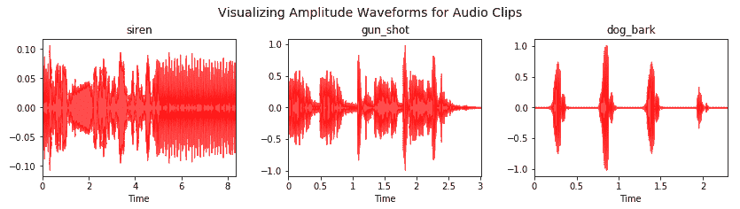

基于可视化，基于音频源，它们似乎是一致的，到目前为止，我们的管道运行良好。 现在，我们为这些音频文件提取基本特征图：

```py
siren_feature_map = ai.extract_base_features(siren_audio)[0] 
gunshot_feature_map = ai.extract_base_features(gunshot_audio)[0] 
dogbark_feature_map = ai.extract_base_features(dogbark_audio)[0] 
feature_maps = [siren_feature_map, gunshot_feature_map,dogbark_feature_map] 
plt.figure(figsize=(14, 3)) 
t = plt.suptitle('Visualizing Feature Maps for Audio 
                  Clips',fontsize=14) 
fig.subplots_adjust(top=0.8, wspace=0.1) 

for index, (feature_map, category) in 
  enumerate(zip(feature_maps,actual_sounds)): 
    plt.subplot(1, 3, index+1) 
    plt.imshow(np.concatenate((feature_map[:,:,0],  
                               feature_map[:,:,1],   
                               feature_map[:,:,2]), axis=1),
                               cmap='viridis')         
plt.title(category) 
plt.tight_layout(pad=1.5) 
```

功能图将显示如下：

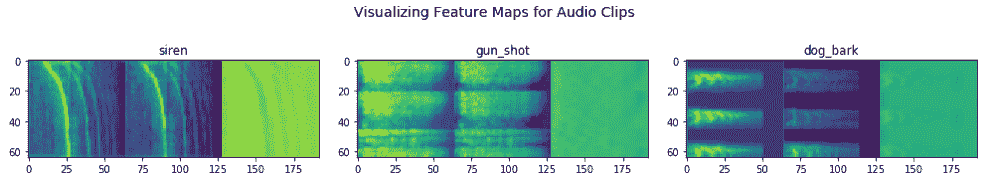

根据我们在训练阶段观察到的图像，图像特征图看起来非常一致。 现在，我们可以利用我们的预测管道来预测每种声音的音频源类别：

```py
predictions = 
   [ai.prediction_pipeline(audiofile_path,return_class_label=True)  
                   for audiofile_path in sound_paths] 
result_df = pd.DataFrame({'Actual Sound': actual_sounds, 
                          'Predicted Sound': predictions, 
                          'Location': sound_paths}) 
result_df 
```

我们得出以下预测：

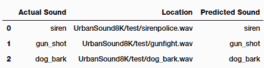

看起来我们的模型能够正确识别所有这些音频样本。 我们鼓励您检查笔记本中的`AudioIdentifier`类，以了解我们如何在后台实现预测管道。 我们利用了在本章中学到的所有概念来构建此管道。

# 总结

在本章中，我们研究了一个全新的问题和案例研究，涉及音频识别和分类。 涵盖了围绕音频数据和信号的概念，包括可视化和理解此数据类型的有效技术。

我们还研究了有效的特征工程技术，以及如何使用迁移学习从音频数据的图像表示中提取有效特征。 这向我们展示了迁移学习的希望，以及如何利用知识从一个领域（图像）转移到另一个领域（音频），并建立一个非常强大且有效的分类器。 最后，我们建立了一个完整的端到端管道，用于识别和分类音频数据的新样本。 请在网络上进一步检查带注释的音频的数据集，看看是否可以利用从此处学习的迁移学习中获得的概念来构建更大，更好的音频标识符和分类器。 请继续关注有关迁移学习的更多有趣示例和案例研究。