# 一、计算机视觉和 TensorFlow 基础知识

随着深度学习方法增强了传统技术（例如图像阈值，过滤和边缘检测）的应用，计算机视觉在许多不同的应用中正在迅速扩展。 TensorFlow 是 Google 创建的一种广泛使用的，功能强大的机器学习工具。 它具有用户可配置的 API，可用于在本地 PC 或云中训练和构建复杂的神经网络模型，并在边缘设备中进行大规模优化和部署。

在本章中，您将了解使用 TensorFlow 的高级计算机视觉概念。 本章讨论计算机视觉和 TensorFlow 的基本概念，以使您为本书的后续更高级章节做好准备。 我们将研究如何执行图像哈希和过滤。 然后，我们将学习特征提取和图像检索的各种方法。 接下来，我们将了解应用中的可视搜索，其方法以及我们可能面临的挑战。 然后，我们将概述高级 TensorFlow 软件及其不同的组件和子系统。

我们将在本章中介绍的主题如下：

*   使用图像哈希和过滤检测边缘
*   从图像中提取特征
*   使用轮廓和 HOG 检测器的对象检测
*   TensorFlow，其生态系统和安装概述

# 技术要求

如果尚未安装，请从[这里](https://www.anaconda.com)安装 Anaconda。 Anaconda 是 Python 的包管理器。 您还需要使用`pip install opencv-python`为要执行的所有计算机视觉工作安装 OpenCV。 OpenCV 是用于计算机视觉工作的内置编程函数的库。

# 使用图像哈希和过滤检测边缘

图像哈希是一种用于查找图像之间相似性的方法。 散列涉及通过转换将输入图像修改为固定大小的二进制向量。 使用不同的转换有多种用于图像哈希的算法：

*   **永久哈希**（**phash**）：余弦变换
*   **差异哈希**（**dhash**）：相邻像素之间的差异

经过哈希转换后，可以将图像与**汉明距离**快速比较。 以下代码显示了用于应用哈希转换的 Python 代码。 `0`的汉明距离表示相同的图像（重复），而较大的汉明距离表示图像彼此不同。 以下代码段导入 Python 包，例如`PIL`，`imagehash`和`distance`。 `imagehash`是支持各种哈希算法的 Python 包。 `PIL`是 Python 图像库，`distance`是 Python 包，用于计算两个散列图像之间的汉明距离：

```py
from PIL import Image
import imagehash
import distance
import scipy.spatial
hash1 = imagehash.phash(Image.open(…/car1.png))
hash2 = imagehash.phash(Image.open(…/car2.png))
print hamming_distance(hash1,hash2)
```

图像过滤是一种基本的计算机视觉操作，它通过对输入图像的每个像素应用核或过滤器来修改输入图像。 以下是图像过滤所涉及的步骤，从进入相机的光到最终的变换图像开始：

1.  使用拜耳过滤器形成彩色图案
2.  创建图像向量
3.  变换图像
4.  线性过滤 - 使用核的卷积
5.  混合高斯和拉普拉斯过滤器
6.  检测图像边缘

# 使用拜耳过滤器形成彩色图案

拜耳过滤器通过应用去马赛克算法将原始图像转换为自然的，经过颜色处理的图像。 图像传感器由光电二极管组成，光电二极管产生与光的亮度成比例的带电光子。 光电二极管本质上是灰度的。 拜耳过滤器用于将灰度图像转换为彩色图像。 来自拜耳过滤器的彩色图像经过**图像信号处理**（**ISP**），该过程涉及数周的各种参数手动调整，以产生所需的人眼图像质量。 当前正在进行一些研究工作，以将手动 ISP 转换为基于 CNN 的处理以生成图像，然后将 CNN 与图像分类或对象检测模型合并以生成一个采用 Bayer 彩色图像并使用边界框检测对象的相干神经网络管道 。 此类工作的详细信息可以在 Sivalogeswaran Ratnasingam 在 2019 年发表的题为《深度相机：用于图像信号处理的全卷积神经网络》的论文中找到。 [本文的链接显示在此处](http://openaccess.thecvf.com/content_ICCVW_2019/papers/LCI/Ratnasingam_Deep_Camera_A_Fully_Convolutional_Neural_Network_for_Image_Signal_ICCVW_2019_paper.pdf)。

这是一个拜耳过滤器的示例：


在上图中，我们可以观察到以下内容：

*   拜耳过滤器由**红色**（`R`），**绿色**（`G`）和**蓝色**（`B`）通道以预定义的模式，因此 G 通道的数量是 B 和 R 的两倍。
*   G，R 和 B 通道交替分布。 大多数通道组合是 RGGB，GRGB 或 RGBG。
*   每个通道只会让一种特定的颜色通过，不同通道的颜色组合会产生如上图所示的图案。

# 创建图像向量

彩色图像是 R，G 和 B 的组合。颜色可以表示为强度值，范围从`0`到`255`。 因此，每个图像都可以表示为三维立方体，其中`x`和`y`轴表示宽度和高度，而`z`轴表示三种颜色通道（R，G，B），代表每种颜色的强度。 OpenCV 是一个具有为 Python 和 C++ 编写的用于图像处理和对象检测的内置编程函数的库。

我们将从编写以下 Python 代码开始以导入图像，然后我们将看到如何将图像分解为具有 RGB 的 NumPy 向量数组。 然后，我们将图像转换为灰度，并查看当我们仅从图像中提取一种颜色分量时图像的外观：

```py
import numpy as np
import cv2
import matplotlib.pyplot as plt
%matplotlib inline
import matplotlib.pyplot as plt
from PIL import Image
image = Image.open('../car.jpeg'). # enter image path in ..
plt.imshow(image)
image_arr = np.asarray(image)  # convert image to numpy array
image_arr.shape

```

前面的代码将返回以下输出：

```py
Output:
(296, 465, 4)
gray = cv2.cvtColor(image_arr, cv2.COLOR_BGR2GRAY)
plt.imshow(gray, cmap='gray')
```

下图显示了基于上述变换的彩色图像和相应的灰度图像：

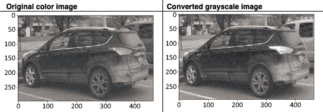

以下是我们将用于将图像转换为 R，G 和 B 颜色分量的 Python 代码：

```py
plt.imshow(image_arr[:,:,0]) # red channel
plt.imshow(image_arr[:,:,1]) # green channel
plt.imshow(image_arr[:,:,2]) # blue channel
```

下图显示了仅提取一个通道（R，G 或 B）后的汽车变形图像：

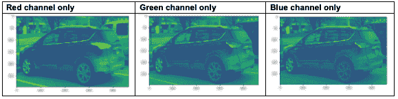

上图可以表示为具有以下轴的 3D 体积：

*   `x`轴，代表宽度。
*   `y`轴，代表高度。
*   每个颜色通道代表图像的深度。

让我们看一下下图。 它以 3D 体积显示在`x`和`y`坐标不同的情况下汽车图像的 R，G 和 B 像素值； 值越高表示图像越亮：


# 变换图像

图像变换涉及图像的平移，旋转，放大或剪切。 如果（`x`，`y`）是图像像素的坐标，则新像素的变换后图像坐标（`u`，`v`）可以表示为：

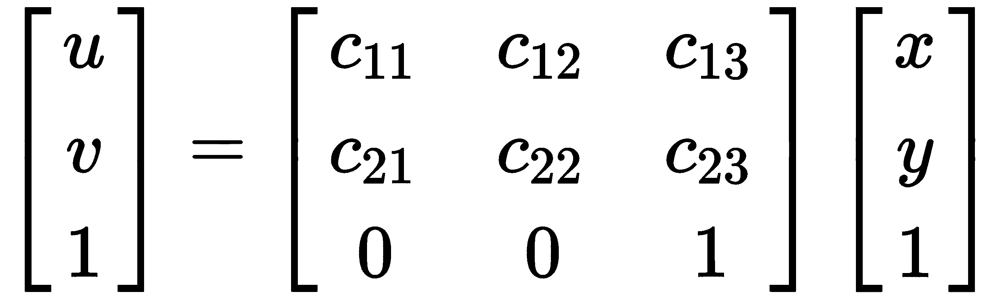

*   **转换**：转换常数值的一些示例为`c11 = 1`，`c12 = 0`，并且`c13 = 10`； `c21 = 0`，`c22 = 1`，`c23 = 10`。结果方程变为`u = x + 10`和`v = y + 10`：


*   **旋转**：一些旋转常数值的示例是`c11 = 1`，`c12 = 0.5`，`c13 = 0`； `c21 = -0.5`，`c22 = 1`，`c23 = 0`。

所得的等式变为`u = x + 0.5y`和`v = -0.5x + y`：

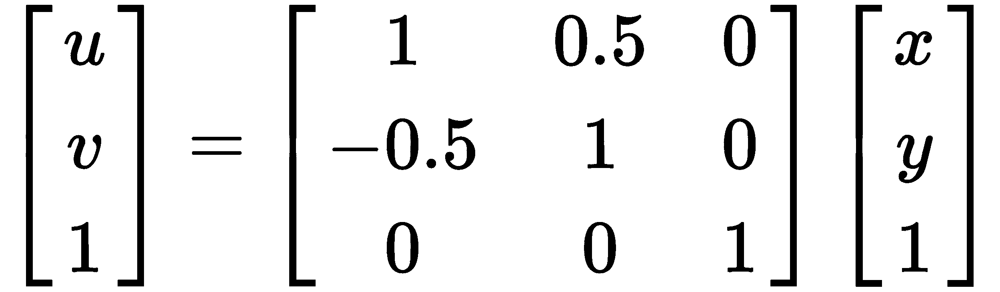

*   **旋转 + 平移**：旋转和平移组合常数的一些示例为`c11 = 1`，`c12 = 0.5`，`c13 = 10`； `c21 = -0.5`，`c22 = 1`，`c23 = 10`。结果方程变为`u = x + 0.5y + 10`和`v = -0.5x + y + 10`：


*   **剪切**：一些剪切常数值示例为`c11 = 10`，`c12 = 0`和`c13 = 0`；`c21 = 0`，`c22 = 10`，`c23 = 0`。所得方程变为`u = 10x`和`v = 10y`：

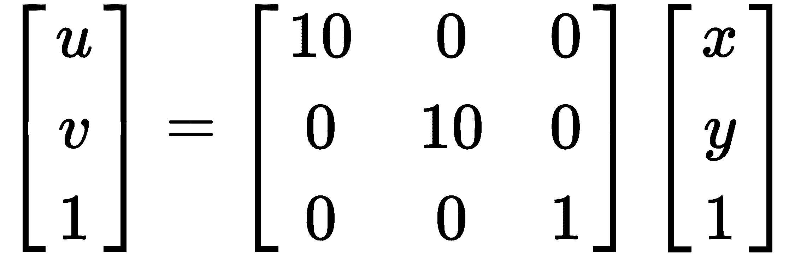

图像转换在计算机视觉中特别有用，可以从同一图像中获取不同的图像。 这有助于计算机开发对平移，旋转和剪切具有鲁棒性的神经网络模型。 例如，如果在训练阶段仅在**卷积神经网络**（**CNN**）中输入汽车前部的图像，在测试阶段将汽车旋转 90 度的角度，则该模型将无法检测到该图像。

接下来，我们将讨论卷积运算的机制以及如何应用过滤器来变换图像。

# 线性过滤 - 使用核的卷积

计算机视觉中的卷积是两个数组（其中一个是图像，另一个是小数组）的线性代数运算，以生成形状与原始图像数组不同的已滤波图像数组。 卷积是累积和关联的。 它可以用数学方式表示如下：


前面的公式解释如下：

*   `F(x,y)`是原始图像。
*   `G(x,y)`是过滤后的图像。
*   `U`是图像核。

根据核类型`U`，输出映像将有所不同。 转换的 Python 代码如下：

```py
import numpy as np
import cv2
import matplotlib.pyplot as plt
%matplotlib inline
import matplotlib.pyplot as plt
from PIL import Image
image = Image.open(‘…/carshort.png')
plt.imshow(image)
image_arr = np.asarray(image)  # convert image to numpy array
image_arr.shape 
gray = cv2.cvtColor(image_arr, cv2.COLOR_BGR2GRAY)
plt.imshow(gray, cmap='gray')
kernel = np.array([[-1,-1,-1],
                 [2,2,2],
                 [-1,-1,-1]])
blurimg = cv2.filter2D(gray,-1,kernel)
plt.imshow(blurimg, cmap='gray')
```

前面代码的图像输出如下：


左边是输入图像，右边是通过对图像应用水平核而获得的图像。 水平核仅检测水平边缘，这可以通过水平线的白色条纹看到。 有关水平核的详细信息，请参见“图像梯度”部分。

前面的代码导入了用于机器学习和计算机视觉工作的必要 Python 库，例如 NumPy 处理数组，`cv2`用于 openCV 计算机视觉工作，PIL 处理 Python 代码中的图像，以及 Matplotlib 绘制结果。 然后，它使用 PIL 导入图像，并使用 OpenCV `BGr2GRAY`缩放函数将其转换为灰度。 它使用 NumPy 数组创建用于边缘过滤的核，使用核模糊图像，然后使用`imshow()`函数显示图像。

过滤操作分为三类：

*   图像平滑
*   图像梯度
*   图像锐化

# 图像平滑

在图像平滑中，通过应用低通过滤器来消除图像中的高频噪声，例如：

*   均值过滤器
*   中值过滤器
*   高斯过滤器

这使图像模糊，并且通过施加其端值不改变正负号并且值没有明显不同的像素来执行。

图像过滤通常是通过在图像上滑动框式过滤器来完成的。 框式过滤器由`n x m`核除以（`n * m`）表示，其中`n`是行数，`m`是行数。 列。 对于`3 x 3`核，其外观如下：

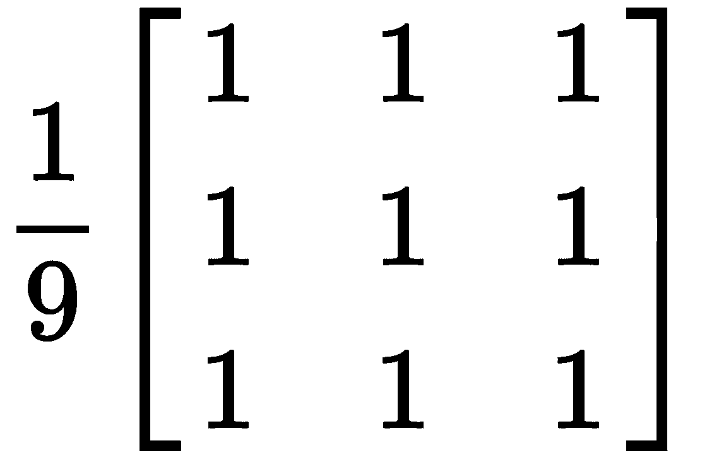

假设此核已应用于先前描述的 RGB 图像。 作为参考，此处显示`3 x 3`图像值：

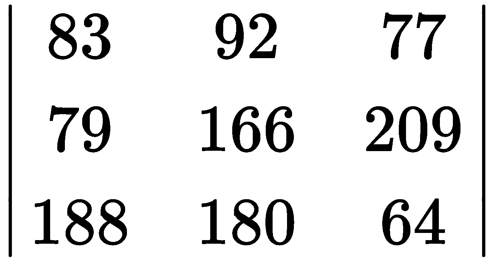

# 均值过滤器

在对图像执行盒核的卷积运算之后，均值过滤器会使用平均值过滤图像。 矩阵相乘后的结果数组如下：

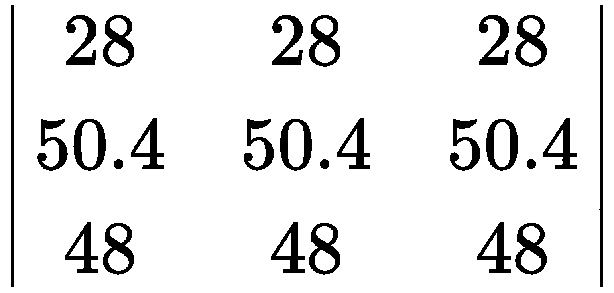

平均值为`42`，它将替换图像中`166`的中心强度值，如下面的数组所示。 图像的剩余值将以类似的方式转换：

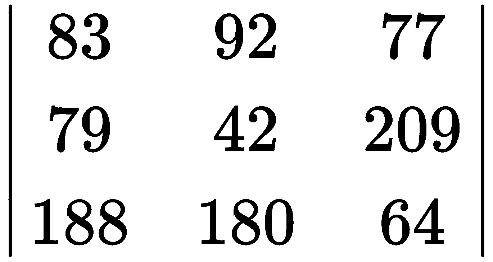

# 中值过滤器

在对图像执行盒核的卷积运算之后，中值过滤器用中值过滤图像值。 矩阵相乘后的结果数组如下：


中值是`48`，并替换图像中`166`的中心强度值，如下数组所示。 图像的剩余值将以类似的方式转换：


# 高斯过滤器

高斯核由以下方程式表示：


是分布的标准差，`k`是仁大小。

对于`1`的标准差（`σ`）和`3 x 3`核（`k = 3`），高斯核看起来如下：


在此示例中，当应用高斯核时，图像的转换如下：

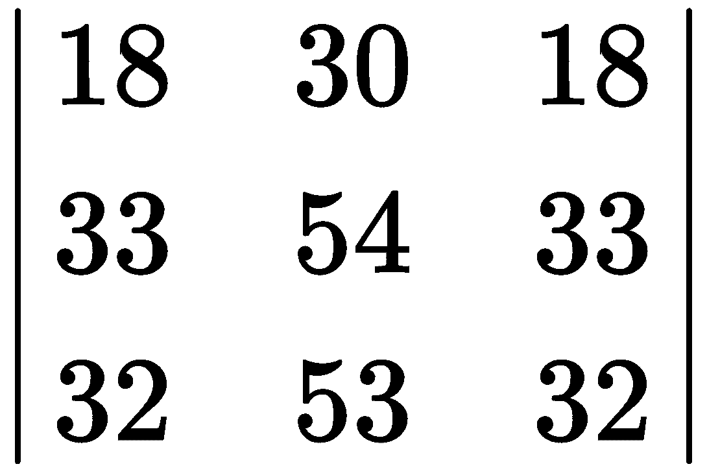

因此，在这种情况下，中心强度值为`54`。 将该值与中值和均值过滤器值进行比较。

# OpenCV 图像过滤

通过将过滤器应用于真实图像，可以更好地理解先前描述的图像过滤器概念。 OpenCV 提供了一种方法。 我们将使用的 OpenCV 代码可以在[这个页面](https://github.com/PacktPublishing/Mastering-Computer-Vision-with-TensorFlow-2.0/blob/master/Chapter01/Chapter1_imagefiltering.ipynb)中找到。

重要代码在以下代码段中列出。 导入图像后，我们可以添加噪点。 没有噪声，图像过滤器效果将无法很好地显现。 之后，我们需要保存图像。 对于均值和高斯过滤器，这不是必需的，但是如果我们不使用中值过滤器保存图像，然后再次将其导回，则 Python 将显示错误。

请注意，我们使用`plt.imsave`而不是 OpenCV 保存图像。 使用`imwrite`直接保存将导致黑色图像，因为在保存之前需要将图像规格化为 255 比例。 `plt.imsave`没有该限制。

之后，我们使用`blur`，`medianBlur`和`GaussianBlur`通过均值，中值和高斯过滤器来转换图像：

```py
img = cv2.imread('car.jpeg')
imgnoise = random_noise(img, mode='s&p',amount=0.3)
plt.imsave("car2.jpg", imgnoise)
imgnew = cv2.imread('car2.jpg')
meanimg = cv2.blur(imgnew,(3,3))
medianimg = cv2.medianBlur(imgnew,3)
gaussianimg = cv2.GaussianBlur(imgnew,(3,3),0)
```

下图显示了使用`matplotlib pyplot`绘制的结果图像：

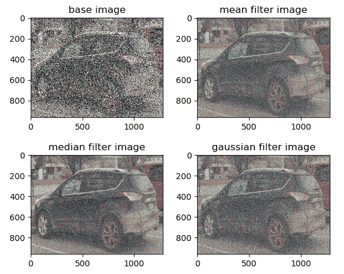

请注意，在这三种情况下，过滤器都会去除图像中的噪点。 在此示例中，似乎中值过滤器是从图像中去除噪声的三种方法中最有效的方法。

# 图像梯度

图像梯度可计算给定方向上像素强度的变化。 像素强度的变化是通过对带有核的图像执行卷积运算获得的，如下所示：

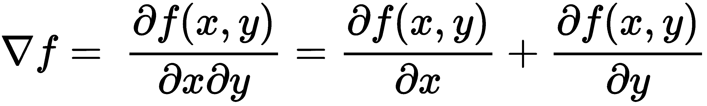

选择核时，两个极端的行或列将具有相反的符号（正负），因此在对图像像素进行乘和求和时会产生差运算符。 让我们看下面的例子：

*   **水平核**：


*   **垂直核**：

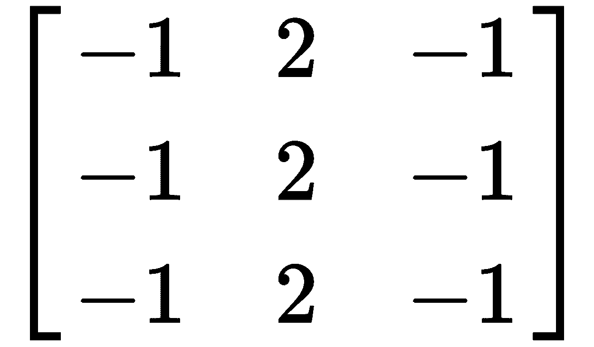

此处描述的图像梯度是计算机视觉的基本概念：

*   可以在`x`和`y`方向上计算图像梯度。
*   通过使用图像梯度，可以确定边缘和角落。
*   边缘和角落包含有关图像形状或特征的许多信息。
*   因此，图像梯度是一种将低阶像素信息转换为高阶图像特征的机制，卷积运算将其用于图像分类。

# 图像锐化

在图像锐化中，通过应用高通过滤器（差分算子）可以消除图像中的低频噪声，从而导致线条结构和边缘变得更加清晰可见。 图像锐化也称为**拉普拉斯运算**，由二阶导数表示，如下所示：

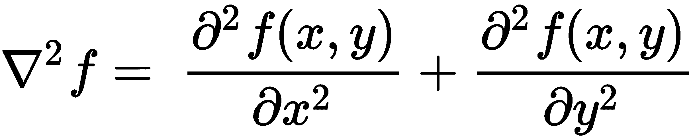

由于存在差异算符，因此相对于核中点的四个相邻单元始终具有相反的符号。 因此，如果核的中点为正，则四个相邻单元为负，反之亦然。 让我们看下面的例子：

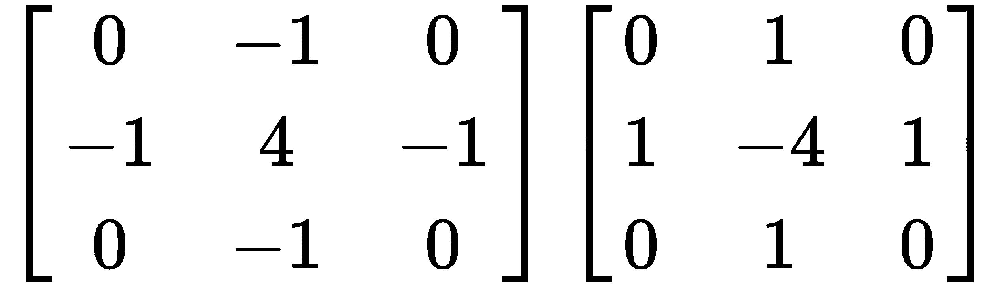

请注意，二阶导数相对于一阶导数的优势在于，二阶导数将始终经过零交叉。 因此，可以通过查看零交叉点（`0`值）来确定边缘，而不是通过观察一阶梯度的梯度大小（可以在图像之间和给定图像内变化）来确定边缘。

# 混合高斯和拉普拉斯运算

到目前为止，您已经了解到高斯运算会使图像模糊，而拉普拉斯运算会使图像锐化。 但是为什么我们需要每个操作，在什么情况下使用每个操作？

图像由特征，特征和其他非特征对象组成。 图像识别就是从图像中提取特征并消除非特征对象。 我们将图像识别为诸如汽车之类的特定物体，因为与非特征相比，其特征更为突出。 高斯滤波是一种从特征中抑制非特征的方法，该方法会使图像模糊。

多次应用它会使图像更加模糊，并同时抑制特征和非特征。 但是由于特征更强，可以通过应用拉普拉斯梯度来提取它们。 这就是为什么我们将高斯核的 sigma 卷积两次或更多次，然后应用 Laplacian 运算来清晰显示特征的原因。 这是大多数卷积操作中用于对象检测的常用技术。

下图显示了输入`3 x 3`图像部分，核值，卷积运算后的输出值以及结果图像：


上图显示了各种高斯和倾斜核，以及如何通过应用核来转换图像的`3 x 3`截面。 下图是上一个的延续：

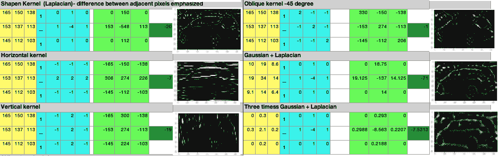

前面的表示根据卷积运算的类型清楚地显示了图像如何变得更加模糊或清晰。 对卷积运算的这种理解是基本的，因为我们了解更多有关在 CNN 各个阶段使用 CNN 优化核选择的信息。

# 检测图像边缘

边缘检测是计算机视觉中基于亮度和图像强度变化来查找图像特征的最基本处理方法。 亮度的变化是由于深度，方向，照明或角落的不连续而导致的。 边缘检测方法可以基于一阶或二阶：


下图以图形方式说明了边缘检测机制：

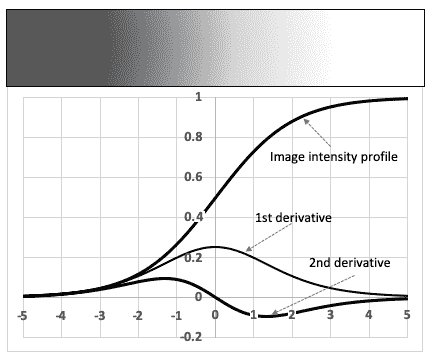

在这里，您可以看到图像的强度在中点附近从暗变亮，因此图像的边缘在中间点。 一阶导数（强度梯度）在中点先升后降，因此可以通过查看一阶导数的最大值来计算边缘检测。 但是，一阶导数方法的问题在于，取决于输入函数，最大值可能改变，因此不能预先确定最大值的阈值。 但是，如图所示，二阶导数始终在边缘处穿过零点。

**Sobel** 和 **Canny** 是一阶边缘检测方法，而二阶方法是 Laplacian 边缘检测器。

# Sobel 边缘检测器

Sobel 运算符通过计算图像强度函数的梯度（以下代码中的`Sobelx`和`Sobely`）来检测边缘。 通过将核应用于图像来计算梯度。 在以下代码中，核大小（`ksize`）为`5`。 此后，通过取梯度的比率（`sobely`/`sobelx`）来计算 **Sobel 梯度**（**SobelG**）：

```py
Sobelx=cv2.Sobel(gray,cv2.CV_64F,1,0,ksize=5)
Sobely=cv2.Sobel(gray,cv2.CV_64F,0,1,ksize=5)
mag,direction = cv2.cartToPolar(sobelx,sobely,angleInDegrees =True)
sobelG = np.hypot(sobelx,sobely)
```

# Canny 边缘检测仪

Canny 边缘检测器使用二维高斯过滤器去除噪声，然后应用具有非最大抑制的 Sobel 边缘检测来挑选`x`和`y`之间的最大比值。 在任何像素点进行梯度，最后应用边缘阈值检测是否存在边缘。 以下代码显示了灰度图像上的 Canny 边缘检测。 `min`和`max`值是用于比较图像梯度以确定边缘的阈值：

```py
Canny = cv2.Canny(gray,minVal=100,maxVal=200)
```

下图显示了应用`Sobel-x`，`Sobel-y`和 Canny 边缘检测器后的汽车图像：

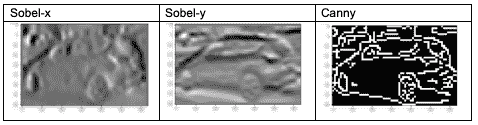

我们可以看到，Canny 在检测汽车方面的表现比 Sobel 好得多。 这是因为 Canny 使用二维高斯过滤器消除了噪声，然后应用具有非最大抑制的 Sobel 边缘检测来挑选`x`和`y`之间的最大比值。 在任何像素点上进行梯度，最后应用边缘阈值检测是否存在边缘。

# 从图像中提取特征

一旦我们知道了如何检测边缘，下一个任务就是检测特征。 许多边缘合并形成特征。 特征提取是识别图像中的视觉图案并提取与未知对象的图像匹配的任何可辨别局部特征的过程。 在进行特征提取之前，了解图像直方图很重要。 图像直方图是图像色彩强度的分布。

如果直方图相似，则图像特征与测试图像匹配。 以下是用于创建汽车图像直方图的 Python 代码：

```py
import numpy as np
import cv2
import matplotlib.pyplot as plt
%matplotlib inline
import matplotlib.pyplot as plt
from PIL import Image
image = Image.open('../car.png')
plt.imshow(image)
image_arr = np.asarray(image) # convert image to numpy array
image_arr.shape
color = ('blue', 'green', 'red')
for i,histcolor in enumerate(color):
 carhistogram = cv2.calcHist([image_arr],[i],None,[256],[0,256])
 plt.plot(carhistogram,color=histcolor)
 plt.xlim([0,256])
```

前面的 Python 代码首先导入必要的 Python 库，例如`cv2`（OpenCV），NumPy（用于数组计算），PIL（用于导入图像）和 Matplotlib（用于绘制图形）。 之后，它将图像转换成数组并循环遍历每种颜色，并绘制每种颜色（R，G 和 B）的直方图。

下图显示了汽车图像的直方图输出。`x`轴表示从`0`（黑色）到`256`（白色）的颜色强度值，`y`轴表示出现的频率：

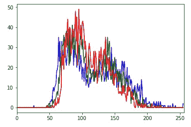

直方图显示 R，G 和 B 的峰值颜色强度在`100`附近，第二个峰值在`150`附近。 这意味着汽车的平均颜色是灰色。 以`200`的强度值显示的`0`频率（在图像的最右侧）显示该车肯定不是白色的。 类似地，以`50`的强度值出现的`0`频率显示图像不是完全黑色。

# OpenCV 图像匹配

图像匹配是一种将两个不同的图像匹配以找到共同特征的技术。 图像匹配技术具有许多实际应用，例如匹配指纹，使地毯颜色与地板或墙壁颜色匹配，使照片匹配以找到同一个人的两个图像，或者比较制造缺陷以将它们分为相似的类别以进行更快的分析。 本节概述了 OpenCV 中可用的图像匹配技术。 这里描述了两种常用的方法： **暴力破解**（**BFMatcher**）和用于近似最近的邻居的快速库**（**FLANN**）。 在本书的稍后部分，我们还将讨论其他类型的匹配技术，例如“第 2 章”，“使用局部二进制模式的内容识别”中的直方图匹配和。 “第 6 章”，“使用迁移学习的视觉搜索”中的局部二进制模式。

在 BFMatcher 中，将比较测试图像和目标图像各部分之间的汉明距离，以实现最佳匹配。 另一方面，FLANN 速度更快，但只会找到最接近的邻居–因此，它找到了很好的匹配项，但不一定是最佳匹配项。 **KNN** 工具假定相似的事物彼此相邻。 它根据目标与源之间的距离找到最接近的第一近邻。 可以在[这个页面](https://github.com/PacktPublishing/Mastering-Computer-Vision-with-TensorFlow-2.0/blob/master/Chapter01/Chapter1_SIFT.ipynb)上找到用于图像匹配的 Python 代码。

请注意，在下图中，BFMatcher 找到了更相似的图像。 该图是前面的代码（`preface_SIFT.ipynb`）返回的输出。 我们来看一下：

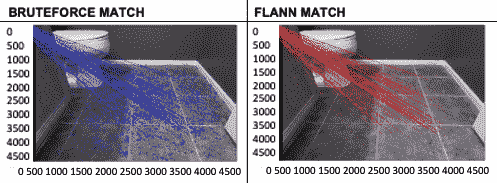

上图显示了如何应用 BFMatcher 和 FLANN 的 KNN 匹配器将单个瓷砖匹配到整个浴室地板。 显然，与 FLANN 匹配器（红线）相比，BFMatcher（蓝线）找到更多的平铺点。

前面描述的图像匹配技术还可以用于查找两点之间的相对距离-一个点可以是参考点，例如从中获取图像的汽车，而另一个可以是道路上的另一辆汽车。 然后使用该距离来开发防撞系统。

# 使用轮廓和 HOG 检测器的对象检测

轮廓是图像中形状相似的封闭区域。 在本节中，我们将使用轮廓来分类和检测图像中的简单对象。 我们将使用的图像由苹果和橙子组成，我们将使用轮廓和 Canny 边缘检测方法来检测对象并将图像类名称写在边界框上。 该部分的代码可以在[这个页面](https://github.com/PacktPublishing/Mastering-Computer-Vision-with-TensorFlow-2.0/blob/master/Chapter01/Chapter1_contours_opencv_object_detection_HOG.ipynb)中找到。

以下各小节介绍了该方法。

# 轮廓检测

我们首先需要导入图像，然后使用 Canny 边缘检测器在图像中找到边缘。 因为我们的对象的形状是带有圆角的圆，所以效果很好。 以下是所需的详细代码：

```py
threshold =100
canny_output = cv2.Canny(img, threshold, threshold * 2)
contours, hierarchy = cv2.findContours(canny_output, cv2.RETR_EXTERNAL, cv2.CHAIN_APPROX_SIMPLE)
```

如前面的代码所示，在 Canny 边缘检测之后，我们应用了 OpenCV `findContours()`方法。 此方法具有三个参数：

*   图像，在本例中为 Canny 边缘检测器输出。
*   检索方法，有很多选择。 我们正在使用的是一种外部方法，因为我们有兴趣在对象周围绘制边界框。
*   轮廓近似法。

# 检测边界框

该方法本质上包括理解图像及其各种类别的特征以及对图像类别进行分类的开发方法。

请注意，OpenCV 方法不涉及任何训练。 对于每个轮廓，我们使用 OpenCV `boundingRect`属性定义一个边界框。

我们将使用两个重要的特征来选择边界框：

*   **兴趣区域的大小**：我们将消除尺寸小于`20`的所有轮廓。

请注意，`20`不是通用编号，它仅适用于此图像。 对于更大的图像，该值可以更大。

*   **兴趣区域的颜色**：在每个边界框中，我们需要定义宽度从`25%`到`75%`的兴趣区域，以确保我们不考虑圈子外的矩形的空白区域。 这对于最小化变化很重要。 接下来，我们使用`CV2.mean`定义平均颜色。

我们将通过观察包围它的三个橙色图像来确定颜色的平均阈值和最大阈值。 以下代码使用 OpenCV 的内置方法通过`cv2.boundingRect`绘制边界框。 然后根据宽度和高度选择绘制**兴趣区域**（**ROI**），并找到该区域内的平均颜色：

```py
count=0
font = cv2.FONT_HERSHEY_SIMPLEX
for c in contours:
    x,y,w,h = cv2.boundingRect(c)
    if (w >20 and h >20):
        count = count+1
        ROI = img[y+int(h/4):y+int(3*h/4), x+int(h/4):x+int(3*h/4)]
        ROI_meancolor = cv2.mean(ROI)
        print(count,ROI_meancolor)
        if (ROI_meancolor[0] > 30 and ROI_meancolor[0] < 40 and ROI_meancolor[1] > 70 and ROI_meancolor[1] < 105
            and ROI_meancolor[2] > 150 and ROI_meancolor[2] < 200):
                cv2.putText(img, 'orange', (x-2, y-2), font, 0.8, (255,255,255), 2, cv2.LINE_AA)
                cv2.rectangle(img,(x,y),(x+w,y+h),(255,255,255),3)
                cv2.imshow('Contours', img)
        else:
                cv2.putText(img, 'apple', (x-2, y-2), font, 0.8, (0,0,255), 2, cv2.LINE_AA)
                cv2.rectangle(img,(x,y),(x+w,y+h),(0,0,255),3)
                cv2.imshow('Contours', img)

```

在前面的代码中，请注意两个`if`语句-基于大小的`w,h`和基于颜色的`ROI_meancolor[0,1,2]`：

*   基于大小的语句消除了所有小于`20`的轮廓。
*   `ROI_meancolor [0,1,2]`表示平均颜色的 RGB 值。

在这里，第三，第四和第八行表示橙色，`if`语句将颜色限制为`B`组件在`30`和`40`之间，对于`G`则在`70`和`105`之间 ]组件，以及`R`组件的`150`和`200`。

输出如下。 在我们的示例中，`3`，`4`和`8`是橙色：

```py
1 (52.949200000000005, 66.38640000000001, 136.2072, 0.0)
2 (43.677693761814744, 50.94659735349717, 128.70510396975425, 0.0)
3 (34.418282548476455, 93.26246537396122, 183.0893351800554, 0.0)
4 (32.792241946088104, 78.3931623931624, 158.78238001314926, 0.0)
5 (51.00493827160494, 55.09925925925926, 124.42765432098766, 0.0)
6 (66.8863771564545, 74.85960737656157, 165.39678762641284, 0.0)
7 (67.8125, 87.031875, 165.140625, 0.0)
8 (36.25, 100.72916666666666, 188.67746913580245, 0.0)
```

请注意，OpenCV 将图像处理为`BGR`而不是`RGB`。

# HOG 检测器

定向梯度的**直方图**（**HOG**）是有用的特征，可用于确定图像的局部图像强度。 此技术可用于查找图像中的对象。 局部图像梯度信息可用于查找相似图像。 在此示例中，我们将使用 **scikit-image** 导入 HOG，并使用它绘制图像的 HOG。 如果尚未安装 scikit-image，则可能需要使用`pip install scikit-image`安装它：

```py
from skimage.feature import hog
from skimage import data, exposure
fruit, hog_image = hog(img, orientations=8, pixels_per_cell=(16, 16),
cells_per_block=(1, 1), visualize=True, multichannel=True)
hog_image_rescaled = exposure.rescale_intensity(hog_image, in_range=(0, 10))
cv2.imshow('HOG_image', hog_image_rescaled)
```

下图说明了示例代码中前面代码的结果：

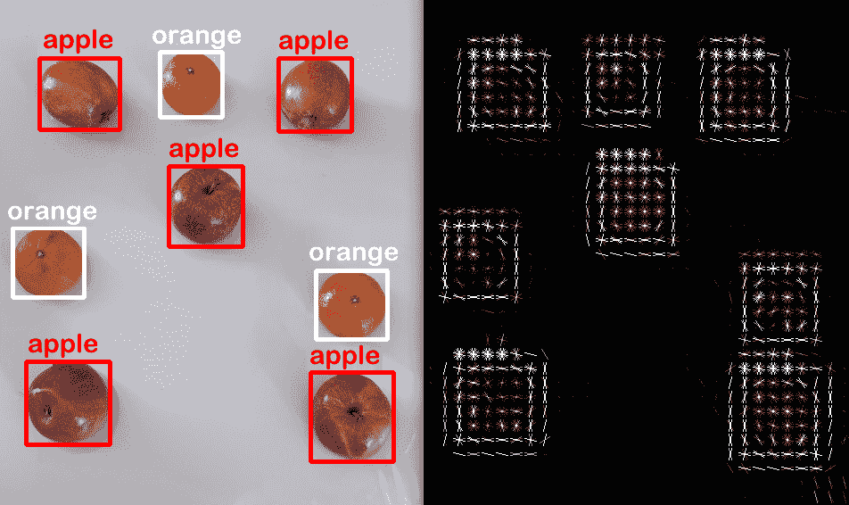

在上图中，我们可以观察到以下内容：

*   左侧显示边界框，而右侧显示图像中每个对象的 HOG 梯度。
*   请注意，每个苹果和橘子都可以正确检测到，并且包围水果的边界框没有任何重叠。
*   HOG 描述符显示一个矩形的边界框，其中的梯度表示圆形图案。
*   桔子和苹果之间的梯度显示出相似的图案，唯一的区别是大小。

# 轮廓检测方法的局限性

在对象检测方面，上一节中显示的示例看起来非常好。 我们无需进行任何训练，并且只需对一些参数进行少许调整，就可以正确检测出橙子和苹果。 但是，我们将添加以下变体，并查看我们的检测器是否仍然能够正确检测对象：

*   我们将添加除苹果和橙子以外的对象。
*   我们将添加另一个形状类似于苹果和橙子的对象。
*   我们将改变光的强度和反射率。

如果我们执行上一部分中的相同代码，它将检测每个对象，就好像它是一个苹果一样。 这是因为所选的`width`和`height`参数太宽，并且包括所有对象以及 RGB 值，它们在此图像中的显示方式与以前不同。 为了正确检测对象，我们将对`if`语句的大小和颜色进行以下更改，如以下代码所示：

```py
  if (w >60 and w < 100 and h >60 and h <120):
  if (ROI_meancolor[0] > 10 and ROI_meancolor[0] < 40 and ROI_meancolor[1] > 65 and ROI_meancolor[1] < 105
```

请注意，前面的更改对`if`语句施加了以前不存在的约束。

RGB 颜色如下：

```py
1 (29.87429111531191, 92.01890359168242, 182.84026465028356, 0.0) 82 93
2 (34.00568181818182, 49.73605371900827, 115.44163223140497, 0.0) 72 89
3 (39.162326388888886, 62.77256944444444, 148.98133680555554, 0.0) 88 96
4 (32.284938271604936, 53.324444444444445, 141.16493827160494, 0.0) 89 90
5 (12.990362811791384, 67.3078231292517, 142.0997732426304, 0.0) 84 84
6 (38.15, 56.9972, 119.3528, 0.0) 82 100
7 (47.102716049382714, 80.29333333333334, 166.3264197530864, 0.0) 86 90
8 (45.76502082093992, 68.75133848899465, 160.64901844140394, 0.0) 78 82
9 (23.54432132963989, 98.59972299168975, 191.97368421052633, 0.0) 67 76
```

上面的代码在更改后的图像上的结果如下所示：


在上图中可以看到一个遥控器，叉子，刀子和一个塑料杯。 请注意，苹果，橘子和塑料杯的 HOG 功能如何相似，这是预期的，因为它们都是圆形的：

*   塑料杯周围没有包围框，因为未检测到。
*   与苹果和橘子相比，叉子和刀子的 HOG 角形非常不同。
*   遥控器具有矩形的 HOG 形状。

这个简单的示例表明，这种对象检测方法不适用于较大的图像数据集，我们需要调整参数以考虑各种照明，形状，大小和方向条件。 这就是为什么我们将在本书其余部分中讨论 CNN 的原因。 一旦我们使用此方法在不同条件下训练图像，无论对象的形状如何，它将在新的条件下正确检测到对象。 但是，尽管上述方法有局限性，我们还是学习了如何使用颜色和大小将一个图像与另一个图像分开。

`ROI_meancolor`是一种用于检测边界框内对象平均颜色的强大方法。 例如，您可以使用它根据边界框内的球衣颜色，绿色苹果与红色苹果或任何类型的基于颜色的分离方法，将一个团队的球员与另一个团队的球员区分开。

# TensorFlow，生态系统和安装概述

在前面的部分中，我们介绍了计算机视觉技术的基础知识，例如图像转换，图像过滤，使用核进行卷积，边缘检测，直方图和特征匹配。 这种理解及其各种应用应该为深度学习的高级概念打下坚实的基础，这将在本书的后面部分进行介绍。

计算机视觉中的深度学习是通过许多中间（隐藏）层的卷积运算对许多不同图像特征（例如边缘，颜色，边界，形状等）的累积学习，以全面了解图像类型。 深度学习增强了计算机视觉技术，因为它堆叠了有关神经元行为的许多计算层。 通过组合各种输入以基于数学函数和计算机视觉方法（例如边缘检测）产生输出来完成此操作。

TensorFlow 是一个**端到端**（**E2E**）机器学习平台，其中图像和数据被转换为张量以由神经网络进行处理。 例如，大小为`224 x 224`的图像可以表示为等级`4`的张量为`128, 224, 224, 3`，其中`128`是神经网络的批量大小，`224`是高度和宽度， `3`是颜色通道（R，G 和 B）。

如果您的代码基于 TensorFlow 1.0，那么将其转换为 2.0 版可能是最大的挑战之一。 请遵循[这个页面](https://www.tensorflow.org/guide/migrate)上的说明，以转换为 2.0 版。 大多数时候，当您使用终端在 TensorFlow 中执行 Python 代码时，转换问题会在低级 API 中发生。

Keras 是 TensorFlow 的高级 API。 以下三行代码是安装 Keras 的起点：

```py
from __future__ import absolute_import, division, print_function, unicode_literals
import tensorflow as tf
from tensorflow import keras
```

如果不使用最后一行，则可能必须对所有函数使用`from tensorflow.keras`导入。

TensorFlow 使用`tf.data`从简单的代码构建复杂的输入管道，从而简化并加快了数据输入过程。 您将在 “第 6 章”，“使用迁移学习的视觉搜索”中了解这一点。

在 Keras 中，模型的各层以**顺序**的形式堆叠在一起。 这由`model=tf.keras.Sequential()`引入，并使用`model.add`语句添加每一层。 首先，我们需要使用`model.compile`编译模型，然后可以使用`model.train`函数开始训练。

TensorFlow 模型将保存为检查点并保存模型。 检查点捕获模型使用的参数，过滤器和权重的值。 检查点与源代码关联。 另一方面，保存的模型可以部署到生产设置中，不需要源代码。

TensorFlow 针对多个 GPU 提供分布式训练。 TensorFlow 模型输出可以使用 Keras API 或 TensorFlow 图可视化。

# TensorFlow 与 PyTorch

PyTorch 是另一个类似于 TensorFlow 的深度学习库。 它基于 Torch，由 Facebook 开发。 在 TensorFlow 创建静态图的同时，PyTorch 创建动态图。 在 TensorFlow 中，必须首先定义整个计算图，然后运行模型，而在 PyTorch 中，可以平行于模型构建来定义图。

# TensorFlow 安装

要在 PC 上安装 TensorFlow 2.0，请在终端中键入以下命令。 确保单击`Enter`：

```py
pip install --upgrade pip                                                 
pip install tensorflow
```

除 TensorFlow 之外，上述命令还将在终端中下载并提取以下包：

*   Keras（用 Python 编写的高级神经网络 API，能够在 TensorFlow 的顶部运行）
*   `protobuf`（用于结构化数据的序列化协议）
*   TensorBoard（TensorFlow 的数据可视化工具）
*   PyGPU（Python 功能，用于图像处理，GPU 计算以提高性能）
*   `cctools`（适用于 Android 的本地 IDE）
*   `c-ares`（函数库）
*   `clang`（C，C++，Objective-C，OpenCL 和 OpenCV 的编译器前端）
*   `llvm`（用于生成前端和后端二进制代码的编译器架构）
*   `theano`（用于管理多维数组的 Python 库）
*   `grpcio`（用于 Python 的`gRPC`包，用于实现远程过程调用）
*   `libgpuarray`（可用于 Python 中所有包的常见 N 维 GPU 数组）
*   `termcolor`（Python 中的颜色格式输出）
*   `absl`（用于构建 Python 应用的 Python 库代码集合）
*   `mock`（用虚拟环境替换真实对象以帮助测试）
*   `gast`（用于处理 Python 抽象语法的库）

在安装过程中，在询问时按`y`表示**是**：

```py
Downloading and Extracting Packages
Preparing transaction: done
Verifying transaction: done
Executing transaction: done
```

如果一切都正确安装，您将看到前面的消息。

安装后，根据您的 PC 是 CPU 还是 CPU 和 GPU，输入以下两个命令之一检查 TensorFlow 版本。 请注意，对于所有计算机视觉工作，最好使用 GPU 来加速图像的计算。 对于 Python 3.6 或更高版本，请使用`pip3`，对于 Python 2.7，请使用`pip`：

```py
pip3 show tensorflow
pip3 show tensorflow-gpu
pip show tensorflow
```

输出应显示以下内容：

```py
Name: tensorflow
Version: 2.0.0rc0
Summary: TensorFlow is an open source machine learning framework for everyone.
Home-page: https://www.tensorflow.org/
Author: Google Inc.
Author-email: packages@tensorflow.org
License: Apache 2.0
Location: /home/.../anaconda3/lib/python3.7/site-packages
Requires: gast, google-pasta, tf-estimator-nightly, wrapt, tb-nightly, protobuf, termcolor, opt-einsum, keras-applications, numpy, grpcio, keras-preprocessing, astor, absl-py, wheel, six
Required-by: gcn
```

有时，您可能会注意到，即使在安装 TensorFlow 之后，Anaconda 环境也无法识别已安装 TensorFlow。 在这种情况下，最好在终端中使用以下命令卸载 TensorFlow，然后重新安装它：

```py
python3 -m pip uninstall protobuf
python3 -m pip uninstall tensorflow-gpu
```

# 总结

在本章中，我们学习了图像过滤如何通过卷积运算修改输入图像，以产生检测特征的一部分（称为边缘）的输出。 这是计算机视觉的基础。 正如您将在以下各章中了解到的那样，图像过滤的后续应用会将边缘转换为更高级别的图案，例如特征。

我们还学习了如何计算图像直方图，如何使用 SIFT 进行图像匹配以及如何使用轮廓和 HOG 检测器绘制边界框。 我们学习了如何使用 OpenCV 的边界框颜色和大小方法将一个类与另一个类隔离。 本章以 TensorFlow 简介作为结束，这将为本书的其余章节奠定基础。

在下一章中，我们将学习另一种称为模式识别的计算机视觉技术，并将使用它来对具有模式的图像内容进行分类。