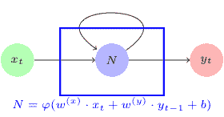
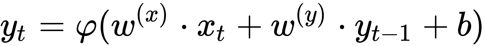
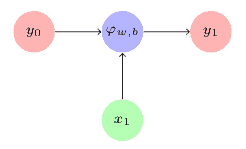
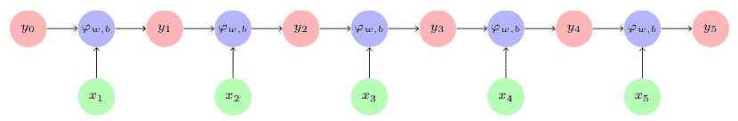
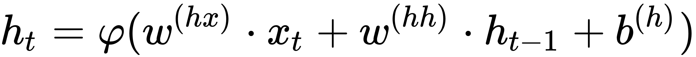
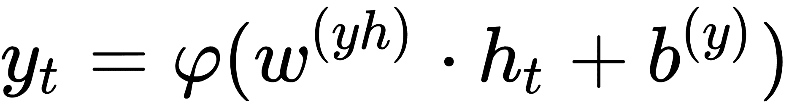
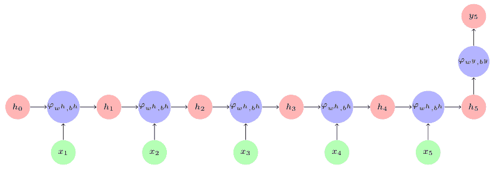

# 简单循环神经网络

这是一个带循环的简单神经网络：

RNN Network

在该图中，神经网络`N`接受输入`x[t]`以产生输出`y[t]`。由于循环，在下一步`t+1`，输入`y[t]`和输入`x[t+1]`产生输出`y[t+1]`。在数学上，我们将其表示为以下等式：



当我们展开循环时，RNN 架构在时间步`t1`看起来如下：



随着时间步长的发展，这个循环在时间步骤 5 展开如下：



在每个时间步骤，使用相同的学习函数`φ(·)`和相同的参数，`w`和`b`。

输出`y`并不总是在每个时间步产生。相反，在每个时间步产生输出`h`，并且对该输出`h`应用另一个激活函数以产生输出`y`。 RNN 的等式现在看起来像这样：





其中，

*   `w(hx)`是连接到隐藏层的`x`输入的权重向量
*   `w(hh)`是来自前一时间步的`h`的值的权重向量
*   `w(yh)`是连接隐藏层和输出层的层的权重向量
*   用于`h[t]`的函数通常是非线性函数，例如 tanh 或 ReLU

在 RNN 中，在每个时间步使用相同的参数`w(hx), w(hh), w(yh), b(h), b(y)`。这一事实大大减少了我们需要学习的基于序列模型的参数数量。

由此， RNN 在时间步`t5`如下展开，假设输出`y`仅在时间步`t5`产生：



简单的 RNN 由 Elman 在 1990 年引入，因此它也被称为 Elman 网络。然而，简单的 RNN 无法满足我们今天的处理需求，因此我们将在下一节中了解 RNN 的变体。

阅读 Elman 的原始研究论文，了解 RNN 架构的起源：

```
J. L. Elman, Finding Structure in Time, Cogn. Sci., vol. 14, no. 2, pp. 179–211, 1990.
```