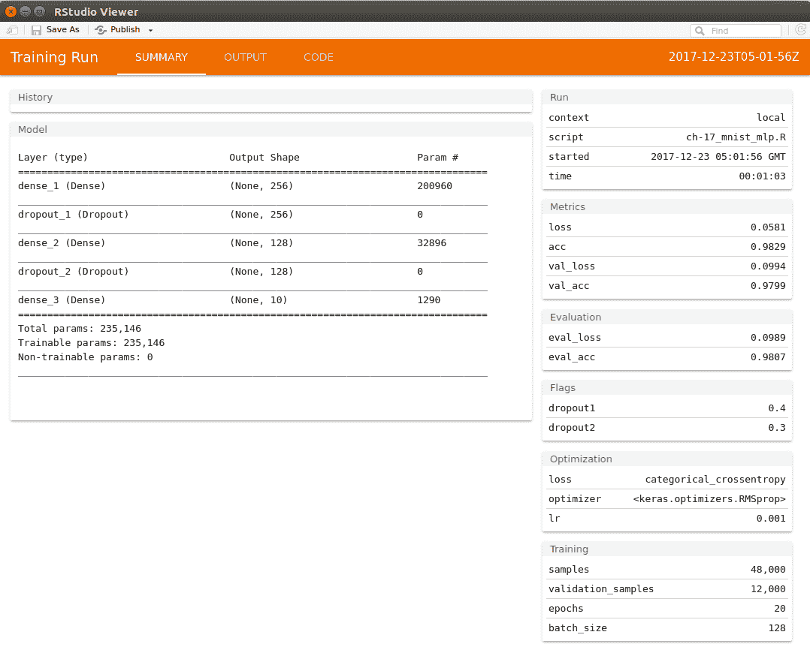
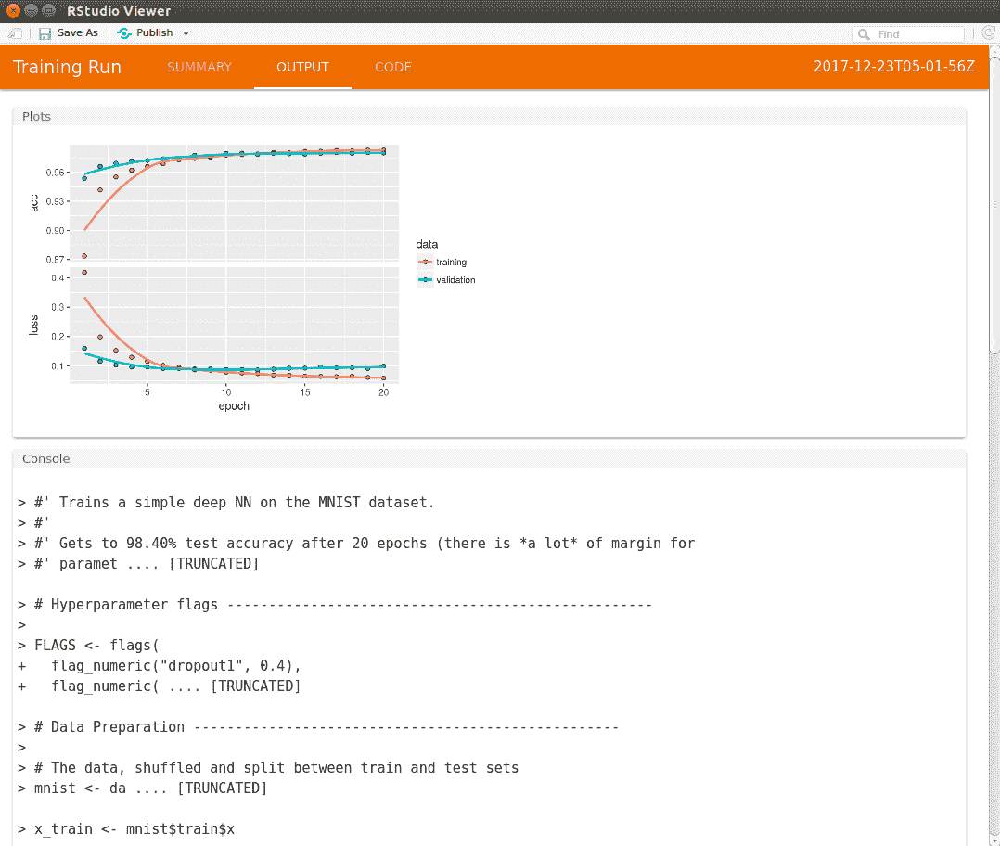

# R 中的 tfruns 包

您可以按照 Jupyter R 笔记本中的代码`ch-17d_TensorBoard_in_R`。

`tfruns` 软件包是 R 中提供的非常有用的工具，有助于跟踪多次运行以训练模型。对于使用 `keras` `tfestimators` 软件包在 R 中构建的模型， `tfruns` 软件包自动捕获运行数据。使用 `tfruns` 非常简单易行。只需在 R 文件中创建代码，然后使用 `training_run()` 函数执行该文件。例如，如果你有一个 `mnist_model.R ` 文件 ，那么在交互式 R 控制台中使用 `training_run()` 函数执行它，如下所示：

```r
library(tfruns)
training_run('mnist_model.R')
```

训练完成后，将自动显示显示运行摘要的窗口。我们从`tfruns` GitHub 仓库（ [https://github.com/rstudio/tfruns/blob/master/inst/examples/mnist_mlp/mnist_mlp]获得的`mnist_mlp.R`窗口中获得以下输出。 R](https://github.com/rstudio/tfruns/blob/master/inst/examples/mnist_mlp/mnist_mlp.R) ）。

tfruns visualization of the model run

在“查看器”窗口中，输出选项卡包含以下图：

tfruns visualization of the accuracy and loss values

`tfruns`软件包将一个插件安装到 RStudio，也可以从`Addins`菜单选项访问。该软件包还允许您比较多个运行并将运行报告发布到 RPub 或 RStudio Connect。您还可以选择在本地保存报告。

有关 R 中`tfruns`包的更多文档，请访问以下链接：

<https://tensorflow.rstudio.com/tools/tfruns/reference/>

<https://tensorflow.rstudio.com/tools/tfruns/articles/overview.html>.