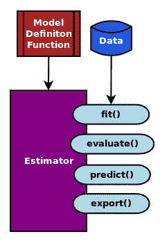

# TF Estimator - 以前的 TF 学习

TF Estimator 是一个高级 API，通过封装训练，评估，预测和导出函数，可以轻松创建和训练模型。 TensorFlow 最近重新命名并在 TensorFlow 中以新名称 TF Estimator 发布了 TF Learn 软件包，可能是为了避免与 tflearn.org 的 TFLearn 软件包混淆。 TF Estimator API 对原始 TF 学习包进行了重大改进，这些包在 KDD 17 会议上提供的研究论文中有所描述，[可以在此链接中找到](https://doi.org/10.1145/3097983.3098171)。

TF Estimator 接口设计灵感来自流行的机器学习库 SciKit Learn，允许从不同类型的可用模型创建估计器对象，然后在任何类型的估计器上提供四个主要函数：

*   `estimator.fit()`
*   `estimator.evaluate()`
*   `estimator.predict()`
*   `estimator.export()`

函数的名称是不言自明的。估计器对象表示模型，但模型本身是从提供给估计器的模型定义函数创建的。

我们可以在下图中描述估计器对象及其接口：



使用 Estimator API 而不是在核心 TensorFlow 中构建所有内容，可以不用担心图，会话，初始化变量或其他低级细节。在撰写本书时，TensorFlow 提供了以下预构建的估计器：

*   `tf.contrib.learn.KMeansClustering`
*   `tf.contrib.learn.DNNClassifier`
*   `tf.contrib.learn.DNNRegressor`
*   `tf.contrib.learn.DNNLinearCombinedRegressor`
*   `tf.contrib.learn.DNNLinearCombinedClassifier`
*   `tf.contrib.learn.LinearClassifier`
*   `tf.contrib.learn.LinearRegressor`
*   `tf.contrib.learn.LogisticRegressor`

TF Estimator API 中的简单工作流程如下：

1.  找到与您要解决的问题相关的预构建 Estimator。
2.  编写导入数据集的函数。
3.  定义包含特征的数据中的列。
4.  创建在步骤 1 中选择的预构建估计器的实例。
5.  训练估计器。
6.  使用经过训练的估计器进行评估或预测。

下一章讨论的 Keras 库提供了将 Keras 模型转换为 Estimators 的便捷函数：`keras.estimator.model_to_estimator()`。

笔记本`ch-02_TF_High_Level_Libraries`中提供了 MNIST 分类示例的完整代码。 TF Estimator MNIST 示例的输出如下：

```py
INFO:tensorflow:Using default config.
WARNING:tensorflow:Using temporary folder as model directory: /tmp/tmprvcqgu07
INFO:tensorflow:Using config: {'_save_checkpoints_steps': None, '_task_type': 'worker', '_save_checkpoints_secs': 600, '_service': None, '_task_id': 0, '_master': '', '_session_config': None, '_num_worker_replicas': 1, '_keep_checkpoint_max': 5, '_cluster_spec': <tensorflow.python.training.server_lib.ClusterSpec object at 0x7ff9d15f5fd0>, '_keep_checkpoint_every_n_hours': 10000, '_log_step_count_steps': 100, '_is_chief': True, '_save_summary_steps': 100, '_model_dir': '/tmp/tmprvcqgu07', '_num_ps_replicas': 0, '_tf_random_seed': None}
INFO:tensorflow:Create CheckpointSaverHook.
INFO:tensorflow:Saving checkpoints for 1 into /tmp/tmprvcqgu07/model.ckpt.
INFO:tensorflow:loss = 2.4365, step = 1
INFO:tensorflow:global_step/sec: 597.996
INFO:tensorflow:loss = 1.47152, step = 101 (0.168 sec)
INFO:tensorflow:global_step/sec: 553.29
INFO:tensorflow:loss = 0.728581, step = 201 (0.182 sec)
INFO:tensorflow:global_step/sec: 519.498
INFO:tensorflow:loss = 0.89795, step = 301 (0.193 sec)
INFO:tensorflow:global_step/sec: 503.414
INFO:tensorflow:loss = 0.743328, step = 401 (0.202 sec)
INFO:tensorflow:global_step/sec: 539.251
INFO:tensorflow:loss = 0.413222, step = 501 (0.181 sec)
INFO:tensorflow:global_step/sec: 572.327
INFO:tensorflow:loss = 0.416304, step = 601 (0.174 sec)
INFO:tensorflow:global_step/sec: 543.99
INFO:tensorflow:loss = 0.459793, step = 701 (0.184 sec)
INFO:tensorflow:global_step/sec: 687.748
INFO:tensorflow:loss = 0.501756, step = 801 (0.146 sec)
INFO:tensorflow:global_step/sec: 654.217
INFO:tensorflow:loss = 0.666772, step = 901 (0.153 sec)
INFO:tensorflow:Saving checkpoints for 1000 into /tmp/tmprvcqgu07/model.ckpt.
INFO:tensorflow:Loss for final step: 0.426257.
INFO:tensorflow:Starting evaluation at 2017-12-15-02:27:45
INFO:tensorflow:Restoring parameters from /tmp/tmprvcqgu07/model.ckpt-1000
INFO:tensorflow:Finished evaluation at 2017-12-15-02:27:45
INFO:tensorflow:Saving dict for global step 1000: accuracy = 0.8856, global_step = 1000, loss = 0.40996

{'accuracy': 0.88559997, 'global_step': 1000, 'loss': 0.40995964}
```

您将在第 5 章中看到如何使用核心 TensorFlow 创建此类模型。