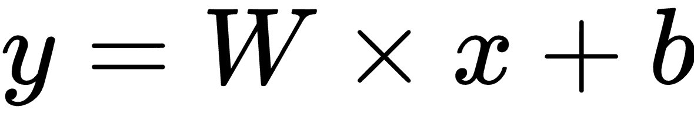
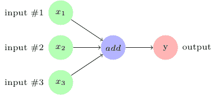
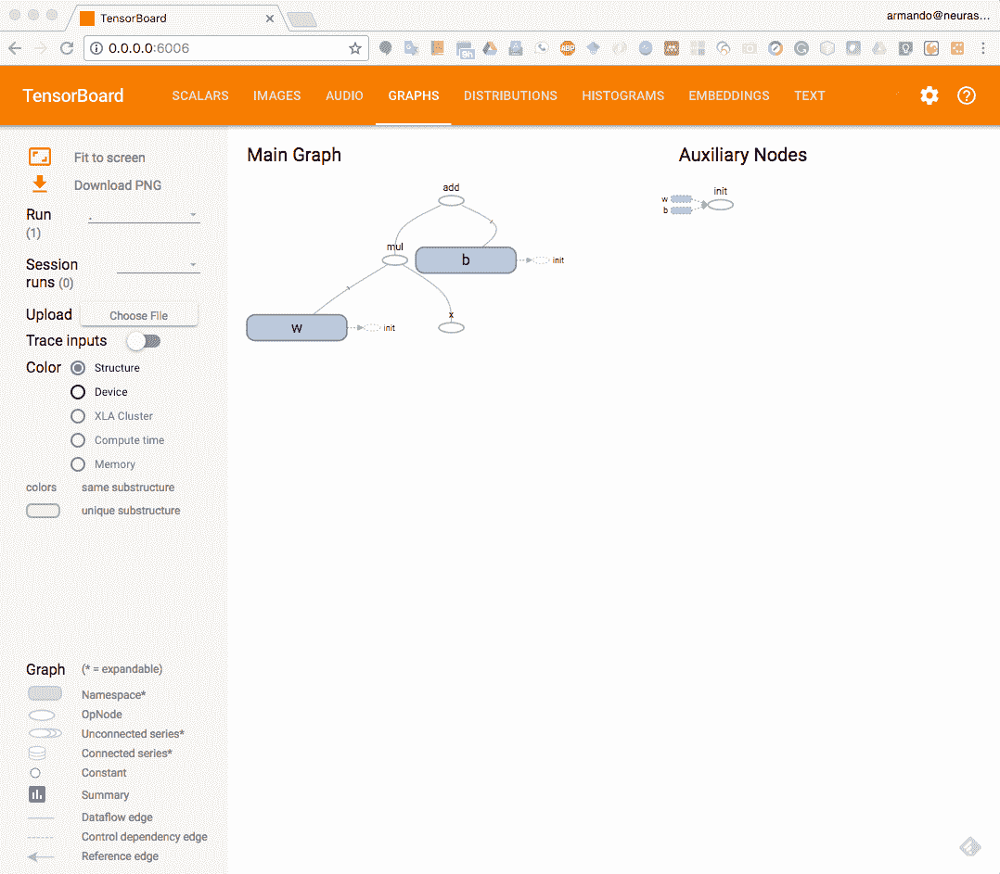
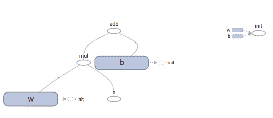

# 一、TensorFlow 101

TensorFlow 是解决机器学习和深度学习问题的流行库之一。在开发供 Google 内部使用后，它作为开源发布供公众使用和开发。让我们理解 TensorFlow 的三个模型**：数据模型**，**编程模型**和**执行模型**。

TensorFlow 数据模型由张量组成，编程模型由数据流图或计算图组成。 TensorFlow 执行模型包括基于依赖条件从序列中触发节点，从依赖于输入的初始节点开始。

在本章中，我们将回顾构成这三个模型的 TensorFlow 元素，也称为核心 TensorFlow。

我们将在本章中介绍以下主题：

*   TensorFlow 核心
    *   张量
    *   常量
    *   占位符
    *   操作
    *   从 Python 对象创建张量
    *   变量
    *   从库函数生成的张量

*   数据流图或计算图
    *   执行顺序和延迟加载
    *   跨计算设备执行图 - CPU 和 GPGPU
    *   多个图
*   TensorBoard 概述

本书的编写注重实际，因此您可以从本书的 GitHub 仓库中克隆代码或从 Packt Publishing 下载它。 您可以使用代码包中包含的 Jupyter Notebook `ch-01_TensorFlow_101`来遵循本章中的代码示例。

# 什么是 TensorFlow？

根据[ TensorFlow 网站](http://www.tensorflow.org)：

TensorFlow 是一个使用数据流图进行数值计算的开源库。

最初由谷歌开发用于其内部消费，它于 2015 年 11 月 9 日开源发布。从那时起，TensorFlow 已被广泛用于开发各种领域的机器学习和深度神经网络模型，并继续在谷歌内部用于研究和产品开发。 TensorFlow 1.0 于 2017 年 2 月 15 日发布。让人怀疑这是否是 Google 向机器学习工程师赠送的情人节礼物！

TensorFlow 可以用数据模型，编程模型和执行模型来描述：

*   **数据模型**由张量组成，它们在 TensorFlow 程序中创建，操作和保存的基本数据单元。
*   **编程模型**由数据流图或计算图组成。在 TensorFlow 中创建程序意味着构建一个或多个 TensorFlow 计算图。
*   **执行**模型包括以依赖序列触发计算图的节点。执行从运行直接连接到输入的节点开始，仅依赖于存在的输入。

要在项目中使用 TensorFlow，您需要学习如何使用 TensorFlow API 进行编程。 TensorFlow 有多个 API，可用于与库交互。 TF API 或库分为两个级别：

*   **低级库**：低级库，也称为 TensorFlow 核心，提供非常细粒度的低级功能，从而提供对如何在模型中使用和实现库的完全控制。我们将在本章介绍 TensorFlow 核心。
*   **高级库**：这些库提供高级功能，并且在模型中相对容易学习和实现。一些库包括 TF Estimators，TFLearn，TFSlim，Sonnet 和 Keras。我们将在下一章介绍其中一些库。

# TensorFlow 核心

TensorFlow 核心是较低级别的库，其上构建了更高级别的 TensorFlow 模块。在深入学习高级 TensorFlow 之前，学习低级库的概念非常重要。在本节中，我们将快速回顾所有这些核心概念。

# 代码预热 - Hello TensorFlow

作为学习任何新编程语言，库或平台的习惯传统，让我们在深入探讨之前，编写简单的 Hello TensorFlow 代码作为热身练习。

我们假设您已经安装了 TensorFlow。 如果还没有，请参阅[ TensorFlow 安装指南](https://www.tensorflow.org/install/)，了解安装 TensorFlow 的详细说明。

打开 Jupyter Notebook 中的文件`ch-01_TensorFlow_101.ipynb`，在学习文本时关注并运行代码。

1.  使用以下代码导入 TensorFlow 库：

```py
import tensorflow as tf
```

1.  获取 TensorFlow 会话。 TensorFlow 提供两种会话：`Session()`和`InteractiveSession()`。我们将使用以下代码创建交互式会话：

```py
tfs = tf.InteractiveSession()
```

`Session()`和`InteractiveSession()`之间的唯一区别是用`InteractiveSession()`创建的会话成为默认会话。因此，我们不需要指定会话上下文以便稍后执行与会话相关的命令。例如，假设我们有一个会话对象`tfs`和一个常量对象`hello`。如果`tfs`是一个`InteractiveSession()`对象，那么我们可以使用代码`hello.eval()`来评估`hello`。如果`tfs`是`Session()`对象，那么我们必须使用`tfs.hello.eval()`或`with`块。最常见的做法是使用`with`块，这将在本章后面介绍。

1.  定义 TensorFlow 常量，`hello`：

```py
hello = tf.constant("Hello TensorFlow !!")
```

1.  在 TensorFlow 会话中执行常量并打印输出：

```py
print(tfs.run(hello))
```

1.  您将获得以下输出：

```py
'Hello TensorFlow !!'
```

现在您已经使用 TensorFlow 编写并执行了前两行代码，让我们来看看 TensorFlow 的基本组成部分。

# 张量

**张量**是 TensorFlow 中计算的基本元素和基本数据结构。可能是您需要学习使用 TensorFlow 的唯一数据结构。张量是由维度，形状和类型标识的 n 维数据集合。

**阶数**是张量的维数，**形状**是表示每个维度的大小的列表。张量可以具有任意数量的尺寸。您可能已经熟悉零维集合（标量），一维集合（向量），二维集合（矩阵）的数量，以及多维集合。

标量值是等级 0 的张量，因此具有[1]的形状。向量或一维数组是秩 1 的张量，并且具有[列]或[行]的形状。矩阵或二维数组是秩 2 的张量，并且具有[行，列]的形状。三维数组将是秩 3 的张量，并且以相同的方式，n 维数组将是秩`n`的张量。

请参阅以下资源以了解有关张量及其数学基础的更多信息：

*   [维基百科上的张量页面](https://en.wikipedia.org/wiki/Tensor)
*   [来自美国国家航空航天局的张量导言](https://www.grc.nasa.gov/www/k-12/Numbers/Math/documents/Tensors_TM2002211716.pdf)

张量可以在其所有维度中存储一种类型的数据，并且其元素的数据类型被称为张量的数据类型。

您还可以在[这里](https://www.tensorflow.org/api_docs/python/tf/DType)查看最新版本的 TensorFlow 库中定义的数据类型。

在编写本书时，TensorFlow 定义了以下数据类型：

| **TensorFlow Python API 数据类型** | **描述** |
| --- | --- |
| `tf.float16` | 16 位半精度浮点数 |
| `tf.float32` | 32 位单精度浮点 |
| `tf.float64` | 64 位双精度浮点 |
| `tf.bfloat16` | 16 位截断浮点 |
| `tf.complex64` | 64 位单精度复合体 |
| `tf.complex128` | 128 位双精度复合体 |
| `tf.int8` | 8 位有符号整数 |
| `tf.uint8` | 8 位无符号整数 |
| `tf.uint16` | 16 位无符号整数 |
| `tf.int16` | 16 位有符号整数 |
| `tf.int32` | 32 位有符号整数 |
| `tf.int64` | 64 位有符号整数 |
| `tf.bool` | 布尔 |
| `tf.string` | 串 |
| `tf.qint8` | 量化的 8 位有符号整数 |
| `tf.quint8` | 量化的 8 位无符号整数 |
| `tf.qint16` | 量化的 16 位有符号整数 |
| `tf.quint16` | 量化的 16 位无符号整数 |
| `tf.qint32` | 量化的 32 位有符号整数 |
| `tf.resource` | 处理可变资源 |

我们建议您避免使用 Python 本地数据类型。 使用 TensorFlow 数据类型来定义张量，而不是 Python 本地数据类型。

可以通过以下方式创建张量：

*   通过定义常量，操作和变量，并将值传递给它们的构造函数。
*   通过定义占位符并将值传递给`session.run()`。
*   通过`tf.convert_to_tensor()`函数转换 Python 对象，如标量值，列表和 NumPy 数组。

让我们来看看创建张量的不同方法。

# 常量

使用具有以下签名的`tf.constant()`函数创建常量值张量：

```py
tf.constant(
  value,
  dtype=None,
  shape=None,
  name='Const',
  verify_shape=False
)
```

让我们看看本书中 Jupyter 笔记本中提供的示例代码：

```py
c1=tf.constant(5,name='x')
c2=tf.constant(6.0,name='y')
c3=tf.constant(7.0,tf.float32,name='z')
```

让我们详细研究一下代码：

*   第一行定义一个常数张量`c1`，给它值 5，并将其命名为 x。
*   第二行定义一个常数张量`c2`，存储值为 6.0，并将其命名为 y。
*   当我们打印这些张量时，我们看到`c1`和`c2`的数据类型由 TensorFlow 自动推导出来。
*   要专门定义数据类型，我们可以使用`dtype`参数或将数据类型作为第二个参数。在前面的代码示例中，我们将`tf.float32`的数据类型定义为`tf.float32`。

让我们打印常量`c1`，`c2`和`c3`：

```py
print('c1 (x): ',c1)
print('c2 (y): ',c2)
print('c3 (z): ',c3)
```

当我们打印这些常量时，我​​们得到以下输出：

```py
c1 (x):  Tensor("x:0", shape=(), dtype=int32)
c2 (y):  Tensor("y:0", shape=(), dtype=float32)
c3 (z):  Tensor("z:0", shape=(), dtype=float32)
```

为了打印这些常量的值，我们必须使用`tfs.run()`命令在 TensorFlow 会话中执行它们：

```py
print('run([c1,c2,c3]) : ',tfs.run([c1,c2,c3]))
```

我们看到以下输出：

```py
run([c1,c2,c3]) :  [5, 6.0, 7.0]
```

# 操作

TensorFlow 为我们提供了许多可以应用于 Tensors 的操作。通过传递值并将输出分配给另一个张量来定义操作。例如，在提供的 Jupyter Notebook 文件中，我们定义了两个操作，`op1`和`op2`：

```py
op1 = tf.add(c2,c3)
op2 = tf.multiply(c2,c3)
```

当我们打印`op1`和`op2`时，我们发现它们被定义为张量：

```py
print('op1 : ', op1)
print('op2 : ', op2)
```

输出如下：

```py
op1 :  Tensor("Add:0", shape=(), dtype=float32)
op2 :  Tensor("Mul:0", shape=(), dtype=float32)
```

要打印这些操作的值，我们必须在 TensorFlow 会话中运行它们：

```py
print('run(op1) : ', tfs.run(op1))
print('run(op2) : ', tfs.run(op2))
```

输出如下：

```py
run(op1) :  13.0
run(op2) :  42.0
```

下表列出了一些内置操作：

| **操作类型** | **操作** |
| --- | --- |
| 算术运算 | `tf.add`，`tf.subtract`，`tf.multiply`，`tf.scalar_mul`，`tf.div`，`tf.divide`，`tf.truediv` ， `tf.floordiv` ， `tf.realdiv` ， `tf.truncatediv` ， `tf.floor_div` ， `tf.truncatemod` ， `tf.floormod` ， `tf.mod` ， `tf.cross` |
| 基本的数学运算 | `tf.add_n`，`tf.abs`，`tf.negative`，`tf.sign`，`tf.reciprocal`，`tf.square`，`tf.round` ， `tf.sqrt` ， `tf.rsqrt` ， `tf.pow` ， `tf.exp` ， `tf.expm1` ， `tf.log` ， `tf.log1p` ， `tf.ceil` ， `tf.floor` ， `tf.maximum` ， `tf.minimum` ， `tf.cos` ， `tf.sin` ， `tf.lbeta` ， `tf.tan` ， `tf.acos` ， `tf.asin` ， `tf.atan` ， `tf.lgamma` ， `tf.digamma` ， `tf.erf` ， `tf.erfc` ， `tf.igamma`， `tf.squared_difference` ， `tf.igammac`，`tf.zeta`，`tf.polygamma`，`tf.betainc`，`tf.rint` |
| 矩阵数学运算 | `tf.diag`，`tf.diag_part`，`tf.trace`，`tf.transpose`，`tf.eye`，`tf.matrix_diag`，`tf.matrix_diag_part`，`tf.matrix_band_part`，`tf.matrix_set_diag`，`tf.matrix_transpose`，`tf.matmul`，`tf.norm`，`tf.matrix_determinant` ]，`tf.matrix_inverse`，`tf.cholesky`，`tf.cholesky_solve`，`tf.matrix_solve`，`tf.matrix_triangular_solve`，`tf.matrix_solve_ls`，`tf.qr, tf.self_adjoint_eig`，`tf.self_adjoint_eigvals`，`tf.svd` |
| 张量数学运算 | `tf.tensordot` |
| 复数运算 | `tf.complex`，`tf.conj`，`tf.imag`，`tf.real` |
| 字符串操作 | `tf.string_to_hash_bucket_fast`，`tf.string_to_hash_bucket_strong`，`tf.as_string`，`tf.encode_base64`，`tf.decode_base64`，`tf.reduce_join`，`tf.string_join`，`tf.string_split`，`tf.substr`，`tf.string_to_hash_bucket` |

# 占位符

虽然常量允许我们在定义张量时提供值，但占位符允许我们创建可在运行时提供其值的张量。 TensorFlow 为`tf.placeholder()`函数提供以下签名以创建占位符：

```py
tf.placeholder(
  dtype,
  shape=None,
  name=None
  )
```

例如，让我们创建两个占位符并打印它们：

```py
p1 = tf.placeholder(tf.float32)
p2 = tf.placeholder(tf.float32)
print('p1 : ', p1)
print('p2 : ', p2)
```

我们看到以下输出：

```py
p1 :  Tensor("Placeholder:0", dtype=float32)
p2 :  Tensor("Placeholder_1:0", dtype=float32)
```

现在让我们使用这些占位符定义一个操作：

```py
op4 = p1 * p2
```

TensorFlow 允许使用速记符号进行各种操作。在前面的例子中，`p1 * p2`是`tf.multiply(p1,p2)`的简写：

```py
print('run(op4,{p1:2.0, p2:3.0}) : ',tfs.run(op4,{p1:2.0, p2:3.0}))
```

上面的命令在 TensorFlow 会话中运行`op4`，为`p1`和`p2`的值提供 Python 字典（`run()`操作的第二个参数）。

输出如下：

```py
run(op4,{p1:2.0, p2:3.0}) :  6.0
```

我们还可以使用`run()`操作中的`feed_dict`参数指定字典：

```py
print('run(op4,feed_dict = {p1:3.0, p2:4.0}) : ',
      tfs.run(op4, feed_dict={p1: 3.0, p2: 4.0}))
```

输出如下：

```py
run(op4,feed_dict = {p1:3.0, p2:4.0}) :  12.0
```

让我们看一下最后一个例子，向量被送到同一个操作：

```py
print('run(op4,feed_dict = {p1:[2.0,3.0,4.0], p2:[3.0,4.0,5.0]}) : ',
    tfs.run(op4,feed_dict = {p1:[2.0,3.0,4.0], p2:[3.0,4.0,5.0]}))
```

输出如下：

```py
run(op4,feed_dict={p1:[2.0,3.0,4.0],p2:[3.0,4.0,5.0]}):[  6\.  12\.  20.]
```

两个输入向量的元素以元素方式相乘。

# 从 Python 对象创建张量

我们可以使用带有以下签名的`tf.convert_to_tensor()`操作从 Python 对象（如列表和 NumPy 数组）创建张量：

```py
tf.convert_to_tensor(
  value,
  dtype=None,
  name=None,
  preferred_dtype=None
  )
```

让我们创建一些张量并打印出来进行练习：

1.  创建并打印 0-D 张量：

```py
tf_t=tf.convert_to_tensor(5.0,dtype=tf.float64)

print('tf_t : ',tf_t)
print('run(tf_t) : ',tfs.run(tf_t))
```

输出如下：

```py
tf_t :  Tensor("Const_1:0", shape=(), dtype=float64)
run(tf_t) : 5.0
```

1.  创建并打印 1-D 张量：

```py
a1dim = np.array([1,2,3,4,5.99])
print("a1dim Shape : ",a1dim.shape)

tf_t=tf.convert_to_tensor(a1dim,dtype=tf.float64)

print('tf_t : ',tf_t)
print('tf_t[0] : ',tf_t[0])
print('tf_t[0] : ',tf_t[2])
print('run(tf_t) : \n',tfs.run(tf_t))
```

输出如下：

```py
a1dim Shape :  (5,)
tf_t :  Tensor("Const_2:0", shape=(5,), dtype=float64)
tf_t[0] :  Tensor("strided_slice:0", shape=(), dtype=float64)
tf_t[0] :  Tensor("strided_slice_1:0", shape=(), dtype=float64)
run(tf_t) : 
 [ 1\.    2\.    3\.    4\.    5.99]
```

1.  创建并打印 2-D Tensor：

```py
a2dim = np.array([(1,2,3,4,5.99),
                  (2,3,4,5,6.99),
                  (3,4,5,6,7.99)
                 ])
print("a2dim Shape : ",a2dim.shape)

tf_t=tf.convert_to_tensor(a2dim,dtype=tf.float64)

print('tf_t : ',tf_t)
print('tf_t[0][0] : ',tf_t[0][0])
print('tf_t[1][2] : ',tf_t[1][2])
print('run(tf_t) : \n',tfs.run(tf_t))
```

输出如下：

```py
a2dim Shape :  (3, 5)
tf_t :  Tensor("Const_3:0", shape=(3, 5), dtype=float64)
tf_t[0][0] :  Tensor("strided_slice_3:0", shape=(), dtype=float64)
tf_t[1][2] :  Tensor("strided_slice_5:0", shape=(), dtype=float64)
run(tf_t) : 
 [[ 1\.    2\.    3\.    4\.    5.99]
  [ 2\.    3\.    4\.    5\.    6.99]
  [ 3\.    4\.    5\.    6\.    7.99]]
```

1.  创建并打印 3-D Tensor：

```py
a3dim = np.array([[[1,2],[3,4]],
                  [[5,6],[7,8]]
                 ])
print("a3dim Shape : ",a3dim.shape)

tf_t=tf.convert_to_tensor(a3dim,dtype=tf.float64)

print('tf_t : ',tf_t)
print('tf_t[0][0][0] : ',tf_t[0][0][0])
print('tf_t[1][1][1] : ',tf_t[1][1][1])
print('run(tf_t) : \n',tfs.run(tf_t))
```

输出如下：

```py
a3dim Shape :  (2, 2, 2)
tf_t :  Tensor("Const_4:0", shape=(2, 2, 2), dtype=float64)
tf_t[0][0][0] :  Tensor("strided_slice_8:0", shape=(), dtype=float64)
tf_t[1][1][1] :  Tensor("strided_slice_11:0", shape=(), dtype=float64)
run(tf_t) : 
 [[[ 1\.  2.][ 3\.  4.]]
  [[ 5\.  6.][ 7\.  8.]]]
```

TensorFlow 可以将 NumPy `ndarray`无缝转换为 TensorFlow 张量，反之亦然。

# 变量

到目前为止，我们已经看到了如何创建各种张量对象：常量，操作和占位符。在使用 TensorFlow 构建和训练模型时，通常需要将参数值保存在可在运行时更新的内存位置。该内存位置由 TensorFlow 中的变量标识。

在 TensorFlow 中，变量是张量对象，它们包含可在程序执行期间修改的值。

虽然`tf.Variable`看起来与`tf.placeholder`类似，但两者之间存在细微差别：

| **`tf.placeholder`** | **`tf.Variable`** |
| --- | --- |
| `tf.placeholder`定义了不随时间变化的输入数据 | `tf.Variable`定义随时间修改的变量值 |
| `tf.placeholder`在定义时不需要初始值 | `tf.Variable`在定义时需要初始值 |

在 TensorFlow 中，可以使用`tf.Variable()`创建变量。让我们看一个带有线性模型的占位符和变量的示例：



1.  我们将模型参数`w`和`b`分别定义为具有`[.3]`和`[-0.3]`初始值的变量：

```py
w = tf.Variable([.3], tf.float32)
b = tf.Variable([-.3], tf.float32)
```

1.  输入`x`定义为占位符，输出`y`定义为操作：

```py
x = tf.placeholder(tf.float32)
y = w * x + b
```

1.  让我们打印`w`，`v`，`x`和`y`，看看我们得到了什么：

```py
print("w:",w)
print("x:",x)
print("b:",b)
print("y:",y)
```

我们得到以下输出：

```py
w: <tf.Variable 'Variable:0' shape=(1,) dtype=float32_ref>
x: Tensor("Placeholder_2:0", dtype=float32)
b: <tf.Variable 'Variable_1:0' shape=(1,) dtype=float32_ref>
y: Tensor("add:0", dtype=float32)
```

输出显示`x`是占位符张量，`y`是操作张量，而`w`和`b`是形状`(1,)`和数据类型`float32`的变量。

在 TensorFlow 会话中使用变量之前，必须先初始化它们。您可以通过运行其初始化程序操作来初始化单个变量。

例如，让我们初始化变量`w`：

```py
tfs.run(w.initializer)
```

但是，在实践中，我们使用 TensorFlow 提供的便利函数来初始化所有变量：

```py
tfs.run(tf.global_variables_initializer())
```

您还可以使用`tf.variables_initializer()`函数来初始化一组变量。

也可以通过以下方式调用全局初始化程序便利函数，而不是在会话对象的`run()`函数内调用：

```py
tf.global_variables_initializer().run()
```

在初始化变量之后，让我们运行我们的模型来给出 x = [1,2,3,4]的值的输出：

```py
print('run(y,{x:[1,2,3,4]}) : ',tfs.run(y,{x:[1,2,3,4]}))
```

我们得到以下输出：

```py
run(y,{x:[1,2,3,4]}) :  [ 0\.          0.30000001  0.60000002  0.90000004]
```

# 从库函数生成的张量

张量也可以从各种 TensorFlow 函数生成。这些生成的张量可以分配给常量或变量，也可以在初始化时提供给它们的构造函数。

例如，以下代码生成 100 个零的向量并将其打印出来：

```py
a=tf.zeros((100,))
print(tfs.run(a))
```

TensorFlow 提供了不同类型的函数来在定义时填充张量：

*   使用相同的值填充所有元素
*   用序列填充元素
*   使用随机概率分布填充元素，例如正态分布或均匀分布

# 使用相同的值填充张量元素

下表列出了一些张量生成库函数，用于使用相同的值填充张量的所有元素：


```py
zeros(
 shape,
 dtype=tf.float32,
 name=None
)
```

创建所提供形状的张量，所有元素都设置为零

---


```py
zeros_like(
 tensor,
 dtype=None,
 name=None,
 optimize=True
)
```

创建与参数形状相同的张量，所有元素都设置为零

---


```py
ones(
 shape,
 dtype=tf.float32,
 name=None
)
```

创建所提供形状的张量，所有元素都设置为 1

---


```py
ones_like(
 tensor,
 dtype=None,
 name=None,
 optimize=True
)
```

创建与参数形状相同的张量，所有元素都设置为 1

---


```py
fill(
 dims,
 value,
 name=None
)
```

创建一个形状的张量作为`dims` 参数，，所有元素都设置为`value`;例如，`a = tf.fill([100],0)`

# 用序列填充张量元素

下表列出了一些张量生成函数，用于使用序列填充张量元素：


```py
lin_space(
 start,
 stop,
 num,
 name=None
)
```

从[`start`，`stop`]范围内的 `num` 序列生成 1-D 张量。张量与`start`参数具有相同的数据类型。例如，`a = tf.lin_space(1,100,10)`生成值为`[1,12,23,34,45,56,67,78,89,100]`的张量。

---


```py
range(
 limit,
 delta=1,
 dtype=None,
 name='range'
)

range(
 start, 
 limit, 
 delta=1,
 dtype=None,
 name='range'
)
```

从[`start`，`limit`]范围内的数字序列生成 1-D 张量，增量为`delta`。如果未指定`dtype`参数，则张量具有与`start` 参数相同的数据类型。 此函数有两个版本。在第二个版本中，如果省略`start` 参数，则`start`变为数字 0。例如，`a = tf.range(1,91,10)`生成具有值`[1,11,21,31,41,51,61,71,81]`的张量。请注意，`limit`参数的值（即 91）不包含在最终生成的序列中。

# 使用随机分布填充张量元素

TensorFlow 为我们提供了生成填充随机值分布的张量的函数。

生成的分布受图级别或操作级别种子的影响。使用`tf.set_random_seed`设置图级种子，而在所有随机分布函数中给出操作级种子作为参数`seed`。如果未指定种子，则使用随机种子。

有关 TensorFlow 中随机种子的更多详细信息，请访问[此链接](https://www.tensorflow.org/api_docs/python/tf/set_random_seed)。

下表列出了一些张量生成函数，用于使用随机值分布填充张量元素：

```py
random_normal(
 shape,
 mean=0.0,
 stddev=1.0,
 dtype=tf.float32,
 seed=None,
 name=None
)
```

生成指定形状的张量，填充正态分布的值：`normal(mean, stddev)`。

---

```py
truncated_normal(
 shape,
 mean=0.0,
 stddev=1.0,
 dtype=tf.float32,
 seed=None,
 name=None
)
```

生成指定形状的张量，填充来自截断的正态分布的值：`normal(mean, stddev)`。截断意味着返回的值始终与平均值的距离小于两个标准偏差。

---

```py
random_uniform(
 shape,
 minval=0,
 maxval=None,
 dtype=tf.float32,
 seed=None,
 name=None
) 
```

生成指定形状的张量，填充均匀分布的值：`uniform([minval, maxval))`。

---

```py
random_gamma(
 shape,
 alpha,
 beta=None,
 dtype=tf.float32,
 seed=None,
 name=None
)
```

生成指定形状的张量，填充来自伽马分布的值：`gamma(alpha,beta)`。有关`random_gamma`函数的更多详细信息，请访问[此链接](https://www.tensorflow.org/api_docs/python/tf/random_gamma)。

# 使用`tf.get_variable()`获取变量

如果使用之前定义的名称定义变量，则 TensorFlow 会抛出异常。因此，使用`tf.get_variable()`函数代替`tf.Variable()`很方便。函数`tf.get_variable()`返回具有相同名称的现有变量（如果存在），并创建具有指定形状的变量和初始化器（如果它不存在）。例如：

```py
w = tf.get_variable(name='w',shape=[1],dtype=tf.float32,initializer=[.3])
b = tf.get_variable(name='b',shape=[1],dtype=tf.float32,initializer=[-.3])
```

初始化程序可以是上面示例中显示的张量或值列表，也可以是内置初始化程序之一：

*   `tf.constant_initializer`
*   `tf.random_normal_initializer`
*   `tf.truncated_normal_initializer`
*   `tf.random_uniform_initializer`
*   `tf.uniform_unit_scaling_initializer`
*   `tf.zeros_initializer`
*   `tf.ones_initializer`
*   `tf.orthogonal_initializer`

在分布式 TensorFlow 中，我们可以跨机器运行代码，`tf.get_variable()`为我们提供了全局变量。要获取局部变量，TensorFlow 具有类似签名的函数：`tf.get_local_variable()`。

**共享或重用变量**：获取已定义的变量可促进重用。但是，如果未使用`tf.variable_scope.reuse_variable()`或`tf.variable.scope(reuse=True)`设置重用标志，则会抛出异常。

现在您已经学会了如何定义张量，常量，运算，占位符和变量，让我们了解 TensorFlow 中的下一级抽象，它将这些基本元素组合在一起形成一个基本的计算单元，即数据流图或计算图。

# 数据流图或计算图

**数据流图**或**计算图**是 TensorFlow 中的基本计算单元。从现在开始，我们将它们称为**计算图**。计算图由节点和边组成。每个节点代表一个操作（`tf.Operation`），每个边代表一个在节点之间传递的张量（`tf.Tensor`）。

TensorFlow 中的程序基本上是计算图。您可以使用表示变量，常量，占位符和操作的节点创建图，并将其提供给 TensorFlow。 TensorFlow 找到它可以触发或执行的第一个节点。触发这些节点会导致其他节点触发，依此类推。

因此，TensorFlow 程序由计算图上的两种操作组成：

*   构建计算图
*   运行计算图

TensorFlow 附带一个默认图。除非明确指定了另一个图，否则会将新节点隐式添加到默认图中。我们可以使用以下命令显式访问默认图：

```py
graph = tf.get_default_graph()
```

例如，如果我们想要定义三个输入并添加它们以产生输出`y = x1 + x2 + x3`，我们可以使用以下计算图来表示它：



在 TensorFlow 中，前一图像中的添加操作将对应于代码`y = tf.add( x1 + x2 + x3 )`。

在我们创建变量，常量和占位符时，它们会添加到图中。然后我们创建一个会话对象，以执行操作对象，评估张量对象。

让我们构建并执行一个计算图来计算`y = w × x + b`，正如我们在前面的例子中已经看到的那样：

```py
# Assume Linear Model y = w * x + b
# Define model parameters
w = tf.Variable([.3], tf.float32)
b = tf.Variable([-.3], tf.float32)
# Define model input and output
x = tf.placeholder(tf.float32)
y = w * x + b
output = 0

with tf.Session() as tfs:
   # initialize and print the variable y
   tf.global_variables_initializer().run()
   output = tfs.run(y,{x:[1,2,3,4]})
print('output : ',output)
```

在`with`块中创建和使用会话可确保在块完成时会话自动关闭。否则，必须使用`tfs.close()`命令显式关闭会话，其中`tfs`是会话名称。

# 执行顺序和延迟加载

节点按依赖顺序执行。如果节点`a`依赖于节点`b`，则`a`将在执行`b`之前执行请求`b`。除非未请求执行节点本身或取决于它的其他节点，否则不执行节点。这也称为延迟加载;即，在需要之前不创建和初始化节点对象。

有时，您可能希望控制在图中执行节点的顺序。这可以通过`tf.Graph.control_dependencies()` 函数实现。 例如，如果图具有节点`a, b, c`和`d`并且您想在`a`和`b`之前执行`c`和`d`，请使用以下语句：

```py
with graph_variable.control_dependencies([c,d]):
  # other statements here
```

这确保了在执行了节点`c`和`d`之后，才执行前面`with`块中的任何节点。

# 跨计算设备执行图 - CPU 和 GPU

图可以分为多个部分，每个部分可以放置在不同的设备上执行，例如 CPU 或 GPU。您可以使用以下命令列出可用于执行图的所有设备：

```py
from tensorflow.python.client import device_lib
print(device_lib.list_local_devices())
```

我们得到以下输出（您的输出会有所不同，具体取决于系统中的计算设备）：

```py
[name: "/device:CPU:0"
device_type: "CPU"
memory_limit: 268435456
locality {
}
incarnation: 12900903776306102093
, name: "/device:GPU:0"
device_type: "GPU"
memory_limit: 611319808
locality {
  bus_id: 1
}
incarnation: 2202031001192109390
physical_device_desc: "device: 0, name: Quadro P5000, pci bus id: 0000:01:00.0, compute capability: 6.1"
]
```

TensorFlow 中的设备用字符串  `/device:&lt;device_type&gt;:&lt;device_idx&gt;`标识。在上述输出中，  `CPU` 和  `GPU` 表示器件类型，`0`表示器件索引。

关于上述输出需要注意的一点是它只显示一个 CPU，而我们的计算机有 8 个 CPU。原因是 TensorFlow 隐式地在 CPU 单元中分配代码，因此默认情况下  `CPU:0` 表示 TensorFlow 可用的所有 CPU。当 TensorFlow 开始执行图时，它在一个单独的线程中运行每个图中的独立路径，每个线程在一个单独的 CPU 上运行。我们可以通过改变  `inter_op_parallelism_threads`的数量来限制用于此目的的线程数。类似地，如果在独立路径中，操作能够在多个线程上运行，TensorFlow 将在多个线程上启动该特定操作。可以通过设置  `intra_op_parallelism_threads`的数量来更改此池中的线程数。

# 将图节点放置在特定的计算设备上

让我们通过定义配置对象来启用变量放置的记录，将`log_device_placement`属性设置为`true`，然后将此`config`对象传递给会话，如下所示：

```py
tf.reset_default_graph()

# Define model parameters
w = tf.Variable([.3], tf.float32)
b = tf.Variable([-.3], tf.float32)
# Define model input and output
x = tf.placeholder(tf.float32)
y = w * x + b

config = tf.ConfigProto()
config.log_device_placement=True

with tf.Session(config=config) as tfs:
  # initialize and print the variable y
  tfs.run(global_variables_initializer())
   print('output',tfs.run(y,{x:[1,2,3,4]}))
```

我们在 Jupyter Notebook 控制台中获得以下输出：

```py
b: (VariableV2): /job:localhost/replica:0/task:0/device:GPU:0
b/read: (Identity): /job:localhost/replica:0/task:0/device:GPU:0
b/Assign: (Assign): /job:localhost/replica:0/task:0/device:GPU:0
w: (VariableV2): /job:localhost/replica:0/task:0/device:GPU:0
w/read: (Identity): /job:localhost/replica:0/task:0/device:GPU:0
mul: (Mul): /job:localhost/replica:0/task:0/device:GPU:0
add: (Add): /job:localhost/replica:0/task:0/device:GPU:0
w/Assign: (Assign): /job:localhost/replica:0/task:0/device:GPU:0
init: (NoOp): /job:localhost/replica:0/task:0/device:GPU:0
x: (Placeholder): /job:localhost/replica:0/task:0/device:GPU:0
b/initial_value: (Const): /job:localhost/replica:0/task:0/device:GPU:0
Const_1: (Const): /job:localhost/replica:0/task:0/device:GPU:0
w/initial_value: (Const): /job:localhost/replica:0/task:0/device:GPU:0
Const: (Const): /job:localhost/replica:0/task:0/device:GPU:0
```

因此，默认情况下，TensorFlow 会在设备上创建变量和操作节点，从而获得最高表现。 可以使用 `tf.device()` 函数将变量和操作放在特定设备上。让我们把图放在 CPU 上：

```py
tf.reset_default_graph()

with tf.device('/device:CPU:0'):
  # Define model parameters
  w = tf.get_variable(name='w',initializer=[.3], dtype=tf.float32)
    b = tf.get_variable(name='b',initializer=[-.3], dtype=tf.float32)
    # Define model input and output
  x = tf.placeholder(name='x',dtype=tf.float32)
    y = w * x + b

config = tf.ConfigProto()
config.log_device_placement=True

with tf.Session(config=config) as tfs:
  # initialize and print the variable y
  tfs.run(tf.global_variables_initializer())
   print('output',tfs.run(y,{x:[1,2,3,4]}))
```

在 Jupyter 控制台中，我们看到现在变量已经放在 CPU 上，并且执行也发生在 CPU 上：

```py
b: (VariableV2): /job:localhost/replica:0/task:0/device:CPU:0
b/read: (Identity): /job:localhost/replica:0/task:0/device:CPU:0
b/Assign: (Assign): /job:localhost/replica:0/task:0/device:CPU:0
w: (VariableV2): /job:localhost/replica:0/task:0/device:CPU:0
w/read: (Identity): /job:localhost/replica:0/task:0/device:CPU:0
mul: (Mul): /job:localhost/replica:0/task:0/device:CPU:0
add: (Add): /job:localhost/replica:0/task:0/device:CPU:0
w/Assign: (Assign): /job:localhost/replica:0/task:0/device:CPU:0
init: (NoOp): /job:localhost/replica:0/task:0/device:CPU:0
x: (Placeholder): /job:localhost/replica:0/task:0/device:CPU:0
b/initial_value: (Const): /job:localhost/replica:0/task:0/device:CPU:0
Const_1: (Const): /job:localhost/replica:0/task:0/device:CPU:0
w/initial_value: (Const): /job:localhost/replica:0/task:0/device:CPU:0
Const: (Const): /job:localhost/replica:0/task:0/device:CPU:0
```

# 简单放置

TensorFlow 遵循这些简单的规则，也称为简单放置，用于将变量放在设备上：

```py
If the graph was previously run, 
    then the node is left on the device where it was placed earlier
Else If the tf.device() block is used,
    then the node is placed on the specified device
Else If the GPU is present
    then the node is placed on the first available GPU
Else If the GPU is not present
    then the node is placed on the CPU
```

# 动态展示位置

`tf.device()` 也可以传递函数名而不是设备字符串。在这种情况下，该函数必须返回设备字符串。此函数允许使用复杂的算法将变量放在不同的设备上。例如，TensorFlow 在  `tf.train.replica_device_setter()` 中提供循环设备设置器，我们将在下一节中讨论。

# 软放置

当您在 GPU 上放置 TensorFlow 操作时，TF 必须具有该操作的 GPU 实现，称为内核。如果内核不存在，则放置会导致运行时错误。此外，如果您请求的 GPU 设备不存在，您将收到运行时错误。处理此类错误的最佳方法是，如果请求 GPU 设备导致 n 错误，则允许将操作置于 CPU 上。这可以通过设置以下`config`值来实现：

```py
config.allow_soft_placement = True
```

# GPU 内存处理

当您开始运行 TensorFlow 会话时，默认情况下它会抓取所有 GPU 内存，即使您将操作和变量仅放置在多 GPU 系统中的一个 GPU 上也是如此。如果您尝试同时运行另一个会话，则会出现内存不足错误。这可以通过多种方式解决：

*   对于多 GPU 系统，请设置环境变量`CUDA_VISIBLE_DEVICES=&lt;list of device idx&gt;`

```py
os.environ['CUDA_VISIBLE_DEVICES']='0'
```

在此设置之后执行的代码将能够获取仅可见 GPU 的所有内存。

*   当您不希望会话占用 GPU 的所有内存时，您可以使用配置选项`per_process_gpu_memory_fraction` 来分配一定百分比的内存：

```py
config.gpu_options.per_process_gpu_memory_fraction = 0.5
```

这将分配所有 GPU 设备的 50%的内存。

*   您还可以结合上述两种策略，即只制作一个百分比，同时只让部分 GPU 对流程可见。
*   您还可以将 TensorFlow 进程限制为仅在进程开始时获取所需的最小内存。随着进程的进一步执行，您可以设置配置选项以允许此内存的增长。

```py
config.gpu_options.allow_growth = True
```

此选项仅允许分配的内存增长，但内存永远不会释放。

您将学习在后面的章节中跨多个计算设备和多个节点分配计算的技术。

# 多个图

您可以创建与默认图分开的图，并在会话中执行它们。但是，不建议创建和执行多个图，因为它具有以下缺点：

*   在同一程序中创建和使用多个图将需要多个 TensorFlow 会话，并且每个会话将消耗大量资源
*   您无法直接在图之间传递数据

因此，推荐的方法是在单个图中包含多个子图。如果您希望使用自己的图而不是默认图，可以使用`tf.graph()`命令执行此操作。下面是我们创建自己的图`g`并将其作为默认图执行的示例：

```py
g = tf.Graph()
output = 0

# Assume Linear Model y = w * x + b

with g.as_default():
 # Define model parameters
 w = tf.Variable([.3], tf.float32)
 b = tf.Variable([-.3], tf.float32)
 # Define model input and output
 x = tf.placeholder(tf.float32)
 y = w * x + b

with tf.Session(graph=g) as tfs:
 # initialize and print the variable y
 tf.global_variables_initializer().run()
 output = tfs.run(y,{x:[1,2,3,4]})

print('output : ',output)
```

# TensorBoard

即使对于中等大小的问题，计算图的复杂性也很高。代表复杂机器学习模型的大型计算图可能变得非常混乱且难以理解。可视化有助于轻松理解和解释计算图，从而加速 TensorFlow 程序的调试和优化。 TensorFlow 附带了一个内置工具，可以让我们可视化计算图，即 TensorBoard。

TensorBoard 可视化计算图结构，提供统计分析并绘制在计算图执行期间作为摘要捕获的值。让我们看看它在实践中是如何运作的。

# TensorBoard 最小的例子

1.  S 通过定义线性模型的变量和占位符来实现：

```py
# Assume Linear Model y = w * x + b
# Define model parameters
w = tf.Variable([.3], name='w',dtype=tf.float32)
b = tf.Variable([-.3], name='b', dtype=tf.float32)
# Define model input and output
x = tf.placeholder(name='x',dtype=tf.float32)
y = w * x + b
```

1.  初始化会话，并在此会话的上下文中，执行以下步骤：
    *   初始化全局变量
    *   创建`tf.summary.FileWriter`将使用默认图中的事件在`tflogs`文件夹中创建输出
    *   获取节点`y`的值，有效地执行我们的线性模型

```py
with tf.Session() as tfs:
    tfs.run(tf.global_variables_initializer())
    writer=tf.summary.FileWriter('tflogs',tfs.graph)
    print('run(y,{x:3}) : ', tfs.run(y,feed_dict={x:3}))
```

1.  我们看到以下输出：

```py
run(y,{x:3}) :  [ 0.60000002]
```

当程序执行时，日志将收集在`tflogs`文件夹中，TensorBoard 将使用该文件夹进行可视化。打开命令行界面，导航到运行`ch-01_TensorFlow_101`笔记本的文件夹，然后执行以下命令：

```py
tensorboard --logdir='tflogs'
```

您会看到类似于此的输出：

```py
Starting TensorBoard b'47' at http://0.0.0.0:6006
```

打开浏览器并导航到`http://0.0.0.0:6006`。看到 TensorBoard 仪表板后，不要担心显示任何错误或警告，只需单击顶部的 GRAPHS 选项卡即可。您将看到以下屏幕：

TensorBoard console

您可以看到 TensorBoard 将我们的第一个简单模型可视化为计算图：

Computation graph in TensorBoard

现在让我们试着了解 TensorBoard 的详细工作原理。

# TensorBoard 详情

TensorBoard 通过读取 TensorFlow 生成的日志文件来工作。因此，我们需要修改此处定义的编程模型，以包含其他操作节点，这些操作节点将在我们想要使用 TensorBoard 可视化的日志中生成信息。编程模型或使用 TensorBoard 的程序流程通常可以说如下：

1.  像往常一样创建计算图。
2.  创建摘要节点。将`tf.summary`包中的摘要操作附加到输出您要收集和分析的值的节点。
3.  运行摘要节点以及运行模型节点。通常，您将使用便捷函数`tf.summary.merge_all()`将所有汇总节点合并到一个汇总节点中。然后执行此合并节点将基本上执行所有摘要节点。合并的摘要节点生成包含所有摘要的并集的序列化`Summary` P rotocolBuffers 对象。

1.  通过将`Summary` ProtocolBuffers 对象传递给`tf.summary.FileWriter`对象将事件日志写入磁盘。
2.  启动 TensorBoard 并分析可视化数据。

在本节中，我们没有创建汇总节点，而是以非常简单的方式使用 TensorBoard。我们将在本书后面介绍 TensorBoard 的高级用法。

# 总结

在本章中，我们快速回顾了 TensorFlow 库。我们了解了可用于构建 TensorFlow 计算图的 TensorFlow 数据模型元素，例如常量，变量和占位符。我们学习了如何从 Python 对象创建 Tensors。张量对象也可以作为特定值，序列或来自 TensorFlow 中可用的各种库函数的随机值分布生成。

TensorFlow 编程模型包括构建和执行计算图。计算图具有节点和边。节点表示操作，边表示将数据从一个节点传输到另一个节点的张量。我们介绍了如何创建和执行图，执行顺序以及如何在不同的计算设备（如 GPU 和 CPU）上执行图。我们还学习了可视化 TensorFlow 计算图 TensorBoard 的工具。

在下一章中，我们将探索构建在 TensorFlow 之上的一些高级库，并允许我们快速构建模型。

