# 四、使用 TensorFlow 的经典机器学习

机器学习是计算机科学领域，涉及算法的研究，开发和应用，以使计算机器从数据中学习。计算机学习的模型用于进行预测和预测。机器学习研究人员和工程师通过构建模型然后使用这些模型进行预测来实现这一目标。现在众所周知，机器学习已成功地应用于各种领域，如自然语言理解，视频处理，图像识别，语音和视觉。

我们来谈谈模型。所有机器学习问题都以一种或另一种形式抽象为以下等式：

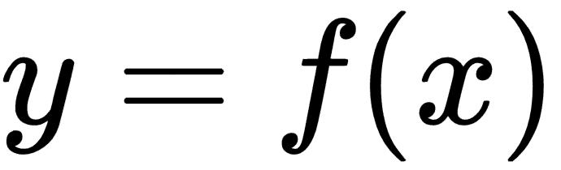

这里，`y`是输出或目标，`x`是输入或特征。如果`x`是一组特征，我们也将其称为特征向量，并用`X`表示。当我们说模型时，我们的意思是找到将特征映射到目标的函数`f`。因此，一旦我们找到`f`，我们就可以使用`x`的新值来预测`y`的值。

机器学习的核心是找到可用于从`x`的值预测`y`的函数`f`。正如您可能从高中数学周期回忆的那样，该线的等式如下：

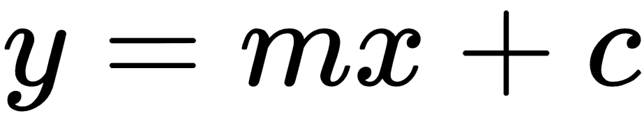

我们可以重写前面的简单等式如下：

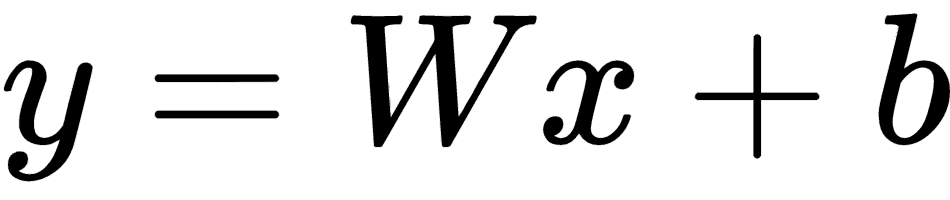

这里，`W`称为权重，`b`称为偏差。不要担心现在的权重和偏置，我们稍后会介绍它们。现在，您可以将`W`视为等效于`m`和`b`等效于`c`。因此，现在机器学习问题可以说是从`X`的当前值找到`W`和`b`的问题，这样该方程可用于预测`y`的值。

回归分析或回归建模是指用于估计变量之间关系的方法和技术。输入到回归模型的变量称为独立变量或预测变量或特征，而回归模型的输出变量称为因变量或目标。回归模型定义如下：

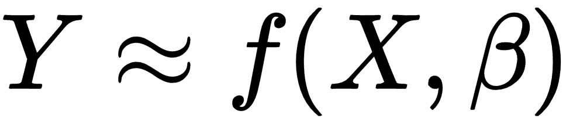

其中`Y`是目标变量，`X`是特征向量，`β`是参数向量

通常，我们使用一种非常简单的回归形式，称为简单线性回归来估计参数 β。

在机器学习问题中，我们必须从给定数据中学习模型参数 `β0`和`β1`，以便我们有一个估计模型，从`X`的未来值预测`Y`的值。我们对偏置使用`β1`，对权重项使用`β0`，分别用`w`和`b`代表它们。

因此模型如下：

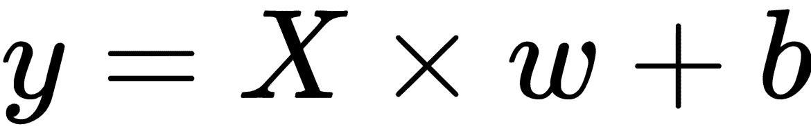

分类是机器学习中的经典问题之一。正在考虑的数据可以属于一个或其他类别，例如，如果提供的图像是数据，则它们可以是猫或狗的图片。因此，在这种情况下，类别是猫和狗。分类是指识别或识别所考虑的数据或对象的标签或类别。分类属于监督机器学习的范畴。在分类问题中，提供具有特征或输入及其相应输出或标签的训练数据集。使用该训练数据集，训练模型；换句话说，计算模型的参数。然后将训练的模型用于新数据以找到其正确的标签。

分类问题可以有两种类型：**两类**或**多类**。两类意味着数据被分类为两个不同且不连续的标签，例如，患者患有癌症或患者没有癌症，图像是猫或狗。多类意味着数据将被分类到多个类别中，例如，电子邮件分类问题会将电子邮件分成社交媒体电子邮件，与工作相关的电子邮件，个人电子邮件，与家人相关的电子邮件，垃圾邮件，购物优惠电子邮件等等。 。另一个例子是数字图片的例子；每张图片可以标记在 0 到 9 之间，具体取决于图片所代表的数字。在本章中，我们将看到两种分类的示例。

在本章中，我们将进一步扩展以下主题：

*   回归
    *   简单的线性回归
    *   多元回归
    *   正则化回归
    *   LASSO 正则化
    *   岭正则化
    *   ElasticNet 正则化
*   分类
    *   使用逻辑回归进行分类
    *   二分类
    *   多类分类

# 简单的线性回归

您可能使用过其他机器学习库；现在让我们练习使用 TensorFlow 学习简单的线性回归模型。在继续讨论特定于域的示例之前，我们将首先使用生成的数据集解释这些概念。

我们将使用生成的数据集，以便来自所有不同域的读者可以学习而不会被示例的特定域的细节所淹没。

您可以按照 Jupyter 笔记本中的代码`ch-04a_Regression`。

# 数据准备

要生成数据集，我们使用`sklearn`库的`datasets`模块中的`make_regression`函数：

```py
from sklearn import datasets as skds
X, y = skds.make_regression(n_samples=200,
                            n_features=1,
                            n_informative=1,
                            n_targets=1,
                            noise = 20.0)
```

这将生成一个回归数据集，其中包含一个特征的 200 个样本值和每个特征的一个目标，并添加了一些噪声。因为我们只生成一个目标，所以该函数使用一维 NumPy 数组生成`y`;因此，我们重塑`y`有两个维度：

```py
if (y.ndim == 1):
    y = y.reshape(len(y),1)
```

我们使用以下代码绘制生成的数据集以查看数据：

```py
import matplotlib.pyplot as plt
plt.figure(figsize=(14,8))
plt.plot(X,y,'b.')
plt.title('Original Dataset')
plt.show()
```

我们得到以下绘图。由于生成的数据是随机的，您可能会得到不同的绘图：

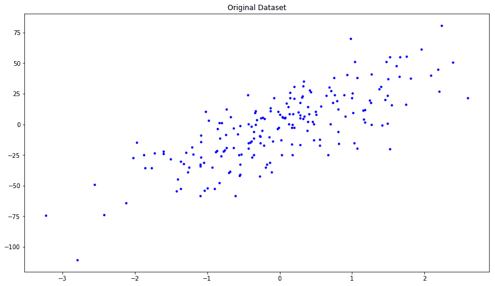

现在让我们将数据分为训练集和测试集：

```py
X_train, X_test, y_train, y_test = skms.train_test_split(X, y, 
                                                 test_size=.4, 
                                                 random_state=123)
```

# 构建一个简单的回归模型

要在 TensorFlow 中构建和训练回归模型，通常采取以下步骤：

1.  定义输入，参数和其他变量。
2.  定义模型。
3.  定义损失函数。
4.  定义优化器函数。
5.  训练模型进行多次迭代，称为周期。

# 定义输入，参数和其他变量

在我们使用 TensorFlow 构建和训练回归模型之前，让我们定义一些重要的变量和操作。我们从`X_train`和`y_train`中找出输出和输入变量的数量，然后使用这些数字来定义`x`（`x_tensor`），`y`（`y_tensor`），权重（`w`）和偏置（`b`）：

```py
num_outputs = y_train.shape[1] 
num_inputs = X_train.shape[1]

x_tensor = tf.placeholder(dtype=tf.float32, 
                   shape=[None, num_inputs], 
                   name="x") 
y_tensor = tf.placeholder(dtype=tf.float32, 
                   shape=[None, num_outputs], 
                   name="y")

w = tf.Variable(tf.zeros([num_inputs,num_outputs]), 
                dtype=tf.float32, 
                name="w") 
b = tf.Variable(tf.zeros([num_outputs]), 
                dtype=tf.float32, 
                name="b")
```

*   `x_tensor`被定义为具有可变行和`num_inputs`列的形状，并且在我们的示例中列数仅为 1
*   `y_tensor`定义为具有可变行和`num_outputs`列的形状，列数在我们的示例中只有一个
*   `w`被定义为维度`num_inputs` x `num_outputs`的变量，在我们的例子中是`1 x 1`
*   `b`被定义为维度`num_outputs`的变量，在我们的例子中是一个

# 定义模型

接下来，我们将模型定义为`x_tensor × w + b`：

```py
model = tf.matmul(x_tensor, w) + b
```

# 定义损失函数

接下来，我们使用**均方误差**（**MSE**）定义损失函数。 MSE 定义如下：

有关 MSE 的更多详细信息，[请访问此链接](http://www.statisticshowto.com/mean-squared-error/)

`y`的实际值和估计值的差异称为**残差**。损失函数计算残差平方的平均值。我们通过以下方式在 TensorFlow 中定义它：

```py
loss = tf.reduce_mean(tf.square(model - y_tensor))
```

*   `model - y_tensor`计算残差
*   `tf.square(model - y_tensor)`计算每个残差的平方
*   `tf.reduce_mean( ... )`最终计算在前一步骤中计算的平方均值

我们还定义**均方误差**（**mse**）和 **r 平方**（**rs**）函数来评估训练模型。我们使用单独的`mse`函数，因为在接下来的章节中，损失函数将改变但`mse`函数将保持不变。

```py
# mse and R2 functions
mse = tf.reduce_mean(tf.square(model - y_tensor))
y_mean = tf.reduce_mean(y_tensor)
total_error = tf.reduce_sum(tf.square(y_tensor - y_mean))
unexplained_error = tf.reduce_sum(tf.square(y_tensor - model))
rs = 1 - tf.div(unexplained_error, total_error)
```

# 定义优化器函数

接下来，我们实例化学习率为 0.001 的`theGradientDescentOptimizer`函数并将其设置为最小化损失函数：

```py
learning_rate = 0.001
optimizer = tf.train.GradientDescentOptimizer(learning_rate).minimize(loss)
```

有关梯度下降的更多详细信息，请访问此链接：

<https://en.wikipedia.org/wiki/Gradient_descent>

<https://www.analyticsvidhya.com/blog/2017/03/introduction-to-gradient-descent-algorithm-along-its-variants/>

TensorFlow 提供了许多其他优化器函数，如 Adadelta，Adagrad 和 Adam。我们将在以下章节中介绍其中一些内容。

# 训练模型

现在我们已经定义了模型，损失函数和优化函数，训练模型来学习参数`w`和`b`。要训​​练模型，请定义以下全局变量：

*   `num_epochs`：运行训练的迭代次数。每次迭代，模型都会学习更好的参数，我们将在后面的图中看到。
*   `w_hat`和`b_hat`：收集估计的`w`和`b`参数。
*   `loss_epochs`，`mse_epochs`，`rs_epochs`：收集训练数据集中的总误差值，以及每次迭代中测试数据集上模型的 mse 和 r 平方值。
*   `mse_score`和`rs_score`：收集最终训练模型的 mse 和 r 平方值。

```py
num_epochs = 1500
w_hat = 0
b_hat = 0
loss_epochs = np.empty(shape=[num_epochs],dtype=float)
mse_epochs = np.empty(shape=[num_epochs],dtype=float)
rs_epochs = np.empty(shape=[num_epochs],dtype=float)

mse_score = 0
rs_score = 0
```

初始化会话和全局变量后，运行`num_epoch`次的训练循环：

```py
with tf.Session() as tfs:
   tf.global_variables_initializer().run()
   for epoch in range(num_epochs):
```

在循环的每次迭代中，在训练数据上运行优化器：

```py
tfs.run(optimizer, feed_dict={x_tensor: X_train, y_tensor: y_train})
```

使用学习的`w`和`b`值，计算误差并将其保存在`loss_val`中以便稍后绘制：

```py
loss_val = tfs.run(loss,feed_dict={x_tensor: X_train, y_tensor: y_train})
loss_epochs[epoch] = loss_val
```

计算测试数据预测值的均方误差和 r 平方值：

```py
mse_score = tfs.run(mse,feed_dict={x_tensor: X_test, y_tensor: y_test})
mse_epochs[epoch] = mse_score

rs_score = tfs.run(rs,feed_dict={x_tensor: X_test, y_tensor: y_test})
rs_epochs[epoch] = rs_score
```

最后，一旦完成循环，保存`w`和`b`的值以便稍后绘制它们：

```py
w_hat,b_hat = tfs.run([w,b])
w_hat = w_hat.reshape(1)
```

让我们在 2,000 次迭代后打印模型和测试数据的最终均方误差：

```py
print('model : Y = {0:.8f} X + {1:.8f}'.format(w_hat[0],b_hat[0]))
print('For test data : MSE = {0:.8f}, R2 = {1:.8f} '.format(
    mse_score,rs_score))
```

This gives us the following output:

```py
model : Y = 20.37448120 X + -2.75295663
For test data : MSE = 297.57995605, R2 = 0.66098368 
```

因此，我们训练的模型不是一个非常好的模型，但我们将在后面的章节中看到如何使用神经网络来改进它。

本章的目标是介绍如何使用 TensorFlow 构建和训练回归模型，而无需使用神经网络。

让我们绘制估计模型和原始数据：

```py
plt.figure(figsize=(14,8))
plt.title('Original Data and Trained Model')
x_plot = [np.min(X)-1,np.max(X)+1]
y_plot = w_hat*x_plot+b_hat
plt.axis([x_plot[0],x_plot[1],y_plot[0],y_plot[1]])
plt.plot(X,y,'b.',label='Original Data')
plt.plot(x_plot,y_plot,'r-',label='Trained Model')
plt.legend()
plt.show()
```

我们得到以下原始数据与受训模型数据的关系图：

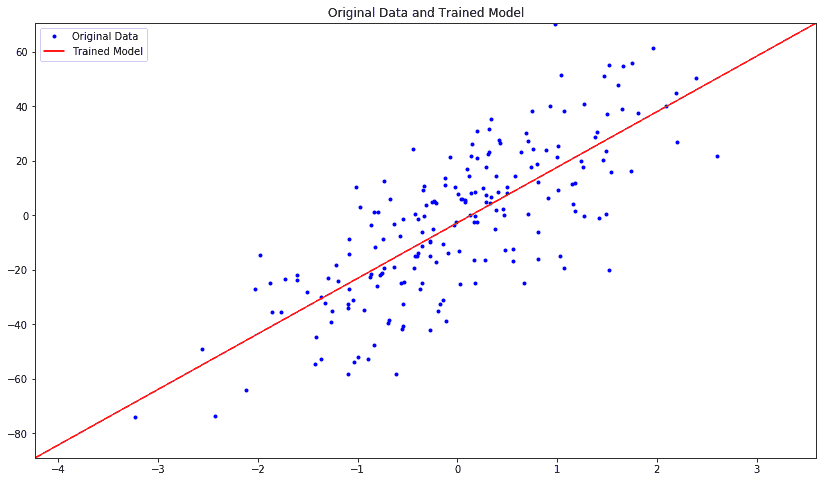

让我们绘制每次迭代中训练和测试数据的均方误差：

```py
plt.figure(figsize=(14,8))

plt.axis([0,num_epochs,0,np.max(loss_epochs)])
plt.plot(loss_epochs, label='Loss on X_train')
plt.title('Loss in Iterations')
plt.xlabel('# Epoch')
plt.ylabel('MSE')

plt.axis([0,num_epochs,0,np.max(mse_epochs)])
plt.plot(mse_epochs, label='MSE on X_test')
plt.xlabel('# Epoch')
plt.ylabel('MSE')
plt.legend()

plt.show()
```

我们得到以下图，显示每次迭代时，均方误差减小，然后保持在 500 附近的相同水平：

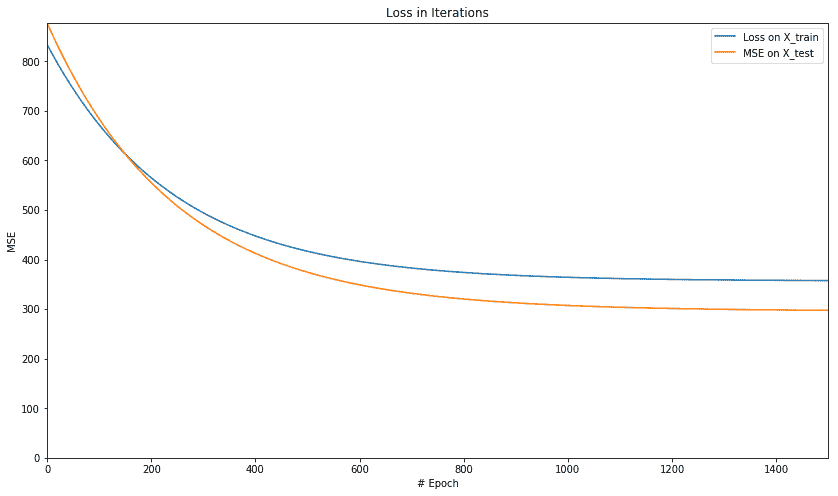

让我们绘制 r 平方的值：

```py
plt.figure(figsize=(14,8))
plt.axis([0,num_epochs,0,np.max(rs_epochs)])
plt.plot(rs_epochs, label='R2 on X_test')
plt.xlabel('# Epoch')
plt.ylabel('R2')
plt.legend()
plt.show()
```

当我们绘制 r 平方超过周期的值时，我们得到以下图：


这基本上表明该模型以 r 的平均值开始，但随着模型的训练并减少误差，r 平方的值开始变高，最终在某一点变得稳定略高于 0.6。

绘制 MSE 和 r-squared 可以让我们看到我们的模型得到多快的训练以及它开始变得稳定的地方，以便进一步的训练在减少错误方面产生微不足道的好处或几乎没有好处。

# 使用训练的模型进行预测

现在您已经拥有训练有素的模型，它可用于预测新数据。线性模型的预测是通过理解我们在前一个图中看到的一些最小均方误差得出的，因为直线可能不完全适合数据。

为了获得更好的拟合模型，我们必须使用不同的方法扩展我们的模型，例如添加变量的线性组合。

# 多元回归

现在您已经学习了如何使用 TensorFlow 创建基本回归模型，让我们尝试在不同域的示例数据集上运行它。我们作为示例数据集生成的数据集是单变量的，即目标仅依赖于一个特征。

实际上，大多数数据集都是多变量的。为了强调一点，目标取决于多个变量或特征，因此回归模型称为**多元回归**或**多维回归**。

我们首先从最受欢迎的波士顿数据集开始。该数据集包含波士顿 506 所房屋的 13 个属性，例如每个住所的平均房间数，一氧化氮浓度，到波士顿五个就业中心的加权距离等等。目标是自住房屋的中位数值。让我们深入探索这个数据集的回归模型。

从`sklearn`库加载数据集并查看其描述：

```py
boston=skds.load_boston()
print(boston.DESCR)
X=boston.data.astype(np.float32)
y=boston.target.astype(np.float32)
if (y.ndim == 1):
    y = y.reshape(len(y),1)
X = skpp.StandardScaler().fit_transform(X)
```

我们还提取`X`，一个特征矩阵，和`y`，一个前面代码中的目标向量。我们重塑`y`使其成为二维的，并将`x`中的特征缩放为平均值为零，标准差为 1。现在让我们使用这个`X`和`y`来训练回归模型，就像我们在前面的例子中所做的那样：

您可能会发现该示例的代码与上一部分有关简单回归的代码相似； 但是，我们正在使用多种特征来训练模型，因此将其称为多元回归。

```py
X_train, X_test, y_train, y_test = skms.train_test_split(X, y, 
    test_size=.4, random_state=123)
num_outputs = y_train.shape[1] 
num_inputs = X_train.shape[1]

x_tensor = tf.placeholder(dtype=tf.float32, 
    shape=[None, num_inputs], name="x") 
y_tensor = tf.placeholder(dtype=tf.float32, 
    shape=[None, num_outputs], name="y") 

w = tf.Variable(tf.zeros([num_inputs,num_outputs]), 
    dtype=tf.float32, name="w") 
b = tf.Variable(tf.zeros([num_outputs]), 
    dtype=tf.float32, name="b") 

model = tf.matmul(x_tensor, w) + b
loss = tf.reduce_mean(tf.square(model - y_tensor))
# mse and R2 functions
mse = tf.reduce_mean(tf.square(model - y_tensor))
y_mean = tf.reduce_mean(y_tensor)
total_error = tf.reduce_sum(tf.square(y_tensor - y_mean))
unexplained_error = tf.reduce_sum(tf.square(y_tensor - model))
rs = 1 - tf.div(unexplained_error, total_error)

learning_rate = 0.001
optimizer = tf.train.GradientDescentOptimizer(learning_rate).minimize(loss)

num_epochs = 1500
loss_epochs = np.empty(shape=[num_epochs],dtype=np.float32)
mse_epochs = np.empty(shape=[num_epochs],dtype=np.float32)
rs_epochs = np.empty(shape=[num_epochs],dtype=np.float32)

mse_score = 0
rs_score = 0

with tf.Session() as tfs:
    tfs.run(tf.global_variables_initializer())
    for epoch in range(num_epochs):
        feed_dict = {x_tensor: X_train, y_tensor: y_train}
        loss_val, _ = tfs.run([loss, optimizer], feed_dict)
        loss_epochs[epoch] = loss_val

        feed_dict = {x_tensor: X_test, y_tensor: y_test}
        mse_score, rs_score = tfs.run([mse, rs], feed_dict)
        mse_epochs[epoch] = mse_score
        rs_epochs[epoch] = rs_score

print('For test data : MSE = {0:.8f}, R2 = {1:.8f} '.format(
    mse_score, rs_score))
```

我们从模型中获得以下输出：

```py
For test data : MSE = 30.48501778, R2 = 0.64172244 
```

让我们绘制 MSE 和 R 平方值。

下图显示了 MSE 的绘图：

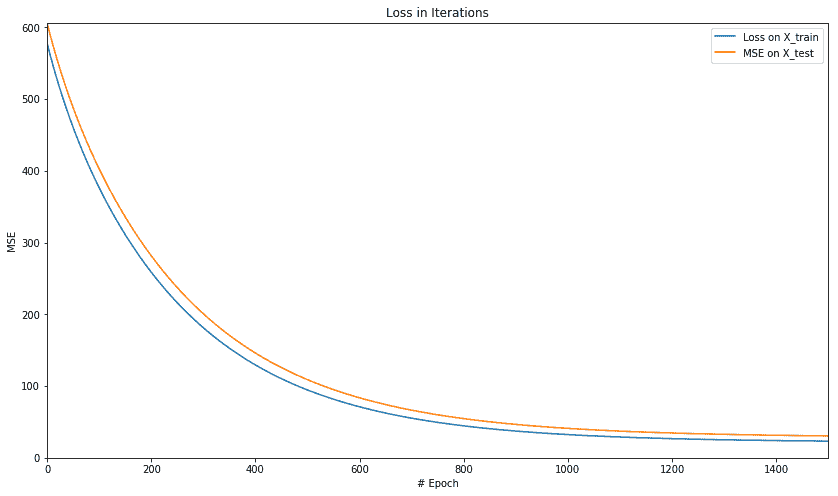

下图显示了 R 平方值的绘图：


正如我们在单变量数据集中看到的那样，我们看到了 MSE 和 r 平方的类似模式。

# 正则化回归

在线性回归中，我们训练的模型返回训练数据的最佳拟合参数。但是，在训练数据上找到最合适的参数可能会导致过拟合。

**过拟合**意味着模型最适合训练数据，但会给测试数据带来更大的误差。因此，我们通常在模型中添加惩罚项以获得更简单的模型。

该惩罚项称为**正则化**项，由此获得的回归模型称为正则化回归模型。正则化模型有三种主要类型：

*   **LASSO 回归**：在 LASSO 正则化中，也称为 L1 正则化，正则化项是 LASSO 参数`α`乘以权重`w`绝对值之和。因此，损失函数如下：

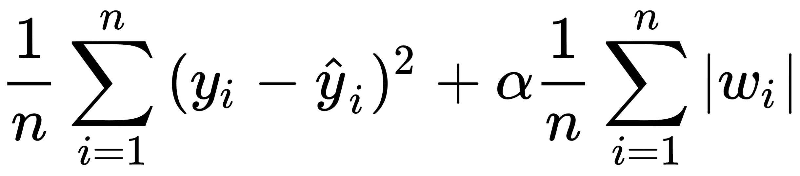

*   **岭回归**：在岭正则化中，也称为 L2 正则化，正则化项是岭参数`α`乘以`i-th`权重`w`的平方和。因此，损失函数如下：

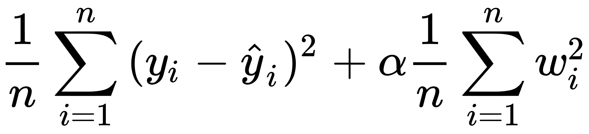

*   **ElasticNet 回归**：当我们添加 LASSO 和岭正则化项时，得到的正则化称为 ElasticNet 正则化。因此，损失函数如下：

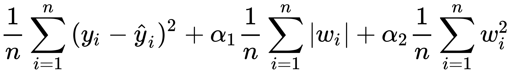

有关正则化的更多详细信息，[请参阅互联网上的这些资源](http://www.statisticshowto.com/regularization/)。

一个简单的经验法则是当我们想要删除某些特征时使用 L1 或 Lasso，从而减少计算时间，但代价是降低了准确率。

现在让我们看看在 TensorFlow 中实现的这些正则化损失函数。我们将继续使用前面示例中使用的 Boston 数据集。

# LASSO 正则化

我们将 lasso 参数定义为值 0.8：

```py
lasso_param = tf.Variable(0.8, dtype=tf.float32)
lasso_loss = tf.reduce_mean(tf.abs(w)) * lasso_param
```

将 LASSO 参数设置为零意味着没有正则化，因为该项变为零。正则化项的值越高，惩罚越高。以下是 LASSO 正则化回归的完整代码，用于训练模型以预测波士顿房屋定价：

下面的代码假定训练和测试数据集已按照前面的示例进行拆分。

```py
num_outputs = y_train.shape[1]
num_inputs = X_train.shape[1]

x_tensor = tf.placeholder(dtype=tf.float32,
                          shape=[None, num_inputs], name='x')
y_tensor = tf.placeholder(dtype=tf.float32,
                          shape=[None, num_outputs], name='y')

w = tf.Variable(tf.zeros([num_inputs, num_outputs]),
                dtype=tf.float32, name='w')
b = tf.Variable(tf.zeros([num_outputs]),
                dtype=tf.float32, name='b')

model = tf.matmul(x_tensor, w) + b

lasso_param = tf.Variable(0.8, dtype=tf.float32)
lasso_loss = tf.reduce_mean(tf.abs(w)) * lasso_param

loss = tf.reduce_mean(tf.square(model - y_tensor)) + lasso_loss

learning_rate = 0.001
optimizer = tf.train.GradientDescentOptimizer(learning_rate).minimize(loss)

mse = tf.reduce_mean(tf.square(model - y_tensor))
y_mean = tf.reduce_mean(y_tensor)
total_error = tf.reduce_sum(tf.square(y_tensor - y_mean))
unexplained_error = tf.reduce_sum(tf.square(y_tensor - model))
rs = 1 - tf.div(unexplained_error, total_error)

num_epochs = 1500
loss_epochs = np.empty(shape=[num_epochs],dtype=np.float32)
mse_epochs = np.empty(shape=[num_epochs],dtype=np.float32)
rs_epochs = np.empty(shape=[num_epochs],dtype=np.float32)

mse_score = 0.0
rs_score = 0.0

num_epochs = 1500
loss_epochs = np.empty(shape=[num_epochs], dtype=np.float32)
mse_epochs = np.empty(shape=[num_epochs], dtype=np.float32)
rs_epochs = np.empty(shape=[num_epochs], dtype=np.float32)

mse_score = 0.0
rs_score = 0.0

with tf.Session() as tfs:
    tfs.run(tf.global_variables_initializer())
    for epoch in range(num_epochs):
        feed_dict = {x_tensor: X_train, y_tensor: y_train}
        loss_val,_ = tfs.run([loss,optimizer], feed_dict)
        loss_epochs[epoch] = loss_val

        feed_dict = {x_tensor: X_test, y_tensor: y_test}
        mse_score,rs_score = tfs.run([mse,rs], feed_dict)
        mse_epochs[epoch] = mse_score
        rs_epochs[epoch] = rs_score

print('For test data : MSE = {0:.8f}, R2 = {1:.8f} '.format(
    mse_score, rs_score))
```

我们得到以下输出：

```py
For test data : MSE = 30.48978233, R2 = 0.64166653
```

让我们使用以下代码绘制 MSE 和 r 平方的值：

```py
plt.figure(figsize=(14,8))

plt.axis([0,num_epochs,0,np.max([loss_epochs,mse_epochs])])
plt.plot(loss_epochs, label='Loss on X_train')
plt.plot(mse_epochs, label='MSE on X_test')
plt.title('Loss in Iterations')
plt.xlabel('# Epoch')
plt.ylabel('Loss or MSE')
plt.legend()

plt.show()

plt.figure(figsize=(14,8))

plt.axis([0,num_epochs,np.min(rs_epochs),np.max(rs_epochs)])
plt.title('R-squared in Iterations')
plt.plot(rs_epochs, label='R2 on X_test')
plt.xlabel('# Epoch')
plt.ylabel('R2')
plt.legend()

plt.show()
```

我们得到以下损失绘图：

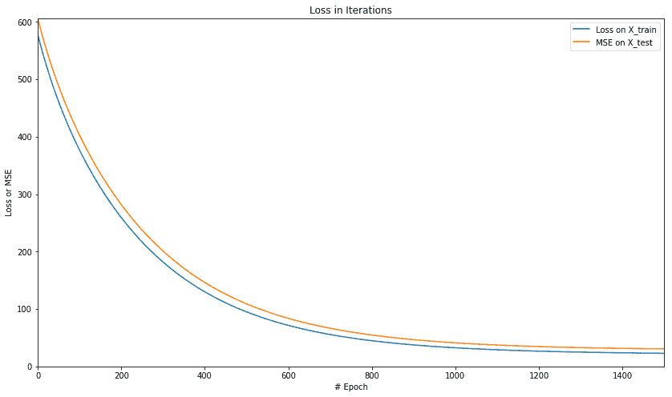

迭代中 R 平方的图如下：


让我们用岭回归重复相同的例子。

# 岭正则化

以下是岭正则化回归的完整代码，用于训练模型以预测波士顿房屋定价：

```py
num_outputs = y_train.shape[1]
num_inputs = X_train.shape[1]

x_tensor = tf.placeholder(dtype=tf.float32,
                          shape=[None, num_inputs], name='x')
y_tensor = tf.placeholder(dtype=tf.float32,
                          shape=[None, num_outputs], name='y')

w = tf.Variable(tf.zeros([num_inputs, num_outputs]),
                dtype=tf.float32, name='w')
b = tf.Variable(tf.zeros([num_outputs]),
                dtype=tf.float32, name='b')

model = tf.matmul(x_tensor, w) + b

ridge_param = tf.Variable(0.8, dtype=tf.float32)
ridge_loss = tf.reduce_mean(tf.square(w)) * ridge_param

loss = tf.reduce_mean(tf.square(model - y_tensor)) + ridge_loss

learning_rate = 0.001
optimizer = tf.train.GradientDescentOptimizer(learning_rate).minimize(loss)

mse = tf.reduce_mean(tf.square(model - y_tensor))
y_mean = tf.reduce_mean(y_tensor)
total_error = tf.reduce_sum(tf.square(y_tensor - y_mean))
unexplained_error = tf.reduce_sum(tf.square(y_tensor - model))
rs = 1 - tf.div(unexplained_error, total_error)

num_epochs = 1500
loss_epochs = np.empty(shape=[num_epochs],dtype=np.float32)
mse_epochs = np.empty(shape=[num_epochs],dtype=np.float32)
rs_epochs = np.empty(shape=[num_epochs],dtype=np.float32)

mse_score = 0.0
rs_score = 0.0

with tf.Session() as tfs:
    tfs.run(tf.global_variables_initializer())
    for epoch in range(num_epochs):
        feed_dict = {x_tensor: X_train, y_tensor: y_train}
        loss_val, _ = tfs.run([loss, optimizer], feed_dict=feed_dict)
        loss_epochs[epoch] = loss_val

        feed_dict = {x_tensor: X_test, y_tensor: y_test}
        mse_score, rs_score = tfs.run([mse, rs], feed_dict=feed_dict)
        mse_epochs[epoch] = mse_score
        rs_epochs[epoch] = rs_score

print('For test data : MSE = {0:.8f}, R2 = {1:.8f} '.format(
    mse_score, rs_score))

```

我们得到以下结果：

```py
For test data : MSE = 30.64177132, R2 = 0.63988018 
```

绘制损失和 MSE 的值，我们得到以下损失图：

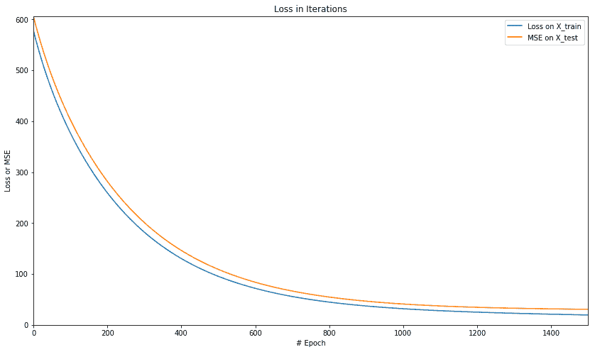

我们得到以下 R 平方图：


让我们来看看 LASSO 和岭正则化方法的组合。

# ElasticNet 正则化

笔记本`ch-04a_Regression`提供了 ElasticNet 正规回归的完整代码，用于训练模型以预测波士顿房屋定价。在运行模型时，w e 得到以下结果：

```py
For test data : MSE = 30.64861488, R2 = 0.63979971
```

绘制损失和 MSE 的值，我们得到以下图：

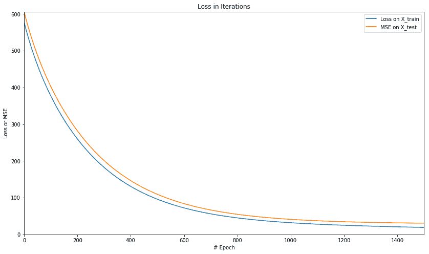

我们得到以下 R 平方图：

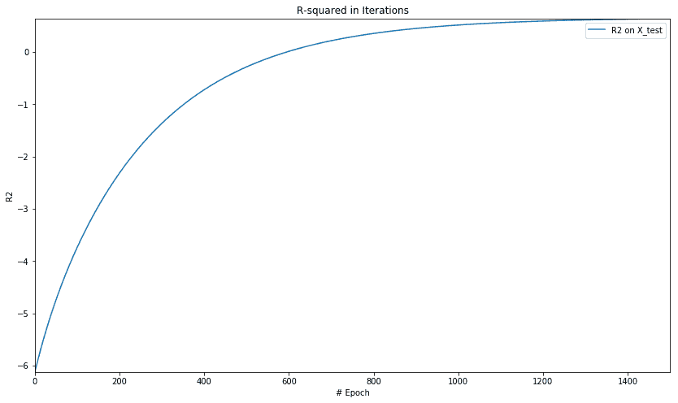

# 使用逻辑回归进行分类

最常用的分类方法是使用逻辑回归。逻辑回归是概率和线性分类器。输入是特征向量，特定类的成员的概率可以正式写成如下等式：

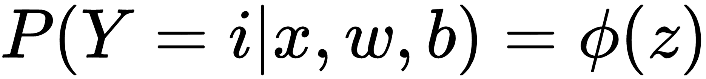In the above equation:

*   `y`代表输出，
*   `i`代表其中一个类
*   `x`代表输入
*   `w`代表权重
*   `b`代表偏置
*   `z`代表回归方程`z = w × x + b`
*   `φ`代表我们案例中的平滑函数或模型

前面的等式表示当`w`和`b`被给出时`x`属于`i`类的概率由函数表示`φ（(z)`。因此，必须训练模型以最大化概率值。

# 二分类的逻辑回归

对于二分类，我们将模型函数`φ(z)`定义为 sigmoid 函数，如下所示：

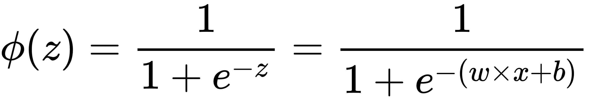

sigmoid 函数在范围[0,1]之间产生 y 的值。因此，我们可以使用`y = φ(z)`的值来预测类：如果`y > 0.5`则 class 等于 1，否则 class 等于 0。

正如我们在本章的前几节中所见，对于线性回归，可以通过查找最小化损失函数的参数来训练模型，并且损失函数可以是平方误差或均方误差的总和。对于逻辑回归，我们希望最大化可能性：`L(w) = P(y|x, w, b)`。

但是，由于更容易使对数似然最大化，因此我们使用对数似然`l(w)`作为成本函数。因此，损失函数（`J(w)`）被写为 `-1(w)`，其可以使用诸如梯度下降的优化算法来最小化。

二元逻辑回归的损失函数在数学上写成如下：


其中`φ(z)`是 S 形函数。

我们将在下一节中实现这个损失函数。

# 多类分类的逻辑回归

当涉及两个以上的类时，逻辑回归是已知的多项逻辑回归。在多项逻辑回归中，我们使用 softmax 函数代替 sigmoid，它是最受欢迎的函数之一。 Softmax 可以用数学表示如下：

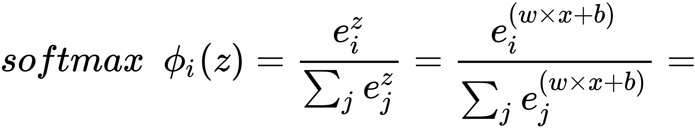

Softmax 函数产生每个类的概率，概率向量加 1.在预测时，具有最高 softmax 值的类成为输出或预测类。正如我们前面讨论的那样，损失函数是负对数似然函数`-l(w)`，它可以被优化器最小化，例如梯度下降。

多项逻辑回归的损失函数正式写成如下：

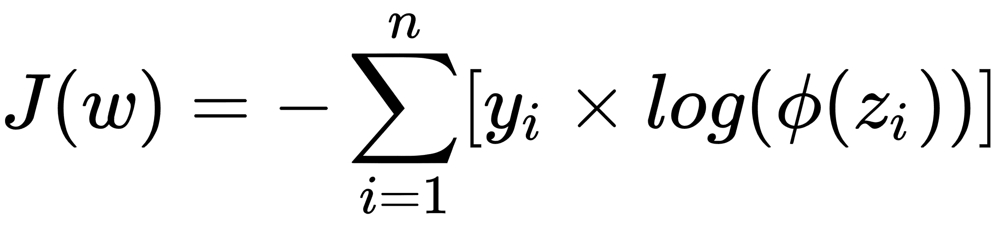

其中`φ(z)`是 softmax 函数。

我们将在本章后面实现这种损失函数。

让我们在下一节中深入研究一些例子。

您可以按照 Jupyter 笔记本中的代码`ch-04b_Classification`。

# 二分类

二分类是指仅有两个不同类的问题。正如我们在上一章中所做的那样，我们将使用 SciKit Learn 库中的便捷函数`make_classification()`生成数据集：

```py
X, y = skds.make_classification(n_samples=200,
   n_features=2,
   n_informative=2, 
   n_redundant=0, 
   n_repeated=0,
   n_classes=2,
   n_clusters_per_class=1)
if (y.ndim == 1):
    y = y.reshape(-1,1)
```

`make_classification()`的论据是不言自明的； `n_samples`是要生成的数据点数，`n_features`是要生成的特征数，`n_classes`是类的数量，即 2：

*   `n_samples`是要生成的数据点数。我们将其保持在 200 以保持数据集较小。
*   `n_features`是要生成的特征数量；我们只使用两个特征，因此我们可以将它作为一个简单的问题来理解 TensorFlow 命令。
*   `n_classes`是类的数量，它是 2，因为它是二分类问题。

让我们使用以下代码绘制数据：

```py
plt.scatter(X[:,0],X[:,1],marker='o',c=y)
plt.show()
```

我们得到以下绘图；您可能会得到一个不同的图，因为每次运行数据生成函数时都会随机生成数据：

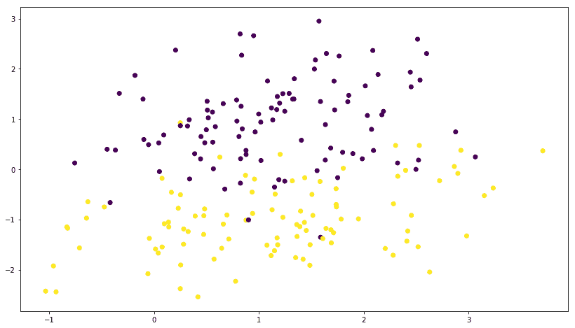

然后我们使用 NumPy `eye`函数将`y`转换为单热编码目标：

```py
print(y[0:5])
y=np.eye(num_outputs)[y]
print(y[0:5])
```

单热编码目标如下所示：

```py

[1 0 0 1 0]
[[ 0\.  1.]
 [ 1\.  0.]
 [ 1\.  0.]
 [ 0\.  1.]
 [ 1\.  0.]]
```

将数据划分为训练和测试类别：

```py
X_train, X_test, y_train, y_test = skms.train_test_split(
    X, y, test_size=.4, random_state=42)
```

在分类中，我们使用 sigmoid 函数来量化模型的值，使得输出值位于范围[0,1]之间。以下等式表示由`φ(z)`表示的 S 形函数，其中`z`是等式`w × x + b`。损失函数现在变为由`J(θ)`表示的值，其中`θ`表示参数。

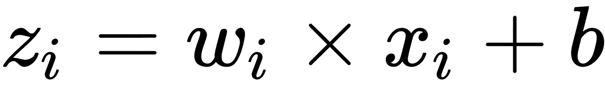

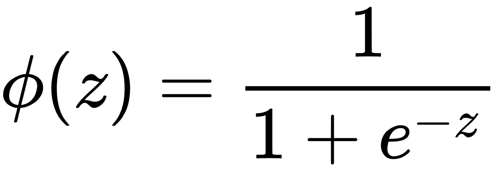

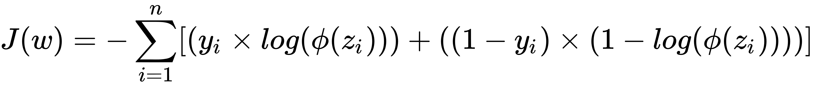

我们使用以下代码实现新模型和损失函数：

```py
num_outputs = y_train.shape[1] 
num_inputs = X_train.shape[1]

learning_rate = 0.001

# input images
x = tf.placeholder(dtype=tf.float32, shape=[None, num_inputs], name="x") 
# output labels
y = tf.placeholder(dtype=tf.float32, shape=[None, num_outputs], name="y")

# model paramteres 
w = tf.Variable(tf.zeros([num_inputs,num_outputs]), name="w") 
b = tf.Variable(tf.zeros([num_outputs]), name="b") 
model = tf.nn.sigmoid(tf.matmul(x, w) + b)

loss = tf.reduce_mean(-tf.reduce_sum(
    (y * tf.log(model)) + ((1 - y) * tf.log(1 - model)), axis=1))
optimizer = tf.train.GradientDescentOptimizer(
    learning_rate=learning_rate).minimize(loss)
```

最后，我们运行我们的分类模型：

```py
num_epochs = 1
with tf.Session() as tfs:
    tf.global_variables_initializer().run()
    for epoch in range(num_epochs):
        tfs.run(optimizer, feed_dict={x: X_train, y: y_train})
        y_pred = tfs.run(tf.argmax(model, 1), feed_dict={x: X_test})
        y_orig = tfs.run(tf.argmax(y, 1), feed_dict={y: y_test})

        preds_check = tf.equal(y_pred, y_orig)
        accuracy_op = tf.reduce_mean(tf.cast(preds_check, tf.float32))
        accuracy_score = tfs.run(accuracy_op)
        print("epoch {0:04d} accuracy={1:.8f}".format(
            epoch, accuracy_score))

        plt.figure(figsize=(14, 4))
        plt.subplot(1, 2, 1)
        plt.scatter(X_test[:, 0], X_test[:, 1], marker='o', c=y_orig)
        plt.title('Original')
        plt.subplot(1, 2, 2)
        plt.scatter(X_test[:, 0], X_test[:, 1], marker='o', c=y_pred)
        plt.title('Predicted')
        plt.show()
```

我们获得了大约 96%的相当好的准确率，原始和预测的数据图如下所示：

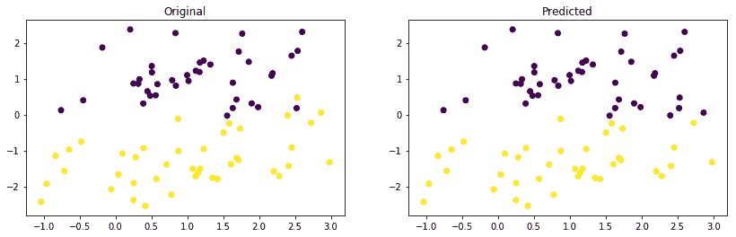

很简约！！现在让我们让我们的问题变得复杂，并尝试预测两个以上的类。

# 多类分类

多类分类的一个流行示例是标记手写数字的图像。此示例中的类或标签为{0,1,2,3,4,5,6,7,8,9}。在以下示例中，我们将使用 MNIST。让我们像前面章节中所做的那样加载 MNIST 图像，代码如下：

```py
from tensorflow.examples.tutorials.mnist import input_data
mnist = input_data.read_data_sets(os.path.join(
    datasetslib.datasets_root, 'mnist'), one_hot=True)
```

如果已按照前一章的说明下载了 MNIST 数据集，那么我们将获得以下输出：

```py
Extracting /Users/armando/datasets/mnist/train-images-idx3-ubyte.gz
Extracting /Users/armando/datasets/mnist/train-labels-idx1-ubyte.gz
Extracting /Users/armando/datasets/mnist/t10k-images-idx3-ubyte.gz
Extracting /Users/armando/datasets/mnist/t10k-labels-idx1-ubyte.gz
```

现在让我们设置一些参数，如下面的代码所示：

```py
num_outputs = 10 # 0-9 digits
num_inputs = 784 # total pixels

learning_rate = 0.001
num_epochs = 1
batch_size = 100
num_batches = int(mnist.train.num_examples/batch_size)
```

上面代码中的参数如下：

*   `num_outputs`：由于我们必须预测图像代表十位数中的哪一位，因此我们将输出数设置为 10.数字由打开或设置为 1 的输出表示。
*   `num_inputs`：我们知道我们的输入数字是 28 x 28 像素，因此每个像素都是模型的输入。因此，我们总共有 784 个输入。
*   `learning_rate`：此参数表示梯度下降优化器算法的学习率。我们将学习率任意设定为 0.001。
*   `num_epochs`：我们将仅针对一次迭代运行我们的第一个示例，因此我们将周期数设置为 1。
*   `batch_size`：在现实世界中，我们可能拥有庞大的数据集并加载整个数据集以便训练模型可能是不可能的。因此，我们将输入数据分成随机选择的批次。我们将`batch_size`设置为 100 个图像，可以使用 TensorFlow 的内置算法一次选择。
*   `num_batches`：此参数设置应从总数据集中选择批次的次数；我们将其设置为等于数据集中的项目数除以批量中的项目数。

我们鼓励您尝试使用这些参数的不同值。

现在让我们使用以下代码定义输入，输出，参数，模型和损失函数：

```py
# input images
x = tf.placeholder(dtype=tf.float32, shape=[None, num_inputs], name="x")
# output labels
y = tf.placeholder(dtype=tf.float32, shape=[None, num_outputs], name="y")

# model paramteres
w = tf.Variable(tf.zeros([784, 10]), name="w")
b = tf.Variable(tf.zeros([10]), name="b")
model = tf.nn.softmax(tf.matmul(x, w) + b)

loss = tf.reduce_mean(-tf.reduce_sum(y * tf.log(model), axis=1))
optimizer = tf.train.GradientDescentOptimizer(
    learning_rate=learning_rate).minimize(loss)
```

代码类似于二分类示例，但有一个显着差异：我们使用`softmax`而不是`sigmoid`函数。 Softmax 用于多类分类，而 sigmoid 用于二元类分类。 Softmax 函数是 sigmoid 函数的推广，它将任意实数值的 n 维向量 z 转换为实数值的 n 维向量 _σ(z)_，范围`(0, 1]`和为 1。

现在让我们运行模型并打印精度：

```py
with tf.Session() as tfs:
    tf.global_variables_initializer().run()
    for epoch in range(num_epochs):
        for batch in range(num_batches):
            batch_x, batch_y = mnist.train.next_batch(batch_size)
            tfs.run(optimizer, feed_dict={x: batch_x, y: batch_y})
        predictions_check = tf.equal(tf.argmax(model, 1), tf.argmax(y, 1))
        accuracy_function = tf.reduce_mean(
            tf.cast(predictions_check, tf.float32))
        feed_dict = {x: mnist.test.images, y: mnist.test.labels}
        accuracy_score = tfs.run(accuracy_function, feed_dict)
        print("epoch {0:04d} accuracy={1:.8f}".format(
            epoch, accuracy_score))
```

我们得到以下准确率：

```py
epoch 0000  accuracy=0.76109999
```

让我们尝试在多次迭代中训练我们的模型，以便在每次迭代中学习不同的批次。我们建立了两个支持函数来帮助我们：

```py
def mnist_batch_func(batch_size=100):
    batch_x, batch_y = mnist.train.next_batch(batch_size)
    return [batch_x, batch_y]
```

上述函数将批量中的示例数作为输入，并使用`mnist.train.next_batch()`函数返回一批特征（`batch_x`）和目标（`batch_y`）：

```py
def tensorflow_classification(num_epochs, num_batches, batch_size,
                              batch_func, optimizer, test_x, test_y):
    accuracy_epochs = np.empty(shape=[num_epochs], dtype=np.float32)
    with tf.Session() as tfs:
        tf.global_variables_initializer().run()
        for epoch in range(num_epochs):
            for batch in range(num_batches):
                batch_x, batch_y = batch_func(batch_size)
                feed_dict = {x: batch_x, y: batch_y}
                tfs.run(optimizer, feed_dict)
            predictions_check = tf.equal(
                tf.argmax(model, 1), tf.argmax(y, 1))
            accuracy_function = tf.reduce_mean(
                tf.cast(predictions_check, tf.float32))
            feed_dict = {x: test_x, y: test_y}
            accuracy_score = tfs.run(accuracy_function, feed_dict)
            accuracy_epochs[epoch] = accuracy_score
            print("epoch {0:04d} accuracy={1:.8f}".format(
                epoch, accuracy_score))

    plt.figure(figsize=(14, 8))
    plt.axis([0, num_epochs, np.min(
        accuracy_epochs), np.max(accuracy_epochs)])
    plt.plot(accuracy_epochs, label='Accuracy Score')
    plt.title('Accuracy over Iterations')
    plt.xlabel('# Epoch')
    plt.ylabel('Accuracy Score')
    plt.legend()
    plt.show()
```

上述函数获取参数并执行训练迭代，打印每次迭代的准确率分数并打印准确率分数。它还可以保存`accuracy_epochs`数组中每个周期的准确率分数。之后，它绘制了每个周期的准确率。让我们使用我们之前设置的参数运行此函数 30 个周期，使用以下代码：

```py
num_epochs=30
tensorflow_classification(num_epochs=num_epochs, 
    num_batches=num_batches, 
    batch_size=batch_size, 
    batch_func=mnist_batch_func, 
    optimizer=optimizer,
    test_x=mnist.test.images,test_y=mnist.test.labels)
```

我们得到以下准确率和图表：

```py
epoch 0000  accuracy=0.76020002
epoch 0001  accuracy=0.79420000
epoch 0002  accuracy=0.81230003
epoch 0003  accuracy=0.82309997
epoch 0004  accuracy=0.83230001
epoch 0005  accuracy=0.83770001

--- epoch 6 to 24 removed for brevity ---

epoch 0025  accuracy=0.87930000
epoch 0026  accuracy=0.87970001
epoch 0027  accuracy=0.88059998
epoch 0028  accuracy=0.88120002
epoch 0029  accuracy=0.88180000
```

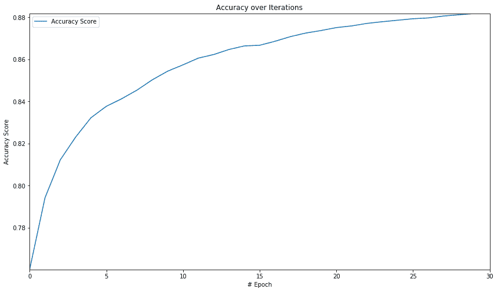

从图中我们可以看出，初始迭代中的准确率会急剧提高，然后准确率的提高速度会降低。稍后，我们将看到如何在 TensorFlow 中使用神经网络的全部功能，并将此分类精度提高到更大的值。

# 总结

在本章中，我们学习了如何在 TensorFlow 中应用经典机器学习算法，而不使用神经网络。在本章的第一部分，我们了解了回归模型。我们解释了如何训练具有一个或多个特征的线性回归模型。我们使用 TensorFlow 编写线性回归代码。我们还讨论了正则化基本上是增加一个惩罚项，以便模型在训练阶段学习参数时不会过拟合训练数据。我们使用 TensorFlow 实现了 Lasso，Ridge 和 ElasticNet 正则化。 TensorFlow 有一些内置的正则化方法，我们将在下一章中学习。

在本章的后续章节中，我们了解了有监督机器学习中的分类问题。我们讨论了两类和多类分类的模型函数，平滑函数和损失函数。我们在本章中使用了逻辑回归，因为这是实现分类的最简单方法。对于二分类，我们使用 sigmoid 函数，对于多类分类，我们使用 softmax 函数来平滑线性模型的值，以产生输出在特定类中的概率。

我们在 TensorFlow 中实现了模型和损失函数的逻辑，并训练模型进行二分类和多类分类。虽然我们在本章中使用了经典的机器学习方法，并使用 TensorFlow 实现了它们，但是当我们实现神经网络和深度神经网络来解决机器学习问题时，TensorFlow 的全部功能得以释放。我们将在本书的神经网络相关章节中研究这些高级方法。

建议您阅读以下书籍以了解有关回归和分类的更多详细信息：

Sebastian Raschka，Python 机器学习，第 2 版，Packt Publishing，2017

Trevor Hastie，Robert Tibshirani，Jerome Friedman，统计学习的要素，第二版，施普林格，2013

