# 六、TensorFlow 和 Keras 中的 RNN

在涉及有序数据序列的问题中，例如**时间序列预测**和**自然语言处理**，上下文对于预测输出非常有价值。可以通过摄取整个序列而不仅仅是最后一个数据点来确定这些问题的上下文。因此，先前的输出成为当前输入的一部分，并且当重复时，最后的输出结果是所有先前输入的结果以及最后一个输入。 **循环神经网络**（**RNN**）架构是用于处理涉及序列的机器学习问题的解决方案。

**循环神经网络**（**RNN**）是一种用于处理顺序数据的专用神经网络架构。顺序数据可以是一段时间内的观察序列，如时间序列数据，或字符序列，单词和句子，如文本数据。

标准神经网络的一个假设是，输入数据的排列方式是一个输入不依赖于另一个输入。然而，对于时间序列数据和文本数据，该假设不成立，因为序列中稍后出现的值通常受到之前出现的值的影响。

为了实现这一目标，RNN 通过以下方式扩展了标准神经网络：

*   通过在计算图中添加循环或循环，RNN 增加了将一个层的输出用作相同或前一层的输入的特性。
*   RNN 添加存储器单元以存储可在当前计算中使用的先前输入和输出。

在本章中，我们将介绍以下有关 RNN 的主题：

*   简单的循环神经网络
*   RNN 变种
*   LSTM
*   GRU
*   TensorFlow 中的 RNN 
*   Keras 中的 RNN 
*   Keras 中用于 MNIST 数据的 RNN

接下来的两章将介绍在 TensorFlow 和 Keras 中为时间序列和文本（NLP）数据构建 RNN 模型的实际示例。

# 简单循环神经网络

这是一个带循环的简单神经网络：

RNN Network

在该图中，神经网络`N`接受输入`x[t]`以产生输出`y[t]`。由于循环，在下一步`t+1`，输入`y[t]`和输入`x[t+1]`产生输出`y[t+1]`。在数学上，我们将其表示为以下等式：


当我们展开循环时，RNN 架构在时间步`t1`看起来如下：


随着时间步长的发展，这个循环在时间步骤 5 展开如下：


在每个时间步骤，使用相同的学习函数`φ(·)`和相同的参数，`w`和`b`。

输出`y`并不总是在每个时间步产生。相反，在每个时间步产生输出`h`，并且对该输出`h`应用另一个激活函数以产生输出`y`。 RNN 的等式现在看起来像这样：


其中，

*   `w(hx)`是连接到隐藏层的`x`输入的权重向量
*   `w(hh)`是来自前一时间步的`h`的值的权重向量
*   `w(yh)`是连接隐藏层和输出层的层的权重向量
*   用于`h[t]`的函数通常是非线性函数，例如 tanh 或 ReLU

在 RNN 中，在每个时间步使用相同的参数`w(hx), w(hh), w(yh), b(h), b(y)`。这一事实大大减少了我们需要学习的基于序列模型的参数数量。

由此， RNN 在时间步`t5`如下展开，假设输出`y`仅在时间步`t5`产生：


简单的 RNN 由 Elman 在 1990 年引入，因此它也被称为 Elman 网络。然而，简单的 RNN 无法满足我们今天的处理需求，因此我们将在下一节中了解 RNN 的变体。

阅读 Elman 的原始研究论文，了解 RNN 架构的起源：

```
J. L. Elman, Finding Structure in Time, Cogn. Sci., vol. 14, no. 2, pp. 179–211, 1990.
```

# RNN 变种

RNN 架构已经以多种方式扩展，以适应某些问题中的额外需求，并克服简单 RNN 模型的缺点。我们列出了下面的 RNN 架构的一些主要扩展。

*   **双向 RNN**（**BRNN**）用于输出依赖于序列的前一个和后一个元素的情况。 BRNN 通过堆叠两个 RNN（称为前向和后向层）来实现，输出是前向和后向层 RNN 的隐藏状态的结果。在前向层中，存储器状态 h 从时间步长`t`流向时间步长`t + 1`，并且在后向层中，存储器状态从时间步长`t`流出。到时间步`t-1`。两个层在时间步`t`时采用相同的输入`x[t]`，但它们在时间步`t`共同产生输出。

*   **深双向 RNN**（**DBRNN**）通过添加多个层进一步扩展 BRNN。 BRNN 在时间维度上隐藏了层或单元。但是，通过堆叠 BRNN，我们可以在 DBRNN 中获得分层表示。其中一个显着差异是，在 BRNN 中，我们对同一层中的每个单元使用相同的参数，但在 DBRNN 中，我们对每个堆叠层使用不同的参数。
*   **长短期记忆**（**LSTM**）网络通过使用涉及多个非线性函数而不是一个简单非线性函数的架构来扩展 RNN 隐藏状态。 LSTM 由称为**单元**的黑盒组成，取三个输入：时间`t-1`的工作记忆（`h[t-1]`），当前输入（`x[t]`）和时间`t-1`的长期记忆（`c[t-1]`），并产生两个输出：更新的工作记忆（`h[t]`）和长期记忆（`c[t]`）。单元使用称为门的函数来决定从记忆中选择性地保存和擦除的内容。我们在下面的部分中详细描述了 LSTM。

阅读以下关于 LSTM 的研究论文，以获得有关 LSTM 起源的更多信息：

```
S. Hochreiter and J. Schmidhuber, Long Short-Term Memory, Neural Comput., vol. 9, no. 8, pp. 1735–1780, 1997.http://www.bioinf.jku.at/publications/older/2604.pdf
```

*   **门控循环单元**（**GRU**）网络是 LSTM 的简化变体。 结合遗忘和输入的功能，在更简单的更新门中进行门控。它还将隐藏状态和单元状态组合成一个单一状态。因此，与 LSTM 相比，GRU 在计算上更便宜。 我们在下面的部分中详细描述了 GRU。

阅读以下研究论文以探索 GRU 的更多细节：

```
K. Cho, B. van Merrienboer, C. Gulcehre, D. Bahdanau, F. Bougares, H. Schwenk, and Y. Bengio, Learning Phrase Representations using RNN Encoder-Decoder for Statistical Machine Translation, 2014.https://arxiv.org/abs/1406.1078

J. Chung, C. Gulcehre, K. Cho, and Y. Bengio, Empirical Evaluation of Gated Recurrent Neural Networks on Sequence Modeling, pp. 1–9, 2014. https://arxiv.org/abs/1412.3555
```

*   **seq2seq** 模型将编码器 - 解码器架构与 RNN 架构相结合。在 Seq2Seq 架构中，模型训练数据序列，例如文本数据或时间序列数据，然后该模型用于生成输出序列。例如，在英文文本上训练模型，然后从模型生成西班牙文本。 Seq2Seq 模型由编码器和解码器模型组成，它们都使用 RNN 架构构建。可以堆叠 Seq2Seq 模型以构建分层多层模型。

# LSTM 网络

当 RNN 在很长的数据序列上进行训练时，梯度往往变得非常大或非常小，它们会消失到几乎为零。 **长短期记忆**（**LSTM**）网络通过添加用于控制对过去信息的访问的门，来解决消失/爆炸梯度问题。 LSTM 概念最初由 Hochreiter 和 Schmidhuber 在 1997 年引入。

阅读以下关于 LSTM 的研究论文，以获得有关 LSTM 起源的更多信息：

```
S. Hochreiter and J. Schmidhuber, Long Short-Term Memory, Neural Comput., vol. 9, no. 8, pp. 1735–1780, 1997. http://www.bioinf.jku.at/publications/older/2604.pdf
```

在 RNN 中，使用重复使用的学习函数`φ`的单个神经网络层，而在 LSTM 中，使用由四个主要函数组成的重复模块。构建 LSTM 网络的模块称为**单元**。 LSTM 单元通过选择性地学习或擦除信息，有助于在长序列通过时更有效地训练模型。组成单元的函数也称为门，因为它们充当传入和传出单元的信息的网守。

LSTM 模型有两种记忆：

*   用`h`（隐藏状态）表示的工作记忆
*   用`c`（单元状态）表示的长期记忆。

单元状态或长期记忆仅在两个线性相互作用下从一个单元流向另一个单元。 LSTM 将信息添加到长期记忆中，或通过门从长期记忆中删除信息。

下图描绘了 LSTM 单元：

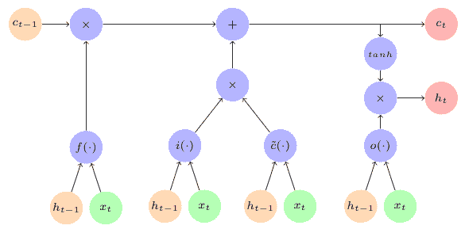The LSTM Cell

通过 LSTM 单元中的门的内部流动如下：

1.  **遗忘门（或记忆门）`f()`**：`h[t-1]`和`x[t]`按照以下等式作为输入流向`f()`门：

    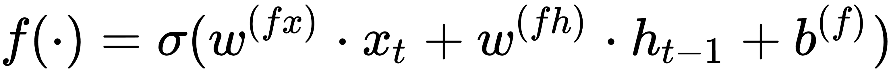
    
    遗忘门的功能是决定忘记哪些信息以及要记住哪些信息。这里使用`sigmoid`激活函数，因此输出 1 表示信息被转移到单元内的下一步骤，输出 0 表示信息被选择性地丢弃。

2.  **输入门（或保存门）`i()`**：`h[t-1]`和`x[t]`按照以下等式作为输入流向`i()`门：
    
    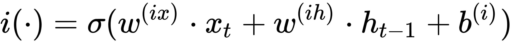
    
    输入门的功能是决定是保存还是丢弃输入。输入功能还允许单元了解要保留或丢弃的候选存储器的哪个部分。

3.  **候选长期记忆**：候选长期记忆由`h[t-1]`和`x[t]`使用激活函数计算，主要是`tanh`，按照下式：
    
    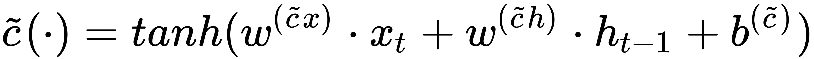

4.  接下来，组合前面的三个计算以得到更新长期记忆，由`c[t]`表示，如下式所示：
    
    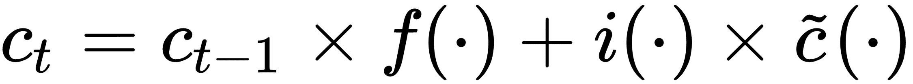

5.  **输出门（或聚焦/关注门）`o()`**：`h[t-1]`和`x[t]`按照以下等式作为输入流向`o()`门：
    
    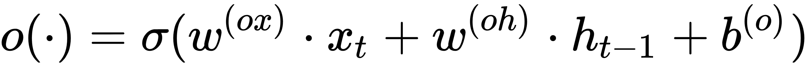
    
    输出门的功能是决定多少信息可用于更新工作记忆。

6.  接下来，工作记忆`h[t]`从长期记忆`c[t]`和焦点/注意力向量更新，如下式所示：
    
    
    
    其中`φ(·)`是激活函数，通常是`tanh`。

# GRU 网络

LSTM 网络的计算成本很高，因此，研究人员发现了一种几乎同样有效的 RNN 配置，称为**门控循环单元**（**GRU**）架构。

在 GRU 中，不使用工作和长期记忆，只使用一种记忆，用`h`（隐藏状态）表示。 GRU 单元通过**复位**和**更新**门，将信息添加到此状态存储器，或从该状态存储器中删除信息。

下图描绘了 GRU 单元（说明如下图）：

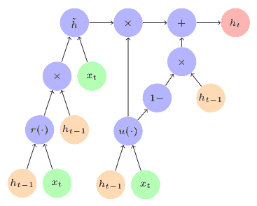The GRU Cell

GRU 单元中通过门的内部流量如下：

1.  **更新门`u()`**：输入`h[t-1]`和`x[t]`按照以下公式流向`u()`门：
    
    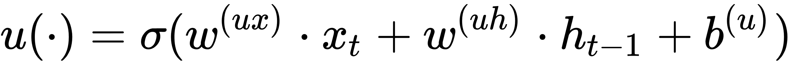

2.  **复位门`r()`**：输入`h[t-1]`和`x[t]`按照以下公式流向`r()`门：
    
    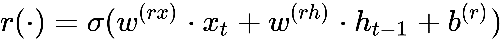

1.  **候选状态记忆**：候选长期记忆是根据`r()`门，`h[t-1]`和`x[t]`的输出计算出来的，按照下列公式：
    
    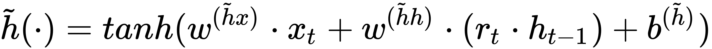

2.  接下来，组合前面的三个计算以得到更新的状态存储器，由`h[t]`，表示，如下式所示：
    
    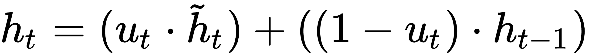

阅读以下研究论文以探索 GRU 的更多细节：

```
K. Cho, B. van Merrienboer, C. Gulcehre, D. Bahdanau, F. Bougares, H. Schwenk, and Y. Bengio, Learning Phrase Representations using RNN Encoder-Decoder for Statistical Machine Translation, 2014. https://arxiv.org/abs/1406.1078

J. Chung, C. Gulcehre, K. Cho, and Y. Bengio, Empirical Evaluation of Gated Recurrent Neural Networks on Sequence Modeling, pp. 1–9, 2014. https://arxiv.org/abs/1412.3555
```

# TensorFlow RNN

在低级 TensorFlow 库中创建 RNN 模型的基本工作流程与 MLP 几乎相同：

*   首先创建形状的输入和输出占位符`(None, #TimeSteps, #Features)`或`(批量大小, #TimeSteps, #Features)`
*   从输入占位符中，创建一个长度为`#TimeSteps`的列表，其中包含形状的张量`(None, #特征)`或`(批量大小, #特征)`
*   从`tf.rnn.rnn_cell`模块创建所需 RNN 类型的单元
*   使用先前创建的单元和输入张量列表来创建静态或动态 RNN
*   创建输出权重和偏差变量，并定义损失和优化器函数
*   对于所需的周期数，使用损失和优化器函数训练模型

这个基本工作流程将在下一章的示例代码中演示。让我们看看可用于支持先前工作流程的各种类。

# TensorFlow RNN 单元类

`tf.nn.rnn_cell`模块包含以下用于在 TensorFlow 中创建不同类型单元的类：

| **类** | **描述** |
| --- | --- |
| `BasicRNNCell` | 提供 RNN 单元的实现 |
| `BasicLSTMCell` | 提供 LSTM RNN 单元的实现，基于[这个页面](http://arxiv.org/abs/1409.2329) |
| `LSTMCell` | 提供 LSTM RNN 单元，基于[这个页面](http://deeplearning.cs.cmu.edu/pdfs/Hochreiter97_lstm.pdf)和[这个页面](https://research.google.com/pubs/archive/43905.pdf) |
| `GRUCell` | 提供 GRU RNN 单元，基于[这个页面](http://arxiv.org/abs/1406.1078) |
| `MultiRNNCell` | 提供由连续连接的多个简单单元组成的 RNN 单元 |

`tf.contrib.rnn`模块提供以下额外的类用于在 TensorFlow 中创建不同类型的单元：

| **类** | **描述** |
| --- | --- |
| `LSTMBlockCell` | 提供块 LSTM RNN 单元，基于[这个页面](http://arxiv.org/abs/1409.2329) |
| `LSTMBlockFusedCell` | 提供块融合 LSTM RNN 单元，基于[这个页面](http://arxiv.org/abs/1409.2329) |
| `GLSTMCell` | 提供分组 LSTM 单元，基于[这个页面](https://arxiv.org/abs/1703.10722) |
| `GridLSTMCell` | 提供网格 LSTM RNN 单元，基于[这个页面](http://arxiv.org/abs/1507.01526) |
| `GRUBlockCell` | 提供块 GRU RNN 单元，基于[这个页面](http://arxiv.org/abs/1406.1078) |
| `BidirectionalGridLSTMCell` | 仅在频率上而不是在时间上提供双向网格 LSTM |
| `NASCell` | 提供神经架构搜索 RNN 单元，基于[这个页面](https://arxiv.org/abs/1611.01578) |
| `UGRNNCell` | 提供更新门 RNN 单元，基于[这个页面](https://arxiv.org/abs/1611.09913) |

# TensorFlow RNN 模型构建类

TensorFlow 提供了从 RNN 单元对象创建 RNN 模型的类。静态 RNN 类在编译时为时间步骤添加展开的单元，而动态 RNN 类在运行时添加展开的单元用于时间步长。

*   `tf.nn.static_rnn`
*   `tf.nn.static_state_saving_rnn`
*   `tf.nn.static_bidirectional_rnn`
*   `tf.nn.dynamic_rnn`
*   `tf.nn.bidirectional_dynamic_rnn`
*   `tf.nn.raw_rnn`
*   `tf.contrib.rnn.stack_bidirectional_dynamic_rnn`

# TensorFlow RNN 单元包装器类

TensorFlow 还提供包装其他单元类的类：

*   `tf.contrib.rnn.LSTMBlockWrapper`
*   `tf.contrib.rnn.DropoutWrapper`
*   `tf.contrib.rnn.EmbeddingWrapper`
*   `tf.contrib.rnn.InputProjectionWrapper`
*   `tf.contrib.rnn.OutputProjectionWrapper`
*   `tf.contrib.rnn.DeviceWrapper`
*   `tf.contrib.rnn.ResidualWrapper`

有关 TensorFlow 中 RNN 的最新文档，[请访问此链接](https://www.tensorflow.org/api_guides/python/contrib.rnn)。

# Keras 中的 RNN 

与 TensorFlow 相比，在 Keras 中创建 RNN 要容易得多。正如您在第 3 章中学到的，Keras 提供了用于创建循环网络的函数式和顺序 API。要构建 RNN 模型，您必须从`kera.layers.recurrent`模块添加层。 Keras 在`keras.layers.recurrent`模块中提供以下类型的循环层：

*   `SimpleRNN`
*   LSTM
*   GRU

**有状态模型**

Keras 循环层还支持 RNN 模型，可在批次之间保存状态。您可以通过将`stateful`参数作为`True`传递来创建有状态 RNN，LSTM 或 GRU 模型。对于有状态模型，为输入指定的批量大小必须是固定值。在有状态模型中，从训练批次中学到的隐藏状态将重新用于下一批。如果您想在训练期间的某个时刻重置记忆，可以通过调用`model.reset_states()`或`layer.reset_states()`函数使用额外的代码来完成。

我们将在下一章中看到使用 Keras 构建 RNN 的示例。

[有关 Keras 循环层的最新文档可在此链接中找到](https://keras.io/layers/recurrent/)。

# RNN 的应用领域

RNN 更频繁使用的一些应用领域如下：

*   **自然语言模型**：RNN 模型已用于自然语言处理（NLP），用于自然语言理解和自然语言生成任务。在 NLP 中，RNN 模型被给予一系列单词并且它预测另一个单词序列。因此，训练的模型可用于生成单词序列，称为文本生成的字段。例如，生成故事和剧本。 NLP 的另一个领域是语言翻译，其中给定一种语言的一系列单词，该模型预测另一种语言的单词序列。
*   **语音和语音识别**：RNN 模型非常适用于构建模拟音频数据的模型。在语音识别中，RNN 模型被给予音频数据并且它预测一系列语音片段。它可用于训练模型以识别语音命令，甚至用于与基于语音的聊天机器人的对话。
*   **图像/视频描述或字幕生成**：RNN 模型可与 CNN 结合使用，以生成图像和视频中找到的元素的描述。这些描述也可用于生成图像和视频的标题。
*   **时间序列数据**：最重要的是，RNN 对时间序列数据非常有用。大多数传感器和系统生成时间顺序很重要的数据。 RNN 模型非常适合于查找模式和预测此类数据。

通过此链接了解有关 RNN 的更多信息：

<http://karpathy.github.io/2015/05/21/rnn-effectiveness/>

<http://colah.github.io/posts/2015-08-Understanding-LSTMs/>

<http://www.wildml.com/2015/09/recurrent-neural-networks-tutorial-part-1-introduction-to-rnns/>

<https://r2rt.com/written-memories-understanding-deriving-and-extending-the-lstm.html>

# Keras 中的用于 MNIST 数据的 RNN

虽然 RNN 主要用于序列数据，但它也可用于图像数据。我们知道图像具有最小的两个维度 - 高度和宽度。现在将其中一个维度视为时间步长，将其他维度视为特征。对于 MNIST，图像大小为`28 x 28`像素，因此我们可以将 MNIST 图像视为具有 28 个时间步长，每个时间步长具有 28 个特征。

我们将在下一章中提供时间序列和文本数据的示例，但让我们为 Keras 中的 MNIST 构建和训练 RNN，以快速浏览构建和训练 RNN 模型的过程。

您可以按照 Jupyter 笔记本中的代码`ch-06_RNN_MNIST_Keras`。

导入所需的模块：

```py
import keras
from keras.models import Sequential
from keras.layers import Dense, Activation
from keras.layers.recurrent import SimpleRNN
from keras.optimizers import RMSprop
from keras.optimizers import SGD
```

获取 MNIST 数据并将数据从 1D 中的 784 像素转换为 2D 中的`28 x 28`像素：

```py
from tensorflow.examples.tutorials.mnist import input_data
mnist = input_data.read_data_sets(os.path.join(datasetslib.datasets_root,
                                               'mnist'), 
                                  one_hot=True)
X_train = mnist.train.images
X_test = mnist.test.images
Y_train = mnist.train.labels
Y_test = mnist.test.labels
n_classes = 10
n_classes = 10
X_train = X_train.reshape(-1,28,28)
X_test = X_test.reshape(-1,28,28)
```

在 Keras 构建`SimpleRNN`模型：

```py
# create and fit the SimpleRNN model
model = Sequential()
model.add(SimpleRNN(units=16, activation='relu', input_shape=(28,28)))
model.add(Dense(n_classes))
model.add(Activation('softmax'))

model.compile(loss='categorical_crossentropy',
              optimizer=RMSprop(lr=0.01),
              metrics=['accuracy'])
model.summary()
```

该模型如下：

```py
_________________________________________________________________
Layer (type)                 Output Shape              Param #   
=================================================================
simple_rnn_1 (SimpleRNN)     (None, 16)                720       
_________________________________________________________________
dense_1 (Dense)              (None, 10)                170       
_________________________________________________________________
activation_1 (Activation)    (None, 10)                0         
=================================================================
Total params: 890
Trainable params: 890
Non-trainable params: 0
_________________________________________________________________
```

训练模型并打印测试数据集的准确率：

```py
model.fit(X_train, Y_train,
          batch_size=100, epochs=20)

score = model.evaluate(X_test, Y_test)
print('\nTest loss:', score[0])
print('Test accuracy:', score[1])
```

我们得到以下结果：

```py
Test loss: 0.520945608187
Test accuracy: 0.8379
```

# 总结

在本章中，我们了解了循环神经网络（RNN）。我们了解了 RNN 的各种变体，并详细描述了其中的两个：长短期记忆（LSTM）网络和门控循环单元（GRU）网络。我们还描述了可用于在 TensorFlow 和 Keras 中构建 RNN 单元，模型和层的类。我们构建了一个简单的 RNN 网络，用于对 MNIST 数据集的数字进行分类。

在下一章中，我们将学习如何构建和训练时间序列数据的 RNN 模型。

