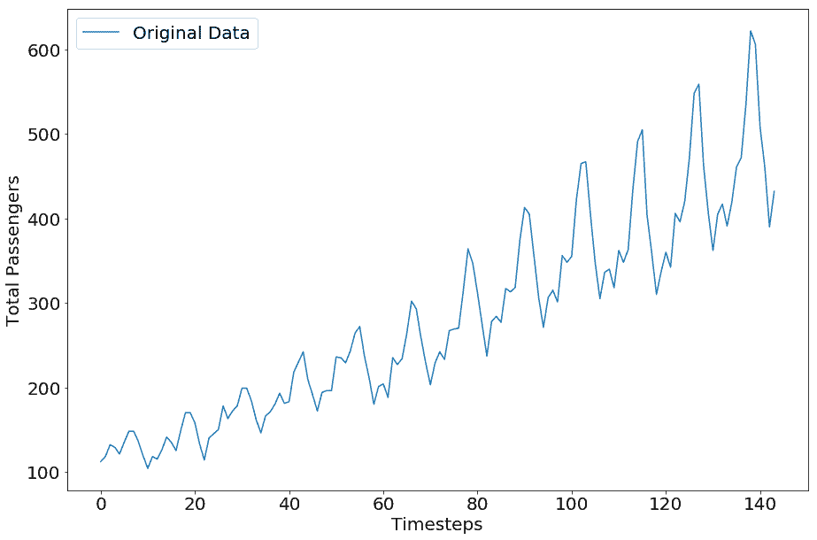
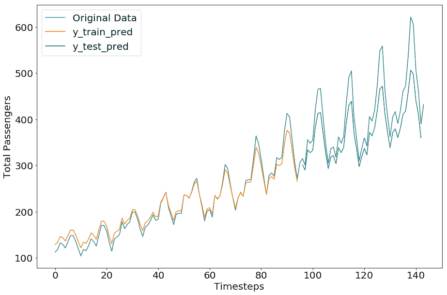
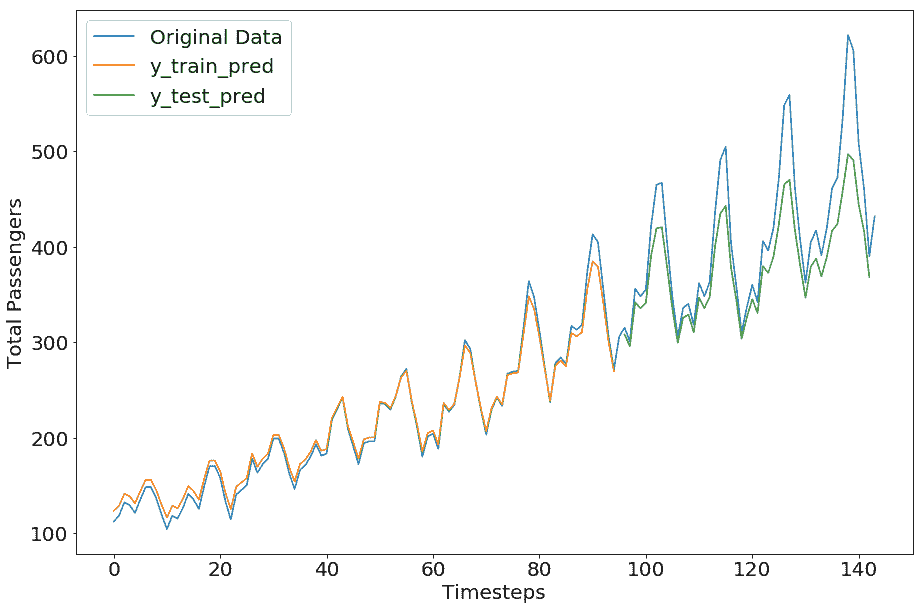
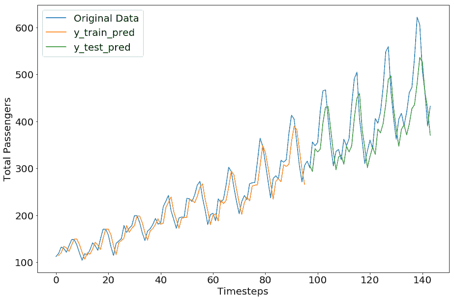
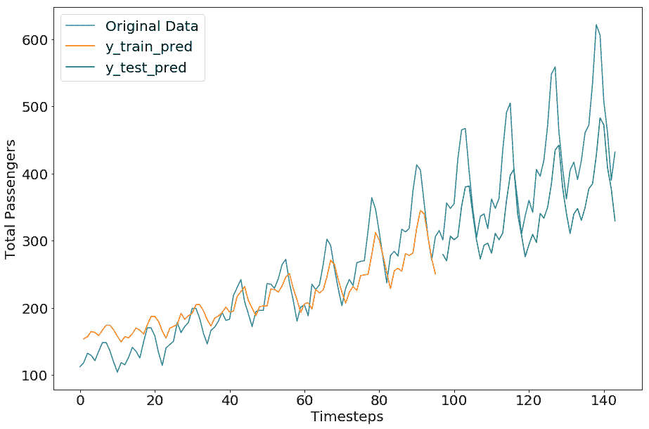
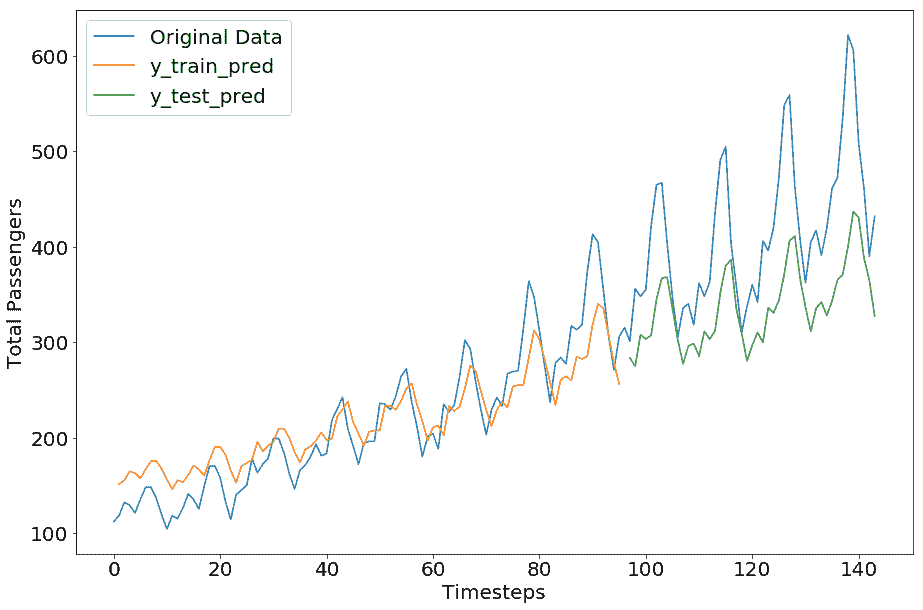

# 七、使用 TensorFlow 和 Keras 的时间序列数据和 RNN

时间序列数据是一系列值，以不同的时间间隔记录或测量。作为序列，RNN 架构是从这些数据训练模型的最佳方法。在本章中，我们将使用示例时间序列数据集来展示如何使用 TensorFlow 和 Keras 构建 RNN 模型。

我们将在本章中介绍以下主题：

*   航空公司乘客时间序列数据集：
    *   描述和下载数据集
    *   可视化数据集
*   在 TensorFlow 中预处理 RNN 的数据集
*   TensorFlow 中的 RNN 用于时间序列数据：
    *   TensorFlow 中的 SimpleRNN
    *   TensorFlow 中的 LSTM
    *   GRU 在 TensorFlow 中
*   在 Keras 中预处理 RNN 的数据集
*   Keras 的 RNN 用于时间序列数据：
    *   Keras 的 SimpleRNN
    *   Keras 的 LSTM
    *   格拉斯在 Keras

让我们从了解样本数据集开始。

您可以按照 Jupyter 笔记本中的代码`ch-07a_RNN_TimeSeries_TensorFlow`。

# 航空公司乘客数据集

为了简洁起见，我们选择了一个名为国际航空公司乘客（航空通票）的非常小的数据集。该数据包含从 1949 年 1 月到 1960 年 12 月的每月总乘客数量。数据集中的数字是指数千的数量。该数据集最初由 Box 和 Jenkins 在 1976 年的工作中使用。它作为 **时间序列数据集库**（**TSDL**）的一部分与 Rob Hyndman 教授的各种其他时间序列数据集一起收集。在澳大利亚莫纳什大学。后来，TSDL 被转移到 [DataMarket](http://datamarket.com)。

[您可以从此链接下载数据集](https://datamarket.com/data/set/22u3/international-airline-passengers-monthly-totals-in-thousands-jan-49-dec-60)。

# 加载 airpass 数据集

我们将数据集保存为数据集根目录（〜/ datasets）中`ts-data`文件夹中的 CSV 文件，并使用以下命令将数据加载到 pandas 数据框中：

```py
filepath = os.path.join(datasetslib.datasets_root,
                        'ts-data',
                        'international-airline-passengers-cleaned.csv'
                       ) 
dataframe = pd.read_csv(filepath,usecols=[1],header=0)
dataset = dataframe.values
dataset = dataset.astype(np.float32)
```

从 NumPy 数组中的数据框中提取值并转换为`np.float32`：

```py
dataset = dataframe.values
dataset = dataset.astype(np.float32)
```

# 可视化 airpass 数据集

让我们看一下数据集的外观：

```py
plt.plot(dataset,label='Original Data')
plt.legend()
plt.show()
```

`airpass`数据集的图如下所示：

Airline Passengers Dataset

# 使用 TensorFlow RNN 模型预处理数据集

为了使其为学习模型做好准备，通过应用 MinMax 缩放来正则化数据集，该缩放使数据集值介于 0 和 1 之间。您可以尝试根据数据的性质对数据应用不同的缩放方法。

```py
# normalize the dataset
scaler = skpp.MinMaxScaler(feature_range=(0, 1))
normalized_dataset = scaler.fit_transform(dataset)
```

我们使用自己开发的实用函数将数据集拆分为训练和测试数据集。必须拆分数据而不对数据集进行混洗，因为改组数据集会破坏序列。维护数据序列对于训练时间序列模型非常重要。

```py
train,test=tsu.train_test_split(normalized_dataset,train_size=0.67)
```

然后我们将训练和测试数据集转换为有监督的机器学习集。让我们试着理解监督学习集的含义。假设我们有一系列数据：1,2,3,4,5。我们想要了解生成数据集的概率分布。为了做到这一点，我们可以假设时间步长`t`的值是从时间步长`t-1`到`tk`的值的结果，其中`k`是窗口大小。为简化起见，假设窗口大小为 1.因此，时间步长`t`的值（称为输入特征）是时间步长值`t-1`的结果，被称为目标。让我们重复一遍所有时间步骤，我们得到下表：

| 输入值或特征 | 输出值或目标 |
| --- | --- |
| 1 | 2 |
| 2 | 3 |
| 3 | 4 |
| 4 | 5 |

我们展示的示例只有一个变量值，它将转换为特征和目标。当目标值取决于一个变量时，它被称为单变量时间序列。同样的逻辑可以应用于多变量时间序列，其中目标取决于多个变量。我们使用`x`来表示输入特征，使用`y`来表示输出目标。

考虑到这一背景，为了将`airpass`数据转换为监督机器学习数据，我们设置了以下超参数：

1.  设置用于学习或预测下一个时间步的过去时间步数：

```py
n_x=1  
```

1.  设置学习或预测的未来时间步长的数量：

```py
n_y=1 
```

1.  设置用于学习的`x`变量的数量；由于当前示例是单变量的，因此设置为 1：

```py
n_x_vars = 1  
```

1.  设置要预测的`y`变量的数量；由于当前示例是单变量的，因此设置为 1：

```py
n_y_vars = 1  
```

1.  最后，我们通过应用本节开头所述的逻辑将训练和测试数据集转换为`X`和`Y`集：

```py
X_train, Y_train, X_test, Y_test = tsu.mvts_to_xy(train,
                                  test,n_x=n_x,n_y=n_y)
```

现在数据已经过预处理并可以输入到我们的模型中，让我们使用 TensorFlow 准备一个 SimpleRNN 模型。

# TensorFlow 中的简单 RNN

在 TensorFlow 中定义和训练简单 RNN 的工作流程如下：

1.  定义模型的超参数：

```py
state_size = 4
n_epochs = 100
n_timesteps = n_x 
learning_rate = 0.1
```

这里新的超参数是`state_size`。 `state_size`表示 RNN 单元的权重向量的数量。

1.  为模型定义`X`和`Y`参数的占位符。`X`占位符的形状为 `(batch_size, number_of_input_timesteps, number_of_inputs)`，`Y`占位符的形状为`(batch_size, number_of_output_timesteps, number_of_outputs)`。对于`batch_size`，我们使用`None`，以便我们以后可以输入任意大小的批次。

```py
X_p = tf.placeholder(tf.float32, [None, n_timesteps, n_x_vars], 
    name='X_p') 
Y_p = tf.placeholder(tf.float32, [None, n_timesteps, n_y_vars], 
    name='Y_p')
```

1.  将输入占位符`X_p`转换为长度等于时间步数的张量列表，在此示例中为`n_x`或 1：

```py
# make a list of tensors of length n_timesteps
rnn_inputs = tf.unstack(X_p,axis=1)
```

1.  使用`tf.nn.rnn_cell.BasicRNNCell`创建一个简单的 RNN 单元：

```py
cell = tf.nn.rnn_cell.BasicRNNCell(state_size)
```

1.  TensorFlow 提供`static_rnn`和`dynamic_rnn`便利方法（以及其他方法）分别创建静态和动态 RNN。创建静态 RNN：

```py
rnn_outputs, final_state = tf.nn.static_rnn(cell, 
                                            rnn_inputs,
                                            dtype=tf.float32
                                           )
```

静态 RNN 在编译时创建单元，即展开循环。动态 RNN 创建单元，即在运行时展开循环 。在本章中，我们仅展示了 `static_rnn` 的示例，但是一旦获得静态 RNN 的专业知识，就应该探索 `dynamic_rnn` 。

`static_rnn`方法采用以下参数：

*   `cell`：我们之前定义的基本 RNN 单元对象。它可能是另一种单元，我们将在本章中进一步看到。
*   `rnn_inputs`：形状`(batch_size, number_of_inputs)`的张量列表。
*   `dtype`：初始状态和预期输出的数据类型。

1.  定义预测层的权重和偏差参数：

```py
W = tf.get_variable('W', [state_size, n_y_vars])
b = tf.get_variable('b', [n_y_vars], 
    initializer=tf.constant_initializer(0.0))
```

1.  将预测层定义为密集线性层：

```py
predictions = [tf.matmul(rnn_output, W) + b \
                for rnn_output in rnn_outputs]
```

1.  输出 Y 是张量的形状；将其转换为张量列表：

```py
y_as_list = tf.unstack(Y_p, num=n_timesteps, axis=1)
```

1.  将损失函数定义为预测标签和实际标签之间的均方误差：

```py
mse = tf.losses.mean_squared_error
losses = [mse(labels=label, predictions=prediction) 
          for prediction, label in zip(predictions, y_as_list)
         ]
```

1.  将总损失定义为所有预测时间步长的平均损失：

```py
total_loss = tf.reduce_mean(losses)
```

1.  定义优化器以最小化`total_loss`：

```py
optimizer = tf.train.AdagradOptimizer(learning_rate).minimize(total_loss)
```

1.  现在我们已经定义了模型，损耗和优化器函数，让我们训练模型并计算训练损失：

```py
with tf.Session() as tfs:
    tfs.run(tf.global_variables_initializer())
    epoch_loss = 0.0
    for epoch in range(n_epochs):
        feed_dict={X_p: X_train.reshape(-1, n_timesteps, 
                                        n_x_vars), 
                   Y_p: Y_train.reshape(-1, n_timesteps, 
                                        n_x_vars)
                  }
        epoch_loss,y_train_pred,_=tfs.run([total_loss,predictions,
                                optimizer], feed_dict=feed_dict)
    print("train mse = {}".format(epoch_loss))
```

我们得到以下值：

```py
train mse = 0.0019413739209994674
```

1.  让我们在测试数据上测试模型：

```py
feed_dict={X_p: X_test.reshape(-1, n_timesteps,n_x_vars), 
           Y_p: Y_test.reshape(-1, n_timesteps,n_y_vars)
          }
test_loss, y_test_pred = tfs.run([total_loss,predictions], 
                                 feed_dict=feed_dict
                                )
print('test mse = {}'.format(test_loss))
print('test rmse = {}'.format(math.sqrt(test_loss)))
```

我们在测试数据上得到以下 mse 和 rmse（均方根误差）：

```py
test mse = 0.008790395222604275
test rmse = 0.09375710758446143
```

这非常令人印象深刻。

这是一个非常简单的例子，只用一个变量值预测一个时间步。在现实生活中，输出受到多个特征的影响，并且需要预测不止一个时间步。后一类问题被称为多变量多时间步进预测问题。这些问题是使用递归神经网络进行更好预测的积极研究领域。

现在让我们重新调整预测和原始值并绘制原始值（请在笔记本中查找代码）。

我们得到以下绘图：



令人印象深刻的是，在我们的简单示例中，预测数据几乎与原始数据相匹配。对这种准确预测的一种可能解释是，单个时间步的预测基于来自最后一个时间步的单个变量的预测，因此它们总是在先前值的附近。

尽管如此，前面示例的目的是展示在 TensorFlow 中创建 RNN 的方法。现在让我们使用 RNN 变体重新创建相同的示例。

# TensorFlow 中的 LSTM

由于爆炸和消失梯度的问题，简单的 RNN 架构并不总是有效，因此使用了改进的 RNN 架构，例如 LSTM 网络。 TensorFlow 提供 API 来创建 LSTM RNN 架构。

在上一节中展示的示例中，要将 Simple RNN 更改为 LSTM 网络，我们所要做的就是更改单元类型，如下所示：

```py
cell = tf.nn.rnn_cell.LSTMCell(state_size)
```

其余代码保持不变，因为 TensorFlow 会为您在 LSTM 单元内创建门。

笔记本 `ch-07a_RNN_TimeSeries_TensorFlow` 中提供了 LSTM 模型的完整代码。

然而，对于 LSTM，我们必须运行 600 个周期的代码才能使结果更接近基本 RNN。原因是 LSTM 需要学习更多参数，因此需要更多的训练迭代。对于我们的简单示例，它似乎有点过分，但对于较大的数据集，与简单的 RNN 相比，LSTM 显示出更好的结果。

具有 LSTM 架构的模型的输出如下：

```py
train mse = 0.0020806745160371065
test mse = 0.01499235536903143
test rmse = 0.12244327408653947
```



# TensorFlow 中的 GRU

要将最后一节中的 LSTM 示例更改为 GRU 网络， 按如下方式更改单元类型，TensorFlow 将为您处理其余部分：

```py
cell = tf.nn.rnn_cell.GRUCell(state_size)
```

笔记本 `ch-07a_RNN_TimeSeries_TensorFlow`中提供了 GRU 模型的完整代码。

对于小`airpass`数据集，GRU 在相同数量的周期中表现出更好的表现。在实践中，GRU 和 LSTM 表现出相当的表现。就执行速度而言，与 LSTM 相比，GRU 模型训练和预测更快。

GRU 模型的完整代码在 Jupyter 笔记本中提供。GRU 模型的结果如下：

```py
train mse = 0.0019633215852081776
test mse = 0.014307591132819653
test rmse = 0.11961434334066987
```


我们鼓励您探索 TensorFlow 中可用的其他选项来创建循环神经网络。现在让我们在 TensorFlow 的一个高级库中尝试相同的示例。

对于下一节，您可以按照 Jupyter 笔记本中的代码`ch-07b_RNN_TimeSeries_Keras`。

# 使用 Keras RNN 模型预处理数据集

与使用 lower = level TensorFlow 类和方法构建相比，在 Keras 中构建 RNN 网络要简单得多。对于 Keras，我们预先处理数据，如前面部分所述，以获得受监督的机器学习时间序列数据集：`X_train, Y_train, X_test, Y_test`。

从这里开始，预处理有所不同。对于 Keras，输入必须是`(samples, time steps, features)`形状。当我们将数据转换为监督机器学习格式时，在重塑数据时，我们可以将时间步长设置为 1，从而将所有输入时间步长作为特征，或者我们可以设置时间步长为实际的时间步数，从而为每个时间步长提供特征集。换句话说，我们之前获得的`X_train`和`X_test`数据集可以重新整形为以下方法之一：

方法 1：`n`时间步长与`1`特征：

```py
X_train.reshape(X_train.shape[0], X_train.shape[1],1)
```

方法 2：`1`时间步长`n`特征：

```py
X_train.reshape(X_train.shape[0], 1, X_train.shape[1])
```

在本章中，我们将对特征大小为 1 的数据集进行整形，因为我们只使用一个变量作为输入：

```py
# reshape input to be [samples, time steps, features]
X_train = X_train.reshape(X_train.shape[0], X_train.shape[1],1)
X_test = X_test.reshape(X_test.shape[0], X_train.shape[1], 1)
```

# 使用 Keras 的简单 RNN

通过添加具有内部神经元数量和输入张量形状的 SimpleRNN 层，可以在 Keras 中轻松构建 RNN 模型，不包括样本维数。以下代码创建，编译和拟合 SimpleRNN：

```py
# create and fit the SimpleRNN model
model = Sequential()
model.add(SimpleRNN(units=4, input_shape=(X_train.shape[1], 
    X_train.shape[2])))
model.add(Dense(1))
model.compile(loss='mean_squared_error', optimizer='adam')
model.fit(X_train, Y_train, epochs=20, batch_size=1)
```

由于我们的数据集很小，我们使用`batch_size`为 1 并训练 20 次迭代，但对于较大的数据集，您需要调整这些和其他超参数的值。

该模型的结构如下：

```py
_________________________________________________________________
Layer (type)                 Output Shape              Param #   
=================================================================
simple_rnn_1 (SimpleRNN)     (None, 4)                 24        
_________________________________________________________________
dense_1 (Dense)              (None, 1)                 5         
=================================================================
Total params: 29
Trainable params: 29
Non-trainable params: 0
```

训练的结果如下：

```py
Epoch 1/20
95/95 [==============================] - 0s - loss: 0.0161     
Epoch 2/20
95/95 [==============================] - 0s - loss: 0.0074     
Epoch 3/20
95/95 [==============================] - 0s - loss: 0.0063     
Epoch 4/20
95/95 [==============================] - 0s - loss: 0.0051     

-- epoch 5 to 14 removed for the sake of brevity --

Epoch 14/20
95/95 [==============================] - 0s - loss: 0.0021     
Epoch 15/20
95/95 [==============================] - 0s - loss: 0.0020     
Epoch 16/20
95/95 [==============================] - 0s - loss: 0.0020     
Epoch 17/20
95/95 [==============================] - 0s - loss: 0.0020     
Epoch 18/20
95/95 [==============================] - 0s - loss: 0.0020         
Epoch 19/20
95/95 [==============================] - 0s - loss: 0.0020     
Epoch 20/20
95/95 [==============================] - 0s - loss: 0.0020     
```

损失从 0.0161 开始，平稳在 0.0020。让我们做出预测并重新调整预测和原件。我们使用 Keras 提供的函数来计算均方根误差：

```py
from keras.losses import mean_squared_error as k_mse
from keras.backend import sqrt as k_sqrt
import keras.backend as K

# make predictions
y_train_pred = model.predict(X_train)
y_test_pred = model.predict(X_test)

# invert predictions
y_train_pred = scaler.inverse_transform(y_train_pred)
y_test_pred = scaler.inverse_transform(y_test_pred)

#invert originals
y_train_orig = scaler.inverse_transform(Y_train)
y_test_orig = scaler.inverse_transform(Y_test)

# calculate root mean squared error
trainScore = k_sqrt(k_mse(y_train_orig[:,0],
                          y_train_pred[:,0])
                   ).eval(session=K.get_session())
print('Train Score: {0:.2f} RMSE'.format(trainScore))

testScore = k_sqrt(k_mse(y_test_orig[:,0],
                         y_test_pred[:,0])
                  ).eval(session=K.get_session())
print('Test Score: {0:.2f} RMSE'.format(testScore))
```

我们得到以下结果：

```py
Train Score: 23.27 RMSE
Test Score: 54.13 RMSE
```



我们可以看到，这不像我们在 TensorFlow 部分得到的那样完美；但是，这种差异是因为超参数值。我们留给您尝试不同的超参数值来调整此 Keras 模型以获得更好的结果。

# 使用 Keras 的 LSTM

创建 LSTM 模型只需添加 LSTM 层而不是 SimpleRNN 层，如下所示：

```py
model.add(LSTM(units=4, input_shape=(X_train.shape[1], X_train.shape[2])))
```

模型结构如下所示：

```py
_________________________________________________________________
Layer (type)                 Output Shape              Param #   
=================================================================
lstm_1 (LSTM)                (None, 4)                 96        
_________________________________________________________________
dense_1 (Dense)              (None, 1)                 5         
=================================================================
Total params: 101
Trainable params: 101
Non-trainable params: 0
_________________________________________________________________
```

笔记本 `ch-07b_RNN_TimeSeries_Keras` 中提供了 LSTM 模型的完整代码。

由于 LSTM 模型具有更多需要训练的参数，对于相同数量的迭代（20 个周期），我们得到更高的误差分数。我们留给您探索周期和其他超参数的各种值，以获得更好的结果：

```py
Train Score: 32.21 RMSE
Test Score: 84.68 RMSE
```



# 使用 Keras 的 GRU

使用 TensorFlow 和 Keras 的一个优点是它们可以轻松创建模型。与 LSTM 一样，创建 GRU 模型只需添加 GRU 层而不是 LSTM 或 SimpleRNN 层，如下所示：

```py
model.add(GRU(units=4, input_shape=(X_train.shape[1], X_train.shape[2])))
```

模型结构如下：

```py
Layer (type)                 Output Shape              Param #   
=================================================================
gru_1 (GRU)                  (None, 4)                 72        
_________________________________________________________________
dense_1 (Dense)              (None, 1)                 5         
=================================================================
Total params: 77
Trainable params: 77
Non-trainable params: 0
```

笔记本 `ch-07b_RNN_TimeSeries_Keras`中提供了 GRU 模型的完整代码。

正如预期的那样，GRU 模型显示出与 LSTM 几乎相同的表现，我们让您尝试使用不同的超参数值来优化此模型：

```py
Train Score: 31.49 RMSE
Test Score: 92.75 RMSE
```



# 总结

时间序列数据是基于序列的数据，因此 RNN 模型是从时间序列数据中学习的相关架构。在本章中，您学习了如何使用 TensorFlow（一个低级库）和 Keras（一个高级库）创建不同类型的 RNN 模型。我们只介绍了 SimpleRNN，LSTM 和 GRU，但您应该探索可以使用 TensorFlow 和 Keras 创建的许多其他 RNN 变体。

在下一章中，我们将使用当前章节和前几章中构建的基础为各种**自然语言处理**（**NLP**）任务创建文本数据的 RNN 模型。

