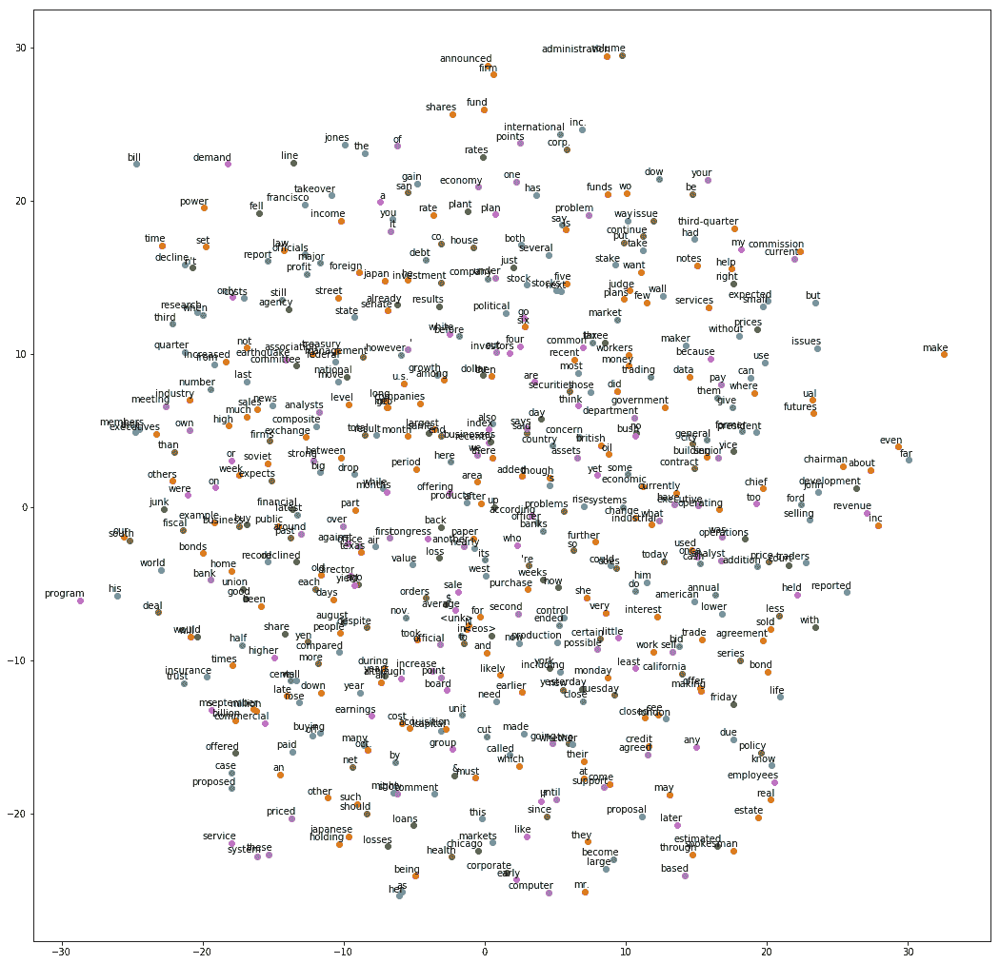
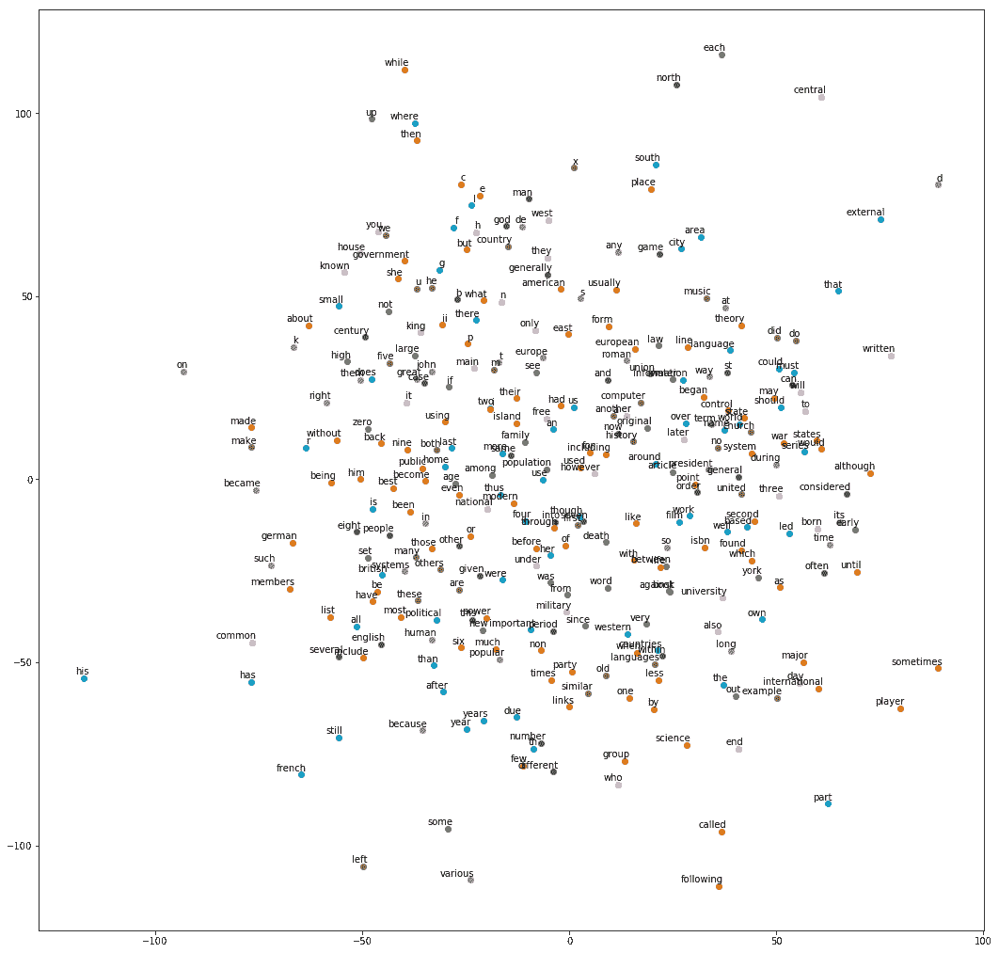

# 八、使用 TensorFlow 和 Keras 的文本数据的 RNN

文本数据可以被视为一系列字符，单词，句子或段落。 **循环神经网络**（ **RNN** ）已被证明是非常有用的序列神经网络结构。为了将神经网络模型应用于**自然语言处理**（ **NLP** ）任务，文本被视为单词序列。事实证明，这对于 NLP 任务非常成功，例如：

*   问题回答
*   会话智能体或聊天机器人
*   文件分类
*   情绪分析
*   图像标题或描述文本生成
*   命名实体识别
*   语音识别和标记

NLP 与 TensorFlow 深度学习技术是一个广阔的领域，很难在一章中捕捉到。因此，我们尝试使用 Tensorflow 和 Keras 为您提供该领域中最流行和最重要的示例。一旦掌握了本章的内容，不要忘记探索和试验 NLP 的其他领域。

在本章中，我们将了解以下主题：

*   词向量表示
*   为 word2vec 模型准备数据
*   TensorFlow 和 Keras 中的 skip-gram 模型
*   使用 t-SNE 可视化单词嵌入
*   TensorFlow 和 Keras 中使用 LSTM 模型的文本生成示例

# 词向量表示

为了从文本数据中学习神经网络模型的参数，首先，我们必须将文本或自然语言数据转换为可由神经网络摄取的格式。神经网络通常以数字向量的形式摄取文本。将原始文本数据转换为数字向量的算法称为字嵌入算法。

一种流行的字嵌入方法是我们在 MNIST 图像分类中看到的**单热编码**。假设我们的文本数据集由 60,000 个字典单词组成。然后，每个单词可以由具有 60,000 个元素的单热编码向量表示，其中除了表示具有值 1 的该单词的一个元素之外，所有其他元素具有零值。

然而，单热编码方法有其缺点。首先，对于具有大量单词的词汇，单热词向量的维数变得非常大。其次，人们无法找到与单热编码向量的单词相似性。例如，假设猫和小猫的向量分别为`[1 0 0 0 0 0]`和`[0 0 0 0 0 1]`。这些向量没有相似之处。

还有其他基于语料库的方法，用于将基于文本的语料库转换为数字向量，例如：

*   术语频率 - 反向文档频率（TF-IDF）
*   潜在语义分析（LSA）
*   主题建模

最近，用数值向量表示单词的焦点已转移到基于分布假设的方法，这意味着具有相似语义含义的单词倾向于出现在类似的上下文中。

两种最广泛使用的方法称为 word2vec 和 GloVe。我们将在本章中使用 word2vec 进行练习。正如我们在前一段中所了解到的，单热编码给出了语料库字典中单词总数大小的维数。使用 word2vec 创建的单词向量的维度要低得多。

word2vec 系列模型使用两种架构构建：

*   **连续词汇**：训练模型以学习给定上下文词的中心词的概率分布。因此，给定一组上下文单词，模型以您在高中语言课程中所做的填空方式预测中心单词。 CBOW 体系结构最适用于具有较小词汇表的数据集。
*   **Skip-gram** ：训练模型以学习给定中心词的上下文词的概率分布。因此，给定一个中心词，模型以您在高中语言课程中完成的句子方式预测语境词。

例如，让我们考虑一下这句话：

```
Vets2data.org is a non-profit for educating the US Military Veterans Community on Artificial Intelligence and Data Science.
```

在 CBOW 架构中，给出单词`Military`和`Community`，模型学习单词`Veterans`的概率，并在 skip-gram 架构中，给出单词 `Veterans`，模型学习单词`Military`和`Community`的概率。

word2vec 模型以无监督的方式从文本语料库中学习单词向量。文本语料库分为成对的上下文单词和目标单词。虽然这些对是真正的对，但是伪对是用随机配对的上下文词和上下文词生成的，因此在数据中产生噪声。训练分类器以学习用于区分真对和假对的参数。该分类器的参数成为 word2vec 模型或单词向量。

关于 word2vec 理论背后的数学和理论的更多信息可以从以下论文中学到：

```
Mikolov, T., I. Sutskever, K. Chen, G. Corrado, and J. Dean. Distributed Representations of Words and Phrases and Their Compositionality. _Advances in Neural Information Processing Systems_, 2013, pp. 3111–3119.

Mikolov, T., K. Chen, G. Corrado, and J. Dean. Efficient Estimation of Word Representations in Vector Space. _arXiv_, 2013, pp. 1–12.

Rong, X. word2vec Parameter Learning Explained. _arXiv:1411.2738_, 2014, pp. 1–19.

Baroni, M., G. Dinu, and G. Kruszewski. Don’t Count, Predict! A Systematic Comparison of Context-Counting vs. Context-Predicting Semantic Vectors. 2014.
```

您应该使用 GloVe 和 word2vec 练习并应用适用于您的文本数据的方法。

有关 GLoVe 算法的更多信息可以从以下文章中学习：

```
Pennington, J., R. Socher, and C. Manning. GloVe: Global Vectors for Word Representation. 2014.
```

让我们通过在 TensorFlow 和 Keras 中创建单词向量来理解 word2vec 模型。

您可以按照 Jupyter 笔记本中的下几节的代码`ch-08a_Embeddings_in_TensorFlow_and_Keras`。


# 为 word2vec 模型准备数据

我们将使用流行的 PTB 和 text8 数据集进行演示。

**Penn Treebank** （ **PTB** ）数据集是在 UPenn 进行的[ Penn Treebank 项目](https://catalog.ldc.upenn.edu/ldc99t42)的副产品。 PTB 项目团队在华尔街日报三年的故事中提取了大约一百万字，并以 Treebank II 风格对其进行了注释。 PTB 数据集有两种形式：  基本示例，大小约为 35 MB，  高级示例，大小约为 235 MB。我们将使用由 929K 字组成的简单数据集进行训练，73K 字用于验证，82K 字用于测试。建议您浏览高级数据集。有关 PTB 数据集的更多详细信息，[请访问此链接](http://www.fit.vutbr.cz/~imikolov/rnnlm/simple-examples.tgz) 。

[可以从此链接下载 PTB 数据集](http://www.fit.vutbr.cz/~imikolov/rnnlm/rnn-rt07-example.tar.gz)。

**text8** 数据集是一个较短的清理版本的大型维基百科数据转储，大小约为 1 GB。有关如何创建 text8 数据集的过程，[请参见此链接](http://mattmahoney.net/dc/textdata.html)。

[text8 数据集可以从此链接下载](http://mattmahoney.net/dc/text8.zip)。

使用我们的自定义库`datasetslib`中的`load_data`代码加载数据集：

`load_data()`函数执行以下操作：

1.  如果数据集的 URL 在本地不可用，它将从数据集的 URL 下载数据存档。
2.  由于`PTB`数据有三个文件，它首先从训练文件中读取文本，而对于`text8`，它从归档中读取第一个文件。
3.  它将训练文件中的单词转换为词汇表，并为每个词汇单词分配一个唯一的数字，word-id，将其存储在集合`word2id`中，并准备反向词典，这样我们就可以从 ID 中查找单词，并将其存储在集合`id2word`中。

1.  它使用集合`word2id`将文本文件转换为 ID 序列。
2.  因此，在`load_data`的末尾，我们在训练数据集中有一系列数字，在集合`id2word`中有一个 ID 到字的映射。

让我们看一下从 text8 和 PTB 数据集加载的数据：

# 加载和准备 PTB 数据集

首先导入模块并加载数据如下::

```py
from datasetslib.ptb import PTBSimple
ptb = PTBSimple()
# downloads data, converts words to ids, converts files to a list of ids
ptb.load_data() 
print('Train :',ptb.part['train'][0:5])
print('Test: ',ptb.part['test'][0:5])
print('Valid: ',ptb.part['valid'][0:5])
print('Vocabulary Length = ',ptb.vocab_len)
```

每个数据集的前五个元素以及词汇长度打印如下：

```py
Train : [9970, 9971, 9972, 9974, 9975]
Test:  [102, 14, 24, 32, 752]
Valid:  [1132, 93, 358, 5, 329]
Vocabulary Length =  10000
```

我们将上下文窗口设置为两个单词并获得 CBOW 对：

```py
ptb.skip_window=2
ptb.reset_index_in_epoch()
# in CBOW input is the context word and output is the target word
y_batch, x_batch = ptb.next_batch_cbow() 

print('The CBOW pairs : context,target')
for i in range(5 * ptb.skip_window):
    print('(', [ptb.id2word[x_i] for x_i in x_batch[i]],
          ',', y_batch[i], ptb.id2word[y_batch[i]], ')')
```

输出是：

```py
The CBOW pairs : context,target
( ['aer', 'banknote', 'calloway', 'centrust'] , 9972 berlitz )
( ['banknote', 'berlitz', 'centrust', 'cluett'] , 9974 calloway )
( ['berlitz', 'calloway', 'cluett', 'fromstein'] , 9975 centrust )
( ['calloway', 'centrust', 'fromstein', 'gitano'] , 9976 cluett )
( ['centrust', 'cluett', 'gitano', 'guterman'] , 9980 fromstein )
( ['cluett', 'fromstein', 'guterman', 'hydro-quebec'] , 9981 gitano )
( ['fromstein', 'gitano', 'hydro-quebec', 'ipo'] , 9982 guterman )
( ['gitano', 'guterman', 'ipo', 'kia'] , 9983 hydro-quebec )
( ['guterman', 'hydro-quebec', 'kia', 'memotec'] , 9984 ipo )
( ['hydro-quebec', 'ipo', 'memotec', 'mlx'] , 9986 kia )
```

现在让我们看看 skip-gram 对：

```py
ptb.skip_window=2
ptb.reset_index_in_epoch()
# in skip-gram input is the target word and output is the context word
x_batch, y_batch = ptb.next_batch()

print('The skip-gram pairs : target,context')
for i in range(5 * ptb.skip_window):
    print('(',x_batch[i], ptb.id2word[x_batch[i]],
        ',', y_batch[i], ptb.id2word[y_batch[i]],')')
```

输出为：
```py
The skip-gram pairs : target,context
( 9972 berlitz , 9970 aer )
( 9972 berlitz , 9971 banknote )
( 9972 berlitz , 9974 calloway )
( 9972 berlitz , 9975 centrust )
( 9974 calloway , 9971 banknote )
( 9974 calloway , 9972 berlitz )
( 9974 calloway , 9975 centrust )
( 9974 calloway , 9976 cluett )
( 9975 centrust , 9972 berlitz )
( 9975 centrust , 9974 calloway )
```

# 加载和准备 text8 数据集

现在我们使用 text8 数据集执行相同的加载和预处理步骤：

```py
from datasetslib.text8 import Text8
text8 = Text8()
text8.load_data() 
# downloads data, converts words to ids, converts files to a list of ids
print('Train:', text8.part['train'][0:5])
print('Vocabulary Length = ',text8.vocab_len)
```

我们发现词汇长度大约是 254,000 字：

```py
Train: [5233, 3083, 11, 5, 194]
Vocabulary Length =  253854
```

一些教程通过查找最常用的单词或将词汇量大小截断为 10,000 个单词来操纵此数据。 但是，我们使用了 text8 数据集的第一个文件中的完整数据集和完整词汇表。

准备 CBOW 对：

```py
text8.skip_window=2
text8.reset_index_in_epoch()
# in CBOW input is the context word and output is the target word
y_batch, x_batch = text8.next_batch_cbow() 

print('The CBOW pairs : context,target')
for i in range(5 * text8.skip_window):
    print('(', [text8.id2word[x_i] for x_i in x_batch[i]],
          ',', y_batch[i], text8.id2word[y_batch[i]], ')')
```

输出是：

```py
The CBOW pairs : context,target
( ['anarchism', 'originated', 'a', 'term'] , 11 as )
( ['originated', 'as', 'term', 'of'] , 5 a )
( ['as', 'a', 'of', 'abuse'] , 194 term )
( ['a', 'term', 'abuse', 'first'] , 1 of )
( ['term', 'of', 'first', 'used'] , 3133 abuse )
( ['of', 'abuse', 'used', 'against'] , 45 first )
( ['abuse', 'first', 'against', 'early'] , 58 used )
( ['first', 'used', 'early', 'working'] , 155 against )
( ['used', 'against', 'working', 'class'] , 127 early )
( ['against', 'early', 'class', 'radicals'] , 741 working )
```

准备 skip-gram 对：

```py
text8.skip_window=2
text8.reset_index_in_epoch()
# in skip-gram input is the target word and output is the context word
x_batch, y_batch = text8.next_batch()

print('The skip-gram pairs : target,context')
for i in range(5 * text8.skip_window):
    print('(',x_batch[i], text8.id2word[x_batch[i]],
        ',', y_batch[i], text8.id2word[y_batch[i]],')')
```

输出为：

```py
The skip-gram pairs : target,context
( 11 as , 5233 anarchism )
( 11 as , 3083 originated )
( 11 as , 5 a )
( 11 as , 194 term )
( 5 a , 3083 originated )
( 5 a , 11 as )
( 5 a , 194 term )
( 5 a , 1 of )
( 194 term , 11 as )
( 194 term , 5 a )
```

# 准备小验证集

为了演示该示例，我们创建了一个包含 8 个单词的小型验证集，每个单词是从单词中随机选择的，其中 word-id 在 0 到 10 x 8 之间。

```py
valid_size = 8
x_valid = np.random.choice(valid_size * 10, valid_size, replace=False)
print(x_valid)
```

作为示例，我们将以下内容作为验证集：

```py
valid:  [64 58 59 4 69 53 31 77]
```

我们将使用此验证集通过打印五个最接近的单词来演示嵌入一词的结果。

# 使用 TensorFlow 的 skip-gram 模型

现在我们已经准备好了训练和验证数据，让我们在 TensorFlow 中创建一个 skip-gram 模型。

我们首先定义超参数：

```py
batch_size = 128
embedding_size = 128
skip_window = 2
n_negative_samples = 64
ptb.skip_window=2
learning_rate = 1.0
```

*   `batch_size`是要在单个批次中输入算法的目标和上下文单词对的数量
*   `embedding_size`是每个单词的单词向量或嵌入的维度
*   `ptb.skip_window`是在两个方向上的目标词的上下文中要考虑的词的数量
*   `n_negative_samples`是由 NCE 损失函数生成的负样本数，本章将进一步说明

在一些教程中，包括 TensorFlow 文档中的一个教程，还使用了一个参数`num_skips`。在这样的教程中，作者选择了`num_skips`（目标，上下文）对。例如，如果`skip_window`是 2，那么对的总数将是 4，如果`num_skips`被设置为 2，则只有两对将被随机选择用于训练。但是，我们考虑了所有的对以便保持训练练习简单。

定义训练数据的输入和输出占位符以及验证数据的张量：

```py
inputs = tf.placeholder(dtype=tf.int32, shape=[batch_size])
outputs = tf.placeholder(dtype=tf.int32, shape=[batch_size,1])
inputs_valid = tf.constant(x_valid, dtype=tf.int32)
```

定义一个嵌入矩阵，其行数等于词汇长度，列等于嵌入维度。该矩阵中的每一行将表示词汇表中一个单词的单词向量。使用在-1.0 到 1.0 之间均匀采样的值填充此嵌入矩阵。

```py
# define embeddings matrix with vocab_len rows and embedding_size columns
# each row represents vectore representation or embedding of a word
# in the vocbulary

embed_dist = tf.random_uniform(shape=[ptb.vocab_len, embedding_size],
                               minval=-1.0,maxval=1.0)
embed_matrix = tf.Variable(embed_dist,name='embed_matrix')
```

使用此矩阵，定义使用`tf.nn.embedding_lookup()`实现的嵌入查找表。 `tf.nn.embedding_lookup()`有两个参数：嵌入矩阵和输入占位符。 lookup 函数返回`inputs`占位符中单词的单词向量。

```py
# define the embedding lookup table
# provides the embeddings of the word ids in the input tensor
embed_ltable = tf.nn.embedding_lookup(embed_matrix, inputs)
```

`embed_ltable`也可以解释为输入层顶部的嵌入层。接下来，将嵌入层的输出馈送到 softmax 或噪声对比估计（NCE）层。 NCE 基于一个非常简单的想法，即训练基于逻辑回归的二分类器，以便从真实和嘈杂数据的混合中学习参数。

TensorFlow documentation describes the NCE in further detail: [https://www.tensorflow.org/tutorials/word2vec.](https://www.tensorflow.org/tutorials/word2vec#scaling_up_with_noise-contrastive_training)

总之，基于 softmax 损失的模型在计算上是昂贵的，因为在整个词汇表中计算概率分布并对其进行归一化。基于 NCE 损耗的模型将其减少为二分类问题，即从噪声样本中识别真实样本。

NCE 的基本数学细节可以在以下 NIPS 论文中找到：_学习词嵌入有效地与噪声对比估计_，作者 Andriy Mnih 和 Koray Kavukcuoglu。[该论文可从此链接获得](http://papers.nips.cc/paper/5165-learning-word-embeddings-efficiently-with-noise-contrastive-estimation.pdf)。

`tf.nn.nce_loss()`函数在评估计算损耗时自动生成负样本：参数`num_sampled`设置为等于负样本数（`n_negative_samples`）。此参数指定要绘制的负样本数。

```py
# define noise-contrastive estimation (NCE) loss layer
nce_dist = tf.truncated_normal(shape=[ptb.vocab_len, embedding_size],
                               stddev=1.0 /
                               tf.sqrt(embedding_size * 1.0)
                               )
nce_w = tf.Variable(nce_dist)
nce_b = tf.Variable(tf.zeros(shape=[ptb.vocab_len]))

loss = tf.reduce_mean(tf.nn.nce_loss(weights=nce_w,
                                     biases=nce_b,
                                     inputs=embed_ltable,
                                     labels=outputs,
                                     num_sampled=n_negative_samples,
                                     num_classes=ptb.vocab_len
                                     )
                      )
```

接下来，计算验证集中的样本与嵌入矩阵之间的余弦相似度：

1.  为了计算相似性得分，首先，计算嵌入矩阵中每个单词向量的 L2 范数。

```py
# Compute the cosine similarity between validation set samples
# and all embeddings.
norm = tf.sqrt(tf.reduce_sum(tf.square(embed_matrix), 1, 
                             keep_dims=True))
normalized_embeddings = embed_matrix / norm
```

1.  在验证集中查找样本的嵌入或单词向量：

```py
embed_valid = tf.nn.embedding_lookup(normalized_embeddings, 
                                     inputs_valid)
```

1.  通过将验证集的嵌入与嵌入矩阵相乘来计算相似性得分。

```py
similarity = tf.matmul(
    embed_valid, normalized_embeddings, transpose_b=True)
```

这给出了具有（`valid_size`，`vocab_len`）形状的张量。张量中的每一行指的是验证词和词汇单词之间的相似性得分。

接下来，定义 SGD 优化器，学习率为 0.9，历时 50 个周期。

```py
n_epochs = 10
learning_rate = 0.9
n_batches = ptb.n_batches(batch_size)
optimizer = tf.train.GradientDescentOptimizer(learning_rate)
            .minimize(loss)
```

对于每个周期：

1.  逐批运行整个数据集上的优化器。

```py
ptb.reset_index_in_epoch()
for step in range(n_batches):
    x_batch, y_batch = ptb.next_batch()
    y_batch = dsu.to2d(y_batch,unit_axis=1)
    feed_dict = {inputs: x_batch, outputs: y_batch}
    _, batch_loss = tfs.run([optimizer, loss], feed_dict=feed_dict)
    epoch_loss += batch_loss
```

1.  计算并打印周期的平均损失。

```py
 epoch_loss = epoch_loss / n_batches 
 print('\n','Average loss after epoch ', epoch, ': ', epoch_loss)
```

1.  在周期结束时，计算相似性得分。

```py
similarity_scores = tfs.run(similarity)
```

1.  对于验证集中的每个单词，打印具有最高相似性得分的五个单词。

```py
top_k = 5 
for i in range(valid_size):
    similar_words = (-similarity_scores[i,:])
                    .argsort()[1:top_k + 1]
    similar_str = 'Similar to {0:}:'
                    .format(ptb.id2word[x_valid[i]])
    for k in range(top_k):
        similar_str = '{0:} {1:},'.format(similar_str, 
                        ptb.id2word[similar_words[k]])
    print(similar_str)
```

最后，在完成所有周期之后，计算可在学习过程中进一步利用的嵌入向量：

```py
final_embeddings = tfs.run(normalized_embeddings)
```

完整的训练代码如下：

```py
n_epochs = 10
learning_rate = 0.9
n_batches = ptb.n_batches_wv()
optimizer = tf.train.GradientDescentOptimizer(learning_rate).minimize(loss)

with tf.Session() as tfs:
    tf.global_variables_initializer().run()
    for epoch in range(n_epochs):
        epoch_loss = 0
        ptb.reset_index()
        for step in range(n_batches):
            x_batch, y_batch = ptb.next_batch_sg()
            y_batch = nputil.to2d(y_batch, unit_axis=1)
            feed_dict = {inputs: x_batch, outputs: y_batch}
            _, batch_loss = tfs.run([optimizer, loss], feed_dict=feed_dict)
            epoch_loss += batch_loss
        epoch_loss = epoch_loss / n_batches
        print('\nAverage loss after epoch ', epoch, ': ', epoch_loss)

        # print closest words to validation set at end of every epoch
        similarity_scores = tfs.run(similarity)
        top_k = 5
        for i in range(valid_size):
            similar_words = (-similarity_scores[i, :]
                             ).argsort()[1:top_k + 1]
            similar_str = 'Similar to {0:}:'.format(
                ptb.id2word[x_valid[i]])
            for k in range(top_k):
                similar_str = '{0:} {1:},'.format(
                    similar_str, ptb.id2word[similar_words[k]])
            print(similar_str)
    final_embeddings = tfs.run(normalized_embeddings)
```

这是我们分别在第 1 和第 10 周期之后得到的输出：

```py
Average loss after epoch  0 :  115.644006802
Similar to we: types, downturn, internal, by, introduce,
Similar to been: said, funds, mcgraw-hill, street, have,
Similar to also: will, she, next, computer, 's,
Similar to of: was, and, milk, dollars, $,
Similar to last: be, october, acknowledging, requested, computer,
Similar to u.s.: plant, increase, many, down, recent,
Similar to an: commerce, you, some, american, a,
Similar to trading: increased, describes, state, companies, in,

Average loss after epoch  9 :  5.56538496033
Similar to we: types, downturn, introduce, internal, claims,
Similar to been: exxon, said, problem, mcgraw-hill, street,
Similar to also: will, she, ssangyong, audit, screens,
Similar to of: seasonal, dollars, motor, none, deaths,
Similar to last: acknowledging, allow, incorporated, joint, requested,
Similar to u.s.: undersecretary, typically, maxwell, recent, increase,
Similar to an: banking, officials, imbalances, americans, manager,
Similar to trading: describes, increased, owners, committee, else,
```

最后，我们运行 5000 个周期的模型并获得以下结果：

```py
Average loss after epoch  4999 :  2.74216903135
Similar to we: matter, noted, here, classified, orders,
Similar to been: good, precedent, medium-sized, gradual, useful,
Similar to also: introduce, england, index, able, then,
Similar to of: indicator, cleveland, theory, the, load,
Similar to last: dec., office, chrysler, march, receiving,
Similar to u.s.: label, fannie, pressures, squeezed, reflection,
Similar to an: knowing, outlawed, milestones, doubled, base,
Similar to trading: associates, downturn, money, portfolios, go,
```

尝试进一步运行，最多 50,000 个周期，以获得更好的结果。

同样，我们在 50 个周期之后使用 text8 模型得到以下结果：

```py
Average loss after epoch  49 :  5.74381046423
Similar to four: five, three, six, seven, eight,
Similar to all: many, both, some, various, these,
Similar to between: with, through, thus, among, within,
Similar to a: another, the, any, each, tpvgames,
Similar to that: which, however, although, but, when,
Similar to zero: five, three, six, eight, four,
Similar to is: was, are, has, being, busan,
Similar to no: any, only, the, another, trinomial,
```

# 使用 t-SNE 可视化单词嵌入

让我们可视化我们在上一节中生成的单词嵌入。 t-SNE 是在二维空间中显示高维数据的最流行的方法。我们将使用 scikit-learn 库中的方法，并重用 TensorFlow 文档中给出的代码，来绘制我们刚学过的词嵌入的图形。

[TensorFlow 文档中的原始代码可从此链接获得](https://github.com/tensorflow/tensorflow/blob/r1.3/tensorflow/examples/tutorials/word2vec/word2vec_basic.py)。

以下是我们如何实现该程序：

1.  创建`tsne`模型：

```py
tsne = TSNE(perplexity=30, n_components=2,
            init='pca', n_iter=5000, method='exact')
```

1.  将要显示的嵌入数限制为 500，否则，图形变得非常难以理解：

```py
n_embeddings = 500
```

1.  通过调用`tsne`模型上的`fit_transform()`方法并将`final_embeddings`的第一个`n_embeddings`作为输入来创建低维表示。

```py
low_dim_embeddings = tsne.fit_transform(
    final_embeddings[:n_embeddings, :])
```

1.  找到我们为图表选择的单词向量的文本表示：

```py
labels = [ptb.id2word[i] for i in range(n_embeddings)]
```

1.  最后，绘制嵌入图：

```py
plot_with_labels(low_dim_embeddings, labels)
```

我们得到以下绘图：

t-SNE visualization of embeddings for PTB data set

同样，从 text8 模型中，我们得到以下图：

t-SNE visualization of embeddings for text8 data set

# keras 的 skip-gram 模型

使用 Keras 的嵌入模型的流程与 TensorFlow 保持一致。

*   在 Keras 函数式或顺序模型中创建网络体系结构
*   将目标和上下文单词的真假对提供给网络
*   查找目标和上下文单词的单词向量
*   执行单词向量的点积以获得相似性得分
*   将相似性得分通过 sigmoid 层以将输出作为真或假对

现在让我们使用 Keras 函数式 API 实现这些步骤：

1.  导入所需的库：

```py
from keras.models import Model
from keras.layers.embeddings import Embedding
from keras.preprocessing import sequence
from keras.preprocessing.sequence import skipgrams
from keras.layers import Input, Dense, Reshape, Dot, merge
import keras
```

重置图，以便清除以前在 Jupyter Notebook 中运行的任何后续效果：

```py
# reset the jupyter buffers
tf.reset_default_graph()
keras.backend.clear_session()
```

1.  创建一个验证集，我们将用它来打印我们的模型在训练结束时找到的相似单词：

```py
valid_size = 8
x_valid = np.random.choice(valid_size * 10, valid_size, replace=False)
print('valid: ',x_valid)
```

1.  定义所需的超参数：

```py
batch_size = 1024
embedding_size = 512 
n_negative_samples = 64
ptb.skip_window=2
```

1.  使用`keras.preprocessing.sequence`中的`make_sampling_table()`函数创建一个大小等于词汇长度的样本表。接下来，使用`keras.preprocessing.sequence`中的函数`skipgrams()`生成上下文和目标词对以及表示它们是真对还是假对的标签。

```py
sample_table = sequence.make_sampling_table(ptb.vocab_len)
pairs, labels= sequence.skipgrams(ptb.part['train'],
        ptb.vocab_len,window_size=ptb.skip_window,
        sampling_table=sample_table)
```

1.  让我们打印一些使用以下代码生成的伪造和真实对：

```py
print('The skip-gram pairs : target,context')
for i in range(5 * ptb.skip_window):
    print(['{} {}'.format(id,ptb.id2word[id]) \ 
        for id in pairs[i]],':',labels[i])
```

对配对如下：

```py
The skip-gram pairs : target,context
['547 trying', '5 to'] : 1
['4845 bargain', '2 <eos>'] : 1
['1705 election', '198 during'] : 1
['4704 flows', '8117 gun'] : 0
['13 is', '37 company'] : 1
['625 above', '132 three'] : 1
['5768 pessimistic', '1934 immediate'] : 0
['637 china', '2 <eos>'] : 1
['258 five', '1345 pence'] : 1
['1956 chrysler', '8928 exercises'] : 0
```

1.  从上面生成的对中拆分目标和上下文单词，以便将它们输入模型。将目标和上下文单词转换为二维数组。

```py
x,y=zip(*pairs)
x=np.array(x,dtype=np.int32)
x=dsu.to2d(x,unit_axis=1)
y=np.array(y,dtype=np.int32)
y=dsu.to2d(y,unit_axis=1)
labels=np.array(labels,dtype=np.int32)
labels=dsu.to2d(labels,unit_axis=1)
```

1.  定义网络的体系结构。正如我们所讨论的，必须将目标和上下文单词输入网络，并且需要从嵌入层中查找它们的向量。因此，首先我们分别为目标和上下文单词定义输入，嵌入和重塑层：

```py
# build the target word model
target_in = Input(shape=(1,),name='target_in')
target = Embedding(ptb.vocab_len,embedding_size,input_length=1,
            name='target_em')(target_in)
target = Reshape((embedding_size,1),name='target_re')(target)

# build the context word model
context_in = Input((1,),name='context_in')
context = Embedding(ptb.vocab_len,embedding_size,input_length=1,
            name='context_em')(context_in)
context = Reshape((embedding_size,1),name='context_re')(context)
```

1.  接下来，构建这两个模型的点积，将其输入 sigmoid 层以生成输出标签：

```py
# merge the models with the dot product to check for 
# similarity and add sigmoid layer
output = Dot(axes=1,name='output_dot')([target,context])
output = Reshape((1,),name='output_re')(output)
output = Dense(1, activation='sigmoid',name='output_sig')(output)
```

1.  从我们刚刚创建的输入和输出模型构建函数式模型：

```py
# create the functional model for finding word vectors
model = Model(inputs=[target_in,context_in],outputs=output)
model.compile(loss='binary_crossentropy', optimizer='adam')
```

1.  此外，在给定输入目标词的情况下，构建一个模型，用于预测与所有单词的相似性：

```py
# merge the models and create model to check for cosine similarity
similarity = Dot(axes=0,normalize=True,
            name='sim_dot')([target,context])
similarity_model = Model(inputs=[target_in,context_in],
            outputs=similarity)
```

让我们打印模型摘要：

```py
__________________________________________________________________________
Layer (type)               Output Shape          Param #     Connected to                     
==========================================================================
target_in (InputLayer)     (None, 1)          0                                            
__________________________________________________________________________
context_in (InputLayer)    (None, 1)          0                                            
__________________________________________________________________________
target_em (Embedding)      (None, 1, 512)     5120000     target_in[0][0]                  
__________________________________________________________________________
context_em (Embedding)     (None, 1, 512)     5120000     context_in[0][0]                 
__________________________________________________________________________
target_re (Reshape)        (None, 512, 1)     0           target_em[0][0]                  
__________________________________________________________________________
context_re (Reshape)       (None, 512, 1)     0           context_em[0][0]                 
__________________________________________________________________________
output_dot (Dot)           (None, 1, 1)       0           target_re[0][0]                  
                                                          context_re[0][0]                 
__________________________________________________________________________
output_re (Reshape)        (None, 1)          0           output_dot[0][0]                 
__________________________________________________________________________
output_sig (Dense)         (None, 1)          2           output_re[0][0]                  
==========================================================================
Total params: 10,240,002
Trainable params: 10,240,002
Non-trainable params: 0
__________________________________________________________________________
```

1.  接下来，训练模型。我们只训练了 5 个周期，但你应该尝试更多的周期，至少 1000 或 10,000 个周期。

请记住，这将需要几个小时，因为这不是最优化的代码。 欢迎您使用本书和其他来源的提示和技巧进一步优化代码。

```py
n_epochs = 5
batch_size = 1024
model.fit([x,y],labels,batch_size=batch_size, epochs=n_epochs)
```

让我们根据这个模型发现的单词向量打印单词的相似度：

```py
# print closest words to validation set at end of training
top_k = 5
y_val = np.arange(ptb.vocab_len, dtype=np.int32)
y_val = dsu.to2d(y_val,unit_axis=1)
for i in range(valid_size):
    x_val = np.full(shape=(ptb.vocab_len,1),fill_value=x_valid[i], 
            dtype=np.int32)
    similarity_scores = similarity_model.predict([x_val,y_val])
    similarity_scores=similarity_scores.flatten()
    similar_words = (-similarity_scores).argsort()[1:top_k + 1]
    similar_str = 'Similar to {0:}:'.format(ptb.id2word[x_valid[i]])
    for k in range(top_k):
        similar_str = '{0:} {1:},'.format(similar_str, 
                        ptb.id2word[similar_words[k]])
    print(similar_str)
```

我们得到以下输出：

```py
Similar to we: rake, kia, sim, ssangyong, memotec,
Similar to been: nahb, sim, rake, punts, rubens,
Similar to also: photography, snack-food, rubens, nahb, ssangyong,
Similar to of: isi, rake, memotec, kia, mlx,
Similar to last: rubens, punts, memotec, sim, photography,
Similar to u.s.: mlx, memotec, punts, rubens, kia,
Similar to an: memotec, isi, ssangyong, rake, sim,
Similar to trading: rake, rubens, swapo, mlx, nahb,
```

到目前为止，我们已经看到了如何使用 TensorFlow 及其高级库 Keras 创建单词向量或嵌入。现在让我们看看如何使用 TensorFlow 和 Keras 来学习模型并将模型应用于一些与 NLP 相关的任务的预测。

# 使用 TensorFlow 和 Keras 中的 RNN 模型生成文本

文本生成是 NLP 中 RNN 模型的主要应用之一。针对文本序列训练 RNN 模型，然后通过提供种子文本作为输入来生成文本序列。让我们试试 text8 数据集。

让我们加载 text8 数据集并打印前 100 个单词：

```py
from datasetslib.text8 import Text8
text8 = Text8()
# downloads data, converts words to ids, converts files to a list of ids
text8.load_data() 
print(' '.join([text8.id2word[x_i] for x_i in text8.part['train'][0:100]]))
```

我们得到以下输出：

```py
anarchism originated as a term of abuse first used against early working class radicals including the diggers of the english revolution and the sans culottes of the french revolution whilst the term is still used in a pejorative way to describe any act that used violent means to destroy the organization of society it has also been taken up as a positive label by self defined anarchists the word anarchism is derived from the greek without archons ruler chief king anarchism as a political philosophy is the belief that rulers are unnecessary and should be abolished although there are differing
```

在我们的笔记本示例中，我们将数据加载剪切为 5,000 字的文本，因为较大的文本需要高级技术，例如分布式或批量，我们希望保持示例简单。

```py
from datasetslib.text8 import Text8
text8 = Text8()
text8.load_data(clip_at=5000) 
print('Train:', text8.part['train'][0:5])
print('Vocabulary Length = ',text8.vocab_len)
```

我们看到词汇量现在减少到 1,457 个单词。

```py
Train: [  8 497   7   5 116]
Vocabulary Length =  1457
```

在我们的示例中，我们构造了一个非常简单的单层 LSTM。为了训练模型，我们使用 5 个单词作为输入来学习第六个单词的参数。输入层是 5 个字，隐藏层是具有 128 个单元的 LSTM 单元，最后一层是完全连接的层，其输出等于词汇量大小。由于我们正在演示这个例子，我们没有使用单词向量，而是使用非常简单的单热编码输出向量。

一旦模型被训练，我们用 2 个不同的字符串作为生成更多字符的种子来测试它：

*   `random5`：随机选择 5 个单词生成的字符串。
*   `first5`：从文本的前 5 个单词生成的字符串。

```py
random5 = np.random.choice(n_x * 50, n_x, replace=False)
print('Random 5 words: ',id2string(random5))
first5 = text8.part['train'][0:n_x].copy()
print('First 5 words: ',id2string(first5))
```

我们看到种子串是：

```py
Random 5 words:  free bolshevik be n another
First 5 words:  anarchism originated as a term
```

对于您的执行，随机种子字符串可能不同。

现在让我们首先在 TensorFlow 中创建 LSTM 模型。

# TensorFlow 中的 LSTM 文本生成

您可以在 Jupyter 笔记本`ch-08b_RNN_Text_TensorFlow`中按照本节的代码进行操作。

我们使用以下步骤在 TensorFlow 中实现文本生成 LSTM：

1.  让我们为`x`和`y`定义参数和占位符：

```py
batch_size = 128
n_x = 5 # number of input words
n_y = 1 # number of output words
n_x_vars = 1 # in case of our text, there is only 1 variable at each timestep
n_y_vars = text8.vocab_len
state_size = 128
learning_rate = 0.001
x_p = tf.placeholder(tf.float32, [None, n_x, n_x_vars], name='x_p') 
y_p = tf.placeholder(tf.float32, [None, n_y_vars], name='y_p')
```

对于输入，我们使用单词的整数表示，因此`n_x_vars`是 1.对于输出，我们使用单热编码值，因此输出的数量等于词汇长度。

1.  接下来，创建一个长度为`n_x`的张量列表：

```py
x_in = tf.unstack(x_p,axis=1,name='x_in')
```

1.  接下来，从输入和单元创建 LSTM 单元和静态 RNN 网络：

```py
cell = tf.nn.rnn_cell.LSTMCell(state_size)
rnn_outputs, final_states = tf.nn.static_rnn(cell, x_in,dtype=tf.float32)
```

1.  接下来，我们定义最终层的权重，偏差和公式。最后一层只需要为第六个单词选择输出，因此我们应用以下公式来仅获取最后一个输出：

```py
# output node parameters
w = tf.get_variable('w', [state_size, n_y_vars], initializer= tf.random_normal_initializer)
b = tf.get_variable('b', [n_y_vars], initializer=tf.constant_initializer(0.0))
y_out = tf.matmul(rnn_outputs[-1], w) + b
```

1.  接下来，创建一个损失函数和优化器：

```py
loss = tf.reduce_mean(tf.nn.softmax_cross_entropy_with_logits(
        logits=y_out, labels=y_p))
optimizer = tf.train.AdamOptimizer(learning_rate=learning_rate)
            .minimize(loss)
```

1.  创建我们可以在会话块中运行的准确率函数，以检查训练模式的准确性：

```py
n_correct_pred = tf.equal(tf.argmax(y_out,1), tf.argmax(y_p,1))
accuracy = tf.reduce_mean(tf.cast(n_correct_pred, tf.float32))
```

1.  最后，我们训练模型 1000 个周期，并每 100 个周期打印结果。此外，每 100 个周期，我们从上面描述的种子字符串打印生成的文本。

LSTM 和 RNN 网络需要对大量数据集进行大量周期的训练，以获得更好的结果。 请尝试加载完整的数据集并在计算机上运行 50,000或80,000 个周期，并使用其他超参数来改善结果。

```py
n_epochs = 1000
learning_rate = 0.001
text8.reset_index_in_epoch()
n_batches = text8.n_batches_seq(batch_size=batch_size,n_tx=n_x,n_ty=n_y)
n_epochs_display = 100

with tf.Session() as tfs:
    tf.global_variables_initializer().run()

    for epoch in range(n_epochs):
        epoch_loss = 0
        epoch_accuracy = 0
        for step in range(n_batches):
            x_batch, y_batch = text8.next_batch_seq(batch_size=batch_size,
                                n_tx=n_x,n_ty=n_y)
            y_batch = dsu.to2d(y_batch,unit_axis=1)
            y_onehot = np.zeros(shape=[batch_size,text8.vocab_len],
                        dtype=np.float32)
            for i in range(batch_size):
                y_onehot[i,y_batch[i]]=1

            feed_dict = {x_p: x_batch.reshape(-1, n_x, n_x_vars), 
                         y_p: y_onehot}
            _, batch_accuracy, batch_loss = tfs.run([optimizer,accuracy,
                                            loss],feed_dict=feed_dict)
            epoch_loss += batch_loss
            epoch_accuracy += batch_accuracy

        if (epoch+1) % (n_epochs_display) == 0:
            epoch_loss = epoch_loss / n_batches
            epoch_accuracy = epoch_accuracy / n_batches
            print('\nEpoch {0:}, Average loss:{1:}, Average accuracy:{2:}'.
                    format(epoch,epoch_loss,epoch_accuracy ))

            y_pred_r5 = np.empty([10])
            y_pred_f5 = np.empty([10])

            x_test_r5 = random5.copy()
            x_test_f5 = first5.copy()
            # let us generate text of 10 words after feeding 5 words
            for i in range(10):
                for x,y in zip([x_test_r5,x_test_f5],
                               [y_pred_r5,y_pred_f5]):
                    x_input = x.copy()
                    feed_dict = {x_p: x_input.reshape(-1, n_x, n_x_vars)}
                    y_pred = tfs.run(y_out, feed_dict=feed_dict)
                    y_pred_id = int(tf.argmax(y_pred, 1).eval())
                    y[i]=y_pred_id
                    x[:-1] = x[1:]
                    x[-1] = y_pred_id
            print(' Random 5 prediction:',id2string(y_pred_r5))
            print(' First 5 prediction:',id2string(y_pred_f5))
```

结果如下：

```py
Epoch 99, Average loss:1.3972469369570415, Average accuracy:0.8489583333333334
  Random 5 prediction: labor warren together strongly profits strongly supported supported co without
  First 5 prediction: market own self free together strongly profits strongly supported supported

Epoch 199, Average loss:0.7894854595263799, Average accuracy:0.9186197916666666
  Random 5 prediction: syndicalists spanish class movements also also anarcho anarcho anarchist was
  First 5 prediction: five civil association class movements also anarcho anarcho anarcho anarcho

Epoch 299, Average loss:1.360412875811259, Average accuracy:0.865234375
  Random 5 prediction: anarchistic beginnings influenced true tolstoy tolstoy tolstoy tolstoy tolstoy tolstoy
  First 5 prediction: early civil movement be for was two most most most

Epoch 399, Average loss:1.1692512730757396, Average accuracy:0.8645833333333334
  Random 5 prediction: including war than than revolutionary than than war than than
  First 5 prediction: left including including including other other other other other other

Epoch 499, Average loss:0.5921860883633295, Average accuracy:0.923828125
  Random 5 prediction: ever edited interested interested variety variety variety variety variety variety
  First 5 prediction: english market herbert strongly price interested variety variety variety variety

Epoch 599, Average loss:0.8356450994809469, Average accuracy:0.8958333333333334
  Random 5 prediction: management allow trabajo trabajo national national mag mag ricardo ricardo
  First 5 prediction: spain prior am working n war war war self self

Epoch 699, Average loss:0.7057955612738928, Average accuracy:0.8971354166666666
  Random 5 prediction: teachings can directive tend resist obey christianity author christianity christianity
  First 5 prediction: early early called social called social social social social social

Epoch 799, Average loss:0.772875706354777, Average accuracy:0.90234375
  Random 5 prediction: associated war than revolutionary revolutionary revolutionary than than revolutionary revolutionary
  First 5 prediction: political been hierarchy war than see anti anti anti anti

Epoch 899, Average loss:0.43675946692625683, Average accuracy:0.9375
  Random 5 prediction: individualist which which individualist warren warren tucker benjamin how tucker
  First 5 prediction: four at warren individualist warren published considered considered considered considered

Epoch 999, Average loss:0.23202441136042276, Average accuracy:0.9602864583333334
  Random 5 prediction: allow allow trabajo you you you you you you you
  First 5 prediction: labour spanish they they they movement movement anarcho anarcho two
```

生成的文本中的重复单词是常见的，并且应该更好地训练模型。虽然模型的准确性提高到 96%，但仍然不足以生成清晰的文本。尝试增加 LSTM 单元/隐藏层的数量，同时在较大的数据集上运行模型以获取大量周期。

现在让我们在 Keras 建立相同的模型：

# Keras 中的 LSTM 文本生成

您可以在 Jupyter 笔记本`ch-08b_RNN_Text_Keras`中按照本节的代码进行操作。

我们在 Keras 实现文本生成 LSTM，步骤如下：

1.  首先，我们将所有数据转换为两个张量，张量`x`有五列，因为我们一次输入五个字，张量`y`只有一列输出。我们将`y`或标签张量转换为单热编码表示。

请记住，在大型数据集的实践中，您将使用 word2vec 嵌入而不是单热表示。

```py
# get the data
x_train, y_train = text8.seq_to_xy(seq=text8.part['train'],n_tx=n_x,n_ty=n_y)
# reshape input to be [samples, time steps, features]
x_train = x_train.reshape(x_train.shape[0], x_train.shape[1],1)
y_onehot = np.zeros(shape=[y_train.shape[0],text8.vocab_len],dtype=np.float32)
for i in range(y_train.shape[0]):
    y_onehot[i,y_train[i]]=1
```

1.  接下来，仅使用一个隐藏的 LSTM 层定义 LSTM 模型。由于我们的输出不是序列，我们还将`return_sequences`设置为`False`：

```py
n_epochs = 1000
batch_size=128
state_size=128
n_epochs_display=100

# create and fit the LSTM model
model = Sequential()
model.add(LSTM(units=state_size,
                input_shape=(x_train.shape[1], x_train.shape[2]),
                return_sequences=False
                )
          )
model.add(Dense(text8.vocab_len))
model.add(Activation('softmax'))
model.compile(loss='categorical_crossentropy', optimizer='adam')
model.summary()
```

该模型如下所示：

```py
Layer (type)                 Output Shape              Param #   
=================================================================
lstm_1 (LSTM)                (None, 128)               66560     
_________________________________________________________________
dense_1 (Dense)              (None, 1457)              187953    
_________________________________________________________________
activation_1 (Activation)    (None, 1457)              0         
=================================================================
Total params: 254,513
Trainable params: 254,513
Non-trainable params: 0
_________________________________________________________________
```

1.  对于 Keras，我们运行一个循环来运行 10 次，在每次迭代中训练 100 个周期的模型并打印文本生成的结果。以下是训练模型和生成文本的完整代码：

```py
for j in range(n_epochs // n_epochs_display):
     model.fit(x_train, y_onehot, epochs=n_epochs_display,
                         batch_size=batch_size,verbose=0)
     # generate text
     y_pred_r5 = np.empty([10])
     y_pred_f5 = np.empty([10])
     x_test_r5 = random5.copy()
     x_test_f5 = first5.copy()
     # let us generate text of 10 words after feeding 5 words
     for i in range(10):
         for x,y in zip([x_test_r5,x_test_f5],
                        [y_pred_r5,y_pred_f5]):
             x_input = x.copy()
             x_input = x_input.reshape(-1, n_x, n_x_vars)
             y_pred = model.predict(x_input)[0]
             y_pred_id = np.argmax(y_pred)
             y[i]=y_pred_id
             x[:-1] = x[1:]
             x[-1] = y_pred_id
     print('Epoch: ',((j+1) * n_epochs_display)-1)
     print(' Random5 prediction:',id2string(y_pred_r5))
     print(' First5 prediction:',id2string(y_pred_f5))
```

1.  输出并不奇怪，从重复单词开始，模型有所改进，但是可以通过更多 LSTM 层，更多数据，更多训练迭代和其他超参数调整来进一步提高。

```py
Random 5 words: free bolshevik be n another 
First 5 words: anarchism originated as a term
```

预测的输出如下：

```py
Epoch: 99 
    Random5 prediction: anarchistic anarchistic wrote wrote wrote wrote wrote wrote wrote wrote 
    First5 prediction: right philosophy than than than than than than than than 

Epoch: 199 
    Random5 prediction: anarchistic anarchistic wrote wrote wrote wrote wrote wrote wrote wrote 
    First5 prediction: term i revolutionary than war war french french french french 

Epoch: 299 
    Random5 prediction: anarchistic anarchistic wrote wrote wrote wrote wrote wrote wrote wrote 
    First5 prediction: term i revolutionary revolutionary revolutionary revolutionary revolutionary revolutionary revolutionary revolutionary 

Epoch: 399 
    Random5 prediction: anarchistic anarchistic wrote wrote wrote wrote wrote wrote wrote wrote 
    First5 prediction: term i revolutionary labor had had french french french french 

Epoch: 499 
    Random5 prediction: anarchistic anarchistic amongst wrote wrote wrote wrote wrote wrote wrote 
    First5 prediction: term i revolutionary labor individualist had had french french french 

Epoch: 599 
    Random5 prediction: tolstoy wrote tolstoy wrote wrote wrote wrote wrote wrote wrote     First5 prediction: term i revolutionary labor individualist had had had had had 

Epoch: 699 
    Random5 prediction: tolstoy wrote tolstoy wrote wrote wrote wrote wrote wrote wrote     First5 prediction: term i revolutionary labor individualist had had had had had 

Epoch: 799 
    Random5 prediction: tolstoy wrote tolstoy tolstoy tolstoy tolstoy tolstoy tolstoy tolstoy tolstoy 
    First5 prediction: term i revolutionary labor individualist had had had had had 

Epoch: 899 
    Random5 prediction: tolstoy wrote tolstoy tolstoy tolstoy tolstoy tolstoy tolstoy tolstoy tolstoy 
    First5 prediction: term i revolutionary labor should warren warren warren warren warren 

Epoch: 999 
    Random5 prediction: tolstoy wrote tolstoy tolstoy tolstoy tolstoy tolstoy tolstoy tolstoy tolstoy 
    First5 prediction: term i individualist labor should warren warren warren warren warren
```

如果您注意到我们在 LSTM 模型的输出中有重复的单词用于文本生成。虽然超参数和网络调整可以消除一些重复，但还有其他方法可以解决这个问题。我们得到重复单词的原因是模型总是从单词的概率分布中选择具有最高概率的单词。这可以改变以选择诸如在连续单词之间引入更大可变性的单词。

# 总结

在本章中，我们学习了单词嵌入的方法，以找到更好的文本数据元素表示。随着神经网络和深度学习摄取大量文本数据，单热表示和其他单词表示方法变得低效。我们还学习了如何使用 t-SNE 图来可视化文字嵌入。我们使用简单的 LSTM 模型在 TensorFlow 和 Keras 中生成文本。类似的概念可以应用于各种其他任务，例如情绪分析，问答和神经机器翻译。

在我们深入研究先进的 TensorFlow 功能（如迁移学习，强化学习，生成网络和分布式 TensorFlow）之前，我们将在下一章中看到如何将 TensorFlow 模型投入生产。

