# 九、使用 TensorFlow 和 Keras 的 CNN

**卷积神经网络**（**CNN**）是一种特殊的前馈神经网络，在其架构中包含卷积和汇聚层。也称为 ConvNets，CNN 架构的一般模式是按以下顺序包含这些层：

1.  完全连接的输入层
2.  卷积，池化和完全连接层的多种组合
3.  完全连接的输出层，具有 softmax 激活函数

CNN 架构已被证明在解决涉及图像学习的问题（例如图像识别和对象识别）方面非常成功。

在本章中，我们将学习与 ConvNets 相关的以下主题：

*   理解卷积
*   了解池
*   CNN 架构模式-LeNet
*   LeNet for MNIST 数据集
    *   带有 TensorFlow 的 MNIST 的 LeNet
    *   带有 Keras 的 MNIST 的 LeNet
*   LeNet for CIFAR 数据集
    *   带有 TensorFlow 的 CIFAR10 的 LeNet CNN
    *   带有 Keras 的 CIFAR10 的 LeNet CNN

让我们从学习 ConvNets 背后的核心概念开始。

# 理解卷积

**卷积**是 CNN 架构背后的核心概念。简单来说，卷积是一种数学运算，它结合了两个来源的信息来产生一组新的信息。具体来说，它将一个称为内核的特殊矩阵应用于输入张量，以产生一组称为特征图的矩阵。可以使用任何流行的算法将内核应用于输入张量。

生成卷积矩阵的最常用算法如下：

```py
N_STRIDES = [1,1]
1\. Overlap the kernel with the top-left cells of the image matrix.
2\. Repeat while the kernel overlaps the image matrix:
    2.1 c_col = 0
    2.2 Repeat while the kernel overlaps the image matrix:
        2.1.1 set c_row = 0        2.1.2 convolved_scalar = scalar_prod(kernel, overlapped cells)
        2.1.3 convolved_matrix(c_row,c_col) = convolved_scalar
        2.1.4 Slide the kernel down by N_STRIDES[0] rows.
        2.1.5 c_row = c_row  + 1
    2.3 Slide the kernel to (topmost row, N_STRIDES[1] columns right)
    2.4 c_col = c_col + 1
```

例如，我们假设核矩阵是 2 x 2 矩阵，输入图像是 3 x 3 矩阵。下图逐步显示了上述算法：

| | |
| --- | --- |
| 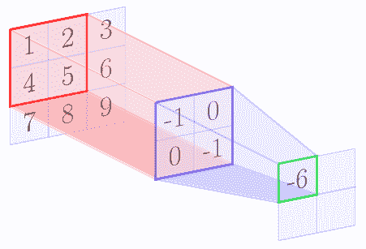 | 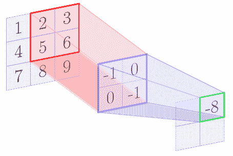 |
| 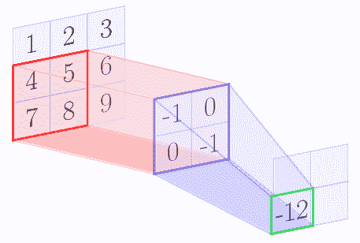 | 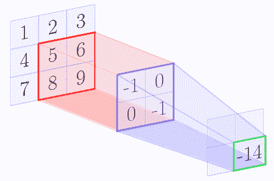 |

在 con 卷积操作结束时，我们得到以下特征图：

| | |
| --- | --- |
| -6 | -8 |
| -12 | -14 |

在上面的示例中，与卷积的原始输入相比，生成的特征映射的大小更小。通常，特征图的大小减小（内核大小-1）。因此，特征图的大小为：

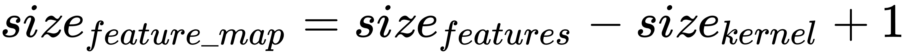

**三维张量**

对于具有额外深度尺寸的三维张量，您可以将前面的算法视为应用于深度维度中的每个层。将卷积应用于 3D 张量的输出也是 2D 张量，因为卷积运算添加了三个通道。

**步幅**

数组 N_STRIDES 中的**步长**是您想要将内核滑过的行或列的数字。在我们的例子中，我们使用了 1 的步幅。如果我们使用更多的步幅，那么特征图的大小将根据以下等式进一步减小：

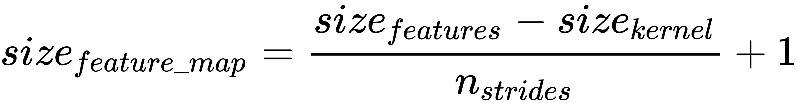

**填充**

如果我们不希望减小特征映射的大小，那么我们可以在输入的所有边上使用填充，使得特征的大小增加填充大小的两倍。使用填充，可以按如下方式计算特征图的大小：

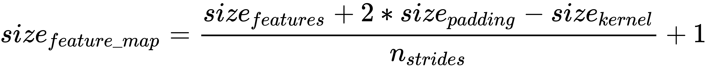

TensorFlow 允许两种填充：SAME 或 VALID。 SAME 填充意味着添加填充，使输出特征图与输入特征具有相同的大小。 VALID 填充意味着没有填充。

应用前面提到的卷积算法的结果是特征图，是原始张量的滤波版本。例如，特征图可能只有从原始图像中过滤出的轮廓。因此，内核也称为过滤器。对于每个内核，您将获得单独的 2D 特征图。

根据您希望网络学习的特征，您必须应用适当的过滤器来强调所需的特征。 但是，使用 CNN，模型可以自动了解哪些内核在卷积层中最有效。

**TensorFlow** 中的卷积运算

TensorFlow 提供实现卷积算法的卷积层。例如，具有以下签名的`tf.nn.conv2d()`操作：

```py
tf.nn.conv2d(
  input,
  filter,
  strides,
  padding,
  use_cudnn_on_gpu=None,
  data_format=None,
  name=None
)
```

`input`和`filter`表示形状`[batch_size, input_height, input_width, input_depth]`的数据张量和形状`[filter_height, filter_width, input_depth, output_depth]`的核张量。内核张量中的  `output_depth`表示应该应用于输入的内核数量。 `strides`张量表示每个维度中要滑动的单元数。如上所述，`padding`是有效的或相同的。

[您可以在此链接中找到有关 TensorFlow 中可用卷积操作的更多信息](https://www.tensorflow.org/api_guides/python/nn#Convolution)

[您可以在此链接中找到有关 Keras 中可用卷积层的更多信息](https://keras.io/layers/convolutional/)

此链接提供了卷积的详细数学解释：

<http://colah.github.io/posts/2014-07-Understanding-Convolutions/>

<http://ufldl.stanford.edu/tutorial/supervised/FeatureExtractionUsingConvolution/>

<http://colah.github.io/posts/2014-07-Understanding-Convolutions/>

卷积层或操作将输入值或神经元连接到下一个隐藏层神经元。每个隐藏层神经元连接到与内核中元素数量相同数量的输入神经元。所以在前面的例子中，内核有 4 个元素，因此隐藏层神经元连接到输入层的 4 个神经元（3×3 个神经元中）。在我们的例子中，输入层的 4 个神经元的这个区域被称为 CNN 理论中的**感受域**。

卷积层具有每个内核的单独权重和偏差参数。权重参数的数量等于内核中元素的数量，并且只有一个偏差参数。内核的所有连接共享相同的权重和偏差参数。因此在我们的例子中，将有 4 个权重参数和 1 个偏差参数，但如果我们在卷积层中使用 5 个内核，则总共将有 5 x 4 个权重参数和 5 个 1 个偏差参数，一组（4）每个特征图的权重，1 个偏差）参数。

# 了解池化

通常，在卷积操作中，应用几个不同的内核，这导致生成若干特征映射。因此，卷积运算导致生成大尺寸数据集。

例如，将形状为 3 x 3 x 1 的内核应用于具有 28 x 28 x 1 像素形状的图像的 MNIST 数据集，可生成形状为 26 x 26 x 1 的特征映射。如果我们在 a 中应用 32 个这样的滤波器卷积层，则输出的形状为 32 x 26 x 26 x 1，即形状为 26 x 26 x 1 的 32 个特征图。

与形状为 28 x 28 x 1 的原始数据集相比，这是一个庞大的数据集。因此，为了简化下一层的学习，我们应用池化的概念。

**合并**是指计算卷积特征空间区域的聚合统计量。两个最受欢迎的汇总统计数据是最大值和平均值。应用 max-pooling 的输出是所选区域的最大值，而应用平均池的输出是区域中数字的平均值。

例如，假设特征图的形状为 3 x 3，形状的池区域为 2 x 2.以下图像显示了使用[1,1]的步幅应用的最大池操作：

| | |
| --- | --- |
| 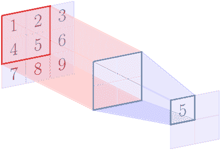 | 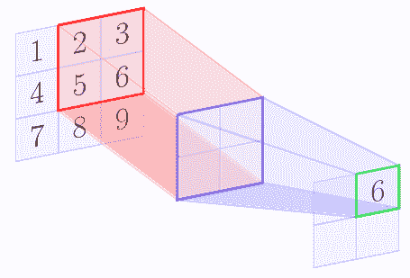 |
| 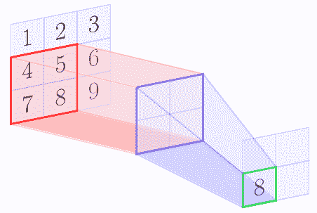 | 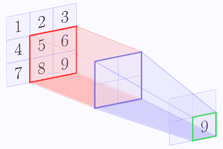 |

在最大池操作结束时，我们得到以下矩阵：

| | |
| --- | --- |
| 5 | 6 |
| 8 | 9 |

通常，池化操作应用非重叠区域，因此步幅张量和区域张量被设置为相同的值。

例如，TensorFlow 具有以下签名的`max_pooling`操作：

```py
max_pool(
  value,
  ksize,
  strides,
  padding,
  data_format='NHWC',
  name=None
)
```

`value` 表示形状 `[batch_size, input_height, input_width, input_depth]` 的输入张量。对矩形形状区域`ksize`执行合并操作。这些区域被形状`strides` 抵消。

[您可以在此链接中找到有关 TensorFlow 中可用的池化操作的更多信息](https://www.tensorflow.org/api_guides/python/nn#Pooling)

[有关 Keras 中可用池化的更多信息，请访问此链接](https://keras.io/layers/pooling/)

[此链接提供了池化的详细数学说明](http://ufldl.stanford.edu/tutorial/supervised/Pooling/)

# CNN 架构模式 - LeNet

LeNet 是实现 CNN 的流行架构模式。在本章中，我们将学习如何通过按以下顺序创建层来构建基于 LeNet 模式的 CNN 模型：

1.  输入层
2.  卷积层 1，它产生一组特征映射，具有 ReLU 激活
3.  池化层 1 产生一组统计聚合的特征映射
4.  卷积层 2，其产生一组特征映射，具有 ReLU 激活
5.  池化层 2 产生一组统计聚合的特征映射
6.  完全连接的层，通过 ReLU 激活来展平特征图
7.  通过应用简单线性激活产生输出的输出层

**LeNet** 系列模型由 Yann LeCun 及其研究员介绍。有关 LeNet 系列模型的更多详细信息，[请访问此链接](http://yann.lecun.com/exdb/publis/pdf/lecun-01a.pdf)。

[Yann LeCun 通过此链接维护 LeNet 系列模型列表](http://yann.lecun.com/exdb/lenet/index.html)。

# 用于 MNIST 数据的 LeNet

您可以按照 Jupyter 笔记本中的代码`ch-09a_CNN_MNIST_TF_and_Keras`。

准备 MNIST 数据到测试和训练集：

```py
from tensorflow.examples.tutorials.mnist import input_data
mnist = input_data.read_data_sets(os.path.join('.','mnist'), one_hot=True)
X_train = mnist.train.images
X_test = mnist.test.images
Y_train = mnist.train.labels
Y_test = mnist.test.labels
```

# 使用 TensorFlow 的用于 MNIST 的 LeNet CNN

在 TensorFlow 中，应用以下步骤为 MNIST 数据构建基于 LeNet 的 CNN 模型：

1.  定义超参数，以及 x 和 y 的占位符（输入图像和输出标签） ：

```py
n_classes = 10 # 0-9 digits
n_width = 28
n_height = 28
n_depth = 1
n_inputs = n_height * n_width * n_depth # total pixels
learning_rate = 0.001
n_epochs = 10
batch_size = 100
n_batches = int(mnist.train.num_examples/batch_size)

# input images shape: (n_samples,n_pixels)
x = tf.placeholder(dtype=tf.float32, name="x", shape=[None, n_inputs]) 
# output labels
y = tf.placeholder(dtype=tf.float32, name="y", shape=[None, n_classes])
```

将输入 x 重塑为形状（`n_samples`，`n_width`，`n_height`，`n_depth`）：

```py
x_ = tf.reshape(x, shape=[-1, n_width, n_height, n_depth])
```

1.  使用形状为 4 x 4 的 32 个内核定义第一个卷积层，从而生成 32 个特征图。

*   首先，定义第一个卷积层的权重和偏差。我们使用正态分布填充参数：

```py
layer1_w = tf.Variable(tf.random_normal(shape=[4,4,n_depth,32],
            stddev=0.1),name='l1_w')
layer1_b = tf.Variable(tf.random_normal([32]),name='l1_b')
```

*   接下来，用 `tf.nn.conv2d`函数定义卷积层。函数参数`stride`定义了内核张量在每个维度中应该滑动的元素。维度顺序由`data_format`确定，可以是`'NHWC'`或`'NCHW'`（默认为`'NHWC'`）。
    通常，`stride`中的第一个和最后一个元素设置为 1。函数参数`padding`可以是`SAME`或`VALID`。 `SAME` `padding`表示输入将用零填充，以便在卷积后输出与输入的形状相同。使用`tf.nn.relu()`函数添加`relu`激活：

```py
layer1_conv = tf.nn.relu(tf.nn.conv2d(x_,layer1_w,
                                      strides=[1,1,1,1],
                                      padding='SAME'
                                     ) + 
                         layer1_b 
                        )
```

*   使用 `tf.nn.max_pool()` 函数定义第一个池化层。参数 `ksize` 表示使用 2×2×1 个区域的合并操作，参数 `stride` 表示将区域滑动 2×2×1 个像素。因此，区域彼此不重叠。由于我们使用 `max_pool` ，池化操作选择 2 x 2 x 1 区域中的最大值：

```py
layer1_pool = tf.nn.max_pool(layer1_conv,ksize=[1,2,2,1],
                 strides=[1,2,2,1],padding='SAME')
```

第一个卷积层产生 32 个大小为 28 x 28 x 1 的特征图，然后池化成 32 x 14 x 14 x 1 的数据。

1.  定义第二个卷积层，它将此数据作为输入并生成 64 个特征图。

*   首先，定义第二个卷积层的权重和偏差。我们用正态分布填充参数：

```py
layer2_w = tf.Variable(tf.random_normal(shape=[4,4,32,64],
           stddev=0.1),name='l2_w')
layer2_b = tf.Variable(tf.random_normal([64]),name='l2_b')
```

*   接下来，用 `tf.nn.conv2d`函数定义卷积层：

```py
layer2_conv = tf.nn.relu(tf.nn.conv2d(layer1_pool,
                                      layer2_w,
                                      strides=[1,1,1,1],
                                      padding='SAME'
                                     ) + 
                          layer2_b
                        )
```

*   用`tf.nn.max_pool`函数定义第二个池化层：

```py
layer2_pool = tf.nn.max_pool(layer2_conv,
                             ksize=[1,2,2,1],
                             strides=[1,2,2,1],
                             padding='SAME'
                            )
```

第二卷积层的输出形状为 64 ×14×14×1，然后池化成 64×7×7×1 的形状的输出。

1.  在输入 1024 个神经元的完全连接层之前重新整形此输出，以产生大小为 1024 的扁平输出：

```py
layer3_w = tf.Variable(tf.random_normal(shape=[64*7*7*1,1024],
                       stddev=0.1),name='l3_w')
layer3_b = tf.Variable(tf.random_normal([1024]),name='l3_b')
layer3_fc = tf.nn.relu(tf.matmul(tf.reshape(layer2_pool,
            [-1, 64*7*7*1]),layer3_w) + layer3_b)
```

1.  完全连接层的输出馈入具有 10 个输出的线性输出层。我们在这一层没有使用 softmax，因为我们的损失函数自动将 softmax 应用于输出：

```py
layer4_w = tf.Variable(tf.random_normal(shape=[1024, n_classes],
                                        stddev=0.1),name='l)
layer4_b = tf.Variable(tf.random_normal([n_classes]),name='l4_b')
layer4_out = tf.matmul(layer3_fc,layer4_w)+layer4_b
```

这创建了我们保存在变量`model`中的第一个 CNN 模型：

```py
model = layer4_out
```

鼓励读者探索具有不同超参数值的 TensorFlow 中可用的不同卷积和池操作符。

为了定义损失，我们使用`tf.nn.softmax_cross_entropy_with_logits`函数，对于优化器，我们使用`AdamOptimizer`函数。您应该尝试探索 TensorFlow 中可用的不同优化器函数。

```py
entropy = tf.nn.softmax_cross_entropy_with_logits(logits=model, labels=y)
loss = tf.reduce_mean(entropy)
optimizer = tf.train.AdamOptimizer(learning_rate).minimize(loss)
```

最后，我们通过迭代`n_epochs`来训练模型，并且在`n_batches`上的每个周期列中，每批`batch_size`的大小：

```py
with tf.Session() as tfs:
    tf.global_variables_initializer().run()
    for epoch in range(n_epochs):
        total_loss = 0.0
        for batch in range(n_batches):
            batch_x,batch_y = mnist.train.next_batch(batch_size)
            feed_dict={x:batch_x, y: batch_y}
            batch_loss,_ = tfs.run([loss, optimizer],
                                   feed_dict=feed_dict)
            total_loss += batch_loss 
        average_loss = total_loss / n_batches
        print("Epoch: {0:04d} loss = {1:0.6f}".format(epoch,average_loss))
    print("Model Trained.")

    predictions_check = tf.equal(tf.argmax(model,1),tf.argmax(y,1))
    accuracy = tf.reduce_mean(tf.cast(predictions_check, tf.float32))
    feed_dict = {x:mnist.test.images, y:mnist.test.labels}
    print("Accuracy:", accuracy.eval(feed_dict=feed_dict))
```

我们得到以下输出：

```py
Epoch: 0000   loss = 1.418295
Epoch: 0001   loss = 0.088259
Epoch: 0002   loss = 0.055410
Epoch: 0003   loss = 0.042798
Epoch: 0004   loss = 0.030471
Epoch: 0005   loss = 0.023837
Epoch: 0006   loss = 0.019800
Epoch: 0007   loss = 0.015900
Epoch: 0008   loss = 0.012918
Epoch: 0009   loss = 0.010322
Model Trained.
Accuracy: 0.9884
```

现在，与我们在前几章中看到的方法相比，这是一个非常好的准确率。从图像数据中学习 CNN 模型是不是很神奇？

# 使用 Keras 的用于 MNIST 的 LeNet CNN

让我们重新审视具有相同数据集的相同 LeNet 架构，以在 Keras 中构建和训练 CNN 模型：

1.  导入所需的 Keras 模块：

```py
import keras
from keras.models import Sequential
from keras.layers import Conv2D,MaxPooling2D, Dense, Flatten, Reshape
from keras.optimizers import SGD
```

1.  定义每个层的过滤器数量：

```py
n_filters=[32,64]
```

1.  定义其他超参数：

```py
learning_rate = 0.01
n_epochs = 10
batch_size = 100
```

1.  定义顺序模型并添加层以将输入数据重新整形为形状`(n_width,n_height,n_depth)`：

```py
model = Sequential()
model.add(Reshape(target_shape=(n_width,n_height,n_depth), 
                  input_shape=(n_inputs,))
         )
```

1.  使用 4 x 4 内核过滤器，`SAME`填充和`relu`激活添加第一个卷积层：

```py
model.add(Conv2D(filters=n_filters[0],kernel_size=4, 
                 padding='SAME',activation='relu') 
         )
```

1.  添加区域大小为 2 x 2 且步长为 2 x 2 的池化层：

```py
model.add(MaxPooling2D(pool_size=(2,2),strides=(2,2)))
```

1.  以与添加第一层相同的方式添加第二个卷积和池化层：

```py
model.add(Conv2D(filters=n_filters[1],kernel_size=4, 
                 padding='SAME',activation='relu') 
         )
model.add(MaxPooling2D(pool_size=(2,2),strides=(2,2)))
```

1.  添加层以展平第二个层的输出和 1024 个神经元的完全连接层，以处理展平的输出：

```py
model.add(Flatten())
model.add(Dense(units=1024, activation='relu'))
```

1.  使用`softmax`激活添加最终输出层：

```py
model.add(Dense(units=n_outputs, activation='softmax'))
```

1.  使用以下代码查看模型摘要：

```py
model.summary()
```

该模型描述如下：

```py
Layer (type)                 Output Shape              Param #   
=================================================================
reshape_1 (Reshape)          (None, 28, 28, 1)         0         
_________________________________________________________________
conv2d_1 (Conv2D)            (None, 28, 28, 32)        544       
_________________________________________________________________
max_pooling2d_1 (MaxPooling2 (None, 14, 14, 32)        0         
_________________________________________________________________
conv2d_2 (Conv2D)            (None, 14, 14, 64)        32832     
_________________________________________________________________
max_pooling2d_2 (MaxPooling2 (None, 7, 7, 64)          0         
_________________________________________________________________
flatten_1 (Flatten)          (None, 3136)              0         
_________________________________________________________________
dense_1 (Dense)              (None, 1024)              3212288   
_________________________________________________________________
dense_2 (Dense)              (None, 10)                10250     
=================================================================
Total params: 3,255,914
Trainable params: 3,255,914
Non-trainable params: 0
_________________________________________________________________
```

1.  编译，训练和评估模型：

```py
model.compile(loss='categorical_crossentropy',
              optimizer=SGD(lr=learning_rate),
              metrics=['accuracy'])
model.fit(X_train, Y_train,batch_size=batch_size,
          epochs=n_epochs)
score = model.evaluate(X_test, Y_test)
print('\nTest loss:', score[0])
print('Test accuracy:', score[1])
```

我们得到以下输出：

```py
Epoch 1/10
55000/55000 [===================] - 267s - loss: 0.8854 - acc: 0.7631   
Epoch 2/10
55000/55000 [===================] - 272s - loss: 0.2406 - acc: 0.9272   
Epoch 3/10
55000/55000 [===================] - 267s - loss: 0.1712 - acc: 0.9488   
Epoch 4/10
55000/55000 [===================] - 295s - loss: 0.1339 - acc: 0.9604   
Epoch 5/10
55000/55000 [===================] - 278s - loss: 0.1112 - acc: 0.9667   
Epoch 6/10
55000/55000 [===================] - 279s - loss: 0.0957 - acc: 0.9714   
Epoch 7/10
55000/55000 [===================] - 316s - loss: 0.0842 - acc: 0.9744   
Epoch 8/10
55000/55000 [===================] - 317s - loss: 0.0758 - acc: 0.9773   
Epoch 9/10
55000/55000 [===================] - 285s - loss: 0.0693 - acc: 0.9790   
Epoch 10/10
55000/55000 [===================] - 217s - loss: 0.0630 - acc: 0.9804
Test loss: 0.0628845927377
Test accuracy: 0.9785
```

准确率的差异可归因于我们在这里使用 SGD 优化器这一事实，它没有实现我们用于 TensorFlow 模型的`AdamOptimizer`提供的一些高级功能。

# 用于 CIFAR10 数据的 LeNet

现在我们已经学会了使用 TensorFlow 和 Keras 的 MNIST 数据集构建和训练 CNN 模型，让我们用 CIFAR10 数据集重复练习。

CIFAR-10 数据集包含 60,000 个 32x32 像素形状的 RGB 彩色图像。图像被平均分为 10 个不同的类别或类别：飞机，汽车，鸟，猫，鹿，狗，青蛙，马，船和卡车。 CIFAR-10 和 CIFAR-100 是包含 8000 万个图像的大图像数据集的子集。 CIFAR 数据集由 Alex Krizhevsky，Vinod Nair 和 Geoffrey Hinton 收集和标记。数字 10 和 100 表示​​图像类别的数量。

有关 CIFAR 数据集的更多详细信息，请访问此链接：

<http://www.cs.toronto.edu/~kriz/cifar.html>

和

<http://www.cs.toronto.edu/~kriz/learning-features-2009-TR.pdf>

我们选择了 CIFAR 10，因为它有 3 个通道，即图像的深度为 3，而 MNIST 数据集只有一个通道。 为了简洁起见，我们将详细信息留给下载并将数据拆分为训练和测试集，并在本书代码包中的 datasetslib 包中提供代码。

您可以按照 Jupyter 笔记本中的代码`ch-09b_CNN_CIFAR10_TF_and_Keras`。

我们使用以下代码加载和预处理 CIFAR10 数据：

```py
from datasetslib.cifar import cifar10
from datasetslib import imutil
dataset = cifar10()
dataset.x_layout=imutil.LAYOUT_NHWC
dataset.load_data()
dataset.scaleX()
```

加载数据使得图像采用`'NHWC'`格式，使数据变形（`number_of_samples, image_height, image_width, image_channels`）。我们将图像通道称为图像深度。图像中的每个像素是 0 到 255 之间的数字。使用 MinMax 缩放来缩放数据集，以通过将所有像素值除以 255 来标准化图像。

加载和预处理的数据在数据集对象变量中可用作`dataset.X_train`，`dataset.Y_train`，`dataset.X_test`和`dataset.Y_test`。

# 使用 TensorFlow 的用于 CIFAR10 的 ConvNets

我们保持层，滤波器及其大小与之前的 MNIST 示例中的相同，增加了一个正则化层。由于此数据集与 MNIST 相比较复杂，因此我们为正则化目的添加了额外的丢弃层：

```py
tf.nn.dropout(layer1_pool, keep_prob)
```

在预测和评估期间，占位符`keep_prob`设置为 1。这样我们就可以重复使用相同的模型进行培训以及预测和评估。

有关 CIFAR10 数据的 LeNet 模型的完整代码在笔记本 `ch-09b_CNN_CIFAR10_TF_and_Keras` 中提供。

在运行模型时，我们得到以下输出：

```py
Epoch: 0000   loss = 2.115784
Epoch: 0001   loss = 1.620117
Epoch: 0002   loss = 1.417657
Epoch: 0003   loss = 1.284346
Epoch: 0004   loss = 1.164068
Epoch: 0005   loss = 1.058837
Epoch: 0006   loss = 0.953583
Epoch: 0007   loss = 0.853759
Epoch: 0008   loss = 0.758431
Epoch: 0009   loss = 0.663844
Epoch: 0010   loss = 0.574547
Epoch: 0011   loss = 0.489902
Epoch: 0012   loss = 0.410211
Epoch: 0013   loss = 0.342640
Epoch: 0014   loss = 0.280877
Epoch: 0015   loss = 0.234057
Epoch: 0016   loss = 0.195667
Epoch: 0017   loss = 0.161439
Epoch: 0018   loss = 0.140618
Epoch: 0019   loss = 0.126363
Model Trained.
Accuracy: 0.6361
```

与我们在 MNIST 数据上获得的准确率相比，我们没有获得良好的准确率。通过调整不同的超参数并改变卷积和池化层的组合，可以实现更好的准确率。我们将其作为挑战，让读者探索并尝试不同的 LeNet 架构和超参数变体，以实现更高的准确率。

# 使用 Keras 的用于 CIFAR10 的 ConvNets

让我们在 Keras 重复 LeNet CNN 模型构建和 CIFAR10 数据训练。我们保持架构与前面的示例相同，以便轻松解释概念。在 Keras 中，dropout 层添加如下：

```py
model.add(Dropout(0.2))
```

用于 CIFAR10 CNN 模型的 Keras 中的完整代码在笔记本 `ch-09b_CNN_CIFAR10_TF_and_Keras` 中提供。

在运行模型时，我们得到以下模型描述：

```py
_________________________________________________________________
Layer (type)                 Output Shape              Param #   
=================================================================
conv2d_1 (Conv2D)            (None, 32, 32, 32)        1568      
_________________________________________________________________
max_pooling2d_1 (MaxPooling2 (None, 16, 16, 32)        0         
_________________________________________________________________
dropout_1 (Dropout)          (None, 16, 16, 32)        0         
_________________________________________________________________
conv2d_2 (Conv2D)            (None, 16, 16, 64)        32832     
_________________________________________________________________
max_pooling2d_2 (MaxPooling2 (None, 8, 8, 64)          0         
_________________________________________________________________
dropout_2 (Dropout)          (None, 8, 8, 64)          0         
_________________________________________________________________
flatten_1 (Flatten)          (None, 4096)              0         
_________________________________________________________________
dense_1 (Dense)              (None, 1024)              4195328   
_________________________________________________________________
dropout_3 (Dropout)          (None, 1024)              0         
_________________________________________________________________
dense_2 (Dense)              (None, 10)                10250     
=================================================================
Total params: 4,239,978
Trainable params: 4,239,978
Non-trainable params: 0
_________________________________________________________________
```

我们得到以下训练和评估结果：

```py
Epoch 1/10
50000/50000 [====================] - 191s - loss: 1.5847 - acc: 0.4364   
Epoch 2/10
50000/50000 [====================] - 202s - loss: 1.1491 - acc: 0.5973   
Epoch 3/10
50000/50000 [====================] - 223s - loss: 0.9838 - acc: 0.6582   
Epoch 4/10
50000/50000 [====================] - 223s - loss: 0.8612 - acc: 0.7009   
Epoch 5/10
50000/50000 [====================] - 224s - loss: 0.7564 - acc: 0.7394   
Epoch 6/10
50000/50000 [====================] - 217s - loss: 0.6690 - acc: 0.7710   
Epoch 7/10
50000/50000 [====================] - 222s - loss: 0.5925 - acc: 0.7945   
Epoch 8/10
50000/50000 [====================] - 221s - loss: 0.5263 - acc: 0.8191   
Epoch 9/10
50000/50000 [====================] - 237s - loss: 0.4692 - acc: 0.8387   
Epoch 10/10
50000/50000 [====================] - 230s - loss: 0.4320 - acc: 0.8528   
Test loss: 0.849927025414
Test accuracy: 0.7414
```

再次，我们将其作为挑战，让读者探索并尝试不同的 LeNet 架构和超参数变体，以实现更高的准确率。

# 总结

在本章中，我们学习了如何使用 TensorFlow 和 Keras 创建卷积神经网络。我们学习了卷积和池化的核心概念，这是 CNN 的基础。我们学习了 LeNet 系列架构，并为 MNIST 和 CIFAR 数据集创建，训练和评估了 LeNet 族模型。 TensorFlow 和 Keras 提供了许多卷积和池化层和操作。鼓励读者探索本章未涉及的层和操作。

在下一章中，我们将继续学习如何使用 AutoEncoder 架构将 TensorFlow 应用于图像数据。

