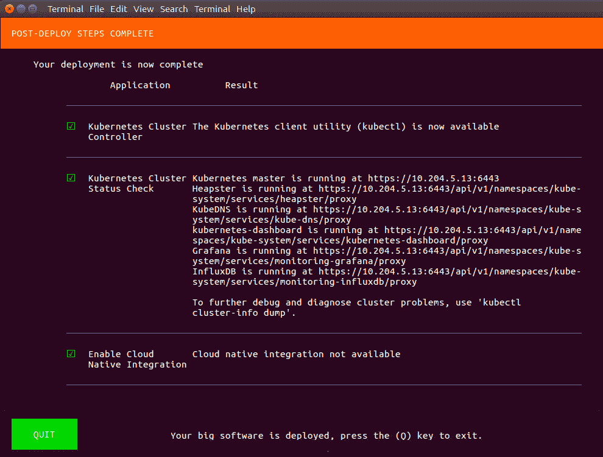
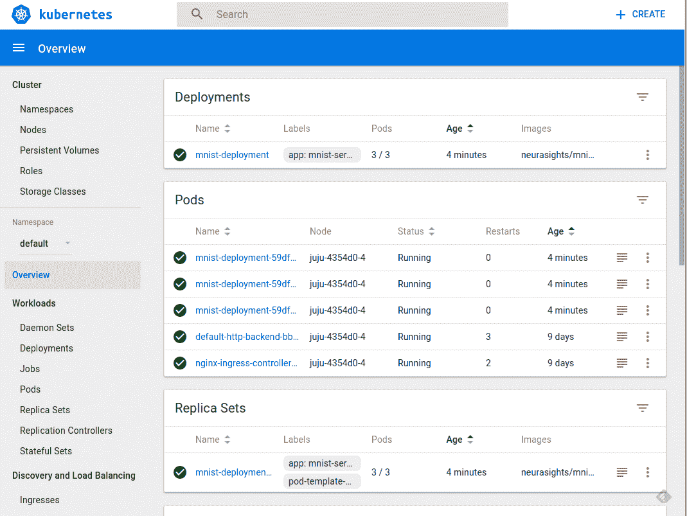
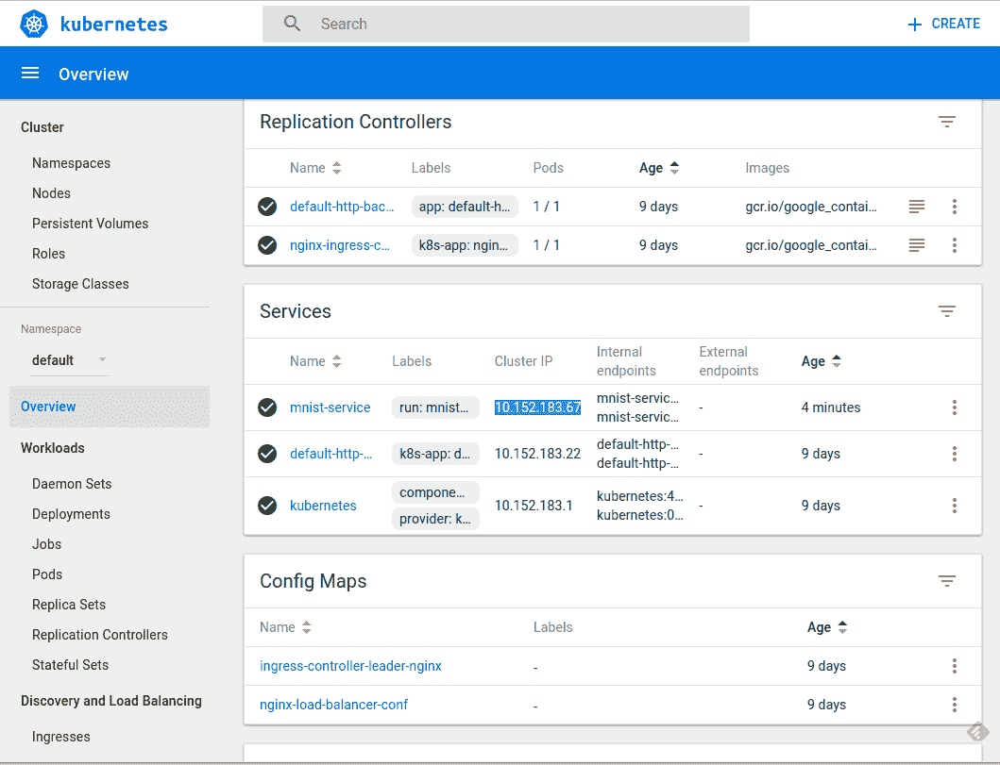

# 十一、TF 服务：生产中的 TensorFlow 模型

TensorFlow 模型在开发环境中经过训练和验证。一旦发布，它们需要托管在某个地方，提供用工程师和软件工程师使用，以集成到各种应用中。 TensorFlow 为此提供了一个高表现服务器，称为 TensorFlow 服务。

要在生产中提供 TensorFlow 模型，需要在离线训练后保存它们，然后在生产环境中恢复经过训练的模型。 TensorFlow 模型在保存时包含以下文件：

*   **元图**：元图表示图的协议缓冲区定义。元图保存在具有`.meta`扩展名的文件中。
*   **检查点**：检查点代表各种变量的值。检查点保存在两个文件中：一个带有`.index`扩展名，另一个带有`.data-00000-of-00001`扩展名。

在本章中，我们将学习各种保存和恢复模型的方法以及如何使用 TF 服务来提供模型。我们将使用 MNIST 示例来简化操作并涵盖以下主题：

*   使用`Saver`类在 TensorFlow 中保存和恢复模型
*   保存和恢复 Keras 模型
*   TensorFlow 服务
*   安装 TF 服务
*   保存 TF 服务的模型
*   用 TF 服务来服务模型
*   TF 在 Docker 容器中提供服务
*   Kubernetes 上的 TF 服务

# 在 TensorFlow 中保存和恢复模型

您可以通过以下两种方法之一在 TensorFlow 中保存和恢复模型和变量：

*   从`tf.train.Saver`类创建的保存器对象
*   从`tf.saved_model_builder.SavedModelBuilder`类创建的基于`SavedModel`格式的对象

让我们看看两种方法的实际应用。

您可以按照 Jupyter 笔记本中的代码`ch-11a_Saving_and_Restoring_TF_Models`。

# 使用保存器类保存和恢复所有图变量

我们进行如下：

1.  要使用`saver`类，首先要创建此类的对象：

```py
saver = tf.train.Saver()
```

1.  保存图中所有变量的最简单方法是使用以下两个参数调用`save()`方法：会话对象和磁盘上保存变量的文件的路径：

```py
with tf.Session() as tfs:
   ...
   saver.save(tfs,"saved-models/model.ckpt")
```

1.  要恢复变量，调用`restore()`方法：

```py
with tf.Session() as tfs:
    saver.restore(tfs,"saved-models/model.ckpt")
 ...
```

1.  让我们重温一下第 1 章，TensorFlow 101 的例子，在简单的例子中保存变量的代码如下：

```py
# Assume Linear Model y = w * x + b
# Define model parameters
w = tf.Variable([.3], tf.float32)
b = tf.Variable([-.3], tf.float32)
# Define model input and output
x = tf.placeholder(tf.float32)
y = w * x + b
output = 0

# create saver object
saver = tf.train.Saver()

with tf.Session() as tfs:
    # initialize and print the variable y
    tfs.run(tf.global_variables_initializer())
    output = tfs.run(y,{x:[1,2,3,4]})
    saved_model_file = saver.save(tfs,
        'saved-models/full-graph-save-example.ckpt')
    print('Model saved in {}'.format(saved_model_file))
    print('Values of variables w,b: {}{}'
        .format(w.eval(),b.eval()))
    print('output={}'.format(output))
```

我们得到以下输出：

```py
Model saved in saved-models/full-graph-save-example.ckpt
Values of variables w,b: [ 0.30000001][-0.30000001]
output=[ 0\.          0.30000001  0.60000002  0.90000004]
```

1.  现在让我们从刚刚创建的检查点文件中恢复变量：

```py
# Assume Linear Model y = w * x + b
# Define model parameters
w = tf.Variable([0], dtype=tf.float32)
b = tf.Variable([0], dtype=tf.float32)
# Define model input and output
x = tf.placeholder(dtype=tf.float32)
y = w * x + b
output = 0

# create saver object
saver = tf.train.Saver()

with tf.Session() as tfs:
    saved_model_file = saver.restore(tfs,
        'saved-models/full-graph-save-example.ckpt')
    print('Values of variables w,b: {}{}'
        .format(w.eval(),b.eval()))
    output = tfs.run(y,{x:[1,2,3,4]})
    print('output={}'.format(output))
```

您会注意到在恢复代码中我们没有调用`tf.global_variables_initializer()`，因为不需要初始化变量，因为它们将从文件中恢复。我们得到以下输出，它是根据恢复的变量计算得出的：

```py
INFO:tensorflow:Restoring parameters from saved-models/full-graph-save-example.ckpt
Values of variables w,b: [ 0.30000001][-0.30000001]
output=[ 0\.          0.30000001  0.60000002  0.90000004]
```

# 使用保存器类保存和恢复所选变量

默认情况下，`Saver()`类将所有变量保存在图中，但您可以通过将变量列表传递给`Saver()`类的构造函数来选择要保存的变量：

```py
# create saver object
saver = tf.train.Saver({'weights': w})
```

变量名称可以作为列表或字典传递。如果变量名称作为列表传递，则列表中的每个变量将以其自己的名称保存。变量也可以作为由键值对组成的字典传递，其中键是用于保存的名称，值是要保存的变量的名称。

以下是我们刚看到的示例的代码，但这次我们只保存`w`变量的权重；保存时将其命名为`weights`：

```py
# Saving selected variables in a graph in TensorFlow

# Assume Linear Model y = w * x + b
# Define model parameters
w = tf.Variable([.3], tf.float32)
b = tf.Variable([-.3], tf.float32)
# Define model input and output
x = tf.placeholder(tf.float32)
y = w * x + b
output = 0

# create saver object
saver = tf.train.Saver({'weights': w})

with tf.Session() as tfs:
    # initialize and print the variable y
    tfs.run(tf.global_variables_initializer())
    output = tfs.run(y,{x:[1,2,3,4]})
    saved_model_file = saver.save(tfs,
        'saved-models/weights-save-example.ckpt')
    print('Model saved in {}'.format(saved_model_file))
    print('Values of variables w,b: {}{}'
        .format(w.eval(),b.eval()))
    print('output={}'.format(output))
```

我们得到以下输出：

```py
Model saved in saved-models/weights-save-example.ckpt
Values of variables w,b: [ 0.30000001][-0.30000001]
output=[ 0\.          0.30000001  0.60000002  0.90000004]
```

检查点文件仅保存权重而不是偏差。现在让我们将偏差和权重初始化为零，并恢复权重。此示例的代码在此处给出：

```py
# Restoring selected variables in a graph in TensorFlow
tf.reset_default_graph()
# Assume Linear Model y = w * x + b
# Define model parameters
w = tf.Variable([0], dtype=tf.float32)
b = tf.Variable([0], dtype=tf.float32)
# Define model input and output
x = tf.placeholder(dtype=tf.float32)
y = w * x + b
output = 0

# create saver object
saver = tf.train.Saver({'weights': w})

with tf.Session() as tfs:
    b.initializer.run()
    saved_model_file = saver.restore(tfs,
        'saved-models/weights-save-example.ckpt')
    print('Values of variables w,b: {}{}'
        .format(w.eval(),b.eval()))
    output = tfs.run(y,{x:[1,2,3,4]})
    print('output={}'.format(output))
```

如您所见，这次我们必须使用`b.initializer.run()`初始化偏差。我们不使用`tfs.run(tf.global_variables_initializer())`因为它会初始化所有变量，并且不需要初始化权重，因为它们将从检查点文件中恢复。

我们得到以下输出，因为计算仅使用恢复的权重，而偏差设置为零：

```py
INFO:tensorflow:Restoring parameters from saved-models/weights-save-example.ckpt
Values of variables w,b: [ 0.30000001][ 0.]
output=[ 0.30000001  0.60000002  0.90000004  1.20000005]
```

# 保存和恢复 Keras 模型

在 Keras 中，保存和恢复模型非常简单。 Keras 提供三种选择：

*   使用其网络体系结构，权重（参数），训练配置和优化程序状态保存完整模型。
*   仅保存架构。
*   只保存权重。

要保存完整模型，请使用`model.save(filepath)`函数。这将把完整的模型保存在 HDF5 文件中。可以使用`keras.models.load_model(filepath)`函数加载保存的模型。此函数将所有内容加载回来，然后还编译模型。

要保存模型的体系结构，请使用`model.to_json()`或`model.to_yaml()`函数。这些函数返回一个可以写入磁盘文件的字符串。在恢复架构时，可以回读字符串，并使用`keras.models.model_from_json(json_string)`或`keras.models.model_from_yaml(yaml_string)`函数恢复模型架构。这两个函数都返回一个模型实例。

要保存模型的权重，请使用`model.save_weights(path_to_h5_file)`函数。可以使用`model.load_weights(path_to_h5_file)`函数恢复权重。

# TensorFlow 服务

TensorFlow 服务（TFS）是一种高表现服务器架构，用于为生产中的机器学习模型提供服务。它提供与使用 TensorFlow 构建的模型的开箱即用集成。

在 TFS 中，**模型**由一个或多个**可服务对象**组成。 可服务对象用于执行计算，例如：

*   用于嵌入查找的查找表
*   单个模型返回预测
*   一组模型返回一组预测
*   查找表或模型的分片

**管理器**组件管理可服务对象的整个生命周期，包括加载/卸载可服务对象并提供可服务对象。

[TensorFlow 服务的内部架构和工作流程在此链接中描述](https://www.tensorflow.org/serving/architecture_overview)。

# 安装 TF 服务

按照本节中的说明使用`aptitude`在 Ubuntu 上安装 TensorFlow ModelServer。

1.  首先，在 shell 提示符下使用以下命令添加 TensorFlow 服务分发 URI 作为包源（一次性设置）：

```py
$ echo "deb [arch=amd64] http://storage.googleapis.com/tensorflow-serving-apt stable tensorflow-model-server tensorflow-model-server-universal" | sudo tee /etc/apt/sources.list.d/tensorflow-serving.list

$ curl https://storage.googleapis.com/tensorflow-serving-apt/tensorflow-serving.release.pub.gpg | sudo apt-key add -
```

1.  在 shell 提示符下使用以下命令安装和更新 TensorFlow ModelServer：

```py
$ sudo apt-get update && sudo apt-get install tensorflow-model-server
```

这将安装使用特定于平台的编译器优化的 ModelServer 版本，例如使用 SSE4 和 AVX 指令。但是，如果优化版本安装在旧计算机上不起作用，则可以安装通用版本：

```py
$ sudo apt-get remove tensorflow-model-server
$ sudo apt-get update && sudo apt-get install tensorflow-model-server-universal
```

对于其他操作系统以及从源安装，请参阅[此链接](https://www.tensorflow.org/serving/setup)。

发布新版本的 ModelServer 时，可以使用以下命令升级到较新版本：

```py
$ sudo apt-get update && sudo apt-get upgrade tensorflow-model-server
```

1.  现在已安装 ModelServer，使用以下命令运行服务器：

```py
$ tensorflow-model-server
```

1.  要连接到`tensorflow-model-server`，请使用 PIP 安装 python 客户端软件包：

```py
$ sudo pip2 install tensorflow-serving-api
```

TF 服务 API 仅适用于 Python 2，但尚不适用于 Python 3。

# 为 TF 服务保存模型

为了服务模型，需要先保存它们。在本节中，我们将从官方 TensorFlow 文档中演示 MNIST 示例的略微修改版本，[可从此链接获得](https://www.tensorflow.org/serving/serving_basic)。

TensorFlow 团队建议使用 SavedModel 来保存和恢复在 TensorFlow 中构建和训练的模型。根据 TensorFlow 文档：

SavedModel 是一种语言中立的，可恢复的，密集的序列化格式。SavedModel 支持更高级别的系统和工具来生成，使用和转换 TensorFlow 模型。您可以按照 Jupyter 笔记本中的代码`ch-11b_Saving_TF_Models_with_SavedModel_for_TF_Serving`。我们按照以下方式继续保存模型：

1.  定义模型变量：

```py
model_name = 'mnist'
model_version = '1'
model_dir = os.path.join(models_root,model_name,model_version)
```

1.  像我们在第 4 章中所做的那样获取 MNIST 数据 - MLP 模型：

```py
from tensorflow.examples.tutorials.mnist import input_data
dataset_home = os.path.join('.','mnist')
mnist = input_data.read_data_sets(dataset_home, one_hot=True)
x_train = mnist.train.images
x_test = mnist.test.images
y_train = mnist.train.labels
y_test = mnist.test.labels
pixel_size = 28 
num_outputs = 10 # 0-9 digits
num_inputs = 784 # total pixels
```

1.  定义将构建并返回模型的 MLP 函数：

```py
def mlp(x, num_inputs, num_outputs,num_layers,num_neurons):
     w=[]
     b=[]
     for i in range(num_layers):
         w.append(tf.Variable(tf.random_normal( 
             [num_inputs if i==0 else num_neurons[i-1], 
             num_neurons[i]]),name="w_{0:04d}".format(i) 
              ) 
             ) 
         b.append(tf.Variable(tf.random_normal( 
               [num_neurons[i]]), 
               name="b_{0:04d}".format(i) 
              ) 
             ) 
     w.append(tf.Variable(tf.random_normal(
         [num_neurons[num_layers-1] if num_layers > 0 \
         else num_inputs, num_outputs]),name="w_out"))
     b.append(tf.Variable(tf.random_normal([num_outputs]),
            name="b_out"))

     # x is input layer
     layer = x
     # add hidden layers
     for i in range(num_layers):
         layer = tf.nn.relu(tf.matmul(layer, w[i]) + b[i])
     # add output layer
     layer = tf.matmul(layer, w[num_layers]) + b[num_layers]
     model = layer
     probs = tf.nn.softmax(model)

     return model,probs
```

上述`mlp()`函数返回模型和概率。概率是应用于模型的 softmax 激活。

1.  为图像输入和目标输出定义`x_p`和`y_p`占位符：

```py
# input images
serialized_tf_example = tf.placeholder(tf.string, 
        name='tf_example')
feature_configs = {'x': tf.FixedLenFeature(shape=[784], 
        dtype=tf.float32),}
tf_example = tf.parse_example(serialized_tf_example, 
        feature_configs)
# use tf.identity() to assign name
x_p = tf.identity(tf_example['x'], name='x_p') 
# target output
y_p = tf.placeholder(dtype=tf.float32, name="y_p", 
        shape=[None, num_outputs])
```

1.  创建模型，以及损失，优化器，准确率和训练函数：

```py
num_layers = 2
num_neurons = []
for i in range(num_layers):
   num_neurons.append(256)

learning_rate = 0.01
n_epochs = 50
batch_size = 100
n_batches = mnist.train.num_examples//batch_size

model,probs = mlp(x=x_p, 
    num_inputs=num_inputs, 
    num_outputs=num_outputs, 
    num_layers=num_layers, 
    num_neurons=num_neurons)

loss_op = tf.nn.softmax_cross_entropy_with_logits
loss = tf.reduce_mean(loss_op(logits=model, labels=y_p))
optimizer = tf.train.GradientDescentOptimizer(learning_rate)
train_op = optimizer.minimize(loss)

pred_check = tf.equal(tf.argmax(probs,1), tf.argmax(y_p,1))
accuracy_op = tf.reduce_mean(tf.cast(pred_check, tf.float32))

values, indices = tf.nn.top_k(probs, 10)
table = tf.contrib.lookup.index_to_string_table_from_tensor(
        tf.constant([str(i) for i in range(10)]))
prediction_classes = table.lookup(tf.to_int64(indices))
```

1.  在 TensorFlow 会话中，像以前一样训练模型，但使用构建器对象来保存模型：

```py
from tf.saved_model.signature_constants import \
        CLASSIFY_INPUTS
from tf.saved_model.signature_constants import \
        CLASSIFY_OUTPUT_CLASSES
from tf.saved_model.signature_constants import \
        CLASSIFY_OUTPUT_SCORES
from tf.saved_model.signature_constants import \
        CLASSIFY_METHOD_NAME
from tf.saved_model.signature_constants import \
        PREDICT_METHOD_NAME
from tf.saved_model.signature_constants import \
        DEFAULT_SERVING_SIGNATURE_DEF_KEY
```

```py
with tf.Session() as tfs:
    tfs.run(tf.global_variables_initializer())
    for epoch in range(n_epochs):
        epoch_loss = 0.0
  for batch in range(n_batches):
            x_batch, y_batch = mnist.train.next_batch(batch_size)
            feed_dict = {x_p: x_batch, y_p: y_batch}
            _,batch_loss = tfs.run([train_op,loss], 
                            feed_dict=feed_dict)
            epoch_loss += batch_loss
        average_loss = epoch_loss / n_batches
        print("epoch: {0:04d}   loss = {1:0.6f}" .format(epoch,average_loss))
    feed_dict={x_p: x_test, y_p: y_test}
    accuracy_score = tfs.run(accuracy_op, feed_dict=feed_dict)
    print("accuracy={0:.8f}".format(accuracy_score))

    # save the model

 # definitions for saving the models  builder = tf.saved_model.builder.SavedModelBuilder(model_dir)
    # build signature_def_map
    bti_op = tf.saved_model.utils.build_tensor_info
    bsd_op = tf.saved_model.utils.build_signature_def

  classification_inputs = bti_op(serialized_tf_example)
    classification_outputs_classes = bti_op(prediction_classes)
    classification_outputs_scores = bti_op(values)
    classification_signature = (bsd_op(
        inputs={CLASSIFY_INPUTS: classification_inputs},
        outputs={CLASSIFY_OUTPUT_CLASSES:
                    classification_outputs_classes,
                 CLASSIFY_OUTPUT_SCORES:
                    classification_outputs_scores
                },
        method_name=CLASSIFY_METHOD_NAME))

    tensor_info_x = bti_op(x_p)
    tensor_info_y = bti_op(probs)

    prediction_signature = (bsd_op(
            inputs={'inputs': tensor_info_x},
            outputs={'outputs': tensor_info_y},
            method_name=PREDICT_METHOD_NAME))

    legacy_init_op = tf.group(tf.tables_initializer(), 
        name='legacy_init_op')
    builder.add_meta_graph_and_variables(
        tfs, [tf.saved_model.tag_constants.SERVING],
        signature_def_map={
            'predict_images':prediction_signature,
            DEFAULT_SERVING_SIGNATURE_DEF_KEY:
                classification_signature,
        },
        legacy_init_op=legacy_init_op)

    builder.save()
```

一旦看到以下输出，就会保存模型：

```py
accuracy=0.92979997
INFO:tensorflow:No assets to save.
INFO:tensorflow:No assets to write.
INFO:tensorflow:SavedModel written to: b'/home/armando/models/mnist/1/saved_model.pb'
```

接下来，我们运行 ModelServer 并提供刚刚保存的模型。

# 使用 TF 服务提供模型

要运行 ModelServer，请执行以下命令：

```py
$ tensorflow_model_server --model_name=mnist --model_base_path=/home/armando/models/mnist
```

服务器开始在端口 8500 上提供模型：

```py
I tensorflow_serving/model_servers/main.cc:147] Building single TensorFlow model file config: model_name: mnist model_base_path: /home/armando/models/mnist
I tensorflow_serving/model_servers/server_core.cc:441] Adding/updating models.
I tensorflow_serving/model_servers/server_core.cc:492] (Re-)adding model: mnist
I tensorflow_serving/core/basic_manager.cc:705] Successfully reserved resources to load servable {name: mnist version: 1}
I tensorflow_serving/core/loader_harness.cc:66] Approving load for servable version {name: mnist version: 1}
I tensorflow_serving/core/loader_harness.cc:74] Loading servable version {name: mnist version: 1}
I external/org_tensorflow/tensorflow/contrib/session_bundle/bundle_shim.cc:360] Attempting to load native SavedModelBundle in bundle-shim from: /home/armando/models/mnist/1
I external/org_tensorflow/tensorflow/cc/saved_model/loader.cc:236] Loading SavedModel from: /home/armando/models/mnist/1
I external/org_tensorflow/tensorflow/core/platform/cpu_feature_guard.cc:137] Your CPU supports instructions that this TensorFlow binary was not compiled to use: AVX2 FMA
I external/org_tensorflow/tensorflow/cc/saved_model/loader.cc:155] Restoring SavedModel bundle.
I external/org_tensorflow/tensorflow/cc/saved_model/loader.cc:190] Running LegacyInitOp on SavedModel bundle.
I external/org_tensorflow/tensorflow/cc/saved_model/loader.cc:284] Loading SavedModel: success. Took 29853 microseconds.
I tensorflow_serving/core/loader_harness.cc:86] Successfully loaded servable version {name: mnist version: 1}
E1121 ev_epoll1_linux.c:1051] grpc epoll fd: 3
I tensorflow_serving/model_servers/main.cc:288] Running ModelServer at 0.0.0.0:8500 ...
```

要通过调用模型对图像进行分类来测试服务器，请按照笔记本`ch-11c_TF_Serving_MNIST`进行操作。

笔记本电脑的前两个单元提供了服务仓库中 TensorFlow 官方示例的测试客户端功能。我们修改了示例以发送`'input'`并在函数签名中接收`'output'`以调用 ModelServer。

使用以下代码调用笔记本的第三个单元中的测试客户端函数：

```py
error_rate = do_inference(hostport='0.0.0.0:8500', 
                          work_dir='/home/armando/datasets/mnist',
                          concurrency=1, 
                          num_tests=100)
print('\nInference error rate: %s%%' % (error_rate * 100))
```

我们得到差不多 7% 的错误率！ （您可能会得到不同的值）：

```py
Extracting /home/armando/datasets/mnist/train-images-idx3-ubyte.gz
Extracting /home/armando/datasets/mnist/train-labels-idx1-ubyte.gz
Extracting /home/armando/datasets/mnist/t10k-images-idx3-ubyte.gz
Extracting /home/armando/datasets/mnist/t10k-labels-idx1-ubyte.gz

..................................................
..................................................
Inference error rate: 7.0%
```

# 在 Docker 容器中提供 TF 服务

Docker 是一个用于在容器中打包和部署应用的平台。如果您还不知道 Docker 容器，[请访问此链接中的教程和信息](https://www.docker.com/what-container) 。

我们还可以在 Docker 容器中安装和运行 TensorFlow 服务。本节中提供的 Ubuntu 16.04 的说明源自 TensorFlow 官方网站上的链接：

*   <https://www.tensorflow.org/serving/serving_inception>
*   <https://www.tensorflow.org/serving/serving_basic>

让我们一起潜入！

# 安装 Docker

我们按如下方式安装 Docker：

1.  首先，删除之前安装的 Docker：

```py
$ sudo apt-get remove docker docker-engine docker.io
```

1.  安装必备软件：

```py
$ sudo apt-get install \
    apt-transport-https \
    ca-certificates \
    curl \
    software-properties-common
```

1.  添加 Docker 仓库的 GPG 密钥：

```py
$ curl -fsSL https://download.docker.com/linux/ubuntu/gpg | sudo apt-key add -
```

1.  添加 Docker 仓库：

```py
$ sudo add-apt-repository \
   "deb [arch=amd64] https://download.docker.com/linux/ubuntu \  $(lsb_release -cs)  \ stable"
```

1.  安装 Docker 社区版：

```py
$ sudo apt-get update && sudo apt-get install docker-ce
```

1.  安装成功完成后，将 Docker 添加为系统服务：

```py
$ sudo systemctl enable docker
```

1.  要以非`root`用户身份运行 Docker 或不使用`sudo`，请添加`docker`组：

```py
$ sudo groupadd docker
```

1.  将您的用户添加到`docker`组：

```py
$ sudo usermod -aG docker $USER
```

1.  现在注销并再次登录，以便组成员身份生效。登录后，运行以下命令来测试 Docker 安装：

```py
$ docker run --name hello-world-container hello-world
```

您应该看到类似于以下内容的输出：

```py
Unable to find image 'hello-world:latest' locally
latest: Pulling from library/hello-world
ca4f61b1923c: Already exists 
Digest: sha256:be0cd392e45be79ffeffa6b05338b98ebb16c87b255f48e297ec7f98e123905c
Status: Downloaded newer image for hello-world:latest

Hello from Docker!
This message shows that your installation appears to be working correctly.

To generate this message, Docker took the following steps:
 1\. The Docker client contacted the Docker daemon.
 2\. The Docker daemon pulled the "hello-world" image from the Docker Hub.
 (amd64)
 3\. The Docker daemon created a new container from that image which runs the
 executable that produces the output you are currently reading.
 4\. The Docker daemon streamed that output to the Docker client, which sent it
 to your terminal.

To try something more ambitious, you can run an Ubuntu container with:
 $ docker run -it ubuntu bash

Share images, automate workflows, and more with a free Docker ID:
 https://cloud.docker.com/

For more examples and ideas, visit:
 https://docs.docker.com/engine/userguide/
```

Docker 已成功安装。现在让我们为 TensorFlow 服务构建一个 Docker 镜像。

# 为 TF 服务构建 Docker 镜像

我们继续使用 Docker 镜像进行如下操作：

1.  使用以下内容创建名为`dockerfile`的文件：

```py
FROM ubuntu:16.04
MAINTAINER Armando Fandango <armando@geekysalsero.com>

RUN apt-get update && apt-get install -y \
 build-essential \
 curl \
 git \
 libfreetype6-dev \
 libpng12-dev \
 libzmq3-dev \
 mlocate \
 pkg-config \
 python-dev \
 python-numpy \
 python-pip \
 software-properties-common \
 swig \
 zip \
 zlib1g-dev \
 libcurl3-dev \
 openjdk-8-jdk\
 openjdk-8-jre-headless \
 wget \
 && \
 apt-get clean && \
 rm -rf /var/lib/apt/lists/*

RUN echo "deb [arch=amd64] http://storage.googleapis.com/tensorflow-serving-apt stable tensorflow-model-server tensorflow-model-server-universal" \
 | tee /etc/apt/sources.list.d/tensorflow-serving.list

RUN curl https://storage.googleapis.com/tensorflow-serving-apt/tensorflow-serving.release.pub.gpg \
 | apt-key add -

RUN apt-get update && apt-get install -y \
 tensorflow-model-server

RUN pip install --upgrade pip
RUN pip install mock grpcio tensorflow tensorflow-serving-api

CMD ["/bin/bash"]
```

1.  运行以下命令从此`dockerfile`构建 Docker 镜像：

```py
$ docker build --pull -t $USER/tensorflow_serving -f dockerfile .
```

1.  创建图像需要一段时间。当您看到类似于以下内容的内容时，您就会知道图像已构建：

```py
Removing intermediate container 1d8e757d96e0
Successfully built 0f95ddba4362
Successfully tagged armando/tensorflow_serving:latest
```

1.  运行以下命令以启动容器：

```py
$ docker run --name=mnist_container -it $USER/tensorflow_serving
```

1.  当您看到以下提示时，您将登录到容器：

```py
root@244ea14efb8f:/#
```

1.  将`cd`命令转到主文件夹。
2.  在主文件夹中，提供以下命令以检查 TensorFlow 是否正在提供代码。我们将使用此代码中的示例来演示，但您可以查看自己的 Git 仓库来运行您自己的模型：

```py
$ git clone --recurse-submodules https://github.com/tensorflow/serving
```

克隆仓库后，我们就可以构建，训练和保存 MNIST 模型了。

1.  使用以下命令删除临时文件夹（如果尚未删除）：

```py
$ rm -rf /tmp/mnist_model
```

1.  运行以下命令以构建，训练和保存 MNIST 模型。

```py
$ python serving/tensorflow_serving/example/mnist_saved_model.py /tmp/mnist_model
```

您将看到类似于以下内容的内容：

```py
Training model...
Successfully downloaded train-images-idx3-ubyte.gz 9912422 bytes.
Extracting /tmp/train-images-idx3-ubyte.gz
Successfully downloaded train-labels-idx1-ubyte.gz 28881 bytes.
Extracting /tmp/train-labels-idx1-ubyte.gz
Successfully downloaded t10k-images-idx3-ubyte.gz 1648877 bytes.
Extracting /tmp/t10k-images-idx3-ubyte.gz
Successfully downloaded t10k-labels-idx1-ubyte.gz 4542 bytes.
Extracting /tmp/t10k-labels-idx1-ubyte.gz
2017-11-22 01:09:38.165391: I tensorflow/core/platform/cpu_feature_guard.cc:137] Your CPU supports instructions that this TensorFlow binary was not compiled to use: SSE4.1 SSE4.2 AVX AVX2 FMA
training accuracy 0.9092
Done training!
Exporting trained model to /tmp/mnist_model/1
Done exporting!
```

1.  按`Ctrl + P`和`Ctrl + Q`从 Docker 镜像中分离。
2.  提交对新映像的更改并使用以下命令停止容器：

```py
$ docker commit mnist_container $USER/mnist_serving
$ docker stop mnist_container
```

1.  现在，您可以通过提供以下命令随时运行此容器：

```py
$ docker run --name=mnist_container -it $USER/mnist_serving
```

1.  删除我们为保存图像而构建的临时 MNIST 容器：

```py
$ docker rm mnist_container
```

# 在 Docker 容器中提供模型

要在容器中提供模型，说明如下：

1.  启动上一节中构建的 MNIST 容器：

```py
$ docker run --name=mnist_container -it $USER/mnist_serving
```

1.  将`cd`命令转到主文件夹。
2.  使用以下命令运行 ModelServer：

```py
$ tensorflow_model_server  --model_name=mnist --model_base_path=/tmp/mnist_model/ &> mnist_log &
```

1.  使用示例客户端检查模型中的预测：

```py
$ python serving/tensorflow_serving/example/mnist_client.py --num_tests=100 --server=localhost:8500
```

1.  我们看到错误率为 7%，就像我们之前的笔记本示例执行一样：

```py
Extracting /tmp/train-images-idx3-ubyte.gz
Extracting /tmp/train-labels-idx1-ubyte.gz
Extracting /tmp/t10k-images-idx3-ubyte.gz
Extracting /tmp/t10k-labels-idx1-ubyte.gz
....................................................................................................
Inference error rate: 7.0%
```

而已！您已经构建了 Docker 镜像，并在 Docker 镜像中为您的模型提供服务。发出`exit`命令退出容器。

# Kubernetes 中的 TensorFlow 服务

根据 {Kubernetes](https://kubernets.io)：

Kubernetes 是一个开源系统，用于自动化容器化应用的部署，扩展和管理。

TensorFlow 模型可以扩展为使用生产环境中的 Kubernetes 集群从数百或数千个`TF Serving`服务中提供服务。 Kubernetes 集群可以在所有流行的公共云上运行，例如 GCP，AWS，Azure，以及您的本地私有云。因此，让我们直接学习安装 Kubernetes，然后在 Kubernetes 集群上部署 MNIST 模型。

# 安装 Kubernetes

我们按照以下步骤在单节点本地群集模式下在 Ubuntu 16.04 上安装了 Kubernetes：

1.  安装 LXD 和 Docker，这是在本地安装 Kubernetes 的先决条件。 LXD 是与 Linux 容器一起使用的容器管理器。我们已经在上一节中学习了如何安装 Docker。要安装 LXD，请运行以下命令：

```py
$ sudo snap install lxd
lxd 2.19 from 'canonical'  installed
```

1.  初始化`lxd`并创建虚拟网络：

```py
$ sudo /snap/bin/lxd init --auto
LXD has been successfully configured.

$ sudo /snap/bin/lxc network create lxdbr0 ipv4.address=auto ipv4.nat=true ipv6.address=none ipv6.nat=false
If this is your first time using LXD, you should also run: lxd init
 To start your first container, try: lxc launch ubuntu:16.04

Network lxdbr0 created
```

1.  将您的用户添加到`lxd`组：

```py
$ sudo usermod -a -G lxd $(whoami)
```

1.  安装`conjure-up`并重启机器：

```py
$ sudo snap install conjure-up --classic
conjure-up 2.3.1 from 'canonical'  installed
```

1.  启动`conjure-up`以安装 Kubernetes：

```py
$ conjure-up kubernetes
```

1.  从法术列表中选择`Kubernetes Core`。
2.  从可用云列表中选择`localhost`。
3.  从网络列表中选择`lxbr0`网桥。
4.  提供选项的`sudo`密码：将 kubectl 和 kubefed 客户端程序下载到本地主机。
5.  在下一个屏幕中，它会要求选择要安装的应用。安装其余五个应用。

您知道当安装期间的最终屏幕如下所示时，Kubernetes 集群已准备好进行酿造：



如果您在安装时遇到问题，请在互联网上搜索帮助，从此链接的文档开始：

<https://kubernetes.io/docs/getting-started-guides/ubuntu/local/>

<https://kubernetes.io/docs/getting-started-guides/ubuntu/>

<https://tutorials.ubuntu.com/tutorial/install-kubernetes-with-conjure-up>

# 将 Docker 镜像上传到 dockerhub

将 Docker 镜像上传到 dockerhub 的步骤如下：

1.  如果您还没有，请在 dockerhub 上创建一个帐户。
2.  使用以下命令登录 dockerhub 帐户：

```py
$ docker login --username=<username>
```

1.  使用您在 dockerhub 上创建的仓库标记 MNIST 图像。例如，我们创建了`neurasights/mnist-serving`：

```py
$ docker tag $USER/mnist_serving neurasights/mnist-serving
```

1.  将标记的图像推送到 dockerhub 帐户。

```py
$ docker push neurasights/mnist-serving
```

# 在 Kubernetes 部署

我们继续在 Kubernotes 中进行部署，如下所示：

1.  使用以下内容创建`mnist.yaml`文件：

```py
apiVersion: extensions/v1beta1
kind: Deployment
metadata:
 name: mnist-deployment
spec:
 replicas: 3
  template:
 metadata: labels: app: mnist-server
    spec:
 containers:  - name: mnist-container
        image: neurasights/mnist-serving
        command: 
 - /bin/sh
        args: 
 - -c 
        - tensorflow_model_server --model_name=mnist --model_base_path=/tmp/mnist_model
        ports:
  - containerPort: 8500
---
apiVersion: v1
kind: Service
metadata:
 labels: run: mnist-service
  name: mnist-service
spec:
 ports:  - port: 8500
    targetPort: 8500
  selector:
 app: mnist-server
#  type: LoadBalancer
```

如果您在 AWS 或 GCP 云中运行它，则取消注释前一个文件中的`LoadBalancer`行。 由于我们在单个节点上本地运行整个集群，因此我们没有外部负载均衡器。

1.  创建 Kubernetes 部署和服务：

```py
$ kubectl create -f mnist.yaml
deployment "mnist-deployment" created
service "mnist-service" created
```

1.  检查部署，窗格和服务：

```py
$ kubectl get deployments
NAME               DESIRED   CURRENT   UP-TO-DATE   AVAILABLE   AGE
mnist-deployment   3         3         3            0           1m

$ kubectl get pods
NAME                               READY  STATUS              RESTARTS  AGE
default-http-backend-bbchw         1/1 Running             3          9d
mnist-deployment-554f4b674b-pwk8z  0/1 ContainerCreating   0          1m
mnist-deployment-554f4b674b-vn6sd  0/1 ContainerCreating   0          1m
mnist-deployment-554f4b674b-zt4xt  0/1 ContainerCreating   0          1m
nginx-ingress-controller-724n5     1/1 Running             2          9d
```

```py
$ kubectl get services
NAME                   TYPE           CLUSTER-IP       EXTERNAL-IP   PORT(S)          AGE
default-http-backend   ClusterIP      10.152.183.223 <none>        80/TCP           9d
kubernetes             ClusterIP      10.152.183.1 <none>        443/TCP          9d
mnist-service          LoadBalancer   10.152.183.66 <pending>     8500:32414/TCP   1m
```

```py
$ kubectl describe service mnist-service
Name:                     mnist-service
Namespace:                default
Labels:                   run=mnist-service
Annotations:              <none>
Selector:                 app=mnist-server
Type:                     LoadBalancer
IP:                       10.152.183.66
Port:                     <unset>  8500/TCP
TargetPort:               8500/TCP
NodePort:                 <unset>  32414/TCP
Endpoints:                10.1.43.122:8500,10.1.43.123:8500,10.1.43.124:8500
Session Affinity:         None
External Traffic Policy:  Cluster
Events:                   <none>
```

1.  等到所有 pod 的状态为`Running`：

```py
$ kubectl get pods
NAME                                READY     STATUS    RESTARTS   AGE
default-http-backend-bbchw          1/1 Running   3          9d
mnist-deployment-554f4b674b-pwk8z   1/1 Running   0          3m
mnist-deployment-554f4b674b-vn6sd   1/1 Running   0          3m
mnist-deployment-554f4b674b-zt4xt   1/1 Running   0          3m
nginx-ingress-controller-724n5      1/1 Running   2          9d
```

1.  检查其中一个 pod 的日志，您应该看到如下内容：

```py
$ kubectl logs mnist-deployment-59dfc5df64-g7prf
I tensorflow_serving/model_servers/main.cc:147] Building single TensorFlow model file config: model_name: mnist model_base_path: /tmp/mnist_model
I tensorflow_serving/model_servers/server_core.cc:441] Adding/updating models.
I tensorflow_serving/model_servers/server_core.cc:492] (Re-)adding model: mnist
I tensorflow_serving/core/basic_manager.cc:705] Successfully reserved resources to load servable {name: mnist version: 1}
I tensorflow_serving/core/loader_harness.cc:66] Approving load for servable version {name: mnist version: 1}
I tensorflow_serving/core/loader_harness.cc:74] Loading servable version {name: mnist version: 1}
I external/org_tensorflow/tensorflow/contrib/session_bundle/bundle_shim.cc:360] Attempting to load native SavedModelBundle in bundle-shim from: /tmp/mnist_model/1
I external/org_tensorflow/tensorflow/cc/saved_model/loader.cc:236] Loading SavedModel from: /tmp/mnist_model/1
I external/org_tensorflow/tensorflow/core/platform/cpu_feature_guard.cc:137] Your CPU supports instructions that this TensorFlow binary was not compiled to use: AVX2 FMA
I external/org_tensorflow/tensorflow/cc/saved_model/loader.cc:155] Restoring SavedModel bundle.
I external/org_tensorflow/tensorflow/cc/saved_model/loader.cc:190] Running LegacyInitOp on SavedModel bundle.
I external/org_tensorflow/tensorflow/cc/saved_model/loader.cc:284] Loading SavedModel: success. Took 45319 microseconds.
I tensorflow_serving/core/loader_harness.cc:86] Successfully loaded servable version {name: mnist version: 1}
E1122 12:18:04.566415410 6 ev_epoll1_linux.c:1051] grpc epoll fd: 3
I tensorflow_serving/model_servers/main.cc:288] Running ModelServer at 0.0.0.0:8500 ...
```

1.  您还可以使用以下命令查看 UI 控制台：

```py
$ kubectl proxy xdg-open http://localhost:8001/ui
```

Kubernetes UI 控制台如下图所示：



由于我们在单个节点上本地运行集群，因此我们的服务仅在集群中公开，无法从外部访问。登录我们刚刚实例化的三个 pod 中的一个：

```py
$ kubectl exec -it mnist-deployment-59dfc5df64-bb24q -- /bin/bash
```

切换到主目录并运行 MNIST 客户端来测试服务：

```py
$ kubectl exec -it mnist-deployment-59dfc5df64-bb24q -- /bin/bash
root@mnist-deployment-59dfc5df64-bb24q:/# cd 
root@mnist-deployment-59dfc5df64-bb24q:~# python serving/tensorflow_serving/example/mnist_client.py --num_tests=100 --server=10.152.183.67:8500
Extracting /tmp/train-images-idx3-ubyte.gz
Extracting /tmp/train-labels-idx1-ubyte.gz
Extracting /tmp/t10k-images-idx3-ubyte.gz
Extracting /tmp/t10k-labels-idx1-ubyte.gz
....................................................................................................
Inference error rate: 7.0%
root@mnist-deployment-59dfc5df64-bb24q:~#

```

我们学习了如何在本地单个节点上运行的 Kubernetes 集群上部署 TensorFlow 服务。您可以使用相同的概念知识在您的场所内的公共云或私有云上部署服务。

# 总结

在本章中，我们学习了如何利用 TensorFlow 服务来为生产环境中的模型提供服务。我们还学习了如何使用 TensorFlow 和 Keras 保存和恢复完整模型或选择模型。我们构建了一个 Docker 容器，并从官方 TensorFlow 服务仓库中提供了 Docker 容器中的示例 MNIST 示例代码。我们还安装了一个本地 Kubernetes 集群，并部署了 MNIST 模型，用于在 Kubernetes pod 中运行的 TensorFlow 服务。我们鼓励读者在这些例子的基础上进行尝试并尝试提供不同的模型。 TF 服务文档描述了各种选项，并提供了其他信息，使您可以进一步探索此主题。

在接下来的章节中，我们将继续使用迁移学习的高级模型。 TensorFlow 仓库中提供的预训练模型是使用 TF 服务练习服务 TF 模型的最佳候选者。我们使用 Ubuntu 软件包安装了 TF 服务，但您可能希望尝试从源代码构建以优化生产环境的 TF 服务安装。

